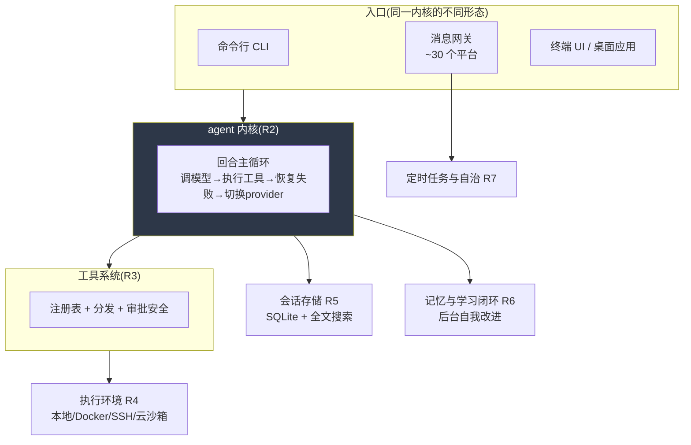

# r1 · hermes-agent 是什么 —— 一张进城地图,和一份为什么值得逐条读透的理由

> **读者定位**:你是有多年后端经验的工程师(Go / Java 背景都行),没读过 hermes-agent 的代码,
> 也不熟 LLM provider 生态和 Python 异步生态。读完这一章,你会知道:这个项目到底是个什么东西、
> 它由哪些部分组成、每部分大致干什么、以及后面的章节该按什么顺序读。这是《设计蓝图》的第一章,
> 也是全书的地图。
>
> **溯源约定**:后文出现 `路径:行号 @ 863e313` 的地方,指研究基线 commit `863e31318` 下
> hermes-agent 仓库根的相对路径与行号,可逐条复核。本章多为全局测绘,证据以规模数字和目录结构为主。

---

## TL;DR(读这一段就有全貌)

- **hermes-agent 是一个"个人 AI agent"框架**:同一个 agent 内核,同时以命令行、消息网关(Telegram/
  Discord/Slack 等 ~30 个平台)、终端 UI、桌面应用四种形态运行。它能跨会话学习、派生子 agent、
  跑定时任务、驱动真实终端和浏览器。
- **术语先锚一次**:这里的 **agent** 指"一个能自己决定调用哪些工具、循环执行直到完成任务的 LLM 程序";
  **harness**(马具/框架)指"包在 LLM 外面、让它能真正干活的那一整套工程"——调度循环、工具系统、
  会话存储、失败恢复、多平台接入等等。这本书学的就是 hermes 这套 harness。
- **规模**:全仓 8,530 个文件、260 万行文本。Python 是主体(核心逻辑),TypeScript 是界面层,
  剩下大量是技能文档、翻译、测试。真正的"harness 核心机制"约 48 万行(见下面的分层)。
- **为什么值得学**:它把"让 LLM 在真实世界里活下来"的工程做到了少见的密度——光是"模型返回空怎么办"
  就有六级恢复阶梯,光是"凭据过期"就有一套跨进程状态机。这些机制大多**没写进官方文档**,只存在于代码里。
- **怎么读这本书**:R2 讲"一轮对话内部怎么跑"(核心循环 + 模型接入),R3 讲"工具系统",
  R4 讲"代码在哪执行",R5 讲"会话怎么存",R6 讲"它怎么自我学习"……本章末尾给完整路线。

如果你只想要全貌,到这里就够了。想知道每个数字背后是什么、这本书凭什么可信,继续往下。

---

## 1. 从一个场景说起:你对着 Telegram 发了一句话

假设你在手机上给一个 Telegram 机器人发:"看看我服务器上的 nginx 日志,最近有没有异常。"接下来发生的事,
恰好把 hermes 的主要部件串了一遍:

1. **消息网关**收到这条消息。它是一个常驻进程,同时连着几十个聊天平台;它把 Telegram 的消息格式
   归一成内部格式,算出这属于哪个"会话",然后叫醒 agent 内核。
2. **agent 内核**开始一轮对话:把你的话 + 系统提示 + 历史记忆发给某个 LLM(你配的模型,可能是 Claude、
   GPT、或本地模型),拿回模型的决定——"我要调用 terminal 工具,在服务器上 grep nginx 日志"。
3. **工具系统**执行这个调用:因为工作目录配的是一台远程服务器,**执行环境层**通过 SSH 在那台机器上跑
   命令;命令要先过**审批和安全层**(这条命令危险吗?要不要问用户?)。
4. 命令输出回到 agent,agent 再发一轮给模型,模型这次给出文字总结。这轮的结果被**会话存储**写进本地
   SQLite 数据库(下次你接着聊,它记得)。
5. 如果这次任务够复杂,**学习闭环**会在后台悄悄 fork 一个 agent,琢磨"要不要把这次的经验存成一条记忆
   或一个技能"。
6. 总结通过网关发回你的 Telegram。

整个过程里,**同一个 agent 内核**被复用了——不管你从命令行、Telegram 还是桌面应用发起,内核是同一套。
这就是 hermes 的核心设计:**内核只有一个,形态有很多**。

---

## 2. 全景:七个部件如何拼在一起

七个部件对应后面的学习轮次:

| 部件 | 一句话职责 | 轮次 |
|---|---|---|
| **回合主循环 + 模型接入** | 一轮对话内部怎么跑:调模型、执行工具、扛住失败、多 provider 切换、省缓存 | R2 |
| **工具系统** | 工具怎么注册/发现/分发/限长/审批,包括让 LLM 写脚本直接调工具 | R3 |
| **执行环境** | agent 的命令在哪跑:本地、Docker、SSH、云沙箱七种后端 | R4 |
| **会话存储** | 对话怎么持久化、怎么恢复、怎么撤销、跨平台怎么接续 | R5 |
| **记忆与学习闭环** | 它怎么跨会话记住你、怎么自己创建和改进技能 | R6 |
| **网关 + 定时任务** | 多平台消息怎么路由、无人值守怎么定时干活 | R7 |
| **CLI / 界面 / 运维 / 研究管线** | 命令行、TUI、桌面、安装更新、批量数据生成 | R8-R11 |

---

## 3. 全仓地图:8,530 个文件都归了类

学一个 260 万行文本的仓库,最怕"黑洞"——某些文件从来没人交代过。所以这个学习项目的第一件事,是把
**每一个文件**都归进一个"学习层",各层行数加总必须等于全仓总行数,并用脚本校验。这样"学完"才有一个
可检验的定义:所有文件都不再是"未处理"状态。

五个层(`data/ledger.tsv` 台账,`scripts/verify_ledger.py` 校验)。**下表是当前值,不是历史快照**
——跑一次 `python3 scripts/verify_ledger.py /home/user/hermes-agent data/ledger.tsv` 就能复算出同样五行:

<!-- derived: ledger.L1.files ledger.L1.lines ledger.L2.files ledger.L2.lines ledger.L3.files ledger.L3.lines ledger.L4.files ledger.L4.lines ledger.LT.files ledger.LT.lines ledger.total.files ledger.total.lines -->

| 层 | 含义 | 文件数 | 行数 |
|---|---|---:|---:|
| **L1 机制精读** | harness 核心机制,要逐行读透、能凭笔记重实现 | 563 | 522,207 |
| **L2 结构级理解** | 支撑性代码,画得出结构、定位得到功能,不逐行 | 2,131 | 671,639 |
| **L3 知悉用途** | 内容型文件(技能文档、翻译、示例、文档站),编目即可 | 1,895 | 602,085 |
| **L4 有理由排除** | 生成物、锁文件、二进制、图片,不学习 | 560 | 55,902 |
| **LT 测试即规格** | 测试代码,当"行为说明书"随对应模块查阅 | 3,381 | 756,619 |
| | **合计** | **8,530** | **2,608,452** |

> **这张表会动,而且动的方向固定**:每一轮都会把一批文件从 L2 提到 L1(读进去才知道它是核心)。
> L1 的轨迹是 412(R1)→ 436(R6)→ 446(R7C)→ 461(R8A)→ 511(R8B)→ **563**(R8D),L2 相应递减。
> 早先本章印的是 R1 期那一版(412 / 382,770 与 2,282 / 811,076),**却以现在时陈述**——
> 一个照本章指引跑一遍校验脚本的读者会拿到两行对不上的数字,而没有任何线索告诉他哪个是当前值。
> 当时的修法(review-1 阻断-2 / M-2)是**换一份新手抄件**。**教训**:凡是能被脚本算出来的数,
> 正文就不该有第二份手抄件;抄了就得说清抄的是哪一天。
>
> **R11D 更正**:上面这段话把自己的教训写对了,却没有照它做。**原判**是「现已改为从台账取值」
> ——**撤销**:它写的是 R8B 那一版的手抄件(L1 511 / 479,923、L2 2,183 / 713,923),
> **六轮后原样复发**,而同一段还明写着「下表是当前值」。**依据**:`data/ledger.tsv` 复算真值为
> L1 563 / 522,207、L2 2,131 / 671,639,由此表推出的进度数错了六倍(见下一段的 R11D 更正)。
> 一份手抄件不带锚点,于是它**不在任何关卡的检查面上**:`verify_ledger.py` 只校验台账自身的守恒,
> `verify_citations.py` 只校验带锚点的引用。本轮把「从台账取值」由**承诺**改成**机制**:
> 表前那行 `<!-- derived: … -->` 声明这段有哪些可复算指标,`scripts/verify_derived_numbers.py`
> 每轮复算并逐个比对,对不上就阻断。

<!-- derived: ledger.inventoried.files ledger.inventoried.lines ledger.total.files ledger.processed.files -->

**分层之外还有一个数,而且它才是"进度"**:分层回答"这个文件属于哪一类",
**不**回答"它学过没有"。后者在台账的 `status` 列里,当前仍有 **5,944 个文件 / 1,495,470 行**
停在 `R1-inventoried`(= 只盘点过、没开工),即 8,530 − 5,944 = **2,586 个文件**被真正处理过。
L3 / L4 / LT 三层**自建账起一字未动**,所以**光看分层表会以为项目没在动,也读不出还剩多少**
(review-1 建议-21 / M-25)。

> **R11D 更正**:**原判**是「仍有 8,122 个文件 / 2,236,870 行停在 `R1-inventoried`,
> 即 408 个文件被真正处理过」,以及「L3 / L4 / LT 连续**五轮**一字未动」。**撤销理由**:
> 三个数都是随项目推进而移动的派生值,却以现在时写死;408 与真值 2,586 **差六倍**,
> 而这正是「全仓无黑洞」的**唯一可观测指标**。**依据**:`data/ledger.tsv` 复算
> `R1-inventoried` = 5,944 文件 / 1,495,470 行,8,530 − 5,944 = 2,586;
> L3/L4/LT 三层的文件数在台账**全部历史提交**里恒为 1,895 / 560 / 3,381,一次未变,
> 故「五轮」改为「自建账起」(复算命令与口径见 `reports/round-11d-pre-binding-prereq.md` §7)。

<!-- derived: ledger.LT.lines ledger.L1.lines -->

一个反直觉的数字:**测试(756,619 行)比核心机制(522,207 行)还多**。这不是坏事——它意味着几乎每个
机制都有一份可执行的"行为说明书"。本书的做法是把测试当规格读:讲一个机制时,顺带指出"这个行为被哪个
测试钉死了",读者自己跑那个测试就能验证。

按目录看,最大的几块:测试 65 万行、桌面/网页应用 32 万行(TypeScript)、文档站 27 万行、CLI 20 万行、
技能库 32 万行、agent 内核 13 万行、工具 12 万行、网关 10 万行。**核心逻辑集中在 Python**,界面在
TypeScript,内容(技能/翻译/文档)占了惊人的比例——这本身说明了 hermes 的定位:一个"能力靠边缘扩展、
内核保持窄"的框架。

---

## 4. 一个要提前知道的"坑":地图会骗你,代码不会

hermes 有一份非常详细的开发者文档(仓库根的 `AGENTS.md`,7.5 万字;还有一个文档网站)。它们是作者
自己画的地图,写得很用心。但**地图会过期**。这个学习项目定了一条铁律:**文档与代码冲突时,以代码为准**,
并把每一处冲突当作学习产出记录下来。

举一个已经查实的例子,让你感受这条铁律为什么重要:AGENTS.md 说 agent 的核心循环"在 `run_agent.py` 里,
带一个 one-turn grace call(预算耗尽时再给一次机会)"。实际读代码发现:(a)核心循环根本不在
`run_agent.py`,那里只是个转发器,真身在 `agent/conversation_loop.py`;(b)那个"grace call"标志位
`_budget_grace_call` 全仓库没有任何代码把它设为真——它是**死代码**,那个"再给一次机会"的分支永远不会
执行(`agent/agent_init.py:892 @ 863e313` 只初始化为 False,`agent/conversation_loop.py:1445 @ 863e313` 只消费为
False)。文档把一个从没生效的特性当现役描述。

第一轮全仓测绘就挖出了 **54 条这类文档-代码冲突**,还有 60 处"代码里有、文档只字未提"的暗机制。这些
不是要挑作者的错——恰恰相反,它们是**最有学习价值的部分**:文档讲的是"产品长什么样",代码讲的是
"它是怎么在真实世界里活下来的"。那些没进文档的东西——凭据过期的状态机、模型返回空的六级恢复、
把自己伪装成官方客户端绕过限流——才是一个成熟 harness 的真正内功。

---

## 5. 为什么值得逐条读透(而不是"看个大概")

如果只想"大概知道 agent 怎么工作",读三篇博客就够了。这本书的目标不是那个,是**能独立设计并实现一个
同级别的 harness**。达到这个目标,必须看清那些"平时不会想到、但真跑起来就撞上"的细节。三个例子:

- **模型会返回空**。不是偶尔,是弱模型在工具调用后的常态。hermes 对此有六级恢复:用已经流式吐出的部分
  内容、用上一轮的内容、合成一条提示推它继续、让它看到自己的思考续写、退避重试、切换到备用模型——每一级
  配一个"只触发一次"的守卫防死循环。你不读代码,永远想不到"空响应"要处理得这么细。
- **凭据会过期,而且刷新令牌是一次性的**。多个进程(命令行、网关、定时任务)共享同一份凭据文件,
  两个进程同时拿同一个刷新令牌去续期,输的那个会触发连锁失效。hermes 用跨进程文件锁 + "锁内先采纳后消费"
  解决——这是分布式系统的经典难题,出现在了一个"个人 agent"里。
- **prompt cache 是省钱的命脉**。长对话每轮复用一个缓存前缀能省约 75% 的输入成本,但缓存是逐字节匹配的,
  任何改写历史的操作都会让它从改动点整段失效。hermes 为此发明了"api_content 侧车"——把"发给模型的字节"
  和"给人看的转录"分开存,注入内容永远不污染缓存前缀。

这些机制单独看都不复杂,但它们的**存在本身**是你设计 harness 时最容易漏掉的。逐条读透的价值,就是把这些
"别人踩过的坑"变成你的默认认知。

---

## 6. 阅读路线

《设计蓝图》按机制簇分章,建议顺序即依赖顺序:

1. **R2 · 回合主循环与模型接入**(已成章):一轮对话从用户输入到最终回复的全过程——预算、三级用户介入、
   流式健康检查、多协议适配、凭据池、失败分类与故障转移、prompt cache、工具批次调度、空响应恢复、收尾。
   这是一切的地基,先读它。
2. **R3 · 工具基础设施**(本轮成章):工具怎么注册/发现/分发/限长/审批,让 LLM 写脚本直接调工具(execute_code),
   以及把外部 MCP 工具当不受信输入的全套防护。是 R2"执行一批工具"的上游。
3. **R4 · 执行环境**:七种终端后端如何统一抽象,后台进程、serverless 持久化、浏览器自动化。
4. **R5 · 会话状态与持久化**:SQLite 会话库、撤销/恢复、检查点、上下文压缩(与缓存的关系)。
5. **R6 · 记忆与学习闭环**:持久记忆、跨会话搜索、技能自创建/自改进、curator 生命周期。
6. **R7 · 网关、调度与后台自治**:多平台单进程、投递可靠性、定时任务。
7. **R8-R11**:CLI 与配置、研究管线、界面层、运维基建与文档全面对照。
8. **R12 · 综合**:把前面所有成品章装订成完整的《设计蓝图》。

每一章都独立可读(不用先读前一章也能懂),但按顺序读能顺着依赖关系建立完整心智模型。想要证据、
代码原文、更细的取舍讨论,每章末尾都指向对应的底稿 `notes/rN-*`——那里每个断言都配了行号。

---

## 7. 这本书怎么写、凭什么可信

三条方法约束贯穿全书:

- **每个断言配行号**。凡是说"hermes 这样做",后面跟 `路径:行号 @ 863e313`,你可以打开那个 commit
  的那个文件那一行自己核对。
- **测试当规格跑**。讲一个机制,顺带指出印证它的测试;这些测试用官方测试脚本真实跑过(R2 跑了 225 个、
  全过)。
- **文档冲突记录在案**。与作者文档冲突处,以代码为准并写明冲突,不替作者圆场。

基线固定在 commit `863e31318`(2026-08-06),整个学习项目不移动这个基线,保证所有行号长期有效。
hermes-agent 仓库全程只读——这本书是"读者笔记",不改动被研究的对象一个字节。

准备好了就翻到 R2,一轮对话的内部之旅从那里开始。
