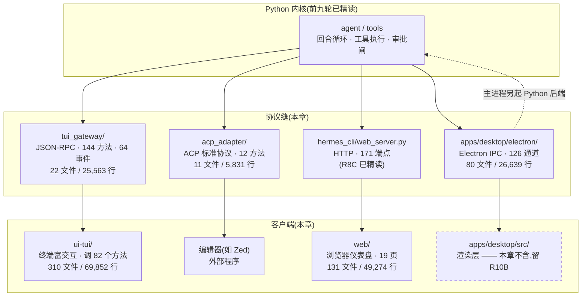

# r10 · 客户端接驳面 —— 一个 Python 内核如何长出四种界面

> **读者定位**:有多年后端经验(Go / Java 一类)、**没读过本仓库**、不熟 LLM provider 生态与
> 前端/Python 异步生态的工程师。本章不要求你翻底稿、不要求你看源码。
> **溯源约定**:关键断言给出 `路径:行号 @ 863e313`,单独成行、置于代码块之前;
> `863e313` 是本项目固定的基线 commit。
> **本章覆盖**:hermes-agent 的四条客户端通道及其协议缝(556 文件 / 191,657 行)。
> 桌面端的**渲染层**(`apps/desktop/src/`,816 文件)不在本章,留 R10B。

---

## TL;DR(快读路径)

1. **hermes 的内核是一个 Python 进程,它自己不画界面。** 界面有四种:终端 UI、编辑器、
   浏览器仪表盘、Electron 桌面端。每种都通过**自己的一条协议缝**接进同一个内核。
2. **四条缝的形状完全不同**:终端走 JSON-RPC(144 个方法)、编辑器走 ACP 标准协议(12 个方法)、
   浏览器走 HTTP(171 个端点)、桌面端走 Electron IPC(126 个通道)。
   **同一个能力在四条缝上有四个名字**,没有任何一层把它们统一起来。
3. **本章最重要的结论**:前几轮反复撞见的「守卫认的是工具名,不是效果」,在这里露出了它的下一层——
   **能力每多接出一条缝,守卫就要多写一遍,而没有人保证四遍写的是同一件事**。
   本轮在四条缝上各找到了一个反例。
4. **代价是具体的**:内核有 144 个 JSON-RPC 方法,终端客户端只调其中 82 个;
   **19 个方法全仓没有任何调用方**。这不是清理不及时,这是「缝越多、死代码越多」的必然。
5. **一个反直觉的发现**:这个项目自己维护了一份 React 终端渲染器**和一个纯 TypeScript 版的
   flexbox 布局引擎**(2,326 行)。不是造轮子,是为了绕开一个打包器死锁——理由写在 §3.4。

---

## 1. 从一个场景说起:你按下 Ctrl+C,然后网关重启了

设想你在终端里用 hermes。你开着一个会话,后台的 Python 网关进程崩了一次,又被拉起来了。
终端 UI 没退出——它检测到掉线,自动重连,界面上一切如常。

然后你发现:**再也收不到任何消息了**。界面还在,输入框还能打字,但模型的回复永远不出现。

这条 bug 的机制是这样的。终端客户端有一个「订阅」开关,只有它是打开的,收到的事件才会
被送到界面上;关着的时候,事件先攒进一个 2000 条的环形缓冲区。网关重启时,客户端会
把自己的状态清干净,包括把这个开关关掉:

`ui-tui/src/gatewayClient.ts:213 @ 863e313`

```ts
  private resetStartupState() {
    // Reject any in-flight RPCs left over from the previous transport
    // before we swap. Otherwise the old transport's stale exit/close
    // handlers (now identity-gated to ignore unrelated transports)
    // never fire `rejectPending`, leaving callers hanging on promises
    // attached to a discarded child / socket.
    this.rejectPending(new Error('gateway restarting'))
    this.ready = false
    this.subscribed = false
```

关掉是对的——旧连接的事件不该混进新连接。问题在于**谁把它打开回来**。
全仓只有一个地方会重新打开它:`drain()` 这个方法。而 `drain()` 在生产代码里
**只有一处调用**,写在界面挂载时跑一次的初始化里:

`ui-tui/src/app/useMainApp.ts:856 @ 863e313`

```ts
    gw.on('event', handler)
    gw.on('exit', exitHandler)
    gw.drain()

    // entry.tsx's setupGracefulExit handles process cleanup on real exit.
    return () => {
      gw.off('event', handler)
      gw.off('exit', exitHandler)
    }
  }, [gw, sys])
```

最后一行 `}, [gw, sys])` 是 React 的**依赖数组**——它的含义是「只有 `gw` 或 `sys` 变了,
这段初始化才重跑一遍」。而网关重启时,`gw` 还是同一个客户端对象(重启的是它连的那个进程,
不是它自己),`sys` 也没变。**于是这段初始化永远不会再跑,开关永远不会再打开。**

事件从此只进环形缓冲、不再出来。更糟的是,客户端本来有一套崩溃恢复逻辑
(重连后自动 `resumeById` 接回原会话),那套逻辑靠的也是事件——**它同样永远等不到**。

*(本条为静态代码链推演,主线独立复核了三个结构事实——关闭点、唯一开启点、依赖数组——
但**没有起真实网关实测**。见 §6。)*

**这条 bug 为什么值得放在开篇**:它不在内核里,不在协议里,而在**缝的客户端那一侧**。
内核完全正常,协议完全正常,重连也成功了。坏掉的是「客户端如何理解自己的生命周期」。
四条缝各有一套这样的客户端逻辑,而**它们互相不知道对方存在**。

---

## 2. 全景:一个内核,四条缝



四条缝的体量与形状:

| 缝 | 协议 | 接口面 | 谁在用 |
|---|---|---|---|
| `tui_gateway/` | JSON-RPC over stdio / WebSocket | **144** 方法 · **64** 事件类型 | 终端 UI、桌面端 |
| `acp_adapter/` | ACP(编辑器接入的行业协议) | **12** 方法 · **9** 种通知 | 编辑器,如 Zed |
| `hermes_cli/web_server.py` | HTTP + WebSocket | **171** 端点 | 浏览器仪表盘 |
| `apps/desktop/electron/` | Electron IPC | **126** 通道(110 `invoke` + 16 `send`) | 桌面端渲染层 |

**这四个数字是穷举出来的,不是抽样。** 本轮给 L2「结构级理解」定的判据里,
最要紧的一条就是:**可以不读实现体,但不能抽样接口面。**
144 这个数由三次互不通气的测量得到同一结果(静态扫描、运行时反射、客户端侧对账)。

---

## 3. 逐机制

### 3.1 缝一:终端的 JSON-RPC —— 144 个方法,82 个被用到

JSON-RPC 是最朴素的远程调用约定:一条消息说「调哪个方法、参数是什么」,一条消息回结果。
`tui_gateway/` 就是这么一层:它把内核的能力登记成 144 个方法名,终端 UI 通过管道或
WebSocket 调用它们。

有意思的不是它有 144 个方法,而是**终端客户端只调其中 82 个**。剩下 62 个里:
41 个由桌面端在调,**19 个全仓找不到任何调用方**。

这不是「忘了删」。这是**缝的数量本身造成的**:桌面端和终端共用这条缝,
于是这条缝必须是两者需求的并集;而当某个界面改版不再需要某个方法时,
**没有任何机制告诉这条缝「可以收回了」**。缝是加法的,不是减法的。

同一现象的极端版本是一整个模块的死亡:

`tui_gateway/render.py:10 @ 863e313`

```python
def render_message(text: str, cols: int = 80) -> str | None:
    try:
        from agent.rich_output import format_response
    except ImportError:
        return None
```

`agent/rich_output.py` **在这个基线里根本不存在**(主线三层搜索面复核:按文件名 `find` 零命中;
全仓 `.py` 里只有两个文件提到这个名字——`tui_gateway/render.py` 自己的三处 `try` 导入,
和它的测试文件把它 patch 成 mock)。于是整个 `render.py` 的主路径永久走 `except`,
四个调用点全部拿到 `None` 走回落。**模块还在、测试还绿、功能早已不存在。**

### 3.2 缝二:编辑器的 ACP —— 审批权第一次交给了外部程序

ACP(Agent Client Protocol)是编辑器接 agent 的行业标准。hermes 实现了它的服务端,
这样 Zed 这类编辑器可以直接驱动 hermes 的 agent。

这条缝有一个别的缝都没有的性质:**它把「要不要批准这次工具调用」的裁决权交给了外部程序。**
终端、浏览器、桌面端问的都是「用户点没点同意」,而 ACP 是把审批请求发给编辑器,
由**编辑器**决定怎么呈现、怎么回答。

代价出现在语义对不齐的地方。ACP 的权限模型里有「永久拒绝」这个选项,
而 hermes 把它映射成了一次性的拒绝——**持久拒绝在实现里根本不存在**。
用户在编辑器里点「以后都别问了,拒绝」,下一次照样问。

### 3.3 缝三与缝四:同一个能力,四个名字

把四条缝并排看,会看到本章最该记住的东西。以「触发一个定时任务」为例:

- 浏览器仪表盘走 `/api/cron/jobs/{id}/trigger`,**必须带 profile 参数**,由页面填好;
- 而另有一个 `/api/cron/fire`,给外部调度器用,**认的是一个 JWT**。

R8C 在两轮前就怀疑 `/api/cron/fire` 有问题,但它的移交项在四个 R9 轮次里**没有人处置**,
本轮才被认领结清。问题是这样的:那个 JWT 用**当前进程的配置**去验签,
验完之后拿到的声明(claims)**再也没有被用过**——不用来限定能动哪个任务。
而任务本身是**跨全部 profile** 搜出来的。于是:一个为 profile A 签发的令牌,
可以触发 profile B 的任务,而 B 的所有者从没同意过被这个调度器触发。

**认证和授权之间少了一次绑定**:验的是「谁在敲门」,没验「他能开哪扇门」。

前端侧本轮也查了:仪表盘上根本没有按钮会打 `/api/cron/fire`(三层独立搜索面确认)。
**这不是缓解,这是分工**——那条缝本来就是给外部程序用的,而外部程序不受界面约束。

### 3.4 为什么要自己养一个渲染器和一个布局引擎

`ui-tui/packages/hermes-ink/` 是项目自己维护的一份 Ink 分支(Ink = 用 React 语法写终端界面的
渲染器),里面还有一份 **2,326 行的纯 TypeScript flexbox 布局引擎**——
业界通常用 Facebook 的 yoga,而 yoga 是 C++ 编译成 WASM 的。

为什么要重写?**因为 WASM 版本带来一个顶层 await,而顶层 await 会让打包器生成的
异步模块初始化死锁。** 仓库里有回归测试守着这个死锁。换句话说:
**这 2,326 行不是为了性能,是为了打包形状。**

这个决定的代价被刻意框住了:自维护的求解器只需要覆盖这个项目实际用到的
49 个布局方法与 67 个样式键,而不是 yoga 的完整语义——有 8 个 API 是空实现。
**「重写一个引擎」听起来很重,而它实际上是「重写这个引擎里我们用得到的那一小块」。**

这一片还留下一条与技术无关的账:这份 fork 内嵌了上游的 MIT 代码,
**却没有任何许可声明**——主线全文搜索 `MIT License|Copyright (c)|SPDX-License|Licensed under`
在整个 `ui-tui/packages/hermes-ink/` 下**零命中**,没有 LICENSE 文件,
`package.json` 连 `license` 字段都没有。

---

## 4. 可迁移的设计原则

**(1) 缝是加法的,要给它配一把减法的尺子。** 144 个方法里 19 个无人调用,不是懒,
是缺少「谁还在用这个方法」的可观测性。造自己的 harness 时,
**在协议层记录每个方法的最后调用时间**,比事后 grep 有用得多。

**(2) 守卫要绑在收口点,不要绑在每条缝上。** 本轮在四条缝上各找到一个守卫不一致的实例。
根因不是哪个作者疏忽,而是**「每接一条缝就重写一遍守卫」这个结构本身**。
正确的落点是能力真正发生的地方(即将读一个路径、即将发一次请求、即将执行一段代码),
那里只有一处,四条缝自动都被覆盖。

**(3) 认证不等于授权。** `/api/cron/fire` 验了签名却没用签名里的声明去限权。
**凡是「验完就丢」的凭据,都要问一句:它验的是身份,还是权限?**

**(4) 客户端的生命周期是协议的一部分。** §1 那条 bug 里,协议、内核、重连全部正常,
坏的是客户端对「我重连之后处于什么状态」的理解。
**协议设计要把「重连后客户端该做什么」写进契约**,而不是留给每个客户端自己发挥——
这个项目有四个客户端,就有四种发挥。

**(5) 依赖可选,但失败要一致。** 一个缺失的可选依赖,在这个仓库里能产生两种完全不同的后果:
写在模块顶层的 `import` 让整个测试文件无法收集(**96 个用例静默不跑**),
写在函数体内的同一个 `import` 只让一个用例失败(**可见**)。
同一个缺失,一个响、一个哑。**可选依赖的检测应当收口到一处显式的能力探测**,
而不是散落成几十个 `import` 语句。

---

## 5. 地图与代码的出入

本簇共判定 ▲(文档与代码矛盾)**27 条**、◇(代码有文档无)**32 条**、◎(文档保守但为真)**7 条**。
挑三条最能说明问题的:

- **`AGENTS.md:445` 让读者去 `tui_gateway/server.py` 找「完整的方法/事件目录」**,
  而那里只有 144 条里的 21 条(14.6%),且根本不存在清单形态的东西。
  —— 文档把读者指向了一个不存在的目录。
- **`ui-tui/README.md` 说 TUI 不处理 PgUp/PgDn**,实际代码按半屏滚动处理;
  又说审批提示可以按 `o/s/a/d`,实际只认数字。—— 文档描述的是一个更早的版本。
- **一处文档与文档互相矛盾**:`acp.md` 说 ACP 会话只活在进程内存里,
  而同仓库的 `acp-internals.md` 说的相反。本轮首次遇到这种形态——
  以往的 ▲ 都是「文档 vs 代码」,这次是**地图自己和自己打架**。

---

## 6. 本章的限度(必须一起读)

1. **没有跑起来过。** 本章几乎所有结论都是静态阅读 + 机械枚举。
   §1 那条 bug、§3.3 的跨 profile 触发,都**没有在运行时复现**。
2. **桌面端的 490 个测试一个都没跑**(需要 Electron 运行时,本容器装不动)。
   §2 里桌面端那一列的结论,执行验证是**空白**的。
   终端与浏览器两侧跑通了:165 个测试文件 / 1,721 个用例通过 / 1 个跳过。
3. **ACP 的 SDK 没装**,所以那 12 个方法名的线上字符串是**推定**,不是第一手取证;
   它的 20 个测试文件里有 11 个因此无法收集。
4. **`apps/desktop/src/`(816 文件 / 190,301 行)不在本章**,桌面端只讲了主进程。

---

## 7. 延伸

底稿在 `notes/r10-raw-*.md`(九片,逐机制、逐文件、带行号证据):
协议骨架 `notes/r10-raw-tui-gateway-skeleton.md`、方法面 `notes/r10-raw-tui-gateway-methods.md`、
编辑器接驳 `notes/r10-raw-acp-adapter.md`、终端客户端 `notes/r10-raw-ui-tui-core.md` 与
`notes/r10-raw-ui-tui-components.md`、渲染器 `notes/r10-raw-hermes-ink.md`、
仪表盘前端 `notes/r10-raw-web-dashboard.md`、桌面主进程 `notes/r10-raw-desktop-electron.md`、
随附头文件处置 `notes/r10-raw-native-vendor.md`。
移交定案见 `notes/r10-90-handover-rulings.md`,测试口径见 `notes/r10-96-ts-suites.md`。
