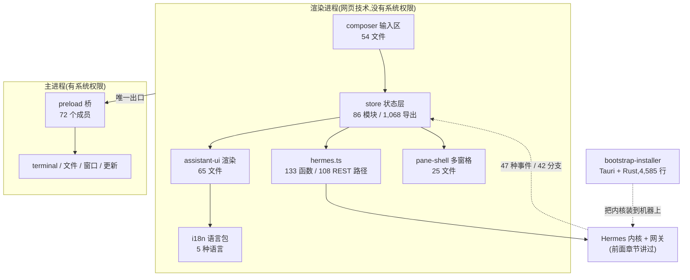

# r10b · 桌面应用 —— 当 harness 长出一个原生客户端

> **读者定位**:有多年后端经验(Go / Java 之类)、**没读过本仓库**、**不熟 LLM provider 生态与前端生态**的工程师。
> 不查外部资料、不看源码,读完能向别人复述每个机制。
> **溯源约定**:关键断言后给 `路径:行号 @ 863e313`,指向基线提交 `863e31318553cda8ad61df681d08175364d4164b`。
> 本章覆盖 `apps/desktop`(930 文件)、`apps/bootstrap-installer`(35)、`apps/shared`(12),
> 合计 **977 文件 / 214,245 行**。底稿见 `notes/r10b-*.md`。

---

## TL;DR(快读路径)

1. **这一章讲的是「同一个 agent 内核,如何长出第三张脸」。** 前面的章节讲过命令行(CLI)、
   终端界面(TUI)、网页仪表盘;这里是 **Electron 桌面应用** —— 一个把网页技术
   (HTML/CSS/JavaScript)装进原生窗口的框架。桌面端不是把网页壳套一层,
   它自己有 **86 个状态模块、133 个内核调用、72 个原生能力通道**。
2. **最值得学的一条:渲染层一次进程都不开。** 界面代码里搜不到任何
   「启动一个程序」的调用;要碰系统,必须穿过一座 72 个成员的桥,
   桥的另一端是主进程。**这条边界是桌面端安全性的全部本钱。**
3. **最值得引以为戒的一条:同一件事被写了两遍,两遍不一样。**
   计费重试策略在共享包里写了一份、桌面端又自造一份;错误文案的「穷尽检查」
   在共享包生效、在桌面端没生效;5 种语言里 4 种走构建期合并兜底、剩下 1 种不走。
   **本章的缺陷几乎全是这个形状。**
4. **安装器是整条链上最薄的一环。** 一个 Rust 写的引导程序,从网络取回一段要在
   用户机器上执行的脚本,**零完整性校验**;唯一叫 `verify` 的代码在验签失败时
   把文件重新自签一遍。
5. **本章也是本项目第一次把 L3(「知悉用途」层)读出一个数**。方法论意义见 §5。

**快读到此结束。** 下面每节都以「一次具体的走法」开场。

---

## 1. 从一个场景说起:你在桌面端敲下一句话

假设你打开 Hermes 桌面版,在输入框里打「帮我看看这个仓库的测试为什么挂了」,按下回车。

发生了什么:

1. **输入框**不是一个 `<textarea>`,而是 `apps/desktop/src/app/chat/composer/` 下 **54 个文件**
   组成的一套东西:斜杠命令补全、`@` 引用文件、粘贴图片、语音输入、草稿自动保存。
2. 你的文字进了**状态层** —— `apps/desktop/src/store/` 下 86 个模块中的若干个。
   这里用的是 nanostores(一个极小的状态库:每个变量是一个可订阅的「原子」)。
3. 状态层调用 `apps/desktop/src/hermes.ts`(1,820 行),它是**桌面端与内核之间唯一的说话人**:
   **133 个导出函数、108 个去重后的 REST 路径**。请求发给本机运行的 Hermes 网关。
4. 内核开始干活,把过程**以事件流推回来**:模型在想什么、调用了哪个工具、工具返回了什么。
   桌面端有一张 **42 个分支 / 47 种事件类型 / 落到 26 个 store 模块**的分派表。
5. 事件变成界面:`apps/desktop/src/components/assistant-ui/` 下 65 个文件负责把
   「一条助手消息」「一次工具调用」渲染成你看到的卡片。

**一次输入,穿过五层,每层都有自己的全表。** 本章的组织方式就是这五层,外加
「它是怎么被装到你机器上的」。

---

## 2. 全景



三件事值得先记住:

- **渲染进程与主进程之间只有一座桥。** 这是 Electron 的标准安全模型,而这个仓库确实遵守了它
  —— 界面代码里搜不到任何进程启动(证据见 §3.1)。
- **事件是单向推回来的。** 桌面端不轮询;内核推事件,状态层落库,界面重画。
- **安装器是独立的另一个程序**,用 Rust + Tauri 写(Tauri 是 Electron 的轻量替代品),
  职责只有一个:把 Hermes 装到这台机器上。

---

## 3. 逐机制

### 3.1 边界:渲染层不开进程,这是整个安全模型的本钱

**场景**:一个恶意的工具结果里带了一段 `rm -rf ~`,渲染层把它渲染成卡片。
它会被执行吗?

**不会,而且不是因为过滤,是因为渲染层根本没有执行的能力。**

主线在 `apps/desktop/src/`(816 文件)里搜过任何形式的进程启动:命中 17 处,
**逐条查过,没有一处是真的启动进程** —— 16 处是同一个本地工厂函数,它只返回一个描述符:

`apps/desktop/src/lib/desktop-slash-commands.ts:137 @ 863e313`

```ts
const exec = (): DesktopCommandSurface => ({ kind: 'exec' })
```

`surface: exec()` 的意思是「这条斜杠命令交给网关执行」,是一行元数据,不是一次执行。
剩下 1 处是一个叫 `spawn` 的**形参名**。

**要碰系统,只能走桥。** 渲染层用到的桥成员共 **72 个**(`window.hermesDesktop.*`),
包括 `terminal`(右侧栏那个真终端)、`openExternal`、`revealPath`、`uninstall` 等。

**可迁移的设计原则**:把「有能力做危险事」和「决定要不要做」放进不同的进程,
两者之间只留一个可枚举的接口。**这样「守卫装在哪」就有了唯一正确答案:装在桥的那一端。**
前面的章节反复看到守卫装错层的例子;桌面端在结构上让这件事变简单了。

*限定*:本章**没有**重读那 72 个通道各自的实现(它们在 `apps/desktop/electron/`,
是上一轮 R10 的范围)。R10 在那里记过一条:`fs:reveal` / `openDir` / `rename` / `trash`
四个通道绕过了统一的加固模块,同组另外 6 条都过了。
**边界画得好,不等于边界上每个门都锁了。**

### 3.2 状态层:86 个模块,和一次「软切换」漏掉的 12 个

**场景**:你在桌面端有工作和个人两个 profile(配置档),你从工作切到个人。
上一个 profile 的东西应该全部消失。

桌面端为此做了「软切换」:不重启进程,只清状态。**但它只清了 5 个 store,
剩下 12 个纯事件驱动的模块不清。** 其中 `$billingBlock`(计费拦截提示)最麻烦——
它的两条清除路径在切换后**同时失效**,于是变成一个擦不掉的悬挂状态。

这类问题的根源是一张**手工维护的清单**:哪些 store 要清,写死在一处;
新增 store 的人不会想到去改它。**与前面章节反复出现的形状一致:
守卫/清单是加法的,而人是会忘的。**

### 3.3 同一件事写两遍:本章缺陷的主形状

这一节把三个独立发现的缺陷摆在一起,因为它们是同一个模子刻出来的。

**(a) 计费重试:共享包一份,桌面端一份。**
`apps/shared/` 是桌面端与网页端共用的包,里面定义了「哪些错误可以安全重试」
以及一个关键标记 `reuseIdempotencyKey`(重试时是否复用同一把幂等钥匙——
幂等钥匙是防止「重试导致重复扣款」的标准手段)。**这个标记全仓零读取点。**
桌面端自己造了一份可重试清单,比共享包少两项。后果:某些错误下点「重试」,
会用**新铸的**幂等钥匙重发扣款请求——若首笔其实已经成功,就是重复扣款。

**(b) 错误文案:穷尽检查在一边生效,另一边没有。**
共享包的注释明写:把错误码定义成闭集,是为了让「漏了一个码」编译不过。
这个机制在共享包里确实生效了,在桌面端那份文案表里**没有** ——
24 个线上错误码有 8 个落到默认分支,其中 3 个因此丢掉了本该提示用户的恢复动作。

**(c) 语言包:4 种走兜底,1 种不走。**
桌面端支持 5 种语言。其中日文、繁中、阿拉伯文用一个叫 `defineLocale` 的辅助函数编写,
它在构建期把没翻译的键**自动用英文填上**:

`apps/desktop/src/i18n/define-locale.ts:39-41 @ 863e313`

```ts
export function defineLocale(overrides: TranslationOverrides): Translations {
  return mergeTranslations<Translations>(en, overrides)
}
```

**简体中文不走这条路**,它是一整个手写字面量:

`apps/desktop/src/i18n/zh.ts:5 @ 863e313`

```ts
export const zh: Translations = {
```

于是它缺的 20 个键**真的缺**。为什么类型检查不报错?因为那一段类型是个「开放桶」:

`apps/desktop/src/i18n/types.ts:262-263 @ 863e313`

```ts
    categories: Record<string, string>
    actions: Record<string, string>
```

`Record<string, string>` 的意思是「键名随便,值是字符串」——它对「少了哪个键」毫无意见。
后果:中文用户在「设置 → 快捷键」里会看到 `view.newTerminal` 这种**原始程序标识符**。

**三条合起来的教训**:当一份规则有两个实现,编译器只能保证**每一份内部**自洽,
不能保证**两份之间**一致。想让机器管住,规则必须只有一个实现,或者两份之间有一条
机器能检查的绑定。**这就是本章反复出现的那句话:「同一件事写了两遍,没人保证两遍一样。」**

### 3.4 供应链:安装器把信任交给了网络

**场景**:一台全新的机器,用户下载 Hermes 安装器,双击。

安装器(`apps/bootstrap-installer/`,Rust + Tauri,4,585 行)会**从网上取回一段安装脚本**
并在这台机器上执行它:

`apps/bootstrap-installer/src-tauri/src/install_script.rs:325-329 @ 863e313`

```rust
async fn download(kind: ScriptKind, commit_or_ref: &str, dest_path: &Path) -> Result<()> {
    let url = format!(
        "https://raw.githubusercontent.com/NousResearch/hermes-agent/{}/scripts/{}",
        commit_or_ref,
        kind.filename()
```

整个 crate 里搜 `sha256` / `checksum` / `signature` / `gpg` / `minisign` / `digest`:
**零命中**。也就是说,取回来的脚本**没有任何完整性校验**就被执行。

更值得看的是唯一一处叫 `verify` 的代码。它在 macOS 上检查签名,而**失败分支是重新自签**:

`apps/bootstrap-installer/src-tauri/src/paths.rs:142-152 @ 863e313`

```rust
    let verify = Command::new("/usr/bin/codesign")
        .arg("--verify")
        .arg(path)
        .status();

    if !matches!(verify, Ok(status) if status.success()) {
        let _ = Command::new("/usr/bin/codesign")
            .args(["--force", "--sign", "-"])
            .arg(path)
            .status();
    }
```

`--sign -` 是「用一个匿名的临时身份签名」。**这不是校验,是把校验的失败分支填平了。**
`let _ =` 连重签自己失败了也不管。

**可迁移的设计原则**:一段名字叫 `verify` 的代码,如果它的失败分支是「让失败消失」,
那它提供的不是保证,是**保证的外观**。审阅供应链代码时,先看失败分支,再看成功分支。

### 3.5 渲染分派表:5 行永远命不中

**场景**:内核调用了一个工具,桌面端要给它配一个图标和一句人话标题。

桌面端有一张工具名 → 展示信息的表,23 个键。**其中 5 个在内核的 82 个注册工具里根本不存在** ——
包括 `edit_file`(它还同时出现在「哪些工具算文件编辑」的清单里,驱动三条语义路径)
和 `session_search_recall`(内核那个叫 `session_search`,像是改名时漏跟)。

后果不严重(拿不到图标和本地化标题),但**它是一张手写映射表随时间腐烂的标本**:
两侧各自演化,没有任何机制在改名时把另一侧一起改掉。
**这是 §3.3 那个形状的第四个实例,只不过这次两份东西跨了语言(TypeScript 与 Python)。**

---

## 4. 可迁移的设计原则

给要造自己的 agent harness 的人,本章的六条:

1. **把危险能力关进另一个进程,只留一座可枚举的桥。** 桌面端 72 个桥成员是可以逐个审的;
   如果界面层能直接开进程,「审哪里」这个问题就没有答案了。
2. **一份规则只允许有一个实现。** 若做不到(客户端要离线判断、服务端要权威判断),
   就让两份之间有一条**机器能检查**的绑定——共享类型、生成代码、契约测试,三选一。
   本章四个缺陷全部出在「两份实现,零绑定」。
3. **开放式类型是编译器的弃权声明。** `Record<string, string>` 很方便,
   代价是这一段从此不受任何检查。用它之前先问:这一段将来会不会需要「两边键必须一致」?
4. **兜底机制要覆盖全部同类对象,否则它制造的是不均匀。** 4 种语言有兜底、1 种没有,
   比 5 种都没有更糟——因为没人会想到去查那一种。
5. **审 `verify` 先审失败分支。** 见 §3.4。
6. **「守卫装在收口点,不是装在每条缝的入口」**(这条继承自上一轮,本章给了正例):
   缝是加法的,守卫是手工的;把守卫下沉到所有缝汇合的那一点,新缝自动被覆盖。

---

## 5. 方法论:本项目第一次量出 L3 的成本

本项目把全仓 8,530 个文件分成五层:L1 逐机制精读、L2 结构级理解、
**L3 知悉用途**、L4 有理由排除、LT 测试。到本轮之前,**L3 一个文件都没读过**
——1,895 个文件 / 602,085 行,没有人说过「知悉用途」交付到什么程度算读过。

本轮把桌面端的 13 个 i18n 文件单独切成一片,并**先定义判据再动手**
(五条,见 `data/r10b/l3-criteria.md`)。核心一条是:
**L3 不要求穷举接口面(那是 L2 的要求),改要求「形态账」——
按形态分组、给出机械可复算的规模数、附上算它的命令。**
理由很实在:L3 会退化成的样子不是「读得浅」,而是**「我列了个目录」**;
目录谁都能列,「这个语言包有多少个叶子键、命令是什么」列不出来就是没打开过。

量出来的结果:**L3 每片的 token 成本是 L2 的 48%,每行 56%,工具调用 65%。**
但这个数**不能直接拿去排期**,理由见下一节。

---

## 6. 地图与代码的出入

本章各片合计记录 **▲(文档与代码矛盾)、◇(代码有文档无)、◎(文档为真但保守)、■(缺陷)** 若干,
逐条带锚点见底稿。这里只讲一条最能说明问题的:

**`apps/desktop/DESIGN.md:285` 写「每一个面向用户的字符串都经过 `useI18n()`」。**
这是一句全称断言,而整个计费页面、卸载区、自定义端点设置、computer-use 面板
全是硬编码英文。文档不是过时——它描述的是一条**从未被执行过的纪律**。

**判定这类断言时,本项目的规矩是「整句/整段一并判定」**:一句话讲三件事,
只证伪其中一件,不能把整句记 ▲。本章有两处正是这样被**降级或撤销**的:
一处「字面为真但显著保守」记 ◎ 而不记 ▲;另一处乍看矛盾、查完发现文档是对的,
**主动写进底稿备案**,防止下一轮重做一遍。

---

## 7. 延伸

- 逐片底稿:`notes/r10b-raw-*.md`(11 份,证据层,每条断言带行号)
- 范围、切片与 L3 判据:`notes/r10b-01-scope-and-criteria.md`、`data/r10b/l3-criteria.md`
- 主线独立复核:`notes/r10b-92-mainline-crosschecks.md`
- 测试口径:`notes/r10b-96-tests.md`
- 移交定案:`notes/r10b-90-handover-rulings.md`
- 本轮报告:`reports/round-10b-desktop-application.md`
