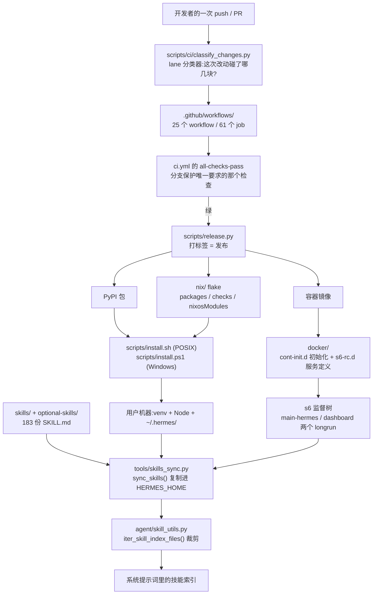

# r11a · 交付面 —— 从源码到一台跑着的机器,以及随它一起发货的知识库

> **读者定位**:你有多年后端工程经验(Go / Java 之类),**没读过这个仓库**,
> 也不熟 Python 生态与 LLM agent 的那一套。本章不要求你查任何外部资料、不看源码。
> **溯源约定**:凡关键断言,紧跟 `路径:行号 @ 863e313`(基线 commit `863e31318`),
> 锚点单独成行、置于代码块之前。

---

## TL;DR(快读路径)

1. 前面几章讲的是这个 agent **运行时**怎么工作。本章讲一件完全不同的事:
   **这堆源码怎么变成一台正在跑的机器**——被验证(CI)、被打包(发布 / Nix)、
   被装上去(安装器)、被看着别死(容器里的进程监督),以及**随它一起发货的技能库**。
2. **交付面是一条链,而链上每一环都被"写了两遍"**:POSIX 安装器与 Windows 安装器、
   CI 的 lane 分类器与真实文件名、文档里的承诺与代码里的常量。
   本章的每一个缺陷,几乎都是**同一件事写了两遍、没人保证一样**。
3. **CI 不是"跑测试",是一个分类器 + 一道门**:先判断这次改动属于哪些 lane,
   只跑相关的;最后由一个汇总 job 决定能不能合。**门里漏一个 job,那个 job 就等于不存在**。
4. **容器不是"跑一个进程"**:镜像里跑的是 s6 进程监督树,两个长驻服务各自有依赖与
   启动顺序。理解这一层,才知道"网关挂了"到底是谁在负责重启。
5. **技能库是发货内容,不是代码**:183 份 `SKILL.md` 会被复制进每个用户的家目录,
   被裁剪成一份索引塞进系统提示词。**它有成文规范,但没有仓库级强制**——
   于是作者本机的路径 `/home/bb/hermes-agent` 随货发到了每个用户手上。

---

## 1. 从一个场景说起:你敲了那行 `curl | bash`

官网让你敲的是这么一行(`scripts/install.sh` 文件头自陈的用法):

```text
curl -fsSL https://hermes-agent.nousresearch.com/install.sh | bash
```

**接下来发生的事,比"下载并解压"复杂得多。** 这个脚本 3,370 行,它要在
Linux / macOS / Android-Termux 上都能用,要判断你是不是 root(是的话换一套 FHS 目录布局),
要防止你从**另一个 Python 工具会话**里启动它时被继承来的 `PYTHONPATH` 污染,
要装一个 Python 包管理器(`uv`)、一个 Python 虚拟环境、还有一个 Node 运行时。

**其中一步会当着你的面自相矛盾。** 如果你机器上的 Node 版本不够新,它会打印:

`scripts/install.sh:853 @ 863e313`

```
        log_warn "Node.js $(node --version) is too old (Hermes requires Node >=26) — installing Hermes-managed Node $NODE_VERSION..."
```

"Hermes 需要 Node >= 26",然后它给你装的是:

`scripts/install.sh:60 @ 863e313`

```
NODE_VERSION="22"
```

**同一个文件里,消息说要 26,动作给 22。** 而这个文件自己在另一处写明了真实门槛
是 22.22——所以**动作是对的,话是错的**。这不是一个功能缺陷(你装完能用),
但它是本章反复出现的那个形态的第一个例子:**同一个事实被写在两个地方,然后其中一个漂了。**

> 术语锚定:**`uv`** 是一个 Rust 写的 Python 包管理器,可以理解成 `pip` 的快速替代品;
> **Termux** 是 Android 上的一个终端环境,可以在手机上跑 Linux 命令行程序;
> **FHS** 是 Linux 的标准目录布局(`/usr/local/bin` 那一套)。

---

## 2. 全景



**三条主干**:左边是"代码怎么被验证和发布",中间是"怎么落到一台机器上",
右边是"发货内容(技能库)怎么被 agent 看见"。三条在用户机器上汇合。

---

## 3. 逐机制

### 3.1 CI 不是"跑测试",是一个分类器加一道门

**场景**:你改了一行 Dockerfile 的注释。CI 应该跑什么?全部跑一遍要很久;
只跑 Docker 相关的又怕漏。

**这个仓库的答案是一个 lane 分类器。** `scripts/ci/classify_changes.py` 读这次改动碰了哪些文件,
映射成若干条 "lane"(可以理解成"关注面"),后续 job 各自声明自己属于哪条 lane。
分类器的设计倾向是**失败时朝"多跑"倒**——判不准就多跑,而不是少跑。

**但分类器认的是字面量,而字面量会漂。** 它这样描述"哪些文件算 Docker 相关":

`scripts/ci/classify_changes.py:46 @ 863e313`

```
_DOCKER_META = ("docker/", ".hadolint.yml", "Dockerfile") # docker setup
```

仓库根上那个文件**叫 `.hadolint.yaml`**,不是 `.yml`。唯一消费它的 workflow 也写 `.yaml`。
后果:**你改 hadolint 的规则,`docker-lint` 不会跑**——而 `docker-lint` 是唯一会读那份配置的 job。
一个静默的、只在"改配置"这个特定动作下才出现的覆盖洞。

**门是另一件事。** 分支保护只要求一个检查通过:`.github/workflows/ci.yml` 里的 `all-checks-pass`。
它靠 `needs:` 列出自己等哪些 job。`.github/workflows/ci.yml` 一共 20 个 job,门等 15 个。
差集里有一个 `infographic-check`——它的文件头明说自己存在的意义是
"被动的 ignore 规则强制不了策略,这个检查可以"。**但它不在门里。**
于是:违规的 PR 会让那个 job 变红,而分支保护要的那个检查**仍然是绿的**。

> 这里有一个**读数口径**要说清楚,因为两种数法都对:按"用 `uses:` 调子 workflow 的 job"
> 求差,缺口是 `docker` 和 `infographic-check` 两个;按"全部 job"求差,还会多出
> `ci-timings` 和 `comment-live` 两个内联的报告型 job。**不是矛盾,是两个总体。**
> `docker` 有一行注释交代为什么排除,`infographic-check` 没有。

### 3.2 容器里跑的不是一个进程,是一棵监督树

**场景**:你用官方镜像跑起来,网关进程崩了。谁重启它?

答案不是 Docker 的 `restart: always`,而是镜像里的 **s6-overlay**——一个轻量的进程监督
体系。它的配置不是一个文件,而是一棵目录树:每个服务一个目录,目录里用**文件名本身**
表达语义。`docker/s6-rc.d/main-hermes/type` 这个文件的**全部内容**就是一个词:

`docker/s6-rc.d/main-hermes/type @ 863e313`

```
longrun
```

> 术语锚定:**longrun** = 长驻服务(崩了要拉起来);**oneshot** = 跑一次就结束的初始化任务;
> **bundle** = 一组服务的集合,用来一次性启停。

这个仓库的监督树很小,而"小"本身是设计信息:

| 服务 | type | 依赖 |
|---|---|---|
| `docker/s6-rc.d/main-hermes/` | `longrun` | `base` |
| `docker/s6-rc.d/dashboard/` | `longrun` | `base` |
| `docker/s6-rc.d/user/` | bundle | — |

**两个长驻服务,彼此不依赖,各自只依赖 `base`。** 也就是说:仪表盘挂了不影响
主进程,反过来也一样;它们是**并列**的,不是主从。另有 `docker/cont-init.d/` 下的
初始化脚本在服务启动**之前**跑(修权限、和解 profile)。

**为什么值得单独讲**:很多人会把容器化理解成"把二进制塞进镜像"。
这里的选择是**在容器内部再建一层监督**,代价是多一套要学的目录约定,
收益是"一个容器里跑两个必须共存的服务"这件事有了标准答案,而不是靠 shell 脚本 `&` 拼。

### 3.3 发布:"制品"比你想的少

**场景**:你想验证下载到的东西没被掉包。

`scripts/release.py` 2,637 行,做的事情本质上是:检查干净、算版本、**打一个 git 标签**。
真正的构建与上传由 CI 在标签事件上完成。**它自己不产生任何校验和,也不做签名。**

顺着这条链再往下问一次:安装器下载 `uv` 的安装脚本和 Node 的 tarball 时校验了吗?
**只有 TLS,没有散列校验。** 整条链上唯一做哈希校验的环节是 `uv sync --locked`
——也就是 Python 依赖那一层,因为锁文件里带哈希。

**这是一个取舍,不是一个 bug**:多数发行渠道确实只靠 TLS + 上游仓库的完整性。
但把它写清楚是有用的:**如果你要照着造一个同级别的 harness,这就是你要么接受、
要么自己补上的那一段。**

### 3.4 一件事写两遍:两个安装器

POSIX 那份 3,370 行,Windows 那份(PowerShell)4,262 行。它们对用户承诺同一件事,
但**stage 名只在两处对得上**;`--no-skills`、`--skip-browser` 这些开关 Windows 侧
根本不存在;记录"你是怎么装的"那个标记文件只有 POSIX 侧会写。

**这不是懒惰**,两个平台的现实差别很大。但它意味着:**任何"安装器行为"的文档断言,
都必须说清是哪一个安装器**——而文档并不总是这么做(见 §5)。

### 3.5 随货发出的知识库

**场景**:你问 agent "帮我把这段 Python 用 debugpy 调一下"。它怎么知道该怎么做?

答案是**技能库**。仓库里有 183 份 `SKILL.md`,分成两棵树:`skills/`(内置)与
`optional-skills/`(可选)。它们不是代码——harness **不 import 它们中的任何一个**——
而是**发货内容**:被复制到用户家目录,再被裁剪成一份目录塞进系统提示词。

这条链的两跳:

`tools/skills_sync.py:675 @ 863e313`

```
def sync_skills(quiet: bool = False) -> dict:
```

`agent/skill_utils.py:877 @ 863e313`

```
def iter_skill_index_files(skills_dir: Path, filename: str):
```

第一跳把技能复制进 `HERMES_HOME`;第二跳走一遍目录,**只捡顶层的 `SKILL.md`**,
刻意跳过 `references/`、`templates/`、`assets/`、`scripts/` 这些支撑目录——
那些是"渐进披露"的数据,等 agent 真的用到某个技能时再读,不能一股脑塞进提示词。

**"有规范,但没人强制"是这里最重要的一句话。** 仓库里有一份"写技能的技能",
把哪些字段必填、哪些是惯例讲得比任何校验器都清楚。但**没有任何仓库级测试**去扫全部
183 份 `SKILL.md`。对比之下,隔壁 `optional-mcps/` 的清单文件**有**这样一个契约测试
("每一份 manifest 都必须能解析")。**同一个仓库里,一类发货内容有守门人,另一类没有。**

后果之一是可以直接看见的:作者本机的绝对路径 `/home/bb/hermes-agent` 出现在
**3 份会发到每个用户手上的 `SKILL.md`** 里,并且传染进了 6 份文档站页面
(3 份英文 + 3 份中文译本),共 **9 文件 18 处**。

后果之二更安静。类目说明 `DESCRIPTION.md` 要带一段 YAML front-matter 才会被读进索引:

`agent/prompt_builder.py:1741 @ 863e313`

```
                if not cat_desc:
```

`skills/` 下 16 份 `DESCRIPTION.md` 里,**15 份有 front-matter,1 份没有**——
`skills/apple/DESCRIPTION.md`。于是 apple 这个类目在系统提示词的索引里**没有描述行**,
其余全有。没有报错,没有警告,`continue` 一句带过。

> **这就是"知悉用途"这一层要交付的东西**:你不需要读完那 183 份技能的正文,
> 但你要知道它们是什么形态、有多大、谁读它们、缺一份会怎样。

---

## 4. 可迁移的设计原则

1. **让 CI 的门是"求差"出来的,不是手写的。** 手写的 `needs:` 列表必然会漏,
   而漏掉的那个 job 从此形同虚设、**且没有任何信号**。要么让门自动等所有 job,
   要么让"故意不进门"的 job 必须写明理由(这个仓库对 `docker` 做到了,对
   `infographic-check` 没有)。
2. **凡是"同一个事实写两遍"的地方,写一个测试把两遍对起来。**
   `.hadolint.yml` vs `.hadolint.yaml`、消息里的 Node 26 vs 常量里的 22、
   两个安装器的开关面——这三处都是一条断言就能钉死的。
3. **发货内容要有和代码一样的守门人。** 一个"扫全量、每份都必须能解析"的契约测试
   便宜到近乎免费,而它拦住的正是"作者本机路径随货发出"这类没人会 review 出来的东西。
4. **进程监督放在容器里是有代价的,但代价换来的是可表达性。**
   如果你的镜像只跑一个进程,不要引入 s6;一旦需要两个必须共存的服务,
   一套标准的服务目录约定比 shell 拼接可维护得多。
5. **区分"制品"和"标签"。** 如果你的发布脚本只是打标签,就别在文档里把它叫做
   "构建发布物"——读者会以为有校验和可以核对。

---

## 5. 地图与代码的出入

本簇定案两条(记号定义:▲ = 文档与代码**矛盾**;◇ = 代码有、文档无;■ = 代码缺陷)。

**▲-1 `[all]` 这个 extra 的名字与 README 给的理由都过时了。**
`pyproject.toml` 里有一段带日期的政策注释,明确列出 2026-05-12 从 `[all]` **移出**的东西:

`pyproject.toml:330 @ 863e313`

```
  # Removed from [all] on 2026-05-12 (covered by lazy-install):
  #   anthropic, exa, firecrawl, parallel-web, fal, edge-tts,
  #   modal, daytona, vercel, messaging (telegram/discord/slack),
  #   matrix, slack, honcho, voice (faster-whisper),
  #   dingtalk, feishu, bedrock, tts-premium (elevenlabs)
```

`voice (faster-whisper)` 白纸黑字在列。而 README 至今用"`.[all]` 会拉进
Android 不兼容的**语音**依赖"来解释为什么 Termux 要用另一个 extra。
**按整句判定**:前半句(Termux 上装 `.[termux]`)成立,后半句给的**理由**已作废,
而 "currently" 让它是一句现状断言。同一句话在 4 份 README 译本里各有一份。

顺带一个更基础的事实:`[all]` 递归展开只包含 **11** 个 extra,而仓库共定义 **45** 个。
**它的名字就是它最大的误导。**

**▲-2 Nix 的安装方式。** 平台支持表把 Nix 那一行的"安装方式"填成 `install.sh`;
而 `scripts/install.sh` 里 `nix` 的命中数是 **0**(三种数法都查过:
朴素匹配 0、词边界匹配 0,且文件里连 `unix` 都没有,不存在子串误伤)。

---

## 6. 延伸

- 底稿(证据层,逐文件逐机制):
  `notes/r11a-raw-install-release.md`(装机与发布)、
  `notes/r11a-raw-ci-and-container.md`(CI 与容器)、
  `notes/r11a-raw-skills-calibration.md`(技能库)。
- 主线复核与移交定案:`notes/r11a-92-mainline-crosschecks.md`、
  `notes/r11a-90-handover-rulings.md`。
- 本轮的方法学产出(L3 单位成本、排期推算)在 `reports/round-11a-ops-and-delivery.md`,
  不属于本章叙事。
