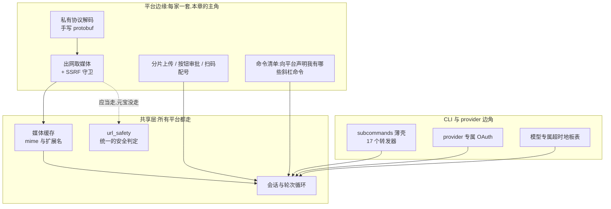

# r11b · 没人写的那一层 —— harness 边角上的欠账

> **读者定位**:有多年后端工程经验(Go / Java 背景亦可)、没读过 hermes-agent、
> 不熟 LLM provider 生态与 Python 异步生态的工程师。不查外部资料、不看源码即可读完。
> **溯源约定**:关键断言给 `路径:行号 @ 863e313`(863e313 是本项目锁定的基线提交)。
> 底稿见 `notes/r11b-raw-backlog-r7b.md` 与 `notes/r11b-raw-backlog-light.md`。

## TL;DR(快读路径)

1. **harness**(承载 agent 运行的那套外壳程序:管模型调用、工具执行、会话状态、
   对外接驳)有一层**没人写的边角**——每个平台的私有协议适配、CLI 的转发薄壳、
   某一家 provider 专属的 OAuth、某一族模型专属的超时表。它们不在架构图上,不在 README 里。
2. 本项目此前十轮写了十九章,**这 38 个文件一次都没被引用过**。台账把它们标成"已精读",
   而全部产出语料里**没有任何一条带行号的断言指向它们**——账面高于实交。
3. 补读之后,这 7,710 行里查出 **14 条代码缺陷**。**边角不是"简单所以没人写",
   是"没人写所以没人查"。**
4. 最典型的一条:**仓库自己写过一个安全工具函数来修某个 bug,三处调用点都换了,
   唯独最边缘的那个平台适配器手写了一份带原 bug 的版本**——而它是唯一一个会去公网取文件的。
5. 边角上反复出现的形态只有三种:**手抄的名单会漂**、**守卫装在了错的层**、
   **只有一个消费者的抽象等于搬家**。第 4 节把它们写成可迁移的判据。

---

## 1. 从一个场景说起:一条带图的消息进来

用户在腾讯元宝里给 agent 发了一张图,附一句"看看这个报错"。这条消息要走完这些步:

1. 元宝的 WebSocket 推来一帧**私有二进制协议**的数据 —— 不是 JSON,是 protobuf,
   而且官方没给 `.proto` 文件。
2. harness 解出里面的图片引用,得到一个 **URL**。
3. harness 拿这个 URL **出网下载**图片。
4. 下载下来的字节进**媒体缓存**,避免同一张图在多轮对话里反复下载。
5. 图片交给多模态模型;回复走回同一条 WS。

第 3 步是本章的引子。**"拿一个别人给的 URL 去下载"是 harness 最危险的动作之一**:
URL 来自外部,而 harness 跑在用户自己的机器或服务器上,那台机器能访问内网。
这类攻击叫 **SSRF**(Server-Side Request Forgery,服务端请求伪造):攻击者给你一个
指向 `169.254.169.254` 的链接——那是云厂商的元数据服务地址,能读出机器的云凭据——
你的服务端替他去取,再把结果送回给他。

hermes-agent 知道这件事,写了 `is_safe_url()` 来挡。**但挡在哪一层,决定了它挡不挡得住。**

---

## 2. 全景



图里那条虚线是本章最重要的一笔:**共享的安全判定就在那里,而最边缘的那个适配器
自己手写了一份。**

---

## 3. 逐机制

### 3.1 守卫装在错的层:一条永远不成立的 if

**场景**:回到第 1 节第 3 步。元宝适配器要下载图片,它给 HTTP 客户端挂了一个
"重定向守卫"——意思是:如果对方回一个 302 把我引到别处,我要重新检查新地址安不安全。

**它是这么判的**:

`gateway/platforms/yuanbao_media.py:229 @ 863e313`

```python
        if response.is_redirect and response.next_request:
```

这行读起来完全合理:**是重定向,并且已经算出了下一跳**,那就检查下一跳。
问题在于它挂在哪儿。这是一个 **httpx 的响应钩子**(httpx 是 Python 的 HTTP 客户端库;
钩子 = 每收到一个响应就调一次的回调)。**钩子跑的时候,客户端还没有算出下一跳**,
所以 `response.next_request` 是空的,整个条件**永不成立**,守卫从不执行。

**同一个仓库里有正确写法**,而且是专门为修这个问题写的:

`gateway/platforms/base.py:679 @ 863e313`

```python
    redirect_url = redirect_target_from_response(response)
```

它自己从响应头里解出 `Location` 再判,不依赖客户端有没有算好下一跳。
**平台基类、视觉工具、Slack 三处都换成了它,只有元宝手写了一份带原 bug 的版本。**

**为什么这条值得单讲**:这不是"忘了加守卫"——加了,写了,看起来在守。
**一个永不成立的条件,和一个不存在的守卫,在代码审查里长得完全不一样,在运行时完全一样。**
底稿用一个假的 HTTP 传输层实测复现了它:守卫打印 `SKIPPED`,最终请求落在
`169.254.169.254`。

**取舍要说全**:连接期还有一道守卫兜着直连场景,所以这不是一个随手可打穿的洞。
但那道守卫的工厂函数自己在文档里写明:走代理时,地址解析让位给代理——
**即"直连时我兜得住,走代理时兜不住"**,而重定向守卫本该覆盖的正是后者。

### 3.2 手抄的名单一定会漂

**场景**:relay(中继)通道要告诉平台"我这个网关支持哪些斜杠命令",于是有一份
**命令清单**:

`gateway/relay/command_manifest.py:1 @ 863e313`

```python
"""Gateway-declared slash-command manifest for the relay lane (Phase 4).
```

它的文档自称与原生 Discord 的命令树"名字相同、描述相同"。机械核对的结果是:
**27 对里 27 个名字全同,但有一条命令的描述文案不同。**

这不是什么大事故——直到你意识到:**这句"same names, same descriptions"是一句
没有测试的断言**,而把它变成测试只需要十几行核对代码。同一形态在本轮出现了三次:

- `hermes memory --help` 硬编码 7 个 provider,而目录扫描实测 **8** 个(漏了一个真 provider);
- `tools/computer_use/__init__.py` 的接线图列了一个**全仓不存在的文件**:

  `tools/computer_use/__init__.py:25 @ 863e313`

  ```python
  * `capture.py`    — screenshot post-processing (PNG coercion, sizing, SOM
  ```

  它描述的那段图片后处理逻辑,实际在另外两个文件里**各写了一份**——像是"拆分"这件事
  从来没发生,而图先画好了。

**判据**:凡是"这里的名单必须和那边一致"的地方,要么让一边由另一边生成,
要么写一个核对测试。**靠人对齐的两份名单,只会在你不看的时候分叉。**

### 3.3 薄壳层:回报在第二个消费者

**场景**:`hermes backup`、`hermes logs`、`hermes memory` ……这些子命令的参数定义,
被从一个 12,599 行的巨型 `hermes_cli/main.py` 里搬进了 17 个小文件,每个平均 60 行,
里面只有"把参数注册到 argparse"这一件事。

**看起来这只是文本搬家。** 如果 `hermes_cli/main.py` 是唯一的消费者,那确实就是搬家。

**真正的回报是它有第二个消费者**:Hermes Console —— 一个"受策展的、不是裸 shell"的
交互式命令行。Console 要显示每个命令的帮助文本,于是它用这些壳**临时搭一棵一次性的
参数树**把帮助抽出来,**完全不 import 那个 12,599 行的 `hermes_cli/main.py`**。
真要执行命令时才付那笔加载成本。

**判据(可迁移)**:**一个只有一个消费者的抽象,是搬家;有第二个形态不同的消费者,
才是解耦。** 判断要不要抽出来,不看"代码是不是变整齐了",看"有没有第二个消费者,
而且它需要的东西和第一个不一样"。

**如实说这层没做完**:包自述"每个子命令组都有自己的 builder",而主入口里仍内联着
16 个顶层组——自述的末句自己写着 "Phase 2",所以按整段读它勉强成立,但读者若只看首句
会以为已经拆完。

### 3.4 同一个仓库,两套 OAuth,选择相反且都对

**OAuth** 是"让用户在浏览器里登录第三方服务、把令牌交回给本地程序"的标准流程。
hermes-agent 里有两处要做这件事,做法完全相反:

- **MCP 那一侧**(MCP = Model Context Protocol,一套让 agent 接外部工具服务的开放协议):
  **全托给 SDK**。因为对手方是"任意一家"——用户可能接任何一个 MCP 服务器,
  事先不知道是谁,所以需要 **DCR**(Dynamic Client Registration,动态客户端注册:
  程序运行时才去对方那里注册自己、拿到 client_id)。
- **Honcho 那一侧**(一个记忆服务 provider):**手写 656 行**。因为对手方就是"一家",
  client_id 是固定的,端点是已知的,不需要 DCR,也不想为一个固定流程背一个 SDK 的依赖。

**判据(可迁移)**:**对手方是"一家"还是"任意一家",决定手写还是全托。**
这条比"能用库就用库"精确得多,而且可以在设计阶段就答出来。

### 3.5 一张表决定了会不会静默丢历史

**场景**:某些"推理模型"(先在内部想很久再输出的模型)在思考阶段可以几十秒不吐一个字。
harness 有个"多久没动静就算流断了"的判定,对普通模型合适,对推理模型太短。
于是有一张**超时地板表**:表里的模型,超时下限被抬高。

`agent/reasoning_timeouts.py:62 @ 863e313`

```python
_REASONING_STALE_TIMEOUT_FLOORS: tuple[tuple[str, int], ...] = (
```

**代价不在"超时短一点"**:不在表里的推理模型,会在长会话里踩到上下文压缩的分支,
**静默删掉对话历史**。也就是说,一张 30 行的静态名单,是"新上架的模型会不会
悄悄丢用户对话"的守门人,而**没有任何机制在模型上架时提醒你去更新它**。

**判据**:**当一张静态名单守着一个破坏性分支时,它需要的不是"记得更新",
是一个在名单失效时会响的东西**——哪怕只是一条"这个模型像推理模型但不在表里"的告警。

---

## 4. 可迁移的设计原则

1. **守卫要装在信息已经齐备的那一层。** 元宝那条 `if` 之所以永不成立,是因为它在
   "下一跳还没算出来"的时刻去读下一跳。设计守卫时先问:**我要判的东西,在这个回调
   触发的时刻存在吗?**
2. **同一个危险动作只留一份判定。** 仓库里已有 `redirect_target_from_response`,
   却仍有一处手写。**修一个安全 bug 时,要连同"还有谁手写了同一件事"一起搜。**
3. **手抄的一致性写成测试。** 名字/描述/provider 名单/环境变量名——凡是"两处必须相同",
   要么生成,要么核对测试。
4. **抽象的判据是第二个消费者。** 只有一个消费者的分层是搬家。
5. **静态名单守破坏性分支时,要有失效告警。**
6. **排障命令的崩溃姿态本身是设计题。** 本项目另一条移交项查的是 `hermes_cli/status.py`:
   它有 8 处无保护调用点,任何一处抛异常都会让整条 `status` 命令从中间断掉,
   前半段输出已经打出来了,后面接一段 traceback。**最需要能跑的那条命令,
   恰恰在环境不正常时最容易崩。** 正确姿态是每个探测块独立降级("✗ 无法探测"),
   而不是整条命令半途死掉。
7. **豁免名单要记录它豁免的理由。** 配置校验里有一份"开放字典"豁免名单,
   它让一个**没有任何读取点的顶层死键**免于告警,于是"用户写错了层级"和
   "用户在做自定义扩展"变成同一个无声成功。

---

## 5. 地图与代码的出入

本簇的 ▲(文档与代码矛盾)/ ◇(代码有文档无)/ ■(代码缺陷)定案共 26 条,
逐条证据在两份底稿。挑三条读者最该知道的:

- **▲**:文档称某个环境变量可以覆盖 QQ 的 portal 主机,但二维码 URL 模板**写死了生产域名**。
  于是在沙箱环境下,任务建在沙箱、二维码却指向生产——**一个"配置项存在但只生效一半"
  的经典形态**。
- **▲**:另一个 QQ 沙箱开关,文档里有、设置向导里有,**全仓没有任何读取方**。
- **■**:一个"文件过大"异常有类、有两处文档承诺、有一条 `except` 分支、有一个测试,
  **全仓没有任何地方抛出它**——而那个测试测的是异常对象的字符串,不是触发条件。
  **一个永远不会发生的错误,配了一个永远会通过的测试。**

还有一条不在 hermes-agent 里、而在本项目自己身上,值得写进这一章:
**基线代码里写在注释中的三条 `路径:行号` 交叉引用,本轮核对三条全漂**,
其中一条从声称的 `:3464` 漂到实际的 `:5386`。
这是**别人的仓库**为"引用必须机械校验"这件事提供的独立证据——
本项目对自己的引用跑校验器,而没有校验器的地方,引用就是这个下场。

---

## 6. 延伸

- 底稿:`notes/r11b-raw-backlog-r7b.md`(R7B 12 文件,10 个机制簇)、
  `notes/r11b-raw-backlog-light.md`(R2/R4/R6/R8B 26 文件)。
- 平台接驳的主干在第十一章 `chapters/r7b-platform-integration.md`;本章是它的边角补遗。
- CLI 主干在 `chapters/r8b-cli-trunk-and-interaction.md`;§3.3 的薄壳层是它的下一层。
- 这 38 个文件为什么会漏、怎么被发现、怎么保证不再漏,见本轮报告
  `reports/round-11b-review-and-reconciliation.md`。
