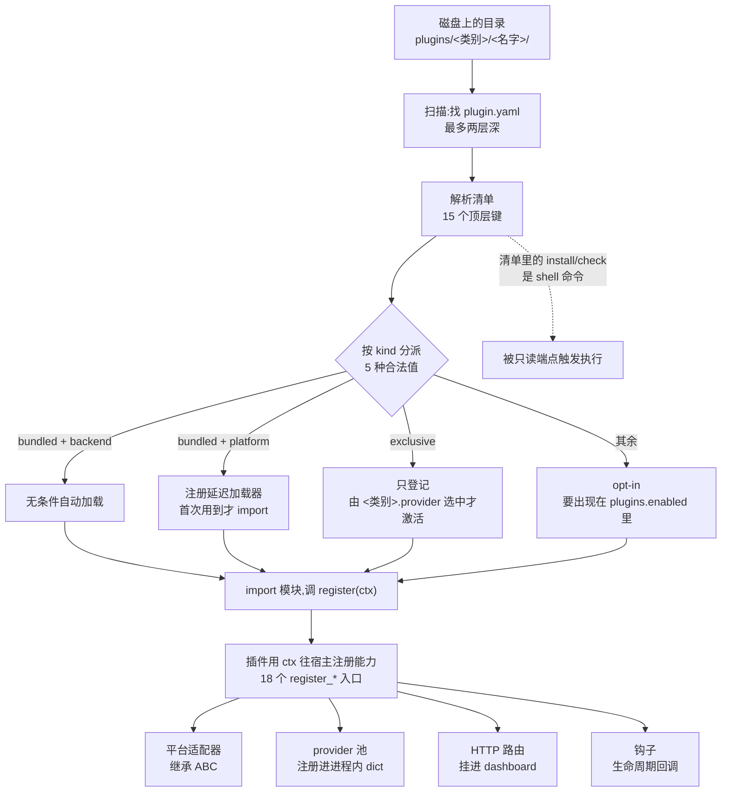

# r11f · 插件面 —— 一个能力怎么接进来,又怎么悄悄失联

> **读者定位**:有多年后端经验(Go / Java 背景亦可)、没读过本仓库、不熟 LLM provider 生态与
> Python 异步生态的工程师。不查外部资料、不看源码即可读完。
> **溯源约定**:`路径:行号 @ 863e313` 指基线 commit `863e31318` 下 hermes-agent 仓库根的相对路径与行号。

## TL;DR(快读路径:读这一段就有全貌)

**hermes-agent 的"插件"是一个目录 + 一份 `plugin.yaml` 清单**,宿主扫目录、读清单、
按 `kind` 决定加载策略,插件在被加载时往宿主注册能力。243 个文件、22 个平台、
63 份清单构成本仓库最后一块未开工的结构层。

**最重要的一个结论**:这套插件面用**三种不同的载体**表达"契约",而**只有一种有强制力**。
抽象基类(ABC)那一种编译期就逼你实现——22 家平台适配器对 4 个抽象方法**零缺口**;
清单声明那一种**没有任何校验**——10 份清单写的 `hooks:` 键,加载器压根不读它;
命名约定那一种**会过期而无人知**——一份手写的文件镜像清单漏掉了两个后来才拆出的模块。

**第二个结论**:`plugin.yaml` 不只是数据,**它是一个可执行面**。清单里的
`install` / `check` 字段是 shell 命令,会被真的执行;触发它的是一个**只读的 GET 端点**,
而且**不看插件有没有被启用**。

**第三个结论**:同一个 harness 里,"接入一个平台"有**两条互不知情的路径**——
网关侧的插件适配器,和模型工具侧的发送工具。它们可以对同一个平台给出不同的答案。

**取舍主线**:这套设计用"清单 + 约定"换取了插件作者的自由度(不必继承任何东西就能挂进来),
代价是**声明与事实之间没有守卫**,而失联是静默的。

---

## 1. 从一个场景说起:一个声明了钩子的插件,什么都没发生

你在写一个记忆后端插件,想在"上下文压缩前"做点事。你查了仓库里已有的插件,
照着 `byterover` 的清单抄:

`plugins/memory/byterover/plugin.yaml:4 @ 863e313`

```
external_dependencies:
  - name: brv
    install: "curl -fsSL https://byterover.dev/install.sh | sh"
    check: "brv --version"
hooks:
  - on_pre_compress
```

看起来很合理:声明一个 `hooks` 列表,写上钩子名。你部署,压缩发生,**你的钩子没被调用**。
没有报错,没有警告,`hermes plugins list` 说你的插件加载成功了。

三件事同时在起作用,任何一件单独看都不像 bug:

1. **加载器根本不读 `hooks` 这个键**。它读的是另一个名字:

   `hermes_cli/plugins.py:1664 @ 863e313`

   ```
                   provides_hooks=data.get("provides_hooks", []),
   ```

   全仓 97 份清单里,写 `provides_hooks` 的有 **0 份**;写 `hooks:` 的有 **10 份**。
   **声明面两头落空**——写的那个没人读,读的那个没人写。

2. **真正能用的钩子注册走代码**,不走清单:插件在加载时调用宿主给它的
   `ctx.register_hook(...)`。仓库里实际生效的 16 个钩子全部是这么注册的,
   而且与清单里的声明**恰好一致**——所以功能一直是好的,**没人发现清单是死的**。

3. 运行时确实有一道钩子名的闸,但它只管代码注册那条路:

   `hermes_cli/plugins.py:1186 @ 863e313`

   ```
           if hook_name not in VALID_HOOKS:
               logger.warning(
   ```

   而 `on_pre_compress` **根本不在** `VALID_HOOKS` 的 24 个合法值里。
   它是一个**错的钩子名**,写在一份**没人读的键**下面——于是这个错误从写下的那天起
   **从未被任何东西发现过**。

**这就是本章要讲的东西**:一个死掉的声明面,不只是"没用",它还会**藏住真错误**。

---

## 2. 全景:一个插件从磁盘到生效



三件事值得先说清楚:

**"清单"(manifest)** 是插件根目录下的 `plugin.yaml`,声明这个插件叫什么、属于哪一类、
需要哪些环境变量。全仓 97 份,共用 15 个顶层键。

**`kind`** 是清单里决定加载策略的字段,合法值只有 5 个:

`hermes_cli/plugins.py:280 @ 863e313`

```
_VALID_PLUGIN_KINDS: Set[str] = {"standalone", "backend", "exclusive", "platform", "model-provider"}
```

**`ctx`(PluginContext)** 是宿主在加载插件时递给它的一个对象,上面挂着 18 个
`register_*` 方法。**插件能对宿主做的一切,都在这 18 个方法里**——这是一个设计得很干净的边界。

---

## 3. 逐机制

### 3.1 发现:两层深,第三层永远看不见

宿主扫描插件目录时支持两种布局:`<root>/<名字>/plugin.yaml`(扁平)与
`<root>/<类别>/<名字>/plugin.yaml`(分类)。分类那一层自己不需要清单。

代价写在一行 `continue` 里:

`hermes_cli/plugins.py:1568 @ 863e313`

```
            if depth >= 1:
                logger.debug("Skipping %s (no plugin.yaml, depth cap reached)", child)
                continue
```

**三层及以上的目录永远发现不到**,而且只在 debug 日志里说一声。对一个把插件按
`<厂商>/<产品>/<变体>` 组织的用户来说,这是一个需要读源码才能知道的限制。

**一个真实的踩坑**(片 F 实跑复现):跳过表里漏了 `cron_providers` 这个类别目录,
于是 `cron_providers/chronos` 被当成了一个**扁平布局的插件**发现出来,`kind` 被判成
`standalone`。你把它写进 `plugins.enabled`,加载时它去调一个 `ctx` 上不存在的方法,
抛出 `'PluginContext' object has no attribute 'register_cron_scheduler'`。
一个目录**分类方式**的疏漏,表现成了一个**属性不存在**的运行时错误。

### 3.2 契约的三种载体 —— 本章的主线

把 243 个文件读完之后,最值得带走的一张表是这个:

| 载体 | 长什么样 | 有没有强制力 | 实测 |
|---|---|---|---|
| **抽象基类** | `@abstractmethod`,不实现就实例化不了 | **有**。Python 在实例化时就拦住你 | 22 家适配器 × 4 个抽象方法 = **零缺口** |
| **清单声明** | `plugin.yaml` 里的一个键 | **没有**。写错、写了没人读,都不会有任何提示 | `hooks:` 10 份在写 0 行在读;`platforms:`、`provides_browser_providers:` 同型 |
| **命名约定** | 宿主按名字去插件那里 `getattr`,或一份手写清单 | **没有**,而且**会过期** | 35 个鸭子钩子不在基类上;一份镜像清单漏了 2 个模块 |

**为什么 ABC 那一栏这么整齐。** 平台适配器基类有 126 个方法,但只有 **4 个**是抽象的:

`gateway/platforms/base.py:2629 @ 863e313`

```
class BasePlatformAdapter(ABC):
```

片 A 的探针对这个类做 AST 统计:**126 个方法,其中 4 个 `@abstractmethod`,18 个类属性**。

其余 122 个都带默认实现。这是个**好设计**:抽象方法定义"不实现就没法工作"的最小集
(连接、断开、发送、取会话信息),而 122 个带默认实现的方法定义"你可以覆写来变得更好"。
22 家平台对 4 个抽象方法零缺口,不是因为大家自觉,是因为**不实现就跑不起来**。

**命名约定那一栏为什么会过期。** photon 这个平台带一个 Node.js 边车进程。
安装树可能是只读的,所以宿主要把边车文件**镜像**到一个可写目录再跑。镜像哪些文件,
写在一个手写的元组里:

`plugins/platforms/photon/sidecar_paths.py:51 @ 863e313`

```
_MIRROR_FILES = (
    "index.mjs",
    "package.json",
    "package-lock.json",
    "patch-spectrum-mixed-attachments.mjs",
)
```

而 `index.mjs` 实际 import 了四个本地模块,其中 `send-format.mjs` 与 `stream-staleness.mjs`
**不在这个清单里**。只读安装树下,镜像目录里的 `index.mjs` 会去 import 两个不存在的文件。

**这个故事的因果很清楚**:清单最后一次修改,早于那两个模块被拆出来的日期。
拆模块的人没有理由知道另一个文件里有一份手抄的名单。而**测试抓不到**——
测试走的是源码树路径,根本不经过镜像那条分支。

> **可迁移的教训**:凡是"一份手写的名单,内容必须与代码的真实依赖一致",
> 都应该改成从代码算出来,或者加一条断言把两者对上。手写名单没有过期提醒。

### 3.3 平台适配器:一个契约,22 种实现,三种交互模型

三个最大的适配器(Discord 10,717 行 / Telegram 10,541 / Slack 9,824)在**接口面上完全一致**:
同样 4 个抽象方法、同样 16 个注册键、同样 8 个清单顶层键,**零差异**。

分歧全在两个地方:

**一是能力协商**——覆写哪些带默认实现的方法。基类用类属性声明能力开关,例如
`splits_long_messages`(平台是否需要宿主帮忙切长消息)。适配器通过覆写这些开关和方法
告诉宿主"我能做什么",而不是通过实现一个更大的接口。

**二是平台侧的交互注册**,三家用了三种完全不同的模型:Discord 用 27 个装饰器逐个声明斜杠命令;
Telegram 把命令表**投影**成 handler;Slack 用一条正则统一分发。同一个宿主契约下,
这三种做法都成立——因为宿主根本不管你在平台那侧怎么组织。

**一个安全性对比**,同一个仓库内部的两种写法:

企业微信要校验回调签名。它这么比:

`plugins/platforms/wecom/wecom_crypto.py:90 @ 863e313`

```
        if expected != msg_signature:
            raise SignatureError("signature mismatch")
```

裸 `!=` 比对签名,理论上可被时序攻击逐字节恢复。而**同一个仓库**里,dashboard 的认证插件
用的是常量时间比较,并且注释写明了理由:

`plugins/dashboard_auth/basic/__init__.py:162 @ 863e313`

```
    return hmac.compare_digest(actual, expected)
```

**这个仓库知道正确写法**。这不是"团队不懂",是"一个横切要求没有落在每一个触发点上"——
而这恰恰是没有守卫的横切策略的典型失败形态。

### 3.4 清单不是数据,是可执行面

回到第 1 节那份 byterover 清单。`external_dependencies` 里的 `install` 字段是这么一行:

`plugins/memory/byterover/plugin.yaml:6 @ 863e313`

```
    install: "curl -fsSL https://byterover.dev/install.sh | sh"
```

这不是描述,**它会被执行**。消费侧用 `shlex.split` 跑 `check`,用 `shell=True` +
`/bin/bash` 跑 `install`。

关键在**触发条件**,片 F 实跑测得三条:

- 触发它的是 **`GET /api/memory` 这类只读端点**——一个语义上"只是查询"的请求;
- 它对**每一个被发现的 provider** 都跑,**不看 `plugins.enabled`**——没启用的插件也算;
- "这个目录是不是一个 memory provider",判据是**嗅探 `__init__.py` 前 8 KiB 的文本**。

三条叠起来:**往插件目录放一个文件,就能让一个只读请求执行任意 shell**。
这里不展开利用面(那属于代码缺陷复核轮的工作),但作为**设计教训**它很清楚:

> 一个字段一旦会被 `exec`,承载它的文件就不再是配置,而是代码;
> 而"发现"是比"启用"宽得多的一个集合。**把执行挂在发现上,等于取消了启用这道开关。**

### 3.5 多 provider 池:同一形态,两个域给出不同答案

生图、生视频、浏览器这三类能力都是"一个能力,多个第三方后端"。宿主为每类维护一个
进程内注册表,配置项 `<类别>.provider` 指定用哪个:

`agent/image_gen_registry.py:99 @ 863e313`

```
            raw = section.get("provider")
```

**但两个域的工具行为不一致**:生视频的工具会去问注册表要"当前活动的 provider";
**生图的工具从不问**——`image_gen.provider` 没设时,它根本不碰注册表。
同一套注册表机制,两个域两种用法,而文档描述的是其中一种。

这类不一致是 L2 层最容易漏掉的:**每个域单独看都自洽**,只有把同形态的几个域摆在一起
才看得出来。这也是本轮把同形态插件切进同一片的理由——接缝表要能横向对比。

### 3.6 web 面插件:把路由挂进别人的服务器

kanban 与 achievements 这类插件不接平台,它们往宿主的 web 服务器里**挂路由**:
两家合计 51 条(GET 22 / POST 17 / DELETE 5 / PATCH 4 / PUT 1 / WEBSOCKET 1),
其中不乏破坏性操作:

`plugins/hermes-achievements/dashboard/plugin_api.py:1042 @ 863e313`

```
@router.post("/reset-state")
```

它清空解锁记录并作废快照缓存。

**鉴权在哪一层**:宿主有一份免鉴权路径名单(8 条),`/api/plugins/*` **不在其中**——
也就是说插件路由默认是要鉴权的。这是个正确的默认方向:插件挂进来的路由,
**默认继承宿主的保护**,而不是默认公开。

---

## 4. 可迁移的设计原则(造你自己的插件系统时怎么做)

**(1) 给每一个声明面配一个消费方断言。** 本章最贵的三个缺陷全是同一形态:
声明存在、消费方不存在或读的是别的名字。修法不是"更仔细地写文档",
是**启动时把清单里的每一个键与已知键集对一遍,未知键就报警**。
代价是插件作者不能随便加自定义键——那正是你想要的约束。

**(2) 契约要么可执行,要么会过期。** ABC、schema 校验、启动断言都属于"可执行的契约";
文档、注释、手写名单属于"会过期的契约"。两者都可以用,但**必须知道自己在用哪一种**——
用了会过期的那一种,就要配一个定期核对的机制。

**(3) "发现"和"启用"是两个集合,别把副作用挂在前者上。** 发现是为了让用户看见有什么可选,
它应该是**纯读**的。任何有副作用的动作——装依赖、跑检查、建连接——都该挂在启用之后。

**(4) 抽象方法的数量要吝啬,默认实现的数量可以慷慨。** 126 个方法里只有 4 个抽象,
换来的是 22 家实现零缺口。抽象方法定义"不做就不能工作"的最小集;其余用带默认实现的
方法 + 能力开关表达,让插件**按需覆写**。这比一个 30 方法的大接口友好得多,
也比"什么都可选"更安全。

**(5) 横切要求要么装在收口点,要么每个触发点都声明它是有意的。** 签名比对该用常量时间——
仓库里有一半地方做了,一半没做。没有守卫的横切策略,覆盖率只会随时间下降。

**(6) 同形态的多个实例要放在一起审。** 生图与生视频的不一致、22 家适配器的能力差异,
单看任何一个都发现不了。设计评审时把"同一形态的所有实例"列成一张横表,
差异会自己跳出来。

---

## 5. 地图与代码的出入(本簇定案)

本簇合计:**■ 代码缺陷 13 条**;**地图级 ▲ 5 条**(其中 `website/docs` 来源 3、
插件自身 `README.md` 来源 2);**▲(码内)7 条**;**◇ 5 条**;**◎ 1 条**。

*计数口径说明:▲ 只计"字面为真则不算"的真矛盾;模块 docstring 与代码注释的矛盾单列
▲(码内),与地图级分开计数,以保跨轮可比。插件自身的 `README.md` 本轮**计入地图级**,
但按来源分两行报——它确实是作者写给读者的地图,但它与 `website/docs` 的腐烂方式不同。*

三条最值得记住的:

- **▲**:生图 provider 的开发文档说"工具向注册表要活动 provider",而实测生图工具
  在配置未设时**根本不碰注册表**。同一份文档描述的行为,在隔壁的生视频域是对的。
- **▲(码内)**:一份 docstring 声称五个交互方法**都会抛异常**,实际是三抛两返 `None`。
  若真按 docstring 那样全抛,会炸掉调用它的 cookie 验证循环——**注释比代码更危险**。
- **◇**:13 个"鸭子契约"名字(宿主按名字去插件那里取的方法)**没有任何一份文档列全**。
  它是本章 3.2 那一栏"命名约定"的直接后果。

---

## 6. 延伸

底稿(逐机制、逐文件、带机械枚举命令与条数):

- `notes/r11f-raw-a-platforms-big3.md` —— Discord / Telegram / Slack,契约面收敛性与三种交互模型
- `notes/r11f-raw-b-platforms-enterprise.md` —— 飞书 / Matrix / Google Chat / 企业微信 / 钉钉,入站验证面
- `notes/r11f-raw-c-platforms-longtail.md` —— 其余 14 家平台的横向契约表,photon 边车镜像
- `notes/r11f-raw-d-dashboard-plugins.md` —— HTTP 路由面 51 条、鉴权面、前端产物面
- `notes/r11f-raw-e-media-plugins.md` —— 多 provider 池的注册与选择规则
- `notes/r11f-raw-f-longtail-and-plugin-core.md` —— **插件系统公共面**:发现、加载、清单契约
