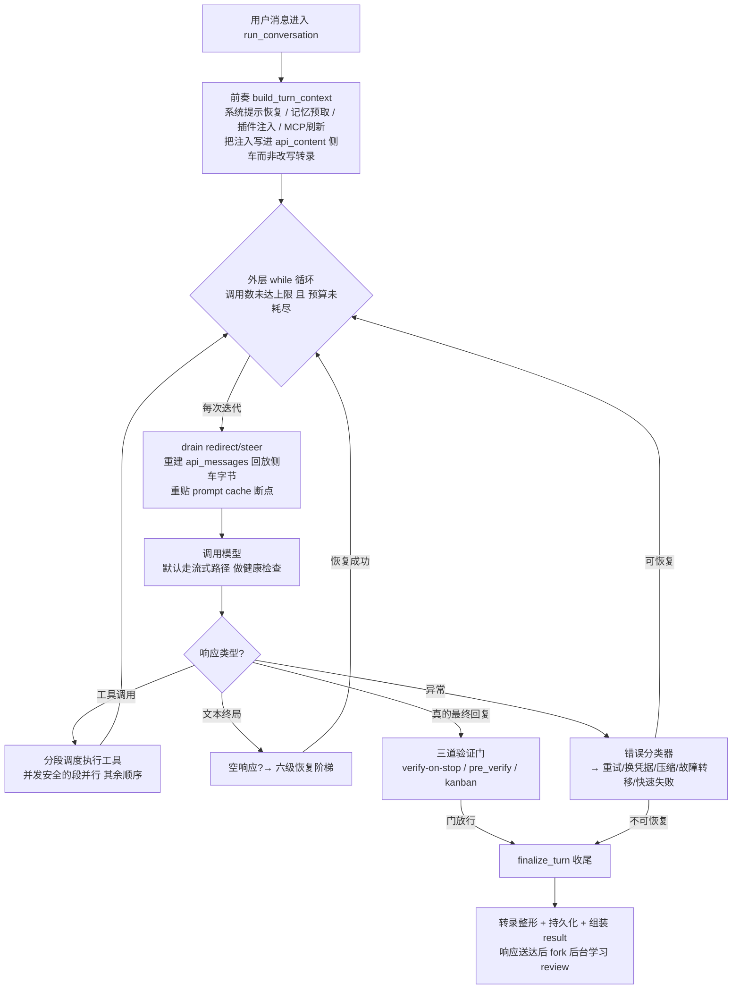
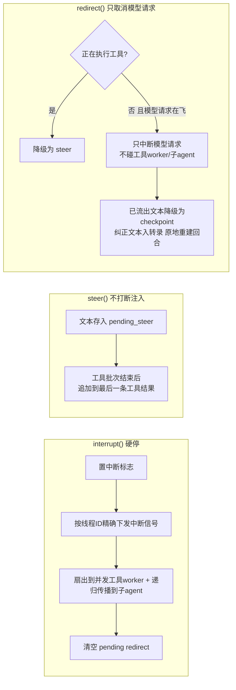
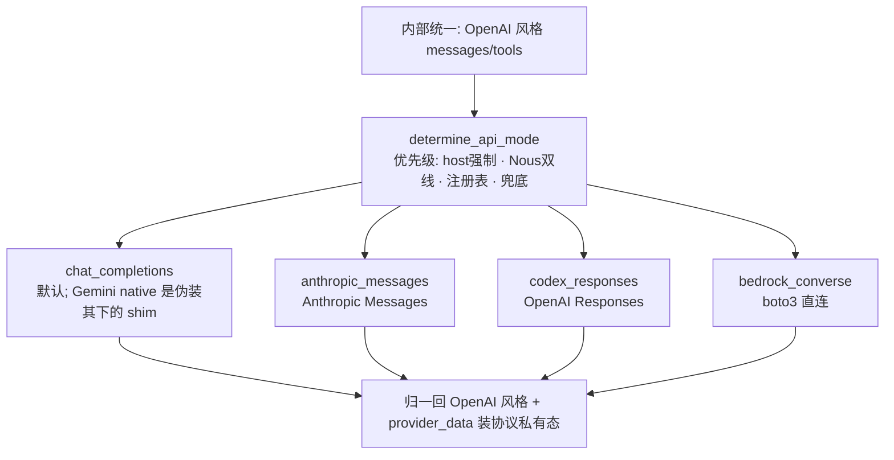
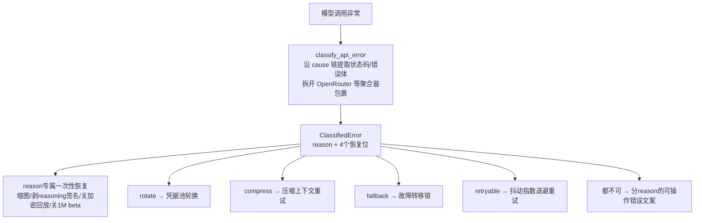
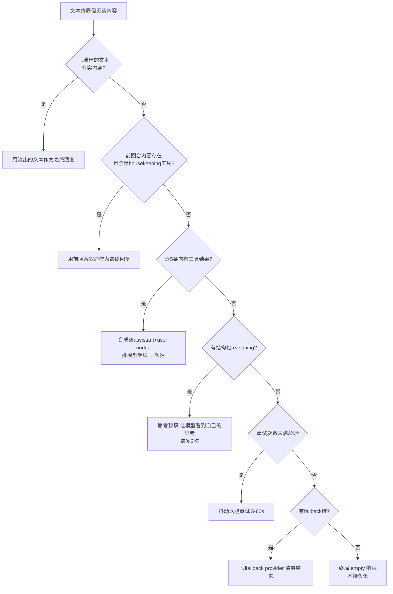

# R2 · 回合主循环与模型接入 —— 一个 agent turn 从用户输入到最终回复的全过程

> **读者定位**:读完这一章,你不需要读 hermes-agent 源码,就能讲清一个成熟 agent harness
> 的"一轮对话"内部发生了什么——模型怎么调、失败怎么恢复、多 provider 怎么切、prompt cache
> 怎么保、用户中途插话怎么处理——并能据此设计同级别的回合引擎。
>
> **溯源约定**:文中 `路径:行号 @ 863e313` 指研究基线 commit `863e31318` 下 hermes-agent 仓库根的
> 相对路径与行号,可逐条复核;要更细的证据与代码原文,每节末尾指向对应底稿 `notes/r2-*`。

---

## 1. 这一簇解决什么问题

一个能真正干活的 agent,"一轮对话"远不止"把消息发给模型、拿回复"。它要:

- **反复调用模型**并在每次回复后执行工具,直到模型给出不带工具调用的最终答复——但不能无限打转烧钱;
- **扛住真实世界的失败**:模型返回空、连接挂死、限流 429、凭据过期、上下文超窗、内容被安全策略拦截……
  每一种都不能让整轮崩掉或无限重试;
- **在多个模型 provider 之间无缝切换**(主模型挂了切备用),切换时不能丢状态、不能把成本翻倍;
- **保住 prompt cache**:长对话每轮复用一个缓存前缀能省 ~75% 输入成本,任何"改写历史字节"的操作都会
  让缓存从改动点整段失效;
- **让用户中途能插话**:停下、补充、纠正方向,三种意图要区别对待,不能都当成"杀掉重来"。

hermes-agent 把这些收敛进**一个函数**(`run_conversation`)驱动的**一个 while 循环**。这一章讲清这个
循环的骨架,以及挂在它上面的模型接入层(provider 适配、凭据池、故障转移、缓存)。

一个反直觉的事实先摆出来:这个主循环**不在**名字最像的 `run_agent.py` 里。`AIAgent.run_conversation`
只是转发器(`run_agent.py:7772 @ 863e313`),真身是自由函数 `agent/conversation_loop.py::run_conversation`
——把整个 agent 对象作为第一参数传入、通过属性访问其状态。这是"单体巨文件事后拆模块"的痕迹,读代码时
不能假设洋葱式分层(官方 AGENTS.md 的架构描述这里已过期,见 §5)。

---

## 2. 全景:一个 turn 的生命周期

三层嵌套值得先记住:
- **外层循环**(每次迭代 = 一次模型调用):`agent/conversation_loop.py:1415`;
- **内层重试循环**(单次模型调用的多种恢复尝试):由 `TurnRetryState` 的一次性守卫矩阵管理;
- **工具批次内的并发**:分段调度器把一批工具调用切成"可并行段"与"顺序屏障段"。

模型接入层(provider 适配 / 凭据池 / 故障转移 / 缓存)不是循环的一部分,而是循环在"调用模型"和
"处理失败"两点上调用的**服务**。

---

## 3. 逐机制

### 3.1 预算:两道闸 + 一个"最后的摘要"

循环条件同时看两个上限:模型调用计数 `< max_iterations`(构造默认 **90**,不是文档说的 500——见 §5)
和一个线程安全的可退款预算对象 `IterationBudget`。为什么要两个?因为父 agent 和它派生的子 agent
各持独立预算,子 agent 的迭代不占父的额度;而 `execute_code`(程序化工具调用)这类"廉价 RPC 回合"
会**退款**,不吃预算(`agent/iteration_budget.py:45 @ 863e313` 的 `refund`)。

一个关键设计选择:**预算快用完时,不往对话里插"你快没预算了"的提示**。真实教训是这种提示会让模型
在复杂任务上提前摆烂(hermes 的 issue #7915)。取而代之,预算真正耗尽时,收尾函数发**一次剥离了所有
工具的 summary 调用**,让模型基于已完成的工作给一个最终答复(`agent/turn_finalizer.py:141 @ 863e313`)。

> 有趣的化石:循环条件里还有 `or agent._budget_grace_call`,一个"再给一次机会"的标志位。但全仓库
> 没有任何代码把它设为 `True`——它只被初始化和消费为 `False`。这是**死代码**,官方 AGENTS.md 却把它
> 当作现役特性描述(§5)。留着它没害处,但它提醒你:地图会过期,territory 才是真的。

**可迁移**:双上限预算(调用数 + 可退款额度),父子独立计数;耗尽时用"最后一次无工具摘要"兜底,
而不是中途施压。

### 3.2 三级用户介入:停 / 补 / 纠

用户在 agent 干活时说话有三种意图,harness 用三个不同的 API 区分:

三者的差别就是**破坏性递减**:`interrupt` 杀掉一切(还按线程 ID 定域,让同进程里的其他 agent 不受影响,
`run_agent.py:3121 @ 863e313`);`steer` 什么都不停,只是把话搭在下一条工具结果后面(piggyback 在
tool 输出上是为了保住 user/assistant/tool 的角色交替);`redirect` 只取消模型这一次请求,工具和子 agent
继续跑,已经流式展示给用户的文本被降级成一个"provider 能安全回放、但不污染干净转录"的 checkpoint。

`redirect` 的重建是这簇里最精巧的一处。为什么不能直接把已展示的思维链写回历史?因为(a)不完整的
reasoning 块无法回放(Anthropic 的签名机制、Responses 的配对要求),(b)把思维链当普通文本写回去会被
输出分类器判成"prefill 越狱",曾经永久毒化过真实会话。解法:可见文本剥掉 `<think>` 存为降级 checkpoint,
脚手架说明只写进 api_content **侧车**(仅供 provider 回放),干净转录里保留用户原话
(`agent/conversation_loop.py:122 @ 863e313` 的 `_apply_active_turn_redirect`)。

**可迁移**:把"用户介入"按破坏性分成三级;中断信号按线程/agent 定域以支持同进程多 agent;
"不打断注入"落在工具结果上以保角色交替;取消后的重建要区分"provider 回放字节"与"人读转录字节"。

> 底稿:`notes/r2-02-intervention.md`。

### 3.3 调用模型:为什么永远走流式

一个安静模式的子 agent,没有任何流式消费者,为什么还要用流式 API?因为**流式是健康检查的载体**。
非流式调用只能干等,provider 用 SSE 心跳保活但永不给响应时,调用方会无限挂起。流式路径能做细粒度的
陈旧检测(一段时间没有新 chunk 就判定挂死)和读超时。所以默认 `_use_streaming = True`
(`agent/conversation_loop.py:2348 @ 863e313`),只有四种情况退回非流式(provider 明确不支持、copilot-acp
子进程传输、MoA 无消费者、测试 mock)。

具体的健康检查数字:**流式 stale 默认 180 秒**无新 chunk 就杀连接重连,**读超时 120 秒**,连续 5 次
stale 击杀触发跨回合熔断、下一次调用入口即抛不再等网络(hermes issue #58962)。读超时必须排在 stale
检测之下,否则 socket 读超时会先于"拥有重试和诊断权"的 stale 检测器开火,把健康的长思考停顿误杀。

> ⚠ 这里有个值得学的教训:源码里 `conversation_loop.py:2330-2331` 的注释写的是"90s stale / 60s read
> timeout",与实际的 180/120 不符——那是注释漂移(90s 其实是**非流式**路径的基线,`run_agent.py:1426`)。
> 连自绘地图的作者都会记错自己的数字;这也是为什么这个学习项目坚持"每个断言配行号"。

流式还有一个并发问题:重试会开启新的流尝试,旧线程上没死透的流可能把迟到的 chunk 交错写进回合。
解法是**单写者令牌栅栏**:每个流尝试开始前领一个单调递增的 token 存进 thread-local,消费 delta 时
检查"我的 token 还是最新的吗",不是就丢弃(`run_agent.py:6277 @ 863e313`)。而且这个栅栏是 best-effort 的
——agent 对象要是没有这个方法(部分更新的 checkout、热重载、测试替身),降级成"不设防继续流",
绝不因为一个 AttributeError 把整轮弄崩(曾有 cron 任务这样死过)。

**可迁移**:把挂死检测内建在传输层,默认永远流式;多次流尝试并存时用"单调 token + thread-local 声明"
实现最后写者胜,且失败模式是"不设防"而非"误杀唯一写者"。

> 底稿:`notes/r2-03-streaming.md`、`notes/r2-23-classify-retry-fallback-cache.md` §4。

### 3.4 模型有很多种:api_mode 抽象

同一个循环要驱动 OpenAI Chat Completions、Anthropic Messages、OpenAI Responses(Codex/xAI/Copilot)、
AWS Bedrock Converse 四种**完全不同的线协议**。做法是把线协议抽象成一个字符串 `api_mode`,由
`determine_api_mode()` 按"host 强制 > Nous 双线 > provider 注册表 > 兜底"的优先级判定
(`hermes_cli/providers.py:671 @ 863e313`),各协议由独立 adapter 负责双向翻译:请求方向把内部统一的
OpenAI 风格消息/工具翻成该协议的形状,响应方向再归一回 OpenAI 风格。

每个 adapter 里都藏着大量"被具体故障校准出来的"细节,举三个最有代表性的:

- **Anthropic 的身份伪装**:用 OAuth 凭据(订阅账户)时,Hermes 会把自己伪装成 Claude Code——系统提示
  前置 "You are Claude Code…"、把 "Nous Research" 文本替换成 "Anthropic" 绕过服务端内容过滤、把工具名
  `read_file` 改写成 `mcp__read_file`(单下划线 `mcp_` 会被计费分类器当第三方应用指纹而 400)、带
  `claude-code/<version>` 的 User-Agent(`agent/anthropic_adapter.py:2903 @ 863e313`)。而且推理请求用
  `claude-code/` UA,token 刷新请求却要用 `axios/1.7.9`——同一伪装,两条路径两个 UA,是被 429 限流实测
  校准出来的。
- **Codex 的 Harmony token 中和**:ChatGPT Codex 后端保留 `<|start|>` 这类线协议 token,文本里出现字面
  拼写会在推理前被拒。解法是把半角管道换成全角管道 `<｜start｜>`(源码仍可读,但不再是保留 token),
  还要处理零宽字符防绕过(`agent/codex_responses_adapter.py:89 @ 863e313`)。
- **encrypted_content 的 issuer 隔离**:Responses 的加密推理 blob 密封到签发它的端点,把 Codex 铸的 blob
  重放给 xAI 必然 400;归一时给每个 reasoning item 盖上 issuer 章,重放时丢弃跨 issuer 的 item。

这些细节的共同点:**文档基本没讲**。伪装、中和、隔离都是"代码有、地图无"的暗机制(§5)。

**可迁移**:把线协议差异收敛成一个枚举 + 一组 adapter,内部保持单一消息形状;协议私有状态
(签名、加密 blob、call_id)塞进一个 `provider_data` 旁路字段,不污染统一形状。

> 底稿:`notes/r2-20-adapters.md`。

### 3.5 凭据池:多把钥匙的状态机

一个 provider 可能有多把 API key 或多个 OAuth 账号。凭据池把它们建成一个**三态状态机**
(`ok → exhausted → dead`)+ **按失败语义分级的冷却** + **跨进程文件锁同步**。

冷却时长不是常数,而是 `f(状态码, 分类语义, 池型)`:401 冷却 5 分钟,429 冷却 1 小时,但**单 key 池**
的瞬态失败只冷却 1 分钟(单 key 冷却一小时 = 一小时硬故障,没有备胎可切);402/billing 永远满冷却
(快速重试无意义);永久性 OAuth 失效(token 被吊销)进 `dead` 态而不是任何 TTL——否则每小时解冻一次、
每小时立刻再失败(hermes issue #32849)。而且 provider 明说的 reset 时间优先于所有 TTL 分级
(`agent/credential_pool.py:332 @ 863e313`)。

失败归因有个反直觉的坑:current 指针是**共享可变态**,轮询/其他进程会把它指向一把无辜的健康 key。
所以标记失败时必须带上"这次请求实际用的那把 key 的身份"(id + key hint),而不是默认标 current——
否则一把限流的 key 能把整个池带下线(hermes issue #43747)。同一把运行时 key 可能背着多个池条目,
要联动一起标死,不然选择器会把同一把耗尽的 key 递回来、调用方无限重试。

跨进程同步用"乐观快照 + 写时合并":内存操作只持线程锁,磁盘冲突推迟到写入时按时间戳裁决;别的进程
新增的条目要合并回来,有意删除的要用 tombstone 显式标记防止被合并复活。单次使用的 OAuth refresh token
尤其危险——两个进程都读到同一个 token 去刷新,输的那个会触发 `refresh_token_reused` 级联撤销,所以刷新
的"同步→POST→写回"整段要裹在跨进程 flock 里,等锁的进程拿到锁先重读,发现赢家已经轮换就直接采纳、
跳过 POST。

**可迁移**:凭据状态机至少三态(dead 与 exhausted 退出路径不同);冷却是失败语义的函数、不是状态码的
函数,且语义要随条目持久化;失败归因必须带失败方身份;单次使用 token 的刷新必须跨进程"锁内先采纳后消费"。

> 底稿:`notes/r2-22-credential-pool.md`。

### 3.6 失败恢复:一个分类器 + 四个恢复位

所有模型调用异常都流经一个分类器 `classify_api_error`,它把五花八门的 provider 错误(Z.AI 用 429 表示
过载、xAI 用 403 表示欠费、llama.cpp 用 500 表示上下文溢出)折叠成一个 `FailoverReason` 枚举 + 四个正交的
恢复布尔位:`retryable / should_compress / should_rotate_credential / should_fallback`
(`agent/error_classifier.py:88 @ 863e313`)。循环不再自己判断,只读这四位分派。

分类顺序即语义:content-policy 拦截必须先于状态码分类(否则 400 安全拦截被降级成 format_error),
SSL 证书错误必须先于 SSL 瞬态告警(因为证书错误消息里也含 `[ssl:`)。每一条匹配模式都带 issue 号注释——
它们都是一次真实误分类的补丁。取舍很明确:子串匹配脆弱(措辞一改就漏),换来的是零依赖、可逐条审计。
唯一的两处"赌"是启发式:断连 + 大会话 → 判为上下文溢出,但被多层前置排除项(空响应公告、无效消息体、
推理模型断连改判 timeout)保护。

退避是抖动指数退避,抖动的目的写在模块 docstring 里:防多会话同时击打同一个限流 provider 的
thundering-herd(`agent/retry_utils.py:1 @ 863e313`)。`Retry-After` 头优先,但要裁上限(600s)防病态值。

**可迁移**:把恢复语义编码成正交布尔位而不是让调用方 switch 枚举;先归一化(沿 cause 链提取、拆聚合器
包裹)再匹配;顺序敏感的分类要写测试钉死;给"服务器过载"留独立于"限流"的通道,否则单 key 用户被轮换
逻辑饿死。

> 底稿:`notes/r2-23-classify-retry-fallback-cache.md` §1-2。

### 3.7 故障转移:切换即全量状态同步

主模型不行了,切到备用链的下一个。链游标 `_fallback_index` 从 0 起,每调一次
`try_activate_fallback` 消费一个链元素,跳过不可用的用递归重入实现(`agent/chat_completion_helpers.py:1764
@ 863e313`)。这里官方文档说"already activated 就立刻返回 False",是错的——真实的推进靠的是游标是否
走到链尾,同一回合可以多次调用逐级推进(§5 定案 a)。

切换的难点不是"换个模型名",而是**换模型意味着换一整套运行时状态**:清掉旧模型的上下文窗、换五元组
(model/provider/base_url/api_mode/requested_provider)、清 transport 缓存、**重绑凭据池**(新 provider
有自己的池)、重建 client、**重新评估缓存策略**(新 provider 可能不支持 prompt cache)、更新压缩器的
上下文窗、重解析 reasoning 配置、重写系统提示里的模型身份行。漏掉任何一项都是一个编号事故
(池 #33163、上下文窗 #22387、缓存 #72626、reasoning #21256)。

故障转移是**回合作用域**的:每个新回合开头 `restore_primary_runtime` 尝试切回主模型,除非主模型还在
冷却窗口里。这里有个成本护栏:如果主模型是订阅型 provider 且它的配额重置时间(5 小时/每周窗口)还没到,
就跳过恢复尝试,免得每回合两次缓存失效 + 两次全量重编组的必败尝试。

**可迁移**:链推进要幂等可重入(游标 + 递归跳过);冷却写在"离开主模型"处、清在"成功切回"处;
把"切换"实现成一个全量运行时同步函数,任何一项状态都不能忘。

> 底稿:`notes/r2-23-classify-retry-fallback-cache.md` §3。

### 3.8 prompt cache:字节级稳定这条红线

长对话每轮复用缓存前缀省 ~75% 输入成本,但缓存前缀是**逐字节**匹配的:任何改写历史消息线上字节的操作,
都会让缓存从改动点整段失效、把后面全部重新计费。这条约束贯穿整簇,体现在两个机制:

**(a) api_content 侧车——"persist-what-you-send"**。当前回合的用户消息要注入记忆预取和插件上下文,
但注入不能改写持久转录(会污染人读历史),也不能每次现注入(历史消息的线上字节会漂移)。解法:注入后的
确切字节盖章存成一个旁路字段 `api_content`,与干净 content 并存持久化;构建请求时,当前消息用盖章值、
历史消息回放各自侧车的历史字节——**干净转录与线上字节永久分离**,前缀逐字节稳定
(`agent/turn_context.py:53 @ 863e313`)。任何改写内容的路径(剥图、合并摘要)必须主动丢掉侧车——代价是
一个缓存边界 miss,永远不是错误内容。

**(b) 4 断点分配**。Anthropic 每请求最多 4 个 cache_control 断点。默认布局把它们分成:静态系统前缀
(跨会话稳定)、系统提示尾(会话内)、最近 2 条非系统消息(滚动窗)——共 2+2。只有静态前缀缺失时才
退回文档描述的"system + 末 3 条"legacy 布局(§5 定案 b)。分配时要跳过"provider 会忽略 marker 的位置"
(空 content 的纯 tool_calls 消息、空 tool 消息),否则白烧一个断点。故障转移换 provider 后,要先剥掉旧
provider 的断点再按新 provider 策略重贴(`agent/prompt_caching.py:382 @ 863e313`),而且这个 strip 必须
能证明字节还原,否则 strip 本身就破坏了它要保护的前缀。

**可迁移**:存储层永远是单一干净字符串,缓存形状只存在于请求局部拷贝;注入走侧车,组装只有一个入口
且构建与持久共用它;缓存断点是稀缺预算,先写"哪里的 marker 会被忽略"的谓词,写入端与谓词共用判定。

> 底稿:`notes/r2-06-turn-context-sidecar.md`、`notes/r2-23-classify-retry-fallback-cache.md` §5。

### 3.9 工具批次:分段调度,不是无脑并发

模型一次可以要求调用多个工具。官方文档说"多工具调用并发执行 via ThreadPoolExecutor"——但真实调度是
**分段的**(§5 定案)。分段规划器把一批调用切成有序的"可并行段"和"顺序屏障段",保持模型的原始调用顺序:
只读工具(read_file/search_files/web_search…)可以并行,写工具(write_file/patch)与任何目标路径重叠的
调用之间要串行,交互式工具(clarify)是屏障。关键的一条:`search_files` 会把它的搜索根预留为 reader,
一个批在写之后的搜索会被排到写后而非与之竞态(经典的"同块写后读"race)(`agent/tool_dispatch_helpers.py:116
@ 863e313`)。

并发执行里每一道门都有界:启动顺序门(串行化 dispatch 保结果顺序)和授权门(串行化审批提示防屏幕交错)
都设超时,一个卡死的工具或插件不能永久 park 其他 worker,超时就降级为"乱序继续"而非永久饿死。一个精巧的
细节:人审等待要从批次超时里扣除,但**在人审的源头测量**(而不是"门内驻留时间")——否则一个卡死的插件
会把排除量 1:1 撑大,让批次超时永不触发、整轮永挂(hermes issue #79719)。

**可迁移**:混合工具批次按"只读性 + 文件目标重叠 + 交互性"切段,保发出顺序;并发的每道门都要有界、
超时降级而非永久 park;把人审等待排除在批次超时外,但在人审源头测量。

> 底稿:`notes/r2-05-tool-executor.md`。

### 3.10 空响应恢复:一个六级阶梯

弱模型在工具调用后返回空内容是常态。Hermes 不是简单重试,而是一个**六级恢复阶梯**,每一级配一次性守卫
防死循环:

最后那个"不持久化"很关键:终局的 `(empty)` 哨兵带 `_empty_terminal_sentinel` 标记,**不写入库**——
否则后续 "continue" 回合会把 `(empty)` 当真实模型回复回放,长工具会话会卡死在空响应循环
(`agent/conversation_loop.py:6848 @ 863e313`)。

**可迁移**:空响应恢复要是阶梯而非单一重试,每级配一次性守卫;所有合成消息(nudge/预填/哨兵)都要
(a)保住角色交替 (b)带可剥离标记;终局哨兵不得持久化。

> 底稿:`notes/r2-01-turn-loop.md` §6。

### 3.11 收尾:所有路径共享的单一咽喉

不管是正常终局还是十几种 break 路径,都汇入 `finalize_turn`。它是"收尾即契约"的地方,做四件事:
预算兜底(§3.1)、转录整形、持久化、组装 result + 触发后台学习。

转录整形的核心是一个不变式:「已交付给用户的 final_response ⇒ 转录里必须有一条 assistant 行」。这个不变式
放在**所有 break 都流经的单一咽喉**校验和修复,而不是散在每个 break 点(`agent/turn_finalizer.py:308
@ 863e313`)。尾部不是 assistant 行就补一条;尾部是"纯 tool_calls 的 assistant 行"(有工具调用无文本)
就就地填内容——否则用户看到了回复但转录里没有,下一回合会重放整个用户 backlog 再回答一遍。

后台学习 review 在这里触发,但**在响应送达之后**才 fork——"never competes with the user's task for
model attention"(`agent/turn_finalizer.py:716 @ 863e313`)。这是 R6"记忆与学习闭环"的接入点,本章只到
它的触发时机。

**可迁移**:收尾是单一咽喉,所有 break 共享同一套"转录整形 + 不变式 + 持久化 + result 组装";
"交付了什么 ⇒ 转录里必须有什么"这类不变式放咽喉处校验;自我改进类后台任务放在"响应已交付"之后触发。

> 底稿:`notes/r2-13-turn-finalizer.md`。

---

## 4. 可迁移的设计原则(把这一簇提炼成"造你自己的 harness")

1. **恢复是阶梯,不是重试**。空响应、截断、限流、OAuth 失效、流中断——每种失败给一个专用的有界重试
   阶梯,每级配一次性布尔守卫防死循环。这是全簇最一致的工程签名。
2. **干净数据与线上数据分离**。持久转录、缓存字节、provider 回放 blob 是三种不同的字节流,不能混。
   注入走侧车,协议私有态走旁路字段,任何改写内容的路径主动丢缓存旁路。
3. **失败语义编码成正交布尔位**。一个分类器把 provider 五花八门的错误折叠成"可重试/要压缩/换凭据/
   故障转移"四位,调用方读位分派而不是重新判断。
4. **切换即全量状态同步**。换模型/换凭据不是改一个字段,是同步一整套运行时状态;把它实现成一个函数,
   任何一项都不能忘,每一项都对应过一个真实事故。
5. **收尾是单一咽喉**。所有退出路径共享同一套收尾逻辑,把"交付 ⇒ 转录有记录"这类不变式放在咽喉处,
   而不是让每个 break 点各自维护。
6. **降级路径的失败模式要安全**。栅栏失败降级为"不设防"而非"误杀";并发门超时降级为"乱序"而非"永久
   park";缓存旁路丢弃换一个 miss 而非错误内容。所有护栏 fail-open,永不反噬主循环。
7. **成本压力不要中途施加**。预算快用完不提示模型(会让它摆烂),耗尽时用一次无工具摘要兜底。

---

## 5. 地图与 territory 的出入

官方文档(README / AGENTS.md / website/docs)是作者自绘的地图,与代码冲突时以代码为准。本簇范围内经精读
逐条定案(完整证据见 `notes/r2-90-doc-conflict-rulings.md`),这里把结论融进叙述:

**文档说了但代码不是这样的(▲,全部证实/修正)**:
- 主循环"在 run_agent.py"、带"one-turn grace call"、默认迭代 500——实际主循环在 `conversation_loop.py`,
  grace 标志是死代码,构造默认是 90(§3.1)。
- "请求包在 `_interruptible_api_call`"——默认永远优先流式(§3.3)。
- "多工具并发 via ThreadPoolExecutor"——实际是分段调度(§3.9)。
- "system_and_3"缓存布局——默认是"静态前缀切分 + 末 2 条",system_and_3 只是回退(§3.8)。
- fallback"already activated 立即返回 False"——实际靠 `_fallback_index` 逐级推进(§3.7)。
- "中断不注入部分响应"——redirect 路径会注入降级 checkpoint(§3.2)。
- 辅助任务用"独立自动探测链"——**证伪**:默认复用主 provider + 主 model,独立链只是兜底
  (`notes/r2-21` 定案 4a)。

**代码有但文档没讲的暗机制(◇,全部证实)**:错误分类器驱动的恢复体系、Nous Portal 双线协议路由、
Codex Harmony token 中和与 encrypted_content issuer 隔离、Anthropic OAuth 身份伪装的伪装部分、
`nous_rate_guard` 跨会话限流断路器、用量归一与定价的整套机制。

**一处源码内注释漂移(R2 新发现)**:`conversation_loop.py:2330-2331` 注释的"90s stale / 60s read timeout"
与实际的 180s/120s 不符——这不是文档-代码冲突,是代码内注释漂移,记录在案(§3.3)。

一句话总结这个地图-territory 关系:**hermes 的文档在讲"产品长什么样",代码在讲"它是怎么活下来的"**。
所有那些身份伪装、Harmony 中和、凭据池冷却分级、六级空响应阶梯——都是被真实故障一次次校准出来的生存
机制,它们没进文档,恰恰因为它们是"内部怎么扛住现实"而不是"用户看到什么"。要学一个 harness 怎么设计,
这些暗机制才是主菜。

---

## 6. 延伸

要证据、要代码原文、要更细的取舍讨论,下钻对应底稿:

| 主题 | 底稿 |
|---|---|
| 外层循环骨架 / 退出路径 / 空响应阶梯 | `notes/r2-01-turn-loop.md` |
| 三级用户介入 | `notes/r2-02-intervention.md` |
| 流式与单写者栅栏 | `notes/r2-03-streaming.md` |
| 工具批次分段调度 | `notes/r2-05-tool-executor.md` |
| TurnContext 前奏与 api_content 侧车 | `notes/r2-06-turn-context-sidecar.md` |
| finalize_turn 收尾 | `notes/r2-13-turn-finalizer.md` |
| wire 协议适配器层 | `notes/r2-20-adapters.md` |
| 辅助 LLM 路由 / 元数据 / 定价 | `notes/r2-21-auxiliary-metadata-pricing.md` |
| 凭据池与限流护栏 | `notes/r2-22-credential-pool.md` |
| 错误分类 / 重试 / 故障转移 / 缓存断点 | `notes/r2-23-classify-retry-fallback-cache.md` |
| 文档冲突定案 | `notes/r2-90-doc-conflict-rulings.md` |
| 行为规格测试运行记录 | `notes/r2-95-tests.md` |
