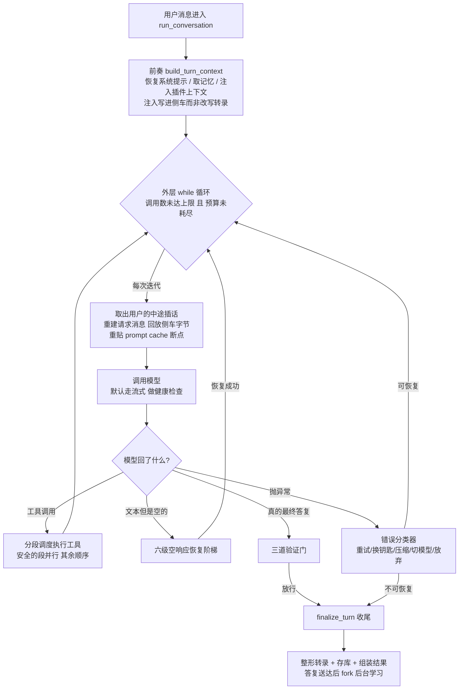
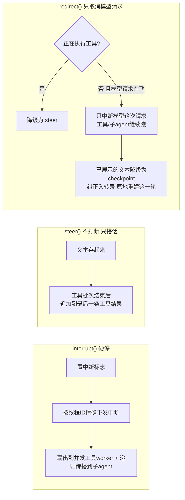
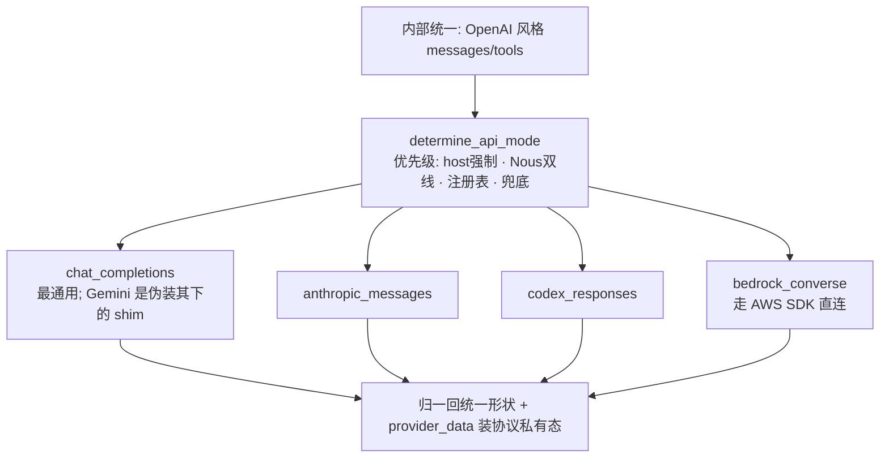
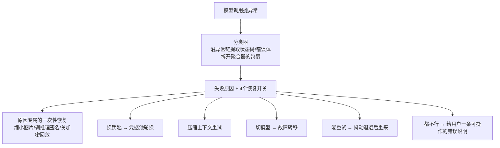
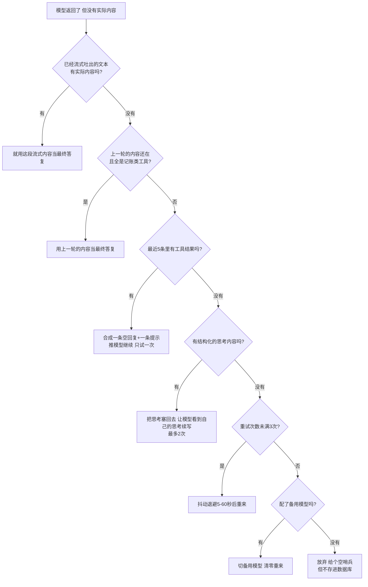

# R2 · 回合主循环与模型接入 —— 一个 agent turn 从用户输入到最终回复的全过程

> **读者定位**:你有多年后端经验,但没读过这份代码,也不熟 LLM provider 生态和 Python 异步。
> 读完这一章,你能不看源码就讲清一个成熟 agent harness 的"一轮对话"内部发生了什么——模型怎么调、
> 失败怎么恢复、多个模型服务商怎么切换、怎么省钱、用户中途插话怎么处理——并据此设计同级别的回合引擎。
>
> **溯源约定**:`路径:行号 @ 863e313` 指基线 commit `863e31318` 下 hermes-agent 仓库根的相对路径与行号,
> 可逐条复核。每节末尾指向底稿 `notes/r2-*`,那里有更细的证据。

---

## TL;DR(快读路径:读这一段就有全貌)

先锚几个贯穿全章的词:
- **turn(一轮 / 一个回合)**:用户发一句话,agent 反复"调模型→执行工具→再调模型",直到模型给出不带
  工具请求的最终答复。这一整段叫一个 turn。
- **tool_calls(工具调用)**:模型的回复里可以不是文字,而是"我要调用 read_file、参数是 X"这样的结构化
  请求。harness 执行它,把结果再发回模型。
- **provider(模型服务商)**:提供 LLM 的后端,如 Anthropic(Claude)、OpenAI(GPT)、或你自己的本地
  模型。同一个 agent 可以配多个,主的挂了切备用的。
- **prompt cache(提示缓存)**:LLM 服务商提供的省钱机制——长对话每轮开头那一大段(系统提示 + 历史)
  是重复的,服务商可以缓存它、只对新增部分计费,能省约 75% 的输入成本。但缓存是**逐字节匹配**的:
  历史里改一个字节,缓存就从那里整段失效。

这一章讲的一轮对话,核心是**一个函数驱动的一个 while 循环**,外加挂在它上面的"模型接入层"。最重要的
五个设计:

1. **失败恢复是阶梯,不是重试**。模型返回空、连接挂死、限流、凭据过期、上下文超长——每种失败有一条专用的、
   分级的恢复路径,每级配一个"只触发一次"的守卫防死循环。
2. **三级用户介入**。用户中途说话分三种意图:停下、补充、纠正方向,分别用 interrupt / steer / redirect
   处理,破坏性递减。
3. **多协议适配**。一个循环驱动四种完全不同的模型服务协议,靠一个叫 `api_mode` 的字符串分流,细节全部
   收进各自的适配器。
4. **凭据池 + 故障转移**。多把 API 钥匙做成状态机,失败按语义分级冷却;主模型不行了切备用,切换时同步
   一整套运行时状态。
5. **prompt cache 靠"侧车"保住**。"发给模型的字节"和"给人看的转录"分开存,注入内容永远不污染缓存前缀。

如果你只想要结论,到这里够了。想看每个机制怎么从一个具体场景长出来,继续读。

---

## 1. 从一个场景说起:一句话背后的一轮循环

你对 agent 说:"把 src 目录里所有 TODO 注释列出来。"接下来这一轮是这样跑的:

- agent 把你的话发给模型,模型回:"我要调用 `search_files`,搜 src 下的 'TODO'。"——这是一次 tool_calls。
- harness 执行搜索,把结果发回模型。模型看了结果,回:"我再 `read_file` 看看这三个文件的上下文。"
  ——又一次 tool_calls。
- harness 执行,发回。模型这次给出纯文字:"这是 12 处 TODO,按文件分组……"——没有工具请求了,这是**最终答复**。
- 循环结束,结果存进数据库,发回给你。

这个"调模型→执行工具→再调模型,直到出最终答复"的循环,就是 agent 的心脏。听起来简单,但真跑起来,
每一步都可能出岔子:模型可能返回空、可能请求一个不存在的工具、连接可能挂死、你可能中途改主意。这一章
剩下的部分,就是讲这个循环怎么把这些岔子一个个接住。

**先说一个会绊倒你的事实**:这个循环**不在**名字最像的 `run_agent.py` 里。那个文件里的
`run_conversation` 只是个转发器,真正的循环在 `agent/conversation_loop.py`——一个把整个 agent 对象当
第一个参数传进去的普通函数(`run_agent.py:7772 @ 863e313`)。这是"先写成一个巨型文件、后来才拆开"留下的
痕迹:模块拆了,但耦合还在(函数直接读 agent 对象的几十个属性)。读这份代码不能假设它是干净的分层架构。
顺带一提,官方文档 AGENTS.md 说循环"在 run_agent.py",已经过期了(见 §5)。

---

## 2. 全景:一个 turn 的生命周期

记住三层嵌套就够抓住骨架:
- **外层循环**:每转一圈 = 调一次模型。
- **内层重试循环**:一次模型调用内部的多种恢复尝试(限流退避、凭据刷新、上下文压缩重来……)。
- **工具批次内的并发**:一批工具调用里,能安全并行的并行,其余顺序执行。

模型接入层(协议适配 / 凭据池 / 故障转移 / 缓存)不是循环的一部分,而是循环在"调模型"和"处理失败"
两点上叫的服务。

---

## 3. 逐机制

### 3.1 预算:两道闸,和一次"最后的总结"

**场景**:模型陷入了鬼打墙——每次都请求一个工具、拿到结果、又请求同一个工具,永远不给最终答复。
如果不管,它会一直烧钱(每次调用都花 token)。怎么让它停,又不误伤正常的长任务?

**设计**:循环条件同时看两个上限——模型调用计数不超过 `max_iterations`(构造默认 **90**),和一个可退款的
预算对象 `IterationBudget`。为什么要两个、还要"可退款"?因为:
- 一个 agent 可以派生**子 agent**(委派子任务),子 agent 的迭代不该占父 agent 的额度,所以各持独立预算;
- 有一种"廉价"的工具调用叫 `execute_code`(让模型写一段脚本一次调多个工具,R3 会讲),它不该吃预算,
  所以用完**退款**(`agent/iteration_budget.py:45 @ 863e313` 的 `refund`)。

**一个反直觉的设计选择**:预算快用完时,**不往对话里插"你快没预算了"的提示**。为什么?有过一次真实教训:
早期版本会在预算紧张时提示模型,结果模型一看"快没预算了"就在复杂任务上草草收尾、提前放弃(hermes
的 issue #7915 记录了这个现象)。所以现在改成:预算真正耗尽时,发**一次特殊的调用**——把所有工具都去掉、
只让模型基于已完成的工作写一个总结当最终答复(`agent/turn_finalizer.py:141 @ 863e313`)。不施压,只兜底。

> **一处代码化石**:循环条件里还挂着 `or agent._budget_grace_call`,一个"再给一次机会"的开关。但全仓库
> 没有任何代码把它打开——它只被初始化和消费为关(`agent/agent_init.py:892 @ 863e313`、`agent/conversation_loop.py:1445 @ 863e313`)。
> 这是死代码,那个分支永远进不去。官方文档却把它当现役特性介绍。留着无害,但它提醒你:文档会骗人。

**可迁移**:双上限预算(调用数 + 可退款额度),父子独立计数;耗尽时用"最后一次无工具总结"兜底,
而不是中途施压让模型摆烂。

### 3.2 三级用户介入:停 / 补 / 纠

**场景**:agent 正在跑一个耗时的任务,你突然想说话。你可能是想:(a)"停!别跑了";(b)"顺便也看下
日志权限";(c)"等等,你搞错方向了,应该查的是 nginx 不是 apache"。这三种意图截然不同——(a)要停,
(c)要纠正但不想浪费已经跑完的工作,(b)只是补充。用一个"中断"按钮全处理,就把(b)(c)也变成了"杀掉重来"。

**设计**:三个不同的 API,破坏性递减。

- **interrupt(硬停)**:置中断标志,并按**线程 ID** 精确下发中断信号——这一点很关键,因为一个进程里
  (比如消息网关)可能同时跑着多个 agent,中断信号必须只打中该 agent 的执行线程,不误伤别人
  (`run_agent.py:3121 @ 863e313`)。还要扇出到正在跑的并发工具线程(否则一个卡在网络 IO 上的命令要等到
  自己超时),并递归传播给子 agent。
- **steer(不打断,只搭话)**:什么都不停,只把你的话存起来,等当前这批工具执行完,追加到最后一条工具结果
  的末尾。为什么搭在工具结果上?因为 LLM 的对话有严格的角色交替规则(用户→助手→用户……),硬插一条
  用户消息会打破交替;搭在工具结果里就绕过了这个限制。
- **redirect(只取消模型请求)**:这是最精巧的。它只取消模型**这一次**请求,工具和子 agent 继续跑;
  已经流式展示给你的那部分文本被降级成一个 checkpoint,你的纠正作为新的用户消息加进去,然后原地重建
  这一轮。

**redirect 为什么这么复杂?** 讲个它踩过的坑:模型在"思考"时会产生一段推理内容(**reasoning block**,
有些模型会把思考过程单独返回)。如果你在模型思考到一半时取消,这段不完整的推理不能直接塞回历史——
一方面某些服务商(Anthropic)对推理块有签名校验,不完整的会被拒;另一方面,把这段"思考"当普通文本写回
对话历史,会被服务商的安全分类器当成 **prefill 攻击**(prefill:预先填入助手的话诱导模型,是一种越狱
手法)而拦截,曾经**永久毒化过真实会话**——那个会话之后每一轮都失败。所以解法是:可见文本剥掉思考标记后
存为一个降级 checkpoint,而说明性的脚手架文本只写进一个叫 **api_content 的侧车**(§3.8 详解),它只发给
模型、不进给人看的转录(`agent/conversation_loop.py:122 @ 863e313`)。

**可迁移**:把"用户介入"按破坏性分三级;中断信号按线程/agent 定域,支持同进程多 agent;"不打断注入"
搭在工具结果上以保角色交替;取消后的重建要区分"发给模型的字节"和"给人看的字节"。

> 底稿:`notes/r2-02-intervention.md`。

### 3.3 调用模型:为什么永远用流式

**场景**:一个在后台默默跑的子 agent,没有任何界面在实时显示它的输出。它调用模型时,连接建立了,
服务商每隔几秒发一个心跳保持连接不断,但**永远不发真正的回复**(可能上游卡住了)。子 agent 就这么无限
挂着,没人知道。

**设计**:默认**永远用流式调用**(streaming:服务商把回复一个字一个字地推过来,而不是等全部生成完再一次性
返回),哪怕没有任何界面在显示。为什么?因为**流式是健康检查的载体**——非流式调用只能干等,你分不清
"模型在认真思考"和"连接挂死了";流式能看到"有多久没有新字了",据此判断挂死。所以默认走流式
(`agent/conversation_loop.py:2348 @ 863e313`),只有四种情况退回非流式(服务商明确不支持、某些子进程
传输、以及测试环境)。

具体数字分三档,别当成一个无条件的常量:**云端 provider 默认 180 秒没有新内容就杀掉连接重连、
读超时 120 秒**;**provider 自己的配置可以覆盖这两个默认**
(`agent/chat_completion_helpers.py:4058-4061 @ 863e313` 的 "Provider-configured stale timeout
takes priority over env default",读超时侧同形);**本地端点(Ollama / oMLX / llama-cpp)
自动放宽到 900 秒**,理由是大上下文的 prefill 本身就可能跑 300 秒以上,按云端标准会被误杀。
无论哪一档,连续 5 次因挂死被杀都会触发熔断——下一次调用直接抛错、不再干等网络
(这是为了避免一个持续挂死的服务商反复浪费每次调用的完整超时时间)。

> **一个值得学的小插曲**:源码里那段决定"用流式"的注释,写的是"90 秒挂死检测 / 60 秒读超时"——和实际
> 的 180/120 对不上。查下来,90 秒其实是**非流式**路径的数字,注释把它抄错了(实际值在
> `agent/chat_completion_helpers.py:4063 @ 863e313` 和 `:3028`,和官方环境变量文档一致)。连作者自己都会记错自己
> 代码里的数字。这也是为什么这本书坚持给每个数字配行号——它逼着你去核对,而不是信注释。

流式还带来一个并发问题。**场景**:一次调用挂死了,触发重试开了一个新的流;但旧线程上那个流还没死透,
它迟到的字可能和新流的字**交错**写进对话,拼出一段乱码。**解法**:每个流开始前领一个单调递增的令牌
存进自己的线程本地存储,每次要输出一个字时检查"我的令牌还是最新的吗",不是就丢弃(`run_agent.py:6277 @ 863e313
@ 863e313`)。而且这个检查是"尽力而为"的——万一 agent 对象没这个方法(代码部分更新、热重载、测试替身),
就降级成"不设防、继续流",绝不因为一个方法缺失把整轮弄崩(以前真有 cron 任务这样崩过)。

**可迁移**:把挂死检测内建在传输层,默认永远流式;多个流并存时用"单调令牌 + 线程本地"实现"最后的流
才算数",且失败模式要是"不设防"而不是"误杀唯一的流"。

> 底稿:`notes/r2-03-streaming.md`、`notes/r2-23-classify-retry-fallback-cache.md` §4。

### 3.4 模型有很多种:一个字符串搞定协议分流

**场景**:你今天用 Claude,明天想换成 GPT,后天用公司自己部署的模型。这三家的 API 长得完全不一样——
消息格式、工具的表示、返回结构都不同。agent 的循环怎么能不为每换一家就改一遍?

**设计**:把"用哪种线协议"抽象成一个字符串 `api_mode`(线协议:两台机器之间约定的数据格式)。四种取值
对应四种协议家族:`chat_completions`(OpenAI 风格,业界最通用)、`anthropic_messages`(Anthropic)、
`codex_responses`(OpenAI 的 Responses API,Codex/xAI 用)、`bedrock_converse`(AWS Bedrock)。判定优先级是
"服务商主机名强制 > Nous 双线路由 > 服务商注册表 > 兜底"(`hermes_cli/providers.py:671 @ 863e313`)。
每种协议由一个独立的**适配器**负责双向翻译:出去时把内部统一的消息/工具翻成该协议的形状,回来时再归一
回统一形状。

每个适配器里都藏着被真实故障磨出来的细节,讲三个最有代表性的故事:

- **Anthropic 的身份伪装**。用订阅账户(OAuth 凭据)调 Anthropic 时,hermes 会把自己**伪装成 Anthropic
  官方的 Claude Code 工具**:系统提示前面加一句 "You are Claude Code…",把消息里的 "Nous Research" 字样
  替换成 "Anthropic"(绕过服务端的内容检查),把工具名 `read_file` 改写成 `mcp__read_file`,还带上
  Claude Code 的 User-Agent。为什么改工具名?因为 Anthropic 的计费分类器把单下划线的 `mcp_` 前缀当成
  第三方应用的指纹,会拒绝(`agent/anthropic_adapter.py:2903 @ 863e313`)。更细的:推理请求用
  `claude-code/` 的 User-Agent,但令牌刷新请求却要用 `axios/1.7.9`——因为实测发现 `claude-code/` 的
  UA 在令牌刷新端点会被限流。同一套伪装,两条路径两个 UA,全是被 429 错误一点点校准出来的。
- **Codex 的 "Harmony token 中和"**。OpenAI 的 Codex 后端在协议里保留了一些特殊标记(像 `<|start|>`
  这样的控制符)。如果你的对话文本里**恰好出现了这些标记的字面拼写**,请求会在推理前被直接拒绝。解法是把
  半角的竖线换成全角的竖线 `<｜start｜>`——源码里还是看得懂,但它不再是那个保留标记了(`agent/
  agent/codex_responses_adapter.py:89 @ 863e313`)。
- **加密推理内容的"签发方隔离"**。有些协议会返回一段加密的推理内容,它被密封到签发它的那个端点上。
  如果你把 Codex 生成的这段加密内容,在故障转移后重放给 xAI,必然报错。所以归一时给每段推理盖上"谁签发的"
  的章,重放时丢弃跨签发方的内容。

这三个机制的共同点:**官方文档基本没讲**。伪装、中和、隔离,都是"代码里有、地图上没有"的暗机制(§5)。

**可迁移**:把协议差异收进一个枚举 + 一组适配器,内部保持单一消息形状;协议私有的状态(签名、加密内容、
调用 ID)塞进一个旁路字段,不污染统一形状。

> 底稿:`notes/r2-20-adapters.md`。

### 3.5 凭据池:多把钥匙的状态机

**场景**:你给一个模型配了三把 API 钥匙(为了提高额度)。第一把用着用着被限流了(HTTP 429),你希望
harness 自动切到第二把,过一阵再回来试第一把;要是某把钥匙的订阅到期了(永久失效),就别再浪费请求去
试它。这套"钥匙的健康管理"就是凭据池。

**设计**:把多把钥匙做成一个**三态状态机**——`ok`(可用)→ `exhausted`(暂时冷却)→ `dead`(永久失效)——
外加**按失败语义分级的冷却**和**跨进程同步**。

冷却时长不是固定的,而是"失败类型 + 池子情况"的函数:HTTP 401(鉴权失败)冷却 5 分钟,429(限流)
冷却 1 小时,但如果这个池子**只有一把钥匙**,瞬态失败只冷却 1 分钟——因为独苗冷却一小时就等于一小时
彻底不可用,没有备胎可切;而 402(欠费)永远满冷却(马上重试没意义);永久性的 OAuth 失效(令牌被吊销)
直接进 `dead` 态,不给任何冷却——否则会每小时解冻一次、每小时立刻再失败(hermes 的 issue #32849 就是
这么来的:一把被吊销的钥匙每小时准时失败一次,烦了三天)。而且如果服务商在错误里明确告诉了你"几点恢复",
那个时间优先于所有冷却档位(`agent/credential_pool.py:332 @ 863e313`)。

**一个反直觉的坑**:失败了要标记"是哪把钥匙失败的",但"当前钥匙"这个指针是**共享可变状态**——轮询会移动
它,别的进程也会重置它。等你要标记失败时,这个指针很可能已经指向了另一把**健康**的钥匙。真实后果:一把
被限流的钥匙,能把整个池子标记下线(hermes issue #43747)。所以标记失败时,必须带上"这次请求实际用的
那把钥匙的身份",而不是默认标记"当前钥匙"。

**跨进程同步**用"乐观快照 + 写时合并":内存操作只上线程锁,磁盘冲突推迟到写入时按时间戳裁决。最麻烦的
是 OAuth 的**刷新令牌是一次性的**——命令行、网关、定时任务三个进程共享同一份凭据文件,两个进程同时读到
同一个刷新令牌去续期,输的那个会触发连锁失效(整条令牌链作废)。解法:刷新的"读→续期→写回"整段裹在
跨进程文件锁里,等锁的进程拿到锁先重读一遍,发现赢家已经把令牌换新了,就直接采用新的、跳过自己的续期请求。

**可迁移**:凭据状态机至少三态(dead 和 exhausted 的退出路径不同);冷却是失败**语义**的函数而不是状态码
的函数,且语义要随钥匙持久化;失败归因必须带失败方身份;一次性令牌的刷新必须跨进程"锁内先采纳后消费"。

> 底稿:`notes/r2-22-credential-pool.md`。

### 3.6 失败恢复:一个分类器,四个恢复开关

**场景**:模型调用抛了个异常。可能是限流(要退避重试)、可能是上下文太长(要压缩历史再试)、可能是钥匙
过期(要换钥匙)、可能是内容被安全策略拦了(重试没用,得换个模型)。更麻烦的是,不同服务商用不同的方式
表达同一种失败——Z.AI 用 429 表示"服务器过载"(其实不是限流),xAI 用 403 表示"欠费",本地的 llama.cpp
用 500 表示"上下文超长"。怎么统一处理?

**设计**:所有异常先过一个**分类器** `classify_api_error`,它把五花八门的错误折叠成一个"失败原因"枚举
加四个正交的恢复开关:`retryable`(能重试吗)/ `should_compress`(要压缩上下文吗)/
`should_rotate_credential`(要换钥匙吗)/ `should_fallback`(要切模型吗)(`agent/error_classifier.py:88 @ 863e313
@ 863e313`)。循环不再自己判断,只读这四个开关分派。

分类的**顺序**本身是有讲究的:内容安全拦截必须先于状态码判断(否则一个 400 安全拦截会被降级成普通的
格式错误);SSL 证书错误必须先于 SSL 瞬态告警(因为证书错误的消息里也含 "ssl" 字样)。每一条匹配规则都
带一个 issue 号注释,每一条都是一次真实误判后打的补丁。取舍很明确:靠字符串匹配错误消息很脆弱(服务商
改一下措辞就漏了),但换来的是零依赖、可逐条审计。

退避用**抖动指数退避**(指数退避:失败一次等 2 秒,再失败等 4 秒、8 秒……;抖动:在等待时间上加一点随机,
错开时刻)。为什么要抖动?因为多个会话可能同时撞上同一个限流的服务商,如果它们的退避时刻完全同步,
就会同时重试、同时再被限流,形成"惊群"。抖动把它们的重试时刻错开(`agent/retry_utils.py:1 @ 863e313`)。

**可迁移**:把恢复语义编码成正交的布尔开关,而不是让调用方一层层 if 判断枚举;先归一化(沿异常链提取、
拆开聚合器包裹)再匹配;顺序敏感的分类要写测试钉死;给"服务器过载"留一个独立于"限流"的通道,否则单钥匙
用户会被轮换逻辑饿死。

> 底稿:`notes/r2-23-classify-retry-fallback-cache.md` §1-2。

### 3.7 故障转移:切模型 = 换一整套运行时状态

**场景**:你的主模型(Claude)被限流了,你配了个备用模型(GPT)。切过去,看起来就是"换个模型名"。
但 GPT 用的是不同的服务商、不同的钥匙、不同的协议、可能不支持 prompt cache、上下文窗口大小也不同。

**设计**:一条备用链,一个游标从头往后走。每次调用故障转移函数消费链上一个元素,跳过不可用的(用递归
实现)。这里官方文档说"如果已经激活过就立刻返回失败",是错的——真实的推进靠的是"游标有没有走到链尾",
同一轮里可以反复调用逐级往后切(`agent/chat_completion_helpers.py:1764 @ 863e313`,§5 定案 a)。

难点不是"换模型名",而是**换模型意味着换一整套运行时状态**:清掉旧模型的上下文窗口大小、换五个字段
(模型/服务商/地址/协议/请求身份)、清协议缓存、**重新绑定凭据池**(新服务商有自己的池)、重建客户端、
**重新评估缓存策略**(新服务商可能不支持 prompt cache)、更新压缩器的上下文窗口、重解析推理配置、重写
系统提示里的模型身份行。漏掉任何一项都是一个编号事故(凭据池 #33163、上下文窗 #22387、缓存 #72626……)。
所以它被实现成一个"全量状态同步"函数,而不是零散的赋值。

故障转移是**回合作用域**的:每一轮开头都尝试切回主模型,除非主模型还在冷却窗口里。这里有个成本护栏——
如果主模型是订阅型服务商、它的配额重置时间(比如"每周一恢复")还没到,就跳过这次切回尝试,免得每轮都
做一次"两次缓存失效 + 两次全量重组"的必败尝试。

**可迁移**:备用链推进要幂等可重入(游标 + 递归跳过);冷却写在"离开主模型"处、清在"成功切回"处;
把"切换"实现成一个全量状态同步函数,任何一项都不能忘。

> 底稿:`notes/r2-23-classify-retry-fallback-cache.md` §3。

### 3.8 prompt cache:靠"侧车"守住字节稳定这条命脉

**场景**:一段 50 轮的长对话,每轮开头那一大段(系统提示 + 前 49 轮历史)是重复的。服务商能缓存它、
只对新增部分计费,省约 75%。但缓存是**逐字节匹配**的:只要历史里有一个字节变了,缓存就从那个字节开始
整段失效,后面全部重新计费。现在问题来了——每一轮,harness 都要往你的**当前**消息里注入一些东西
(相关的记忆、插件加的上下文)。这个注入,怎么才能不破坏缓存?

**设计**:关键是一个叫 **api_content 侧车**的机制。"侧车"(sidecar)指:一条消息除了给人看的干净内容,
再挂一个旁路字段,存"实际发给模型的字节"。注入后的完整字节盖章存进这个侧车,和干净内容并排持久化;
构建请求时,当前消息用侧车的字节、历史消息回放各自侧车里当初发出去的字节——这样**给人看的转录**和
**发给模型的字节**永久分开,注入永远不改历史,缓存前缀逐字节稳定(`agent/turn_context.py:53 @ 863e313`)。
任何要改写内容的操作(比如从历史里剥掉图片以省空间)必须主动丢掉那条消息的侧车——代价是一次缓存失效,
但绝不会发出错误的内容。

第二个机制是**缓存断点**的分配。Anthropic 每次请求最多允许 4 个缓存标记点(cache_control breakpoint)。
默认布局把它们放在:稳定的系统提示前缀(跨会话都能复用)、系统提示尾部、最近 2 条消息(会话内复用)——
共 2+2。只有当稳定前缀不存在时,才退回文档里说的那种"系统提示 + 最近 3 条"的老布局(§5 定案 b)。
分配时还要跳过"服务商会忽略标记的位置"(比如一条只有工具调用、没有文字的空消息),否则白白浪费一个
断点。故障转移换了服务商后,要先剥掉旧服务商的断点、再按新服务商的策略重贴,而且这个"剥"必须能证明
字节完全还原,否则剥的动作本身就破坏了它要保护的前缀(`agent/prompt_caching.py:382 @ 863e313`)。

**可迁移**:存储层永远是单一干净字符串,缓存形状只活在请求的临时拷贝里;注入走侧车,组装只有一个入口
且"构建请求"和"持久化"共用它;缓存断点是稀缺预算,先写清"哪些位置的标记会被忽略"的判断,写入和判断
共用同一套逻辑。

> 底稿:`notes/r2-06-turn-context-sidecar.md`、`notes/r2-23-classify-retry-fallback-cache.md` §5。

### 3.9 工具批次:分段调度,不是无脑并发

**场景**:模型一次请求了 5 个工具:读文件 A、读文件 B、搜索 src、写文件 A、再搜索 src。如果全部并发跑,
"搜索 src"可能在"写文件 A"之前或之后完成——结果不确定;更糟的是,如果"写"和"读"针对同一个文件并发,
读到的可能是写之前的旧内容。但如果全部顺序跑,又浪费了"读 A、读 B"这种本可以并行的机会。

**设计**:一个**分段调度器**,把一批工具切成有序的"可并行段"和"顺序屏障段",保持模型的原始顺序。规则:
只读工具(读文件、搜索、网页抓取)可以并行;写工具(写文件、打补丁)和任何**目标路径重叠**的调用之间要
串行;交互式工具(需要问用户)是屏障。有个巧妙的细节:"搜索"会把它的搜索根目录登记为"读者",于是一个
排在"写"之后的搜索会被排到写后面执行,而不是和写竞争(这就是经典的"同一块地方先写后读"竞态,
`agent/tool_dispatch_helpers.py:116 @ 863e313`)。顺带纠正一处文档:官方说"多工具通过线程池并发",
其实是分段的(§5 定案)。

并发里每一道门都设了超时。**场景**:一个工具卡死在里面,或者一个审批插件挂起了。**解法**:启动顺序门
和授权门都有超时,一个卡死的工具不能永久 park 住其他 worker,超时就降级为"乱序继续"而不是永久饿死。
一个精巧的细节:人工审批的等待时间要从批次超时里扣除(审批可能等很久,不该算作"工具超时"),但这个
扣除必须**在审批的源头测量**——不能用"卡在门里多久"来算。为什么?因为有过一次教训(hermes issue #79719):
一个卡死的插件,它"卡在门里的时间"会 1:1 地撑大扣除量,导致批次超时永远触发不了,整轮永久挂起。

**可迁移**:混合工具批次按"只读性 + 文件目标重叠 + 交互性"切段,保持发出顺序;并发的每道门都要有超时、
超时降级而非永久 park;把人工审批等待排除在批次超时之外,但要在审批源头测量、不用"门内驻留时间"。

> 底稿:`notes/r2-05-tool-executor.md`。

### 3.10 空响应恢复:一个六级阶梯

**场景**:模型执行完工具后,应该给个回复,结果返回了**空的**——没有文字,什么都没有。这在能力较弱的
开源模型上是家常便饭。直接报错给用户?太粗暴了,大多数情况下再推一把它就好了。

**设计**:一个**六级恢复阶梯**,从最省事到最费事逐级下探,每一级配一个"只触发一次"的守卫防死循环。

最后那个"不存进数据库"是关键。放弃时会放一个 `(empty)` 哨兵作为占位,但它带一个"别持久化"的标记——
因为如果把 `(empty)` 存进历史,下次你说"继续",模型会把这个 `(empty)` 当成一条真实的历史回复回放,
长对话就会卡死在空响应循环里(`agent/conversation_loop.py:6848 @ 863e313`)。

**可迁移**:空响应恢复要是阶梯而非单一重试,每级配一次性守卫;所有合成的消息(提示、思考回填、哨兵)
都要 (a) 保持角色交替 (b) 带可剥离的标记;放弃时的哨兵不能持久化。

> 底稿:`notes/r2-01-turn-loop.md` §6。

### 3.11 收尾:所有路径共享的单一咽喉

**场景**:一轮对话可能以十几种方式结束——正常给了答复、被用户打断、预算耗尽、遇到不可恢复的错误、
恢复阶梯的某一级成功了……如果每种结束方式各自写一遍"存库、清理、返回结果"的收尾代码,必然有的漏了某步。

**设计**:不管怎么结束,都汇入**同一个收尾函数** `finalize_turn`。它做四件事:预算兜底(§3.1)、整形转录、
持久化、组装结果并触发后台学习。

整形转录的核心是一条不变式:**"只要给用户交付了一个答复,转录里就必须有一条对应的助手消息。"** 这条
不变式放在**所有结束路径都流经的这一个咽喉**里校验和修复,而不是散在每个结束点(`agent/
agent/turn_finalizer.py:308 @ 863e313`)。为什么重要?有过一次 bug:某些恢复路径给用户发了答复,但转录尾部
是一条"只有工具调用、没有文字"的助手消息——用户看到了回复,但转录里没有。结果下一轮,模型把整个"没被
回答的"用户消息 backlog 重放,又回答了一遍。这个咽喉就是为了根治这类问题:尾部不是助手消息就补一条,
是"只有工具调用"的就就地填上内容。

后台学习也在这里触发,但**在答复送达用户之后**才 fork(派生)——绝不和用户的任务抢模型的注意力
(`agent/turn_finalizer.py:716 @ 863e313`)。这是 R6"记忆与学习闭环"的接入点,本章只讲到触发时机。

**可迁移**:收尾是单一咽喉,所有结束路径共享同一套"整形 + 不变式 + 持久化 + 组装结果";
"交付了什么就必须记录什么"这类不变式放在咽喉处;自我改进类的后台任务放在"答复已交付"之后触发。

> 底稿:`notes/r2-13-turn-finalizer.md`。

---

## 4. 可迁移的设计原则(造你自己的 harness 时怎么做)

把这一簇提炼成七条,和具体代码解耦:

1. **恢复是阶梯,不是重试**。空响应、截断、限流、凭据失效、连接挂死——每种失败给一条专用的、分级的恢复
   路径,每级配"只触发一次"的守卫防死循环。这是全簇最一致的工程签名。
2. **干净数据和线上数据分离**。给人看的转录、发给模型的缓存字节、协议私有的加密内容,是三种不同的字节流,
   不能混。注入走侧车,协议私有态走旁路字段,任何改写内容的操作主动丢弃对应的缓存旁路。
3. **失败语义编码成正交开关**。一个分类器把服务商五花八门的错误折叠成"能重试/要压缩/换钥匙/切模型"
   四个开关,调用方读开关分派,而不是重新判断。
4. **切换即全量状态同步**。换模型/换钥匙不是改一个字段,而是同步一整套运行时状态;实现成一个函数,
   每一项都对应过一个真实事故。
5. **收尾是单一咽喉**。所有结束路径共享同一套收尾,把"交付即记录"这类不变式放在咽喉处校验。
6. **降级路径的失败模式要安全**。令牌栅栏失败降级为"不设防"而非"误杀";并发门超时降级为"乱序"而非
   "永久卡死";缓存旁路丢弃换一次失效而非错误内容。所有护栏都不能反过来把主循环弄崩。
7. **成本压力不要中途施加**。预算快用完别提示模型(它会摆烂),耗尽时用一次无工具总结兜底。

---

## 5. 地图与代码的出入

官方文档是作者画的地图,与代码冲突时以代码为准。本簇范围内逐条查实(完整证据在
`notes/r2-90-doc-conflict-rulings.md`),这里把结论融进叙述:

**文档说了、代码不是这样(全部证实或修正)**:主循环"在 run_agent.py"、带"one-turn grace call"、
默认迭代 500——实际循环在 `conversation_loop.py`,grace 是死代码,默认是 90(§3.1);"请求包在
非流式调用里"——实际默认永远流式(§3.3);"多工具通过线程池并发"——实际是分段调度(§3.9);
"缓存用系统提示+最近3条"——实际默认是"静态前缀切分+最近2条",那种老布局只是回退(§3.8);
故障转移"已激活就返回失败"——实际靠游标逐级推进(§3.7);"中断不注入部分响应"——纠正路径会注入降级
checkpoint(§3.2);辅助任务"用独立的服务商探测链"——**证伪**:默认复用主模型(见 `notes/r2-21`)。

**代码里有、文档没讲的暗机制(全部证实)**:错误分类器驱动的恢复体系、Nous Portal 的双线协议路由、
Codex 的 Harmony 中和与加密内容隔离、Anthropic 身份伪装的伪装部分、跨会话限流断路器、用量归一与定价的
整套机制。

**一处源码注释抄错(本轮新发现)**:决定"用流式"那段注释写的"90 秒挂死 / 60 秒读超时",和实际的
180/120 对不上——90 秒是非流式路径的数字,注释抄串了(§3.3)。这不是文档-代码冲突,是代码内部的注释
漂移,记录在案。

一句话总结这个地图与代码的关系:**文档在讲"产品长什么样",代码在讲"它是怎么活下来的"**。那些身份伪装、
Harmony 中和、凭据池冷却分级、六级空响应阶梯,都是被真实故障一次次校准出来的生存机制——它们没进文档,
恰恰因为它们是"内部怎么扛住现实",而不是"用户看到什么"。要学一个 harness 怎么设计,这些暗机制才是主菜。

---

## 6. 延伸

要证据、代码原文、更细的取舍讨论,下钻对应底稿:

| 主题 | 底稿 |
|---|---|
| 外层循环骨架 / 退出路径 / 空响应阶梯 | `notes/r2-01-turn-loop.md` |
| 三级用户介入 | `notes/r2-02-intervention.md` |
| 流式与单写者栅栏 | `notes/r2-03-streaming.md` |
| 工具批次分段调度 | `notes/r2-05-tool-executor.md` |
| 前奏与 api_content 侧车 | `notes/r2-06-turn-context-sidecar.md` |
| finalize_turn 收尾 | `notes/r2-13-turn-finalizer.md` |
| 四种协议适配器 | `notes/r2-20-adapters.md` |
| 辅助 LLM 路由 / 元数据 / 定价 | `notes/r2-21-auxiliary-metadata-pricing.md` |
| 凭据池与限流护栏 | `notes/r2-22-credential-pool.md` |
| 错误分类 / 重试 / 故障转移 / 缓存断点 | `notes/r2-23-classify-retry-fallback-cache.md` |
| 文档冲突定案 | `notes/r2-90-doc-conflict-rulings.md` |
| 行为规格测试运行记录 | `notes/r2-95-tests.md` |
