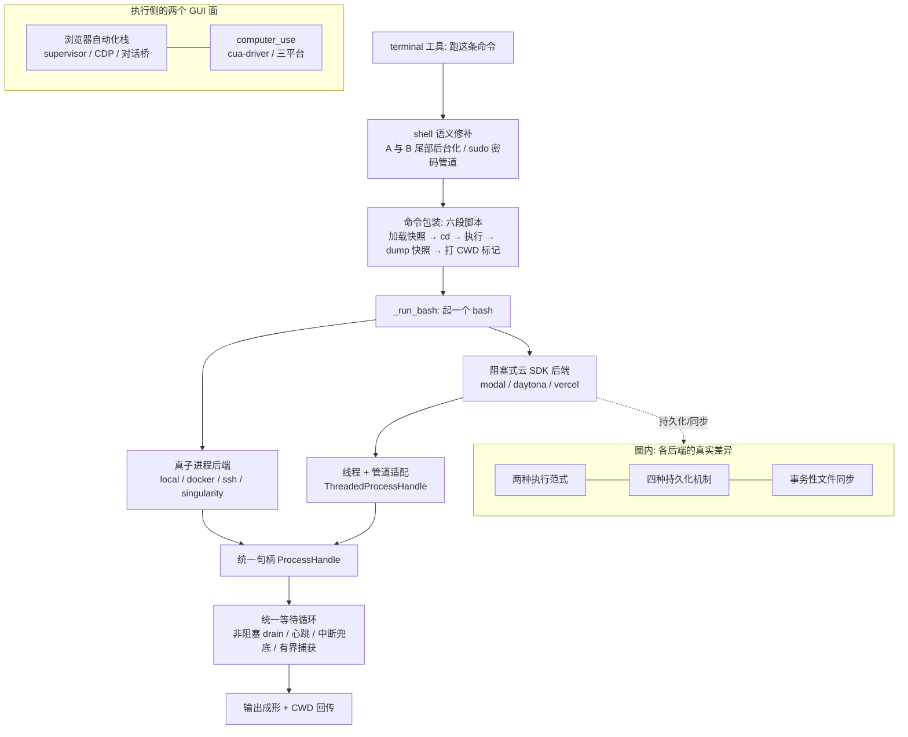

# R4 · 执行环境 —— 一条命令到底在哪、怎么跑起来

> **读者定位**:你有多年后端经验,但没读过这份代码,也不熟 LLM 生态与 Python 异步。读完这一章,你能
> 不看源码就讲清一个成熟 agent harness 的"执行侧":agent 说"跑这条命令",这条命令到底落在哪台机器、
> 用什么方式跑起来、跨命令的状态(当前目录、环境变量)怎么保住、七种天差地别的后端怎么被统一成一个
> 假象、后台进程和云沙箱怎么持久、浏览器和桌面 GUI 怎么被驱动——并据此设计同级别的执行层。
>
> **溯源约定**:`路径:行号 @ 863e313` 指基线 commit `863e31318` 下 hermes-agent 仓库根的相对路径与行号,
> 可逐条复核。每节末尾指向底稿 `notes/r4-*`,那里有更细的证据与代码原文。

---

## TL;DR(快读路径:读这一段就有全貌)

先锚几个词:

- **执行后端(execution backend)**:命令真正运行的地方。hermes 支持七种——本机(local)、Docker 容器、
  SSH 到远程机、Singularity/Apptainer(一种 HPC 容器)、以及三种云沙箱 Modal / Daytona / Vercel Sandbox。
- **spawn-per-call(每命令一进程)**:每执行一条命令,就新起一个 `bash -c` 进程跑它,跑完就没了。
- **会话快照(session snapshot)**:因为每条命令是全新进程,进程一退环境变量/函数/别名就丢了。解法是
  开工时把这些状态 dump 进一个文件,每条命令跑之前先 `source`(加载)它、跑完再重新 dump——制造出
  "有状态 shell"的假象。
- **serverless 持久化**:云沙箱在空闲/会话结束时休眠、下次唤醒时文件还在,不用时几乎不花钱。
- **CDP(Chrome DevTools Protocol)**:Chrome 浏览器暴露的一套远程控制协议,能用代码打开页面、点按钮、
  读 DOM。**computer-use**:让模型像人一样"看截图 + 动鼠标键盘"直接操作桌面 GUI 的能力。

R4 讲的执行侧,可以分成三个同心圈:

1. **统一假象**:七种后端底层能力天差地别(有的有真进程,有的只有一次性云 API 调用),但对上层要呈现
   同一个"有状态 shell"。靠 **spawn-per-call + 会话快照重放** 制造这个假象,靠一个**极窄的协议
   (ProcessHandle)** 让所有后端插进同一套等待/中断/超时逻辑。
2. **各后端的真实差异**:两种执行范式(真子进程 vs 阻塞式云 SDK 调用)、四种物理持久化机制、一套事务性
   文件同步引擎——都藏在圈内,不漏给上层。
3. **执行侧的两个特化面**:后台进程管理(崩溃恢复、防误杀、刷屏熔断),以及两条 GUI 驱动线(浏览器
   自动化栈、桌面 computer-use)。

贯穿全章的设计哲学:**把"命令在哪跑"和"命令怎么跑"彻底解耦**——上层只知道"有个有状态 shell",后端只
需回答"怎么起一个 bash",中间那套宝贵的等待/中断/持久化逻辑只写一次、所有后端白嫖。

如果你只想要结论,到这里够了。想看每个机制从一个具体场景怎么长出来,继续读。

---

## 1. 从一个场景说起:一条 `pip install` 命令的一生

你对 agent 说"装个 numpy 然后跑训练脚本"。模型回复"我要调用 `terminal`,命令是
`pip install numpy && python train.py`"。这条命令进入执行侧后:

1. **shell 语义修补**:harness 先检查这条命令有没有"会咬人"的 shell 写法(比如尾部 `&` 的优先级陷阱),
   必要时改写。这条没有,放行。
2. **命令包装**:命令不是裸着跑的,而是被包进一段固定的六段脚本——先加载上条命令留下的会话快照(所以
   如果你上一条 `cd /workspace` 了,这条能看到那个目录)、再 `cd` 过去、再执行你的命令、再把新状态
   dump 回快照、最后在标准输出里打一个标记把"命令跑完后的当前目录"回传。
3. **选后端起进程**:这段包装脚本交给当前后端。如果是本机,就真的 `subprocess.Popen(["bash","-c", ...])`;
   如果是 Modal 云沙箱,就调它的云 SDK 把脚本跑在远端——但两者都返回同一种"进程句柄"。
4. **统一等待**:一个共享的等待循环 poll 这个句柄,一边非阻塞地读输出、一边每 10 秒发心跳(免得长命令
   被"不活动超时"杀掉)、一边盯着中断信号。
5. **输出成形**:`pip` 刷屏几百行,前台路径只保留头尾窗口防止撑爆内存,溢出的 tee 到一个溢出文件可回溯。
6. **快照落地**:`train.py` 如果 `export` 了什么环境变量,已经在第 2 步的 dump 里存进快照,下条命令能看到。

这一整条流水线,**无论后端是本机还是天边的云沙箱,走法完全一样**。这一章就是拆开这条流水线,把"为什么
能一样"讲清楚。

---

## 2. 全景:一条命令的执行骨架



骨架的关键:从 `terminal` 工具到"输出成形",这条竖线上的每一步(修补、包装、等待、成形)**所有后端共享、
不被覆盖**;后端唯一要填的是中间那个 `_run_bash`——"怎么起一个 bash"。真子进程后端天然满足统一句柄;
云 SDK 后端多一层线程适配。持久化、文件同步是云后端在圈内自己的事;浏览器和 computer_use 是另开的两条
执行面,和终端命令平行。

---

## 3. 逐机制

### 3.1 统一假象:spawn-per-call + 会话快照重放

**场景**:你连着跑三条命令——`cd /workspace`、`export TOKEN=abc`、`echo $TOKEN`。你期望第三条打印 `abc`,
且它发生在 `/workspace` 里。但如果每条命令是一个独立的、跑完就退的 `bash -c` 进程,那么第二条 `export`
的变量随进程一起消失,第三条就是空的。怎么让一串"用完即弃"的进程表现得像一个连续的、有记忆的 shell?

**设计**:**会话快照重放**。基类 `base.py` 一句话定死了整簇的模型(`base.py:1-7 @ 863e313`):

> Unified spawn-per-call model: every command spawns a fresh `bash -c` process. A session snapshot (env vars,
> functions, aliases) is captured once at init and re-sourced before each command.

具体分两步。开工时(init)跑一段登录 shell,把四类状态 dump 到一个快照文件:环境变量、shell 函数、别名、
shell 选项。之后每条命令被包成六段脚本,顺序固定(`base.py:781-875`):①存好"透传变量"(见下)②`source`
快照,重放上条命令的 env/函数/别名 ③恢复透传变量 ④`cd` 到当前目录再 `eval` 执行命令 ⑤重新 dump 快照
⑥在标准输出打一个每会话唯一的随机标记,把命令跑完后的当前目录回传(`base.py:870-872`):

```python
parts.append(
    f"printf '\\n{self._cwd_marker}%s{self._cwd_marker}\\n' \"$(pwd -P)\""
)
```

上层从输出里剥掉这个标记、更新记录的当前目录。**当前目录靠标记在标准输出里带回来,不落临时文件**——所有
后端(含本机,从 issue #63255 起)统一走这条,省掉一个文件。

这套看似简单,但快照的每一处细节都是**一次真实事故**打磨出来的,值得讲三个:

- **原子写防半截读(issue #38249)**:并发的命令可能在另一条正重写快照的当口去 `source` 它,读到写了一半
  的文件。修法是快照先写进一个临时文件、再用 `mv -f` 原子替换——`mv` 在同文件系统上是原子的,读者要么
  看到旧的完整版、要么新的完整版,不会看到半截。
- **临时名必须每个写者唯一**:那为什么不用 `$$`(进程 PID)当临时名?因为在 `&` 启动的子壳里 `$$` 是
  父壳的 PID,两个并发写者会撞同一个临时名。那 `$BASHPID`?它在 macOS 自带的老 bash 3.2 上根本不存在,
  展开成空字符串、又撞名。只有 `mktemp` 跨 bash 版本都能给每个写者一个唯一路径(`base.py:666-677`)。
- **函数要按名字过滤、不能按行过滤**:dump 函数时想滤掉下划线开头的私有 helper(bash 补全的内部函数)。
  直觉写法 `declare -f | grep -vE '^_'` 是**按行**删的——它删掉了函数头那一行,却留下孤儿的 `{ …函数体… }`,
  污染快照,让之后每条命令都 `exit 127`(命令未找到)。正确做法是先用 `declare -F` 选出要保留的**名字**,
  再整体 dump(`base.py:697-699`)。

还有一处和秘密有关的细节:某些"透传变量"可能带着某个 profile 的秘密值。它们被存进**shell 变量而不是拼进
命令字符串**,免得秘密从进程参数列表或日志里泄露;快照文件本身也 `umask 077`(只有属主可读),因为它
可能含秘密。

**可迁移**:把"有状态 shell"这个假象拆成"每命令一个新 bash + 每次重放会话快照";快照必须原子写
(临时文件 + `mv`)、临时名每写者唯一(别用 PID)、函数按名字过滤(别按行);当前目录靠输出里的唯一标记
回传,免临时文件;秘密类值存 shell 变量、不进命令行,快照文件收紧权限。

> 底稿:`notes/r4-01-environment-abstraction.md`。

### 3.2 一个极窄的协议,兼容两类完全不同的后端

**场景**:同样一条 `ls`,在本机后端是真的起了个子进程、有真的管道可以读;但在 Modal 云沙箱后端,它是通过
Modal 的云 SDK 发起的一次**阻塞调用**——你调一个函数,它卡住,几秒后返回一个 `(输出字符串, 退出码)`。
一个是"正在运行、可以 poll、可以 kill、标准输出是条流"的进程,一个是"要么没返回、要么已经全拿到了"的
函数调用。上层那套宝贵的等待循环(带中断、超时、心跳、防挂死)只想写一遍,怎么让这两种东西都能塞进去?

**设计**:定义一个**极窄的鸭子类型协议** `ProcessHandle`——只要求四个方法一个属性:`poll()`(结束了吗)、
`kill()`、`wait()`、`stdout`(一条可读的流)、`returncode`(`base.py:356-371`)。

> **术语锚定 · 鸭子类型 / Protocol**:不要求后端继承某个基类,只要求它"长得像"——有这几个方法就行。
> Python 的 `Protocol` 就是这种"结构化接口"。

- **真子进程后端**(local / docker / ssh / singularity):`_run_bash` 直接返回 Python 标准库的
  `subprocess.Popen`,它天生就满足这个协议,一行适配都不用。
- **阻塞式云 SDK 后端**(Modal / Daytona / Vercel):没有真进程,于是用一个适配器
  `_ThreadedProcessHandle`(`base.py:374-445`)把"一次阻塞调用"**伪装**成一个进程:在一个后台工作线程里
  跑那个阻塞调用,把它的输出一次性写进一个 `os.pipe()`(真的操作系统管道)的写端,于是上层的等待循环
  照常 `select()` + 读管道读端;用一个 `threading.Event` 桥接 `poll()`/`wait()`(事件没置位就是"还在跑");
  `kill()` 则调用后端传进来的"取消函数"。

这个"取消函数"是点睛之笔:云后端没有本地进程可以 `SIGKILL`,所以**中断一条命令的唯一办法是掀翻整个
沙箱**——Modal 是 terminate、Daytona/Vercel 是 stop。掀了之后,下一条命令靠"用前自愈"再把沙箱拉起来
(见 3.3)。代价是:中断一条命令 = 付一次沙箱重启成本;好处是,上层那套等待/中断/超时逻辑对七种后端
**一字不改地复用**。

有一个后端是例外:**代管 Modal**(网关持有沙箱、走 HTTP REST)连 `_run_bash` 这层都不用,它直接接管了
更上层的 `execute()`,自己写轮询循环——因为当前目录追踪和环境快照在**网关服务端**做,base 那套
包装/快照机制对它整个不适用(`modal_utils.py:58-67`)。这提醒我们:抽象要允许"极端后端整段跳过"。

**可迁移**:让后端只需返回一个 `poll/kill/wait/stdout` 鸭子类型,统一的等待/中断/超时/心跳逻辑只写一次;
阻塞式 SDK 用"工作线程 + `os.pipe` 造真文件描述符 + 事件桥接"降维成进程;无本地进程的后端,中断=掀沙箱,
取消函数必须幂等且吞异常(它会在超时/中断/GC 多条路径被触发);给"整段跳过抽象"留一个逃生口。

> 底稿:`notes/r4-01-environment-abstraction.md` §1、`notes/r4-20-remote-backends-serverless.md` §1。

### 3.3 七种后端、两种范式,和"空闲休眠"的四种真相

**场景**:你今天让 agent 在云沙箱里 `pip install numpy`,会话结束;明天同一个任务再开,你希望 numpy 还在,
而且这中间不为闲置的机器付钱。README 说"Daytona 和 Modal 提供 serverless 持久化——空闲时休眠、按需唤醒"
(`README.md:29`)。这句话背后,代码到底怎么实现的?

**设计**:先说数字——**七种后端确实是七种**。工厂函数按类型分支恰好七个:local、docker、singularity、
modal、daytona、vercel_sandbox、ssh(`terminal_tool.py:1633-1760`)。代管 Modal 不是第八个,是 modal 这一
类型下的一个传输子模式。

再说持久化——查下来,"空闲休眠"底下是**四种完全不同的物理机制**:

- **Modal(直连)= 文件系统快照**:不是后台探测空闲,而是**清理时对文件系统拍一张快照、销毁沙箱**,下次
  创建时从快照 id 复活(`modal.py:451-469`)。快照 id 存在一个 JSON 台账里,键带 `direct:` 命名空间前缀,
  避免同一任务在不同传输模式下的快照串味,还带一条从旧格式裸键迁移过来的路径。
- **Daytona = 停机 / 开机同一实体**:靠"stop 同一个沙箱、下次 start 回来",文件系统天然随实体保留。注意它
  创建时显式设 `auto_stop_interval=0`(`daytona.py:125`)——**关掉了 Daytona 平台自己的空闲自动停机**,改由
  hermes 在清理时主动 `stop()`。
- **Vercel = 快照**:和 Modal 直连同构,清理拍 `snapshot()`、创建时 `source=snapshot` 复活,并额外带"每条
  命令前健康检查、沙箱被平台回收就透明重建"的自愈逻辑(`vercel_sandbox.py:448-511`)。
- **代管 Modal = 真·空闲休眠**:创建时给网关传一个 `idleTimeoutMs`(至少 5 分钟)(`managed_modal.py:189`),
  这才是"服务端 idle 到点休眠"的语义。

于是 README 那句话要**修正两处**(证据见 §5):其一,"空闲时休眠"对直连 Modal 和 Daytona 都不精确——它们
是**会话结束即休眠**(清理触发),不是后台空闲探测,只有代管 Modal 才有真 idle 计时;其二,**Vercel 同样
提供快照持久化**,README 只字未提,漏了它。

顺带一个和安全相关的**负面发现**:出口流量管控(iron-proxy,给命令注入代理 + CA 强制走审计出口)目前
**只接线在 Docker 后端**(`docker.py:393-531`),对 SSH/Modal/Daytona/Vercel/Singularity 全部零命中。也就是说
"出口管控"和"选哪个后端"是**正交**的两件事——选了远端后端不等于就有出口隔离。这是文档没讲清的一处覆盖
边界,记为学习产出。

**可迁移**:"持久化 = 会话边界拍照/停机 + 下次按键复活",别指望"idle 后台探测"除非平台(如网关)提供;
持久化台账要按传输命名空间隔离、带旧格式迁移、带"复活失败就剪枝回退"的兜底;出口管控要各后端单独接线,
不能假设"上了远端就有管控"。

> 底稿:`notes/r4-20-remote-backends-serverless.md` §2、§4。

### 3.4 文件进出沙箱:一套事务性同步引擎

**场景**:agent 在云沙箱里干活,可能新写了一个 skill(技能包)、改了缓存;退出前得把这些改动拉回你本机的
`~/.hermes`;开工时又得把你本机的凭据推上去。但推/拉可能中途失败(网络抖动),可能撞上你本机同时也改了
同一个文件,还可能一个恶意沙箱塞给你一个 20 GB 的 tar 想撑爆你的磁盘。怎么做到既高效又不丢数据不被坑?

**设计**:一个**后端无关的同步引擎** `FileSyncManager`,各后端只注入"怎么传输"的回调。三个要点:

- **正向同步是事务性的**:每个周期先算 diff(用"修改时间 + 大小"快判哪些文件变了),然后 bulk 上传 + 删除,
  **全部成功才提交**状态;任何一步抛异常就回滚,而且**故意不推进限速时钟**——好让下一个周期立刻重试而不是
  被限速挡住(`file_sync.py:241-250`)。用"修改时间+大小"快判、`sha256` 精判,避免每条命令都全量重传。
- **反向拉回有四层护栏**:凭据文件**只上不下**(防沙箱污染你的本机凭据);解压时 `extractall(filter="data")`
  防路径穿越;tar 超过 2 GiB 直接拒绝解压(防撑爆磁盘);并发的多个网关沙箱用文件锁 `flock` 串行化。冲突
  策略是 last-write-wins:你本机和沙箱都改了同一个文件,记一条警告、用沙箱版覆盖。
- **信号延迟**:同步进行到一半时,如果你按了 Ctrl+C,它先把这个中断"记下来待办"、等这次同步做完再补投
  信号——免得半路打断留下半同步状态(`file_sync.py:301-334`)。

**可迁移**:同步引擎与传输解耦(回调注入);正向"全成才提交、失败不推进限速钟",反向要有凭据单向、并发
串行、尺寸/重试、信号延迟这几层护栏 + 明确的冲突策略。这些护栏无一例外都是被真实事故打磨出来的。

> 底稿:`notes/r4-20-remote-backends-serverless.md` §3。

### 3.5 终端的 shell 语义修补:每一处对准一类真实故障

**场景**:模型产出命令 `python server.py && echo ready &`,想表达"前台跑服务器、成功后打印 ready、整体放
后台"。但它跑完后,终端拿不到 server 的退出码,而且行为透着诡异。为什么?

**设计**:`terminal_tool` 在把命令交给后端前,做几处**针对具体故障**的 shell 语义修补:

- **`A && B &` 重写(`terminal_tool.py:805-884`)**:bash 里 `&`(后台化)的优先级**低于** `&&`,所以
  `A && B &` 实际是"把整个 `A && B` 丢进一个后台子壳"——结果 A 也在后台跑了,前台终端立刻返回、拿不到
  A 的退出码。harness 把它重写成 `A && { B & }`:保住 `&&` 的错误语义(A 在前台跑、失败就不跑 B),只把
  B 放后台。这个改写幂等、只在顶层做。
- **`sudo -S` 密码管道(`terminal_tool.py:1040-1053`)**:配了 sudo 密码时,把 `sudo` 改写成 `sudo -S`
  (从标准输入读密码),密码按命令里 sudo 出现的次数重复喂进去(复合命令 `sudo a && sudo b` 要喂两行)。
  密码走标准输入、**绝不进命令字符串**,免得从进程参数或日志泄露。
- **前台/后台引导**:工具描述明确告诉模型"永远别用 `nohup`/`setsid`/尾部 `&`——要放后台就用
  `background=true` 让 Hermes 跟踪进程",把后台进程管理统一收拢到下一节的注册表。

**可迁移**:shell 语义修补要对准具体故障——`&&`/`&` 的优先级陷阱、sudo 每命令一行密码、密码走标准输入;
把"后台进程"从零散的 shell 技巧收拢成一个显式的、被 harness 跟踪的机制。

> 底稿:`notes/r4-02-docker-local-terminal-process.md` §3。

### 3.6 后台进程注册表:崩溃恢复、防误杀、刷屏熔断

**场景**:agent 用 `background=true` 起了一个 `uvicorn`(Python web 服务器)。三件事可能出岔子:①Hermes
进程重启了,还认得这个在跑的服务器吗?②过一会 agent 想杀掉它,但那个 PID(进程号)可能已经被系统回收、
分给了一个无辜的新进程——杀错了怎么办?③这个服务器每秒刷几百行日志,而 agent 设了"看到 'started' 就
通知我",结果通知被刷屏刷爆。

**设计**:后台进程交给 `ProcessRegistry` 管,针对上面三件事各有一招:

- **崩溃恢复靠 JSON 检查点**:进程会话写进一个检查点文件,Hermes 重启后能恢复对在跑进程的跟踪
  (`process_registry.py:9`)。
- **PID 复用防误杀**:每个进程会话额外存 `host_start_time`——内核记录的进程启动时刻(来自
  `/proc/<pid>/stat`)。杀之前先比对启动时刻:PID 被系统回收给别的进程后,启动时刻必然不同,于是
  "认得出这不是我当初那个进程",不误杀(`process_registry.py:103`)。
- **刷屏熔断(strike)**:盯输出匹配模式(如"Server started")触发通知,但一个刷屏进程会让匹配狂发。连续
  三个 strike 窗口后**永久禁用这个会话的模式监视**,降级成"只在进程退出时通知一次",并发一条"监视已禁用"
  的说明(只发一次)(`process_registry.py:236-333`)。降级时仍保住"退出通知",让 agent 不至于彻底失去信号。

远端沙箱里的后台进程还有一条不同的路径:因为云沙箱没有真管道,它用 `nohup` + 日志/PID/退出码三个文件
轮询来模拟"跟踪一个后台进程"。

**可迁移**:后台进程要有检查点做崩溃恢复;杀进程前用"内核启动时刻"防 PID 复用误杀;输出模式监视要配
"连续 N 次 strike 就熔断降级"防刷屏,且降级后保留一个兜底信号。

> 底稿:`notes/r4-02-docker-local-terminal-process.md` §4。

### 3.7 Docker 跨进程复用 + 孤儿回收(以及一处文档定案)

**场景**:你用 Docker 后端。Hermes 进程重启了(或崩了),那个装了一堆依赖、还跑着后台服务的容器,该保留
还是删掉?每次重建要几秒、还丢容器内的后台进程;但留着又怕堆积一堆没人管的孤儿容器。

**设计**:默认 `persist_across_processes=True`(`docker.py:871`),清理是**三态**的:显式拆除就 stop+rm;
每进程隔离模式就 stop+rm;而**默认的 persist 模式对容器 no-op**——只丢掉进程内的句柄,让下次启动靠 Docker
标签重新探到那个还在运行的容器直接接管(`docker.py:1958-1966`)。这是 issue #20561 的契约:容器活过 Hermes
进程,容器内的后台进程也继续活,下次启动瞬间复用。

但 atexit(退出钩子)会被 SIGKILL/OOM/崩溃绕过,留下真正的孤儿容器。所以配一个**孤儿回收器**:扫描带
hermes 标签、状态是 exited、且退出时刻早于 600 秒前的容器删除。三条安全约束:**运行中的容器永不回收**
(可能属于正在用它的兄弟 Hermes 进程,杀了会让兄弟的命令崩)、默认只扫本 profile、只删够老的(刚退出
正要被复用的不动)(`docker.py:144-164`)。

**这里定一桩 R1 就挂起的账**:官方文档 `features/tools.md:88` 白纸黑字写"The container is stopped and
removed on shutdown(容器在关机时停止并删除)"。但代码默认是 persist、清理对容器 no-op、容器跨进程存活。
更妙的是**同一段的下一句**(`tools.md:90`)又提到一个 `container_persistent` 开关"控制 /workspace 和 /root
是否跨 Hermes 重启存活"——:88 说"关机即删"、:90 说"有开关让它存活",**同一页自相矛盾**。以代码为准:
**默认跨进程持久,关机不删**;:88 那句只在把开关关掉时才成立。

**可迁移**:容器复用用"标签 + (任务,profile) 键",persist 模式清理对容器 no-op;配一个"退出且够老才删"的
孤儿回收器兜住 SIGKILL/OOM 绕过退出钩子的情况,且永不碰运行中的容器。

> 底稿:`notes/r4-02-docker-local-terminal-process.md` §1、`notes/r4-90-doc-conflict-rulings.md` 定案 1。

### 3.8 两个支撑件:跨代理文件新鲜度 + V4A 补丁

**场景(一次并发覆盖故障)**:两个子代理在同一进程、同一文件系统上并发干活。子代理 A 读了 `config.py`,
子代理 B 随后改了它,然后 A 拿着**读到的旧内容**去写 `config.py`——把 B 的改动覆盖了。R2 学的分段调度器
只管**单个 agent 内**一批工具的路径冲突,管不了**跨子代理**这种读后写竞态。

**设计**:一个进程级单例 `FileStateRegistry`,记三样东西——每个 agent 对每个文件的读时间戳、每个文件的
全局最后写者、每个路径一把锁。文件工具写之前调 `check_stale`:如果本 agent 上次读之后有别人写过这个文件,
返回一个警告让它重读再写(`file_state.py:142`)。它刻意独立于"单 agent 内的路径冲突检查",三层各管一段
并发粒度。有逃生阀 `HERMES_DISABLE_FILE_STATE_GUARD=1`。

另一个支撑件是 **V4A 补丁解析**(`patch_parser.py`)。V4A 是多个编码 agent(codex、cline 等)共用的补丁
格式,一份文本里能一次做多个操作(更新/新建/删/移文件)。解析分两阶段:先把文本解析成结构化操作,再通过
一个文件操作接口逐个落地。它绕过常规写管线来保证"一份补丁多操作"的原子性,但仍尽力把语法诊断和 lint
结果单独接回来。补丁定位复用 R3 讲的模糊匹配层——解析器只管格式,模糊匹配管容错定位。

**可迁移**:跨并发单元的"读后写覆盖"要用进程级注册表(记读时间戳 + 全局最后写者 + 每路径锁,写前检查
新鲜度);多操作补丁格式的解析与落地两阶段分离,定位交给专门的模糊匹配层。

> 底稿:`notes/r4-50-patch-parser-file-state.md`。

### 3.9 浏览器自动化栈:一个受监管的浏览器

**场景**:agent 要去一个网页上填表、点提交。这中间弹出一个"确定要离开吗?"的原生对话框(dialog)——它会
**阻塞**整个页面,自动化脚本就卡死了。而且,agent 驱动的浏览器如果直接暴露给不可信的网页,网页可能反过来
探测、干扰自动化。怎么驱动一个浏览器,既能自动操作、又能处理这些阻塞点、还不被网页反制?

**设计**:一个 browser **supervisor(监督器)** 通过 CDP(Chrome DevTools Protocol)驱动浏览器,核心是一座
**对话桥(dialog bridge)**。它往页面里注入拦截逻辑,把原生对话框转成可编程的记录:哪些自动关、哪些留给
agent 决定,都被记进一个环形缓冲区(最近 20 条)。这个缓冲区在代码里叫 `recent_dialogs`。桥接用一个刻意
不可解析的假主机名 `hermes-dialog-bridge.invalid`(`browser_supervisor.py:95`)当内部通道标识,避免和真实
网络请求混淆。

这里有一处**文档定案**:开发者文档有两处把这个字段叫 `browser_state`(`browser-supervisor.md:89`、
`browser.md:591`),但代码里的权威名是 `recent_dialogs`——而且**同一份开发者文档的别处**(JSON 示例、
字段说明)又用的是 `recent_dialogs`,文档内部自己就不一致。以代码为准:字段叫 `recent_dialogs`。

**可迁移**:驱动浏览器要有一层监督器承接"阻塞式原生对话框"这类自动化杀手,把它们转成可编程记录 + 策略
(自动关/留给 agent);内部通道用不可解析的假标识和真实流量隔离。

> 底稿:`notes/r4-30-browser-automation.md`。

### 3.10 computer_use:像人一样操作桌面,但不抢你的鼠标

**场景**:有些活儿没有 API、只有 GUI——一个桌面应用的按钮、一个只认鼠标的老软件。你想让 agent"看着屏幕、
动鼠标键盘"把它干了,但你**同时也在用这台电脑**——你不希望 agent 抢走你的真实光标、抢走键盘焦点、把你
正在看的窗口切走。

**设计**:**后台(background)computer-use**。动作打进目标窗口,但不抢真实光标、不抢焦点、不切桌面,人和
agent 能同时用一台机器。实现上,Hermes **自己不调操作系统 API**,而是把桌面控制外包给一个第三方 Rust
二进制 **cua-driver**(来自 trycua/cua 开源项目),二者之间走 **MCP over stdio**。

> **术语锚定 · MCP over stdio**:MCP 是让"宿主进程 ↔ 工具进程"用 JSON-RPC 通信的协议;这里 Hermes 是
> 客户端、cua-driver 是服务端,传输层就是把子进程的标准输入输出当管道。

几个要点:

- **恰好三个平台**,以 frozenset 硬编码、三处一致:`_RUNTIME_PLATFORMS = frozenset({"darwin","win32","linux"})`
  (`permissions.py:34-35`)。每平台底层栈不同(macOS 私有 SkyLight、Windows Win32 API、Linux 最新加入、X11
  今天可用、Wayland 经 XWayland),但对 Hermes 全透明,藏在 cua-driver 里。
- **截图三模式**:`som`(截图 + 给每个可点元素画数字编号 + 无障碍树)、`vision`(纯截图)、`ax`(纯无障碍树、
  无图,给纯文本模型用)。模型看到编号后 `click(element=14)`,比让它报像素坐标可靠得多。
- **"传输成功"不等于"真的生效"**:动作结果里 `ok` 只表示传输层成功,另带一套语义裁决字段(有没有回读
  确认、效果是 confirmed 还是 suspected_noop、下一步该不该升级投递档),让模型按"验证 → 升级"的阶梯走
  (`backend.py:73-80`,issue #67052)。老版本 driver 上不支持的高级投递档会**明确拒绝而不是静默降级**。
- **每次 spawn cua-driver 都洗环境**:一条横切安全策略——启动这个第三方二进制的每一个点,都把 provider
  密钥从子进程环境里剥掉(`ANTHROPIC_API_KEY` 等一律不继承),有专门的测试逐点钉死。

一处**文档定案**(修正子代理的初判):截图的**视觉路由**——当主模型是纯文本模型时,把截图转交给配置里的
辅助视觉模型(`vision_routing.py`,issue #24015)——这个机制的**通用形态是有文档的**(`vision_analyze`、
`browser_vision` 两个工具的同类回退都写了),但**独独 computer_use 的 capture 路径没在它的工具文档里点明**。
所以准确说法不是"整个机制没文档",而是"窄口径缺口":同款回退别处写了、这里漏了——这正和 #24015 那个
"配了辅助视觉模型却被静默忽略"的回归性质吻合。以代码为准:computer_use 的截图会走和 `vision_analyze` 同款
的视觉路由。

**可迁移**:GUI 控制外包给专门的驱动进程(用 MCP/stdio 这类松协议对接),平台差异藏在驱动里;给模型的是
"编号叠加截图"而非裸坐标;动作结果要区分"传输成功"和"语义生效",配"验证 → 升级"阶梯;对第三方驱动
子进程,每个 spawn 点都要剥宿主密钥。

> 底稿:`notes/r4-40-computer-use.md`。

---

## 4. 可迁移的设计原则(造你自己的执行层时怎么做)

把这一簇提炼成七条:

1. **"在哪跑"和"怎么跑"解耦**。上层只认一个"有状态 shell";后端只回答"怎么起一个 bash"。中间的等待/
   中断/超时/持久化逻辑只写一次,所有后端复用。
2. **有状态假象 = 每命令新进程 + 会话快照重放**。快照要原子写、临时名每写者唯一、函数按名过滤;当前目录
   靠输出标记回传。这些细节每一个都对应一类真实事故。
3. **用极窄协议吸收后端差异**。一个 `poll/kill/wait/stdout` 鸭子类型,就能把"真子进程"和"阻塞式云调用"
   统一;后者用"线程 + 真管道 + 事件桥接"降维,中断=掀沙箱、取消函数幂等吞异常。
4. **持久化在会话边界,别指望后台探测**。拍照/停机 + 按键复活;台账带命名空间隔离、旧格式迁移、复活失败
   剪枝回退。
5. **同步要事务化 + 多层护栏**。全成才提交、失败不推进限速钟;反向拉回要凭据单向、并发串行、尺寸上限、
   信号延迟、明确冲突策略。
6. **后台进程要防三件事**:崩溃(检查点恢复)、PID 复用(启动时刻比对)、刷屏(strike 熔断降级但保退出信号)。
7. **横切策略要覆盖每一个触发点**。剥密钥、防误杀、防绕过——不能只在"主路径"上做,要在每一个 spawn 点、
   每一种 shell 绕过变体上都做,并为每一个写回归测试。

---

## 5. 地图与代码的出入

官方文档是作者画的地图,与代码冲突时以代码为准。本簇范围内逐条查实(完整证据在
`notes/r4-90-doc-conflict-rulings.md`),结论融进上面的叙述:

- **`tools.md:88` "容器关机即删" —— 证伪(对默认态)**。默认 persist、清理对容器 no-op、容器跨进程存活
  (#20561);而且 :88 与下一句 :90 的 `container_persistent` 开关**自相矛盾**(§3.7)。
- **`README:29` serverless 持久化 —— 数字对,名单和时机要修正**。七种后端数字准确;但"空闲休眠"对直连
  Modal / Daytona 其实是"会话结束即休眠"(清理触发),只有代管 Modal 有真 idle 计时;且 **Vercel 同样提供
  快照持久化,README 漏了它**(§3.3)。
- **`tools.md:148` Vercel 快照语义 —— 证实**,且比 README 那句笼统的"hibernate"精确("快照不保留活进程/
  PID/同一沙箱身份")。
- **browser `browser_state` 命名 —— 证伪**。权威字段名是 `recent_dialogs`,`browser_state` 是文档两处残留
  旧名(文档内部自身亦不一致)(§3.9)。
- **computer_use 视觉路由(#24015)—— 修正为窄口径缺口**。通用视觉回退有文档,独 computer_use 的 capture
  路径没点明(§3.10)。
- **两处补白**:terminal 工具描述说"文件系统/当前目录/环境变量跨调用持久",漏了**函数和别名也持久**;
  iron-proxy 出口管控**只接线 Docker 后端**,远端后端和 Singularity 不享有——出口管控与后端正交(§3.3)。

一句话总结:hermes 执行侧的**文档在"是什么"层面大体正确,但在"默认值/触发时机/覆盖边界"这些精确处
普遍滞后**——而这些精确处恰恰是重实现时最容易踩坑的地方。

---

## 6. 延伸

要证据、代码原文、更细的取舍讨论,下钻对应底稿:

| 主题 | 底稿 |
|---|---|
| 环境抽象基类:spawn-per-call / 快照 / ProcessHandle / 等待循环 | `notes/r4-01-environment-abstraction.md` |
| 本地/Docker 后端 + 终端 shell 语义 + 后台进程注册表 | `notes/r4-02-docker-local-terminal-process.md` |
| 远端后端(ssh/modal/daytona/vercel/singularity)+ serverless 持久化 + 文件同步 | `notes/r4-20-remote-backends-serverless.md` |
| 浏览器自动化栈:supervisor / CDP / 对话桥 | `notes/r4-30-browser-automation.md` |
| computer_use:cua-driver / 三平台 / 投递阶梯 / 视觉路由 | `notes/r4-40-computer-use.md` |
| V4A 补丁解析 + 跨代理文件新鲜度守卫 | `notes/r4-50-patch-parser-file-state.md` |
| 文档冲突定案(8 条) | `notes/r4-90-doc-conflict-rulings.md` |
| 行为规格测试运行记录(664 用例) | `notes/r4-95-tests.md` |
