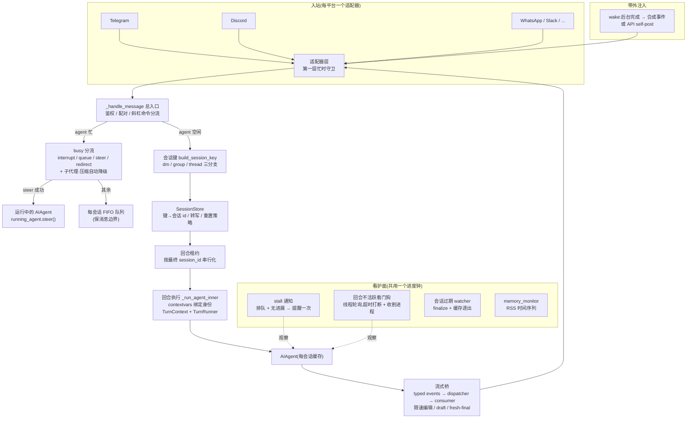

# r7 · 网关会话核心与多路复用 —— 一个 agent 内核如何同时接待几十场对话

> **读者定位**:有多年后端经验(Go/Java 均可)、没读过本仓库、不熟 LLM provider 生态与
> Python 异步生态的工程师。读完本章你应当能向别人复述:网关怎么把一条聊天消息变成一次
> agent 回合、怎么保证几十场并发对话互不串线、agent 忙时新消息去了哪、卡死了谁来管。
>
> **溯源约定**:关键断言标 `路径:行号 @ 863e313`(hermes-agent 仓库固定基线 commit 的缩写),
> 打开对应文件行号即可逐字核对。本章不要求读代码,行号只为可验证。

## TL;DR(快读路径)

1. **hermes-agent 的网关(gateway)是一个长驻进程**,同时连接 Telegram、Discord、Slack、
   WhatsApp 等 30+ 聊天平台;所有平台的消息汇入同一个 `GatewayRunner`(单文件 27,146 行的
   `gateway/run.py` 是它的主体),复用同一套 agent 内核。
2. **隔离靠一把确定性"会话键"(session key)**:从消息来源(平台/聊天/线程/发信人)拍出
   一个稳定字符串,如 `agent:main:telegram:dm:12345`。同键 = 同一场对话(共享历史),
   异键 = 完全隔离。DM 按人隔离、群默认按"群 × 人"隔离、线程默认全员共享——三条规则
   全部集中在一个 130 行的函数里(`gateway/session.py:1058 @ 863e313`)。
3. **并发安全靠三层互相配合的机制**:任务局部的 contextvars 会话上下文(治"我是谁"被并发
   覆盖)、按会话键分层的状态容器 SessionState(治 19 个裸 dict 的清理漂移)、按**最终
   会话 id** 加锁的回合租约 turn lease(治两个路由键写同一份转写的交错)。
4. **agent 忙时的新消息有四种去处**:打断(默认)、排队、steer(把话直接塞进正在跑的回合)、
   redirect(原地转向)。正在带子代理干活或正在压缩上下文时,打断会被自动降级为排队——
   "一句闲聊不能毁掉几分钟的子代理工作"是从事故里学来的机制。
5. **没人看着的部分交给四条看护线**:stall 通知(排队消息 + 5 分钟无进展 → 提醒用户一次)、
   回合级不活跃看门狗(独立线程,默认 30 分钟无活动 → 打断并精确收割该回合的进程)、
   会话过期 watcher(按重置策略 finalize + 逐出缓存)、RSS 内存监控(5 分钟一行时间序列
   ——但它是个反转:模块与测试俱全,**全仓无生产调用点**,见 §3.6)。
   前两条共用同一个"进度钟"(agent 活动时间戳),绝不各自发明时钟。

## 1. 从一个场景说起

你在 Telegram 给机器人发了一句"帮我看看服务器磁盘"。这条消息要经历什么?

1. **Telegram 适配器**把原始 update 归一化成 `MessageEvent`(带来源:平台、chat、发信人、
   线程)。适配器层先查"这场对话是不是正有回合在跑"——**在跑就先交给网关装进来的
   "忙时策略机";策略机说"我处理了"就到此为止,它不接手,消息才落进适配器自己的 pending 槽**
   (这是双层守卫的第一层,属平台接入面,下一轮细讲)。

   `gateway/platforms/base.py:5711 @ 863e313`

   ```python
               if self._busy_session_handler is not None:
   ```

   这个 handler 由 `GatewayRunner` 在装配适配器时塞进来(`gateway/run.py:11096 @ 863e313`、`:12468`、
   `:13410` 三处),**所以"忙时怎么办"的决策权在网关层,不在适配器层**——这一点很关键,
   下面 §3.4 讲的四选一(interrupt / queue / steer / redirect)全都发生在网关侧。
2. **`GatewayRunner._handle_message`**(`gateway/run.py:14328 @ 863e313`,1,400 行的总入口)
   接手:鉴权(陌生人 DM 会自动收到一个配对码,让机器人主人在 CLI 批准)、斜杠命令分流、
   然后按来源拍出会话键。
3. **会话解析**:`SessionStore` 用会话键查出(或新建)这场对话的持久会话——包括它在
   SQLite 里的转写(transcript)。如果上一场对话按策略已过期(如闲置 8 小时),这里自动开新会话。
4. **回合执行**:拿到"回合租约"后装载历史,把缓存的(或新建的)`AIAgent` 塞进线程池跑
   回合;agent 的流式输出经过一座"流式桥"变成 Telegram 里那条**边生成边编辑**的消息。
5. **回合结束**:转写落库、租约释放、per-turn 状态清空、agent 留在缓存里等下一条消息。

顺利路径不难。难的全在并发与异常里——真实事故串出了本章全部机制:

**一次真实的串线事故**(contextvars 之前):两条消息同时到,旧代码把"当前线程 id"写进
进程全局的 `os.environ`,消息 A 的值被消息 B 覆盖,A 的后台通知发进了 B 的线程
(`gateway/session_context.py:10-18 @ 863e313` 的 docstring 原文就是这场事故)。

**一次真实的转写绞碎事故**(#64934):用户在第二个聊天窗口 `/resume` 了同一场命名会话。
忙时守卫按"路由键"加锁,而两个窗口是两个路由键——守卫全绿。两个回合各自装载历史、
并发跑、交错落盘,最后转写里出现永久的 `user;user` 交替楔子,修复例程每次请求都在修、
永远修不完(`gateway/turn_lease.py:3-15 @ 863e313`)。回合租约因此诞生。

## 2. 全景



一句话概括协作:**入站统一汇入单入口,身份由键决定,写序由租约保证,输出由桥翻译,
异常由看护线兜底,后台结果由 wake 回注**。

## 3. 逐机制

### 3.1 确定性会话键 —— 多路复用的地基

**场景**:同一个人今天在 DM 里、明天在群里、后天在群的一个话题(thread)里跟机器人说话,
每一条消息都必须稳定映射到"该在哪场对话里续写"。映射错一次 = 有人看到别人的历史。

**设计**:不查表、不发号,**纯函数拍键**——同样的来源永远拍出同样的键:

`gateway/session.py:1103-1115 @ 863e313`
```python
    if source.chat_type == "dm":
        ...
        dm_parts = [ns, platform, "dm"]
        if slack_scope_id:
            dm_parts.append(slack_scope_id)
        if dm_chat_id:
            dm_parts.append(dm_chat_id)
            if source.thread_id:
                dm_parts.append(source.thread_id)
            return ":".join(str(part) for part in dm_parts)
```

三条隔离规则(`gateway/session.py:1058-1094 @ 863e313` docstring 与实现一致):
- **DM 按人/私聊隔离**;万一适配器没给 chat_id,回落到发信人 id——否则所有无 chat_id 的
  DM 会塌缩进一个共享会话,"一个缓存 agent 服务多个人的对话——跨用户历史泄漏"
  (gateway/session.py:1119-1121 @ 863e313 注释原文的直译)。
- **群默认"群 × 人"隔离**(`group_sessions_per_user=True`):同一个群里你和同事各有各的
  上下文,互不觉察。
- **线程默认全员共享**(`thread_sessions_per_user=False`):Telegram 话题、Discord thread、
  Slack thread 是"大家看得见的同一场讨论",共享才符合直觉(gateway/session.py:1087-1091 @ 863e313)。

三个精心处理的边角,都是真实平台的坑:
- **WhatsApp 身份规范化**:桥接层会在 JID/LID 两种别名间翻转,不规范化就会"同一个人
  两个隔离会话"(gateway/session.py:1105-1106 @ 863e313、1138-1142)。
- **Discord 预期线程**(prospective thread):在频道里发起、平台自动开线程回复的模式下,
  发起消息还没有 thread_id;适配器提前告知"回复将进哪个线程",键直接按那个未来线程拍,
  并把 chat_type 槽归一为 "thread",让发起消息与后续线程消息**字节相同**——"频道发起、
  线程继续"落在同一场会话(gateway/session.py:1144-1159 @ 863e313)。
- **多档案命名空间**:键首段 `agent:main` 的 "main" 不是分支名,是命名空间槽。多 profile
  多路复用(一进程多人格)把它换成 `agent:<profile>`,位置布局不变——旧会话字节兼容,
  两个 profile 服务同一个群也不会撞键(gateway/session.py:1038-1055 @ 863e313)。

**取舍**:纯函数键的代价是"改规则 = 换键 = 旧会话找不回",所以规则极端保守,新增判别
维度都走"追加段"而不是改老段;收益是零状态、零协调,任何进程任何时刻拍出的键都一致。

### 3.2 "我是谁"与"我的东西在哪"——contextvars 与 SessionState

**场景重演**(§1 的串线事故):并发下,进程全局变量装不下"每条消息各自的身份"。

**身份**:`gateway/session_context.py` 用 18 个 `ContextVar`(Python 的任务局部变量,
asyncio 每个任务一份)承载会话身份,并配了一套三态协议:值 / 显式清空(`""`)/
从未设置(哨兵 `_UNSET`,此时才回落 `os.environ` 兼容 CLI 与 cron)。最反直觉也最重要的
一条:**消息处理器入口要先"重置"再"绑定"**——asyncio 的 `create_task` 会快照父任务的
上下文,消息 B 的任务可能生在"消息 A 已绑定"的上下文里,不重置就有一个以 A 的身份
起子进程的窗口(gateway/session_context.py:324-336 @ 863e313,配套测试 test_session_context_inheritance)。

**东西**:`gateway/session_state.py` 把 GatewayRunner 曾经的 ~19 个裸 dict 按**清理时机**
收进一个三层容器:

| 层 | 清理时机 | 装什么 |
|---|---|---|
| `TurnState` | 每回合结束 | 运行中 agent、开始时间、并发槽、租约 token |
| `ConversationState` | 会话边界(/new、过期、auto-reset) | /model /reasoning /fast 覆盖、队列、pin |
| `PersistentState` | 各自生命周期 | 审批、run_generation(**永不清**)、hygiene 连败 |

为什么按清理时机而不是按语义分?因为三类真实事故(#48031、#58403、#10702、#35809)
全是"清理清单漏了新加的 dict"——把清单变成 dataclass 的 `clear()`,"加字段忘清理"
从 code review 项变成不可能(gateway/session_state.py:3-19 @ 863e313)。

### 3.3 回合租约与 run generation —— 写序与迟到者

**事故重讲**(#64934,§1 的绞碎事故):守卫按路由键,转写按会话 id,`/resume` 让两键指一
id,守卫集体失明。**修法**:在"会话解析已定案、历史尚未装载"的唯一位置,按**最终
session_id** 加一把 asyncio 锁(`gateway/run.py:16584-16589 @ 863e313`);同键消息本来就被守卫扣住,
所以这把锁在别名路由之外永远无争用。三条安全性质值得抄:

1. **身份检查释放**:token 记录 (路由键, 代数),只有"当前持有者本人"能释放——异常
   回退路径上的过期 token 永远放不掉新回合的锁(gateway/turn_lease.py:274-302 @ 863e313)。
2. **超时 fail-open**:等锁超过阈值(与回合看门狗同钟,默认 1800s)就**降级不串行化**
   继续跑,响亮记 ERROR——楔死会话比转写交错更糟(gateway/turn_lease.py:190-208 @ 863e313)。
3. **压缩中途换 id 就"同锁挂双键"**:上下文压缩会在回合中把会话 id 轮换成子 id;
   `rebind` 把同一把锁对象再登记到新 id 下,而不是搬锁状态(gateway/turn_lease.py:215-272 @ 863e313)。

**迟到者**由 run generation 治:每个回合领一个单调递增代数,/stop /new 把代数翻新,
旧回合迟到的落盘/清理副作用先验代、代不对就丢弃(gateway/run.py:23014-23047 @ 863e313,#28686 教训:
计数器**永不重置**)。超时收割进程也走同一闸门——发现新回合已认领会话就放弃收割,
绝不误杀新回合的进程(gateway/run.py:2848-2873 @ 863e313)。

### 3.4 忙时策略 —— interrupt / queue / steer / redirect 与自动降级

**场景**:agent 正在跑一个几分钟的任务,你又发了一句话。四种合理结局,选错的代价不对称。

决策序(`gateway/run.py:8867-9003 @ 863e313`,主线亲读):

1. **合成事件永不打断**:后台完成通知(委托任务、终端 watch)以 `internal=True` 回注,
   若被当成用户文本,默认 interrupt 模式会打断正跑的回合并回一句"⚡ Interrupting"——
   与"完成结果只在空闲时浮出"的不变量正相反,所以第一条就挡下、静默排队(8867-8879)。
2. **两个自动降级**(interrupt → queue):正带活跃子代理(#30170——"一句对话式跟进不该
   毁掉几分钟的子代理工作")、或上下文压缩飞行中(#56391)。显式 /stop /new 不受影响,
   操作员永远有强制刹车(8897-8926)。
3. **steer**:把跟进话**塞进正在跑的回合**(`running_agent.steer(text)`),不打断不排队。
   先决条件苛刻:有可注入文本、纯文本或"全部媒体都是已折叠成文本的语音转写"(#58780:
   否则语音在 steer 模式静默退化)、agent 真实存在且有 `steer()`。**任何失败回落排队**,
   消息不丢(8929-8961)。
4. **redirect**:声明了 `_supports_active_turn_redirect` 能力的 agent,纯文本跟进直接原地
   转向(8962-8976)。
5. **收尾铁律**:steer/redirect 成功的消息**不再入队**(已进回合,再排队 = 双投);其余
   走每会话 FIFO——不做文本拼接合并,因为 newline 合并曾把两条独立消息糊成一个回合,
   毁掉消息边界(#43066 sub-bug 2;媒体连拍/相册保留合并语义)(8978-8994)。

行为规格:test_steer_command、test_internal_event_never_interrupts_busy_session、
test_compression_interrupt_demotion_56391 等,本轮全部跑通。

### 3.5 流式桥 —— 从模型 token 流到聊天软件里那条会动的消息

**场景**:模型在 agent 的工作线程里同步吐 token;Telegram 那头要看到一条**平滑生长**的
消息,还不能触发平台的编辑频控(flood control)。中间隔着:线程→事件循环、同步→异步、
"什么内容"→"怎么呈现"三道翻译。

三层结构(各一个文件,职责刻意分开):
- **`stream_events.py`(171 行)**:类型化事件词汇表——MessageChunk / MessageStop(带
  final 位)/ Commentary(工具间隙的完整插话)/ ToolCallChunk / ToolCallFinished /
  LongToolHint / GatewayNotice。冻结 dataclass、零行为零 IO,只描述**发生了什么**。
  历史动机写在模块头:过去 agent 用一把松散回调直接驱动投递,"工具进度气泡和流式草稿
  在 Telegram 上互相赛跑",工具格式化逻辑长在 agent 侧而只有网关知道平台能渲染什么
  (gateway/stream_events.py:1-17 @ 863e313)。
- **`stream_dispatch.py`(132 行)**:同步路由器。文本事件进 consumer;工具事件交
  **适配器**格式化——适配器可返回 None 把事件"吃掉"(平台渲染不了工具 chrome);
  "new" 模式按工具名去重。呈现层异常绝不穿透进 agent 工作线程(dispatch:88-93)。
- **`stream_consumer.py`(2,410 行)**:真正的投递引擎。同步侧 `on_delta()` 进线程安全
  队列,异步侧 `run()` 消费:缓冲、限速、渐进编辑(edit transport,Telegram/Discord/Slack
  通吃);Telegram DM 可升级为原生 draft 动画;think 标签过滤(与 CLI 同一套标签表);
  代码围栏跨消息平衡(截断的 ``` 会让 Discord 把后半条全渲染成代码块——自动补栏);
  连续 3 次 flood 失败永久降级停编辑;**fresh-final**:流了很久的回答,终稿改发新消息,
  让消息时间戳反映完成时刻(移植自 openclaw#72038);终稿去重协议(`_delivered_final_text`
  记录已投终稿字节,#71643:一次"成功但只带着旧预览快照"的 finalize 编辑不能抑制完整
  发送;#78541:无记录的分片投递不继承旧信任)。

### 3.6 看护面 —— 单一进度钟上的四条线

**场景**:你让 agent 编译一个大项目,它回了句"开始了",然后**十分钟没动静**。
你不知道该等还是该敲 `/stop`。而网关面临的是同一个问题的更难版本:它必须**自动**判断
这十分钟是"正在干活"还是"死了",判错任何一边都很糟——把干活判成死,会打断一次成功的编译;
把死判成干活,会让这条会话永远挂着,占着租约、占着内存、还挡住用户的下一条消息。

难点在于**"没动静"不等于"没进展"**:一个跑十分钟的 `make` 命令,从消息层面看和死锁一模一样。
所以第一个设计决定是**换一口钟**——不看"回合开始多久了",也不看"上一条消息多久前到的",
只看 agent 自己报的活动时间戳。

**原则**:判定"卡没卡"的钟只有一个——agent 自己维护的活动时间戳
(`get_activity_summary()`,#72039 契约)。回合开始时间、消息到达时间都**不是**进度
(长工具正常跑会被误判)。四条线共用这口钟、各管一事:

| 线 | 跑在哪 | 触发 | 动作 |
|---|---|---|---|
| stall 通知 | asyncio,30s 一轮 | 有排队消息 + 无进展 ≥300s | 提醒用户**一次**,恢复后解闩 |
| 回合看门狗 | **独立线程**,5s 轮询 | 无活动 ≥1800s | 硬打断 + 按基线收割该回合进程 |
| 会话过期 | asyncio,300s 一轮 | 重置策略到期 | finalize 钩子 + 缓存逐出 + 边界清理 |
| 内存监控 | daemon 线程,300s | 定时 | 一行 `[MEMORY] rss=... gc=... threads=...` |

三个值得抄的细节:
- stall 策略是**纯函数**(session_stall.py 全文 121 行),观测缺失(None)**不算恢复**
  ——"Do not treat observation gaps as recovery"(gateway/session_stall.py:57 @ 863e313);
- 看门狗特意是线程:它的假设敌之一就是事件循环被饿死,守护不能与被守护者同生死
  (gateway/run.py:2963 @ 863e313 docstring 原文);
- 过期 finalize 连续失败 3 次后"标记完成、少清一点",可用性优先于完美清理
  (gateway/run.py:12028-12037 @ 863e313)。

**一个反转作结**:表里第四条线(内存监控)是本轮最意外的发现——模块从 cline 移植、
注释详尽、测试齐全,但**全仓没有任何生产调用点**,连它 docstring 声称的
`logging.memory_monitor` 配置块都不存在于 hermes_cli/config.py(主线全仓 grep 复核,
详见 notes/r7-90 B8)。它是一个"移植完成、从未接线"的休眠模块。这个教训比机制本身
值钱:**测试通过 ≠ 已接线**;盘点一个系统的看护面,要沿"启动路径有没有调用点"验证,
不能只看模块存在与测试绿。

### 3.7 带外注入 —— wake 的两条路

**场景**:你让 agent 后台跑一个长任务,回合早结束了;两小时后任务完成,结果要**作为
新回合**回到那场对话。

`gateway/wake.py` 按适配器能力位二分:
- **能推送的平台**(Telegram 等):构造 `MessageEvent(internal=True)` 走
  `adapter.handle_message`——与真实消息**完全同管道**,享受全部守卫(internal 位保证
  它绝不打断正跑的回合,见 §3.4)。
- **无状态的 API server**:走 handle_message 会用派生键跑出一个**平行的、没人看的会话**
  (键永远对不上真实回合用的裸 `X-Hermes-Session-Id`);所以改为**自 POST** 到进程内
  API server 的 `/v1/chat/completions`,带裸会话 id 头——与真实回合同一入口,续的是
  真会话(gateway/wake.py:10-20 @ 863e313;这段 docstring 本身就是一页架构课)。
  `API_SERVER_KEY` 缺失是硬错误:未认证的 API server 会 403 掉会话续写,与其让唤醒
  落进没人看的新会话,不如响亮失败(gateway/wake.py:104-121 @ 863e313)。429(并发帽)退避重试,
  **一切失败上抛**——调用方持有游标,只有它能决定重投;静默丢 = 用户永远等不到通知。

**共同原则:回注必须走真实入口,不造第三条特权通道。**

### 3.8 每会话 agent 缓存 —— 复用与逐出

**场景**:你连发两条消息,中间隔五秒。第一条让网关从零装配了一个 agent——建 LLM 客户端、
拼工具 schema、连 memory provider、握手若干个 MCP 服务器,几百毫秒到几秒不等。
**第二条消息没有理由再付一次这个钱。** 但"缓存住"立刻带来三个新问题:
一台网关同时服务几百个 chat,缓存会吃光内存;用户中途 `/model` 换了模型,缓存里那个还是旧的;
会话过期被清理了,缓存里那个 agent 却还攥着 MCP 连接不放。
**下面三条治理线,一条对一个问题。**

构建一个 `AIAgent`(LLM 客户端、工具 schema、memory provider、MCP 连接)很贵,网关按
会话键缓存它。三条治理线防止缓存吃光内存:LRU 上限 128 + 空闲 TTL 1 小时
(gateway/run.py:69-88 @ 863e313 常量区)+ 会话过期联动逐出(§3.6)。复用判据是**配置签名**
(`_agent_config_signature`,gateway/run.py:22608 @ 863e313):会话的模型/工具/人格覆盖变了,签名变,
旧 agent 弃用重建——"缓存的 agent 必须等价于按当前配置新建的 agent"。逐出前先提交
记忆(memory commit before soft evict,gateway/run.py:23473 @ 863e313),学到的东西不随缓存蒸发。

### 3.9 多 profile 多路复用 —— 一进程多人格

**场景**:你想在同一台机器上跑两个机器人——一个"工作助手"(接公司 Slack、只开只读工具、
记忆库单独一份),一个"家用助手"(接家里的 Telegram、能开灯、能下单)。
最省事的做法是起两个进程,但那意味着两份内存、两套凭据管理、两个要看的日志。
hermes 的做法是**一个进程装多个 profile**。

这件事听起来只是"多开几个配置",真正难的是三处**会打架的共享资源**:
两个 profile 会不会串会话(同一个人在两边说话,历史会混吗)?
会不会抢同一个 bot token(两个 profile 都配了同一个 Telegram 机器人,谁收消息)?
会不会抢同一个端口(两个 profile 都要开 webhook 监听 8080)?
**下面这一段的每个机制,都是在回答这三问之一。**

单实例可以同时跑多个 profile(各自的模型、工具、记忆、人格):键命名空间隔离(§3.1)、
per-profile 适配器组、凭据独占声明(两个 profile 抢同一个 bot token 会在启动时被拒)、
路由规则按 specificity 匹配(thread > channel > guild,`gateway/profile_routing.py:63-102 @ 863e313`;
Discord 线程还会沿 parent_chat_id 链匹配到频道路由)。端口绑定平台(webhook/api_server 等)
只允许默认 profile 持有,次级 profile 经 `/p/<profile>/` URL 前缀复用同一监听——两 profile
抢端口在启动时就 fail-fast(gateway/config.py:376-394 @ 863e313 + gateway/run.py:13293-13300 @ 863e313)。

## 4. 可迁移的设计原则

1. **路由身份用纯函数拍键,不用发号器**:零状态、零协调、任意进程一致;代价是规则演进
   要向后兼容,值得。
2. **锁的键必须等于被保护资源的归属键**:路由键 ≠ 存储键时,守卫会集体失明;在"解析
   定案点"补一层按归属键的锁,并给它身份检查释放 + 超时降级 + 有界注册表三件套。
3. **可被打断的异步工作一律配单调代数**:迟到副作用先验代;"作废"就是"翻代",
   不需要额外状态位,且计数器永不重置。
4. **并发宿主的"当前 X"必须任务局部**,且任务入口先重置继承值再绑定自己——上下文
   快照继承是最隐蔽的串线源。
5. **按清理时机给状态分层**,每层一个 `clear()`;清理清单必须是结构,不能是各处手抄。
6. **打断要有价值感知的自动降级**:在飞工作越贵(子代理、压缩),打断门槛越高;
   但操作员的显式刹车永不降级。
7. **带外注入走真实入口**:合成事件带可判别标记,并在每个会打扰用户工作的分支前挡下。
8. **所有"卡没卡"共用一个进度钟**(工作本体的活动时间戳);通知、杀、投递义务、进程
   活性分四个组件,各自纯函数化。
9. **看护事件循环的守护必须活在事件循环之外**(线程/进程)。
10. **面向人的流式呈现单独一层**:类型化事件描述"发生了什么",适配器决定"怎么呈现",
    呈现层异常绝不穿透工作线程;终稿投递要有字节级去重协议。

## 5. 地图与代码的出入(本簇定案摘要)

开发者文档 `gateway-internals.md` 是本簇最过时的一张地图。全部定案见 `notes/r7-90`,
这里按**失效方式**分四类——因为这四类要用四种不同的办法去防。

### 5.1 文档写错了(▲ 三处)

| 出错的地方 | 文档怎么说 | 代码实际怎么做 |
|---|---|---|
| 示例会话键的 chat_type 槽 | `agent:main:telegram:**private**:123456789` | `private` 这个值**从不存在**,DM 恒拍字面 `dm`(`gateway/session.py:1103 @ 863e313,1108`);multiplex 的 `agent:<profile>` 命名空间也全文未提 |
| 忙时守卫 | "其余一律 `interrupt()`" | 停留在 steer / redirect / 自动降级引入**之前**的版本(见 §3.4) |
| DM 配对方向 | 用户敲 `/pair` 去申请 | **方向写反**:不存在 `/pair` 命令;真实流程是陌生人发消息后**自动收到**一个配对码,owner 在 CLI 批准(`gateway/run.py:14493-14500 @ 863e313`) |

> **◎ 第四处不算 ▲,原判错了。** 本章早先写的是"四处硬伤全部证伪",第四处是
> "'20+ 平台'显著低估(枚举 24 显式成员 + 22 插件平台)"。**括号里的数全对,但文档那句话是真的**
> ——`website/docs/developer-guide/gateway-internals.md:9 @ 863e313` 写的是 "20+ external messaging platforms",而 24 ≥ 20。
> ▲ 的定义是"文档所述与代码矛盾",这里没有矛盾,只有**保守**。
> 现另立记号 **◎ 保守表述**收容这一类,并把"四处"改为**三处**。
> **为什么较真**:▲ 条数是贯穿 R2–R8B、用来衡量"这张地图烂到什么程度"的跨轮指标,
> 掺进一条"保守但为真"就不可比了(review-1 建议-13 / M-16e)。

### 5.2 文档整块没写(◇)

scale-to-zero 的**网关侧**——`HERMES_SCALE_TO_ZERO` 开关、idle 判定、watcher ——
整套**代码有、文档无**。这一簇里最大的一块"地图空白"。

### 5.3 代码内注释也会说谎(源码级漂移)

这一类比文档过时更阴险:读代码的人默认注释和它旁边的代码是同步的。

- `_TELEGRAM_NOISY_STATUS_RE` —— 名字和注释都说是 Telegram 专用,**实际全平台生效**;
- `gateway/profile_routing.py` 的 docstring —— specificity 数字与**它自己下面那个示例**对不上;
- `start()` 的 "返回 False 表示失败" —— **早已退化**,全路径都返回 True,
  真信号搬到了 exit-reason 属性上,而注释没跟着搬。

### 5.4 最重的一级:接线级落差

**"模块存在 + 测试绿"不等于"已接线"。** 本簇最有价值的发现是 `gateway/memory_monitor.py`
**整个模块没有任何生产调用点**(见 §3.6 表格最后一行)——它被完整地移植了进来、有测试、
却从未被谁调用过。一个只读文档或只读模块清单的人,会把它算进"这套系统有内存监控"。

另有**两个 bug 候选,本轮只记录不修**(锚点留给后续轮):

1. **goal 的 gate-failed 续跑模板** —— 逃逸前缀识别与模板集合**脱耦**:
   判断"要不要加前缀"的谓词,和实际会用到的模板集合是两份各自维护的东西,
   加了新模板不会自动被谓词认识。
2. **原生 Discord 语义改名** —— 把接收方不认识的 kwargs 传了过去,抛出的 `TypeError`
   被一个 debug 级的 `except` 吞掉。这是"**能力探测靠抛异常 + 宽捕获**"这种写法的典型反例:
   探测失败与真 bug 长得一模一样。

### 5.5 本簇的元规律

**机制方向大体对,分支图谱与精确值系统性滞后;用户文档常比开发者文档新;
"模块存在 + 测试绿"不等于"已接线"。**

## 6. 延伸(完整精读路径)

底稿(逐行证据):`notes/r7-01`(范围与结构地图)、`r7-20`(身份/状态/租约)、
`r7-60`(看护面)、`r7-80`(带外注入)、`r7-90`(定案)、`r7-95`(测试记录)、
`r7-raw-*`(run.py 十三段、session.py、config.py、stream_consumer 逐段底稿)。
邻簇:R5(会话持久化与压缩世系)、R6(记忆多租户)、R7B(平台适配器与双层守卫第一层)、
R7C(delivery/shutdown/cron 运维面)。
