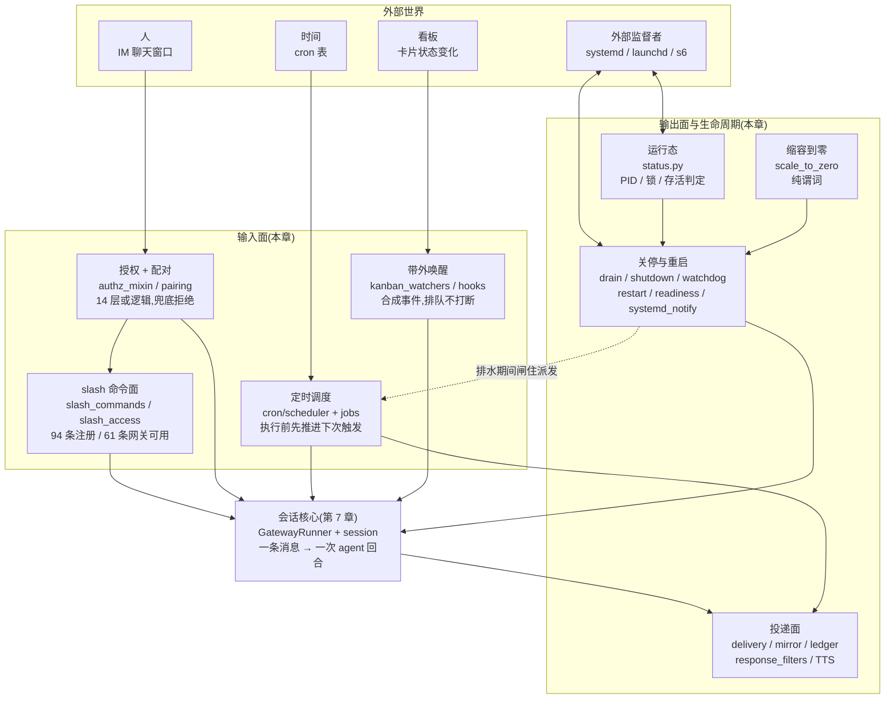

# r7c · 网关外围面与定时调度 —— 一台长跑进程如何被人、被表、被监督者驱动

> **读者定位**:有多年后端经验(Go / Java 背景),**没读过 hermes-agent**,
> **不熟 LLM provider 生态与 Python 异步生态**。本章不要求你查任何外部资料、不要求你看源码。
> **溯源约定**:凡对代码行为的断言,紧跟 `路径:行号 @ 863e313`(基线 commit
> `863e31318553cda8ad61df681d08175364d4164b`)与代码原文块。底稿见 `notes/r7c-*`。
>
> **前情提要(读本章不需要,但知道更好)**:前两章分别讲了这台网关的**会话核心**
> (r7:一条消息进来怎么变成一次 agent 回合)与**平台接入面**
> (r7b:Telegram / Slack / Discord 等各家 IM 怎么被统一成一个适配器契约)。
> 本章讲**围着它们的那一圈**。

---

## TL;DR(快读路径)

1. **这一簇不是一条流水线,是一台长跑进程的四个"外部输入面"**:
   人从聊天窗口敲的 **slash 命令**(以 `/` 开头的控制指令,如 `/model`、`/restart`)、
   **定时表**(cron)、**外部监督者**(systemd 等进程管理器)、
   以及**带外事件**(看板卡片状态变化)。会话核心只处理"用户说了句话",
   这四个面处理"除此之外的一切"。

2. **最值得抄的设计:把"要不要休眠 / 要不要放行 / 到点该不该跑"做成无副作用纯函数**,
   再由调用方喂参数。可测性极好 —— 但本轮也抓到了这个设计的**反面教材**:
   纯函数写对了,调用方喂错了参数,于是 scale-to-zero(空闲自动缩容到零)
   **在生产中从不生效**,而 12 个单元测试全绿。

3. **本轮头等发现是一个 bug 出现了三次**:三处代码分别读 `event.content`、
   `event.message`、`event.session_id` —— 而消息事件对象**这三个字段一个都没有**。
   三处都静默降级、三处都有绿测试(测试用 mock 假造了字段)。
   这不是三次手滑,是**缺少一个把事件形状钉死的机制**。

4. **定时调度的正确性支点只有一句话:执行**前**就把下次触发时间推进掉。**
   崩溃、重启、多副本都靠它;它把"最多跑一次"从分布式难题降级成一次文件写。

5. **文档腐烂有两种形态,时间腐烂比路径腐烂更隐蔽。** 上一章发现"文件搬家导致
   文档里的路径失效";本章发现更阴的一种:模块注释里写着 **"when we add named
   profiles"** 这样的**将来时** —— 而那个功能三年前就上线了。
   **判据:模块 docstring 里出现将来时或具体计数,基本可以断定它已过期。**

---

## 1. 从一个场景说起:一台网关的一天

设想一台部署在小服务器上的 hermes 网关。它是一个 **7×24 长跑的 Python 进程**,
一头连着若干 IM 平台(Telegram、Slack……),一头连着大模型 API。
下面这一天里发生的每一件事,都由本章要讲的机制处理。

### 09:00 —— 一张表让它自己醒过来干活

用户昨天说过"每天早上九点给我一份新闻摘要"。这变成了一条 **cron job**
(cron 是 Unix 世界的定时任务约定,`0 9 * * *` 表示"每天 9:00")。
九点整,调度器发现它到期,**开一个全新的、没有任何历史对话的 agent 会话**跑这个提示词,
把结果投递到 Telegram。

这里已经有三个非平凡的问题:如果进程 8:59 崩了、9:05 才被拉起来,这次触发算不算错过?
如果同一台机器上有两个进程都在跑调度器,会不会跑两次?如果 Telegram 那一刻正好抽风?

### 09:05 —— 一个陌生人发来私信

一个不在名单上的人给这个 bot 发了 DM(私信)。网关不能直接把它喂给大模型 ——
那等于让陌生人白嫖你的 API 额度,还能读到你的上下文。
于是走**授权判定**:14 层"或"逻辑,任一命中即放行,全不命中则拒绝,
并按配置回一个**配对码**(pairing code),让机主在自己的命令行里批准。

### 14:00 —— 机主在聊天窗口里敲 `/model`

**slash 命令**是"从聊天窗口操作这台进程"的控制面 —— 相当于给一个没有 SSH 的
生产进程开的运维通道。`/model` 换模型、`/restart` 重启、`/approve` 批准一个危险操作。
全仓有 **94 条注册命令,其中 61 条在网关侧可用**。

### 23:00 —— 部署脚本发来 SIGTERM

systemd(Linux 主流的进程管理器)要重启这个服务,发送 SIGTERM(礼貌的终止信号)。
此刻进程里可能有:三个正在跑的 agent 回合、一个正在跑的 cron job、
若干条已经收到但还没处理的消息。**优雅关停**要在有限时间内决定:
哪些等它跑完、哪些直接砍、哪些落盘留到下次启动再捞回来。
超时了怎么办?systemd 会在 `TimeoutStopSec` 之后发 SIGKILL(不可拒绝的强杀)。
所以这里是一场**和外部计时器赛跑**。

### 23:05 —— 机器空着,却一直在烧钱

重启完毕,夜里没人说话。这台机器理应**缩容到零**(scale-to-zero:空闲时把进程
完全停掉,有请求时再拉起,云上按秒计费能省很多钱)。代码里确实有这个机制。

**但它从不触发。** 为什么 —— 是本章 §3.6 的主线,也是本轮最重的发现。

---

## 2. 全景

先把这一圈看清楚:**中间是上一章讲过的会话核心,四周是本章的四个输入面 + 一个输出面。**



**一句话读图**:所有输入都必须先过**授权**;所有输出都汇到**投递面**;
而**生命周期一簇**(关停 / 重启 / 就绪 / 缩容)横切所有其它机制 ——
它是唯一一个"会主动打断别人"的簇,因此本章给它最大篇幅。

图里那条虚线值得单独指出:**排水期间会闸住 cron 派发**。这是全簇耦合最紧的一处 ——
调度器的 tick 循环里有一个回调,由网关侧在排水时置位:

`cron/scheduler.py:4192-4195 @ 863e313`
```python
    try:
        if can_dispatch is not None and not can_dispatch():
            logger.debug("Cron dispatch paused while gateway drains existing work")
            return 0
```

---

## 3. 逐机制

### 3.1 slash 命令面:给没有 SSH 的进程开的运维通道

**场景**:机主在 Telegram 里敲 `/model claude-opus-4`。这条消息和"帮我写个函数"
走的是同一条 IM 通道,但它不该被送进大模型 —— 它是一条**控制指令**。

**设计**:注册表与实现是分开的,而且分得比你预期的更开。

- **元数据的真源**在 `hermes_cli/commands.py` 的 `COMMAND_REGISTRY`,**94 条**。
  每条声明别名、是否仅 CLI、是否仅网关、以及一个关键字段 **`busy_policy`**
  ——"当 agent 正忙时,这条命令该怎么办"。
- **实现**在 `gateway/slash_commands.py`(5,693 行,52 个 handler)。
- **分发**是 `gateway/run.py` 里一条 60 分支的手写 `if canonical == ...` 链。

`busy_policy` 只有三个取值,却是整个控制面的核心:`reject`(69 条,忙时直接拒绝)、
`dispatch`(23 条,忙时也照跑)、`interrupt_then_dispatch`(**2 条注册项,对应三个可敲的名字**:
`/new`、它的别名 `/reset`、以及 `/stop`)。**只有这三个名字有资格打断一个正在进行的回合** ——
这个数字本身就是设计意图:控制面默认不打扰正在干活的 agent。

> **单位要对齐才能相加**:前两个数是**注册表条目数**,第三个先前写的是"3 条"——那是
> **可敲命令名**数,和前两个不是一个单位,于是 69 + 23 + 3 = 95 超出了同节自报的 94 条。
> 按 AST 直读注册表复算:`interrupt_then_dispatch` 落在 **2 个** `CommandDef` 上
> (`hermes_cli/commands.py:106 @ 863e313` 的 `new` 带 `aliases=("reset",)`,以及 `:140` 的 `stop`),
> 69 + 23 + 2 = **94** ✓。**机制结论完全不变**(能打断的确实只有那三个名字),
> 改的是别把两种单位并列相加(review-1 建议-5 / M-9)。

**取舍**:元数据集中、实现分散、分发手写。好处是每个 handler 想干什么就干什么;
代价在本轮暴露得很充分 —— **没有统一的参数解析层**,于是 22 个命令各自 `split()`,
其中两条把字段名写错了(§3.7),而**注册表里根本没有权限字段**,
鉴权是另一套完全独立的东西(下一节)。

一条值得记住的观察:`/curator` 这条命令**有注册、有文档、有菜单,但网关侧没有 handler**。
更糟的是,因为它在"已知命令"集合里,连"未知命令"的兜底提示都不触发 ——
用户敲 `/curator`,它被**原样当成普通聊天内容喂给了大模型**。

### 3.2 授权与配对:一个"或"出来的 14 层,和一条只能从外面开的门

**场景**:09:05 那个陌生人。

**设计一 —— 判定是纯"或"**:14 层里任何一层命中即放行,全不命中才拒绝。
**全仓没有拒绝列表(deny list)**。这是个有意的简化:只有"加人"的操作,没有"减人"的操作,
撤销一个人的方式是把他从名单里拿掉,而不是加进黑名单。

**设计二 —— 门只能从外面开**。这是本簇最漂亮的一处。陌生人收到一个配对码,
但**他自己无论如何也不能用这个码给自己授权**:批准函数
(`approve_code` / `approve_request`)全仓只有 **4 个调用点,全部在已认证侧** ——
命令行工具和需要登录的 dashboard。入站消息路径**零调用**。代码自己写明了这一点:

`gateway/authz_mixin.py:581-585 @ 863e313`
```python
        # Check pairing store. A pairing entry is a first-class authorization
        # grant, created only by a trusted operator approving a pairing code
        # (hermes gateway pairing approve / the authenticated dashboard) — an
        # inbound sender can never reach approve_code, so this is not an
        # attacker-controlled path. Honored as a UNION with the allowlist: a
```

**配对码本身按密码对待**:每条独立 16 字节随机盐 + SHA-256(**不存明文**),
比较用常数时间函数(避免通过响应时间差猜码)。

**一处"顺序即安全"的教训**,值得任何做限流锁定的人抄走。锁定检查**必须**排在
"查找待批准条目"**之前**。代码里的注释把因果讲得很清楚:

`gateway/pairing.py:684-690 @ 863e313`
```python
            # Lockout check — must run before the pending lookup so a
            # valid code (e.g. one already sitting in pending) cannot be
            # accepted once the lockout fires. Without this, the lockout
            # only blocks `generate_code`, not `approve_code` — nullifying
            # the brute-force protection for any code already issued.
            if self._is_locked_out(platform):
                return None
```

翻译成人话:如果先查条目再判锁定,那么"码不存在"会立刻返回,而"码存在但已锁定"
会返回另一种错误 —— **两种响应可区分,攻击者就能靠这个差别枚举出哪些码是真的**,
锁定形同虚设。把锁定提到最前面,两种情况返回同一个东西。

**没有 owner/admin 分级**。这点容易误解:代码里找不到"角色"这个概念。
所谓"机主",不是一个权限等级,而是**批准入口的物理位置** —— 你能碰到那台机器的
命令行,你就是机主。

### 3.3 定时调度:一句话撑起"最多跑一次"

**场景**:进程 8:59 崩溃,9:05 被拉起来。9:00 那次触发怎么办?

**设计**:整个正确性建立在一个反直觉的顺序上 —— **在执行任何一个任务之前,
先持文件锁、把所有到期任务的"下次触发时间"批量推进掉,然后才开始跑。**

为什么这样就对了?因为进程可能在任何一刻死掉。

- 如果**先跑后推进**:跑到一半崩了,下次触发时间没变,重启后这个任务**再跑一次**。
  对"发一封邮件"这种任务就是重复发送。
- 如果**先推进后跑**:跑到一半崩了,这次执行丢失,但**绝不会重复**。

作者选了后者,也就是选了 **at-most-once(最多一次)而不是 at-least-once(至少一次)**。
对"每天发一份摘要"这类任务,少发一次远好过发两次。**这个取舍应该显式写在你自己的
harness 设计文档里** —— 它决定了上层能不能假设"任务一定跑过"。

错过的触发不会补跑 N 次,而是**塌缩成恰好一次**,并且有一个"宽限窗口":
周期的一半,钳制在 120 秒到 2 小时之间。9:05 拉起来时,9:00 那次在宽限内,补跑一次;
如果是 15:00 才拉起来,那次就直接跳过、按明天 9:00 算。

**多副本怎么办**:三层叠加 —— 进程内一个"正在跑的任务 ID"集合(同一任务不排队,
直接跳过)、单机一把文件锁(`flock`)、跨机一次**存储层比较并交换**(compare-and-set,
即"只有当数据库里这条记录还是我看到的样子时才写入",分布式抢占的标准做法)。

**超时是"不活跃"而不是"墙钟"**。这点很重要:一个 cron 任务可以跑好几个小时,
只要它**一直在调用工具或者产出 token**;只有连续 600 秒**什么都没发生**才被杀掉。
判据来自 agent 的活动时间戳 —— 和第 7 章讲过的三个看门狗**共用同一口钟**。
(顺带一提:仓库根目录的 `AGENTS.md` 说这里是"3 分钟硬中断",
这是错的,详见 §5。)

**存储是一个 JSON 文件**,不是数据库。代价立刻显现:载入函数里有**六段自愈代码**
专门处理畸形记录(Windows 记事本写入的 BOM 字节、控制字符、被写成裸数组的文件……),
每一段的注释都在讲同一个事故:**一条坏记录会让整轮扫描抛异常回滚,
把所有健康任务的恢复成果一起丢掉**。旁边另有一个 SQLite 审计账本记录每次执行,
它的模块注释明确写着 "not a retry queue" —— **记录层和决策层是分开的,
账本永远不驱动重试**。这个分离很干净,值得抄。

### 3.4 投递面:一条回复怎么变成聊天窗口里的一条消息

**场景**:agent 生成了一段带附件的回复。

先说一个反直觉的结论:**这个目录下的 9 个文件不是一条流水线**,而是 9 个互不隶属的
小机制。真正的主投递路径在上一章的适配器基类里(重试、分片、格式降级都在那儿)。
本簇负责的是路由、内容过滤、镜像、以及几个缓存。

值得单独讲的是**投递台账**(delivery ledger)的诚实。分布式投递有个经典难题:
消息发出去了但确认丢了,你不知道该不该重发。多数系统会假装自己解决了这个问题。
这里的做法是**不消除歧义,而是把歧义暴露给人** —— 崩溃恢复后重发的消息会被打上一个
`RECOVERED` 标记。同时,重发预算只花在**当前真能发出去的平台**上,
避免把重试次数浪费在一个已经掉线的通道上。

再讲一个"边生成边说话"的细节。流式 TTS(text-to-speech,文字转语音)要在模型
还在生成时就把已完成的句子念出来。它的**回落判据不是"成功/失败",而是
"用户耳朵里有没有进声音"** —— 一旦已经开始出声,中途出错也不能退回文字模式,
否则用户会听到半句话然后收到一整段文本。这类"以用户感知为准而非以调用结果为准"
的判据,在系统设计里是稀缺品。

### 3.5 运行态与关停:和外部监督者赛跑

**场景**:23:00 那次 SIGTERM。

先澄清一个**同名不同物**的坑,它也是本轮的一条定案:`gateway/status.py`(2,260 行)
和"聊天里显示的状态消息"**毫无关系**。它是**进程运行态**:PID 文件、文件锁、
接管标记、存活判定。真正管"⏳ 还在忙"那种文案的是另一个文件。
两个文件同名前缀、职责完全不搭 —— 而官方文档的 Key Files 表把前者描述成
"token 锁管理",漏掉了它 78% 的内容(§5)。

**关停是一场赛跑,赛道有三层计时器**:

| 计时器 | 值 | 谁在管 |
|---|---|---|
| 排水预算 | `restart_drain_timeout`,**默认 0** | 网关自己 |
| 关停看门狗 | 排水预算 + 60 秒 | 网关自己 |
| systemd 强杀 | `TimeoutStopSec = max(60, 排水预算+30)` | 外部 |

把这三行放在一起看,会发现一件事:**关停看门狗在 systemd 环境下基本是死代码**。
排水预算为 0 时两者都是 60 秒(纯竞态);排水预算只要大于 0,
systemd 的 SIGKILL **必定先到**。而代码里那个"检查计时对齐"的自检函数
用的余量是 30 秒,**从不校验看门狗的 60 秒** —— 所以它永远不会告警。

**一个必须记住的顺序**:`STOPPING=1`(告诉 systemd"我在关了")必须在长时间排水
**之前**发出。否则 systemd 的看门狗会认为进程失去响应,**把一个正在优雅排水的进程打死**。

**看门狗的判据也值得抄**:它监控的不是"某个定时器到点了",而是
**"事件循环有没有按时醒来"**。这是异步单线程模型下唯一有意义的存活判据 ——
一个被同步阻塞卡住的事件循环,从外面看进程还在、端口还开着,但它已经什么都做不了了。
而检测到迟到时它**不自杀**,只是**停止喂食**并上报状态,让 systemd 执行处决。
把"判断"和"处决"分开,好处是处决方有全局视角(它知道该不该重启、重启几次了)。

**防重启死循环**靠一个磁盘计数器:60 秒内 3 次就熔断。**必须在磁盘上** ——
内存计数会随重启清零,而重启正是要防的那件事。

### 3.6 缩容到零:纯函数写对了,调用方喂错了

**场景**:23:05,机器空着却不休眠。

这一节是本章的核心案例,请慢读。

**设计初衷很好。** "现在可以睡了吗"这个判断被抽成了一个**无副作用的纯函数** ——
不读全局变量、不碰磁盘、不发网络请求,只根据传进来的几个参数返回真假:

`gateway/scale_to_zero.py:120-124 @ 863e313`
```python
    if running_agent_count > 0:
        return False
    if has_live_background_work:
        return False
    return seconds_since_last_inbound >= idle_timeout_seconds
```

三个条件:没有正在跑的 agent 回合、**没有活跃的后台工作**、且距离上次收到消息
已经超过空闲阈值。清晰、好测,12 个单元测试全绿。

**问题出在第二个参数是怎么算出来的。** 调用方这样算:

`gateway/run.py:7437 @ 863e313`
```python
        if any(not t.done() for t in self._background_tasks):
```

`_background_tasks` —— 这个名字读起来就是"后台工作集合",对吧?

**它不是。** 它是**受监督的常驻守护任务注册表**。网关启动时,
会话过期清理、会话卡死检测、看板通知、看板派单、断线重连、交接、异步委派、排水控制……
**至少 8 个永不结束的 watcher** 全都被登记在这个集合里:

`gateway/run.py:11611 @ 863e313`
```python
        self._background_tasks.add(task)
```

于是 `any(not t.done() for t in ...)` **恒为真**,`is_idle()` **恒为假**,
网关**永远不会休眠**。

而最讽刺的一笔:**scale-to-zero 自己的 watcher 也是用同一个函数登记的** ——

`gateway/run.py:11545 @ 863e313`
```python
                self._spawn_supervised(self._scale_to_zero_watcher, "scale_to_zero_watcher")
```

**它一旦成功启动,就成了那个让它自己永远睡不着的原因。**

更值得玩味的是:同一个函数的注释**说清楚了它本来想数什么** ——
"backgrounded delegate_task / kanban / terminal(background=true)",
而**紧接着的第二个检查(查异步委派的活跃计数)才是那个正确的机制**。
也就是说,第一行检查既错又多余。

**为什么测试没抓到?** 因为测试把这个集合**置空**了,还顺手把被测谓词
monkeypatch(运行时替换掉)了。而唯一单独验证这一条的用例只往集合里放**一个**任务,
证明的正是"有任务 ⇒ 不空闲"—— **它把 bug 写成了规格**。

**根因不是"纯函数化"错了,而是缺了一个契约**:什么算 "live background work",
全系统没有一个权威定义。对比一下第 7 章里已经定案的正例 ——
三个看门狗**共用同一口活动时钟**,那里就有一个明确的单一进度源契约。
这里恰恰缺了那一条。

> **这个 bug 的形态值得单独记住:纯函数把语义外包给调用方,而调用方拿了一个
> 名字听起来对、含义完全不同的字段。** 纯函数越干净,越容易让人不去看调用点。

### 3.7 三次同样的手滑:读一个不存在的字段

**场景**:用户敲 `/footer status`(只想查一下页脚开关是开是关)。结果开关被**翻转**了。

消息事件对象的字段是固定的那 20 个(用语法树全量枚举过):
`text`、`source`、`raw_message`、`media_urls`、`reply_to_message_id`、`metadata`……
**没有 `content`,没有 `message`,没有 `session_id`。**

而这三个名字各被用了一次:

**其一**,`/platform pause|resume` 读 `event.content`:

`gateway/slash_commands.py:1440 @ 863e313`
```python
        text = (getattr(event, "content", "") or "").strip()
```

**其二**,`/footer` 读 `event.message`:

`gateway/slash_commands.py:3885 @ 863e313`
```python
            text = (getattr(event, "message", None) or "").strip()
```

参数恒为空 ⇒ 恒走"切换"分支 ⇒ **连纯查询的 `/footer status` 都会改状态**。

**其三**,关停时把未处理消息落盘的那段代码,要拷贝这七个属性:

`gateway/shutdown_flush.py:146-147 @ 863e313`
```python
        for attr in ("session_id", "platform", "sender_id", "sender_name",
                      "reply_to", "media", "raw_event"):
```

**七个,一个都不存在。** 于是落盘文件里永远没有 `session_id`,
重启后的恢复逻辑恒走"跳过":

`gateway/shutdown_flush.py:242 @ 863e313`
```python
                continue
```

⇒ **关停时保下来的消息永远回不到数据库**,永久堆在一个既无清理、无上限、
也无遥测的目录里。而这个机制的存在理由,正是"关停不丢消息"。

**为什么三次都没被发现?** 三个因素叠加:

1. Python 的 `getattr(obj, "name", default)` 在字段不存在时**返回默认值而不是报错**;
2. 上层用 `or ""` 兜了一次底,于是**降级得毫无声响**;
3. 测试用 `MagicMock`(一个"你访问什么属性它就凭空造什么属性"的测试替身)
   **把不存在的字段假造了出来**。

**对 Go / Java 背景的读者**:第 1 条大致相当于把一次编译期字段检查换成了运行期
带默认值的反射查询;第 3 条相当于用一个动态代理当 stub,于是测试连"这个字段存在吗"
都没在验。**三处独立犯同一个错,说明它不是个人失误,是这套组合拳的必然产物。**

### 3.8 带外输入:什么时候可以打断,什么时候必须排队

**场景**:agent 正在跑一个长任务,这时看板上一张卡片完成了。要不要打断它告诉它?

系统给了一个很干净的判据:**这条输入能不能等到下一轮?**

- **等不了 → steer**(中途注入)。看板上的**人工评论**属于这一类 ——
  用户特意打字说"用 2026 的 schema,不是 2025",他显然是想改变正在进行的这次执行。
  实现方式是把文本追加进最后一条工具结果里,**不打断工具、不破坏提示词缓存**。
- **等得了 → wake 排队**。卡片进入终态属于这一类,合成一个"内部事件"丢进队列,
  在忙时策略机读取任何配置**之前**就短路成"不打断"。

顺带更正上一轮的一处定位:第 7 章曾把"看板评论 steer"归到网关的看板 watcher 文件里。
**不对** —— 那个文件 1,493 行里没有一处 `steer`。真正的评论注入在工具层,
运行在 **worker 进程**内,挂在 agent 的活动心跳上。网关侧走的是另一条明确不 steer 的路。
(这就是本项目"每轮复核上一轮"制度的价值:定位错了,下一轮会把它揪出来。)

---

## 4. 可迁移的设计原则

写你自己的 agent harness 时,这一簇能直接搬走的:

1. **把判定抽成纯函数,但同时把它的输入定义成契约。**
   `is_idle(running_agent_count, seconds_since_last_inbound, has_live_background_work)`
   是个好签名 —— 除非没人定义"什么算 live background work"。
   **纯函数的可测性是买来的,代价是调用点无人复核。** 每个纯谓词都应该配一个
   "参数从哪来"的单一权威实现,而不是让每个调用方自己算。

2. **定时任务:执行前推进,而不是执行后推进。** 并在文档第一行写明你选的是
   at-most-once 还是 at-least-once。这不是实现细节,是上层能否假设"任务一定跑过"的前提。

3. **记录层永不驱动决策层。** 审计账本就是审计账本,不要让它兼职重试队列。
   这里的 SQLite 账本在模块注释第一行就写了 "not a retry queue",而去重逻辑
   完全在另一边的 JSON 决策文件里。**两种失败策略也因此可以相反**:
   决策文件尽力自愈(修 BOM、修控制字符),账本损坏则拒绝覆写。

4. **锁定 / 限流检查要排在"目标是否存在"的查找之前。** 否则两种失败的响应差异
   本身就是一条信息泄露信道。

5. **关停要和外部计时器对齐,并且真的去校验对齐。** 你的内部超时如果比
   `TimeoutStopSec` 长,它就是死代码。这里有一个自检函数 —— 但它校验的余量和
   看门狗用的余量不是同一个,于是永远不告警。**写了自检 ≠ 校验了正确的东西。**

6. **存活判据用"事件循环有没有按时醒来",不要用"进程在不在"。**
   并且**判断方和处决方分开**:被监控者只负责停止上报,由监督者决定杀不杀。

7. **把事件对象的形状钉死。** 这是本轮最贵的一课。
   在 Python 里意味着:用带 `__slots__` 的 dataclass 而不是自由属性对象;
   **测试里禁止用 MagicMock 构造被测领域对象**,一律用真实构造器。
   在 Go / Java 里这个问题不存在 —— 但等价的坑是 `map[string]any` 和反射式字段拷贝,
   同样会把字段名笔误推迟到运行期。**判据:任何"按字符串名字拷贝一组字段"的代码,
   都要有一个测试用真实对象跑过。**

8. **接线核查要查"有没有人调用它的方法",不是"有没有人提到它"。**
   本轮发现一个投递路由对象:构造了、在三处认真同步它的适配器列表、
   **从不调用它的任何方法**。这比死代码更危险 —— 有人在维护它,
   所以每个读代码的人都会以为它是主路径。

9. **要让文档不腐烂,唯一可靠手段是让它可执行。**(承接上一章)本轮又添两条佐证:
   这一簇里**没有任何**把文档写进断言的测试,于是贡献了 21 条文档矛盾;
   而 webhook 验签那一簇,三次外部贡献的 PR **每次都带大量测试、每次零文档**,
   文档只在维护者亲自跟进的那一次被补上。
   **测试覆盖率和文档覆盖率是两个独立指标 —— 除非把文档写进断言。**

---

## 5. 地图与代码的出入

本簇定案 **41 条**(21 条文档证伪、14 条"代码有而文档无"、6 条代码内部缺陷),
全部双侧证据见 `notes/r7c-90`。挑最有代表性的四类讲:

**其一 · 照着做也做不到的接入清单。** 官方的"如何新增一个平台"文档给了 16 个步骤,
其中 3 步点名本章范围内的文件。**两步已经不可执行** —— 它让你去某个函数里改一张
名为 `platform_map` 的表,而整个 cron 目录里 `platform_map` 这个词**零命中**;
另一步给出的循环在被点名的文件里根本不存在。追下去发现,`platform_map` 曾经同时存在于
两个地方,一次重构把两处都删了,而文档两处都还留着。

**其二 · 差 900 倍的默认值。** 环境变量参考文档说重启排水超时默认 **900 秒**,
代码里是 **0**。方向还是反的 —— 文档说"慢慢等活干完",代码是"立刻进入强制中断"。
同一行还把这个旋钮的用途也说错了:`/restart` 实际走的是另一个默认 6 小时的旋钮,
而这一点就写在代码里那个默认值的正上方。

**其三 · 幽灵状态与幽灵 API。** cron 文档的生命周期表里有一个 `running` 状态 ——
全仓的状态写入点里**没有一处**写它;反倒是代码里真实存在的 `error` 状态,
文档里没有。适配器契约文档让你去调 `GatewayRunner._resolve_slash_confirm(...)` ——
**这个方法全仓不存在**,照着写新适配器写不出来。

**其四 · 时间腐烂的模块注释。** 这是本轮新提炼的一类。上一章发现文档会因为
**文件搬家**而腐烂;本章发现更隐蔽的一种 —— `status.py` 的模块注释末句是
"a property that will be useful **when we add** named profiles",**将来时**;
而多 profile 早已上线并有整篇用户文档。同一个文件里,slash 命令模块的注释说
"42 of them (~3,200 LOC)",实测 **52 个 / 5,693 行**。
**判据:模块注释里出现将来时或具体计数,基本可以断定它已过期。**

最后记一条**反向发现**,以免后来者误判:`gateway/builtin_hooks/` 这个包里只有一个
空的 `__init__.py`,看起来像典型的"半途而废"。**它不是。** 用户文档完整记载了
"早期的内置钩子已经删掉、改写成教程",根目录的 `AGENTS.md` 也标注了 "(none shipped)"。
代码、文档、注释四方一致 —— **这是有意留白,不是黑洞。**

---

## 6. 延伸

底稿(求全求证,逐文件、带行号证据、含每个机制的"重实现要点"):

| 底稿 | 覆盖 |
|---|---|
| `notes/r7c-01-scope-and-map.md` | 范围锚定、分层决策、主线亲核发现 |
| `notes/r7c-raw-slash-{a,b,c}.md` | slash 命令面三段 + 访问控制 + 94 条命令全表 |
| `notes/r7c-raw-authz-pairing.md` | 14 层授权表、配对码全生命周期、频道目录 |
| `notes/r7c-raw-delivery.md` | 投递面 9 文件、接线核查表、流式 TTS |
| `notes/r7c-raw-shutdown.md` | 36 阶段关停时间线(含每级超时与行号) |
| `notes/r7c-raw-restart-readiness.md` | 重启 / 就绪 / sd_notify / cgroup / 缩容到零 |
| `notes/r7c-raw-status.md` | 进程运行态两条链路、显示配置、短语库 |
| `notes/r7c-raw-kanban.md` | 看板派单与回话、钩子系统、平台注册表 |
| `notes/r7c-raw-cron-{sched-a,sched-b,jobs,catalogs}.md` | 调度四段:投递层 / 触发端到端 / 状态机 / 内容层 |
| `notes/r7c-raw-webhook-signing-docgap.md` | 五种 webhook 签名方言与运营文档缺口 |
| `notes/r7c-90-doc-conflict-rulings.md` | **41 条定案 + 7 条移交项结案** |
| `notes/r7c-95-tests.md` | 137 文件 / 1,081 用例的行为规格记录 |
