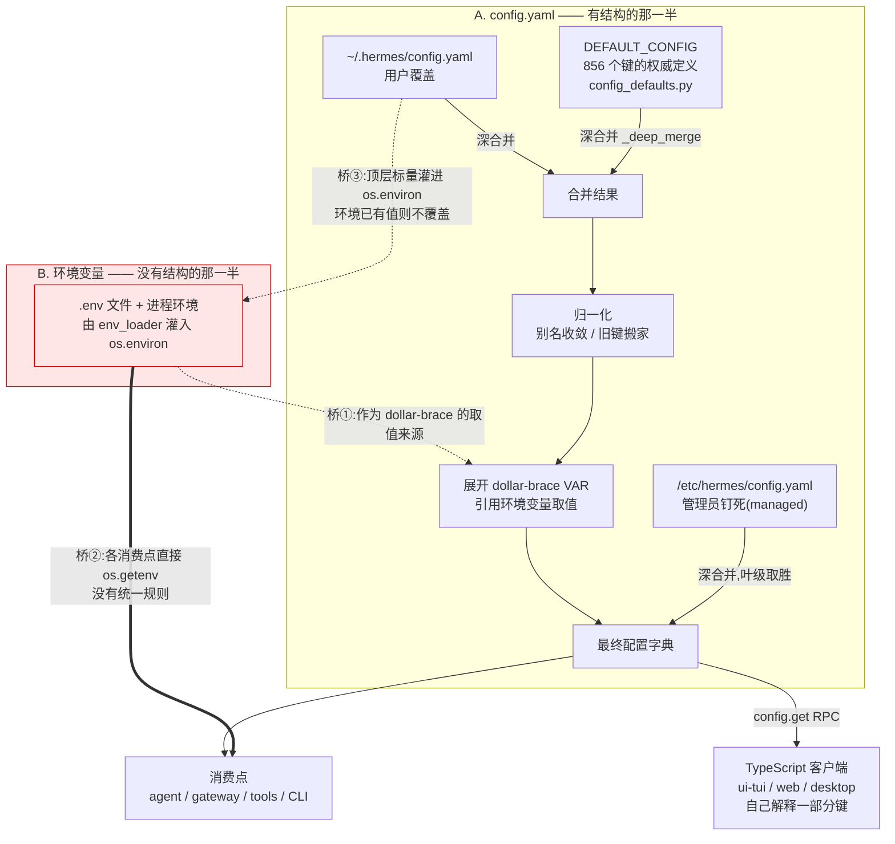

# r8a · 配置面 —— 一个键从哪里来,到哪里去

> **读者定位**:有多年后端经验(Go / Java 背景),**没读过 hermes-agent**,
> **不熟 LLM provider 生态与 Python 异步生态**。本章不要求你查任何资料、不要求你看源码。
> **溯源约定**:凡关键断言后跟 `路径:行号 @ 863e313`,指向基线
> `863e31318553cda8ad61df681d08175364d4164b`,可逐条复核。
> 术语首次出现给一句话中文解释。

---

## TL;DR(快读路径)

1. Hermes 的"配置"其实是**两套互不相干的东西**:一份深度合并的 YAML 字典
   (`config.yaml`),和一堆各读各的环境变量(`.env`)。文档把它们画成一条四级优先级链,
   **代码里没有这条链**——这是本章最需要你记住的一件事。
2. YAML 那一侧做得相当好:**856 个键**有权威定义、有递归深合并、有 schema 版本迁移、
   有"解析失败退回上一次好的而不是退回默认值"的安全姿态。
3. 但**同一份 `config.yaml` 有四个读取函数**,其中两个是完整装载器,
   **各带一份默认值、合并语义还不同**(一个递归深合并,一个只做一层 `dict.update`)。
   这不是理论问题:`hermes config set agent.reasoning_effort high` ——
   一条完全正确的命令 —— 会被告知"不是已知配置键",并收到一个**会把配置弄坏的建议**(§3.2)。
4. 环境变量那一侧没有统一规则,**每个消费点自己决定谁先谁后**,有的还先查环境变量再查配置
   ——正好和文档说的反过来。本章开篇那个 bug 就长在这块无人区里。
   两个系统之间的桥还是**双向**的:`config.yaml` 的顶层标量会反过来变成环境变量。
5. 最值得抄走的一条不是某个机制,而是一个**对照实验**:856 个配置键里有
   **105 个在全部文档面上一次都没出现过**,而 151 个环境变量**一个都不缺**。
   差别不在纪律,在**说明文字是不是数据结构里的必填字段**。

---

## 1. 从一个场景说起:我照着文档配了,机器人也好了,面板却说没配

一位用户在 QQ 上跑 Hermes 机器人。他想让定时任务把消息发到某个频道,于是照官方文档
设了环境变量 `QQBOT_HOME_CHANNEL`。重启,一切正常:定时消息按时送达。

然后他运行 `hermes status` 想确认一下,看到这么一行:

```
  QQBot         ✓ configured
```

而 Telegram 那一行是这样的:

```
  Telegram      ✓ configured (home: -1001234567890)
```

**为什么 QQBot 少了 `(home: …)`?** 用户的第一反应必然是"我是不是配错了",
于是他去翻文档、改拼写、重启……而机器人**明明一直在正常工作**。

答案在面板的代码里。它有一张平台表,每行是"(令牌变量名, home 频道变量名)":

`hermes_cli/status.py:483 @ 863e313`

```python
        "QQBot": ("QQ_APP_ID", "QQ_HOME_CHANNEL"),
```

**表里写的是旧名 `QQ_HOME_CHANNEL`。** 这个变量早就改名叫 `QQBOT_HOME_CHANNEL` 了——
官方文档只讲新名(`website/docs` 里新名出现 3 次、旧名 **0 次**),
网关本体也优先读新名,读到旧名还会打一条"请改名"的弃用警告。

作者显然是知道要改名的,因为紧接着就有一段"向后兼容":

`hermes_cli/status.py:494-496 @ 863e313`

```python
        # Back-compat: QQBot home channel was renamed from QQ_HOME_CHANNEL to QQBOT_HOME_CHANNEL
        if not home_channel and home_var == "QQBOT_HOME_CHANNEL":
            home_channel = os.getenv("QQ_HOME_CHANNEL", "")
```

**但这段代码永远不会执行。** `home_var` 的值只能来自上面那张表,而全表 11 个 home 变量里
**没有** `QQBOT_HOME_CHANNEL`——它在整个 `status.py` 里只出现两次:上面那行注释,
和这个永远为假的判断。

更妙的是:**就算它能执行,也什么都不做**。分支体读的是 `QQ_HOME_CHANNEL`,
而三行之上主路径已经用 `home_var`(此刻正是 `"QQ_HOME_CHANNEL"`)读过同一个变量了。

所以这是一段**双重死代码**:判断恒假,且分支体是空操作。作者的本意——
"主读新名,读不到再回退旧名"——写在注释里,而代码做的**正好相反**:
表里钉死旧名,兼容分支去找新名。**注释和代码调了个个儿。**

**这个 bug 为什么能活这么久?** 因为它长在一块**没有规则、也没有测试**的地方。
`hermes status` 的 10 个测试里,主题是"不打印 Tavily 密钥的值""Termux 下跳过 systemctl"
以及五支**抗崩溃**测试(import 失败、函数抛异常、返回 None,都不能让面板崩)。
**没有任何一支断言过表里那一行的内容对不对。** 全仓提到 `QQ_HOME_CHANNEL` 的测试只有一处,
还是在 `monkeypatch.delenv` 的清理列表里——它**删掉**这个变量,从不断言它。

> **判据(可带走)**:一段代码里有"向后兼容"分支,而它所在模块的测试**全是抗崩溃测试**
> (断言"不抛异常")而非行为断言——那么这个兼容分支**极可能从未被执行过**。
> 抗崩溃测试的覆盖率数字很好看,但它对"值对不对"提供**零信息**。

**最后一击:配置系统本身把这次改名做得完全正确。** 这是本章论点最硬的一块证据。

Hermes 维护两张环境变量表(详见 §4 原则⑧):一张**推荐给用户**的
(`OPTIONAL_ENV_VARS`,喂安装向导与 dashboard),一张**运行时认识但不推荐**的
(`_EXTRA_ENV_KEYS`)。这次改名在两张表里的落法是教科书式的:

`hermes_cli/config.py:289 @ 863e313`

```python
    "QQ_HOME_CHANNEL", "QQ_HOME_CHANNEL_NAME",  # legacy aliases (pre-rename, still read for back-compat)
```

实测四个名字的归属:

| 变量 | 认识表 | 推荐表 | 文档 |
|---|---|---|---|
| `QQBOT_HOME_CHANNEL`(新) | ✅ | ✅ | ✅ 3 处 |
| `QQ_HOME_CHANNEL`(旧) | ✅ | ❌ | ❌ 0 处 |

**这完全正确**:旧名仍被认识(老配置不会坏)、不被推荐(向导不会引导新用户去用)、
不进文档(不误导)。同一个仓库里,**懂这次改名的地方都做对了**。

**唯一没跟上的,是 `hermes status` 那张平台表——而它恰恰是直接读环境变量、
完全绕过配置系统的那一段。** 所以第 1 节这个 bug 不是"某人粗心",
而是一个结构性的必然:**配置系统的纪律,管不到不走配置系统的代码。**

放大来看,这就是下一节要讲的事:这里其实有**两套东西共用一个名字**。

---

## 2. 全景:两套东西,一个名字

Hermes 里被统称为"配置"的,其实是两个几乎不相交的系统。



**读这张图的要点有四个:**

**第一,红色那一半没有合并链。** 环境变量不是"优先级更低的一层"。
第 1 节那个 QQ 变量走的是桥②,所以它从来没进过 A 系统,
自然也享受不到 A 系统的任何保障——没有默认值、没有 schema 校验、没有迁移、
没有"这个键存不存在"的检查。

**第二,桥③的方向可能出乎意料:`config.yaml` 的顶层标量会变成环境变量。**

`gateway/run.py:2057-2060 @ 863e313`

```python
        # Top-level simple values (fallback only — don't override .env)
        for _key, _val in _cfg.items():
            if isinstance(_val, (str, int, float, bool)) and _key not in os.environ:
                os.environ[_key] = str(_val)
```

也就是说,用户可以在 `config.yaml` 里写一个**任意名字**的顶层标量,给技能脚本和外部程序
当环境变量用。这解释了一件否则很难理解的事:**为什么根层不做闭世界校验?**
因为那些键名**按定义无法穷举**——代码自己是这么说的:

`hermes_cli/config.py:2038-2041 @ 863e313`

```python
    # unknown top-level keys are deliberately NOT warned about: top-level
    # scalars are bridged into os.environ (gateway/run.py, hermes send) so
    # users can feed skills and external apps env-style keys from config.yaml
    # — a closed-world allowlist can never enumerate those.
```

注意这条桥的判据是 `_key not in os.environ`:**环境已有值就不覆盖**。
所以它是**第三次**与文档的"config.yaml 胜过 .env"相反。

还有一个细节值得学:这条桥**读的是原始用户文件,不是合并后的配置**,而且是刻意的——

`gateway/run.py:2037-2039 @ 863e313`

```python
        # Presence-sensitive env bridge: raw read is deliberate — only keys the
        # user actually wrote may be bridged (a defaults merge would export the
        # whole DEFAULT_CONFIG into the env). Overlay + expansion applied below.
```

**只有用户真正写下的键才可以被桥进环境。** 否则 `DEFAULT_CONFIG` 的 82 个顶层键
会**整体变成环境变量**,污染每一个子进程。
**"这个键有没有被显式设过"和"这个键的值是什么"是两个不同的问题,
而合并操作会把前一个问题的答案抹掉。** 凡需要区分"没设"与"设成了默认值"的场合,
都必须在合并之前把原始文件读一遍。

**第三,右下角那条虚线是很多人想不到的**:相当一部分配置键**根本不由 Python 读**。
Python 把合并好的配置经一个叫 `config.get` 的 RPC(远程过程调用,这里就是客户端问服务端
要数据)发出去,真正解释这些键的是 TypeScript 写的终端界面、网页面板和桌面应用。
这一点在本项目自己身上就应验过一次:第一版分析脚本只扫 `.py`,于是把
`display.show_cost`、`dashboard.show_token_analytics` 等五个**活得好好的**键判成了死键。

**第四,A 系统本身做得相当扎实**,值得逐个拆开看。下一节就干这个。

---

## 3. 逐机制

### 3.1 深合并:为什么"改一个键"不该弄丢它的兄弟

**场景**:文字转语音有两个设置,声音 ID 和模型 ID,都有默认值。用户只想换个声音,
于是在 `config.yaml` 里写:

```yaml
tts:
  elevenlabs:
    voice_id: my-favourite-voice
```

如果合并用的是 Python 的 `dict.update`(等价于 Java 的 `Map.putAll`),
`tts.elevenlabs` 这个子字典会被**整体替换**,`model_id` 的默认值就没了。
用户只想改一个值,却弄丢了旁边那个他压根没提过的值。

Hermes 的主装载器用递归合并解决它:

`hermes_cli/config.py:2435 @ 863e313`

```python
def _deep_merge(base: dict, override: dict) -> dict:
```

docstring 把意图讲得很直白,举的正是上面这个例子:

`hermes_cli/config.py:2438-2440 @ 863e313`

```python
    Keys in *override* take precedence. If both values are dicts the merge
    recurses, so a user who overrides only ``tts.elevenlabs.voice_id`` will
    keep the default ``tts.elevenlabs.model_id`` intact.
```

它还处理了一个 YAML 特有的坑:在 YAML 里写一个空的段名(`terminal:` 后面什么都不写)
会解析成 `None`。要是把这个 `None` 当作覆盖值,整个 `terminal` 默认字典会被替换成 `None`,
所有下游都会崩。所以 `None` 覆盖一个字典默认值时**被当作没写**。

**取舍**:深合并意味着**在 `config.yaml` 里写什么都是"合并",不是"替换"**——
用户没有办法通过编辑文件把一个有默认值的键变没。
Hermes 接受了这个取舍,另配了一条 `hermes config unset` 来**撤销自己的覆盖**
(把键恢复成默认值,而不是让键消失):

`hermes_cli/config.py:5062-5063 @ 863e313`

```python
def unset_config_value(key: str):
    """Remove a user-set configuration or .env value."""
```

顺带一个值得学的细节:如果这个键是**管理员钉死的**,`unset` 会直接拒绝并说明理由——
因为下一次加载 managed 层会把它装回去,让用户执行一条**表面成功、实则无效**的命令
是更坏的体验:

`hermes_cli/config.py:5067-5068 @ 863e313`

```python
    # Managed scope guard: a key pinned by the managed layer cannot be unset by
    # the user — the next load would reinstate it anyway (mirrors set_config_value).
```

### 3.2 头条:同一份文件,两个装载器,合并语义不同

**场景**:承接上一节。你已经知道"深合并"是对的了。现在的问题是——
**Hermes 有两个装载器,只有一个这么干。**

第二个装载器在 `cli.py`(交互式命令行和终端界面走它),它自带**另一份默认值字面量**:

`cli.py:441 @ 863e313`

```python
    defaults = {
```

而它的合并是这样的:

`cli.py:599 @ 863e313`

```python
                        defaults[key].update(file_config[key])
```

**一层 `dict.update`,不递归。** 也就是 3.1 节开头那个反例。

这不是纸上推演。同一个 `HERMES_HOME`,同一份只设了两个嵌套叶子键的 `config.yaml`:

```yaml
compression:
  threshold: 0.75
browser:
  camofox:
    rewrite_loopback_urls: true
```

两个装载器实际跑出来的结果:

| | 主装载器 `load_config()` | CLI 装载器 `CLI_CONFIG` |
|---|---|---|
| `compression` 键数 | **28** | **3** |
| `browser.camofox` 键数 | **6** | **1** |
| `browser.camofox.loopback_host_alias` | 默认值保住 | **不存在了** |

用户想打开一个布尔开关,在 CLI 这一侧**顺手删掉了同级的全部默认值**;
在网关那一侧却完好无损。**同一个键,两个进程,两个值。**

**为什么至今没炸?** 必须说清楚,否则就是危言耸听。以 `loopback_host_alias` 为例,
它的读取点有一层硬编码兜底:

`tools/browser_camofox.py:248-253 @ 863e313`

```python
def _loopback_rewrite_host(camofox_cfg: Dict[str, Any]) -> str:
    """Return the host alias used when rewriting loopback page URLs."""
    return (
        os.getenv("CAMOFOX_LOOPBACK_HOST_ALIAS", "").strip()
        or str(camofox_cfg.get("loopback_host_alias") or "").strip()
        or "host.docker.internal"
    )
```

最后那个 `or "host.docker.internal"` 和默认值**是同一个字面量**——
这个字面量在仓库里存在**三份**。所以键丢了也读回同一个值,现象为零。

**这恰恰是它危险的地方**:隐患被一个偶然的重复字面量盖住了,
**下一个没有硬编码兜底的键就会真的出事,而且现场看不出是合并语义丢的**。

**——而"下一个"不用等,它已经在了。这是本章最实在的一段,请务必看完。**

`agent.reasoning_effort`(控制模型思考力度的开关)是一个**真正被支持、真正被读**的键:

`cli.py:8165-8167 @ 863e313`

```python
        self.reasoning_config = _parse_reasoning_config(
            CLI_CONFIG["agent"].get("reasoning_effort", "")
        )
```

它在 `cli.py` 的那份内联默认值里有定义(`cli.py:479`),
**但不在 `DEFAULT_CONFIG["agent"]` 里**。而 `hermes config set` 的键名校验
**只认 `DEFAULT_CONFIG`**。于是——本轮实跑,原样抄录输出:

```
✓ Set agent.reasoning_effort = high in .../config.yaml
⚠ 'agent.reasoning_effort' is not a recognized config key — it was saved anyway, but Hermes may not read it.
  Did you mean: agent.reasoning_overrides
```

三件事同时发生:

1. **值写对了**(文件里确实是 `agent: {reasoning_effort: high}`),CLI 也确实会读它;
2. **系统却告诉用户"这不是一个已知的配置键,Hermes 可能不会读它"**——这句话是**错的**;
3. **它给的替代建议更糟**:`agent.reasoning_overrides` 的默认值是 `{}`,
   **是个字典**。用户听话改成 `agent.reasoning_overrides: high` 之后,
   写进去的是个字符串,思考力度**静默地不生效**,而原本正确的那行已经被他删了。

**一条完全正确的命令,得到一句错误的警告和一个会把事情弄坏的建议。**
根因就是本节开头那件事:**两份默认值,而校验器只认其中一份。**

**这也回答了 3.1 节留下的问题**——为什么"多一份默认值"不是无害的冗余:
冗余本身不出错,**但凡有任何东西拿其中一份当"全集"用,另一份里的键就集体变成了"未知键"**。

**测试为什么没抓住它?这一段比 bug 本身更值得看。**
仓库里**有**一支以这条性质命名的测试:

`tests/hermes_cli/test_managed_scope_cli_config.py:58 @ 863e313`

```python
def test_cli_config_managed_leaf_preserves_user_siblings(homes):
```

它构造"管理员配置覆盖用户配置"的场景,断言同级键存活。**但它测的是 managed 那一层,
而那一层的合并是对的。** 出问题的是更前面一步:**内置默认值 ← 用户配置**。
在这支测试里,用户配置永远是**被覆盖的基底**,从来不是**覆盖方**,
所以那条浅合并路径**在这支专测同级键存活的用例里也没被走到**。

> **可带走的两条**:
> 1. 系统里若存在同一份输入的**两个解释器**(两个装载器、服务端与客户端各一份校验),
>    必须有一支**双读一致性测试**,直接断言二者对同一输入产出相同结果。
>    这种测试单看哪一边都写不出来,只能显式跨边界写。
> 2. 一条性质若在**多个层**上都该成立,测试要按"**性质 × 层**"做矩阵逐格枚举。
>    按"层"分文件写测试,空格子是看不见的。

### 3.3 解析失败:退回"上一次好的",而不是退回默认值

**场景**:网关是个长期运行的进程。用户在它跑着的时候编辑 `config.yaml`,
手一抖存成了坏 YAML。下次加载会发生什么?

直觉答案是"用默认值兜底"。Hermes **明确拒绝**这个答案:

`hermes_cli/config.py:3348-3356 @ 863e313`

```python
            except Exception as e:
                # Last-known-good fallback (port of openai/codex#31188's
                # invariant: a parse failure in a policy/config file must not
                # silently replace the effective policy with an empty/default
                # one). Falling through to DEFAULT_CONFIG here drops EVERY user
                # override — including security-critical ``approvals.deny``
                # rules, which are supposed to block commands even under yolo.
                # A long-running gateway whose user mid-edits config.yaml into
                # broken YAML would silently lose those rules on the next load.
```

理由是**安全**的:配置里有 `approvals.deny`——一份"这些命令绝对不许执行"的黑名单。
退回默认值等于**用户存了个错别字,防线就自己拆了**,而且悄无声息。
所以进程内保留"上一次成功加载的配置",坏了就继续用它。

配套还有一条:**绝不原地改写用户的文件**。坏文件会被另存一份带时间戳的 `.bak`
供用户修复,而原文件留在那里——这样用户手工改好后,下次加载自然就读到了。

**取舍**:这意味着一个坏配置可能在进程里"隐身"很久(日志里有警告,但服务照跑)。
作者选择了**可用性优先于一致性**,前提是有告警。对配置这种"改错了就该继续按老规矩办"
的东西,这个取舍是对的。

> **可带走**:配置/策略文件的解析失败,**默认值不是安全的兜底**。
> 兜底的方向应该是"保持现状"(上一次好的),而不是"回到出厂"。
> 尤其当配置里含有**限制性规则**(黑名单、配额、拒绝策略)时,
> 回到出厂等于把限制解除了。

### 3.4 读写不对称:读的时候展开密钥,写的时候必须把它变回去

**场景**:配置里可以写 `api_key: ${MY_SECRET}`,运行时会被替换成环境变量的真实值——
这样密钥不必存在 `config.yaml` 里。很好。

现在想想这条链会怎么出事:用户跑 `hermes config set display.compact true`。
这条命令的实现是"**读整份配置 → 改一个键 → 写回**"。而"读"这一步**已经把
`${MY_SECRET}` 展开成了真实密钥**。如果就这么写回去——
**用户改了个跟密钥毫无关系的显示选项,他的 API 密钥就被明文写进了 `config.yaml`。**

Hermes 用一个"写回前还原模板"的函数堵住这条路:

`hermes_cli/config.py:2609 @ 863e313`

```python
def _preserve_env_ref_templates(current, raw, loaded_expanded=None):
```

难点在于**怎么判断"这个值没被改过"**。不能只比较字面量,因为环境变量可能在
读和写之间轮换过。所以它用了三条判据,任意一条成立就还原模板:

`hermes_cli/config.py:2623-2629 @ 863e313`

```python
    if isinstance(current, str) and isinstance(raw, str) and re.search(r"\${[^}]+}", raw):
        if current == raw:
            return raw
        if isinstance(loaded_expanded, str) and current == loaded_expanded:
            return raw
        if _expand_env_vars(raw) == current:
            return raw
        return current
```

即:值还等于模板本身 / 等于**这次加载时**展开出来的值 / 等于**当前环境**展开出来的值。
三条都不满足,才认为"用户真的把这个值改了",写新字面量。

**本轮跑了一次端到端验证。** 临时 home,`config.yaml` 里写
`api_key: ${MY_TEST_SECRET}`,环境里 `MY_TEST_SECRET=sk-super-secret-value`:

| 操作 | 内存里读到的值 | 落盘后文件里的值 |
|---|---|---|
| 只改无关键 `display.compact` | `sk-super-secret-value` | **`${MY_TEST_SECRET}`**(模板还原) |
| 把 `api_key` 真的改成新值 | — | `sk-user-typed-a-new-key`(写新字面量) |

两种情形都如设计所愿。

> **可带走**:只要系统里有"**读时变换**"(展开、解密、归一化),就必须配一个
> **写时逆变换**,并且要有一个明确的"值有没有被改动"的判据。
> 否则任何一个"读-改-写"的调用方都会把变换后的形态固化到源文件里。
> 这类 bug 的特征是**破坏面与触发原因毫不相关**——你改的是显示选项,泄的是密钥。

### 3.5 缓存:键必须覆盖全部输入,而不只是最显眼那个

**场景**:配置加载不便宜,所以要缓存。自然的缓存键是文件的 `(修改时间, 大小)`——
文件没变就用缓存。这看起来没毛病,直到:

进程启动早期,某段代码调了一次 `load_config()`。此时 `.env` **还没加载**,
所以配置里的 `api_key: ${OPENAI_API_KEY}` 展开时找不到值,**原样留成了字面量
`"${OPENAI_API_KEY}"`**,并进了缓存。随后 `.env` 加载了,环境里有值了——
但**文件没变,缓存签名没变,缓存永远命中**。这个进程到死都拿着一个没展开的假密钥。

修法是给缓存键加一个维度:

`hermes_cli/config.py:3325-3330 @ 863e313`

```python
            # every ${VAR} it was expanded against still has the same value.
            # Without this, a load_config() that ran before load_hermes_dotenv()
            # pins unexpanded literals (e.g. auxiliary.<task>.api_key) for the
            # life of the process (#58514).
```

缓存里额外存一份**环境快照**:这次展开依赖了哪些环境变量、当时各是什么值。
命中时逐个比对,只要有一个变了就重新加载。

> **可带走**:凡缓存"计算结果",缓存键必须覆盖**全部输入**,而不只是那个最显眼的输入。
> 这类 bug 的典型现象是"**重启就好了**"——这句话应当直接触发对缓存键完整性的怀疑。

### 3.6 版本迁移:一张表、一个下限、一个不推进的版本号

**场景**:配置格式会演进。两年前的用户升级上来,他的 `config.yaml` 得能自动改写成新格式。
Hermes 的做法是给配置打一个 schema 版本号(`_config_version`,当前最新是 **33**),
一串 `_migrate_to_N` 函数逐版本升级。

三个设计点值得记:

**一,表驱动,而且初始版本号不推进。** 迁移不是"逐步升级、每步推进版本",
而是拿**同一个**初始版本号去比每一条注册项:

`hermes_cli/config_migrations.py:671 @ 863e313`

```python
def run_migrations(current_ver: int, results: Dict[str, Any], quiet: bool) -> None:
```

为什么这么别扭?因为这段代码是从一个 768 行的 `if current_ver < N:` 长梯**重构**出来的,
而原来那个长梯里的 `current_ver` 就是不推进的。**为了让重构可证明地不改变行为,
新实现必须复刻这个语义。** 这是一个很克制的选择:重构时**先保住等价性,再谈优雅**。

**二,支持下限。** 太老的配置**不迁移、也不报错**:

`hermes_cli/config_migrations.py:53 @ 863e313`

```python
SUPPORT_FLOOR_VERSION = 12
```

低于 12 的配置**原样留着不动**,进程照常启动(读取时深合并默认值),
同时给用户一条明确的话:备份你的文件,跑 `hermes setup` 重新生成,
或者自己看 changelog 之后手动把版本号写成 12。
**这是"体面的退出"而不是"崩溃"或"猜"。**

**三,注册表的版本号是跳号的**(12,13,…,17,21,23,25,29,31,32,33),
中间 9 个版本没有迁移步骤——那些版本的变更不需要改用户文件。**跳号是正常的,
不是遗漏。** 而这件事有测试保证:

`tests/hermes_cli/test_config.py:687 @ 863e313`

```python
    def test_registry_has_no_targets_below_floor(self):
```

它测的不是"某次迁移做对了",而是**这张表本身的形状合法**。配套还有一支更狠的:
断言**砍掉 v12 以下的步骤之后,v12 及以上的迁移结果与砍之前逐字相同**——
把"这次删代码没有改变任何仍受支持路径的行为"变成了一条可执行断言。

> **可带走**:逐版本迁移表值得配两类测试——(a) 表的**形状不变量**
> (严格升序、无低于下限的残留);(b) **删除安全性**:淘汰老步骤时,
> 证明受支持区间的输出不变。只测单个迁移步骤做了什么,这两类事故都拦不住。

### 3.7 工具集配置:一个"从子集反推"的坑,和它的修法

先锚一个专名:**toolset(工具集)**是"一组工具"的命名集合,配置里用它整组开关工具,
而不是一个个点名。Hermes 还允许**复合工具集**——比如 `hermes-cli` 本身就包含全部核心工具。

**场景**:用户在 Discord 上关掉了某个工具集。保存后重启,**它又回来了。**

原因在"用户到底启用了哪些工具集"这个判定上。配置存在 `platform_toolsets` 里
(平台名 → 工具集名列表):

`hermes_cli/tools_config.py:2232 @ 863e313`

```python
    platform_toolsets = config.get("platform_toolsets") or {}
```

朴素的实现会**从复合工具集反推子集**:看到 `hermes-cli`,就认为它包含的每个工具集都启用了。
于是用户明明关掉了 `spotify`,而列表里还有 `hermes-cli`,反推一遍——`spotify` 又"启用"了。

修法是**换判据**:先看用户存的列表里有没有**可配置工具集的名字直接出现**;
有,就说明用户显式配过这个平台,**直接按成员判定,不再做子集反推**:

`hermes_cli/tools_config.py:2257-2262 @ 863e313`

```python
    # If the saved list contains any configurable keys directly, the user
    # has explicitly configured this platform — use direct membership.
    # This avoids the subset-inference bug where composite toolsets like
    # "hermes-cli" (which include all _HERMES_CORE_TOOLS) cause disabled
    # toolsets to re-appear as enabled.
    has_explicit_config = any(ts in configurable_keys for ts in toolset_names)
```

> **可带走**:当配置里同时存在**粗粒度集合**与**细粒度开关**时,
> 不要用"集合展开后是否包含"来回答"这一项开没开"——**"没写"和"写了又关掉"在展开后
> 长得一模一样**。要么记录显式意图(用户到底动过哪些开关),要么让细粒度开关
> 在数据结构上压过集合,不能靠反推。

顺带一个很具体的 YAML 坑,值得所有读 YAML 的人记住:

`hermes_cli/tools_config.py:2249-2250 @ 863e313`

```python
    # YAML may parse bare numeric names (e.g. ``12306:``) as int.
    # Normalise to str so downstream sorted() never mixes types.
```

**YAML 会把纯数字的键解析成整数**。这里有个叫 `12306` 的工具集(中国铁路购票网站),
于是这个键会变成 `int`,下游 `sorted()` 拿到 `int` 和 `str` 混合列表就抛 `TypeError`。
在 Python 里这是运行时崩溃;在 Go / Java 里则是编译期就不会让你写出这种混合列表——
**动态语言读外部数据时,类型归一化必须显式做,不能指望输入。**

**这引出一个关于整个配置面的问题:到底谁来校验配置值的类型?答案是——没有中心。**
主配置这一侧几乎不做类型校验:YAML 解析出什么,合并进去的就是什么,
唯一的结构检查只针对四个"看起来放错位置的 provider 字段"(§2 已引)。
真正的校验散在各个领域子模式里,而且各造各的。MoA(Mixture of Agents,多模型协同)
那一份最典型,`hermes_cli/moa_config.py` 光是强制转换函数就有一排:

`hermes_cli/moa_config.py:247 @ 863e313`

```python
def validate_moa_payload(raw: Any) -> list[str]:
```

**这和环境变量那一侧是同一个形状**:没有全局规则,每个子系统自己定。
区别只在于配置这一侧的子系统**大多认真做了**,而环境变量那一侧大多没做。
**取舍是真实的**——中心化的 schema 校验要求先有 schema,而这个配置面**根层是开放世界**
(§2 桥③),写不出闭世界的 schema。**但"写不出全局 schema"不等于"不能约定统一的校验入口"**,
后者本可以有。

### 3.8 环境变量那一侧唯一的一条好规则:凭据的 ASCII 清洗

前面几节把环境变量那一半说得像块无人区。**公平起见,它有一处做得很好**,
而且这处正好是"配置面"里最贴近真实用户痛点的一段。

**场景**:用户从供应商的 PDF 文档、或者一个富文本编辑器、或者网页上,
把 API 密钥复制粘贴进 `.env`。看起来完全正常。然后所有请求都返回
"API key not valid"。用户反复核对,**肉眼一模一样**。

原因是复制的过程中,某些字符被换成了**长得一样的 Unicode 字形**
(lookalike glyph),或者混进了**零宽空格**(zero-width space,网页里常见的不可见字符)。
密钥最终要放进 HTTP 请求头,而请求头只接受 ASCII——于是供应商侧只能给一个含糊的错误。

Hermes 在 `.env` 加载完之后做一次定向清洗:

`hermes_cli/env_loader.py:298 @ 863e313`

```python
def _sanitize_loaded_credentials() -> None:
```

三个设计决定都值得学:

**一,范围收得很窄。** 只处理名字以凭据后缀结尾的变量:

`hermes_cli/env_loader.py:20 @ 863e313`

```python
_CREDENTIAL_SUFFIXES = ("_API_KEY", "_TOKEN", "_SECRET", "_KEY")
```

理由写在模块注释里:**不能悄悄改用户的任意环境变量**;只有凭据"已知必须是纯 ASCII"
(它们要变成 HTTP 头的值),所以只有凭据能被这样处理。**能自动修的边界,
必须由"这类值有硬性格式要求"来划,不能由"我觉得这样更好"来划。**

**二,修了,但一定要出声。** 这条是关键:

`hermes_cli/env_loader.py:305-308 @ 863e313`

```python
    Emits a one-line warning to stderr when characters are stripped.
    Silent stripping would mask copy-paste corruption (Unicode lookalike
    glyphs from PDFs / rich-text editors, ZWSP from web pages) as opaque
    provider-side "invalid API key" errors (see #6843).
```

**静默地修好 = 把一个可诊断的问题变成一个不可诊断的问题。** 如果只是默默剥掉,
那么当剥完仍然认证失败时(比如用户复制时还漏了一个字符),用户就彻底没有线索了。

**三,警告本身直接给出病因和处方**,而不只是报告现象——它告诉用户
"这通常意味着你从 PDF / 富文本 / 网页复制了密钥",并让他去供应商后台重新复制。

> **可带走**:自动修正外部输入时,三件事必须同时做——
> **(a) 把可修范围限制在"格式有硬性要求"的字段**;
> **(b) 修了必须出声**,静默修正会掩盖同源的其它损坏;
> **(c) 警告里写病因和处方,不只写现象。**
> 第 (b) 条最容易被省掉,也最贵。

### 3.9 命令注册表:一份定义,四个各自过滤的视图

**场景**:用户在聊天里敲 `/help`,想知道有哪些命令。同时 Telegram 的输入框也要弹出
一个命令菜单,网页面板要做自动补全,网关要判断"这条消息是不是一个已知命令"。
四个消费者,一份数据。

Hermes 的答案是一张中央注册表:

`hermes_cli/commands.py:102 @ 863e313`

```python
COMMAND_REGISTRY: list[CommandDef] = [
```

**实测数字(本轮导入模块后逐项数出)**:

| 数 | 含义 |
|---|---|
| **94** | `CommandDef` 条目数(= 互异的规范命令名数) |
| **26** | 别名总数 |
| **120** | 可敲的 token 总数(名 + 别名) |
| **8** | 标了 `gateway_only` 的命令(带 1 个别名) |
| **111** | 对外扁平字典 `COMMANDS` 的条目数 = 120 − 9 |

最后一行是关键:扁平字典**过滤掉了 `gateway_only`**:

`hermes_cli/commands.py:378-381 @ 863e313`

```python
COMMANDS: dict[str, str] = {}
for _cmd in COMMAND_REGISTRY:
    if not _cmd.gateway_only:
        COMMANDS[f"/{_cmd.name}"] = _build_description(_cmd)
```

所以**"Hermes 有多少条命令?"这个问题没有单一答案**,必须先问"对谁而言"。
按类目再分一次(Session 43 / Configuration 24 / Tools & Skills 24 / Info 18 / Exit 2)
加总仍是 111,自洽。

这张表还有一个和本章主题直接相关的接缝:**命令的可见性受配置门控**。
注册表不只是静态数据,它会去读配置来决定某条命令当前算不算可用——
于是"配置面"和"命令面"在这里合流。

**取舍**:一份定义派生多个视图,好处是加命令只改一处;代价是**每个视图的过滤规则
都是隐式的**,读注册表看不出"这条命令在 Telegram 菜单里会不会被截掉"。
Telegram 那一路尤其复杂(平台限制最多 100 条,默认只放 60 条,还有优先级重排),
这些规则散在四个常量和三个函数里。

### 3.10 配对批准:门只能从外面开,而钥匙捅穿了封装

**场景**:陌生人给机器人发私信。机器人不能直接就聊——那等于谁都能用你的账号跑 agent。
所以有一套"配对"流程:机器人给对方一个配对码,**账号主人**在自己已认证的通道里批准。

上一轮已经证明了**这道门只能从外面开**:批准函数在全仓的调用点**全部**在已认证侧,
入站消息路径**零调用**。本轮读的是"门外那把钥匙"——`hermes pairing approve` 命令本身。

它是 `gateway.pairing.PairingStore` 的纯外部调用者,但**捅穿了封装**,
直接调了三个下划线开头的私有成员。为什么?代码自己解释了:

`hermes_cli/pairing.py:82-84 @ 863e313`

```python
        # Disambiguate: approve_code returns None for both invalid codes
        # and lockout. Tell the operator it's lockout so they don't chase
        # a "wrong code" rabbit hole (#10195).
```

这是一个**真实存在的张力**,而且两边都对:

- **对攻击者**,"码错了"和"你被锁定了"必须**不可区分**——否则两种失败的响应差异
  本身就是一条枚举信道,可以用来试探哪些码是有效的。
- **对运维者**,这两件事必须**能区分**——否则你拿着一个正确的码,
  系统说"未找到",你会去查码、查平台名、查过期时间,唯独想不到是被限流锁了。

作者的解法是:公开接口保持不可区分,**已认证侧的 CLI 越过公开接口去读内部状态**,
把区分度只给运维者。

**取舍**:方向是对的,**实现是脆的**。私有方法一旦改名或改签名,
CLI 会在运维者最需要它的那条路径上炸掉,而这条路径日常几乎不会被走到。
**这里缺的是一个该有而没有的接口**:一个明确标注"仅限已认证侧"的诊断 API。

**这道门其实有两把钥匙,而它们的行为不一致——这是本节最实用的一条。**
第二把在 dashboard 里,走 HTTP:

`hermes_cli/web_server.py:12335 @ 863e313`

```python
    by_request_id = bool(body.request_id) or store.looks_like_request_id(target)
```

两把钥匙**都**用"看起来像 request-id 吗"来二选一分发,**也都**捅穿了同一个私有成员。
但 dashboard 多做了一件事:**只在"码"这条路径上报告锁定**,并写明了理由:

`hermes_cli/web_server.py:12343-12346 @ 863e313`

```python
    # Lockout only gates the code path, so only report it there — otherwise a
    # stale request id would surface as a bogus 429 while the platform sat
    # locked out for an unrelated reason.
    if not by_request_id and store._is_locked_out(platform):
```

**CLI 没有这个限定**——它在两条路径上都无差别地检查锁定:

`hermes_cli/pairing.py:81 @ 863e313`

```python
    elif store._is_locked_out(platform):
```

**后果是可复述的**:运维者从 `hermes pairing list` 里拷了一个**已经过期**的 request-id
去批准。真正的原因是"这条请求过期了",但如果该平台此刻恰好因为**别的**原因处于锁定期,
CLI 会告诉他"平台被锁定,请等 N 分钟"。**他会去等一个跟他的问题毫无关系的计时器。**
dashboard 对同一个操作会正确地回 404("请求或码未找到/已过期")。

**这正是 §4 那条"一个语义实现两次"的又一例**:两把钥匙是分别写的,
其中一把后来修好了一个边角情况,另一把没有跟上,而**没有任何东西会报错**。

> **可带走**:当"对外不可区分、对内要可区分"同时成立时,应当**显式提供一个
> 受限的诊断接口**,而不是让调用方去捅私有成员。安全需求造成的信息隐藏,
> 应该由一个有名字的出口来解除,而不是由调用方绕过去。

---

## 4. 可迁移的设计原则

**① 把"这个键是什么"做成数据结构里的字段,而不是注释。**
这是本轮最强的一条,而且有对照实验支撑。同一套检索、同一批文档面:

| | 数量 | 全站零提及 |
|---|---|---|
| 配置键(`DEFAULT_CONFIG`) | 856 | **105** |
| 环境变量(`OPTIONAL_ENV_VARS`) | 151 | **0** |

差别不是有人更勤快。配置键的说明是**自由文本注释**,正式文档写在另一个目录的
另一个文件里,两处各自演化;环境变量的说明是**定义字面量里的必填字段**
(`description` / `prompt` / `url` / `password` / `category`),定义与说明**同一处、同一次编辑**。
**于是覆盖不再依赖纪律,而依赖类型。** 你要漏,得先删一个字段。

> **顺带一条方法论的自我更正**:本轮原想给出一个"文档覆盖率百分比",最后**放弃了**。
> 按点分全路径(`display.show_cost`)匹配得到 **0.0%** ——因为文档写的是 YAML 块,
> 根本不用点分写法,这个数量的是排版习惯;按叶子名匹配得到 87.7% ——
> 而 `enabled` / `timeout` 这类叶子名在文档里到处都是,严重高估。
> **两个边界都不可用,所以本章不报覆盖率**,只报那个确定成立的数:**105 个键零提及**。
> 报一个自己都不信的百分比,比不报更糟。

**② 一个配置只能有一个装载器。** 如果历史原因必须有两个,至少让它们**共用同一个合并函数
和同一份默认值**。否则"同一个键在不同进程里取值不同"这种 bug,没有任何单侧测试形态
能稳定抓住——两边各自都是绿的。

**这条其实是本章反复出现的同一个病根,值得单独点出来:一个语义被实现了不止一次。**
本章至少数出四例:

| 被复制的东西 | 复制了几份 | 后果 |
|---|---|---|
| 配置装载(默认值 + 合并) | 2(`load_config` / `load_cli_config`) | 同一个键两个值(§3.2) |
| `loopback_host_alias` 的默认字面量 | 3 | 把上一条的现象**盖住了**,更难发现 |
| 顶层标量 → 环境变量的桥 | 2(`gateway/run.py:2058` / `hermes_cli/send_cmd.py:311`) | 两处必须同步演化,没有任何机制保证 |
| 读凭据的优先级 | 2(方向相反,§5 ▲-3) | 调用方挑错一个就是线上 401 |
| 写进用户文件的注释模板 | 2(活的 `_SECURITY_COMMENT`/`_FALLBACK_COMMENT`,死的 `_COMMENTED_SECTIONS`) | **两份已经不一样了**;而死的那份名字更像正主 |

第二份桥的实现:

`hermes_cli/send_cmd.py:308-313 @ 863e313`

```python
    for key, val in raw.items():
        if not isinstance(val, (str, int, float, bool)):
            continue
        if key in os.environ:
            continue
        os.environ[key] = str(val)
```

最后那一行给出了这个问题的答案。`save_config()` 往用户 `config.yaml` 末尾追加
被注释掉的配置模板,写出去的是 `_SECURITY_COMMENT` 与 `_FALLBACK_COMMENT`;
而 `_COMMENTED_SECTIONS` 装着同样两段的一份旧副本、**全仓零引用**。
同一句关于密钥脱敏的说明,活版是"…are masked in tool output, logs, and chat responses
before the model or user ever sees them",死版是"Set to false to pass tool output,
logs, and chat responses through unmodified"——**已经漂了。**

**判据**:每当你发现一段逻辑"在别处也有一份",不要只问"两份一样吗",要问
**"它们会不会一起改"**。没有共享函数、没有共享常量、没有一致性测试的两份实现,
在时间尺度上必然分叉——而分叉的那一刻不会有任何报错。
**死副本尤其危险,因为它往往起了个更像正主的名字**:
维护者想改"那些注释段",第一眼看到的就是 `_COMMENTED_SECTIONS`,
改完却对用户文件毫无影响。

**③ 配置解析失败时,兜底方向是"保持现状",不是"回到出厂"。** 尤其当配置里含有
限制性规则(黑名单、配额、拒绝策略)时,回到出厂等于**把限制解除了**。

**④ 缓存计算结果时,缓存键必须覆盖全部输入。** "重启就好了"是缓存键不完整的典型征兆。

**⑤ 环境变量与配置文件的优先级,要么定一条全局规则并强制执行,要么诚实地承认没有。**
最坏的情况是**文档写了一条全局规则,而代码里每个消费点各行其是**——
用户会拿着一条错误的心智模型去排查,越查越远(见 §5)。

**⑥ 重构长条件梯时,先保住可证明的等价性,再谈优雅。**
Hermes 把 768 行的 `if` 梯换成注册表,却刻意保留了"版本号不推进"这个别扭语义,
并写测试断言新旧输出逐字相同。**这是对的**:重构的正确性优先于重构的美观。

**⑦ 无人值守的清理不许在歧义信号上下判断;歧义留给有人看着的那条路径。**
这条是从一个默认值旁边的注释里挖出来的,写得比大多数设计文档都清楚:
检查点自动清理**从不删除"孤儿"条目**(工作目录在磁盘上找不到了),因为

`hermes_cli/config_defaults.py:446-453 @ 863e313`

```python
        # NOTE: this automatic sweep never deletes "orphan" entries (workdir
        # no longer found on disk). A missing workdir at startup is
        # ambiguous — it can mean the project was deleted, or that an
        # external volume / network share / VPN is simply not mounted yet —
        # and this sweep runs unattended, so it must never guess. Orphan
        # cleanup is only available via the explicit
        # ``hermes checkpoints prune`` command (add ``--keep-orphans`` to
        # skip it), where a human is looking at the output.
```

"目录不见了"可能是项目被删了,**也可能只是外挂盘/网络共享/VPN 还没挂上**。
自动清理跑在无人值守时,**猜错的代价不可逆**。所以同一个动作被拆成两条路径:
自动那条只做无歧义的事,歧义的那部分**只在人盯着输出时**才提供。
**判据:当一个信号有两种解释、而其中一种解释下的动作不可逆,这个动作就不属于自动路径。**

**⑧ "系统认识的键"和"向用户推荐的键"应该是两张表。**
这条是本簇里做得最漂亮的一个设计,而且它自己写下了理由。Hermes 维护两张环境变量表:
`OPTIONAL_ENV_VARS`(151 条静态字面量)喂**面向用户的界面**——安装向导的检查清单、
dashboard 的密钥页;`_EXTRA_ENV_KEYS`(108 条)装那些**运行时认识、但不该推荐**的键。
一个废弃旋钮的处置写得很清楚:

`hermes_cli/config_defaults.py:4292-4296 @ 863e313`

```python
    # gateway still falls back to HERMES_TOOL_PROGRESS_MODE for backward
    # compatibility, so it lives in _EXTRA_ENV_KEYS (known to reload and
    # compatibility paths) but is intentionally NOT listed here:
    # OPTIONAL_ENV_VARS feeds user-facing surfaces (dashboard keys page, setup
    # checklists) and deprecated knobs shouldn't be offered there.
```

**废弃键从"推荐表"摘除、在"认识表"保留**——于是老配置继续能用,新用户不会被引导去用它。
只有一张表的话,你只能在"破坏老配置"和"继续推荐废弃项"之间二选一。

**代价是要维护两张表,而本轮抓到的 ■-5 正是漏维护的后果**:`NOUS_BASE_URL` 拆成
`NOUS_PORTAL_BASE_URL` / `NOUS_INFERENCE_BASE_URL` 之后,旧名**留在了推荐表里**
(带完整的说明和输入提示)、**没进认识表**——正好和规则反过来。
于是安装流程会**主动请用户填一个没有任何代码会读的变量**。
**一条被写下来的规则,不会自己执行。**

**⑨ 做"谁读这个键"的分析时,先问"读它的是不是同一种语言"。**
本项目自己在这里栽过:只扫 Python 就把五个由 TypeScript 消费的活键判成了死键。
跨进程、跨语言的配置消费在现代应用里是常态,单语言的静态分析会**结构性失明**。

---

## 5. 地图与代码的出入(本簇定案)

**▲-1 代码指向一份不存在的设计文档。** 整个配置系统里最反直觉的规则——
管理员钉死的值排在 `${VAR}` 展开**之后**,因此压得住用户的环境变量引用——
代码给它标的出处是 `docs/design/managed-scope.md §4.1`,而**该文件不存在**
(`docs/design/` 下只有一个无关文件)。**但内容其实是有文档的**,
在 `website/docs/user-guide/managed-scope.md` 的 "Precedence" 一节,讲得相当准确。
所以这是**指针失效**,不是内容缺失——代价是读代码的人按图索骥找不到,
就会以为那条注释是唯一解释,从而不知道这条反转**只对管理员点名的那些键成立**。

**▲-2 文档把 `bedrock.discovery` 讲成可调,而三个键一个都没接线。**
文档说"你可以定制发现行为",给出 `enabled` / `provider_filter` / `refresh_interval` 三个键。
实际实现用的是一个**模块级常量**,`provider_filter` 则是个**从没有人传的函数参数**。
**这条的毒性在于默认值撞上了硬编码值**:常量正好等于文档里写的 3600,
所以用户照文档配一遍、观察缓存行为,会得出"生效了"的结论;
只有改成别的值才会发现无效,而那时他会怀疑缓存本身,不会怀疑这个键根本没接线。
更隐蔽的是同一个 `bedrock:` 段里的 `region` 和 `guardrail.*` **是接了线的**——
一个段里三个子块两个能用一个不能用,肉眼完全看不出来。

**▲-3 文档的四级优先级链在代码里不存在。** 文档说:CLI 参数 > `config.yaml` > `.env` > 默认值,
并强调"两边都设了,非密钥设置以 `config.yaml` 为准"。真实情况是 §2 那张图:
`config.yaml` 有一条统一的合并链,**环境变量根本不是其中一层**;
而在各消费点直接读的场景里,**环境变量常常先被检查、赢过 `config.yaml`**。
有意思的是文档自己泄了底——讲 provider 超时那段特意声明"配置值胜过遗留的
`HERMES_API_TIMEOUT` 环境变量"。**如果全局规则真是"config 胜 env",这句话就不必写。
需要逐处声明,恰恰说明没有全局规则。**

最硬的证据是:**连读凭据的公共函数都有两个方向相反的版本**——
`get_env_value` 先查环境、`.env` 兜底;`get_env_value_prefer_dotenv` 反过来。
后者存在是因为一次真实事故:

`hermes_cli/config.py:4149-4153 @ 863e313`

```python
    Used for Hermes-managed credentials where a deliberate edit to ``.env``
    must take precedence over a stale value inherited from the parent shell
    (Codex CLI, test scripts, login profile exports). Without this, rotating
    a key in ``.env`` mid-session leaves callers serving the stale shell
    value and produces persistent 401s.
```

用户的登录脚本往环境里导出过一个旧密钥;密钥过期后他改了 `.env`,改对了;
但读取链"环境优先",于是仍拿旧值去打 API,**持续 401**,而他盯着自己刚改好的文件
完全不明白。修法是给这类凭据换一条相反的链。**同一个仓库,同一件事,两个方向,
由调用方挑。**

**▲-4 QQBot 变量名**:即 §1 那个场景。文档只讲新名,面板只读旧名,兼容分支双重失效。
而 §1 结尾已给出决定性证据:**配置系统这一侧把改名做得完全正确**,
没跟上的是绕过配置系统直接读环境变量的那一段。

**◇ 四个 `config.yaml` 读取函数的存在本身,全站零文档。**
2,386 行的配置文档与仓库根的 `AGENTS.md` 都没有任何提及;文档呈现的是一个单一、
统一的配置系统。**§2 那条"顶层标量 → 环境变量"的桥③同样零文档**——
而它恰恰是理解"为什么根层不校验未知键"的唯一钥匙。

---

## 6. 延伸

- **底稿(证据层,逐机制逐行取证)**:`notes/r8a-01`(范围/主线独立取证/三笔移交项定案)、
  `notes/r8a-raw-*`(逐段精读)、`notes/r8a-90`(定案卷:▲ / ◇ / ■ 全表与移交项)、
  `notes/r8a-95`(测试作为行为规格)。
- **专项资产**(生成脚本 `scripts/config_table.py`,对任意 commit 可重跑):
  - `data/r8a-config-keys.tsv` —— **856 个配置键** × 键名 / 类型 / 默认值 / 定义处 /
    **Python 读取点** / **TypeScript 读取点** / 叶名歧义标记 / 文档覆盖面;
  - `data/r8a-env-vars.tsv` —— **151 条**静态环境变量,同构字段 + 官方描述;
  - `data/r8a-extra-root-keys.tsv` —— **23 个**不在 `DEFAULT_CONFIG` 里但合法的根键。

  **使用前请务必读该脚本开头的告诫。** 简述:
  (a) 读取点必须按语言分列,否则 TS 侧消费的键会被误判为死键;
  (b) `OPTIONAL_ENV_VARS` 在 import 时被**原地改写**(151 → 308),
      静态表覆盖的是"写下来的",不是"安装向导会问的";
  (c) 另有第二张 env 注册表 `_EXTRA_ENV_KEYS`(108 条,运行时认识但不推荐),
      **"认识的"是两表并集(静态 239 / 运行时 365),"推荐的"只是前者**;
  (d) 856 键是"**有默认值的键**"的全集,**不是"用户能合法写的键"的全集**——
      后者还包括 23 个额外根键的整棵子树、只存在于投影表里的嵌套键、
      以及任意顶层标量(根层是开放世界)。

  **一张看起来很全的表,最危险的地方是它不声明自己不全。** 上面四条就是这张表的声明。
