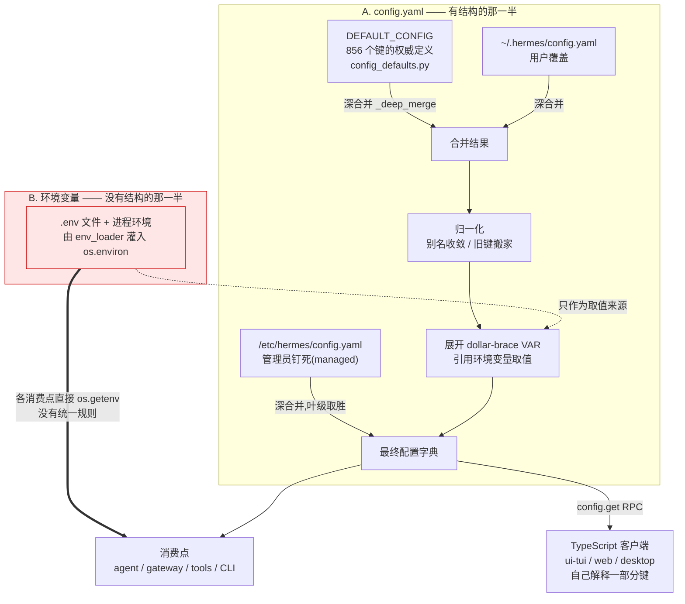

# r8a · 配置面 —— 一个键从哪里来,到哪里去

> **读者定位**:有多年后端经验(Go / Java 背景),**没读过 hermes-agent**,
> **不熟 LLM provider 生态与 Python 异步生态**。本章不要求你查任何资料、不要求你看源码。
> **溯源约定**:凡关键断言后跟 `路径:行号 @ 863e313`,指向基线
> `863e31318553cda8ad61df681d08175364d4164b`,可逐条复核。
> 术语首次出现给一句话中文解释。

---

## TL;DR(快读路径)

1. Hermes 的"配置"其实是**两套互不相干的东西**:一份深度合并的 YAML 字典
   (`config.yaml`),和一堆各读各的环境变量(`.env`)。文档把它们画成一条四级优先级链,
   **代码里没有这条链**——这是本章最需要你记住的一件事。
2. YAML 那一侧做得相当好:**856 个键**有权威定义、有递归深合并、有 schema 版本迁移、
   有"解析失败退回上一次好的而不是退回默认值"的安全姿态。
3. 但**同一份 `config.yaml` 有两个装载器**,合并语义不同:一个递归深合并,
   一个只做一层 `dict.update`。同一个嵌套键在网关和 CLI 里能取到不同的值。
4. 环境变量那一侧没有统一规则,**每个消费点自己决定谁先谁后**,有的还先查环境变量再查配置
   ——正好和文档说的反过来。本章开篇那个 bug 就长在这块无人区里。
5. 最值得抄走的一条不是某个机制,而是一个**对照实验**:856 个配置键里有
   **105 个在全部文档面上一次都没出现过**,而 151 个环境变量**一个都不缺**。
   差别不在纪律,在**说明文字是不是数据结构里的必填字段**。

---

## 1. 从一个场景说起:我照着文档配了,机器人也好了,面板却说没配

一位用户在 QQ 上跑 Hermes 机器人。他想让定时任务把消息发到某个频道,于是照官方文档
设了环境变量 `QQBOT_HOME_CHANNEL`。重启,一切正常:定时消息按时送达。

然后他运行 `hermes status` 想确认一下,看到这么一行:

```
  QQBot         ✓ configured
```

而 Telegram 那一行是这样的:

```
  Telegram      ✓ configured (home: -1001234567890)
```

**为什么 QQBot 少了 `(home: …)`?** 用户的第一反应必然是"我是不是配错了",
于是他去翻文档、改拼写、重启……而机器人**明明一直在正常工作**。

答案在面板的代码里。它有一张平台表,每行是"(令牌变量名, home 频道变量名)":

`hermes_cli/status.py:483 @ 863e313`

```python
        "QQBot": ("QQ_APP_ID", "QQ_HOME_CHANNEL"),
```

**表里写的是旧名 `QQ_HOME_CHANNEL`。** 这个变量早就改名叫 `QQBOT_HOME_CHANNEL` 了——
官方文档只讲新名(`website/docs` 里新名出现 3 次、旧名 **0 次**),
网关本体也优先读新名,读到旧名还会打一条"请改名"的弃用警告。

作者显然是知道要改名的,因为紧接着就有一段"向后兼容":

`hermes_cli/status.py:494-496 @ 863e313`

```python
        # Back-compat: QQBot home channel was renamed from QQ_HOME_CHANNEL to QQBOT_HOME_CHANNEL
        if not home_channel and home_var == "QQBOT_HOME_CHANNEL":
            home_channel = os.getenv("QQ_HOME_CHANNEL", "")
```

**但这段代码永远不会执行。** `home_var` 的值只能来自上面那张表,而全表 11 个 home 变量里
**没有** `QQBOT_HOME_CHANNEL`——它在整个 `status.py` 里只出现两次:上面那行注释,
和这个永远为假的判断。

更妙的是:**就算它能执行,也什么都不做**。分支体读的是 `QQ_HOME_CHANNEL`,
而三行之上主路径已经用 `home_var`(此刻正是 `"QQ_HOME_CHANNEL"`)读过同一个变量了。

所以这是一段**双重死代码**:判断恒假,且分支体是空操作。作者的本意——
"主读新名,读不到再回退旧名"——写在注释里,而代码做的**正好相反**:
表里钉死旧名,兼容分支去找新名。**注释和代码调了个个儿。**

**这个 bug 为什么能活这么久?** 因为它长在一块**没有规则、也没有测试**的地方。
`hermes status` 的 10 个测试里,主题是"不打印 Tavily 密钥的值""Termux 下跳过 systemctl"
以及五支**抗崩溃**测试(import 失败、函数抛异常、返回 None,都不能让面板崩)。
**没有任何一支断言过表里那一行的内容对不对。** 全仓提到 `QQ_HOME_CHANNEL` 的测试只有一处,
还是在 `monkeypatch.delenv` 的清理列表里——它**删掉**这个变量,从不断言它。

> **判据(可带走)**:一段代码里有"向后兼容"分支,而它所在模块的测试**全是抗崩溃测试**
> (断言"不抛异常")而非行为断言——那么这个兼容分支**极可能从未被执行过**。
> 抗崩溃测试的覆盖率数字很好看,但它对"值对不对"提供**零信息**。

现在放大来看:为什么一个"配置项"能躲开整个配置系统的所有校验?
因为**它根本不在配置系统里**。这就是下一节。

---

## 2. 全景:两套东西,一个名字

Hermes 里被统称为"配置"的,其实是两个几乎不相交的系统。



**读这张图的要点有三个:**

**第一,红色那一半没有合并链。** 环境变量不是"优先级更低的一层"。它只有两种参与方式:
(a) 作为 `${VAR}` 的取值来源被塞进 YAML 的值里;(b) 被各个消费点用 `os.getenv` 各读各的。
第 1 节那个 QQ 变量走的是 (b),所以它从来没进过 A 系统,自然也享受不到 A 系统的任何保障
——没有默认值、没有 schema 校验、没有迁移、没有"这个键存不存在"的检查。

**第二,右下角那条虚线是很多人想不到的**:相当一部分配置键**根本不由 Python 读**。
Python 把合并好的配置经一个叫 `config.get` 的 RPC(远程过程调用,这里就是客户端问服务端
要数据)发出去,真正解释这些键的是 TypeScript 写的终端界面、网页面板和桌面应用。
这一点在本项目自己身上就应验过一次:第一版分析脚本只扫 `.py`,于是把
`display.show_cost`、`dashboard.show_token_analytics` 等五个**活得好好的**键判成了死键。

**第三,A 系统本身做得相当扎实**,值得逐个拆开看。下一节就干这个。

---

## 3. 逐机制

### 3.1 深合并:为什么"改一个键"不该弄丢它的兄弟

**场景**:文字转语音有两个设置,声音 ID 和模型 ID,都有默认值。用户只想换个声音,
于是在 `config.yaml` 里写:

```yaml
tts:
  elevenlabs:
    voice_id: my-favourite-voice
```

如果合并用的是 Python 的 `dict.update`(等价于 Java 的 `Map.putAll`),
`tts.elevenlabs` 这个子字典会被**整体替换**,`model_id` 的默认值就没了。
用户只想改一个值,却弄丢了旁边那个他压根没提过的值。

Hermes 的主装载器用递归合并解决它:

`hermes_cli/config.py:2435 @ 863e313`

```python
def _deep_merge(base: dict, override: dict) -> dict:
```

docstring 把意图讲得很直白,举的正是上面这个例子:

`hermes_cli/config.py:2438-2440 @ 863e313`

```python
    Keys in *override* take precedence. If both values are dicts the merge
    recurses, so a user who overrides only ``tts.elevenlabs.voice_id`` will
    keep the default ``tts.elevenlabs.model_id`` intact.
```

它还处理了一个 YAML 特有的坑:在 YAML 里写一个空的段名(`terminal:` 后面什么都不写)
会解析成 `None`。要是把这个 `None` 当作覆盖值,整个 `terminal` 默认字典会被替换成 `None`,
所有下游都会崩。所以 `None` 覆盖一个字典默认值时**被当作没写**。

**取舍**:深合并意味着**在 `config.yaml` 里写什么都是"合并",不是"替换"**——
用户没有办法通过编辑文件把一个有默认值的键变没。
Hermes 接受了这个取舍,另配了一条 `hermes config unset` 来**撤销自己的覆盖**
(把键恢复成默认值,而不是让键消失):

`hermes_cli/config.py:5062-5063 @ 863e313`

```python
def unset_config_value(key: str):
    """Remove a user-set configuration or .env value."""
```

顺带一个值得学的细节:如果这个键是**管理员钉死的**,`unset` 会直接拒绝并说明理由——
因为下一次加载 managed 层会把它装回去,让用户执行一条**表面成功、实则无效**的命令
是更坏的体验:

`hermes_cli/config.py:5067-5068 @ 863e313`

```python
    # Managed scope guard: a key pinned by the managed layer cannot be unset by
    # the user — the next load would reinstate it anyway (mirrors set_config_value).
```

### 3.2 头条:同一份文件,两个装载器,合并语义不同

**场景**:承接上一节。你已经知道"深合并"是对的了。现在的问题是——
**Hermes 有两个装载器,只有一个这么干。**

第二个装载器在 `cli.py`(交互式命令行和终端界面走它),它自带**另一份默认值字面量**:

`cli.py:441 @ 863e313`

```python
    defaults = {
```

而它的合并是这样的:

`cli.py:599 @ 863e313`

```python
                        defaults[key].update(file_config[key])
```

**一层 `dict.update`,不递归。** 也就是 3.1 节开头那个反例。

这不是纸上推演。同一个 `HERMES_HOME`,同一份只设了两个嵌套叶子键的 `config.yaml`:

```yaml
compression:
  threshold: 0.75
browser:
  camofox:
    rewrite_loopback_urls: true
```

两个装载器实际跑出来的结果:

| | 主装载器 `load_config()` | CLI 装载器 `CLI_CONFIG` |
|---|---|---|
| `compression` 键数 | **28** | **3** |
| `browser.camofox` 键数 | **6** | **1** |
| `browser.camofox.loopback_host_alias` | 默认值保住 | **不存在了** |

用户想打开一个布尔开关,在 CLI 这一侧**顺手删掉了同级的全部默认值**;
在网关那一侧却完好无损。**同一个键,两个进程,两个值。**

**为什么至今没炸?** 必须说清楚,否则就是危言耸听。以 `loopback_host_alias` 为例,
它的读取点有一层硬编码兜底:

`tools/browser_camofox.py:248-253 @ 863e313`

```python
def _loopback_rewrite_host(camofox_cfg: Dict[str, Any]) -> str:
    """Return the host alias used when rewriting loopback page URLs."""
    return (
        os.getenv("CAMOFOX_LOOPBACK_HOST_ALIAS", "").strip()
        or str(camofox_cfg.get("loopback_host_alias") or "").strip()
        or "host.docker.internal"
    )
```

最后那个 `or "host.docker.internal"` 和默认值**是同一个字面量**——
这个字面量在仓库里存在**三份**。所以键丢了也读回同一个值,现象为零。

**这恰恰是它危险的地方**:隐患被一个偶然的重复字面量盖住了,
**下一个没有硬编码兜底的键就会真的出事,而且现场看不出是合并语义丢的**——
你会看到一个"用户明明没配过的字段变成了空",然后去查那个字段的代码,
而问题根本不在那里。

**测试为什么没抓住它?这一段比 bug 本身更值得看。**
仓库里**有**一支以这条性质命名的测试:

`tests/hermes_cli/test_managed_scope_cli_config.py:58 @ 863e313`

```python
def test_cli_config_managed_leaf_preserves_user_siblings(homes):
```

它构造"管理员配置覆盖用户配置"的场景,断言同级键存活。**但它测的是 managed 那一层,
而那一层的合并是对的。** 出问题的是更前面一步:**内置默认值 ← 用户配置**。
在这支测试里,用户配置永远是**被覆盖的基底**,从来不是**覆盖方**,
所以那条浅合并路径**在这支专测同级键存活的用例里也没被走到**。

> **可带走的两条**:
> 1. 系统里若存在同一份输入的**两个解释器**(两个装载器、服务端与客户端各一份校验),
>    必须有一支**双读一致性测试**,直接断言二者对同一输入产出相同结果。
>    这种测试单看哪一边都写不出来,只能显式跨边界写。
> 2. 一条性质若在**多个层**上都该成立,测试要按"**性质 × 层**"做矩阵逐格枚举。
>    按"层"分文件写测试,空格子是看不见的。

### 3.3 解析失败:退回"上一次好的",而不是退回默认值

**场景**:网关是个长期运行的进程。用户在它跑着的时候编辑 `config.yaml`,
手一抖存成了坏 YAML。下次加载会发生什么?

直觉答案是"用默认值兜底"。Hermes **明确拒绝**这个答案:

`hermes_cli/config.py:3348-3356 @ 863e313`

```python
            except Exception as e:
                # Last-known-good fallback (port of openai/codex#31188's
                # invariant: a parse failure in a policy/config file must not
                # silently replace the effective policy with an empty/default
                # one). Falling through to DEFAULT_CONFIG here drops EVERY user
                # override — including security-critical ``approvals.deny``
                # rules, which are supposed to block commands even under yolo.
                # A long-running gateway whose user mid-edits config.yaml into
                # broken YAML would silently lose those rules on the next load.
```

理由是**安全**的:配置里有 `approvals.deny`——一份"这些命令绝对不许执行"的黑名单。
退回默认值等于**用户存了个错别字,防线就自己拆了**,而且悄无声息。
所以进程内保留"上一次成功加载的配置",坏了就继续用它。

配套还有一条:**绝不原地改写用户的文件**。坏文件会被另存一份带时间戳的 `.bak`
供用户修复,而原文件留在那里——这样用户手工改好后,下次加载自然就读到了。

**取舍**:这意味着一个坏配置可能在进程里"隐身"很久(日志里有警告,但服务照跑)。
作者选择了**可用性优先于一致性**,前提是有告警。对配置这种"改错了就该继续按老规矩办"
的东西,这个取舍是对的。

> **可带走**:配置/策略文件的解析失败,**默认值不是安全的兜底**。
> 兜底的方向应该是"保持现状"(上一次好的),而不是"回到出厂"。
> 尤其当配置里含有**限制性规则**(黑名单、配额、拒绝策略)时,
> 回到出厂等于把限制解除了。

### 3.4 读写不对称:读的时候展开密钥,写的时候必须把它变回去

**场景**:配置里可以写 `api_key: ${MY_SECRET}`,运行时会被替换成环境变量的真实值——
这样密钥不必存在 `config.yaml` 里。很好。

现在想想这条链会怎么出事:用户跑 `hermes config set display.compact true`。
这条命令的实现是"**读整份配置 → 改一个键 → 写回**"。而"读"这一步**已经把
`${MY_SECRET}` 展开成了真实密钥**。如果就这么写回去——
**用户改了个跟密钥毫无关系的显示选项,他的 API 密钥就被明文写进了 `config.yaml`。**

Hermes 用一个"写回前还原模板"的函数堵住这条路:

`hermes_cli/config.py:2609 @ 863e313`

```python
def _preserve_env_ref_templates(current, raw, loaded_expanded=None):
```

难点在于**怎么判断"这个值没被改过"**。不能只比较字面量,因为环境变量可能在
读和写之间轮换过。所以它用了三条判据,任意一条成立就还原模板:

`hermes_cli/config.py:2623-2629 @ 863e313`

```python
    if isinstance(current, str) and isinstance(raw, str) and re.search(r"\${[^}]+}", raw):
        if current == raw:
            return raw
        if isinstance(loaded_expanded, str) and current == loaded_expanded:
            return raw
        if _expand_env_vars(raw) == current:
            return raw
        return current
```

即:值还等于模板本身 / 等于**这次加载时**展开出来的值 / 等于**当前环境**展开出来的值。
三条都不满足,才认为"用户真的把这个值改了",写新字面量。

**本轮跑了一次端到端验证。** 临时 home,`config.yaml` 里写
`api_key: ${MY_TEST_SECRET}`,环境里 `MY_TEST_SECRET=sk-super-secret-value`:

| 操作 | 内存里读到的值 | 落盘后文件里的值 |
|---|---|---|
| 只改无关键 `display.compact` | `sk-super-secret-value` | **`${MY_TEST_SECRET}`**(模板还原) |
| 把 `api_key` 真的改成新值 | — | `sk-user-typed-a-new-key`(写新字面量) |

两种情形都如设计所愿。

> **可带走**:只要系统里有"**读时变换**"(展开、解密、归一化),就必须配一个
> **写时逆变换**,并且要有一个明确的"值有没有被改动"的判据。
> 否则任何一个"读-改-写"的调用方都会把变换后的形态固化到源文件里。
> 这类 bug 的特征是**破坏面与触发原因毫不相关**——你改的是显示选项,泄的是密钥。

### 3.5 缓存:键必须覆盖全部输入,而不只是最显眼那个

**场景**:配置加载不便宜,所以要缓存。自然的缓存键是文件的 `(修改时间, 大小)`——
文件没变就用缓存。这看起来没毛病,直到:

进程启动早期,某段代码调了一次 `load_config()`。此时 `.env` **还没加载**,
所以配置里的 `api_key: ${OPENAI_API_KEY}` 展开时找不到值,**原样留成了字面量
`"${OPENAI_API_KEY}"`**,并进了缓存。随后 `.env` 加载了,环境里有值了——
但**文件没变,缓存签名没变,缓存永远命中**。这个进程到死都拿着一个没展开的假密钥。

修法是给缓存键加一个维度:

`hermes_cli/config.py:3325-3330 @ 863e313`

```python
            # every ${VAR} it was expanded against still has the same value.
            # Without this, a load_config() that ran before load_hermes_dotenv()
            # pins unexpanded literals (e.g. auxiliary.<task>.api_key) for the
            # life of the process (#58514).
```

缓存里额外存一份**环境快照**:这次展开依赖了哪些环境变量、当时各是什么值。
命中时逐个比对,只要有一个变了就重新加载。

> **可带走**:凡缓存"计算结果",缓存键必须覆盖**全部输入**,而不只是那个最显眼的输入。
> 这类 bug 的典型现象是"**重启就好了**"——这句话应当直接触发对缓存键完整性的怀疑。

### 3.6 版本迁移:一张表、一个下限、一个不推进的版本号

**场景**:配置格式会演进。两年前的用户升级上来,他的 `config.yaml` 得能自动改写成新格式。
Hermes 的做法是给配置打一个 schema 版本号(`_config_version`,当前最新是 **33**),
一串 `_migrate_to_N` 函数逐版本升级。

三个设计点值得记:

**一,表驱动,而且初始版本号不推进。** 迁移不是"逐步升级、每步推进版本",
而是拿**同一个**初始版本号去比每一条注册项:

`hermes_cli/config_migrations.py:671 @ 863e313`

```python
def run_migrations(current_ver: int, results: Dict[str, Any], quiet: bool) -> None:
```

为什么这么别扭?因为这段代码是从一个 768 行的 `if current_ver < N:` 长梯**重构**出来的,
而原来那个长梯里的 `current_ver` 就是不推进的。**为了让重构可证明地不改变行为,
新实现必须复刻这个语义。** 这是一个很克制的选择:重构时**先保住等价性,再谈优雅**。

**二,支持下限。** 太老的配置**不迁移、也不报错**:

`hermes_cli/config_migrations.py:53 @ 863e313`

```python
SUPPORT_FLOOR_VERSION = 12
```

低于 12 的配置**原样留着不动**,进程照常启动(读取时深合并默认值),
同时给用户一条明确的话:备份你的文件,跑 `hermes setup` 重新生成,
或者自己看 changelog 之后手动把版本号写成 12。
**这是"体面的退出"而不是"崩溃"或"猜"。**

**三,注册表的版本号是跳号的**(12,13,…,17,21,23,25,29,31,32,33),
中间 9 个版本没有迁移步骤——那些版本的变更不需要改用户文件。**跳号是正常的,
不是遗漏。** 而这件事有测试保证:

`tests/hermes_cli/test_config.py:687 @ 863e313`

```python
    def test_registry_has_no_targets_below_floor(self):
```

它测的不是"某次迁移做对了",而是**这张表本身的形状合法**。配套还有一支更狠的:
断言**砍掉 v12 以下的步骤之后,v12 及以上的迁移结果与砍之前逐字相同**——
把"这次删代码没有改变任何仍受支持路径的行为"变成了一条可执行断言。

> **可带走**:逐版本迁移表值得配两类测试——(a) 表的**形状不变量**
> (严格升序、无低于下限的残留);(b) **删除安全性**:淘汰老步骤时,
> 证明受支持区间的输出不变。只测单个迁移步骤做了什么,这两类事故都拦不住。

### 3.7 命令注册表:一份定义,四个各自过滤的视图

**场景**:用户在聊天里敲 `/help`,想知道有哪些命令。同时 Telegram 的输入框也要弹出
一个命令菜单,网页面板要做自动补全,网关要判断"这条消息是不是一个已知命令"。
四个消费者,一份数据。

Hermes 的答案是一张中央注册表:

`hermes_cli/commands.py:102 @ 863e313`

```python
COMMAND_REGISTRY: list[CommandDef] = [
```

**实测数字(本轮导入模块后逐项数出)**:

| 数 | 含义 |
|---|---|
| **94** | `CommandDef` 条目数(= 互异的规范命令名数) |
| **26** | 别名总数 |
| **120** | 可敲的 token 总数(名 + 别名) |
| **8** | 标了 `gateway_only` 的命令(带 1 个别名) |
| **111** | 对外扁平字典 `COMMANDS` 的条目数 = 120 − 9 |

最后一行是关键:扁平字典**过滤掉了 `gateway_only`**:

`hermes_cli/commands.py:378-381 @ 863e313`

```python
COMMANDS: dict[str, str] = {}
for _cmd in COMMAND_REGISTRY:
    if not _cmd.gateway_only:
        COMMANDS[f"/{_cmd.name}"] = _build_description(_cmd)
```

所以**"Hermes 有多少条命令?"这个问题没有单一答案**,必须先问"对谁而言"。
按类目再分一次(Session 43 / Configuration 24 / Tools & Skills 24 / Info 18 / Exit 2)
加总仍是 111,自洽。

这张表还有一个和本章主题直接相关的接缝:**命令的可见性受配置门控**。
注册表不只是静态数据,它会去读配置来决定某条命令当前算不算可用——
于是"配置面"和"命令面"在这里合流。

**取舍**:一份定义派生多个视图,好处是加命令只改一处;代价是**每个视图的过滤规则
都是隐式的**,读注册表看不出"这条命令在 Telegram 菜单里会不会被截掉"。
Telegram 那一路尤其复杂(平台限制最多 100 条,默认只放 60 条,还有优先级重排),
这些规则散在四个常量和三个函数里。

### 3.8 配对批准:门只能从外面开,而钥匙捅穿了封装

**场景**:陌生人给机器人发私信。机器人不能直接就聊——那等于谁都能用你的账号跑 agent。
所以有一套"配对"流程:机器人给对方一个配对码,**账号主人**在自己已认证的通道里批准。

上一轮已经证明了**这道门只能从外面开**:批准函数在全仓的调用点**全部**在已认证侧,
入站消息路径**零调用**。本轮读的是"门外那把钥匙"——`hermes pairing approve` 命令本身。

它是 `gateway.pairing.PairingStore` 的纯外部调用者,但**捅穿了封装**,
直接调了三个下划线开头的私有成员。为什么?代码自己解释了:

`hermes_cli/pairing.py:82-84 @ 863e313`

```python
        # Disambiguate: approve_code returns None for both invalid codes
        # and lockout. Tell the operator it's lockout so they don't chase
        # a "wrong code" rabbit hole (#10195).
```

这是一个**真实存在的张力**,而且两边都对:

- **对攻击者**,"码错了"和"你被锁定了"必须**不可区分**——否则两种失败的响应差异
  本身就是一条枚举信道,可以用来试探哪些码是有效的。
- **对运维者**,这两件事必须**能区分**——否则你拿着一个正确的码,
  系统说"未找到",你会去查码、查平台名、查过期时间,唯独想不到是被限流锁了。

作者的解法是:公开接口保持不可区分,**已认证侧的 CLI 越过公开接口去读内部状态**,
把区分度只给运维者。

**取舍**:方向是对的,**实现是脆的**。私有方法一旦改名或改签名,
CLI 会在运维者最需要它的那条路径上炸掉,而这条路径日常几乎不会被走到。
**这里缺的是一个该有而没有的接口**:一个明确标注"仅限已认证侧"的诊断 API。

> **可带走**:当"对外不可区分、对内要可区分"同时成立时,应当**显式提供一个
> 受限的诊断接口**,而不是让调用方去捅私有成员。安全需求造成的信息隐藏,
> 应该由一个有名字的出口来解除,而不是由调用方绕过去。

---

## 4. 可迁移的设计原则

**① 把"这个键是什么"做成数据结构里的字段,而不是注释。**
这是本轮最强的一条,而且有对照实验支撑。同一套检索、同一批文档面:

| | 数量 | 全站零提及 |
|---|---|---|
| 配置键(`DEFAULT_CONFIG`) | 856 | **105** |
| 环境变量(`OPTIONAL_ENV_VARS`) | 151 | **0** |

差别不是有人更勤快。配置键的说明是**自由文本注释**,正式文档写在另一个目录的
另一个文件里,两处各自演化;环境变量的说明是**定义字面量里的必填字段**
(`description` / `prompt` / `url` / `password` / `category`),定义与说明**同一处、同一次编辑**。
**于是覆盖不再依赖纪律,而依赖类型。** 你要漏,得先删一个字段。

> **顺带一条方法论的自我更正**:本轮原想给出一个"文档覆盖率百分比",最后**放弃了**。
> 按点分全路径(`display.show_cost`)匹配得到 **0.0%** ——因为文档写的是 YAML 块,
> 根本不用点分写法,这个数量的是排版习惯;按叶子名匹配得到 87.7% ——
> 而 `enabled` / `timeout` 这类叶子名在文档里到处都是,严重高估。
> **两个边界都不可用,所以本章不报覆盖率**,只报那个确定成立的数:**105 个键零提及**。
> 报一个自己都不信的百分比,比不报更糟。

**② 一个配置只能有一个装载器。** 如果历史原因必须有两个,至少让它们**共用同一个合并函数
和同一份默认值**。否则"同一个键在不同进程里取值不同"这种 bug,没有任何单侧测试形态
能稳定抓住——两边各自都是绿的。

**③ 配置解析失败时,兜底方向是"保持现状",不是"回到出厂"。** 尤其当配置里含有
限制性规则(黑名单、配额、拒绝策略)时,回到出厂等于**把限制解除了**。

**④ 缓存计算结果时,缓存键必须覆盖全部输入。** "重启就好了"是缓存键不完整的典型征兆。

**⑤ 环境变量与配置文件的优先级,要么定一条全局规则并强制执行,要么诚实地承认没有。**
最坏的情况是**文档写了一条全局规则,而代码里每个消费点各行其是**——
用户会拿着一条错误的心智模型去排查,越查越远(见 §5)。

**⑥ 重构长条件梯时,先保住可证明的等价性,再谈优雅。**
Hermes 把 768 行的 `if` 梯换成注册表,却刻意保留了"版本号不推进"这个别扭语义,
并写测试断言新旧输出逐字相同。**这是对的**:重构的正确性优先于重构的美观。

**⑦ 做"谁读这个键"的分析时,先问"读它的是不是同一种语言"。**
本项目自己在这里栽过:只扫 Python 就把五个由 TypeScript 消费的活键判成了死键。
跨进程、跨语言的配置消费在现代应用里是常态,单语言的静态分析会**结构性失明**。

---

## 5. 地图与代码的出入(本簇定案)

**▲-1 代码指向一份不存在的设计文档。** 整个配置系统里最反直觉的规则——
管理员钉死的值排在 `${VAR}` 展开**之后**,因此压得住用户的环境变量引用——
代码给它标的出处是 `docs/design/managed-scope.md §4.1`,而**该文件不存在**
(`docs/design/` 下只有一个无关文件)。**但内容其实是有文档的**,
在 `website/docs/user-guide/managed-scope.md` 的 "Precedence" 一节,讲得相当准确。
所以这是**指针失效**,不是内容缺失——代价是读代码的人按图索骥找不到,
就会以为那条注释是唯一解释,从而不知道这条反转**只对管理员点名的那些键成立**。

**▲-2 文档把 `bedrock.discovery` 讲成可调,而三个键一个都没接线。**
文档说"你可以定制发现行为",给出 `enabled` / `provider_filter` / `refresh_interval` 三个键。
实际实现用的是一个**模块级常量**,`provider_filter` 则是个**从没有人传的函数参数**。
**这条的毒性在于默认值撞上了硬编码值**:常量正好等于文档里写的 3600,
所以用户照文档配一遍、观察缓存行为,会得出"生效了"的结论;
只有改成别的值才会发现无效,而那时他会怀疑缓存本身,不会怀疑这个键根本没接线。
更隐蔽的是同一个 `bedrock:` 段里的 `region` 和 `guardrail.*` **是接了线的**——
一个段里三个子块两个能用一个不能用,肉眼完全看不出来。

**▲-3 文档的四级优先级链在代码里不存在。** 文档说:CLI 参数 > `config.yaml` > `.env` > 默认值,
并强调"两边都设了,非密钥设置以 `config.yaml` 为准"。真实情况是 §2 那张图:
`config.yaml` 有一条统一的合并链,**环境变量根本不是其中一层**;
而在各消费点直接读的场景里,**环境变量常常先被检查、赢过 `config.yaml`**。
有意思的是文档自己泄了底——讲 provider 超时那段特意声明"配置值胜过遗留的
`HERMES_API_TIMEOUT` 环境变量"。**如果全局规则真是"config 胜 env",这句话就不必写。
需要逐处声明,恰恰说明没有全局规则。**

**▲-4 QQBot 变量名**:即 §1 那个场景。文档只讲新名,面板只读旧名,兼容分支双重失效。

**◇ 两个装载器的存在本身,全站零文档。** 2,386 行的配置文档与仓库根的
`AGENTS.md` 中都没有任何提及;文档呈现的是一个单一、统一的配置系统。

---

## 6. 延伸

- **底稿(证据层,逐机制逐行取证)**:`notes/r8a-01`(范围/主线独立取证/三笔移交项定案)、
  `notes/r8a-raw-*`(逐段精读)、`notes/r8a-90`(定案卷:▲ / ◇ / ■ 全表与移交项)、
  `notes/r8a-95`(测试作为行为规格)。
- **专项资产**:`data/r8a-config-keys.tsv`(856 键 × 键名/默认值/定义处/Python 读取点/
  TypeScript 读取点/文档覆盖)、`data/r8a-env-vars.tsv`(151 条环境变量同构表)。
  生成脚本 `scripts/config_table.py` 可对任意 commit 重跑。
  **使用前请读该脚本开头的两条告诫**:一是读取点按语言分列的理由,
  二是 `OPTIONAL_ENV_VARS` 会在 import 时被原地改写(151 → 308),
  静态表覆盖的是"写下来的",不是"安装向导会问的"。
