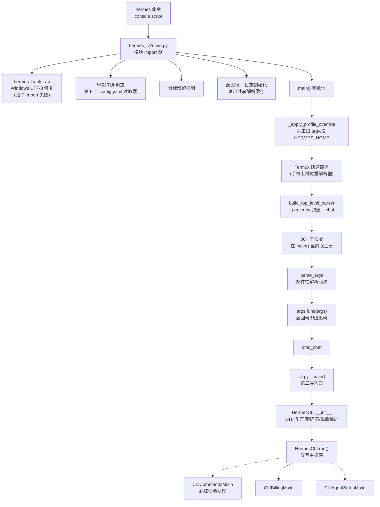

# r8b · CLI 主干与交互 —— 一条命令从敲下回车到进入对话,中间有多少人在做决定

> **读者定位**:多年后端经验(Go / Java 背景),**没读过本仓库**,**不熟 LLM provider 生态与 Python 异步生态**。
> 本章不要求你查任何外部资料、不要求你打开源码。
> **溯源约定**:关键断言后跟 `路径:行号 @ 863e313`,`863e313` 是本项目固定的基线 commit。

---

## TL;DR(快读路径)

1. **`hermes` 这条命令的入口不是 `cli.py`。** 打包入口是 `hermes_cli/main.py` 的 `main()`;`cli.py` 里那个同名 `main()` 是**第二层**——交互式对话的入口。搞混这一点,整个文件的读法都会错。
2. **在 argparse(Python 标准库的命令行参数解析器)跑起来之前,已经有一大堆决定做完了**:UTF-8 修复、`--profile` 手工扫描、要不要开 TUI、鼠标残留抑制、配置桥、日志初始化。原因很实在:**这些决定的结果会影响"读哪一份配置"和"加载哪些模块",所以它们必须早于解析**。代价是主干里有一段**手抄的 argparse**。
3. **这个 CLI 有两套配置装载器,而本轮把上一轮的账算完了**:浅合并真正的受害面**恰好 24 个叶子键**,其中 **14 个真会出事**——用户加一个自定义人格,**内置的 14 个人格全部消失**(已实跑复现)。
4. **本轮最值得记的不是某个 bug,而是一个反复出现的形状:两份必须一致的东西,中间只有人。** 它有两副面孔——**改了但没传到全部消费面**(3 个独立实例,其中一个是"启动时的工具告警面板从来没显示过"),以及**两份必须手工对齐的名单**(4 份,其中"注册表 vs 分发链"已经让 `/whoami` 出现在 `/help` 里却敲不出来)。
5. **配置键失效有三种不同的死法**,本章把它们摆在一起:**值漂移**(上一轮)、**层级错位**(本轮 §3.2)、**读它的代码根本跑不到**(本轮 §3.3)。三者的排查手感完全不同,而报错信息都是——没有报错。

---

## 1. 从一个场景说起:`hermes -p work chat` 敲下去之后

设想你在终端敲:

```
hermes -p work chat
```

意图很朴素:用 `work` 这个"配置档案"(profile,即一套独立的配置与会话目录)开一次对话。
直觉上应该是:解析参数 → 读配置 → 启动。**实际顺序几乎是反的。**

问题出在一个先有鸡还是先有蛋的地方:**`-p work` 决定了配置文件在哪儿**
(它会把 `HERMES_HOME` 这个环境变量指向 `~/.hermes/profiles/work`),
而**很多模块在被 import 的那一刻就去读配置了**。
等 argparse 解析完再设 `HERMES_HOME`,那些模块已经读过错的配置了。

于是主干的做法是:**在 argparse 之前,手工扫一遍 `sys.argv` 把 `-p` 找出来。**

`hermes_cli/main.py:517 @ 863e313`

```python
def _apply_profile_override() -> None:
    """Pre-parse --profile/-p and set HERMES_HOME before imports."""
```

这一手写下去,就欠了一笔债:**手工扫描必须知道所有"带值的参数"**,
否则会把别人的值当成 profile 名。比如 `hermes -m gpt-5 -p work`,
扫描器必须知道 `-m` 后面那个 `gpt-5` 是 `-m` 的值、不是要找的东西。
于是主干里有一份**手抄的名单**:

`hermes_cli/main.py:572 @ 863e313`

```python
    value_flags = {
        "-z", "--oneshot",
        "-m", "--model",
        "--provider",
        "-t", "--toolsets",
        "-r", "--resume",
        "-s", "--skills",
        "--usage-file",
    }
```

**这份名单和真正的 parser 之间没有任何自动校验。** 本轮实测当前是同步的,
但这是一个纯靠人维护的同步点——**它是"入口必须早于解析"这个约束的直接成本**。

同样的位置还处理了两个很真实的边角。其一,`hermes mcp add --args <子命令>` 之后的参数
属于被托管的子进程,里面的 `--profile` 不是给 Hermes 的:

`hermes_cli/main.py:525 @ 863e313`

```python
        """True once argv reaches `hermes mcp add ... --args <command argv>`.

        ``mcp add --args`` is command-argv passthrough. Flags after that point
        belong to the child MCP command (for example Docker MCP Toolkit's
        ``--profile``), not to Hermes' own profile selector.
        """
```

其二,pytest 的 `-p no:xdist`。如果不管,`no:xdist` 会被当成 profile 名:

`hermes_cli/main.py:611 @ 863e313`

```python
    # 1b. Reject values that can't be valid profile names (e.g. pytest's
    # "-p no:xdist" would be misread as profile "no:xdist" otherwise).
    # Mirrors hermes_cli.profiles._PROFILE_ID_RE so we never call
```

注意注释里那个词:**Mirrors(镜像)**。这是一份手抄的正则。
全仓这条 profile 名正则一共 **6 份**,本轮实测**当前完全一致**。
**记下来不是因为它现在错了,而是因为它是本章主题的第一个样本:同一个语义,散在多处,靠人对齐。**

---

## 2. 全景



一句话串起来:**左半边(import 期 + `main()`)在解决"用什么配置、以什么形态启动";
右半边(`cli.py`)在解决"一次交互怎么跑完"。** 两边的接缝是 `cmd_chat`,
而**接缝两侧各有一份配置装载器**——这正是上一轮头条的病根,本章 §3 把它算完。

---

## 3. 配置键的三种死法

上一轮(R8A)的结论是:同一份 `config.yaml` 被两个装载器读,合并语义不一样。
本轮把这条线走到底,得到一个更有用的东西:**配置键失效有三种彼此独立的死法。**
它们的共同点是**都不报错**,不同点是排查手感完全不同。

### 3.1 死法一:值漂移(上一轮已定案,此处只作对照)

用户设的键**被读到了**,但读出来的**不是他设的值**——因为一个"遗留键"被默认值钉死、
而查询顺序又是遗留键优先。上一轮实测同一份配置在网关面是 900 秒、CLI 面是 120 秒。

**本轮补上了这道题的正确答案。** 同一个仓库里有一个**做对了的样本**:
`display.tool_progress_overrides` 也是新旧键并存,但它**不出事**,差别有三处而不是一处:

| | 做错的那个 | 做对的那个 |
|---|---|---|
| 旧键是否被写进默认值 | **是** → "用户设过没有"这个判断**永久失真** | **否** → 存在即代表用户真设过 |
| 查询顺序 | 遗留键优先 | **规范键优先**,遗留键兜底 |
| 迁移会不会覆盖已有的新值 | — | **不会**(先检查再写) |

第三点的原文:

`hermes_cli/config_migrations.py:258 @ 863e313`

```python
            if "tool_progress" not in platforms[plat]:
                platforms[plat]["tool_progress"] = mode
```

> **可迁移的判据**:"旧键不删"本身不是错。危险的是它与"旧键被默认值播种"叠加——
> 那会让 `if 用户没设过` 这类判断**永远为假**。
> **先保证"存在 == 用户设过",再让规范键赢。**

### 3.2 死法二:层级错位 —— 同一条命令,不同入口给出不同的世界

**场景**:你在电脑上用 Hermes,打 `/personality kawaii`,切换到一个可爱风格的人格,好用。
后来你在手机上通过 Slack 对同一个 Hermes 打 `/personality kawaii`,
得到的是 **"No personalities configured"**。

原因是 `agent.personalities` 这个键**只存在于 `cli.py` 那份默认值里**,
带着 14 个内置人格:

`cli.py:481 @ 863e313`

```python
            "personalities": {
                "helpful": "You are a helpful, friendly AI assistant.",
```

而主装载器的默认值表里,同名概念挂在**顶层**、而且是空的:

`hermes_cli/config_defaults.py:2126 @ 863e313`

```python
    # Custom personalities — add your own entries here
    # Supports string format: {"name": "system prompt"}
    # Or dict format: {"name": {"description": "...", "system_prompt": "...", "tone": "...", "style": "..."}}
    "personalities": {},
```

**而所有读取点读的都是 `agent.personalities`。**
于是顶层那个 `personalities` **没有任何读取点**——它是个死键,
**而它的注释("add your own entries here")恰好把用户往错的层级引**。

四个消费面实跑对照(全新安装,没有 `config.yaml`):

```
1) CLI 面      cli.py:4490                  -> 14 个
2) 主装载器    load_config()                -> 0 个
3) 消息网关面  _load_gateway_config()       -> 0 个
4) TUI 网关面  server.py:5811               -> 14 个
```

**仓库自己知道这件事,而且只修了一半。** 命令补全那一处留下了完整病历:

`hermes_cli/commands.py:2022 @ 863e313`

```python
            # Resolve from the same source the runtime applies personalities —
            # agent.personalities via the CLI config (which ships the built-ins).
            # load_config()'s schema has no agent.personalities, so the completer
            # used to come back empty even with personalities available.
```

修法是改调 CLI 那个装载器。TUI 网关也用了同一招。**消息网关没跟上。**

**还有第二刀。** 上一轮说浅合并"影响面未穷举",本轮穷举完了,而且结论很小:
一层 `update` 只会让**三层深**的键丢兄弟,`cli.py` 的默认值里这样的子树**恰好 4 棵、共 24 个叶子**。
其中 10 个被读取点的兜底值救回来了(兜底值恰好等于默认值),**14 个没救回来**
——正是这 14 个内置人格。因为它们的兜底是 `{}`:

`cli.py:4490 @ 863e313`

```python
        self.personalities = CLI_CONFIG["agent"].get("personalities", {})
```

实跑:用户配置里只加一个自己的人格 `grumpy`,结果是

```
agent.personalities 键数 = 1
键名 = ['grumpy']
内置 kawaii 还在吗 : False
```

对照组(无配置文件)是 14 个。**加一个 = 删十四个,而用户做的是配置系统里最自然的一件事。**

> **可迁移的一条**:浅合并的危害**不取决于合并本身**,取决于**读取点的兜底能不能重建被删掉的东西**。
> `host.docker.internal` 那种**标量**兜得回;`{}` 兜不回**十四条内容**。
> **默认值装的是"内容"而不是"取值"时,浅合并一定丢内容。**
> 造自己的 harness 时,凡"用户可增补的字典"(人格、别名、快捷命令、模型目录),
> 内置项要么深合并,要么放在读取点做 `{**内置, **用户}`,**不能只躺在默认值字典里靠合并存活**。

### 3.3 死法三:读它的代码根本跑不到

`display.compact` 是个文档里教用户用的键:

`website/docs/user-guide/configuration.md:1646 @ 863e313`

```
  compact: false          # Compact output mode (less whitespace)
```

读它的代码长这样:

`cli.py:4248 @ 863e313`

```python
        self.compact = compact if compact is not None else CLI_CONFIG["display"].get("compact", False)
```

看起来很正常:**没传参数就读配置**。问题是这个参数**永远不可能是 `None`**:

`cli.py:4223 @ 863e313`

```python
        compact: bool = False,
```

类型是 `bool`、默认值是 `False`,而全仓只有两处生产构造,**两处都传了真 bool**。
于是 `compact is not None` 恒为真,**右边那半句从来没执行过**。
在 `config.yaml` 里写 `display.compact: true` 对交互式 CLI **没有任何效果**。

> **这一种最难查**,因为读取代码**看起来是对的**——它甚至比另外两种更"标准"。
> 排查者会一路确认"键在默认值里 ✓、文档里有 ✓、代码里读了 ✓",然后卡住。
> **判据很简单也很容易忘:`x if x is not None else 配置` 这个写法,
> 要求 `x` 的默认值必须是 `None`。写成 `False` 就把配置分支变成了死代码。**

---

## 4. 本章真正的主题:一次修复传了一半

三种死法之上,还有一个更值钱的形状,本轮独立撞到**三次**。

### 4.1 故事:一个从来没显示过的启动提示

**现象**:Hermes 启动时本该提醒你"某些工具因为缺 API key 被禁用了"。
你从来没见过这条提醒。你以为是**一切正常**。

**经过**。这段代码要把"不可用工具"里那些**因为缺环境变量**而不可用的挑出来:

`cli.py:7565 @ 863e313`

```python
            api_key_missing = [u for u in unavailable if u["missing_vars"]]
```

而数据的生产方给出的字段名是 `env_vars`:

`tools/registry.py:904 @ 863e313`

```python
                    "env_vars": ts_entries[0].requires_env if ts_entries else [],
```

**字段被改过名,消费方没跟上。** 于是 `u["missing_vars"]` 抛 `KeyError`。
按理说这会炸得很响——但它被吞了:

`cli.py:7576 @ 863e313`

```python
        except Exception:
            pass  # Don't crash on import errors
```

**这个 `except` 的注释写的是"别因为 import 出错而崩溃"**——意图是保护第一行那句
`from model_tools import ...`。但它的**作用域覆盖了整个函数体**,于是顺手也吞掉了数据形状不匹配。

**最恶劣的一点在最后**:这个 `KeyError` **只在"有东西要显示"的时候才会抛**。
没有工具被禁用时,列表是空的,循环根本不进去,不抛异常。
**于是"功能坏了"和"没什么可报告的"在屏幕上长得一模一样。**

**而同一个仓库里的兄弟命令跟上了这次改名**:

`hermes_cli/doctor.py:2548 @ 863e313`

```python
            env_vars = item.get("missing_vars") or item.get("env_vars") or []
```

`hermes doctor` 用 `.get(新) or .get(旧)` 兼容两种形状,`cli.py` 用**下标**直接取旧名。
**同一次重命名,一个消费面跟上了,另一个没有。**

### 4.2 三个独立实例

| # | 改了什么 | 谁跟上了 | 谁没跟上 | 落后方的症状 |
|---|---|---|---|---|
| 1 | 工具可用性字段 `missing_vars` → `env_vars` | `hermes_cli/doctor.py:2548` | `cli.py:7565` | 提示面板**从不显示**,与"一切正常"无法区分 |
| 2 | 人格键要改从 CLI 装载器读 | `hermes_cli/commands.py:2028`、`tui_gateway/server.py:5815` | `gateway/slash_commands.py:2502` | 消息网关 `/personality` **列不出内置人格** |
| 3 | (上一轮)QQBot 环境变量改名 | 配置系统里所有地方 | `hermes_cli/status.py` | `status` 显示反的 |

**三次的形状完全一致**:改动是对的、跟上的那几处也是对的,
**问题出在"谁是全部消费方"这件事没有任何机制来回答**。

> **可迁移的一条(本章最想留下的)**:
> 一个数据形状/配置键有 N 个消费方时,**最危险的不是改错,是改对了但只改了 N-1 个**。
> 而且落后的那一个**通常最安静**——因为它多半躲在 `except: pass` 后面,或者返回一个空列表。
> **两个做法**:(a) 让形状有**唯一的构造入口**,消费方不许自己拆字典;
> (b) 兼容读法(`.get(新) or .get(旧)`)要么**全都写**、要么**一个都别写**——
> 只有一半写了,恰恰说明有人知道要改而漏了名单,却没有任何东西记下这份名单。

### 4.3 同一个形状的另一副面孔:两份必须手工对齐的名单

上面三例是"改了但没传到"。同一个根因还有第二种表现:
**两份名单必须一致,而它们之间只有人在维护。** 本章已经撞到四份:

| 名单 A | 名单 B | 对齐机制 |
|---|---|---|
| `_apply_profile_override` 的"带值参数"集合(§1) | `_parser.py` 里真正的 parser | 无 |
| profile 名正则(6 份,§1) | 彼此 | 无(注释写 "Mirrors") |
| 斜杠命令**注册表**(`hermes_cli/commands.py`) | `process_command` 里的 **if/elif 分发链** | 无 |
| `cli.py` 的默认值字面量 | `DEFAULT_CONFIG`(§3) | 无 |

**第三份已经付出了代价。** `/whoami` 在注册表里登记为对 CLI 可见:

`hermes_cli/commands.py:181 @ 863e313`

```python
    CommandDef("whoami", "Show your slash command access (admin / user)", "Info"),
```

没有 `cli_only` / `gateway_only` 之类的限定,所以 `/help` 会把它列出来。
**而 `cli.py` 全文没有任何一处提到 `whoami`**——分发链里没有它的分支。
于是用户在 `/help` 里看到 `/whoami`,敲下去得到 **"Unknown command"**。

**注册表决定"用户看到什么",分发链决定"用户能做什么",而两者靠人对齐。**
更值得记的是:仓库根 `AGENTS.md:385` 声称所有消费方都从注册表**自动派生**,
而 `AGENTS.md:402` 又要求手写一条 `elif`——**同一份文档的两句话互相矛盾,
而 `/whoami` 就是这个矛盾的现价**。(以代码为准:必须手写。)

> **判据**:凡"一份声明表 + 一条手写分发链"的结构,**必须有一个测试断言两边等价**
> (遍历注册表,逐条确认分发链认识它)。
> 本仓库为同类问题打过至少两次补丁(`/indicator`、`/sessions`),
> **但两次都只加了针对那一条命令的回归测试,没有加那条结构性断言**——
> 于是第三条(`/whoami`)照样漏出来。
> **只修实例不修判据,下一个实例一定还会来。**

### 4.4 一个反例:靠"每处再防一次"撑住的不一致

不是所有不一致都会出事。主干里有**两份** TUI 判定,相距 2,100 行,
对同一个环境变量 `HERMES_TUI=1` 的分类**恰好相反**:一份叫它 explicit(用户此刻明确要求),
一份叫它 ambient(环境里的残留偏好)。后者的注释还讲了一次真实事故:

`hermes_cli/main.py:2499 @ 863e313`

```python
    The TTY gate (3) is load-bearing: ambient TUI preferences (env var or
    config default) must never hijack a NON-interactive invocation. Kanban
    workers, cron jobs, and pipelines run ``hermes … chat -q`` with stdout
    on a pipe; booting the Ink TUI there hits its no-TTY bail-out, which
    prints a resume hint and exits 0 — a kanban worker then dies with
    "exited cleanly without calling kanban_complete — protocol violation"
    on every attempt (found dogfooding the desktop kanban board).
```

**故事翻译**:后台任务(没有终端)跑 Hermes,却被环境里的偏好带进了 TUI;
TUI 发现没有终端,**打印一句提示、以退出码 0 退出**。调度方看到"干净退出",
但任务根本没做——于是每次都判定"协议违规"。
**一个"优雅降级"叠加一个"成功退出码",合起来就是静默失败。**

**但本轮把三个消费点逐个核完,结论是当前无后果**:一处自带 TTY 判断,
一处只是放弃快速路径回落完整分发,一处紧接着用另一份判定**重判一次**。

> 记它的理由不是它会出事,**而是它不出事的原因是"三处各自又防了一次",不是"优先级本身对"**。
> 这叫纵深防御——有效,但它把"两份实现不一致"**藏了起来**(没有症状 = 没人会去修)。
> 哪天有人把某一处的重复防护当冗余删掉,上面那段 docstring 里的事故就会以新形态回来。

---

## 5. 主干上另外两个值得学的设计

### 5.1 修复命令必须能在"被自己搞坏的环境"里跑起来

入口第一个 import 被 try 包着,理由写得极其具体:

`hermes_cli/main.py:50 @ 863e313`

```python
# Guarded against ModuleNotFoundError because ``hermes_bootstrap`` is a
# top-level module registered via pyproject.toml's ``py-modules`` list.
# When the user upgrades code via ``git pull`` (or ``hermes update``
# crashes between ``git reset --hard`` and ``uv pip install -e .``), the
# new code references ``hermes_bootstrap`` but the editable install's
# ``.pth`` file still points at the old set of top-level modules.  Without
# this guard, hermes crashes on import and the user can't run
# ``hermes update`` to recover.
```

**升级在两步之间崩溃,会留下"新源码 + 旧安装元数据"的组合。**
若入口 import 硬失败,用户**连修复命令都敲不进去**。
这个 try 把"砖化"降级成"少一个 Windows 优化"。

同一处思路还有一条判据很漂亮——自愈被打断的安装时,它用一个**故意不精确**的匹配:

`hermes_cli/main.py:11215 @ 863e313`

```python
    # The substring match is deliberately loose: argv isn't parsed yet at this
    # point, and the failure modes are asymmetric. Over-matching (e.g.
    # ``hermes skills install update``) merely defers recovery one launch;
    # under-matching (missing ``hermes -p work update``) would race a recovery
    # install against the real one. Loose wins.
```

> **两种误判代价不对称时,主动往代价小的一侧犯错**——而且要把这个不对称**写进注释**,
> 否则后人会把它"修"成精确匹配。

### 5.2 `SystemExit` 里,退出码是唯一能分开"我打印完了"和"我失败了"的信息

主干的参数解析会**条件性地解析两次**(为绕开旧版 Python 的一个子命令路由问题),
第一次解析时把 stderr 换成内存缓冲吞掉。这个补丁自己又打了个补丁:

`hermes_cli/main.py:12507 @ 863e313`

```python
            # Help/version flags (exit code 0) already printed output —
            # re-raise immediately to avoid a second parse_args printing
            # the same help text again (#10230).
            if exc.code == 0:
                raise
```

**故事**:`--help` 会打印帮助然后抛 `SystemExit(0)`。第一版补丁把它当成"路由失败"、
于是再解析一次,**帮助文本打了两遍**。
修法是按退出码区分。

> **教训**:当"正常完成"和"失败"用**同一个异常类型**表达时,
> 你必须找到那个能把二者分开的字段(这里是退出码),
> **否则任何 `except` 都会把两者当成一回事。**

---

## 6. 可迁移的设计原则

造一个同级别的 agent harness 时,本簇能直接搬走的:

1. **入口顺序是一种资源,要显式设计。** 凡"决定读哪份配置"的开关(profile / home / 配置路径),必须在任何模块 import 之前生效;这就必然要手工扫一小段 argv。**接受这笔债,并把它集中在一个函数里**,不要散开。
2. **手抄的名单要有对账机制。** 上面那笔债会产生"带值参数名单""profile 名正则"这类手抄物。**至少写一个测试断言两边一致**——本仓库这两处都没有,当前靠人维持。
3. **默认值字典里,"取值"和"内容"要分开放。** 标量默认值放默认值字典里没问题;**内置条目集合(人格 / 别名 / 目录)放进去,一次浅合并就会被用户的增补整个顶掉**。
4. **`x if x is not None else 配置` 要求 `x` 默认是 `None`。** 写成 `False` 就把配置分支变成死代码,而且**看起来完全正常**。
5. **兼容读法要么全写要么不写。** 出现"一半消费方写了 `.get(新) or .get(旧)`、另一半直接下标取"时,**这本身就是漏改的证据**。
6. **`except` 的作用域要和它注释里的意图一样窄。** "别因为 import 出错而崩溃"应该只包住 import 那一行;包住整个函数体,就会把真正的 bug 变成静默。
7. **别让"优雅降级 + 退出码 0"同时出现在一条路径上。** 二者叠加就是静默失败,而调用方**没有任何办法**发现。
8. **纵深防御能救命,但会把不一致藏起来。** 靠"每个消费点再判一次"维持正确时,要**在代码里写下"这里的重复防护不是冗余"**,否则它迟早被当成冗余删掉。

---

## 7. 地图与代码的出入(本簇定案)

- **▲-R8B-01** 两份 TUI 判定对 `HERMES_TUI=1` 的语义分类相反(explicit vs ambient),**当前被三处独立防护完全补偿,不记缺陷**。详见 §4.4。
- **◇-R8B-b** `config.yaml` 的读取函数应从上一轮的**五个**更正为**六个**;第六个是启动最早期的 `_config_default_interface_early`(`hermes_cli/main.py:280`)。**它是唯一一个有正当理由的重复**——此时若去用共享缓存,就要把配置子系统的 import 提前到最热的启动路径上。
- **文档冲突**:`website/docs/user-guide/configuration.md:1646` 教用户设 `display.compact`,而该键的读取分支是死代码(§3.3)。**以代码为准。**
- **注释与代码冲突**:`cli.py:7577` 的 `except` 注释自称只防 import 错误,实际吞掉整段函数体的一切异常(§4.1)。

---

## 8. 延伸

- 证据底稿:`notes/r8b-01-scope-and-trunk.md`(入口链 / profile 前置扫描 / argparse 两次解析,主线亲读)
- 两笔上一轮欠账的完整推演与实跑:`notes/r8b-02-h1-h2-config-debt.md`
- 移交项定案(含 H-7 / H-16 / H-17 的负结论与收窄):`notes/r8b-90-handover-rulings.md`
- 分段精读底稿:`notes/r8b-raw-*.md`
