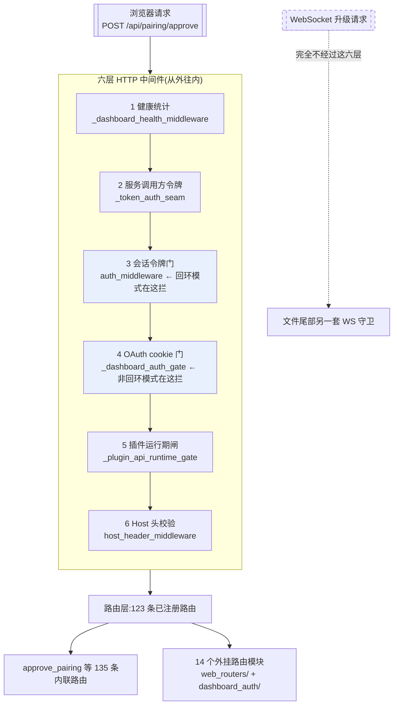

# r8c · dashboard 与 web 面 —— 一个 17,732 行的单文件,和它身上七道门

> **读者定位**:多年后端经验(Go / Java 背景亦可),**没读过本仓库**,
> **不熟 Python 异步生态与 LLM provider 生态**。本章不要求你查任何外部资料、不要求你看源码。
> **溯源约定**:关键断言后给 `路径:行号 @ 863e313`,锚点单独成行、置于代码块之前。
> `863e313` 是本学习项目固定的基线提交,所有行号都对这个提交有效。

---

## TL;DR(快读路径)

1. **hermes-agent 有一个浏览器管理界面(dashboard)**,后端是 `hermes_cli/web_server.py` ——
   **17,732 行的单个 Python 文件**,135 条内联路由 + 14 个外挂路由模块,共 **123 条已注册路由**。
   它是继 `cli.py` 之后全仓第二大的文件,本章讲的就是这一坨怎么组织、怎么守住。
2. **鉴权不在路由上,在中间件链上。** 六层 HTTP 中间件按**后注册先执行**的顺序叠成一摞,
   一个请求从外往里穿。绝大多数敏感端点**自己一行鉴权代码都没有**——
   包括"批准一台设备接入"这种最该有的地方。
3. **同一把锁有两种形态**,由绑定地址决定:绑回环(默认)用**进程内临时令牌**,
   绑非回环自动切到 **OAuth cookie 门**,而且**没配鉴权 provider 就拒绝启动**。
   这个"绑哪儿决定用哪把锁"的设计是本章最值得抄走的一条。
4. **本轮找到的问题几乎全长一个样:同一件事有两份实现,只有一份带守卫。**
   两套文件 API 只有一套限根;同一个文件读端点拦、写端点不拦;
   两张豁免名单一张精确匹配一张前缀匹配;两个配置写入口一个有名单一个没有。
   **不是"没想到",是"想到了一半"。**
5. **可迁移的一句话**:守卫要挂在**收口**上,不要挂在**调用点**上;
   而如果你的收口有两个,那你其实没有收口。

---

## 1. 从一个场景说起:你在手机上点了"允许"

先把这个系统演一遍,后面所有机制都挂在这条线上。

你在自己的服务器上跑着 hermes-agent。你用 Telegram 给它发消息,它第一次见到你,
于是生成一个**配对码**(pairing code)——一串短字符串,含义是"有个陌生人想接进来"。
你打开浏览器里的 dashboard,在"配对"页面看到这条待批请求,点**允许**。

浏览器发出的是这么一个请求:

```text
POST /api/pairing/approve
{"platform": "telegram", "request_id": "…"}
```

**这是整个系统里最敏感的一次点击**:批准之后,那个 Telegram 账号就能驱使这个 agent
读文件、跑命令。所以一个自然的问题是:**这条路由怎么保证只有你能调?**

打开代码,你会看到令人不安的东西:

`hermes_cli/web_server.py:12321 @ 863e313`

```python
@app.post("/api/pairing/approve")
```

`hermes_cli/web_server.py:12322 @ 863e313`

```python
async def approve_pairing(body: PairingApprove):
```

**函数签名里只有 `body`。** 没有 `request`,没有 FastAPI 的 `Depends(...)`
(FastAPI 声明"这个路由需要先过某个依赖项"的写法),函数体里也不调任何鉴权函数。
**这条路由自己一行鉴权都没有。**

它没有被裸奔,答案在别的地方——在它**上游的六层中间件**里。这就是本章的主线。

---

## 2. 全景

先给术语:**中间件(middleware)** 是一段包在所有路由外面的代码,
每个请求先过它、它决定放行还是当场返回。多个中间件像洋葱一样一层套一层。



**图里有三件事值得先记住:**

- **第 3 层和第 4 层是互斥的**——同一时刻只有一个真正在工作,由服务绑在哪个地址决定(§3.2)。
- **顺序是"后注册先执行"**,不是你在文件里读到的顺序(§3.1)。这一点连作者都写反过。
- **WebSocket 根本不走这六层**,它另有一套守卫。这解释了为什么文件尾部会再出现一整片鉴权代码。

---

## 3. 逐机制

### 3.1 中间件的顺序:一处连作者都写反了的地方

**先看场景**:你要判断上面那条 `approve_pairing` 安不安全,就必须知道六层的**实际执行次序**——
因为"第 3 层拦下"和"第 6 层拦下"是完全不同的安全结论(第 6 层拦的话,前五层已经跑过了)。

**在 Python 的 Starlette 框架里,中间件是"后注册先执行"。** 机制只有两行:

`applications.py`(Starlette 库,非本仓库)每次注册都把新中间件**插到列表最前面**,
构建时又对列表**反序**包装,净效果就是:**最后注册的跑在最外面。**

而 `web_server.py` 里的注册顺序是:`host_header`(:538)→ `_plugin_api_runtime_gate`(:568)
→ `_dashboard_auth_gate`(:644)→ `auth_middleware`(:651)→ `_token_auth_seam`(:675)
→ `_dashboard_health_middleware`(:752)。**倒过来就是执行顺序**,即 §2 图里那个次序。

**▲ 地图与代码的出入**:文件里有一句注释,把这个顺序说反了:

`hermes_cli/web_server.py:640 @ 863e313`

```python
# auth_middleware so the order is: host check → cookie auth → token auth.
```

**实际次序恰好相反**:token 认证在最外(第 2、3 层),cookie 门在中间(第 4 层),
host 校验在最里(第 6 层)。这不是打字错误——它是把"栈"当成"队列"读了一次。

**为什么这个错误没造成事故**:因为在这个具体的层序下,**更外层拦得更早 = 更安全**。
注释错了,行为反而是保守的那一侧。**但下一个照着这句注释加中间件的人不会这么幸运**——
他会把一个本该最先跑的检查注册到最前面,于是它跑在最后。

### 3.2 一把锁的两种形态:绑哪儿决定用哪把

**先看场景**:同一个 dashboard,有人跑在自己笔记本上(`--host 127.0.0.1`),
有人挂在公司内网让同事看(`--host 0.0.0.0`)。这两种情况该用同一套鉴权吗?

**这个仓库的答案是:不该,而且它让绑定地址自动决定。**

- **绑回环地址**(`127.0.0.1` / `localhost` / `::1`,默认):走**会话令牌**——
  进程启动时生成一串随机令牌,注入进 dashboard 的 HTML,前端每个请求带在头里。
  令牌随进程生灭,不落盘。拦截发生在**第 3 层** `auth_middleware`。
- **绑任何非回环地址**:自动切到 **OAuth cookie 门**(第 4 层),
  第 3 层则整层空转让路。

**最值得抄的一条在这里**:切到非回环时,如果**一个鉴权 provider 都没配**,
服务**直接拒绝启动**:

`hermes_cli/web_server.py:17549 @ 863e313`

```python
            raise SystemExit(
```

它给的话是:"Refusing to bind dashboard to {host} — the auth gate engages on
non-loopback binds, but no auth providers are registered."

**这是 fail-closed 做对了的样子**:不是"绑上去然后裸奔",也不是"打个警告继续",
而是**不让你启动**。绝大多数同类项目在这里选的是打警告。

### 3.3 回到 approve_pairing:它到底靠什么

现在可以回答 §1 的问题了。**这条路由的全部保护来自中间件链,没有一分来自它自己。**

第 3 层的判据只有一句:路径以 `/api/` 开头、且不在一张公开名单里,就要令牌。
那张名单是**精确匹配**的 8 条,全是只读探活类端点(`/api/health`、`/api/status`、
`/api/config/schema` 之类),`/api/pairing/approve` 不在其中。

结论是**四种绑定形态加畸形 host 值,没有任何一种组合能让未认证请求打到它**。
本轮对真实的 app 逐组合实测过,全部 401。

**但这个结论的脆弱之处值得写进设计笔记**:它完全寄生在两个条件上——
"路径以 `/api/` 开头"和"不在那 8 条名单里"。
哪天有人往名单里加一条**前缀式**条目、或把这个路由挪出 `/api/`,
它就会**静默失去全部鉴权**,因为**它自己不会喊**。
路由级的双保险(FastAPI 的 `Depends`)在这里本来是可用的,没有用。

### 3.4 本章的主题:同一件事有两份实现,只有一份带守卫

本轮在这个面上找到的问题,**几乎全长一个样**。挑三个讲。

#### (a) 两套文件 API,一套限根,一套不限

dashboard 有两组浏览文件的接口:`/api/files/*` 和 `/api/fs/*`。

**先讲为什么会有两组**:`/api/files/*` 是"文件管理器"——运维可以给它设一个**根目录**,
让它只能在那个目录里活动;`/api/fs/*` 是"编辑器的文件树",服务的是"在浏览器里改本机项目",
所以它天然要能到处走。**分成两组是合理的。**

**问题出在:没有任何东西区分这两种部署。**

在托管部署里(容器,Hermes 的家目录就是 `/opt/data`),文件管理器会被**自动锁在** `/opt/data` 里,
而且那个目录里装的正是真的 `config.yaml`、`auth.json`、`.env`。
锁上之后,`/api/files/*` 表现完全正确:

```text
GET /api/files/read?path=<root>/.env        → 403  "Access to sensitive files is not allowed"
GET /api/files/read?path=/etc/hostname      → 403  "Path outside managed files root"
```

**同一个 dashboard、同一把令牌,换成隔壁那组:**

```text
GET /api/fs/read-text?path=<root>/.env      → 200  明文返回
GET /api/fs/read-text?path=/etc/hostname    → 200
GET /api/fs/list?path=/etc                  → 200
```

**最能说明问题的一条**:代码里**存在**一个专为区分这两种部署而写的函数——

`hermes_cli/web_server.py:2096 @ 863e313`

```python
def _local_dashboard_request(request: Request) -> bool:
```

它第一句就是"鉴权门开着就不算本机"。**全仓零调用点。** 判据写好了,接线没做。
而 `/api/fs/*` 那六个端点**没有一个收 `request` 参数**,所以即便想调也调不了——
得先改签名。**这不是忘了加判断,是判断写好了没接上。**

#### (b) 同一个文件:读不到,却能改写

上面那条还能辩护("`/api/fs/*` 本来就是给桌面版的")。下面这条不能。

**同一组 API 内部**,读端点带敏感文件名单,写端点不带:

```text
GET    /api/files/read   ?path=<root>/config.yaml   → 403 "Access to sensitive files is not allowed"
POST   /api/files/upload  {path: <root>/config.yaml, overwrite: true}  → 200  ← 文件被整个替换
DELETE /api/files         {path: <root>/auth.json}                     → 200  ← 文件没了
```

**你读不到它,但你可以把它换掉。** 而 `config.yaml` 里有 `approvals.deny` ——
**agent 的工具审批黑名单**。实测把它从 `[rm -rf]` 改成 `[]`,一次 HTTP 200。

**用一个文件管理器端点,改掉 agent 的执行权限。**

更值得记的是,那个敏感判定函数的文档**自己声明了这个边界**:

`hermes_cli/web_server.py:1833 @ 863e313`

```python
    Read-side only: this guards list/read/download (the #57505 exfil surface).
```

紧接着说写侧"由 write-path checks 处理"。本轮查证:写侧确实有检查,
但那是**根目录容器检查**,不是**敏感性检查**——它管"你能不能出这个目录",
不管"这个目录里的哪些文件碰不得"。**那句话在它想表达的意义上没有对应实现。**

#### (c) 两张豁免名单,一张精确匹配,一张前缀匹配

OAuth 门有两张免鉴权名单,判定写在同一个函数里:

`hermes_cli/dashboard_auth/middleware.py:84 @ 863e313`

```python
        path == prefix or path.startswith(prefix)
```

第一张(8 条 API 路径)是**精确匹配**;第二张(15 条,登录页与静态资源)是**前缀匹配**,
其中 **10 条不带尾斜杠**。于是 `/loginXYZ`、`/api/auth/providersXYZ` 都被判为"免鉴权"。

**今天没有洞**——本轮枚举全部 123 条已注册路由,没有一条被意外吞掉。

**但决定性的证据在同一个函数的文档里**,它把这个危险讲得清清楚楚:

`hermes_cli/dashboard_auth/middleware.py:75 @ 863e313`

```python
      exactly (no prefix expansion) so adding ``/api/status`` doesn't
```

——"精确匹配(不做前缀展开),这样加一条 `/api/status` 才不会顺带把
`/api/status/secret-extension` 也放出去"。**作者为第一张表推理过这个危险,为第二张表没有。**

#### (d) 两个配置写入口,一个有名单,一个没有

最后一个同形状的。dashboard 有两个改配置的端点:`PUT /api/env` 改环境变量,
`PUT /api/config` 改 `config.yaml`。前者有一张**变量名黑名单**,后者**什么都不查**:

```text
PUT /api/env    {"key": "LD_PRELOAD", "value": "…"}   → 400  "on the writer denylist"
PUT /api/config {"config": {"LD_PRELOAD": "…"}}       → 200  ← 落进 config.yaml
```

**而 `config.yaml` 的顶层标量会在网关启动时被无条件搬进环境变量:**

`gateway/run.py:2058 @ 863e313`

```python
        for _key, _val in _cfg.items():
```

`gateway/run.py:2060 @ 863e313`

```python
                os.environ[_key] = str(_val)
```

这段在**模块作用域**——`import gateway.run` 就执行。
**所以一张黑名单挡住的东西,从隔壁绕一圈又回来了。**

顺带,这也是跨轮移交项 H-10 的答案:API-key 形状的键**确实**能被写进 `config.yaml`,
于是它**不参与凭据轮换**,而且 `GET /api/config` 会**明文回显**它
(改环境变量那条路是脱敏的)。

### 3.5 一个 17,732 行的文件正在往外拆

**先看场景**:你接手这个文件,想加一条路由。放哪?

它现在的形态是:135 条路由内联在主文件里,另有 14 处 `include_router` 把成组的路由
挂到独立模块(`hermes_cli/web_routers/` 下 8 个文件、`hermes_cli/dashboard_auth/` 下的路由模块)。
**拆分正在进行中,而且是按功能簇拆的**——会话、定时任务、MCP、技能、工具、档位、git 各一个模块。

**这件事本身是本章要交代的设计事实**:一个单文件长到两万行时,
拆分不是"重构洁癖",而是**让守卫能被复用**的前提。
上面 (a)(b)(c)(d) 四条问题,共同的形状都是"两份实现只有一份带守卫"——
而这四份"另一份"里,有三份就是因为它们在主文件的**不同段落**、彼此看不见对方。

---

## 4. 可迁移的设计原则

**给要自己造 agent harness 的人,这一章能带走五条。**

1. **让部署形态决定安全模式,并且 fail-closed。**
   "绑回环用弱鉴权、绑非回环强制强鉴权、强鉴权没配好就拒绝启动"——
   这三段是一体的,少最后一段就等于没有。**大多数项目在最后一段选了打警告。**

2. **守卫挂在收口上,不要挂在调用点上;而如果你的收口有两个,你就没有收口。**
   本章四条问题全是这个形状。判断方法很机械:
   **对每一道守卫,数一遍"绕过它也能做到同一件事"的路径有几条。** 大于一就该警觉。

3. **豁免名单默认用精确匹配。** 需要前缀匹配时(静态资源),
   **把边界写进去**(尾斜杠或显式的边界检查),不要依赖"目前没有冲突的路由"。
   "目前没冲突"是别人明天就能改掉的事实。

4. **读侧和写侧的敏感判定要成对出现。** "读不到但能覆盖"不是半个漏洞,
   在配置文件这种场景下它比"能读"更严重——**读泄露信息,写改变行为。**

5. **写好却没接线的判据,比没写更危险。**
   `_local_dashboard_request` 的存在会让下一个读代码的人以为这块已经处理过了。
   **删掉它,或者接上它,不要留着。**

---

## 5. 地图与代码的出入

| 记号 | 位置 | 出入 |
|---|---|---|
| ▲ | `hermes_cli/web_server.py:640` | 注释写的中间件顺序("host check → cookie auth → token auth")与实际**完全相反**;把栈当队列读了 |
| ▲ | `hermes_cli/web_server.py:1833` | 敏感判定的文档称写侧"由 write-path checks 处理",而写侧只有根目录容器检查、没有敏感性检查 |
| ■ | `hermes_cli/web_server.py:2597`–`:2725` | `/api/fs/*` 六个端点既无根约束也无敏感名单,而 `/api/files/*` 两样都有;为这个区分写的判据 `:2096` 全仓零调用 |
| ■ | `hermes_cli/web_server.py:2453`、`:2573` | 同一个 `config.yaml`:读端点 403、写端点 200;可清空 `approvals.deny` |
| ■ | `hermes_cli/dashboard_auth/middleware.py:84` | 豁免前缀 10 条无边界检查;**当前零暴露**(123 条路由全查过),但同一函数对另一张表做了精确匹配 |
| ■ | `hermes_cli/web_server.py` config 写入路径 | `PUT /api/config` 无键名名单而 `PUT /api/env` 有;config 顶层标量在 import 时进环境变量 |

---

## 6. 延伸

- 中间件链与 `approve_pairing` 的逐层判定:`notes/r8c-raw-boot-authchain.md`
- dashboard 登录鉴权子系统(13 个文件):`notes/r8c-raw-dashboard-auth.md`
- 配置端点、schema 自动生成、H-10 / H-11:`notes/r8c-raw-config-endpoints.md`
- 两套文件 API 的对比与实测:`notes/r8c-12-managed-files-vs-fs.md`
- 本轮定案与主线复核:`notes/r8c-90-rulings.md`
