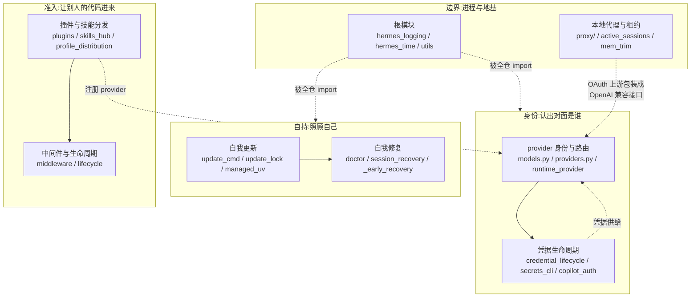

# r8d · 自持面 —— 一个装在别人机器上的 agent,怎么照顾自己

> **读者定位**:有多年后端工程经验(Go / Java 背景亦可),**没读过 hermes-agent**,
> **不熟 LLM provider 生态与 Python 异步生态**。本章不要求你翻源码或查外部资料。
> **溯源约定**:凡对代码行为的断言,锚点 `路径:行号 @ 863e313` **单独成行、置于代码块之前**;
> `863e313` 是本项目固定的基线 commit。底稿见 `notes/r8d-*`。

---

## TL;DR(快读路径)

1. 前十二章讲的都是**怎么服务一个回合**——收到消息、调模型、跑工具、写状态。
   这一章讲的是**另一件事**:hermes 是一个**装在别人机器上、要活很久的软件**,
   它得升级自己、修自己、认出对面是谁、管好散在六个地方的凭据、
   让第三方代码安全地进到自己进程里。
2. **升级自己是这一片最独特的机制**:进程在替换自己的代码时**还活着**。
   hermes 的答案是七件事的合力,其中最漂亮的一处是 `_UvResult`——
   一个 `str` 子类,让**旧版本的调用点**能安全地调**刚拉下来的新版本函数**。
3. **"唯一真理源"出现了两个,而这不是 bug**:`models.py` 用面向用户的 slug、
   `providers.py` 用对齐外部目录的 slug,两者互不 import、在关键几对上互为逆映射。
   问题不在有两个,而在**没有任何注释解释复合归一的顺序不能反**。
4. 本章的分析主线是一个反复出现的形状:**守卫存在,但有一条路不问它。**
   受管文件的写路径不问敏感名守卫;dashboard 写一次配置就能当场松开审批闸门;
   model-provider 插件绕过全部插件门禁;供应链审计的严重度分档是一段**不可达的死代码**。
   四处的共同点不是"忘了做",而是**做了,只是某条路没接上**。
5. 可迁移的一条:**在长期演化的系统里,安全机制的主要失效方式不是缺失,是不配对。**
   代码库自己给出了这个判据——`tools/approval.py` 的注释原话是
   "otherwise the deny is unpaired theater"(否则这条禁令就是没配对的演戏)。

---

## 1. 从一个场景说起:你敲下 `hermes update`

设想一台已经跑了半年的机器。用户敲 `hermes update`。这一刻的处境很奇怪:

**正在执行升级逻辑的那个 Python 进程,它自己的源码就是这次要被替换的东西。**

具体会撞上什么:

- `git pull` 把 `hermes_cli/*.py` 换成新版本,但**已经 import 进内存的旧模块不会变**。
  于是接下来每一次跨模块调用,都是**旧的调用点**在调**新的被调方**——两边可能对
  "这个函数返回几个值"意见不一致。
- 装依赖要跑 `pip` / `uv`,这些是子进程;终端关掉时 SIGHUP 会顺着进程组传下去,
  把装到一半的 pip 打死。
- 用户在另一个终端也敲了一次 `hermes update`。两个进程同时改同一棵目录树。
- 升级到一半断电。下次启动时,一半是新代码一半是旧代码,而**负责修复的也是这套代码**。

一个只服务单次请求的服务端程序不会遇到这些;**一个装在用户机器上的长驻软件全都会遇到**。
这一章讲的就是 hermes 对这四类问题各自给了什么答案,以及它在哪里没接上。

---

## 2. 全景



四组的关系:**根模块是地基**(日志、时钟、工具函数,全仓都碰),
**身份组决定这次请求发给谁、用谁的凭据**,**准入组决定进程里跑着谁的代码**,
**自持组保证这台机器上的这份安装还能用**。

---

## 3. 逐机制

### 3.1 自我更新:进程在替换自己的时候还活着

**场景先行。** 回到 §1 的第一个问题:旧调用点调新被调方。
这在 hermes 里是一个**真实发生过的崩溃**,而修复方式非常有教学价值。

`ensure_uv()` 这个函数(它负责确保 `uv`——一个 Python 包管理器——存在)
在不同版本里返回值形状变过:早期返回一个路径字符串,后来返回
`(路径, 是否首次装好)` 二元组。升级时,**旧的 `hermes_cli.main`** 已经在内存里,
它按老约定写着 `uv_bin, fresh = ensure_uv()`;而它调用的是**刚 `git pull` 下来的新模块**。

如果新模块返回一个普通字符串,`uv_bin, fresh = "..."` 会去**逐字符解包**那个字符串,
抛 `ValueError: too many values to unpack`。第一次升级就崩。

hermes 的解法:

`hermes_cli/managed_uv.py:156-169 @ 863e313`

```python
class _UvResult(str):
    """``ensure_uv()`` return value that survives an update boundary.

    ``ensure_uv()``'s arity has flipped between a single path string and a
    ``(path, fresh_bootstrap)`` tuple across releases. ``hermes update`` runs
    the call site from the *old*, already-imported ``hermes_cli.main`` against
    this *freshly pulled* module, so the two can disagree on how many values
    ``ensure_uv()`` returns. An install parked on a 2-tuple release runs
    ``uv_bin, fresh_bootstrap = ensure_uv()`` against the single-value module
    and crashes the first update: the returned path is a plain ``str``, which is
    itself iterable, so the 2-target unpack walks its characters and raises
    ``ValueError: too many values to unpack (expected 2)`` (and on the failure
    path the ``None`` return raises ``TypeError: cannot unpack non-iterable
    NoneType``). This wrapper answers to both conventions:
```

一个 `str` 的子类,重写 `__iter__` 让它解包出 `(路径, 标志)` 两个值,
同时它**本身就是**那个路径字符串。新旧两种调用约定同时被满足。

**取舍就在紧接着的那段里,而且它是本章最好的一个"同一个决定在两个平台上必须相反"的例子:**

`hermes_cli/managed_uv.py:255-262 @ 863e313`

```python
    On **Windows** we deliberately return a plain ``str``/``None`` instead.
    ``subprocess`` there serializes the argv via ``subprocess.list2cmdline``,
    which iterates every entry *as a string* (``for c in arg``). The dependency
    installer passes uv straight into the command list (``[uv_bin, "pip", ...]``),
    so a ``_UvResult`` — whose ``__iter__`` yields ``(path, fresh_bootstrap)``
    rather than characters — would inject the bool into the command line and
    crash the install with ``TypeError: sequence item 1: expected str instance,
    bool found``. A plain ``str`` matches the historical Windows contract and is
```

**这是个可以直接搬走的结论**:Python 里"解包"和"逐字符迭代"走的是**同一个协议**
(`__iter__`)。一个值不可能同时对两者都表现正确——所以在 POSIX 上用这个技巧,
在 Windows 上**必须**退回普通字符串,因为那里的 `subprocess` 会逐字符迭代 argv。
**同一个兼容性技巧,在两个平台上的正确答案是相反的。**

**互斥:一个真实的缺陷。** §1 的第三个问题(两个进程同时升级)有一把锁,
锁本身是一个标记文件,与 Rust / Electron 侧字节兼容。但它的获取不是原子的:

`hermes_cli/update_lock.py:245-250 @ 863e313`

```python
        existing = read_live_update(path=self.path)
        if existing is not None:
            if existing.pid == _handoff_pid() or _is_ancestor_pid(existing.pid):
                return True
            self.holder = existing
            return False
```

`hermes_cli/update_lock.py:251-255 @ 863e313`

```python
        try:
            self.path.parent.mkdir(parents=True, exist_ok=True)
            self.path.write_text(
                f"{os.getpid()}\n{int(time.time())}\n", encoding="utf-8"
            )
```

先读(`:245`)、再写(`:253`),中间没有任何原子性保障。这是教科书式的
**check-then-write**(检查与写入之间存在时间窗)。底稿用 64 个对齐启动的进程实测,
三次分别有 **7 / 1 / 2** 个进程同时认为自己拿到了锁。
同一个仓库里已经有正确写法(`O_CREAT|O_EXCL`,由操作系统保证"创建且仅当不存在"),
只是这里没用。现有 25 个相关测试**全部是顺序语义,没有一个并发用例**——
所以这个缺陷不会被测试发现。■

### 3.2 自我修复:在 import 跑起来之前就得能自救

§1 的第四个问题——升级到一半断电——的难处在于:**负责修复的也是这套代码**。
如果依赖装坏了,连 `import hermes_cli.main` 都会失败,那就没有任何机会跑修复逻辑。

hermes 的答案是**分层自救**,而这一层的第一条规矩是**自律**:
救援代码自己不许有依赖。这不是口号,是可以逐行验证的——

`hermes_cli/_early_recovery.py:24-31 @ 863e313`

```python
from __future__ import annotations

import importlib
import os
import subprocess
import sys
import time
from pathlib import Path
```

模块级八行,**全部是标准库**。它跑在 `main.py` 那些第三方 import **之前**。
函数级唯一的例外是 `certifi`——而它不是被"用"的,是被**当探针**的:
import 它失败,就等于确认了这份安装已经坏了。

同一条自律也贯穿快路径:

`hermes_cli/_startup_fast.py:26-29 @ 863e313`

```python
from __future__ import annotations

import os
import sys
```

底稿实测出一个比"快"更值钱的副产品:走快路径时 `HERMES_HOME` **一个文件都不会建**,
而只要执行流程走到 argparse,就会被建出 10 项。
也就是说 `hermes --version` 不会在用户机器上留下任何痕迹——
这对一个要被脚本频繁调用的命令是正确的性质。

**"装到一半"被显式建模成四种状态而不是一个布尔**:
`healthy` / `repaired` / `failed` / `indeterminate`。
关键在第四种——探针本身跑不起来时**保留故障标记**,绝不当成健康。
判定用**真 import** 而不是查包元数据,因为真实事故的形状正是
"元数据在、`.py` 文件被抹了"。

**`session_recovery` 的"非破坏性"是可以枚举证明的,不是一句承诺。**
底稿对整个 1,447 行文件搜了所有可能打开数据库的调用,得到 6 处,逐一核对:
2 处打开的是快照副本,3 处打开的是新建的目标库,1 处是写报告文件——
**原始数据库从未作为连接实参出现过**。
复制在一把专门的离线访问锁内进行(因为在 SQLite 里 `close()` 会取消该进程持有的
**全部** POSIX 建议锁,可能把正在跑的 VACUUM 的排他锁抽掉),
复制前后还要比对 `(大小, 修改时间)` 指纹。

这一节还藏着本章最好的一个**事故故事**。2026 年 7 月,有人用
`--allow-partial` 从一个损坏库里救回了 20,817 条消息——
然后紧接着的"孤儿清理"步骤把它们**全删了**,产物是 0 sessions / 0 messages。
原因是那些消息的父 session 行已经损坏丢失,于是每一条都被判定为孤儿。
修法写在代码里:**先合成占位父行,再删孤儿**——
给救回的消息造一个 `source='recovered'` 的 session 挂靠,
并且这些重建计数**不计入**"清理了多少条"的统计,免得报告读起来像是删了两万条。

顺带一处 ■:恢复报告里有个字段是硬编码的常量——

`hermes_cli/session_recovery.py:1434 @ 863e313`

```python
            "installed": False,
```

底稿复搜确认该文件与其调用方全文只有这一处写入,**无读出、无赋值**,
也就是说这个字段永远报 `False`,不反映任何真实状态。

### 3.3 身份:先认出这是谁,再谈怎么调用它

**术语锚定**:*provider* 指模型供应方(OpenAI、Anthropic、OpenRouter……);
*slug* 指它在配置和代码里的短标识符(如 `copilot`)。

第二章讲的是"怎么调用一个模型"。这一节是**上游那半**:在调用之前,
系统得先确定"用户说的 `copilot` 到底是谁、该走哪个 URL"。

读这一片时最先撞见的怪事:**有两个文件都自称唯一真理源。**

`hermes_cli/models.py:1113 @ 863e313`

```python
CANONICAL_PROVIDERS: list[ProviderEntry] = [
```

`hermes_cli/providers.py:46 @ 863e313`

```python
HERMES_OVERLAYS: Dict[str, HermesOverlay] = {
```

底稿查清了:**这不是重复,是两套命名空间的两端。**
`models.py` 用**面向用户**的 slug(`copilot`、`kilocode`),
`providers.py` 用**对齐外部模型目录 models.dev** 的 slug(`github-copilot`、`kilo`)。
两个文件**互不 import**(双向 grep 均为 0 命中),各自的 `normalize_provider`
在这几对上互为逆映射。

真正的风险不在"有两个",而在**它们的复合有方向性**:
全仓唯一同时 import 两个归一函数的地方按 `providers.normalize(models.normalize(x))` 的
顺序调用;底稿对全表 137 个 key 实测,这个顺序**一次即到不动点**,
而**反过来有 18 个 key 结果不同**。
**这个顺序没有任何注释解释**——它是一条靠"碰巧写对了"维持的隐式契约。◇

### 3.4 凭据:散在六个存储里的东西,谁管它们的生老病死

凭据可能来自:配置文件、`.env`、系统钥匙串、Bitwarden、1Password、OAuth 令牌缓存。
`credential_lifecycle.py` 的职责是统一它们的删除与保存。

它解决的核心问题很具体:**用户删掉一个 API key,不应该顺手把 OAuth 授权也撤了。**
判据简单得出人意料——一次**字符串等值比较**:

`hermes_cli/credential_lifecycle.py:80 @ 863e313`

```python
    source = f"env:{env_var}"
```

只有 `source` 恰好等于 `env:<变量名>` 的条目才被剪掉;
OAuth 类条目的 source 是 `device_code` / `oauth` / `claude_code`,天然不相等。
**"删 key 不撤授权"这条契约,由这一次等值比较独力承担。**

还有一个容易被忽略的细节:**删除必须"粘得住"**。只删 `.env` 不够——
如果用户的 shell 里还 export 着同名变量,下次启动就会被重新播种回来。
所以删除时另打一个"抑制"标记,保存时对称解除。

不过这个模块自称的 "across **every** store Hermes reads"(覆盖 hermes 读取的每一个存储)
**验下来不成立**:在多实例(profile)模式下,剪枝只写该 profile 的凭据文件,
而读取侧会回落到全局根,抑制标记又只在播种时生效——**被删掉的 key 仍然可用**。■

**另一处值得抄走的设计**是跨域重定向时怎么处理凭据。stdlib 的 `urllib`
在跨源重定向时**会**把 `Authorization` 头带过去。hermes 的做法不是去猜哪些头是凭据,
而是反过来——**白名单**:

`hermes_cli/urllib_security.py:11-13 @ 863e313`

```python
# Headers safe to forward to a different origin. Everything else is dropped:
# custom provider headers routinely carry credentials under arbitrary names.
_CROSS_ORIGIN_SAFE_HEADERS = frozenset({"accept", "user-agent"})
```

注释把理由写得很清楚:**provider 的自定义头经常用任意名字装凭据**,
所以黑名单必然漏。只放行两个头,其余一律丢弃。
代价是这个保护**只在 4 个文件 5 处采用**,而全仓有 60 多个裸 `urlopen` 调用。◇

### 3.5 准入:第三方代码怎么进到这个进程里

这是 harness 设计里最危险的一面。hermes 把它拆成**三段,而且拆得很干净**:

| 阶段 | 做什么 | 会不会执行插件代码 |
|---|---|---|
| `hermes plugins install` | 只做 `git clone` | **不会** |
| 启用 | 往配置写 `plugins.enabled`,默认 `[y/N]` = N,非 TTY 直接 False | **不会** |
| 下次发现 | `exec_module` 真正导入 | **会** |

**"装"和"跑"分开、且启用默认为否**——这是可以直接搬走的结构。

生命周期挂载点只有 63 行,但分权设计值得看:

`hermes_cli/lifecycle.py:11-22 @ 863e313`

```python
def invoke_hook(hook_name: str, **kwargs: Any) -> List[Any]:
    """Notify first-party observers, then invoke compatibility plugin hooks."""
    try:
        from hermes_cli.observability import observe_lifecycle

        observe_lifecycle(hook_name, **kwargs)
    except Exception:
        logger.warning("Built-in observability hook failed", exc_info=True)

    from hermes_cli import plugins

    return plugins.invoke_hook(hook_name, **kwargs)
```

三条规矩一目了然:**内建遥测先跑**;**它失败被吞**(不能因为遥测坏了影响主流程);
**返回值只来自插件**——也就是说内建观察者**只能看,不能改变行为**。

---

## 4. 一条贯穿本章的线:守卫存在,但有一条路不问它

前面几节各自出现过一个缺陷。把它们并排放,会看到同一个形状**出现了四次**。
这是本章真正的分析产出。

### 4.1 四个实例

**(一)受管文件的写路径不问敏感名守卫。**
dashboard 有一个文件管理器。它的**读**侧有一道守卫,会挡住 `.env`、`auth.json`
和凭据目录树。守卫本身写得很好——它查的是路径分量,所以连
`mcp-tokens/无害名字.json` 也挡得住:

`hermes_cli/web_server.py:1838-1840 @ 863e313`

```python
    if _is_sensitive_filename(path.name):
        return True
    return any(part.lower() in _SENSITIVE_MANAGED_DIR_NAMES for part in path.parts)
```

但**写**侧(上传、流式上传、建目录)一次也没调它。守卫的 docstring 解释了原因:

`hermes_cli/web_server.py:1833-1836 @ 863e313`

```python
    Read-side only: this guards list/read/download (the #57505 exfil surface).
    The write endpoints (upload/mkdir/delete) are a separate threat class
    handled by the write-path checks; extending this guard to them is out of
    scope for this fix.
```

于是问题变成:**"the write-path checks" 是什么?** 追进去,写路径的解析器只有两类拒绝——
`..` 路径穿越、以及"结果必须在受管根之下"。**没有任何敏感名检查。**
docstring 指向的东西不存在。■

**(二)写一次配置,当场松开审批闸门。**
配置文件里存着审批策略(哪些命令要人工确认、哪些一律禁止)。
配置缓存以 `(修改时间, 大小)` 为键,所以**写入立即生效**。
实测:同一个进程内覆盖一次配置文件,`approvals.deny` 从
`['rm -rf *', 'curl *']` 变成 `[]`。

而代码库**自己早就知道这件事**,并且正因为知道,才在别处建了防线:

`tools/approval.py:279-286 @ 863e313`

```python
# ~/.hermes/config.yaml IS the security policy: approvals.mode, yolo, and the
# permanent-approval allowlist live here, and the config cache is mtime-keyed
# so a write takes effect mid-session (the agent could flip approvals.mode=off
# and immediately bypass the gate). Pair the write_file/patch deny (file_tools
# _check_sensitive_path) with terminal-side coverage so `sed -i`, `tee`, `>`,
# `cp`, etc. targeting it are gated too — otherwise the deny is unpaired
# theater. Mirrors _HERMES_ENV_PATH; matches the HERMES_HOME override form as
# well as ~/.hermes/.
```

**注意最后那半句:"otherwise the deny is unpaired theater"**
(否则这条禁令就是没配对的演戏)。
作者堵了两条路——工具写、终端写。**dashboard 的文件写端点是没堵的第三条。**
作者自己给出的判据,精确地命中了自己漏掉的那条路。

**(三)model-provider 插件绕过全部插件门禁。**
§3.5 讲的三段准入,对 model-provider 这一类插件**不适用**:

`providers/__init__.py:170-179 @ 863e313`

```python
    # 2. User plugins — under $HERMES_HOME/plugins/model-providers/<name>/.
    #    These can override any bundled profile of the same name (last-writer-wins
    #    in register_provider()).
    user_dir = _user_plugins_dir()
    if user_dir is not None:
        for child in sorted(user_dir.iterdir()):
            if not child.is_dir() or child.name.startswith(("_", ".")):
                continue
            _import_plugin_dir(child, "user")

    # 3. Legacy single-file profiles at providers/<name>.py. Kept for
```

这个文件里对 `plugins.enabled` / `disabled` / `HERMES_SAFE_MODE` 的命中数是 **0**。
用户目录下的插件被无条件导入,而且**后写者覆盖同名内建 profile**。■

**(四)供应链审计的严重度分档是不可达的死代码。**
`hermes security-audit` 支持 `--fail-on critical`。对只带 CVSS 向量串
(形如 `CVSS:3.1/AV:N/...`)而没有文字等级的通告,它会走"分数 → 等级"这条回退路径:

`hermes_cli/security_audit.py:342-350 @ 863e313`

```python
    # Fall back to CVSS score → tier
    score: Optional[float] = None
    for sev_entry in record.get("severity") or []:
        s = sev_entry.get("score")
        if isinstance(s, str):
            # CVSS vector strings look like "CVSS:3.1/AV:N/..." — we can't
            # parse without a lib. Look for an explicit numeric in
            # affected[].ecosystem_specific later if present.
            continue
```

循环把值读进的是 `s`,**没有任何一条语句给 `score` 赋值**。于是:

`hermes_cli/security_audit.py:357-366 @ 863e313`

```python
    if score is not None:
        if score >= 9.0:
            return "CRITICAL"
        if score >= 7.0:
            return "HIGH"
        if score >= 4.0:
            return "MODERATE"
        if score > 0:
            return "LOW"
    return "UNKNOWN"
```

`:357` 的条件**恒为假**,八行分档不可达,这类通告一律返回 `UNKNOWN`,
`--fail-on critical` 于是放行、退出码 0。
注释里那句 "Look for an explicit numeric in `affected[].ecosystem_specific` later"
描述的是一个**没有写出来的后续步骤**。■

### 4.2 这四处的共同点

不是"忘了做安全"。四处的守卫**都写了,而且写得不差**:
敏感名守卫查路径分量而不只是文件名;审批注释预判了 mtime 缓存的后果;
插件准入三段分离;审计支持 CVSS 回退。

失效的是**接线**:

| 实例 | 守卫质量 | 断在哪 |
|---|---|---|
| 受管文件写路径 | 好 | 写侧从不调用它 |
| 审批策略 | 好,且预判了风险 | 只堵了两条路,第三条没堵 |
| 插件准入 | 好 | 一类插件走另一条装载路径 |
| CVSS 分档 | 逻辑正确 | 输入变量从未被赋值 |

**可迁移的判断**:审查一个长期演化的系统时,"有没有这个安全机制"是个**弱问题**;
强问题是"**通向被保护资源的路径有几条,每条都问过这个机制吗**"。
前者查得到,后者需要把调用图补全——而这正是自动化最难覆盖、也最值得投入的地方。

代码库自己发明了一个好词:**unpaired theater**(没配对的演戏)。
一个只堵住部分路径的禁令,给人的安全感和它实际提供的保护**不成比例**——
这比完全没有更危险,因为它会让人停止追问。

---

## 5. 可迁移的设计原则

1. **升级路径要能在"半坏"状态下运行。** 假设升级会在任意一步中断,
   并且**负责修复的就是被升级的那套代码**。把"装到一半"建模成多状态而非布尔,
   其中必须有一个"我判断不了"的状态,且它**不等于健康**。
2. **跨升级边界的返回值形状要向后兼容。** 旧调用点会调新被调方。
   如果语言允许(如 Python 的 `str` 子类 + 自定义 `__iter__`),
   可以让一个值同时满足新旧两种约定——但要清楚这种技巧的**代价是它借用了某个协议**,
   任何同样使用该协议的地方(如逐字符迭代 argv)都会被误伤。
3. **互斥要用操作系统的原子原语,不要用"先查后写"。** 并发缺陷不会被顺序测试发现;
   如果一个锁没有并发用例,它实际上没有被测试过。
4. **凭据删除要"粘得住"。** 删除持久化存储不够,还得压制会重新播种它的来源
   (shell 环境、上游同步),否则用户会看到"删了又回来"。
5. **跨域转发凭据用白名单,不用黑名单。** 自定义头会用任意名字装凭据,黑名单必漏。
6. **把"装"和"跑"分开,启用默认为否。** 安装只取回代码,执行需要一次显式的、
   默认为 N 的确认;非交互环境直接判否。
7. **数一数通向被保护资源的路径有几条。** 这是本章最重要的一条。
   加守卫容易,**把所有入口都接上守卫**难;而没接上的那条路会让整个守卫沦为演戏。
8. **测试接缝会变成生产旁路。** 用环境变量关闭安全层(哪怕是为了让 CI 干净)
   意味着这一层不再是权限边界,只是默认值——因为它要防的人,通常也能设环境变量。

---

## 6. 地图与代码的出入

本簇合计 **▲ 12 / ◇ 8 / ■ 10 / ◎ 1**(逐条证据见底稿)。三条最值得记的:

- **▲ 退出码的含义被文档写反。** `hermes update` 的退出码 2,文档说是
  "工作区有意外变更",实际是"**另一个进程正占着这个安装**"。
  退出码是给**自动化**看的契约,写错的代价比散文高一档——
  按文档写的重试脚本会在"别人正在升级"时去清理工作区。
- **▲ `/model provider:model` 这个用法不存在。** README 在 CLI 与消息平台两列都写了它,
  **两列同时为假**。冒号的唯一语义是聚合器场景下的 `vendor:model → vendor/model` 改写;
  实测 6 个输入,一次都没有切换成功。
- **◎ 而不是 ▲**:插件指南的钩子表列了 11 项,代码里有 24 项。
  但那张表自称是 summary(摘要),**字面为真**,所以记 ◎(成立但显著保守)而非 ▲。
  这个区分不是吹毛求疵:▲ 的条数是跨轮衡量"地图腐烂程度"的指标,
  把"保守但为真"计进去会让它不可比。

---

## 7. 延伸

- 证据底稿:`notes/r8d-raw-update-pipeline.md`(自我更新)、
  `notes/r8d-raw-self-repair.md`(自愈)、`notes/r8d-raw-provider-identity.md`(身份)、
  `notes/r8d-raw-credentials-security.md`(凭据与供应链)、
  `notes/r8d-raw-extensions.md`(准入)、`notes/r8d-raw-root-and-boundary.md`(根模块与边界)。
- 定案与主线复核:`notes/r8d-90-rulings.md`。
- 结构级测绘(本轮留 L2 的 125 个文件):`notes/r8d-str-*.md`。
- 上游相邻章节:配置解析链见 `chapters/r8a-configuration-surface.md`;
  CLI 主干见 `chapters/r8b-cli-trunk-and-interaction.md`;
  dashboard 与 web 面见 `chapters/r8c-dashboard-and-web.md`。
