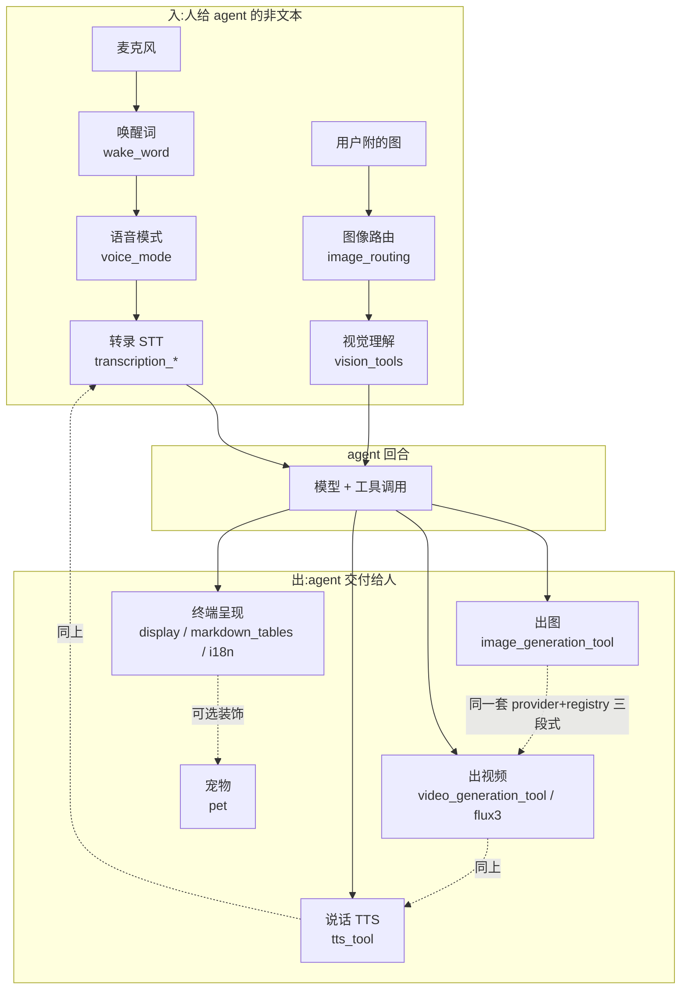
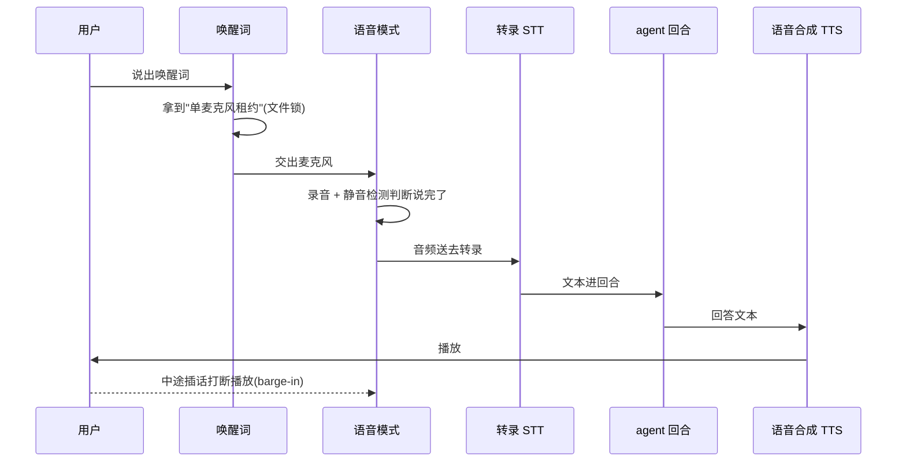

# r9b · 多模态交付面 —— 当同一份知识有了第二个副本

> **读者定位**:你有多年后端经验(Go / Java 之类),没读过 hermes-agent,
> 也不熟 LLM provider 生态与 Python 异步。本章不要求你查任何外部资料,也不要求你看源码。
> **溯源约定**:关键断言后给 `路径:行号 @ 863e313`(`863e313` 是本项目固定的基线 commit),
> 锚点单独成行、放在代码块之前。所有路径都从仓库根算起。
>
> 先锚几个词:**harness**(壳)= 包在大模型外面、负责把模型的输出变成真实动作的那层程序,
> 本仓库就是一个 harness;**provider** = 一家外部能力供应商(OpenAI、FAL、xAI……),
> 同一件事(比如"生成图片")往往有十几家可选;**tool / 工具** = harness 交给模型调用的函数,
> 模型输出一个 JSON 说"我要调 `image_generate`,参数如下",harness 执行它;
> **schema** = 那个函数的参数说明书,**它同时也是模型能读到的唯一说明书**——
> 这一点在本章会反复要命。

## TL;DR(快读路径)

1. **这一簇是 agent 的"感官与嘴巴"**:出图、出视频、说话、听话、看图、在终端里画东西。
   46 个文件 27,325 行,占全仓 L1 精读量的约 5%。
2. **它们的结构惊人地一致**:每种能力都是 `provider 抽象 + registry 注册表 + tool 工具层`
   三段式。读懂一种,另外四种基本是同构的。
3. **也惊人地不一致**:同为"长任务",视频的两条实现路给出了**相反**的等待策略——
   一条同步阻塞到底,一条超时后把 job id 还给模型让它"再叫我一次"。后者是可迁移的好设计。
4. **本章最值得记的一条**:本簇记下的 35 条缺陷与文档冲突(■ 18 + ▲ 17)里,**多数是同一种病**——
   *同一份知识被写了第二遍,然后两份副本漂开了*。
   模型读到的 schema、给模型的提示词、给用户的文档、代码里的判定表,
   四者各存一份"这个后端支持什么",谁也不知道谁改了。
5. **最该抄的三条实现**:图片一律 base64 内联且**进历史前**主动缩小;
   CPU 密集编码单独进有界线程池而 LLM 调用不限并发;
   唤醒词用文件锁做跨进程"单麦克风租约"。

---

## 1. 从一个场景说起:一句"帮我把这张图做成视频"

用户在终端里拖进一张图,说"帮我把它做成一段视频"。看上去是一件事,实际穿过四个子系统:

1. **图进来**。终端把文件路径塞进对话,`agent/image_routing.py` 决定这张图以什么形式
   进入发给模型的请求——是走 provider 的原生图像通道(native),还是退化成一行文本占位符。
2. **模型决定调工具**。它读到 `video_generate` 的 schema,按说明书填参数。
3. **工具执行**。挑后端、发请求、等结果。
4. **结果交付**。视频落到本地或拿到一个 URL,再按当前平台的约定呈现给用户。

这条链上,第 1 步和第 2 步之间有一个**接缝**,本簇最重的缺陷就长在那里。

`agent/image_routing.py` 在图无法走原生通道时,会给模型一行文本,形如
`[Image attached at: /abs/path.png]`。于是模型手上有的是**一个本地绝对路径**。
它接着去读 `image_generate` 的说明书,说明书是这么写的:

`tools/image_generation_tool.py:1198-1204 @ 863e313`

```python
                    "Optional source image to edit/transform (image-to-image). "
                    "When provided, the active backend routes to its image "
                    "editing endpoint; when omitted, it generates from text "
                    "alone. Pass a public URL or an absolute local file path "
                    "from the conversation. Only honored by models that "
                    "support editing — the description above indicates whether "
                    "the active model does."
```

**"Pass a public URL or an absolute local file path from the conversation."**
模型照做了。而默认后端 FAL 的实现是这样的:

`tools/image_generation_tool.py:640-642 @ 863e313`

```python
    payload: Dict[str, Any] = dict(meta.get("defaults", {}))
    payload["prompt"] = (prompt or "").strip()
    payload["image_urls"] = list(image_urls)
```

那个本地路径被**原样**放进了要发给 FAL 的 `image_urls` 字段,全程没有任何一行代码去读这个文件。
说明书承诺"可以传本地路径",默认实现只会转发 URL。
(对照组:另外六个非 FAL 的插件后端都实现了本地读取。)

**这就是本章的主题第一次露面**:关于"这个后端接受什么输入",
schema 里写了一份,FAL 实现里写了另一份,两份不一致——
而**模型只能读到 schema 那一份**。

---

## 2. 全景



**五种能力,一个骨架。** 出图、出视频、说话、听话都是同一个三段式:

| 层 | 职责 | 例子 |
|---|---|---|
| **provider 抽象** | 定义"一家供应商要实现哪些方法" | `agent/image_gen_provider.py`、`agent/tts_provider.py` |
| **registry 注册表** | 供应商登记处;按配置里的名字找到实现 | `agent/image_gen_registry.py`、`agent/tts_registry.py` |
| **tool 工具层** | 面向模型的那个函数:校验参数、挑后端、重试、把结果变成可交付物 | `tools/image_generation_tool.py`、`tools/tts_tool.py` |

读懂一种,其余同构。**真正的差异不在骨架,在每种能力各自的物理约束**:
图片有字节和像素上限、视频要等几分钟、语音要实时、终端要处理宽字符。
下一节按这些约束逐个讲。

---

## 3. 逐机制

### 3.1 图片进历史:一个把会话彻底焊死的故障

**先看故障。** 用户截了一张长图——比如一张 1200×12000 的整页截图,文件只有 0.06 MB。
它进了对话历史。下一轮请求发出去,provider 返回 400。再下一轮,还是 400。
清空重来之前,**这个会话永远发不出任何请求了**。

**为什么会焊死?** 因为 LLM 的对话历史是**不可变**的:每一轮都要把之前所有消息原样重发。
一张超标的图一旦进了历史,它就在**之后每一次请求**里,而"重试"改不掉已经写进历史的字节。
这是和普通 HTTP 服务最不一样的地方——那里一次坏请求就是一次失败,这里一次坏请求会**复发到会话结束**。

**为什么长图能绕过体积检查?** 因为供应商同时卡两个维度:5 MB 和每边 8000 px,
而这两个限制是**独立**的。只看字节数的检查放行了 0.06 MB 的图,它却有 12000 px 高。

**修法:进历史之前主动缩,而且两个维度都卡。**

`tools/vision_tools.py:581 @ 863e313`

```python
_EMBED_TARGET_BYTES = 4 * 1024 * 1024
```

`tools/vision_tools.py:583-590 @ 863e313`

```python
# Proactive embed dimension cap (px, longest side).  Anthropic enforces an
# 8000px per-side ceiling INDEPENDENTLY of the 5 MB byte cap — a tall full-page
# screenshot can be well under 5 MB yet far over 8000px (e.g. 1200×12000 at
# 0.06 MB), so the byte-only embed check above lets it slip into immutable
# history un-resized and the session bricks on a non-retryable 400.  We cap at
# 7900 (headroom under 8000) so the proactive resize shrinks tall small-byte
# images before they are embedded.
_EMBED_MAX_DIMENSION = 7900
```

注意两个数字都**留了余量**:4 MB 对 5 MB,7900 px 对 8000 px。
理由是编码后的大小无法精确预测,踩线等于赌博。

**可迁移的原则**:*凡是要写进不可变历史的东西,校验必须在写入前做,而且要按下游的
每一个独立维度做。* 事后重试能救的是可变状态,救不了历史。

### 3.2 CPU 突发闸:限流要限在真正被耗尽的资源上

**故障现场**:多图工作流一跑,整个进程卡顿——不只是视觉分析慢,**所有**任务都慢,
包括完全无关的定时任务和网关心跳。

**第一反应通常是错的**:"视觉分析并发太高,加个信号量限制同时分析的图片数"。
但真正被耗尽的资源不是"视觉请求配额",是 **CPU**:图片编码和缩放是纯 CPU 密集操作,
它们把所有核吃满,于是 Python 的事件循环(负责调度所有并发任务的那个单线程)
拿不到 CPU,**整个进程的所有异步任务一起饿死**。

**修法是把闸门挪到 CPU 上**:给编码/缩放单独开一个**有界**线程池,大小按宿主核数定;
而真正的 LLM 网络调用**不限并发**——它是 I/O 等待,不吃 CPU,限它只会白白变慢。

`tools/vision_tools.py:188-194 @ 863e313`

```python
# executor's work queue, leaving cores free for the event loop. The LLM call is
# deliberately left OUTSIDE this executor so multi-image workflows keep full
# request concurrency.
_vision_cpu_executor = ThreadPoolExecutor(
    max_workers=_VISION_CPU_WORKERS,
    thread_name_prefix="vision-encode",
)
```

老的那个"整体并发信号量"没有被删,而是降级成了空壳:

`tools/vision_tools.py:941-943 @ 863e313`

```python
@contextlib.asynccontextmanager
async def _vision_concurrency_slot():
    """Deprecated no-op shim kept for backward compatibility.
```

**可迁移的原则**:*限流之前先问"被耗尽的到底是哪一种资源"。*
限错了资源,你会同时得到两个坏结果:没解决卡顿,还白白降低了吞吐。

### 3.3 长任务怎么等:同一簇里的两个相反答案

视频生成要几十秒到几分钟。这在工具调用里是个真问题:模型发起一次调用,
harness 必须在**这一次调用**里给出答案。等太久,上层会超时;不等,又没有结果。

**本簇给了两个相反的答案,而且它们互不知情。**

**答案一(统一工具面):同步阻塞到底。** schema 直接把这件事告诉模型:

`tools/video_generation_tool.py:427-429 @ 863e313`

```python
    "Long-running generations may take 30 seconds to several minutes — "
    "the call blocks until the video is ready. Returns the result in the "
    "`video` field — either an HTTP URL or an absolute file path. To show "
```

**答案二(BFL / flux3 专用面):提交 + 自带轮询 + 超时不算失败。**
它设了两个预算:一次调用最多占用多久,以及"最晚什么时候还愿意发起新一次查看"。

`tools/flux3_video_tool.py:213-216 @ 863e313`

```python
# _POLL_BUDGET_SECONDS stops new looks earlier still, and the difference
# between them is what a clip finishing on the last look has to download in.
_CALL_BACKSTOP_SECONDS = 240.0
_POLL_BUDGET_SECONDS = 180.0
```

两个预算之间的差(240 − 180 = 60 秒)是留给"在最后一次查看时刚好完成的片子"下载用的。

**真正值得抄的是超时的处理方式**:它**不抛异常**,而是返回一句给模型看的普通话,
里面带着 job id:

`tools/flux3_video_tool.py:684-696 @ 863e313`

```python
def _still_generating(job_id: str) -> str:
    """The backstop's answer: an ordinary "call again", never a raised timeout."""
    return json.dumps(
        {
            "result": (
                "Still generating. This call reached its own time limit, which the job is "
                f"unaffected by — call bfl_flux3_get_result again with id={job_id} to keep "
                "waiting."
            ),
            "details": {"id": job_id, "status": "Generating"},
        },
        ensure_ascii=False,
    )
```

**为什么这比抛超时好?** 因为对一个 agent 来说,"超时"是个**死胡同**:
模型看到异常,通常只会道歉或盲目重试(而重试会**重新提交一个新任务**,白烧一次钱)。
而"这次没等到,任务还在跑,拿这个 id 再叫我一次"是一条**可执行的指令**——
模型天生擅长照做。注释里那句 "which the job is unaffected by" 就是专门写给模型看的,
免得它以为任务被取消了。

**可迁移的原则**:*给 agent 的错误,要写成下一步动作,而不是写成故障描述。*
把超时翻译成"再调一次,参数是这个",是把一个死胡同变成一个循环。

### 3.4 语音链路:从一声"嘿"到一句回话



**三处设计值得单独讲。**

**(a) 单麦克风租约。** 麦克风是**独占**设备,而 hermes 可能同时跑着多个进程
(CLI、网关、定时任务)。谁都想监听唤醒词,但同一时刻只能有一个持有麦克风。
它用文件锁(`flock`)做了一个跨进程租约:拿到锁的那个进程才监听,其余等待。
这是个很朴素但正确的选择——用操作系统已经提供的互斥,而不是自己发明一套注册协议。

**(b) 打断(barge-in)的噪底标定时机。** "用户在 agent 说话时插话要能打断它"听着简单,
难点是**扬声器的声音会被麦克风收进来**,如果阈值定得不对,agent 会被自己的声音打断。
第二代实现把"噪声基线的标定"挪到了**提交这句话去合成的那一刻、播放开始之前**,
并按播放的不同阶段夹取触发线——即"在还没开始出声的安静窗口里量一次本底"。

**(c) 灵敏度语义的统一。** 唤醒词支持多个引擎,而它们的灵敏度参数方向**天生相反**
(一个是"越高越容易触发",另一个反过来)。代码把它们统一成对用户的一个语义:
**越高越严**,内部再分别取反或线性映射。这是很典型的 harness 工作——
*抹平供应商之间不一致的语义,让用户只学一套。*

### 3.5 虚拟宠物:3,653 行到底是什么

仓库里有 `agent/pet/` 这么一个包,3,653 行,占本簇 13%。一个 agent harness 为什么要养宠物?

**答案是它不是游戏,是状态可视化。** 全簇唯一的语义函数把七个布尔量映射成一个枚举——
agent 在想事情、在等审批、失败了、闲着——然后画出对应的一格动画。
**没有饥饿值、没有心情、没有等级、没有时间流逝**:它不保存任何游戏状态,
它显示的完全是 agent 此刻的运行状态。也就是说,它是一个**头像形态的状态指示灯**。

3,653 行里有 55% 是**一次性资产工厂**:用图像生成后端画出一张精灵图集
(sprite atlas,即把多帧动画拼成一张大图),只在用户第一次"孵化"宠物时跑一次。

**它与本章主题的关系**在于复用边界:生成侧**复用**了图像生成的 provider 与 registry 层,
但**没有**走 `tools/image_generation_tool.py` 那个面向模型的工具层。这个选择是对的——
工具层的职责是"把模型的自由输入变成安全调用",而这里的调用方是代码,参数是固定的,
套工具层只会白白继承一堆模型专用的校验与话术。

**可迁移的原则**:*面向模型的工具层和面向代码的调用层要分开。*
把两者合并,你会被迫在纯代码路径上处理"模型可能乱填参数"的问题。

### 3.6 默认关闭是一种设计

宠物默认三重关闭:配置默认 `false`、没有宠物资产、非交互终端不画。
本簇好几个能力都是这个形态。**这不是保守,是因为它们几乎都要么花钱、要么占设备、要么装依赖。**
一个 harness 的默认配置,应当是"装完就能跑、不花一分钱、不抢任何独占设备"的那个子集。

---

## 4. 可迁移的设计原则

把上面散落的收敛成七条,与 hermes 的具体代码解耦:

1. **进不可变历史的数据,校验在写入前,且按下游每个独立维度分别校验。**
   事后重试救不了已经写进历史的字节。
2. **限流要限在真正被耗尽的资源上。** 先问"耗尽的是 CPU、连接数、还是配额",
   限错了会既没解决问题又降低吞吐。
3. **给 agent 的错误要写成下一步动作。** 超时返回"拿这个 id 再叫我一次",
   比抛 `TimeoutError` 有用得多——前者模型能执行,后者它只会道歉或盲目重试。
4. **抹平供应商语义,让用户只学一套。** 灵敏度方向、输出格式、参数命名,
   harness 的价值有很大一部分就在这种"翻译"上。
5. **面向模型的工具层与面向代码的调用层分开。** 前者要防模型乱填,后者不需要。
6. **默认配置 = 装完就能跑、不花钱、不抢独占设备的那个子集。**
7. **(最重要)同一份知识只留一个副本;留不住就让副本可机械比对。**
   下一节展开——这是本簇缺陷的共同根因。

### 4.1 展开第 7 条:本簇 15 条问题里,多数是"副本漂了"

关于"这个后端支持什么",本簇同时存在**四份**副本,写给四个不同的读者:

| 副本 | 读者 | 例子 |
|---|---|---|
| **工具 schema** | **模型** | `image_generate` 说"可传本地绝对路径" |
| **系统提示词** | **模型** | xAI 语音标签"必须用 `[tag]...[/tag]`" |
| **用户文档** | **人** | `website/docs` 说支持 16 种界面语言 |
| **代码里的判定表** | **程序自己** | 一个写死的 provider 名字集合 |

它们没有任何机制保证一致。于是:

**例一:提示词说方括号,检测器只认尖括号。**
系统提示词明令模型用方括号包裹标签、并且**禁止**尖括号:

`tools/tts_tool.py:1716-1717 @ 863e313`

```python
        "- Use wrapping `[tag]...[/tag]` for sustained effects (whisper, soft, slow, fast, loud, etc.).\n"
        "- Do not use angle-bracket tags like `<tag>...</tag>` — xAI uses BBCode-style closing tags with `[/tag]`.\n"
```

而判断"用户是不是已经自己打好标签了"的那个正则,包裹型标签**只认尖括号**:

`tools/tts_tool.py:1665-1668 @ 863e313`

```python
_XAI_SPEECH_TAG_RE = re.compile(
    r"(\[(?:" + "|".join(_XAI_INLINE_SPEECH_TAGS) + r")\]|</?(?:" + "|".join(_XAI_WRAPPING_SPEECH_TAGS) + r")>)",
    flags=re.IGNORECASE,
)
```

后果由它自己的注释点明——命中就"信任用户、不要重写":

`tools/tts_tool.py:1699-1702 @ 863e313`

```python
    # If the user/model already supplied explicit speech tags, trust them
    # and don't re-rewrite.
    if _XAI_SPEECH_TAG_RE.search(clean):
        return local
```

于是**照规矩写方括号的用户拿不到这份信任**,文本会被送去辅助模型重写。
(本项目在基线上实跑确认:`[whisper]x[/whisper]` 不命中,`<whisper>x</whisper>` 命中。)

**例二:同一个供应商名单,全仓三份,漂了一份。**
权威名单有八个内置转录后端:

`tools/transcription_tools.py:341-350 @ 863e313`

```python
BUILTIN_STT_PROVIDERS = frozenset({
    "local",
    "local_command",
    "groq",
    "openai",
    "mistral",
    "xai",
    "elevenlabs",
    "deepinfra",
})
```

语音模式里的那份副本只有七个,漏了最后一个:

`tools/voice_mode.py:2193-2201 @ 863e313`

```python
    native_stt_available = stt_provider in {
        "local",
        "local_command",
        "groq",
        "openai",
        "mistral",
        "xai",
        "elevenlabs",
    }
```

而唤醒词那一侧用的是第三种写法——不比名单,只问"配了不是 none 吗":

`tools/wake_word.py:808-810 @ 863e313`

```python
    A wake without STT arms the mic but every captured utterance dies at
    transcription — a useless (and confusing) experience. Same standard as
    voice mode's ``check_voice_requirements``: enabled + a real provider.
```

**这段 docstring 自称"和语音模式同一套标准",而它不是。**
实跑对照(两个密钥都配好):`groq` 两侧都通过;`deepinfra` 在唤醒侧通过、在语音模式侧不通过。
用户的体验是:**喊得醒,但开不了口**——`/voice on` 会被拒绝,理由是"没有可用的转录后端",
而他明明配好了一个受支持的后端。

**例三:文档少列一种语言,还顺带断言了它不工作。**
代码支持十七种界面语言:

`agent/i18n.py:43-46 @ 863e313`

```python
SUPPORTED_LANGUAGES: tuple[str, ...] = (
    "en", "zh", "zh-hant", "ja", "de", "es", "fr", "tr", "uk",
    "af", "ko", "it", "ga", "pt", "ru", "hu", "ar",
)
```

用户文档只列了十六种(缺阿拉伯语),而且**同一句话的结尾**说"未列出的值回落英语"。
于是一个想用阿拉伯语的用户会读到"不支持,会变英文",而实际上翻译文件是齐全的
(阿、英、中三份语言包的叶子键都是 351 个,数量相等)。

**这三例的共同形状**:没有一处是"作者想错了"。
每一处都是**同一件事实的第二个副本悄悄漂开**,而漂开的那一刻没有任何东西会响。

**所以第 7 条的实操版本是**:
- 能只留一份就只留一份(比如把那七个名字改成 `import BUILTIN_STT_PROVIDERS`);
- 留不住(schema 要给模型看、文档要给人看、提示词要给模型看),
  就**让副本可机械比对**——写一个测试断言"文档里列的语言集合 == 代码里的集合"。
  这类测试很便宜,而且是**唯一**能在副本漂开的那一刻就响的东西。

---

## 5. 地图与代码的出入

本簇共记 ▲(文档与代码矛盾)17 条、◇(代码有文档无)18 条、■(代码缺陷)18 条、◎(文档为真但保守)6 条,
合计 59 条(六簇各自计数,**未做跨簇去重**)。挑对读者最有用的几条:

| 记号 | 位置 | 出入 |
|---|---|---|
| ▲ | `website/docs/user-guide/configuration.md:1727` 的 `Supported values:` 一句 | 列 16 种界面语言且称未列出的回落英语;代码 17 种含 `ar`,且 `ar` 语言包完整 |
| ▲ | `tools/video_generation_tool.py:261` 的 `(xAI, FAL, or Google Veo)` | 引导语点名 Google Veo,而全仓没有 Google 视频后端;真实存在的 DeepInfra 反倒没提 |
| ■ | `tools/voice_mode.py:2193` 的 `native_stt_available` | 供应商名单比权威表少一个,导致"喊得醒开不了口" |
| ■ | `tools/tts_tool.py:1665` 的 `_XAI_SPEECH_TAG_RE` | 只认尖括号,而提示词禁止尖括号、要求方括号 |
| ■ | `tools/image_generation_tool.py:642` 的 `payload["image_urls"] = list(image_urls)` | schema 承诺可传本地路径,默认后端原样透传不读文件 |
| ◇ | `agent/image_routing.py` 全文 | 名字像"图像生成的路由",实际管的是**用户附带的图怎么进对话**,与出图链路无关 |

**最后一行值得单独说**:`image_routing.py`(821 行)和 `image_source.py`(391 行)
都在本簇的"图像"文件夹里,名字也都像出图链路的一部分,**但出图链路一次都没调用过它们**。
这不是缺陷,是**命名把读者带偏**——对一个要靠读代码理解系统的人,
这种"名字承诺的归属"和"实际调用图"的出入,和文档说错话的代价是一样的。
本簇另有三个同型例子(`agent/portal_tags.py` 与终端无关、
`tools/terminal_hints.py` 不是终端 UI、`agent/reactions.py` 不是平台表情反应)。

---

## 6. 延伸

底稿(逐文件、逐机制、带完整行号证据与测试引用)见:

- `notes/r9b-raw-image.md` —— 图像生成与路由
- `notes/r9b-raw-video.md` —— 视频生成(含两套等待策略的完整对照)
- `notes/r9b-raw-tts.md` —— 语音合成(含 `tools/tts_tool.py` 3,964 行的区间测绘)
- `notes/r9b-raw-voicein.md` —— 语音输入与唤醒(含两个大文件的区间测绘)
- `notes/r9b-raw-present.md` —— 视觉理解与终端呈现
- `notes/r9b-raw-pet.md` —— 虚拟宠物
- `notes/r9b-90-rulings.md` —— 本轮主线独立取证的定案(凭据发往何处的两个标本)
