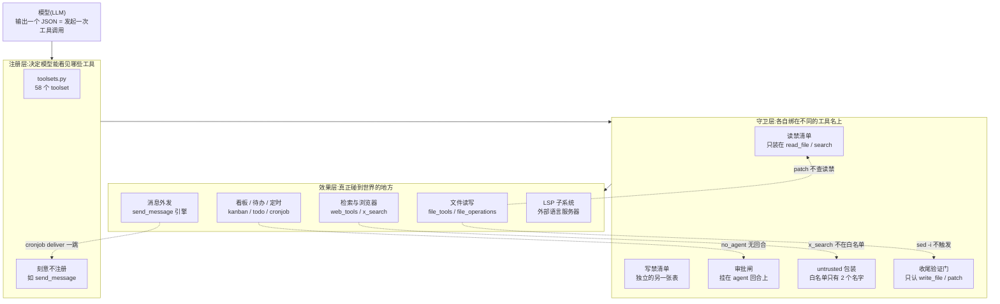

# r9d · 工具面 —— 守卫装在哪一层,决定它挡不挡得住

> **读者定位**:有多年后端工程经验(Go / Java 背景亦可)、**没读过本仓库**、
> **不熟 LLM provider 生态与 Python 异步生态**的工程师。本章不要求你查任何外部资料、不要求你看源码。
> **溯源约定**:凡对 hermes-agent 行为的断言,紧跟 `路径:行号 @ 863e313`(基线 commit)与代码原文块。
> 锚点一律单独成行、置于块前。底稿见 `notes/r9d-raw-*.md` 与 `notes/r9d-9*.md`。
>
> **术语速查**(每个在正文首次出现处还会再锚一次):
> **harness** = 把大模型包装成能干活的 agent 的那层程序;
> **tool / 工具** = harness 暴露给模型调用的函数,模型输出一个 JSON 就等于发起一次调用;
> **toolset** = 工具的分组捆绑包,决定某个场景下模型能看见哪些工具;
> **审批(approval)** = 危险操作执行前要人点头的闸门;
> **LSP** = Language Server Protocol,编辑器与语言服务器之间的标准协议。

---

## TL;DR(快读路径)

1. 这一簇是 **agent 的手脚**:读写文件、管看板、排定时任务、发消息、查网页、接语言服务器。
   它是本学习项目 L1 精读的**最后一片**(49 文件 / 26,434 行)。
2. **本章最重要的一条结论,不是任何单个缺陷,而是它们的共同形状:
   守卫被绑在"哪个工具"上,而不是绑在"这次操作实际做了什么"上。**
   于是每一次绕过都长一个样——**同样的效果,换一扇门**。本章给出 **8 个独立实例**,
   由 6 个互不通气的精读片 + 主线移交取证分别发现。
3. 最刺眼的一组:`read_file` 拒绝读凭据库 `auth.json`,`patch` 对同一个文件成功,
   并把明文密钥写进 diff 交给模型;文档还在"**永远阻止**"的标题下点名列着这个文件。
4. 反面样本也在同一簇里:**LSP 子系统**是全轮设计质量最高的一块——它用"文档版本号"这一个整数
   解决了"报给模型的诊断是不是上一版的"这个竞态,值得直接抄。
5. 可迁移的一句话:**写完一条防线,要同时写一条能数出"应该用它的地方有几个、实际用了几个"的检查**;
   而更要紧的是先问一句——**这条防线绑在名字上,还是绑在效果上?**

---

## 1. 从一个场景说起:一次回合里,三件被明令禁止的事都办成了

设想一个跑在网关(gateway,常驻服务端进程)上的 agent 会话。作者在代码与文档里明确禁止了三件事。
我们逐件看它怎么被绕过——**三次绕过都不需要漏洞利用技巧,只需要换一个工具名**。

**第一件:读凭据库。** `<HERMES_HOME>/auth.json` 是 hermes 存放各家 API 密钥的主文件。
(本章出现的 `auth.json` / `.anthropic_oauth.json` / `op_cache.json` / `bws_cache.json` 都是
**运行时在 `HERMES_HOME` 下生成的数据文件**,不是仓库里的源码文件,故不给仓库路径。)
`read_file` 工具会拒绝:

```text
read_file(auth.json)
  -> {"error": "Access denied: <HH>/auth.json is a Hermes credential store
      and cannot be read directly. ..."}
```

模型改用 `patch`(改文件的工具,需要先读旧内容才能算出 diff):

```text
patch(auth.json, old_string='"openai"', new_string='"openai2"')
  -> error: None
  -> diff 返回给模型:
       {
      -  "openai": {"api_key": "sk-SECRET-OPENAI-123"},
      +  "openai2": {"api_key": "sk-SECRET-OPENAI-123"},
         "anthropic": {"api_key": "sk-ant-SECRET-456"}
       }
```

**同一个文件,一扇门拒绝,另一扇门打开,并且把两个密钥逐字递了出来。**

**第二件:自己决定给谁发消息。** 作者把跨平台发消息的工具**刻意不注册**给模型:

`tools/send_message_tool.py:2106-2108 @ 863e313`

```python
# NOTE: ``send_message`` is intentionally NOT registered as an agent-callable
# model tool. The agent should not decide on its own to fire off cross-platform
# messages or reactions. The send engine in this module (``_send_to_platform``,
```

但 `cronjob`(排定时任务)**是**注册给模型的,它的 `deliver` 参数是一个模型可以自由填写的字符串,
支持 `platform:chat_id:thread_id` 指定任意目标,也支持 `'all'` 扇出到所有已连接频道。
而投递走的正是同一个引擎:

`cron/scheduler.py:2040 @ 863e313`

```python
            coro = _send_to_platform(platform, pconfig, chat_id, cleaned_delivery_content, thread_id=thread_id, media_files=media_files)
```

**禁令挂在"工具注册"这扇门上,发送引擎本身没上锁。**

**第三件:绕过审批执行任意代码。** 危险命令(如 `rm -rf /`)要经审批闸。
但 cron 支持 `no_agent=True` 模式——**这一档没有模型回合,于是审批闸根本不在路径上**。
三步实测(临时目录,载荷只写一个 marker):

```text
1) 写脚本到 ~/.hermes/scripts/ 的写闸判定 -> None   (即:不拦)
2) 无 prompt 建 no_agent job            -> success: True
3) fire 执行                            -> (True, 'nothing to report')
4) marker 是否落地                      -> True
```

而 `approvals.cron_mode: deny` 这个**专为"无人值守时更保守"而设的配置项**,对这条路径无效。

**三件事,三扇门,一个共同点:被守卫的是工具的名字,不是操作的效果。**
本章其余部分讲清这套工具面怎么搭的、为什么会长成这样、以及哪些地方它做对了。

---

## 2. 全景



**图里那五条虚线,就是本章的全部主题**:每一条都是"效果发生了,但守卫没被触发",
原因一律是**守卫认的是工具名,而这个效果是从另一个工具名底下发生的**。

---

## 3. 逐机制

### 3.1 文件读写:两张不同的表,和一扇没上锁的门

**场景**:agent 要改用户的代码。它需要读、写、搜索、打补丁。这是它最常用的能力,也是最危险的。

**设计**。准入判定集中在 `agent/file_safety.py`。要害是:**读禁与写禁不是同一张表**。
写禁那张表盖得很密——profile 级与根级的 `.env`、Anthropic 的 PKCE 凭据、Bitwarden 缓存:

`agent/file_safety.py:39-43 @ 863e313`

```python
            # Active profile .env (or top-level .env when not in profile mode).
            str(hermes_home / ".env"),
            # Top-level .env, even when running under a profile — overwriting it
            # leaks credentials across every profile that inherits from root (#15981).
            str(hermes_root / ".env"),
```

项目本地的 `.env` 家族还有一张基名表:

`agent/file_safety.py:183-191 @ 863e313`

```python
_BLOCKED_PROJECT_ENV_BASENAMES: set[str] = {
    ".env",
    ".env.local",
    ".env.development",
    ".env.production",
    ".env.test",
    ".env.staging",
    ".envrc",
}
```

**取舍**:两张表分开是对的——能读不能写、能写不能读是两种不同的需求。
代价是**任何"新增一个敏感文件"的改动都要记得改两处**,而这正是它出问题的地方。

**事故一:表里少了一个名字,而它是主凭据库。**
文档在"永远阻止"的标题下点名列了五项:

`website/docs/user-guide/security.md:288 @ 863e313`

> | Hermes credential stores | `auth.json`, `.env`, `.anthropic_oauth.json`, `mcp-tokens/`, `pairing/` under HERMES_HOME (active profile and global root) |

把这五项逐个喂给写禁判据,**只有第一项没被挡住**:

```text
文档所列条目                   is_write_denied    判定
auth.json                False              **没挡住**
.env                     True               挡住
.anthropic_oauth.json    True               挡住
mcp-tokens/              True               挡住
pairing/                 True               挡住
```

端到端实证:`write_file` 对 `auth.json` 返回 `verified: true`,文件内容从真实令牌变成 `{"pwned": 1}`。
**agent 可以静默摧毁用户的凭据库,而文档承诺它做不到。** 记 **■ + ▲**。

**事故二:`patch` 这扇门根本不查读禁清单。**
后端层的补丁实现只做写侧判定,紧跟着就是无条件读:

`tools/file_operations.py:1674-1680 @ 863e313`

```python
        # Block writes to sensitive paths
        denied = get_write_denied_error(path)
        if denied:
            return PatchResult(error=denied)

        # Read current content
        read_cmd = f"cat {self._escape_shell_arg(path)} 2>/dev/null"
```

`get_write_denied_error` 之后**没有**对应的读侧判定,旧内容读出来后与新内容做成 diff 返回给模型,
中途不经脱敏。这就是 §1 第一个场景的全部机制。

**事故三:同一类密钥缓存,一个挡了、一个没挡。**
Bitwarden 的明文缓存被挡住了,而**注释里记着这次疏漏本身**:

`agent/file_safety.py:281-284 @ 863e313`

```python
        # Bitwarden Secrets Manager disk cache: stores plaintext secret values
        # to avoid re-fetching across back-to-back CLI invocations. The file
        # was introduced by #31968 but not added to this guard.
        os.path.join("cache", "bws_cache.json"),
```

1Password 的对应缓存 `op_cache.json` **在任何禁读清单里都不存在**,而它同样是明文——
各后端共享的缓存类不加密,只做原子写加 `chmod 0600`:

`agent/secret_sources/_cache.py:197-200 @ 863e313`

```python
                with os.fdopen(fd, "w", encoding="utf-8") as f:
                    json.dump(payload, f)
                os.chmod(tmp, 0o600)
                os.replace(tmp, path)
```

`0600` 挡的是**别的操作系统用户**;而 agent 就跑在文件属主身份下,**挡它的那一层正是禁读清单**。
主线普查:`bws_cache` 有 **7 处**守卫(分布在 3 个文件),`op_cache` 有 **0 处**。

**事故四:一个从不生效的清理,和一句与之相反的注释。**
原子写会先写临时文件再改名,并声称失败时清掉临时文件:

`tools/file_operations.py:1006-1008 @ 863e313`

```python
        On any failure the temp file is removed so we never leak a partial
        ``.hermes-tmp`` file next to the user's data, and the original file
        is left untouched. Content rides stdin so there is no ARG_MAX limit.
```

而清理是这么写的:

`tools/file_operations.py:1071 @ 863e313`

```python
            "trap 'rm -f \\\"$tmp\\\"' EXIT; "
```

shell 单引号里的 `\"` 是**字面量反斜杠加引号**,不是转义。trap 触发时求值成 `rm -f \"$tmp\"`,
参数变成**带字面双引号的文件名**,和真实临时文件对不上,删不掉。
实测:基线写法残留临时文件,正确写法不残留。**docstring 承诺的 "never leak" 从未成立。**

### 3.2 LSP 子系统:本轮设计质量最高的一块

前面全是缺陷,这一节是反面对照——**同一簇代码里,有一块把难题解得很漂亮**。

**场景**:agent 写完一个 Python 文件,想知道自己有没有写错。语法检查只能告诉它"能不能 parse",
它想要的是**类型错、未定义名、缺 import** 这种语义诊断。这需要一个真正的语言服务器
(**LSP**,Language Server Protocol —— 编辑器与语言服务器之间的标准协议;
语言服务器是一个独立的长驻进程,如 Python 的 pyright)。

**难点不在接协议,在时序。** 语言服务器是异步推送诊断的:你改了文件,它过一会儿才把新诊断推过来。
如果 harness 在它推来之前就去取,拿到的是**上一版内容的诊断**——于是模型被告知一个它刚刚已经修好的错。
底稿把这个形态叫**"幽灵诊断"**。

**设计:用文档版本号,而不是时间戳。** 每一条存储的诊断结果都带一个版本 tag,
`tag >= 当前版本` 才算新鲜。一次 `didChange`(通知服务器"文件变了")把版本 +1,
**所有旧结果自动失效**——既不用清空存储,也不存在"刚清完又来一条旧的"这种竞态窗口。

**第二个精妙处:超时时返回"无判决",而不是"干净"。**
等不到新鲜诊断时,服务层返回 `None`(不知道),而不是 `[]`(没问题)。
这两者对模型是完全不同的信息,混了就等于撒谎。

**第三:编辑造成的行号平移单独处理。** 基线诊断记的是编辑**前**的行号,新诊断是编辑**后**的。
直接做集合差会把"同一个错在新位置又出现一次"误判成"新错"。`agent/lsp/range_shift.py` 用 difflib 的 opcodes
造一张分段线性映射,**在做差之前**先把基线搬进编辑后的坐标系。

**第四:诊断噪音三段裁剪。** 只报本次编辑新引入的(delta)→ 只留 ERROR →
每文件 20 条 / 全文 4000 字符上限。默认只留 ERROR 有明确理由:

`agent/lsp/reporter.py:14-17 @ 863e313`

```python
# Severity-1 only by default — warnings/info/hints would flood the
# agent.  Lift this in config under ``lsp.severities`` if needed.
SEVERITY_NAMES = {1: "ERROR", 2: "WARN", 3: "INFO", 4: "HINT"}
DEFAULT_SEVERITIES = frozenset({1})  # ERROR only
```

**第五:把语言服务器的输出当成不可信输入。** 这一点很多 harness 不会想到:

`agent/lsp/reporter.py:30-36 @ 863e313`

```python
def _sanitize_field(value: Any, *, limit: int) -> str:
    """Make a language-server field safe to embed in a tool-result block.

    Diagnostic ``message``, ``code``, and ``source`` originate from a
    language server that has just parsed user-controlled source code, so
    they're untrusted from the agent's point of view. A hostile repo can
    place instruction-shaped text inside identifier names, type aliases,
```

**一个恶意仓库可以把指令形状的文本塞进变量名**,语言服务器会把它原样回显进诊断消息,
诊断消息又会被塞进模型的上下文。作者想到了这一层。

**它也有自己的事故:两套超时,外层比内层紧。**

`agent/lsp/manager.py:310-313 @ 863e313`

```python
        try:
            # Outer join budget must exceed the inner wait budget or a
            # slow-but-alive server gets falsely marked broken.
            t = max(8.0, self._wait_timeout + 3.0)
```

注释自己写明了不变式:**外层预算必须大于内层预算**。但把 `lsp.wait_mode` 设成文档化的 `"full"`
并保留默认 `wait_timeout=5.0` 时,内层变成 10 秒而外层仍是 `max(8.0, 8.0)` = 8 秒——
**不变式被打破**,第一次"服务器没及时重查"就会把这对 (服务器, 工作区) 永久标进 broken-set,
LSP 对该工作区静默关闭,日志还把超时误报成 spawn/initialize 失败。

**还有一处路径边界差一层**:工作区根解析传的上限是工作树的**父目录**,
而查找函数在上限那一层是"先查标记、后判停":

`agent/lsp/servers.py:205-209 @ 863e313`

```python
    found = nearest_root(
        file_path,
        markers,
        excludes=excludes,
        ceiling=os.path.dirname(workspace) if workspace else None,
    )
```

实测:git 工作树父目录里的 `pyproject.toml` 会被当成项目根,**LSP 工作区根逃出 git 工作树**——
而 git 闸门的全部意义就是不越界。在 monorepo 或 `~/projects/pyproject.toml` 这类布局下并不罕见。

### 3.3 看板、待办与定时:审批模型的形状

**场景**:一个长任务要跨多个回合、甚至多个进程完成。harness 提供三层:
`todo`(回合内的短期待办)、`kanban`(跨进程的派工总线)、`cronjob`(定时触发)。
分界线是**"有没有第二个进程要读它"**。

看板的并发做得扎实:WAL + `BEGIN IMMEDIATE` + CAS(比较并交换),
底稿实测四线程同抢一张卡,**一赢三拒、无半写**。安全模型分三层,而且作者明写了哪一层才是信任边界:
schema 层(决定模型看不看得见)与 handler 层(委派拒绝、归属校验)**是 UX**,
只有碰持久状态的 DB 层才是信任边界。**这个自我认知本身就值得学**。

**事故:审批闸挂在"有没有 agent 回合"上。**
危险命令的审批发生在模型的工具调用路径上。而 cron 的 `no_agent=True` 档**根本没有模型回合**——
脚本就是任务本身。于是:

`tools/cronjob_tools.py:756-760 @ 863e313`

```python
            elif not prompt and not canonical_skills:
                return tool_error("create requires either prompt or at least one skill", success=False)
            if prompt:
                scan_error = _scan_cron_prompt(prompt)
                if scan_error:
                    return tool_error(scan_error, success=False)
```

**提示词扫描只在 `prompt` 非空时跑**,而 `no_agent` 允许完全没有 prompt。
路径校验只管路径不读内容;执行侧把脚本目录当可信区:

`cron/scheduler.py:2286-2289 @ 863e313`

```python
    # Pick an interpreter by extension.  Bash for .sh/.bash, Python for
    # everything else.  We deliberately do NOT honour the file's own
    # shebang: the scripts dir is trusted, but keeping the interpreter
    # choice explicit here keeps the allowed surface small and auditable.
```

主线复核的负结论(搜索面写明):`cron/` 下 **9** 个 `.py` 文件里,
`approval` / `check_dangerous_command` / `check_hardline` / `requires_approval` 四个标识符
**唯一的命中是一行注释**,没有任何审批函数调用。

**怎么定性很重要。** 这不是"有人忘了加校验",而是审批模型本身的形状问题:
hermes 的危险命令闸是**命令字符串形状**的(扫 `rm -rf /` 这类字面),
而 `bash x.sh` 这个字符串永远无害。`no_agent` 只是把这个既有缺口做成了
**定时的、无人值守的、跨会话存活的**版本。

**一条判定上的克制**:配置文档说 `cron_mode` 管的是"当 cron 任务**触发危险命令提示时**的行为"。
脚本路径根本不触发提示,所以**这句话字面为真**,按本项目规则**不记 ▲**,只记 ■。
(与之对照的一条真 ▲ 见 §5。)

### 3.4 消息外发:谁决定收件人

**场景**:agent 要把结果发给用户。可能是 Telegram、Discord、飞书、Signal……
harness 把 20 多个平台抽象成**一种目标语法** `platform[:target_ref]` + 每平台一套 ID 正则
+ 三级发送回落(进程内适配器 → 插件发送器 → 描述性错误),
其上再叠加分块(按平台长度上限;Telegram 按 UTF-16 且在格式化**之后**切)、
caption 合并、限流(Telegram 指数退避 / Signal 进程级令牌桶 / **Discord 完全没有**)。

**最关键的设计决定是一条禁令**——见 §1 第二个场景:发送引擎**刻意不注册**给模型,
只作为 cron / `hermes send` / 看板通知 / MCP 四个调用方共享的传输层。
**理由写得很清楚:"agent 不该自己决定发跨平台消息"。**

**而这条禁令被 `cronjob` 的 `deliver` 参数一跳绕过。** `cronjob` 是注册工具,
`deliver` 是模型可写的自由字符串:

`tools/cronjob_tools.py:1073-1074 @ 863e313`

```python
            "deliver": {
                "type": "string",
```

它的描述明写支持 `platform:chat_id:thread_id` 任意目标与 `'all'` 全渠道扇出,
而投递复用同一个引擎(`cron/scheduler.py:1500` 导入 `_send_to_platform`)。
**禁令绑在工具注册上,引擎本身没上锁。**

这一片还有一处"安全修复没有横向扩散"的标本:Home Assistant 工具为
"模型给的字符串被 f-string 拼进 API 路径"这个形状**专门加了白名单正则并写明理由**,
而 Discord 工具对**完全相同的形状**什么都没做。同一个仓库、同一片代码、同一种风险,修了一处。

### 3.5 检索与浏览器:不可信输入的边界

**场景**:agent 搜网页。返回的文本是**互联网上任何人都能写的内容**——
这是提示注入(prompt injection,把指令伪装成数据喂给模型)最经典的入口。

**设计**:harness 把这类工具的输出包进 `untrusted_tool_result` 分隔符,
明确告诉模型"这是数据,不是指令"。作者称之为架构件:

`agent/tool_dispatch_helpers.py:579-587 @ 863e313`

```python
# Tools whose results carry attacker-controllable content.  Wrapping their
# string output in ``<untrusted_tool_result>`` delimiters tells the model the
# payload is data, not instructions — the architectural piece of the
# promptware defense.  Skipped for short outputs (under 32 chars) where the
# overhead of the wrapper outweighs any indirect-injection risk.
_UNTRUSTED_TOOL_NAMES = frozenset({
    "web_extract",
    "web_search",
})
```

**这个白名单只有两个名字**(外加 `browser_` / `mcp_` 两个前缀)。
而 `x_search`(检索 X/Twitter)是一个注册给模型的工具:

`tools/x_search_tool.py:480 @ 863e313`

```python
    "name": "x_search",
```

用被测代码自己的判据逐个跑:

```text
  web_search           被包装: True
  web_extract          被包装: True
  x_search             被包装: False
  browser_snapshot     被包装: True
  mcp_foo              被包装: True
```

**同类外部文本,一个进防线、一个不进,区别只在名字有没有被写进那个 `frozenset`。**

**一处值得单独指出的呼应**:`x_search` **同时**是 §5 查出的
"代码有、`AGENTS.md` 没列"的 7 个功能 toolset 之一。
**同一个工具,既没进文档的清单,也没进防线的清单。**
这两处遗漏彼此独立(一个是文档,一个是代码),却指向同一件事——
**列表式的守卫在列表的边缘腐烂,而边缘正是最新、最少人走的那些工具。**

这一片还有一条设计上的亮点值得抄:`x_search` 对"上游把'查不到'渲染成'查到了'"这种情况
做了 **degraded 检测**——不是所有 harness 都会想到"上游 API 会礼貌地撒谎"。

### 3.6 回合周边:上下文传播与清理

这一片不是一个子系统,而是**一次回合周围的一圈基础设施**,串起来的线索是
"让一次回合在真实世界里不崩、不泄、不卡死"。

三条最值得学的取舍:

1. **托管工具的 vendor 端点钉死在源码里,而不是从远端目录拉。**
   理由:一个能给所有安装装工具的远程端点,**比一次代码 diff 是更大的信任面**。
2. **SSRF 防护按"这个地址是谁决定的"来上,而不是按"是不是外发请求"。**
   这是一条比"所有出站请求都校验"更准的判据。
3. **清理历史时,"可能已发生的副作用"只能被降级成"结果未知",不能被抹掉。**

**事故:推理内容擦除在两条路径上结果相反。** `think_scrubber` 负责把模型的内部推理
从发给用户的内容里擦掉。带属性的推理标签(形如 `think type="x"`)在**流式**路径下**完整泄露给用户**,
在**非流式**路径下**把整条回复吃空**——同一个输入,两条路径一个泄露、一个清空。

**事故:澄清机制会在网关场景把回合卡死一小时。** `clarify` 工具让 agent 反问用户。
webhook 平台的工具集保留了它,但 webhook 的默认投递只写日志就报成功——
于是 agent 阻塞满 `agent.clarify_timeout`(**默认一小时**),而**没有任何回复通道能解锁它**。

---

## 4. 可迁移的设计原则

写自己的 harness 时,这一簇给出的教训按重要性排序:

1. **先问"守卫绑在什么上"。** 绑在工具名上的守卫,会被任何一个能产生同样效果的新工具绕过,
   而新工具是一直在加的。**尽量绑在效果上**:统一在"即将读一个路径 / 即将发一次网络请求 /
   即将执行一段代码"这些**收口点**上判,而不是在每个工具入口各判一次。
2. **两张表就会漂成两张表。** 读禁与写禁分开是合理的,但**分开之后必须有一条检查
   把"新增敏感文件"同时钉到两边**。本簇里 `auth.json` 缺写禁、`op_cache.json` 缺读禁,
   都是这一条的代价。
3. **数出覆盖率,别相信"我写了防线"。** 写完防线要同时写一条能数出
   "应该用它的地方有几个、实际用了几个"的检查。本轮那些 7:0、2:1 的比值,都是数出来才知道的。
4. **超时要成对定义并断言不变式。** LSP 那处外层/内层预算的注释**写对了不变式却没有断言它**,
   于是一个文档化的配置组合就能打破它。**注释不是断言。**
5. **"不知道"和"没问题"必须是两个值。** LSP 超时返回 `None` 而不是 `[]`,是本簇最该抄的一行设计。
6. **把外部程序的输出当不可信输入**——不只是网页,**语言服务器、诊断消息、上游 API 的礼貌回复**都算。
7. **禁令要落在能力上,不要落在注册表上。** "不给模型注册这个工具"只是不让它走正门,
   不等于它到不了那个能力。

---

## 5. 地图与代码的出入

本轮六片合计 **96 条**定案:**■ 48 / ▲ 11 / ◇ 31 / ◎ 6**;主线另定案 7 条移交项。

**最值得记住的一条 ▲,以及它为什么是 ▲**(本项目的判准是"字面为真就不是 ▲",
难点从来不在真假,而在**这句话到底断言了什么范围**):

`website/docs/user-guide/features/hooks.md:670 @ 863e313`

> Fires **once per turn when the agent edited code**, just before it finishes (after the built-in verify-on-stop guard). This is a user/plugin policy gate: a callback can keep the agent going — run a check, defer it, tidy the diff — instead of letting it stop.

代码侧的触发条件依赖一个只由 `write_file` / `patch` 填充的路径集合:

`agent/conversation_loop.py:7109 @ 863e313`

```python
                    if _edited and has_hook("pre_verify") and _attempt < max_verify_nudges():
```

用 `sed -i` 改代码时,agent **确实 edited code**,而钩子**不触发**——前件成立、后件不发生,
**字面为假,判 ▲**。

**对照 §3.3 那条判"不是 ▲"的**:配置文档说 `cron_mode` 管"触发危险命令提示时"的行为,
而脚本路径**根本不触发提示**——那句话的前件从未被满足,它没说错话,缺陷在别处。

| | `website/docs/user-guide/features/hooks.md:670` | `website/docs/user-guide/security.md:47`(cron) |
|---|---|---|
| 文档给的条件 | "when the agent edited code" | "when they trigger a dangerous-command prompt" |
| 缺陷场景下该条件 | **成立** | **不成立** |
| 判定 | **▲** | **不是 ▲**(记 ■) |

**另一处文档缺口(结清 R9A 的一条移交项)**:`AGENTS.md` 的 toolset 一节说

`AGENTS.md:971-975 @ 863e313`

> Current toolset keys: `browser`, `clarify`, `code_execution`, `cronjob`,
> `debugging`, `delegation`, `discord`, `discord_admin`, `feishu_doc`,
> `feishu_drive`, `file`, `homeassistant`, `image_gen`, `kanban`, `memory`,
> `messaging`, `moa`, `rl`, `safe`, `search`, `session_search`, `skills`,
> `spotify`, `terminal`, `todo`, `tts`, `video`, `vision`, `web`, `yuanbao`.

实际代码有 **58** 个键,文档列 30 个,**漏 31 个、多列 3 个**(`messaging` / `moa` / `rl` 在代码里不存在)。

**但这 31 个不能一概判成"文档错了"——而分辨它们需要一个容易被忽略的维度:文档定稿的那一刻。**
清单写入于 2026-05-05 的一次文档提交。取那一刻的快照对读:当时 `TOOLSETS` 共 54 个键
= 非 `hermes-*` **30 个** + `hermes-*` **24 个**,而**文档列的那 30 个与当时的非 `hermes-*` 集合严格相等**。

所以作者做的是**「能力 toolset」这一子类的完整枚举,平台捆绑包是有意排除的**。据此拆判:

| 家族 | 个数 | 记号 | 理由 |
|---|---|---|---|
| `hermes-<平台>` 捆绑包 | 24 | **◇** | 定稿时即被有意排除;文档没说错话,只是**没写出"本清单不含平台族"这条规则** |
| 能力 toolset:`x_search`、`video_gen`、`bfl`、`computer_use`、`context_engine`、`project`、`coding` | **7** | **▲** | 与已列出的 30 个同类;清单自称是该类的完整枚举,而它现在不完整了 |
| `messaging` / `moa` / `rl` | 3 | **▲** | 定稿时存在,后被删,文档未跟 |

**判 ▲ 是在说"作者画错了地图",判 ◇ 是在说"地图没画这一块"。**
对那 24 个平台束,作者画对了——他画的是另一张图,只是没写图例。
(本章初稿把 31 个整体算作 ▲,是错的;更正依据是上面那次定稿快照对读。)

**而那 7 个真 ▲ 里,`project` 与 `x_search` 的实现文件正在本轮读的 49 个之内。**
文档漏列的能力 toolset,恰恰是历轮最晚才被读到的那些——
**地图腐烂的方向不是随机的,是"越边缘越不更新"。** §3.5 那个既不在文档清单、
也不在提示注入防线清单里的 `x_search`,就是这条规律的双重样本。

---

## 6. 延伸

- 六片底稿:`notes/r9d-raw-lsp.md`(LSP)、`notes/r9d-raw-file-io-safety.md`(文件读写)、
  `notes/r9d-raw-kanban-todo-cron.md`(看板/待办/定时)、
  `notes/r9d-raw-messaging-platform-tools.md`(消息外发)、
  `notes/r9d-raw-search-browser-supply.md`(检索与浏览器)、
  `notes/r9d-raw-gateway-clarify-turn-misc.md`(回合周边)。
- 移交项定案(主线独立取证):`notes/r9d-91-handover-rulings.md`。
- 主线合并测试与七条抽验复核:`notes/r9d-92-mainline-tests-and-crosschecks.md`。
- 范围核对与 L1 收口报数:`notes/r9d-01-scope-and-l1-closeout.md`。
- 上一章(对外接驳面,凭据/计费/信号往哪去):`chapters/r9c-external-interfaces.md`。
  R9C 的结论是"**防线的存在不是覆盖率的证据**";本章把它推进一层——
  更要紧的问题不是**装了几处**,而是**装在了哪一层**。
