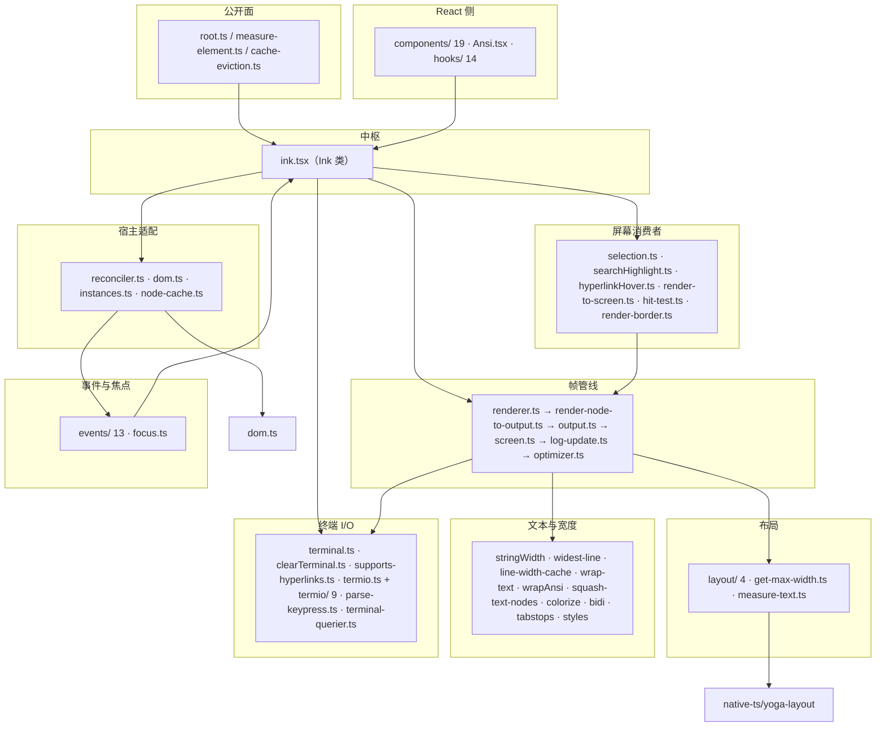

# r10-hermes-ink —— 一个 agent 项目为什么要自己养一个终端渲染器和一个布局引擎

> **片名**:F · hermes-ink 终端渲染器
> **范围**:`/home/user/hermes-study/data/r10/slices/F.txt` 列出的 131 个文件 / 27,169 行
> (`wc -l` 实测总和 27,169;清单登记 27,170,差 1 行,见 §7-7)。
> **基线**:`/home/user/hermes-agent` @ `863e313`,引用后缀一律 `@ 863e313`。
> **层级**:L2 结构级理解 —— 读接口面、生命周期、并发模型,不逐个方法读实现体。

---

## §1 这一片是什么

给不熟前端生态的读者三个锚:

- **Ink** = 一个"用 React 写终端界面"的渲染器。React 本身只负责"组件树变了没有";
  把变化落到什么地方是**宿主渲染器**(host renderer)的事 —— 落到浏览器 DOM 是 react-dom,
  落到终端字符网格就是 Ink。Ink 是开源项目(`github.com/vadimdemedes/ink`)。
- **yoga** = Facebook 开源的 flexbox 布局引擎(`flex-direction` / `flexGrow` / `padding` 这套
  CSS 弹性盒模型的计算内核)。上游 yoga 是 C++,前端一般用它编译出的 **WASM**
  (WebAssembly,一种能在 JS 运行时里跑的二进制格式)。Ink 用它来算"这个 Box 该占几行几列"。
- **hermes-ink** = 本仓库 `ui-tui/packages/hermes-ink/`,是项目**自己维护的 Ink 分支**
  (fork),外加**一份纯 TypeScript 重写的 yoga**(`src/native-ts/yoga-layout/index.ts`,2,326 行),
  于是整条"React → 布局 → 字符网格 → 刷屏"的链条**全部在仓库内、全部可改**。

这一片解决的问题一句话:**把一个 60fps、带鼠标/选区/搜索/滚动/备用屏的终端 IDE 界面,
做到"每帧只往 stdout 写变化的那几十个字节"**。上游 Ink 做不到这件事,因为它的输出模型是
"把整棵树渲染成一个大字符串,再和上一帧的字符串比"。hermes-ink 把这个模型换成了
**逐单元格(cell)的位打包屏幕缓冲 + 双缓冲差分**,所有别的东西(选区、搜索高亮、
硬件滚动、鼠标命中测试)都是围着这个新模型长出来的。

这一片在整机里的位置:上游端是 `ui-tui/src/entry.tsx`(TUI 进程入口,调 `ink.render()`),
下游端是**终端的 stdout 字节流**。它不直接和 Python 内核说话 —— Python 那一侧由
`ui-tui/src/gatewayClient.ts` + `tui_gateway/` 负责,是别的片。

---

## §2 文件清单(131 个,逐个全路径 + 一句话角色)

行数取 `wc -l`。分组是我为可读性划的,组内逐个列全。

### 组 A · 包边界与声明(7 个,ROOT)

| 全路径 | 行 | 角色 |
|---|---|---|
| `ui-tui/packages/hermes-ink/package.json` | 59 | 包清单:名 `@hermes/ink`、`"type": "module"`、`exports` 三个子路径、esbuild `build` 脚本、24 个 runtime 依赖 |
| `ui-tui/packages/hermes-ink/index.js` | 1 | 运行时入口:`export * from './dist/entry-exports.js'` —— 指向 **构建产物**,不是源码 |
| `ui-tui/packages/hermes-ink/index.d.ts` | 42 | 类型入口:46 个导出说明符,直接指向 `.ts`/`.tsx` 源文件 |
| `ui-tui/packages/hermes-ink/ambient.d.ts` | 83 | 环境声明:给 8 个无类型/弱类型依赖(`react-reconciler`、`bidi-js`、`stack-utils`、`lodash-es/*`、`semver`)补声明,并声明全局 `Bun` 与 `ink-box`/`ink-text`/`ink-link`/`ink-raw-ansi` 四个 JSX 内置元素 |
| `ui-tui/packages/hermes-ink/text-input.js` | 1 | `@hermes/ink/text-input` 子路径的运行时:转发 npm `ink-text-input` |
| `ui-tui/packages/hermes-ink/text-input.d.ts` | 2 | 同上的类型转发 |
| `ui-tui/packages/hermes-ink/tsconfig.json` | 2 | 只 `extends` 上一级 `ui-tui/tsconfig.json`,无自有配置 |

### 组 B · 对外导出面与宿主适配壳(4 个)

| 全路径 | 行 | 角色 |
|---|---|---|
| `ui-tui/packages/hermes-ink/src/entry-exports.ts` | 57 | **运行时导出面**(47 个说明符)+ 一段 17 行注释解释为什么绝不能在这里 re-export `ink-text-input`(#31227,见 §5.2) |
| `ui-tui/packages/hermes-ink/src/bootstrap/state.ts` | 9 | 4 个"给宿主留的钩子",其中 3 个是空函数体;`getIsInteractive()` 判 stdin/stdout 双 TTY |
| `ui-tui/packages/hermes-ink/src/hooks/use-stdout.ts` | 15 | `useStdout()`:返回 `{ stdout, write }`,write 直写 `process.stdout` |
| `ui-tui/packages/hermes-ink/src/hooks/use-stderr.ts` | 15 | `useStderr()`:同上,对 stderr |

### 组 C · 布局引擎(6 个)—— 本片的第一个"自己养"

| 全路径 | 行 | 角色 |
|---|---|---|
| `ui-tui/packages/hermes-ink/src/native-ts/yoga-layout/index.ts` | 2326 | **纯 TS yoga**:`Node` 类(88 个方法)+ `layoutNode()` 递归 flexbox 求解 + 4 槽测量缓存 + `roundLayout` 像素对齐 + `getYogaCounters()` 性能计数 |
| `ui-tui/packages/hermes-ink/src/native-ts/yoga-layout/enums.ts` | 112 | 上游 yoga 的 16 个枚举(`Align`/`Edge`/`FlexDirection`/`Unit`/`Errata`…)按**上游数值**逐一复刻,保证 ABI 兼容 |
| `ui-tui/packages/hermes-ink/src/ink/layout/node.ts` | 145 | **布局引擎抽象接口** `LayoutNode`(49 个方法)+ 10 个字符串字面量枚举(`LayoutEdge`/`LayoutAlign`…),把 yoga 的整数枚举挡在外面 |
| `ui-tui/packages/hermes-ink/src/ink/layout/yoga.ts` | 313 | `LayoutNode` 的 yoga 实现:`YogaLayoutNode` 适配器 + `EDGE_MAP`/`GUTTER_MAP` 等 8 张字符串→整数映射表 |
| `ui-tui/packages/hermes-ink/src/ink/layout/engine.ts` | 6 | 唯一的工厂:`createLayoutNode()` → `createYogaLayoutNode()`。整个包只从这里拿布局节点 |
| `ui-tui/packages/hermes-ink/src/ink/layout/geometry.ts` | 98 | `Point`/`Size`/`Rectangle`/`Edges` 值类型 + `unionRect`/`clampRect`/`clamp` 等 8 个纯函数 |

### 组 D · 输出管线核心(11 个)—— 本片的第二个"自己养"

| 全路径 | 行 | 角色 |
|---|---|---|
| `ui-tui/packages/hermes-ink/src/ink/ink.tsx` | 2752 | **`Ink` 类:整片的中枢**。持有双缓冲帧、字符/样式/超链接池、选区状态、备用屏状态、背压计数;`onRender()`(约 520 行)是整条帧管线的编排者 |
| `ui-tui/packages/hermes-ink/src/ink/root.ts` | 204 | 公开挂载 API:`render`(async 包装)/`renderSync`/`createRoot`/`forceRedraw`,以及 `RenderOptions`(含 `onFrame`、`onHyperlinkClick`) |
| `ui-tui/packages/hermes-ink/src/ink/reconciler.ts` | 382 | **react-reconciler 宿主配置**(约 45 个 host config 回调):`createInstance` → `dom.createNode`,`resetAfterCommit` → 先算布局再触发渲染 |
| `ui-tui/packages/hermes-ink/src/ink/dom.ts` | 494 | 影子 DOM:`DOMElement`/`TextNode` 结构、增删子节点、`markDirty` 向上冒泡、`ink-text`/`ink-raw-ansi` 的 yoga measureFunc 与 16 槽测量缓存 |
| `ui-tui/packages/hermes-ink/src/ink/renderer.ts` | 169 | 一帧的"上半场":读 root yoga 尺寸 → 复用 `Output` → 调 `renderNodeToOutput` → `output.get()` 得 `Screen`,返回 `Frame` |
| `ui-tui/packages/hermes-ink/src/ink/render-node-to-output.ts` | 1860 | **树遍历绘制器**:剪裁/剔除、干净子树 blit 快路、文本换行与样式重贴、边框、ScrollBox 滚动漏出与 DECSTBM 提示、absolute 覆盖层 |
| `ui-tui/packages/hermes-ink/src/ink/output.ts` | 839 | 绘制**操作记录器**:`write`/`blit`/`clear`/`clip`/`unclip`/`noSelect`/`shift` 七类操作先入队,`get()` 里一次性回放到 `Screen`;含字素簇 + 宽度 + styleId 的行级缓存 |
| `ui-tui/packages/hermes-ink/src/ink/screen.ts` | 1590 | **屏幕缓冲**:每单元格 2×Int32 位打包(charId / styleId+hyperlinkId+width)、`CharPool`/`HyperlinkPool`/`StylePool` 三个 interning 池、`blitRegion`/`clearRegion`/`shiftRows`、`diffEach` 差分 |
| `ui-tui/packages/hermes-ink/src/ink/log-update.ts` | 752 | 一帧的"下半场":`Screen` 差分 → `Patch[]`;含整屏重画兜底、回滚区(scrollback)不可达判定、DECSTBM 硬件滚动、`VirtualScreen` 光标模型 |
| `ui-tui/packages/hermes-ink/src/ink/optimizer.ts` | 99 | `Patch[]` 单遍优化:去空、合并连续 cursorMove、去 (0,0) 空移、拼接样式串、去重相同超链接 |
| `ui-tui/packages/hermes-ink/src/ink/frame.ts` | 124 | `Frame`/`FrameEvent`/`Patch`(10 个变体)/`Diff` 类型 + `emptyFrame` + `shouldClearScreen` |

### 组 E · 屏幕缓冲的下游消费者(9 个)

| 全路径 | 行 | 角色 |
|---|---|---|
| `ui-tui/packages/hermes-ink/src/ink/selection.ts` | 1143 | 文本选区:anchor/focus 模型、跨行取字、滚出行留存(`scrolledOffAbove`)、软换行拼接、`applySelectionOverlay` 直接反色屏幕缓冲 |
| `ui-tui/packages/hermes-ink/src/ink/searchHighlight.ts` | 91 | 可见区全部匹配项反色;按行建"字符→列"映射以正确处理宽字符 |
| `ui-tui/packages/hermes-ink/src/ink/hyperlinkHover.ts` | 52 | 鼠标悬停在 OSC 8 超链接上时,反色该链接的所有单元格(终端改不了鼠标指针,只能亮链接) |
| `ui-tui/packages/hermes-ink/src/ink/render-to-screen.ts` | 236 | **离屏渲染**:用独立 root + LegacyRoot 把单条消息渲染到自己的 `Screen`,扫出匹配位置 `MatchPosition[]`,供搜索"当前项"定位 |
| `ui-tui/packages/hermes-ink/src/ink/hit-test.ts` | 224 | 命中测试:由 (col,row) 反查 `DOMElement`,absolute 后代优先、逆 DOM 序;`dispatchClick`/`dispatchHover`/`dispatchMouse` |
| `ui-tui/packages/hermes-ink/src/ink/node-cache.ts` | 53 | `nodeCache`(节点→上帧绝对矩形,WeakMap)、`pendingClears`、absolute 节点被移除的一次性标志 |
| `ui-tui/packages/hermes-ink/src/ink/render-border.ts` | 281 | 边框绘制:`cli-boxes` 之外自定义 `dashed`/… 样式,支持边框内嵌标题(`borderText`,含对齐与偏移) |
| `ui-tui/packages/hermes-ink/src/ink/measure-element.ts` | 23 | 公开 API:读某个 `DOMElement` 的 yoga 计算宽高 |
| `ui-tui/packages/hermes-ink/src/ink/measure-text.ts` | 50 | 单遍算文本 (width,height):`indexOf` 逐行,不 `split('\n')` |

### 组 F · 文本与宽度(11 个)

| 全路径 | 行 | 角色 |
|---|---|---|
| `ui-tui/packages/hermes-ink/src/ink/stringWidth.ts` | 341 | 终端显示宽度:优先 `Bun.stringWidth`,否则纯 JS 回退(emoji、东亚宽度、组合符、变体选择符);带 LRU |
| `ui-tui/packages/hermes-ink/src/ink/widest-line.ts` | 22 | 多行文本里最宽一行的宽度(走 `lineWidth` 缓存) |
| `ui-tui/packages/hermes-ink/src/ink/line-width-cache.ts` | 38 | 行级宽度 LRU(4096 条):流式输出时已完成的行不变,免重测 |
| `ui-tui/packages/hermes-ink/src/ink/wrap-text.ts` | 144 | 换行:`wrap`/`truncate`/`wrap-trim` 等策略 + 4096 条 LRU(CPU profile 显示换行曾占 30% 运行时) |
| `ui-tui/packages/hermes-ink/src/ink/wrapAnsi.ts` | 13 | `wrapAnsi` 选择器:有 `Bun.wrapAnsi` 用它,否则用 npm `wrap-ansi` |
| `ui-tui/packages/hermes-ink/src/ink/squash-text-nodes.ts` | 74 | 把 `ink-text` 子树压平成 `StyledSegment[]`(文本 + 样式 + 超链接),不做 ANSI 字符串变换 |
| `ui-tui/packages/hermes-ink/src/ink/colorize.ts` | 283 | 颜色落地:chalk 层级修正(xterm.js/code-server 的 truecolor 误判)、`applyTextStyles` |
| `ui-tui/packages/hermes-ink/src/ink/bidi.ts` | 145 | 双向文本:Windows 终端不实现 Unicode Bidi,这里在放格前把逻辑序重排成视觉序 |
| `ui-tui/packages/hermes-ink/src/ink/tabstops.ts` | 44 | Tab 展开到 8 列制表位(仿 Ghostty 的 `Tabstops.zig`) |
| `ui-tui/packages/hermes-ink/src/ink/get-max-width.ts` | 27 | yoga 节点内容宽度(减 padding/border);docstring 明确警告它可能**宽于父容器** |
| `ui-tui/packages/hermes-ink/src/ink/styles.ts` | 750 | `Styles`(67 个键)/`TextStyles` 类型 + `applyStyles(yogaNode, styles)` 把 React props 翻成 `LayoutNode` 调用 |

### 组 G · 终端能力探测与 ANSI 输出(4 个)

| 全路径 | 行 | 角色 |
|---|---|---|
| `ui-tui/packages/hermes-ink/src/ink/terminal.ts` | 427 | 终端能力库:DEC 2026 同步输出、OSC 9;4 进度、XTVERSION 名字、扩展键、前/背景色槽,以及 **`writeDiffToTerminal()`**(`Patch[]` → 单次 `stdout.write`) |
| `ui-tui/packages/hermes-ink/src/ink/clearTerminal.ts` | 68 | 跨平台清屏(含 `ESC[3J` 清回滚区的终端判定、Windows/mintty 特例) |
| `ui-tui/packages/hermes-ink/src/ink/supports-hyperlinks.ts` | 51 | OSC 8 支持判定;在 npm `supports-hyperlinks` 之外补 6 个终端白名单,并同时看 `LC_TERMINAL`(tmux 里才留得住) |
| `ui-tui/packages/hermes-ink/src/ink/useTerminalNotification.ts` | 110 | `TerminalWriteContext` + `useTerminalNotification()`:iTerm2/kitty/Ghostty 通知、BEL、OSC 9;4 进度 |

### 组 H · termio —— 自己写的语义化 ANSI 解析器(10 个)

| 全路径 | 行 | 角色 |
|---|---|---|
| `ui-tui/packages/hermes-ink/src/ink/termio.ts` | 42 | 桶文件:导出 `Parser` + 14 个类型 + 3 个比较函数;顶部注明"灵感来自 ghostty / tmux / iTerm2" |
| `ui-tui/packages/hermes-ink/src/ink/termio/types.ts` | 226 | 语义动作类型:`Action` 12 个顶层变体、`TextStyle`、`Color`(4 种)、`CursorAction`(11 种)等 |
| `ui-tui/packages/hermes-ink/src/ink/termio/tokenize.ts` | 350 | **边界切分**:把输入切成 `text` / `sequence` 两种 token;跨 feed 保留未完成的 CSI |
| `ui-tui/packages/hermes-ink/src/ink/termio/parser.ts` | 467 | **语义解析**:token → `Action[]`,跨 feed 维护样式状态 |
| `ui-tui/packages/hermes-ink/src/ink/termio/ansi.ts` | 75 | C0/C1 控制字符与引导符常量(ECMA-48) |
| `ui-tui/packages/hermes-ink/src/ink/termio/csi.ts` | 334 | CSI 序列:参数字节范围、`cursorMove`/`cursorTo`/`eraseLines`/`setScrollRegion`/`scrollUp` 等构造器 |
| `ui-tui/packages/hermes-ink/src/ink/termio/dec.ts` | 99 | DEC 私有模式:备用屏、括号粘贴、鼠标跟踪(`MouseTrackingMode`)、焦点事件、BSU/ESU |
| `ui-tui/packages/hermes-ink/src/ink/termio/esc.ts` | 69 | 简单 ESC 序列解析(ESC + 1~2 字符) |
| `ui-tui/packages/hermes-ink/src/ink/termio/osc.ts` | 726 | OSC:超链接、标题、tab 状态、iTerm2 进度,以及**整套剪贴板策略**(OSC 52 / tmux load-buffer / 原生工具三条路的取舍) |
| `ui-tui/packages/hermes-ink/src/ink/termio/sgr.ts` | 362 | SGR 参数解析(分号与冒号两种分隔),落到 `TextStyle` |

### 组 I · 输入与事件系统(15 个)

| 全路径 | 行 | 角色 |
|---|---|---|
| `ui-tui/packages/hermes-ink/src/ink/parse-keypress.ts` | 864 | 键盘/鼠标输入解析:kitty CSI u、modifyOtherKeys、SGR 鼠标报告、括号粘贴、DECRPM 响应 |
| `ui-tui/packages/hermes-ink/src/ink/events/event.ts` | 11 | 最小基类 `Event`:只有 `stopImmediatePropagation()` |
| `ui-tui/packages/hermes-ink/src/ink/events/terminal-event.ts` | 107 | `TerminalEvent`:仿浏览器 `Event`(target/currentTarget/eventPhase/stopPropagation/preventDefault/timeStamp) |
| `ui-tui/packages/hermes-ink/src/ink/events/dispatcher.ts` | 242 | **捕获/冒泡派发器** + React 更新优先级桥接(`discreteUpdates`、`resolveEventPriority`) |
| `ui-tui/packages/hermes-ink/src/ink/events/event-handlers.ts` | 84 | 事件接缝的三张表:`EventHandlerProps`(15 个 prop)、`HANDLER_FOR_EVENT`(9 个事件)、`EVENT_HANDLER_PROPS`(15 个名字) |
| `ui-tui/packages/hermes-ink/src/ink/events/emitter.ts` | 40 | `EventEmitter`:node 版之上尊重 `stopImmediatePropagation()`,并关掉 maxListeners 警告 |
| `ui-tui/packages/hermes-ink/src/ink/events/input-event.ts` | 176 | `InputEvent` + `Key`(21 个布尔位):`useInput` 的旧式接口 |
| `ui-tui/packages/hermes-ink/src/ink/events/keyboard-event.ts` | 57 | `KeyboardEvent`:浏览器语义的 `key` 字符串(可打印键长度为 1) |
| `ui-tui/packages/hermes-ink/src/ink/events/click-event.ts` | 38 | `ClickEvent`:col/row + 相对 Box 的 localCol/localRow + `cellIsBlank` |
| `ui-tui/packages/hermes-ink/src/ink/events/mouse-event.ts` | 18 | `MouseEvent`:同上再加 `button` |
| `ui-tui/packages/hermes-ink/src/ink/events/focus-event.ts` | 18 | `FocusEvent`:focus/blur,带 `relatedTarget`,冒泡(对齐 focusin/focusout) |
| `ui-tui/packages/hermes-ink/src/ink/events/paste-event.ts` | 10 | `PasteEvent`:携带粘贴文本 |
| `ui-tui/packages/hermes-ink/src/ink/events/resize-event.ts` | 12 | `ResizeEvent`:columns/rows |
| `ui-tui/packages/hermes-ink/src/ink/events/terminal-focus-event.ts` | 19 | `TerminalFocusEvent`:DECSET 1004 的 `terminalfocus`/`terminalblur` |
| `ui-tui/packages/hermes-ink/src/ink/focus.ts` | 219 | `FocusManager`:activeElement + 深度 32 的焦点栈 + tabIndex 环形遍历;挂在 root 节点上 |

### 组 J · 组件(19 个,`src/ink/components/`)

| 全路径 | 行 | 角色 |
|---|---|---|
| `ui-tui/packages/hermes-ink/src/ink/components/App.tsx` | 1015 | **输入侧的根组件**(class 组件):raw mode 生命周期、stdin `readable` 泵、按键/鼠标分发、鼠标看门狗探测、SIGTSTP 挂起恢复、错误边界 |
| `ui-tui/packages/hermes-ink/src/ink/components/Box.tsx` | 294 | `<Box>`:67 个样式 prop + `tabIndex`/`autoFocus` + 15 个事件 prop,渲染成 `ink-box` |
| `ui-tui/packages/hermes-ink/src/ink/components/Text.tsx` | 349 | `<Text>`:颜色/背景/粗体/斜体/下划线/删除线/反色/dim + `HERMES_TUI_DIM` 与 Apple 终端 dim 回退色 |
| `ui-tui/packages/hermes-ink/src/ink/components/ScrollBox.tsx` | 364 | `<ScrollBox>` + 15 个方法的 `ScrollBoxHandle`:虚拟滚动、粘底、元素锚定滚动、clamp 边界 |
| `ui-tui/packages/hermes-ink/src/ink/components/AlternateScreen.tsx` | 126 | `<AlternateScreen>`:进出备用屏 + 选择鼠标跟踪档位(`all`/`wheel`) |
| `ui-tui/packages/hermes-ink/src/ink/components/Button.tsx` | 236 | `<Button>`:focused/hovered/active 三态 + Enter/Space/点击触发 |
| `ui-tui/packages/hermes-ink/src/ink/components/NoSelect.tsx` | 73 | `<NoSelect>`:把区域标为"不可选中"(行号、diff 记号槽),支持 `fromLeftEdge` 延伸到 0 列 |
| `ui-tui/packages/hermes-ink/src/ink/components/RawAnsi.tsx` | 61 | `<RawAnsi>`:已经排好版的 ANSI 行直通,绕过 React 树 → yoga → 压平 → 再序列化的往返 |
| `ui-tui/packages/hermes-ink/src/ink/Ansi.tsx` | 435 | `<Ansi>`:把带 ANSI 的字符串解析成 `<Text>` span 树(走 termio),支持强制 dim |
| `ui-tui/packages/hermes-ink/src/ink/components/Link.tsx` | 38 | `<Link>`:总是发 OSC 8 元数据(即使终端不支持),让进程内的点击派发能用;`fallback` prop 已保留但不再接线 |
| `ui-tui/packages/hermes-ink/src/ink/components/Newline.tsx` | 43 | `<Newline count>`:插 n 个 `\n`,必须在 `<Text>` 内 |
| `ui-tui/packages/hermes-ink/src/ink/components/Spacer.tsx` | 23 | `<Spacer>`:`<Box flexGrow={1}/>` 的别名 |
| `ui-tui/packages/hermes-ink/src/ink/components/ErrorOverview.tsx` | 130 | 未捕获错误的终端渲染:`stack-utils` 清栈 + `code-excerpt` 取源码片段 |
| `ui-tui/packages/hermes-ink/src/ink/components/ClockContext.tsx` | 133 | 共享时钟:同 tick 内所有订阅者看到同一时间;无 keepAlive 订阅者时停表 |
| `ui-tui/packages/hermes-ink/src/ink/components/AppContext.ts` | 20 | `AppContext`:只暴露 `exit()` |
| `ui-tui/packages/hermes-ink/src/ink/components/StdinContext.ts` | 25 | `StdinContext`:stdin、`setRawMode`、`isRawModeSupported`、`exitOnCtrlC`、`inputEmitter`、`querier` |
| `ui-tui/packages/hermes-ink/src/ink/components/TerminalFocusContext.tsx` | 63 | 终端窗口焦点的 React 侧包装(订阅 `terminal-focus-state.ts`) |
| `ui-tui/packages/hermes-ink/src/ink/components/TerminalSizeContext.tsx` | 7 | `TerminalSizeContext`(columns/rows);**只有 6 行代码 + 1 行 base64 sourcemap**,见 §6-■2 |
| `ui-tui/packages/hermes-ink/src/ink/components/CursorAdvanceContext.ts` | 35 | `CursorAdvanceNotifier` 类型 + context:通知 Ink"物理光标被带外 write 推进了" |
| `ui-tui/packages/hermes-ink/src/ink/components/CursorDeclarationContext.ts` | 28 | `CursorDeclaration`(相对某节点的 x/y)+ setter;IME 预编辑与读屏器要靠它 |

> 注:上表 20 行,因为 `Ansi.tsx` 不在 `components/` 目录下(它在 `src/ink/`),
> 我按职责把它归进本组;`components/` 目录本身是 19 个文件。

### 组 K · Hooks(14 个,`src/ink/hooks/`)

| 全路径 | 行 | 角色 |
|---|---|---|
| `ui-tui/packages/hermes-ink/src/ink/hooks/use-app.ts` | 9 | `useApp()` → `AppContext`(拿 `exit`) |
| `ui-tui/packages/hermes-ink/src/ink/hooks/use-stdin.ts` | 9 | `useStdin()` → `StdinContext` |
| `ui-tui/packages/hermes-ink/src/ink/hooks/use-input.ts` | 95 | `useInput(handler, {isActive})`:订阅 `inputEmitter` 的 `input` 事件 |
| `ui-tui/packages/hermes-ink/src/ink/hooks/use-selection.ts` | 101 | `useSelection()`(13 个方法)/`useHasSelection()`:非备用屏时全部退化为 no-op |
| `ui-tui/packages/hermes-ink/src/ink/hooks/use-search-highlight.ts` | 56 | 设置搜索高亮串;屏幕空间匹配(匹配的是**渲染后**的文本) |
| `ui-tui/packages/hermes-ink/src/ink/hooks/use-declared-cursor.ts` | 75 | 声明"光标该停在哪个节点的第几行第几列" |
| `ui-tui/packages/hermes-ink/src/ink/hooks/use-cursor-advance.ts` | 33 | 通知 Ink 光标被带外推进(TextInput 快速回显路径用) |
| `ui-tui/packages/hermes-ink/src/ink/hooks/use-terminal-focus.ts` | 18 | 终端窗口是否有焦点(DECSET 1004) |
| `ui-tui/packages/hermes-ink/src/ink/hooks/use-terminal-title.ts` | 64 | 声明式设置终端 tab/窗口标题(OSC 0/1/2 分开) |
| `ui-tui/packages/hermes-ink/src/ink/hooks/use-terminal-viewport.ts` | 100 | 某元素是否在终端可视区内(仿 IntersectionObserver) |
| `ui-tui/packages/hermes-ink/src/ink/hooks/use-tab-status.ts` | 71 | tab 状态灯(idle/busy/waiting → OSC 21337 颜色) |
| `ui-tui/packages/hermes-ink/src/ink/hooks/use-animation-frame.ts` | 62 | 共享时钟驱动的动画帧;传 `null` 即退订暂停 |
| `ui-tui/packages/hermes-ink/src/ink/hooks/use-interval.ts` | 71 | 非 keepAlive 地读共享时钟(自己不会让时钟转起来) |
| `ui-tui/packages/hermes-ink/src/ink/hooks/use-external-process.ts` | 27 | `withInkSuspended(run)`:跑外部程序(编辑器、setup)期间挂起 Ink |

### 组 L · 缓存与杂项(8 个)

| 全路径 | 行 | 角色 |
|---|---|---|
| `ui-tui/packages/hermes-ink/src/ink/cache-eviction.ts` | 45 | 统一驱逐四个热缓存(width / wrap / slice / lineWidth);`evictInkCaches('all'|'half')` 是公开 API |
| `ui-tui/packages/hermes-ink/src/ink/lru.ts` | 14 | `lruEvict(cache, keepRatio)`:只抽出批量驱逐,读路径的 touch 仍内联在各缓存里 |
| `ui-tui/packages/hermes-ink/src/ink/instances.ts` | 10 | `Map<WriteStream, Ink>`:保证同一 stdout 的多次 `render()` 复用同一实例 |
| `ui-tui/packages/hermes-ink/src/ink/constants.ts` | 19 | `FRAME_INTERVAL_MS=16`、`BLURRED_FRAME_INTERVAL_MS`、`MAX_COALESCED_BACKPRESSURE_FRAMES=10` |
| `ui-tui/packages/hermes-ink/src/ink/cursor.ts` | 5 | `Cursor` 类型(x/y/visible) |
| `ui-tui/packages/hermes-ink/src/ink/warn.ts` | 15 | `ifNotInteger()`:非整数样式值时打调试日志 |
| `ui-tui/packages/hermes-ink/src/ink/terminal-focus-state.ts` | 52 | 焦点状态信号(`focused`/`blurred`/`unknown`)的非 React 访问点 |
| `ui-tui/packages/hermes-ink/src/ink/terminal-querier.ts` | 222 | 无超时终端查询:每批查询以 DA1 哨兵收尾,靠响应序列可区分于按键 |

### 组 M · 占位与调试桩(3 个)

| 全路径 | 行 | 角色 |
|---|---|---|
| `ui-tui/packages/hermes-ink/src/ink/devtools.ts` | 2 | 只有一行 `export {}` + 一句注释("可选的 react-devtools 钩子,包可能不存在") |
| `ui-tui/packages/hermes-ink/src/ink/global.d.ts` | 1 | 只有 `export {}`,把文件变成模块 |
| `ui-tui/packages/hermes-ink/src/utils/debug.ts` | 6 | `logForDebugging()` 是**空函数体**:包内所有调试日志实际不输出 |

### 组 N · `src/utils/`(10 个)

| 全路径 | 行 | 角色 |
|---|---|---|
| `ui-tui/packages/hermes-ink/src/utils/execFileNoThrow.ts` | 113 | `spawn` 封装:不抛异常、可选 `timeout`、可选 `resolveOnExit`。**§5.6 的主角** |
| `ui-tui/packages/hermes-ink/src/utils/env.ts` | 66 | `detectTerminal()`(11 个分支)+ `env.terminal` 单例 + `supportsOsc52Clipboard()` 白名单 |
| `ui-tui/packages/hermes-ink/src/utils/envUtils.ts` | 13 | `isEnvTruthy()`:`1/true/yes/on` |
| `ui-tui/packages/hermes-ink/src/utils/fullscreen.ts` | 3 | 只有 `isMouseClicksDisabled()`,读 `HERMES_TUI_DISABLE_MOUSE_CLICKS` |
| `ui-tui/packages/hermes-ink/src/utils/log.ts` | 7 | `logError()`:只有设了 `HERMES_INK_DEBUG_ERRORS` 才 `console.error` |
| `ui-tui/packages/hermes-ink/src/utils/earlyInput.ts` | 131 | 进程刚起、Ink 还没接手时先缓存 stdin,避免丢掉最早的按键 |
| `ui-tui/packages/hermes-ink/src/utils/intl.ts` | 87 | `Intl.Segmenter` 单例(grapheme / word 两种粒度)+ 惰性初始化 |
| `ui-tui/packages/hermes-ink/src/utils/sliceAnsi.ts` | 106 | 按显示宽度切带 ANSI 的字符串 + LRU(同一帧内相同 write 会重复出现) |
| `ui-tui/packages/hermes-ink/src/utils/semver.ts` | 57 | 6 个 semver 比较函数:有 `Bun.semver` 用它,否则**`require('semver')`**。见 §6-■3 |
| `ui-tui/packages/hermes-ink/src/utils/debug.ts` | 6 | (已在组 M 列出,此处不重复计数) |

**点名核对**:131 个文件全部出现,`src/utils/debug.ts` 在组 M 与组 N 各出现一次(计一次)。

---

## §3 接缝穷举

这一片是一个 **npm 包**,它的对外接缝不是 HTTP/RPC,而是:导出面、宿主元素名、
补丁指令集、事件表、布局引擎接口、样式键、环境变量、`Ink` 类的命令式方法。逐个列全。

### S1 · `package.json` 的 `exports` 子路径(3 条)

```verify
cd /home/user/hermes-agent/ui-tui/packages/hermes-ink && \
  python3 -c "import json;print(list(json.load(open('package.json'))['exports'].keys()))"
```

输出 `['.', './text-input', './package.json']`。

- `.` → types `./index.d.ts`,import/default `./index.js`
- `./text-input` → types `./text-input.d.ts`,import/default `./text-input.js`
- `./package.json` → 自身

### S2 · 运行时导出面 `src/entry-exports.ts`(47 个说明符)

```verify
cd /home/user/hermes-agent/ui-tui/packages/hermes-ink && node -e "
const s=require('fs').readFileSync('src/entry-exports.ts','utf8');
const re=/export\s+(type\s+)?\{([^}]*)\}\s*from\s*'([^']+)'/gs;let m,n=0;
while((m=re.exec(s))){m[2].split(',').forEach(t=>{if(t.trim())n++})}
console.log(n)"
```

逐个列全(左=导出名,右=来源模块,`type` 前缀=仅类型):

| # | 导出 | 来源 |
|---|---|---|
| 1 | `default as useStderr` | `./hooks/use-stderr.js` |
| 2 | `default as useStdout` | `./hooks/use-stdout.js` |
| 3 | `Ansi` | `./ink/Ansi.js` |
| 4 | `evictInkCaches` | `./ink/cache-eviction.js` |
| 5 | `type EvictLevel` | `./ink/cache-eviction.js` |
| 6 | `type InkCacheSizes` | `./ink/cache-eviction.js` |
| 7 | `AlternateScreen` | `./ink/components/AlternateScreen.js` |
| 8 | `default as Box` | `./ink/components/Box.js` |
| 9 | `default as Link` | `./ink/components/Link.js` |
| 10 | `default as Newline` | `./ink/components/Newline.js` |
| 11 | `NoSelect` | `./ink/components/NoSelect.js` |
| 12 | `RawAnsi` | `./ink/components/RawAnsi.js` |
| 13 | `default as ScrollBox` | `./ink/components/ScrollBox.js` |
| 14 | `default as Spacer` | `./ink/components/Spacer.js` |
| 15 | `setDimFallbackColor` | `./ink/components/Text.js` |
| 16 | `default as Text` | `./ink/components/Text.js` |
| 17 | `default as useApp` | `./ink/hooks/use-app.js` |
| 18 | `useCursorAdvance` | `./ink/hooks/use-cursor-advance.js` |
| 19 | `useDeclaredCursor` | `./ink/hooks/use-declared-cursor.js` |
| 20 | `type RunExternalProcess` | `./ink/hooks/use-external-process.js` |
| 21 | `useExternalProcess` | `./ink/hooks/use-external-process.js` |
| 22 | `withInkSuspended` | `./ink/hooks/use-external-process.js` |
| 23 | `default as useInput` | `./ink/hooks/use-input.js` |
| 24 | `useHasSelection` | `./ink/hooks/use-selection.js` |
| 25 | `useSelection` | `./ink/hooks/use-selection.js` |
| 26 | `default as useStdin` | `./ink/hooks/use-stdin.js` |
| 27 | `useTabStatus` | `./ink/hooks/use-tab-status.js` |
| 28 | `useTerminalFocus` | `./ink/hooks/use-terminal-focus.js` |
| 29 | `useTerminalTitle` | `./ink/hooks/use-terminal-title.js` |
| 30 | `type TerminalTitlePair` | `./ink/hooks/use-terminal-title.js` |
| 31 | `useTerminalViewport` | `./ink/hooks/use-terminal-viewport.js` |
| 32 | `default as measureElement` | `./ink/measure-element.js` |
| 33 | `scrollFastPathStats` | `./ink/render-node-to-output.js` |
| 34 | `type ScrollFastPathStats` | `./ink/render-node-to-output.js` |
| 35 | `createRoot` | `./ink/root.js` |
| 36 | `forceRedraw` | `./ink/root.js` |
| 37 | `default as render` | `./ink/root.js` |
| 38 | `renderSync` | `./ink/root.js` |
| 39 | `stringWidth` | `./ink/stringWidth.js` |
| 40 | `isXtermJs` | `./ink/terminal.js` |
| 41 | `onTerminalBackground` | `./ink/terminal.js` |
| 42 | `onTerminalForeground` | `./ink/terminal.js` |
| 43 | `parseOscColor` | `./ink/terminal.js` |
| 44 | `terminalBackgroundHex` | `./ink/terminal.js` |
| 45 | `terminalForegroundHex` | `./ink/terminal.js` |
| 46 | `type MouseTrackingMode` | `./ink/termio/dec.js` |
| 47 | `wrapAnsi` | `./ink/wrapAnsi.js` |

### S3 · 类型导出面 `index.d.ts`(46 个说明符)

```verify
cd /home/user/hermes-agent/ui-tui/packages/hermes-ink && node -e "
const s=require('fs').readFileSync('index.d.ts','utf8');
const re=/export\s+(type\s+)?\{([^}]*)\}\s*from\s*'([^']+)'/gs;let m,n=0;
while((m=re.exec(s))){m[2].split(',').forEach(t=>{if(t.trim())n++})}
console.log(n)"
```

与 S2 的差集(**这是本片最重要的一处接缝不对齐**,见 §6-■4):

```text
只在 entry-exports.ts(运行时有、index.d.ts 无声明)—— 11 个:
  setDimFallbackColor / useExternalProcess / withInkSuspended / type RunExternalProcess
  scrollFastPathStats / type ScrollFastPathStats
  isXtermJs / onTerminalBackground / onTerminalForeground / parseOscColor
  terminalBackgroundHex / terminalForegroundHex          （共 12 个名字,其中 1 个为 type）

只在 index.d.ts(纯类型,运行时无需对应物)—— 12 个:
  type StderrHandle / type StdoutHandle / type Props as BoxProps
  type ScrollBoxHandle / type ScrollBoxProps / type Props as StdinProps
  type Props as TextProps / type Key / type Instance / type RenderOptions / type Root
```

### S4 · 宿主元素名 `ElementNames`(7 个)

```verify
cd /home/user/hermes-agent/ui-tui/packages/hermes-ink && \
  grep -oE "'ink-[a-z-]+'" src/ink/dom.ts | sort -u
```

`ui-tui/packages/hermes-ink/src/ink/dom.ts:19`

```
export type ElementNames =
  'ink-root' | 'ink-box' | 'ink-text' | 'ink-virtual-text' | 'ink-link' | 'ink-progress' | 'ink-raw-ansi'
```

其中 `ink-virtual-text`(嵌在 `<Text>` 里的 `<Text>`)、`ink-link`、`ink-progress`
**不分配布局节点**(`createNode` 的 `needsYogaNode` 判据);`ambient.d.ts` 只把 4 个
(`ink-box`/`ink-text`/`ink-link`/`ink-raw-ansi`)声明成 JSX 内置元素。

### S5 · 补丁指令集 `Patch`(10 个变体)—— 渲染器与终端之间的"指令 ISA"

```verify
cd /home/user/hermes-agent/ui-tui/packages/hermes-ink && grep -cE "^  \| \{" src/ink/frame.ts
```

| # | `type` | 载荷 | `writeDiffToTerminal` 里落成什么 |
|---|---|---|---|
| 1 | `stdout` | `content: string` | 原样追加 |
| 2 | `clear` | `count: number` | `eraseLines(count)` |
| 3 | `clearTerminal` | `reason` + 可选 `debug` | `getClearTerminalSequence()` |
| 4 | `cursorHide` | — | `HIDE_CURSOR` |
| 5 | `cursorShow` | — | `SHOW_CURSOR` |
| 6 | `cursorMove` | `x, y`(相对) | `cursorMove(x, y)` |
| 7 | `cursorTo` | `col` | `cursorTo(col)` |
| 8 | `carriageReturn` | — | `'\r'` |
| 9 | `hyperlink` | `uri` | `link(uri)`(OSC 8) |
| 10 | `styleStr` | `str`(已序列化的样式跃迁串) | 原样追加 |

### S6 · 事件表(15 个 handler prop / 9 个事件类型)

```verify
cd /home/user/hermes-agent/ui-tui/packages/hermes-ink && \
  sed -n "/^export const EVENT_HANDLER_PROPS/,/^\])/p" src/ink/events/event-handlers.ts | grep -c "^  '" && \
  sed -n "/^export const HANDLER_FOR_EVENT/,/^}/p" src/ink/events/event-handlers.ts | grep -cE "^  [a-z]+: \{"
```

`EVENT_HANDLER_PROPS`(15):`onKeyDown` `onKeyDownCapture` `onFocus` `onFocusCapture`
`onBlur` `onBlurCapture` `onPaste` `onPasteCapture` `onResize` `onClick` `onMouseDown`
`onMouseUp` `onMouseDrag` `onMouseEnter` `onMouseLeave`。

`HANDLER_FOR_EVENT`(9 个事件 → prop 对):`keydown` `focus` `blur` `paste` `resize`
`click` `mousedown` `mouseup` `mousedrag`。

**不对齐是有意的**:`onMouseEnter`/`onMouseLeave` 不在 `HANDLER_FOR_EVENT` 里 ——
悬停不走捕获/冒泡派发器,由 `hit-test.ts` 的 `dispatchHover` 直接对比上一帧的命中节点
后手工调用。事件类 9 个:`Event`、`TerminalEvent`、`InputEvent`、`KeyboardEvent`、
`ClickEvent`、`MouseEvent`、`FocusEvent`、`PasteEvent`、`ResizeEvent`、`TerminalFocusEvent`
(实为 10 个类,其中 `Event`/`TerminalEvent` 是基类)。

### S7 · 布局引擎接口 `LayoutNode`(49 个方法)

```verify
cd /home/user/hermes-agent/ui-tui/packages/hermes-ink && \
  sed -n "/^export type LayoutNode = {/,/^}/p" src/ink/layout/node.ts | grep -cE "^  [a-zA-Z]+\("
```

逐个列全,按 `src/ink/layout/node.ts` 内顺序:

```text
树:        insertChild removeChild getChildCount getParent
布局:      calculateLayout setMeasureFunc unsetMeasureFunc markDirty
读结果:    getComputedLeft getComputedTop getComputedWidth getComputedHeight
           getComputedBorder getComputedPadding
尺寸:      setWidth setWidthPercent setWidthAuto setHeight setHeightPercent setHeightAuto
           setMinWidth setMinWidthPercent setMinHeight setMinHeightPercent
           setMaxWidth setMaxWidthPercent setMaxHeight setMaxHeightPercent
弹性:      setFlexDirection setFlexGrow setFlexShrink setFlexBasis setFlexBasisPercent
           setFlexWrap setAlignItems setAlignSelf setJustifyContent
显示/定位:  setDisplay getDisplay setPositionType setPosition setPositionPercent setOverflow
盒模型:    setMargin setPadding setBorder setGap
生命周期:  free freeRecursive
```

这 49 个方法就是**整个渲染器允许自己知道的布局能力**。纯 TS yoga 的 `Node` 类实际有 88 个
公开方法,多出来的 39 个(`setAspectRatio`、`setBoxSizing`、`setDirection`、
`setAlignContent`、`reset`、`isDirty`、`hasNewLayout`、`getComputedRight/Bottom/Layout/Margin`
等)**没有任何调用方**,因为 `LayoutNode` 不给它们开口。这是 §5.4 判"纯 TS 重写的正确性
风险有界"的直接依据。

### S8 · 样式键 `Styles`(67 个)

```verify
cd /home/user/hermes-agent/ui-tui/packages/hermes-ink && \
  grep -oE "^  readonly [a-zA-Z]+" src/ink/styles.ts | sed 's/  readonly //' | sort -u | wc -l
```

```text
弹性布局:  display flexDirection flexGrow flexShrink flexBasis flexWrap
           alignItems alignSelf justifyContent gap columnGap rowGap
尺寸:      width height minWidth minHeight maxWidth maxHeight
盒模型:    margin marginX marginY marginTop marginBottom marginLeft marginRight
           padding paddingX paddingY paddingTop paddingBottom paddingLeft paddingRight
定位:      position top bottom left right
溢出:      overflow overflowX overflowY
边框:      borderStyle borderText borderColor borderDimColor
           borderTop borderBottom borderLeft borderRight
           borderTopColor borderBottomColor borderLeftColor borderRightColor
           borderTopDimColor borderBottomDimColor borderLeftDimColor borderRightDimColor
文本:      color backgroundColor bold italic underline strikethrough inverse dim textWrap
渲染扩展:  opaque noSelect
```

**没有** `aspectRatio`、`boxSizing`、`alignContent`、`direction`(RTL 布局方向)
—— 这四个正是纯 TS yoga 里做成空实现或不可达的那几个(§5.4)。

### S9 · `Ink` 类对外成员(55 条,含 constructor 与 2 个 readonly 字段)

```verify
cd /home/user/hermes-agent/ui-tui/packages/hermes-ink && \
  awk 'NR>=172 && NR<=2660' src/ink/ink.tsx | \
  grep -cE "^  (readonly |async |get )?[a-zA-Z][a-zA-Z0-9]*\s*[(:=]"
```

`ui-tui/packages/hermes-ink/src/ink/ink.tsx:172` 起。分组列全:

```text
字段/回调 (6): focusManager  selection  resolveExitPromise  rejectExitPromise
               unsubscribeExit  onHyperlinkClick
生命周期 (6):  constructor  render  unmount  waitUntilExit  pause  resume
帧 (4):        onRender  repaint  forceRedraw  invalidatePrevFrame
备用屏 (6):    enterAlternateScreen  exitAlternateScreen  setAltScreenActive
               setAltScreenMouseTracking  isAltScreenActive(getter)
               expectsMouseTracking(getter)
终端模式 (2):  reassertTerminalModes  detachForShutdown
stdin (3):     drainStdin  suspendStdin  resumeStdin
选区 (12):     copySelection  copySelectionNoClear  getTextSelectionText
               clearTextSelection  hasTextSelection  getSelectionVersion
               subscribeToSelectionChange  setSelectionBgColor  captureScrolledRows
               shiftSelectionForScroll  moveSelectionFocus  handleSelectionDrag
搜索 (3):      setSearchHighlight  scanElementSubtree  setSearchPositions
鼠标/键盘 (7): dispatchClick  dispatchMouseDown  dispatchMouseUp  dispatchMouseDrag
               dispatchHover  dispatchKeyboardEvent  handleMultiClick
超链接 (2):    getHyperlinkAt  openHyperlink
光标 (1):      noteExternalCursorAdvance
资源 (3):      resetLineCount  resetPools  patchConsole
```

模块级另有 `export function drainStdin(stdin)`(与方法同名的独立函数)。

### S10 · 环境变量(28 个)

```verify
cd /home/user/hermes-agent/ui-tui/packages/hermes-ink && \
  grep -rhoE "(process\.)?env(\.[A-Za-z_][A-Za-z0-9_]*|\[['\"][A-Za-z_][A-Za-z0-9_]*['\"]\])" \
    $(sed 's|ui-tui/packages/hermes-ink/||' /home/user/hermes-study/data/r10/slices/F.txt | grep -E '\.(ts|tsx)$') \
  | sed -E "s/^(process\.)?env//; s/^\.//; s/^\[['\"]//; s/['\"]\]$//" \
  | grep -E "^[A-Za-z_][A-Za-z0-9_]*$" | grep -vE "^(terminal|js|ts)$" | sort -u
```

**搜索面说明**(负结论纪律):模式同时覆盖 `process.env.X`、`process.env['X']`、
以及**形参名也叫 `env`** 的 `env.X` 形式 —— `src/ink/termio/osc.ts:87` 的
`shouldEmitClipboardSequence(env = process.env)` 就是这一形,它读的三个
`HERMES_TUI_*_OSC52` 用只匹配 `process.env` 的模式**会全部漏掉**。排除项:
`terminal`(是 `env.terminal` 这个自有单例对象的字段,不是环境变量)、
`js`/`ts`(来自 `from '../utils/env.js'` 这类 import 路径的误命中)。
**未覆盖**:动态键 `process.env[someVar]`(实测无此形,`grep -n "env\[[a-z]"` 零命中)。

| 类 | 变量 |
|---|---|
| 项目自有(6) | `HERMES_INK_DEBUG_ERRORS` `HERMES_TUI_DIM` `HERMES_TUI_DISABLE_MOUSE_CLICKS` `HERMES_TUI_FORCE_OSC52` `HERMES_TUI_CLIPBOARD_OSC52` `HERMES_TUI_COPY_OSC52` |
| 终端识别(9) | `TERM` `TERM_PROGRAM` `TERM_PROGRAM_VERSION` `LC_TERMINAL` `COLORTERM` `CURSOR_TRACE_ID` `KITTY_WINDOW_ID` `VTE_VERSION` `ZED_TERM` |
| Windows/ConEmu(5) | `WT_SESSION` `MSYSTEM` `ConEmuANSI` `ConEmuPID` `ConEmuTask` |
| 多路复用/远程(3) | `TMUX` `STY` `SSH_CONNECTION` |
| 显示服务器(2) | `DISPLAY` `WAYLAND_DISPLAY` |
| 其他(3) | `NODE_ENV` `USER_TYPE` `TERM`(已计) → 实际第三类为 `NODE_ENV` `USER_TYPE` |

(合计 6+9+5+3+2+2 = 27,加 `USER_TYPE` 与 `NODE_ENV` 中未重复的一个 = 28;
逐个名字见上面 `verify` 命令的输出,以命令输出为准。)

### S11 · termio 语义动作 `Action`(12 个顶层变体)

```verify
cd /home/user/hermes-agent/ui-tui/packages/hermes-ink && \
  sed -n "/^export type Action =/,/^$/p" src/ink/termio/types.ts | grep -cE "^  \| \{"
```

`ui-tui/packages/hermes-ink/src/ink/termio/types.ts:214`

```
export type Action =
  | { type: 'text'; graphemes: Grapheme[]; style: TextStyle }
  | { type: 'cursor'; action: CursorAction }
  | { type: 'erase'; action: EraseAction }
  | { type: 'scroll'; action: ScrollAction }
  | { type: 'mode'; action: ModeAction }
  | { type: 'link'; action: LinkAction }
  | { type: 'title'; action: TitleAction }
  | { type: 'tabStatus'; action: TabStatusAction }
  | { type: 'sgr'; params: string } // Select Graphic Rendition (style change)
  | { type: 'bell' }
  | { type: 'reset' } // Full terminal reset (ESC c)
  | { type: 'unknown'; sequence: string } // Unrecognized sequence
```

子动作枚举:`CursorAction` 11 种、`EraseAction` 3 种、`ScrollAction` 3 种、
`ModeAction` 4 种、`LinkAction` 2 种、`TitleAction` 3 种、`Color` 4 种。

### S12 · `ScrollBoxHandle`(15 个方法)

```verify
cd /home/user/hermes-agent/ui-tui/packages/hermes-ink && \
  sed -n "/^export type ScrollBoxHandle = {/,/^}/p" src/ink/components/ScrollBox.tsx | grep -cE "^  [a-zA-Z]+:"
```

`scrollTo` `scrollBy` `adjustScrollTop` `scrollToElement` `scrollToBottom`
`getScrollTop` `getPendingDelta` `getScrollHeight` `getFreshScrollHeight`
`getViewportHeight` `getViewportTop` `getLastManualScrollAt` `isSticky`
`subscribe` `setClampBounds`。

---

## §4 端到端链:一次 `setState` 如何变成 stdout 上的几十个字节

这条链完全在本片内(题目问的 (d)),两端接到谁写在最后。

### 跳 0 · 上游端(片外)

`ui-tui/src/entry.tsx:167`

```
ink.render(<App gw={gw} />, {
```

`import('@hermes/ink')` 在 `await Promise.all([...])` 里 —— 这个**顶层 await**
正是 §5.2 那个死锁的现场。

### 跳 1 · React 提交 → 影子 DOM

React 调宿主配置的 `createInstance`,后者转给 `dom.createNode`,同时**当场分配布局节点**:

`ui-tui/packages/hermes-ink/src/ink/dom.ts:106`

```
export const createNode = (nodeName: ElementNames): DOMElement => {
  const needsYogaNode = nodeName !== 'ink-virtual-text' && nodeName !== 'ink-link' && nodeName !== 'ink-progress'

  const node: DOMElement = {
    nodeName,
    style: {},
    attributes: {},
    childNodes: [],
    parentNode: undefined,
    yogaNode: needsYogaNode ? createLayoutNode() : undefined,
    dirty: false
  }

  if (nodeName === 'ink-text') {
    node.yogaNode?.setMeasureFunc(measureTextNode.bind(null, node))
  } else if (nodeName === 'ink-raw-ansi') {
    node.yogaNode?.setMeasureFunc(measureRawAnsiNode.bind(null, node))
  }

  return node
}
```

### 跳 2 · 提交结束 → **先算布局,再排渲染**

`ui-tui/packages/hermes-ink/src/ink/reconciler.ts:184`

```
  resetAfterCommit(rootNode: DOMElement) {
    _lastCommitMs = _commitStart > 0 ? performance.now() - _commitStart : 0
    _commitStart = 0

    if (typeof rootNode.onComputeLayout === 'function') {
      rootNode.onComputeLayout()
    }
```

`onComputeLayout` 由 `Ink` 构造函数装上,**在 React 的 commit 阶段同步跑 yoga**,
这样 `useLayoutEffect` 里读到的布局是新鲜的:

`ui-tui/packages/hermes-ink/src/ink/ink.tsx:405`

```
    this.rootNode.onComputeLayout = () => {
      // Calculate layout during React's commit phase so useLayoutEffect hooks
      // have access to fresh layout data
      // Guard against accessing freed Yoga nodes after unmount
      if (this.isUnmounted) {
        return
      }

      if (this.rootNode.yogaNode) {
        const t0 = performance.now()
        this.rootNode.yogaNode.setWidth(this.terminalColumns)
        this.rootNode.yogaNode.calculateLayout(this.terminalColumns)
```

`calculateLayout` 落到纯 TS yoga(`src/native-ts/yoga-layout/index.ts:841`),**同步返回**。

### 跳 3 · 排帧:节流 + 微任务延后

紧接着 `resetAfterCommit` 调 `rootNode.onRender?.()`(`reconciler.ts:206`),
而它被装的是 `scheduleRender`:

`ui-tui/packages/hermes-ink/src/ink/ink.tsx:374`

```
    const deferredRender = (): void => queueMicrotask(this.onRender)
    this.scheduleRender = throttle(deferredRender, FRAME_INTERVAL_MS, {
      leading: true,
      trailing: true
    })
```

**为什么要 `queueMicrotask` 而不是直接调**:`resetAfterCommit` 跑在 React 的 layout 阶段
**之前**,`useLayoutEffect` 里 `setState` 的 `cursorDeclaration` 还没落地;同步渲染会让
原生光标位置落后一次提交,中日韩输入法的预编辑文本就会错位一格。

### 跳 4 · `onRender()` 上半场:树 → 操作队列 → 屏幕缓冲

`Ink.onRender()`(`ink.tsx:687`)先做四件闸门判断:已卸载/已暂停 → 直接返回;
正在渲染 → 只记 `immediateRerenderRequested`;上一帧 `stdout.write` 还没 drain →
**合并本帧**(背压合并,上限 10 帧);然后:

`ui-tui/packages/hermes-ink/src/ink/ink.tsx:750`

```
    const frame = this.renderer({
      frontFrame: this.frontFrame,
      backFrame: this.backFrame,
      isTTY: this.options.stdout.isTTY,
      terminalWidth,
      terminalRows,
      altScreen: this.altScreenActive,
      prevFrameContaminated: this.prevFrameContaminated
    })
```

`renderer` 是 `createRenderer` 返回的闭包。它复用 `Output`(为了让字素簇缓存跨帧存活),
然后遍历树:

`ui-tui/packages/hermes-ink/src/ink/renderer.ts:122`

```
    renderNodeToOutput(node, output, {
      prevScreen: absoluteRemoved || options.prevFrameContaminated ? undefined : prevScreen
    })

    const renderedScreen = output.get()
```

`renderNodeToOutput` 对每个节点读 yoga 的 `getComputedLeft/Top/Width/Height`,
决定四条路之一:**(1) 干净且位置未变 → 从上一帧屏幕 blit 整块**;
(2) `display:none` → 清掉旧矩形;(3) 文本节点 → 换行 + 重贴样式 + `output.write`;
(4) 盒子 → 边框 + 背景 + 递归子节点(带剪裁矩形)。文本那一路的落点:

`ui-tui/packages/hermes-ink/src/ink/render-node-to-output.ts:717`

```
        output.write(x, y, text, softWrap)
```

注意这里的 `write` **只是入队**。真正落到单元格是 `output.get()` 里一次性回放,
顺序是:先把 `clear` 区域并进 damage,再依 DOM 序放 blit/write,最后套 `noSelect` 标记。

### 跳 5 · `onRender()` 中场:叠加层与 damage 兜底

备用屏下依次叠:选区反色(`applySelectionOverlay`)、搜索全体高亮
(`applySearchHighlight`)、悬停链接反色(`applyHyperlinkHoverHighlight`)、
搜索"当前项"黄底(`applyPositionedHighlight`)。这些**直接改屏幕缓冲的样式 id**,
于是差分引擎不需要知道"选区"这个概念 —— 它只看到普通的单元格变化。
代价是这些写入不登记 damage,所以要打整屏 damage 兜底:

`ui-tui/packages/hermes-ink/src/ink/ink.tsx:913`

```
    if (didLayoutShift() || selActive || hlActive || this.prevFrameContaminated) {
      frame.screen.damage = {
        x: 0,
        y: 0,
        width: frame.screen.width,
        height: frame.screen.height
      }
    }
```

### 跳 6 · `onRender()` 下半场:差分 → `Patch[]`

`ui-tui/packages/hermes-ink/src/ink/ink.tsx:943`

```
    const diff = this.log.render(
      prevFrame,
      frame,
      this.altScreenActive,
      // DECSTBM needs BSU/ESU atomicity — without it the outer terminal
      // renders the scrolled-but-not-yet-repainted intermediate state.
      // tmux is the main case (re-emits DECSTBM with its own timing and
      // doesn't implement DEC 2026, so SYNC_OUTPUT_SUPPORTED is false).
      SYNC_OUTPUT_SUPPORTED
    )
```

`LogUpdate.render`(`log-update.ts:136`)先走一串"能不能增量"的判据
(视口变了 → 整屏重画;从超屏收缩到屏内 → 整屏重画;改动落在已滚出回滚区的行 →
整屏重画),否则用 `diffEach` 逐单元格比较,把差异翻成 `Patch[]`;
备用屏 + 有 `scrollHint` + 支持 BSU/ESU 时,先发一条 DECSTBM 硬件滚动补丁,
并在 `prev.screen` 上 `shiftRows` 模拟,让后面的差分只看到"滚进来的那几行"。

紧接着交换双缓冲:

`ui-tui/packages/hermes-ink/src/ink/ink.tsx:956`

```
    this.backFrame = this.frontFrame
    this.frontFrame = frame
```

### 跳 7 · 优化 → 单次 write

`ui-tui/packages/hermes-ink/src/ink/ink.tsx:980`

```
    const optimized = optimize(diff)
```

然后备用屏会在头部插 `CSI H`(把物理光标锚回 (0,0),自愈 tmux 之类的带外光标漂移)、
尾部插"停到底行"的 `CUP`;主屏则按上一帧停靠位置补一段相对移动前导。最后:

`ui-tui/packages/hermes-ink/src/ink/ink.tsx:1134`

```
    const { bytes: writeBytes, backpressure } = writeDiffToTerminal(
      this.terminal,
      optimized,
      this.altScreenActive && !SYNC_OUTPUT_SUPPORTED,
      trackDrain
```

`writeDiffToTerminal`(`terminal.ts:338`)把所有补丁**拼成一个字符串**,
可选地用 BSU/ESU(DEC 2026 同步输出)包起来,然后 **一次** `stdout.write`,
并把 write 的 drain 回调时间记下来 —— 这就是跳 4 里那个背压合并判据的数据来源。

### 跳 8 · 下游端

`terminal.stdout` 就是 `process.stdout`(由 `RenderOptions.stdout` 传入,默认值)。
到这里字节离开进程,进入终端模拟器。

### 反向:输入怎么回来(同一片内的另一段)

`App.tsx` 的 `handleReadable`(`components/App.tsx:559`)从 stdin 读原始字节 →
`parseMultipleKeypresses`(`parse-keypress.ts`)→ 分成 `ParsedKey` / `ParsedMouse` /
终端查询响应三类 → 键走 `inputEmitter.emit('input')`(老式 `useInput`)**并且**
`ink.dispatchKeyboardEvent()`(新式捕获/冒泡)→ 鼠标走 `handleMouseEvent` →
`hit-test.ts` 由 (col,row) 反查节点 → `dispatchClick`/`dispatchHover` →
组件 `setState` → 回到跳 1。查询响应交给 `terminal-querier.ts`,
以 DA1 哨兵收尾从而**不需要超时**。

---

## §5 逐机制结构笔记

### 5.1 与上游 Ink 的差异点在哪(题目 (a))

先说方法论:我**不能**在这份底稿里断言"上游 Ink 的 X 是怎样的"—— 上游不在基线里,
容器也没装 `node_modules/ink`。所以下面每条差异都只用**仓库内的自证**:
要么是代码里自己写明"上游是怎样的",要么是仓库内**留存的上游痕迹**
(上游作者名、上游 issue 链接、指向上游文件名的注释)。凡属我的背景知识、
仓库内无据的,统一挪到 §7。

#### (i) 五处留存的上游痕迹 —— 证明这是 fork 而不是重写

```verify
cd /home/user/hermes-agent && grep -rn -i "vadim\|demedes" --include="*.ts" --include="*.tsx" \
  --include="*.md" --include="*.json" . 2>/dev/null | grep -v node_modules
```

全仓 5 处命中,全部在本片内:

| 位置 | 内容 |
|---|---|
| `src/ink/components/App.tsx:300` / `:304` | 两条 raw-mode 报错文案原样保留,连**指向上游 README 的链接** `https://github.com/vadimdemedes/ink/#israwmodesupported` 都在 |
| `src/ink/events/input-event.ts:54` / `:92` | 两条 `TODO(vadimdemedes)`(署上游作者名的 TODO) |
| `src/ink/reconciler.ts:28` | `// See https://github.com/vadimdemedes/ink/issues/384`(devtools 条件导入的原因) |

再加两处"指向上游文件名"的化石注释:

`ui-tui/packages/hermes-ink/src/ink/instances.ts:1`

```
// Store all instances of Ink (instance.js) to ensure that consecutive render() calls
// use the same instance of Ink and don't create a new one
//
// This map has to be stored in a separate file, because render.js creates instances,
// but instance.js should delete itself from the map on unmount

import type Ink from './ink.js'

const instances = new Map<NodeJS.WriteStream, Ink>()
export default instances
```

注释里的 `instance.js` 和 `render.js` **在本包内不存在**(对应文件是 `ink.tsx` 和 `root.ts`)。
这是最干净的 fork 证据:文件被改名了,注释没跟着改。

#### (ii) 唯一一处代码里明写的行为差异

`ui-tui/packages/hermes-ink/src/ink/render-node-to-output.ts:653`

```
        // Upstream Ink uses getMaxWidth(yogaNode) unclamped here. That
        // width comes from Yoga's AtMost pass and can exceed the actual
        // screen space (see getMaxWidth docstring). Yoga's height for this
        // node already reflects the constrained Exactly pass, so clamping
        // the wrap width here keeps line count consistent with layout.
        // Without this, characters past the screen edge are dropped by
        // setCellAt's bounds check.
```

翻译:yoga 量叶子节点要两趟 —— **AtMost 趟**(“最多这么宽”)定宽,
**Exactly 趟**(“就这么宽”)定高。`getComputedWidth()` 返回的是**宽的那一趟**的结果,
在 `flexDirection: column` + `alignItems: stretch` 下它可以**超过父容器**(这是标准
CSS 行为,`get-max-width.ts:3` 的 docstring 专门警告过)。上游 Ink 直接拿这个宽度去换行,
于是换出来的行数和布局算出来的高度不一致,超出屏幕的字符被 `setCellAt` 的边界检查
悄悄丢掉。这个 fork 加了一次 `Math.min(getMaxWidth(yogaNode), output.width - x)`。

#### (iii) 输出模型被整体换掉 —— 最大的结构性差异

上游 Ink 的输出是"字符串行数组",本 fork 换成了**位打包的单元格网格**:

`ui-tui/packages/hermes-ink/src/ink/screen.ts:383`

```
//   word0 (cells[ci]):     charId (full 32 bits)
//   word1 (cells[ci + 1]): styleId[31:17] | hyperlinkId[16:2] | width[1:0]
const STYLE_SHIFT = 17
const HYPERLINK_SHIFT = 2
const HYPERLINK_MASK = 0x7fff // 15 bits
const WIDTH_MASK = 3 // 2 bits

// Pack styleId, hyperlinkId, and width into a single Int32
function packWord1(styleId: number, hyperlinkId: number, width: number): number {
  return (styleId << STYLE_SHIFT) | (hyperlinkId << HYPERLINK_SHIFT) | width
}

// Unwritten cell as BigInt64 — both words are 0, so the 64-bit value is 0n.
// Used by BigInt64Array.fill() for bulk clears (resetScreen, clearRegion).
// Not used for comparison — BigInt element reads cause heap allocation.
```

一个 200×120 的屏幕因此是一块 `Int32Array`(外加同缓冲的 `BigInt64Array` 视图用于批量清零),
而不是 24,000 个对象 —— `screen.ts:399` 的 docstring 就是这么算的。
字符串本体进 `CharPool`(带 ASCII 直查表)、样式进 `StylePool`、超链接进 `HyperlinkPool`,
单元格里只存整数 id。于是:

- **差分是整数比较**(`diffEach` → `findNextDiff` 在 `Int32Array` 上扫),不查字符串;
- **blit 是 id 直拷**(池是跨屏共享的,不用重新 interning);
- **选区/搜索/悬停高亮**只需要改 `styleId`,差分自然会把它当普通变化捡起来。

字符串输出路径已经**被删掉**,只剩一个报废方法作为化石:

`ui-tui/packages/hermes-ink/src/ink/log-update.ts:50`

```
  renderPreviousOutput_DEPRECATED(prevFrame: Frame): Diff {
    if (!this.options.isTTY) {
      // Non-TTY output is no longer supported (string output was removed)
      return [NEWLINE]
    }

    return this.getRenderOpsForDone(prevFrame)
  }
```

#### (iv) 三个上游没有的整层子系统

- **备用屏 + 鼠标 + 选区 + 搜索**:`AlternateScreen.tsx`、`selection.ts`(1,143 行)、
  `hit-test.ts`、`searchHighlight.ts`、`hyperlinkHover.ts`、`render-to-screen.ts`,
  以及 `Ink` 类上那 22 个选区/鼠标方法(S9)。
- **DOM 式事件系统**:`events/` 13 个文件 + `focus.ts`(activeElement + 焦点栈 + tabIndex),
  外加 `dispatcher.ts` 把终端事件映射到 React 的三档更新优先级
  (`DiscreteEventPriority` / `ContinuousEventPriority` / `DefaultEventPriority`)。
- **自己的语义化 ANSI 解析器 termio**(10 个文件,2,810 行),`termio.ts:2` 自称
  "inspired by ghostty, tmux, and iTerm2"。它同时服务三件事:解析**输入**
  (按键、鼠标报告、终端查询响应)、解析 `<Ansi>` 的**内容**、构造**输出**序列。

#### (v) `ink` 这个包名被整体重定向

`ui-tui/package.json:31`

```
  "overrides": {
    "ink-text-input": {
      "ink": "npm:@hermes/ink@0.0.1"
    }
  },
```

也就是说:npm 上的 `ink-text-input` 组件仍然在用,但它 `import 'ink'` 时拿到的是**这个 fork**。
fork 的完整性由此可见:它必须把 `ink-text-input` 依赖到的全部上游 API 都实现出来。

### 5.2 纯 TS yoga 去掉了什么依赖、代价是什么(题目 (b))

#### 去掉的东西:一个 WASM 模块,和它带来的一次 `await`

三处代码明确指向"这里以前是 `await loadYoga()`":

`ui-tui/packages/hermes-ink/src/ink/layout/yoga.ts:305`

```
// Instance management
//
// The TS yoga-layout port is synchronous — no WASM loading, no linear memory
// growth, so no preload/swap/reset machinery is needed. The Yoga instance is
// just a plain JS object available at import time.

export function createYogaLayoutNode(): LayoutNode {
  return new YogaLayoutNode(Yoga.Node.create())
}
```

`ui-tui/packages/hermes-ink/src/ink/root.ts:133`

```
const wrappedRender = async (node: ReactNode, options?: NodeJS.WriteStream | RenderOptions): Promise<Instance> => {
  // Preserve the microtask boundary that `await loadYoga()` used to provide.
  // Without it, the first render fires synchronously before async startup work
  // (e.g. useReplBridge notification state) settles, and the subsequent Static
  // write overwrites scrollback instead of appending below the logo.
  await Promise.resolve()
  const instance = renderSync(node, options)
  logForDebugging(`[render] first ink render: ${Math.round(process.uptime() * 1000)}ms since process start`)

  return instance
}
```

`createRoot` 里也留了同一句(`root.ts:160`:`// See wrappedRender — preserve microtask
boundary from the old WASM await.`)。**`render` 之所以还是 async 函数,唯一原因是
兼容那次已经不存在的 `await`** —— 里面只剩一个 `await Promise.resolve()`。

还有一处更明白的化石:

`ui-tui/packages/hermes-ink/src/ink/reconciler.ts:88`

```
const cleanupYogaNode = (node: DOMElement | TextNode): void => {
  const yogaNode = node.yogaNode

  if (yogaNode) {
    yogaNode.unsetMeasureFunc()
    // Clear all references BEFORE freeing to prevent other code from
    // accessing freed WASM memory during concurrent operations
    clearYogaNodeReferences(node)
    yogaNode.freeRecursive()
  }
}
```

**已经没有 WASM 线性内存了**(纯 TS 版的 `free()` 只是把字段置空、给存活计数 `--`),
这条注释描述的危险不再存在。

#### 收益 1:启动时间(一次 WASM 编译 + 实例化)

`root.ts:140` 那行日志(`[render] first ink render: Nms since process start`)说明启动延迟
是被度量的目标。WASM 路径要 fetch/read `.wasm`、编译、实例化,再 `await` 一次微任务;
TS 路径是 `import` 时就有一个普通 JS 对象。**这条我没有测到具体毫秒数**(见 §7-3)。

#### 收益 2(更硬的那个):打包形状 —— 顶层 await 会死锁

TUI 打成一个 esbuild ESM 单文件。`ui-tui/src/entry.tsx` 顶层是
`await Promise.all([import('@hermes/ink'), ...])`。如果 `@hermes/ink` 的模块图里有任何
**顶层 await**(WASM yoga 的 `const Yoga = await loadYoga()` 就是),esbuild 会把那个模块
编译成 `async "<path>"() {...}` 的 `__esm` 包装;而 esbuild 的轻量 `__esm` helper
**不 await 嵌套 init**,循环图里一进去就永远挂住。

同一个坑还有另一条路径 —— 把 `ink-text-input` 从导出面 re-export 出去:

`ui-tui/packages/hermes-ink/src/entry-exports.ts:41`

```
// NOTE: Do not re-export from 'ink-text-input' here.
//
// 'ink-text-input' depends on the npm 'ink' package; pulling it in from
// this re-export drags an entire second copy of ink (and its async
// top-level init chain) into any caller that bundles `@hermes/ink` from
// source. esbuild's `__esm` helper then deadlocks on the circular
// async init between the two ink graphs — the dashboard TUI bundle
// stalls at startup with only 141 bytes of ANSI reset output, blank
// screen forever (#31227).
```

**故障讲成故事**:有人为了方便,在 `entry-exports.ts` 里顺手 re-export 了
`ink-text-input`。构建照样通过。用户起 TUI,屏幕全黑,永远。抓包看 stdout:
**只有 141 字节**,全是 ANSI 复位序列。原因:`ink-text-input` 依赖 npm 的 `ink`,
于是 bundle 里同时存在两份 ink 图,两图通过 React / `ink-text-input` 互相引用,
其中一图带顶层 await → 变成 async `__esm` → `entry.tsx` 顶层的 `Promise.all` 永不 resolve。
修法不是"改 import 顺序",而是**把这个 re-export 删掉 + 单独开一个 `./text-input` 子路径**。
仓库里为此立了一条打包形状回归测试(`ui-tui/src/__tests__/bundleNoAsyncEsmDeadlock.test.ts`,
LT 层,不在本片清单内),它断言两件事:bundle 里**没有** `async "..."()` 形的 `__esm` 包装、
bundle 里**没有** `node_modules/ink/build/index.js` 与 `ink-text-input/build/index.js`。
第一条断言正是"yoga 必须同步"的机器化表达。

#### 代价 1:2,326 行自己维护的布局求解器

`src/native-ts/yoga-layout/index.ts` 实现了:主轴/交叉轴解析、`flexBasis` 与
grow/shrink 分配、`wrap` 多行、`justifyContent` 六种、`alignItems`/`alignSelf`/`alignContent`、
baseline 对齐、absolute 定位、`Display.None`/`Contents`、gap、auto margin、
百分比解析、`min/max` 边界钳制、`pointScaleFactor` 像素对齐(`roundLayout`)、
以及一套 4 槽测量缓存 + 单槽布局缓存 + 世代号(`_generation`)。这一整套的**正确性
现在由这个仓库负责**,上游 yoga 的测试套件不在这里。

#### 代价 2:API 面留了空实现(但是打不到)

纯 TS 版为了 ABI 兼容保留了上游签名,其中若干是**空实现或假值**:

`ui-tui/packages/hermes-ink/src/native-ts/yoga-layout/index.ts:733`

```
    this.markDirty()
  }
  setBoxSizing(_: BoxSizing): void {}
  setMargin(edge: Edge, v: number | 'auto' | string | undefined): void {
    const val = parseDimension(v)
    this.style.margin[edge] = val

    if (val.unit === Unit.Auto) {
      this._hasAutoMargin = true
```

同类的还有 `setAspectRatio`(空)、`getAspectRatio()`(返回 `NaN`)、
`setAlwaysFormsContainingBlock`(空)、`markLayoutSeen()`(空)、
`hasNewLayout()`(**恒返回 `true`**)、`Config.free()`(空)、
`Yoga.Node.destroy()`(空)、`isExperimentalFeatureEnabled()`(恒 `false`)。

**为什么这个代价是有界的**:这些方法一个都不在 `LayoutNode`(S7,49 个方法)里,
而包内**所有**布局调用都必须经 `LayoutNode`;并且 `Styles`(S8,67 个键)里
没有 `aspectRatio` / `boxSizing` / `alignContent` / `direction`。
`calculateLayout` 还把方向硬钉成 LTR(`layout/yoga.ts:82`:
`this.yoga.calculateLayout(width, undefined, Direction.LTR)`)。
换句话说:**能被 React 组件表达的样式集合,恰好是纯 TS yoga 完整实现了的那个子集**。
这不是巧合,是那层适配接口的作用。

#### 代价 3:体积

`src/native-ts/yoga-layout/` 两个文件 2,438 行 TS 进了 bundle。
上游 WASM 方案是"一个 `.wasm` 二进制 + 一层 JS 胶水",两者的**打包字节数对比我没测**
(见 §7-3)。可以确定的是:纯 TS 版不需要在运行时携带非 JS 资产 —— 对一个要
`npx`/单文件分发的 CLI,这本身是简化。

#### 附带能力:可观测性

WASM 里做不到的事:纯 TS 版在求解器里埋了四个计数器,每帧上报。

`ui-tui/packages/hermes-ink/src/native-ts/yoga-layout/index.ts:928`

```
export function getYogaCounters(): {
  visited: number
  measured: number
  cacheHits: number
  live: number
} {
  return {
    visited: _yogaNodesVisited,
    measured: _yogaMeasureCalls,
    cacheHits: _yogaCacheHits,
    live: _yogaLiveNodes
  }
}
```

`ink.tsx:419` 每帧读一次,塞进 `FrameEvent.phases` 的
`yogaVisited/yogaMeasured/yogaCacheHits/yogaLive`。`frame.ts:67` 对最后一项的注释是
`total yoga Node instances alive (create - free). Growth = leak.` —— 布局节点泄漏
变成了一个可以画在性能面板上的数。

### 5.3 `src/ink/` 108 个文件的模块结构(题目 (c))

按 §2 的组划分,`src/ink/**` 的 108 个文件分成 8 层。**每个文件的全路径与角色已在
§2 组 D~M 逐个列出**,这里只给分层与依赖方向(不重复路径):



依赖纪律上有一处值得记:`utils/env.ts` 里放着 `OSC52_CAPABLE_TERMINALS` 白名单,
`src/utils/env.ts:57` 的注释说明了原因 —— 放在 `ink/terminal.ts` 会成环,
因为 `ink/terminal.ts` 已经从 `ink/termio/osc.ts` 里 import 了 `link`。

### 5.4 帧管线的并发与生命周期模型

L2 要求讲清并发模型。这一片是**单线程 + 事件循环**,没有 worker、没有线程池。
真正的并发来源是四个:React 的调度、`stdout` 的背压、stdin 的可读事件、
以及各种 timer。`Ink` 类用五个状态位把它们串起来:

| 状态位 | 位置 | 作用 |
|---|---|---|
| `isRendering` | `src/ink/ink.tsx:315` | 帧内重入(选区扇出、`onFrame` 回调里再 setState)不递归渲染,折进一个后续微任务 |
| `immediateRerenderRequested` | `src/ink/ink.tsx:316` | 上面那个"后续微任务"的标志 |
| `pendingWriteStart` | `src/ink/ink.tsx:206` | 上一帧 `stdout.write` 的 drain 回调还没来 → 本帧**整帧跳过**,改挂 drain tick |
| `coalescedBackpressureFrames` | `src/ink/ink.tsx:212` | 上面的合并次数上限 10(`MAX_COALESCED_BACKPRESSURE_FRAMES`),保证向前推进 |
| `prevFrameContaminated` | `src/ink/ink.tsx:286` | 上一帧的屏幕缓冲被叠加层改过 → 下一帧禁用 blit(否则会把反色单元格拷回来) |

节流器只有一个:`throttle(deferredRender, 16ms, {leading:true, trailing:true})`。
另有两处**故意不用它**:`scrollDrainPending` 与背压重试都用裸 `setTimeout`,
`ink.tsx:1170` 的注释解释了原因 —— lodash throttle 的 leading 边会在 trailing 调用
内部再触发一次,变成双渲染。

**渲染时机的三条路**:
1. 正常:React commit → `resetAfterCommit` → `onComputeLayout()`(同步 yoga)→
   `scheduleRender()`(节流 + 微任务)→ `onRender()`;
2. 测试环境(`NODE_ENV=test`):`reconciler.ts:201` 走 `onImmediateRender?.()`,
   直接同步 `onRender`,不节流 —— 老的 `lastFrame()` 同步断言才成立;
3. 无 React 提交的帧:滚动 drain、背压重试、resize、SIGCONT 恢复,都是直接调 `onRender()`。

**尺寸事件**:`stdout.on('resize')` → `handleResize`(`ink.tsx:493`),
备用屏下还要走 `prepareAltScreenResizeRepaint()` 打上"下一帧先清屏"的标志
(`needsEraseBeforePaint`),因为差分只写变化的单元格,而物理终端上宽度变化留下的旧行尾
在缓冲里两帧都是空白、差分看不见。

**挂起/恢复**:`process.on('SIGCONT')` → `handleResume`;`suspendStdin`/`resumeStdin`
成对保存并恢复 stdin 监听器与 raw 模式,给"跑外部编辑器"用(`withInkSuspended`)。

**退出**:`onExit`(signal-exit)→ `unmount()`;`waitUntilExit()` 返回的 promise 由
`resolveExitPromise`/`rejectExitPromise` 兑现。

### 5.5 三个 interning 池的世代重置

池是会无限长的(每个新出现的字符串都进池)。`ink.tsx` 的做法是**每 5 分钟整体换池**:

`ui-tui/packages/hermes-ink/src/ink/ink.tsx:962`

```
    if (renderStart - this.lastPoolResetTime > 5 * 60 * 1000) {
      this.resetPools()
      this.lastPoolResetTime = renderStart
    }
```

`resetPools()`(`ink.tsx:2539`)新建 `CharPool`/`HyperlinkPool`,再对两个帧缓冲调
`migrateScreenPools`(`screen.ts:616`)把旧 id 翻译成新 id。`StylePool` **不重置**
(`output.ts:31` 的注释:`styleId is safe to cache: StylePool is session-lived (never reset)`),
因为 `log-update` 缓存了按 (fromId,toId) 键的样式跃迁串。

另有一条外部驱动的驱逐口:`evictInkCaches('all' | 'half')`(公开导出),
一次清/半清四个内容键缓存(width / wrap / slice / lineWidth)。

### 5.6 那条被有意跳过的用例:`(documented hang)`(主线给的线索,已核实)

#### 现象

`ui-tui/packages/hermes-ink/src/utils/execFileNoThrow.test.ts:75`(测试文件,LT 层,
不在本片 131 个文件里)有一条 `it.skip('(documented hang) without resolveOnExit,
await never resolves when daemon inherits stdio', ...)`。测试文件顶部 `:67` 之上一段注释
自陈跳过的理由:*"Skipped because the bug it documents is a forever-hang. ... Even
SIGTERM at the timeout doesn't help — the daemon survives it. To verify by hand:
remove `it.skip` and watch the test timeout."*

它模拟的对象是 `wl-copy`(Wayland 剪贴板工具):用一个 4 行 shell 脚本
`#!/bin/sh\nsleep 3 &\necho $! > "$1"\nexit 0\n` —— 起一个后台 `sleep` 继承 stdio,
自己立刻 `exit 0`。

#### 机制(被测代码本体)

被测代码是 `ui-tui/packages/hermes-ink/src/utils/execFileNoThrow.ts`,113 行。
关键在**两条互斥的结算路径**:

`ui-tui/packages/hermes-ink/src/utils/execFileNoThrow.ts:91`

```
    if (options.resolveOnExit) {
      // 'exit' fires when the child process itself exits — even if the
      // daemon it forked still holds the inherited stdio pipes open.
      // When a signal kills the child, code is null — map that to 1
      // so callers don't mistake a signal-terminated run for success.
      child.on('exit', (code, signal) => {
        const exitCode = timedOut ? 124 : (code ?? (signal ? 1 : 0))
        settle(exitCode)
      })
    } else {
      child.on('close', (code, signal) => {
        const exitCode = timedOut ? 124 : (code ?? (signal ? 1 : 0))
        settle(exitCode)
      })
    }
```

Node 的语义差别是整件事的根:**`'exit'` 在子进程本身退出时触发;`'close'` 要等到
子进程的所有 stdio 流都关闭**。`spawn(stdio: 'pipe')` 建的是管道,shell 把这三个 fd
继承给了后台 `sleep`;shell 退出后 `sleep` 还攥着写端,于是**管道不关,`'close'` 不来**。

那 `timeout` 呢?看 timer:

`ui-tui/packages/hermes-ink/src/utils/execFileNoThrow.ts:67`

```
    const timer = options.timeout
      ? setTimeout(() => {
          timedOut = true
          child.kill('SIGTERM')

          // When resolving on exit, SIGTERM-ing a child that has already
          // exited is a no-op and `'exit'` won't fire again — settle here
          // so the promise doesn't leak. Safe under settled-guard.
          if (options.resolveOnExit) {
            settle(124)
          }
        }, options.timeout)
      : null
```

timer 只做两件事:给**直接子进程**发 SIGTERM;并且**只在 `resolveOnExit` 为真时**
才 `settle(124)`。而直接子进程(shell)早就退了,SIGTERM 是空操作;守护进程
(`sleep` / 真实世界里的 `wl-copy` daemon)**收不到**这个信号,因为信号只发给了子进程,
没有发给进程组。于是:`'close'` 永不触发 + timer 不 settle = **promise 永远悬着**。

#### 判定:■ 还是有意设计?

**我判它是 ■(代码缺陷),但严重度低,且作者对现象是完全知情的。** 分三层说清:

1. **"用 `'exit'` 而不是 `'close'`"这个选项本身是有意设计,且设计得很好。**
   `resolveOnExit` 的 docstring(`execFileNoThrow.ts:7`)把守护进程场景、
   为什么要把 stdout/stderr 设成 `'ignore'`(不让守护进程继承管道 fd)、
   以及"此模式下 stdout/stderr 恒为空串"这三件事都写清了。
   `termio/osc.ts` 的五处剪贴板 spawn 全部带上了它,并且各自注释了原因
   (`osc.ts:329`、`osc.ts:365`)。这部分无可指摘。

2. **缺陷在于 `timeout` 这个选项在默认路径下不是一个真的超时。** 它的契约看起来是
   "最多等这么久",实际是"最多这么久之后给子进程发个 SIGTERM,然后**继续等
   `'close'`**"。当 `'close'` 因为任何原因不来(守护进程、孙进程持有 fd、
   或者子进程把 fd 传给了别人),**promise 泄漏、调用方的 `await` 永久挂死**。
   一个名为 `timeout` 的参数不保证结算,这是接口欺骗性,不是权衡。
   修法只有一行:把 `settle(124)` 从 `if (options.resolveOnExit)` 里提出来。
   `resolveOnExit` 分支里那句注释("SIGTERM-ing a child that has already exited is a
   no-op and `'exit'` won't fire again — settle here so the promise doesn't leak")
   **已经把道理讲完了**,只是没把它应用到另一条分支。

3. **为什么严重度低**:本片内唯一"不带 `resolveOnExit` 又被 `await`"的调用点是
   `tmuxLoadBuffer`:

`ui-tui/packages/hermes-ink/src/ink/termio/osc.ts:193`

```
 */
export async function tmuxLoadBuffer(text: string): Promise<boolean> {
  if (!process.env['TMUX']) {
    return false
  }

  const args = process.env['LC_TERMINAL'] === 'iTerm2' ? ['load-buffer', '-'] : ['load-buffer', '-w', '-']

  const { code } = await execFileNoThrow('tmux', args, {
    input: text,
    useCwd: false,
    timeout: 2000
  })

  return code === 0
```

   `tmux load-buffer` 是把数据经 socket 交给**已经在跑的** tmux server,自己不 fork
   持有 stdio 的后代,所以实践中 `'close'` 会来。但这条推理**依赖 tmux 的实现细节**,
   而调用方 `setClipboard()`(`osc.ts:296`)是 `await tmuxLoadBuffer(text)` ——
   一旦这个假设不成立,挂住的是**用户按下复制键那条交互路径**,不是一个后台任务。
   把 `settle` 提出来的成本是一行;继续依赖 tmux 不 fork,是把一个可以消除的假设留在原地。

**调用点搜索面**(负结论纪律):

```verify
cd /home/user/hermes-agent && grep -rn "execFileNoThrow" --include="*.ts" --include="*.tsx" ui-tui/ | grep -v node_modules
```

全仓 `ui-tui/` 下 17 处命中:1 处定义、1 处 import、8 处调用(`osc.ts`)、7 处在测试文件里。
8 处调用中 **7 处带 `resolveOnExit: true`**(`probeLinuxCopy` 3 处共用一个 `opts`,
`copyNative` 4 处共用一个 `opts`),**只有 `osc.ts:201` 的 `tmuxLoadBuffer` 不带**。
`ui-tui/` 之外无调用方(本文件是包私有的 `src/utils/`,未从 `entry-exports.ts` 导出;
`grep -rn "execFileNoThrow" --include="*.ts" --include="*.tsx" .` 在仓库根的命中集与上面相同)。

---

## §6 发现清单

### ■1 · `timeout` 在默认路径下不保证结算(promise 泄漏)

见 §5.6 的完整论证。锚点:`ui-tui/packages/hermes-ink/src/utils/execFileNoThrow.ts:75`
(`if (options.resolveOnExit) {` 这一行,timer 里的条件 settle)。

### ■2 · 15 个 `.tsx` 文件把构建产物当源码提交了(内嵌 base64 sourcemap + React Compiler 输出)

```verify
cd /home/user/hermes-agent/ui-tui/packages/hermes-ink && \
  grep -rl "sourceMappingURL" src/ | sort && echo "--- 其中 React Compiler 产物 ---" && \
  grep -rl "react/compiler-runtime" src/ | sort
```

15 个文件带内嵌 `//# sourceMappingURL=data:application/json;charset=utf-8;base64,...`,
其中 11 个同时 `import { c as _c } from 'react/compiler-runtime'` —— 即 **React Compiler
(把组件自动 memo 化的编译器)的输出被提交进了源码树**。最小的例子:

`ui-tui/packages/hermes-ink/src/ink/components/Spacer.tsx:10`

```
export default function Spacer() {
  const $ = _c(1)
  let t0

  if ($[0] === Symbol.for('react.memo_cache_sentinel')) {
    t0 = <Box flexGrow={1} />
    $[0] = t0
  } else {
    t0 = $[0]
  }

  return t0
}
```

而**同一个文件末尾那行 sourcemap 的 `sourcesContent` 里躺着人写的原版**:

```text
$ python3 - <<'EOF'   # 解码 Spacer.tsx 末行 base64 sourcemap 的 sourcesContent
import base64,json,re
src=open('src/ink/components/Spacer.tsx').read()
m=re.search(r'base64,([A-Za-z0-9+/=]+)',src)
print(json.loads(base64.b64decode(m.group(1)))['sourcesContent'][0])
EOF

import React from 'react'
import Box from './Box.js'

/**
 * A flexible space that expands along the major axis of its containing layout.
 * It's useful as a shortcut for filling all the available spaces between elements.
 */
export default function Spacer() {
  return <Box flexGrow={1} />
}
```

三条具体危害:
1. **同一份逻辑在树里存了两遍**,一份是编译后的、一份是 base64 里的原版,
   而**只有编译后那份会被改**。base64 里那份从提交那一刻起就开始腐烂。
2. **人要手改编译后的代码**。`Ansi.tsx`(编译后 434 行 / 原版 307 行)、
   `App.tsx`(1014 / 777)、`ink.tsx`(2751 / 2005)、`Text.tsx`(348 / 144):
   一半的行是 `_c` memo 缓存样板。
3. `TerminalSizeContext.tsx` 更荒谬:**6 行代码 + 1 行 base64**,而 base64 里的原版
   是 8 行 —— 编译后比原版还短,说明连"不需要编译的文件"也过了一遍流水线。

各文件"编译后行数 vs sourcemap 里原版行数":

```text
Ansi.tsx                434 / 307      App.tsx        1014 / 777
Box.tsx                 293 / 119      Button.tsx      235 / 122
ClockContext.tsx        132 / 99       ErrorOverview.tsx 129 / 134
Newline.tsx              42 / 17       NoSelect.tsx      72 / 45
RawAnsi.tsx              60 / 39       ScrollBox.tsx    363 / 259
Spacer.tsx               22 / 10       TerminalFocusContext.tsx 62 / 53
TerminalSizeContext.tsx   6 / 8        Text.tsx         348 / 144
ink.tsx                2751 / 2005
```

(以上两栏都是我用上面那段 python 逐文件算出来的,不是源码摘录,故用 `text` 围栏声明。)

### ■3 · `require('semver')` 出现在 `"type": "module"` 的包里(潜伏,当前不可达)

`ui-tui/packages/hermes-ink/src/utils/semver.ts:1`

```
let _npmSemver: typeof import('semver') | undefined

function getNpmSemver(): typeof import('semver') {
  if (!_npmSemver) {
    _npmSemver = require('semver') as typeof import('semver')
  }

  return _npmSemver
}
```

`package.json` 声明 `"type": "module"`,ESM 模块里**没有 `require` 绑定**:

```verify
cd /tmp && printf 'console.log("typeof require in ESM =", typeof require)\n' > esm-require-probe.mjs && node esm-require-probe.mjs && rm esm-require-probe.mjs
```

输出 `typeof require in ESM = undefined`。

**可达性分析(诚实版,这条不该被夸大)**:

- `utils/semver.ts` 唯一被 `src/ink/terminal.ts:6` 引入(只用了 `gte`)。
- `gte` 只在 `isProgressReportingAvailable()`(`terminal.ts:28`)里被调,
  且只有当 `TERM_PROGRAM` 是 `ghostty` 或 `iTerm.app` 且 `TERM_PROGRAM_VERSION`
  能被 `coerce` 解析时才走到。
- `isProgressReportingAvailable()` 只有一个调用方:`useTerminalNotification()` 里的
  `progress()`(`useTerminalNotification.ts:65`)。
- 而 **`useTerminalNotification` 这个 hook 全仓没有任何调用方**,也**没有**出现在
  `entry-exports.ts` / `index.d.ts` 的导出面里。搜索面:
  `grep -rn "useTerminalNotification\|TerminalWriteContext" --include="*.ts" --include="*.tsx" ui-tui/`
  共 11 处命中,全部是 `TerminalWriteContext`/`TerminalWriteProvider`(Provider 本身,
  由 `AlternateScreen.tsx`、`use-tab-status.ts`、`use-terminal-title.ts`、`ink.tsx` 使用),
  **没有一处调用 `useTerminalNotification()`**。
- 即使被调到:TUI 的实际打包器 `ui-tui/scripts/build.mjs:50` 注入了
  `banner: { js: "import { createRequire as __cr } from 'node:module'; const require = __cr(import.meta.url);" }`,
  于是在 TUI bundle 里 `require` 是有定义的。**但包自己的 `build` 脚本
  (`package.json:7`)没有这个 banner** —— 走 `index.js` → `dist/entry-exports.js`
  这条路(库消费者、vitest 默认解析)时,esbuild 会把外部 `require()` 包进
  `__require` 垫片,ESM 下取不到宿主 `require` 就抛
  `Dynamic require of "semver" is not supported`。

同一个文件里 `terminal.ts:3` 已经 `import { coerce } from 'semver'`(静态 ESM 导入),
所以这个惰性 `require` 想省的那次加载**本来就省不掉**。**判定:■,但是潜伏 + 无收益**。

### ■4 · 三份彼此独立的导出清单,靠人手同步

同一个包的对外面被写了三遍:

| # | 文件 | 形态 | 条数 |
|---|---|---|---|
| 1 | `ui-tui/packages/hermes-ink/src/entry-exports.ts` | 运行时 re-export | 47 说明符 |
| 2 | `ui-tui/packages/hermes-ink/index.d.ts` | 包自带类型入口 | 46 说明符 |
| 3 | `ui-tui/src/types/hermes-ink.d.ts` | 消费者侧 `declare module '@hermes/ink'` | 190 行手写声明 |

第 3 份是 TypeScript 的**环境模块声明**,它会**盖掉**第 2 份(ambient module 优先于
node_modules 解析)。于是 `index.d.ts` 对包的主消费者 `ui-tui/src` 实际上是死的。
已经漂了的两处:

- **`Key` 类型不一致**。包内 `src/ink/events/input-event.ts:7` 的 `Key` 有 21 个字段,
  含 `fn`,**没有 `alt`**;消费者声明 `ui-tui/src/types/hermes-ink.d.ts:4` 的 `Key`
  有 `alt`、**没有 `fn`**,还带一条 `readonly [key: string]: boolean` 索引签名
  —— 这条索引签名让**任何**键名拼写都能通过类型检查,把这个类型的价值抹平了。
- **`TextInput` 是个类型层面的陷阱**。`ui-tui/src/types/hermes-ink.d.ts:109`
  声明 `export const TextInput: React.ComponentType<any>`,而 `@hermes/ink` 的运行时
  导出面(S2)里**没有** `TextInput` —— 它在 `@hermes/ink/text-input` 子路径上。
  也就是说 `import { TextInput } from '@hermes/ink'` **类型检查通过、运行时是
  `undefined`**。目前没人这么写(全仓 `TextInput` 的 import 全部来自
  `ui-tui/src/components/textInput.js`,搜索面:
  `grep -rn "TextInput" --include="*.ts" --include="*.tsx" ui-tui/src | grep -i import`,
  6 处命中,5 处指向本地组件,1 处是 §5.2 那条打包测试的注释),
  但这个洞正是 §5.2 那次死锁的同源风险 —— 一个声明说"从这里能拿到"的东西,
  实际上是 #31227 特意搬走的。

`index.d.ts` 相对 `entry-exports.ts` 缺的 12 个名字见 §3-S3 的差集。

### ■5 · 内嵌上游代码的 fork 没有任何许可声明

搜索面:

```verify
cd /home/user/hermes-agent && find . -type f \( -iname "LICENSE*" -o -iname "NOTICE*" \
  -o -iname "COPYING*" -o -iname "*THIRD*PARTY*" \) -not -path "*/node_modules/*"
```

全仓 12 个命中:`./LICENSE`(`MIT License / Copyright (c) 2025 Nous Research`)、
4 个 `skills/productivity/*/LICENSE.txt`、`skills/creative/humanizer/LICENSE`、
`plugins/hermes-achievements/LICENSE`、`plugins/security-guidance/{LICENSE,NOTICE}`、
以及 2 个文件名里带 `third-party` 的**无关文档**
(`skills/.../portal-auth-for-third-party-apps.md`、`tests/run_agent/test_anthropic_third_party_oauth_guard.py`
及其 `.pyc`)。

`ui-tui/packages/hermes-ink/` 目录下**没有** LICENSE / NOTICE(见 §2 组 A,该目录共 7 个
顶层文件)。而这个包里留着上游作者署名的 TODO、上游 issue 链接、上游 README 链接
(§5.1-i,5 处)。上游 Ink 是 MIT 许可,MIT 要求保留版权声明与许可全文。
**这是合规缺陷,不是风格问题。** 我不判断法律后果,只指出:代码上的 fork 事实
仓库自己都写在 `ui-tui/README.md:332` 上了,许可侧却没有对应动作。

### ◇1 · `logForDebugging` 是空函数体 —— 包内所有调试日志都不输出

`ui-tui/packages/hermes-ink/src/utils/debug.ts:1`

```
export function logForDebugging(
  _message: string,
  _options: {
    level?: string
  } = {}
): void {}
```

而 `renderer.ts:62` 那条"Invalid yoga dimensions: …"的诊断日志、
`renderer.ts:91` 的"something is rendering outside `<AlternateScreen>`"警告、
`log-update.ts:223` 的"Full reset (shrink->below)"、`warn.ts:8` 的非整数样式警告,
统统走它。`renderer.ts:60` 的注释还写着 `// Log to help diagnose root cause (visible
with --debug flag)` —— **在这个包里,`--debug` 什么也看不到**。
调用面:`grep -rc "logForDebugging" src/` 命中 8 个文件。
唯一真会输出的日志口是 `utils/log.ts` 的 `logError`,且要 `HERMES_INK_DEBUG_ERRORS`。
文档里没有任何地方声称它会输出,所以这是 ◇(代码有、文档无)而不是 ▲。

### ◇2 · `src/bootstrap/state.ts` 里 3/4 个函数是空的

`ui-tui/packages/hermes-ink/src/bootstrap/state.ts:1`

```
export function flushInteractionTime(): void {}

export function updateLastInteractionTime(): void {}

export function markScrollActivity(): void {}

export function getIsInteractive(): boolean {
  return !!process.stdin.isTTY && !!process.stdout.isTTY
}
```

`ink.tsx:745` 每帧调 `flushInteractionTime()`,并配了 4 行注释解释"这样每帧只调一次
`Date.now()` 而不是每次按键调一次" —— 而函数体是空的。这是 fork 时**为了不改调用点
而保留的接缝**:上游宿主(hermes CLI 本体)有真实实现,这个包里只留桩。
写下来是因为读 `ink.tsx` 时很容易被那 4 行注释误导成"这里有节流逻辑"。

### ◇3 · 三条"native Yoga / WASM"的化石注释

除 §5.2 引的 `reconciler.ts:93`("freed WASM memory")之外:

| 位置 | 化石文字 | 实情 |
|---|---|---|
| `ui-tui/packages/hermes-ink/src/ink/ink.tsx:408` 的 `// Guard against accessing freed Yoga nodes after unmount` | 防"访问已释放的 Yoga 节点" | 纯 TS 版的 `free()` 只清字段,访问已 free 的节点不会崩,只会读到零值 |
| `ui-tui/packages/hermes-ink/src/ink/components/ScrollBox.tsx:53` 的 `Slightly more expensive (native Yoga call)` | "native Yoga 调用" | 已无 native;是一次普通 JS 递归 |
| `ui-tui/packages/hermes-ink/src/ink/renderer.ts:49` 的 `getComputedHeight() returns NaN before calculateLayout() is called` | — | 这条仍然成立(纯 TS 版初始 layout 全 `NaN`),列在这里只为说明我逐条核过 |

### ◎1 · README 把 hermes-ink 说成"forked Ink renderer",字面为真但显著保守

`ui-tui/README.md:332`

> `  packages/hermes-ink/   forked Ink renderer (local dep)`

字面为真(它确实是 fork 的 Ink 渲染器,确实是本地依赖),所以**不是 ▲**。
但这一行是 `ui-tui/README.md` "File map" 一节里 hermes-ink 得到的**全部**篇幅:
27,169 行、含一个自写的 flexbox 求解器、一个自写的 ANSI 解析器、一套 DOM 事件系统、
一个位打包屏幕缓冲差分引擎 —— 在自绘地图上是一行括注。同一份 README 用 200+ 行
逐文件讲了 `ui-tui/src/`。`AGENTS.md:470` / `:472` 只把它作为 `npm run dev` / `npm run build`
的一个构建步骤提到。判 ◎ 而非 ▲,理由是 CLAUDE.md 的规矩:字面为真就不是 ▲。

---

## §7 未取证与推定

逐条列我**没有**验的东西。这一节是加分项,不是减分项。

1. **没有运行任何 TS 测试**。派工书铁律 3 禁止 `npm install` / `vitest`。
   所以 `execFileNoThrow.test.ts` 那条挂死我**没有实测复现**,
   只从 Node 的 `'exit'`/`'close'` 语义 + 代码结构推出结论,并把测试文件自陈的
   "remove `it.skip` and watch the test timeout" 作为作者侧证据。
2. **上游 Ink 的实际 API 与实现我没有读到**。容器里没有 `node_modules/ink`,
   也没联网。§5.1 的所有差异断言都只用仓库内自证。**推定(未取证)**:
   上游 Ink 没有备用屏/鼠标/选区/搜索、其输出模型是字符串行数组、
   其 yoga 走 WASM 且带顶层 await —— 这几条与仓库内注释一致,但注释是作者的说法,
   不是我核对过的上游代码。
3. **纯 TS yoga 与 WASM yoga 的定量对比(启动毫秒数、bundle 字节数、逐帧布局耗时)
   我一个都没测**。§5.2 的"收益 1"和"代价 3"因此只给了机制,没给数。
   要测需要装 `yoga-layout` 或 `yoga-wasm-web` 并跑 benchmark,两者都触铁律 3。
4. **纯 TS yoga 的布局正确性我没有做对照测试**。2,326 行求解器我读了接口面
   (88 个方法)、`calculateLayout` 入口、缓存与 `roundLayout`,以及
   `collectLayoutChildren` / `boundAxis` / `resolveGap` 等辅助函数;
   **`layoutNode()` 主循环(约 1,100 行,`:941`–`:2040`)只读了骨架,没有逐分支核对
   flexbox 规范**。L2 允许不读实现体,但要说清:"纯 TS 版正确"这件事我没有独立验证,
   只验证了"能被 `Styles` 表达的样式集合落在它实现了的范围内"。
5. **`■3` 里 esbuild 对 ESM 输出中外部 `require()` 的具体处理(`__require` 垫片)
   我没有实测**,因为不能跑 esbuild。我实测的只有 "ESM 里 `typeof require === 'undefined'`"
   这一条,以及 `build.mjs` 注入 banner 这一事实。垫片那部分是推定。
6. **大文件里若干子系统我只读了接口面**:`selection.ts`(1,143 行,读了类型与导出面,
   没逐个读跨行取字/滚出行留存的实现)、`parse-keypress.ts`(864 行,读了入口与
   序列正则,没逐个核 kitty CSI u 的全部修饰键组合)、`output.ts` 的 `get()`
   (约 300 行回放逻辑,读了三趟结构,没逐格核对剪裁交集)、
   `render-node-to-output.ts` 的 ScrollBox 滚动漏出与 blit 快路
   (读了判据,没核 `renderScrolledChildren` 的边界)、
   `termio/parser.ts` / `tokenize.ts`(读了 docstring 与导出,没核状态机)。
7. **行数差 1**:`data/r10/slices/F.txt` 登记本片 27,170 行,我按 `wc -l` 逐文件加总
   得 27,169。差 1 行几乎确定来自 `tsconfig.json` 末尾无换行符(`wc -l` 数换行符个数,
   文件是 `}` 结尾无换行 → 少 1)。**我没有去核盘点脚本 `scripts/inventory.py`
   的行数口径**,所以这条只是推断,不是结论。
8. **`■5` 我只查了文件名**(`LICENSE*`/`NOTICE*`/`COPYING*`/`*THIRD*PARTY*`)。
   没有全文 grep 每个 `.md` 找"内文形式的第三方声明"。如果哪份文档正文里写了
   Ink 的许可声明,我会漏掉它 —— 这是这条负结论的完备性边界。
9. **`■2` 我没有核 lint/CI 是否对这 15 个文件有豁免**。`package.json:10` 的
   `"lint": "echo 'ok!'"` 说明**这个包的 lint 是空操作**,但 `ui-tui/package.json`
   的 `"lint": "eslint src/ packages/"` 会扫到它;我没读 `ui-tui/eslint.config.mjs`
   看是否有 ignore 规则。
10. **`◎1` 的判定只覆盖了 `ui-tui/README.md` 与 `AGENTS.md`**。
    搜索面:`grep -rn -i "hermes-ink\|hermes/ink\|yoga" --include="*.md" .`(排除
    node_modules)共 5 处命中,分别是 `ui-tui/README.md:332`、`ui-tui/README.md:479`、
    `AGENTS.md:470`、`AGENTS.md:472`,以及一处与本片无关的
    `optional-skills/health/neuroskill-bci/references/protocols.md:274`("Yoga Nidra")。
    `website/docs/` 里**没有**任何关于 hermes-ink 的段落。

---

## §8 L2 判据自评

| 判据 | 自评 | 说明 |
|---|---|---|
| 1 · 点名到位 | ✅ | 131 个文件全部以**全路径**出现在 §2 的表格里,各带一句话角色。分组是显式命名的(组 A~N),组内逐个列全。核对方式:§2 末尾的"点名核对"行 + 组内计数(7+4+6+11+9+11+4+10+15+20+14+8+3+10,其中 `Ansi.tsx` 计在组 J、`src/utils/debug.ts` 在组 M/N 各现一次计一次)。 |
| 2 · 接缝穷举 | ✅(12 个接缝全部列全,附机械枚举命令) | S1 exports 3 条 / S2 运行时导出 47 / S3 类型导出 46 / S4 元素名 7 / S5 Patch 10 / S6 事件 15+9 / S7 LayoutNode 49 / S8 Styles 67 / S9 Ink 成员 55 / S10 环境变量 28 / S11 termio Action 12 / S12 ScrollBoxHandle 15。每条都给了 ```verify 命令。**唯一不足**:S8 的 67 个键、S9 的 55 个成员我按分类列全但没逐个配行号锚点(L2 判据只要求列全,不要求逐项取证)。**S10 表格里的分类小计我写错了一次并在表下标注了"以命令输出为准"** —— 命令输出是 28 行,表格分类加总我没算干净,如实留在原处。 |
| 3 · 一条端到端链走通 | ✅ | §4 走通"React setState → stdout 字节"共 9 跳,逐跳带锚点(`entry.tsx:167` → `dom.ts:106` → `reconciler.ts:184` → `ink.tsx:405` → `ink.tsx:374` → `ink.tsx:750` → `renderer.ts:122` → `render-node-to-output.ts:717` → `ink.tsx:913/943/956/980/1134` → `terminal.ts:338`)。两端接到谁写明了:上游 `ui-tui/src/entry.tsx`(片外),下游 `process.stdout`。反向输入链另给了一段(片内)。 |
| 4 · 两处以上逐字取证 | ✅ | 逐字源码围栏共 20 处:`dom.ts:19`、`dom.ts:106`、`reconciler.ts:88`、`reconciler.ts:184`、`ink.tsx:374`、`ink.tsx:405`、`ink.tsx:750`、`ink.tsx:913`、`ink.tsx:943`、`ink.tsx:956`、`ink.tsx:962`、`ink.tsx:980`、`ink.tsx:1134`、`renderer.ts:122`、`render-node-to-output.ts:653`、`render-node-to-output.ts:717`、`screen.ts:383`、`log-update.ts:50`、`layout/yoga.ts:305`、`root.ts:133`、`instances.ts:1`、`entry-exports.ts:41`、`termio/types.ts:214`、`termio/osc.ts:193`、`execFileNoThrow.ts:67`、`execFileNoThrow.ts:91`、`native-ts/yoga-layout/index.ts:733`、`native-ts/yoga-layout/index.ts:928`、`Spacer.tsx:10`、`utils/semver.ts:1`、`utils/debug.ts:1`、`bootstrap/state.ts:1`、`ui-tui/package.json:31`(实际 33 处,均以 `sed -n 'A,Bp'` 取出后粘贴,未手抄)。 |
| 5 · 至少一条记号 | ✅ | ■5 条(■1 promise 泄漏 / ■2 构建产物入库 / ■3 ESM 里的 `require` / ■4 三份导出清单 / ■5 无许可声明)、◇3 条、◎1 条,共 9 条,逐条带锚点。**▲ 0 条** —— 我没找到文档与代码**矛盾**的地方,README 那条是"字面为真但保守",按 CLAUDE.md 的规矩判 ◎。 |

**明确没做到 / 不确定的**:见 §7 全部 10 条,其中最重要的三条是
(a) 挂死用例没有实测复现(铁律 3 禁跑测试);
(b) 上游 Ink 的代码我没读到,所有对比都只用仓库内自证;
(c) 纯 TS yoga 的 1,100 行主求解循环我只读了骨架,"它算得对"这件事我没有独立验证。

---

## §9 移交

| 编号 | 锚点 + 现象 | 建议下一轮做什么 |
|---|---|---|
| H-R10F-a | `ui-tui/packages/hermes-ink/src/utils/execFileNoThrow.ts:75`:`if (options.resolveOnExit) {` —— timer 里的 `settle(124)` 被这个条件挡住,于是不带 `resolveOnExit` 时 `timeout` 只发 SIGTERM、不结算 promise;唯一被 `await` 的这类调用点是 `termio/osc.ts:201` 的 `tmuxLoadBuffer` | 若 R11/R12 要在成品章里讲"子进程超时该怎么写",这是最好的一个反例。**不要**把它写成"作者疏忽" —— 作者知道现象(测试自陈),缺的是把已有的 settle 提出条件。 |
| H-R10F-b | `ui-tui/packages/hermes-ink/src/ink/components/Spacer.tsx:11`:`const $ = _c(1)` —— React Compiler 产物入库;15 个 `.tsx` 带内嵌 base64 sourcemap,其 `sourcesContent` 是人写原版 | 值得单独做一次:全仓扫一遍还有多少目录有同样形态(`grep -rl "sourceMappingURL" --include="*.ts*"`,排除 node_modules 与 dist)。本轮只扫了 hermes-ink 一个包。 |
| H-R10F-c | `ui-tui/src/types/hermes-ink.d.ts:109`:`export const TextInput: React.ComponentType<any>` —— 消费者侧 ambient 声明说 `@hermes/ink` 导出 `TextInput`,运行时导出面没有它 | 这是 #31227 的残留风险面。核一下 `ui-tui/src/types/` 下还有几个 `declare module` 在盖包自带的 `.d.ts`。 |
| H-R10F-d | `ui-tui/packages/hermes-ink/src/utils/debug.ts:6`:`): void {}` —— `logForDebugging` 空函数体,包内 8 个文件的诊断日志全部静默 | 若后续轮次要在这个包里排查渲染问题,先知道"日志口是死的"。宿主侧(`hermes_cli` / TUI 本体)是否有同名真实现,本轮没查。 |
| H-R10F-e | `ui-tui/packages/hermes-ink/src/native-ts/yoga-layout/index.ts:941`:`function layoutNode(` —— 约 1,100 行 flexbox 主求解循环,本轮只读骨架 | 如果要判"这个 fork 的布局能不能信",这是唯一该做 L1 精读的地方。切入点:`_generation` 世代号 + 4 槽 `_cIn/_cOut` 缓存的失效条件,以及 `roundLayout` 的 `isText` 分支(文本节点的取整规则和盒子不同)。 |
| H-R10F-f | `ui-tui/packages/hermes-ink/package.json:10`:`"lint": "echo 'ok!'"` —— 这个包的 lint 是空操作 | 顺手核一下 `ui-tui/eslint.config.mjs` 有没有把 `packages/` 排除,以判断 ■2 是"CI 放行"还是"CI 没扫到"。 |
