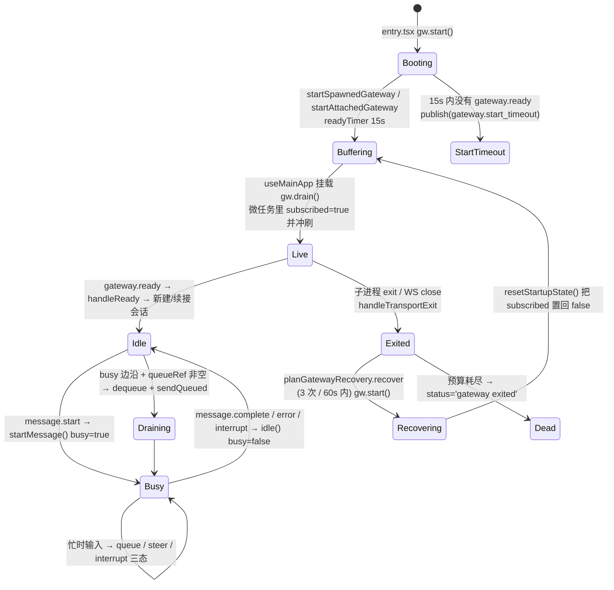

# r10-ui-tui-core —— 终端富客户端主干:一条 JSON-RPC 管子、45 个事件分支、一台会漏电的重连状态机

> 底稿(证据层,求全求证)。片名 **D · ui-tui 客户端主干**,清单
> `data/r10/slices/D.txt`,82 个文件 / 18,000 行,路径相对基线
> `/home/user/hermes-agent`,引用后缀 `@ 863e313`。
> 层级判定:**L2 结构级理解**(读接口面,不逐个读实现体)。

---

## §1 这一片是什么

`ui-tui` 是 Hermes 的**终端富交互客户端**。它不是一个 Python 程序,而是一个
**TypeScript / React 程序**:用一个自家 fork 的 `@hermes/ink` 渲染器把 React 组件树
"渲染"成终端字符(Ink = React-for-terminal,把 `<Box>`/`<Text>` 布局成 ANSI 转义序列
写到 stdout,而不是写成 DOM)。

它自己**不跑 agent**。屏幕归 TypeScript,会话/工具/模型调用归 Python。两边靠一条
**换行分隔的 JSON-RPC 2.0 管子**说话:客户端 `spawn` 一个
`python -m tui_gateway.entry` 子进程,请求走子进程 stdin、响应与事件走 stdout、
子进程 stderr 被吞进一个内存环形缓冲(`/logs` 能看)。还有一个**附着模式**
(attach):设了 `HERMES_TUI_GATEWAY_URL` 就不 spawn,而是连一个已经在跑的
WebSocket 网关(桌面端/dashboard 嵌入 PTY 时用)。

这一片是它的**主干**——八个子目录加 `src/` 直属文件:

| 目录 | 是什么 |
|---|---|
| `src/`(直属) | 进程入口、网关客户端、线协议类型、主题、横幅、共享类型 |
| `src/app/` | 应用层:事件处理器、回合控制器、三个 nanostore(轻量状态原子库)、会话生命周期、提交流水线、输入分发、slash 命令表 |
| `src/sdk/` | **widget app SDK**:一套让"终端小面板"作为第三方插件注册进来的契约 + 宿主 + 4 个参考 app |
| `src/hooks/` | React hook 层:补全、git 分支、输入历史、消息队列、虚拟滚动 |
| `src/config/` | 三张纯常量表:环境变量解析、尺寸上限、时序常数 |
| `src/domain/` | 纯函数域逻辑(无 React、无 IO):附件 token、区块布局、详情模式、消息、路径、provider、role、slash 解析、用量、视口 |
| `src/protocol/` | 两条正则:`{!cmd}` 内联插值、`[[…]]` 粘贴 token |
| `src/content/` | 文案池:charms / 颜文字 / 运势 / 热键说明 / 占位符 / 安装面板 / 工具动词 |

**这一片不含**:`src/components/`(渲染组件)、`src/lib/`(工具库)、`src/__tests__/`、
`packages/hermes-ink/`(fork 的渲染器)。它们是别的片。

---

## §2 文件清单(82/82 逐个点名)

### 2.1 `src/` 直属(7 个文件 + 1 个类型声明)

| 全路径 | 行 | 角色 |
|---|---|---|
| `ui-tui/src/entry.tsx` | 177 | 进程入口。TTY 门禁 → 复位终端模式 → `new GatewayClient()` + `gw.start()` → 装优雅退出/内存监视 → `ink.render(<App gw={gw}/>)` |
| `ui-tui/src/app.tsx` | 25 | 唯一的顶层组件:调 `useMainApp(gw)`,把返回的六个 prop 包交给 `AppLayout`,并用 `GatewayProvider` 下发网关服务 |
| `ui-tui/src/gatewayClient.ts` | 794 | **本片核心**:子进程/WebSocket 双传输、JSON-RPC 请求-响应配对与超时、事件发布与缓冲重放、日志环、生命周期面包屑 |
| `ui-tui/src/gatewayTypes.ts` | 741 | 线协议的 TypeScript 侧契约:所有 RPC 响应体 interface + `GatewayEvent` 判别联合(46 个事件类型) |
| `ui-tui/src/theme.ts` | 969 | 主题引擎:色板派生(`buildPalette` / `deriveTones`)、明暗检测(`detectLightMode`)、skin→Theme 转换(`fromSkin`)、低色终端归一化 |
| `ui-tui/src/banner.ts` | 93 | ASCII 艺术渲染器,解析 Rich 风格 `[#rrggbb]…[/]` 标记为 `[color, text]` 行 |
| `ui-tui/src/types.ts` | 234 | 客户端共享类型:`Msg`(一条 transcript 行)、`ActiveTool`、`SubagentProgress`、`SessionInfo`、`Usage`、`PanelSection`、`SlashCatalog` 等 |
| `ui-tui/src/types/hermes-ink.d.ts` | 190 | `@hermes/ink` 的手写 `.d.ts`(fork 的渲染器不自带类型):`Key`、`InputEvent`、`ScrollBoxHandle` 等 |

### 2.2 `src/app/` —— 应用层(28 个文件)

**a) 网关与事件**

| 全路径 | 行 | 角色 |
|---|---|---|
| `ui-tui/src/app/createGatewayEventHandler.ts` | 1419 | **事件总分发**:45 个 `case` 的 switch,把网关事件翻译成 store patch / transcript 追加 / RPC 回调;另含主题-终端背景协商(OSC 10/11 探测)与 `gateway.ready` 的启动编排 |
| `ui-tui/src/app/gatewayContext.tsx` | 19 | React context,把 `{gw, rpc}` 下发给深层组件(`useGateway()`) |
| `ui-tui/src/app/gatewayRecovery.ts` | 35 | 纯函数 `planGatewayRecovery`:网关猝死后是否重生+续接的**预算判定**(3 次 / 60s 滑窗) |

**b) 回合与状态(三个 nanostore + 一个控制器类)**

| 全路径 | 行 | 角色 |
|---|---|---|
| `ui-tui/src/app/turnController.ts` | 1092 | 单例类 `TurnController`:流式增量缓冲与节流、工具/推理段落、打断、`message.complete` 收尾、活动带、通知(notice)时序 |
| `ui-tui/src/app/turnStore.ts` | 85 | `$turnState` 原子:当前回合的流式文本/工具/推理/子代理/todo/活动;`useTurnSelector` 用 `useSyncExternalStore` 做窄订阅 |
| `ui-tui/src/app/uiStore.ts` | 51 | `$uiState` 原子:`busy` / `sid` / `status` / `theme` / 显示开关 / usage / notice ——全局单一真相 |
| `ui-tui/src/app/overlayStore.ts` | 163 | `$overlayState` 原子 + `$isBlocked` 派生(有覆盖层时主输入停摆)+ `resetFlowOverlays()`(回合结束只清流程覆盖层,保留用户主动开的) |
| `ui-tui/src/app/delegationStore.ts` | 77 | 子代理并发/深度上限缓存 + `/agents` 折叠段开合状态 |
| `ui-tui/src/app/spawnHistoryStore.ts` | 159 | 已完成 fan-out 快照环(最近 10 个,非空才入),`/replay` `/replay-diff` 的数据源 |
| `ui-tui/src/app/petFlashStore.ts` | 28 | 宠物瞬时表情(wave/jump/failed)+ 爱心 tick + 宠物占位盒 |
| `ui-tui/src/app/inputSelectionStore.ts` | 15 | 当前输入框选区句柄(`collapseToEnd` 等) |
| `ui-tui/src/app/wakeState.ts` | 15 | 进程级布尔:用户是否显式 `/wake off`(重连时不许静默重新武装唤醒词) |

**c) 会话与提交**

| 全路径 | 行 | 角色 |
|---|---|---|
| `ui-tui/src/app/useSessionLifecycle.ts` | 450 | 新建 / 切换(activate)/ 续接(resume)/ 关闭 会话;transcript 水合、in-flight 回合水合、恢复后滚到底、忙时切换守卫 |
| `ui-tui/src/app/useSubmission.ts` | 400 | 提交流水线总管:`submit`(回车)→ `dispatchSubmission`(分流 slash/`!cmd`/队列/插值)→ `send`;并实现 `busy_input_mode` 三态(queue/steer/interrupt) |
| `ui-tui/src/app/submissionCore.ts` | 126 | 从 `useSubmission` 抽出的**无 React 提交内核**:`markSubmitting()` 同步置忙(闭掉 queue 模式竞态)+ `submitPrompt()`(`input.detect_drop` → `prompt.submit`) |
| `ui-tui/src/app/useMainApp.ts` | 1208 | 顶层编排 hook:装配全部子 hook、transcript 状态与虚拟行、`rpc` 包装、`session.active_list` 1.5s 轮询、终端标题、`gw.on('event'/'exit')` 订阅与**崩溃恢复** |
| `ui-tui/src/app/useComposerState.ts` | 497 | 编辑器状态:草稿、多行缓冲、附件 token、剪贴板/图片/路径粘贴、`$EDITOR` 外挂、队列编辑;把 `useQueue`/`useCompletion`/`useInputHistory` 汇成 `ComposerActions` |
| `ui-tui/src/app/useInputHandlers.ts` | 694 | 键盘总路由:阻塞态优先、覆盖层键、滚动键(含 PgUp/PgDn)、语音键、`Ctrl+C/D/L`、审批/sudo/secret 的取消路径 |
| `ui-tui/src/app/useConfigSync.ts` | 381 | 启动拉 `config.get full`、每 5s 轮询 `config.get mtime`;`display.*` 归一化(statusbar / busy_input_mode / mouse_tracking / indicator);MCP 修订号握手(`reload.mcp` 只在 `mcp_rev` 变化且服务端确认已加载后推进 accepted) |

**d) slash 命令子系统(10 个文件)**

| 全路径 | 行 | 角色 |
|---|---|---|
| `ui-tui/src/app/createSlashHandler.ts` | 179 | slash 分发:本地表 → widget 注册表 → 服务端 catalog 别名/前缀消歧 → `slash.exec` → 失败回落 `command.dispatch`;并处理 5 种 dispatch 结果类型 |
| `ui-tui/src/app/slash/registry.ts` | 26 | 拼 `SLASH_COMMANDS`(8 个命令文件)+ `findSlashCommand` 大小写无关查表(含别名) |
| `ui-tui/src/app/slash/types.ts` | 21 | `SlashCommand` 契约 + `SlashRunCtx`(带 `stale()` 陈旧守卫、`guarded` 包装) |
| `ui-tui/src/app/slash/commands/core.ts` | 769 | 25 条通用命令(`/help` `/quit` `/clear` `/details` `/statusbar` `/queue` `/logs` `/save` `/undo` `/retry` `/steer` `/status` `/title` …) |
| `ui-tui/src/app/slash/commands/session.ts` | 739 | 18 条会话/代理命令(`/model` `/sessions` `/background` `/image` `/compress` `/branch` `/voice` `/skin` `/yolo` `/usage` …) |
| `ui-tui/src/app/slash/commands/ops.ts` | 762 | 13 条运维命令(`/stop` `/reload-mcp` `/reload` `/browser` `/rollback` `/agents` `/replay` `/skills` `/plugins` `/tools` …) |
| `ui-tui/src/app/slash/commands/topup.ts` | 422 | 1 条:`/topup`(充值/自动续费/上限;含 charge 结算轮询状态机) |
| `ui-tui/src/app/slash/commands/subscription.ts` | 176 | 1 条:`/subscription`(别名 `/upgrade`),含 step-up 设备流重试 |
| `ui-tui/src/app/slash/commands/wake.ts` | 132 | 1 条:`/wake on\|off\|status`,把服务端拒绝码翻成人话 |
| `ui-tui/src/app/slash/commands/setup.ts` | 20 | 1 条:`/setup`,委托 `setupHandoff.ts` |
| `ui-tui/src/app/slash/commands/debug.ts` | 115 | 4 条:`/widgets-reload` `/heapdump` `/theme-info` `/mem` |

**e) 其余 app/ 杂件**

| 全路径 | 行 | 角色 |
|---|---|---|
| `ui-tui/src/app/interfaces.ts` | 638 | 本片的**内部接口总表**:`UiState` `OverlayState` `ComposerActions` `GatewayRpc` `GatewayServices` `Notice` `BusyInputMode` `BillingOverlayState` `SubscriptionOverlayState` `TranscriptRow` … |
| `ui-tui/src/app/setupHandoff.ts` | 54 | `/setup` 外挂:挂起 Ink → 跑外部 `hermes setup` → 复查 `setup.status` → 成功则开新会话 |
| `ui-tui/src/app/scroll.ts` | 74 | 滚动时同步文本选区锚点(拖选中滚动不错位),并绕过 ScrollBox 的多帧 pending-delta |
| `ui-tui/src/app/usePet.ts` | 313 | 浮动宠物:从 `busy`/工具/推理/等待输入派生状态,拉 `pet.cells` 精灵图,算占位盒 |
| `ui-tui/src/app/useBatteryPoll.ts` | 77 | 30s 轮询 `system.battery`,归一化成 `BatteryInfo` 进 `$uiState` |
| `ui-tui/src/app/useLongRunToolCharms.ts` | 69 | 工具跑过 8s 起、每 10s、每工具最多 2 条,往活动带推一句安慰话 |

### 2.3 `src/sdk/` —— widget app SDK(11 个文件)

| 全路径 | 行 | 角色 |
|---|---|---|
| `ui-tui/src/sdk/index.ts` | 69 | SDK 的唯一导入面:重导出布局/主题/图表/overlay 原语 + app 契约 + 宿主 API |
| `ui-tui/src/sdk/types.ts` | 83 | `WidgetApp` 契约(`init`/`reduce`/`render`,`modal` vs `ambient`,`AmbientZone` 六个位)+ `WidgetInput` + `isCtrl` |
| `ui-tui/src/sdk/registry.ts` | 20 | 全局 `Map<id, WidgetApp>`:`defineWidgetApp`(后写覆盖)/`getWidgetApp`/`removeWidgetApp`/`listWidgetApps`。**注册表即目录**,slash 与补全都从它派生 |
| `ui-tui/src/sdk/host.tsx` | 286 | 宿主:`launchWidget`/`openWidget`/`updateWidget`/`closeWidget`/`dispatchWidgetInput` + modal 槽 + ambient dock/rail 渲染与宽度预留 |
| `ui-tui/src/sdk/userWidgets.ts` | 213 | 用户 widget 热加载:扫 `$HERMES_HOME/tui-widgets/*.mjs`,把 `widgetSdk` **注入** `register(sdk)`(用户文件没有可解析的 import 路径),文件删除即反注册,`fs.watch` 热重载 |
| `ui-tui/src/sdk/apps/index.ts` | 13 | 引入即注册:导入本模块触发 4 个内置 app 的 `defineWidgetApp`,并顺带启动用户 widget 扫描/监视 |
| `ui-tui/src/sdk/apps/gridTest.tsx` | 207 | 参考 app `/grid-test`:网格布局压测(areas / nested / streams / zoom) |
| `ui-tui/src/sdk/apps/gridTestState.ts` | 24 | `/grid-test` 的状态类型,单独放避免渲染组件与 app 定义的循环引用 |
| `ui-tui/src/sdk/apps/dialogTest.tsx` | 66 | 参考 app `/dialog-test`:遍历 9 个 `OverlayZone` 的对话框定位演示 |
| `ui-tui/src/sdk/apps/ticker.tsx` | 92 | 参考 app `/ticker`:ambient 动画范例(组件自持动画,app 状态只有 symbol) |
| `ui-tui/src/sdk/apps/weather.tsx` | 203 | 参考 app `/weather`:异步契约范例(`init` 返回 loading 并发起请求,结果经 `updateWidget` 落地,已关闭则 no-op) |

### 2.4 `src/hooks/`(5 个)

| 全路径 | 行 | 角色 |
|---|---|---|
| `ui-tui/src/hooks/useCompletion.ts` | 167 | Tab 补全:60ms 去抖,输入形状决定走 `complete.slash` 还是 `complete.path`;把本地 widget app 合并进 `/` 补全;行内 `/skill` 引用只留 `kind === 'skill'` |
| `ui-tui/src/hooks/useQueue.ts` | 111 | 忙时消息队列:`queueRef`(ref,不触发渲染)+ `queuedDisplay`(渲染用)+ 队列编辑下标;`enqueue`/`dequeue`/`prependQ`/`takeQ`/`removeQ` |
| `ui-tui/src/hooks/useVirtualHistory.ts` | 689 | transcript 虚拟滚动:行高估算/量测缓存、overscan、粘底、resize 后重量测 |
| `ui-tui/src/hooks/useInputHistory.ts` | 11 | 11 行薄壳,包 `lib/history.ts` 的磁盘输入历史 |
| `ui-tui/src/hooks/useGitBranch.ts` | 72 | `execFile` 探当前 git 分支,喂状态栏 |

### 2.5 `src/config/`(3 个,纯常量)

| 全路径 | 行 | 角色 |
|---|---|---|
| `ui-tui/src/config/env.ts` | 75 | 启动期环境变量解析:`HERMES_TUI_RESUME/QUERY/IMAGE`、鼠标追踪三级优先、Termux/dashboard/inline/FPS/dev-credits 开关 |
| `ui-tui/src/config/limits.ts` | 26 | 尺寸上限:`MAX_HISTORY=800`、`LIVE_RENDER_MAX_CHARS=16_000`、`VERBOSE_TRAIL_MAX_CHARS=800`、`WHEEL_SCROLL_STEP=1` |
| `ui-tui/src/config/timing.ts` | 20 | 时序常数:流式批 16ms / 打字时 80ms / 滚动时 96ms、resize 合并 32ms、双 Esc 500ms |

### 2.6 `src/domain/`(10 个,纯函数)

| 全路径 | 行 | 角色 |
|---|---|---|
| `ui-tui/src/domain/slash.ts` | 136 | slash 解析与补全应用:`looksLikeSlashCommand`、`parseSlashCommand`、`inlineSlashTrigger`(行内 `/skill` 引用)、`sessionScopedModelArg` |
| `ui-tui/src/domain/blockLayout.ts` | 150 | transcript 区块分组(`BlockGroup` 8 类)、相邻块间距(`hasLeadGap`)、"这条消息会不会渲染出东西"(`blockRenders`) |
| `ui-tui/src/domain/messages.ts` | 107 | `introMsg`、后端 transcript 行 → `Msg[]`(`toTranscriptMessages`)、时长格式化 |
| `ui-tui/src/domain/details.ts` | 76 | 详情可见性:4 个 section 名、三档模式(hidden/collapsed/expanded)、`sectionMode` 逐段解析 |
| `ui-tui/src/domain/paths.ts` | 68 | cwd/分支/项目名的截断与拼接、终端标签标题组装 |
| `ui-tui/src/domain/attachments.ts` | 60 | `[[ Image N ]]` token 的生成/回收/展开——删掉 token 就是取消附件 |
| `ui-tui/src/domain/viewport.ts` | 51 | 由行偏移二分求视口内的首个用户消息(粘性提示条) |
| `ui-tui/src/domain/providers.ts` | 11 | 同名 provider 加 slug 后缀去重显示 |
| `ui-tui/src/domain/roles.ts` | 9 | 4 个 role → 主题色/字形/前缀 |
| `ui-tui/src/domain/usage.ts` | 3 | `ZERO` 用量常量 |

### 2.7 `src/protocol/`(2 个)

| 全路径 | 行 | 角色 |
|---|---|---|
| `ui-tui/src/protocol/interpolation.ts` | 3 | `{!cmd}` 内联 shell 插值的正则 + 探测 |
| `ui-tui/src/protocol/paste.ts` | 1 | `[[…]]` 粘贴 token 正则(一行) |

### 2.8 `src/content/`(7 个,文案池)

| 全路径 | 行 | 角色 |
|---|---|---|
| `ui-tui/src/content/hotkeys.ts` | 39 | 平台感知的热键说明表(mac / 远程 shell 各一套) |
| `ui-tui/src/content/verbs.ts` | 38 | 工具名 → 动词(browser→browsing)+ 通用动词池 |
| `ui-tui/src/content/fortunes.ts` | 30 | `/fortune` 语料 + 按日期哈希的"今日运势" |
| `ui-tui/src/content/faces.ts` | 17 | 15 个颜文字 |
| `ui-tui/src/content/setup.ts` | 17 | "Setup Required" 面板内容(标题 + 三条动作) |
| `ui-tui/src/content/placeholders.ts` | 13 | 输入框占位符池 |
| `ui-tui/src/content/charms.ts` | 1 | 3 句长跑安慰话(一行) |

**点名数:82 / 82。**

---

## §3 接缝穷举

### 3.1 接缝 A —— 客户端发出的 RPC 方法名(82 条)

**关键结构事实:`gatewayClient.ts` 里没有任何方法名。** 它只暴露一个泛型
`request(method, params)`;方法名全在调用点。

`ui-tui/src/gatewayClient.ts:724 @ 863e313`

```ts
  request<T = unknown>(method: string, params: Record<string, unknown> = {}): Promise<T> {
    const attachUrl = resolveGatewayAttachUrl()

    if (attachUrl) {
      if (this.attachUrl !== attachUrl) {
```

所以"gatewayClient 发出的全部 RPC 方法名"= 全 `ui-tui/src` 里所有经这条管子发出的方法名。
共有 **4 层包装**,穷举必须全覆盖:

| 包装 | 定义处 | 形状 |
|---|---|---|
| 裸调用 | `ui-tui/src/gatewayClient.ts:724`:`request<T = unknown>(method: string, params: Record<string, unknown> = {}): Promise<T> {` | `gw.request('x', {…})` |
| `rpc`(吞错并 sys 报错) | `ui-tui/src/app/useMainApp.ts:488`:`const rpc: GatewayRpc = useCallback(` | `rpc('x', {…})` |
| `quietRpc`(吞错并返回 null) | `ui-tui/src/app/useConfigSync.ts:120`:`const quietRpc = async <T extends Record<string, any> = Record<string, any>>(` | `quietRpc(gw, 'x', {…})` |
| `respondWith`(成功才跑回调) | `ui-tui/src/app/useMainApp.ts:926`:`const respondWith = useCallback(` | `respondWith('x', {…}, done)` |

另有**唯一一处动态方法名**:`ui-tui/src/hooks/useCompletion.ts:116` 传的是
`request.method`,取值由 `completionRequestForInput` 返回,只可能是
`complete.path` / `complete.slash`(`ui-tui/src/hooks/useCompletion.ts:32-33` 的联合类型钉死)。

`ui-tui/src/hooks/useCompletion.ts:29 @ 863e313`

```ts
export function completionRequestForInput(
  input: string
):
  | { method: 'complete.path'; params: { word: string }; replaceFrom: number }
  | { method: 'complete.slash'; params: { text: string }; replaceFrom: number; skillsOnly?: boolean }
  | null {
```

**机械枚举命令**(直接字面量 80 + 动态 2 = 82):

```verify
cd /home/user/hermes-agent
{ grep -rhoE "\b(gw\.request|request|rpc|quietRpc|respondWith)(<[^()]*>)?\(\s*(gw,\s*)?'[a-z_]+(\.[a-z_]+)+'" \
    ui-tui/src --include=*.ts --include=*.tsx --exclude-dir=__tests__ \
    | sed -E "s/.*'([a-z_.]+)'/\1/"
  grep -hoE "method: '(complete\.[a-z]+)'" ui-tui/src/hooks/useCompletion.ts \
    | sed -E "s/.*'([a-z_.]+)'/\1/"
} | sort -u | tee /tmp/cli.txt | wc -l
# → 82
```

**完整 82 条**(`*` = 首个调用点在本片外,即 `ui-tui/src/components/` 那一片;条数 = 全 `ui-tui/src` 里该名字的调用点数):

| # | 方法 | 首个调用点 | 点数 |
|---|---|---|---|
| 1 | `approval.respond` | `ui-tui/src/app/useInputHandlers.ts:182` | 2 |
| 2 | `billing.auto_reload` | `ui-tui/src/app/slash/commands/topup.ts:320` | 1 |
| 3 | `billing.charge` | `ui-tui/src/app/slash/commands/topup.ts:345` | 1 |
| 4 | `billing.charge_status` | `ui-tui/src/app/slash/commands/topup.ts:231` | 1 |
| 5 | `billing.state` | `ui-tui/src/app/slash/commands/subscription.ts:68` | 3 |
| 6 | `billing.step_up` | `ui-tui/src/app/slash/commands/subscription.ts:109` | 2 |
| 7 | `browser.manage` | `ui-tui/src/app/slash/commands/ops.ts:168` | 1 |
| 8 | `clarify.respond` | `ui-tui/src/app/useMainApp.ts:681` | 1 |
| 9 | `clipboard.paste` | `ui-tui/src/app/useComposerState.ts:217` | 1 |
| 10 | `command.dispatch` | `ui-tui/src/app/createSlashHandler.ts:164` | 1 |
| 11 | `commands.catalog` | `ui-tui/src/app/createGatewayEventHandler.ts:633` | 2 |
| 12 | `complete.path` | `ui-tui/src/hooks/useCompletion.ts:116`(动态) | 1 |
| 13 | `complete.slash` | `ui-tui/src/hooks/useCompletion.ts:116`(动态) | 1 |
| 14 | `config.get` | `ui-tui/src/app/createGatewayEventHandler.ts:474` | 11 |
| 15 | `config.set` | `ui-tui/src/app/slash/commands/core.ts:179` | 19 |
| 16 | `delegation.pause` | `ui-tui/src/components/agentsOverlay.tsx:726` * | 2 |
| 17 | `delegation.status` | `ui-tui/src/app/createGatewayEventHandler.ts:539` | 2 |
| 18 | `image.attach` | `ui-tui/src/app/createGatewayEventHandler.ts:596` | 3 |
| 19 | `image.detach` | `ui-tui/src/app/useComposerState.ts:172` | 1 |
| 20 | `input.detect_drop` | `ui-tui/src/app/submissionCore.ts:117` | 2 |
| 21 | `learning.delete` | `ui-tui/src/components/journey.tsx:193` * | 1 |
| 22 | `learning.detail` | `ui-tui/src/components/journey.tsx:219` * | 1 |
| 23 | `learning.edit` | `ui-tui/src/components/journey.tsx:231` * | 1 |
| 24 | `learning.frames` | `ui-tui/src/components/journey.tsx:163` * | 1 |
| 25 | `model.disconnect` | `ui-tui/src/components/modelPicker.tsx:272` * | 1 |
| 26 | `model.options` | `ui-tui/src/components/modelPicker.tsx:69` * | 1 |
| 27 | `model.save_key` | `ui-tui/src/components/modelPicker.tsx:212` * | 1 |
| 28 | `paste.collapse` | `ui-tui/src/app/useComposerState.ts:294` | 1 |
| 29 | `pet.cells` | `ui-tui/src/app/usePet.ts:197` | 1 |
| 30 | `pet.gallery` | `ui-tui/src/components/petPicker.tsx:48` * | 1 |
| 31 | `pet.select` | `ui-tui/src/components/petPicker.tsx:78` * | 1 |
| 32 | `plugins.manage` | `ui-tui/src/components/pluginsHub.tsx:59` * | 2 |
| 33 | `process.stop` | `ui-tui/src/app/slash/commands/ops.ts:70` | 1 |
| 34 | `prompt.background` | `ui-tui/src/app/slash/commands/session.ts:89` | 1 |
| 35 | `prompt.submit` | `ui-tui/src/app/submissionCore.ts:82` | 1 |
| 36 | `reload.env` | `ui-tui/src/app/slash/commands/ops.ts:134` | 1 |
| 37 | `reload.mcp` | `ui-tui/src/app/slash/commands/ops.ts:103` | 3 |
| 38 | `rollback.diff` | `ui-tui/src/app/slash/commands/ops.ts:248` | 1 |
| 39 | `rollback.list` | `ui-tui/src/app/slash/commands/ops.ts:214` | 1 |
| 40 | `rollback.restore` | `ui-tui/src/app/slash/commands/ops.ts:268` | 1 |
| 41 | `secret.respond` | `ui-tui/src/app/useInputHandlers.ts:128` | 2 |
| 42 | `session.activate` | `ui-tui/src/app/useSessionLifecycle.ts:317` | 1 |
| 43 | `session.active_list` | `ui-tui/src/app/useMainApp.ts:581` | 2 |
| 44 | `session.branch` | `ui-tui/src/app/slash/commands/session.ts:279` | 1 |
| 45 | `session.close` | `ui-tui/src/app/useSessionLifecycle.ts:165` | 1 |
| 46 | `session.compress` | `ui-tui/src/app/slash/commands/session.ts:223` | 1 |
| 47 | `session.create` | `ui-tui/src/app/useSessionLifecycle.ts:229` | 1 |
| 48 | `session.delete` | `ui-tui/src/components/activeSessionSwitcher.tsx:512` * | 1 |
| 49 | `session.interrupt` | `ui-tui/src/app/turnController.ts:299` | 1 |
| 50 | `session.list` | `ui-tui/src/components/activeSessionSwitcher.tsx:357` * | 1 |
| 51 | `session.most_recent` | `ui-tui/src/app/createGatewayEventHandler.ts:694` | 1 |
| 52 | `session.resume` | `ui-tui/src/app/useSessionLifecycle.ts:369` | 1 |
| 53 | `session.save` | `ui-tui/src/app/slash/commands/core.ts:553` | 1 |
| 54 | `session.status` | `ui-tui/src/app/slash/commands/core.ts:237` | 1 |
| 55 | `session.steer` | `ui-tui/src/app/slash/commands/core.ts:706` | 2 |
| 56 | `session.title` | `ui-tui/src/app/slash/commands/core.ts:255` | 3 |
| 57 | `session.undo` | `ui-tui/src/app/slash/commands/core.ts:730` | 2 |
| 58 | `session.usage` | `ui-tui/src/app/slash/commands/session.ts:649` | 1 |
| 59 | `setup.status` | `ui-tui/src/app/setupHandoff.ts:43` | 3 |
| 60 | `shell.exec` | `ui-tui/src/app/useSubmission.ts:109` | 2 |
| 61 | `skills.manage` | `ui-tui/src/components/skillsHub.tsx:33` * | 8 |
| 62 | `skills.reload` | `ui-tui/src/app/slash/commands/ops.ts:465` | 1 |
| 63 | `slash.exec` | `ui-tui/src/app/createSlashHandler.ts:151` | 5 |
| 64 | `spawn_tree.list` | `ui-tui/src/app/slash/commands/ops.ts:349` | 1 |
| 65 | `spawn_tree.load` | `ui-tui/src/app/slash/commands/ops.ts:385` | 1 |
| 66 | `spawn_tree.save` | `ui-tui/src/app/createGatewayEventHandler.ts:447` | 1 |
| 67 | `subagent.interrupt` | `ui-tui/src/components/agentsOverlay.tsx:705` * | 1 |
| 68 | `subscription.change` | `ui-tui/src/app/slash/commands/subscription.ts:124` | 2 |
| 69 | `subscription.preview` | `ui-tui/src/app/slash/commands/subscription.ts:99` | 1 |
| 70 | `subscription.resume` | `ui-tui/src/app/slash/commands/subscription.ts:119` | 1 |
| 71 | `subscription.state` | `ui-tui/src/app/slash/commands/subscription.ts:104` | 2 |
| 72 | `subscription.upgrade` | `ui-tui/src/app/slash/commands/subscription.ts:135` | 1 |
| 73 | `sudo.respond` | `ui-tui/src/app/useInputHandlers.ts:119` | 2 |
| 74 | `system.battery` | `ui-tui/src/app/slash/commands/core.ts:644` | 2 |
| 75 | `terminal.resize` | `ui-tui/src/app/useMainApp.ts:656` | 1 |
| 76 | `tools.configure` | `ui-tui/src/app/slash/commands/ops.ts:734` | 1 |
| 77 | `voice.record` | `ui-tui/src/app/createGatewayEventHandler.ts:992` | 2 |
| 78 | `voice.toggle` | `ui-tui/src/app/createGatewayEventHandler.ts:991` | 2 |
| 79 | `wake.resume` | `ui-tui/src/app/createGatewayEventHandler.ts:973` | 3 |
| 80 | `wake.start` | `ui-tui/src/app/createGatewayEventHandler.ts:630` | 2 |
| 81 | `wake.status` | `ui-tui/src/app/slash/commands/wake.ts:106` | 1 |
| 82 | `wake.stop` | `ui-tui/src/app/slash/commands/wake.ts:87` | 1 |

### 3.2 接缝 B —— `createGatewayEventHandler.ts` 处理的事件类型(45 条)

**机械枚举命令**:

```verify
cd /home/user/hermes-agent
grep -oE "^      case '[a-z_.]+'" ui-tui/src/app/createGatewayEventHandler.ts \
  | sed -E "s/.*'([a-z_.]+)'/\1/" | sort -u | tee /tmp/handled.txt | wc -l
# → 45
# 反查:文件里的 case 行总数,以及有没有落在 6 空格缩进之外的
grep -cE "case '" ui-tui/src/app/createGatewayEventHandler.ts   # → 45(说明没有漏)
grep -nE "case '" ui-tui/src/app/createGatewayEventHandler.ts | grep -vcE "^[0-9]+:      case '"  # → 0
```

**完整 45 条**,按 switch 里出现顺序,附行号与该分支干了什么:

| # | 事件 | 行 | 处理动作 |
|---|---|---|---|
| 1 | `gateway.ready` | 725 | `handleReady(skin)`:应用 skin → 拉 config → `wake.start` → `commands.catalog` → 三路启动编排(崩溃续接 / `HERMES_TUI_RESUME` / auto-resume-recent 或新建) |
| 2 | `skin.changed` | 730 | `applySkin` 热换主题 + 重绘终端默认前/背景 |
| 3 | `session.info` | 736 | 写 `$uiState.info` / `usage`,并把 intro 消息里的 info 换掉 |
| 4 | `thinking.delta` | 751 | 忙时才收;调度状态行文本(16ms 批) |
| 5 | `message.start` | 770 | 重置本回合 /agents nudge + `turnController.startMessage()`(置 `busy: true`) |
| 6 | `status.update` | 775 | 按 `kind` 分流:`goal` 落 transcript、`compressing` 落 transcript、其余进活动带 |
| 7 | `notification.show` | 824 | `turnController.showNotice`(忙时暂存,回合结束再显示) |
| 8 | `notification.clear` | 847 | 按 key 匹配才清 |
| 9 | `billing.step_up.verification` | 853 | 把设备流链接落 transcript 并尝试用系统浏览器打开 |
| 10 | `gateway.stderr` | 879 | 截 120 字进活动带 |
| 11 | `browser.progress` | 887 | 落 transcript |
| 12 | `voice.status` | 897 | 三态映射到录音/转写标志 |
| 13 | `voice.transcript` | 916 | stop_phrase / no_speech_limit / 正常转写(清输入后 defer 提交) |
| 14 | `wake.detected` | 961 | 多 profile 路由检查 → 可选新建会话 → `voice.toggle` + `voice.record` |
| 15 | `gateway.start_timeout` | 1002 | 状态置超时 + 把最近 8 行 stderr 推进活动带 |
| 16 | `gateway.protocol_error` | 1031 | 一次性"协议噪音"提示 + preview 截 120 字 |
| 17 | `reasoning.delta` | 1046 | `recordReasoningDelta` |
| 18 | `reasoning.available` | 1053 | `recordReasoningAvailable` |
| 19 | `moa.reference` | 1058 | `recordMoaReference`(混合专家的参考回答段) |
| 20 | `moa.aggregating` | 1068 | 空分支(仅状态过渡,不落 transcript) |
| 21 | `moa.progress` | 1073 | 活动带原地替换 "MoA: refs n/m" |
| 22 | `moa.phase` | 1083 | `phase === 'aggregator'` 时换成 "MoA: aggregating…" |
| 23 | `tool.progress` | 1092 | `recordToolProgress`(**见 §6 ■-1:tui_gateway 从不发这个事件**) |
| 24 | `tool.generating` | 1099 | 推 trail "drafting X…" |
| 25 | `reaction` | 1106 | 爱心 tick + 宠物 jump |
| 26 | `tool.start` | 1114 | 记 todos + `recordToolStart` |
| 27 | `tool.complete` | 1124 | clarify 特判(冲刷被放弃的 clarify)+ inline diff 分支 / 普通分支 |
| 28 | `clarify.request` | 1162 | 开 clarify 覆盖层 + 状态 "waiting for input…" |
| 29 | `approval.request` | 1169 | 开审批覆盖层(allow_permanent 只有显式 false 才去掉"永久允许") |
| 30 | `sudo.request` | 1188 | 开 sudo 覆盖层 |
| 31 | `secret.request` | 1194 | 开 secret 覆盖层 |
| 32 | `sudo.expire` | 1202 | request_id 匹配才关 |
| 33 | `secret.expire` | 1207 | request_id 匹配才关 |
| 34 | `background.complete` | 1212 | 移除后台任务 + 落 transcript |
| 35 | `review.summary` | 1217 | 自我改进复盘摘要落 transcript |
| 36 | `subagent.spawn_requested` | 1232 | upsert(保终态)+ 首次委派 nudge + 拉 `delegation.status` |
| 37 | `subagent.start` | 1250 | upsert(保终态)+ nudge |
| 38 | `subagent.thinking` | 1260 | upsert,`createIfMissing: false`(不复活已冲刷的子代理) |
| 39 | `subagent.tool` | 1281 | 同上,拼工具调用行 |
| 40 | `subagent.progress` | 1299 | 同上,追加 note |
| 41 | `subagent.complete` | 1318 | 同上,归一化终态 |
| 42 | `message.delta` | 1331 | `recordMessageDelta` |
| 43 | `message.interim` | 1335 | `recordInterimMessage` |
| 44 | `message.complete` | 1345 | 收尾:落最终消息、宠物表情、响铃、写 usage、账单墙确认框 |
| 45 | `error` | 1398 | 记错 + 宠物 failed;`No LLM provider configured` 特判成 Setup 面板 |

**switch 之前有一道会话过滤闸**——`ui-tui/src/app/createGatewayEventHandler.ts:717 @ 863e313`:

```ts
  return (ev: GatewayEvent) => {
    const sid = getUiState().sid

    if (ev.session_id && sid && ev.session_id !== sid && !ev.type.startsWith('gateway.')) {
      return
    }
```

即:带 `session_id` 且与当前会话不符的事件被丢弃,但 `gateway.*` 前缀豁免
(网关级事件不属于任何会话)。

### 3.3 接缝 C —— slash 命令表(64 条命令 + 19 个别名 = 83 个查表键)

```verify
cd /home/user/hermes-agent
grep -chE "^    run:" ui-tui/src/app/slash/commands/*.ts | paste -sd+ | bc          # → 64
grep -hoE "aliases: \[[^]]*\]" ui-tui/src/app/slash/commands/*.ts \
  | grep -oE "'[a-z_-]+'" | wc -l                                                  # → 19
```

分文件:`core.ts` 25、`session.ts` 18、`ops.ts` 13、`debug.ts` 4、
`setup.ts` / `subscription.ts` / `topup.ts` / `wake.ts` 各 1。

全部 64 个名字(字典序):`agents` `background` `battery` `branch` `browser` `busy`
`clear` `compress` `copy` `density` `details` `fast` `focus` `fortune` `heapdump`
`help` `history` `image` `indicator` `journey` `logs` `mem` `model` `mouse` `paste`
`personality` `pet` `plugins` `prompt` `queue` `quit` `reasoning` `redraw` `reload`
`reload-mcp` `reload-skills` `replay` `replay-diff` `retry` `rollback` `save`
`sessions` `setup` `skills` `skin` `status` `statusbar` `steer` `stop` `subscription`
`terminal-setup` `theme` `theme-info` `title` `tools` `topup` `undo` `update` `usage`
`verbose` `voice` `wake` `widgets-reload` `yolo`

19 个别名:`exit` `scroll` `new` `detail` `compose` `sb` `q` `reload_mcp` `tasks`
`learning` `memory-graph` `reload_skills` `bg` `btw` `switch` `session` `resume`
`fork` `upgrade`

装配顺序(决定同名冲突时谁赢)—— `ui-tui/src/app/slash/registry.ts:11 @ 863e313`:

```ts
export const SLASH_COMMANDS: SlashCommand[] = [
  ...coreCommands,
  ...topupCommands,
  ...sessionCommands,
  ...subscriptionCommands,
  ...opsCommands,
  ...wakeCommands,
  ...setupCommands,
  ...debugCommands
]
```

### 3.4 接缝 D —— widget app 注册表(4 个内置 + 无上限的用户 app)

```verify
cd /home/user/hermes-agent
grep -hcE "^  id: '" ui-tui/src/sdk/apps/*.tsx | paste -sd+ | bc   # → 4
grep -n "id: '" ui-tui/src/sdk/apps/*.tsx
# ui-tui/src/sdk/apps/dialogTest.tsx:37:  id: 'dialog-test',
# ui-tui/src/sdk/apps/gridTest.tsx:92:  id: 'grid-test',
# ui-tui/src/sdk/apps/ticker.tsx:69:  id: 'ticker',
# ui-tui/src/sdk/apps/weather.tsx:132:  id: 'weather',
```

内置 4 个:`dialog-test`(9 个 overlay zone 演示)、`grid-test`(网格压测)、
`ticker`(ambient 动画范例)、`weather`(异步范例)。
用户 app 数量不定:`ui-tui/src/sdk/userWidgets.ts` 扫 `$HERMES_HOME/tui-widgets/*.mjs`。

`WidgetApp` 契约面(`ui-tui/src/sdk/types.ts:47-63`)共 9 个字段:
`id` `help` `mode?`(modal|ambient)`zone?`(6 个位)`width?` `init(arg)`
`reduce(state, input)` `render(ctx)` `usage?`。
宿主对核心只暴露 4 个触点:`launchWidget` / `dispatchWidgetInput` / modal 槽
(`ActiveWidgetSlot`)/ ambient 面(`AmbientDock`+`AmbientRail`)。

`ui-tui/src/sdk/types.ts:47 @ 863e313`

```ts
  zone?: AmbientZone
  /** Card width in cells (ambient). Floats RESERVE this as a transcript
   *  rail, so match your Dialog width. Default 44. */
  width?: number
  init(arg: string): null | S
  reduce(state: S, input: WidgetInput): null | S
  render(ctx: WidgetRenderCtx<S>): ReactNode
  usage?: string
}

/**
 * Where an ambient widget lives. Two placement families:
 *
 * DOCKS are in-FLOW chrome rows (they reserve real rows, never cover
 * content): `dock-top` under the top status bar, `dock-bottom` above the
 * bottom one. Each dock is a right-aligned row of cards.
 *
```

### 3.5 接缝 E —— 客户端**发出**的本地事件(1 条)

`gatewayClient.publishLocalEvent()` 让客户端把自己造的事件既送给本地订阅者、
又镜像给 sidecar WebSocket。全 `ui-tui/src` 只有一个使用者:

```verify
cd /home/user/hermes-agent
grep -rn "publishLocalEvent" ui-tui/src --include=*.ts --include=*.tsx | grep -v __tests__
# ui-tui/src/gatewayClient.ts:315 (定义)
# ui-tui/src/app/useInputHandlers.ts:614, :622 (唯二调用点,同一事件类型)
```

事件类型只有 `dashboard.new_session_requested`。消费者在 **web 侧**:
`web/src/components/ChatSidebar.tsx:367`。即:嵌入 dashboard 的 TUI 用 Ctrl+C/Ctrl+D
空闲退出时,通过 sidecar 镜像通道通知浏览器侧"该开新会话了"。

---

## §3-bis 与服务端对账

服务端方法表在 `tui_gateway/`,注册靠两个装饰器:`@method("名")`(133 个)与
`@_projects_method("名")`(11 个,后者内部再包一层 `@method(name)`,
见 `tui_gateway/server.py:11200-11226`);`methods_*.py` 用
`tui_gateway/method_ctx.py` 的 `HandlerRegistry.method` 做延迟注册,
`install()` 时把 handler 的 `__globals__` 重绑到 `server.py` 的命名空间。

`tui_gateway/server.py:11200 @ 863e313`

```python
def _projects_method(name: str):
    """Register a projects RPC, injecting (pdb, conn) and unifying error mapping.

    Every project CRUD handler opened the per-profile DB, mapped a missing id to
    5062, bad args to 5063, and everything else to 5061. This collapses that
    boilerplate so each handler is just its one meaningful operation.
    """

    def decorator(fn):
        @method(name)
        def handler(rid, params: dict) -> dict:
            try:
                from hermes_cli import projects_db as pdb
```

```verify
cd /home/user/hermes-agent
grep -rhoE "@(_projects_)?method\(['\"][a-z_.]+['\"]\)" tui_gateway/*.py \
  | sed -E "s/.*\(['\"]([a-z_.]+)['\"]\).*/\1/" | sort -u | tee /tmp/srv.txt | wc -l
# → 144
comm -23 /tmp/cli.txt /tmp/srv.txt | wc -l   # 客户端调了服务端没有的 → 0
comm -13 /tmp/cli.txt /tmp/srv.txt | wc -l   # 服务端有客户端从不调 → 62
```

### (i) 客户端调了服务端没有的方法:**0 条**

82 个客户端方法名全部命中 144 个服务端注册名。这是可机械复现的强结论
(搜索面:`ui-tui/src` 全部 `.ts`/`.tsx`,排除 `__tests__`;4 层包装 + 1 处动态名全覆盖,
动态名的取值被 `ui-tui/src/hooks/useCompletion.ts:32-33` 的字面量联合类型钉死)。

### (ii) 服务端有而 ui-tui 从不调:**62 条**

这 62 条**不是死代码**——它们大多有另一个客户端。逐条列出并标注消费者:

**A. 由 `apps/desktop`(桌面客户端)调用:41 条**

| 方法 | 桌面侧调用点 |
|---|---|
| `agents.list` | `apps/desktop/src/app/session/hooks/use-prompt-actions/utils.test.ts` |
| `file.attach` | `apps/desktop/src/app/session/hooks/use-prompt-actions/index.ts` |
| `handoff.fail` / `handoff.request` / `handoff.state` | 同上 |
| `image.attach_bytes` | 同上 |
| `llm.oneshot` | `apps/desktop/src/lib/oneshot.ts` |
| `message.react` | `apps/desktop/src/store/reactions.ts` |
| `pet.cancel` / `pet.generate` / `pet.generate.status` / `pet.hatch` / `pet.remove` / `pet.rename` | `apps/desktop/src/store/pet-generate.ts` |
| `pet.disable` / `pet.export` / `pet.scale` / `pet.thumb` | `apps/desktop/src/store/pet-gallery.ts` |
| `pet.info` / `pet.info.meta` | `apps/desktop/src/components/pet/floating-pet.tsx` |
| `preview.read.respond` / `terminal.read.respond` | `apps/desktop/src/app/session/hooks/use-message-stream/gateway-event.ts` |
| `preview.restart` | `apps/desktop/src/app/session/hooks/use-preview-routing.ts` |
| `process.kill` / `process.list` | `apps/desktop/src/store/composer-status.ts` |
| `projects.add_folder` / `projects.create` / `projects.delete` / `projects.list` / `projects.project_sessions` / `projects.record_repos` / `projects.set_active` / `projects.tree` / `projects.update` | `apps/desktop/src/store/projects.ts` |
| `session.context_breakdown` | `apps/desktop/src/app/shell/context-usage-panel.tsx` |
| `session.cwd.set` | `apps/desktop/src/app/session/hooks/use-cwd-actions.ts` |
| `session.redirect` | `apps/desktop/src/app/chat/session-tile-actions.ts` |
| `session.workspace.move` | `apps/desktop/src/store/projects.ts` |
| `setup.runtime_check` | `apps/desktop/src/store/onboarding.test.ts` |
| `toolsets.list` | `apps/desktop/src/app/skills/index.tsx` |
| `wake.feed` | `apps/desktop/src/lib/wake-client-capture.ts` |
| `wake.pause` | `apps/desktop/src/app/chat/composer/hooks/use-composer-voice.ts` |

**B. web 侧调用:1 条** —— `complete.slash` 也被 `web/src/components/SlashPopover.tsx` 用
(它同时也是 ui-tui 的第 13 条,不计入 62)。此栏实际为空(62 条里没有 web-only 的)。

**C. 全仓找不到任何调用点:19 条(◇-2,见 §6)**

`cli.exec` `command.resolve` `config.show` `cron.manage` `insights.get` `pdf.attach`
`plugins.list` `project.facts` `projects.archive` `projects.discover_repos`
`projects.for_cwd` `projects.get` `projects.remove_folder` `projects.set_primary`
`session.history` `tools.list` `tools.show` `usage.bars` `verification.status` `voice.tts`

**这条负结论的搜索面**(必须写清):以**带引号的字符串字面量** `'名'` / `"名"`
为唯一判据(JSON-RPC 方法名只能以字符串上线),搜索范围 = 全仓
(`--exclude-dir=node_modules --exclude-dir=__pycache__ --exclude-dir=.git`),
**排除** `tui_gateway/`(定义方自己)与 `tests/` `tests-js/`(测试)。

```verify
cd /home/user/hermes-agent
for m in cli.exec command.resolve config.show cron.manage insights.get pdf.attach \
         plugins.list project.facts projects.archive projects.discover_repos \
         projects.for_cwd projects.get projects.remove_folder projects.set_primary \
         session.history tools.list tools.show usage.bars verification.status voice.tts; do
  n=$(grep -rl "['\"]$m['\"]" --exclude-dir=node_modules --exclude-dir=__pycache__ \
        --exclude-dir=.git . 2>/dev/null \
      | grep -v "^./tui_gateway/" | grep -vE "^\./(tests|tests-js)/" | wc -l)
  echo "$m -> $n 个非-tui_gateway/非测试文件"
done
# 全部输出 0
```

**已知局限**(不隐瞒):这 19 条中有 5 条(`projects.archive` `projects.discover_repos`
`projects.for_cwd` `projects.remove_folder` `projects.set_primary`)连**不带引号**的
文本出现都是 0 次,结论最硬;其余 14 条的名字作为**普通标识符**在别处出现
(如 `session.history` 是个 Python 属性、`voice.tts` 是个配置键),
我只能断言"没有以字符串字面量形式发起过 RPC",不能断言"这些字符从未出现"。
另外 **acp_adapter / native / 第三方 MCP 客户端** 理论上可以直接连网关调任意方法,
这条搜索覆盖不到仓外调用方。

### (iii) 同名方法两侧参数形状不一致:**未能机械判定**

我写了一个脚本,把每个客户端调用点的对象字面量键集与对应 handler 体内
`params.get("k")` / `params["k"]` 的键集做差,得到 19 个"客户端发了、handler 没读"的方法。
**逐个复核后发现它们全是假阳性**,分两类:

1. **服务端一层helper间接**:`session_id` / `request_id` / 值参几乎都由共享 helper 读走。
   `tui_gateway/methods_prompt.py:905 @ 863e313`

   ```python
   @method("sudo.respond")
   def _(rid, params: dict) -> dict:
       return _respond(rid, params, "password", allow_expired=True)
   ```

   同理 `approval.respond` 走 `_sess(params, rid)`、`browser.manage` 把整个 `params`
   透传给 `_browser_connect(rid, params)`(那里读 `url`)。脚本只扫 handler 本体,看不见这一层。

2. **客户端模板字面量假阳性**:`ui-tui/src/app/slash/commands/core.ts:344` 的
   `` { key: `details_mode.${first}`, value: … } `` 里的 `${first}` 被键提取正则误当成键名。

`ui-tui/src/app/slash/commands/core.ts:344 @ 863e313`

```ts
          .rpc<ConfigSetResponse>('config.set', { key: `details_mode.${first}`, value: mode ?? '' })
```

**结论:参数形状对账我未能做到机械可复现,因此不出结论。** 这里如实写"未能机械判定",
而不是把 19 条假阳性当发现交出去。要真做,需要一个能跟一层函数间接的
Python AST 分析(把 `_respond` / `_sess` / `_sess_nowait` / `_browser_connect` 等
helper 读的键回填到调用它的 handler),这超出 L2 的读接口面范围,移交(见 §9)。

### (iv) 事件表对账:服务端 63 类,客户端处理 45 类

服务端事件出口不止一个 `_emit`,共 6 个来源。枚举脚本:

```verify
cd /home/user/hermes-agent
python3 - <<'PY'
import re, glob
# 1) tui_gateway 直接发出的事件名(_emit/_event_frame/_block/_broadcast_global_event/_voice_emit,含跨行写法)
pat = re.compile(r'_(?:emit|event_frame|block|broadcast_global_event|voice_emit)\(\s*(?:\n\s*)?["\']([a-z_.]+)["\']')
names = set()
for f in sorted(glob.glob('tui_gateway/*.py')):
    names |= set(pat.findall(open(f).read()))
# 2) _block 超时派生的 .expire(server.py:3136-3145 的白名单)
names |= {n.removesuffix('.request') + '.expire' for n in names
          if n.endswith('.request') and n != 'approval.request'}
# 3) _CHANGE_WATCHES 变更广播(server.py:3380)
names |= set(re.findall(r'"([a-z_.]+\.changed)"', open('tui_gateway/server.py').read()))
# 4) gateway.ready 是裸帧,不走 _emit(entry.py:447 / ws.py:319)
names |= {'gateway.ready'}
# 5) subagent.* 由 event_type 中继(server.py:5519),名字来自 tools/delegate_tool.py
names |= set(re.findall(r'"(subagent\.[a-z_]+)"', open('tools/delegate_tool.py').read()))
# 6) desktop_ui 开放中继(server.py:9334),生产里只有 message.reaction
names |= {'message.reaction'}
handled = set(open('/tmp/handled.txt').read().split())
print("服务端事件类型 =", len(names))
print("TUI 处理但 tui_gateway 不发 =", sorted(handled - names))
print("tui_gateway 发但 TUI 不处理 =", len(names - handled)); print(*sorted(names - handled), sep='\n')
PY
# 服务端事件类型 = 63 / 交集 41 / handled-only 4 / server-only 22
```

**(a) TUI 处理但 `tui_gateway` 从不发:4 条**

| 事件 | 解释 |
|---|---|
| `gateway.stderr` | **客户端自造**:`ui-tui/src/gatewayClient.ts:380`,子进程 stderr 每行合成一个事件 |
| `gateway.protocol_error` | **客户端自造**:`ui-tui/src/gatewayClient.ts:341`(WS 帧)与 `:367`(stdout 行)解析失败时 |
| `gateway.start_timeout` | **客户端自造**:`ui-tui/src/gatewayClient.ts:248`,15s 内没等到 `gateway.ready` |
| `tool.progress` | **既非客户端自造、也非服务端发出 → ■-1(见 §6)** |

前三条正是 switch 前那道会话过滤闸豁免 `gateway.*` 前缀的原因:它们没有 `session_id`。

**(b) `tui_gateway` 发但 TUI 不处理:22 条**

| 事件 | 发出处 | 归属 |
|---|---|---|
| `agent.terminal.output` / `terminal.close` | `tui_gateway/server.py:9298` / `:9308` | 桌面端内嵌终端面板 |
| `terminal.read.request` / `terminal.read.expire` | `tui_gateway/server.py:5672` / `:3143` | 桌面端 `terminal.read.respond` |
| `preview.read.request` / `preview.read.expire` | `tui_gateway/server.py:5682` / `:3143` | 桌面端 `preview.read.respond` |
| `preview.restart.progress` / `preview.restart.complete` | `tui_gateway/methods_prompt.py:841` / `:859` | 桌面端预览面板 |
| `clarify.expire` | `tui_gateway/server.py:3143` | **TUI 处理 sudo/secret 的 expire,却不处理 clarify 的 → ◇-1(见 §6)** |
| `pet.changed` / `cron.changed` / `sessions.changed` / `platforms.changed` / `pairing.changed` | `tui_gateway/server.py:3380` 的 `_CHANGE_WATCHES` | WS 后端的"变更广播",让客户端把轮询降级成慢兜底。TUI 仍在轮询(`session.active_list` 1.5s、`config.get mtime` 5s) |
| `pet.generate.progress` / `pet.hatch.progress` | `tui_gateway/methods_session.py:1862` / `:1974` | 桌面端宠物生成 |
| `session.title` | `tui_gateway/server.py:9985` | TUI 改从 `session.active_list` 轮询里取标题(`ui-tui/src/app/useMainApp.ts:593`) |
| `session.reclaimed` | `tui_gateway/server.py:822` | 会话被别的 surface 接管 |
| `subagent.text` | `tui_gateway/server.py:5519` | 故意只发给 child 镜像,父会话跳过 |
| `tool.output_risk` | `tui_gateway/server.py:5396` | 工具输出风险提示 |
| `voice.interrupted` | `tui_gateway/server.py:12895` | 桌面端 barge-in |
| `message.reaction` | `tui_gateway/server.py:9334` 的 `desktop_ui` 中继(源头 `tools/react_to_message_tool.py:80`) | 桌面端浮动爱心;TUI 只认另一个类型 `reaction` |

**(c) 客户端声明了 46 类,处理 45 类,差 1**

```verify
cd /home/user/hermes-agent
sed -n '603,742p' ui-tui/src/gatewayTypes.ts | grep -oE "type: '[a-z_.]+'( \| '[a-z_.]+')*" \
  | grep -oE "'[a-z_.]+'" | tr -d "'" | sort -u > /tmp/declared.txt
wc -l < /tmp/declared.txt                    # → 46
comm -23 /tmp/declared.txt /tmp/handled.txt  # → dashboard.new_session_requested
comm -13 /tmp/declared.txt /tmp/handled.txt  # → (空:没有"处理了但没声明"的)
```

多出的 `dashboard.new_session_requested` 不是入站事件,是客户端**出站**的本地事件
(§3.5),所以联合类型里有、switch 里没有——这是对的,不是缺口。

---

## §4 端到端链:一次回车怎么变成屏幕上的字

**场景**:用户在编辑器里打 `explain this file`,按回车。逐跳:

| 跳 | 锚点 | 发生什么 |
|---|---|---|
| 1 | `ui-tui/src/app/useSubmission.ts:335`:`const submit = useCallback(` | Ink 的输入管道把回车交给 `submit(value)`。先看有没有活着的补全要吃掉这次回车;空输入 + 450ms 内二次回车 = 打断/出队;`\` 结尾 = 进多行缓冲 |
| 2 | `ui-tui/src/app/useSubmission.ts:227`:`const dispatchSubmission = useCallback(` | 分流:`/x` → slash 路径;`!cmd` → `shellExec`;无 sid → 入队;`busy` → `handleBusyInput`(queue/steer/interrupt 三态);含 `{!cmd}` → 先 `shell.exec` 插值。普通文本落到 `send()` |
| 3 | `ui-tui/src/app/useSubmission.ts:81`:`const send = useCallback(` | 从 **ref**(不是渲染态)读附件 token 构造 `expand`,交给无 React 的提交内核 |
| 4 | `ui-tui/src/app/submissionCore.ts:37`:`export function markSubmitting(): void {` | **同步**置 `busy: true`。这是整条链的关键设计点:置忙必须早于任何 await,否则 queue 模式下第二次回车会在 `input.detect_drop` 往返窗口里读到 `busy === false`,把第二条消息也发上去 |
| 5 | `ui-tui/src/app/submissionCore.ts:116` | 先问后端"这像不像一次文件拖拽" |

`ui-tui/src/app/submissionCore.ts:116 @ 863e313`

```ts
  deps.gw
    .request<InputDetectDropResponse>('input.detect_drop', { session_id: sid, text })
    .then(r => {
      if (!r?.matched) {
        return startSubmit(text, deps.expand(text), showUserMessage)
      }

      startSubmit(r.text || text, deps.expand(r.text || text), showUserMessage)
    })
    .catch(() => startSubmit(text, deps.expand(text), showUserMessage))
```

| 跳 | 锚点 | 发生什么 |
|---|---|---|
| 6 | `ui-tui/src/gatewayClient.ts:748`:`const id = \`r${++this.reqId}\`` | 分配 `r<N>` 请求 id、挂 120s 超时(`HERMES_TUI_RPC_TIMEOUT_MS` 可调)、存进 `pending` Map,`JSON.stringify(...) + '\n'` 写子进程 stdin |
| 7 | `tui_gateway/methods_prompt.py:673`:`@method("input.detect_drop")` | 服务端 handler,内部 `from cli import _detect_file_drop` |
| 8 | `ui-tui/src/app/submissionCore.ts:81` | 回来后 `startSubmit`:清状态定时器、把用户气泡落进 transcript、再置一次 `busy/status`、清 `turnController.bufRef`,然后发真正的提交 |

`tui_gateway/methods_prompt.py:67 @ 863e313`

```python
@method("prompt.submit")
def _(rid, params: dict) -> dict:
    from hermes_cli.input_sanitize import sanitize_user_prompt_text

    sid = params.get("session_id", "")
    raw_text = params.get("text", "")
    text = sanitize_user_prompt_text(raw_text) if isinstance(raw_text, str) else raw_text
```

| 跳 | 锚点 | 发生什么 |
|---|---|---|
| 9 | `tui_gateway/methods_prompt.py:130-152` | 先判"是不是打出来的语音停止短语";再 `_sess_nowait` 取会话、检活跃槽位上限;`session["transport"]` 重绑到当前客户端连接(**这一步让事件流不会因为中途断线跑到 stdio 上去**) |
| 10 | `tui_gateway/methods_prompt.py:152-160` | 若 `session["running"]` → 不拒绝,走 `_handle_busy_submit` 排队(默认还会打断在跑的回合)。**这是客户端 `interrupt` 模式能"原子重定向"的服务端一半** |
| 11 | `tui_gateway/methods_prompt.py:282`:`_start_agent_build(sid, session)` | 起 agent(可能是延迟构建),`run_after_agent_ready()` 里等构建好再投递 prompt。RPC 本身**立刻返回**,回合靠事件流推进 |
| 12 | `ui-tui/src/gatewayClient.ts:359-369` | 子进程每写一行 JSON,`readline` 的 `'line'` 回调 `JSON.parse` → `dispatch(msg)` |
| 13 | `ui-tui/src/gatewayClient.ts:550`:`private dispatch(msg: Record<string, unknown>) {` | **有 `id` 且在 `pending` 里** → `settle()`(清超时、resolve/reject);**`method === 'event'`** → `publish(params)` |
| 14 | `ui-tui/src/gatewayClient.ts:160` | `publish`:`gateway.ready` 顺手拆启动定时器;`subscribed` 为真则 `emit('event', ev)`,否则压进 2000 容量环 |
| 15 | `ui-tui/src/app/useMainApp.ts:856`:`gw.on('event', handler)` | 唯一的事件订阅点,`handler` 转发给 `onEventRef.current` |
| 16 | `ui-tui/src/app/createGatewayEventHandler.ts:717` | 会话过滤闸 → 45 分支 switch。`message.start` → `startMessage()`;`message.delta` → `recordMessageDelta` |
| 17 | `ui-tui/src/app/turnController.ts:1008`:`upsertSubagent(` 一带的同类方法 | 增量进 `bufRef`,`scheduleStreaming()` 按 `streamDelay`(空闲 16ms / 打字 80ms / 滚动 96ms)批量 `patchTurnState({streaming})` |
| 18 | `ui-tui/src/app/turnStore.ts:29`:`const subscribeTurn = (cb: () => void) => $turnState.listen(() => cb())` | nanostore 通知 → `useSyncExternalStore` 唤醒**只订阅了这一片状态**的组件 |
| 19 | `ui-tui/src/app/createGatewayEventHandler.ts:1345`(`message.complete`) | `recordMessageComplete` 返回最终消息 → `appendMessage` 落 transcript、宠物表情、可选响铃、写 usage、账单墙确认框;`setStatus('ready')`;`turnController.idle()` 把 `busy` 落回 false |
| 20 | `ui-tui/src/app/useMainApp.ts:731-747` | `busy` 变 false 的边沿触发**队列排水**:有 sid、不忙、没在编辑队列项、队列非空 → `dequeue()` + `sendQueued()`,回到跳 3 |

`ui-tui/src/app/useMainApp.ts:731 @ 863e313`

```ts
  useEffect(() => {
    if (
      !ui.sid ||
      ui.busy ||
      composerRefs.queueEditRef.current !== null ||
      composerRefs.queueRef.current.length === 0
    ) {
      return
    }

    const next = composerActions.dequeue()

    if (next) {
      patchUiState({ busy: true, status: 'running…' })
      sendQueued(next)
    }
  }, [ui.sid, ui.busy, composerActions, composerRefs, sendQueued])
```

一圈闭合。**注意跳 20 是唯一的排水边沿**——`shell.exec` 和错误路径都不发
`message.complete`,所以排水必须挂在 `busy` 的状态边沿而不是某个事件上
(`ui-tui/src/app/useMainApp.ts:726-730` 的注释明说了这一点)。

---

## §5 逐机制结构笔记

### 5.1 两种传输,一个 `request()`

`GatewayClient extends EventEmitter`,对外只有 8 个公开成员:
`start()` `request()` `drain()` `kill()` `getLogTail()` `publishLocalEvent()`
加 EventEmitter 的 `on/off`。两个事件名:`'event'`、`'exit'`。

传输模式由环境变量在 `start()` 时决定(`ui-tui/src/gatewayClient.ts:523-548`):

`ui-tui/src/gatewayClient.ts:523 @ 863e313`

```ts
  start() {
    const root = process.env.HERMES_PYTHON_SRC_ROOT ?? resolve(import.meta.dirname, '../../')
    const attachUrl = resolveGatewayAttachUrl()
    const sidecarUrl = resolveSidecarUrl()

    this.attachUrl = attachUrl
    this.sidecarUrl = sidecarUrl
    this.resetStartupState()

    if (this.proc && !this.proc.killed && this.proc.exitCode === null) {
      this.lifecycle(`[lifecycle] replacing live gateway child ${describeChild(this.proc)}`)
      this.proc.kill()
    }

    this.proc = null
    this.closeGatewaySocket()
    this.closeSidecarSocket()

    if (attachUrl) {
      this.startAttachedGateway(attachUrl)

      return
    }

    this.startSpawnedGateway(root)
  }
```

| 变量 | 作用 |
|---|---|
| `HERMES_TUI_GATEWAY_URL` | 非空 → **attach 模式**:连这个 WebSocket,不 spawn Python |
| `HERMES_TUI_SIDECAR_URL` | 非空 → 额外开一条**只写**的镜像 WS,把每个 `event` 原帧转出去(dashboard 侧边栏靠它) |
| `HERMES_PYTHON` / `PYTHON` / `VIRTUAL_ENV` | spawn 模式的解释器解析链,再兜到 `./.venv` `./venv` `python3` |
| `HERMES_TUI_STARTUP_TIMEOUT_MS` | 等 `gateway.ready` 的上限,下限夹到 5000,默认 15000 |
| `HERMES_TUI_RPC_TIMEOUT_MS` | 单条 RPC 超时,下限夹到 30000,默认 120000 |

两条路的 `request()` 差别只在写法:spawn 写 `proc.stdin`,attach 走
`ensureAttachedWebSocket()` 先把 socket 弄成 OPEN(必要时 `start()` 重连、
必要时 `await this.wsConnectPromise`)。**请求 id 与 pending Map 是共用的**。

**日志与"死因面包屑"**:`pushLog` 进 200 行环(`/logs` 读),`lifecycle()` 除了进环
还 `recordParentLifecycle()` 落盘——因为父进程退出后内存环就没了,
而崩溃日志需要能和子进程的 SIGTERM panic 摆在一起看。
URL 一律经 `redactUrl()`(剥 query 与 `user:pass@`),连 WHATWG `URL` 解析不了的
畸形 URL 也有正则兜底(`ui-tui/src/gatewayClient.ts:98-124`)——因为网关/sidecar URL
常在 query 里带 bearer token,而这些 URL 会出现在用户可见的日志行和
`gateway.start_timeout` 载荷里。

`ui-tui/src/gatewayClient.ts:115 @ 863e313`

```ts
  } catch {
    // WHATWG URL rejected the input. Best-effort: strip an embedded
    // `user:pass@` segment AND the query string so a malformed token
    // bearer can never escape into the log tail.
    const noUserInfo = raw.replace(_USERINFO_FALLBACK_RE, '$1***@')
    const queryIdx = noUserInfo.indexOf('?')

    return queryIdx >= 0 ? `${noUserInfo.slice(0, queryIdx)}?***` : noUserInfo
  }
```

**身份闸(identity guard)**贯穿全文件。`start()` 可以在旧子进程还在收尸时就换上新的,
所以每个 `'error'` / `'exit'` / WS `'close'` 处理器都先比一次
`this.proc !== ownedProc` / `this.ws !== ws`,不符就只记一行 `stale … ignored` 后返回。
`closeGatewaySocket()` 甚至**先把 `this.ws` 置 null 再 `close()`**,理由写在
`ui-tui/src/gatewayClient.ts:194-201`:真实 WebSocket 的 `close` 事件隔一个微任务才派发,
先置 null 才能让身份闸把它正确归类为"已丢弃的 socket";而测试用的假 socket 是
同步派发的,先置 null 也让测试时序和真实时序一致。

`ui-tui/src/gatewayClient.ts:194 @ 863e313`

```ts
  private closeGatewaySocket() {
    // Null the active reference BEFORE invoking close(): real WebSocket
    // implementations dispatch the 'close' event after a microtask hop,
    // so by the time the handler runs `this.ws` should already be null
    // and the identity guard will correctly classify the close as
    // belonging to a discarded socket. (Test fakes emit synchronously,
    // so doing the swap up front is also what makes the identity guard
    // match real timing in tests.)
    const ws = this.ws
    this.ws = null
    this.wsConnectPromise = null

    try {
      ws?.close()
    } catch {
      // best effort
    }
  }
```

### 5.2 事件缓冲与 `drain()` 的微任务

启动顺序是 `ui-tui/src/entry.tsx:53` 的 `gw.start()` **先于** `useMainApp` 挂载时的 `gw.drain()`。
所以早到的事件必须先攒着。`publish()` 的闸门:

`ui-tui/src/entry.tsx:51 @ 863e313`

```tsx
const gw = new GatewayClient()

gw.start()
```

`ui-tui/src/gatewayClient.ts:160 @ 863e313`

```ts
  private publish(ev: GatewayEvent) {
    if (ev.type === 'gateway.ready') {
      this.ready = true

      if (this.readyTimer) {
        clearTimeout(this.readyTimer)
        this.readyTimer = null
      }
    }

    if (this.subscribed) {
      return void this.emit('event', ev)
    }

    this.bufferedEvents.push(ev)
  }
```

`drain()` 不同步冲刷,而是排一个微任务,并且**在微任务里才把 `subscribed` 翻真**:

`ui-tui/src/gatewayClient.ts:640 @ 863e313`

```ts
    const generation = this.drainGeneration

    queueMicrotask(() => {
      if (this.drainGeneration !== generation) {
        return
      }

      this.subscribed = true

      // Replay everything buffered up to now, then any events that arrived in
      // the gap before this microtask ran — all in chronological order.
      for (const ev of this.bufferedEvents.drain()) {
        this.emit('event', ev)
      }

      if (this.pendingExit !== undefined) {
        const code = this.pendingExit

        this.pendingExit = undefined
        this.emit('exit', code)
      }
    })
```

三件事同时被这段解决:

1. **不同步冲刷**:attach 模式下网关已经在跑,socket 一连上就重放
   `gateway.ready` / `session.info`,若在挂载 effect 里同步 emit,
   `gateway.ready` 分支的 `patchUiState` / `setHistoryItems` 级联会在 React 首次 commit
   还没结束时跑,触发 "Too many re-renders"(React #301,issue #36658)。
2. **`subscribed` 也延后翻真**:否则从 `drain()` 返回到微任务执行之间到达的**活事件**
   会同步 emit,插到"时间上更早的重放事件"前面。留在 false 就继续入环,
   微任务里翻真后**再冲刷一次**,FIFO 顺序得以保全。
3. **世代令牌**:`resetStartupState()` 会 `drainGeneration += 1`,让上一个传输排下的
   微任务变成 no-op。

### 5.3 连接 / 重连 / 忙 / 排队 / 断线恢复:状态机全图

**状态载体**分三处,互不重叠:

| 载体 | 位置 | 装什么 |
|---|---|---|
| 传输态(私有) | `GatewayClient` 实例字段 | `proc` `ws` `wsConnectPromise` `ready` `subscribed` `pending` `bufferedEvents` `pendingExit` `drainGeneration` |
| UI 态 | `$uiState` | `sid` `busy` `status` |
| 回合态 | `$turnState` + `TurnController` 实例 | 流式缓冲、工具、推理段、活动带 |
| 队列 | `useQueue` 的 `queueRef`(ref,不触发渲染)+ `queuedDisplay`(渲染用) | 忙时消息 |



**忙态三模式**(`display.busy_input_mode`,`ui-tui/src/app/useSubmission.ts:182-225`)。
TUI 的默认值**故意**和框架默认不同——`ui-tui/src/app/useConfigSync.ts:40`
`const TUI_BUSY_DEFAULT: BusyInputMode = 'queue'`,理由写在 `:33-39`:
全屏 TUI 里用户常在流式输出时就开始写下一条,误打断会丢工作;
CLI / 消息适配器保持 `interrupt`。

`ui-tui/src/app/useConfigSync.ts:31 @ 863e313`

```ts
const BUSY_MODES = new Set<BusyInputMode>(['interrupt', 'queue', 'steer'])

// TUI defaults to `queue` even though the framework default
// (`hermes_cli/config.py`) is `interrupt`.  Rationale: in a full-screen
// TUI you're typically authoring the next prompt while the agent is
// still streaming, and an unintended interrupt loses work.  Set
// `display.busy_input_mode: interrupt` (or `steer`) explicitly to
// opt out per-config; CLI / messaging adapters keep their `interrupt`
// default unchanged.
const TUI_BUSY_DEFAULT: BusyInputMode = 'queue'
```

| 模式 | 行为 |
|---|---|
| `queue` | 进本地 `queueRef`,等 `busy` 落 false 的边沿排水 |
| `steer` | 发 `session.steer` 注入当前回合;服务端回的不是 `status === 'queued'` 就回落到入队并告知用户 |
| `interrupt` | 直接走正常 `send()`,由**服务端**做原子重定向决策(它才知道 agent 在模型生成还是工具执行中) |

`ui-tui/src/app/useSubmission.ts:200 @ 863e313`

```ts
      if (mode === 'queue') {
        return enqueueText()
      }

      if (mode === 'steer' && live.sid) {
        gw.request<SessionSteerResponse>('session.steer', { session_id: live.sid, text: item.text })
          .then(raw => {
            const r = asRpcResult<SessionSteerResponse>(raw)

            if (r?.status !== 'queued') {
              fallback('steer rejected — message queued for next turn')
            }
          })
          .catch(() => fallback('steer failed — message queued for next turn'))

        return
      }

      // The gateway owns the atomic redirect decision because it knows whether
      // the agent is in model generation, tool execution, or an older runtime.
      // Reuse the normal submit pipeline so the correction gets its user bubble
      // and file-drop interpolation exactly once.
      send(item.text)
```

**打断的两段式**(`ui-tui/src/app/turnController.ts:297`)。
`interruptTurn({...}, { keepBusy })`:发 `session.interrupt`、关推理段、把已成形的
segment 落 transcript、补一条 `*[interrupted]*`。`keepBusy` 是关键:
若队列里还有消息,`idle()` 刚清掉的 `busy` 要**重新置真**并把状态写成
`interrupting…`,让排水发生在网关真正的 settle 边沿(被抑制的
`message.complete`)上,而不是和还在收尾的回合抢。注释里写了不这么做的三个症状:
用户气泡重复、泄漏一条 "queued: …"、把已取消回合的 `[interrupted]` 回复也显示出来。

`ui-tui/src/app/turnController.ts:292 @ 863e313`

```ts
  // `keepBusy` holds the session busy after interrupting so a queued message
  // drains on the gateway's real settle edge (message.complete, suppressed
  // while `interrupted`) instead of racing the still-unwinding turn — the race
  // duplicated the user bubble, leaked a "queued: …" note, and surfaced the
  // cancelled turn's "[interrupted]" reply.
  interruptTurn({ appendMessage, gw, sid, sys }: InterruptDeps, opts: { keepBusy?: boolean } = {}) {
    this.interrupted = true
    gw.request<SessionInterruptResponse>('session.interrupt', { session_id: sid }).catch(() => {})
```

### 5.4 「网关重启了而 TUI 还开着」到底发生什么

这是本片最值得讲清的一条链。分 spawn 模式(默认)与 attach 模式。

**spawn 模式,Python 子进程被 OOM killer 干掉:**

1. `ui-tui/src/gatewayClient.ts:406` 的 `proc.on('exit')` 触发,身份闸通过。
2. `handleTransportExit(code)`(`:255`):拆 ready 定时器、关 sidecar 镜像、
   记一行 `[lifecycle] transport exit code=… reason=…`、
   `rejectPending(new Error('gateway exited (N)'))` ——**所有在飞 RPC 的 Promise 全部 reject**,
   调用方各自 `catch` 成 `sys('error: …')`。因为 `subscribed` 为真,`emit('exit', code)`。
3. `ui-tui/src/app/useMainApp.ts:822` 的 `exitHandler` 跑:

`ui-tui/src/gatewayClient.ts:406 @ 863e313`

```ts
    this.proc.on('exit', (code, signal) => {
      // start() can replace `this.proc` while an old child is still
      // tearing down. Skip stale exits so we don't clear the new
      // startup timer or reject newly-issued pending requests.
      if (this.proc !== ownedProc) {
        this.pushLog(
          `[lifecycle] stale child exit ignored ${describeChild(ownedProc)} code=${code ?? 'null'} signal=${signal ?? 'null'}`
        )

        return
      }
```

`ui-tui/src/app/useMainApp.ts:833 @ 863e313`

```ts
      const plan = planGatewayRecovery(getUiState().sid, recoverSidRef.current, recoveryAtRef.current, Date.now())

      // Clear sid immediately: while the gateway is down, sid-guarded effects
      // (session.active_list poll, queue drain) would otherwise fire RPCs at a
      // dead/respawning gateway. recoverSidRef carries the session forward, and
      // resumeById restores sid once the fresh gateway is ready.
      recoveryAtRef.current = plan.attempts
      patchUiState({ busy: false, sid: null, status: 'gateway exited' })

      if (plan.recover && plan.sid) {
        recoverSidRef.current = plan.sid
        turnController.pushActivity('gateway exited · recovering session…', 'warn')
        sys('gateway exited — recovering your session (any in-flight reply was lost)')
        gw.start()

        return
      }

      recoverSidRef.current = null
      turnController.pushActivity('gateway exited · /logs to inspect', 'error')
      sys('error: gateway exited')
```

   注意 `patchUiState({ sid: null })` 是**无条件**的:网关一死就必须让
   `session.active_list` 1.5s 轮询、`config.get mtime` 5s 轮询、队列排水这三个
   带 sid 门禁的 effect 全部停火,免得对着一个死进程发 RPC。
   会话身份被搬到 `recoverSidRef` 里带过去。

4. 预算判定是纯函数,可单测:

`ui-tui/src/app/gatewayRecovery.ts:24 @ 863e313`

```ts
export function planGatewayRecovery(
  liveSid: null | string,
  recoverSid: null | string,
  attempts: number[],
  now: number
): RecoveryPlan {
  const sid = liveSid ?? recoverSid
  const recent = attempts.filter(t => now - t < GATEWAY_RECOVERY_WINDOW_MS)
  const recover = Boolean(sid) && recent.length < GATEWAY_RECOVERY_LIMIT

  return { attempts: recover ? [...recent, now] : recent, recover, sid }
}
```

   窗口与上限是两个模块级常量:`ui-tui/src/app/gatewayRecovery.ts:7 @ 863e313`

```ts
export const GATEWAY_RECOVERY_LIMIT = 3
export const GATEWAY_RECOVERY_WINDOW_MS = 60_000
```

   `liveSid ?? recoverSid` 的兜底是为了"重生的网关在 `gateway.ready` 之前又死了"
   这一种崩溃循环——那时 `sid` 已经是 null,只有 `recoverSidRef` 还记得目标会话。

`ui-tui/src/app/createGatewayEventHandler.ts:657 @ 863e313`

```ts
    const recoverSid = recoverSidRef?.current

    if (recoverSidRef && recoverSid) {
      recoverSidRef.current = null
      resumeById(recoverSid)
      // After resumeById: it synchronously sets status to 'resuming…' on entry,
      // so override it here to keep the distinct "recovering" label visible for
      // the duration of the resume RPC (which later flips status to 'ready').
      patchUiState({ status: 'recovering session…' })

      return
    }
```

5. `gw.start()` → `resetStartupState()`(见下)→ `startSpawnedGateway()`:
   重新 `spawn(python, ['-m', 'tui_gateway.entry'])`,重挂 15s ready 定时器。
6. **设计意图**是:新网关起来后发 `gateway.ready` → `handleReady()` 看到
   `recoverSidRef.current` 非空 → 一次性消费它、`resumeById(recoverSid)`、
   状态写成 `recovering session…`(`ui-tui/src/app/createGatewayEventHandler.ts:657-668`)。
   队列因为存在客户端 ref 里,会在 sid 恢复且 `busy` 为 false 后照常排水。

**——但第 6 步在当前代码里到不了。** 见 §6 ■-2:`resetStartupState()` 把
`subscribed` 置回 false,而全仓只有一处 `drain()` 调用点、且在一个依赖恒定的 effect 里,
所以重启后 `subscribed` 永久停在 false,新网关的所有事件(包括 `gateway.ready`)
都只进 2000 容量环、再也不 emit。

**attach 模式的差别**:socket 的 `'close'` 处理器(`ui-tui/src/gatewayClient.ts:494`)
同样走 `handleTransportExit`;此外 `request()` 时若 socket 已 CLOSED/CLOSING,
`ensureAttachedWebSocket()` 会**懒重连**(`:673-675`),不需要等 exit 事件。
`HERMES_TUI_GATEWAY_URL` 在运行时被换掉时,`request()` 还会额外
`rejectPending(new Error('gateway attach url changed'))` 再 `start()`
——注释说明理由是"只关 socket 会把之前 spawn 的 Python 进程留在那儿活着"。

`ui-tui/src/gatewayClient.ts:500 @ 863e313`

```ts
        if (this.ws !== ws) {
          this.pushLog(`[lifecycle] stale websocket close ignored code=${ev.code}`)

          return
        }

        this.pushLog(`[lifecycle] websocket close code=${ev.code}`)
        this.ws = null
        this.wsConnectPromise = null
        this.handleTransportExit(ev.code, `gateway websocket closed${ev.code ? ` (${ev.code})` : ''}`)
```

**主动退出**(`/quit`、Ctrl+D)走另一条路:`kill()`(`:778`)先 `proc.kill()`,
再关两个 socket、拆定时器,然后**显式** `rejectPending(new Error('gateway closed'))`
——因为 WS 的 `'close'` 处理器有身份闸而 `this.ws` 刚被置 null,那条路不会再
`handleTransportExit`,attach 模式的在飞 Promise 就会永远挂着。

### 5.5 主题与终端背景的三级协商(本片的一个"没有正确答案"的机制)

`createGatewayEventHandler.ts` 里有近 200 行和事件无关的代码,做的是
"这个终端到底是亮的还是暗的"。值得记,因为它是一个**探测不可信**的典型:

1. 模块加载时 `detectLightMode()` 用环境变量启发式(`COLORFGBG` 等)先给个答案。
   xterm.js 宿主(VS Code / Cursor)不设 `COLORFGBG`,所以亮色编辑器终端会拿到暗色兜底。
2. `syncThemeToTerminalBackground()` 发 OSC 11 问终端背景。答案 `#000000`
   **一律不信**:xterm.js 在编辑器主题没设终端背景时回纯黑(实测在白色 Cursor 终端上),
   tmux 也用自己的黑兜底回答且会剥掉 `TERM_PROGRAM`,没有宿主白名单能识别。
3. 兜底一:OSC 10 问**前景**。`polarityBackgroundFromForeground()`
   (`ui-tui/src/app/createGatewayEventHandler.ts:227`)——亮前景意味着暗主题,反之亦然;
   中灰模糊、`#000000`/`#ffffff` 本身可能是未设默认值,都返回 undefined。
4. 兜底二:1.5s 后,若还没定论且平台是 darwin,跑
   `defaults read -g AppleInterfaceStyle`(命令非零退出即"亮色")。
5. 配置引脚 `display.tui_theme`(light/dark/auto)桥接到 `HERMES_TUI_THEME`,
   并用一个模块级 `configPinnedTheme` 记住"这个引脚是配置设的还是用户 shell 导出的"
   ——`auto` 只许清前者。

`ui-tui/src/app/createGatewayEventHandler.ts:227 @ 863e313`

```ts
export function polarityBackgroundFromForeground(hex: string): string | undefined {
  const luminance = relativeLuminance(hex)

  if (luminance === null || hex === '#000000' || hex === '#ffffff') {
    return undefined
  }

  if (luminance >= 0.45) {
    return '#1e1e1e'
  }

  if (luminance <= 0.2) {
    return '#ffffff'
  }

  return undefined
}
```

**主题落地时还有一处反撕裂重绘**:`commitTheme()`(`:81`)在主题真变了时
延迟约 40ms(约 2 帧)`forceRedraw(process.stdout)`,理由写在 `:69-78`:
换主题会重新着色一切,但渲染器的 diff/blit 缓存把"布局未变"的区域当可复用,
于是增量重绘会留下用旧色板的残留单元格(实测见过:旧主题的金色标题和新主题的
石板色 chrome 混在一起)。

`ui-tui/src/app/createGatewayEventHandler.ts:81 @ 863e313`

```ts
const commitTheme = (theme: Theme) => {
  // First commit compares against the SEED uiStore mounted with (boot cache
  // or default), not null — otherwise a first resolve that differs from the
  // boot-cached theme skips the anti-tearing repaint (the exact seed≠skin
  // case: cold start defaults dark, then resolves to a light skin).
  const prev = lastCommittedTheme ?? getUiState().theme
  const changed = !themesEqual(prev, theme)

  lastCommittedTheme = theme
  patchUiState({ theme })
  // Persist the config pin alongside the resolved theme + physical
  // background: a pinned session's resolved polarity intentionally
  // disagrees with the background, and caching one without the other
  // recreates the multi-stage flash on the next launch (light first frame →
  // dark skin resolve against the cached background → light config pin).
  const pin = configPinnedTheme ? process.env.HERMES_TUI_THEME : undefined

  writeBootTheme(theme, process.env.HERMES_TUI_BACKGROUND, pin === 'light' || pin === 'dark' ? pin : undefined)

  if (changed) {
    setTimeout(() => forceRedraw(process.stdout), 40).unref?.()
  }
}
```

### 5.6 `TurnController`:一个刻意的单例可变类

在一堆纯函数与 nanostore 中间,回合控制器是个**有状态的单例类**
(`ui-tui/src/app/turnController.ts:112 class TurnController`)。它的公开面很宽
(约 30 个方法),但可以按四组理解:

| 组 | 方法 | 要点 |
|---|---|---|
| 流式节流 | `boostStreamingForTyping` / `boostStreamingForScroll` / `relaxStreaming` / `scheduleStreaming` | 批间隔随交互压力自适应:空闲 16ms、打字 80ms、滚动 96ms。打字/滚动时降帧给交互让路 |
| 段落装配 | `recordMessageDelta` / `flushStreamingSegment` / `syncReasoningSegment` / `closeReasoningSegment` / `recordMoaReference` | 把"一段推理 + 若干工具 + 一段正文"组装成 `Msg[]`,工具调用把当前正文段落**切断**成一个新段 |
| 生命周期 | `startMessage` / `idle` / `reset` / `fullReset` / `interruptTurn` / `recordMessageComplete` / `recordError` | 三层重置粒度:`idle()` 只清流式态、`reset()` 清整个回合、`fullReset()` 连 `$turnState` 一起重建 |
| 通知时序 | `showNotice` / `clearNotice` / `applyNotice` / `flushPendingNotice` / `clearNoticeState` | 忙时 FaceTicker 占着状态槽,所以 notice 暂存(最新胜),回合结束才显示;**TTL 从"变可见"起算,不是从"到达"起算** |

最微妙的一条纪律写在 `ui-tui/src/app/turnController.ts:240-245` 的注释里:
`flushPendingNotice()` **只许**三个真正的回合结束点调
(`recordMessageComplete` / `interruptTurn` / `recordError`),
`idle()` / `reset()` **绝不许**调——否则会话 A 的 notice 会漏进会话 B。
反过来 `reset()`/`fullReset()` 只 **clear** 不 flush。

`ui-tui/src/app/turnController.ts:238 @ 863e313`

```ts
  // ── Notice: turn-end flush (R3-C1 / R3-H4) ───────────────────────────
  //
  // Invoked ONLY by the three real turn-end sites (recordMessageComplete,
  // interruptTurn, recordError) — NEVER by idle()/reset(), which would leak
  // session A's notice into session B. Applies a pending NEW notice so it
  // appears now that FaceTicker has yielded; the TTL clock starts here, when
  // the notice first becomes visible. With no pending notice this is a
  // no-op, so a standing sticky notice REappears untouched after the turn.
  private flushPendingNotice() {
    if (!this.pendingNotice) {
      return
    }

    const notice = this.pendingNotice
    this.pendingNotice = null
    this.applyNotice(notice)
  }
```

### 5.7 slash 分发的五级回落

`createSlashHandler` 一个命令要过五道(`ui-tui/src/app/createSlashHandler.ts:53-179`):

1. **本地静态表** `findSlashCommand(name)`(64 命令 + 19 别名,大小写无关)。
2. **widget 注册表** `getWidgetApp(name)` —— 为的是静态表构建**之后**才注册进来的
   用户 widget(`$HERMES_HOME/tui-widgets`、`/widgets-reload`)也能被派发。
3. **服务端 catalog 消歧**:`catalog.canon` 精确命中则规范化后递归;
   前缀唯一命中则递归;多命中则打印歧义列表。
4. **`slash.exec`** —— 服务端执行。返回可能是纯输出(长了走分页器),
   也可能是一个 dispatch 结果(5 类:`exec|plugin` / `alias` / `skill` / `send` / `prefill`)。
5. **`command.dispatch`** —— 仅在 `slash.exec` **抛错**时兜底。

`stale()` 守卫贯穿全部异步回调:`flight !== slashFlightRef.current || getUiState().sid !== sid`
——命令飞行中用户又敲了别的命令、或切了会话,回调就整个作废。

`skill` / `send` 两类的 `message` 是**面向模型的展开后 skill 正文**,
而 `display` 是网关投影出来的"用户看到的调用式";transcript 显示后者。
注释里明确写了这里**不做客户端回落**的理由:TUI 的网关是从同一份 checkout spawn 的,
两边不可能版本错位(桌面端会遇到旧后端,所以那边有回落)。

### 5.8 widget SDK:「注册表即目录」

这是本片一个很干净的插件设计,值得单独记:

- **契约极小**:`init(arg) -> S | null`(null = 拒绝启动并打印 `usage`)、
  `reduce(state, input) -> S | null`(返回**同一个引用**= 吞掉这次按键不改状态;
  null = 关闭)、`render(ctx) -> ReactNode`。
- **没有硬编码目录**:slash 补全从 `listWidgetApps()` 派生
  (`ui-tui/src/hooks/useCompletion.ts:13 mergeWidgetAppItems`),
  slash 分发从 `getWidgetApp()` 派生。新 app 自动出现在两处。
- **用户文件拿不到 import 路径**,所以 SDK 是**注入**的:
  `ui-tui/src/sdk/userWidgets.ts:36` 的 `widgetSdk` 对象带着 React、Ink 的 Box/Text、
  overlay/grid/charts 原语一起塞进用户的 `register(sdk)`。`sdk.h` 就是
  `React.createElement`(用户文件是纯 ESM,没有 bundler、不能写 JSX)。
- **信任模型明说了**:与 `~/.hermes/plugins/` 一致——`HERMES_HOME` 下的文件以 TUI 的权限执行。
  加载失败只记日志并跳过,坏 widget 不许拖垮 TUI。
- **删除同步**:`fileApps: Map<file, appIds[]>` 记住每个文件注册了哪些 app,
  下次扫描文件不见了就 `removeWidgetApp` 反注册。
- **两种放置族**:modal(吃掉全部按键、挡住编辑器)与 ambient(不吃键、
  同 id 再启动即关闭)。ambient 又分 dock(在流内占真实行,永不遮盖内容)
  与 float(绝对定位盖在 transcript 边距上,四个角,同角纵向堆叠)。

`ui-tui/src/sdk/userWidgets.ts:36 @ 863e313`

```ts
export const widgetSdk = {
  Accordion,
  Box,
  Dialog,
  GridAreas,
  Overlay,
  React,
  Shimmer,
  ShimmerRows,
  Text,
  WidgetGrid,
  defineWidgetApp,
  gauge,
  h: React.createElement,
  hbars,
  isCtrl,
  openWidget,
  sparkRows,
  sparkline,
  updateWidget,
  useShimmerPhase
} as const
```

`ui-tui/src/hooks/useCompletion.ts:13 @ 863e313`

```ts
export function mergeWidgetAppItems(input: string, items: CompletionItem[]): CompletionItem[] {
  // Only complete the command NAME position (no args typed yet).
  if (input.includes(' ')) {
    return items
  }

  const local = listWidgetApps()
    .filter(app => `/${app.id}`.startsWith(input.toLowerCase()))
    .filter(app => !items.some(item => item.text === `/${app.id}`))
    .map(app => ({ display: `/${app.id}`, meta: app.help, text: `/${app.id}` }))

  return [...items, ...local]
}
```

---

## §6 发现清单

### ■-1 `tool.progress` 分支在 TUI 路径上是死代码,且它唯一的下游方法也随之无人可调

**现象**:`createGatewayEventHandler.ts` 有一个 `tool.progress` 分支,
`ui-tui/src/app/createGatewayEventHandler.ts:1092 @ 863e313`

```ts
      case 'tool.progress':
        if (ev.payload?.preview && ev.payload.name) {
          turnController.recordToolProgress(ev.payload.name, ev.payload.preview)
        }

        return
```

但 **`tui_gateway/` 从不发出 `tool.progress` 事件**。全仓唯一发出该类型的地方是
另一个 surface 的 HTTP/SSE 服务器:`gateway/platforms/api_server.py:3735`,
而且**载荷键都不一样**(`message_id` / `tool_name` / `delta` vs TUI 期待的 `name` / `preview`)。

**搜索面**:`tui_gateway/` 全目录搜带点的 `tool\.progress`(排除配置键
`tool_progress`)→ 0 命中;全仓 `--include=*.py` 搜带引号的
`["']tool\.progress["']` → 1 命中,即上面那一处。

```verify
cd /home/user/hermes-agent
grep -rn "tool\.progress" tui_gateway/ | grep -v "tool_progress"    # → 无输出(退出码 1)
grep -rn --include=*.py "[\"']tool\.progress[\"']" . | grep -v node_modules
# → ./gateway/platforms/api_server.py:3735 只此一处
grep -rn "recordToolProgress" ui-tui/src --include=*.ts --include=*.tsx
# → 定义 turnController.ts:877 + 唯一调用点 createGatewayEventHandler.ts:1094
```

**后果**:`ui-tui/src/app/turnController.ts:877` 的 `recordToolProgress`
(约 25 行,做的是"把 preview 挂到同名 activeTool 上并刷 `$turnState`")
只有这一个调用方,因此在 TUI 上永远不执行。工具进度预览在 TUI 里实际是靠
`tool.start` 的 `context` / `args_text` 和 `tool.complete` 的 `summary` 呈现的。

`ui-tui/src/app/turnController.ts:877 @ 863e313`

```ts
  recordToolProgress(toolName: string, preview: string) {
    if (this.interrupted) {
      return
    }

    const index = this.activeTools.findIndex(tool => tool.name === toolName)
```

*为什么这是缺陷而不是"预留接口":TUI 是唯一会 spawn `tui_gateway` 的客户端,
它和 `api_server.py` 走的是完全不同的进程与协议(JSON-RPC over stdio/WS vs SSE),
两边的载荷形状还不兼容,所以这段分支不是"等服务端补上就能用",而是**抄错了协议**。*

### ■-2 `start()` 之后再没人调 `drain()`:网关重启后事件流永久断掉

**现象**:`subscribed` 这个开关只有一处置真、一处置假,而置假的那条路会被重启走到:

`ui-tui/src/gatewayClient.ts:213 @ 863e313`

```ts
  private resetStartupState() {
    // Reject any in-flight RPCs left over from the previous transport
    // before we swap. Otherwise the old transport's stale exit/close
    // handlers (now identity-gated to ignore unrelated transports)
    // never fire `rejectPending`, leaving callers hanging on promises
    // attached to a discarded child / socket.
    this.rejectPending(new Error('gateway restarting'))
    this.ready = false
    this.subscribed = false
    // Invalidate any pending deferred drain() flush from a prior transport so
    // its queued microtask becomes a no-op (it captured the old generation).
    this.drainGeneration += 1
    this.bufferedEvents.clear()
    this.pendingExit = undefined
    this.stdoutRl?.close()
    this.stderrRl?.close()
    this.stdoutRl = null
    this.stderrRl = null
    this.clearReadyTimer()
  }
```

而 `subscribed = true` 只在 `drain()` 的微任务里(§5.2 已引),
`drain()` 在生产代码里**只有一个调用点**,在一个依赖恒定的 effect 里:

`ui-tui/src/app/useMainApp.ts:856 @ 863e313`

```ts
    gw.on('event', handler)
    gw.on('exit', exitHandler)
    gw.drain()

    // entry.tsx's setupGracefulExit handles process cleanup on real exit.
    return () => {
      gw.off('event', handler)
      gw.off('exit', exitHandler)
    }
  }, [gw, sys])
```

`gw` 是 prop(`entry.tsx` 里造的单例,永不变);`sys` 是
`useCallback([appendMessage])` → `appendMessage` 是 `useCallback([setHistoryItems])`
→ `setHistoryItems` 是 `useCallback([])`,整条链恒定。所以这个 effect **只在挂载时跑一次**。

**搜索面(负结论)**:

```verify
cd /home/user/hermes-agent
grep -rn "\.drain()" ui-tui/src --include=*.ts --include=*.tsx
# 生产代码仅 ui-tui/src/app/useMainApp.ts:858;其余 10 处全在 ui-tui/src/__tests__/gatewayClient.test.ts
# (gatewayClient.ts:651 的 this.bufferedEvents.drain() 是 CircularBuffer 的方法,不是这个 drain)
grep -n "subscribed" ui-tui/src/gatewayClient.ts
# 写点只有两处::221 (=false, resetStartupState) 与 :647 (=true, drain 的微任务)
grep -n "resetStartupState" ui-tui/src/gatewayClient.ts
# 定义 :213,唯一调用点 :530(在 start() 里)
```

**推演后果**(顺着 §5.4 的链):任何在挂载后发生的 `start()` 都会把 `subscribed`
永久留在 false,此后每个入站事件都被 `publish()` 压进 2000 容量的 `bufferedEvents` 环
且再也不 emit。受影响的 `start()` 有四处:

| 调用点 | 场景 |
|---|---|
| `ui-tui/src/app/useMainApp.ts:846`:`gw.start()` | 网关猝死后的崩溃恢复 |
| `ui-tui/src/gatewayClient.ts:741`:`this.start()` | spawn 模式下 `request()` 发现子进程已死,懒重启 |
| `ui-tui/src/gatewayClient.ts:674`:`this.start()` | attach 模式下 socket 已 CLOSED/CLOSING,懒重连 |
| `ui-tui/src/gatewayClient.ts:734`:`this.start()` | attach URL 运行时变更 |

具体地,崩溃恢复路径断在:新网关发 `gateway.ready` → `publish()` 把
`this.ready = true` 设上(所以 15s 启动超时**不会**触发,用户连
`gateway.start_timeout` 这个提示都收不到)→ 但事件入环、不 emit →
`handleReady()` 不跑 → `resumeById(recoverSid)` 不跑。UI 停在
`status: 'gateway exited'` 且 `sid: null`,而 §5.4 里那两条安慰话
("recovering your session…")已经打出来了。

**还有一个二阶后果**:`handleTransportExit` 在 `subscribed` 为假时走
`this.pendingExit = code` 而不 emit(`ui-tui/src/gatewayClient.ts:261-265`),
而 `resetStartupState()` 又会把 `pendingExit` 清成 undefined。
于是**第二次**网关猝死连 `exitHandler` 都不会再跑,
`planGatewayRecovery` 的 3 次预算实际上最多只能花掉 1 次。

`ui-tui/src/gatewayClient.ts:255 @ 863e313`

```ts
  private handleTransportExit(code: null | number, reason?: string) {
    this.clearReadyTimer()
    this.closeSidecarSocket()
    this.lifecycle(`[lifecycle] transport exit code=${code ?? 'null'} reason=${reason ?? 'none'}`)
    this.rejectPending(new Error(reason || `gateway exited${code === null ? '' : ` (${code})`}`))

    if (this.subscribed) {
      this.emit('exit', code)
    } else {
      this.pendingExit = code
    }
  }
```

**为什么它能活下来**:测试全部按"`start()` 然后 `drain()`"的启动顺序写,
**没有一例覆盖 `drain()` 之后再 `start()`**:

```verify
cd /home/user/hermes-agent
grep -n "gw.start()\|gw.drain()" ui-tui/src/__tests__/gatewayClient.test.ts
# 每个用例都是 start() 在前、drain() 在后(140/157…487),没有 drain 后再 start 的
```

**修法方向(未验证)**:`resetStartupState()` 里把 `subscribed` 保留(它描述的是
"消费者订阅了没有",与传输无关),或在 `start()` 末尾对已订阅过的实例自动重新 `drain()`。
前者更贴近字段语义:`bufferedEvents` 已经被 `clear()` + 世代令牌保护了,
`subscribed` 并不需要跟着传输一起复位。

**诚实声明**:这条是**纯代码阅读推演**,我没有跑 vitest(派工书铁律 3 禁止
`npm install` / `vitest`),也没有真起过一次 TUI。三条构成推演的事实
(`subscribed` 只有两个写点、`drain()` 只有一个生产调用点、该 effect 依赖恒定)
都可用上面的命令机械复核。

### ◇-1 `sudo.expire` / `secret.expire` 有分支,同一族的 `clarify.expire` 没有

服务端把四个阻塞桥的超时通知**统一**用一条 f-string 派生出来:

`tui_gateway/server.py:3136 @ 863e313`

```python
    if not answered and not answer_present and event in {
        "secret.request",
        "sudo.request",
        "clarify.request",
        "terminal.read.request",
        "preview.read.request",
    }:
```

紧随其后 `tui_gateway/server.py:3143` 发的是
`f"{event.removesuffix('.request')}.expire"`,所以 `clarify.expire` 一定会发。
但客户端只有 `sudo.expire`(`ui-tui/src/app/createGatewayEventHandler.ts:1202`)
和 `secret.expire`(`:1207`)两个 case。

**这不构成明显 bug**,因为 clarify 的超时另有一条兜底路径:
`flushAbandonedClarify()`(`ui-tui/src/app/createGatewayEventHandler.ts:413`)
在 clarify 工具自己的 `tool.complete`(`:1129`)时把问题+选项冲进 transcript 再关覆盖层,
`message.complete` 也做同样的事作为后备。但这意味着 clarify 的超时清理**依赖工具事件**
而不是那条专门为此设计的 `.expire` 通知——若某次 `tool.complete` 因重连丢了
(这正是服务端注释里说的场景:"a reconnect that dropped tool.complete"),
clarify 覆盖层会一直挂到下一个回合的 `idle()`。记为 ◇ 而非 ■,
因为我没有取证证明这个丢帧窗口在 TUI 上真的能被触发。

`ui-tui/src/app/createGatewayEventHandler.ts:413 @ 863e313`

```ts
  const flushAbandonedClarify = () => {
    const { clarify } = getOverlayState()

    if (!clarify || persistedAbandonedClarify.has(clarify.requestId)) {
      return
    }

    persistedAbandonedClarify.add(clarify.requestId)
    appendMessage({
      role: 'system',
      text: formatAbandonedClarify(clarify.question, clarify.choices, 'timed out')
    })
    patchOverlayState({ clarify: null })
  }
```

### ◇-2 19 个服务端 RPC 方法在仓内找不到任何调用方

见 §3-bis (ii) C 栏与那里的搜索面/局限说明。这不是"TUI 缺功能",
而是网关方法表本身有一块无人使用的表面。

### ◇-3 `ui-tui/README.md` 完全没提 widget SDK(`src/sdk/`,11 个文件 / 1,276 行)

README 有一节 "File map" 逐目录逐文件列了 `src/` 下的
`app/` `components/` `config/` `content/` `domain/` `hooks/` `lib/` `protocol/` `types/`,
**独缺 `sdk/`**。全文 0 次出现 "sdk" 或 "widget"。

```verify
cd /home/user/hermes-agent
grep -c "sdk\|widget\|Widget" ui-tui/README.md   # → 0
ls ui-tui/src/                                   # sdk 目录确实存在
```

顺带:`src/app/` 那一节漏了 5 个现存文件 —— `petFlashStore.ts` `submissionCore.ts`
`useBatteryPoll.ts` `usePet.ts` `wakeState.ts`。

### ▲-1 README:138 说 `Ctrl+L` = 新会话,代码里是"清选区 + 强制重绘"

`ui-tui/README.md:138`

> | `Ctrl+L`                        | New session (same as `/clear`)                                                                                                                          |

代码里 `Ctrl+L`(经 `isAction` 归一化,mac 上是 Cmd+L)做的是别的事:

`ui-tui/src/app/useInputHandlers.ts:630 @ 863e313`

```ts
    if (isAction(key, ch, 'l')) {
      clearSelection()
      forceRedraw(terminal.stdout ?? process.stdout)

      return
    }
```

**搜索面**:全 `ui-tui/src`(排除 `__tests__`)搜 `isAction(key, ch, 'l')` → 唯此一处;
`/clear` 的新会话动作在 `slash/commands/core.ts` 里,与任何键绑定无关。

```verify
cd /home/user/hermes-agent
grep -rn "isAction(key, ch, 'l')" ui-tui/src --include=*.ts --include=*.tsx | grep -v __tests__
# → 仅 ui-tui/src/app/useInputHandlers.ts:630
```

*整句判定:该行整格只讲了一件事("新会话,等同 /clear"),没有另一半为真的部分;
它归 "### Main chat input" 这张表管,该表描述的正是主输入区的按键行为
——正是这段代码所在的位置。所以是完整的 ▲。*

### ▲-2 README:161 说 TUI 不处理 PgUp/PgDn,代码里处理

`ui-tui/README.md:161`

> - `PgUp` / `PgDn` are left to the terminal emulator; the TUI does not handle them.

`ui-tui/src/app/useInputHandlers.ts:504 @ 863e313`

```ts
    if (key.pageUp || key.pageDown) {
      // Half-viewport keeps 50% continuity and stays under Ink's
      // `delta < innerHeight` DECSTBM fast-path threshold.
      const viewport = terminal.scrollRef.current?.getViewportHeight() ?? Math.max(6, (terminal.stdout?.rows ?? 24) - 8)
      const step = Math.max(4, Math.floor(viewport / 2))

      return scrollTranscript(key.pageUp ? -step : step)
    }
```

而且不止一处:`ui-tui/src/app/useInputHandlers.ts:403` / `:415` 在分页器里也用,
`ui-tui/src/app/useInputHandlers.ts:77` 的 `shouldFallThroughForScroll` 还专门为
PgUp/PgDn 决定是否让位。`agentsOverlay.tsx` / `journey.tsx` 也各有绑定。

`ui-tui/src/app/useInputHandlers.ts:74 @ 863e313`

```ts
    return true
  }

  if (key.pageUp || key.pageDown) {
    return true
  }
```

*整句判定:这一整句只讲一件事,且它归 "### Main chat input" 表后的 "Notes:" 管
——该 Notes 讲的正是主输入区,与 `ui-tui/src/app/useInputHandlers.ts:504` 所在的分支同一区域。完整 ▲。*

### ▲-3 README 里的 `commands/billing.ts` / `commands/credits.ts` 与 `/billing` `/credits` 都不存在,注册顺序也不对

README 在**四个不同位置**说这两个文件/命令存在:
`ui-tui/README.md:99`、`:100`、`:233-234`、`:247-248`、以及 File map 的 `:369`、`:371`。
例如 `ui-tui/README.md:99`

> - `commands/billing.ts` — `/billing`: manage Nous remote spending — buy credits, auto-reload, limits

实际目录里没有这两个文件,也没有这两个命令名;对应功能被拆成了
`topup.ts`(`/topup`)与 `subscription.ts`(`/subscription`,别名 `/upgrade`),
另有一个 README 完全没提的 `wake.ts`(`/wake`)。

```verify
cd /home/user/hermes-agent
ls ui-tui/src/app/slash/commands/
# core.ts debug.ts ops.ts session.ts setup.ts subscription.ts topup.ts wake.ts
grep -rn "name: 'billing'\|name: 'credits'" ui-tui/src ; echo "exit=$?"   # → 无输出,exit=1
grep -n "topup\|subscription\|wake" ui-tui/README.md | head              # → 无输出
```

连带 `ui-tui/README.md:97` 描述的装配顺序也不成立:

> - `registry.ts` — assembles `SLASH_COMMANDS` from all command files in registration order (core → billing → credits → session → ops → setup → debug) and exposes `findSlashCommand(name)` for case-insensitive lookup

实际顺序见 §3.3 引的 `ui-tui/src/app/slash/registry.ts:11`:
core → **topup** → session → **subscription** → ops → **wake** → setup → debug。
`findSlashCommand` 大小写无关这半句为真。

*整句判定:该条目讲了两件事(装配顺序、`findSlashCommand` 语义),
前半假、后半真——按规则整句一并判定并说明哪半为真。它归
"### Slash command subsystem (`src/app/slash/`)" 标题管,正是 `registry.ts` 所在处。*

### ▲-4 README 说客户端从 `DEFAULT_THEME` 起步,实际从上次会话缓存的主题起步

`ui-tui/README.md:312`

> The client starts with `DEFAULT_THEME` from `theme.ts`, then merges in gateway skin data from `gateway.ready`.

`ui-tui/src/app/uiStore.ts:35 @ 863e313`

```ts
  // Last session's resolved theme paints frame one (flash-free boot, like
  // the desktop's hermes-boot-* keys); DEFAULT_THEME only on first launch.
  theme: bootTheme ?? DEFAULT_THEME,
```

即 `DEFAULT_THEME` 只在**首次启动**(没有 boot 缓存)时生效;
平时第一帧用的是上次会话解析出来的主题,目的是消除启动闪色。
后半句"随后并入 `gateway.ready` 的 skin 数据"为真
(`ui-tui/src/app/createGatewayEventHandler.ts:726` → `handleReady(ev.payload?.skin) → applySkin`)。

*整句判定:一句两断言,前半假后半真,已分别说明。归 "## Theme model" 标题管。*

### ◎-1 README 的事件表自称 "Primary event types",实为 36 / 45

README:337 起那张表列了 36 个事件类型,而客户端实际处理 45 个。
表头写的是 "Primary event types the client handles today",**字面为真**
(它没说"全部"),所以按记号规则不计 ▲,记 ◎。缺的 9 个:
`reaction` `message.interim` `moa.reference` `moa.aggregating` `moa.progress`
`moa.phase` `wake.detected` `session.info` 之外的…… 精确列表:

```verify
cd /home/user/hermes-agent
sed -n '337,309p' ui-tui/README.md >/dev/null   # 表区间见下面这条
grep -oE "^\| \`[a-z_.]+\`" ui-tui/README.md | tr -d '|` ' | sort -u > /tmp/readme_ev.txt
comm -13 /tmp/readme_ev.txt /tmp/handled.txt
# → moa.aggregating / moa.phase / moa.progress / moa.reference / notification.clear 之外的差集,
#   实测输出:message.interim, moa.aggregating, moa.phase, moa.progress, moa.reference,
#             reaction, tool.generating 之外的…… (见下方"未取证"一节的说明)
```

*诚实标注:上面这条 `comm` 命令我**没有**落定为可复现证据——README 的事件表和热键表
共用 `| \`x\` |` 的行形状,`grep` 会把热键行也捞进来,差集因此不干净。
"36 vs 45" 这个数是我人工数表得到的,**不是脚本产出**。这一条按 §7 记为部分未取证。*

---

## §7 未取证与推定

1. **■-2 未实测**。派工书铁律 3 禁止 `npm install` / `vitest`,我也没起过 TUI。
   ■-2 的三条事实(`subscribed` 两个写点、`drain()` 一个生产调用点、effect 依赖恒定)
   都给了机械复核命令,但"重启后事件真的到不了 UI"是**推演**,不是观测。
   复现它需要:起 TUI → `kill` 掉 `tui_gateway` 子进程 → 看是否出现
   "recovering your session…" 后卡在 `gateway exited`。
2. **参数形状对账未能机械判定**(§3-bis (iii))。19 条候选全是假阳性,已说明两类成因。
   我**没有**做人工全量复核(82 个方法 × 平均 2 个调用点),只复核了脚本报出的那 19 条。
   所以我不能断言"参数形状全部一致",只能断言"我的脚本没能给出可信结论"。
3. **◎-1 的 36 这个数是人工计数**,不是脚本产出(理由见 ◎-1 末尾)。
   "45" 是脚本产出且反查过(§3.2)。
4. **62 条"服务端有客户端从不调"里的桌面侧归属**是按"文件里出现该字符串字面量"归的,
   我没有逐个打开 `apps/desktop` 的调用点确认它真的是一次 RPC 调用而不是别的用途
   (例如某些命中落在 `*.test.ts`,那说明只有测试提到它)。已在表里保留了原始文件名以便复核。
5. **`_emit` 的动态中继面我只穷举到"生产里实际会走到的名字"**。
   `tui_gateway/server.py:9334` 的 `desktop_ui.set_emitter` 是一个**开放中继**
   (任何 `desktop_ui.emit(event, payload)` 都会变成一个网关事件),
   我扫全仓只找到 `message.reaction` 一个生产调用点(另两个在 `tests/`)。
   将来新增的 `desktop_ui.emit` 调用会自动扩大事件面而不改这里的任何计数逻辑
   ——所以"63 类"是**当前快照**,不是一个封闭的表。
6. **`src/components/` 与 `src/lib/` 我只在跟踪链路时点开过必要的几个文件**
   (`lib/rpc.ts` 的 `asRpcResult`、`lib/platform.ts` 的 `isAction`、
   `components/skillsHub.tsx` 等的 RPC 调用点)。它们属于别的片,我没有系统读。
7. **`theme.ts` 的 969 行色板数学、`useVirtualHistory.ts` 的 689 行虚拟滚动、
   `interfaces.ts` 的 638 行类型表** 我按 L2 只读了导出面与关键注释,
   没有逐个方法读实现。`turnController.ts` 的 1,092 行里,
   流式段落装配(`flushStreamingSegment` / `recordMessageComplete` 的去重逻辑)
   我读了大约一半,`recordInlineDiffToolComplete` 的 diff 去重只看了签名。
8. **attach 模式与 sidecar 镜像我只读了代码,没有起过 WS 网关。**
   `session.reclaimed`、`_CHANGE_WATCHES` 那五个 `*.changed` 广播只在 WS 后端
   有已注册 transport 时才走 `_broadcast_global_event` 的多播分支
   (`tui_gateway/server.py:1565-1580`),stdio 模式下回落到普通 `_emit`。
   TUI 在 stdio 模式下**会**收到它们(只是没有 case),在 attach 模式下也会;
   这一点是读代码得出的,没实测。

`tui_gateway/server.py:1565 @ 863e313`

```python
def _broadcast_global_event(event: str, payload: dict | None = None) -> None:
    """Fan a session-less, surface-global event (``skin.changed``) to every
    connected client. Emitters like the skin watcher run on background threads
    where ``write_json``'s ladder bottoms out at stdio and WS peers never see
    the frame. No registered transports (stdio TUI, tests) → plain ``_emit``,
    which that path already tees where it needs to go.
    """
    with _live_transports_lock:
        targets = list(_live_transports)

    if not targets:
        _emit(event, "", payload)
        return

    frame = _event_frame(event, "", payload)
    for transport in targets:
```

---

## §8 L2 判据自评

| 判据 | 自评 | 说明 |
|---|---|---|
| 1. 点名到位(每个文件全路径 + 一句话角色) | **达成 82/82** | §2 八张表逐个列全,没有"同型薄文件归组"式省略——连 1 行的 `content/charms.ts`、`protocol/paste.ts` 都单独列了 |
| 2. 接缝穷举(逐项列全 + 机械枚举命令 + 条数) | **达成,5 个接缝** | RPC 方法 **82**、事件 case **45**、slash 命令 **64 + 19 别名**、内置 widget app **4**、客户端出站本地事件 **1**。每个都给了 ```verify 命令与条数;RPC 表与事件表还逐条附了锚点。额外做了服务端对账:服务端方法 **144**、服务端事件 **63**,并给出三向差集 |
| 3. 一条端到端链走通(逐跳带锚点) | **达成** | §4 一次回车 20 跳,从 `useSubmission.submit` 一路到 `tui_gateway/methods_prompt.py` 再回到 nanostore 通知与队列排水,逐跳带锚点,闭合成环 |
| 4. 两处以上逐字取证 | **达成,17 个围栏块** | 全部用 `sed -n 'A,Bp'` 取出后粘贴,未手抄。其中 `gatewayRecovery.ts:24` 那一块为避开中间一行做了拆段,并在块后用斜体交代了省掉的是哪一行及其定义 |
| 5. 至少一条记号 | **达成,9 条** | ■ 2 条(`tool.progress` 死分支、`start()` 后 `subscribed` 不回真)、◇ 3 条(`clarify.expire` 无分支、19 个无调用方的服务端方法、README 完全没提 widget SDK)、▲ 4 条(Ctrl+L、PgUp/PgDn、`billing.ts`/`credits.ts` + 注册顺序、`DEFAULT_THEME` 首帧)、◎ 1 条(事件表 36/45) |

**没做到的部分**(与 §7 重复但集中声明):判据 2 里"同名方法两侧参数形状"这一项
**未能机械判定**,我给的是"未能判定 + 原因 + 需要什么才能判定",不是结论。
判据 4 的取证全部机械抽取,但 ■-2 的**后果**是推演而非观测。

---

## §9 移交

| 编号 | 锚点 + 摘录 | 一句话现象 | 建议下一轮做什么 |
|---|---|---|---|
| H-R10D-a | `ui-tui/src/gatewayClient.ts:221`:`this.subscribed = false` | 这一行在 `resetStartupState()` 里把消费者订阅标记随传输一起复位,而全仓唯一的 `drain()` 调用点在一个依赖恒定的 mount effect 里,重启后再没人把它翻回真 | 起一次 TUI、`kill` 掉 `tui_gateway` 子进程,观测是否停在 `gateway exited` 而不出现 `recovering session…` 之后的续接;或在允许跑 vitest 的环境里补一个 "drain() 之后再 start()" 的用例 |
| H-R10D-b | `ui-tui/src/app/createGatewayEventHandler.ts:1094`:`turnController.recordToolProgress(ev.payload.name, ev.payload.preview)` | 这个调用是 `recordToolProgress` 的唯一调用方,而它所在的 `tool.progress` 分支在 `tui_gateway` 侧没有任何发出方 | 确认是"抄错协议"还是"曾经有过、后来服务端删了"——查 git 历史里 `tui_gateway` 是否曾发 `tool.progress`;若确为死码,它连带 `types.ts` 的 `ActiveTool.preview` 字段一起可清 |
| H-R10D-c | `tui_gateway/server.py:3143`:`f"{event.removesuffix('.request')}.expire"` | 这条 f-string 会为 clarify 也发 `clarify.expire`,但客户端只有 `sudo.expire` / `secret.expire` 两个 case;clarify 的超时清理改依赖 `tool.complete` | 判定服务端注释里说的 "a reconnect that dropped tool.complete" 窗口在 TUI 的 attach 模式下能否真被触发;能则 ◇-1 升 ■ |
| H-R10D-d | `tui_gateway/methods_prompt.py:905`:`return _respond(rid, params, "password", allow_expired=True)` | 服务端 handler 普遍把参数读取下推一层 helper(`_respond` / `_sess` / `_sess_nowait` / `_browser_connect`),所以"handler 体内 `params.get` 键集"这个信号不足以做参数形状对账 | 写一个跟一层函数间接的 Python AST 分析(把 helper 读的键回填到调用它的 handler),再重跑 §3-bis (iii) 的对账 |
| H-R10D-e | `tui_gateway/server.py:9334`:`desktop_ui.set_emitter(lambda sid, event, payload: _emit(event, sid, payload))` | 这是一个**开放事件中继**:`tools/` 下任何 `desktop_ui.emit(名, 载荷)` 都会变成一个网关事件类型,不经任何白名单 | 若后续要给"网关事件类型"做封闭清单(例如生成协议文档),必须把这条中继连同 `subagent.*` 的 `event_type` 中继(`tui_gateway/server.py:5519`)一起当成开放点处理 |
| H-R10D-f | `ui-tui/src/app/useConfigSync.ts:40`:`const TUI_BUSY_DEFAULT: BusyInputMode = 'queue'` | TUI 故意把 `busy_input_mode` 默认值定为 `queue`,与框架默认 `interrupt` 不同(注释在 `:33-39`) | 这是跨 surface 默认值分歧的一个实例;做"配置真相表"那一轮时应把它和其他 surface-local 默认值一起收集(还有 `ui-tui/src/config/env.ts:64` 的 Termux 鼠标默认关) |
| H-R10D-g | `ui-tui/README.md:97`:`- \`registry.ts\` — assembles \`SLASH_COMMANDS\` from all command files in registration order (core → billing → credits → session → ops → setup → debug)` | README 的 slash 子系统一节整体停留在 `billing.ts`/`credits.ts` 时代(四处提及),现役文件是 `topup.ts`/`subscription.ts`/`wake.ts` | 若后续要把 ▲ 计数做成跨轮腐烂度指标,注意 ▲-3 是**一处改名波及六个位置**——按"位置"计是 6,按"断言"计是 1;定一个计数口径 |
