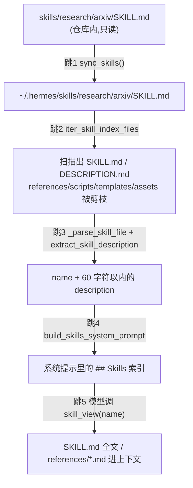

# r11a 片C · `skills/` + `optional-skills/` 技能库(L3 校准片底稿)

> **定位**:本轮唯一的 **L3(知悉用途)** 片,同时是一次**校准**——量一量
> 「同构短文档」这种形态的 L3 每文件 / 每行成本。
> **溯源约定**:凡对 hermes-agent 行为的断言,锚点写作 `路径:行号 @ 863e313`,
> **单独成行、置于代码块之前**;围栏块是逐字摘录。
> **L3 承诺的是**「这里有什么、有多大、谁读它、动它要动谁」,**不承诺**逐符号接口面。
> 因此本稿**没有**穷举 118 个文件的正文内容,而是穷举了它们的**形态、规模与读取方**。

---

## 0. 片清单与规模

清单文件 `data/r11a/slices/slice-L3-calibration.tsv`(118 文件 / 17,619 行,
横跨 81 个「技能目录」)。抽样口径由 `data/r11a/probes/make_calibration_slice.py`
的 docstring 定义:先把 `round=R6 && layer=L3` 这 1,080 文件的桶按
「单技能目录 ≤2,000 行」切成**批量数据尾巴**与**短文档主体**,只从后者按类目行数比例抽。

```verify
cd /home/user/hermes-study && awk -F'\t' 'NR>1{n++; l+=$2} END{printf "%d files / %d lines\n", n, l}' data/r11a/slices/slice-L3-calibration.tsv
```

```text
118 files / 17619 lines
```

```verify
cd /home/user/hermes-study && awk -F'\t' 'NR>1{print $3}' data/r11a/slices/slice-L3-calibration.tsv | sort -u | wc -l
```

```text
81
```

---

## 1. 这一片是什么(一段话)

`skills/` 与 `optional-skills/` 是 hermes-agent 的**技能库**:每个技能是一个目录,
目录里一份 `SKILL.md`(带 YAML front-matter 的 Markdown,front-matter 是文件开头
`---` 包起来的元数据块),可选地再带 `references/`(展开阅读的参考资料)、
`scripts/`(给模型用 terminal 去跑的可执行脚本)、`templates/` / `assets/`(样板与素材)。
类目目录下可放一份 `DESCRIPTION.md` 描述整个类目。
**技能不是被 import 的 Python 包**,而是**喂给模型的一段说明书**:harness 只读
front-matter 的 `name` / `description` 拼出一份**索引**塞进系统提示,正文与支撑文件
要等模型主动调 `skill_view` 才会进上下文——这就是仓库里反复出现的 progressive
disclosure(渐进披露:先给一行摘要,用得上再取全文)。
`optional-mcps/*/manifest.yaml` **不是**技能,是长得像技能的另一套东西(见 §5.4)。

---

## 2. 形态账(L3-2)

**分组规则即定义**,写在 `data/r11a/probes/probe_c_form_ledger.py` 的 docstring 里
(首条匹配生效:schema → index-cache → manifest → skill → category → reference →
template → script → license → other)。`other` 桶不为空就说明桶列表错了,所以它被显式打印。

```verify
cd /home/user/hermes-study && python3 data/r11a/probes/probe_c_form_ledger.py
```

```text
== slice C (118 files) by form ==
form          files    lines   ln/file
schema            4      174      43.5
index-cache       3        3       1.0
manifest          6      382      63.7
skill            37     8912     240.9
category         25       91       3.6
reference        22     5001     227.3
template          4      677     169.2
script           16     2349     146.8
license           1       30      30.0
TOTAL           118    17619

== baseline population (skills/ + optional-skills/ + optional-mcps/) ==
form          files    lines   slice/pop files
schema           78    39460             5.1%
index-cache       3        3           100.0%
manifest          6      382           100.0%
skill           183    55035            20.2%
category         28      100            89.3%
reference       430   131172             5.1%
template        149    44006             2.7%
script          158    43289            10.1%
license           5      141            20.0%
other            45     6654             0.0%
TOTAL          1085   320242            10.9%
```

**怎么读这张表(七条,逐条是本片的实际结论):**

1. **`skill`(37 / 8,912 行,241 行/文件)是这一片的主体。** 全仓 183 份 `SKILL.md`
   共 55,035 行,本片覆盖了其中 20.2%(文件数)。这是三种形态里唯一被 harness
   **主动扫描**的文件。
2. **`category`(25 文件 / 91 行,3.6 行/文件)是全仓覆盖率最高的一格(89.3%)。**
   28 份 `DESCRIPTION.md` 里 25 份在本片内——因为它们太小,分层抽样把它们几乎全带进来了。
   它们**每份平均只有 3.6 行**,而其中 10 份根本没有 front-matter(§7 的 ■-1)。
3. **`reference`(22 / 5,001 行,227 行/文件)与 `skill` 行数量级相同。**
   全仓 `references/` 有 430 文件 / 131,172 行,是 `SKILL.md` 总量的 2.4 倍——
   **技能库的字数大头不在说明书本身,而在它挂着的参考资料**,而参考资料**永远不进索引**。
4. **`script`(16 / 2,349 行)全部集中在 5 个技能**上(docx 占 10 个,arxiv /
   canvas / darwinian-evolver / github-auth 分掉其余 6 个)。它们不是被 harness import 的(§7 负结论 N-1),
   是 `SKILL.md` 正文教模型用 terminal 去跑的命令行工具。
5. **`schema`(4 / 174 行)是本片最不具代表性的一格(5.1%)。** 全仓 78 个 `.xsd`
   共 39,460 行,是**两份逐字节相同的 OOXML schema 转储**;抽样的 2,000 行上限
   把大头挡在片外,只漏进来 `ecma/fourth-edition/` 这 4 个小文件。
6. **`manifest` 与 `index-cache` 是 100% 覆盖**——全仓就这 6 个 + 3 个,本片全要了。
7. **`other`(全仓 45 文件 / 6,654 行,本片 0)** 是技能目录里既不是 `SKILL.md`
   也不落在四个支撑目录里的散件(29 个 `.md`、8 个 `.json`、6 个 `.py`、1 `.txt`、1 `.ini`),
   例如 `optional-skills/creative/baoyu-article-illustrator/PORT_NOTES.md`。
   本片一个都没抽到,**这是本片对总体代表性的已知缺口**。

**与台账口径的差**(如实交代):上表 population 用 `git ls-files` 数出 1,085 文件,
台账 `round=R6 && layer=L3` 桶是 1,080 文件 / 315,887 行。差的 5 个是二进制
(`optional-skills/security/unbroker/assets/unbroker.png` 与 4 个 `.pdf` 论文模板),
台账把它们归在别层。行数差同源。

**每文件平均规模(校准数)**:本片 17,619 / 118 = **149.3 行/文件**;
短文档主体总体是 117,525 / 562 = 209.1 行/文件。本片偏小,因为
25 份 3.6 行的 `DESCRIPTION.md` 拉低了均值——**按行数外推 L3 成本时应剔除这一格**,
否则会把「读一份 3 行的类目说明」和「读一份 240 行的说明书」按同一单价计。

---

## 3. 真链一:一个 `SKILL.md` 怎么走到模型眼前(L3-3 / L3-4)

拿 `skills/research/arxiv/SKILL.md`(282 行)当例子。它在仓库里,模型在别的机器上,
中间有五跳。**读取方全部在本片外**,这是 L3-3 明确允许并鼓励的。



### 跳 1 — 仓库的 `skills/` 被复制进 `HERMES_HOME`

`sync_skills()` 的源目录就是**仓库根的 `skills/`**;Nix 之类的打包安装把它挪到别处,
靠 `HERMES_BUNDLED_SKILLS` 环境变量指回来。

`tools/skills_sync.py:70-76 @ 863e313`

```python
def _get_bundled_dir() -> Path:
    """Locate the bundled skills/ directory.

    Checks HERMES_BUNDLED_SKILLS env var first (set by Nix wrapper),
    then falls back to the relative path from this source file.
    """
    return get_bundled_skills_dir(Path(__file__).parent.parent / "skills")
```

同一个文件里 `_get_optional_dir()` 指向 `optional-skills/`,但**它不参与 sync**
(见 §5.1)。类目说明是单独一轮复制的,注意 `if not dest_desc.exists()` ——
**只在目标不存在时复制,存在就不覆盖**,用户改过的类目说明不会被升级冲掉:

`tools/skills_sync.py:923-932 @ 863e313`

```python
    # Also copy DESCRIPTION.md files for categories (if not already present)
    for desc_md in bundled_dir.rglob("DESCRIPTION.md"):
        rel = desc_md.relative_to(bundled_dir)
        dest_desc = SKILLS_DIR / rel
        if not dest_desc.exists():
            try:
                dest_desc.parent.mkdir(parents=True, exist_ok=True)
                shutil.copy2(desc_md, dest_desc)
            except (OSError, IOError) as e:
                logger.debug("Could not copy %s: %s", desc_md, e)
```

`sync_skills()` 的调用面(排除 `tests/` 与它自己的 `def` 行)散在 7 个模块、
共 15 行命中,形态都是「启动 / 安装 / 升级时静默跑一次」:

```verify
cd /home/user/hermes-agent && grep -rn "sync_skills(" --include=*.py . | grep -v "^\./tests/" | grep -v "def sync_skills" | sed 's/:.*//' | sort | uniq -c
```

```text
      1 ./gateway/run.py
      2 ./hermes_cli/main.py
      2 ./hermes_cli/profiles.py
      1 ./hermes_cli/setup.py
      1 ./hermes_cli/skills_hub.py
      3 ./hermes_cli/update_cmd.py
      5 ./tools/skills_sync.py
```

**这 15 行里有 5 行是注释或 docstring**(`hermes_cli/profiles.py:1194`、
`hermes_cli/update_cmd.py:4390`、`tools/skills_sync.py:62` 与 `:621` 与 `:1022`),
**真正的调用点是 10 个**:`gateway/run.py:26546`、`hermes_cli/main.py:935` 与 `:2480`、
`hermes_cli/profiles.py:1214`(用 subprocess 跑,因为该模块导入期缓存了 `HERMES_HOME`)、
`hermes_cli/setup.py:3416`、`hermes_cli/skills_hub.py:1370`、
`hermes_cli/update_cmd.py:968` 与 `:4363`、`tools/skills_sync.py:1080` 与 `:1393`。
**上面那条命令给出的是行数、不是调用数**,写清楚以免被后续轮误引。

### 跳 2 — 扫描时把四个支撑目录剪掉

这是**整条链上最重要的一条设计约束**:`references/` `templates/` `assets/` `scripts/`
里的东西**不会被当成技能**,哪怕里面躺着一份完整的旧 `SKILL.md`。

`agent/skill_utils.py:46-50 @ 863e313`

```python
# Supporting files live inside a skill package and are loaded explicitly via
# skill_view(skill, file_path=...). They are not standalone skills and must not
# be scanned for active SKILL.md/DESCRIPTION.md entries, even if a Curator or
# archive workflow preserves a complete old skill package under references/.
SKILL_SUPPORT_DIRS = frozenset(("references", "templates", "assets", "scripts"))
```

剪枝是**条件式**的:`iter_skill_index_files` 只在当前目录**自己有 `SKILL.md`** 时
才剪掉这四个子目录——

`agent/skill_utils.py:903-910 @ 863e313`

```python
        dirs[:] = [
            d
            for d in dirs
            if d not in EXCLUDED_SKILL_DIRS
            and not (has_skill_md and d in SKILL_SUPPORT_DIRS)
        ]
        if filename in files:
            matches.append(os.path.join(root, filename))
```

这解释了本片
`optional-skills/creative/baoyu-article-illustrator/prompts/system.md` 的处境:
`prompts` **不在**这四个名字里,所以它不受剪枝保护——只是它里面没有 `SKILL.md`,
所以什么也没发生。

### 跳 3 — 描述被砍到 60 字符

索引里每个技能只占一行,描述超过 60 字符就截成 57 字符 + `...`。

`agent/skill_utils.py:858-865 @ 863e313`

```python
def extract_skill_description(frontmatter: Dict[str, Any]) -> str:
    """Extract a system-prompt-length description from parsed frontmatter."""
    desc = _normalize_skill_description(frontmatter)
    if not desc:
        return ""
    if len(desc) > SKILL_PROMPT_DESC_LIMIT:
        return desc[:SKILL_PROMPT_DESC_LIMIT - 3] + "..."
    return desc
```

预算本身是一个裸常量:

`agent/skill_utils.py:847-849 @ 863e313`

```python
# ── Description extraction ────────────────────────────────────────────────

SKILL_PROMPT_DESC_LIMIT = 60
```

**这是「同构短文档」四个字的真正来源**:183 份 `SKILL.md` 里只有 8 份越界。

```verify
cd /home/user/hermes-agent && HERMES_DISABLE_LAZY_INSTALLS=1 python3 /home/user/hermes-study/data/r11a/probes/probe_c_skill_shape.py
```

```text
skills           SKILL.md=  71  desc>60chars= 1
optional-skills  SKILL.md= 112  desc>60chars= 7
TOTAL            SKILL.md= 183
nested SKILL.md  = 0
```

本片 37 份 `SKILL.md` 里越界的只有 `optional-skills/health/fitness-nutrition/SKILL.md`
一份(它的 `description` 用了 YAML 折叠标量 `>`,写成了多行)。

### 跳 4 — 类目说明进索引,**没有 front-matter 的直接被丢掉**

`agent/prompt_builder.py:1735-1745 @ 863e313`

```python
        # Read category-level DESCRIPTION.md files
        for desc_file in iter_skill_index_files(skills_dir, "DESCRIPTION.md"):
            try:
                content = desc_file.read_text(encoding="utf-8")
                fm, _ = parse_frontmatter(content)
                cat_desc = fm.get("description")
                if not cat_desc:
                    continue
                rel = desc_file.relative_to(skills_dir)
                cat = "/".join(rel.parts[:-1]) if len(rel.parts) > 1 else "general"
                category_descriptions[cat] = str(cat_desc).strip().strip("'\"")
```

`if not cat_desc: continue` ——**无 front-matter 即静默跳过**,不报错、默认日志级别下
也不打印。这就是 §7 ■-1 的机制。

### 跳 5 — 模型主动取全文

`skill_view(name)` 取 `SKILL.md` 正文,`skill_view(name, file_path=...)` 取支撑文件。
技能自己的正文就是这么写的,例如
`skills/creative/architecture-diagram/SKILL.md:145 @ 863e313`

```markdown
skill_view(name="architecture-diagram", file_path="templates/template.html")
```

`tools/skills_tool.py:962-967 @ 863e313`

```python
def skill_view(
    name: str,
    file_path: str = None,
    task_id: str = None,
    preprocess: bool = True,
) -> str:
```

### 缺了会怎样(L3-3 的第三段)

**端到端实测**:在一个一次性 `HERMES_HOME` 里跑完 跳1→跳4,再看渲染出的索引里
哪些类目带描述。`skills/apple/DESCRIPTION.md` 是仓库里唯一一份没有 front-matter 的
bundled 类目说明,结果它的类目在索引里**没有描述行**,而其余 15 个类目都有。

```verify
cd /home/user/hermes-agent && HERMES_DISABLE_LAZY_INSTALLS=1 HERMES_HOME=$(mktemp -d) /home/user/hermes-venv/bin/python /home/user/hermes-study/data/r11a/probes/probe_c_category_desc.py
```

```text
bundled DESCRIPTION.md files            : 16
  without a frontmatter 'description'   : 1
    skills/apple/DESCRIPTION.md  -> category 'apple' in index with description: False
```

---

## 4. 真链二:`skills/index-cache/` 那三个 1 行 JSON 是给谁的

本片有三个奇怪的文件:`skills/index-cache/` 下三个**各只有 1 行**的 JSON
(9,858 / 251,446 / 2 字节)。它们既不是技能,也不在 `.hub/` 下。跟下去有四跳:

### 跳 1 — 运行时的技能中心缓存**不在这里**

`tools/skills_hub.py:97-99 @ 863e313`

```python
def _index_cache_dir() -> Path:
    forced = _override("INDEX_CACHE_DIR")
    return Path(forced) if forced is not None else _hub_dir() / "index-cache"
```

`tools/skills_hub.py:72-74 @ 863e313`

```python
def _hub_dir() -> Path:
    forced = _override("HUB_DIR")
    return Path(forced) if forced is not None else _skills_dir() / ".hub"
```

所以运行时缓存落在 `~/.hermes/skills/.hub/index-cache/`,TTL 1 小时:

`tools/skills_hub.py:54 @ 863e313`

```python
INDEX_CACHE_TTL = 3600  # 1 hour
```

写它的是 `SkillSource._write_cache`:

`tools/skills_hub.py:1153-1161 @ 863e313`

```python
    def _write_cache(self, key: str, data: list) -> None:
        """Write index data to cache."""
        index_cache_dir = _index_cache_dir()
        index_cache_dir.mkdir(parents=True, exist_ok=True)
        cache_file = index_cache_dir / f"{key}.json"
        try:
            cache_file.write_text(json.dumps(data, ensure_ascii=False), encoding="utf-8")
        except OSError as e:
            logger.debug("Could not write cache: %s", e)
```

**仓库里的 `skills/index-cache/` 和它不是同一个路径。**

### 跳 2 — 真正读仓库这份的是文档站脚本

`website/scripts/extract-skills.py:34 @ 863e313`

```python
LEGACY_INDEX_CACHE_DIR = os.path.join(REPO_ROOT, "skills", "index-cache")
```

### 跳 3 — 而且只在统一索引不存在时才读(**降级路径**)

`website/scripts/extract-skills.py:625-631 @ 863e313`

```python
    unified, index_meta = extract_unified_index_skills()
    if unified is not None:
        external = unified
        external_source = "unified index"
    else:
        external = extract_legacy_cache_skills()
        external_source = "legacy index-cache"
```

正常路径读的是 `website/static/api/skills-index.json`,由
`scripts/build_skills_index.py` 每天两次爬 skills.sh / ClawHub / LobeHub /
GitHub taps 生成:

`scripts/build_skills_index.py:16 @ 863e313`

```python
Output: website/static/api/skills-index.json
```

那个脚本还有一条值得记的设计:健康检查不过时**绝不写文件**——

`scripts/build_skills_index.py:432-439 @ 863e313`

```python
        # IMPORTANT: do NOT write OUTPUT_PATH on failure. The index file is
        # gitignored, so a fresh deploy checkout has no copy on disk — leaving
        # it absent lets website/scripts/extract-skills.py fall back to the
        # legacy snapshot cache (or skip the unified index) instead of reading
        # a degenerate file. Writing-then-exiting-2 was the bug that shipped an
        # index with every GitHub-API source dropped to zero: deploy-site.yml
        # swallows the exit code with `|| echo non-fatal`, and the partial file
        # was already on disk for extract-skills to pick up.
```

**这就是这三个 JSON 存在的理由**:它们是「爬虫全挂了」时文档站的兜底快照。

### 跳 4 — 打包时被显式排除

`nix/hermes-agent.nix:63-66 @ 863e313`

```nix
  bundledSkills = lib.cleanSourceWith {
    src = ../skills;
    filter = path: _type: !(lib.hasInfix "/index-cache/" path) && !(lib.hasInfix "/__pycache__/" path);
  };
```

### 缺了会怎样

删掉这三个文件:运行时**毫无影响**(运行时缓存在 `~/.hermes/skills/.hub/index-cache/`,
Nix 包里本来就没有它们);文档站在「统一索引缺失」的降级路径上会从
「外部技能 = 这三份快照」变成「外部技能 = 空」,Skills Hub 页面只剩本地
`skills/` + `optional-skills/`。`openai_skills_skills_.json` 内容已经是 `[]`,
即这份兜底**已经空了三分之一**。

---

## 5. 四个专项问题的答案

### 5.1 `skills/` 与 `optional-skills/` 在加载方式上的区别?谁决定哪些技能可见?

**两棵树的差别不在格式,在「是否自动进 `HERMES_HOME`」。** 格式完全一样
(都是 `<类目>/<名字>/SKILL.md` + front-matter),差别是:

| | `skills/`(内置) | `optional-skills/`(可选) |
|---|---|---|
| 谁把它搬进 `~/.hermes/skills/` | `sync_skills()`,启动/安装/升级时自动 | **没有人自动搬**;要用户 `hermes skills install` |
| 在源码里的入口 | `tools/skills_sync.py:70` 的 `_get_bundled_dir` | `tools/skills_hub.py:3266` 的 `class OptionalSkillSource(SkillSource):` |
| 默认是否进系统提示 | 是 | **否** |
| 数量(实测) | 71 份 `SKILL.md` | 112 份 `SKILL.md` |

`tools/skills_hub.py:3266-3274 @ 863e313`

```python
class OptionalSkillSource(SkillSource):
    """
    Fetch skills from the optional-skills/ directory shipped with the repo.

    These skills are official (maintained by Nous Research) but not activated
    by default — they don't appear in the system prompt and aren't copied to
    ~/.hermes/skills/ during setup.  They are discoverable via the Skills Hub
    (search / install / inspect) and labelled "official" with "builtin" trust.
    """
```

仓库自己的说明文档也这么写(本片文件之一):

`optional-skills/DESCRIPTION.md:3-6 @ 863e313`

```markdown
Official skills maintained by Nous Research that are **not activated by default**.

These skills ship with the hermes-agent repository but are not copied to
`~/.hermes/skills/` during setup. They are discoverable via the Skills Hub:
```

**「谁决定哪些技能可见」有五道闸**,都在
`agent/prompt_builder.py::build_skills_system_prompt`(`:1602-1875 @ 863e313`)里:

1. **在不在 `~/.hermes/skills/`** —— 上面那条,内置全在、可选要装;
2. **平台匹配** —— front-matter 的 `platforms`(如 `[macos]`);
3. **禁用名单** —— `get_disabled_skill_names(platform)`,支持按平台分别禁用;
4. **工具/工具集条件** —— 技能声明自己依赖哪些工具,工具没开就不出现;
5. **姿态降级** —— `compact_categories`(如写代码时把非编码类目降级)
   只删描述、**不删名字**。

第 2、3、4 道闸是快照路径上连着的三个 `continue`:

`agent/prompt_builder.py:1670-1680 @ 863e313`

```python
            platforms = entry.get("platforms") or []
            if not skill_matches_platform_list(platforms):
                continue
            if frontmatter_name in disabled or skill_name in disabled:
                continue
            if not _skill_should_show(
                entry.get("conditions") or {},
                available_tools,
                available_toolsets,
            ):
                continue
```

第 5 条的注释值得单独抄,它是一条明确的设计原则:

`agent/prompt_builder.py:1807-1811 @ 863e313`

```python
    # Posture-driven category demotion (e.g. non-coding skills while pairing
    # on code). Demoted categories stay in the index as a single names-only
    # line — descriptions are dropped to cut noise, but every skill name
    # remains visible so memory-anchored recall ("load <name>") keeps working.
    # NEVER remove entries entirely: agent-created skills are the model's
```

### 5.2 技能是怎么被索引的?`skills/index-cache/` 是什么、谁写它、谁读它?

**两套完全不同的「索引」,名字撞车了:**

| 索引 | 内容 | 谁写 | 谁读 | 落盘位置 |
|---|---|---|---|---|
| **系统提示技能索引** | 本机已装技能的 name+desc | `agent/prompt_builder.py:1749` 的 `_write_skills_snapshot(` | 同文件 `_load_skills_snapshot` | `<HERMES_HOME>/.skills_prompt_snapshot.json` |
| **技能中心检索缓存** | 外部技能站的搜索结果 | `tools/skills_hub.py:1153` 的 `def _write_cache(self, key: str, data: list) -> None:` | `tools/skills_hub.py:1140` 的 `def _read_cache(self, key: str) -> Optional[list]:` | `<HERMES_HOME>/skills/.hub/index-cache/` |
| **统一技能索引(文档站)** | 全网 ~7 万条技能目录 | `scripts/build_skills_index.py:47` 的 `OUTPUT_PATH = os.path.join(REPO_ROOT, "website", "static", "api", "skills-index.json")` | `website/scripts/extract-skills.py:344` 的 `def extract_unified_index_skills():` | `website/static/api/skills-index.json`(gitignored) |
| **仓库里的 `skills/index-cache/`** | 三份旧快照 | **仓库外**(手工提交,git log 显示来自 `740dd928f Release set of skills`) | `website/scripts/extract-skills.py:446` 的 `"""Read the deprecated skills/index-cache/ snapshots — fallback only."""` | 仓库内,只在统一索引缺失时被读 |

系统提示索引的缓存是**两层**:进程内 LRU + 磁盘快照,快照用
「全部 `SKILL.md` / `DESCRIPTION.md` 的 mtime_ns + size 清单」做失效判据。
清单里还包含 `_org/.active_org` 标记文件本身,这样**换组织时快照必然失效**,
哪怕没有一个 `SKILL.md` 变过:

`agent/prompt_builder.py:1388-1394 @ 863e313`

```python
def _build_skills_manifest(skills_dir: Path) -> dict[str, list[int]]:
    """Build an mtime/size manifest of all SKILL.md and DESCRIPTION.md files.

    Org mirrors (M2): only the ACTIVE org's mirror participates, and the
    ``.active_org`` marker itself is included — so switching/leaving an org
    invalidates the snapshot even when no SKILL.md changed.
    """
```

### 5.3 `SKILL.md` 有结构约定吗?强制还是惯例?有校验吗?

**有约定、有成文的规范、但对仓库内的技能没有任何自动校验。** 三件事分开说:

**(a) 强制项——只有 5 条,且只在「模型写技能」这条路上强制。**

`tools/skill_manager_tool.py::_validate_frontmatter` 要求:以 `---` 开头 / 有闭合 `---` /
解析成 YAML mapping / 有 `name` / 有 `description`(≤1024 字符)/ front-matter 之后正文非空。
新建技能时额外要求描述 ≤60 字符(`new_skill=True` 分支)。核心三条长这样:

`tools/skill_manager_tool.py:597-603 @ 863e313`

```python
    if not isinstance(parsed, dict):
        return "Frontmatter must be a YAML mapping (key: value pairs)."

    if "name" not in parsed:
        return "Frontmatter must include 'name' field."
    if "description" not in parsed:
        return "Frontmatter must include 'description' field."
```

**它只在 `skill_manage` 的 create / edit / patch 三条写入路径上被调用**
(`tools/skill_manager_tool.py:920`、`:979`、`:1127`),create 那一处长这样:

`tools/skill_manager_tool.py:919-922 @ 863e313`

```python
    # Validate content
    err = _validate_frontmatter(content, new_skill=True)
    if err:
        return {"success": False, "error": err}
```

**(b) 惯例项——由仓库自带的一份「元技能」写死。** 本片文件之一
`skills/software-development/hermes-agent-skill-authoring/SKILL.md` 就是**写技能的技能**,
它明确区分了硬要求与同侪惯例:

`skills/software-development/hermes-agent-skill-authoring/SKILL.md:29-37 @ 863e313`

```markdown
## Required Frontmatter

Source of truth: `tools/skill_manager_tool.py::_validate_frontmatter`. Hard requirements:

- Starts with `---` as the first bytes (no leading blank line).
- Closes with `\n---\n` before the body.
- Parses as a YAML mapping.
- `name` field present.
- `description` field present, ≤ **1024 chars** (`MAX_DESCRIPTION_LENGTH`).
```

同一份文件在 `:57 @ 863e313` 明说 `version` / `author` / `license` / `metadata`
**不被校验器强制**,但「每个同侪都有,不写就显眼」。实测确实如此:本片 37 份
`SKILL.md` 的 front-matter 键集合基本是
`name, description, version, author, license, platforms, metadata` 的子集,
另有零星 `dependencies` / `prerequisites` / `setup` /
`required_environment_variables`(见 §6.1 的键列)。

**(c) 校验——仓库内的 183 份 `SKILL.md` 没有任何一条会跑到它们头上。**
见 §7 的 N-2 负结论(含搜索面)。这与 `optional-mcps` 形成鲜明对照(下一节)。

### 5.4 `optional-mcps/*/manifest.yaml` 与技能是同一套机制吗?

**不是。形态刻意做成平行,加载器与校验强度完全不同。** 模块自己就这么写:

`hermes_cli/mcp_catalog.py:1-7 @ 863e313`

```python
"""MCP catalog — curated, Nous-approved MCP servers shipped with the repo.

Mirrors the optional-skills/ pattern: each catalog entry lives under
``optional-mcps/<name>/manifest.yaml`` and ships disabled. Users discover
entries via ``hermes mcp catalog`` or the interactive ``hermes mcp picker``,
and install them with ``hermes mcp install <name>`` (or by toggling in the
picker, which flows them through any required env/OAuth setup).
```

| | 技能 | MCP 目录条目 |
|---|---|---|
| 文件 | `SKILL.md`(Markdown + YAML front-matter) | `manifest.yaml`(纯 YAML) |
| 版本字段 | 无(`version` 是惯例,不参与判定) | `manifest_version`,**不等于 1 直接拒收** |
| 加载器 | `agent/prompt_builder.py` / `tools/skills_hub.py` | `hermes_cli/mcp_catalog.py:297` 的 `def list_catalog() -> List[CatalogEntry]:` |
| 校验 | 只在模型写入路径 | `hermes_cli/mcp_catalog.py:159` 的 `def _parse_manifest(path: Path) -> CatalogEntry:` 逐字段抛 `CatalogError` |
| 仓库内文件有无契约测试 | **无** | **有**:`tests/hermes_cli/test_mcp_catalog.py:559` 的 `def test_all_shipped_manifests_parse(self, monkeypatch):` |
| 进不进系统提示 | 进(索引行) | 不进;装上后变成 MCP 工具 |

`hermes_cli/mcp_catalog.py:170-175 @ 863e313`

```python
    mv = data.get("manifest_version")
    if mv != _MANIFEST_VERSION:
        raise CatalogError(
            f"{path}: manifest_version {mv!r} unsupported "
            f"(this Hermes understands version {_MANIFEST_VERSION})"
        )
```

`tests/hermes_cli/test_mcp_catalog.py:558-565 @ 863e313`

```python
class TestShippedCatalog:
    def test_all_shipped_manifests_parse(self, monkeypatch):
        """Every manifest in optional-mcps/ must parse cleanly.

        This is a contract test — CI will fail if a PR adds a malformed
        manifest. Intentionally NOT a snapshot of catalog names (those are
        expected to change as PRs land).
        """
```

实跑该文件(环境见 §8):**21 passed / 0 failed**。

---

## 6. 逐文件点名(L3-1):118 个,按形态分组

> 组内**逐个列全路径**。同型薄文件用一行给出「它是什么 / 谁读它」,
> 不同型的单独交代。行数取自清单 TSV。

### 6.1 技能说明书 `SKILL.md`(37 文件 / 8,912 行)

**是什么**:一个技能的根文档,YAML front-matter 提供 `name` / `description`
(+可选 `version` / `author` / `license` / `platforms` / `metadata` /
`dependencies` / `prerequisites` / `setup` / `required_environment_variables`),
正文是给模型看的操作说明。
**谁读它**:①`agent/prompt_builder.py::build_skills_system_prompt` 只读 front-matter
拼索引;②模型调 `skill_view(name)` 时读全文;③`website/scripts/extract-skills.py`
读它生成文档站 Skills Hub 页;④`hermes skills install` 走
`tools/skills_hub.py::OptionalSkillSource` 时读它做检索与安装。

`optional-skills/` 树(23 份,默认**不**进系统提示):

| 路径 | 行 | 一句话 |
|---|---|---|
| `optional-skills/autonomous-ai-agents/antigravity-cli/SKILL.md` | 241 | 操作 Antigravity CLI(`agy`)的插件/鉴权/沙箱 |
| `optional-skills/blockchain/evm/SKILL.md` | 211 | 只读 EVM 客户端:8 条链的钱包/代币/gas |
| `optional-skills/creative/audiocraft-audio-generation/SKILL.md` | 569 | AudioCraft 文本生音乐/音效(MusicGen / AudioGen) |
| `optional-skills/devops/actual-setup/SKILL.md` | 146 | 在 Hermes 里接 actual.inc 推理后端 |
| `optional-skills/email/agentmail/SKILL.md` | 126 | 给 agent 一个自己的收件箱(收发邮件) |
| `optional-skills/finance/3-statement-model/SKILL.md` | 433 | 用 Excel 搭三表联动财务模型 |
| `optional-skills/health/fitness-nutrition/SKILL.md` | 256 | 健身/营养计算;**本片唯一描述超 60 字符**的技能 |
| `optional-skills/mcp/fastmcp/SKILL.md` | 300 | 用 FastMCP 写/测/部署 Python MCP 服务 |
| `optional-skills/mlops/accelerate/SKILL.md` | 352 | HuggingFace Accelerate 多卡训练(`name` 是 `huggingface-accelerate`,与目录名不同) |
| `optional-skills/mlops/chroma/SKILL.md` | 410 | Chroma 向量库做 RAG / 语义检索 |
| `optional-skills/mlops/clip/SKILL.md` | 257 | CLIP 零样本图像分类与图文检索 |
| `optional-skills/mlops/faiss/SKILL.md` | 225 | FAISS 十亿级向量相似检索 |
| `optional-skills/mlops/flash-attention/SKILL.md` | 374 | FlashAttention 长序列加速(`name` 是 `optimizing-attention-flash`) |
| `optional-skills/payments/mpp-agent/SKILL.md` | 124 | 用 MPP 协议付 HTTP 402 收费 API |
| `optional-skills/productivity/canvas/SKILL.md` | 98 | 用 API token 拉 Canvas LMS 课程与作业 |
| `optional-skills/productivity/here-now/SKILL.md` | 217 | 发布站点到 `{slug}.here.now` 并存文件 |
| `optional-skills/research/bioinformatics/SKILL.md` | 235 | 通往 400+ 基因组学技能的入口技能 |
| `optional-skills/research/darwinian-evolver/SKILL.md` | 199 | 用进化循环演化 prompt/regex/SQL/代码 |
| `optional-skills/security/1password/SKILL.md` | 163 | 配置 `op` CLI、登录、读取/注入密钥 |
| `optional-skills/security/godmode/SKILL.md` | 403 | LLM 越狱模板(Parseltongue / GODMODE / ULTRAPLINIAN) |
| `optional-skills/software-development/code-wiki/SKILL.md` | 445 | 给任意代码库生成 wiki 文档 + Mermaid 图 |
| `optional-skills/web-development/cloudflare-temporary-deploy/SKILL.md` | 127 | 用 `wrangler --temporary` 免账号部署 Worker |
| `optional-skills/yuanbao/SKILL.md` | 108 | 腾讯元宝群:@提及、查成员;**直接躺在树根、没有类目目录**,`_build_snapshot_entry` 会把它的类目算成 `yuanbao`(与技能同名) |

`skills/` 树(14 份,默认**会**进系统提示):

| 路径 | 行 | 一句话 |
|---|---|---|
| `skills/apple/apple-notes/SKILL.md` | 94 | 用 `memo` CLI 管 Apple Notes(仅 macOS) |
| `skills/creative/architecture-diagram/SKILL.md` | 148 | 生成暗色 SVG 架构图 HTML;正文里教模型 `skill_view` 取 `templates/template.html` |
| `skills/creative/ascii-art/SKILL.md` | 322 | pyfiglet / cowsay / boxes / 图转 ASCII |
| `skills/creative/claude-design/SKILL.md` | 650 | 做一次性 HTML 作品(落地页/幻灯/原型);本片最长的 `SKILL.md` |
| `skills/github/codebase-inspection/SKILL.md` | 116 | 用 pygount 统计代码库 LOC/语言比例 |
| `skills/github/github-auth/SKILL.md` | 247 | GitHub 鉴权:HTTPS token / SSH key / `gh` 登录 |
| `skills/media/gif-search/SKILL.md` | 91 | curl+jq 从 Tenor 搜/下 GIF |
| `skills/mlops/huggingface-hub/SKILL.md` | 81 | `hf` CLI 搜/下/传模型与数据集 |
| `skills/productivity/airtable/SKILL.md` | 229 | curl 调 Airtable REST(记录 CRUD / 过滤 / upsert) |
| `skills/productivity/docx/SKILL.md` | 127 | 读写编辑 Word `.docx`;是本片脚本最多的技能(见 6.4) |
| `skills/research/arxiv/SKILL.md` | 282 | 按关键词/作者/分类/ID 搜 arXiv;**§3 那条链的样例** |
| `skills/research/blogwatcher/SKILL.md` | 137 | 用 blogwatcher-cli 监控博客与 RSS/Atom |
| `skills/software-development/dogfood/SKILL.md` | 162 | Web 应用探索式 QA:找 bug、留证据、出报告 |
| `skills/software-development/hermes-agent-skill-authoring/SKILL.md` | 207 | **写技能的技能**——§5.3 的规范来源 |

### 6.2 类目说明 `DESCRIPTION.md`(25 文件 / 91 行)

**是什么**:类目目录下的一行说明。**谁读它**:`agent/prompt_builder.py:1736`
(bundled 树)与 `:1794`(外部技能目录)——**只取 front-matter 的 `description` 键**,
没有就丢。

**(a) 有 front-matter、能进索引的(15 份)**:
`skills/autonomous-ai-agents/DESCRIPTION.md`(3)、`skills/creative/DESCRIPTION.md`(3)、
`skills/email/DESCRIPTION.md`(3)、`skills/github/DESCRIPTION.md`(3)、
`skills/media/DESCRIPTION.md`(3)、`skills/mlops/DESCRIPTION.md`(3)、
`skills/mlops/evaluation/DESCRIPTION.md`(3)、`skills/mlops/inference/DESCRIPTION.md`(3)、
`skills/note-taking/DESCRIPTION.md`(3)、`skills/productivity/DESCRIPTION.md`(3)、
`skills/research/DESCRIPTION.md`(3)、`skills/smart-home/DESCRIPTION.md`(3)、
`skills/social-media/DESCRIPTION.md`(3)、
`optional-skills/data-science/DESCRIPTION.md`(3)、`optional-skills/gaming/DESCRIPTION.md`(3)。
注意 `mlops/evaluation` 与 `mlops/inference` 是**嵌套类目**——`_build_snapshot_entry`
把类目算成 `mlops/evaluation` 这样的多段串。

**(b) 没有 front-matter、被静默丢弃的(10 份)**:
`skills/apple/DESCRIPTION.md`(2,**唯一一份在 bundled 树里的**,见 §7 ■-1)、
`optional-skills/DESCRIPTION.md`(24,其实是 `optional-skills/` 树的 README,不是类目说明)、
`optional-skills/autonomous-ai-agents/DESCRIPTION.md`(2)、
`optional-skills/communication/DESCRIPTION.md`(1)、
`optional-skills/dogfood/DESCRIPTION.md`(3)、
`optional-skills/health/DESCRIPTION.md`(1)、
`optional-skills/mcp/DESCRIPTION.md`(3)、
`optional-skills/migration/DESCRIPTION.md`(2)、
`optional-skills/security/DESCRIPTION.md`(3)、
`optional-skills/web-development/DESCRIPTION.md`(5)。

### 6.3 参考资料 `references/`(22 文件 / 5,001 行)

**是什么**:技能的第二层内容。**谁读它**:**没有任何自动扫描**——
`SKILL_SUPPORT_DIRS` 把它剪掉了(§3 跳 2);只有模型显式
`skill_view(name, file_path="references/xxx.md")` 才会进上下文。
每份都是纯 Markdown、无 front-matter、以一个 H1 开头。

- `optional-skills/autonomous-ai-agents/antigravity-cli/references/cli-docs.md`(64)——Antigravity CLI 文档精简版
- `optional-skills/creative/audiocraft-audio-generation/references/advanced-usage.md`(666)——AudioCraft 进阶用法;**本片最长的一份**
- `optional-skills/creative/audiocraft-audio-generation/references/troubleshooting.md`(504)——AudioCraft 排障
- `optional-skills/devops/actual-setup/references/opencode.md`(91)——把 actual.inc 当 OpenCode provider 用
- `optional-skills/finance/3-statement-model/references/formatting.md`(118)——财务表格格式规范
- `optional-skills/finance/3-statement-model/references/formulas.md`(292)——三表公式手册
- `optional-skills/finance/3-statement-model/references/sec-filings.md`(125)——从 SEC 备案文件取数
- `optional-skills/health/fitness-nutrition/references/FORMULAS.md`(100)——BMR / TDEE 等公式
- `optional-skills/mcp/fastmcp/references/fastmcp-cli.md`(110)——FastMCP CLI 参考
- `optional-skills/mlops/accelerate/references/custom-plugins.md`(453)——自定义 Accelerate 插件
- `optional-skills/mlops/accelerate/references/megatron-integration.md`(489)——Megatron 集成
- `optional-skills/mlops/accelerate/references/performance.md`(525)——Accelerate 性能调优
- `optional-skills/mlops/chroma/references/integration.md`(38)——Chroma 集成指南
- `optional-skills/mlops/clip/references/applications.md`(207)——CLIP 应用场景
- `optional-skills/mlops/faiss/references/index_types.md`(280)——FAISS 索引类型选型
- `optional-skills/mlops/flash-attention/references/benchmarks.md`(215)——性能基准
- `optional-skills/mlops/flash-attention/references/transformers-integration.md`(293)——HuggingFace Transformers 集成
- `optional-skills/security/1password/references/cli-examples.md`(31)——`op` CLI 示例
- `optional-skills/security/1password/references/get-started.md`(21)——1Password CLI 上手摘要
- `optional-skills/security/godmode/references/jailbreak-templates.md`(128)——越狱系统提示模板
- `optional-skills/security/godmode/references/refusal-detection.md`(142)——拒答检测与打分
- `skills/software-development/dogfood/references/issue-taxonomy.md`(109)——QA 缺陷分类表

**一个规模数**:全仓 `references/` 430 文件 / 131,172 行,是 183 份 `SKILL.md`
(55,035 行)的 **2.4 倍**——技能库的字数大头在这里,而它**从不占系统提示预算**。

### 6.4 可执行脚本 `scripts/`(16 文件 / 2,349 行)

**是什么**:技能自带的命令行工具。**谁读它**:**不是 harness**(见 §7 N-1),
是模型照 `SKILL.md` 正文用 terminal 工具去 `python scripts/xxx.py` 跑。

`skills/productivity/docx` 一个技能就占了 10 个(它的 `SKILL.md` 正文 `:66`-`:122`
逐条给出调用命令):

- `skills/productivity/docx/scripts/__init__.py`(1)——空的包标记文件
- `skills/productivity/docx/scripts/accept_changes.py`(135)——用 LibreOffice 接受全部修订
- `skills/productivity/docx/scripts/comment.py`(368)——给 docx 加批注 / 回复批注
- `skills/productivity/docx/scripts/merge_runs.py`(310)——合并相邻同格式 run,让肉眼看得见的短语在 XML 里真的是一段连续字符串
- `skills/productivity/docx/scripts/office/soffice.py`(192)——在禁 AF_UNIX 的沙箱里跑 LibreOffice 的 `LD_PRELOAD` shim
- `skills/productivity/docx/scripts/office/validate.py`(173)——拿 XSD 校验 Office XML,带 `--auto-repair`
- `skills/productivity/docx/scripts/office/helpers/__init__.py`(111)——OOXML 包解压 / 关系解析的公共函数
- `skills/productivity/docx/scripts/office/helpers/pptx_chart.py`(170)——检测「schema 认可但 PowerPoint 拒开」的图表 XML
- `skills/productivity/docx/scripts/office/helpers/pptx_slide.py`(60)——同上,幻灯片 XML 那一类
- `skills/productivity/docx/scripts/office/helpers/pptx_theme.py`(114)——同上,多个母版共用一个主题部件那一类

后三个都只检测不修,文件头注释写明理由:同一个故障有多种合法修法,只有作者知道要哪种。

其余 6 个:

- `optional-skills/productivity/canvas/scripts/canvas_api.py`(160)——Canvas REST 的瘦 CLI 包装
- `optional-skills/research/darwinian-evolver/scripts/parrot_openrouter.py`(218)——把演化循环的 LLM 调用改走 OpenRouter
- `optional-skills/research/darwinian-evolver/scripts/show_snapshot.py`(92)——dump 演化快照 pickle 里的种群
- `skills/github/github-auth/scripts/gh-env.sh`(66)——`source` 进来做 GitHub 环境探测
- `skills/github/github-auth/scripts/git-credential-token.py`(65)——从 git credential-store 里取出唯一明确的 token
- `skills/research/arxiv/scripts/search_arxiv.py`(114)——`python search_arxiv.py "<query>" [--max N]`,查 arXiv 并排版输出

后两个是本片**唯一有专门测试**的脚本——测试文件用仓库根拼出绝对路径直接指向它:

`tests/skills/test_github_credential_token.py:10-11 @ 863e313`

```python
REPO_ROOT = Path(__file__).resolve().parents[2]
HELPER = REPO_ROOT / "skills/github/github-auth/scripts/git-credential-token.py"
```

### 6.5 模板与提示词 `templates/` `prompts/`(4 文件 / 677 行)

**谁读它**:同 `references/`,靠 `skill_view(..., file_path=...)`。

- `skills/creative/architecture-diagram/templates/template.html`(319)——暗色架构图
  的 HTML/SVG 骨架;`skills/creative/architecture-diagram/SKILL.md` 正文逐字给出取它的
  `skill_view` 调用(§3 跳 5 已摘)。
- `skills/software-development/dogfood/templates/dogfood-report-template.md`(86)——
  QA 报告的填空模板;`skills/software-development/dogfood/SKILL.md` 正文指名要用它。
- `optional-skills/research/darwinian-evolver/templates/custom_problem_template.py`(240)——
  自定义演化问题的骨架,文件头写明「拷贝后填三个标记处」。
- `optional-skills/creative/baoyu-article-illustrator/prompts/system.md`(32)——
  文章配图的图像生成系统提示词。注意 `prompts` **不在** `SKILL_SUPPORT_DIRS` 里,
  它躲过剪枝纯粹因为里面没有 `SKILL.md`。

### 6.6 MCP 目录清单 `optional-mcps/*/manifest.yaml`(6 文件 / 382 行)

**是什么**:Nous 审过的 MCP 服务器条目,默认不装。**谁读它**:
`hermes_cli/mcp_catalog.py::list_catalog` → `_parse_manifest`(§5.4)。
每份开头都是同一行注释 `# Nous-approved MCP catalog entry.`。

| 路径 | 行 | transport | auth | 一句话 |
|---|---|---|---|---|
| `optional-mcps/blender/manifest.yaml` | 88 | stdio(`uvx blender-mcp==1.6.4`) | none | 驱动运行中的 Blender 建模/场景/渲染 |
| `optional-mcps/comfy-cloud/manifest.yaml` | 82 | http | oauth | 在 Comfy Cloud 上生成图/视频/音频/3D |
| `optional-mcps/figma/manifest.yaml` | 39 | http | oauth | Figma 官方远端 MCP;注释里记着「Figma 只允许精确 `client_name`,Hermes 自动注册成 `Claude Code`」 |
| `optional-mcps/linear/manifest.yaml` | 38 | http | oauth | 查改 Linear issue / project / 评论 |
| `optional-mcps/n8n/manifest.yaml` | 81 | stdio(`${INSTALL_DIR}/.venv/bin/python`) | api_key | 管理/巡检 n8n 工作流(stdio 桥,不开公网端口) |
| `optional-mcps/unreal-engine/manifest.yaml` | 54 | http | none | 通过本地 MCP 服务器驱动 UE 5.8 编辑器 |

### 6.7 OOXML schema(4 文件 / 174 行)

**是什么**:OPC(Open Packaging Conventions)包级 XSD。
**谁读它**:`SCHEMA_MAPPINGS` 按被校验部件名去查表加载。

`skills/productivity/docx/scripts/office/validators/base.py:55-63 @ 863e313`

```python
    SCHEMA_MAPPINGS = {
        "word": "ISO-IEC29500-4_2016/wml.xsd",
        "ppt": "ISO-IEC29500-4_2016/pml.xsd",
        "xl": "ISO-IEC29500-4_2016/sml.xsd",
        "[Content_Types].xml": "ecma/fourth-edition/opc-contentTypes.xsd",
        "app.xml": "ISO-IEC29500-4_2016/shared-documentPropertiesExtended.xsd",
        "core.xml": "ecma/fourth-edition/opc-coreProperties.xsd",
        "custom.xml": "ISO-IEC29500-4_2016/shared-documentPropertiesCustom.xsd",
        ".rels": "ecma/fourth-edition/opc-relationships.xsd",
```

- `skills/productivity/docx/scripts/office/schemas/ecma/fourth-edition/opc-contentTypes.xsd`(42)
  ——`[Content_Types].xml` 的 schema,上表第 4 行引用。
- `skills/productivity/docx/scripts/office/schemas/ecma/fourth-edition/opc-coreProperties.xsd`(50)
  ——`core.xml`(核心属性)的 schema,上表第 6 行引用。
- `skills/productivity/docx/scripts/office/schemas/ecma/fourth-edition/opc-relationships.xsd`(33)
  ——`.rels` 关系文件的 schema,上表最后一行引用。
- `skills/productivity/docx/scripts/office/schemas/ecma/fourth-edition/opc-digSig.xsd`(49)
  ——数字签名 schema,**全仓无人引用**(§7 ◇-2)。

### 6.8 文档站兜底快照(3 文件 / 3 行)

见 §4。三份都是**单行压缩 JSON**:
- `skills/index-cache/anthropics_skills_skills_.json`(9,858 字节,Anthropic 官方技能列表快照)
- `skills/index-cache/lobehub_index.json`(251,446 字节,LobeHub agent 索引快照)
- `skills/index-cache/openai_skills_skills_.json`(2 字节,内容就是 `[]` ——**已经空了**)

### 6.9 授权文本(1 文件 / 30 行)

- `skills/productivity/docx/LICENSE.txt`(30)——`docx` 技能上游来自 Anthropic,
  首行 `© 2025 Anthropic, PBC. All rights reserved.`。**没有任何代码读它**,
  它是随源码保留的授权声明。全仓这类文件共 5 个。

---

## 7. 记号与负结论(L3-5)

### ■-1 `skills/apple/DESCRIPTION.md` 没有 front-matter,类目描述被静默丢弃

**现象**:`skills/` 下 16 份 `DESCRIPTION.md` 里,15 份写成
`---\ndescription: ...\n---`,唯独 `skills/apple/DESCRIPTION.md` 写成纯散文。

`skills/apple/DESCRIPTION.md:1-2 @ 863e313`

```markdown
Apple / macOS skills — tools that interact with the Mac desktop (Finder,
native apps) or system features (accessibility, screenshots).
```

**机制**:`agent/prompt_builder.py:1741-1742` 的 `if not cat_desc: continue`
(§3 跳 4 已摘)。既不抛错,默认日志级别也不打印。
**后果**:系统提示的技能索引里,`apple` 类目**没有描述行**,其余 15 个类目都有——
§3 末尾的端到端实测已证。`optional-skills/` 树里同样形态还有 9 份;
它们默认不进索引,但**用户一旦 `hermes skills install` 装进某个类目,
该类目就会同样缺描述**。
**为什么算 ■ 而不是纯数据问题**:同一个字段有两种写法、其中一种被无声吞掉,
是代码侧可以在 3 行内挡住的(读不到 front-matter 时回落到整篇正文的首段,
或至少 `logger.warning`),而现在的选择让作者写错时**没有任何反馈信号**。

### ■-2 三份 shipped `SKILL.md` 里写死了作者本机路径 `/home/bb/hermes-agent/`

```verify
cd /home/user/hermes-agent && grep -rn "/home/bb/" . 2>/dev/null | grep -v "^\./\.git/" | sed 's/:.*//' | sort | uniq -c | sort -rn
```

```text
      2 ./website/i18n/zh-Hans/docusaurus-plugin-content-docs/current/user-guide/skills/bundled/software-development/software-development-python-debugpy.md
      2 ./website/i18n/zh-Hans/docusaurus-plugin-content-docs/current/user-guide/skills/bundled/software-development/software-development-node-inspect-debugger.md
      2 ./website/i18n/zh-Hans/docusaurus-plugin-content-docs/current/user-guide/skills/bundled/software-development/software-development-hermes-agent-skill-authoring.md
      2 ./website/docs/user-guide/skills/bundled/software-development/software-development-python-debugpy.md
      2 ./website/docs/user-guide/skills/bundled/software-development/software-development-node-inspect-debugger.md
      2 ./website/docs/user-guide/skills/bundled/software-development/software-development-hermes-agent-skill-authoring.md
      2 ./skills/software-development/python-debugpy/SKILL.md
      2 ./skills/software-development/node-inspect-debugger/SKILL.md
      2 ./skills/software-development/hermes-agent-skill-authoring/SKILL.md
```

**9 个文件、每个 2 处,共 18 处**:3 份 shipped `SKILL.md` + 它们生成出来的
3 份英文文档页 + 3 份 zh-Hans 翻译页。

其中一处就在本片文件里:

`skills/software-development/hermes-agent-skill-authoring/SKILL.md:27 @ 863e313`

```markdown
- You're editing an existing skill under `/home/bb/hermes-agent/skills/` (use `patch` for small edits, `write_file` for rewrites; `skill_manage` still works for patch on in-repo skills, but not for `create`)
```

**后果**:这三个技能全都会 `sync_skills()` 进每个用户的 `~/.hermes/skills/`,
正文里教模型 `cd /home/bb/hermes-agent/ui-tui`、
`source /home/bb/hermes-agent/.venv/bin/activate`——对任何用户都是不存在的路径。
文档站的英文页与中文页也照抄了(由 `website/scripts/generate-skill-docs.py` 从
`SKILL.md` 生成)。**这正是 §5.3 那条负结论的代价**:没有任何机制会看一眼
shipped `SKILL.md` 的内容。

### ◇-1 `optional-mcps` 有仓库级契约测试,`SKILL.md` 没有

文档没有讲这个差别,代码里泾渭分明:`tests/hermes_cli/test_mcp_catalog.py::TestShippedCatalog`
显式取消 `HERMES_OPTIONAL_MCPS` 覆盖、直奔真实的 `optional-mcps/` 目录逐份 parse(§5.4 已摘),
而 183 份 shipped `SKILL.md` 没有对应物(N-2)。

### ◇-2 `opc-digSig.xsd` 被 vendored 两份,全仓无人引用

`skills/productivity/docx/scripts/office/validators/base.py:55-63` 的 `SCHEMA_MAPPINGS`
列了 12 个部件→schema 映射,**没有一个指向 `opc-digSig.xsd`**。

**搜索面**:在 `/home/user/hermes-agent` 全工作区(仅排除 `.git/`)搜两个串:
文件名 `digSig` 与目标命名空间 `package/2006/digital-signature`。前者去掉
`opc-digSig.xsd` 自身的命中后为 0;后者只在两份 `opc-digSig.xsd` 文件内出现
(即只有它自己声明,没有别的 XSD `<import>` 它)。

```verify
cd /home/user/hermes-agent && grep -rn "digSig\|package/2006/digital-signature" . 2>/dev/null | grep -v "^\./\.git/" | grep -cv "/opc-digSig\.xsd:"
```

```text
0
```

顺带:两棵 schema 树(`docx` 与 `powerpoint`)是**逐字节相同的 39 个 XSD**。

```verify
cd /home/user/hermes-agent && diff -rq skills/productivity/docx/scripts/office/schemas skills/productivity/powerpoint/scripts/office/schemas > /dev/null && echo "IDENTICAL: $(find skills/productivity/docx/scripts/office/schemas -name '*.xsd' | wc -l) xsd files, byte-for-byte"
```

```text
IDENTICAL: 39 xsd files, byte-for-byte
```

### ◎-1 「写技能的技能」对自己的规范交代得比校验器还准

`skills/software-development/hermes-agent-skill-authoring/SKILL.md:29-37`(§5.3 已摘)把
`_validate_frontmatter` 的 5 条硬要求逐条列对了,还点名 60 字符预算与
`extract_skill_description`;它甚至主动把「惯例」和「强制」分开写:

`skills/software-development/hermes-agent-skill-authoring/SKILL.md:60 @ 863e313`

```markdown
`version` / `author` / `license` / `metadata` are NOT enforced by the validator, but every peer has them — omit and your skill sticks out.
```

**文档成立且比多数项目更精确**,只是它把「谁来跑这个校验」略过了
(实际只在模型写入路径上跑,见 N-2)。记 ◎ 不记 ▲:它说的每一句字面为真。

### N-1(负结论)harness 不 import 任何技能内的 Python 脚本

**搜索面**:在 `/home/user/hermes-agent` 用 `grep -rnE "^\s*(from|import)\s+(skills|optional_skills)[.\s]" --include=*.py`
扫全仓 `.py`,排除三棵自身的树(`./skills/`、`./optional-skills/`、`./tests/`),**零命中**。
佐证一,打包清单里没有技能树:

`pyproject.toml:398-399 @ 863e313`

```toml
[tool.setuptools.packages.find]
include = ["agent", "agent.*", "tools", "tools.*", "hermes_cli", "hermes_cli.*", "gateway", "gateway.*", "tui_gateway", "tui_gateway.*", "cron", "cron.*", "acp_adapter", "plugins", "plugins.*", "providers", "providers.*"]
```

`[tool.setuptools.package-data]`(`pyproject.toml:400 @ 863e313`)只声明了
`hermes_cli` 与 `gateway` 的资源,同样没有技能树。
佐证二,**技能脚本不进 wheel、不被 import**,它们只通过环境变量以文件形式随包分发:

`nix/hermes-agent.nix:188-189 @ 863e313`

```nix
          --set HERMES_BUNDLED_SKILLS $out/share/hermes-agent/skills \
          --set HERMES_OPTIONAL_SKILLS $out/share/hermes-agent/optional-skills \
```
**未覆盖面**:本条只否定「Python import」。技能脚本当然会被**子进程**执行
——那正是它们的用法。

### N-2(负结论)仓库内 183 份 `SKILL.md` 没有任何仓库级 front-matter 校验

**搜索面**(三路,全在 `/home/user/hermes-agent`):
1. `grep -rn "_validate_frontmatter" --include=*.py tests/` → 只有
   `tests/tools/test_skill_manager_tool.py` 的 4 处,输入全是测试里现造的字符串,
   没有一处指向仓库文件;
2. 对 `tests/` 下所有 `.py`,取含 `SKILL.md` 的文件再找
   `rglob|glob|iterdir|os.walk|iter_skill_index_files` 行 → 6 处命中,
   全部作用在 `tmp_path` 或测试自建目录上(`tests/agent/test_skill_utils.py`、
   `tests/agent/test_org_skill_namespace.py`、`tests/agent/test_curator_backup.py`、
   `tests/hermes_cli/test_skills_config.py`、`tests/hermes_cli/test_web_server_skills_profiles.py`);
3. `grep -rn "SKILL.md" scripts/ci/*.py .github/workflows/*.yml` → 唯一命中是
   一句模块 docstring 里的说明,把 `skills/` 归为「python-relevant」以便触发
   既有的 skill-doc 测试,**不是校验**:

`scripts/ci/classify_changes.py:34-35 @ 863e313`

```python
* ``skills/`` (incl. ``SKILL.md``) is python-relevant — the skill-doc tests
  read that tree, so a doc-looking edit can still break Python.
```

确有测试直接指向仓库里的技能文件,但都是**逐技能**的——三例,全部是
「拼出仓库根 + 一个写死的技能内路径」,没有一条遍历全树:

`tests/skills/test_fetch_transcript.py:9 @ 863e313`

```python
SCRIPTS_DIR = Path(__file__).resolve().parents[2] / "skills" / "media" / "youtube-content" / "scripts"
```

`tests/skills/test_google_workspace_setup_deps.py:21 @ 863e313`

```python
SETUP_PY = REPO_ROOT / "skills/productivity/google-workspace/scripts/setup.py"
```

第三例是 §6.4 已摘的 `tests/skills/test_github_credential_token.py`。
**这条负结论的直接代价就是 ■-2**:三份 `SKILL.md` 里的 `/home/bb/` 一直活着。

### N-3(负结论)没有一份 `SKILL.md` 嵌在另一个技能目录里

**搜索面**:对 `skills/` 与 `optional-skills/` 两棵树 `rglob('SKILL.md')` 取全部
183 条,两两判断路径前缀包含关系。结果 0 条(见 §3 跳 3 的 `nested SKILL.md = 0`)。
**为什么值得查**:`SKILL_SUPPORT_DIRS` 的剪枝只保护四个固定目录名,
一个放在 `prompts/` 或 `examples/` 下的 `SKILL.md` 会被当成**独立技能**索引进去。
当前语料没有这个形态,但这是一条**只靠约定维持**的不变量(N-2 说了没人校验它)。

---

## 8. 待提供项(缺的凭据 / 依赖 / 环境)

本片**没有**遇到需要付费凭据或被拦网络才能推进的地方——L3 判据不要求跑通技能本身。
记录两件与「报数可比性」有关的环境事实:

- 测试环境:`/home/user/hermes-venv`,`pip list` 去表头后 **87** 个包
  (`[dev]` extra + `aiohttp 3.14.1` + `brotlicffi 1.2.0.1`)。
  §5.4 报的 `tests/hermes_cli/test_mcp_catalog.py` **21 passed / 0 failed** 就在这个环境下。
- 本片全部基线代码执行都带 `HERMES_DISABLE_LAZY_INSTALLS=1`;
  §3、§5 的端到端实测把 `HERMES_HOME` 指向 `$(mktemp -d)`,**没有写进基线**。

若后续轮要**真跑**技能本身,下列是本片文件声明过、但本环境没有的外部依赖
(只列本片见到的,不外推):`op` CLI(1password)、`gh` CLI(github-auth)、
`wrangler`(cloudflare-temporary-deploy)、LibreOffice `soffice`(docx)、
Canvas / Airtable / Tenor / AgentMail 的 API token、Blender / UE 5.8 / n8n 本机实例
(对应三份 MCP manifest)。

---

## 9. 移交项

| 编号 | 锚点 + 摘录 | 一句话现象 | 建议 |
|---|---|---|---|
| H-R11A-C-a | `agent/prompt_builder.py:1741`:`if not cat_desc:` | bundled 树里 `skills/apple/DESCRIPTION.md` 无 front-matter,该类目在系统提示索引里**没有描述行**,且无任何日志;`optional-skills/` 里同形态还有 9 份 | 归入 ■ 台账;若后续轮做「静默失败」专题,这是一个 3 行可修的样本 |
| H-R11A-C-b | `skills/software-development/hermes-agent-skill-authoring/SKILL.md:27`:`- You're editing an existing skill under` | 该行(及另两份 SKILL.md 共 6 处)写死作者本机路径 `/home/bb/hermes-agent/`,随 `sync_skills()` 发到每个用户 | 归入 ■ 台账;与 N-2「无仓库级 SKILL.md 校验」同根 |
| H-R11A-C-c | `agent/skill_utils.py:50`:`SKILL_SUPPORT_DIRS = frozenset(("references", "templates", "assets", "scripts"))` | 剪枝只认这四个名字;本片 `optional-skills/creative/baoyu-article-illustrator/prompts/` 不在其中,只是恰好没有 `SKILL.md` 才没出事 | R12 讲「渐进披露」时把这条不变量写进设计原则:**支撑目录名是一份白名单,不是模式** |
| H-R11A-C-d | `website/scripts/extract-skills.py:446`:`"""Read the deprecated skills/index-cache/ snapshots — fallback only."""` | 仓库内 `skills/index-cache/` 是文档站的降级快照,与运行时 `~/.hermes/skills/.hub/index-cache/` **同名不同物**;其中 `openai_skills_skills_.json` 已是 `[]` | 若后续轮排 `website/` 片,这条链的另一半(`build_skills_index.py` 的健康下限与 `deploy-site.yml` 吞退出码)值得接着查 |
| H-R11A-C-e | `hermes_cli/mcp_catalog.py:300`:`Invalid manifests are skipped silently (CI tests catch them at PR time).` | MCP 目录把「静默跳过」明确外包给 CI 契约测试;技能树没有对应的 CI 兜底 | R12 对比两套 opt-in 机制时用得上:**同一个「静默跳过」在有/无契约测试下是两种设计** |

---

## 10. 校准数(本片的交付目的)

| 口径 | 数 |
|---|---|
| 覆盖文件 | 118 |
| 覆盖行数 | 17,619 |
| 平均 | 149.3 行/文件 |
| 剔除 25 份 `DESCRIPTION.md`(91 行)后 | 93 文件 / 17,528 行 = **188.5 行/文件** |
| 本片产出的探针脚本 | 4 个(`probe_c_slice_head.py` / `probe_c_form_ledger.py` / `probe_c_category_desc.py` / `probe_c_skill_shape.py`) |
| 逐字取证围栏块 | **39 个**(30 `python` + 6 `markdown` + 2 `nix` + 1 `toml`),其中 **9 个钉在 §3 那条运行时链的五跳上、5 个钉在 §4 那条文档站链的四跳上** |
| ```` ```verify ```` 证据命令 | 9 条,全部配 ```` ```text ```` 输出并经 `verify_evidence_commands.py` 重跑比对 |
| 引用关卡 | citations=51 / OK=39 / UNCHECKED=12,可校验比例 **76.5%**;表格行内锚点 16 个全 OK |

**给排期用的一句话**:这一片的成本**不与行数成正比,与「不同形态的数量」成正比**。
118 个文件里 37 份 `SKILL.md` + 22 份 `references/` 共 59 个文件、13,913 行,
读它们的边际成本几乎为零(同构,读完第三份就知道第四份长什么样);
真正花时间的是 **9 种形态各自的读取方**——`SKILL.md` 的五道可见性闸、
`DESCRIPTION.md` 的静默丢弃、`scripts/` 的「不被 import」、`index-cache` 的同名不同物、
`manifest.yaml` 的独立校验器。**外推 L3 剩余积压时,应按「形态数 × 读取链条数」估,
而不是按行数估。**
