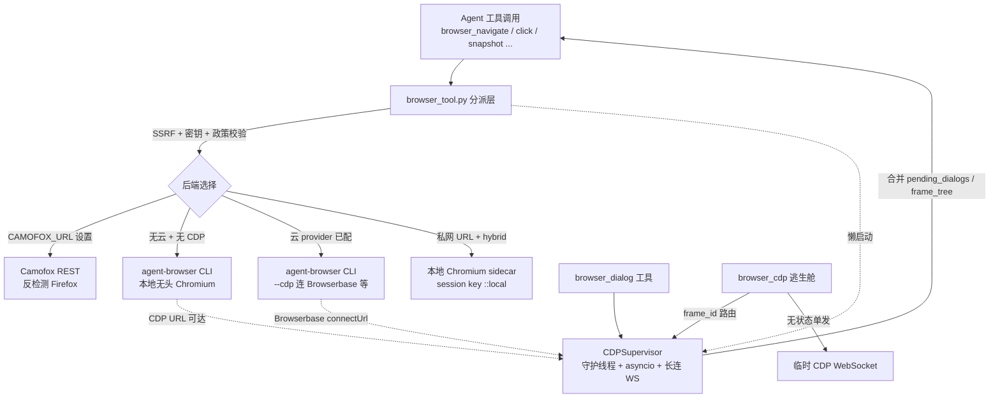

# R4-30 浏览器自动化栈(子代理底稿)

> 由子代理精读产出,主线抽查关键行号与定案(架构证实 + 1 处文档命名不符 browser_state→recent_dialogs)。
> 基线 863e31318。范围:browser_tool(5098)、browser_supervisor(1518)、browser_cdp_tool(684)、
> browser_dialog_tool(148)、browser_camofox(953)、browser_camofox_state(47)、
> agent/browser_provider(177)、agent/browser_registry(192)。

All evidence gathered. Here is the R4 deep-read draft.

---

# r4 · 浏览器自动化栈 L1 精读底稿

> 学习对象:NousResearch/hermes-agent @ `863e31318553cda8ad61df681d08175364d4164b`(只读)。
> 溯源约定:凡对代码行为的断言,紧跟 `路径:行号 @ 863e313` + 逐字代码摘录。行号已逐一实测,可抽查。
> 术语先锚一次:**CDP = Chrome DevTools Protocol**,Chrome 调试协议——浏览器暴露的一条 WebSocket,外部程序通过发 JSON 命令(`Runtime.evaluate`、`Page.navigate`……)直接驱动/观察浏览器内核。本簇几乎所有"真正控制浏览器"的能力最终都落到 CDP 上。

---

## 0. 文件清单与实测行数

`wc -l` 实测(与任务给定一致):

| 文件 | 行数 | 角色 |
|---|---|---|
| `tools/browser_tool.py` | 5098 | 核心分派层:9 个 agent 工具 + 会话模型 + SSRF/密钥防护 + 后端选择 + 清理/收割 |
| `tools/browser_supervisor.py` | 1518 | CDP supervisor:长连 WebSocket、对话框桥、frame/OOPIF 观察 |
| `tools/browser_cdp_tool.py` | 684 | `browser_cdp` raw CDP 逃生舱 |
| `tools/browser_dialog_tool.py` | 148 | `browser_dialog` 对话框应答工具 |
| `tools/browser_camofox.py` | 953 | Camofox(反检测 Firefox)REST 后端 |
| `tools/browser_camofox_state.py` | 47 | Camofox 持久化身份(profile-scoped userId) |
| `agent/browser_provider.py` | 177 | 云后端 provider 抽象基类(ABC) |
| `agent/browser_registry.py` | 192 | provider 注册表 + 选择解析 |

合计 8817 行。

---

## 1. 全景

### 1.1 两层结构:Python 分派层 vs 外部引擎

关键认知(读全簇后最重要的一句):**Hermes 自己不驱动浏览器内核。** `browser_tool.py` 是一层薄分派器,把 agent 的工具调用翻译成对某个"外部引擎"的调用,引擎有三类:

1. **`agent-browser` CLI**(一个独立的 Node 进程,基于 Playwright)——本地 Chromium 与云后端(Browserbase/Browser Use/Firecrawl)都走它,通过 `subprocess.Popen` fork-exec,每条命令一次进程;
   `tools/browser_tool.py:2546` @ 863e313
   ```python
   cmd_parts = cmd_prefix + backend_args + [
       "--json",
       command
   ] + args
   ```
2. **Camofox REST**——当 `CAMOFOX_URL` 设置时,`browser_*` 全部改走 HTTP REST(`requests.post/get`)打到自托管的 camofox-browser Node 服务;
   `tools/browser_camofox.py:457` @ 863e313
   ```python
   resp = requests.post(url, json=body, timeout=timeout, headers=_auth_headers())
   ```
3. **CDP WebSocket**——`browser_cdp` 逃生舱 + supervisor 直接跟 CDP 端点讲协议。

页面对模型的表示形态统一是**可访问性树(accessibility tree)文本快照**,而非像素坐标;交互元素带稳定 `ref`(`@e1`、`@e2`),模型按 ref 点/填。模块 docstring 明说:
`tools/browser_tool.py:11` @ 863e313
```python
The tool uses agent-browser's accessibility tree (ariaSnapshot) for text-based
page representation, making it ideal for LLM agents without vision capabilities.
```

### 1.2 后端矩阵(grep 数清楚)

代码里真实存在的后端/引擎(实测):

- **云 provider 三家**,注册在遗留 shim 里,插件目录也是三家(`plugins/browser/{browserbase,browser_use,firecrawl}`):
  `tools/browser_tool.py:669` @ 863e313
  ```python
  _PROVIDER_REGISTRY: Dict[str, type] = {
      "browserbase": BrowserbaseProvider,
      "browser-use": BrowserUseProvider,
      "firecrawl": FirecrawlProvider,
  }
  ```
- **本地 Chromium**(默认,零成本):无云凭据且无 CDP override 时,`_create_local_session` 生成 `--session` 名给 agent-browser 启无头 Chromium。
- **本地 Chromium/Chrome/Brave/Edge via CDP**(`/browser connect` 设 `BROWSER_CDP_URL`,或 config `browser.cdp_url`)——把工具指向用户自己开着 `--remote-debugging-port` 的浏览器。
- **Camofox**(反检测 Firefox,REST-only,无 CDP)。
- **Lightpanda 引擎**——注意这是 agent-browser 的 `--engine` 选项而非独立后端,取值 `auto`/`lightpanda`/`chrome`,带 Chrome 自动回退:
  `tools/browser_tool.py:947` @ 863e313
  ```python
  _VALID_ENGINES = {"auto", "lightpanda", "chrome"}
  ```
- **混合路由(hybrid)**:配了云 provider,但目标是私网/loopback URL 时,自动起一个本地 Chromium sidecar,公网 URL 仍走云。用 `::local` 后缀 session key 表达:
  `tools/browser_tool.py:1529` @ 863e313
  ```python
  _LOCAL_SUFFIX = "::local"
  ```

后端选择优先级(`_get_session_info` 内,`tools/browser_tool.py:2222-2231`):CDP override > force_local(hybrid sidecar)> 云 provider > 本地 Chromium 兜底。

### 1.3 supervisor 进程/线程模型

每个有可达 CDP 端点的 `task_id` 起一个 `CDPSupervisor`:一个**守护线程**跑自己的 **asyncio loop**,持有一条**长连 WebSocket** 到 CDP 端点,订阅 Page/Runtime/Target 事件,把"待应答对话框 + frame 树 + console 环形缓冲"维护成线程安全的快照,供同步的工具处理函数读。它**不在 agent 的工具 schema 里**,产出通过两条通道到模型:被 `browser_snapshot` 合并进返回值,以及 `browser_dialog` 工具反向调它应答对话框。
`tools/browser_supervisor.py:10` @ 863e313
```python
The supervisor is NOT in the agent's tool schema. Its output reaches the
agent via two channels:
```

### 1.4 快照驱动交互 vs raw CDP 逃生舱

- **主干**:9 个"意图级"工具(navigate/snapshot/click/type/scroll/back/press/get_images/vision/console),覆盖 90% 场景,模型看快照拿 ref 再动作。
- **逃生舱**:`browser_cdp` 直发任意 CDP 命令,补主干覆盖不到的长尾(cookie、视口、网络节流、iframe 内 eval、原生对话框底层处理)。仅当 CDP 端点可达才出现在工具集里。
  `tools/browser_cdp_tool.py:11` @ 863e313
  ```python
  This is the escape hatch for browser operations not covered by the main
  browser tool surface (``browser_navigate``, ``browser_click``,
  ```

全景协作图:



---

## 2. 机制(a):快照如何工作——DOM → 带稳定 ref 的可点击元素表

### 2.1 场景

模型要在 example.com 注册。它调 `browser_navigate("https://example.com/signup")`,期望**一次调用就拿到一份可操作的元素清单**(带 `@e3`、`@e5` 这种 ref),然后 `browser_type(ref="@e3", ...)`、`browser_click(ref="@e8")`。它从不接触像素坐标,也从不接触真实 DOM。

### 2.2 机制:ref 由外部引擎生成,Python 只搬运

快照文本和 ref 映射不是 Python 算的,是 agent-browser CLI 的 `snapshot` 命令返回的。Python 侧发 `snapshot -c`(compact),解析 `data.snapshot`(文本)+ `data.refs`(dict):
`tools/browser_tool.py:3149` @ 863e313
```python
snap_result = _run_browser_command(nav_session_key, "snapshot", ["-c"])
if snap_result.get("success"):
    snap_data = snap_result.get("data", {})
    snapshot_text = snap_data.get("snapshot", "")
    refs = snap_data.get("refs", {})
```

**navigate 自动附带快照**:`browser_navigate` 成功后自动跑一次 compact snapshot 塞进返回,省掉模型再单独调 `browser_snapshot`。schema 里明说这点:
`tools/browser_tool.py:1984` @ 863e313
```python
"description": "Navigate to a URL in the browser. ... Returns a compact page snapshot with interactive elements and ref IDs — no need to call browser_snapshot separately after navigating.",
```

**click/type 怎么按 ref 定位**:极简——把 `@eN` 原样透传给 CLI 的 `click`/`fill` 命令,ref 的解析(ref → 元素句柄)全在 agent-browser 里。Python 只补 `@` 前缀:
`tools/browser_tool.py:3292` @ 863e313
```python
if not ref.startswith("@"):
    ref = f"@{ref}"

result = _run_browser_command(effective_task_id, "click", [ref])
```
type 用的是 `fill` 命令(先清空再输入),schema 承诺"Clears the field first":
`tools/browser_tool.py:3337` @ 863e313
```python
result = _run_browser_command(effective_task_id, "fill", [ref, text])
```

### 2.3 大快照的三段式降级:阈值 → 摘要/截断 → 存全量给回读

超过 15000 字符触发降级:
`tools/browser_tool.py:271` @ 863e313
```python
SNAPSHOT_SUMMARIZE_THRESHOLD = 15000
```
`browser_snapshot` 的分叉——有 `user_task` 就 LLM 任务感知摘要,否则结构化截断:
`tools/browser_tool.py:3237` @ 863e313
```python
if len(snapshot_text) > SNAPSHOT_SUMMARIZE_THRESHOLD and user_task:
    snapshot_text = _extract_relevant_content(snapshot_text, user_task)
elif len(snapshot_text) > SNAPSHOT_SUMMARIZE_THRESHOLD:
    snapshot_text = _truncate_snapshot(snapshot_text)
```
无论摘要还是截断,**完整快照先落盘**到 `cache/web`,文件名按内容 hash 去重,返回值里给出路径 + 现成的 `read_file` 调用,让模型翻页——被摘要丢掉的 ref 仍在文件里:
`tools/browser_tool.py:2799` @ 863e313
```python
digest = hashlib.sha256(content.encode("utf-8")).hexdigest()[:10]
path = cache_dir / f"browser-snapshot-{digest}.txt"
path.write_text(content, encoding="utf-8")
```
截断按**行边界**切,不劈碎某个元素行:
`tools/browser_tool.py:2902` @ 863e313
```python
for line in lines:
    if chars + len(line) + 1 > max_chars - reserve:
        break
    result.append(line)
```

### 2.4 快照是密钥泄漏边界:强制脱敏

页面渲染出的 API key / cookie 可能进快照;工具输出是模型边界,所以**强制**脱敏(即便全局日志脱敏关掉):
`tools/browser_tool.py:2930` @ 863e313
```python
if isinstance(value, str):
    return redact_sensitive_text(value, force=True)
```
落盘的全量副本同样强制脱敏(`_store_full_snapshot` 里 `redact_sensitive_text(snapshot_text, force=True)`,`tools/browser_tool.py:2790`)。

### 2.5 设计理由 / 取舍 / 重实现要点

- **理由**:可访问性树是文本、语义化、稳定,天然适配无视觉能力的 LLM;ref 让模型无需理解坐标/CSS 选择器。模块 docstring:`tools/browser_tool.py:23`「Element interaction via ref selectors」。
- **取舍**:① 依赖外部 CLI 生成 ref,Python 无法独立复现——每条命令一次 fork-exec 有启动成本(见 §5 supervisor eval 快路径就是为省这个);② 15000 字符预算与 `web_extract` 对齐(文档 line 446),大页要么被摘要(有损、要 LLM 成本)要么被截断(要回读一跳)。
- **重实现要点**:ref 必须**稳定且跨快照可复用**(至少在同一页面态内),否则模型拿到的 ref 在下次动作时失效;把"生成模型可读表示"这件事下沉到浏览器驱动层,主 harness 只做搬运 + 降级 + 脱敏 + 落盘回读指针。

---

## 3. 机制(b):supervisor 进程模型 + 对话框桥

### 3.1 场景:一个 `confirm()` 把 agent 冻住

页面 JS 跑 `if (confirm("删除?")) {...}`。原生对话框会**阻塞页面 JS 线程**;没有监督,agent 完全不知道弹窗开着,后续 `browser_snapshot`/`browser_click` 要么挂起要么抛不透明错误。supervisor 就是为堵这个洞(以及 OOPIF 不可见)而生:
`tools/browser_supervisor.py:11` @ 863e313
```python
1. **Native JS dialogs** (`alert`/`confirm`/`prompt`/`beforeunload`) block the
   page's JS thread. Without supervision, the agent has no way to know a
   dialog is open — subsequent tool calls hang or throw opaque errors.
```

### 3.2 进程/线程/loop 三层与崩溃恢复

**启动**:`start()` 拉一个 daemon 线程,线程内建独立 asyncio loop 跑 `_run()`,`_ready_event` 同步"附着完成"信号,附着失败把异常经 `_start_error` 抛回同步调用方:
`tools/browser_supervisor.py:366` @ 863e313
```python
self._thread = threading.Thread(
    target=self._thread_main,
    name=f"cdp-supervisor-{self.task_id}",
    daemon=True,
)
self._thread.start()
if not self._ready_event.wait(timeout=timeout):
```

**崩溃恢复 = 自动重连循环**。这是 supervisor 最关键的鲁棒性设计:Browserbase 的 CDP 代理会在任意短命客户端(比如 agent-browser 每条命令那次 CDP 连接)断开时**把整条 CDP socket 拆掉**;supervisor 用带指数退避的重连循环扛过去,重连后重置 session id、重新附着,但**保留** `_pending_dialogs`/`_frames` 让事件重新对账:
`tools/browser_supervisor.py:646` @ 863e313
```python
Holds a reconnecting loop so we survive the remote closing the
WebSocket — Browserbase in particular tears down the CDP socket
every time a short-lived client (e.g. agent-browser's per-command
CDP client) disconnects.
```
`tools/browser_supervisor.py:734` @ 863e313
```python
await asyncio.sleep(backoff)
backoff = min(backoff * 2, 10.0)
```

**跨线程同步桥**:CDP I/O 全在 supervisor loop 上;外部同步调用方(工具处理函数)从不碰 loop,只经 `respond_to_dialog`/`evaluate_runtime`/`snapshot` 这些同步 API,内部用 `safe_schedule_threadsafe` 把协程投到 loop 上再等结果:
`tools/browser_supervisor.py:498` @ 863e313
```python
from agent.async_utils import safe_schedule_threadsafe
fut = safe_schedule_threadsafe(_do_respond(), loop)
```

**附着即订阅**:`Target.getTargets` 找 page → `attachToTarget(flatten=True)` → `Page.enable`/`Runtime.enable`/`Target.setAutoAttach` → 装对话框桥:
`tools/browser_supervisor.py:757` @ 863e313
```python
await self._cdp("Page.enable", session_id=self._page_session_id)
await self._cdp("Runtime.enable", session_id=self._page_session_id)
await self._cdp(
    "Target.setAutoAttach",
    {"autoAttach": True, "waitForDebuggerOnStart": False, "flatten": True},
```

**进程级崩溃(SIGKILL/网关重启)另有一层收割**:supervisor 的重连只管 WS 掉线;若整个 Hermes Python 进程死了,agent-browser 的 Node+Chromium 会变孤儿。`browser_tool.py` 用 `.owner_pid` 文件 + psutil 双重校验(身份 + 绑定本 session socket 目录)来安全收割,fail-closed:
`tools/browser_tool.py:1758` @ 863e313
```python
looks_like_browser = "agent-browser" in name or "agent-browser" in cmdline
```
`tools/browser_tool.py:1781` @ 863e313
```python
if not bound:
    logger.warning(
        "Refusing to reap agent-browser PID %d: not bound to session "
```

### 3.3 为什么 alert/confirm 要单独"桥接"——对话框桥

**问题的因果经过**:Browserbase 的 CDP 代理内部用 Playwright,会在约 10ms 内**服务端自动 dismiss** 掉真实原生对话框——等 supervisor 收到事件再发 `Page.handleJavaScriptDialog` 已经晚了,对话框早没了,agent 永远来不及应答。
`website/docs/developer-guide/browser-supervisor.md:32` @ 863e313
```
**Browserbase quirk.** Browserbase's CDP proxy uses Playwright internally and
auto-dismisses native dialogs within ~10ms, so `Page.handleJavaScriptDialog`
can't keep up. The supervisor injects a bridge script via
`Page.addScriptToEvaluateOnNewDocument` that overrides
`window.alert`/`confirm`/`prompt` with a synchronous XHR to a magic host
(`hermes-dialog-bridge.invalid`). `Fetch.enable` intercepts those XHRs before
they touch the network — the dialog becomes a `Fetch.requestPaused` event the
supervisor captures, and `respond_to_dialog` fulfills via
`Fetch.fulfillRequest` with a JSON body the injected script decodes.
```

**解法**:根本不让原生对话框触发。往每个 frame 注入一段脚本,把 `window.alert/confirm/prompt` **重写**成一次**同步 XHR** 打到一个魔法 invalid 主机 `hermes-dialog-bridge.invalid`;这个主机根本不需要存在,因为请求在网络解析前就被 CDP `Fetch` 域截住:
`tools/browser_supervisor.py:95` @ 863e313
```python
DIALOG_BRIDGE_HOST = "hermes-dialog-bridge.invalid"
DIALOG_BRIDGE_URL_PATTERN = f"http://{DIALOG_BRIDGE_HOST}/*"
```
注入脚本核心(同步 XHR,阻塞页面 JS 线程直到我们回填):
`tools/browser_supervisor.py:118` @ 863e313
```python
xhr.open("GET", ENDPOINT + "?" + params.toString(), false);  // sync
xhr.send(null);
```
注入用 `addScriptToEvaluateOnNewDocument` + `Fetch.enable` 只截桥 URL:
`tools/browser_supervisor.py:785` @ 863e313
```python
await self._cdp(
    "Page.addScriptToEvaluateOnNewDocument",
    {"source": _DIALOG_BRIDGE_SCRIPT, "runImmediately": True},
```
`tools/browser_supervisor.py:797` @ 863e313
```python
await self._cdp(
    "Fetch.enable",
    {
        "patterns": [
            {
                "urlPattern": DIALOG_BRIDGE_URL_PATTERN,
                "requestStage": "Request",
            }
```

**捕获**:桥 XHR 被 `Fetch.requestPaused` 事件抓到,解析 query 里的 kind/message,材料化成一个带 `bridge_request_id` 的 `PendingDialog`:
`tools/browser_supervisor.py:1130` @ 863e313
```python
self._dialog_seq += 1
dialog = PendingDialog(
    id=f"d-{self._dialog_seq}",
    type=kind,
    ...
    bridge_request_id=str(request_id),
)
```
**应答**:agent 调 `browser_dialog(action=...)` → supervisor 对桥类对话框走 `Fetch.fulfillRequest` 回一段 JSON body(而非 `handleJavaScriptDialog`),注入脚本解析后让 `confirm()`/`prompt()` 在页面里返回 agent 给的值:
`tools/browser_supervisor.py:1182` @ 863e313
```python
await self._cdp(
    "Fetch.fulfillRequest",
    {
        "requestId": dialog.bridge_request_id,
        "responseCode": 200,
        ...
        "body": _b64.b64encode(body).decode(),
    },
```
两条路径(真原生 / 桥)在数据结构里用 `bridge_request_id` 是否为空区分,`PendingDialog` 注释点破:
`tools/browser_supervisor.py:171` @ 863e313
```python
# When set, the dialog was captured via the bridge XHR path (Fetch domain).
# Response must be delivered via Fetch.fulfillRequest, NOT
# Page.handleJavaScriptDialog — the native dialog never fired.
```

### 3.4 对话框政策与看门狗

三政策:`must_respond`(默认,挂起等 agent,300s 看门狗兜底防死等)/`auto_dismiss`/`auto_accept`:
`tools/browser_supervisor.py:77` @ 863e313
```python
DEFAULT_DIALOG_POLICY = DIALOG_POLICY_MUST_RESPOND
DEFAULT_DIALOG_TIMEOUT_S = 300.0
```
`must_respond` 下入队并 arm 一个 `call_later` 看门狗,超时自动 dismiss + 记 `watchdog` 归档,避免 buggy agent 永久卡死:
`tools/browser_supervisor.py:941` @ 863e313
```python
loop = asyncio.get_running_loop()
handle = loop.call_later(
    self.dialog_timeout_s,
    lambda: asyncio.create_task(self._dialog_timeout_expired(dialog.id)),
)
```
`recent_dialogs` 环形缓冲(最多 20)带 `closed_by` 标签(`agent`/`auto_policy`/`watchdog`/`remote`),让 Browserbase 上"服务端 remote dismiss"的对话框事后仍可见:
`tools/browser_supervisor.py:87` @ 863e313
```python
# Keep the last N closed dialogs in ``recent_dialogs`` so agents on backends
# that auto-dismiss server-side (e.g. Browserbase) can still observe that a
# dialog fired, even if they couldn't respond to it in time.
RECENT_DIALOGS_MAX = 20
```

### 3.5 frame 树 / OOPIF 观察

`Target.setAutoAttach` 让子 target(OOPIF 跨源 iframe、worker)自动附着;每个 iframe 子 session 也装对话框桥(iframe 内的 alert 也要抓)+ 记录其 `cdp_session_id` 供交互路由:
`tools/browser_supervisor.py:1287` @ 863e313
```python
self._frames[target_id] = FrameInfo(
    frame_id=target_id,
    url=str(info.get("url") or ""),
    origin="",  # filled by frameNavigated on the child session
    parent_frame_id=(existing.parent_frame_id if existing else None),
    is_oopif=True,
    cdp_session_id=sid,
```
frame 树 BFS 构建并**双重封顶**(30 条目 + OOPIF 深度 2),防广告页爆快照:
`tools/browser_supervisor.py:81` @ 863e313
```python
FRAME_TREE_MAX_ENTRIES = 30
FRAME_TREE_MAX_OOPIF_DEPTH = 2
```
`detach` 时**故意不删** frame,只清 session 绑定——Browserbase 会在页面切换时发瞬态 detach,删了会让 OOPIF 在 agent 眼里闪没:
`tools/browser_supervisor.py:1325` @ 863e313
```python
We deliberately DO NOT drop frames from ``_frames`` here — Browserbase
fires transient detach events during page transitions even while the
iframe is still visible to the user, and dropping the record hides
OOPIFs from the agent between the detach and the next
``Target.attachedToTarget``. Instead, we just clear the session
binding so stale ``cdp_session_id`` values aren't used for routing.
```

### 3.6 快照合并与工具网关

`browser_snapshot` 在返回前把 supervisor 快照 merge 进去(仅当有 supervisor):
`tools/browser_tool.py:3254` @ 863e313
```python
_supervisor = SUPERVISOR_REGISTRY.get(effective_task_id)
if _supervisor is not None:
    _sv_snap = _supervisor.snapshot()
    if _sv_snap.active:
        response.update(_redact_browser_output(_sv_snap.to_dict()))
```
`browser_dialog` 是 response-only 工具,先读快照 `pending_dialogs` 再应答;无 supervisor 时给明确错误(Camofox/默认 Playwright 无 CDP):
`tools/browser_dialog_tool.py:104` @ 863e313
```python
result = supervisor.respond_to_dialog(
    action=action,
    prompt_text=prompt_text,
    dialog_id=dialog_id,
)
```
注册表(`SupervisorRegistry`)按 `task_id` 幂等 get_or_start,URL 变或不健康就拆旧起新:
`tools/browser_supervisor.py:1458` @ 863e313
```python
if existing.cdp_url == cdp_url:
    thread_ok = existing._thread is not None and existing._thread.is_alive()
    loop_ok = existing._loop is not None and existing._loop.is_running()
    if thread_ok and loop_ok:
        return existing
```
supervisor 由 `_ensure_cdp_supervisor` 懒启动,失败**全吞**——附着不上顶多没有 `pending_dialogs`/`frame_tree`,绝不弄坏浏览器会话本体:
`tools/browser_tool.py:609` @ 863e313
```python
Swallows all errors — failing to attach the supervisor must not break
the browser session itself.  The agent simply won't see
``pending_dialogs`` / ``frame_tree`` fields in snapshots.
```

### 3.7 设计理由 / 取舍 / 重实现要点

- **理由**:原生对话框阻塞 JS 线程是 headless 自动化的经典死穴;云代理服务端 auto-dismiss 是第二层坑。桥用"JS 层重写 + Fetch 拦截"绕过了"CDP 事件到达太晚"的时序竞争——从页面视角 `prompt()` 照常返回字符串,从 agent 视角始终是同一个 `browser_dialog(action=...)` API(文档 line 42-44)。
- **取舍**:① 桥改写了页面全局 `alert/confirm/prompt`,`onbeforeunload` 因为无法同步提示而**留原生行为**(`tools/browser_supervisor.py:149` 注释明说);② 每 task 一条长连 WS + 一个线程 + 一个 loop,是常驻资源成本;③ Camofox REST-only 完全没有这层能力(见 §7)。
- **重实现要点**:关键不是"监听对话框事件",而是**不让阻塞式原生对话框发生**——在受控注入点把阻塞语义换成"可被 harness 回填的同步请求"。跨线程务必走"投递协程到专属 loop + future 等结果"的桥,别在工具线程里直接碰 asyncio。重连要保留观察态、重置连接态。

---

## 4. 机制(c):多后端 registry(provider 可插拔)

### 4.1 场景

用户同时配了 `FIRECRAWL_API_KEY`(本是给 web_extract 用的)和一个想用的 Browserbase。系统必须**不**因为 Firecrawl key 存在就把浏览器悄悄路由到付费 Firecrawl。

### 4.2 机制:ABC + 注册表 + 三级解析

`BrowserProvider` ABC 定契约:`name`/`is_available`/`create_session`/`close_session`/`emergency_cleanup`,session 元数据形状固定(含 `cdp_url`、遗留键名 `bb_session_id`),让分派器是**纯注册表查表、零 per-provider 分支**:
`agent/browser_provider.py:58` @ 863e313
```python
The lifecycle shape preserves the legacy ``CloudBrowserProvider`` contract
bit-for-bit so the dispatcher in :mod:`tools.browser_tool` is a pure
registry lookup — no per-provider conditionals, no shape translation.
```
`is_available` 契约**禁止网络调用**(注册期/每次 `hermes tools` 都会跑):
`agent/browser_provider.py:82` @ 863e313
```python
Typically a cheap check (env var present, managed-gateway token
readable, optional Python dep importable). Must NOT make network
calls
```
注册表 `_resolve` 三级:① 显式 `local` → None(禁云);② 显式配置名**无视 is_available** 直接返回(为的是给用户精确的"X_API_KEY 未设"报错而非静默换后端);③ 遗留偏好序 `browser-use → browserbase` 按可用性过滤:
`agent/browser_registry.py:167` @ 863e313
```python
if configured:
    provider = snapshot.get(configured)
    if provider is not None:
        return provider
```
`agent/browser_registry.py:107` @ 863e313
```python
_LEGACY_PREFERENCE = (
    "browser-use",
    "browserbase",
)
```
**Firecrawl 故意不在自动序里**——因为它和 web-extract 插件共用 key,自动路由会让只想用 web-extract 的用户白烧付费浏览器额度;必须显式 `browser.cloud_provider: firecrawl` 才生效:
`agent/browser_registry.py:19` @ 863e313
```python
``firecrawl`` is
intentionally NOT in the legacy walk — users only get Firecrawl as a
cloud browser when they explicitly set ``browser.cloud_provider:
firecrawl``
```

### 4.3 遗留 shim 与测试面兼容

`browser_tool.py` 里 `_PROVIDER_REGISTRY` 是遗留 class-name shim,仅为让 monkeypatch 的测试夹具继续工作;真实查询已改走 `agent.browser_registry`:
`tools/browser_tool.py:659` @ 863e313
```python
The legacy
class-name registry below is preserved as a backward-compat shim so test
fixtures ... keep working — but ``_get_cloud_provider()`` now consults
:mod:`agent.browser_registry` for the actual lookup.
```
ABC 还保留 `is_configured()`/`provider_name()` 老名做薄委托,避免改~6处 callsite 和下游子类:
`agent/browser_provider.py:171` @ 863e313
```python
def is_configured(self) -> bool:
    """Backward-compat alias for :meth:`is_available`."""
    return self.is_available()
```
云 provider 失败会**降级到本地 Chromium** 并标 `fallback_from_cloud`:
`tools/browser_tool.py:2260` @ 863e313
```python
session_info["fallback_from_cloud"] = True
session_info["fallback_reason"] = str(e)
session_info["fallback_provider"] = provider_name
```

### 4.4 设计理由 / 取舍 / 重实现要点

- **理由**:provider 以插件形式活在 `plugins/browser/<vendor>/`,import 期自注册,新增后端不改核心;ABC 形状 bit-for-bit 兼容旧契约,分派器无分支。
- **取舍**:遗留 shim + 双注册表(class-name shim 与真 registry 并存)是历史包袱,靠 `_is_legacy_provider_registry_overridden` 判是否被测试 patch 来切路径——可读性代价换测试稳定性。
- **重实现要点**:① 后端选择要"显式配置无视可用性"以便给精确报错;② 共享凭据的后端要 opt-in 门禁防误路由;③ provider 探测函数严禁网络 I/O(在启动热路径上);④ 失败要有本地兜底并可观测。

---

## 5. 机制(d):raw CDP 逃生舱为什么存在

### 5.1 场景

agent 要读某跨源广告 iframe 里的 `document.title`,或设 cookie、改视口——主干 9 工具都没有对应意图。它调 `browser_cdp(method="Runtime.evaluate", frame_id="<OOPIF>", params={...})`。

### 5.2 机制:两条路径(无状态单发 vs supervisor 路由)

`browser_cdp` 分两路。**有 `frame_id`** → 走 supervisor 的活连接,查 frame 拿子 `cdp_session_id`,把命令投到 supervisor loop 上用那条已连 WS 发:
`tools/browser_cdp_tool.py:361` @ 863e313
```python
async def _do_cdp():
    return await supervisor._cdp(  # type: ignore[attr-defined]
        method,
        params or {},
        session_id=child_sid,
        timeout=timeout,
    )
```
为什么必须走 supervisor?因为**无状态单发在 Browserbase 上会撞签名 URL 过期**——每次 `browser_cdp` 新开一条 CDP 连接跟不上 Browserbase 的签名 URL 轮换,只有 supervisor 的长连有效 session 能撑住:
`tools/browser_cdp_tool.py:414` @ 863e313
```python
frame is an OOPIF with a live session tracked by the CDP
supervisor), routes the call through the supervisor's existing
WebSocket — which is how you Runtime.evaluate *inside* an
iframe on backends where per-call fresh CDP connections would
hit signed-URL expiry (Browserbase)
```
**无 `frame_id`** → 无状态路径,`attachToTarget(flatten=True)` 在同一 browser-level WS 上多路复用一个 page session 发命令,连接用完即弃:
`tools/browser_cdp_tool.py:197` @ 863e313
```python
When ``target_id`` is provided, we call ``Target.attachToTarget`` with
``flatten=True`` to multiplex a page-level session over the same
browser-level WebSocket, then send ``method`` with that ``sessionId``.
```

### 5.3 逃生舱不是安全后门:共用私网/密钥防护

逃生舱**继承**主干的 SSRF/私网边界——否则它就成了绕过 `browser_snapshot`/`browser_console` 防护的"兄弟旁路"。若云浏览器已落在私网页面,除白名单只读方法(如 `Target.getTargets`/`Page.navigate`)外的 raw CDP 一律拦:
`tools/browser_cdp_tool.py:137` @ 863e313
```python
``browser_cdp`` is intentionally an escape hatch, but it still shares the
same cloud/private-network boundary as ``browser_snapshot``,
``browser_console`` and ``browser_eval``.
```
白名单(只读/导航,不读页面 body/cookie/DOM):
`tools/browser_cdp_tool.py:31` @ 863e313
```python
_CDP_PRIVATE_PAGE_ALLOWED_METHODS = {
    # Browser/target inspection does not read the current page body, cookies,
    # DOM, storage, or screenshots. Keep these working so the model can list
    # tabs or navigate away from a blocked page.
    "Browser.getVersion",
    "Target.getTargets",
    "Target.attachToTarget",
    "Target.detachFromTarget",
    "Page.navigate",
    "Page.reload",
    "Page.stopLoading",
}
```
CDP 结果同样强制脱敏(`_redact_cdp_output`,`tools/browser_cdp_tool.py:50`)。

### 5.4 可用性门禁:无 I/O 的 gate

`_browser_cdp_check` 仅当能拿到静态 CDP URL 才让工具出现,且**不做网络 I/O**(check_fn 在每次启动装配 schema 时跑,阻塞不起):
`tools/browser_cdp_tool.py:664` @ 863e313
```python
# Raw (no-I/O) gate: check_fns run during tool-schema assembly at every
# startup; resolving the endpoint over HTTP here would block launch when
# the configured endpoint is stale/unreachable.
return bool(_get_cdp_override_raw())
```

### 5.5 supervisor 长连的第二个红利:eval 快路径

`browser_console(expression=...)` 若有活 supervisor,`Runtime.evaluate` 直接走它的长连 WS,省掉 agent-browser 每次 fork-exec+Node 启动+CDP 建连:
`tools/browser_tool.py:3857` @ 863e313
```python
supervisor = SUPERVISOR_REGISTRY.get(effective_task_id)
if supervisor is not None:
    sup_result = supervisor.evaluate_runtime(expression)
```
`evaluate_runtime` 还处理了 `returnByValue=True` 对 DOM 节点深序列化爆"reference chain too long"的退化,自动重试 `returnByValue=False` 拿描述串:
`tools/browser_supervisor.py:575` @ 863e313
```python
if return_by_value and "reference chain is too long" in str(exc).lower():
    try:
        response = _run_eval(False)
```

### 5.6 设计理由 / 取舍 / 重实现要点

- **理由**:主干工具是"意图级、稳定、防护到位"的窄接口;CDP 有几百个方法,不可能都包成工具。逃生舱补长尾,又不牺牲防护(继承 SSRF、脱敏、门禁)。
- **取舍**:无状态单发"每次独立、事件订阅不跨调用持久"(schema 里明说),对状态化流程不友好——所以有状态的用 `frame_id` 走 supervisor 或用主干工具;逃生舱当前**未接云 provider 的 per-session CDP**(文档承认是 follow-up)。
- **重实现要点**:逃生舱必须与主干共享同一套安全边界(白名单 + 私网 gate + 脱敏),否则等于开后门;门禁 check_fn 保持无 I/O;长连能同时服务"iframe 路由"和"eval 提速"两个用途,值得复用。

---

## 6. 定案任务:▲/◇ 架构断言核对(查 website/docs 对照)

R1 报告断言:**浏览器自动化架构 = CDP supervisor + 对话框桥 + raw CDP 逃生舱 + Camofox/云后端矩阵**。逐条核对代码与 `website/docs`:

**结论:R1 断言总体证实(名副其实),文档覆盖充分且与代码高度一致;发现 1 处文档-代码命名不符(◇),记录如下。**

| 断言组件 | 代码证据 | 文档证据 | 判定 |
|---|---|---|---|
| CDP supervisor(长连 WS + frame 观察) | `browser_supervisor.py:289` `CDPSupervisor` | `developer-guide/browser-supervisor.md` 整篇 + `browser.md:574` | ✓ 证实 |
| 对话框桥(注入 XHR + Fetch 拦截) | `browser_supervisor.py:95,785,1182` | `browser-supervisor.md:32-44`;`browser.md:584` | ✓ 证实,机制描述与代码逐字对应 |
| raw CDP 逃生舱 | `browser_cdp_tool.py:394` | `browser.md:523-563` | ✓ 证实 |
| Camofox 后端(REST,反检测) | `browser_camofox.py:1-24,115` | `browser.md:123-305` | ✓ 证实 |
| 云后端矩阵(3 家 + hybrid) | `browser_tool.py:669`;`browser_registry.py` | `browser.md:12-121` | ✓ 证实 |

**▲ 结构性文档亮点(证实且超预期)**:`browser-supervisor.md` 的后端支持矩阵(line 26-30)与代码后端能力完全吻合:Local Chrome/Browserbase 全支持对话框检测+应答,Camofox `✗ no CDP (REST-only)`——与 `is_camofox_mode`/`_browser_cdp_check` 的门禁一致。文档甚至写明 Browserbase 桥的 ~10ms auto-dismiss 竞态成因,与 `_DIALOG_BRIDGE_SCRIPT` 注释同源。

**◇ 文档-代码命名不符(以代码为准)**:两处文档把"事后可见的历史对话框"字段叫 `browser_state`,但代码里**根本没有 `browser_state` 这个键**——实际合并进 `browser_snapshot` 的键是 `recent_dialogs`(及 `pending_dialogs`/`frame_tree`)。
- 文档:`website/docs/developer-guide/browser-supervisor.md:89`「agent sees it after the fact via `browser_state` inside `browser_snapshot`」;`website/docs/user-guide/features/browser.md:591`「Agent still sees the dialog in `browser_state` history」。
- 代码(实际键名):`tools/browser_supervisor.py:282` @ 863e313
  ```python
  if self.recent_dialogs:
      out["recent_dialogs"] = [d.to_dict() for d in self.recent_dialogs]
  ```
  grep 全代码 `browser_state` 命中 0(仅两处文档命中)。**修正**:文档应把 `browser_state` 改为 `recent_dialogs`;按"文档-代码冲突以代码为准",实际字段是 `recent_dialogs`。

**◇ 次要口径差**:`browser-supervisor.md:30` 后端矩阵给 Camofox 的 frame tree 记为「partial via DOM snapshot」,而 `browser.md:582` 的对话框矩阵直接记 Camofox 检测 `✗`。两处不矛盾(前者说 DOM 快照能露 iframe 结构,后者说无 CDP 对话框检测),但同一 Camofox 能力在两张表里粒度不同,读者需合看。不影响 R1 断言。

---

## 7. 机制(e):Camofox 反检测后端(补完矩阵)

### 7.1 场景

用户要爬一个上了激进 bot 检测的站,不想用云。他自托管 camofox-browser(Camoufox = Firefox fork,C++ 指纹伪造),设 `CAMOFOX_URL=http://localhost:9377`,所有 `browser_*` 自动改走 Camofox REST。

### 7.2 机制:REST 1:1 映射 + 独立 session 模型

`is_camofox_mode()` 是全簇的分叉开关,且 **CDP override 优先于 Camofox**(有 CDP 时 Camofox 让位,且 CDP 后端按非本地做 SSRF 检查):
`tools/browser_camofox.py:127` @ 863e313
```python
if os.getenv("BROWSER_CDP_URL", "").strip():
    return False
if _config_cdp_url():
    return False
return bool(get_camofox_url())
```
每个主干工具开头 `if _is_camofox_mode(): return camofox_xxx(...)` 转发,例如:
`tools/browser_tool.py:3038` @ 863e313
```python
if _is_camofox_mode():
    from tools.browser_camofox import camofox_navigate
    return camofox_navigate(url, task_id)
```
Camofox 自有 `task_id → {user_id, tab_id}` session map(REST 概念:userId + tabId),navigate 打 `POST /tabs/{tab}/navigate`,自动补 compact 快照:
`tools/browser_camofox.py:508` @ 863e313
```python
data = _post(
    f"/tabs/{session['tab_id']}/navigate",
    {"userId": session["user_id"], "url": browser_url},
    timeout=60,
)
```
click/type 打 `POST /tabs/{tab}/click|type`,ref 去掉 `@` 前缀(Camofox 约定):
`tools/browser_camofox.py:667` @ 863e313
```python
data = _post(
    f"/tabs/{session['tab_id']}/click",
    {"userId": session["user_id"], "ref": clean_ref},
)
```

### 7.3 持久化身份与外部管理会话

`managed_persistence` 开启后用**确定性 profile-scoped userId**(uuid5 派生自 profile 目录),让 Camofox server 把它映射到持久 Firefox profile,cookies/登录跨重启存活:
`tools/browser_camofox_state.py:36` @ 863e313
```python
user_digest = uuid.uuid5(
    uuid.NAMESPACE_URL,
    f"camofox-user:{scope_root}",
).hex[:10]
```
外部集成可通过 `CAMOFOX_USER_ID`/`CAMOFOX_SESSION_KEY` 让 Hermes 进同一 profile,并"收养"已存在 tab(`GET /tabs` 找匹配 `listItemId`):
`tools/browser_camofox.py:344` @ 863e313
```python
matching_tabs = [
    tab
    for tab in tabs
    if isinstance(tab, dict) and tab.get("listItemId") == session_key
]
```

### 7.4 Docker loopback 重写与 VNC 直播

Docker 托管 Camofox 时,`CAMOFOX_URL` 指宿主发布端口(对),但页面 URL `http://127.0.0.1:3000` 在容器内 loopback 指向容器(错),需重写为 `host.docker.internal`(opt-in):
`tools/browser_camofox.py:302` @ 863e313
```python
rewritten = urlunsplit(
    SplitResult(parsed.scheme, f"{userinfo}{host_part}{port_part}", parsed.path, parsed.query, parsed.fragment)
)
```
`/health` 若报 `vncPort`,navigate 返回带 `vnc_url` 让用户实时看浏览器:
`tools/browser_camofox.py:146` @ 863e313
```python
if isinstance(vnc_port, int) and 1 <= vnc_port <= 65535:
    from urllib.parse import urlparse
    parsed = urlparse(url)
    host = parsed.hostname or "localhost"
    _vnc_url = f"http://{host}:{vnc_port}"
```

### 7.5 取舍 / 重实现要点

- **取舍**:Camofox 是**本地后端**(`_is_local_backend` 对它返回 True,`tools/browser_tool.py:896`),因此 SSRF 私网 gate 对它放宽(用户本机已有全网络权限);但仍有 `_camofox_private_page_block` 在非本地判定下守 snapshot/vision/click(与主干 eval-guard 同构)。无 CDP → 无对话框/OOPIF 能力,是矩阵里的能力空档(文档 line 46 承认 upstream gap)。
- **重实现要点**:多后端要有**单一分叉开关**(此处 `is_camofox_mode`)且定义清晰的优先级(CDP > Camofox);REST 后端也要复刻"ref 表示 + 密钥脱敏 + 私网 gate"这套横切关注点,不能因为换传输就丢防护(type 脱敏见测试 §8)。

---

## 8. tests/ 本簇测试盘点(读代码,不运行)

`find tests -name '*browser*' -o -name '*cdp*' -o -name '*camofox*'` 命中的**源文件**(去 `__pycache__`)共约 42 个,分布:`tests/tools/`(约 33,主战场)、`tests/hermes_cli/`(browser connect / dashboard 安全导入 / graphical 检测)、`tests/cli/`、`tests/docker/`、`tests/plugins/browser/`(provider 插件)、`tests/`(install.sh)。与本簇机制最贴合的在 `tests/tools/`:supervisor、cdp_tool、dialog、camofox*(7 个)、eval/console SSRF、type 脱敏、cloud fallback、orphan reaper、hybrid routing、supervisor healthcheck 等。

挑 3 个最像"行为规格"的:

### (1) `tests/tools/test_browser_supervisor.py`(353 行)——对话框桥端到端行为规格

用**真实本地 Chrome**(`--remote-debugging-port` + `--site-per-process` 造真 OOPIF)跑,双重 opt-in(`@pytest.mark.integration` + `HERMES_E2E_BROWSER=1`),`tests/tools/test_browser_supervisor.py:43-53`。断言的行为:
- `test_supervisor_start_and_snapshot`:附着后 `snap.active is True`、`pending_dialogs == ()`、导航后有 `frame_tree.top`(line 233-237)。
- `test_main_frame_alert_detection_and_dismiss`:主帧 `alert('PYTEST-MAIN-ALERT')` 被捕获为 `type=="alert"` 且 message 含标记,`respond_to_dialog("dismiss")` 返回 `ok`,之后 `pending_dialogs` 清空(line 247-256)——即"检测→应答→状态清理"闭环。
- `test_prompt_dialog_with_response_text`:`prompt()` 的 `default_prompt=="default-x"`,`accept(prompt_text="PYTEST-PROMPT-REPLY")` 成功(line 289-293)——验证 prompt 回值 round-trip。
- `test_browser_dialog_tool_end_to_end`:直接调工具 `browser_dialog(action="dismiss")` 返回 `success/action/dialog.message`(line 306-309)——验证 agent 面。
- `test_evaluate_runtime_unserializable_value`:`Infinity`/`NaN`/`BigInt` 经 `unserializableValue` 回来(line 343+)——验证 §5.5 退化路径。
- 真 OOPIF 的 `browser_cdp(frame_id=)` 因 venv asyncio 版本怪癖在 pytest 里 skip,但用 `/tmp/dialog-iframe-test/` 两个 smoke 脚本手工验证过并留证(line 312-340)——一条诚实的"测试环境局限"记录。

### (2) `tests/tools/test_browser_cdp_tool.py`(420 行)——逃生舱防护行为规格

纯 mock CDP server,断言的行为:
- `test_browser_level_redacts_secret_result`:CDP 返回 `sk-...CDPSECRETRESULT...`,序列化后**不含**原文密钥、只留 `sk-` 前缀(line 198-201)——脱敏边界规格。
- `test_no_endpoint_returns_helpful_error` / `test_websockets_missing_returns_error`:无端点/无 websockets 包时给可操作报错(line 169-188)。
- `test_runtime_evaluate_blocked_when_current_page_is_private` / `test_page_navigate_to_private_url_blocked_before_cdp` / `test_frame_id_route_blocked_when_current_page_is_private`:页面落私网时 `Runtime.evaluate`、`Page.navigate` 到私网、frame_id 路由**全被拦**(line 237-334)——即"逃生舱不成为 SSRF 旁路"的规格。
- `test_frame_id_route_allowed_when_page_is_not_private`:非私网时 frame_id 路由放行(line 304)——防护不误伤正常路径。
- `test_check_fn_does_not_probe_network`:check_fn **不做网络探测**(line 396)——§5.4 无 I/O 门禁规格。

### (3) `tests/tools/test_browser_camofox.py`(364 行)——Camofox REST 行为规格

`requests.post/get` 全 mock,按能力分类断言:
- `TestCamofoxMode::test_disabled_by_default` / `test_health_check_unreachable`:无 `CAMOFOX_URL` 时不启用、健康检查不可达返回 False(line 31-64)。
- loopback 重写:`test_rewrites_localhost_when_enabled`(开关开则改写)、`test_env_alias_takes_precedence`(env 覆盖 config,line 66-100)。
- `test_creates_tab_on_first_navigate` / `test_returns_snapshot`:首次 navigate 建 tab、snapshot 走 REST 返回 refsCount(line 101-154)。
- **type 密钥脱敏(与主干等价)**:`test_type_redacts_api_key`——type `sk-proj-ABCD...`,返回 `success` 但 JSON 里**不含**原文、`typed` 只留 `sk-pro` 前缀(line 175-178);`test_type_failure_redacts_api_key`——连**异常消息里**的密钥也脱敏(line 189-194)。这正是 §7.5"换传输不丢横切防护"的规格化。
- `test_browser_navigate_routes_to_camofox`:验证主干 `browser_navigate` 在 Camofox 模式下确实转发(line 349)——分叉开关规格。

---

## 9. 可迁移设计原则(造自己的 harness)

1. **驱动层下沉、harness 只做搬运 + 横切**:把"生成模型可读表示 + 稳定 ref"交给专门的浏览器驱动(CLI/REST/CDP),harness 专注降级、脱敏、落盘回读、会话隔离、安全 gate。
2. **意图级窄工具 + raw 逃生舱**双层工具面:窄工具稳定好用,逃生舱补长尾,但逃生舱**必须继承同一套安全边界**,否则等于开后门。
3. **常驻 supervisor 解决"阻塞式副作用"**:原生对话框这类阻塞 JS 线程的东西,不要靠"事件到达后补救"(会输时序竞争),而要在受控注入点**把阻塞语义换成可回填的同步请求**;跨线程一律走"投协程到专属 loop + future"的桥。
4. **重连保留观察态、进程崩溃另设收割**:WS 掉线自动重连并保留 dialog/frame 观察态;整进程崩溃用 owner-pid + 强身份校验(fail-closed)收割孤儿子进程。
5. **后端可插拔 = ABC + 注册表 + 三级解析**:显式配置无视可用性(为精确报错)、共享凭据后端 opt-in 门禁(防误路由)、探测函数零网络 I/O、失败有本地兜底且可观测。
6. **安全是横切不可因传输而丢**:密钥强制脱敏(模型边界)、URL 密钥/IMDS 无条件拦、私网 SSRF 按"后端是否本地"分级、eval/vision/snapshot/raw-CDP 共用同一 private-page gate 防兄弟旁路。

---

## 10. 延伸 / 待深挖(留给后续轮次或成品章)

- `browser_vision` 的"原生视觉模型 vs 辅助视觉模型回退 + annotate 叠标注 + Lightpanda 预路由到 Chrome 截图"(`tools/browser_tool.py:4170+`)本稿只做结构级,未逐行;`browser_get_images`、录制(`_maybe_start/stop_recording`)、headed 模式跨轮保活亦然。
- SSRF/密钥防护子系统(`_is_safe_url`/`_is_always_blocked_url`/`_sensitive_query_param_name`/`_PREFIX_RE`/`redact_sensitive_text`)本稿按"边界点"引用,其规则细节属安全簇,建议并入安全轮统一精读。
- 清理/收割全景(inactivity 双端超时:Python 侧 `_cleanup_inactive_browser_sessions` + daemon 侧 `AGENT_BROWSER_IDLE_TIMEOUT_MS`,`tools/browser_tool.py:2578`)、`cleanup_all_browsers` atexit 已读结构,未逐行。
- provider 插件具体实现(`plugins/browser/{browserbase,browser_use,firecrawl}/`)不在本簇 8 文件范围,矩阵完整性需读插件方能闭环。

---

（底稿完。全部行号基于 `863e31318553cda8ad61df681d08175364d4164b`,`wc -l` 与 grep 结果均实测;定案发现 1 处文档-代码命名不符 `browser_state`→`recent_dialogs`,已按"以代码为准"记录。）
