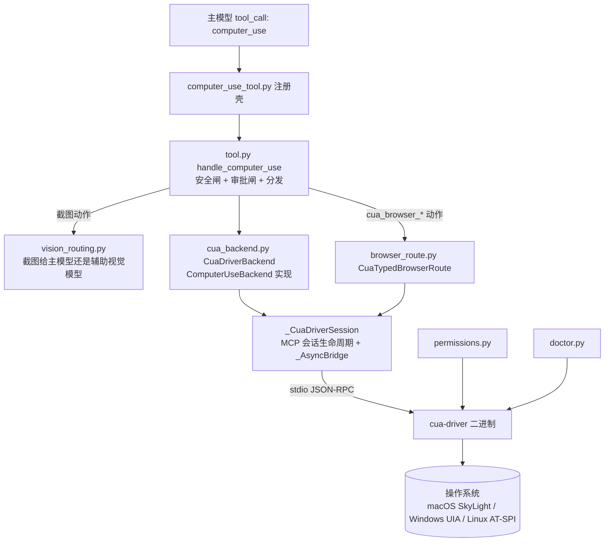

# R4 底稿 · computer_use 跨平台桌面控制机制簇（L1 精读）

> 读者定位:要凭这份底稿把机制讲清、并能重实现同等能力的工程师(多年后端经验,不熟 LLM/Python 异步生态)。
> 溯源约定:凡对 hermes-agent 行为的断言,紧跟 `路径:行号 @ 863e313` + 逐字代码块。行号以基线 commit `863e31318553cda8ad61df681d08175364d4164b` 为准,已 `wc -l` / `grep -n` 实测。
> **术语锚定 · computer-use**:让模型不通过 API、而是像人一样"看截图 + 动鼠标键盘"直接操作桌面 GUI 的能力。本簇实现的是它的一个特定变体——**后台(background)** computer-use:动作打进目标窗口但**不抢用户的真实光标、不抢键盘焦点、不切虚拟桌面**,人和 agent 能同时用一台机器。

---

## 0. 文件清单与实测行数

`wc -l` 实测(与任务给定值一致):

| 文件 | 行数 | 角色一句话 |
|---|---|---|
| `tools/computer_use_tool.py` | 42 | 注册壳:向 `tools.registry` 注册 `computer_use` 工具 |
| `tools/computer_use/tool.py` | 1341 | 工具主体:入口、安全闸、审批、动作分发、截图响应成形、视觉路由触发 |
| `tools/computer_use/cua_backend.py` | 3295 | 核心后端:驱动发现、MCP 会话生命周期、`CuaDriverBackend` 全部动作实现 |
| `tools/computer_use/backend.py` | 249 | 后端抽象:`ComputerUseBackend` ABC + `UIElement`/`CaptureResult`/`ActionResult` 数据类 |
| `tools/computer_use/browser_route.py` | 573 | 浏览器路由:`cua_browser_*` 动作 → cua-driver 的 typed-browser 工具的有状态适配器 |
| `tools/computer_use/schema.py` | 353 | 工具 JSON Schema(单工具 + `action` 判别式) |
| `tools/computer_use/vision_routing.py` | 204 | 截图视觉路由决策:截图给主模型还是给辅助视觉模型 |
| `tools/computer_use/permissions.py` | 198 | 跨平台就绪度 + macOS TCC 权限助手 |
| `tools/computer_use/doctor.py` | 864 | `hermes computer-use doctor`:健康诊断,驱动 `health_report` MCP 工具 |
| `tools/desktop_ui.py` | 40 | 桌面渲染器事件桥(与本簇弱相关,见 §2.6) |

合计 7159 行。

---

## 1. 全景

### 1.1 一句话架构

Hermes 进程 **不自己调操作系统 API**。它把桌面控制外包给一个第三方 Rust 二进制 **`cua-driver`**(来自 trycua/cua 项目),二者之间走 **MCP over stdio**。

> **术语锚定 · MCP**(Model Context Protocol):一套让"宿主进程 ↔ 工具进程"用 JSON-RPC 通信的协议。这里 Hermes 是 MCP client,`cua-driver` 是 MCP server;传输层是 stdio(把子进程的 stdin/stdout 当管道)。
> **术语锚定 · cua-driver**:trycua/cua 开源的"后台 computer-use 驱动",封装了各操作系统的无障碍树读取 + 合成输入投递,对外暴露 `click`/`type_text`/`get_window_state` 等 MCP 工具。

`tools/computer_use/cua_backend.py:1-11 @ 863e313`:

```python
"""Cua-driver backend (macOS, Windows, Linux).

Speaks MCP over stdio to `cua-driver`. The Python `mcp` SDK is async, so we
run a dedicated asyncio event loop on a background thread and marshal sync
calls through it.

The same `cua-driver call <tool>` surface (click, type_text, hotkey, drag,
scroll, screenshot, launch_app, list_apps, list_windows, get_window_state,
move_cursor, wait) works identically across macOS, Windows, and Linux —
```

分层(从模型看进来):



### 1.2 它驱动什么:本地桌面,三平台,经 cua-driver

驱动对象是 **运行 Hermes 的这台机器本身的本地桌面**(不是远程/云端 VM——协议里没有远程端点概念,`cua-driver` 是本机 spawn 的子进程)。支持平台**恰好三个**,以 frozenset 硬编码:

`tools/computer_use/permissions.py:34-35 @ 863e313`:

```python
# Platforms with a cua-driver runtime backend (mirrors the toolset platform_gate).
_RUNTIME_PLATFORMS = frozenset({"darwin", "win32", "linux"})
```

同一份三平台判断在 3 处重复出现,是 gating 的唯一真相:
- `tools/computer_use/tool.py:1330 @ 863e313`(`check_computer_use_requirements`,注册表 check_fn):`if sys.platform not in ("darwin", "win32", "linux"): return False`
- `tools/computer_use/cua_backend.py:2050-2053 @ 863e313`(`CuaDriverBackend.is_available`):同样三元组。

每平台底层栈不同,但对 Hermes 是透明的(全部藏在 cua-driver 里)。docstring 记录了各平台实现:`tools/computer_use/cua_backend.py:29-33 @ 863e313`——macOS 用私有 SkyLight SPI(`SLEventPostToPid` 等,可能随系统升级失效);Windows 用稳定 Win32 API(`SendInput` + UI Automation);Linux 是最新加入的 runtime(X11 今天可用,Wayland 经 XWayland)。

### 1.3 动作集

单工具 + `action` 判别式设计,枚举见 `tools/computer_use/schema.py:34-58 @ 863e313`。分两族:

**原生桌面动作**(14 个):`capture` / `click` / `double_click` / `right_click` / `middle_click` / `drag` / `scroll` / `type` / `key` / `set_value` / `wait` / `list_apps` / `list_windows` / `focus_app`。

**typed-browser 动作**(9 个,`cua_browser_*` 前缀):`cua_browser_state` / `_prepare` / `_navigate` / `_click` / `_type` / `_pointer` / `_dialog` / `_set_input_files` / `_download`。

`tools/computer_use/schema.py:14-16 @ 863e313` 解释为何塞进一个工具:

```python
# One consolidated tool with an `action` discriminator. Keeps the schema
# compact and the per-turn token cost low.
COMPUTER_USE_SCHEMA: Dict[str, Any] = {
```

截图有三种 `mode`(`tools/computer_use/schema.py:68-79 @ 863e313`):`som`(默认,截图 + 每个可交互元素画编号叠加 + AX 树)、`vision`(纯截图)、`ax`(纯无障碍树,无图,给纯文本模型用)。

> **术语锚定 · SOM**(Set-of-Marks):在截图上给每个可点元素画一个数字编号,模型看到编号后可 `click(element=N)`,比让模型报像素坐标可靠得多。`schema.py:132-138 @ 863e313` 称 element index "Strongly preferred over raw coordinates"。
> **术语锚定 · AX 树**(Accessibility tree):操作系统无障碍框架暴露的 UI 结构树(按钮、文本框、其 role 和 label),原本给读屏软件用,这里当作"可编程的 UI 地图"。

### 1.4 与浏览器自动化的分工(browser_route 的作用)

R4 另有一簇是独立的浏览器自动化栈(Playwright/CDP 那条线)。本簇的 `cua_browser_*` **不是**那条栈——它是 cua-driver 自己内建的 typed-browser 能力的门面。区别:

- **原生桌面动作** 靠 AX 树 + 像素:能点任何窗口,但对网页内部只能看到粗粒度 AX 节点。
- **cua-driver typed-browser** 靠语义 ref(semantic ref):cua-driver 附着到浏览器进程后,能拿到网页 DOM 级的语义快照 + 可信输入(trusted input,不是 JS 合成事件),对网页操作更准。

`tools/computer_use/browser_route.py:1-6 @ 863e313` 定位:

```python
"""Session-scoped typed-browser routing for cua-driver.

The public model surface remains the single ``computer_use`` tool.  This
module owns the stateful adapter between its namespaced ``cua_browser_*``
actions and cua-driver's raw ``get_browser_state`` / ``browser_*`` tools.
```

**何时转交**:模型显式选 `action="cua_browser_*"` 时才走 browser_route(见 `tools/computer_use/tool.py:626-720` 的 dispatch 分支);普通 `click`/`type` 永远走原生桌面栈。也就是说——转交是模型的显式选择,不是 harness 自动降级。两条路共用同一个 `_CuaDriverSession`(同一个 cua-driver 子进程),但 ref/tab 状态各自独立。详见 §2.5。

---

## 2. 逐机制

### 2.1 后端抽象与 cua-driver 后端(cua_backend 驱动什么)

#### 问题:一次 `click(element=14)` 怎么变成屏幕上真的一下点击?

模型发 `computer_use({"action":"click","element":14})`。这个 14 是上一次 `capture(mode="som")` 返回的 SOM 编号。要把它翻译成"往 pid=4242、window_id=7 的窗口里,对第 14 号无障碍元素投一次后台左键点击",中间隔着:抽象层选后端 → 后端把 element 映射成 cua-driver 的 `click` 工具参数 → MCP 把调用送进 cua-driver 子进程 → cua-driver 合成事件。

#### 机制 A:抽象接口 `ComputerUseBackend`

`tools/computer_use/backend.py:111-121 @ 863e313` 定义 ABC,所有方法同步(异步藏在实现里):

```python
class ComputerUseBackend(ABC):
    """Lifecycle: `start()` before first use, `stop()` at shutdown."""

    @abstractmethod
    def start(self) -> None: ...
```

三个数据类是后端与工具层的契约:

- `UIElement`(`tools/computer_use/backend.py:16-38`):一个可交互元素。字段含 `index`(1-based SOM 编号)、`role`(AX role 如 AXButton)、`label`、`bounds`(x,y,w,h 逻辑像素)、`pid`、`window_id`,以及 `element_token`(见下文 stale 检测)。
- `CaptureResult`(`tools/computer_use/backend.py:41-70`):截图结果。`mode` 决定填哪些字段——`vision` 只有 `png_b64`,`ax` 只有 `elements`,`som` 两者都有(PNG 已由后端画好编号叠加)。
- `ActionResult`(`tools/computer_use/backend.py:71-110`):动作结果。关键设计——`ok` **只是传输层成功**,不是语义裁决:

`tools/computer_use/backend.py:72-79 @ 863e313`:

```python
    """Result of any action (click / type / scroll / drag / key / wait).

    Beyond the transport-level ``ok`` flag, this carries cua-driver's
    structured action verdict so the model can follow the documented
    verify → escalate ladder (NousResearch/hermes-agent#67052). ``ok`` stays
    tool/transport success only — it is NOT the semantic verdict. Read
    ``effect`` / ``escalation`` to decide the next rung. All structured
    fields are optional and additive: an older driver that omits
```

`ActionResult` 携带的语义裁决字段(`tools/computer_use/backend.py:90-110`):`verified`(驱动是否回读确认效果)、`effect`("confirmed" | "unverifiable" | "suspected_noop")、`escalation`(下一档建议)、`path`(实际跑的投递档,如 "ax"/"x11_pixel"/"cgevent_fg")、`degraded`、`delivery_mode`、`code`(结构化拒绝码)。

#### 机制 B:唯一具体后端 `CuaDriverBackend`

选谁由环境变量决定(`tools/computer_use/tool.py:227-243`):`HERMES_COMPUTER_USE_BACKEND` 默认 `"cua"`→`CuaDriverBackend`;`"noop"`→测试用空后端;其它→报错。所以生产上只有一个后端。

**MCP 是同步/异步阻抗失配,用后台事件循环桥接。** Python 的 `mcp` SDK 是 async,但 Hermes 工具调用是同步的。解法是 `_AsyncBridge`(`tools/computer_use/cua_backend.py:1017-1069`):启动一个后台线程跑独立 asyncio loop,`run(coro)` 用 `run_coroutine_threadsafe` 把协程扔进去并同步等结果。

**MCP 会话生命周期靠"单协程持有上下文"避免 anyio 陷阱。** `_CuaDriverSession._lifecycle_coro`(`tools/computer_use/cua_backend.py:1124-1216`)是一条长命协程:它在**同一个 asyncio task 里**打开 `stdio_client` + `ClientSession`,`initialize()`,拉能力,置 `_ready_event`,然后阻塞在 `_shutdown_event.wait()`,收到关闭信号才在同一 task 里关上下文。

`tools/computer_use/cua_backend.py:1071-1083 @ 863e313` 解释为何必须如此:

```python
class _CuaDriverSession:
    """Holds the mcp ClientSession. Spawned lazily; re-entered on drop.

    Lifecycle ownership: a single long-running coroutine
    (`_lifecycle_coro`) opens both the stdio_client and ClientSession
    contexts, populates capabilities, sets `_ready_event`, and then waits
    on `_shutdown_event`. When shutdown is signalled the same coroutine
    closes the contexts — keeping anyio's cancel-scope task-identity
    invariant intact (the bridge schedules each `bridge.run(coro)` as a
    NEW task, so opening contexts in one and closing them in another
    raises "Attempted to exit cancel scope in a different task").
```

> 重实现要点:anyio 的 cancel scope 要求"进入和退出在同一 task"。若你把 `__aenter__`/`__aexit__` 拆到两次 `bridge.run()`(两个不同 task),就会炸。用一条守护协程持有上下文、其余工具调用只碰 `self._session` 对象,是干净解法。

**能力发现(capability discovery)** :`_populate_capabilities`(`tools/computer_use/cua_backend.py:1218-1262`)在 session init 时调 `tools/list`,缓存每工具的 capability 集合与 inputSchema。这让 wrapper 能对不同版本 cua-driver 做特性探测——比如"这个 driver 的 `click` 支不支持 `delivery_mode` 参数"、"支不支持 element_token"。这是整簇"对多版本驱动优雅降级"的基础设施。

**session 身份(start_session/end_session)** :每个 `CuaDriverBackend` 实例 mint 一个稳定 id:

`tools/computer_use/cua_backend.py:1953 @ 863e313`:

```python
        self._session_id: str = f"hermes-{uuid.uuid4().hex[:12]}"
```

`start()` 时声明(`tools/computer_use/cua_backend.py:2008`),`stop()` 时拆除(`tools/computer_use/cua_backend.py:2041`)。作用:cua-driver 按 session 给每个 Hermes run 分配一个**独立颜色的 agent 光标叠加层**(可视化点击落点,但不动真实 OS 光标),并隔离并发 run 的 config/录制归属。失败非致命——老 driver 不认这个 id 就退化到匿名路径。

**动作翻译:`click` 怎么落到 cua-driver。** `CuaDriverBackend.click`(`tools/computer_use/cua_backend.py:2648-2701`)把抽象参数映射成 cua-driver `click` 工具的参数字典。element 优先于坐标:

`tools/computer_use/cua_backend.py:2679-2694 @ 863e313`:

```python
        args: Dict[str, Any] = {"pid": pid, "button": button_norm}
        if element is not None:
            if self._active_window_id is None:
                return ActionResult(ok=False, action=tool,
                                    message="No active window_id for element_index click.")
            args["element_index"] = element
            args["window_id"] = self._active_window_id
        elif x is not None and y is not None:
            ...
```

注意 `pid`/`window_id` 来自 **sticky context**——上一次 `capture()` 记下的 `_active_pid`/`_active_window_id`(`tools/computer_use/cua_backend.py:1920-1921` 声明,`capture` 内 `2344-2345` 赋值)。所以模型必须先 capture 再 click;没 capture 过就 `No active window`(`tools/computer_use/cua_backend.py:2661-2662`)。

**低层 `_action` 是所有动作的公共出口**(`tools/computer_use/cua_backend.py:3256-3295`):它 (1) 视需要附上 element_token(stale 检测,见下),(2) `setdefault("session", self._session_id)` 注入本 run 身份,(3) call_tool,(4) 用 `_action_result_from` 把 cua-driver 的 structuredContent 裁决抬升成 `ActionResult`。

**stale 元素检测(element_token)** :SOM 编号在下一次 capture 后就失效。`_maybe_attach_element_token`(`tools/computer_use/cua_backend.py:3230-3255`)在调 token-capable 工具时,把上次快照的 `element_token` 附到 `element_index` 旁,让 cua-driver 显式检测"快照已过期"并回错,而不是静默重解析到另一个元素。gating 在 per-tool capability 上,避免给老 driver 塞它不认的字段(会因 `additionalProperties:false` 被拒)。

**verify→escalate 投递阶梯(delivery ladder)** :后台投递可能"跑了但没确认生效"。`_apply_delivery`(`tools/computer_use/cua_backend.py:2556-2593`)+ `_run_input_action`(`tools/computer_use/cua_backend.py:2594-2647`)实现:默认 background 不加标志;foreground 只在**活动 schema 真的接受**该参数时才发,否则回结构化 `foreground_unsupported` 拒绝——**绝不静默降级**(降级会把输入投到模型没料到的地方)。

`tools/computer_use/cua_backend.py:2579-2590 @ 863e313`:

```python
        # Foreground requested. Only send it if the driver understands it.
        if not self._session.supports_input_property(action, "delivery_mode"):
            return ActionResult(
                ok=False, action=action, code="foreground_unsupported",
                delivery_mode="foreground",
                message=(
                    "The connected cua-driver action schema does not accept "
                    "delivery_mode, so foreground delivery is unavailable. "
                    "Use another verified rung without assuming the reported "
                    "package version describes the live schema."
                ),
            )
```

**弹性(resilience):MCP 挂了怎么办。** `call_tool`(`tools/computer_use/cua_backend.py:1657-1706`)三层自愈:(1) 若 `_started` 已被死亡的 lifecycle 协程复位为 False,先重启;(2) 瞬时守护错误(EAGAIN 类)→ 退到 CLI 传输 `_call_tool_via_cli`;(3) 会话关闭错误 → 重连一次重试。还有"已结束 session"逻辑复活(`_revive_declared_session_once`,#71166)。

#### 取舍
- **单后端 + 外包给 Rust 二进制**:Hermes 不碰任何平台 API,跨平台复杂度全在 cua-driver;代价是硬依赖一个外部二进制的安装与版本(靠 doctor/update-check 兜)。
- **同步门面包异步 MCP**:多一个后台线程 + 一层 marshaling,换来工具层代码全同步、好测。
- **一切 additive 降级**:每个新特性(delivery_mode、element_token、mimeType)都 gating 在 capability 上,老 driver 静默退化。代价是代码里到处是"探测—有则用—无则退"分支,`cua_backend.py` 3295 行大半是这类兼容逻辑。

#### 重实现要点
1. 定义三数据类契约(元素/截图/动作结果),把"传输成功"和"语义生效"拆成两个字段。
2. 一条守护协程持有 MCP 上下文,同步门面用后台 loop 桥接。
3. sticky target:capture 记 pid/window,后续动作复用;失败即 disarm(`_clear_active_target`,`tools/computer_use/cua_backend.py:2062`)以免误路由。
4. capability 发现 + per-feature 探测,保证对多版本驱动前后兼容。

---

### 2.2 截图视觉路由(vision_routing)——为什么截图要按模型能力路由

#### 问题:配了辅助视觉模型,截图却报 404

真实故障(issue #24015):用户主模型是纯文本/文本+代码模型(如 `tencent/hy3-preview`),但在 `config.yaml` 里配了 `auxiliary.vision` 专门的视觉模型。`capture` 却仍把截图直接塞进 tool_result 发给**主模型**,在 provider 边界撞 `HTTP 404 No endpoints found that support image input`——整个 agent 循环报硬失败。那个明明配好的视觉后端被无声忽略。

`tools/computer_use/vision_routing.py:13-19 @ 863e313` 逐字记录了这次事故:

```python
Issue #24015 reports this regression for the ``cua-driver`` backend:
configuring ``auxiliary.vision`` (a dedicated vision-capable model) in
``config.yaml`` was silently ignored — the screenshot was still routed at
the *main* model and failed with HTTP 404 ``No endpoints found that
support image input`` even though a perfectly good vision backend was
sitting in config waiting to be used.
```

> **术语锚定 · auxiliary.vision**:Hermes config 里可另配一个"辅助视觉模型"。当主模型看不了图时,把图先喂给它,让它产出一段文字描述,主模型只读文字。
> **术语锚定 · multimodal tool result**:把图片作为 tool 返回内容的一部分发回给模型(OpenAI 的 `image_url` 部分 / Anthropic 的 `tool_result` image block)。不是所有 provider 都允许在 tool result 里放图。

#### 机制:一个只做"路由决策"的纯函数

`vision_routing.py` 只导出一个决策函数 `should_route_capture_to_aux_vision(provider, model, cfg) -> bool`(`tools/computer_use/vision_routing.py:164-199`)。返回 True = 把截图先给辅助视觉模型转成文字;False = 保留 multimodal 信封给主模型自己看。决策优先级(`tools/computer_use/vision_routing.py:183-199`):

```python
    if _explicit_aux_vision_override(cfg):
        return True

    user_declared = _lookup_user_declared_supports_vision(provider, model, cfg)
    if user_declared is True:
        return False
    if user_declared is False:
        return True

    accepts_tool_image = _provider_accepts_multimodal_tool_result(provider, model)
    if accepts_tool_image is None or accepts_tool_image is False:
        return True

    supports_vision = _lookup_supports_vision(provider, model, cfg)
    if supports_vision is True:
        return False
    return True
```

四层,自上而下:
1. **用户显式配了 `auxiliary.vision`** → 用它(付了钱就该用);
2. **用户在 config 里显式声明主模型 `supports_vision`** → 尊重声明(本地/自建 VLM 的逃生舱,models.dev 查不到);
3. **provider 不接受 tool-result 里放图 或 查不到** → 走辅助(否则会撞 provider 错);
4. **models.dev 元数据说主模型有视觉** → 保留 multimodal;否则走辅助。

**关键设计:fail closed(向辅助路由 fail)。** `tools/computer_use/vision_routing.py:42-45 @ 863e313`:

```python
The decision intentionally fails *closed* (i.e. towards aux routing) when
metadata is missing or ambiguous: returning a screenshot to a model that
cannot read it is a hard tool failure, while routing it through aux costs
one extra LLM call and yields a usable description.
```

理由:把图发给读不了的模型 = 硬失败;走辅助 = 多一次 LLM 调用换一段可用描述。两害相权取其轻。

#### 触发点与执行:在 tool.py 里

决策的**触发**在 `_should_route_through_aux_vision`(`tools/computer_use/tool.py:1096-1132`):读当前主 provider/model + config,问决策函数,结果按 `(provider, model)` 进程级缓存(`_AUX_VISION_ROUTE_CACHE`)。注意这里的顶层 try 是 **fail open**(`tools/computer_use/tool.py:1101-1103`)——决策**导入/读取**失败就返回 False 保留 multimodal,让破 config 永不无声丢掉图。(与决策函数内部的 fail-closed 是两个不同层次:外层"决策系统能不能跑" fail open;内层"该不该路由" fail closed。)

**执行**在 `_route_capture_through_aux_vision`(`tools/computer_use/tool.py:1148-1252`):把 base64 PNG 落盘到 `$HERMES_HOME/cache/vision/`,`_shrink_capture_for_vision` 先降采样到最长边 1456px(`_MAX_VISION_DIM`,`tools/computer_use/tool.py:1071`),喂给 `vision_analyze_tool` 配一段通用描述 prompt,把结果文字并进 AX/SOM summary,返回纯文本 payload。

**降级链**在 `_capture_response`(`tools/computer_use/tool.py:983-1016`):若决策要走辅助但辅助**失败**(视觉节点挂了/空分析),**不 fallthrough 回 multimodal**(那会撞 provider 错),而是退到 AX/SOM 文字 payload 并标 `vision_unavailable=True`——element 编号仍可用。

#### 取舍
- 决策与"用户附带图片"路径复用同一批 helper(`tools/computer_use/vision_routing.py:59-61` 明示 mirror `agent.image_routing`),保证 capture 路径和 attach-image 路径口径一致。
- fail-closed:宁可多花一次 LLM 调用,不撞硬失败。代价:非视觉主模型每次 capture 多一跳延迟。
- 1456px 降采样:SOM 徽标仍清晰,但小本地模型上下文不被塞爆。

#### 重实现要点
- 把"截图给谁看"抽成一个纯决策函数,输入 (provider, model, cfg),输出 bool,好单测(见 §4 的 `test_computer_use_vision_routing.py`)。
- 决策系统失败 fail open(别丢图),决策本身 ambiguous 时 fail closed(别撞错)。
- 辅助路由失败要有第三条降级路(纯文本 + 元素编号),不能只有"图 or 撞错"两态。

---

### 2.3 权限模型(permissions + 审批闸 + cua 模式)

本簇的"权限"其实是**三个独立层**,别混:

#### 层一:操作系统就绪度(permissions.py)

##### 问题:macOS 上 click 什么都点不动,不知道缺哪个授权

`tools/computer_use/permissions.py:4-20 @ 863e313` 说明"就绪"在各平台含义不同:

```python
cua-driver runs on macOS, Windows, and Linux, but "ready to drive" means
something different on each:

  * macOS — explicit TCC grants (Accessibility + Screen Recording). cua-driver
    reports/requests them via ``permissions status`` / ``permissions grant``.
    The grants attach to cua-driver's OWN identity (``com.trycua.driver`` /
    the installed ``CuaDriver.app``), NOT Hermes — so no Hermes entitlement is
    involved, and ``grant`` launches CuaDriver via LaunchServices so the macOS
    dialog is attributed correctly.
  * Windows — no TCC toggles; the UIAccess worker (``cua-driver-uia.exe``) may
    trip a SmartScreen prompt on first run. Readiness == driver health.
  * Linux — assistive control via the X11/XWayland stack. Readiness == driver
    health.
```

> **术语锚定 · TCC**(Transparency, Consent, and Control):macOS 的隐私授权系统。要控制别的 app,必须被授予 Accessibility;要截图,必须被授予 Screen Recording。

**关键洞察:TCC 授权归 cua-driver 自己的身份,不归 Hermes。** `permissions.py:7-12 @ 863e313`:授权附着在 `com.trycua.driver` / 安装的 `CuaDriver.app` 上,`grant` 经 LaunchServices 启动 CuaDriver 让 macOS 对话框归属正确。所以 Hermes 本身不需要任何 entitlement。

`computer_use_status`(`permissions.py:121-161`)把三样折进一个 payload:平台是否支持、二进制是否装、版本、`ready`(macOS = 两个 TCC 都 True;其它 = driver health)、`can_grant`(仅 macOS)。`request_permissions_grant`(`permissions.py:164-198`)只在 macOS 有意义,非 macOS 返回 64(无 TCC 模型可授)。

#### 层二:Hermes 审批闸(tool.py)

##### 问题:模型要 `type "rm -rf /"`,或点了"清空废纸篓"快捷键

动作分两类,`tools/computer_use/tool.py:81-93`:`_SAFE_ACTIONS`(capture/wait/list_apps/list_windows/cua_browser_state,只读,永远放行)vs `_DESTRUCTIVE_ACTIONS`(所有会改变用户可见状态的,过审批)。

**三道硬闸在审批之前**(`handle_computer_use`,`tools/computer_use/tool.py:453-478`):
1. **危险 type 文本**:`_is_blocked_type`(`tools/computer_use/tool.py:138-145`)正则拦 `curl|bash`、`sudo rm -rf`、fork bomb 等。
2. **危险按键组合**:`_BLOCKED_KEY_COMBOS`(`tools/computer_use/tool.py:96-116`)——清空废纸篓、强制删除、锁屏、注销等,**无视审批级别硬拦**(注销会杀掉 Hermes 自己所在的会话)。规范化用 `_canon_key_combo`(`tools/computer_use/tool.py:117-135`)同时按 `+` 和 `-` 切分,否则 `ctrl-alt-delete` 连字符写法能绕过闸。
3. `bring_to_front` 必须配 `delivery_mode='foreground'`(`tools/computer_use/tool.py:473-477`)。

`tools/computer_use/tool.py:96-105 @ 863e313`:

```python
_BLOCKED_KEY_COMBOS = {
    frozenset({"cmd", "shift", "backspace"}),   # empty trash
    frozenset({"cmd", "option", "backspace"}),   # force delete
    frozenset({"cmd", "ctrl", "q"}),             # lock screen
    frozenset({"cmd", "shift", "q"}),            # log out
    frozenset({"cmd", "option", "shift", "q"}),  # force log out
```

**审批本身**(`_request_approval`,`tools/computer_use/tool.py:514-563`):按 `(action, delivery_mode)` **且** `session_id` 双重 scope。foreground 是可见的焦点变更,**背景审批不覆盖 foreground**(#67052);状态按 session_id 隔离,并发 run 不互相泄露"总是批准"。回调返回 4 种裁决:approve_once / approve_session / always_approve / deny。特殊:`timeout` 返回"沉默不是同意,别重试"(`tools/computer_use/tool.py:555-562`)。

#### 层三:cua-driver 不可变权限模式(tool.py + cua_backend.py)

##### 问题:一个会话开了 YOLO,会不会污染另一个会话?

cua-driver 的 daemon 权限模式**启动后不可变**。若复用机器级 daemon,一个 Hermes 会话的 YOLO 选择会影响另一个。解法:私有嵌入式 daemon。

`_cua_permission_mode`(`tools/computer_use/tool.py:171-199`)把 Hermes 的审批绕过映射到 cua 的不可变模式:审批 bypass 激活 → `"unrestricted"`,否则 `"standard"`。它查**两个身份命名空间**(DB session_id + gateway session_key),因为 gateway `/yolo` 走 session_key,只查 session_id 会让消息平台上的 /yolo 无形失效(`tools/computer_use/tool.py:181-190`)。fail closed。

`unrestricted` 时创建 `_EmbeddedCuaDaemon`(`tools/computer_use/cua_backend.py:383-537`)——私有 socket、私有进程、启动时一次性风险确认:

`tools/computer_use/cua_backend.py:412-416 @ 863e313`:

```python
    def child_env(self) -> Dict[str, str]:
        env = cua_driver_child_env()
        env["CUA_DRIVER_PERMISSION_MODE"] = "unrestricted"
        env["CUA_DRIVER_DANGEROUSLY_BYPASS_APPROVALS"] = "1"
        return env
```

`tools/computer_use/cua_backend.py:383-392 @ 863e313` 解释隔离动机:

```python
class _EmbeddedCuaDaemon:
    """Private host-owned daemon used for an explicit unrestricted session.

    Cua Driver permission mode is immutable after daemon startup.  Reusing the
    machine-wide daemon would therefore let one Hermes session's YOLO choice
    affect another session.  A private embedded daemon gives the requesting
    session its own socket, process, and launch-time risk acknowledgement.
    """
```

`_get_backend`(`tools/computer_use/tool.py:201-266`)据此实现"模式变更即换后端":每 session 缓存一个后端;若 `_cua_permission_mode` 与缓存模式不符(比如 /yolo 切换),弹出旧后端在锁外 stop、循环重建——因为 cua 模式启动后不可变(`tools/computer_use/tool.py:216-224`)。

#### 一个横切安全策略:cua-driver 子进程绝不继承 provider API key

cua-driver 是第三方二进制,**每个 spawn 点**都 sanitize 环境(#53503/#55709/#58889 血统)。`cua_driver_child_env`(`tools/computer_use/cua_backend.py:256-269`)只管注入 telemetry 开关,真正剥密钥的是各调用点包一层 `_sanitize_subprocess_env`。见 `permissions.py:46-64`、`tools/computer_use/cua_backend.py:563-575`(manifest 探测)、`doctor.py:72-87`。

#### 取舍
- 三层权限各管一段:OS 授权(能不能动)/ Hermes 审批(该不该动)/ cua 模式(动到什么程度)。清晰但要读三处才拼得全。
- 硬拦按键无视审批:牺牲灵活(用户想批也批不了注销)换绝对安全(不自杀会话)。
- 私有嵌入 daemon:每个 YOLO 会话一个进程,重但隔离彻底。

#### 重实现要点
- 只读动作免审批,写动作过审批,危险模式硬拦(不可审批绕过)。
- 审批 scope 必须含"焦点是否可见变更"这一维,别让静默动作的批准覆盖可见动作。
- 第三方驱动子进程一律 sanitize env,别把宿主密钥漏给它。

---

### 2.4 浏览器路由(什么时候 computer_use 动作转交给浏览器栈)

##### 问题:让 agent 在网页上填个表单并点提交

用原生 `click` 靠 AX 树点网页元素常常不准(网页 DOM 不完整映射到 AX)。cua-driver 内建 typed-browser:附着到浏览器进程,拿 DOM 级语义快照 + 可信输入。`browser_route.py` 是它的**有状态门面**,比底层传输更严格。

`tools/computer_use/browser_route.py:7-16 @ 863e313`:

```python
The adapter is deliberately stricter than the transport:

* native binding must be exact before mutation;
* the driver session id is injected by the adapter, never accepted from the
  model;
* refs are usable only from the latest snapshot in this Hermes session;
* every mutation invalidates refs and requires a fresh state read; and
* changing from trusted input to ``dom_event`` is always explicit.
```

#### 机制:exact-bind → snapshot → mutate 状态机

`BrowserRouteState`(`tools/computer_use/browser_route.py:149-177`)持有一次绑定的能力:pid/window_id、`target_id`(不透明目标句柄)、`tab_ids`、`refs`(ref→允许的动作集)、`continuation`、`verification_required`。

> **术语锚定 · semantic ref**:网页快照里每个可操作节点的不透明句柄,附带"它允许哪些动作"(click/type/scroll…)。模型只能用**本 session 最新快照**里的 ref,过期即拒。
> **术语锚定 · trusted vs dom_event**:trusted = 浏览器层面的可信输入事件(像真人);dom_event = JS 合成事件(可被网页脚本区分,信任级低)。降级到 dom_event 必须显式。

三阶段:
1. **observe/绑定**(`tools/computer_use/browser_route.py:210-337`):传 pid+window_id 做 exact bind,拿 `target_id`。绑定不是快照——置 `verification_required=True`,mutate 前必须先读一次 tab。若 `binding_quality != "exact"` 或 `mutation_allowed` 不为真,标 `native_fallback_required`(退回原生 AX/像素栈)。
2. **snapshot**:同 `observe` 但已绑定,读语义快照,填 `refs`。新快照**在传输调用前**先 `clear_refs`,保证失败不留可用旧 ref(`tools/computer_use/browser_route.py:319-322`)。
3. **mutate**(`tools/computer_use/browser_route.py:462-573`):调 `browser_click`/`browser_type` 等。`_require_mutation`(`tools/computer_use/browser_route.py:406-441`)校验:binding exact + mutation_allowed + tab 属于本次绑定 + 若 `verification_required` 未读快照则拒。`_require_ref`(`tools/computer_use/browser_route.py:443-460`)校验 ref 来自最新快照且声明了所需动作。每次成功 mutate 后置 `verification_required=True` + `next_step=fresh_browser_state`——**绝不从记忆状态链式 mutate**。

`tools/computer_use/browser_route.py:194-205 @ 863e313`(session id 由适配器注入,永不接受模型给的):

```python
    def _call(self, name: str, args: Dict[str, Any]) -> Dict[str, Any]:
        payload = dict(args)
        # The wrapper owns the session capability.  Never let a model-provided
        # id replace it or address another run's target/ref namespace.
        payload["session"] = self._session_id
        return _tool_payload(self._call_tool(name, payload))
```

#### 转交时机(在 tool.py 的 dispatch)

`_dispatch`(`tools/computer_use/tool.py:590-793`)按 action 前缀分流:`cua_browser_state`→`typed_browser_state`(`tools/computer_use/tool.py:611-624`),`cua_browser_prepare`→`typed_browser_prepare`,其余 `cua_browser_*` 映射到 driver 的 `browser_*` 工具并做**参数白名单**(`tools/computer_use/tool.py:648-720`,只放行每工具声明的字段)。**转交 100% 由模型选 action 触发,不是 harness 自动**。原生 backend 若无 typed-browser 能力,`ComputerUseBackend._typed_browser_unavailable`(`tools/computer_use/backend.py:217-225`)fail closed 返回 `native_fallback_required`。

#### 取舍
- 门面比传输更严:多层校验(exact/tab/ref/verification)换"模型无法用陈旧或跨会话能力乱操作"。代价是模型必须严格走 bind→snapshot→act,任何一步过期都要重来。
- 每次 mutate 强制重新快照:防止基于旧 ref 的连击,代价是网页操作 round-trip 变多。

#### 重实现要点
- 浏览器能力用不透明 capability(target_id/tab_id/ref)而非坐标,由适配器持有、绝不接受模型提供的 id。
- 快照失败前先失效旧 ref(先 clear 再 call),保证"丢失响应 ≠ 证明动作是 no-op"。
- 信任降级(合成事件)必须显式请求,永不静默选择。

---

### 2.5 doctor 诊断(检查什么依赖/环境)

##### 问题:装好了但 click 无效,到底卡在哪?

`hermes computer-use doctor` 是首选分诊。它是 cua-driver `health_report` MCP 工具的**薄客户端**——健康模型归 cua-driver 拥有,Hermes 只驱动 JSON-RPC 握手、调 `health_report`、渲染结构化结果。

`tools/computer_use/doctor.py:1-9 @ 863e313`:

```python
"""
`hermes computer-use doctor` — thin client for cua-driver's `health_report` MCP tool.

cua-driver owns the health model (#1908 / be761fac on `main`). This module
just drives the stdio JSON-RPC handshake, calls `health_report`, and
renders the structured response. When the driver gets new checks, they
flow through here without code changes on the Hermes side — the only
contract is the stable `schema_version="1"` payload shape.
```

#### 机制:先真报告,denial 就合成

`run_doctor`(`doctor.py:797-864`)流程:reconfigure stdout 为 UTF-8(Windows 上 cp1252/cp936 编不了 ✅❌⚠️ glyph,`doctor.py:825-833`)→ resolve 二进制(没有返回退出码 2)→ `_drive_health_report_or_fallback` → 渲染 → 退出码(ok=0,degraded/failed=1,binary 不可达=2)。

**关键兜底:cua-driver 0.10.x 的 `health_report` 被标 `risk.class='unclassified'`,MCP 调用返回 isError。** 这不是 schema_version=1 报告。`_drive_health_report_or_fallback`(`doctor.py:687-702`)捕获 `HealthReportUnavailable`,改用工作正常的探针合成一份等价报告:

`tools/computer_use/doctor.py:10-15 @ 863e313`:

```python
cua-driver 0.10.x marks `health_report` with risk.class='unclassified', so
MCP tools/call returns isError=true ("Permission denied: ... no reviewed
risk classification") with structuredContent ``{"exit_code": 1}``. That is
NOT a schema_version=1 report — we detect it and synthesize a composite
report via working probes (check_permissions, list_apps, CLI --version).
```

合成用的探针(`_drive_fallback_probes`,`doctor.py:356-440`)在一个 MCP 会话里调:`initialize`(拿 serverInfo.version)、`check_permissions`(TCC 主信号)、`list_apps`(轻量 AX 能力探针——能列出 app 说明无障碍栈通)。`_compose_fallback_report`(`doctor.py:453-686`)把 CLI `--version` + 这些探针拼成 schema_version=1 报告,`_print_text_report` 照常渲染。

**检查矩阵是平台感知的**(见 doc §2.6 引用):`bundle_identity`/`tcc_*` 在 Windows+Linux 上 `skip`;`ax_capability` 在 macOS 查 AX、Windows 查 UIA、Linux 查 AT-SPI,各带对应诊断 hint。

#### 取舍
- 薄客户端:cua-driver 加新检查无需改 Hermes,只依赖稳定 schema。代价是被 cua-driver 的 risk 分类变动(0.10.x)反噬,要写合成兜底。
- 合成报告用"能跑的工具"逆推健康:牺牲精确(不是真 health_report)换"0.10.x 上不打印 `• ? on ? — ?"。

#### 重实现要点
- 诊断工具做薄客户端 + 稳定 schema,把检查逻辑留在被诊断组件里。
- 对"工具被权限门挡住"这类可预期失败,有一条用其它可用探针合成等价输出的路。

---

### 2.6 注册壳与桌面桥(computer_use_tool.py / desktop_ui.py)

**`computer_use_tool.py`(42 行)** 纯注册壳,存在只因 `tools.registry` 自动导入 `tools/*.py`,需要一个顶层模块触发注册(`tools/computer_use_tool.py:1-6`)。它把 schema + 四个入口函数注册进 registry:

`tools/computer_use_tool.py:20-33 @ 863e313`:

```python
registry.register(
    name="computer_use",
    toolset="computer_use",
    schema=COMPUTER_USE_SCHEMA,
    handler=lambda args, **kw: handle_computer_use(args, **kw),
    check_fn=check_computer_use_requirements,
    requires_env=[],
    description=(
        "Universal desktop control via cua-driver (macOS, Windows, Linux). Works with any "
        "tool-capable model (Anthropic, OpenAI, OpenRouter, local vLLM, "
```

**`desktop_ui.py`(40 行)** 与本簇**弱相关**——它是"桌面专用工具 → Hermes 桌面渲染器事件"的通用桥(preview pane、pane focus 之类),不是 computer_use 专用。桌面 gateway 在会话启动时 `set_emitter` 装 sink,非桌面环境下 `_emit` 为 None、`available()` 返回 False。列在本簇范围内是因为它是 `tools/` 下的桌面相关小文件,但机制上与 cua-driver 桌面控制**无直接调用关系**(grep 未见 computer_use 侧引用它)。归层建议 L3(知悉用途)。

---

## 3. 定案任务(R1 报告标记 ◇ 的证实/证伪/修正)

### ◇ "computer_use 跨平台桌面控制 + 截图视觉路由"——docs 讲了多少、名副其实吗?

**结论:名副其实,且 docs 对"桌面控制"讲得相当充分,但对"截图视觉路由"几乎不讲(文档缺口)。**

**桌面控制部分——docs 充分且与代码一致。** `website/docs/user-guide/features/computer-use.md`(496 行)有专章。逐点核对:
- 三平台 + 后台不抢焦点:`computer-use.md:8-12` 与代码 `_RUNTIME_PLATFORMS`(`permissions.py:35`)一致。
- 各平台底层栈表(`computer-use.md:26-30`:macOS SkyLight / Windows UIA+SendInput / Linux AT-SPI+XTest)与 `tools/computer_use/cua_backend.py:29-33` docstring 一致。
- 权限模式表(`computer-use.md:83-86`:standard vs 私有 unrestricted daemon)与 `_EmbeddedCuaDaemon` + `_cua_permission_mode` 实现一致。
- SOM 工作流示例(`computer-use.md:203-215`)与 schema/dispatch 一致。
- doctor 输出样例(`computer-use.md:106-140`)与 `doctor.py` 渲染一致。
- MIME 来源(`website/docs/user-guide/features/computer-use.md:229-232`:来自 cua-driver 显式 `mimeType`,不做魔数嗅探)与 `tools/computer_use/tool.py:1024-1030`(优先 `cap.image_mime_type`,回退才嗅 `/9j/`)一致。

**截图视觉路由部分——docs 基本不讲(▲ 地图缺口)。** 文档"Provider compatibility"表(`website/docs/user-guide/features/computer-use.md:219-226`)只说纯文本模型用 `mode="ax"` 降级,**完全没提** `auxiliary.vision` 自动路由这条机制(#24015 的整套 `vision_routing.py` + `_route_capture_through_aux_vision`)。即用户读文档不会知道:配了辅助视觉模型后,非视觉主模型的截图会被自动转成文字描述。**建议记为文档-代码出入 ▲:一个有 issue、有专门模块(204 行)、有 9 个单测的机制在用户文档里零覆盖。** 代码为准。

**"截图按模型能力路由"这一命名名副其实**:`vision_routing.py` 确实按 (provider, model) 的视觉能力 + provider 是否接受 tool-result 图片来决定路由,四层优先级 fail-closed(`tools/computer_use/vision_routing.py:164-199`),名实相符。

### 核对 R1 报告"经 cua-driver MCP 驱动三平台桌面"

**结论:准确。** 逐字拆:
- **几个平台?——恰好 3 个**:`darwin`、`win32`、`linux`,以 `frozenset` 硬编码(`permissions.py:35`),并在 `check_computer_use_requirements`(`tools/computer_use/tool.py:1330`)、`CuaDriverBackend.is_available`(`tools/computer_use/cua_backend.py:2050-2053`)重复 gating。
- **什么驱动?——cua-driver(trycua/cua 的 Rust 二进制),经 MCP over stdio**:`tools/computer_use/cua_backend.py:1-4` docstring + `_CUA_DRIVER_ARGS = ["mcp"]`(`tools/computer_use/cua_backend.py:149`,stdio MCP transport)。
- **注意精度**:Linux 是"最新加入、X11 今天可用、Wayland 经 XWayland"(`tools/computer_use/cua_backend.py:13-14`),不是三平台完全等价成熟。R1 若表述为"三平台等同成熟"需修正为"三平台均支持,Linux 最新"。三平台数目与"cua-driver MCP 驱动"两点完全准确。

---

## 4. 测试清单与 3 个行为规格(读代码,未运行)

### 本簇对应测试文件(find 结果)

`tests/computer_use/` 下 9 个:`test_cua_atexit_teardown.py`、`test_cua_cli_fallback_env.py`、`test_cua_no_overlay.py`、`test_cua_perf_knobs.py`、`test_cua_spawn_env_sanitization.py`、`test_cua_telemetry.py`、`test_cua_wsl_manifest_path.py`、`test_doctor.py`、`test_permissions_resolution.py`,外加 `live_cua_0_9_smoke.py`(live,需真驱动)。

`tests/tools/` 下 9 个:`test_computer_use.py`(2131 行,主测)、`test_computer_use_approval_isolation.py`、`test_computer_use_capture_routing.py`、`test_computer_use_cua_0_10_permissions.py`、`test_computer_use_cua_0_9.py`、`test_computer_use_cua_backend_linux.py`、`test_computer_use_delivery_ladder.py`、`test_computer_use_null_pid_windows.py`、`test_computer_use_vision_routing.py`。

另有 `tests/hermes_cli/test_install_cua_driver.py`、fixture `tests/fixtures/cua_driver_0_9_tools_list.json`。

### 挑 3 个最像行为规格的

#### (1) `tests/tools/test_computer_use_vision_routing.py`(209 行)——视觉路由决策的行为规格

直接钉死 `should_route_capture_to_aux_vision` 的四层优先级。断言的行为:
- **显式 aux 配置压倒一切**:`test_explicit_override_routes_to_aux_even_for_vision_main`(`:72-95`)——即便主模型是全视觉的 Claude,只要配了 `auxiliary.vision` 就返回 True(#24015 核心复现)。
- **非视觉主模型 → 走辅助**:`test_non_vision_main_model_routes_to_aux`(`:97-108`)——`tencent/hy3-preview` 无视觉 → True。
- **默认视觉主模型 → 保留 multimodal**:`test_vision_main_model_no_override_keeps_multimodal`(`:110-121`)→ False。
- **fail-closed**:`test_unknown_provider_capabilities_fail_closed`(`:142-152`)——tool-result 支持查不到(None)时返回 True(安全默认)。
- **自建 VLM 逃生舱**:`test_user_declared_vision_support_keeps_custom_provider_native`(`:123-140`)——config 声明 `supports_vision:True` 即使 provider 不接受 tool-result 图片也返回 False。

#### (2) `tests/tools/test_computer_use_delivery_ladder.py`(370 行)——投递阶梯 + 审批 scope 的行为规格

钉死 background/foreground 阶梯与审批隔离:
- **background 默认不发标志**:`test_background_is_default_no_flag_sent`(`:181-187`)——`click(element=1)` 后 `sess.last_args` 无 `delivery_mode`。
- **老 driver 上 foreground 拒绝而非静默降级**:`test_foreground_refused_on_old_driver`(`:201-212`)——schema 无该属性时 `res.code == "foreground_unsupported"` **且 `sess.calls == []`**(没发生任何静默 background 调用)。
- **背景审批不覆盖前台**:`test_background_approval_does_not_authorize_foreground`(`:240-262`)——同一 action approve_session 后,foreground 变体仍触发第二次 prompt。
- **审批按 session 隔离**:`test_approval_state_is_session_scoped`(`:265-283`)——run-A 批的 foreground 不让 run-B 免批。
- **always_approve 覆盖 foreground**:`test_always_approve_covers_foreground`(`:286-303`)——首次 always_approve 后 foreground 直接放行。
- **死会话可复活**:`test_lifecycle_finally_resets_started_for_reentry`(`:318-334`)——lifecycle 协程退出后 `_started` 必须为 False 以便下次调用重建(#55048)。

#### (3) `tests/computer_use/test_cua_spawn_env_sanitization.py`(226 行)——密钥不外泄的安全行为规格

钉死"cua-driver 子进程绝不继承 provider 密钥"这条横切策略,覆盖**每个 spawn 点**:
- MCP 后端 spawn:`env` 非空、`"ANTHROPIC_API_KEY" not in env`、`PATH` 保留、`CUA_DRIVER_RS_TELEMETRY_ENABLED == "0"`(`:42-47`)。
- `_resolve_mcp_invocation`(manifest 探测)、`cua_driver_update_check`、CLI fallback、`permissions._run`、`doctor` 的 `_open_mcp`——每处都单独断言 env 被 sanitize 且 Windows 上 `creationflags == CREATE_NO_WINDOW`(`:57-226`)。这份测试把"第三方二进制不许拿到宿主密钥"变成可回归的规格。

---

## 5. 一页速查(快读路径)

- **是什么**:后台 computer-use——模型截图+鼠标键盘操作本地桌面,不抢真实光标/焦点。
- **驱动谁**:本机 spawn 的 `cua-driver`(trycua Rust 二进制),MCP over stdio,三平台(darwin/win32/linux)。
- **动作集**:capture(som/vision/ax)+ click/type/scroll/drag/key/set_value/wait/list_* /focus_app + 9 个 `cua_browser_*`。
- **五大机制**:① 后端抽象(3 数据类,ok≠语义生效,verify→escalate 阶梯)② 视觉路由(非视觉主模型截图转文字,fail-closed,#24015)③ 权限三层(OS TCC / Hermes 审批 / cua 不可变模式 + 私有 daemon)④ 浏览器路由(exact-bind→snapshot→mutate 状态机,ref 强校验)⑤ doctor(薄客户端 + 0.10.x 探针合成兜底)。
- **横切策略**:每个 cua-driver spawn 都 sanitize env 剥密钥;每个特性 gating 在 capability 上向老 driver 降级。
- **定案**:三平台+cua-driver MCP 准确;桌面控制文档充分且与代码一致;**视觉路由是文档缺口(▲)**,代码为准。
- **底稿归层建议**:`tool.py`/`cua_backend.py`/`backend.py`/`vision_routing.py`/`browser_route.py`/`permissions.py`/`doctor.py`/`schema.py` = L1;`computer_use_tool.py` = L1(壳但已精读);`desktop_ui.py` = L3(与本簇弱相关)。测试文件 = LT(行为规格)。