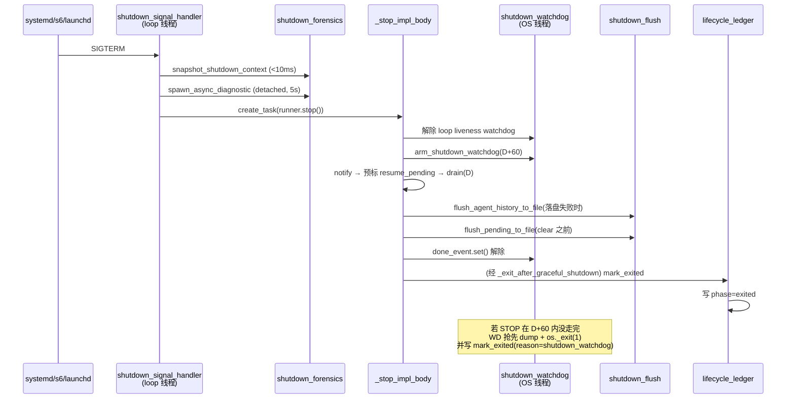
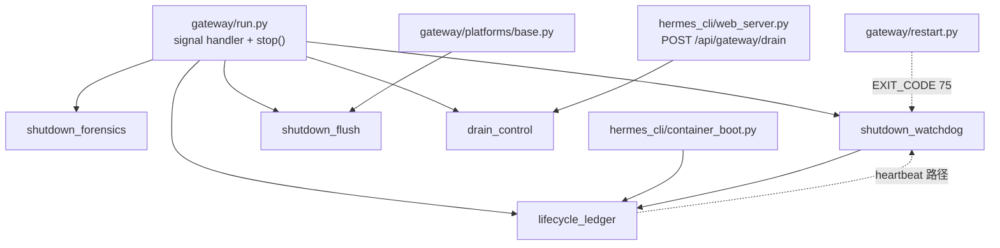

# r7c-raw-shutdown · 关停与排水 5 文件底稿

> 基线:`863e31318553cda8ad61df681d08175364d4164b`(下称 `@ 863e313`)。
> 本篇覆盖切片:`gateway/shutdown_flush.py`(321)、`gateway/shutdown_watchdog.py`(457)、
> `gateway/shutdown_forensics.py`(462)、`gateway/drain_control.py`(273)、
> `gateway/lifecycle_ledger.py`(323),共 1836 行,全部逐行精读。
> 为把时间线钉死,另读了 `gateway/run.py` 的关停相关段落(信号处理器、`stop()`、
> `_stop_impl_body`、`_drain_active_agents`、`_finalize_shutdown_agents`、
> `_bounded_adapter_teardown`、`_exit_after_graceful_shutdown`、启动侧接线)以及
> `gateway/restart.py`、`hermes_cli/gateway.py` 的 systemd unit 模板、
> `hermes_cli/container_boot.py`、`hermes_cli/web_server.py` 的 drain 端点。

---

## 0. 一句话

这 5 个文件不是"关停流程"本身 —— 关停主流程在 `gateway/run.py` 的 `_stop_impl_body` 里;
它们是**围着关停流程的四道保险 + 一条外部控制通道**:排水标记(drain_control)负责
"先不接新活",落盘补救(shutdown_flush)负责"内存里的用户消息不能随进程蒸发",
看门狗(shutdown_watchdog)负责"asyncio 卡死时用 OS 线程 `os._exit` 兜底",
取证(shutdown_forensics)负责"事后能回答是谁杀的我",生命周期台账(lifecycle_ledger)
负责"下次启动能知道上次是被 SIGKILL/OOM 干掉的"。

---

## 1. 优雅关停完整时间线 —— 核心产出

### 1.0 前置:进程还活着的时候就已经武装好的东西

| # | 机制 | 周期/超时 | 代码行号 @ 863e313 |
|---|---|---|---|
| P1 | 生命周期哨兵认领(`record_startup`,写 `phase=running`) | 一次性,启动时 | `gateway/run.py:26789-26792` → `gateway/lifecycle_ledger.py:224-268` |
| P2 | selector 地板定时器(让事件循环 selector 等待有限) | 每 5s 自续 | `gateway/run.py:10632-10636` → `gateway/shutdown_watchdog.py:96-107`, 常量 `:48` |
| P3 | 事件循环存活看门狗(OS 线程,探针) | 每 30s 探一次 / 探针超时 10s / 连续 3 次未响应 → `os._exit(75)` | `gateway/run.py:10638-10643` → `gateway/shutdown_watchdog.py:110-209`,常量 `:49-51` |
| P4 | systemd `TimeoutStopSec` 对齐自检(不匹配只 WARNING) | 启动时一次,`systemctl` 调用超时 2.0s | `gateway/run.py:10727-10743` → `gateway/shutdown_forensics.py:322-406`(`timeout=2.0` 在 `:371`) |
| P5 | 事件循环心跳文件 `state/gateway.heartbeat`(含内存采样) | 每 30s 重写 | `gateway/run.py:11360-11366` → `gateway/shutdown_watchdog.py:431-457`,常量 `:47` |
| P6 | 外部排水标记监视器(`.drain_request.json`) | 每 1.0s 轮询 | `gateway/run.py:11560` → `gateway/run.py:7881-7909` → `gateway/drain_control.py:210-226` |
| P7 | 上次遗留的 pending 消息恢复 | 一次性,`runner.start()` 之后 | `gateway/run.py:26826-26834` → `gateway/shutdown_flush.py:169-269` |

P3 的实际时间常数(`gateway/shutdown_watchdog.py:141-197`):循环体是
`while not stop_event.wait(timeout=interval)`(`:143`),每轮先睡 30s,再 `call_soon_threadsafe`
投一个探针(`:146`),最多等 10s(`:130-139`)。所以从"循环真正冻住"到硬退出约
`3 × (30 + 10) = 120s`。

```python
# gateway/shutdown_watchdog.py:141-150
    def _watchdog() -> None:
        strikes = 0
        while not stop_event.wait(timeout=interval):
            probe_event = threading.Event()
            try:
                loop.call_soon_threadsafe(probe_event.set)
            except RuntimeError:
                # A normally closed loop cannot be probed and no longer needs
                # a process-liveness backstop.
                return
```

### 1.1 主时间线表(SIGTERM → 进程消失)

`T` = 收到信号的时刻。`D` = `agent.restart_drain_timeout`,**默认 0**
(`hermes_cli/config_defaults.py:47`,注释 `:38-46` 明说 "0 = interrupt immediately (the default)")。

| # | 阶段 | 触发条件 | 超时 | 超时后动作 | 代码行号 @ 863e313 |
|---|---|---|---|---|---|
| 1 | 信号送达处理器(跑在事件循环线程里,同步) | `loop.add_signal_handler(sig, shutdown_signal_handler, sig)` | 无 | — | `gateway/run.py:26721-26723`;handler 定义 `:26604` |
| 2 | 判定是否 `--replace` 接管(消费 `.gateway-takeover.json`) | 总是 | 无 | 是接管 → 记 planned,exit 0 语义 | `gateway/run.py:26614-26619` |
| 3 | 判定是否计划内停止(SIGINT 或 `.gateway-planned-stop.json`) | 非接管时 | 无 | 都不是 → `_signal_initiated_shutdown = True` | `gateway/run.py:26623-26632`, `:26661-26667` |
| 4 | 同步取证快照 `snapshot_shutdown_context()` | 总是 | **自律 <10ms**,无强制超时(纯 stdlib + /proc) | 抛异常 → `_shutdown_ctx = None`,继续 | `gateway/run.py:26640-26649` → `gateway/shutdown_forensics.py:104-194` |
| 5 | 一行 key=value 现场日志 | `_shutdown_ctx is not None` | 无 | 异常吞掉 | `gateway/run.py:26675-26681` → `shutdown_forensics.py:281-311` |
| 6 | 重型取证子进程(`ps auxf`/`pstree`/`dmesg`)detach 派发 | 同上 | **5.0s**(子进程自带 `timeout 5`) | 子进程自杀,主进程不受影响 | `gateway/run.py:26686-26696` → `shutdown_forensics.py:197-278`,`Popen(["timeout", ...])` 在 `:257-264` |
| 7 | `asyncio.create_task(runner.stop())`,handler 立即返回 | 总是 | 无 | — | `gateway/run.py:26697` |
| 8 | `stop()`:**先解除**循环存活看门狗 + 地板定时器 | 总是 | 无 | — | `gateway/run.py:12668-12671` → `shutdown_watchdog.py:79-93`(`stop()`)、`:73-77`(floor cancel) |
| 9 | **武装关停看门狗**(OS 守护线程) | 非 pytest(`PYTEST_CURRENT_TEST` 未设) | **D + 60s**(`resolve_shutdown_watchdog_delay`,grace 默认 60) | dump 全线程栈 → 释 PID/锁 → drain 日志 → `mark_exited(1,"shutdown_watchdog")` → `os._exit(1)` | `gateway/run.py:12774-12780`;`shutdown_watchdog.py:274-288`(算式)、`:46`(grace)、`:364-422`(线程体) |
| 10 | `_running=False; _draining=True` | 总是 | 无 | — | `gateway/run.py:12801-12802` |
| 11 | 停 sd_notify systemd watchdog 心跳 | 有 systemd watchdog 时 | 无 | — | `gateway/run.py:12804-12806` → `:12651-12657` |
| 12 | 取消次级 profile 重连任务 | multiplex 模式 | **每批 5.0s**(= adapter disconnect 预算) | WARNING 后继续 | `gateway/run.py:12808` → `:12603-12633`(`asyncio.wait(tasks, timeout=timeout)` 在 `:12627`) |
| 13 | 通知活跃会话 + home 频道"要关了" | 适配器仍连着 | 无(逐条 best-effort) | 单条失败吞掉 | `gateway/run.py:12812` → `:9253`;home 广播被 `drain_notification_suppressed()` 门控于 `:9383-9395` |
| 14 | 预标记 `resume_pending`(排水**前**就落盘) | 每个 running agent | 无 | 单条失败只 debug | `gateway/run.py:12823-12836`(#27856) |
| 15 | **排水等待** `_drain_active_agents(D)` | 有 agent/cron/api 在跑 | **D 秒**(默认 0 → 立即判定超时) | 返回 `timed_out=True` | `gateway/run.py:12818`, `:12840` → `:9184-9241`;`timeout<=0` 直接 `return snapshot, True` 在 `:9222-9223`;轮询 0.1s 在 `:9235` |
| 16 | 超时分支:再标 `resume_pending` → 硬中断所有 agent | `timed_out` | — | — | `gateway/run.py:12904-12916` |
| 17 | 等 agent 真正退出 | `timed_out` | **5.0s**(轮询 0.1s) | 不等了,直接往下走 | `gateway/run.py:12918-12920` |
| 18 | 提前杀工具子进程 `_kill_tool_subprocesses("post-interrupt")` | `timed_out` | 无(各子步骤 best-effort) | — | `gateway/run.py:12931`;实现 `:12681-12744`(#8202) |
| 19 | 落盘每个 agent 的在途 transcript(`_flush_messages_to_session_db`) | 每个排水快照里的 agent | 无 | **抛异常 → `flush_agent_history_to_file()` 存 JSON 快照** | `gateway/run.py:12943` → `:9452-9520`;失败分支 `:9494-9506` → `shutdown_flush.py:272-321` |
| 20 | 每个 agent 的资源清理(memory provider 等)转线程池 | 同上 | **30.0s**(`_CLEANUP_TIMEOUT_S`) | 超时后继续(#53175) | `gateway/run.py:9519-9521`, `:9556`, `:9596-9628` |
| 21 | 空闲 agent 缓存的 provider 清理 | `_agent_cache` 非空 | 每个 **30.0s** | 同上 | `gateway/run.py:12946-12965` |
| 22 | 逐适配器断开 `_bounded_adapter_teardown` | 每个 adapter × 2 次 await | **每 await 5.0s**(`HERMES_GATEWAY_ADAPTER_DISCONNECT_TIMEOUT`,默认 `_ADAPTER_DISCONNECT_TIMEOUT_SECS_DEFAULT`) | 取消旧任务、WARNING、强制往下 | `gateway/run.py:12967-12976` → `:6525-6575`;默认值 `gateway/run.py:81`;读取 `:6577-6590`(#14128) |
| 23 | 取消所有后台任务(跳过 `_stop_task` / `_restart_task`) | 总是 | 无 | — | `gateway/run.py:12978-12994`(#12875) |
| 24 | **`flush_pending_to_file()` 再 `.clear()`** | 总是 | 无 | 整段 `except Exception: pass` | `gateway/run.py:13002-13006`(flush)、`:13014`(clear)→ `shutdown_flush.py:82-137`(#72680) |
| 25 | `_shutdown_event.set()` | 总是 | 无 | — | `gateway/run.py:13020` |
| 26 | 兜底再杀一遍工具子进程 `("final-cleanup")` | 总是 | 无 | — | `gateway/run.py:13029` |
| 27 | 回收进程级 auxiliary client 缓存 | 总是 | 无 | debug | `gateway/run.py:13036-13041`(#14210) |
| 28 | 关 SQLite(释放 WAL 写锁)+ 关线程池 | 总是 | 无 | debug | `gateway/run.py:13055-13064` |
| 29 | 删 PID 文件 + 释放 runtime lock | 总是 | 无 | — | `gateway/run.py:13070-13072` |
| 30 | 写 `.clean_shutdown` 标记 | **仅 `not timed_out`** | 无 | 排水超时则**故意不写**,下次启动挂起最近活跃会话 | `gateway/run.py:13081-13091` |
| 31 | 卡死会话计数 +1(3 次触发自动挂起) | `active_agents` 非空 | — | — | `gateway/run.py:13100-13101`(#7536) |
| 32 | 计划重启:写通知标记 / 走 systemd 快捷路径 / 定 exit 75 | `_restart_requested` | 无 | — | `gateway/run.py:13103-13137`;`GATEWAY_SERVICE_RESTART_EXIT_CODE = 75` 在 `gateway/restart.py:10` |
| 33 | `_draining=False`,持久化终态 `gateway_state` | 总是 | 无 | 非预期信号 → 写 `running`(保住 s6 自启意图) | `gateway/run.py:13139`, `:13161-13169`(#42675) |
| 34 | **解除关停看门狗** `_watchdog_done.set()`(`finally`) | 总是 | — | — | `gateway/run.py:12787-12788` |
| 35 | `main()` 统一出口 `_exit_after_graceful_shutdown(exit_code)` | 总是(含 `SystemExit`) | — | — | `gateway/run.py:27060-27071`,定义 `:27074` |
| 36 | 出口:flush stdio → 删 PID/释锁 → **`mark_exited(code,"graceful_shutdown")`** → drain 日志队列 → `os._exit` | 总是 | 日志 drain **1.0s** | 超时也照样 `os._exit` | `gateway/run.py:27107-27141`;`mark_exited` 在 `:27127-27130` → `lifecycle_ledger.py:271-301`;`drain_log_queue(timeout=1.0)` 在 `:27138` |

### 1.2 外圈升级阶梯(谁先动手)

| 层 | 触发时限 | 动作 | 出处 |
|---|---|---|---|
| systemd | `TimeoutStopSec = max(60, D + 30)` | `KillMode=mixed` → SIGKILL 整个 cgroup | `hermes_cli/gateway.py:2862-2863`(计算)、`:2923`/`:2961`(unit 模板) |
| 关停看门狗(本切片) | `D + 60` | faulthandler 全栈 dump + `os._exit(1)` | `shutdown_watchdog.py:274-288`, `:364-422` |
| 循环存活看门狗(本切片) | ≈120s,**仅在 `stop()` 之外有效** | 全栈 dump + `os._exit(75)` | `shutdown_watchdog.py:110-209`;在 `stop()` 开头被解除 `gateway/run.py:12668-12671` |

**这里有个必须记下来的时序事实**:默认 `D = 0` ⇒ systemd `TimeoutStopSec = max(60, 30) = 60s`,
而关停看门狗的皮筋是 `0 + 60 = 60s`。**两者正好相等**,谁先开火取决于调度抖动。
一旦运维把 `D` 调大,比如 `D = 45`:systemd 是 `75s`,看门狗是 `105s` —— **systemd 的
SIGKILL 一定先到,看门狗永远等不到开火**。所以在 systemd 部署下,这个看门狗实际只在
`D = 0`(默认)时勉强有意义;它真正的价值场景是 launchd / Docker / s6 / 前台裸跑
这些 stop 超时更宽或不存在的地方。而 `check_systemd_timing_alignment` 用的 headroom 是
**30s**(`shutdown_forensics.py:398`),对齐的是"排水 + 收尾",**根本没有对齐看门狗的 60s grace**,
所以它永远不会就"看门狗比 SIGKILL 晚"这件事报警。

```python
# gateway/shutdown_forensics.py:396-406
    timeout_stop_sec = timeout_us / 1_000_000.0
    # systemd needs headroom for: post-interrupt kill, adapter disconnect,
    # SessionDB close, file unlinks, etc.  30s matches the unit-template
    # constant in hermes_cli/gateway.py.
    headroom = 30.0
    expected = drain_timeout + headroom
    return {
        "unit": unit_name,
        "timeout_stop_sec": timeout_stop_sec,
        "drain_timeout": drain_timeout,
        "expected_min": expected,
        "mismatch": timeout_stop_sec < expected,
    }
```

### 1.3 五文件在时间线上的位置(Mermaid)



---

## 2. 逐文件

### 2.1 `gateway/shutdown_flush.py`(321 行)—— 关停时把内存里唯一的用户消息落到盘上

**解决什么问题。** 模块 docstring 把事故讲得很清楚:

```python
# gateway/shutdown_flush.py:1-12
"""Flush pending messages and agent transcripts to disk before shutdown to prevent data loss.

When FTS5 index corruption prevents ``INSERT INTO messages``, the gateway
accumulates messages in ``_pending_messages`` (memory-only) and the live
``agent._session_messages`` cannot be flushed via ``_flush_messages_to_session_db``.
On shutdown, ``.clear()`` discards the only surviving copy — permanent user data loss.

This module provides three hooks:

1. ``flush_pending_to_file()`` — called BEFORE ``_pending_messages.clear()``
   during shutdown.  Serialises any non-empty pending slots to a JSON file
   under ``<hermes_home>/pending_messages/``.
```

FTS5 = SQLite 的全文检索扩展(Full-Text Search v5);它的索引一旦损坏,`INSERT INTO
messages` 就整条失败,消息只能留在内存的 `_pending_messages` 槽里。

**flush 的到底是什么。** 两类东西,**不是**未发出的回复,也不是台账:

1. **待处理的入站用户消息**(`_pending_messages`)。这是"agent 正忙时用户又发了一条"
   排在槽里的消息。两个来源:适配器层
   (`gateway/platforms/base.py:6559-6564`,`reason="adapter_shutdown"`,值是 `MessageEvent`)
   和 runner 层(`gateway/run.py:13002-13005`,`reason="shutdown"`,值可能是纯字符串)。
2. **agent 的在途 transcript**(`agent._session_messages`),只在
   `_flush_messages_to_session_db` **抛异常**时才走这条路
   (`gateway/run.py:9494-9506` → `shutdown_flush.py:272-321`),`reason` 固定为
   `"shutdown-with-unpersisted-agent-history"`。

**怎么实现。** 落盘目录 `<HERMES_HOME>/pending_messages/`,0700:

```python
# gateway/shutdown_flush.py:39-47
def _get_flush_dir():
    """Return the pending-messages flush directory under the active HERMES_HOME."""
    from hermes_constants import get_hermes_home

    flush_dir = get_hermes_home() / "pending_messages"
    flush_dir.mkdir(parents=True, exist_ok=True, mode=0o700)
    if os.name == "posix":
        os.chmod(flush_dir, 0o700)
    return flush_dir
```

单文件写入是 uuid4 命名 + 原子写 + 0600 + 目录 fsync:

```python
# gateway/shutdown_flush.py:61-79
def _write_payload(flush_dir: Path, payload: Dict[str, Any]) -> None:
    """Atomically write one private, uniquely named recovery payload."""
    from utils import atomic_json_write

    file_id = uuid.uuid4().hex
    final_path = flush_dir / f"pending-{file_id}.json"
    atomic_json_write(
        final_path,
        payload,
        mode=0o600,
        default=str,
    )

    try:
        _fsync_directory(flush_dir)
    except OSError as exc:
        # The atomically published file is still the only recovery copy.
        # Keep it even if this filesystem cannot persist directory entries.
        logger.debug("Failed to fsync pending-message directory: %s", exc)
```

用 uuid4 而不是 session_key 做文件名是刻意的:session_key 形如
`agent:main:telegram:supergroup:123`,含 `:` 和平台名,直接当文件名既非法(Windows)
又泄露路由信息。测试把这条钉住了:`tests/gateway/test_shutdown_flush.py:40-41`
断言 `":" not in files[0].name` 且 `"telegram" not in files[0].name`。

`atomic_json_write` 的语义(临时文件 + fsync + `os.replace`)见 `utils.py:206-229`。

**flush 失败怎么办。**

- 单个 session 序列化/写盘失败:`except Exception` → `logger.debug`,继续下一个
  (`shutdown_flush.py:126-130`)。**不中断关停**。
- 整个 `flush_pending_to_file` 调用失败:调用点直接 `except Exception: pass`
  (`gateway/run.py:13006`、`gateway/platforms/base.py:6564`)。
- 目录 fsync 失败:只 debug(`:76-79`),因为原子发布的文件本身已经是唯一副本。
- `flush_agent_history_to_file` 整体包在 try 里,失败只 WARNING
  (`shutdown_flush.py:317-321`),docstring 明说 "shutdown must never block on a
  best-effort backup"(`:285-286`)。

**恢复路径 —— 这里有个结构性缺陷(重要发现)。** `recover_pending_to_db` 在启动时跑
(`gateway/run.py:26826-26834`),它需要 `data["session_id"]` 才能 `append_message`:

```python
# gateway/shutdown_flush.py:228-249
            session_id = data.get("session_id", "")

            if not session_id:
                # Try to extract from the session_key itself — gateway
                # session keys contain the session_id as the last segment
                # in some formats, but that's not guaranteed.  Log and
                # skip if we can't resolve it.
                logger.warning(
                    "Cannot recover pending message for %s: no session_id "
                    "in flush file and session_key-to-id resolution is not "
                    "available at this recovery stage. The message text is "
                    "preserved in %s",
                    session_key, path,
                )
                continue

            session_db.append_message(
                session_id=session_id,
                role="user",
                content=text,
                timestamp=payload.get("ts", int(time.time())),
            )
```

而 `session_id` 只可能来自 `_serialise_value` 的这段属性拷贝:

```python
# gateway/shutdown_flush.py:140-155
def _serialise_value(value: Any) -> Optional[dict]:
    """Convert a pending message value to a JSON-serialisable dict."""
    # MessageEvent objects have a .text attribute and other fields
    if hasattr(value, "text"):
        result: Dict[str, Any] = {"text": getattr(value, "text", "")}
        # Preserve additional fields if present
        for attr in ("session_id", "platform", "sender_id", "sender_name",
                      "reply_to", "media", "raw_event"):
            val = getattr(value, attr, None)
            if val is not None:
                try:
                    json.dumps(val)
                    result[attr] = val
                except (TypeError, ValueError):
                    result[attr] = str(val)
        return result
```

**但真实的 `MessageEvent` 一个都没有这些字段。** dataclass 定义在
`gateway/platforms/base.py:2053-2130`,字段是 `text` / `message_type` / `source` /
`raw_message` / `message_id` / `platform_update_id` / `media_urls` / `media_types` /
`reply_to_message_id` / `reply_to_text` / `reply_to_author_id` / `reply_to_author_name` /
`reply_to_is_own_message` / `prompt_response` / `auto_skill` / `channel_prompt` /
`channel_context` / `internal` / `metadata` / `timestamp` —— 没有 `session_id`、
没有 `platform`、没有 `sender_id`、没有 `sender_name`、没有 `reply_to`(只有
`reply_to_message_id` 等)、没有 `media`(只有 `media_urls`)、没有 `raw_event`
(只有 `raw_message`)。

```python
# gateway/platforms/base.py:2054-2069
class MessageEvent:
    """
    Incoming message from a platform.
    
    Normalized representation that all adapters produce.
    """
    # Message content
    text: str
    message_type: MessageType = MessageType.TEXT
    
    # Source information
    source: SessionSource = None
    
    # Original platform data
    raw_message: Any = None
    message_id: Optional[str] = None
```

**结论**:适配器层 flush 出来的 payload 里 `data` 恒等于 `{"text": ...}`;runner 层的纯
字符串走 `:157-158` 也是 `{"text": value}`。所以 `recover_pending_to_db` 对
**生产上产生的任何 flush 文件都必然走 `continue` 分支**,永远恢复不了,文件永远留在
`pending_messages/` 里。这个模块实际交付的是"人工可救",不是文档承诺的"自动恢复"。
测试之所以绿,是因为它用 `MagicMock` 手工挂了 `event.session_id`
(`tests/gateway/test_shutdown_flush.py:49-57`)和手写含 `session_id` 的 payload
(`:75-83`)—— 测试验证的是一个生产里不存在的对象形状。

顺带的后果:该目录**没有任何清理/上限逻辑**(全仓 grep `pending_messages` 只有
`shutdown_flush.py` 自己和 `session_state.py` 的同名内存字段),每次关停都会新增文件,
无限累积。

**取舍。** 用 JSON 文件而不是"另开一个 SQLite" —— 因为这条路径存在的前提就是
**SQLite 已经坏了**;救援介质必须与故障介质解耦。这个取舍是对的,代价是恢复要靠人。
另外 `recover_pending_to_db` 显式跳过 agent-history 快照
(`:206-210`,`reason == "shutdown-with-unpersisted-agent-history"` → `continue`),
因为那是给运维手工捞的,schema 不同(是 `messages` 列表,不是单条 `data`)。

---

### 2.2 `gateway/shutdown_watchdog.py`(457 行)—— asyncio 靠不住时,用 OS 线程兜底

**解决什么问题。** docstring 第一段就是全篇的论点:

```python
# gateway/shutdown_watchdog.py:1-8
"""Out-of-loop shutdown and event-loop liveness backstops (#66892, #69089).

When the asyncio loop freezes mid-drain, every asyncio-based recovery path is
structurally unable to fire: the drain deadline, status rewrites, and forensics
all need the same loop that is stuck. launchd/systemd KeepAlive only restarts a
*dead* process, so a wedged-but-alive gateway sits as a zombie until manual
SIGKILL.
"""
```

关键洞察:**排水超时本身是一个 asyncio 定时器**,循环冻了它就永远不会到期;
而 systemd/launchd 的 KeepAlive 只认"进程死了",活着但卡死的进程它管不着。所以必须
有一个**不依赖事件循环**的执行体。

**四件东西。**

1. **关停看门狗**(`arm_shutdown_watchdog`,`:337-428`)。`stop()` 开头武装,
   `finally` 里解除。
2. **心跳文件**(`write_loop_heartbeat` / `loop_heartbeat_forever`,`:232-271` / `:431-457`)。
3. **循环存活看门狗**(`start_loop_liveness_watchdog`,`:110-209`)。
4. **selector 地板定时器**(`_LoopFloorTimerHandle` / `_arm_loop_floor_timer`,`:56-107`)。

**它守什么 —— 关停看门狗。** 皮筋 = 排水超时 + grace:

```python
# gateway/shutdown_watchdog.py:274-288
def resolve_shutdown_watchdog_delay(
    drain_timeout: float,
    *,
    grace_s: float = DEFAULT_SHUTDOWN_WATCHDOG_GRACE_S,
) -> float:
    """Return the wall-clock leash for the shutdown watchdog thread."""
    try:
        drain = max(float(drain_timeout), 0.0)
    except (TypeError, ValueError):
        drain = 0.0
    try:
        grace = max(float(grace_s), 0.0)
    except (TypeError, ValueError):
        grace = DEFAULT_SHUTDOWN_WATCHDOG_GRACE_S
    return drain + grace
```

`DEFAULT_SHUTDOWN_WATCHDOG_GRACE_S = 60.0`(`:46`,注释 `:44-45` 说 "Matches the issue
#66892 suggested hardening")。

**它自己怎么保证不被卡住。**
- 是 `threading.Thread(daemon=True)`(`:425`),不跑在事件循环上,循环冻死跟它无关。
- 等待切成 1 秒一段,这样"晚一点的解除"不用等满整个 delay 才被观察到:

```python
# gateway/shutdown_watchdog.py:364-373
    def _watchdog() -> None:
        # Wait with interruptible chunks so a late disarm doesn't need the
        # full remaining sleep to observe done_event.
        deadline = time.monotonic() + delay
        while time.monotonic() < deadline:
            remaining = deadline - time.monotonic()
            if done.wait(timeout=min(remaining, 1.0)):
                return
        if done.is_set():
            return
```

- `snapshot_fn` 抛异常也不会炸线程,而是把异常字符串塞进快照(`:377-380`)。
- `_write_watchdog_dump` 整个包在 `try/except: pass`(`:310-322`),**并且**无论文件写
  成没成,都再往 stderr 打一遍 + 再 dump 一次(`:324-334`),注释说明理由是
  "wedged disk was one of the #66892 hypotheses"(`:325`)。
- daemon=True 意味着它不会阻止解释器退出。

**最后手段是 `os._exit`。** 不是 SIGKILL 自己,不是 `sys.exit`:

```python
# gateway/shutdown_watchdog.py:400-422
        # Mirror _exit_after_graceful_shutdown: release PID file + runtime
        # lock BEFORE the log drain (locks must never be stranded), then
        # drain the async log queue so the logger.critical above actually
        # reaches the file before os._exit bypasses atexit. (#66892)
        try:
            from gateway.status import remove_pid_file, release_gateway_runtime_lock
            remove_pid_file()
            release_gateway_runtime_lock()
        except Exception:
            pass
        try:
            from hermes_logging import drain_log_queue
            drain_log_queue(timeout=1.0)
        except Exception:
            pass
        # Record the watchdog exit so the next boot's unclean-death detector
        # reports "shutdown watchdog fired" instead of SIGKILL/OOM (NS-608).
        try:
            from gateway.lifecycle_ledger import mark_exited
            mark_exited(exit_code, reason="shutdown_watchdog")
        except Exception:
            pass
        os._exit(exit_code)
```

硬退出前的 4 件事顺序是有讲究的,注释 `:400-403` 写明:**先释放 PID 文件和 runtime lock
(锁绝不能被遗留),再 drain 日志队列**(因为 drain 是有界的但在坏盘上仍可能吃满 1s)。
`os._exit` 绕过 `atexit`,所以这些平时挂在 `atexit` 上的清理必须手工重做一遍 —— 这和
`_exit_after_graceful_shutdown` 是同构的(`gateway/run.py:27107-27141`),注释里也说了
"Mirror _exit_after_graceful_shutdown"。

`mark_exited` 的位置在 drain 之后、`os._exit` 之前,目的是让下次启动报"看门狗硬退出"
而不是误判成 SIGKILL/OOM(`:415-416`)。

**为什么不是 `sys.exit`。** 同一份理由写在 `gateway/run.py:27077-27080`:
`sys.exit` 抛 `SystemExit` → `Py_FinalizeEx` → `wait_for_thread_shutdown` 会 join
所有非 daemon 线程 —— 而"某个工具线程卡死"正是 #53107 的病因,join 会直接把关停冻住。

**循环存活看门狗的两个细节。**
- 默认退出码是 `GATEWAY_SERVICE_RESTART_EXIT_CODE = 75`(`:116`,常量在
  `gateway/restart.py:10`),而关停看门狗调用方传的是 `exit_code=1`
  (`gateway/run.py:12779`)。75 在 systemd unit 里被 `RestartForceExitStatus` 白名单
  (`hermes_cli/gateway.py:2917`),所以哪怕单元配的是 `Restart=on-failure` 也能拉起来。
- 每一步动作前都重新检查 `stop_event.is_set()`(`:164-165`、`:170-171`、`:186-187`),
  这是为了避免"正在 dump 的时候 gateway 已经正常停了,结果被硬杀"。三个专门的测试钉这个:
  `tests/gateway/test_loop_liveness_watchdog.py:24`、`:56`、`:106`。
- 模块**刻意不读配置**:`gateway.loop_watchdog: false` 的开关判断放在调用方
  `GatewayRunner._start_loop_liveness_guards`(`gateway/run.py:10630-10631`),
  docstring `:120-123` 说明是为了让"裸 loop 测试"能直接驱动本模块。

**地板定时器为什么存在。** asyncio 的 selector 如果没有任何 pending timer,
`select()` 的超时是 `None`(无限等待)。此时若唤醒信号丢失,循环就再也不会转。
`_LoopFloorTimerHandle` 用一个 5 秒自续的空 timer 保证 selector 等待始终有限
(`:56-77`,`_tick` 里 `if not self._cancelled: self._schedule()`),
让"已有的 async 恢复任务还有机会跑起来"(docstring `:20-21`)。

**心跳文件。** `<HERMES_HOME>/state/gateway.heartbeat`(`:52`、`:220-223`),30s 一次,
内容含 pid / updated_at / monotonic / start_time / mem。
`start_time` 的用途是"让 supervisor 能识别 PID 复用"(`:241-242`)。内存采样是后来
为 NS-608 加的:

```python
# gateway/shutdown_watchdog.py:252-264
    # Embed a cheap memory sample (own RSS + MemAvailable + swap) so the
    # heartbeat doubles as a rolling pre-death telemetry snapshot: after an
    # unclean death (SIGKILL/OOM/VM loss) the last heartbeat is the closest
    # surviving record of memory pressure — see gateway.lifecycle_ledger
    # (NS-608).  Best-effort; <1ms of /proc reads on Linux, {} elsewhere.
    try:
        from gateway.lifecycle_ledger import sample_memory

        mem = sample_memory()
        if mem:
            payload["mem"] = mem
    except Exception:
        pass
```

`_process_hermes_home()`(`:212-217`)刻意直接读环境变量 `HERMES_HOME` 而不是
`get_hermes_home()`,注释说是为了"忽略 profile 覆盖" —— 心跳/哨兵是**进程级身份文件**,
不能跟着多 profile 漂移。`lifecycle_ledger.py:61-68` 有一份完全同构的私有拷贝
(措辞是 "ignore task overrides")。两份重复实现,是可合并的重复。

**取舍。**
- 关停看门狗是 daemon 线程,好处是不阻塞退出,代价是它自己也可能在解释器 finalize 时
  被截断 —— 但既然它的动作就是 `os._exit`,这个代价不成立。
- `os._exit(1)` 而不是 75:意味着 systemd 把它当"普通失败",靠 `Restart=always` 拉起,
  不走 `RestartForceExitStatus` 白名单。若运维改成 `Restart=on-failure`,1 仍算 failure,
  也能拉起;若改成 `Restart=on-abnormal`,则拉不起来。是个隐含的部署耦合。
- 上文 1.2 已述:在 systemd 下 grace=60 常常晚于 `TimeoutStopSec`,这个看门狗基本是给
  非 systemd 环境用的。

---

### 2.3 `gateway/shutdown_forensics.py`(462 行)—— "是谁在杀我"

**解决什么问题。** 信号处理器跑在事件循环里,不能阻塞;但"网关老是自己死"这类工单
必须能事后回答"谁发的信号"。

```python
# gateway/shutdown_forensics.py:1-16
"""Shutdown forensics — capture context when the gateway receives SIGTERM/SIGINT.

The gateway's ``shutdown_signal_handler`` runs synchronously inside the
asyncio event loop.  We can't safely block it for long, but we DO want a
durable record of who/what triggered the shutdown so that "the gateway
keeps dying" incidents can be diagnosed after the fact.

This module exposes :func:`snapshot_shutdown_context`, a fast (<10ms),
non-blocking probe that returns a structured dict the signal handler can
log immediately, plus :func:`spawn_async_diagnostic`, a fire-and-forget
``ps`` walk that runs as a detached subprocess so it can't block teardown
even if /proc is wedged.

Anything that needs to wait (e.g. shelling out to ``ps aux``) belongs in
the async helper, never in the synchronous probe.
"""
```

**收集什么现场。** 注意:**不是**线程栈、**不是** asyncio 任务列表 —— 那是
`shutdown_watchdog` 用 `faulthandler` 干的活。这里收的是**进程谱系与外部环境**:

`snapshot_shutdown_context`(`:104-194`)采集:

| 字段 | 意义 | 行号 |
|---|---|---|
| `signal` / `signal_num` | SIGINT 还是 SIGTERM(区分 Ctrl+C 与服务管理器) | `:126-127`,名字表 `:30-45` |
| `pid` / `ppid` / `parent` / `self` | **父进程的 cmdline** 是最有用的单一线索 | `:128-131`,`_proc_summary` `:73-101` |
| `under_systemd` | `INVOCATION_ID` 存在或 `ppid == 1` | `:137-143` |
| `loadavg_1m` | 高负载 ⇒ "别的东西把机器压垮了"而非"外部杀手" | `:145-150` |
| `tracer_pid` | `/proc/self/status` 的 TracerPid 非 0 ⇒ 有人挂了 gdb/strace | `:152-161` |
| `takeover_marker` + `takeover_marker_for_self` | 有 `--replace` 接管标记但**不指向自己** ⇒ 兄弟进程在杀我 | `:163-183` |
| `planned_stop_marker` | 计划内停止标记 | `:184-190` |

两个刻意的工程约束:

```python
# gateway/shutdown_forensics.py:163-192
    # Race-detection hint: did somebody recently start a sibling gateway
    # with --replace?  We can't see the new process directly here, but if
    # there's a takeover marker on disk that DOESN'T name us, that's a
    # smoking gun for "another --replace instance is killing us".
    # Filenames mirror gateway.status (._TAKEOVER_MARKER_FILENAME /
    # _PLANNED_STOP_MARKER_FILENAME); we use string literals here so the
    # signal-handler path stays import-light.
    try:
        hermes_home_str = os.environ.get("HERMES_HOME")
```

—— 文件名**硬编码字符串**而非从 `gateway.status` import,理由是"信号处理器路径要保持
import 轻量"。这是有意的重复,代价是 `gateway/status.py` 改名会静默失配。
`_proc_summary` 里 cmdline 截断到 300 字符(`:99-100`,"these can be 4KB")。

`spawn_async_diagnostic`(`:197-278`)才是重活:`ps auxf --sort=-pcpu | head -60`、
`pstree -plau <pid>`、`/proc/loadavg`、`dmesg -T | tail -20`(退化到
`journalctl --user`),脚本文本在 `:229-241`。三层防护:

```python
# gateway/shutdown_forensics.py:251-264
    try:
        # Detach from our process group so the subprocess survives even
        # if systemd kills our cgroup with KillMode=control-group (which
        # would also reap us anyway, but defense in depth).  Without
        # start_new_session, a SIGKILL on our cgroup takes the diag down
        # before it can flush.
        proc = subprocess.Popen(
            ["timeout", f"{timeout_seconds:.0f}", "bash", "-c", script],
            stdout=fd,
            stderr=subprocess.STDOUT,
            stdin=subprocess.DEVNULL,
            start_new_session=True,
            close_fds=True,
        )
```

- 外壳是 `timeout N bash -c ...` —— 卡住的 `ps` 自己会被杀。
- `start_new_session=True` —— 脱离 cgroup / 进程组,systemd 杀 cgroup 时诊断进程还能写完。
- 日志 fd 用 `O_APPEND` 打开(`:247`),注释 `:245-246` 说明是为了"连发信号时多个诊断
  不互相踩"。

为什么这么做的历史原因写在调用方:

```python
# gateway/run.py:26635-26639
        # Fast (<10ms) snapshot of who's asking us to shut down — runs
        # synchronously inside the asyncio signal handler, so we keep it
        # purely stdlib + /proc reads, no subprocesses.  See PR #15826
        # (May 2026): the previous implementation called `ps aux` here
        # synchronously, blocking the event loop for up to 3s while
        # adapter teardown couldn't begin.
```

**写到哪。**
- 结构化 dict → 直接 `logger.warning("Shutdown context: %s", ...)`,一行 key=value
  (`format_context_for_log`,`:281-311`,父进程 cmdline 放最后因为最长)。
- 重型诊断 → `<HERMES_HOME>/logs/gateway-shutdown-diag.log`(路径由调用方给,
  `gateway/run.py:26691`)。

**为什么值 462 行。** 拆开看:signal 名表 + 3 个 `/proc` 读取器约 100 行;快照本体 90 行;
子进程派发 80 行;两个格式化器 40 行;**而 `check_systemd_timing_alignment` +
`_parse_systemd_duration_to_us` 一个人吃掉 140 行(`:322-462`)** —— 这块严格来说不是
"关停取证",而是**启动时的配置错配预警**,只是因为病因同源才放在一起:

```python
# gateway/shutdown_forensics.py:322-337
def check_systemd_timing_alignment(drain_timeout: float) -> Optional[Dict[str, Any]]:
    """At startup, sanity-check that systemd's TimeoutStopSec >= drain_timeout.

    When the gateway is run under a stale systemd unit file (e.g. the user
    upgraded hermes-agent but never re-ran ``hermes setup`` to regenerate
    the unit), ``TimeoutStopSec`` can be smaller than the configured
    ``restart_drain_timeout``.  Result: SIGTERM arrives, the drain starts,
    and systemd SIGKILLs the cgroup mid-drain — looks like a phantom kill
    in the journal because the journal only logs ``code=killed status=9``.
```

它的实现路径:`INVOCATION_ID` 判断在 systemd 下(`:339-341`)→ 从
`/proc/self/cgroup` 里倒着找 `.service` 后缀段拿 unit 名(`:345-361`)→
`systemctl [--user] show <unit> --property=TimeoutStopUSec`,先试 `--user` 再试 system,
`timeout=2.0`(`:366-389`)→ 值可能是纯数字微秒也可能是 `"1min 30s"`,后者交给
`_parse_systemd_duration_to_us` 的手写状态机(`:409-462`,54 行,支持
us/ms/s/sec/min/h/hr,不认的一律 `None`)。

所以"为什么值 462 行"的答案是:**关停取证本体只有约 320 行,另外 140 行是一个几乎独立的
systemd 配置校验器,搭了个便车。** 这是可以拆的。

**dead code**:`context_as_json`(`:314-319`)全仓只有测试引用
(`tests/gateway/test_shutdown_forensics.py:78-80`),**生产零调用点**。
把 ctx 结构化落盘的能力事实上没启用 —— 现在只有那一行人类可读的 `format_context_for_log`。

---

### 2.4 `gateway/drain_control.py`(273 行)—— 排水标记契约

**"排水"排的到底是什么。** 注意:本文件的 drain 与 `_stop_impl_body` 里那个
"排水等待"**不是一回事**,`gateway/run.py:5945-5955` 的注释专门澄清这点:

```python
# gateway/run.py:5945-5955
        # External (NAS-driven) drain state — distinct from the shutdown
        # ``_draining`` flag above. Set by ``_drain_control_watcher`` when the
        # ``.drain_request.json`` marker is present: the gateway flips
        # ``gateway_state -> draining`` and refuses NEW turns, but the process
        # does NOT exit (the whole point — quiesce-without-restart, D4a). It is
        # fully reversible: removing the marker reverts to ``running`` and
        # re-accepts turns. ``_draining`` (shutdown) is one-way and ends in
        # process exit; this one is a steady state NAS polls during its
        # request -> poll -> proceed loop.
        self._external_drain_active = False
```

两种 drain 对照:

| | 外部 drain(本文件) | 关停 drain(`_stop_impl_body`) |
|---|---|---|
| 标志位 | `_external_drain_active` | `_draining` |
| 触发 | `.drain_request.json` 出现 | `stop()` 被调用 |
| 排的是 | **新回合的准入**(不接新 turn) | **在途回合的完成**(等它们跑完) |
| 在途工作 | 不动,让它自然跑完 | 超时后硬中断 |
| 是否退出进程 | **不退出** | 退出 |
| 可逆 | 可逆(删标记即恢复) | 单向 |

所以精确回答:**外部 drain 排的是"新回合"这个流量,让在途回合池自然干涸到 0**;
**关停 drain 排的是"在途回合"本身**。

**排水期间新消息怎么办。** 在 `_handle_message` 里被一个门挡下,回一句提示:

```python
# gateway/run.py:15654-15664
        if self._external_drain_active and not is_internal:
            logger.info(
                "Refusing new turn for session %s — external drain active.",
                _quick_key,
            )
            return (
                "⏳ This agent is draining for a maintenance action and isn't "
                "accepting new turns right now. It'll be back in a moment — "
                "please resend shortly."
            )
```

关键限定 `not is_internal` —— 内部/系统事件(重启恢复重放、后台进程完成回调)照常放行
(理由在 `gateway/run.py:15651-15652`)。cron 也被同一个闸门挡住:

```python
# gateway/run.py:26909-26912
    if isinstance(cron_provider, InProcessCronScheduler):
        cron_start_kwargs["can_dispatch"] = lambda: not (
            runner._draining or runner._external_drain_active
        )
```

消息是**被拒绝并回执**,不是排队 —— 用户被要求稍后重发。这是刻意的:排队会让在途集合
永远降不到 0,破坏 D4a 的 TOCTOU 消除(`gateway/run.py:15646-15650`)。

**排水完成的判定条件。** 本模块**不判定**。契约是"网关只负责不接新活",
"完成"由外部调用者(NAS/dashboard)轮询 `/api/status` 直到 `active_agents == 0` 自己判
(`gateway/drain_control.py:2-8` 与 `gateway/run.py:7826-7831` 的注释,
`hermes_cli/web_server.py:4076-4079` 回显 `draining`)。这是本设计最反直觉也最重要的
一条:**没有 HTTP 控制通道能打进运行中的网关**,唯一通道就是文件标记。

```python
# gateway/drain_control.py:1-14
"""External drain-control marker contract (dashboard → gateway).

Task 2.2 of the safe-shutdown plan (decisions.md Q-B, option A): the dashboard
has no way to call into a running gateway — there is no HTTP control channel
into the gateway process (guardrails: "there is NO external control channel
into a running gateway"). Restart/drain is driven only by the gateway reacting
to its own inputs: slash commands, process signals, and file markers it writes
itself (``.restart_notify.json``).

So the begin/cancel-drain dashboard endpoint communicates with the running
gateway the same way: it writes (or removes) a marker file, and a gateway
background watcher reacts to it. This module owns that marker contract so both
sides — the dashboard endpoint (writer) and the gateway watcher (reader) —
share one definition and can never disagree.
"""
```

**实例化 epoch —— NS-570 的核心。** 这是本文件最有含量的 60 行:

```python
# gateway/drain_control.py:67-99(节选)
@functools.lru_cache(maxsize=1)
def current_instantiation_epoch() -> str:
    """Identity of THIS container / VM instantiation.

    Stable for the life of the PID-1 init process — so an s6 respawn of just
    the gateway keeps the same epoch and an in-flight drain is honoured — but
    changes when the machine/container is recreated (a fresh PID 1 → a fresh
    epoch). Composed from two ``/proc`` facts:

      * the kernel **boot id** (``/proc/sys/kernel/random/boot_id``) — changes
        on a VM / microVM reboot (e.g. a Fly Firecracker machine restart);
      * **PID 1's start time** (field 22 of ``/proc/1/stat``) — changes on a
        plain ``docker restart`` (the host kernel, hence boot_id, is unchanged,
        but ``/init`` is a brand-new process).
```

`/proc/1/stat` 的解析处理了 comm 里可能含空格和括号的经典陷阱:

```python
# gateway/drain_control.py:111-122
    pid1_start = ""
    try:
        # /proc/1/stat: "<pid> (<comm>) <state> ... <starttime@field22> ...".
        # comm can contain spaces and parens, so split on the LAST ')' and
        # index into the whitespace-delimited tail. starttime is field 22
        # (1-indexed); after the comm the tail starts at field 3, so it is the
        # tail's index 19.
        stat = Path("/proc/1/stat").read_text(encoding="utf-8")
        tail = stat.rsplit(")", 1)[1].split()
        pid1_start = tail[19]
    except (OSError, IndexError):
        pass
```

**双向失效策略。** 整个模块的错误处理有一条清晰的方向性:

- **读标记永不抛异常**:文件不存在 → `None`;OSError → `None` + warning;
  JSON 解析失败 → `{}`(`read_drain_request`,`:254-273`)。
- **损坏的标记视为"排水中"** —— 向"静默/停机"方向失效(`:42-45`)。理由:一个损坏的
  begin 标记绝不能被当成"没有排水请求"而继续接活。
- **但 epoch 检查向"honour"方向宽松失效**:

```python
# gateway/drain_control.py:189-207
def _marker_epoch_is_stale(body: dict[str, Any]) -> bool:
    """True iff ``body``'s epoch is a *definite* mismatch with this process.

    Lenient by design — returns False (i.e. "not stale, honour it") whenever it
    can't be sure:
      * the current epoch can't be computed ("" fallback, no /proc), OR
      * the marker carries no epoch (legacy marker, or a corrupt/contentless
        ``{}`` body).
    Only a marker whose epoch is present AND differs from the current
    instantiation epoch is considered stale. This preserves the
    fail-safe-toward-quiescing contract for malformed markers.
    """
    current = current_instantiation_epoch()
    if not current:
        return False
    marker_epoch = body.get("epoch")
    if not marker_epoch:
        return False
    return marker_epoch != current
```

- **而 `suppress_notification` 向"吵闹"方向失效**(`:229-251`):只有显式 truthy 才静音,
  legacy/损坏/缺失一律读作"不静音"。

三个方向不是随手写的,是按"错了会怎样"逐项定的:排水错了应该多停机(安全),
epoch 错了应该多接受(避免误锁死),静音错了应该多说话(避免丢失可见性)。

**`suppress_notification` 的语义边界。** docstring `:154-160` 说得很死:它只静音
**home 频道的"网关要关了"广播**,**绝不静音每个活跃会话的中断提示**。原因在
`gateway/run.py:9375-9382`:排干净的关停里逐会话提示本来就是空集;强制中断的情况下那条
提示带着"你的任务被切断了,发消息可以恢复"这个真正有用的信息。

**写侧。** `write_drain_request`(`:135-170`)原子写(避免 watcher 读到半个文件),
幂等(重写只刷新 `requested_at`)。`clear_drain_request`(`:173-186`)缺文件不算错。
唯一生产写入方是 dashboard 端点 `POST /api/gateway/drain`
(`hermes_cli/web_server.py:4010-4080`),由 `dashboard_auth/drain` 插件做 bearer token 鉴权。

**取舍。**
- 文件标记 vs. HTTP 控制通道:选文件是因为"运行中的网关没有入站控制面"这条护栏。
  代价是 1s 的观测延迟(`_drain_control_watcher(interval=1.0)`,`gateway/run.py:7881`)
  和一个额外的持久状态需要 epoch 来消歧。
- epoch 用 `/proc` 而不是随机 UUID 写文件:UUID 需要自己持久化,又多一个状态;
  `/proc` 是免费且天然正确的"这次实例化"身份。代价是非 Linux 上退化成 presence-only。
- `functools.lru_cache(maxsize=1)`(`:67`):epoch 进程内恒定,缓存合理;
  但也意味着测试必须 monkeypatch 或 `cache_clear`。

**注意:关停路径不会清除标记。** 全仓 `clear_drain_request` 只在 `web_server.py` 出现。
所以一次"排水 → 关停"结束后标记仍在盘上,靠 epoch 在下次机器重建后失效。
若只是 s6 重生了网关进程(PID 1 不变),标记仍被采纳 —— 这是文档明说的 intended
行为(`drain_control.py:39-40`、`:88`)。

---

### 2.5 `gateway/lifecycle_ledger.py`(323 行)—— 上次是怎么死的

**记什么事件。** 只有一个哨兵文件 `<HERMES_HOME>/state/gateway.lifecycle.json`
(`:51`、`:71-74`),一个两状态机:

| phase | 何时写 | 载荷字段 | 行号 |
|---|---|---|---|
| `running` | 启动认领 | `pid` / `start_time` / `started_at` | `:256-265` |
| `exited` | 任何 clean exit path | `pid` / `exit_code` / `exit_reason` / `exited_at` | `:290-299` |

三个 `exit_reason` 取值来源:`"graceful_shutdown"`(`gateway/run.py:27129`)、
`"shutdown_watchdog"`(`shutdown_watchdog.py:419`)、
`"loop_liveness_watchdog"`(`shutdown_watchdog.py:193`)。

**为什么需要。** 因为 SIGKILL / OOM / 整机消失时**没有任何 handler 会跑**:

```python
# gateway/lifecycle_ledger.py:1-12
"""Gateway lifecycle ledger — durable termination-reason evidence (NS-608).

The gateway already has *graceful* shutdown forensics
(:mod:`gateway.shutdown_forensics` — who sent the SIGTERM) and an exit-path
diagnostic log (``gateway-exit-diag.log`` — every way ``asyncio.run`` can
return).  What it does NOT have is any record of an **unclean death**: a
SIGKILL, a kernel OOM kill, or the whole VM dying takes the process out
before any handler runs, so the next boot has no idea the previous life
ended violently — support tickets like NS-608 then require manually
cross-correlating four log files and two external APIs to answer "what
killed the gateway?".
"""
```

推理是反过来的:**不能记录"我死了",就记录"我还活着";下次启动看到"还活着"就知道上一世
没走任何出口。**

**给谁看。** 三个消费者:

1. **下次启动的自己**:`record_startup()`(`:224-268`)→ 发现 unclean 就往
   `logs/gateway-exit-diag.log` 追加一条 `gateway.previous_unclean_exit` JSON 行
   (`_append_exit_diag`,`:132-142`)并打 WARNING(`:243-252`)。
   接线点 `gateway/run.py:26789-26792`,注释说明**必须放在 PID 文件/锁认领之后**:
   "只有本 HERMES_HOME 的权威网关才碰哨兵 —— 上面退出的 `--replace` 输家不能污染它"。
2. **容器启动日志**:`read_prior_exit_label(profile_home)`(`:304-323`)返回
   `clean`/`unclean`/`unknown` 一个词,给 `hermes_cli/container_boot.py:422-433` 用来
   给 `container-boot.log` 打标(字段定义 `container_boot.py:80-92`)。
   这里有个专门的简化:容器启动时旧 PID namespace 已经没了,任何 `running` 哨兵一律算
   `unclean`,不做 PID 存活探测(`:317-320`)。
3. **运维/工单**:`gateway-exit-diag.log` 与 CLI 的 `_exit_diag` 同格式,现有 grep 工具通吃
   (`:133-134`)。

**证据里最有价值的一条:死前内存快照。**

```python
# gateway/lifecycle_ledger.py:196-221
    # Enrich with the last heartbeat: when did the loop last prove liveness,
    # and what did memory look like at that moment?
    try:
        from gateway.shutdown_watchdog import get_loop_heartbeat_path

        hb = _read_json(get_loop_heartbeat_path(home))
    except Exception:
        hb = None
    if hb:
        evidence["last_heartbeat_at"] = hb.get("updated_at")
        mem = hb.get("mem")
        if isinstance(mem, dict):
            evidence["last_heartbeat_mem"] = mem
            total = mem.get("mem_total_kib")
            avail = mem.get("mem_available_kib")
            if isinstance(avail, int) and (
                avail < _LOW_MEM_AVAILABLE_KIB
                or (
                    isinstance(total, int)
                    and total > 0
                    and avail / total < _LOW_MEM_AVAILABLE_FRACTION
                )
            ):
                evidence["suspected_oom"] = True
```

阈值 `< 64 MiB` 或 `< 5% MemTotal`(`:57-58`),注释 `:54-56` 明说这只是**提示**,
分类留给读证据的人。这就是 `shutdown_watchdog.write_loop_heartbeat` 里那个内存采样的
唯一消费者 —— 两个模块的循环 import 靠**函数内延迟 import** 打破
(`shutdown_watchdog.py:258` import ledger,`lifecycle_ledger.py:200` import watchdog)。

**两个必须有的正确性守卫。**

1. **`--replace` 接管竞态**:新网关已经认领哨兵、旧网关还在拆卸时,旧的不能把
   `running` 改回 `exited`:

```python
# gateway/lifecycle_ledger.py:271-289
def mark_exited(
    exit_code: Optional[int] = None,
    reason: str = "graceful_shutdown",
    home: Optional[Path] = None,
) -> None:
    """Mark the current life as cleanly exited.  Idempotent, never raises.

    Only rewrites the sentinel when it is provably owned by this process —
    during a ``--replace`` takeover the replacement claims the sentinel
    before the old process finishes teardown, and the old life must not
    clobber the new owner's ``running`` phase on its way out.  A sentinel
    with ``pid=None`` (or a malformed pid) has *unknown* ownership and is
    likewise left alone: we must not overwrite evidence we cannot prove is
    ours with a ``clean exit`` claim.
    """
    try:
        sentinel = _read_json(get_lifecycle_sentinel_path(home))
        if sentinel is not None and sentinel.get("pid") != os.getpid():
            return
```

   注意 `sentinel is None`(文件缺失)才会往下写 —— pid 不匹配或 pid 缺失都直接 return。
   测试 `tests/gateway/test_lifecycle_ledger.py:151` 钉住 pid=None 分支。

2. **PID 复用 + 活主检测**:

```python
# gateway/lifecycle_ledger.py:145-178(节选)
def _pid_alive_with_start_time(pid: Any, start_time: Any) -> bool:
    """True when ``pid`` is a live process matching ``start_time`` (±2s).

    Guards the takeover race: during ``--replace`` the old gateway can still
    be mid-teardown when the new one boots — a live matching owner is a
    planned handover, not an unclean death.
    """
    ...
    try:
        # NOT os.kill(pid, 0): on Windows that sends CTRL_C_EVENT to the
        # target's console group (bpo-14484). _pid_exists is the repo's
        # canonical no-kill cross-platform probe (psutil-backed).
        from gateway.status import _pid_exists
```

   `os.kill(pid, 0)` 在 Windows 上会真的发 CTRL_C_EVENT(CPython bpo-14484),
   所以走仓库自己的 `_pid_exists`。start_time ±2s 容差用来消歧 PID 复用;
   拿不到 start_time 就"宁可认为活着"(`:169`、`:177-178`)—— 向"不误报 unclean"方向失效。

**与 `restart.py` / `restart_loop_guard.py` 的关系 —— 交叉引用为零。**
`grep -rn "restart_loop_guard\|lifecycle_ledger" gateway/restart.py gateway/restart_loop_guard.py`
**无任何输出**。唯一的间接联系是 `shutdown_watchdog.py:38` 从 `gateway.restart` import
`GATEWAY_SERVICE_RESTART_EXIT_CODE`(75),作为循环存活看门狗的默认退出码。也就是说
**生命周期台账与重启回环守卫是两套彼此不知道对方存在的机制** —— 台账知道"上次死得不干净",
`restart_loop_guard` 管"重启是不是在打转",但前者的 unclean 信号没有喂给后者。这是一个
明显的、便宜的、尚未接上的改进点。

**取舍。**
- 用一个 JSON 文件 + 两状态,而不是追加式事件日志:代价是丢失历史(只留最后一世),
  好处是"下次启动读一次就够",且损坏时 `_read_json` 直接返回 `None` → `unknown`。
  历史其实落在 `gateway-exit-diag.log` 的追加行里,分工是"哨兵管当前,日志管历史"。
- `sample_memory` 只在 Linux 有效(`:77-110`,非 Linux 返回 `{}`),
  所以 OOM 嫌疑推断是 Linux-only 能力。
- 所有函数都 `never raises`,一切失败只 `logger.debug` —— docstring `:35-36`:
  "a forensics failure must never affect the gateway lifecycle it is observing"。

---

## 3. 接线核查表(生产调用点,已排除 `tests/`)

| 符号 | 定义 | 生产调用点 | 状态 |
|---|---|---|---|
| `flush_pending_to_file` | `shutdown_flush.py:82` | `gateway/run.py:13004-13005`;`gateway/platforms/base.py:6562-6563` | ✅ 双点接线 |
| `flush_agent_history_to_file` | `shutdown_flush.py:272` | `gateway/run.py:9502-9506` | ✅ |
| `recover_pending_to_db` | `shutdown_flush.py:169` | `gateway/run.py:26828-26829` | ⚠️ 接线在,但因 session_id 缺失恒失败(见 2.1) |
| `_get_flush_dir` / `_write_payload` / `_serialise_value` / `_fsync_directory` | `shutdown_flush.py:39/61/140/50` | 模块内 | ✅ |
| `arm_shutdown_watchdog` | `shutdown_watchdog.py:337` | `gateway/run.py:12775-12780` | ✅(pytest 下跳过) |
| `resolve_shutdown_watchdog_delay` | `:274` | `gateway/run.py:12766`, `:12776` | ✅ |
| `start_loop_liveness_watchdog` | `:110` | `gateway/run.py:10643` | ✅ |
| `_arm_loop_floor_timer` | `:96` | `gateway/run.py:10634` | ✅(私有名却跨模块 import,见 §5) |
| `loop_heartbeat_forever` | `:431` | `gateway/run.py:11362` | ✅ |
| `write_loop_heartbeat` | `:232` | 仅模块内 `:450`/`:457` + 测试 | ⚠️ 无外部调用者 |
| `get_loop_heartbeat_path` | `:220` | `gateway/lifecycle_ledger.py:200-202` | ✅(唯一消费者) |
| `get_shutdown_watchdog_dump_path` | `:226` | 仅模块内 `:382` + 测试 | ⚠️ 事实上是内部默认值 |
| `snapshot_shutdown_context` | `shutdown_forensics.py:104` | `gateway/run.py:26645` | ✅ |
| `format_context_for_log` | `:281` | `gateway/run.py:26678` | ✅ |
| `spawn_async_diagnostic` | `:197` | `gateway/run.py:26692` | ✅ |
| `check_systemd_timing_alignment` | `:322` | `gateway/run.py:10729` | ✅ |
| `context_as_json` | `:314` | **无** | ❌ 生产死代码 |
| `_parse_systemd_duration_to_us` | `:409` | 模块内 `:385` | ✅ |
| `drain_requested` | `drain_control.py:210` | `gateway/run.py:7895/7897`;`hermes_cli/web_server.py:4039`(经 import 列表),`:4078` | ✅ |
| `write_drain_request` / `clear_drain_request` | `:135` / `:173` | `hermes_cli/web_server.py:4065` / `:4056` | ✅ |
| `drain_notification_suppressed` | `:229` | `gateway/run.py:9384-9385` | ✅ |
| `read_drain_request` | `:254` | 模块内 `:221`/`:246`/`:261` | ✅(公开 API 但仅内部用) |
| `current_instantiation_epoch` | `:67` | 模块内 `:166`/`:201` | ✅ |
| `drain_request_path` | `:129` | 模块内 `:169`/`:178`/`:261` | ✅ |
| `record_startup` | `lifecycle_ledger.py:224` | `gateway/run.py:26790-26791` | ✅ |
| `mark_exited` | `:271` | `gateway/run.py:27128-27129`;`shutdown_watchdog.py:192-193`, `:418-419` | ✅ 三点 |
| `sample_memory` | `:77` | `shutdown_watchdog.py:258-260` | ✅ |
| `read_prior_exit_label` | `:304` | `hermes_cli/container_boot.py:429-430` | ✅ |
| `detect_unclean_exit` | `:181` | 模块内 `:234` | ✅ |
| `get_lifecycle_sentinel_path` | `:71` | 模块内 `:122`/`:185`/`:287`/`:311` | ✅ |

**模块间依赖图(实线=生产调用,虚线=常量/延迟 import):**



注意图里**没有** `forensics → 任何本切片模块` 的边:取证模块零内部依赖,只用 stdlib
(`shutdown_forensics.py:18-27` 的 import 全是标准库)。这是它能被信号处理器安全调用的
前提之一。

---

## 4. ▲/◇ 候选

### ▲-1 `HERMES_RESTART_DRAIN_TIMEOUT` 的默认值,文档说 900,代码是 0

**文档侧** `website/docs/reference/environment-variables.md:760`:

```
| `HERMES_RESTART_DRAIN_TIMEOUT` | Gateway: seconds to wait for active runs to drain on `/restart` before forcing the restart (default: `900`). |
```

**代码侧** `hermes_cli/config_defaults.py:38-47`:

```python
        # Force-interrupt budget once gateway stop()/drain has begun
        # (seconds). Applies to SIGTERM/external stop and to the final
        # phase of in-band restart after any after-turn wait. 0 = interrupt
        # immediately (the default).
        #
        # Keep this short and under systemd TimeoutStopSec — a long value
        # here invites SIGKILL-mid-cleanup. For in-band restart
        # (/restart, SIGUSR1), prefer restart_after_turn_timeout below so
        # active turns finish *before* stop() begins (#77184).
        "restart_drain_timeout": 0,
```

链路:`gateway/restart.py:23-25` 的 `DEFAULT_GATEWAY_RESTART_DRAIN_TIMEOUT =
float(DEFAULT_CONFIG["agent"]["restart_drain_timeout"])` → 0.0。
**差 900 倍,且方向相反(文档说"等 15 分钟",实际是"立刻中断")。**

同一行文档还有第二个错:它说这是 `/restart` 的排水预算。代码里 `/restart` 走的是
`restart_after_turn_timeout`(默认 **21600s = 6h**,`config_defaults.py:54`),
`restart_drain_timeout` 只是 `stop()` 开始之后的强制中断预算 —— 这个区分在
`gateway/restart.py:27-31` 和 `hermes_cli/tips.py:295` 都写明了:

```python
# gateway/restart.py:27-31
# In-band restart (``/restart``, SIGUSR1, self-restart from a child CLI)
# waits for active turns to finish *before* ``stop()`` begins. Distinct
# from ``restart_drain_timeout``, which is the force-interrupt budget
# once ``stop()`` is running (and must stay short under systemd
# TimeoutStopSec). See #77184.
```

### ▲-2 `shutdown_watchdog` docstring 说心跳供"外部监控"消费,仓内无此消费者

**文档侧(模块 docstring)** `gateway/shutdown_watchdog.py:15-17`:

```python
2. An event-loop heartbeat file at ``<HERMES_HOME>/state/gateway.heartbeat`` so
   external supervision can distinguish "process alive" from "loop frozen"
   (``gateway_state.json`` alone can't — it only rewrites on transitions/turns).
```

**代码侧**:全仓 grep `gateway.heartbeat` / `get_loop_heartbeat_path`,非测试消费者只有
`gateway/lifecycle_ledger.py:200-202`(死后取证),**没有任何 healthcheck、监控导出、
docker HEALTHCHECK、systemd 或 s6 脚本读它**。也就是说这个文件目前是**取证素材**,
不是"外部监控可用的活性信号"。断言与实现之间差一个未实现的消费者。
(严格说这是 docstring 描述能力而非承诺行为,但对读者是误导,记 ▲。)

### ◇-1 整个关停/排水子系统在 `website/docs/` 与根 `AGENTS.md` 里完全缺席

双侧证据:
- `website/docs/developer-guide/gateway-internals.md`:`grep -i "shutdown|drain|SIGTERM|graceful"` **零命中**。
- 根 `AGENTS.md`:`grep -i "shutdown|drain|SIGTERM|watchdog"` 只命中插件生命周期钩子
  (`:747`、`:769`)和 curator(`:1018`),与网关关停无关。
- 代码侧:`gateway/run.py:12659-13173`(515 行的 `stop()` 实现)+ 本切片 1836 行。

具体地,以下机制**文档零覆盖**:
`.drain_request.json` 标记契约、实例化 epoch(NS-570)、关停看门狗与其 `D+60` 皮筋、
循环存活看门狗与 `gateway.loop_watchdog` 配置项、`state/gateway.heartbeat`、
`state/gateway.lifecycle.json`、`pending_messages/` 恢复目录、
`logs/gateway-shutdown-diag.log` / `logs/gateway-shutdown-watchdog.log` /
`logs/gateway-exit-diag.log`、`.clean_shutdown` 标记、exit code 75/78 的语义。
唯一沾边的是 `website/docs/user-guide/features/web-dashboard.md:970` 提到 drain 鉴权插件,
但它讲的是鉴权,不是排水语义。

### ◇-2 `gateway.loop_watchdog` 配置项无文档

代码侧:`gateway/config.py:937-938`(`loop_watchdog: bool = True`)、
`hermes_cli/config_defaults.py:2481`、`gateway/run.py:10630-10631`(唯一开关点)。
文档侧:`website/docs/user-guide/configuration.md` 全文无 `loop_watchdog`。
这是一个**能关掉进程级硬退出兜底**的开关,却没有任何用户文档。

### ◇-3 `recover_pending_to_db` 的失败模式无文档且无遥测

代码侧 `shutdown_flush.py:230-242`:恢复失败只 `logger.warning`,文件留在
`pending_messages/`。目录无 GC、无大小上限、无 `/api/status` 暴露。
文档侧:该目录在全部 docs 中零提及。运维不会知道盘上攒了多少条未恢复的用户消息。

### ◇-4 关停看门狗的 `exit_code=1` 与循环看门狗的 `75` 不一致,无文档

代码侧:`gateway/run.py:12779`(`exit_code=1`)vs `shutdown_watchdog.py:116`
(`exit_code: int = GATEWAY_SERVICE_RESTART_EXIT_CODE`,即 75)。
systemd unit 只把 75 放进 `RestartForceExitStatus`(`hermes_cli/gateway.py:2917`)。
两条硬退出路径对服务管理器呈现不同语义,没有任何地方解释为什么。

---

## 5. issue 溯源(讲成故事)

### #72680 —— FTS5 索引坏了,用户的消息随进程一起蒸发

**什么输入。** SQLite 的 FTS5 全文索引损坏。
**什么现象。** `INSERT INTO messages` 整条失败。网关的正常回退是把消息暂存在内存的
`_pending_messages` 槽里等下一轮;同时 agent 在途的 `_session_messages` 也无法通过
`_flush_messages_to_session_db` 写盘。用户看不出异常 —— 直到网关关停。
**为什么。** `_stop_impl` 里那句 `self._pending_messages.clear()`
(现 `gateway/run.py:13014`)清掉的是**唯一幸存副本**;`_finalize_shutdown_agents` 里
flush 抛出的异常此前只是一行 debug 日志。进程退出 = 会话永久消失。
**怎么修。** 三个钩子:(a) `clear()` 之前先 `flush_pending_to_file()`
(`gateway/run.py:13002-13005`,以及适配器侧 `gateway/platforms/base.py:6559-6564`);
(b) flush 抛异常时 `flush_agent_history_to_file()` 把内存 transcript 倒成 JSON
(`gateway/run.py:9494-9506`);(c) 启动时 `recover_pending_to_db()` 回灌
(`gateway/run.py:26826-26834`)。落盘介质刻意选 JSON 文件而不是数据库 ——
因为故障前提就是数据库坏了。
**残留。** (c) 在生产上恒失败(见 §2.1);实际交付的是 (a)(b) 的"人工可救"。

### #66892 —— 循环冻在排水中途,进程活着但谁也叫不醒

**什么输入。** asyncio 事件循环在 drain 期间冻住(怀疑过磁盘 wedged,见
`shutdown_watchdog.py:325` 的注释 "wedged disk was one of the #66892 hypotheses")。
**什么现象。** 网关既不响应也不退出。launchd/systemd 的 KeepAlive 只重启**死掉的**进程,
一个"卡住但活着"的网关就这么挂在那里,直到有人手工 SIGKILL。
**为什么。** 排水的 deadline 本身就是一个 asyncio 定时器,状态重写、取证任务也都要
同一个已经卡死的循环 —— **所有的恢复路径与故障路径共用同一个执行体**,结构上不可能触发
(`shutdown_watchdog.py:2-5`)。
**怎么修。** 把兜底搬出事件循环:`stop()` 一开始就起一个普通 OS 守护线程
(`gateway/run.py:12774-12780`),皮筋 `drain + 60s`;到点就 `faulthandler` 全线程 dump
+ 元数据快照,写文件**并且**写 stderr(防止磁盘就是病因),然后释放 PID/锁、drain 日志、
`os._exit`(`shutdown_watchdog.py:364-422`)。同时加了心跳文件,让外界能区分
"进程活着"与"循环冻了"。

### #69089 —— 循环在非关停期间冻住(平时也要有活性探测)

**什么输入。** 循环在正常运行期(不是关停中)冻住。
**什么现象。** #66892 的看门狗只在 `stop()` 里武装,所以平时冻死没人管。
**为什么。** 需要一个**全生命周期**的活性探测,而且它必须能在"循环连自己的心跳任务和
超时回调都跑不动"时仍然工作(`shutdown_watchdog.py:18-19`)。
**怎么修。** 两件事:(a) `start_loop_liveness_watchdog` —— OS 线程每 30s 用
`loop.call_soon_threadsafe` 投一个探针,10s 内没回应记一次 strike,连续 3 次
(≈120s)就 dump + `os._exit(75)`(`:110-209`);(b) `_arm_loop_floor_timer` ——
一个 5s 自续的空定时器,保证 selector 的等待始终有限,给已有的 async 恢复任务留一次
被调度的机会(`:96-107`,`:20-21`)。开关是 config-only 的
`gateway.loop_watchdog`,**没有 env 覆盖**(`gateway/run.py:10627-10628` 明写
"no env override — config-only knob, #69089")。

### NS-570 —— 自动更新之后,网关把自己锁在"排水中"52 分钟

**什么输入。** NAS 对一台 Hermes Cloud 实例发起自动更新:先 POST begin-drain
(写 `.drain_request.json` 到 `HERMES_HOME`),等在途回合归零,然后**重建机器**做镜像迁移。
**什么现象。** 新机器起来之后,网关拒绝每一个回合,持续约 52 分钟
(`drain_control.py:34-36` 原话:"an auto-updated instance refused every turn for ~52 min")。
**为什么。** `HERMES_HOME` 在 Hermes Cloud 上是**持久化的 Fly volume**(`/opt/data`),
标记文件跟着卷活过了机器重建。而"机器重建"恰恰是"排水结束"的信号 —— 可是新网关一启动
就读到那个孤儿标记,老老实实把自己泊进 `draining`,而 NAS 早就走完流程不会再来 cancel。
**怎么修。** 给标记盖一个**本次实例化的身份戳**:
`boot_id`(`/proc/sys/kernel/random/boot_id`,微 VM 重启会变)+
`PID 1 的 starttime`(`/proc/1/stat` 第 22 字段,`docker restart` 会变),
拼成 epoch(`drain_control.py:67-126`)。写标记时盖戳(`:166`),
读标记时 epoch **明确不匹配**才丢弃(`:189-207`)。于是"一次刻意的机器重启自动清掉排水"
变成构造上成立的事实,而 s6 只重生网关进程(PID 1 不变)时,在途排水仍被尊重。
关键设计:staleness 检查**宽松失效** —— epoch 算不出来(非 Linux / 无 `/proc`)或标记
没带 epoch(旧版/损坏),都退化回原来的 presence-only 行为,绝不 fail-closed。

### NS-608 —— "到底是什么杀了网关?"要人工比对四份日志两个外部 API

**什么输入。** 网关被 SIGKILL / 内核 OOM killer 干掉,或者整个 VM 没了。
**什么现象。** 下一世启动时对上一世的死法**一无所知**;工单只能靠人工交叉比对四份日志
文件和两个外部 API 才能回答(`lifecycle_ledger.py:8-11`)。
**为什么。** 这三种死法都**先于任何 handler**把进程带走 —— 优雅关停取证
(`shutdown_forensics`)和退出路径日志(`gateway-exit-diag.log`)覆盖的都是
"handler 跑得起来"的情形,唯独覆盖不了"根本没机会跑"。
**怎么修。** 反过来记:启动写 `phase=running`,任何 clean exit 改写 `phase=exited`;
下次启动看到还是 `running` 就判定上一世死得不干净(`lifecycle_ledger.py:181-221`)。
再把 30s 心跳里的内存采样接进证据链 —— 这是唯一幸存的"死前 N 秒内存压力"记录,
低于 64 MiB 或 5% 就标 `suspected_oom`(`:57-58`、`:210-220`),让 OOM 崩溃循环
"光靠卷上的文件"就能分类,不用赌 Prometheus 的保留期。
两个必需的守卫见 §2.5:`--replace` 接管期间旧进程不得覆盖新主人的哨兵
(`:286-289`),以及用 `_pid_exists`(psutil)而非 `os.kill(pid, 0)` 探活
(Windows 上后者会真的发 CTRL_C_EVENT,CPython bpo-14484,`:159-163`)。

### 本切片引用/关联的其他编号(在调用侧,非本切片文件内)

| 编号 | 位置 | 一句话 |
|---|---|---|
| PR #15826 | `gateway/run.py:26637-26639` | 旧实现在信号处理器里同步跑 `ps aux`,阻塞事件循环最长 3s,适配器拆卸起不来 → 改成 detached 子进程 |
| #53107 | `gateway/run.py:27074-27081`;`lifecycle_ledger.py:26` | 卡死的非 daemon 工作线程让 `Py_FinalizeEx` 的 join 挂住 → 所有退出路径统一走 `os._exit` |
| #8202 | `gateway/run.py:12683-12688`, `:12921-12930` | 中断后不立刻杀工具子进程,systemd 的 SIGKILL 会先到,bash/sleep 子进程变成 systemd 的孤儿 |
| #14128 | `gateway/run.py:6532-6537` | 适配器 disconnect 无界等待冲破 `TimeoutStopSec`,SIGKILL 跳过 atexit 的 PID 清理,下次启动 "PID file race lost" |
| #53175 | `gateway/run.py:9519-9521`, `:9548-9555` | 卡死的 memory provider 在循环上同步清理 → SIGTERM 永远完不成;改为 off-loop + 30s 上限 |
| #42675 | `gateway/run.py:13141-13160` | `docker restart` 的 s6 SIGTERM 被当成"用户想停",持久化 `stopped`,下次开机不自启,消息通道静默 |
| #27856 | `gateway/run.py:12820-12822` | 排水**前**先写 `resume_pending`,这样中途被服务管理器杀掉也能恢复在途会话 |
| #7536 | `gateway/run.py:13093-13098` | 连续 3 次重启时都在跑的会话自动挂起,打断卡死循环 |
| #12875 | `gateway/run.py:12986-12991` | 取消 `_restart_task` 会把 CancelledError 传进 `_stop_impl`,跳过 `_shutdown_event.set()` 和 exit 75 |
| #14210 | `gateway/run.py:13031-13036` | 绑在已死 worker loop 上的 httpx transport 只在这里回收,否则 macOS 默认 `RLIMIT_NOFILE=256` 下 EMFILE |
| #51228 | `gateway/restart.py:12-16`;`run.py:27085` | 致命配置错误 exit 78,s6 finish 翻译成 125 让 supervisor 停止重启 |
| #77184 | `gateway/restart.py:27-31` | 区分 `restart_after_turn_timeout`(stop 之前等回合跑完)与 `restart_drain_timeout`(stop 之后的强制中断预算) |
| #33778 | `gateway/run.py:26732-26740` | Windows 上 `add_signal_handler` 抛 NotImplementedError,drain 从不运行、会话静默丢失 → 用标记轮询线程补 |
| bpo-14484 | `lifecycle_ledger.py:159-161` | Windows 上 `os.kill(pid, 0)` 会真发 CTRL_C_EVENT |

---

## 6. 测试(行为规格)

本轮实际运行(基线 commit,`/home/user/hermes-venv`):

```
HERMES_PYTHON=/home/user/hermes-venv/bin/python bash scripts/run_tests.sh \
  tests/gateway/test_shutdown_flush.py tests/gateway/test_shutdown_watchdog.py \
  tests/gateway/test_shutdown_forensics.py tests/gateway/test_external_drain_control.py \
  tests/gateway/test_lifecycle_ledger.py tests/gateway/test_loop_liveness_watchdog.py
=== Summary: 6 files, 40 tests passed, 0 failed (100% complete) in 1.9s (8 workers) ===
```

| 测试文件 | 行数 | 用例数 | 钉住了什么 |
|---|---|---|---|
| `tests/gateway/test_shutdown_flush.py` | 134 | 5 | 文件名不含 `:`/平台名(`:40-41`);MessageEvent 路径保留 `session_id`(`:44-65`,**但用的是 MagicMock**);恢复后删文件(`:97`);flush 目录必须走 `get_hermes_home()` 而非 `Path.home()`(`:116-132`) |
| `tests/gateway/test_shutdown_watchdog.py` | 68 | 2 | `resolve_shutdown_watchdog_delay` 的四种输入(含 `"bad"` → grace)(`:28-32`);看门狗真的 dump + 传出正确 exit code + dump 文件名(`:35-66`) |
| `tests/gateway/test_shutdown_forensics.py` | 144 | 10 | 未知信号号的降级串;`under_systemd` 判定;takeover 标记指向自己的识别(`:59`);`context_as_json` 对不可序列化值的容错(`:78`);子进程真的写出内容(`:93`);systemd 时长解析(`:124`/`:127`);unit 无法判定时返回 None(`:137`) |
| `tests/gateway/test_external_drain_control.py` | 213 | 11 | 标记契约(缺省不存在 / 写后存在);`suppress_notification` 默认 False 与 True 往返;**epoch:写入时盖当前戳(`:80`)、上一实例化的标记读作缺席(`:87`)、无 `/proc` 时 epoch 为空(`:104`)**;状态机幂等(`:145`)与"关停中不得回滚到 running"(`:153`);watcher 进入/退出(`:170`);新回合闸门返回含 "draining" 的提示(`:200-212`) |
| `tests/gateway/test_lifecycle_ledger.py` | 170 | 7 | Linux 上 `sample_memory` 字段;首次启动无报告并认领哨兵(`:83`);clean 退出后启动无报告(`:91`);死 PID 的 `running` 哨兵判 unclean(`:109`);unclean 报告落 `gateway-exit-diag.log` 并重新认领(`:123`);**`pid=None` 哨兵不被 `mark_exited` 覆盖(`:151`)**;哨兵损坏时 `read_prior_exit_label` 仍可用(`:166`) |
| `tests/gateway/test_loop_liveness_watchdog.py` | 200 | 5 | **三个"dump/最后一次 miss/首次复查之后被 stop() → 必须不硬退出"的解除竞态**(`:24`/`:56`/`:106`);`gateway.loop_watchdog` 配置往返(`:153`);runner 的 guards 起停(`:169`) |
| `tests/gateway/test_restart_drain.py` | 370 | 11 | 关停/重启主路径:`/restart` 忙时请求排水而不中断(`:18`);`request_restart` 幂等(`:93`);after-turn 等待与 cap(`:118`/`:147`/`:163`);`_run_restart` 不被 stop 的取消循环波及(`:181`);**`test_drain_suppress_skips_home_channel_keeps_session_ping`(`:335`)—— 静音只吃 home 广播,逐会话提示照发** |
| `tests/gateway/test_session_messages_shutdown_preserve.py` | — | — | 与 #72680 的 transcript 保全相关(未在本轮运行,留给对应切片) |

**测试覆盖的缺口**:没有任何测试覆盖
(a) `recover_pending_to_db` 面对**真实 `MessageEvent`** 序列化结果的行为;
(b) 关停看门狗与 systemd `TimeoutStopSec` 的相对时序;
(c) `check_systemd_timing_alignment` 在真实 mismatch 时的告警内容。

---

## 7. 重实现要点(造自己的 harness 时要抄什么)

1. **恢复路径不能与故障路径共用执行体。** 这是 #66892 的全部教训。你的排水超时若是
   `asyncio.wait_for`,那么"循环冻住"这个故障模式下它结构上不可能触发。**至少要有一个
   不依赖被观测执行体的兜底**(OS 线程 / 独立进程 / 外部 supervisor),而且它的最终动作
   必须是 `os._exit` 这种不需要解释器配合的原语。

2. **`os._exit` 绕过 `atexit`,所以每条硬退出路径都要手工重做清理,且顺序固定。**
   本仓库的固定顺序是:flush stdio → **释放 PID 文件与 runtime lock** → 写生命周期哨兵 →
   有界 drain 日志队列 → `os._exit`。"锁先于日志"的理由是日志 drain 即使有界也可能在坏盘上
   吃满超时,而锁绝不能被遗留(`shutdown_watchdog.py:400-403`)。
   这段逻辑在本仓库出现了 **3 次**(`run.py:27107-27141`、`shutdown_watchdog.py:395-422`、
   以及 loop 看门狗的简化版 `:182-196`),明显应该抽成一个 `hard_exit(code, reason)`。

3. **无法记录"我死了",就记录"我还活着"。** 生命周期哨兵的两状态机是最小可行的
   unclean-death 检测器,成本是每次启动一次写、每次退出一次写。配合一个周期性心跳
   (带轻量遥测采样),你就免费得到"死前 N 秒的现场"。

4. **外部控制用文件标记 + 轮询,而不是给守护进程开控制端口。** 好处:天然幂等、
   天然可审计、跨进程/跨容器都能用、不需要鉴权中间件(鉴权在写标记那一侧)。
   代价:观测延迟 = 轮询周期(这里 1s),以及**标记会活过你的进程** ——
   所以必须有一个"这次实例化"的身份戳。`boot_id + PID1 starttime` 是免费且精确的选择。

5. **失效方向要逐项论证,不能一刀切。** 本切片同一个文件里有三个不同方向:
   排水标记损坏 → 当作"排水中"(向停机失效);epoch 无法判定 → 当作"有效"(向接受失效);
   静音标志缺失 → 当作"不静音"(向吵闹失效)。判据是"这一项判错了,哪一边的代价更小"。

6. **两种 drain 要在命名上就分开。** 本仓库用 `_draining`(关停,单向,进程退出)
   与 `_external_drain_active`(外部,稳态,可逆)两个字段,并在字段定义处写了 10 行注释
   区分(`gateway/run.py:5945-5955`)。如果只有一个 `draining` 布尔,
   "外部排水期间收到 SIGTERM"这种叠加态一定会写错 —— 实际上
   `_exit_external_drain` 里就有专门的守卫:关停中绝不把状态回滚成 `running`
   (`gateway/run.py:7863-7877`)。

7. **信号处理器里只做纯 stdlib + `/proc`,重活派 detached 子进程。** 判据很硬:
   处理器跑在事件循环线程上,它阻塞多久,适配器拆卸就晚开始多久(#15826 的 3 秒)。
   detach 要 `start_new_session=True`(躲 cgroup 杀)+ 子进程自带 `timeout`
   (躲 wedged `/proc`)+ 日志 `O_APPEND`(躲连发信号互相踩)。

8. **数据救援的落盘介质必须与故障介质解耦。** DB 坏了就不要再往 DB 里写救援副本。
   但**别忘了把恢复路径也测通到底** —— 本仓库的反面教材是恢复函数依赖一个真实对象
   根本没有的字段(§2.1),测试用 MagicMock 造了个不存在的形状,于是"自动恢复"这条
   承诺在生产上从未兑现过。**给恢复路径写测试时,构造被测数据必须走真实的生产序列化器,
   不能手写 payload。**

9. **超时预算要端到端对齐,并且把对齐关系写进自检。** 本仓库做了一半:
   `check_systemd_timing_alignment` 校验 `TimeoutStopSec ≥ drain + 30`,
   但没校验 `TimeoutStopSec ≥ 看门狗皮筋 (drain + 60)`,于是在任何 `D > 0` 的
   systemd 部署上看门狗都是死代码(§1.2)。**内层兜底的超时必须严格小于外层强杀的超时,
   否则内层等于不存在。**
