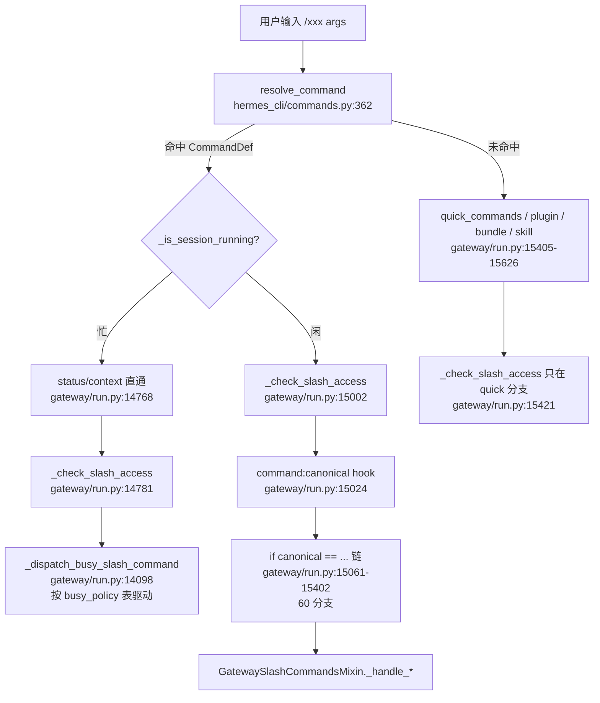

# r7c-raw-slash-c · `gateway/slash_commands.py` 4000–5693 + `gateway/slash_access.py`

> 基线 `863e313`。所有断言溯源格式 `路径:行号 @ 863e313`,行号已逐条用 `sed -n 'Np'` 复核。
> hermes-agent 只读。

---

## 0. 本切片一句话

**这 1694 行是"会话尾部命令簇"(topic/title/resume/sessions/branch/topup/usage/insights/
reload-*/bundles/approve/deny/debug/update)加上一个 229 行的、默认完全关闭的 slash 访问控制模型;
整套命令的元数据其实不在这里,而在 `hermes_cli/commands.py` 的 94 条 `COMMAND_REGISTRY` 里,
`slash_commands.py` 只提供 handler 实体。**

---

## 1. 结构总览

### 1.1 这个文件不是注册表

文件头自述:

`gateway/slash_commands.py:1-13 @ 863e313`
```python
"""Gateway slash-command handlers for GatewayRunner.

Extracted from ``gateway/run.py`` (god-file decomposition Phase 3b). These are
the in-session slash commands (/model, /reset, /usage, /compress, ...) the
gateway dispatches from ``_handle_message``. There are 42 of them (~3,200 LOC);
lifting them into a mixin that ``GatewayRunner`` inherits keeps every
``self._handle_*_command`` dispatch + test reference working via the MRO, while
removing the bulk from run.py.
```

注意两处已经过时的自述(命名/计数漂移,记为 ◇-1):
- 号称 "There are 42 of them" —— 实际本文件里 `def _handle_*` 有 **52 个**
  (`grep -c "    async def _handle_\|    def _handle_"`,其中 51 个以 `_command` 结尾),
  另有 2 个 handler(`_handle_suggestions_command` `gateway/run.py:18617`、
  `_handle_blueprint_command` `gateway/run.py:18647`)根本没搬进来。
- 号称 "~3,200 LOC" —— 实际 5693 行。

整个类只有一个:`GatewaySlashCommandsMixin`(`gateway/slash_commands.py:101`),
被 `GatewayRunner` 继承,靠 MRO 让 `self._handle_x_command` 可见。模块级只有 3 个 helper
(`_clean_str` 59 / `_int_value` 64 / `_model_switch_skew_guard` 72)和 1 个常量
(`_RESET_CLEANUP_TIMEOUT_S = 30.0`,`gateway/slash_commands.py:56`)。

### 1.2 三层调度架构(收口视角)

理解本切片必须先看清:一条 `/xxx` 从平台消息到 handler,要穿过三层。

```
用户输入 "/branch foo"
  │
  ├─(1) 元数据解析 ── hermes_cli/commands.py:COMMAND_REGISTRY (94 条 CommandDef)
  │        resolve_command("branch") → CommandDef(name="branch", aliases=("fork",), busy_policy="reject")
  │        gateway/run.py:14970  _cmd_def = _resolve_cmd(command)
  │        gateway/run.py:14971  canonical = _cmd_def.name       ← 别名在这里被折叠成规范名
  │
  ├─(2) 访问控制 ──── gateway/slash_access.py (policy) + gateway/run.py:18438 (_check_slash_access)
  │        gateway/run.py:15002  冷路径闸门
  │        gateway/run.py:14781  忙路径闸门
  │
  └─(3) 分发 ─────── 忙 → gateway/run.py:14098 _dispatch_busy_slash_command (表驱动)
                     闲 → 一长串 `if canonical == "..."`(60 个分支,gateway/run.py 15061 起)
```

三层各自的"真源"分别是:元数据 `hermes_cli/commands.py`、权限 `gateway/slash_access.py`、
执行体 `gateway/slash_commands.py`。本文件只是第三层。

---

## 2. 逐命令 / 逐机制(4000 行以后)

### 2.0 `_handle_compress_command_inner` 的尾巴(3970–4330)

4000 行落在 `/compress` 的实现体内,先把跨界的部分交代完。

**参数解析**(`gateway/slash_commands.py:4002-4006`):
```python
        _raw_args = (event.get_command_args() or "").strip()
        # Strip --preview/--dry-run/--aggressive before positional parsing
        # so the flags coexist with 'here [N]' / focus-topic forms.
        _raw_args, _preview, _aggressive = extract_compress_flags(_raw_args)
        partial, keep_last, focus_topic = parse_partial_compress_args(_raw_args)
```
先剥旗标再做位置参数解析 —— 这样 `/compress here 3 --preview` 和 `/compress 认证逻辑 --dry-run`
都能解析。语法三态:全量压缩 / `here [N]`(默认 2)边界压缩 / focus 主题。

**`--aggressive` 是声明了但不支持的旗标**(`gateway/slash_commands.py:4008-4015`):
```python
        _agg_note = ""
        if _aggressive:
            # LLM-free hard truncation is not supported on this surface —
            # it would need its own transcript-persistence branch outside
            # the guarded _compress_context rotation machinery (#44794).
            _agg_note = t("gateway.compress.aggressive_unsupported")
            if not _preview:
                return _agg_note
```
`extract_compress_flags` 会识别它,gateway 侧却只回一句"不支持"。这是**跨 surface 的旗标漂移**:
共享解析器支持,gateway 执行体不支持。注册表的 `args_hint` 也没列它
(`hermes_cli/commands.py:131`:`"[here [N] | focus topic | --preview|--dry-run]"`)。

**三分支持久化(本切片最重要的数据安全逻辑)**(`gateway/slash_commands.py:4228-4252`):
```python
                if rotated:
                    if not await self.async_session_store.rewrite_transcript(
                        new_session_id, compressed
                    ):
                        raise RuntimeError(
                            f"failed to persist compressed transcript for "
                            f"session {new_session_id}"
                        )
                    session_entry.session_id = new_session_id
                    await self.async_session_store._save()
                    ...
                elif _in_place:
                    # archive_and_compact() already persisted the compacted
                    # transcript inside _compress_context — nothing to do.
                    pass
                else:
                    logger.warning(
                        "Manual /compress: session rotation did not occur "
                        "(session_id unchanged) and in-place mode is off — "
                        "preserving original transcript instead of overwriting "
                        "it (#44794)."
                    )
```
三态判定见 `gateway/slash_commands.py:4196-4198`:`rotated = new_session_id != session_entry.session_id`,
`_in_place = bool(getattr(tmp_agent, "_last_compaction_in_place", False))`。三个分支对应三个真实故障
(见 §6:#44794 / #61145 / #39704)。**先写盘再改指针**的顺序在 4200-4210 有整段注释论证。

**`finally` 里重复调用 finalize 是安全的**(`gateway/slash_commands.py:4257-4260` 用 `committed=True`,
`4290-4294` 用 `committed=False`)——因为:

`agent/conversation_compression.py:2116-2126 @ 863e313`
```python
def finalize_context_engine_compression_notification(
    agent: Any,
    *,
    committed: bool,
) -> bool:
    """Emit or discard a deferred notification; repeated calls are no-ops."""
    pending = getattr(agent, _PENDING_CONTEXT_ENGINE_NOTIFICATION, None)
    setattr(agent, _PENDING_CONTEXT_ENGINE_NOTIFICATION, None)
    if not committed or not callable(pending):
        return False
    return bool(pending())
```
第一次调用就把 pending 置 None,`finally` 那次只是给"提前 return 的路径"兜底(锁冲突 return、
`nothing_to_do` return)。

**失败路径**:整个 try 包在 `except Exception` 里,统一回 `t("gateway.compress.failed", error=e)`
(`gateway/slash_commands.py:4328-4330`)。注意这里把**原始异常对象**塞进用户可见文案,
没有走 `redact_sensitive_text` —— 而同一函数内 4282-4284 对 `_summary_err` 是强制脱敏的:
```python
                if _summary_err:
                    from agent.redact import redact_sensitive_text
                    _summary_err = redact_sensitive_text(_summary_err, force=True)
```
**脱敏不对称**(记 ◇-2):aux 模型报错脱敏,顶层异常不脱敏。

---

### 2.1 `/topic` — Telegram DM 专属多会话

**定义**:`gateway/slash_commands.py:4332`
**注册**:`hermes_cli/commands.py:109-110`,`gateway_only=True`,`args_hint="[off|help|session-id]"`,
`busy_policy` 默认 `reject`。
**调度**:`gateway/run.py:15077` → `self._handle_topic_command(event)`

**死参数**(◇-3)。签名收 `args`,函数体第 22 行无条件覆盖它:

`gateway/slash_commands.py:4332 @ 863e313`
```python
    async def _handle_topic_command(self, event: MessageEvent, args: str = "") -> str:
```
`gateway/slash_commands.py:4353 @ 863e313`
```python
        args = event.get_command_args().strip()
```
调用点也从不传第二个参数。这个形参是纯死代码。

**平台约束的表达方式** —— 硬编码在 handler 首行,不是注册表元数据:

`gateway/slash_commands.py:4334-4336 @ 863e313`
```python
        source = event.source
        if source.platform != Platform.TELEGRAM or source.chat_type != "dm":
            return t("gateway.topic.not_telegram_dm")
```
注册表只能表达 "gateway_only",**表达不了 "telegram_only" / "dm_only"**。因此 `/topic` 仍会出现在
Discord 的 slash 选择器、Slack 的 `/hermes` 子命令表(其实 `topic` 撞了 Slack 保留词,见 §5.4)、
以及所有平台的 `/help` 输出里,点了才知道不行。这是本仓库表达平台差异的**结构性缺口**。

**授权检查 fail-open**(◇-4):

`gateway/slash_commands.py:4341-4351 @ 863e313`
```python
        # Authorization: /topic activates multi-session mode and mutates
        # SQLite side tables. Unauthorized senders (not in allowlist) must
        # not be able to do that. Gateway routes already authorize the
        # message before reaching here, but defense in depth.
        auth_fn = getattr(self, "_is_user_authorized", None)
        if callable(auth_fn):
            try:
                if not auth_fn(source):
                    return t("gateway.topic.unauthorized")
            except Exception:
                logger.debug("Topic auth check failed", exc_info=True)
```
注释自称 "defense in depth",但 `except Exception` 只 debug 一行就**继续往下执行**。授权检查抛异常
= 放行。`_is_user_authorized`(`gateway/authz_mixin.py:386`)自身的语义是 "5. Default: deny",
这里的 wrapper 把 deny-by-default 变成了 pass-on-error。

**子命令语法**(`gateway/slash_commands.py:4356-4366`):
| 输入 | 行为 |
|---|---|
| `/topic help` / `?` / `-h` / `--help` | `self._telegram_topic_help_text()`(`gateway/run.py:20193`) |
| `/topic off` / `disable` / `stop` | `_disable_telegram_topic_mode_for_chat`(`gateway/run.py:20215`) |
| `/topic <任意其它文本>` | 必须在 thread 里,否则回 `restore_needs_topic`;然后 `_restore_telegram_topic_session`(`gateway/run.py:20298`) |
| `/topic`(空) | 探测能力 → 开启 topic 模式 → 回状态 |

**能力探测 + 截图去抖**(`gateway/slash_commands.py:4368-4379`):Telegram 群/DM 要先在 BotFather
打开 Topics。代码探测 `has_topics_enabled` / `allows_users_to_create_topics`,任一为 False 就发一张
BotFather 设置截图,但用 `_should_send_telegram_capability_hint`(`gateway/run.py:20174`)去抖 ——
"don't re-send on every /topic while threads are still disabled"(4371-4372 注释)。

**副作用**:`enable_telegram_topic_mode` 写 SQLite 侧表(4382-4387);无 thread_id 时
`_ensure_telegram_system_topic` 建系统 topic(4392-4393)。

---

### 2.2 `/title` — 设置/查看会话标题

**定义**:`gateway/slash_commands.py:4421`;注册 `hermes_cli/commands.py:124-125`(`args_hint="[name]"`,
两端可用,busy=reject)。

**语法**:`/title` 读、`/title <文本>` 写。

**惰性建行 + IDOR 前置埋点**(`gateway/slash_commands.py:4433-4449`):
```python
        existing_title = await self._session_db.get_session_title(session_id)
        if existing_title is None:
            # Session doesn't exist in DB yet — create it
            try:
                await self._session_db.create_session(
                    session_id=session_id,
                    source=source.platform.value if source.platform else "unknown",
                    user_id=source.user_id,
                    # Persist the messaging origin so a later /resume of this
                    # titled-but-now-inactive session can prove it belongs to the
                    # caller's chat/thread (IDOR scoping).
                    chat_id=source.chat_id,
                    chat_type=source.chat_type,
                    thread_id=source.thread_id,
                )
            except Exception:
                pass  # Session might already exist, ignore errors
```
关键设计:`/title` 是很多会话第一次落 SQLite 的时机,所以它**必须**把 chat_id/chat_type/thread_id
一起写下来,否则后来的 `/resume` 无法证明归属(见 §2.3 的 `_resume_target_allowed`)。
注意 `get_session_title` 返回 `None` 被当成"行不存在";若行存在但 title 为 NULL,也会走进
`create_session` 然后被 `except: pass` 吞掉 —— 靠 DB 唯一约束兜底。

**失败路径**:`SessionDB.sanitize_title` 抛 `ValueError` → `t("gateway.shared.warn_passthrough")`
(4457-4458);清洗后为空 → `title.empty_after_clean`(4459-4460);`set_session_title` 返回 False
→ `title.not_found`(4482)。

**副作用**:成功后 `_schedule_telegram_topic_title_rename`(`gateway/run.py:20135`)在
`asyncio.to_thread` 里改 Telegram forum topic 的可见名(4469-4479),失败只 debug。

---

### 2.3 `/resume` — 恢复历史会话(本切片最复杂的授权逻辑)

**定义**:`gateway/slash_commands.py:4493`;注册 `hermes_cli/commands.py:186-187`。

**参数解析**(`gateway/slash_commands.py:4503-4520`):
```python
        raw_args = event.get_command_args().strip()
        try:
            parts = shlex.split(raw_args)
        except ValueError as exc:
            return t("gateway.resume.parse_error", error=exc)
        allow_all = "--all" in parts
        allow_cross_room = "--cross-room" in parts
        name = " ".join(p for p in parts if p not in {"--all", "--cross-room"}).strip()

        # Strip common outer brackets/quotes users may type literally from the
        # usage hint (e.g. ``/resume <abc123>``). Mirrors the CLI behavior.
        if len(name) >= 2 and (
            (name[0] == "<" and name[-1] == ">")
            ...
```
`shlex.split` 意味着引号有语义(`/resume "my session"`),不平衡引号 → 明确报错而不是崩。
外层括号剥离是因为帮助文案写的是 `/resume <name>`,用户会连尖括号一起打进来。

**目标解析三路**(4560-4584):数字 → 列表下标;直接 session_id(`get_session(name)`);
标题(`resolve_session_by_title`)。然后跟压缩续体链:

`gateway/slash_commands.py:4587-4590 @ 863e313`
```python
        # Compression creates child continuations that hold the live transcript.
        # Follow that chain so gateway /resume matches CLI behavior (#15000).
        try:
            target_id = await self._session_db.resolve_resume_session_id(target_id)
```

**双套授权模型**(这是设计上很值得学的一点):

| 平台 | 判据 | 覆盖旗标 | 代码 |
|---|---|---|---|
| Matrix | 同 room(`_same_matrix_room`) | `--cross-room` | 4594-4603 |
| 其它全部 | 同 owner(`_resume_target_allowed`) | `--all` 或 `--cross-room` | 4604-4611 |

`gateway/slash_commands.py:4604-4611 @ 863e313`
```python
        elif not await self._resume_target_allowed(
            source, target_id, allow_override=(allow_all or allow_cross_room)
        ):
            # IDOR guard: a session id/title is a routing handle, not authority.
            # Bind /resume to the caller's own platform/user/chat on every
            # non-Matrix adapter so one user can't attach to another's
            # persisted transcript.
            return t("gateway.resume.blocked_not_owner", name=name)
```
核心原则一句话:**session id 是路由句柄,不是权限凭证**。

**`--all` 的门在 admin 判定上刻意比 slash 门更严**:

`gateway/slash_commands.py:1011-1028 @ 863e313`
```python
    def _resume_caller_is_admin(self, source: SessionSource) -> bool:
        """Whether *source* is an EXPLICITLY-configured admin allowed to make a
        cross-origin /resume or /sessions listing.

        Deliberately stricter than ``SlashAccessPolicy.is_admin()``: that returns
        True for every allowed caller when slash gating is DISABLED (so commands
        stay runnable by default), but cross-ORIGIN DATA ACCESS must require a
        real, configured admin. Otherwise the default (no admin list) config
        would treat every gateway caller as cross-origin-capable and re-open the
        enumeration IDOR.
        """
        try:
            from gateway.slash_access import policy_for_source
            policy = policy_for_source(self.config, source)
            uid = getattr(source, "user_id", None)
            return bool(policy.enabled and uid and policy.is_admin(uid))
        except Exception:
            return False
```
`policy.enabled and ... is_admin(uid)` —— 多了 `policy.enabled` 这一项。这是 §3 里
"gating 关闭 = 人人是 admin" 那个便利语义的**必要补丁**:命令可执行性可以 fail-open,
跨源数据访问必须 fail-closed。`except: return False` 也是 fail-closed。

**会话切换的副作用序列**(4618-4638):`_release_running_agent_state` → `switch_session` →
`_clear_conversation_scope(reason="resume")` → `_evict_cached_agent`。第三步的注释列了它清掉的
全部状态(model/reasoning override #10702、one-turn restore、model notes、last-resolved cache #58403、
/queue overflow),第四步引 #6672。

---

### 2.4 `/sessions` — 列表 / 搜索 / 转发给 /resume

**定义**:`gateway/slash_commands.py:4661`;注册 `hermes_cli/commands.py:190`(无 args_hint!)。

**它其实是 `/resume` 的前端**(4684-4686):
```python
        if target:
            resume_event = dataclasses.replace(event, text=f"/resume {target}")
            return await self._handle_resume_command(resume_event)
```
用 `dataclasses.replace` 伪造一个 `/resume` 事件重新分发 —— 不复制授权逻辑,直接复用。
这是个干净的模式:**命令间复用靠重写 event 而不是抽公共函数**,顺带保证两条路径的授权一致。

**枚举 IDOR 的另一半**(4693-4698):
```python
        # A cross-origin listing (`/sessions all`) is honored only for an
        # admin, mirroring the `/resume --all` override. `all` is just a parsed
        # user argument, so without this gate any caller could run
        # `/sessions all` and enumerate other origins' session ids / titles /
        # previews / sources — the enumeration half of the /resume IDOR.
        cross_origin = include_all and self._resume_caller_is_admin(source)
```

**搜索时超取再裁剪**(4709-4711):
```python
            # Search filters at SQL level, so over-fetch before the visibility
            # cut: origin-invisible matches would otherwise consume the page.
            limit=50 if search_query else 10,
```
先取 50,`_resume_row_visible` 逐行过滤后再 `rows = rows[:10]`(4721)。否则 SQL 层的 10 条
可能全被可见性过滤掉,用户看到空列表却以为没匹配。

**硬编码英文**(◇-5):这个 handler 的三处用户可见文案完全绕过 `t()`:
`gateway/slash_commands.py:4682`
```python
            return "Usage: `/sessions search <query>`"
```
`gateway/slash_commands.py:4723-4725`
```python
            title = f"Sessions matching “{search_query}”"
        else:
            title = "Sessions" if include_unnamed else "Named Sessions"
```
同文件其它 handler 几乎全部走 `t("gateway.xxx")`。i18n 覆盖有洞。

---

### 2.5 `/branch` — 分叉会话

**定义**:`gateway/slash_commands.py:4732`;注册 `hermes_cli/commands.py:128-129`
(别名 `fork`,`args_hint="[name]"`)。文档串说灵感来自 Claude Code 的 `/branch`
(`gateway/slash_commands.py:4737`)。

**新 id 格式**(4757-4761):
```python
        now = _dt.now()
        timestamp_str = now.strftime("%Y%m%d_%H%M%S")
        short_uuid = _uuid.uuid4().hex[:6]
        new_session_id = f"{timestamp_str}_{short_uuid}"
```
本地时间(非 UTC)+ 6 hex。

**`_branched_from` 标记的存在理由**(4773-4785):
```python
        # Persist a stable ``_branched_from`` marker in model_config so
        # list_sessions_rich() keeps the branch visible in /resume and
        # /sessions even after the parent is reopened and re-ended with a
        # different end_reason (e.g. tui_shutdown overwriting 'branched').
```
即:不能依赖 `end_reason` 这种会被后续动作覆盖的字段做可见性判定,要一个不可变标记。

**历史拷贝逐字段列举 + api_content 侧车**(4796-4820)。侧车的理由值得记:
```python
                        # Keep the api_content sidecar so the branch's first turn
                        # replays the parent's exact wire bytes (warm provider
                        # prompt cache) instead of a full cold prefill.
                        "api_content": extract_api_content_sidecar(msg),
```
分叉不但要复制语义历史,还要复制**原始 wire 字节**,否则 provider 的 prompt cache 前缀对不上,
第一轮全价重读。

**best-effort 拷贝 = 可能静默产生残缺分支**(◇-6):
`gateway/slash_commands.py:4821-4822 @ 863e313`
```python
        except Exception:
            pass  # Best-effort copy
```
`append_messages_batch` 整批失败(chunk_rows=500)只吞掉,后面照样 `switch_session` 并回
"branched N messages" —— 用户会拿到一个空/半空的分支却被告知成功。注释承认这是刻意的
("Best-effort like the old loop — a failed copy still yields a usable (partial) branch",4793-4794),
但**回执文案的 count 来自原历史**(4839 `msg_count = len([m for m in history if ...])`),不是实际写入数,
所以是会撒谎的成功回执。对比 `/compress` 在 4232 明确 `raise RuntimeError` —— 同一文件里两种截然不同的取舍。

**边界安全状态**:`_clear_session_boundary_security_state`(4834)而不是 `/resume` 用的
`_clear_conversation_scope`。两者清理范围不同(◇-7,命名/覆盖面不一致,`/branch` 清得更少)。

---

### 2.6 `/topup` — Nous 余额 + 门户跳转

**定义**:`gateway/slash_commands.py:4843`;注册 `hermes_cli/commands.py:319`(Info,无 args)。

设计意图整段写在 docstring 里(4844-4851):**这个命令绝不在聊天里扣款/确认/追踪支付**,
只渲染余额 + 一个可点 URL,一切在浏览器完成。

`gateway/slash_commands.py:4855-4861 @ 863e313`
```python
        try:
            view = await asyncio.to_thread(build_credits_view, markdown=True)
        except Exception:
            view = None

        if view is None or not view.logged_in:
            return t("gateway.credits.not_logged_in")
```
唯一失败路径:抓取异常或未登录都折叠成同一句 "not_logged_in"(fail-open 到一句提示)。

输出 4863-4874 **全部硬编码英文**(◇-5 的第二处):
```python
        lines: list[str] = ["💳 **Nous balance**"]
        ...
            lines.append(f"Manage billing on the portal: {view.topup_url}")
            lines.append("Top up and manage billing in the browser — your balance updates here after.")
```
且 4865-4866 过滤掉 helper 自带的 `📈` 表头改用自己的 —— 与 CLI 侧渲染有轻微不一致。

---

### 2.7 `/usage` — token 用量 + 账户额度 + Codex reset 兑换

**定义**:`gateway/slash_commands.py:4955`;注册 `hermes_cli/commands.py:315-316`
(`args_hint="[reset [--force]]"`)。

**参数解析是白名单式的**(4969-4973):
```python
        raw_args = event.get_command_args().strip()
        args = [a.lower() for a in raw_args.split()] if raw_args else []
        wants_reset = bool(args) and args[0] == "reset"
        if args and not wants_reset:
            return t("gateway.usage.unknown_subcommand", args=raw_args)
```
除了 `reset`,任何参数都报错,不静默忽略。这一点和 `/insights`(§2.8)恰好相反。

**agent 三级回退**(4976-5000):`_running_agents`(turn 中) → `_agent_cache`(turn 间,
带 `_agent_cache_lock`) → SessionDB 上持久化的 `billing_provider`/`billing_base_url`。
第三级让"没有常驻 agent 时 /usage 仍能查账户额度"成立。

**`/usage reset` 的 provider 硬约束**(5002-5015):
```python
        if wants_reset:
            normalized_provider = str(provider or "").strip().lower()
            if normalized_provider != "openai-codex":
                return t("gateway.usage.reset_wrong_provider")
            force = "--force" in args[1:]
            from agent.account_usage import redeem_codex_reset_credit

            result = await asyncio.to_thread(
                redeem_codex_reset_credit,
                base_url=base_url,
                api_key=api_key,
                force=force,
            )
            return result.message
```
**这是一条 provider-专属的子命令**,却在注册表里毫无标记 —— `args_hint` 里写了 `reset`,
所有 provider 的用户都会在 `/help` 里看到它。和 `/topic` 的平台约束是同一类缺口。

**Nous credits 的门是"有没有 Nous 账号",不是"用哪个 provider"**(5034-5047):
```python
        # Shared with the CLI / TUI /usage block via nous_credits_lines(): a single
        # auth-gate + portal-fetch + render path (which also honors the dev fixture).
        # Run off the event loop. The helper gates on "a Nous account is logged in"
        # — NOT the inference provider and NOT nested under `if provider:` — so a
        # Nous-credentialled user running inference elsewhere (or with none resident)
        # still sees their balance. NO recovery trigger: messaging binds no notice
        # consumer, so /usage only displays. Fail-open: never break /usage.
        try:
            from agent.account_usage import nous_credits_lines

            credits_lines = await asyncio.to_thread(nous_credits_lines, markdown=True)
        except Exception:
            credits_lines = []  # fail-open: never break /usage
```

**三段输出形态**(有 agent 且 api_calls>0 → 完整;无 agent 但有历史 → 粗估;都没有 →
只有 account/credits 或 `no_data`),分别在 5049 / 5100 / 5119 / 5127。

**两个 breakdown 渲染器**(4877 `_context_breakdown_block` 给 `/context`,
4914 `_context_breakdown_lines` 给 `/usage`)—— 同一引擎、两套渲染、都 `except: return []` 永不抛。
4942-4946 有个巧妙的 i18n 回退:
```python
                label = t(f"gateway.usage.breakdown_cat_{cat_id}")
                # Missing key → t() echoes the key back; fall back to the
                # English label the engine already provides.
                if label.endswith(f"breakdown_cat_{cat_id}"):
                    label = str(cat.get("label") or cat_id)
```
用"`t()` 找不到 key 时回显 key"这个副作用做缺 key 探测。

---

### 2.8 `/insights` — 用量分析

**定义**:`gateway/slash_commands.py:5129`;注册 `hermes_cli/commands.py:320-321`(`args_hint="[days]"`)。

**Unicode 破折号归一化**(5133-5134):
```python
        # Normalize Unicode dashes (Telegram/iOS auto-converts -- to em/en dash)
        args = re.sub(r'[‒–—―](days|source)', r'--\1', args)
```
真实痛点:iOS/Telegram 输入法把 `--days` 自动改成 `—days`。**这个修复只在 `/insights` 里做了**,
其它接受 `--flag` 的命令(`/resume --all`、`/usage reset --force`、`/compress --preview`、
`/model --global`)都没有。记 ◇-8:局部修复,未提升为公共 helper。

**解析极其宽松**(5140-5157):while 循环,`--days N` / `--source X` / 裸数字,
**任何无法识别的 token 直接 `i += 1` 跳过**。与 `/usage` 的白名单式解析是相反取舍。
`days` 无范围校验(可以传 `-5` 或 `999999`)。

**副作用**:5165-5171 在线程池里**自己 new 一个 `SessionDB()`** 而不是复用 `self._session_db`,
用完 `db.close()`。避开跨线程共享 SQLite 连接。

---

### 2.9 `/reload-mcp` — 带确认的 MCP 重连

**定义**:`gateway/slash_commands.py:5178`,返回 `Optional[str]`;
注册 `hermes_cli/commands.py:297-298`(别名 `reload_mcp`)。

**为什么要确认**(5180-5192 docstring):重载 MCP 会重建 system prompt 里的 tool schema
→ 作废 provider 的 prompt cache → 下一条消息全价重读全上下文。所以这是个**花钱的操作**,
必须让用户知情。

**开关每次现读盘**(5197-5203):
```python
        # Read the gate fresh from disk so a prior "always" click takes
        # effect on the next invocation without restarting the gateway.
        user_config = self._read_user_config()
        approvals = user_config.get("approvals") if isinstance(user_config, dict) else None
        confirm_required = True
        if isinstance(approvals, dict):
            confirm_required = bool(approvals.get("mcp_reload_confirm", True))
```
默认 `True` = **默认最保守**(要确认)。

**三选一 confirm 原语**(5212-5239):`_on_confirm(choice)` 闭包处理 `cancel`/`always`/`once`;
`always` 时 `save_config_value("approvals.mcp_reload_confirm", False)` 持久化。
底座是 `_request_slash_confirm`(`gateway/run.py:20595`),它先 `register` 再发按钮:

`gateway/run.py:20631-20633 @ 863e313`
```python
        # Register the pending confirm FIRST so a super-fast button click
        # cannot race the send_slash_confirm return.
        _slash_confirm_mod.register(session_key, confirm_id, command, handler)
```
返回值语义:按钮渲染成功 → 返回 `None`(按钮自解释);降级为文本 → 返回提示文本本身
(`gateway/run.py:20613-20618` docstring)。这解释了 `_handle_reload_mcp_command` 为什么是
`Optional[str]`。

---

### 2.10 `/reload-skills` — 重扫技能目录

**定义**:`gateway/slash_commands.py:5241`;注册 `hermes_cli/commands.py:299-300`(别名 `reload_skills`)。

**与 `/reload-mcp` 的关键对照**(5244-5247 docstring):
```
        Skills don't need to be in the system prompt for the model to use
        them (they're invoked via ``/skill-name``, ``skills_list``, or
        ``skill_view`` at runtime), so this does NOT clear the prompt cache
        — prefix caching stays intact.
```
所以它不需要确认、不 evict cached agent。**同一对"重载"命令,因为缓存影响不同而设计成两种形态**——
这是本切片最好的一个设计对照。

**平台侧刷新是能力探测式的**(5265-5285):
```python
            for adapter in list(self.adapters.values()):
                refresh = getattr(adapter, "refresh_skill_group", None)
                if not callable(refresh):
                    continue
```
注释点名今天只有 Discord 的 `/skill` autocomplete 实现了它;Telegram BotCommand 菜单、
Slack 子命令表"silently skipped"。**又一处平台差异靠 duck typing 表达而非声明**。

**一次性 note 挂到下一轮用户消息**(5310-5333):
```python
            sections = ["[USER INITIATED SKILLS RELOAD:"]
            ...
            session_key = self._session_key_for_source(event.source)
            if not hasattr(self, "_pending_skills_reload_notes"):
                self._pending_skills_reload_notes = {}
            if session_key:
                self._pending_skills_reload_notes[session_key] = note
```
docstring(5249-5254)说消费点在 `_run_agent_turn` "~L11025"。**这个行号引用是软引用,会漂移**
—— 值得记一笔(◇-9):代码注释里写绝对行号,重构后必然失准。设计上是"不写 transcript、
只 prepend 到下一条 user message",从而不破坏 role 交替。

**格式对齐**:note 里用 `    - name: description`,与 system prompt 渲染既有技能的格式一致
(5311-5313 注释),让模型读到的是同一种形状的 diff。

---

### 2.11 `/bundles` — 列出技能包

**定义**:`gateway/slash_commands.py:5341`;注册 `hermes_cli/commands.py:265-266`,
`execute="bundles"`(走注册表自有执行器)。

有意思的是:虽然 CommandDef 声明了 `execute="bundles"`,gateway 这里**没有用 `run_execute`**,
而是自己调 `execute_command("bundles", ...)` 拿 `reply.data` 再重新渲染 markdown:

`gateway/slash_commands.py:5348-5353 @ 863e313`
```python
        from hermes_cli.slash_exec import CommandContext, execute_command

        reply = execute_command("bundles", CommandContext(surface="gateway"))
        if "error" in reply.data:
            logger.warning("Bundles command unavailable: %s", reply.data["error"])
            return reply.text
```
即 `execute` 字段在这里只作数据源,不作文本源。对比 `/version`(1636-1638)和 `/help`(1645)
是直接用 `reply.text`。**三种用法共存**(纯文本 / 文本+telegramize / 只取 data 自渲染)。

输出全硬编码英文(5357-5374),◇-5 第三处。

---

### 2.12 `/approve` / `/deny` — 危险命令审批

**定义**:`gateway/slash_commands.py:5377`(Optional[str])/ `5435`;
注册 `hermes_cli/commands.py:142-145`,两者 `gateway_only=True`、`busy_policy="dispatch"`
(必须能在 agent 跑着的时候用 —— agent 正阻塞等它)。

**`/approve` 语法矩阵**(docstring 5389-5395):
```
            /approve              — approve oldest pending command once
            /approve all          — approve ALL pending commands at once
            /approve session      — approve oldest + remember for session
            /approve all session  — approve all + remember for session
            /approve always       — approve oldest + remember permanently
            /approve all always   — approve all + remember permanently
```
解析(5411-5420)是**集合式的**,token 顺序无关:
```python
        args = event.get_command_args().strip().lower().split()
        resolve_all = "all" in args
        remaining = [a for a in args if a != "all"]

        if any(a in {"always", "permanent", "permanently"} for a in remaining):
            choice = "always"
        elif any(a in {"session", "ses"} for a in remaining):
            choice = "session"
        else:
            choice = "once"
```
默认落到 `once` = **最保守**。无法识别的词也落 `once`(不报错)。

**陈旧审批的清理**(5404-5408 / 5453-5457):
```python
        if not has_blocking_approval(session_key):
            if session_key in self._pending_approvals:
                self._pending_approvals.pop(session_key)
                return t("gateway.approval_expired")
            return t("gateway.approve.no_pending")
```
区分"有记录但线程已不阻塞"(expired)和"完全没有"(no_pending)。

**`/deny` 多一个 reason**(5459-5476),来源是外部仓库移植:
`gateway/slash_commands.py:5442-5443`
```
        ``/deny <reason>`` (or ``/deny all <reason>``) attaches a one-line
        reason that is relayed back to the agent so it can adapt instead of
        only hearing "denied". Ported from qwibitai/nanoclaw#2832.
```
reason 截断到 280 字符(5470-5471)。注意 `resolve_all` 判定用 `tokens[0].lower() == "all"`
—— 只认**首 token**,与 `/approve` 的"任意位置含 all"不一致(◇-10,同一对命令的解析语义不对称:
`/deny yesterday all failed` 里的 `all` 不会触发全量,而 `/approve` 里会)。

**共同副作用**:5427-5429 / 5481-5483 恢复 typing 指示器 —— agent 即将继续跑。

---

### 2.13 `/debug` — 上传调试报告

**定义**:`gateway/slash_commands.py:5497`;注册 `hermes_cli/commands.py:336-337`
(`args_hint="[nous|local]"`)。

**隐私边界**(5498-5502 docstring):
```
        Gateway uploads ONLY the summary report (system info + log tails),
        NOT full log files, to protect conversation privacy.  Users who need
        full log uploads should use ``hermes debug share`` from the CLI.
```

**参数完全被忽略**(◇-11,注册表-handler 漂移):handler 5497-5539 **一次都没调
`event.get_command_args()`**,恒定走 `upload_to_pastebin`。但注册表的 `args_hint="[nous|local]"`
会经 `gateway_help_lines()` 原样打进 messaging `/help`:

`hermes_cli/commands.py:556 @ 863e313`
```python
        args = f" {cmd.args_hint}" if cmd.args_hint else ""
```
所以聊天里 `/help` 会显示 "`/debug [nous|local]` -- Upload debug report...",而 `/debug local`
在 gateway 上**照样上传到公网 pastebin**。CLI 侧才真有这两档:
`hermes_cli/cli_commands_mixin.py:3416-3417 @ 863e313`
```
        - ``/debug nous``   → upload to Nous-internal storage (private, staff-only)
        - ``/debug local``  → render the report to stdout, no upload
```
这是本切片**风险最高的一处漂移**:用户按帮助文本预期"不上传",实际上传。

**副作用**:`_schedule_auto_delete` 6 小时后删 paste(5525-5526);
`_best_effort_sweep_expired_pastes()` 顺手清理过期(5515)。

---

### 2.14 `/update` — 自更新

**定义**:`gateway/slash_commands.py:5541`;注册 `hermes_cli/commands.py:332-333`
(`busy_policy="dispatch"` —— agent 跑着也能更新)。

**平台闸门(本切片唯一的"平台白名单"式表达)**:

`gateway/slash_commands.py:5556-5567 @ 863e313`
```python
        # Block non-messaging platforms (API server, webhooks, ACP)
        platform = event.source.platform
        _allowed = self._UPDATE_ALLOWED_PLATFORMS
        # Plugin platforms with allow_update_command=True are also allowed
        if platform not in _allowed:
            try:
                from gateway.platform_registry import platform_registry
                entry = platform_registry.get(platform.value)
                if not entry or not entry.allow_update_command:
                    return t("gateway.update.platform_not_messaging")
            except Exception:
                return t("gateway.update.platform_not_messaging")
```
白名单本体 `gateway/run.py:20784-20789`(注释 20775-20783)(15 个内置平台);插件平台走 `PlatformEntry` 标志位。

**默认最宽松**(◇-12):
`gateway/platform_registry.py:104-106 @ 863e313`
```python
    # Whether this platform should appear in _UPDATE_ALLOWED_PLATFORMS
    # (allows /update command from this platform).
    allow_update_command: bool = True
```
默认 `True`。全仓 27 处显式 `allow_update_command=True`,**只有 1 处显式 False**
(`plugins/platforms/a2a/__init__.py:124`)。也就是说:任何新写的平台插件,只要没主动关,
就自动获得"从聊天里触发 detached `hermes update`(会重启 gateway)"的能力。
唯一兜底是 `entry is None`(内置的 API_SERVER / WEBHOOK 不自注册 `PlatformEntry`,因而被挡)。
这与 §3 里 slash gating 的 fail-open 默认是同一种设计口味,但风险等级高得多。

**托管环境拒绝**(5569-5570):`is_managed()` → `format_managed_message`。
**必须是 git 仓库**(5575-5576)。

**跨进程 IPC 靠文件 + 原子替换**(5582-5601):
```python
        pending_path = _hermes_home / ".update_pending.json"
        output_path = _hermes_home / ".update_output.txt"
        exit_code_path = _hermes_home / ".update_exit_code"
        ...
        _tmp_pending = pending_path.with_suffix(".tmp")
        _tmp_pending.write_text(json.dumps(pending), encoding="utf-8")
        _tmp_pending.replace(pending_path)
        exit_code_path.unlink(missing_ok=True)
```
设计要点:`hermes update` 可能把 gateway 自己重启掉,所以"谁发起的、回哪个 chat"必须落盘,
让**下一个 gateway 进程**也能通知到人。

**双平台 spawn**:
- Windows(5628-5658):没有 setsid,内联一段 `textwrap.dedent` 的 Python helper 脚本,
  由它 `Popen` 真命令、`proc.wait(timeout=3600)`、再写 exit code。
- POSIX(5659-5686):`setsid bash -c "... > out 2>&1; rc=$?; printf '%s' \"$rc\" > code"`,
  `shutil.which("setsid")` 找不到就退化到 `start_new_session=True`。

`gateway/slash_commands.py:5664-5667 @ 863e313`
```python
                    # Avoid `status=$?`: `status` is a read-only special parameter
                    # in zsh, and this command string is copied/reused in macOS/zsh
                    # operator wrappers. Keep the template zsh-safe even though this
                    # specific subprocess currently runs under bash.
```
—— 一个很典型的"为将来的复制粘贴留后路"的防御。

**注释块逐字重复**(◇-13):`gateway/slash_commands.py:5603-5610` 与 `5611-5618` 是**完全相同**
的 8 行注释(已用 sed 逐行核对,5603 与 5611 均为
`# Spawn \`hermes update --gateway\` detached so it survives gateway restart.`)。合并遗留。

**失败回滚**(5687-5690):spawn 抛异常就删掉两个 marker 文件,避免下次启动误报"有更新在跑"。

---

## 3. `slash_access.py` 访问控制模型(全文精读)

### 3.1 一句话模型

**它不是 RBAC,是"两条名单 × 两个 scope",而且默认整个关闭。**

### 3.2 定位:第二根轴

`gateway/slash_access.py:1-14 @ 863e313`
```python
"""Per-platform slash command access control.

This module sits beside the existing per-platform allowlist (``allow_from``)
and adds a second axis: of the users who are *allowed to talk to the
gateway*, which ones can run *which slash commands*.

Two lists per platform scope (DM vs group, mirroring ``allow_from`` vs
``group_allow_from``):

  - ``allow_admin_from``      — user IDs that get every registered slash
                                command (built-in + plugin-registered).
  - ``user_allowed_commands`` — slash command names non-admin users may
                                run. Empty / unset → non-admins get no
                                slash commands.
```

第一根轴("能不能跟 gateway 说话")在 `gateway/authz_mixin.py`,第二根轴("能跑哪些命令")在这里。
两者**完全解耦、串联生效**:先过 `_is_user_authorized`,再过 `policy.can_run`。

### 3.3 角色/层级定义:只有 3 档,而且第 3 档是"关掉"

```python
@dataclass(frozen=True)
class SlashAccessPolicy:
    enabled: bool                      # gating active for this scope?
    admin_user_ids: FrozenSet[str]
    user_allowed_commands: FrozenSet[str]
```
(`gateway/slash_access.py:56-67`)

| 档 | 判据 | 能跑什么 |
|---|---|---|
| unrestricted | `enabled=False` | 全部(等同 admin) |
| admin | `user_id ∈ admin_user_ids` | 全部 |
| user | 其余 | floor ∪ `user_allowed_commands` |

`enabled` 不是配置项,是**推导出来的**:

`gateway/slash_access.py:188 @ 863e313`
```python
    enabled = bool(admin_ids)
```
"列了至少一个 admin" ⇔ "开启 gating"。没有独立开关。副作用:**删光 admin 名单 = 悄悄放开全部权限**,
不会报错也不会警告。

### 3.4 默认值:最宽松(向后兼容优先)

三处 fail-open,方向一致:

1. `enabled=False` 时 `is_admin` 恒 True:
`gateway/slash_access.py:69-77 @ 863e313`
```python
    def is_admin(self, user_id: Optional[str]) -> bool:
        if not self.enabled:
            # Gating disabled → treat every allowed user as admin so
            # downstream code can keep using ``is_admin`` / ``can_run``
            # uniformly.
            return True
        if not user_id:
            return False
        return str(user_id) in self.admin_user_ids
```
2. `enabled=False` 时 `can_run` 恒 True(`gateway/slash_access.py:79-81`)。
3. `policy_for_source` 在 config/source 为 None、平台无配置、`platforms.get` 抛异常时,
   一律返回 disabled policy(`gateway/slash_access.py:207-222`,注意 217-219 的
   `except Exception: platform_config = None`)。

模块 docstring 明写这是**刻意的向后兼容**:

`gateway/slash_access.py:16-21 @ 863e313`
```python
Backward compatibility:

  If ``allow_admin_from`` is not set for a scope, slash command gating
  is disabled entirely for that scope. Every allowed user can run every
  slash command, exactly like before. This means existing installs are
  unaffected until an operator opts in by listing at least one admin.
```

**但这个便利语义会污染下游**,所以 `_resume_caller_is_admin`(§2.3)必须额外加
`policy.enabled and` 才安全。这是一个值得学的教训:**"关闭即全通过"的策略对象,
一旦被用于数据可见性判定就会开洞;要么分成两个方法,要么每个调用点都记得补 `enabled`。**
本仓库选了后者,只补了 `_resume_caller_is_admin` 和 `_handle_approvals_command` 两处。

### 3.5 always-allowed floor:只有 2 条,而且只能加不能减

`gateway/slash_access.py:41-53 @ 863e313`
```python
# Slash commands that MUST stay reachable for any allowed user, even when
# slash gating is enabled and the user has no commands listed. Without this
# carve-out, a non-admin user has no way to discover what they can or
# can't do (``/help``, ``/whoami``) and no way to see what state the agent
# is in (``/status``). These mirror the smallest set of read-only commands
# we'd hand to a guest. Operators can still narrow this further by writing
# their own ``user_allowed_commands`` (this set is only the implicit
# fallback floor — anything in ``user_allowed_commands`` overrides it
# additively, never restrictively).
_ALWAYS_ALLOWED_FOR_USERS: FrozenSet[str] = frozenset({
    "help",
    "whoami",
})
```
**注释与代码冲突(▲-A,同文件内部)**:注释三次提到 `/status`("no way to see what state the agent
is in (``/status``)"),集合里**只有 help 和 whoami**。而且注释末句 "Operators can still narrow this
further by writing their own ``user_allowed_commands``" 与紧接着的 "overrides it additively,
never restrictively" 自相矛盾 —— 代码 `gateway/slash_access.py:86-88` 是纯加法:
```python
        if canonical_cmd in _ALWAYS_ALLOWED_FOR_USERS:
            return True
        return canonical_cmd in self.user_allowed_commands
```
operator **无法**收窄 floor。注释前半句是错的。

`/status` 的"总是可见"其实是在别处、以另一种方式实现的 —— 见 §3.8。

### 3.6 scope 划分与跨 scope 回退

```python
_DM_CHAT_TYPES = frozenset({"dm", "direct", "private", ""})
```
(`gateway/slash_access.py:91`)—— 注意**空串算 DM**。`_scope_for_chat_type`(140-143)
非 DM 一律归 `group`(含 channel / thread)。

key 映射(`gateway/slash_access.py:163-167`):

| scope | admin key | commands key |
|---|---|---|
| dm | `allow_admin_from` | `user_allowed_commands` |
| group | `group_allow_admin_from` | `group_user_allowed_commands` |

**不对称回退**(`gateway/slash_access.py:173-196`):
```python
    DM scope falls back to group scope keys ONLY for ``user_allowed_commands``
    when the DM scope didn't specify its own. This keeps the common case
    (operator wants the same command set DM and group) ergonomic without
    forcing duplication. Admin lists are NOT cross-scope: an admin in
    DMs is not implicitly an admin in a group.
    """
    admin_key, cmd_key = _keys_for_scope(scope)
    admin_ids = _coerce_id_list(extra.get(admin_key))
    cmds = _coerce_command_list(extra.get(cmd_key))

    if scope == "dm" and not cmds:
        # DM didn't specify — let group's user_allowed_commands fall through
        cmds = _coerce_command_list(extra.get("group_user_allowed_commands"))
```
命令名单单向回退(group→dm),admin 名单绝不回退。这个不对称是**刻意的**:名单越权是安全问题,
命令集重复是人体工学问题。

### 3.7 输入归一化(YAML 容错)

`_coerce_id_list`(94-114):接受 None / list / tuple / set / 逗号串 / 单个标量,
一律 `str().strip()`。这样 YAML 里写整数 user id(Telegram 常见)也能匹配。
`_coerce_command_list`(117-137):额外 `.lstrip("/").lower()`,所以 `["/Status", "MODEL"]`
和 `["status", "model"]` 等价 —— 有测试固化:

`tests/gateway/test_slash_access.py:44-52 @ 863e313`
```python
    def test_command_coercion_strips_leading_slash_and_lowercases(self):
        p = policy_from_extra(
            {
                "allow_admin_from": ["111"],
                "user_allowed_commands": ["/Status", "MODEL", "/help"],
            },
            "dm",
        )
        assert p.user_allowed_commands == frozenset({"status", "model", "help"})
```

`_platform_extra`(146-160)防御性地接受 `PlatformConfig` / dict / None
("Some test harnesses pass dicts directly",158)。

### 3.8 与 `authz_mixin.py` 的关系(grep 交叉引用结论)

**结论:两个模块零直接依赖,是并列的两根轴,只在 `gateway/run.py` 汇合。**

全仓 grep(`slash_access|authz_mixin|SlashAccessPolicy|policy_from_extra|allow_admin_from|user_allowed_commands`):
- `gateway/slash_access.py` 从不 import `authz_mixin`;`gateway/authz_mixin.py` 从不 import
  `slash_access`(888 行里 0 处命中)。
- 唯一交汇点是 `GatewayRunner`,它同时继承 `GatewayAuthorizationMixin`
  (`gateway/run.py:2376`)和 `GatewaySlashCommandsMixin`。
- 消费者只有 4 处:`gateway/run.py:18451`(`_check_slash_access`)、
  `gateway/slash_commands.py:389`(`/whoami`)、`1023`(`_resume_caller_is_admin`)、
  `3766`(`/approvals`)。

**配置侧的桥接**(`gateway/config.py:1571-1584`):四个 key 逐个从 platform_cfg 搬进 `extra`,
与 `allow_from`/`group_allow_from`(1570/1580)并排:
```python
                if "allow_from" in platform_cfg:
                    bridged["allow_from"] = platform_cfg["allow_from"]
                if "allow_admin_from" in platform_cfg:
                    bridged["allow_admin_from"] = platform_cfg["allow_admin_from"]
                if "user_allowed_commands" in platform_cfg:
                    bridged["user_allowed_commands"] = platform_cfg["user_allowed_commands"]
```
两根轴在配置文件里也是并排的 —— 结构一致性做得好。

**闸门的两个安装点**:

冷路径 `gateway/run.py:14995-15004 @ 863e313`
```python
        # Per-platform slash command access control. Only kicks in when the
        # operator has set ``allow_admin_from`` for the source's scope (DM
        # vs group). ...
        if command and canonical and is_gateway_known_command(canonical):
            _denied = self._check_slash_access(source, canonical)
            if _denied is not None:
                return _denied
```
忙路径 `gateway/run.py:14767-14782 @ 863e313`
```python
            # /status and /context are intentionally pre-gate so users
            # always see session state.
            if _cmd_def_inner and _cmd_def_inner.name == "status":
                return await self._handle_status_command(event)
            if _cmd_def_inner and _cmd_def_inner.name == "context":
                return await self._handle_context_command(event)

            # Slash command access control on the running-agent fast-path.
            # Mirrors the cold-path gate further below so non-admin users
            # can't bypass gating just because an agent happens to be busy.
            ...
            if _evt_cmd and _cmd_def_inner is not None:
                _denied = self._check_slash_access(source, _cmd_def_inner.name)
```

**▲-B:`/status` 和 `/context` 的可达性依赖 agent 忙不忙。** agent 忙 → 14768-14772 在闸门**之前**
直接执行;agent 闲 → 冷路径 15002 的闸门在 `canonical == "status"`(`gateway/run.py:15095` 附近)
**之前**,非 admin 且未列入 `user_allowed_commands` 会被拒。同一个用户同一条命令,忙时能跑、闲时被拒。
§3.5 的注释("no way to see what state the agent is in (`/status`)")说明**原意是把 status 放进 floor 的**,
最终却只在忙路径实现了一半。

**▲-C:技能命令与 bundle 命令完全绕过闸门。** `_check_slash_access` 只有 3 个调用点
(`gateway/run.py:14781 / 15002 / 15421`)。冷路径闸门的条件是 `is_gateway_known_command(canonical)`
(`hermes_cli/commands.py:430-447`),它覆盖内置 + 插件命令,**不覆盖技能命令**。而技能/bundle 分发在
`gateway/run.py:15489`(bundle)、`15531`(skill),中间没有任何访问检查。所以 gating 开启后,
非 admin 仍可 `/<任意已安装技能名>` 把整份 SKILL.md 注入上下文并驱动 agent。
Quick command 这条路当初正是被同样的洞咬过、后来补上的:

`gateway/run.py:15414-15423 @ 863e313`
```python
                # Quick commands are slash capabilities too — and type:exec
                # ones run a shell command in the gateway process. The early
                # gate above only fires for registry-known commands, so quick
                # commands (never in the registry) would otherwise reach this
                # dispatch sink unchecked. ... (#44727)
                _denied = self._check_slash_access(source, command)
```
同一类推理没有延伸到 skill/bundle。

**第三层防线:副作用边界二次判 admin。** 只有 `/approvals` 这么做了:

`gateway/slash_commands.py:3769-3775 @ 863e313`
```python
        requested = event.get_command_args().strip() or None
        # This mutates profile-wide security policy. The central slash gate can
        # allow selected commands to non-admin users, so enforce admin again at
        # this side-effect boundary. Unconfigured policies remain unrestricted.
        policy = policy_for_source(self.config, event.source)
        if requested and not policy.is_admin(event.source.user_id):
            return "Only gateway admins can change the persistent approval mode."
```
**对照 `/yolo`(`gateway/slash_commands.py:3781-3796`)—— 它一键关掉所有危险命令审批,
却没有任何二次 admin 判定**,而且 `busy_policy="dispatch"`(`hermes_cli/commands.py:226-227`)。
两条命令改的是同一件事(审批开关),一条设了双层门,一条一层都没有(▲-D)。

### 3.9 `/whoami` 是这套模型的自省界面

`gateway/slash_commands.py:415-464`。三态输出对应 §3.3 三档。注意 415:
```python
        floor = ["help", "whoami"]  # mirrors slash_access._ALWAYS_ALLOWED_FOR_USERS
```
—— **手抄的常量副本**,没有 import `_ALWAYS_ALLOWED_FOR_USERS`(下划线私有)。floor 变了这里不会跟着变
(◇-14)。

### 3.10 行为规格(测试固化的语义)

`tests/gateway/test_slash_access.py`(128 行,7 测)+ `tests/gateway/test_slash_access_dispatch.py`
(368 行,7 测),已实跑全绿(14 passed,4.2s)。固化的关键语义:
- `test_empty_extra_is_disabled` / `test_disabled_policy_treats_anyone_as_admin`(21-35)
- `test_dm_admin_does_not_imply_group_admin`(55-72)
- `test_no_admin_list_for_dm_means_unrestricted_in_dm`(106)
- `test_non_admin_with_empty_user_commands_gets_floor_only`(dispatch:142)
- `test_non_admin_denied_for_unlisted_quick_command_exec`(dispatch:191)← #44727 的回归锁
- `test_running_agent_fastpath_allows_admin_command`(dispatch:249)
- `test_gating_isolated_per_platform`(dispatch:297)

**没有测试覆盖 ▲-B(/status 忙闲不一致)和 ▲-C(技能绕过)** —— 这两条都是"缺失的测试"而非
"被测试固化的行为"。

---

## 4. 全文命令清单表(收口)

数据来源:`hermes_cli/commands.py:102-342` 的 `COMMAND_REGISTRY`(AST 提取,**94 条**),
交叉 `gateway/run.py` 的 60 个 `canonical == "..."` 分支,以及 handler 定义行。

图示:



### 4.1 gateway 可用命令(61 条)

`权限` 列语义:`floor` = 在 `_ALWAYS_ALLOWED_FOR_USERS` 里(gating 开启时非 admin 也能跑);
`gated` = 受 `_check_slash_access` 管;`pre-gate(busy)` = 忙路径在闸门之前;
`+admin` = handler 内还有第二层 admin 判定。

| 命令 | 别名 | 权限 | busy 策略 (handler) | handler 定义 |
|---|---|---|---|---|
| start | – | gated | dispatch (`start`) | run.py:14172 (`_busy_start_command`) / 冷路径 run.py:15083 直接 return "" |
| new | reset | gated | interrupt_then_dispatch (`new`) | slash_commands.py:119 |
| topic | – | gated | reject | slash_commands.py:4332 |
| retry | – | gated | reject | slash_commands.py:2562 |
| undo | – | gated | reject | slash_commands.py:2942 |
| title | – | gated | reject | slash_commands.py:4421 |
| branch | fork | gated | reject | slash_commands.py:4732 |
| compress | compact | gated | reject | slash_commands.py:3948 |
| rollback | – | gated | reject | slash_commands.py:3143 |
| stop | – | gated | interrupt_then_dispatch (`stop`) | slash_commands.py:1348 |
| approve | – | gated | dispatch | slash_commands.py:5377 |
| deny | – | gated | dispatch | slash_commands.py:5435 |
| background | bg, btw | gated | dispatch | slash_commands.py:3301 |
| agents | tasks | gated | dispatch | slash_commands.py:1197 |
| queue | q | gated | dispatch (`queue`) | 冷路径 run.py:15328 改写 event.text |
| steer | – | gated | dispatch (`steer`) | 冷路径 run.py:15337 改写 event.text |
| goal | – | gated | dispatch (`goal`) | slash_commands.py:2603 |
| heartbeat | hb | gated | dispatch | slash_commands.py:2775 |
| refine | – | gated | reject | slash_commands.py:2847 |
| moa | – | gated | reject (`moa` 专属文案) | 冷路径 run.py:15360 改写 event.text |
| subgoal | – | gated | dispatch | slash_commands.py:2891 |
| status | – | **pre-gate(busy)** / gated(冷) | dispatch | slash_commands.py:540 |
| egress | – | gated | dispatch (`egress`) | run.py:14179 (`_busy_egress_command`) / 冷路径 run.py:15099 |
| context | ctx | **pre-gate(busy)** / gated(冷) | dispatch | slash_commands.py:722 |
| whoami | – | **floor** | reject | slash_commands.py:381 |
| profile | – | gated | dispatch | slash_commands.py:328 |
| sethome | set-home | gated | reject | slash_commands.py:2991 |
| resume | – | gated | reject | slash_commands.py:4493 |
| sessions | – | gated | reject | slash_commands.py:4661 |
| model | – | gated | reject(专属文案) | slash_commands.py:1671 |
| codex-runtime | codex_runtime | gated | reject(专属文案) | slash_commands.py:2447 |
| personality | – | gated | reject | slash_commands.py:2492 |
| diff | – | gated | reject | slash_commands.py:3191 |
| verbose | – | gated(config-gated 才出现) | dispatch | slash_commands.py:3798 |
| footer | – | gated | dispatch | slash_commands.py:3862 |
| yolo | – | gated | dispatch | slash_commands.py:3781 |
| approvals | – | gated **+admin** | reject | slash_commands.py:3764 |
| reasoning | – | gated | reject | slash_commands.py:3484 |
| fast | – | gated | reject | slash_commands.py:3679 |
| voice | – | gated | reject | slash_commands.py:3062 |
| memory | – | gated | reject | slash_commands.py:3577 |
| bundles | – | gated | reject | slash_commands.py:5341 |
| learn | – | gated | reject | 冷路径 run.py:15128 改写 event.text |
| init | – | gated | reject | 冷路径 run.py:15156 改写 event.text |
| suggestions | suggest | gated | reject | run.py:18617 |
| blueprint | bp | gated | reject | run.py:18647 |
| **curator** | – | gated | reject | **无 gateway handler(见 ◇-15)** |
| kanban | – | gated | dispatch | slash_commands.py:432 |
| reload-mcp | reload_mcp | gated | reject | slash_commands.py:5178 |
| reload-skills | reload_skills | gated | reject | slash_commands.py:5241 |
| skills | – | gated(config-gated 才出现) | reject | slash_commands.py:3618 |
| commands | – | gated | dispatch | slash_commands.py:1651 |
| help | – | **floor** | dispatch | slash_commands.py:1640 |
| restart | – | gated | dispatch | slash_commands.py:1524 |
| usage | – | gated | reject | slash_commands.py:4955 |
| topup | – | gated | reject | slash_commands.py:4843 |
| insights | – | gated | reject | slash_commands.py:5129 |
| platform | – | gated | reject | slash_commands.py:1431 |
| update | – | gated | dispatch | slash_commands.py:5541 |
| version | v | gated | dispatch | slash_commands.py:1634 |
| debug | – | gated | reject | slash_commands.py:5497 |

`gateway_only=True` 的 8 条:start(104)、topic(109)、approve(142)、deny(144)、
sethome(184)、commands(308)、restart(313)、platform(324)。

### 4.2 CLI-only 命令(33 条,不进 gateway)

clear(111)、redraw(113)、history(115)、save(117)、prompt/compose(120)、handoff(126)、
snapshot/snap(134)、export(136)、import(138)、journey/learning/memory-graph(150)、
config(193)、statusbar/sb(205)、battery(207)、timestamps/ts(210)、focus(220)、skin(237)、
indicator(239)、wake(244)、busy(247)、tools(252)、toolsets(254)、pet(267)、
hatch/generate-pet(269)、cron(275)、reload(295)、browser(301)、plugins(304)、
subscription/upgrade(317)、platforms/gateway(322)、copy(326)、paste(328)、image(330)、
quit/exit(340)。

两条 config-gated 的例外(`cli_only=True` 但配置打开就进 gateway):
- verbose ← `display.tool_progress_command`(`hermes_cli/commands.py:218`)
- skills ← `skills.write_approval`(`hermes_cli/commands.py:258`)

判定逻辑 `hermes_cli/commands.py:528-541`(`_is_gateway_available`)。

### 4.3 busy 策略分布(全部 94 条)

- `interrupt_then_dispatch`:2 条(new, stop)。Guard 1 在 `gateway/platforms/base.py` 靠
  `is_interrupt_then_dispatch`(`hermes_cli/commands.py:461-473`)走 cancel-handoff。
- `dispatch`:23 条。
- `reject`:69 条,其中 3 条有专属拒绝文案(model / codex-runtime / moa,
  `gateway/run.py:14091-14095` 的 `_BUSY_REJECT_TEXT`)。

**表驱动 dispatch 的完整性已验证**:`gateway/run.py:14118-14160` 的 `special` 表(7 项)+
`plain` 表(18 项)+ `_BUSY_REJECT_TEXT`(3 项)恰好覆盖全部 25 条非 reject 命令,
没有落到 14156-14159 那条 `logger.warning("busy_policy=%s for /%s has no mid-run handler")` 的死支。

---

## 5. 文档命令列表 vs 代码命令集 逐条对表(▲/◇)

对表方法:正则抽 `website/docs/reference/slash-commands.md` 里全部 `` `/token `` 形式的命令名
(312 行,得 100 个不重复 token),与 AST 抽出的 94 条 `CommandDef` 的 name ∪ aliases 求差。

### 5.1 文档列了、代码没有 —— ▲

| # | 文档 token | 文档证据 | 代码证据 | 裁定 |
|---|---|---|---|---|
| ▲-1 | `/switch` | `slash-commands.md:60`:``| `/sessions` (TUI alias: `/switch`) | …`` | Python 注册表无 `switch`。但 **TUI 有独立的 TS 注册表**:`ui-tui/src/app/slash/commands/session.ts:162-165`:`aliases: ['switch', 'session', 'resume'], name: 'sessions'` | **文档正确,但暴露"双注册表"事实**:Python `COMMAND_REGISTRY` 不是 slash 命令的唯一真源,TUI 另有一套 TS 注册表。`slash-commands.md:9` 声称 "both driven by a central `COMMAND_REGISTRY`" —— 只对 CLI + gateway 两个 surface 成立,对 TUI 不成立。**记 ▲(文档-代码冲突:唯一真源的说法不成立)** |
| ▲-2 | `/plan` | `slash-commands.md:14`:"That includes bundled skills like `/plan`" | 注册表无。属技能命令(`skills/` 目录),运行时由 `resolve_skill_command_key` 解析(`gateway/run.py:15531`) | 文档已自述是 skill,不算冲突。**不记 ▲** |
| — | `/gif-search` `/github-pr-workflow` `/excalidraw` `/hermes` `/deploy` `/inbox` `/h` `/mod` `/credits` `/billing` | 各处示例 | 分别是:技能示例、Slack 顶层命令、quick_command 示例、前缀匹配示例、已废弃命令 | 均为文档自述的示例/历史,不记 |

**`/credits` `/billing` 复核**:`slash-commands.md:128` 说 `/topup` "replaces the old `/credits` and
`/billing` commands"。全仓 grep `"credits"` / `"billing"` 在 `hermes_cli/` `gateway/` `cli.py` 里
均无同名命令定义;`hermes_cli/commands.py:1251-1252` 的注释也印证 "the rehaul folded the old
/credits + /billing surfaces into /topup"。**文档准确。**

### 5.2 代码有、文档没列 —— ◇

| # | 命令 | 代码证据 | 文档状态 | 裁定 |
|---|---|---|---|---|
| ◇-A | `/export` | `hermes_cli/commands.py:136-137`:`CommandDef("export", "Export a profile (config, skills, theme) to a shareable archive", "Configuration", cli_only=True, args_hint="[profile] [-o output.tar.gz]")`;已接线 `cli.py:10252` `elif canonical == "export":` | `slash-commands.md` 全文 **0 次**提到 `/export` —— 既不在 Configuration 表里,也不在 `:288` 那条列了 31 条命令的 CLI-only 清单里 | ◇ |
| ◇-B | `/import` | `hermes_cli/commands.py:138-139`;已接线 `cli.py:10254` | 同上,0 次 | ◇ |
| ◇-C | 别名 `/compact` | `hermes_cli/commands.py:131`:`aliases=("compact",)` | 文档 `/compress` 两处条目(CLI 表 `:48`、messaging 表 `:281`)都**没写 compact 别名** | ◇ |
| ◇-D | 别名 `/v` | `hermes_cli/commands.py:334`:`aliases=("v",)` | 文档 `/version` 条目未提 | ◇ |
| ◇-E | 别名 `/ts` | `hermes_cli/commands.py:212`:`aliases=("ts",)` | 文档 `/timestamps` 条目未提 | ◇ |
| ◇-F | 别名 `/codex_runtime` | `hermes_cli/commands.py:199` | 文档未提(但这类下划线变体在 `gateway_help_lines` 里被刻意隐藏,见 `hermes_cli/commands.py:558-561`,可算合理省略) | ◇(轻) |

### 5.3 文档描述与代码行为不符 —— ▲

| # | 主题 | 文档证据 | 代码证据 | 裁定 |
|---|---|---|---|---|
| ▲-3 | `/voice` 子命令集 | messaging 表 `slash-commands.md:246`:`` `/voice [on\|off\|tts\|join\|channel\|leave\|status]` ``(CLI 表 `:87` 则只写 `[on\|off\|tts\|status]`) | handler 确实支持:`gateway/slash_commands.py:3090-3093` `elif args in {"channel", "join"}: ... elif args == "leave":`。**但注册表 `args_hint` 只有 `[on\|off\|tts\|status]`**(`hermes_cli/commands.py:243`) | **文档对、注册表错**。后果:messaging `/help`(由 `gateway_help_lines` 从 `args_hint` 生成)不会显示 join/channel/leave,Telegram/Discord 菜单同样不显示。记 ▲(文档 vs 注册表冲突,**以代码 handler 为准**) |
| ▲-4 | `/debug` 参数 | messaging 表 `slash-commands.md:282` 只写 `/debug`(正确);但注册表 `args_hint="[nous\|local]"`(`hermes_cli/commands.py:337`)会让 messaging `/help` 打出 `` `/debug [nous\|local]` `` | gateway handler `gateway/slash_commands.py:5497-5539` **从不读 args**,恒定 `upload_to_pastebin` | 见 ◇-11。**运行时帮助文本(自动生成)与实际行为冲突**,且方向危险(用户以为 local 不上传)。记 ▲ |
| ▲-5 | "唯一真源" | `slash-commands.md:9`:"both driven by a central `COMMAND_REGISTRY` in `hermes_cli/commands.py`" | TUI 有独立 TS 注册表(`ui-tui/src/app/slash/commands/*.ts`);`/curator` 在 Python 注册表但 gateway 无 handler | 记 ▲(同 ▲-1) |
| ▲-6 | 前缀匹配 | `slash-commands.md:214`:"Commands support prefix matching: typing `/h` resolves to `/help`, `/mod` resolves to `/model`." | `resolve_command`(`hermes_cli/commands.py:362-367`)是**纯 dict 查表,无前缀逻辑**:`return _COMMAND_LOOKUP.get(name.lower().lstrip("/"))`。gateway 冷路径/忙路径都只用它 | **在 gateway 上前缀匹配不成立**:`/h` 会走到 `gateway/run.py:15615` 的 unknown-command 分支。文档这段在 "Interactive CLI slash commands" 章节下,对 CLI 可能成立,但表述为通用规则且紧邻 "Custom model aliases"(两 surface 通用)一节,易误导。记 ▲(需限定 surface) |
| ▲-7 | 非 admin 能跑什么 | `telegram.md:1109`:"A user in `allow_from` but **not** in `allow_admin_from` can only run commands listed in `user_allowed_commands`, plus the always-allowed floor" | 闸门条件 `is_gateway_known_command(canonical)`(`gateway/run.py:15001`)不覆盖技能命令;skill/bundle 分发在 `gateway/run.py:15489/15531` 无检查 | **"can only run" 是错的**:非 admin 仍可 `/<skill-name>` 与 `/<bundle-slug>`。记 ▲(同 ▲-C) |

### 5.4 文档未覆盖的代码行为 —— ◇(补充)

| # | 行为 | 代码证据 | 文档状态 |
|---|---|---|---|
| ◇-G | DM 的 `user_allowed_commands` 缺省时回退到 `group_user_allowed_commands` | `gateway/slash_access.py:183-186` | `telegram.md:1105-1113` 的 Behavior 列表 6 条,**没有这一条**。而 admin 不回退那条写了(:1112) |
| ◇-H | `/status` `/context` 在 agent 忙时绕过闸门 | `gateway/run.py:14768-14772` | 任何文档均未提 |
| ◇-I | Slack 有 10 条命令**只能**通过 `/hermes <cmd>` 触发 | `hermes_cli/commands.py:1276`:`_SLACK_VIA_HERMES_ONLY = frozenset({"topup", "moa", "debug", "egress", "init", "version", "diff", "update", "heartbeat", "refine"})` | `slash-commands.md` 的 messaging 表把这 10 条与其它命令并列,只在 `:218-219` 提了 `!` 前缀的**另一个**问题。`slack.md` 未在本次核查范围 |
| ◇-J | Slack 保留词导致 `/status` `/topic` `/join` 等**永远不会**注册为原生 Slack slash | `hermes_cli/commands.py:1222-1229` `_SLACK_RESERVED_COMMANDS`(含 `status`、`topic`、`join`、`leave`、`search`、`remind`…),命中即 `return`(`hermes_cli/commands.py:1327-1328`) | 文档未提 |
| ◇-K | Telegram 命令菜单默认只放 60 条 | `hermes_cli/commands.py:638`:`_DEFAULT_TELEGRAM_MENU_MAX_COMMANDS = 60`(上限 100) | 文档未提 |
| ◇-L | `/curator` 在 messaging 上无实现 | 见 ◇-15 | `slash-commands.md:267` 把 `/curator [status\|run\|pin\|archive]` **列进了 messaging 表** —— 这条其实是 ▲(文档列了、代码 gateway 侧没实现) |

**◇-L 升级为 ▲-8**:
- 文档:`website/docs/reference/slash-commands.md:267 @ 863e313`
  ``| `/curator [status\|run\|pin\|archive]` | Background skill maintenance controls. |``(在 "Messaging slash commands" 表里)
- 代码:`hermes_cli/commands.py:283-285` `CommandDef("curator", ..., "Tools & Skills", args_hint="[subcommand]", subcommands=(...))`,`cli_only` 未设 ⇒ False ⇒ gateway 可用、进 `/help`、进 Telegram 菜单;
  但 `gateway/run.py` 全文 **0 处** `canonical == "curator"`(60 个分支的完整列表已枚举),
  `gateway/` 目录下也无 `_handle_curator_command`(只有 `cli.py:10093 elif canonical == "curator":` 和
  `hermes_cli/cli_commands_mixin.py:1798 def _handle_curator_command`)。
- 后果:`/curator status` 在聊天里既不报 "Unknown command"(因为它在 `GATEWAY_KNOWN_COMMANDS` 里,
  `gateway/run.py:15615` 的兜底不触发),也不执行 —— **原样当作普通用户消息喂给 LLM**。
  这是本次对表最实质的一条:**文档 ✓、注册表 ✓、菜单 ✓、handler ✗**。

---

## 6. issue 溯源(本切片,行号已复核)

| issue | 行号 | 因果经过 |
|---|---|---|
| #44794 | 4012 / 4227 / 4251 | `/compress` 在**没有真正 rotate 也不是 in-place** 时(legacy 模式 + `_session_db` 不可用/DB split 抛错),`session_id` 因**失败**而不变。旧代码此时仍 `rewrite_transcript()` → `replace_messages(active_only=False)` → 把原始消息全删、只留摘要 = 永久数据丢失。修法:三分支判定,第三支只 `logger.warning` 不写。同一编号也解释了 `--aggressive` 为何不支持(4012):无损截断需要独立的持久化分支,不能借用受保护的 rotation 机制 |
| #61145 | 4220 | in-place 压缩(`compression.in_place`)下 `archive_and_compact()` 已把旧 active 行软归档、插入压缩集为新 active。若此时再调 `rewrite_transcript()`,`replace_messages(active_only=False)` 会 **DELETE 全部行**,包括刚归档的历史轮次 —— 静默数据丢失。修法:`elif _in_place: pass` |
| #39704 | 4227 | 与 #44794 并列引用的同类数据丢失 |
| #50422 | 4044 | 手动 `/compress` 建的临时 agent 没带原会话的 platform,外部 context engine 把它绑到默认 "cli" host source,压缩产物落错会话。修法:4052-4054 用 `_platform_config_key(source.platform)` 复用主 turn 的映射(LOCAL→"cli"),4097-4099 直接赋值(非 setdefault) |
| #3854 | 4064 | 压缩器要拿**全量** transcript(含 tool 结果)。只过滤 user/assistant 会饿死 tool-result 剪枝,还会让"保头保尾"的早返回在短历史上误触发。故 4067-4070 保留 `{"user","assistant","tool"}` |
| #6217 | 4144 | token 估算只算 transcript 会严重低估真实请求压力。修法:4146-4150 必须在 `tmp_agent` 构造完之后取 `_cached_system_prompt` + `tools` 一起估 |
| #38763 | 4194 | in-place compaction 特性引入:同一 session id、transcript 就地替换,不再 rotate |
| #35994 | 4301 + 模块常量 56 | `/new`/`/reset` 的 agent 资源清理会阻塞事件循环(subprocess/network/SQLite),把 gateway 卡死、平台轮询和心跳全停。修法:`_cleanup_agent_resources_off_loop` + 30s 上限(`_RESET_CLEANUP_TIMEOUT_S`),超时就放手让它在 worker 线程里跑完(或泄漏) |
| #53175 | 4302 | 同一类卡死在 hygiene/shutdown 路径的修复,被 `/compress` 复用 |
| #15000 | 4588 | gateway `/resume` 不跟压缩续体链,恢复到的是空壳父会话,与 CLI 行为不一致。修法:`resolve_resume_session_id` |
| #10702 | 4627 | model/reasoning 的会话级 override 在 `/resume` 后残留 |
| #58403 | 4628 | last-resolved 缓存在会话边界未清 |
| #6672 | 4637 | `/resume` 后不 evict cached agent,旧 AIAgent 的 memory provider 在 `initialize()` 时缓存了 `_session_id`,继续往**错误的会话**写记录 |
| #23254 | 4791 | `/branch` 拷贝历史时一行一事务 = 写放大;历史可达数百行。修法:`append_messages_batch(..., chunk_rows=500)` |
| PR #54907 | 5080 | `/usage` 的按类别上下文分解,与桌面端 popover 共用同一引擎 |
| qwibitai/nanoclaw#2832 | 5444 | 外部仓库移植:`/deny` 只回 "denied" 时 agent 无法调整策略;加一行 reason 转达给 agent |

切片外但与本切片强相关的编号(收口需要):
- **#44727**(`gateway/run.py:15419`):quick command 绕过 slash 闸门 —— 见 ▲-C 的对照。
- **#5057 / #6252 / #10370 / #4665**(`hermes_cli/commands.py:491`):mid-run 的 `/model` 等命令
  会**同时**打断 agent **并**被 pending 队列的安全网丢弃,产出 0 字符回复。这是
  `should_bypass_active_session` 对**所有**可解析命令返回 True 的理由。
- **#24312**(`hermes_cli/commands.py:621`):需要参数的内置命令曾被排除出 Telegram 菜单,
  伤害可发现性;现在一律收入(它们无参时会回 usage)。

---

## 7. 测试(行为规格)

已实跑,全绿。

### 7.1 访问控制
| 文件 | 行数 | 结果 |
|---|---|---|
| `tests/gateway/test_slash_access.py` | 128 | 7 passed |
| `tests/gateway/test_slash_access_dispatch.py` | 368 | 7 passed |

### 7.2 本切片命令
| 文件 | 结果 | 覆盖 |
|---|---|---|
| `tests/gateway/test_title_command.py` | 7 passed | /title |
| `tests/gateway/test_resume_command.py` | 25 passed | /resume(IDOR / Matrix / 续体链) |
| `tests/gateway/test_usage_command.py` | 5 passed | /usage(含 `reset` 走 wrong-provider 分支,:190) |
| `tests/gateway/test_bundles_command.py` | passed | /bundles |
| `tests/gateway/test_approve_deny_commands.py` | passed | /approve /deny |
| `tests/gateway/test_debug_command.py` | passed | /debug |
| `tests/gateway/test_update_command.py` | 12 passed | /update |
| `tests/gateway/test_reload_skills_command.py` | passed | /reload-skills |
| `tests/gateway/test_telegram_topic_mode.py` | 17 passed | /topic |
| `tests/gateway/test_gateway_command_help.py` | passed | /help 生成 |

合计 87 passed / 0 failed(9.1s,8 workers)。

### 7.3 相关但未在本轮跑的
`tests/gateway/test_compress_command.py`、`test_compress_focus.py`、`test_compress_preview.py`、
`test_compress_plugin_engine.py`、`test_unknown_command.py`、`test_command_bypass_active_session.py`、
`test_gateway_command_dispatch_minimal.py`、`test_destructive_slash_confirm.py`、
`test_telegram_slash_confirm.py`、`test_discord_slash_commands.py`、`test_discord_slash_auth.py`、
`tests/agent/test_credits_view.py`(:110 直接调 `_handle_topup_command`)、
`tests/gateway/test_update_streaming.py`、`tests/gateway/test_insights.py`。

### 7.4 测试覆盖的空白
- ▲-B(/status 忙闲不一致)无测试。
- ▲-C / ▲-7(技能命令绕过闸门)无测试。
- ▲-8(/curator 无 gateway handler)无测试 —— 恰恰因为没有测试,才会漂移到"文档列了但不存在"。
- `/branch` 无专属 gateway 测试(`tests/cli/test_branch_command.py` 只测 CLI)—— 对应 ◇-6
  的"撒谎的成功回执"无回归锁。

---

## 8. 重实现要点(造自己的 harness 时抄什么、避什么)

### 8.1 抄:命令元数据必须是单一声明式注册表

`CommandDef`(`hermes_cli/commands.py:46-98`)一个 frozen dataclass 同时驱动了 7 个消费者:
CLI 帮助、CLI 自动补全、gateway 分发、gateway `/help`、Telegram BotCommands、Slack 原生 slash、
Discord slash picker。加一条命令只改一处。派生结构全部在 import 时构建
(`hermes_cli/commands.py:349-412`),包括从 `args_hint` 里用正则 `_PIPE_SUBS_RE`(:405)
反推子命令做补全 —— 一个"从人写的帮助文本里榨出机器可用元数据"的小技巧。

### 8.2 抄:mid-run 行为要声明在元数据上,不要写 if 链

`busy_policy` 三态 + `busy_handler` 可选覆写(`hermes_cli/commands.py:60-83`),
配一张解析表(`gateway/run.py:14118-14160`)。原本是手写 if 链,注释明说
"Reply strings are byte-identical to the old chain"(`gateway/run.py:14084-14085`)——
**重构时先把文案冻住,再换结构**。而且 14156-14159 留了一条 `logger.warning` 的死支,
声明了 dispatch 却忘了填表就会被日志抓到,不会静默降级。

### 8.3 抄:命令间复用靠重写 event,不抽公共函数

`/sessions <target>` → `dataclasses.replace(event, text=f"/resume {target}")` → 递归调
`_handle_resume_command`(`gateway/slash_commands.py:4684-4686`)。好处:授权、IDOR、
续体链解析全部自动一致,不会漏。同样的模式用在 `/learn` `/init` `/blueprint` `/moa` `/queue` `/steer`
—— 它们改写 `event.text` 后**不 return**,让流程掉进普通 agent turn,从而保住 role 交替。

### 8.4 抄:昂贵/破坏性操作走同一个 confirm 原语

`_request_slash_confirm`(`gateway/run.py:20595`)统一了三选一(once/always/cancel)、
按钮/文本双通道、"先注册再发送"防竞态。`/reload-mcp` 用它是因为**清 prompt cache 要花钱**,
`/undo` `/new` 用它是因为**丢历史**。判据不同、原语相同。

### 8.5 抄:两个"重载"命令按缓存影响分道扬镳

`/reload-mcp` 要确认 + evict agent(tool schema 在 system prompt 里);
`/reload-skills` 不确认 + 不 evict + 把 diff 挂成"下一条用户消息的前缀"
(`gateway/slash_commands.py:5310-5333`)。设计判据是**"这个操作会不会动 prompt 前缀"**,
不是"这个操作看起来重不重"。这是 LLM harness 特有的成本模型,值得内化。

### 8.6 抄:session id 是路由句柄不是权限凭证

`/resume` 的 IDOR 防护(`gateway/slash_commands.py:4607-4610`)、`/sessions all` 的枚举防护
(:4693-4698)、`/title` 提前落 chat_id/thread_id 供日后证明归属(:4441-4446)——
三处串成一条完整的"可恢复对象需要独立的归属证明"链。

### 8.7 避:fail-open 的策略对象会污染所有下游

`SlashAccessPolicy.is_admin()` 在 `enabled=False` 时返回 True 是为了下游写法统一
(`gateway/slash_access.py:71-74`),代价是**每个把 `is_admin` 用于数据可见性的地方都必须记得补
`policy.enabled and`**。本仓库只补了 2 处(`_resume_caller_is_admin` / `/approvals`)。
更好的设计:拆成 `can_run(cmd)` 与 `is_configured_admin()` 两个方法,让"便利语义"无法泄漏到
授权判定。

### 8.8 避:平台约束只能靠 handler 首行 if

注册表能表达 `cli_only` / `gateway_only` / `gateway_config_gate`,**表达不了**:
- 单平台(`/topic` 只 Telegram DM,`gateway/slash_commands.py:4335`)
- 单 provider(`/usage reset` 只 openai-codex,`:5004`)
- 能力探测(`/voice channel` 要 adapter 有 `join_voice_channel`,`:3138`)
- 平台白名单(`/update`,`:5558`)

后果是这些命令照样出现在所有平台的 `/help` 和菜单里,点了才知道不行。
重实现建议:给 CommandDef 加一个 `availability: Callable[[Source], bool] | None`,
让 `gateway_help_lines()` / 菜单构建 / 分发闸门共用同一个判据。

### 8.9 避:自动生成的帮助文本会撒谎

`gateway_help_lines()`(`hermes_cli/commands.py:549-565`)把 `args_hint` 原样拼进帮助。
只要 handler 与 `args_hint` 不同步(`/debug [nous|local]` ▲-4、`/voice` 缺 join/leave ▲-3),
自动生成就成了自动撒谎,而且比手写文档更可信、更难发现。
重实现建议:让 `args_hint` 与参数解析器共享同一份 spec(声明式 arg schema),
或至少加一条测试断言 "handler 读过的 token 集 ⊇ args_hint 里的字面量"。

### 8.10 避:名单变空 = 静默放权

`enabled = bool(admin_ids)`(`gateway/slash_access.py:188`)。运维把 admin 名单清空
(比如误改 YAML、变量展开成空)⇒ gating 整体关闭 ⇒ 所有人拿到全部命令,
**没有任何日志或告警**。重实现建议:把 "gating 开关" 做成独立的显式布尔,
名单为空时报配置错误而不是回落到 unrestricted。

### 8.11 避:成功回执不能只反映"意图"

`/branch` 的 `except Exception: pass`(`gateway/slash_commands.py:4821-4822`)+
从**源历史**算 count(:4839)= 拷贝全失败也回 "branched N messages"。
同文件的 `/compress` 反例(:4232 `raise RuntimeError`)证明作者知道该怎么做。
重实现建议:回执里的数字必须来自**写入侧的返回值**,不能来自输入侧。

---

## 附:本笔记提出的冲突/漂移编号索引

**▲(文档-代码冲突)**
- ▲-1 / ▲-5:`slash-commands.md:9` 的 "central COMMAND_REGISTRY 唯一真源" 不成立(TUI 另有 TS 注册表 `ui-tui/src/app/slash/commands/session.ts:162`;`/curator` 有注册无实现)
- ▲-3:`/voice` 的 join/channel/leave 在 handler 里存在(`slash_commands.py:3090-3093`),注册表 `args_hint`(`commands.py:243`)没列 ⇒ 自动帮助与菜单不显示
- ▲-4:`/debug [nous|local]` 在 messaging `/help` 里被打出,gateway handler 完全忽略参数并恒定上传公网(`slash_commands.py:5497-5539`)
- ▲-6:`slash-commands.md:214` 的前缀匹配在 gateway 上不成立(`resolve_command` 是纯查表,`commands.py:362-367`)
- ▲-7:`telegram.md:1109` "can only run commands listed in user_allowed_commands" 不成立(技能/bundle 命令绕过闸门)
- ▲-8:`slash-commands.md:267` 把 `/curator` 列进 messaging 表,gateway 无 handler、无分支,实际被当普通消息喂给 LLM
- ▲-A(同文件内注释-代码冲突):`slash_access.py:44-49` 的注释说 floor 含 `/status`、说 operator 可收窄 floor,两条都与 50-53 + 86-88 的代码不符
- ▲-B:`/status` `/context` 忙时绕过闸门(`run.py:14768-14772`)、闲时受闸门 —— 可达性依赖 agent 状态
- ▲-C:`_check_slash_access` 只有 3 个调用点,skill(`run.py:15531`)/bundle(`run.py:15489`)分发无检查
- ▲-D:`/yolo`(关掉全部危险命令审批)无二次 admin 判定,`/approvals`(改同一件事)有(`slash_commands.py:3773-3775`)

**◇(代码有、文档/注册表未覆盖或不一致)**
- ◇-1 文件头 docstring 说 "42 个 / ~3200 LOC"(`slash_commands.py:5-6`),实为 52 个 handler / 5693 行
- ◇-2 `/compress` 顶层异常文案不脱敏,aux 错误脱敏(4282-4284 vs 4330)
- ◇-3 `_handle_topic_command` 的 `args` 形参是死参数(4332 vs 4353)
- ◇-4 `/topic` 授权检查 `except Exception` 后继续执行 = fail-open(4350-4351)
- ◇-5 硬编码英文绕过 `t()`:`/sessions`(4682/4723-4725)、`/topup`(4863-4874)、`/bundles`(5357-5374)
- ◇-6 `/branch` 拷贝失败静默,回执 count 来自源历史(4821-4822 / 4839)
- ◇-7 `/branch` 用 `_clear_session_boundary_security_state`,`/resume` 用 `_clear_conversation_scope`,覆盖面不同
- ◇-8 Unicode 破折号归一化只在 `/insights` 做(5134),其它带 `--flag` 的命令没有
- ◇-9 `/reload-skills` docstring 里写死消费点行号 "~L11025"(5253)
- ◇-10 `/approve` 的 `all` 任意位置生效,`/deny` 只认首 token(5412 vs 5464)
- ◇-11 `/debug` 注册表 args_hint 与 handler 完全脱节(见 ▲-4)
- ◇-12 `PlatformEntry.allow_update_command` 默认 True(`platform_registry.py:106`),全仓仅 1 处显式 False
- ◇-13 `/update` 里 5603-5610 与 5611-5618 是逐字重复的注释块
- ◇-14 `/whoami` 手抄 floor 常量(`slash_commands.py:415`)而非引用 `_ALWAYS_ALLOWED_FOR_USERS`
- ◇-15 `/curator` 注册表可用、无 gateway handler(见 ▲-8)
- ◇-A/B `/export` `/import` 已实现(`commands.py:136/138` + `cli.py:10252/10254`),文档 0 次提及
- ◇-C~F 别名 `compact` / `v` / `ts` / `codex_runtime` 文档未列
- ◇-G DM 的 `user_allowed_commands` 回退到 group 版(`slash_access.py:183-186`)文档未提
- ◇-H `/status` `/context` 忙路径 pre-gate 文档未提
- ◇-I Slack 有 10 条命令只走 `/hermes <cmd>`(`commands.py:1276`)文档未提
- ◇-J Slack 保留词吞掉 `/status` `/topic` 等原生 slash(`commands.py:1222-1229`)文档未提
- ◇-K Telegram 菜单默认 60 条上限(`commands.py:638`)文档未提
