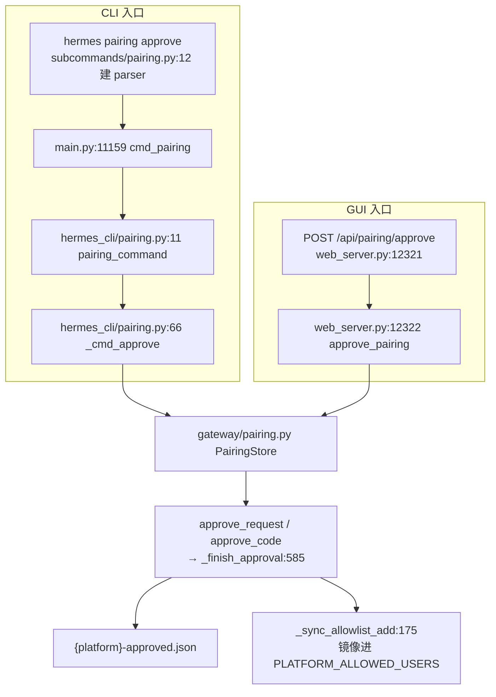

# r8a 底稿 · pairing 配对审批 与 `hermes config` 子命令入口

> 底稿=证据层，求全求证，不求好读。
> 溯源约定：凡对 hermes-agent 行为的断言，紧跟 `路径:行号 @ 863e313` + 代码原文块。
> 基线：`/home/user/hermes-agent` @ `863e31318553cda8ad61df681d08175364d4164b`，`git status --porcelain` 为空。

## 0. 本轮切片与「读了什么 / 没读什么」

| 文件 | 行数 | 本轮处置 |
|---|---|---|
| `hermes_cli/pairing.py` | 120 | 全文精读（L1） |
| `hermes_cli/subcommands/pairing.py` | 40 | 全文精读（L1） |
| `hermes_cli/subcommands/config.py` | 68 | 全文精读（L1） |
| `hermes_cli/web_server.py` | 17732 | **只读 pairing 相关段**：`12280-12376`（pairing 路由簇）、`466-491` + `560-671`（认证中间件，判定 pairing 路由是否受保护）、`17423-17478` + `17596-17606`（默认绑定地址）、`6911-6929`（config 写入路由，用于问题 5 的入口对照）。其余部分留给 R8C。 |

**读到一半发现的关键事实**：上表四个文件里**没有一行**做「码对不对」的判定。真正的判定全部在
`gateway/pairing.py`（905 行）。`hermes_cli/pairing.py` 与 `web_server.py` 的 pairing 路由都是**薄壳**。
因此本底稿把 `gateway/pairing.py` 当作必读的**依赖件**一并精读（它本身归属 R7C 已覆盖的 gateway 簇，
此处只做「判定逻辑」维度的补读，不重复登记层级）。

命令行核对（本轮所有 `PairingStore` 使用点，排除测试与其自身）：

```
$ grep -rn "generate_code\|approve_code\|approve_request\|is_approved\|PairingStore(" --include=*.py . \
    | grep -v "^./tests/" | grep -v "^./gateway/pairing.py"
./gateway/authz_mixin.py:597       pairing_store.is_approved(...)        # 入站鉴权读
./gateway/run.py:6221              self.pairing_store = PairingStore()   # 网关持有
./gateway/run.py:13260             PairingStore(profile=name)            # 多路复用每 profile 一个
./gateway/run.py:14479             pairing_store.generate_code(...)      # 发码（唯一发码点）
./gateway/platforms/yuanbao.py:5030  PairingStore().is_approved(...)     # 读
./hermes_cli/pairing.py:15/72/74   PairingStore() / approve_request / approve_code   # ← CLI 入口
./hermes_cli/web_server.py:12305/12309/12337/12339  PairingStore(...) / approve_*    # ← GUI 入口
./plugins/platforms/discord/adapter.py:4586/8315-8316  is_approved(...)  # 读
```

结论先行：**全仓只有两个「批准」入口**（`hermes_cli/pairing.py`、`hermes_cli/web_server.py`），
**只有一个「发码」入口**（`gateway/run.py:14479`）。

---

## 1. pairing 完整流程

### 1.1 谁发起：陌生人在 DM 里说第一句话

发码不是操作员发起的，是**未授权用户自己触发**的。网关在鉴权失败后，若该平台的
`unauthorized_dm_behavior` 解析为 `pair`，就地生成一个码并 DM 回去。

**`gateway/run.py:14455 @ 863e313`**

```python
        elif not self._is_user_authorized(source):
```

**`gateway/run.py:14479 @ 863e313`**

```python
                code = pairing_store.generate_code(
```

默认行为是 `pair`（开放网关默认）：

**`gateway/authz_mixin.py:807 @ 863e313`**

```
        6. No allowlist and no explicit config → ``"pair"`` (open-gateway default).
```

即：**没有配任何 allowlist 时，任何能给 bot 发 DM 的陌生人都能让 bot 生成一个码。**
（配了 allowlist 则退化成 `ignore`，见同函数 resolution order 第 5 条；email 平台硬编码 `ignore`。）

### 1.2 码怎么生成：8 位、32 字符表、40 bit 熵

**`gateway/pairing.py:47 @ 863e313`**

```python
ALPHABET = "ABCDEFGHJKLMNPQRSTUVWXYZ23456789"
CODE_LENGTH = 8
```

字符集 32 个字符（26 大写字母去掉 `I`、`O`，加 10 数字去掉 `0`、`1` → 24+8=32）。
熵 = log2(32^8) = **40 bit**，约 1.1×10^12 种。

**`gateway/pairing.py:641 @ 863e313`**

```python
            code = "".join(secrets.choice(ALPHABET) for _ in range(CODE_LENGTH))
```

`secrets.choice` 是 CSPRNG（不是 `random`）。

### 1.3 码存在哪：**不存明文**，只存加盐 SHA-256

这是本机制最值得学的一点。

**`gateway/pairing.py:644 @ 863e313`**

```python
            salt = os.urandom(16)
```

**`gateway/pairing.py:648 @ 863e313`**

```python
            entry_id = secrets.token_hex(8)
```

**`gateway/pairing.py:651 @ 863e313`**

```python
            pending[entry_id] = {
                "hash": code_hash,
                "salt": salt.hex(),
                "user_id": normalized_user_id,
                "user_name": user_name,
                "created_at": time.time(),
            }
```

哈希函数：

**`gateway/pairing.py:583 @ 863e313`**

```python
        return hashlib.sha256(salt + code.encode("utf-8")).hexdigest()
```

注意 **key 不是码本身**，而是独立的 `entry_id = secrets.token_hex(8)`（16 位小写 hex，64 bit）。
这个 `entry_id` 就是后面 `list_pending` 暴露的 `request_id`——**它是第二条批准凭据**，见 §2.3。

落盘位置：

**`gateway/pairing.py:59 @ 863e313`**

```python
PAIRING_DIR = get_hermes_dir("platforms/pairing", "pairing")
```

`get_hermes_dir(new, old)` 的语义是「旧路径有内容就用旧路径，否则用新路径」：

**`hermes_constants.py:280 @ 863e313`**

```python
    if _legacy_path_has_content(old_path):
```

所以新装是 `~/.hermes/platforms/pairing/`，老装留在 `~/.hermes/pairing/`。文件名：
`{platform}-pending.json`、`{platform}-approved.json`、`_rate_limits.json`
（`gateway/pairing.py:458-465`）。

**注意 `PAIRING_DIR` 是模块级常量，import 时就绑死了**——这在 §2.4 会变成一个真实的行为差异。

文件权限：

**`gateway/pairing.py:394 @ 863e313`**

```python
            os.chmod(path, 0o600)
```

写入是 temp file + fsync + `atomic_replace`（`gateway/pairing.py:386-392`），读者永远看到完整文件。

### 1.4 有效期：1 小时

**`gateway/pairing.py:51 @ 863e313`**

```python
CODE_TTL_SECONDS = 3600             # Codes expire after 1 hour
```

清理点：`_cleanup_expired` 在 `generate_code` / `approve_code` / `approve_request` / `list_pending`
的开头各调一次（`gateway/pairing.py:624`、`681`、`754`、`782`）。

**`gateway/pairing.py:890 @ 863e313`**

```python
            if (now - created_at) > CODE_TTL_SECONDS:
```

**没有后台定时任务**——过期只在有人碰这个平台时才被清掉。一个再没人访问的平台，
过期条目会一直躺在文件里（不构成安全问题：`_cleanup_expired` 在任何批准之前先跑，
过期条目不可能被批准）。

畸形/遗留条目一律按过期处理：

**`gateway/pairing.py:887 @ 863e313`**

```python
            if not isinstance(created_at, (int, float)):
```

### 1.5 用过是否失效：是，一次性

**`gateway/pairing.py:589 @ 863e313`**

```python
        del pending[matched_key]
```

`_finish_approval` 先从 pending 删除再写盘，两条批准路径（`approve_code` / `approve_request`）
共用这一个函数（`gateway/pairing.py:721`、`766`），所以**一次性语义在两条路上是同一份实现**。

### 1.6 错几次会怎样：5 次 → 平台级锁定 1 小时

**`gateway/pairing.py:56 @ 863e313`**

```python
MAX_PENDING_PER_PLATFORM = 3        # Max pending codes per platform
MAX_FAILED_ATTEMPTS = 5             # Failed approvals before lockout
```

**`gateway/pairing.py:842 @ 863e313`**

```python
    def _record_failed_attempt(self, platform: str) -> None:
```

**`gateway/pairing.py:848 @ 863e313`**

```python
        if fails >= MAX_FAILED_ATTEMPTS:
            lockout_key = f"_lockout:{platform}"
            limits[lockout_key] = time.time() + LOCKOUT_SECONDS
            limits[fail_key] = 0  # Reset counter
```

三个必须记住的性质：

1. **锁定是「平台级」不是「用户级」**：key 是 `_lockout:{platform}`
   （`gateway/pairing.py:838`），锁的是整个 telegram / discord，不是某个 user_id。
2. **锁定发生在批准侧，不是请求侧**——计数器只被 `approve_code` 的失败分支加一
   （`gateway/pairing.py:718`）。也就是说，**能触发锁定的只有操作员自己敲错码**，
   陌生人无法从消息侧打这个计数器（陌生人侧的限流是另一套，见 §1.7）。
3. **锁定同时挡住合法的码**（`approve_code` 先查锁定再查 pending）：

**`gateway/pairing.py:689 @ 863e313`**

```python
            if self._is_locked_out(platform):
```

这是 #10195 的修复：修复前锁定只挡 `generate_code`，不挡 `approve_code`，
已发出的码在锁定期间照样能批准，暴力保护形同虚设。

成功批准会清零失败计数（连续失败语义，不是累计）：

**`gateway/pairing.py:598 @ 863e313`**

```python
        self._reset_failed_attempts(platform)
```

### 1.7 陌生人侧的限流：每用户 10 分钟 1 次 + 每平台最多 3 个待批

**`gateway/pairing.py:52 @ 863e313`**

```python
RATE_LIMIT_SECONDS = 600            # 1 request per user per 10 minutes
```

**`gateway/pairing.py:637 @ 863e313`**

```python
            if len(pending) >= MAX_PENDING_PER_PLATFORM:
```

限流 key 按**别名集合**记（WhatsApp 一个人有 phone / JID / device-suffix 多种写法）：

**`gateway/pairing.py:819 @ 863e313`**

```python
        for alias in self._user_id_aliases(platform, user_id):
```

### 1.8 比较是不是恒定时间：**是，两条路都是 `secrets.compare_digest`**

码路径——先用每条 pending 的 salt 重算哈希，再恒定时间比对：

**`gateway/pairing.py:712 @ 863e313`**

```python
                if secrets.compare_digest(candidate_hash, entry["hash"]):
```

request-id 路径——同样恒定时间：

**`gateway/pairing.py:765 @ 863e313`**

```python
                if secrets.compare_digest(str(entry_id).lower(), request_id):
```

**取舍备注**：恒定时间比对在这里的实际收益有限——循环是「逐条 pending 试」，最多 3 条
（`MAX_PENDING_PER_PLATFORM`），且命中即 `break`（`gateway/pairing.py:715`），
所以循环次数本身仍泄漏「命中第几条」。但泄漏量 ≤ log2(3) bit 且与码内容无关，
比对本身不泄漏，判断成立。

### 1.9 一次成功批准，落盘写了什么

**`gateway/pairing.py:546 @ 863e313`**

```python
        approved[normalized_user_id] = {
            "user_name": user_name,
            "approved_at": time.time(),
        }
```

**没有 expires_at 字段** —— 授权是**永久**的，直到显式 revoke。

---

## 2. 两个入口的逐项对照（本轮重点）

### 2.1 一句话结论

**共用一个 `PairingStore`，判定核心是同一份实现；但两个入口各自写了一层薄壳，
薄壳里有一处真实的判定差异（锁定归因）和两处结构性差异（profile 作用域、路由分派）。**

也就是说，对「同一个语义被实现了不止一份」这个统一发现，pairing 给出的是一个
**「核心收敛、外壳分叉」**的样本——比 R8A 其它实例温和，但分叉处恰好没有任何测试（§6）。

### 2.2 调用图



### 2.3 逐项对照表

先给两侧的壳代码原文。

**CLI 侧 —— `hermes_cli/pairing.py:66 @ 863e313`**

```python
def _cmd_approve(store, platform: str, code: str):
    """Approve a pairing request id (from ``pairing list``) or a DM'd code."""
    platform = platform.lower().strip()
    code = code.strip()

    if store.looks_like_request_id(code):
        result = store.approve_request(platform, code)
    else:
        result = store.approve_code(platform, code.upper())
```

**GUI 侧 —— `hermes_cli/web_server.py:12322 @ 863e313`**

```python
async def approve_pairing(body: PairingApprove):
    store = _pairing_store(body.profile)
    platform = (body.platform or "").lower().strip()
```

**`hermes_cli/web_server.py:12329 @ 863e313`**

```python
    target = (body.request_id or body.code or "").strip()
```

**`hermes_cli/web_server.py:12335 @ 863e313`**

```python
    by_request_id = bool(body.request_id) or store.looks_like_request_id(target)
```

逐项对照：

| 判定项 | CLI (`hermes_cli/pairing.py`) | GUI (`web_server.py`) | 是否有实质差异 |
|---|---|---|---|
| **超时 (TTL)** | 委托 `PairingStore`，1h | 同一 store，1h | ❌ 无差异（同一份 `_cleanup_expired`） |
| **一次性** | 委托 `_finish_approval:589` | 同一函数 | ❌ 无差异 |
| **大小写（码）** | `code.upper()`（:74） | `target.upper()`（:12339） | ❌ 无差异（且 `approve_code:682` 再 upper 一次，三重冗余） |
| **大小写（平台）** | `platform.lower().strip()`（:68） | 同（:12324） | ❌ 无差异 |
| **大小写（request_id）** | 原样传，`approve_request:755` 内部 `.lower()` | 同 | ❌ 无差异 |
| **去空格** | `code.strip()`（:69） | `.strip()`（:12329） | ❌ 无差异 |
| **恒定时间比较** | 委托 `compare_digest`（:712 / :765） | 同 | ❌ 无差异 |
| **失败次数限制 / 锁定判定** | 委托 store | 同一 store，同一 `_rate_limits.json` | ❌ 判定无差异 |
| **锁定的「归因/上报」** | **对两条路都报锁定**（:81） | **只对码路报**（:12346） | ✅ **有差异——CLI 会误报** |
| **路由分派** | 只按形状（`looks_like_request_id`） | 形状 **或** 显式 `request_id` 字段 | ✅ 有差异（GUI 多一条显式路） |
| **profile 作用域** | 无参数，进程级 `HERMES_HOME` 决定 | 每请求 `profile=` 参数 | ✅ 有差异（机制不同，见 §2.4） |
| **空值校验** | 无（argparse 强制两个位置参数） | 显式 400（:12330） | ➖ 效果等价 |
| **审计记录** | **无**（只 `print` 给操作员看） | **无**（只返回 JSON） | ❌ 无差异——**两边都不记审计** |

### 2.4 差异 1（真实缺陷）：CLI 会把「request-id 过期」误报成「平台被锁定」

`approve_request` 的契约明确写着：它**既不计入锁定，也不被锁定门控**。

**`gateway/pairing.py:745 @ 863e313`**

```
        Unlike :meth:`approve_code` this does NOT count a miss toward the
        brute-force lockout, and is not itself gated by one. The lockout
        protects the 8-char code space against guessing over a messaging
        channel; a request id is only ever obtained by an admin already
        authenticated to this store, so a stale id means "the row you clicked
        expired", not an attack. Counting it here let a few GUI clicks on a
        stale list lock the operator out of the CLI's code path too.
```

GUI 侧**遵守**了这个契约——只在码路径上报锁定：

**`hermes_cli/web_server.py:12343 @ 863e313`**

```python
    # Lockout only gates the code path, so only report it there — otherwise a
    # stale request id would surface as a bogus 429 while the platform sat
    # locked out for an unrelated reason.
    if not by_request_id and store._is_locked_out(platform):
```

CLI 侧**没有**这个条件——它只看 `result` 是否为空，然后无差别地查锁定：

**`hermes_cli/pairing.py:81 @ 863e313`**

```python
    elif store._is_locked_out(platform):
```

**可复现的现象**（纯静态推演，未运行）：平台 telegram 因操作员早前敲错 5 次码而处于锁定态；
此时操作员对一个**已过期的 request-id** 执行 `hermes pairing approve telegram <stale-id>`：

- `looks_like_request_id` 为真 → 走 `approve_request` → 返回 `None`（因为该 id 已不在 pending）
- 落到 `elif store._is_locked_out(platform)` → 为真
- 打印 `hermes_cli/pairing.py:90-98` 那段「平台被锁定，等 N 分钟」的提示

而真相是 request-id 路径**根本不受锁定影响**，操作员等一小时再点还是失败。
GUI 注释里 `bogus 429` 描述的就是这个坑——**修的时候只修了 GUI 一侧**。

评估：**不是安全漏洞**（不放宽任何授权，只是把 404 语义误报成 429 语义），
是**可用性/可诊断性缺陷**，且是 CLAUDE.md 所说「同一语义两份实现」的教科书样本——
GUI 的注释甚至把正确判据写清楚了，CLI 却没同步。

### 2.5 差异 2：路由分派多一条显式路

CLI 只有一个位置参数，只能靠形状猜（`hermes_cli/subcommands/pairing.py:29`）：

**`hermes_cli/subcommands/pairing.py:29 @ 863e313`**

```python
    pairing_approve_parser.add_argument(
        "code",
        metavar="request-id|code",
        help="Request ID from 'pairing list', or the code the bot DM'd the user",
    )
```

GUI 的请求体有两个字段：

**`hermes_cli/web_models.py:429 @ 863e313`**

```python
class PairingApprove(BaseModel):
    platform: str
    code: str = ""
    request_id: str = ""
    profile: Optional[str] = None
```

`bool(body.request_id)` 优先于形状判断（:12335）。后果：若某个客户端把**码**塞进 `request_id`
字段（8 位大写），GUI 会强制走 `approve_request`，必然 404；同样输入给 CLI 则会正确走 `approve_code`。
形状判据本身是安全的——两个空间不可能碰撞：

**`gateway/pairing.py:733 @ 863e313`**

```python
        return len(value) == 16 and all(c in "0123456789abcdefABCDEF" for c in value)
```

（码长 8 且字符集不含 hex 小写字母，request-id 长 16 且全 hex，长度就已互斥。）

严重度：低。前提是客户端填错字段。**但它说明 GUI 的显式字段优先级把一个本来无歧义的
形状判据变回了有歧义的**——这是「多一份实现」引入的净负收益。

### 2.6 差异 3：profile 作用域用的是**两套完全不同的机制**

GUI：每请求一个 `profile` 参数，store 按参数构造。

**`hermes_cli/web_server.py:12288 @ 863e313`**

```python
def _pairing_store(profile: Optional[str] = None):
```

**`hermes_cli/web_server.py:12303 @ 863e313`**

```python
    requested = (profile or "").strip()
    if not requested or requested.lower() == "current":
        return PairingStore()

    _resolve_profile_dir(requested)  # 400/404 on an unknown profile

    return PairingStore(profile=requested)
```

CLI：**`pairing` 子命令完全没有 `--profile` 参数**（`hermes_cli/subcommands/pairing.py` 全文 40 行，
只声明了 `platform` / `code` / `user_id`），构造 store 时不带参数：

**`hermes_cli/pairing.py:15 @ 863e313`**

```python
    store = PairingStore()
```

CLI 的 profile 作用域来自**全局 `-p` 前置解析**，它在任何 hermes 模块 import 之前改写 `HERMES_HOME`：

**`hermes_cli/main.py:589 @ 863e313`**

```python
        if arg in {"--profile", "-p"} and i + 1 < len(argv):
```

**`hermes_cli/main.py:667 @ 863e313`**

```python
            hermes_home = resolve_profile_env(profile_name)
```

**`hermes_cli/profiles.py:2249 @ 863e313`**

```
    Called early in the CLI entry point, before any hermes modules
    are imported, to set the HERMES_HOME environment variable.
```

于是 `hermes -p work pairing approve ...` 里，模块级 `PAIRING_DIR`（§1.3）在 import 时就绑到了
work profile 的目录——**结果正确，但机制是「进程级环境变量」而不是「参数」**。

由此推出一个**在 dashboard 进程里可观察的不一致**（存疑，未运行验证）：
`PairingStore(profile="default")` 走的是 `get_default_hermes_root()`，它在 profile 模式下返回**根**：

**`gateway/pairing.py:424 @ 863e313`**

```python
        if profile:
            root = get_default_hermes_root()
            profile_home = (
                root
                if profile == "default"
                else root / "profiles" / profile
            )
```

**`hermes_constants.py:171 @ 863e313`**

```
    In profile mode where ``HERMES_HOME`` is ``<root>/profiles/<name>``,
    returns ``<root>`` so that ``profile list`` can see all profiles.
```

所以在 `hermes -p work dashboard` 启动的面板里：

- `GET /api/pairing`（不带 profile）→ `PairingStore()` → `PAIRING_DIR` → **work 的库**
- `GET /api/pairing?profile=default` → `PairingStore(profile="default")` → **根库**

两者指向不同目录。测试注释自己也点到了这个 import 期绑定：

**`tests/hermes_cli/test_dashboard_admin_endpoints.py:309 @ 863e313`**

```python
        # list: the module-level PAIRING_DIR is bound at import, so the global
```

（该注释原句：「the module-level PAIRING_DIR is bound at import, so the global store carries
whatever earlier cases in this class approved」，见 `tests/hermes_cli/test_dashboard_admin_endpoints.py:307-310`。）

严重度：低，且可能是有意设计（`_pairing_store` 的 docstring 明说 `default` maps back to the global store）。
但对操作员而言，「不填」和「填 default」应当同义，这里不同义。**列为存疑项。**

### 2.7 两侧共同缺失的：审计

两个入口都**没有把「谁在什么时候批准了谁」写进任何日志或审计文件**。
CLI 只 `print` 到终端（`hermes_cli/pairing.py:79`），GUI 只返回 JSON（`web_server.py:12342`）。
落盘的 `approved.json` 只有 `approved_at`（§1.9），**没有 approver 字段**。
唯一被 `print` 到 stdout 的 pairing 事件是锁定：

**`gateway/pairing.py:852 @ 863e313`**

```python
            print(f"[pairing] Platform {platform} locked out for {LOCKOUT_SECONDS}s "
```

这一项**不是**两入口之间的差异，而是两侧共同的空白，因此上表标 ❌。

---

## 3. 配对成功后授予了什么

### 3.1 授予物：一条永久 JSON 条目，不是 token 也不是 session

见 §1.9 的原文块——`{platform}-approved.json` 里一条 `user_id → {user_name, approved_at}`。
**没有 token、没有 session、没有过期时间。** 每条入站消息重新查一次：

**`gateway/authz_mixin.py:597 @ 863e313`**

```python
        if pairing_store is not None and pairing_store.is_approved(platform_name, user_id):
```

`is_approved` 是每次现读文件（无缓存）：

**`gateway/pairing.py:518 @ 863e313`**

```python
        approved = self._load_json(self._approved_path(platform))
```

设计取舍：每消息一次文件读，换来「撤销立即生效、无缓存失效问题」。
代价是热路径上的同步 IO——但相对于一次 LLM 调用可以忽略。

### 3.2 副作用：可能同时写进 allowlist 环境变量

**`gateway/pairing.py:555 @ 863e313`**

```python
        _sync_allowlist_add(platform, normalized_user_id)
```

关键的「option (i)」取舍——**只在操作员本来就配了 allowlist 时才镜像**：

**`gateway/pairing.py:187 @ 863e313`**

```python
    current = _read_allowlist_env(env_var)
    if not current:
        return  # No allowlist configured — leave the gateway open (option i).
```

理由写在 `gateway/pairing.py:180-183`：若在开放网关上写 allowlist，会把一个开放网关
**静默变成封闭网关**（第一次配对之后其他人全被挡）。这是很值得学的一条设计约束。

授权是 allowlist 与 pairing 的**并集**，注释明说：

**`gateway/authz_mixin.py:585 @ 863e313`**

```python
        # attacker-controlled path. Honored as a UNION with the allowlist: a
```

### 3.3 撤销：有，两个入口各一条

CLI：

**`hermes_cli/pairing.py:104 @ 863e313`**

```python
def _cmd_revoke(store, platform: str, user_id: str):
```

GUI：

**`hermes_cli/web_server.py:12357 @ 863e313`**

```python
@app.post("/api/pairing/revoke")
```

两者都直落 `store.revoke(platform, user_id)`，判定同一份：

**`gateway/pairing.py:557 @ 863e313`**

```python
    def revoke(self, platform: str, user_id: str) -> bool:
```

撤销是**别名感知**的（不是字符串精确匹配）——这一点很重要，因为批准时写入的是规范化 phone，
而撤销常常拿到的是 JID：

**`gateway/pairing.py:565 @ 863e313`**

```python
                if self._user_ids_match(platform, approved_user_id, user_id)
```

**`gateway/pairing.py:297 @ 863e313`**

```
    is often invoked with a JID or device-suffix form. Exact-string delete
```

### 3.4 撤销后已建立的连接会不会断：**不会，但下一条消息就被拒**

`revoke()` 的全部副作用只有三样（`gateway/pairing.py:560-575`）：
删 `approved.json` 条目、`_sync_allowlist_remove`、以及后者内部的**内存快照清理**：

**`gateway/pairing.py:261 @ 863e313`**

```python
def _sync_live_adapter_allowlist_remove(platform: str, user_id: str) -> None:
```

**`gateway/pairing.py:277 @ 863e313`**

```python
                adapter._allow_from = _purge_allowlist_entries(
```

这个内存快照清理解决的是：适配器在构造时把 `_allow_from` 快照进内存，
撤销把 env 里唯一一项删掉后，适配器仍按旧快照放行到重启为止。

**没有任何代码在 revoke 时终止会话、断开连接或中断进行中的 turn**——
`grep -rn "revoke" gateway/run.py hermes_cli/web_server.py | grep -i "session\|kill\|terminate"` 无命中。
因此语义是：**下一条入站消息在 `_is_user_authorized`（`gateway/run.py:14455`）处被拒**；
正在跑的那一轮跑完。对本地 harness 这是合理取舍，但要明确知道**撤销不是即时踢下线**。

### 3.5 `clear-pending` 的一个易踩点

CLI 和 GUI 都不传 platform：`hermes_cli/pairing.py:116`、`web_server.py:12374`。

**`gateway/pairing.py:803 @ 863e313`**

```python
    def clear_pending(self, platform: str = None) -> int:
```

`platform=None` 时对 `_all_platforms("pending")` 全清（`gateway/pairing.py:807`）——
即 **`hermes pairing clear-pending` 清的是所有平台，不是当前平台**。CLI help 文案
（`hermes_cli/subcommands/pairing.py:39` 的 "Clear all pending codes"）措辞正确，但没说清「跨平台」。

---

## 4. 威胁模型

### 4.1 码的传播路径：**它必然过网络，而且明文**

码由网关经**平台自己的 DM 通道**发给陌生人：

**`gateway/run.py:14493 @ 863e313`**

```python
                        await adapter.send(
                            source.chat_id,
                            f"Hi~ I don't recognize you yet!\n\n"
                            f"Here's your pairing code: `{code}`\n\n"
                            f"Ask the bot owner to run:\n"
                            f"`hermes {profile_arg}pairing approve "
                            f"{platform_name} {code}`"
                        )
```

也就是说码的机密性**外包给了 Telegram / Discord / WhatsApp 的传输与账号安全**。
这是设计前提，不是缺陷——但必须写清楚：**Telegram 普通聊天在服务端可读**，
所以「码只有该用户能看到」这个假设，强度上限就是平台本身。

### 4.2 码会不会落进日志 / stdout：不会

`gateway/pairing.py:16` 的自述「Codes are never logged to stdout」核对通过：
全仓唯一持有明文码的地方是 `generate_code` 的返回值和上面那条 `adapter.send`。
`logger.warning("Unauthorized user: %s ...")`（`gateway/run.py:14456`）只打 user_id，不打码。

### 4.3 本机其它进程能不能读到码：**读不到码，但能读到 request_id**

- **码**：磁盘上只有 `sha256(salt+code)`（§1.3），文件 0600。本机其它用户读不到；
  即便读到也拿不到码。**这是这套设计最漂亮的一点。**
- **request_id**：以**明文**作为 JSON 的 key 躺在同一个 0600 文件里（§1.3 的 `pending[entry_id]`），
  而 `approve_request` 接受它就直接批准（§2.4 引文：不受锁定门控、不计失败）。
  → **request_id 是一个与码等效的批准凭据，只受文件权限保护。**
- **同 uid 的任何进程**都能直接 `hermes pairing list` 拿到 request_id 再 approve——
  **CLI 入口没有任何认证、口令或二次确认**（`hermes_cli/pairing.py` 全文 120 行，无任何 auth 调用）。

结论：**CLI 侧的信任边界 = 「谁能以 hermes 的 uid 执行命令」**，没有更细的粒度。
对单人自托管是合理的；对多用户机器或共享容器，任何同 uid 进程都能自批准。

补充一条实际泄漏面：操作员按提示执行 `hermes pairing approve telegram ABCD2345` 时，
**码会进入 shell history 和 `ps` 的命令行**（同机其它用户可见 `/proc/<pid>/cmdline`）。
`gateway/run.py:14498` 生成的提示语正是这种用法。不过码是一次性且 1h 过期，
批准完成后即从 pending 删除（§1.5），窗口有限。

### 4.4 默认绑定地址：`127.0.0.1`，且非回环强制认证

**`hermes_cli/web_server.py:17424 @ 863e313`**

```python
    host: str = "127.0.0.1",
```

**`hermes_cli/web_server.py:491 @ 863e313`**

```python
    return host not in _LOOPBACK_HOST_VALUES
```

**`hermes_cli/web_server.py:467 @ 863e313`**

```python
_LOOPBACK_HOST_VALUES: frozenset = frozenset({
    "localhost", "127.0.0.1", "::1",
})
```

绑到非回环 ⇒ `auth_required=True`：

**`hermes_cli/web_server.py:17463 @ 863e313`**

```python
    app.state.auth_required = should_require_auth(host)
```

且**没有 provider 就拒绝启动**（fail closed）：

**`hermes_cli/web_server.py:17549 @ 863e313`**

```python
            raise SystemExit(
                f"Refusing to bind dashboard to {host} — the auth gate "
                f"engages on non-loopback binds, but no auth providers are "
                f"registered.\n\n" + _fix_hint
            )
```

`--insecure` 已被降级为 no-op（不再能关掉认证）：

**`hermes_cli/web_server.py:483 @ 863e313`**

```
    ``allow_public`` (the legacy ``--insecure`` escape hatch) NO LONGER disables
```

RFC1918 内网地址**被当作 public 处理**——这一条值得单独记：

**`hermes_cli/web_server.py:479 @ 863e313`**

```
    "Loopback" is 127.0.0.1, localhost, ::1. RFC1918 / CGNAT / link-local are
    deliberately treated as PUBLIC — a hostile device on the same LAN is exactly
    the threat model the gate is designed for.
```

### 4.5 `/api/pairing*` 是否在认证之内：是

回环模式下走 session token 中间件，`/api/` 一律要 token，除非在公开白名单里：

**`hermes_cli/web_server.py:665 @ 863e313`**

```python
    if path.startswith("/api/") and path not in _PUBLIC_API_PATHS and not is_mcp_oauth_callback:
```

公开白名单**不含任何 pairing 路径**（全表 `hermes_cli/dashboard_auth/public_paths.py:33-60`，
共 8 条：`/api/health`、`/api/status`、`/api/config/defaults`、`/api/config/schema`、
`/api/model/info`、`/api/dashboard/themes`、`/api/dashboard/plugins`、`/api/cron/fire`）：

**`hermes_cli/dashboard_auth/public_paths.py:33 @ 863e313`**

```python
PUBLIC_API_PATHS: frozenset[str] = frozenset({
```

另有 Host 头校验防 DNS rebinding：

**`hermes_cli/web_server.py:17562 @ 863e313`**

```python
    app.state.bound_host = host
```

但绑 `0.0.0.0` 时 Host 校验自我放弃（这是明写的取舍）：

**`hermes_cli/web_server.py:500 @ 863e313`**

```
    - Any host when bound to 0.0.0.0 (explicit opt-in to non-loopback,
      no protection possible at this layer)
```

### 4.6 「若监听 0.0.0.0 而非 127.0.0.1，风险变成什么」

逐层拆：

1. **认证层**：不会裸奔。`should_require_auth("0.0.0.0")` 为真 → 必须有 auth provider，
   否则进程直接 `SystemExit`（§4.4）。所以「公网无认证面板」这条路已被 2026-06 硬化堵死。
2. **DNS rebinding 层**：Host 校验对 `0.0.0.0` 自动失效（§4.5 引文）。剩下的防线只有认证本身。
3. **配对语义层**：这才是真正变化的地方——**批准 pairing 的能力从「本机 shell」扩展成
   「任何能通过面板认证的远端」**。攻击者只要拿到一次面板凭据（口令泄漏 / OAuth 会话劫持），
   就能 `GET /api/pairing` 读出所有待批 request_id，再 `POST /api/pairing/approve` 把
   **任意一个正在等待的陌生人**变成永久授权用户（§3.1 永久、无过期）。
4. **组合风险**：由于 §1.1 的默认 `pair` 行为，攻击者可以先用自己的 Telegram 账号给 bot 发一句话
   制造一条 pending，再从面板批准它——**闭环拿到 agent 的全部对话权限**。

**严重度：高，但前提严格**——需要 (a) 显式绑非回环，且 (b) 面板认证已被攻破。
认证未破时，`0.0.0.0` 本身不额外授予 pairing 能力。
默认 `127.0.0.1` + 认证 fail-closed，把这条路的默认风险压得很低。

### 4.7 锁定的 DoS 面

`_lockout:{platform}` 是平台级（§1.6）。能写这个计数器的只有 `approve_code` 的失败分支，
即**只有操作员自己**（CLI 或已认证的面板）。所以陌生人无法用错码把平台锁死。
但**两个入口共用同一个 `_rate_limits.json`**——面板操作员敲错 5 次，CLI 操作员也一起被锁一小时。
恢复手段只在 CLI 的提示里给了（手删 JSON 条目）：

**`hermes_cli/pairing.py:96-97 @ 863e313`**

```python
            "  To reset sooner, delete the '_lockout:{0}' entry from "
            "~/.hermes/platforms/pairing/_rate_limits.json\n".format(platform)
```

**GUI 的 429 响应不给这个恢复提示**（`web_server.py:12347-12350` 只有一句 detail）——
又一处「同语义两份实现，一份带信息一份不带」。
另外这句提示**硬编码了 `~/.hermes/platforms/pairing/`**，而 §1.3 说明老装会落在
`~/.hermes/pairing/`，此时提示路径是错的。

---

## 5. `hermes_cli/subcommands/config.py` 这 68 行

### 5.1 它是什么：纯 argparse 声明，零逻辑

全文只有一个函数 `build_config_parser`，处理器由调用方注入：

**`hermes_cli/subcommands/config.py:12 @ 863e313`**

```python
def build_config_parser(subparsers, *, cmd_config: Callable) -> None:
```

**`hermes_cli/subcommands/config.py:68 @ 863e313`**

```python
    config_parser.set_defaults(func=cmd_config)
```

它自己写明了来历——从 god-file `main.py` 里**逐字搬出来**的：

**`hermes_cli/subcommands/config.py:3 @ 863e313`**

```
Extracted verbatim from ``hermes_cli/main.py:main()`` (god-file Phase 2).
```

`subcommands/pairing.py` 是同一个模式的产物（`hermes_cli/subcommands/pairing.py:3`：
"Extracted from ``hermes_cli/main.py:main()`` (god-file Phase 2 follow-up)"）。
**这两个文件的存在本身就是 R8A 主题的注脚**：拆 god-file 时把「参数声明」和「参数处理」
分到了两个文件，于是任何一个子命令的语义都得读两处才完整。

### 5.2 分发链

**`hermes_cli/main.py:11586 @ 863e313`**

```python
    build_config_parser(subparsers, cmd_config=cmd_config)
```

**`hermes_cli/main.py:4889 @ 863e313`**

```python
def cmd_config(args):
    """Configuration management."""
    from hermes_cli.config import config_command

    config_command(args)
```

**`hermes_cli/config.py:5131 @ 863e313`**

```python
def config_command(args):
```

即 `subcommands/config.py` → `main.py:cmd_config`（4 行转发）→ `config.py:config_command`（大 if/elif 派发）。
**三跳，中间两跳没有任何逻辑。**

### 5.3 这一层做了什么校验：**只有 argparse 的结构性校验，没有语义校验**

- 8 个子命令：`show` / `edit` / `get` / `set` / `unset` / `path` / `env-path` / `check` / `migrate`
  （共 9 个 parser，见 :25/:28/:31/:38/:51/:57/:60/:63/:66）。
- **所有 key / value 参数都是 `nargs="?"`**，即可以缺省：

**`hermes_cli/subcommands/config.py:39 @ 863e313`**

```python
    config_set.add_argument(
        "key", nargs="?", help="Configuration key (e.g., model, terminal.backend)"
    )
```

于是「缺参数」不是 argparse 报错，而是留给 `config_command` 自己打 usage 后 `sys.exit(1)`：

**`hermes_cli/config.py:5157 @ 863e313`**

```python
        if not key or value is None:
```

这是一个刻意取舍——用 `nargs="?"` 换取「`hermes config set` 裸敲能打出带示例的帮助」
而不是 argparse 的干巴巴 error。代价是**校验责任从声明层漂移到了实现层**，
两层都得看才知道参数是不是必需。

- 唯一带语义的声明是 `--force` 的 help 文本，它描述了实现层的两个行为：

**`hermes_cli/subcommands/config.py:43 @ 863e313`**

```python
    config_set.add_argument(
        "--force",
        action="store_true",
        help="Skip the unknown-key notice printed after writing a key the "
        "running version doesn't recognize (the value is saved either way).",
    )
```

**这段 help 与实现不一致**：help 只提了「跳过未知键提示」，但实现层 `--force` 还额外
**授权用标量覆盖整个 mapping 段**（破坏性操作）：

**`hermes_cli/config.py:4829 @ 863e313`**

```
        force: When True, skip the unknown-key warning — useful for scripted
            writes of keys the running version doesn't recognize yet — AND
            authorize destructive replacement of a mapping section by a
            scalar (e.g. ``--force model gpt-x`` replaces the whole ``model:``
            mapping). Without --force, scalar writes over mapping sections are
            refused (bare ``model`` is redirected to ``model.default``). The
            CLI exposes this via ``hermes config set --force``.
```

有意思的是，`config_command` 自己打的 usage 文本**是完整的**（提到了两条）：

**`hermes_cli/config.py:5165 @ 863e313`**

```python
            print("  --force: skip the unknown-key notice for unrecognized keys,")
            print("           and allow a scalar to replace a whole mapping section")
```

所以 `hermes config set --help`（argparse 出的）少一条，`hermes config set`（裸敲出的）全。
**同一个 flag 的说明写了两份，一份漏了破坏性语义。**

### 5.4 与 GUI 改配置的行为不一致：**是，而且比 pairing 严重**

CLI 单键写入走 `set_config_value`，它有三道闸：

**`hermes_cli/config.py:4837 @ 863e313`**

```python
    if is_managed():
        managed_error("set configuration values")
        return
```

**`hermes_cli/config.py:4847 @ 863e313`**

```python
    if managed_scope.is_key_managed(key):
```

**`hermes_cli/config.py:4857 @ 863e313`**

```python
    if _is_env_config_key(key):
```

第三道是**路由**：API key 形状的键不写 `config.yaml`，改写 `.env` 并触发凭据轮换：

**`hermes_cli/config.py:4860 @ 863e313`**

```python
        from hermes_cli.credential_lifecycle import save_provider_env_credential

        save_provider_env_credential(key.upper(), value)
```

GUI 的配置写入路径**完全不经过 `set_config_value`**：

**`hermes_cli/web_server.py:6911 @ 863e313`**

```python
@app.put("/api/config")
```

**`hermes_cli/web_server.py:6921 @ 863e313`**

```python
            existing = read_raw_config()
            incoming = _denormalize_config_from_web(body.config)
            save_config(_deep_merge(existing, incoming))
```

差异逐项：

| 闸门 | CLI `config set` | GUI `PUT /api/config` |
|---|---|---|
| `is_managed()` 写锁 | 有（:4837，直接 return） | **有**——在 `save_config` 内部（:3527） |
| managed 键逐键硬拒 | **有**（:4847，`sys.exit(1)` 并指名来源） | **无**——`save_config` 改为**静默剥离**该键（:3537-3540） |
| API key 路由到 `.env` + 轮换 | **有**（:4857-4862） | **无**——env 形状的键会被写进 `config.yaml` |
| 未知键提示 / `--force` | 有 | 无对应概念 |
| 标量覆盖 mapping 的保护 | 有（无 `--force` 则拒） | **无**（`_deep_merge` 直接合） |

`save_config` 侧的对照原文：

**`hermes_cli/config.py:3527 @ 863e313`**

```python
        if is_managed():
```

**`hermes_cli/config.py:3530 @ 863e313`**

```python
        # Managed scope: strip any leaf the managed layer pins, so a bulk write
        # (wizard / programmatic save) never persists a user value that would
        # silently lose to managed on the next load. Single-key `config set`
        # hard-rejects (see set_config_value); this is the mechanical safety net
        # for bulk writes so the unmanaged remainder still lands.
```

注意这段注释**明确承认**了两条路的差异并给了理由（单键硬拒 vs 批量剥离），
所以 managed 那一项是**有意的**、可辩护的分叉。
但 **API key 路由那一项没有任何注释解释**——CLI 把 `OPENROUTER_API_KEY` 写进 `.env`
并走凭据轮换，GUI 的同名键则落进 `config.yaml`。这是**未被承认的分叉**，标为存疑待 R8C 从
GUI 侧（`_denormalize_config_from_web` 与 schema 是否根本不允许 env 键进入 body）复核。

---

## 6. 测试覆盖

### 6.1 清单（按「测哪条路」分）

| 文件 | 行数 | 测的是哪一层 | CLI 侧 | GUI 侧 |
|---|---|---|---|---|
| `tests/gateway/test_pairing.py` | 680 | **PairingStore 本体**（28 个用例） | — | — |
| `tests/hermes_cli/test_pairing.py` | 43 | **CLI 壳**（1 个用例） | ✅ | — |
| `tests/hermes_cli/test_dashboard_admin_endpoints.py::TestPairingEndpoints` | :251-317 | **GUI 壳**（3 个用例） | — | ✅ |
| `tests/gateway/test_multiplex_pairing_stores.py` | 87 | 多路复用下每 profile 一个 store | — | — |
| `tests/gateway/test_pairing_allowlist_bypass.py` | 394 | pairing 与 allowlist 的并集语义 | — | — |
| `tests/gateway/test_internal_event_bypass_pairing.py` | — | 内部事件不该触发发码 | — | — |
| `tests/gateway/test_unauthorized_dm_behavior.py` | — | `pair`/`ignore` 默认解析 | — | — |

`tests/gateway/test_pairing.py` 的 28 个用例（`grep -n "def test"` 输出）覆盖得相当扎实：
文件权限、码唯一性、pending 里只有 hash+salt、明文码不落盘、畸形条目容错、限流、最大待批数、
两条批准路、request_id 不泄漏摘要、陈旧 request_id 不触发锁定、成功清零失败计数、
锁定挡住合法码、过期清理、撤销、WhatsApp 别名翻转、PermissionError 告警、profile 隔离等。
**这一层没有问题。**

### 6.2 「回归测试只覆盖两条路中的一条」—— 确认，而且更糟：**关键分叉两条路都没覆盖**

**CLI 壳的唯一测试**（全文 43 行）：

**`tests/hermes_cli/test_pairing.py:8 @ 863e313`**

```python
def test_cli_listed_request_id_and_bot_code_can_be_approved(tmp_path, capsys):
```

它只走 `list` + `approve(request_id)` + `approve(code)` 的成功路径。

**GUI 壳的三个测试**：

**`tests/hermes_cli/test_dashboard_admin_endpoints.py:256 @ 863e313`**

```python
    def test_approve_pending_request_id(self):
```

**`tests/hermes_cli/test_dashboard_admin_endpoints.py:276 @ 863e313`**

```python
    def test_pairing_is_isolated_per_profile(self):
```

**`tests/hermes_cli/test_dashboard_admin_endpoints.py:316 @ 863e313`**

```python
    def test_unknown_profile_is_rejected(self):
```

把两侧壳的覆盖并起来看：

| 壳内分支 | CLI 测了？ | GUI 测了？ |
|---|---|---|
| `approve` by request_id 成功 | ✅ | ✅ |
| `approve` by code 成功 | ✅ | ❌ **GUI 从没测过码路径** |
| **锁定分支（§2.4 的实际差异所在）** | ❌ | ❌ |
| `revoke` | ❌ | ❌ |
| `clear-pending` | ❌ | ❌ |
| `list` 输出格式 | ✅ | ✅ |
| profile 作用域 | ❌（CLI 无此参数） | ✅ |

核对命令（零命中即为无覆盖）：

```
$ grep -rn "pairing/revoke\|pairing/clear-pending\|pairing_action=\"revoke\"\|_cmd_revoke\|_cmd_clear" tests/ --include=*.py
（无输出）
$ grep -rn "_is_locked_out\|429" tests/hermes_cli/test_pairing.py tests/hermes_cli/test_dashboard_admin_endpoints.py
（无命中：唯一含 "locked out" 的是 :281 的一句 docstring 散文）
```

**这正是本轮已出现两次的模式的第三例，而且形态更尖锐**：

不是「两条路只测了一条」，而是——
**两条路各自被测了一个交集子集（都只测 request_id 成功路），
而两条路唯一真正分叉的那个分支（锁定归因），两边都没测。**
store 层那条 `test_stale_request_id_never_locks_out_the_code_path`
（`tests/gateway/test_pairing.py:332`）只保证了 store 的行为正确，
**管不到 CLI 壳把这个正确行为误报成锁定**（§2.4）。

**`tests/gateway/test_pairing.py:332 @ 863e313`**

```python
    def test_stale_request_id_never_locks_out_the_code_path(self, tmp_path):
```

结构性教训：**当同一语义被实现成「一个共享核心 + N 个薄壳」时，
核心的测试无论多密都无法覆盖壳的分叉；而壳因为「看起来只有几行」最容易被判定为不需要测试。**
这套 pairing 代码把核心测到了 28 个用例，把壳测到了 4 个用例——
偏偏 bug 在壳里。

---

## 7. 地图与代码的出入

| # | 地图说法 | 代码事实 | 判定 |
|---|---|---|---|
| ▲1 | `website/docs/reference/faq.md:411` "**DM pairing** \| First user to message in DM claims exclusive access" | pairing **必须操作员显式批准**，先到先得的不是访问权而只是一个待批条目；且不"exclusive"（`MAX_PENDING_PER_PLATFORM=3`，approved 可多人） | **文档错**，以代码为准 |
| ▲2 | `website/docs/reference/faq.md:96` "DM pairing（first user to message claims access）" | 同上 | **文档错**（同一处错误的第二次出现） |
| ◇3 | `gateway/pairing.py:18` 模块 docstring "Storage: ~/.hermes/pairing/" | 新装实际是 `~/.hermes/platforms/pairing/`（`gateway/pairing.py:59` + `hermes_constants.py:280`） | **源码内自述过时**，只对老装成立 |
| ◇4 | `website/docs/reference/cli-commands.md:1119` "`approve <platform> <code>` \| Approve a pairing code." | 还接受 request-id（`hermes_cli/pairing.py:71`），且这是 `pairing list` 推荐的方式（`hermes_cli/pairing.py:49`） | **文档不全** |
| ◇5 | `hermes_cli/subcommands/config.py:45-47` `--force` help 只说"跳过未知键提示" | 还授权标量覆盖整个 mapping 段（`hermes_cli/config.py:4830-4834`） | **help 漏了破坏性语义**（§5.3） |
| ◇6 | `hermes_cli/pairing.py:97` 硬编码恢复路径 `~/.hermes/platforms/pairing/_rate_limits.json` | 老装在 `~/.hermes/pairing/`（§1.3） | **提示路径对老装是错的** |

`website/docs/user-guide/security.md:390-401` 的「Security features」表（8 行）**逐条核对全部属实**：
8 字符 / 32 字符表、`secrets.choice()`、1h TTL、10 分钟限流、3 个待批上限、5 次失败锁定 1h、
0600 权限、码不进 stdout。这是本轮唯一一张与代码完全对齐的文档表。

---

## 8. 发现清单

> 格式：一句话症状 + 锚点文件:行号 + 复核结论。安全项标严重度与前提。

### F-8A-P1 · CLI 把「request-id 过期」误报成「平台被锁定」，GUI 已修而 CLI 未同步
- **症状**：平台处于锁定态时，用一个已过期的 request-id 执行 `hermes pairing approve`，
  会打印「平台被锁定，等 N 分钟」；但 request-id 路径根本不受锁定门控，等多久都没用。
- **锚点**：`hermes_cli/pairing.py:81`（`elif store._is_locked_out(platform):`，无 `by_request_id` 前置条件）
  ↔ `hermes_cli/web_server.py:12346`（`if not by_request_id and store._is_locked_out(platform):`，
  并在 :12343-12345 写明理由「否则 stale request id 会浮现成 bogus 429」）
  ↔ 契约在 `gateway/pairing.py:745-751`。
- **复核结论**：**确认**（静态推演，逻辑闭合；未运行）。
- **严重度**：低（可用性/可诊断性，不放宽任何授权）。**前提**：平台已因码路径失败 5 次进入锁定态。
- **性质**：CLAUDE.md 统一发现「同一语义多份实现」的直接实例——修复只落在了两份中的一份。

### F-8A-P2 · 两条批准路的核心判定完全共用，分叉只在薄壳
- **症状**：超时/一次性/大小写/去空格/恒定时间比较/失败计数，**六项逐条无差异**，
  因为两个入口都直落同一个 `PairingStore`。
- **锚点**：`hermes_cli/pairing.py:72,74` 与 `hermes_cli/web_server.py:12337,12339`
  调用同名方法；判定实现唯一，见 `gateway/pairing.py:665`（approve_code）、`:735`（approve_request）、
  `:585`（`_finish_approval`，两路共用的一次性+清计数+落盘）。
- **复核结论**：**确认**。这是本轮对 R7C 移交项的**正面结案**——「门外那把钥匙」只有一把锁芯。

### F-8A-P3 · 两个入口的关键分叉分支，回归测试两边都没覆盖
- **症状**：CLI 壳 1 个用例、GUI 壳 3 个用例，交集只有「request_id 成功路」；
  锁定分支、revoke、clear-pending 在两条路上**均为零覆盖**；GUI 从未测过 code 路径。
- **锚点**：`tests/hermes_cli/test_pairing.py:8`（CLI 壳唯一用例，全文 43 行）
  ↔ `tests/hermes_cli/test_dashboard_admin_endpoints.py:256,276,316`（GUI 壳三个用例）；
  store 层的 `tests/gateway/test_pairing.py:332` 只覆盖 store，覆盖不到壳。
- **复核结论**：**确认**（`grep` 零命中，见 §6.2 核对命令）。
- **性质**：本轮该模式的第三例，形态更尖锐——不是「只测一条路」，
  而是「两条路各测了交集、唯一的分叉两边都没测」。

### F-8A-P4 · request_id 是与码等效的批准凭据，且以明文躺在盘上
- **症状**：`approve_request` 不受锁定门控、不计失败次数、不需要知道码；
  而 request_id 就是 pending JSON 的 key，明文存储，`hermes pairing list` / `GET /api/pairing` 直接输出。
- **锚点**：`gateway/pairing.py:648`（`entry_id = secrets.token_hex(8)` 作为 key）、
  `gateway/pairing.py:651`（明文 key 落盘）、`gateway/pairing.py:745-751`（不计锁定的契约）、
  `gateway/pairing.py:796`（`list_pending` 输出 `request_id`）。
- **复核结论**：**确认**，且判定为**有意设计**（契约 docstring 明说「request id 只会到达已认证的管理员手里」）。
- **严重度**：低。**前提**：攻击者已能以 hermes 的 uid 读文件或已通过面板认证——
  此时他本来就能直接调 `approve_request`，request_id 不构成额外攻击面。
- **值得记的取舍**：码做了「只存哈希」的高规格保护，request_id 却是明文——
  因为二者的信任前提不同（码过不可信网络，request_id 不出信任域）。这个非对称是刻意的。

### F-8A-P5 · CLI 入口无任何认证，信任边界即 uid
- **症状**：`hermes_cli/pairing.py` 全文 120 行没有一次 auth / 口令 / 二次确认调用；
  任何同 uid 进程可 `pairing list` 拿 request_id 后自行批准。
- **锚点**：`hermes_cli/pairing.py:11`（`pairing_command` 全部入口，直接建 store 就干活）、
  `hermes_cli/pairing.py:15`（`store = PairingStore()`）。
- **复核结论**：**确认**，判定为**符合设计意图**（单人自托管 CLI 的常规假设）。
- **严重度**：中。**前提**：多用户机器 / 共享容器，且存在同 uid 的其它不可信进程。
  单用户桌面或单租户容器下不成立。
- **附带**：操作员执行 `hermes pairing approve <platform> <CODE>` 会把码留在 shell history 和
  `/proc/<pid>/cmdline`；提示语正是这么教的（`gateway/run.py:14498`）。码一次性且 1h 过期，窗口有限。

### F-8A-P6 · 默认绑 127.0.0.1；绑 0.0.0.0 时 pairing 批准能力随面板认证一起外移
- **症状**：默认 `host="127.0.0.1"`，非回环强制认证且无 provider 直接拒绝启动；
  一旦绑非回环且面板认证被攻破，攻击者可读取所有待批 request_id 并批准任意一条，
  再结合默认 `pair` 行为自造 pending，闭环取得 agent 全部对话权限。
- **锚点**：`hermes_cli/web_server.py:17424`（默认 host）、`:491`（`should_require_auth`）、
  `:17549`（无 provider 则 `SystemExit`，fail closed）、`:483`（`--insecure` 已降级为 no-op）、
  `:500`（绑 0.0.0.0 时 Host 头校验自我放弃）、`gateway/authz_mixin.py:807`（无 allowlist 时默认 `pair`）。
- **复核结论**：**确认**（默认配置安全；风险仅在显式改绑 + 认证被破的组合下成立）。
- **严重度**：高，**但前提严格且二者必须同时成立**：(a) 操作员显式绑非回环，
  **且** (b) 面板认证凭据已泄漏/会话被劫持。仅满足 (a) 不足以获得 pairing 能力。
- **不夸大的说明**：认证层是 fail-closed 的，2026-06 硬化后已无「公网无认证面板」这条路。

### F-8A-P7 · `hermes config set` 与 GUI `PUT /api/config` 三道闸中有两道对不齐
- **症状**：CLI 单键写入有 managed 硬拒 + API-key 路由到 `.env` + 标量覆盖 mapping 保护三道闸；
  GUI 走 `read_raw_config → _deep_merge → save_config`，只保留了 `is_managed()` 写锁，
  managed 键改为静默剥离，API-key 路由与覆盖保护完全没有。
- **锚点**：`hermes_cli/config.py:4837`（`is_managed()`）、`:4847`（`is_key_managed` 硬拒）、
  `:4857-4862`（env 键路由 + `save_provider_env_credential` 轮换）
  ↔ `hermes_cli/web_server.py:6921`（GUI 三行写入路径）
  ↔ `hermes_cli/config.py:3527`（`save_config` 的 `is_managed`）、`:3530-3540`（静默剥离，注释承认差异）。
- **复核结论**：managed 那一项**确认为有意分叉**（`config.py:3530-3534` 注释明写理由）；
  **API-key 路由那一项存疑**——无任何注释解释，需 R8C 从 GUI 侧复核
  `_denormalize_config_from_web` 与 CONFIG_SCHEMA 是否根本不允许 env 形状的键进入 PUT body。
- **严重度**：中（若 env 键真能从 GUI 落进 `config.yaml`，等于凭据写进了一个通常权限更宽、
  且不参与凭据轮换的文件）。**前提**：需先证明该路径可达，**目前未证实**。

### F-8A-P8 · dashboard 在 profile 下运行时，「不填 profile」与「填 default」指向不同的库
- **症状**：`hermes -p work dashboard` 里，`GET /api/pairing` 读 work 的库
  （模块级 `PAIRING_DIR` import 时绑定），`GET /api/pairing?profile=default` 读根库。
- **锚点**：`gateway/pairing.py:59`（模块级 `PAIRING_DIR`）、`gateway/pairing.py:424-430`
  （`profile == "default"` → `root`）、`hermes_constants.py:171-174`
  （profile 模式下 `get_default_hermes_root()` 返回根）、
  `hermes_cli/web_server.py:12303-12309`（空/`current` → `PairingStore()`，其余 → 带 profile）；
  测试注释 `tests/hermes_cli/test_dashboard_admin_endpoints.py:307-310` 自己点出了 import 期绑定。
- **复核结论**：**存疑**——`_pairing_store` docstring（`web_server.py:12296`）明说
  「`default` maps back to the global store」，可能是有意；但对操作员而言
  「不填」与「填 default」应当同义，此处不同义。未运行验证。
- **严重度**：低（不放宽授权；最坏是批准写错库，用户仍进不来——这正是
  `test_pairing_is_isolated_per_profile` 要防的那类故障的镜像形态）。

### F-8A-P9 · `clear-pending` 清的是所有平台，两个入口都没说清
- **症状**：CLI 与 GUI 都调 `store.clear_pending()` 不传 platform，落到 `_all_platforms` 全清。
- **锚点**：`hermes_cli/pairing.py:116`（`count = store.clear_pending()`）、
  `hermes_cli/web_server.py:12374`（同）、`gateway/pairing.py:803`（`platform: str = None`）、
  `gateway/pairing.py:807`（`platforms = [platform] if platform else self._all_platforms("pending")`）。
- **复核结论**：**确认**。help 文案 "Clear all pending codes"
  （`hermes_cli/subcommands/pairing.py:39`）字面不错但不足以让人预期跨平台。
- **严重度**：极低（只清待批，不影响已授权用户；被清的人重发一条消息即可拿新码）。

### F-8A-P10 · 锁定恢复提示只在 CLI 有，且硬编码了新版路径
- **症状**：CLI 在锁定时告诉操作员删哪个文件的哪个 key；GUI 的 429 只有一句 detail，不给恢复路径。
  且 CLI 给的路径硬编码 `~/.hermes/platforms/pairing/`，老装实际在 `~/.hermes/pairing/`。
- **锚点**：`hermes_cli/pairing.py:95-98`（含硬编码路径的 print）
  ↔ `hermes_cli/web_server.py:12347-12350`（无恢复提示）
  ↔ `gateway/pairing.py:59` + `hermes_constants.py:280`（路径二选一的实际规则）。
- **复核结论**：**确认**。
- **严重度**：极低（纯文案）。列出是因为它是同一「双入口信息不对等」模式的第三处
  （前两处：F-8A-P1 锁定归因、F-8A-P8 profile 语义）。

### F-8A-P11 · 两个入口都不记审计
- **症状**：批准/撤销事件不写任何日志或审计文件；`approved.json` 只有 `approved_at`，无 approver。
- **锚点**：`gateway/pairing.py:546-549`（落盘字段全集）、
  `hermes_cli/pairing.py:79`（CLI 只 print）、`hermes_cli/web_server.py:12342`（GUI 只 return）；
  全流程唯一 print 到 stdout 的 pairing 事件是锁定：`gateway/pairing.py:852`。
- **复核结论**：**确认**。这是两侧**共同的**空白，不是两入口之间的差异。
- **严重度**：低（自托管单人场景可接受）。**前提**：若部署成多操作员共管的网关，
  「谁批准了这个人」不可追溯。

### F-8A-P12 · 文档把 pairing 描述成「先到先得」，与「必须操作员批准」相反
- **症状**：FAQ 两处把 DM pairing 说成 "First user to message in DM claims exclusive access"。
- **锚点**：`website/docs/reference/faq.md:411`、`website/docs/reference/faq.md:96`
  ↔ 代码事实：`gateway/pairing.py:665`/`:735` 是仅有的两个授予点，均需操作员调用；
  `gateway/run.py:14479` 只创建待批条目，不授予任何权限。
- **复核结论**：**确认为文档错**，按 CLAUDE.md「与代码冲突时以代码为准」处理。
- **严重度**：文档层，但会误导操作员低估暴露面（以为「我先发的所以别人进不来」）。

---

## 9. 留给后续轮的移交项（带锚点 + 一句话现象）

1. **[→R8C] GUI 配置写入是否真能把 API-key 形状的键写进 `config.yaml`**
   - 锚点：`hermes_cli/web_server.py:6921-6923`（`read_raw_config` → `_deep_merge` → `save_config`，
     全程不经 `_is_env_config_key`）
   - 现象：CLI 的 `set_config_value`（`hermes_cli/config.py:4857`）会把 env 形状的键改道写 `.env`
     并走凭据轮换，GUI 这条路没有对应分支。需查 `_denormalize_config_from_web` 与 CONFIG_SCHEMA
     是否在更早的地方就把 env 键挡在 body 之外。见 F-8A-P7。
2. **[→R8C] `web_server.py` 的 profile 作用域机制清点**
   - 锚点：`hermes_cli/web_server.py:12288-12309`（`_pairing_store` 用 `PairingStore(profile=)`）
     vs `hermes_cli/web_server.py:6914`（`update_config` 用 `with _profile_scope(...)`）
   - 现象：同一个 dashboard 里存在**两套 profile 作用域机制**——一套传参数、一套装 context 作用域。
     pairing 的 docstring（:12296-12299）明说「不需要 `_profile_scope`」。R8C 通读 web_server 时
     应清点哪些端点用哪一套、有没有第三套。
3. **[→R8C/R9] 「共享核心 + N 个薄壳」的测试盲区是否为全仓通病**
   - 锚点：`tests/gateway/test_pairing.py`（28 用例，store 层）
     vs `tests/hermes_cli/test_pairing.py:8` + `tests/hermes_cli/test_dashboard_admin_endpoints.py:256`
     （合计 4 用例，壳层）
   - 现象：核心测密、壳测稀，而唯一的行为分叉恰在壳里且零覆盖（F-8A-P3）。
     建议在 webhook / mcp / cron 等同样是「CLI + GUI 双壳」的子系统上重复这次对照，
     验证这是 pairing 个例还是仓库级模式。
4. **[→R9] `hermes pairing` 缺 `--profile` 是否为待补齐项**
   - 锚点：`hermes_cli/subcommands/pairing.py`（全文 40 行，无 `--profile`）
     vs `hermes_cli/web_models.py:433`（`PairingApprove.profile`）
   - 现象：GUI 能按请求指定 profile，CLI 只能靠进程级 `-p` 前置改写 `HERMES_HOME`
     （`hermes_cli/main.py:589,667`）。功能上等价，但在同一进程里想跨 profile 操作时 CLI 无解。
