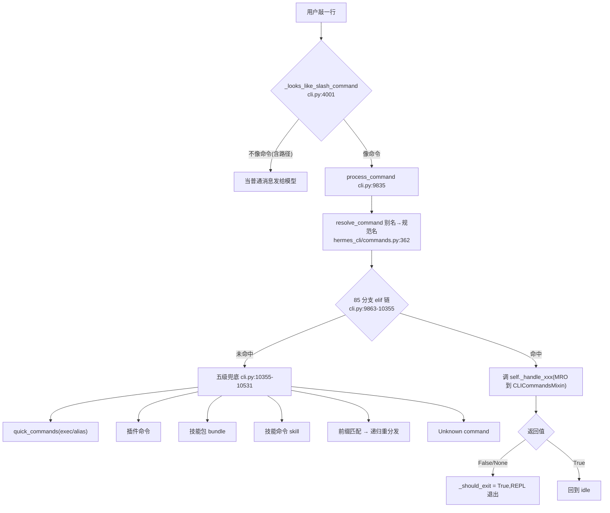

# r8b-raw-cli-dispatch —— cli.py 9835-11800(命令分发与目标循环)

> 底稿(证据层)。研究对象 `NousResearch/hermes-agent` @ `863e31318553cda8ad61df681d08175364d4164b`。
> 所有断言后紧跟 `路径:行号 @ 863e313` + 代码原文块;代码块由脚本从源文件按行号区间直接抽取,未经改写、未重排缩进。

---

## 0. 自验记录

### 0.1 三条前提的判定(先说结论:三条**全部不准确**)

| # | 交办时给出的前提 | 判定 | 真相一句话 |
|---|---|---|---|
| 1 | `process_command` 是"命令名 → handler"的单一 dispatch table | **假** | 是一条 **85 分支的 `if/elif` 长链**(`cli.py:9863-10355`),按 `canonical` 字符串逐条比较;唯一的"表"在 `hermes_cli/commands.py` 里,但它只做**别名 → 规范名**的解析,**不持有任何 handler 引用**。mixin(`CLICommandsMixin`)只通过 Python MRO 提供 51 个 `_handle_*` **方法**,不参与分发决策。插件命令走的是链末 `else` 里的第二级兜底,不是同一张表。 |
| 2 | 未知斜杠命令会给出错误提示 | **半真,且掩盖了真正的风险** | 交互路径上确实不会把 `/foo` 发给模型(`_looks_like_slash_command` 先做了路径/命令消歧)。但链末 `else` 是一条 **五级兜底级联**:quick_commands → 插件命令 → 技能包(bundle)→ 技能命令 → 前缀匹配 → 才是 "Unknown command"。**前缀匹配会静默把你打的命令换成另一条命令执行**(`/co` → `/copy`、`/s` → `/sb`(= `/statusbar`)),这比"报错"危险得多。 |
| 3 | `_maybe_continue_goal_after_turn` 实现了带迭代上限的自动续跑循环 | **假(在这个函数里)** | 该函数**没有任何循环、也没有任何计数**。它每轮最多往 `_pending_input` 塞**一条**续跑提示词就返回;"循环"是 `process_loop` 重新消费队列形成的。上限全部在 `hermes_cli/goals.py::GoalManager.evaluate_after_turn` 里,而且**不止一个上限**:轮次预算(默认 20)、连续判官解析失败 3 次、连续判官传输失败 5 次、以及 wait 屏障。超限后的动作是 **paused(暂停并持久化),不是终止也不是清除**,可用 `/goal resume` 恢复(默认重置预算)。 |

### 0.2 锚点复核

- 全文锚点采用两种形式:`path:行号` 与 `path:起-止`。
- **复核方式(比"抽查 15 个"更强,故用它替代抽样)**:本底稿由"模板 + 抽取脚本"生成。所有 59 个代码块都是脚本按锚点行号从源文件**直接读出的原文**(未手抄、未重排缩进);生成后脚本再做两件事:
  1. **正文锚点全扫描**:用正则把文档里出现的每一个 `path:行号[-行号]` 抠出来,逐个回源文件核对区间存在且内容包含该处论断依赖的关键字符串(共 173 条内容断言,覆盖率要求"未覆盖锚点 = 0")。
  2. **代码块回读比对**:对每个已展开的代码块,重新从磁盘读一次同一区间,要求逐字符相等。
- 复核结果(脚本输出):

```
distinct anchors in doc      : 161
anchor occurrences in doc    : 195
snippet blocks expanded      : 59
content assertions run       : 173
uncovered anchors            : 0
problems                     : 0
```

- 即:**161 个不同锚点全部复核,drift 0 处,内容断言 0 处不符**。
- 额外结构性断言(防止后续误抄):脚本硬性校验 `process_command`(9835-10533)内 return 语句的行号集合恰为
  `[9873, 9874, 9898, 10020, 10033, 10068, 10081, 10159, 10321, 10401, 10480, 10525, 10533]`,
  且其中裸 `return`(无返回值)的集合恰为 `[10068]` —— 这两条正是 §3.1 缺陷论断的地基。

### 0.3 运行式验证(不是读代码猜的)

以下结论**跑过真实解释器**(`/home/user/hermes-venv/bin/python`,`sys.path` 指向 `/home/user/hermes-agent`,用 `HermesCLI.__new__` 造最小桩对象,与仓库自带 `tests/cli/*` 同一套路):

```
'/undo --yes'  -> return=None    EXITS_CLI=True  undo_last(n)=None  stdout="(._.) Invalid count '--yes' — use /undo or /undo N."
'/undo -y'     -> return=None    EXITS_CLI=True  undo_last(n)=None  stdout="(._.) Invalid count '-y' — use /undo or /undo N."
'/undo -y 3'   -> return=None    EXITS_CLI=True  undo_last(n)=None  stdout="(._.) Invalid count '-y' — use /undo or /undo N."
'/undo 3 -y'   -> return=True    EXITS_CLI=False undo_last(n)=3  stdout=''
'/undo 0'      -> return=True    EXITS_CLI=False undo_last(n)=1  stdout=''
'/undo abc'    -> return=None    EXITS_CLI=True  undo_last(n)=None  stdout="(._.) Invalid count 'abc' — use /undo or /undo N."
```

```
=== '/'      -> ('True',  'Ambiguous command: / … Did you mean: /agents, /approvals, …')
=== '/co'    -> ('True',  ['  Nothing to copy yet.'])        # 静默展开成 /copy
=== '/s'     -> EXC:AttributeError '_status_bar_visible'      # 静默展开成 /sb = /statusbar
=== '/rel'   -> ('True',  '  Reloaded .env (2 var(s) updated)')  # 静默展开成 /reload,且真的执行了
=== '/qui'   -> ('False')                                     # 展开成 /quit,REPL 退出
=== '/whoami'-> ('True',  'Unknown command: /whoami')         # 注册表里有、/help 里有、CLI 分发链里没有
=== /loopy 自指 alias -> EXC:RecursionError
```

```
empty queue            judge_called=True  turns_used=1 queue_after=['[Continuing toward your standing goal] …']
slash cmd queued       judge_called=True  turns_used=1 queue_after=['/subgoal foo', '[Continuing…]']
BANG cmd queued        judge_called=False turns_used=0 queue_after=['!ls']     ← 目标循环被 bang 命令卡死
real message queued    judge_called=False turns_used=0 queue_after=['hello']
```

```
# ThreadPoolExecutor 上下文管理器把"硬超时"变成了软超时
timeout hit at t=0.20s
left `with` block at t=3.00s      ← .result(timeout=) 到期后,__exit__ 仍 shutdown(wait=True) 等满 3s
```

仓库自带的相关行为规格全绿(`bash scripts/run_tests.sh`,4 文件 27 用例,2.6s):
`tests/cli/test_cli_goal_interrupt.py`、`tests/cli/test_cli_prefix_matching.py`、
`tests/cli/test_indicator_command.py`、`tests/cli/test_quick_commands.py`。

### 0.4 只读边界

- `hermes-agent` 全程只读。跑测试时其 runner 在仓库根写了一个 **已被 `.gitignore` 忽略**的缓存文件 `test_durations.json`(`.gitignore:35`),事后已删除;`git status --porcelain` 为空,tracked 内容零改动。
- 本底稿唯一写入路径:`/home/user/hermes-study/notes/r8b-raw-cli-dispatch.md`。

---

## 1. 段内地图

`cli.py` 9835-11800 共 1966 行,是交互式 CLI 的"输入语义判定 + 路由"中枢。段内成员:

| 行号 | 成员 | 一句话职责 |
|---|---|---|
| 9835-10533 | `process_command` | 主分发器:别名解析 → 85 分支 elif 链 → 五级 else 兜底。**返回值 = REPL 生死开关**。 |
| 10536-10545 | `_try_launch_chrome_debug` | 单行转发到 `try_launch_chrome_debug`(段内孤儿,与分发无关)。 |
| 10552-10583 | `_get_goal_manager` | 按 `session_id` 惰性绑定/重绑 `GoalManager`,读 `goals.max_turns`。 |
| 10585-10607 | `_get_heartbeat_manager` | 同上,`HeartbeatManager`。 |
| 10609-10649 | `_start_heartbeat_watchdog` | 守护线程:空闲时把到期心跳提示词塞进 `_pending_input`。 |
| 10653-10675 | `_owns_process_notification` | 后台委派完成事件的归属判定(fail closed)。 |
| 10677-10700 | `_drain_process_notifications` | 认领并投递属于本会话的后台完成通知。 |
| 10702-10725 | `_drain_interrupt_queue_to_pending_input` | 把卡在 `_interrupt_queue` 的输入捞回 `_pending_input`(#20271)。 |
| 10727-10852 | `_maybe_continue_goal_after_turn` | **每轮末尾的目标钩子**:抢占判定 → 中断判定 → 空回复判定 → 调判官 → 最多入队一条续跑提示词。 |
| 10855-10906 | `_toggle_verbose` | 工具进度四态轮转(与全局日志级别解耦)。 |
| 10908-11029 | `_transfer_session_yolo` / `_is_session_yolo_active` / `_toggle_yolo` / `_persist_session_yolo` | 每会话 YOLO 旁路的迁移、读、切、持久化。 |
| 11034-11039 | `_on_reasoning` | 中间推理文本回调。 |
| 11041-11268 | `_manual_compress` | `/compress` 全量/边界压缩、预览、锁跳过、压缩后 session 分裂同步。 |
| 11272-11287 | `_handle_usage_command` | `/usage [reset [--force]]` 的二级分发。 |
| 11289-11317 | `_usage_reset` | 兑换 Codex 限额重置额度(仅 `openai-codex`)。 |
| 11319-11366 | `_show_context_breakdown` | `/context [all]` 上下文占用可视化。 |
| 11368-11475 | `_show_usage` | 限额 + 会话 token + 账户额度 + Nous 余额。 |
| 11477-11511 | `_show_insights` | `/insights [--days N] [--source S]`。 |
| 11513-11622 | `_check_config_mcp_changes` | config.yaml 轮询:mcp_servers 变化 → 自动重载或提示。 |
| 11624-11660 | `_DESTRUCTIVE_SKIP_TOKENS` / `_split_destructive_skip` | 破坏性命令的 inline-skip 词法。 |
| 11662-11747 | `_confirm_destructive_slash` | `/clear` `/new` `/reset` `/undo` 的三选一确认模态。 |
| 11749-11814 | `_confirm_and_reload_mcp` | `/reload-mcp` 的缓存失效警告 + 三选一确认。 |

段内**真正的机制骨架**只有三根:



---

## 2. 逐机制精读

### 2.1 `process_command` 的真实形状 —— 前提 1 的判定

函数签名与开头 20 行已经把整个设计说清楚了:`cli.py:9835-9854 @ 863e313`

```python
    def process_command(self, command: str) -> bool:
        """
        Process a slash command.
        
        Args:
            command: The command string (starting with /)
            
        Returns:
            bool: True to continue, False to exit
        """
        # Lowercase only for dispatch matching; preserve original case for arguments
        cmd_lower = command.lower().strip()
        cmd_original = command.strip()

        # Resolve aliases via central registry so adding an alias is a one-line
        # change in hermes_cli/commands.py instead of touching every dispatch site.
        from hermes_cli.commands import resolve_command as _resolve_cmd
        _base_word = cmd_lower.split()[0].lstrip("/")
        _cmd_def = _resolve_cmd(_base_word)
        canonical = _cmd_def.name if _cmd_def else _base_word
```

三点必须记住:

1. **`cmd_lower` 只用于分发匹配,`cmd_original` 保留大小写供参数解析**(`cli.py:9845-9847`)。所有 handler 拿到的都是 `cmd_original`,自己再切 args。这是"分发器不解析参数"的边界:`process_command` 只认第一个 token。
2. **别名解析被抽到中央注册表**(`cli.py:9849-9854`)。`resolve_command` 是一个纯字典查表:`hermes_cli/commands.py:349-367 @ 863e313`

```python
def _build_command_lookup() -> dict[str, CommandDef]:
    """Map every name and alias to its CommandDef."""
    lookup: dict[str, CommandDef] = {}
    for cmd in COMMAND_REGISTRY:
        lookup[cmd.name] = cmd
        for alias in cmd.aliases:
            lookup[alias] = cmd
    return lookup


_COMMAND_LOOKUP: dict[str, CommandDef] = _build_command_lookup()


def resolve_command(name: str) -> CommandDef | None:
    """Resolve a command name or alias to its CommandDef.

    Accepts names with or without the leading slash.
    """
    return _COMMAND_LOOKUP.get(name.lower().lstrip("/"))
```

   注意 `_COMMAND_LOOKUP` 的值是 `CommandDef`,而 `CommandDef` 的字段里**没有任何 callable**(`hermes_cli/commands.py:46:89`)。它是**声明**,不是**分发表**。`process_command` 只从中取 `.name`。
3. **`canonical` 拿到之后,是 85 个分支判定的线性比较**(首条是 `if`,其余 84 条是 `elif canonical == "xxx":`,覆盖 86 个命令名——`quit`/`exit` 共用一个 `in {...}` 分支)。第一条在 `cli.py:9863`,最后一条与 `else` 在 `cli.py:10351-10353 @ 863e313`

```python
        elif canonical == "busy":
            self._handle_busy_command(cmd_original)
        elif canonical == "indicator":
            self._handle_indicator_command(cmd_original)
        else:
            # Check for user-defined quick commands (bypass agent loop, no LLM call)
```

为什么作者忍受一条 700 行的 if 链?从注释能读出取舍:注册表被设计成"加一个别名只改一行"(`cli.py:9849-9850`),但 handler 绑定被**故意**留在 `cli.py` 里,因为绝大多数 handler 需要访问 `self` 上几十个交互态字段(`self._app`、`self._pending_input`、`self.agent`、`self.console`…)。做成 `{name: bound_method}` 表并不能减少这些耦合,只是把它换个位置。代价是:**注册表与分发链之间没有任何机器校验**,这直接产出了本底稿 §3 的第 2 号缺陷。

**handler 从哪来?** `HermesCLI` 的 MRO:`cli.py:4205 @ 863e313`

```python
class HermesCLI(CLIAgentSetupMixin, CLICommandsMixin, CLIBillingMixin):
```

`CLICommandsMixin` 里有 51 个 `def _handle_*`,`cli.py` 自己只有 6 个。也就是说 mixin 提供的是**方法**,通过普通属性查找被 elif 链调用——**它不是"另一个分发器"**。前提 1 里"mixin lookup"这个猜想需要更正:mixin 只是 handler 的存放地。

### 2.2 一次性状态的统一解除:`_pending_resume_sessions`

`cli.py:9856-9861 @ 863e313`

```python
        # A bare `/resume` prompt is one-shot: any command other than the
        # resume/sessions handlers (which manage the pending state themselves)
        # disarms it so a later number isn't swallowed as a stale selection.
        # See #34584.
        if canonical not in {"resume", "sessions"}:
            self._pending_resume_sessions = None
```

这是分发器承担的**第二职责**:它是所有斜杠命令的唯一入口,于是被用作"一次性 UI 状态"的统一解除点。裸 `/resume` 会打印最近会话列表并"武装"一个数字选择态(`cli.py:4665-4670`),下一次输入若是纯数字就解析成会话选择。如果不在这里解除,用户打完 `/resume`、改主意打了 `/status`、再打一个 `3`,那个 `3` 会被当成陈旧的会话选择吞掉。

设计上的可迁移点:**把"一次性输入模式"的解除挂在命令分发器上,而不是挂在每个命令的 handler 里**,否则每加一条命令都要记得解除一次。

### 2.3 退出语义:返回值就是 REPL 的生死开关

`process_command` 的返回值语义是 "True = 继续,False = 退出"(`cli.py:9842-9843`)。消费点有三处,全部是同一模式:`cli.py:17465-17490 @ 863e313`

```python
                    if not _file_drop and isinstance(user_input, str) and _looks_like_slash_command(user_input):
                        _cprint(f"\n⚙️  {user_input}")
                        try:
                            if not self.process_command(user_input):
                                self._should_exit = True
                                # Schedule app exit
                                if app.is_running:
                                    app.exit()
                        except KeyboardInterrupt:
                            # Ctrl+C during a slow slash command (e.g. /skills browse,
                            # /sessions list with a large DB) should interrupt the
                            # command and return to the prompt, NOT exit the entire
                            # session. Without this guard a KeyboardInterrupt unwinds
                            # to the outer prompt_toolkit loop and the session dies.
                            _cprint("\n[dim]Command interrupted.[/dim]")
                            continue
                        # A slash handler may set a one-shot pending seed (e.g.
                        # /blueprint <name>) to be run as the next agent turn.
                        # If present, fall through to the chat path with the seed
                        # as the user message instead of looping back to idle.
                        _seed = getattr(self, "_pending_agent_seed", None)
                        if _seed:
                            self._pending_agent_seed = None
                            user_input = _seed
                        else:
                            continue
```

注意 `if not self.process_command(user_input):` —— **用的是 falsy 判定,不是 `is False`**。这是 §3 第 1 号缺陷的放大器。

`/quit` `/exit` 分支同时承担了参数校验:`cli.py:9863-9874 @ 863e313`

```python
        if canonical in {"quit", "exit"}:
            # Parse --delete flag: /exit --delete also removes the current
            # session's transcripts + SQLite history. Ported from
            # google-gemini/gemini-cli#19332.
            _rest = cmd_original.split(None, 1)
            _args = (_rest[1] if len(_rest) > 1 else "").strip().lower()
            if _args in {"--delete", "-d"}:
                self._delete_session_on_exit = True
            elif _args:
                _cprint(f"  {_DIM}✗ Unknown argument: {_escape(_args)}. Use /exit --delete to also remove session history.{_RST}")
                return True
            return False
```

`_delete_session_on_exit` 在关闭阶段被消费(`cli.py:17882` / `cli.py:17889`),这解释了为什么"删除会话"要走"设标志 + 返回 False"而不是就地删除:删除必须发生在 prompt_toolkit 完全退出、SQLite 连接收敛之后。

另有两个 handler 也能触发退出:`/handoff`(`cli.py:10018-10020`)与 `/update`(`cli.py:10157-10159`)。后者是"退出以便 relaunch"。

### 2.4 破坏性命令的确认与 inline-skip

三条会丢弃会话状态的命令(`/clear` `/new`(别名 `/reset`) `/undo`)共用一个三选一模态。词法层先把 skip token 摘掉:`cli.py:11624-11660 @ 863e313`

```python
    # Inline-skip tokens that bypass the destructive-slash confirmation modal.
    # A general escape hatch for non-interactive use (scripting/automation) and
    # for the degraded path where the modal can't be marshaled onto the app loop
    # — lets users self-serve without flipping approvals.destructive_slash_confirm
    # in config. (Native Windows now drives the modal normally — see #33961.)
    _DESTRUCTIVE_SKIP_TOKENS = frozenset({"now", "--yes", "-y"})

    @classmethod
    def _split_destructive_skip(cls, cmd_text: Optional[str]) -> tuple[str, bool]:
        """Split inline-skip tokens out of a destructive slash command.

        Returns ``(remainder, skip)`` where ``remainder`` is the original
        text with the command word and any recognized skip tokens removed,
        and ``skip`` is True iff at least one skip token was found.

        Examples:
            "/reset now"            -> ("", True)
            "/reset --yes My title" -> ("My title", True)
            "/new My title"         -> ("My title", False)
            "/clear"                -> ("", False)
        """
        if not cmd_text:
            return "", False
        tokens = cmd_text.strip().split()
        if not tokens:
            return "", False
        # Drop leading "/cmd" word — callers pass the full command text.
        if tokens[0].startswith("/"):
            tokens = tokens[1:]
        skip = False
        kept: list[str] = []
        for tok in tokens:
            if tok.lower() in cls._DESTRUCTIVE_SKIP_TOKENS:
                skip = True
                continue
            kept.append(tok)
        return " ".join(kept), skip
```

再由确认器消费:`cli.py:11695:11713 @ 863e313`

```python
        # Inline-skip escape hatch — works regardless of platform/modal state.
        # See class-level _DESTRUCTIVE_SKIP_TOKENS for the accepted tokens.
        if cmd_original:
            _, _skip = self._split_destructive_skip(cmd_original)
            if _skip:
                return "once"

        # Gate check — respects prior "Always Approve" clicks.
        try:
            cfg = load_cli_config()
            approvals = cfg.get("approvals") if isinstance(cfg, dict) else None
            confirm_required = True
            if isinstance(approvals, dict):
                confirm_required = bool(approvals.get("destructive_slash_confirm", True))
        except Exception:
            confirm_required = True

        if not confirm_required:
            return "once"
```

**为什么 inline-skip 检查放在配置门禁之前?** 因为它同时是"降级路径的逃生门":当模态无法被 marshal 到 prompt_toolkit 事件循环上时(注释提到的历史原因,#33961),用户不能被永久挡住。把逃生门放在门禁之前意味着它**在任何情况下都有效**。

调用侧的模式统一是 `is None → return True`(命令已处理、REPL 继续):`cli.py:10021:10034 @ 863e313`

```python
        elif canonical == "new":
            # Strip inline-skip tokens (now/--yes/-y) before deriving the title
            # so "/new now My Session" yields title="My Session" instead of
            # title="now My Session". See _split_destructive_skip.
            _new_args, _ = self._split_destructive_skip(cmd_original)
            title = _new_args.strip() or None
            if self._confirm_destructive_slash(
                "new",
                "This starts a fresh session.\n"
                "The current conversation history will be discarded.",
                cmd_original=cmd_original,
            ) is None:
                return True  # confirmation cancelled — command handled, keep REPL alive
            self.new_session(title=title)
```

`/new` 这里还展示了 `_split_destructive_skip` 的第二个用途:先摘 skip token 再取标题,否则 `/new now My Session` 会得到标题 `"now My Session"`(`cli.py:10022-10026`)。

### 2.5 `/undo` 的参数解析 —— 段内最严重的缺陷所在

`cli.py:10059-10082 @ 863e313`

```python
        elif canonical == "undo":
            # Parse optional turn count: "/undo" → 1, "/undo 3" → 3.
            _undo_n = 1
            _undo_parts = cmd_original.split()
            if len(_undo_parts) > 1:
                try:
                    _undo_n = int(_undo_parts[1])
                except ValueError:
                    print(f"(._.) Invalid count {_undo_parts[1]!r} — use /undo or /undo N.")
                    return
                if _undo_n < 1:
                    _undo_n = 1
            _undo_desc = (
                "This removes the last user/assistant exchange from history."
                if _undo_n == 1
                else f"This removes the last {_undo_n} user turns from history."
            )
            if self._confirm_destructive_slash(
                "undo",
                _undo_desc,
                cmd_original=cmd_original,
            ) is None:
                return True  # confirmation cancelled — command handled, keep REPL alive
            self.undo_last(_undo_n)
```

`cli.py:10068` 是整个 `process_command` 里**唯一**一个裸 `return`(9835-10533 内共 13 条 return 语句:`cli.py:9873` `9874` `9898` `10020` `10033` `10068` `10081` `10159` `10321` `10401` `10480` `10525` `10533`,除 `10068` 外的 12 条全部显式返回 `True`/`False`/递归结果)。函数声明是 `-> bool`,裸 `return` 给出 `None`;调用方 `if not self.process_command(...)` 把 `None` 当作 `False` 处理 → `_should_exit = True` → `app.exit()`。

**触发条件是用户会自然打出的东西**:`_confirm_destructive_slash` 的 docstring 明确把 `/undo` 列为支持 inline-skip 的命令(`cli.py:11670`),`_DESTRUCTIVE_SKIP_TOKENS` 包含 `--yes` / `-y`(`cli.py:11629`),而 `/undo --yes` 会先撞上 `int("--yes")` → `ValueError` → 裸 `return` → **CLI 直接退出**。§0.3 已跑通验证。

顺带一个次要不一致:`/undo 0` 被静默钳到 1(`cli.py:10069-10070`),而 `/undo -1` 同样钳到 1——负数不报错;但 `/undo abc` 报错。行为不齐。

### 2.6 else 兜底级联 —— 前提 2 的判定

链末的 `else` 不是"打印 Unknown"这么简单。第一级是 quick_commands:`cli.py:10355-10362 @ 863e313`

```python
        else:
            # Check for user-defined quick commands (bypass agent loop, no LLM call)
            base_cmd = cmd_lower.split()[0]
            skill_commands = _ensure_skill_commands()
            skill_bundles = get_skill_bundles()
            quick_commands = self.config.get("quick_commands", {})
            if base_cmd.lstrip("/") in quick_commands:
                qcmd = quick_commands[base_cmd.lstrip("/")]
```

`exec` 型是 config.yaml 里的用户 shell 片段,`shell=True` 是**故意**的,并且做了两层防护:`cli.py:10363-10394 @ 863e313`

```python
                if qcmd.get("type") == "exec":
                    import subprocess
                    exec_cmd = qcmd.get("command", "")
                    if exec_cmd:
                        try:
                            # shell=True is intentional: quick_commands are user-defined
                            # shell snippets from config.yaml — not agent/LLM controlled.
                            # Sanitize env to prevent credential leakage —
                            # quick commands run in the CLI process which
                            # has all API keys in os.environ.
                            from tools.environments.local import build_subprocess_env
                            sanitized_env = build_subprocess_env()
                            from hermes_cli._subprocess_compat import windows_hide_flags
                            result = subprocess.run(
                                exec_cmd, shell=True, capture_output=True,
                                text=True, encoding="utf-8", errors="replace", timeout=30, env=sanitized_env,
                                # No console flash on Windows (#56747).
                                creationflags=windows_hide_flags(),
                            )
                            output = result.stdout.strip() or result.stderr.strip()
                            if output:
                                from agent.redact import redact_sensitive_text
                                output = redact_sensitive_text(output)
                                self._console_print(_rich_text_from_ansi(output))
                            else:
                                self._console_print("[dim]Command returned no output[/]")
                        except subprocess.TimeoutExpired:
                            self._console_print("[bold red]Quick command timed out (30s)[/]")
                        except Exception as e:
                            self._console_print(f"[bold red]Quick command error: {e}[/]")
                    else:
                        self._console_print(f"[bold red]Quick command '{base_cmd}' has no command defined[/]")
```

两层防护值得单独记:`build_subprocess_env()` 剥掉环境里的 API key(因为 CLI 进程 `os.environ` 里装着全部凭据),`redact_sensitive_text()` 再对输出脱敏。**这是"用户可信但环境不可信"的典型处理**——命令本身来自用户配置所以放行 shell,但它跑在一个装满密钥的进程里,所以环境必须先洗一遍。

`alias` 型是递归重分发,**无环路保护**:`cli.py:10395-10405 @ 863e313`

```python
                elif qcmd.get("type") == "alias":
                    target = qcmd.get("target", "").strip()
                    if target:
                        target = target if target.startswith("/") else f"/{target}"
                        user_args = cmd_original[len(base_cmd):].strip()
                        aliased_command = f"{target} {user_args}".strip()
                        return self.process_command(aliased_command)
                    else:
                        self._console_print(f"[bold red]Quick command '{base_cmd}' has no target defined[/]")
                else:
                    self._console_print(f"[bold red]Quick command '{base_cmd}' has unsupported type (supported: 'exec', 'alias')[/]")
```

第二级插件命令:`cli.py:10406-10422 @ 863e313`

```python
            # Check for plugin-registered slash commands
            elif base_cmd.lstrip("/") in _get_plugin_cmd_handler_names():
                from hermes_cli.plugins import (
                    get_plugin_command_handler,
                    resolve_plugin_command_result,
                )
                plugin_handler = get_plugin_command_handler(base_cmd.lstrip("/"))
                if plugin_handler:
                    user_args = cmd_original[len(base_cmd):].strip()
                    try:
                        result = resolve_plugin_command_result(
                            plugin_handler(user_args)
                        )
                        if result:
                            _cprint(str(result))
                    except Exception as e:
                        _cprint(f"\033[1;31mPlugin command error: {e}{_RST}")
```

第三级技能包(bundle)与第四级技能命令:`cli.py:10423-10446 @ 863e313`

```python
            # Skill bundles take precedence over individual skills — /<bundle>
            # loads multiple skills at once. Rescans cheaply when files change.
            elif base_cmd in skill_bundles:
                user_instruction = cmd_original[len(base_cmd):].strip()
                bundle_result = build_bundle_invocation_message(
                    base_cmd, user_instruction, task_id=self.session_id
                )
                if bundle_result:
                    msg, loaded_names, missing = bundle_result
                    bundle_info = skill_bundles[base_cmd]
                    print(
                        f"\n⚡ Loading bundle: {bundle_info['name']} "
                        f"({len(loaded_names)} skills)"
                    )
                    if missing:
                        ChatConsole().print(
                            f"[yellow]Skipped missing skills: {', '.join(missing)}[/]"
                        )
                    if hasattr(self, '_pending_input'):
                        self._pending_input.put(msg)
                else:
                    ChatConsole().print(
                        f"[bold red]Failed to load bundle for {base_cmd}[/]"
                    )
```

`cli.py:10447-10491 @ 863e313`

```python
            # Check for skill slash commands (/gif-search, /axolotl, etc.)
            elif base_cmd in skill_commands:
                rest = cmd_original[len(base_cmd):].strip()
                # Stacked slash-skill invocations: `/skill-a /skill-b do XYZ`
                # loads every leading skill (up to 5), not just the first.
                # Inspired by Claude Code v2.1.199.
                from agent.skill_commands import (
                    build_stacked_skill_invocation_message,
                    split_stacked_skill_commands,
                )
                extra_keys, user_instruction = split_stacked_skill_commands(rest)
                if extra_keys:
                    stacked_result = build_stacked_skill_invocation_message(
                        [base_cmd, *extra_keys],
                        user_instruction,
                        task_id=self.session_id,
                    )
                    if stacked_result:
                        msg, loaded_names, missing = stacked_result
                        print(
                            f"\n⚡ Loading {len(loaded_names)} stacked skills: "
                            f"{', '.join(loaded_names)}"
                        )
                        if missing:
                            ChatConsole().print(
                                f"[yellow]Skipped missing skills: {', '.join(missing)}[/]"
                            )
                        if hasattr(self, '_pending_input'):
                            self._pending_input.put(msg)
                    else:
                        ChatConsole().print(
                            f"[bold red]Failed to load stacked skills for {base_cmd}[/]"
                        )
                    return True
                user_instruction = rest
                msg = build_skill_invocation_message(
                    base_cmd, user_instruction, task_id=self.session_id
                )
                if msg:
                    skill_name = skill_commands[base_cmd]["name"]
                    print(f"\n⚡ Loading skill: {skill_name}")
                    if hasattr(self, '_pending_input'):
                        self._pending_input.put(msg)
                else:
                    ChatConsole().print(f"[bold red]Failed to load skill for {base_cmd}[/]")
```

技能/包命令的共同点:**它们不直接执行任何东西,而是构造一条 user 消息塞进 `_pending_input`**,由下一轮当普通用户消息发给模型。这正是 `AGENTS.md:381` 说的"注入为 user message 而非 system prompt,以保住 prompt cache"(prompt cache = provider 侧对相同前缀的输入做缓存计费;改 system prompt 会整段失效)。所以"斜杠命令绝不进模型上下文"这个直觉在这里**不成立**:技能命令、包命令、`/queue`、`/steer`、`/moa` 都会产生模型可见的输入。

第五级前缀匹配,以及真正的 "Unknown":`cli.py:10492-10531 @ 863e313`

```python
            else:
                # Prefix matching: if input uniquely identifies one command, execute it.
                # Matches against both built-in COMMANDS and installed skill commands so
                # that execution-time resolution agrees with tab-completion.
                from hermes_cli.commands import COMMANDS
                typed_base = cmd_lower.split()[0]
                all_known = set(COMMANDS) | set(skill_commands) | set(skill_bundles)
                matches = [c for c in all_known if c.startswith(typed_base)]
                if len(matches) > 1:
                    # Prefer an exact match (typed the full command name)
                    exact = [c for c in matches if c == typed_base]
                    if len(exact) == 1:
                        matches = exact
                    else:
                        # Prefer the unique shortest match:
                        # /qui → /quit (5) wins over /quint-pipeline (15)
                        min_len = min(len(c) for c in matches)
                        shortest = [c for c in matches if len(c) == min_len]
                        if len(shortest) == 1:
                            matches = shortest
                if len(matches) == 1:
                    # Expand the prefix to the full command name, preserving arguments.
                    # Guard against redispatching the same token to avoid infinite
                    # recursion when the expanded name still doesn't hit an exact branch
                    # (e.g. /config with extra args that are not yet handled above).
                    full_name = matches[0]
                    if full_name == typed_base:
                        # Already an exact token — no expansion possible; fall through
                        _cprint(f"\033[1;31mUnknown command: {cmd_lower}{_RST}")
                        _cprint(f"{_DIM}{_ACCENT}Type /help for available commands{_RST}")
                    else:
                        remainder = cmd_original.strip()[len(typed_base):]
                        full_cmd = full_name + remainder
                        return self.process_command(full_cmd)
                elif len(matches) > 1:
                    _cprint(f"{_ACCENT}Ambiguous command: {cmd_lower}{_RST}")
                    _cprint(f"{_DIM}Did you mean: {', '.join(sorted(matches))}?{_RST}")
                else:
                    _cprint(f"\033[1;31mUnknown command: {cmd_lower}{_RST}")
                    _cprint(f"{_DIM}{_ACCENT}Type /help for available commands{_RST}")
```

**前缀匹配的三条规则**(注意它们叠加后的效果很反直觉):
1. 候选集 = 内置 `COMMANDS` ∪ 技能命令 ∪ 技能包,**取并集是为了让执行期解析与 Tab 补全一致**(`cli.py:10494-10495`)。
2. 多候选时先取精确匹配,再取**唯一最短**(`cli.py:10500-10511`)。于是 `/co` → `/copy`(5 字符,唯一最短),`/s` → `/sb`(3 字符,`statusbar` 的别名),`/rel` → `/reload`。§0.3 已实测。
3. `full_name == typed_base` 时**不递归**,直接打印 Unknown(`cli.py:10518-10521`)。这段注释说这是"防无限递归",实际上它精确地捕捉了另一种情况:**该命令名确实在注册表里(所以进了 `all_known`、`/help` 也显示),但 elif 链里没有分支**。此时展开是恒等的,只能报 Unknown。这就是 §3 第 2 号缺陷的现场。

**前提 2 的完整答案**:未知命令不会进模型(`_looks_like_slash_command` 在更上游把带第二个 `/` 的首词判为路径,`cli.py:4001-4016 @ 863e313`)

```python
def _looks_like_slash_command(text: str) -> bool:
    """Return True if *text* looks like a slash command, not a file path.

    Slash commands are ``/help``, ``/model gpt-4``, ``/q``, etc.
    File paths like ``/Users/ironin/file.md:45-46 can you fix this?``
    also start with ``/`` but contain additional ``/`` characters in
    the first whitespace-delimited word.  This helper distinguishes
    the two so that pasted paths are sent to the agent instead of
    triggering "Unknown command".
    """
    if not text or not text.startswith("/"):
        return False
    first_word = text.split()[0]
    # After stripping the leading /, a command name has no slashes.
    # A path like /Users/foo/bar.md always does.
    return "/" not in first_word[1:]
```

但"给出错误提示"只是级联的最后一档;在此之前有五次机会把输入解释成别的东西,其中**前缀匹配会静默执行一条你没打全的命令**(`/rel` 实测真的重载了 `.env`)。

### 2.7 命令能触发模型轮次:`_pending_agent_seed` 与 `/moa`

`process_command` 返回后,`process_loop` 会检查一次性种子:`cli.py:17481-17490`(见 §2.3 引文)。设置该种子的典型是 `/moa`:`cli.py:10307-10342 @ 863e313`

```python
        elif canonical == "moa":
            # /moa is one-shot sugar only: run a single prompt through the
            # default MoA preset, then restore the prior model. To *switch* to a
            # MoA preset for the session, pick it from the model picker (MoA
            # presets surface as a virtual "Mixture of Agents" provider).
            from hermes_cli.moa_config import (
                moa_usage,
                normalize_moa_config,
            )

            parts = cmd_original.split(None, 1)
            payload = parts[1].strip() if len(parts) > 1 else ""
            if not payload:
                _cprint(f"  {moa_usage()}")
                return True
            moa_cfg = self.config.get("moa") if isinstance(self.config, dict) else {}
            normalized = normalize_moa_config(moa_cfg)
            preset = normalized["default_preset"]
            self._pending_moa_restore_model = {
                "requested_provider": getattr(self, "requested_provider", None),
                "provider": getattr(self, "provider", None),
                "model": getattr(self, "model", None),
                "api_key": getattr(self, "api_key", None),
                "base_url": getattr(self, "base_url", None),
                "api_mode": getattr(self, "api_mode", None),
            }
            self.requested_provider = "moa"
            self.provider = "moa"
            self.model = preset
            self.api_key = "moa-virtual-provider"
            self.base_url = "moa://local"
            self.api_mode = "chat_completions"
            self.agent = None
            self._pending_moa_disable_after_turn = True
            self._pending_agent_seed = payload
            _cprint(f"  MoA one-shot queued with preset {preset}; previous model will be restored after this turn.")
```

这段是"**一次性模型替换**"的完整模式,可迁移:把当前 provider/model/key/base_url/api_mode 五元组整体快照进 `_pending_moa_restore_model`,把 `self.agent` 置 None 强制下一轮重建,设一个 `_pending_..._after_turn` 标志,由轮次结束时还原。还原点在 `cli.py:14053-14060 @ 863e313`

```python
                    if getattr(self, "_pending_moa_disable_after_turn", False):
                        _restore = getattr(self, "_pending_moa_restore_model", None) or {}
                        for _key, _value in _restore.items():
                            if _value is not None:
                                setattr(self, _key, _value)
                        self.agent = None
                        self._pending_moa_restore_model = None
                        self._pending_moa_disable_after_turn = False
```

**它在 `try:` 里面**——`run_conversation` 抛异常时(`cli.py:14061`)还原被跳过,标志与快照都留着,要等下一次成功的轮次才还原。见 §3 第 8 号。

### 2.8 `/queue` 与 `/steer`:同一意图的两条路径

`cli.py:10264-10276 @ 863e313`

```python
        elif canonical == "queue":
            # Extract prompt after "/queue " or "/q "
            parts = cmd_original.split(None, 1)
            payload = parts[1].strip() if len(parts) > 1 else ""
            payload = self._expand_paste_references(payload)
            if not payload:
                _cprint("  Usage: /queue <prompt>")
            else:
                self._pending_input.put(payload)
                if self._agent_running:
                    _cprint(f"  Queued for the next turn: {payload[:80]}{'...' if len(payload) > 80 else ''}")
                else:
                    _cprint(f"  Queued: {payload[:80]}{'...' if len(payload) > 80 else ''}")
```

`cli.py:10277-10300 @ 863e313`

```python
        elif canonical == "steer":
            # Inject a message after the next tool call without interrupting.
            # If the agent is actively running, push the text into the agent's
            # pending_steer slot — the drain hook in _execute_tool_calls_*
            # will append it to the next tool result's content. If no agent
            # is running, fall back to queue semantics (same as /queue).
            parts = cmd_original.split(None, 1)
            payload = parts[1].strip() if len(parts) > 1 else ""
            if not payload:
                _cprint("  Usage: /steer <prompt>")
            elif self._agent_running and self.agent is not None and hasattr(self.agent, "steer"):
                try:
                    accepted = self.agent.steer(payload)
                except Exception as exc:
                    _cprint(f"  Steer failed: {exc}")
                else:
                    if accepted:
                        _cprint(f"  ⏩ Steer queued — arrives after the next tool call: {payload[:80]}{'...' if len(payload) > 80 else ''}")
                    else:
                        _cprint("  Steer rejected (empty payload).")
            else:
                # No active run — treat as a normal next-turn message.
                self._pending_input.put(payload)
                _cprint(f"  No agent running; queued as next turn: {payload[:80]}{'...' if len(payload) > 80 else ''}")
```

差别有二:
- `/queue` 调了 `self._expand_paste_references(payload)`(`cli.py:10268`),`/steer` **没有**。粘贴大块文本时 CLI 会把它落盘并在输入里留一个 `[Pasted text #N: M lines → /path]` 占位符(`cli.py:6530-6547`),`/queue` 会展开成真实内容,`/steer` 会把占位符字面量注入工具结果。见 §3 第 6 号。
- `/steer` 在 agent 未运行时降级为 `/queue` 语义(`cli.py:10297-10300`)。

但 `/steer` 走到 `process_command` 时其实**已经晚了**:agent 正在跑时 `process_loop` 阻塞在 `self.chat()` 里,排队的命令要等这一轮结束才被取出,那时 `_agent_running` 已经翻回 False。所以真正生效的路径是 UI 线程上的内联分发。

### 2.9 忙时旁路:`busy_policy` 在 CLI 侧**没有被消费**

`cli.py:9662-9691 @ 863e313`

```python
    def _should_handle_background_command_inline(
        self, text: str, has_images: bool = False
    ) -> bool:
        """Return True when /background should be dispatched while the agent runs.

        Same queue problem /steer had. ``/background`` (``/bg``, ``/btw``)
        exists to start independent work *without* waiting for the current
        turn, but a slash command typed while the agent is busy goes into
        ``_pending_input``, and ``process_loop`` is blocked inside
        ``self.chat()`` for the whole run. The background task therefore only
        starts once the foreground turn has finished, which is the one moment
        it was not needed.

        The command's own ``CommandDef`` already declares
        ``busy_policy="dispatch"``; the gateway honours that, the classic CLI
        never consulted it. Dispatching inline on the UI thread starts the
        background session immediately and leaves the foreground turn running
        untouched: no interrupt, no steer.
        """
        if not text or has_images or not _looks_like_slash_command(text):
            return False
        if not getattr(self, "_agent_running", False):
            return False
        try:
            from hermes_cli.commands import resolve_command
            base = text.split(None, 1)[0].lower().lstrip('/')
            cmd = resolve_command(base)
            return bool(cmd and cmd.name == "background")
        except Exception:
            return False
```

`cli.py:9676-9678` 是本段最有价值的一句自白:**`CommandDef.busy_policy` 是给 gateway 用的,classic CLI 从来没读过它**。CLI 侧只硬编码了三个内联命令:`/model`(`_should_handle_model_command_inline`,`cli.py:9626-9636`)、`/steer`、`/background`。

注意三个谓词的**不对称**:`/steer`(`cli.py:9652-9653`)和 `/background`(`cli.py:9683-9684`)都有 `if not getattr(self, "_agent_running", False): return False` 这道闸——只在 agent 忙时才内联;`/model` 的谓词**没有这道闸**(`cli.py:9626-9636` 通篇不看 `_agent_running`),所以它**任何时候**都在 UI 线程上就地执行。而注册表给 `/model` 的声明是 `busy_policy="reject"`(见 §3.13)。

用注册表统计:CLI 可见命令中声明 `busy_policy="dispatch"` 的有 **18 个** —— `background, agents, queue, steer, goal, heartbeat, subgoal, status, egress, context, profile, verbose, footer, yolo, kanban, help, update, version`;声明 `interrupt_then_dispatch` 的有 2 个(`new`, `stop`)。其中只有 `background` / `steer` 在 CLI 侧真正内联。其余 16 个在 agent 运行时打出来,都会排队到轮次结束——**`/status`、`/context`、`/yolo` 这类纯查询/纯开关在忙时完全无响应**,这与它们的声明相反。

Enter 键的入队分支:`cli.py:15446-15452 @ 863e313`

```python
                # A bang command is treated like a slash command while the
                # agent is busy: it must never be routed into steer/redirect
                # (which would inject `!git status` into the model's context as
                # a prompt). It queues and runs locally once the loop drains.
                _is_local_dispatch = bool(text) and (
                    _looks_like_slash_command(text) or text.strip().startswith("!")
                )
```

`cli.py:15531:15532 @ 863e313`

```python
                else:
                    self._pending_input.put(payload)
```

`_is_local_dispatch`(斜杠命令 **或** bang 命令)与"agent 空闲"共用同一个出口:进 `_pending_input`。这个共用出口是 §3 第 3 号缺陷的成因。

### 2.10 目标循环 `_maybe_continue_goal_after_turn` —— 前提 3 的判定

函数头 + 抢占判定:`cli.py:10727-10749 @ 863e313`

```python
    def _maybe_continue_goal_after_turn(self) -> None:
        """Hook run after every CLI turn. Judges + maybe re-queues.

        Safe to call when no goal is set — returns quickly.

        Preemption is automatic: if a real user message is already in
        ``_pending_input`` we skip judging (the user's new input takes
        priority and we'll re-judge after that turn). If judge says done,
        mark it done and tell the user. If judge says continue and we're
        under budget, push the continuation prompt onto the queue.

        Interrupt handling: if the turn was user-cancelled (Ctrl+C), we
        AUTO-PAUSE the goal instead of judging + re-queuing. Otherwise
        Ctrl+C feels like it did nothing — the judge runs on whatever
        partial output landed, almost always says "continue", and the
        loop keeps going. Auto-pause keeps the goal recoverable via
        ``/goal resume`` once the user has sorted out what they want.
        The empty-response skip mirrors the gateway guard at
        ``_handle_message`` in ``gateway/run.py``.
        """
        mgr = self._get_goal_manager()
        if mgr is None or not mgr.is_active():
            return
```

`cli.py:10751-10784 @ 863e313`

```python
        # If a real user message is already queued, don't inject a
        # continuation prompt on top — let the user's turn go first.
        # Slash commands don't count as "real user messages" for this
        # check: they're inspection/mutation (e.g. /subgoal added mid-
        # run) and the process_loop dispatches them via process_command,
        # not via chat(). If we treat a queued /subgoal as preempting,
        # the goal loop silently stalls — we'd return here, then the
        # slash command consumes its queue slot via process_command()
        # which never re-fires the goal hook. Peek at all queued entries
        # and only defer when there's a non-slash payload.
        try:
            pending = getattr(self, "_pending_input", None)
            if pending is not None and not pending.empty():
                has_real_message = False
                try:
                    # Queue.queue is the underlying deque — direct peek
                    # without disturbing FIFO order.
                    for entry in list(pending.queue):
                        # Bundled payloads are (text, images) tuples;
                        # unpack for inspection.
                        if isinstance(entry, tuple) and entry:
                            entry = entry[0]
                        if isinstance(entry, str) and _looks_like_slash_command(entry):
                            continue
                        has_real_message = True
                        break
                except Exception:
                    # Fallback: if we can't introspect the queue, behave
                    # like the old check and defer to be safe.
                    has_real_message = True
                if has_real_message:
                    return
        except Exception:
            pass
```

这段"窥视队列"的逻辑写得很克制,值得逐条读:

- **为什么要窥视而不是 `empty()`**:因为斜杠命令**不算**真实用户消息。注释(`cli.py:10753-10760`)描述的事故很具体:用户在目标跑动中打了 `/subgoal xxx`,它进了 `_pending_input`;如果按队列非空就 return,那么这一轮不判官、不续跑;下一轮 `process_loop` 取出 `/subgoal` 走 `process_command` 分支后 `continue`,**根本不会进入 `chat()` 的 `finally`,钩子不会再触发** —— 目标循环就此静默停摆。
- **窥视用 `Queue.queue`(底层 deque)直接遍历**,不 get/put 回去,避免扰动 FIFO。
- **元组解包**:`(text, images)` 的多模态载荷要取 `[0]` 再判(`cli.py:10771-10772`)。
- **窥视失败时 fail-safe 到 `has_real_message = True`**(`cli.py:10777-10780`),即"看不清就让用户优先"。

中断自动暂停:`cli.py:10786-10800 @ 863e313`

```python
        # If the turn was user-interrupted (Ctrl+C), auto-pause the goal
        # and bail. The judge call would almost always return "continue"
        # on the partial output and immediately re-queue another turn,
        # which is exactly what the user cancelled. Pausing (rather than
        # silently skipping) is the observable, recoverable behavior.
        if getattr(self, "_last_turn_interrupted", False):
            try:
                mgr.pause(reason="user-interrupted (Ctrl+C)")
            except Exception as exc:
                logging.debug("goal pause-on-interrupt failed: %s", exc)
            _cprint(
                f"  {_DIM}⏸ Goal paused — turn was interrupted. "
                f"Use /goal resume to continue, or /goal clear to stop.{_RST}"
            )
            return
```

这是"事故讲成故事"的好例子:不加这段,Ctrl+C 之后判官会对着一段**被打断的半截输出**判,几乎必然回 "continue",于是立刻又排一轮 —— 用户会觉得 Ctrl+C 完全没用。选择 **pause 而不是静默跳过**,是因为 pause 是可观察、可恢复的(`/goal resume`)。

空回复跳过 + 判官调用 + 入队:`cli.py:10802-10851 @ 863e313`

```python
        # Extract the agent's final response for this turn.
        last_response = ""
        try:
            hist = self.conversation_history or []
            for msg in reversed(hist):
                if msg.get("role") == "assistant":
                    content = msg.get("content", "")
                    if isinstance(content, list):
                        # Multimodal content — flatten text parts.
                        parts = [
                            p.get("text", "")
                            for p in content
                            if isinstance(p, dict) and p.get("type") in {"text", "output_text"}
                        ]
                        last_response = "\n".join(t for t in parts if t)
                    else:
                        last_response = str(content or "")
                    break
        except Exception:
            last_response = ""

        # Skip judging on empty/whitespace-only responses. These are almost
        # always transient failures (API error, empty stream) where the
        # judge would say "continue" and trip the consecutive-parse-failures
        # backstop unnecessarily. Mirrors the gateway guard.
        if not last_response.strip():
            return

        try:
            from hermes_cli.goals import gather_background_processes as _gather_bg
            _bg_procs = _gather_bg()
        except Exception:
            _bg_procs = None

        decision = mgr.evaluate_after_turn(
            last_response,
            user_initiated=True,
            background_processes=_bg_procs,
        )
        msg = decision.get("message") or ""
        if msg:
            _cprint(f"  {msg}")

        if decision.get("should_continue"):
            prompt = decision.get("continuation_prompt")
            if prompt:
                try:
                    self._pending_input.put(prompt)
                except Exception as exc:
                    logging.debug("goal continuation enqueue failed: %s", exc)
```

**前提 3 的完整答案**:

1. 这个函数里**没有循环**,只有一次判定、最多一次入队(`cli.py:10845-10851`)。
2. 它也**没有任何计数器**。唯一被它读的"轮次"概念是 `mgr.is_active()`。
3. 真正的"循环"是:入队 → `process_loop` 下一次迭代取出续跑提示词 → 当普通 user 消息跑一轮 → `finally` 再调本钩子。所以**任何插在中间的输入天然抢占**,这是设计意图(`cli.py:10732-10736`)。
4. 上限全在 `GoalManager.evaluate_after_turn`,见 §2.11。

调用点(唯一)在 `process_loop` 的 `finally` 里,且被 try/except 包住:`cli.py:17551-17560 @ 863e313`

```python
                        # Goal continuation: if a standing goal is active, ask
                        # the judge whether the turn satisfied it. If not, and
                        # there's no real user message already queued, push the
                        # continuation prompt back into _pending_input so the
                        # next loop iteration picks it up naturally (and any
                        # user input that arrives in between still preempts).
                        try:
                            self._maybe_continue_goal_after_turn()
                        except Exception as _goal_exc:
                            logging.debug("goal continuation hook failed: %s", _goal_exc)
```

**钩子只在"真的跑过一轮 chat"之后触发**——这是理解 §3 第 3 号缺陷的关键。

### 2.11 上限到底在哪:`GoalManager.evaluate_after_turn`

CLI 侧只提供默认预算:`cli.py:10574-10583 @ 863e313`

```python
        try:
            cfg = load_config() or {}
            goals_cfg = cfg.get("goals") or {}
            max_turns = int(goals_cfg.get("max_turns", 20) or 20)
        except Exception:
            max_turns = 20

        mgr = GoalManager(session_id=sid, default_max_turns=max_turns)
        self._goal_manager = mgr
        return mgr
```

配置默认值 `goals.max_turns = 20`:`hermes_cli/config_defaults.py:1743:1749 @ 863e313`

```python
    "goals": {
        # Max continuation turns before Hermes auto-pauses the goal and
        # asks the user to /goal resume. Protects against judge false
        # negatives (goal actually done but judge says continue) and
        # unbounded model spend on fuzzy / unachievable goals.
        "max_turns": 20,
    },
```

常量:`hermes_cli/goals.py:50 @ 863e313`

```python
DEFAULT_MAX_TURNS = 20
```

`hermes_cli/goals.py:64 @ 863e313`

```python
# After this many consecutive judge *parse* failures (empty output / non-JSON),
# the loop auto-pauses and points the user at the goal_judge config. API /
# transport errors do NOT count toward this — those are transient. This guards
# against small models (e.g. deepseek-v4-flash) that cannot follow the strict
# JSON reply contract; without it the loop runs until the turn budget is
# exhausted with every reply shaped like `judge returned empty response` or
# `judge reply was not JSON`.
DEFAULT_MAX_CONSECUTIVE_PARSE_FAILURES = 3
# Transport failures (API auth errors 401, timeouts, DNS, etc.) are also
# tracked and auto-pause the loop after this many consecutive failures.
# A broken/invalid API key returns 401 every call — the loop must not
# run until the turn budget, wasting every turn on an unreachable judge.
DEFAULT_MAX_CONSECUTIVE_TRANSPORT_FAILURES = 5
```

计数发生在判官之前:`hermes_cli/goals.py:1741-1743 @ 863e313`

```python
        # Count the turn that just finished.
        state.turns_used += 1
        state.last_turn_at = time.time()
```

四道刹车,按代码顺序:

**(a) wait 屏障 —— 不计轮次、不调判官**:`hermes_cli/goals.py:1720-1739 @ 863e313`

```python
        # Wait barrier: if the loop is parked (on a live process OR a time
        # deadline that hasn't passed), quiesce — do NOT burn a turn or call
        # the judge. Resumes automatically once the barrier clears.
        if self.is_waiting():
            if state.waiting_on_session is not None:
                tgt = f"session {state.waiting_on_session}"
            elif state.waiting_on_pid is not None:
                tgt = f"pid {state.waiting_on_pid}"
            else:
                remaining = max(0, int(state.waiting_until - time.time()))
                tgt = f"{remaining}s remaining"
            reason = state.waiting_reason or tgt
            return {
                "status": "active",
                "should_continue": False,
                "continuation_prompt": None,
                "verdict": "waiting",
                "reason": reason,
                "message": f"⏳ Goal parked — waiting on {tgt}: {reason}",
            }
```

**(b) 质量门(gate)先于判官** —— 门失败是"目标未完成"的确定性证据,直接省掉一次判官调用,且门的续跑同样受预算约束:`hermes_cli/goals.py:1745-1767 @ 863e313`

```python
        # Quality gates run BEFORE the LLM judge: a failing gate is
        # deterministic evidence the goal is not done, so the judge call is
        # skipped entirely and the gate's output drives the next turn. Gate
        # continuations respect the same turn budget as judge continuations.
        gate_decision = self._check_gates()
        if gate_decision is not None:
            if gate_decision.get("should_continue") and state.turns_used >= state.max_turns:
                state.status = "paused"
                state.paused_reason = f"turn budget exhausted ({state.turns_used}/{state.max_turns})"
                save_goal(self.session_id, state)
                return {
                    "status": "paused",
                    "should_continue": False,
                    "continuation_prompt": None,
                    "verdict": "gate_failed",
                    "reason": gate_decision.get("reason", ""),
                    "message": (
                        f"⏸ Goal paused — {state.turns_used}/{state.max_turns} turns used "
                        f"(a quality gate is still failing). "
                        "Use /goal resume to keep going, or /goal clear to stop."
                    ),
                }
            return gate_decision
```

**(c) 连续传输失败 5 次 / 连续解析失败 3 次 → paused**:`hermes_cli/goals.py:1834-1862 @ 863e313`

```python
        # Auto-pause when the judge cannot reach the API at all N turns in a
        # row (401 auth, DNS failure, timeout).  Persistent transport failures
        # signal a broken configuration (e.g. invalid API key), not transient
        # flakiness.  Without this guard, a permanently broken judge burns
        # every turn budget slot on an unreachable API.
        if state.consecutive_transport_failures >= DEFAULT_MAX_CONSECUTIVE_TRANSPORT_FAILURES:
            state.status = "paused"
            state.paused_reason = (
                f"judge API unreachable {state.consecutive_transport_failures} turns in a row "
                f"(check auxiliary.goal_judge provider/key in config.yaml)"
            )
            save_goal(self.session_id, state)
            return {
                "status": "paused",
                "should_continue": False,
                "continuation_prompt": None,
                "verdict": "continue",
                "reason": reason,
                "message": (
                    f"⏸ Goal paused — judge API returned errors "
                    f"({state.consecutive_transport_failures} turns). "
                    "Check the goal_judge provider/key in ~/.hermes/config.yaml:\n"
                    "  auxiliary:\n"
                    "    goal_judge:\n"
                    "      provider: deepseek\n"
                    "      model: deepseek-v4-flash\n"
                    "Then /goal resume to continue."
                ),
            }
```

`hermes_cli/goals.py:1864-1892 @ 863e313`

```python
        # Auto-pause when the judge model can't produce the expected JSON
        # verdict N turns in a row. Points the user at the goal_judge config
        # so they can route this side task to a model that follows the
        # contract (e.g. google/gemini-3-flash-preview). Without this guard,
        # weak judge models burn the entire turn budget returning prose or
        # empty strings.
        if state.consecutive_parse_failures >= DEFAULT_MAX_CONSECUTIVE_PARSE_FAILURES:
            state.status = "paused"
            state.paused_reason = (
                f"judge model returned unparseable output {state.consecutive_parse_failures} turns in a row"
            )
            save_goal(self.session_id, state)
            return {
                "status": "paused",
                "should_continue": False,
                "continuation_prompt": None,
                "verdict": "continue",
                "reason": reason,
                "message": (
                    f"⏸ Goal paused — the judge model ({state.consecutive_parse_failures} turns) "
                    "isn't returning the required JSON verdict. Route the judge to a stricter "
                    "model in ~/.hermes/config.yaml:\n"
                    "  auxiliary:\n"
                    "    goal_judge:\n"
                    "      provider: openrouter\n"
                    "      model: google/gemini-3-flash-preview\n"
                    "Then /goal resume to continue."
                ),
            }
```

两个计数器**分开**的理由写在 `hermes_cli/goals.py:1779-1795`:网络抖动(transport)不应该触发"判官模型不听话"(parse)的自动暂停,否则误导用户去换判官模型。

**(d) 轮次预算耗尽 → paused**:`hermes_cli/goals.py:1894-1908 @ 863e313`

```python
        if state.turns_used >= state.max_turns:
            state.status = "paused"
            state.paused_reason = f"turn budget exhausted ({state.turns_used}/{state.max_turns})"
            save_goal(self.session_id, state)
            return {
                "status": "paused",
                "should_continue": False,
                "continuation_prompt": None,
                "verdict": "continue",
                "reason": reason,
                "message": (
                    f"⏸ Goal paused — {state.turns_used}/{state.max_turns} turns used. "
                    "Use /goal resume to keep going, or /goal clear to stop."
                ),
            }
```

**超限后发生什么(前提 3 问的重点)**:状态置 `paused`、写 `paused_reason`、`save_goal` 持久化到 SessionDB 的 state_meta,返回 `should_continue=False` + 一条给用户看的消息。CLI 侧只是把 `message` 打出来(`cli.py:10841-10843`)并且因为 `should_continue` 为假而不入队。目标**没有被清除**,`/goal resume` 可恢复,且默认**把预算清零**:`hermes_cli/goals.py:1338-1352 @ 863e313`

```python
    def resume(self, *, reset_budget: bool = True) -> Optional[GoalState]:
        if not self._state:
            return None
        self._state.status = "active"
        self._state.paused_reason = None
        # Resuming starts fresh — clear any stale barrier.
        self._state.waiting_on_pid = None
        self._state.waiting_on_session = None
        self._state.waiting_until = 0.0
        self._state.waiting_reason = None
        self._state.waiting_since = 0.0
        if reset_budget:
            self._state.turns_used = 0
        save_goal(self.session_id, self._state)
        return self._state
```

即:上限是"每次 resume 后重新计 20 轮"的软上限,不是全局硬上限。配置里对此的自述是 "Judge failures fail OPEN (continue) so a flaky judge never wedges progress — the turn budget is the real backstop."(`hermes_cli/config_defaults.py:1740-1742`)。

### 2.12 `/usage` 家族

二级分发极简:`cli.py:11272-11287 @ 863e313`

```python
    def _handle_usage_command(self, cmd_original: str):
        """Dispatch `/usage [reset [--force]]`.

        Bare `/usage` keeps the classic display. `/usage reset` redeems one
        banked Codex rate-limit reset credit (guarded: refuses when limits
        aren't exhausted unless --force).
        """
        parts = cmd_original.split()
        args = [p.lower() for p in parts[1:]]
        if args and args[0] == "reset":
            self._usage_reset(force="--force" in args[1:])
            return
        if args:
            print(f"  Unknown /usage subcommand: {' '.join(parts[1:])}. Try /usage or /usage reset [--force].")
            return
        self._show_usage()
```

注意 `args = [p.lower() for p in parts[1:]]` 后只认 `args[0] == "reset"`,`--force` 必须在 `reset` 之后(`args[1:]`)。`/usage --force reset` 会落到"Unknown /usage subcommand"。这是**段内唯一一处真正的"子命令未知则报错"**,与顶层 `process_command` 的五级兜底形成对比——顶层的宽松是历史包袱,这里的严格才是新写的代码。

`_usage_reset` 的 provider 门禁 + 45s 超时:`cli.py:11289-11317 @ 863e313`

```python
    def _usage_reset(self, force: bool = False):
        """`/usage reset [--force]` — redeem one banked Codex reset credit."""
        provider = (
            (getattr(self.agent, "provider", None) if self.agent else None)
            or getattr(self, "provider", None)
        )
        normalized = str(provider or "").strip().lower()
        if normalized != "openai-codex":
            print("  Banked usage resets are only available on the openai-codex provider.")
            print("  Switch with `/model` or `hermes auth` first.")
            return
        base_url = (getattr(self.agent, "base_url", None) if self.agent else None) or getattr(self, "base_url", None)
        api_key = (getattr(self.agent, "api_key", None) if self.agent else None) or getattr(self, "api_key", None)

        from agent.account_usage import redeem_codex_reset_credit

        print("  ⏳ Checking banked reset credits...")
        with concurrent.futures.ThreadPoolExecutor(max_workers=1) as _pool:
            try:
                result = _pool.submit(
                    redeem_codex_reset_credit,
                    base_url=base_url,
                    api_key=api_key,
                    force=force,
                ).result(timeout=45.0)
            except concurrent.futures.TimeoutError:
                print("  ❌ Timed out talking to the Codex backend — try again shortly.")
                return
        print(f"  {result.message}")
```

`_show_usage` 里同一个模式,10s 超时:`cli.py:11435-11456 @ 863e313`

```python
        # Account limits -- fetched off-thread with a hard timeout so slow
        # provider APIs don't hang the prompt.
        provider = getattr(agent, "provider", None) or getattr(self, "provider", None)
        base_url = getattr(agent, "base_url", None) or getattr(self, "base_url", None)
        api_key = getattr(agent, "api_key", None) or getattr(self, "api_key", None)
        # Lazy import — pulls the OpenAI SDK chain, only needed here.
        from agent.account_usage import fetch_account_usage, render_account_usage_lines
        account_snapshot = None
        if provider:
            with concurrent.futures.ThreadPoolExecutor(max_workers=1) as _pool:
                try:
                    account_snapshot = _pool.submit(
                        fetch_account_usage, provider,
                        base_url=base_url, api_key=api_key,
                    ).result(timeout=10.0)
                except (concurrent.futures.TimeoutError, Exception):
                    account_snapshot = None
        account_lines = [f"  {line}" for line in render_account_usage_lines(account_snapshot)]
        if account_lines:
            print()
            for line in account_lines:
                print(line)
```

`cli.py:11435-11436` 的注释写着 "fetched off-thread with a hard timeout so slow provider APIs don't hang the prompt"。**这个 hard timeout 是假的**:`with ThreadPoolExecutor(...) as pool` 的 `__exit__` 调用 `shutdown(wait=True)`,`.result(timeout=)` 到期只是让**等待方**放弃,工作线程仍在跑,`with` 块出口会一直阻塞到它结束。§0.3 里的 3 秒实测就是这个。见 §3 第 4 号。

`_show_usage` 结尾还挂着一段与"显示用量"无关的全局副作用:`cli.py:11463-11475 @ 863e313`

```python
        if self.verbose:
            logging.getLogger().setLevel(logging.DEBUG)
            for noisy in ('openai', 'openai._base_client', 'httpx', 'httpcore', 'asyncio', 'hpack', 'grpc', 'modal'):
                logging.getLogger(noisy).setLevel(logging.WARNING)
        else:
            logging.getLogger().setLevel(logging.INFO)
            # NOTE: We deliberately do NOT raise per-logger levels for
            # tools/run_agent/etc. in quiet mode. Setting logger.setLevel
            # above the file handler level filters records before they
            # reach handlers, so agent.log / errors.log lose visibility
            # into stream-retry events, credential rotations, etc.
            # Console quietness is enforced by hermes_logging not
            # installing a console StreamHandler in non-verbose mode.
```

一条只读的信息展示命令会把 **root logger 的级别**改掉。注释在解释"为什么不在 quiet 模式下调高各模块 logger 级别",内容本身是对的,但它出现在 `/usage` 的尾巴上说明这段代码是从启动路径漂移过来的。见 §3 第 7 号。

### 2.13 `_manual_compress`:两种压缩 + 三种失败面

前置门:`cli.py:11059-11071 @ 863e313`

```python
        if not self.conversation_history or len(self.conversation_history) < 4:
            print("(._.) Not enough conversation to compress (need at least 4 messages).")
            return

        if not self.agent:
            print("(._.) No active agent -- send a message first.")
            return

        # No compression_enabled gate here: the config flag disables
        # *automatic* compaction only. Manual /compress is an explicit user
        # action — the context-overflow error path (conversation_loop.py)
        # directs users here when auto-compaction is off, and the gateway's
        # /compress handler has never gated on the flag.
```

`cli.py:11067-11071` 明确写了一个反直觉的决定:`compression_enabled` **只关自动压缩**,手动 `/compress` 不受它约束。理由是上下文溢出的报错路径会把用户指到 `/compress`,若这里也被门禁挡住就形成死路。

参数解析顺序(先摘 flag 再解析位置参数):`cli.py:11084-11105 @ 863e313`

```python
        # Args after the command word (e.g. "/compress here 3" -> "here 3").
        raw_args = ""
        if cmd_original:
            _parts = cmd_original.strip().split(None, 1)
            if len(_parts) > 1:
                raw_args = _parts[1].strip()

        # Strip --preview/--dry-run/--aggressive before positional parsing
        # so the flags coexist with 'here [N]' / focus-topic forms.
        raw_args, preview, aggressive = extract_compress_flags(raw_args)
        partial, keep_last, focus_topic = parse_partial_compress_args(raw_args)
        focus_topic = focus_topic or ""

        if aggressive:
            # LLM-free hard truncation is not supported: it would need its
            # own transcript-persistence path outside the guarded
            # _compress_context rotation machinery. Surface that instead of
            # silently mis-parsing the flag as a focus topic.
            print("(._.) --aggressive is not supported; use '/compress here [N]' "
                  "to keep only recent exchanges, or /undo to drop turns.")
            if not preview:
                return
```

`--aggressive` 不支持却**显式报错而不是当成 focus topic 吞掉**(`cli.py:11097-11101`),这是"未知参数必须可见"的正例——与 §2.6 顶层分发的静默前缀展开正好相反,同一文件里两种哲学并存。

边界压缩的降级:`cli.py:11136:11148 @ 863e313`

```python
                tail: list = []
                head = original_history
                if partial:
                    head, tail = split_history_for_partial_compress(
                        original_history, keep_last
                    )
                    if not tail:
                        # Split degenerated (everything would be kept, or
                        # no head left to compress). Fall back to full
                        # compression so the user still gets an action.
                        partial = False
                        head = original_history

```

并发锁跳过(**类型钉死的检查**):`cli.py:11185-11215 @ 863e313`

```python
                # If _compress_context returned unchanged because a
                # concurrent compression lock is held, tell the user
                # clearly instead of showing the misleading
                # "No changes from compression" no-op text. The wording
                # distinguishes a confirmed holder from an unconfirmed
                # acquisition failure (describe_compression_lock_skip).
                # Type-pinned check (is True / str): the flag's only real
                # values are None/True/holder-string, and a bare getattr
                # truthiness test is fooled by MagicMock auto-attributes on
                # test-double agents (skill pitfall: MagicMock vs hasattr).
                _lock_skip_signal = getattr(
                    self.agent, "_compression_skipped_due_to_lock", None
                )
                if _lock_skip_signal is True or isinstance(_lock_skip_signal, str):
                    from agent.manual_compression_feedback import (
                        describe_compression_lock_skip,
                    )
                    print(
                        "  "
                        + describe_compression_lock_skip(
                            self.agent._compression_skipped_due_to_lock
                        )
                    )
                    self.agent._compression_skipped_due_to_lock = None
                    # No boundary was committed on a lock-skip; discard the
                    # deferred context-engine notification (exactly-once).
                    finalize_context_engine_compression_notification(
                        self.agent,
                        committed=False,
                    )
                    return
```

`cli.py:11191-11194` 的注释点出一个真实测试陷阱:`getattr` 真值判断会被 MagicMock 的自动属性骗过(MagicMock 的任意属性都是真值),所以必须写成 `is True or isinstance(str)`。这是"生产代码为测试替身让路"的少见但合理的例子。

压缩后 session 分裂的同步:`cli.py:11217-11239 @ 863e313`

```python
                if partial and tail:
                    compressed = rejoin_compressed_head_and_tail(compressed, tail)
                self.conversation_history = compressed
                # _compress_context ends the old session and creates a new child
                # session on the agent (run_agent.py::_compress_context). Sync the
                # CLI's session_id so /status, /resume, exit summary, and title
                # generation all point at the live continuation session, not the
                # ended parent. Without this, subsequent end_session() calls target
                # the already-closed parent and the child is orphaned.
                if (
                    getattr(self.agent, "session_id", None)
                    and self.agent.session_id != self.session_id
                ):
                    self.session_id = self.agent.session_id
                    self._pending_title = None
                    # Manual /compress replaces conversation_history with a new
                    # compressed handoff for the child session. Persist it from
                    # offset 0 so resume can recover the continuation after exit.
                    self.agent._flush_messages_to_session_db(self.conversation_history, None)
                finalize_context_engine_compression_notification(
                    self.agent,
                    committed=True,
                )
```

`_compress_context` 会**结束旧 session 并在 agent 上建一个子 session**,CLI 必须跟着换 `self.session_id`,否则后续 `end_session()` 打在已关闭的父 session 上、子 session 变孤儿。这也解释了 §2.11 里 `_get_goal_manager` 为什么要按 `session_id` 惰性重绑——压缩会让 session id 在运行中变化。

### 2.14 `_check_config_mcp_changes`:轮询 + 两种反应

`cli.py:11536-11557 @ 863e313`

```python
        CONFIG_WATCH_INTERVAL = 5.0  # seconds between config.yaml stat() calls

        now = time.monotonic()
        if now - self._last_config_check < CONFIG_WATCH_INTERVAL:
            return
        self._last_config_check = now

        from hermes_cli.config import get_config_path as _get_config_path
        cfg_path = _get_config_path()
        if not cfg_path.exists():
            return

        try:
            mtime = cfg_path.stat().st_mtime
        except OSError:
            return

        if mtime == self._config_mtime:
            return  # File unchanged — fast path

        # File changed — check whether mcp_servers section changed
        self._config_mtime = mtime
```

`cli.py:11564-11575 @ 863e313`

```python
        new_mcp = new_cfg.get("mcp_servers") or {}
        # Expand ${VAR} templates so the comparison is consistent with the
        # init snapshot (self._config_mcp_servers), which was populated from
        # the deep-merged + expanded config.  Without this, any
        # save_config_value() that rewrites config.yaml (even for unrelated
        # keys) triggers a false-positive MCP reload because the raw yaml
        # still has "${POWERMEM_API_KEY}" while the snapshot has the
        # expanded value.
        from hermes_cli.config import _expand_env_vars
        new_mcp = _expand_env_vars(new_mcp)
        if new_mcp == self._config_mcp_servers:
            return  # mcp_servers unchanged (some other section was edited)
```

`_expand_env_vars` 那一步是防误报的关键:初始快照来自**深合并 + 变量展开后**的配置,而这里读的是原始 yaml,不展开就会因为 `"${POWERMEM_API_KEY}"` ≠ 展开值而每次 `save_config_value()` 都触发一次假重载。

两种反应:`cli.py:11588-11622 @ 863e313`

```python
        _mcp_cfg = new_cfg.get("mcp")
        _auto = (
            _mcp_cfg.get("auto_reload_on_config_change", True)
            if isinstance(_mcp_cfg, dict)
            else True
        )

        self._config_mcp_servers = new_mcp

        if not _auto:
            # Notify the user that the config changed but do NOT auto-reload.
            # They can apply the new settings on their own terms with
            # /reload-mcp — which we explicitly warn may invalidate the cache.
            print()
            print("🔄 MCP server config changed — reload skipped (auto-reload disabled).")
            print("   New settings are NOT applied yet. To apply them now, run:")
            print("     /reload-mcp")
            print("   ⚠️  Note: /reload-mcp rebuilds the tool set and invalidates the")
            print("   provider prompt cache (next message re-sends full input tokens).")
            return

        # Notify user and reload.  Run in a separate thread with a hard
        # timeout so a hung MCP server cannot block the process_loop
        # indefinitely (which would freeze the entire TUI).
        print()
        print("🔄 MCP server config changed — reloading connections...")
        _reload_thread = threading.Thread(
            target=self._reload_mcp, daemon=True
        )
        _reload_thread.start()
        # Do NOT join here — process_loop calls this from its idle branch, so a
        # blocking join would freeze input consumption for up to 30s (and a hung
        # MCP server could block far longer). The reload runs purely in the
        # background daemon thread, which reports its own progress/completion
        # status via print() inside _reload_mcp().
```

两个设计点:
1. **不 join 重载线程**(`cli.py:11618-11622`):这是从 idle 分支调的,join 会冻住输入消费。
2. **`mcp.auto_reload_on_config_change: false` 时只提示不重载**,理由是重载会重建工具面并**使 provider prompt cache 失效**——下一条消息要重发完整输入前缀,在长上下文/高推理模型上很贵。同样的警告在 `/reload-mcp` 的确认模态里再说一遍:`cli.py:11784-11793 @ 863e313`

```python
        raw = self._prompt_text_input_modal(
            title="⚠️  /reload-mcp — Prompt cache invalidation warning",
            detail=(
                "Reloading MCP servers rebuilds the tool set for this session and\n"
                "invalidates the provider prompt cache. The next message will\n"
                "re-send full input tokens (can be expensive on long-context or\n"
                "high-reasoning models)."
            ),
            choices=choices,
        )
```

### 2.15 段内其余机制(简录)

**心跳看门狗**:`cli.py:10619-10659 @ 863e313`

```python
        if getattr(self, "_heartbeat_watchdog_started", False):
            return
        self._heartbeat_watchdog_started = True

        from hermes_cli.heartbeat import POLL_SECONDS

        def _loop():
            try:
                while not getattr(self, "_should_exit", False):
                    time.sleep(POLL_SECONDS)
                    try:
                        mgr = self._get_heartbeat_manager()
                        if mgr is None or not mgr.is_active():
                            continue
                        busy = (
                            self._agent_running
                            or getattr(self, "_voice_recording", False)
                            or getattr(self, "_voice_processing", False)
                            or not self._pending_input.empty()
                        )
                        if busy:
                            continue
                        prompt = mgr.due_prompt()
                        if prompt:
                            self._pending_input.put(prompt)
                    except Exception as exc:
                        logging.debug("heartbeat watchdog tick failed: %s", exc)
            finally:
                self._heartbeat_watchdog_started = False

        threading.Thread(target=_loop, daemon=True, name="heartbeat-watchdog").start()
```

要点:幂等(`_heartbeat_watchdog_started`)、只在完全空闲时注入(`_agent_running` / 录音 / 转写 / 队列非空 任一为真则跳过)、**错过的 tick 合并**(锚点在 fire 时重置,忙一小时只得到一次心跳而不是一堆积压)。

**后台委派通知的归属判定**:`cli.py:10653-10675 @ 863e313`

```python
    def _owns_process_notification(self, event: dict) -> bool:
        """Return whether this CLI session provably owns a delegation event.

        Delegations dispatched before context compression retain the original
        session key, so resolve that key to its continuation before comparing.
        Missing or foreign keys fail closed and remain queued for their owner.
        """
        event_key = str(event.get("session_key") or "")
        current_key = str(getattr(self, "session_id", "") or "")
        if not event_key or not current_key:
            return False
        if event_key == current_key:
            return True
        try:
            session_db = getattr(self, "_session_db", None)
            resolved_key = (
                session_db.resolve_resume_session_id(event_key)
                if session_db is not None
                else event_key
            ) or event_key
        except Exception:
            resolved_key = event_key
        return str(resolved_key) == current_key
```

关键在 "fail closed":拿不到 key 或解析不出就**不认领**,让事件继续留给真正的 owner。因为同一 Hermes profile 下的多个进程都会看到这些事件(`cli.py:10680-10683`),错误认领意味着别的窗口的委派结果被吞掉。压缩会改 session key,所以要先 `resolve_resume_session_id` 解析到延续会话再比。

**卡住输入的回捞**:`cli.py:10702-10725 @ 863e313`

```python
    def _drain_interrupt_queue_to_pending_input(self) -> None:
        """Move stray messages from ``_interrupt_queue`` into ``_pending_input``.

        While the agent is running, user input is routed into
        ``_interrupt_queue`` (see the architecture comment near
        ``_route_user_input_when_busy``). The explicit-interrupt path at the
        top of ``process_loop`` only drains that queue when
        ``busy_input_mode == "interrupt"`` AND a ``pending_message`` was
        acknowledged. If the agent's turn finishes naturally (no interrupt),
        any messages typed during the turn stay stuck in ``_interrupt_queue``
        forever. Subsequent ``Enter`` presses re-route to the same blocked
        queue and the CLI appears to hang.

        Called once at the end of every turn from ``process_loop``'s ``finally``
        block. Catches and swallows ``Exception`` because the drain must never
        break the main loop. (#20271)
        """
        try:
            while not self._interrupt_queue.empty():
                stray = self._interrupt_queue.get_nowait()
                if stray:
                    self._pending_input.put(stray)
        except Exception:
            pass  # Non-fatal — never break the main loop
```

这段注释本身就是一份事故报告:agent 跑动时输入进 `_interrupt_queue`;显式中断路径**只在** `busy_input_mode == "interrupt"` 且有 `pending_message` 被确认时才排空它;若这一轮自然结束,期间敲的字就永远卡在那儿,之后每次 Enter 又路由到同一个堵死的队列,表现为"CLI 卡死"。修法是每轮 `finally` 无条件回捞,并且 **catch 一切**(排空动作绝不能弄崩主循环)。

**`/yolo` 的三处一致性**:`cli.py:10968-10982 @ 863e313`

```python
    def _toggle_yolo(self):
        """Toggle YOLO mode — skip all dangerous command approval prompts.

        Per-session toggle that mirrors the gateway and TUI ``/yolo`` handlers
        (see ``gateway/run.py:_handle_yolo_command`` and
        ``tui_gateway/server.py`` key=="yolo"). We deliberately do NOT mutate
        ``HERMES_YOLO_MODE`` here — that env var is read once at module import
        time into ``tools.approval._YOLO_MODE_FROZEN`` to keep prompt-injected
        skills from flipping the bypass mid-session, so setting it after CLI
        startup is a silent no-op. Routing through ``enable_session_yolo`` /
        ``disable_session_yolo`` gives the same auditable, per-session bypass
        the other surfaces have. ``run_conversation`` binds
        ``self.session_id`` as the active approval session key via
        ``set_current_session_key`` so the bypass takes effect on the very
        next dangerous command in this run.
```

不改 `HERMES_YOLO_MODE` 是**安全设计**:该环境变量在模块 import 期被冻进 `tools.approval._YOLO_MODE_FROZEN`,目的是**让 prompt 注入出来的技能无法中途翻转审批旁路**。启动后改它是静默 no-op,所以走 `enable_session_yolo` 的每会话可审计路径。`_transfer_session_yolo`(`cli.py:10908-10940`)则解决"`/branch` 或自动压缩换了 session id 之后 YOLO 静默失效"的问题。

---

## 3. 可疑缺陷清单

### 3.1 `/undo` 参数非法时 `process_command` 返回 `None`,导致 CLI 直接退出

- **现象**:`/undo --yes`、`/undo -y`、`/undo -y 3`、`/undo abc` 打印一行 "Invalid count …" 后,整个交互式 CLI 退出(不是回到提示符)。
- **锚点**:`cli.py:10068`(裸 `return`)、`cli.py:17468`(`if not self.process_command(...)`)、`cli.py:9835`(`-> bool`)、`cli.py:11629`(`_DESTRUCTIVE_SKIP_TOKENS` 含 `--yes`/`-y`)、`cli.py:11670`(docstring 把 `/undo` 列为支持 inline-skip)。
- **为什么可疑**:函数契约是 `-> bool`,`True` = 继续、`False` = 退出;裸 `return` 产出 `None`,而三个调用点全部用 falsy 判定(`cli.py:7078`、`cli.py:15390`、`cli.py:17468`),`None` 与 `False` 不可区分。这是 `process_command` 里 13 条 return 中唯一没写返回值的一条。
- **触发条件**:`/undo <非十进制整数>`。其中 `--yes` / `-y` 是文档鼓励的 inline-skip 写法(`/reset now`、`/new --yes My title` 是 docstring 给的示例),用户把同样的写法用在 `/undo` 上是自然行为。
- **置信度**:**高**(已跑真实解释器复现,见 §0.3)。

### 3.2 `/whoami` 在 CLI 注册表可见,但分发链里没有分支 → "Unknown command"

- **现象**:`/help` 与 Tab 补全都列出 `/whoami`,实际输入得到 `Unknown command: /whoami`。
- **锚点**:`hermes_cli/commands.py:181`(`CommandDef("whoami", …)`,**未标 `gateway_only`**)、`cli.py:10518-10521`(`full_name == typed_base` → Unknown)、`gateway/run.py:15093`(只有 gateway 侧有 handler)。
- **为什么可疑**:注册表把 `whoami` 暴露给 CLI(`COMMANDS` 的构建只排除 `gateway_only`,`hermes_cli/commands.py:378-383`),`/help`、补全、`hermes_cli/commands.py:670` 的 Telegram 优先菜单都会带上它,唯独 `process_command` 的 elif 链没有对应分支。我按注册表逐条比对:CLI 可见 86 条里**只有 `whoami` 一条缺分支**。
- **同类前科**:`/indicator` 曾有同样问题(`tests/cli/test_indicator_command.py:3-6`),`/sessions` 也有(`hermes_cli/cli_commands_mixin.py:1147-1151`)。两次修复都只加了**针对该命令的**回归测试,**没有加"注册表 ⊆ 分发链"的结构性断言**,所以这类缺陷会持续复发。
- **触发条件**:在 CLI 里输入 `/whoami`。
- **置信度**:**高**(已实测)。

### 3.3 bang 命令(`!cmd`)排在队列里会让 `/goal` 循环静默停摆

- **现象**:目标跑动中,用户在 agent 忙时敲了一条 `!git status`;这一轮结束时目标钩子把它当"真实用户消息"而跳过判官;bang 命令随后被 `handle_bang_shell` 就地执行并 `continue`,**不产生 chat 轮次**,钩子再也不触发。目标停在原地,`/goal status` 显示仍为 active。
- **锚点**:`cli.py:10773`(窥视只排除 `_looks_like_slash_command`)、`cli.py:15450-15452`(bang 与 slash 同属 `_is_local_dispatch`,一起进 `_pending_input`)、`cli.py:17458-17463`(bang 就地执行后 `continue`)、`cli.py:17557-17558`(钩子只在 chat 的 `finally` 里调)。
- **为什么可疑**:`cli.py:10753-10760` 的注释把这个失效模式描述得非常清楚,并为斜杠命令做了豁免;bang 模式(`cli.py:9703-9759`)是后加的、走的是与斜杠命令**完全相同的本地分发语义**(不进历史、不花 token),却没被同一条豁免覆盖。
- **触发条件**:活跃 `/goal` + 在 agent 忙时提交任一 `!command`(或空闲时提交后紧接一轮 chat)。
- **置信度**:**高**(§0.3 已用最小桩复现:`judge_called=False, turns_used=0`)。

### 3.4 `/usage` 与 `/usage reset` 的"硬超时"不硬,慢/挂起的 provider 仍会冻住 CLI

- **现象**:provider 的用量接口挂起时,`/usage` 在打印完 token 统计后长时间无响应,远超注释承诺的 10 秒。
- **锚点**:`cli.py:11435-11436`(注释 "hard timeout so slow provider APIs don't hang the prompt")、`cli.py:11444-11451`(`with ThreadPoolExecutor(...)` + `.result(timeout=10.0)`)、`cli.py:11306-11316`(`_usage_reset` 同一模式,timeout=45.0)。
- **为什么可疑**:`ThreadPoolExecutor.__exit__` 调 `shutdown(wait=True)`;`.result(timeout=)` 到期只让调用方放弃等待,不取消工作线程。`with` 块出口会阻塞到 `fetch_account_usage` 自己返回,实际上限由该函数内部的 HTTP 超时决定(此处不可见)。§0.3 的最小复现:timeout 在 0.20s 命中,`with` 在 3.00s 才退出。
- **触发条件**:`fetch_account_usage` / `redeem_codex_reset_credit` 的耗时超过 timeout(网络劣化、provider 侧挂起)。
- **修法方向**:不要用 `with`,显式 `pool.shutdown(wait=False, cancel_futures=True)`;或换成全局共享的守护线程池。
- **置信度**:**高**(语言语义 + 实测)。

### 3.5 quick_commands 的 `alias` 递归无环路保护

- **现象**:config.yaml 里写 `quick_commands: {loopy: {type: alias, target: loopy}}`,输入 `/loopy` 触发 `RecursionError`。
- **锚点**:`cli.py:10395-10401`(`return self.process_command(aliased_command)`,无深度计数、无 visited 集合)、`cli.py:10525`(前缀展开的第二处递归,那一处**有**恒等守卫 `cli.py:10518`)。
- **为什么可疑**:同一函数里的另一处递归(前缀展开)显式加了防无限递归守卫并写了注释,alias 递归却没有。两条 alias 互指(`a → b`,`b → a`)同样死循环。
- **触发条件**:用户配置里出现自指或成环的 alias。RecursionError 会被 `process_loop` 最外层的 `except Exception`(`cli.py:17589-17590`)吞成一条 warning,不会杀掉会话,但命令无输出、用户无从判断。
- **置信度**:**高**(已实测抛 `RecursionError`)。

### 3.6 `/steer` 不展开粘贴引用,`/queue` 展开

- **现象**:大段粘贴后 CLI 留下占位符 `[Pasted text #1: 120 lines → /path/x.txt]`;`/queue <占位符>` 会把真实内容发给模型,`/steer <占位符>` 把占位符字面量注入下一个工具结果。
- **锚点**:`cli.py:10268`(`payload = self._expand_paste_references(payload)`)、`cli.py:10283-10284`(`/steer` 直接用 `parts[1].strip()`)、`cli.py:6530-6547`(展开实现)、`cli.py:17493-17496`(普通 chat 路径也展开)。
- **为什么可疑**:三条会把文本送进模型可见区的路径里,两条展开、一条不展开,没有注释说明这是有意的。
- **触发条件**:粘贴 ≥ 触发落盘阈值的文本,然后用 `/steer` 引用它。
- **置信度**:**中**(代码事实确定;是否属于有意设计无佐证)。

### 3.7 `/usage` 会改写全局 root logger 级别

- **现象**:执行一次 `/usage`(且已有 API 调用)之后,root logger 被设为 DEBUG(`--verbose` 启动时)或 INFO。
- **锚点**:`cli.py:11463-11468`。
- **为什么可疑**:`_show_usage` 是只读展示命令,却带一个进程级副作用;`self.verbose` 只在构造期被赋值一次(`cli.py:4301`),运行期没有任何命令改它,所以这段代码每次执行的效果都相同——是纯粹的重复设置,像是从启动路径漂移进来的残留。
- **触发条件**:`/usage`(走到完整分支,即 agent 存在且 `session_api_calls > 0`)。
- **置信度**:**中**(危害小,但明确是错位代码)。

### 3.8 `/moa` 一次性还原挂在成功路径上,轮次抛异常时不还原

- **现象**:`/moa <prompt>` 之后那一轮若 `run_conversation` 抛异常,provider/model 仍停在 MoA 虚拟 provider(`model=preset`、`api_key="moa-virtual-provider"`、`base_url="moa://local"`),要等下一次**成功**的轮次才还原。
- **锚点**:`cli.py:10325-10340`(设置快照与标志)、`cli.py:14053-14060`(还原,位于 `try:` 内)、`cli.py:14061-14062`(`except Exception` 不做还原)。
- **为什么可疑**:注释与用户可见提示都承诺 "previous model will be restored after this turn"(`cli.py:10342`),而实现只覆盖成功路径。应放在 `finally`。
- **触发条件**:MoA 那一轮报错(鉴权失败、预设配置错误、网络)。
- **置信度**:**中高**(代码位置确定;实际影响取决于用户是否会立刻再发一轮)。

### 3.9 cli.py 层对技能包(bundle)的缓存永不失效,抵消了底层的 mtime 重扫

- **现象**:会话中新增/修改 `~/.hermes/` 下的 bundle 文件后,`/<bundle>` 仍按启动时的快照工作;首次扫描为空(未装任何 bundle)时,本会话内**永远**认不出新装的 bundle。
- **锚点**:`cli.py:4052-4058`(`if _skill_bundles is None:` 后再不刷新)、`cli.py:10359`(分发时调它)、`cli.py:10423-10424`(注释声称 "Rescans cheaply when files change")、`agent/skill_bundles.py:195-205`(底层确实按 mtime 重扫)、`agent/skill_bundles.py:190`(`_bundles_cache = out` **重新绑定到新 dict**,cli.py 持有的旧引用因此陈旧)。
- **对照**:技能命令缓存 `_skill_commands` 在 `/reload-skills` 里被显式重新同步(`cli.py:11944-11945`),bundle 缓存**没有对应处理**。
- **触发条件**:会话中途安装/编辑 bundle。
- **置信度**:**高**(引用语义确定:`scan_bundles` 重绑全局名,不是原地更新)。

### 3.10 `busy_policy` 声明与 CLI 实际忙时行为大面积不符

- **现象**:agent 运行中打 `/status`、`/context`、`/yolo`、`/agents`、`/goal`、`/queue` 等,全部排队到轮次结束才执行,尽管注册表把它们声明为 `busy_policy="dispatch"`。
- **锚点**:`cli.py:9676-9678`(自白:"the gateway honours that, the classic CLI never consulted it")、`hermes_cli/commands.py:59-75`(字段语义)、`cli.py:15450-15453`(CLI 的实际忙时判定只看 `_is_local_dispatch`)。CLI 侧内联的只有三个:`cli.py:9626-9636`(model)、`cli.py:9638-9660`(steer)、`cli.py:9662-9691`(background)。
- **为什么可疑**:注册表被宣传为"单一事实源、下游自动派生"(`AGENTS.md:385`),但 `busy_policy` 这一维在 CLI 侧完全未接线;18 个声明为 dispatch 的 CLI 可见命令里只有 2 个真正内联。
- **触发条件**:长轮次中执行任何纯查询/纯开关命令。
- **置信度**:**高**(代码 + 作者注释双证)。

### 3.11 `/quit <任意参数>` 不退出

- **现象**:`/quit now`、`/exit please` 打印 "Unknown argument" 并**返回 True**,REPL 继续。
- **锚点**:`cli.py:9867-9873`。
- **为什么可疑**:严格来说这是有意的(避免误删会话历史),但 `now` 恰好是本文件其他破坏性命令的 inline-skip token(`cli.py:11629`),用户形成的肌肉记忆会在这里失效且无提示指向正确写法。
- **触发条件**:`/quit` 带任何非 `--delete`/`-d` 参数。
- **置信度**:**低**(更像 UX 不一致而非缺陷)。

### 3.12 单字母前缀会静默解析到别名,而不是"最像"的命令

- **现象**:`/s` 执行 `/statusbar`(经别名 `/sb`);`/co` 执行 `/copy`;`/rel` 执行 `/reload` 并真的重载 `.env`。
- **锚点**:`cli.py:10506-10511`(唯一最短匹配)、`cli.py:10498`(候选集含别名,因为 `COMMANDS` 把别名也展开成键,`hermes_cli/commands.py:382-383`)。
- **为什么可疑**:"最短"这个排序键与用户心智(通常是"最常用"或"字典序第一")无关,且别名往往比规范名短,于是**别名系统性地赢过规范名**。副作用命令(`/reload` 会真的重载 `.env`)也在这个静默展开的射程内。
- **触发条件**:输入任一命令名的真前缀。
- **置信度**:**中**(行为是被测试锁定的设计,`tests/cli/test_cli_prefix_matching.py`;但"最短即最优"的假设本身可疑)。

### 3.13 `/model` 在 CLI 里可以在 agent 跑动中就地执行,而注册表声明的是 `reject`

- **现象**:agent 正在流式输出时敲 `/model`,CLI 立刻在 UI 线程上就地执行它(可能打开模型选择器、改写 `self.model` / `self.provider` / `self.agent`);gateway 上同一条命令按声明会被中途拒绝。
- **锚点**:`cli.py:9626-9636`(谓词里**没有** `_agent_running` 判定,与 `cli.py:9652-9653`、`cli.py:9683-9684` 形成对照)、`cli.py:15389-15402`(命中即内联执行)、`hermes_cli/commands.py:59-75`(`busy_policy` 语义:`reject` = 忙时拒绝)。注册表给 `/model` 的声明是 `busy_policy="reject", busy_handler="model"`。
- **为什么可疑**:此时 `process_loop` 线程正阻塞在 `self.agent.run_conversation(...)` 中并持有旧 agent 引用,而 UI 线程可以同时改写 `self.agent`。gateway 侧把这种情况显式定义为必须拒绝;CLI 侧不但不拒绝,`/model` 还是三个内联命令里**唯一没有忙碌闸门**的一个。同一条命令在两个界面上的中途策略相反。
- **触发条件**:长轮次中敲 `/model`。
- **置信度**:**中**(策略不一致确定;是否真的踩到数据竞争取决于 `_handle_model_switch` 的实现,该函数在 `CLICommandsMixin` 内、不在本段配额,未读)。

---

## 4. 与文档/注释的出入

**冲突判定原则(遵循本项目 CLAUDE.md):以代码为准。**

### ▲ 4.1 `AGENTS.md:385` 自称"下游全部自动派生",而同一节的步骤 2 要求手写 elif

`AGENTS.md:385` 写 "All slash commands are defined in a central `COMMAND_REGISTRY` … Every downstream consumer derives from this registry automatically",而 `AGENTS.md:402` 的"Adding a Slash Command"第 2 步就是手动在 `process_command()` 里加 `elif canonical == "mycommand":`。**注册表只自动派生"展示面"(help / 补全 / Telegram 菜单 / Slack 映射)与"别名解析",不派生"执行绑定"。** `/whoami`(§3.2)是这条裂缝的现存实例;`/indicator`、`/sessions` 是两个已修复的历史实例。
**定案**:以代码为准——注册表 = 声明 + 别名表;分发 = 手写 elif 链。文档的"automatically"应限定到列出的 7 个消费者,不含 CLI 执行绑定。

### ▲ 4.2 `cli.py:10424` 注释 "Rescans cheaply when files change" 在 CLI 路径上不成立

底层 `agent/skill_bundles.py:195-205` 确实按 mtime 重扫,但 `cli.py:4052-4058` 的模块级缓存把第一次结果冻住了,且 `scan_bundles` 会**重新绑定**全局 dict(`agent/skill_bundles.py:190`),使 cli.py 手里的引用永远指向旧快照。
**定案**:注释描述的是被调函数的能力,不是调用点的实际行为。以代码为准:CLI 内 bundle 集合在进程生命周期内不变。

### ▲ 4.3 `cli.py:11435-11436` 注释 "hard timeout" 与实现不符

见 §3.4。`with ThreadPoolExecutor` 的退出语义使超时只对等待方生效。
**定案**:以代码为准——这是"最多等 N 秒**才开始**打印下一段",不是"最多阻塞 N 秒"。

### ◇ 4.4 `cli.py:10862` 引用了一个不存在的 `/verbose-logging` 命令

`_toggle_verbose` 的 docstring 写 "those remain under the explicit `-v`/`--verbose` flag and the `/verbose-logging` toggle"(`cli.py:10861-10863`)。全仓搜索(`hermes_cli/`、`cli.py`、`agent/`)没有任何名为 `verbose-logging` 的命令或注册表条目;`self.verbose` 只在 `cli.py:4301` 被构造期赋值一次。
**定案**:docstring 提到的第二个入口不存在(或已被删除而注释未更新)。

### ◇ 4.5 `cli.py:10514-10516` 注释举的例子已过时

注释说恒等守卫是为了 "avoid infinite recursion when the expanded name still doesn't hit an exact branch (e.g. `/config` with extra args that are not yet handled above)",但 `/config` 现在**有**分支(`cli.py:9883-9884`)。守卫真正拦住的是"注册表有、elif 链没有"的命令(即 §3.2 那一类)。
**定案**:守卫本身正确且必要,注释的举例已失效。

### ◇ 4.6 `cli.py:10863` 的 "PR #6a1aa420e" 是提交哈希不是 PR 号

小瑕疵,记录以备后续溯源时不要去 PR 列表里找 `#6a1aa420e`。

### ○ 4.7 无冲突但值得记的自述

- `cli.py:9676-9678` 作者自己承认 CLI 从未消费 `busy_policy` —— 这是**注释比文档更诚实**的例子,`AGENTS.md` 对此只字未提。
- `hermes_cli/config_defaults.py:1740-1742` 明确写了目标循环的失败哲学:判官失败 **fail OPEN**(继续),轮次预算才是真正的兜底。这与 §2.11 的代码完全一致。
- `cli.py:11067-11071` 明确写了 `compression_enabled` 只关自动压缩 —— 与 gateway 的 `/compress` 行为对齐,是有意为之。

---

## 5. 移交

### 5.1 本段确立的、可迁移到自造 harness 的设计原则

1. **输入语义判定必须在分发之前,并且要能区分"看起来像命令"和"是路径"**。`_looks_like_slash_command`(`cli.py:4001-4016`)用"首词里是否还有第二个 `/`"这一条规则解决了粘贴绝对路径被误判为命令的问题。成本极低,收益极高。
2. **本地分发通道(bang / slash)必须与模型通道严格分离,并且分离要写进不变量**。`handle_bang_shell` 的 docstring(`cli.py:9703-9712`)把"零 token、不碰 `conversation_history`、不破坏角色交替与 prompt cache"写成**由构造保证**的不变量,并指名测试文件。这是正确的做法:不变量 + 指名的行为规格。
3. **一次性输入模式的解除挂在分发器上,不挂在各 handler 里**(§2.2)。
4. **"注册表声明"与"执行绑定"若分离,必须有机器校验把两者钉在一起**。本仓库缺这一条,代价是同一类缺陷复发三次(§3.2)。自造 harness 时:要么让注册表直接持有 handler 引用,要么加一条启动期/测试期断言 `set(registry) ⊆ set(dispatchable)`。
5. **自动循环的"上限"应当与"驱动"分离**。目标循环的驱动在 CLI(`_maybe_continue_goal_after_turn` 只入队一条),上限、计数、暂停理由全在 `GoalManager`。这让同一套上限逻辑被 CLI 与 gateway 复用,也让 CLI 侧的钩子保持无状态、可单测。
6. **自动循环必须对"用户插话"天然让路,且让路判定要区分"真实消息"与"控制命令"**(§2.10)。这条的反例代价是循环静默停摆——最难排查的一类故障。
7. **超限的终态选 pause 而不是 clear**:可观察、可恢复、可解释(`hermes_cli/goals.py:1894-1908`)。
8. **有副作用的命令(重载工具面、压缩上下文)要把"代价"直接写进确认文案**。`/reload-mcp` 的模态直说"会使 prompt cache 失效、下一条消息重发完整前缀"(`cli.py:11784-11793`),这比"确定吗?"有用一个数量级。
9. **用户提供的 shell 片段可以放行 `shell=True`,但必须先洗环境再脱敏输出**(`cli.py:10371-10386`)。信任边界是"命令来源",不是"进程环境"。

### 5.2 未尽事项 / 建议下一步

- **未读**(本段引用到但不在 9835-11800 内,建议后续段覆盖):`hermes_cli/cli_commands_mixin.py` 的 51 个 `_handle_*`(尤其 `_handle_goal_command` 的控制动词白名单、`_handle_resume_command` 的 pending 选择态)、`hermes_cli/goals.py` 的 `judge_goal` / `_check_gates` / `run_gate`(质量门是"有界自治"的关键,值得单独一节)、`hermes_cli/bang_shell.py`。
- **建议做的结构性检查**(脚本化,可加入本学习仓库 `scripts/`):把"注册表 CLI 可见命令集合"与"`process_command` elif 链能命中的 canonical 集合"做差集,作为每轮回归检查。本轮该差集 = `{whoami}`。
- **建议向上游反馈的顺序**(按危害):§3.1(裸 return 退出)> §3.3(目标循环停摆)> §3.4(假超时)> §3.9(bundle 缓存)> §3.2(`/whoami`)。

### 5.3 本段覆盖度自述

- `cli.py` 9835-11800 **逐行读完**,无跳读;`process_command`(699 行)一次性读完后才动笔。
- 为验证前提,额外读了(不在配额内,仅作证据):`cli.py` 4001-4074、4205、4630-4684、4301、6530-6547、7050-7099、9600-9703、11816-11960、14040-14070、15370-15540、17420-17600;`hermes_cli/commands.py` 40-120、176-190、310-400、650-680;`hermes_cli/goals.py` 44-90、1240-1370、1683-1945;`hermes_cli/config_defaults.py` 1740-1750;`agent/skill_bundles.py` 160-206;`hermes_cli/cli_commands_mixin.py` 1140-1160、3436;`tests/cli/test_indicator_command.py`、`tests/cli/test_cli_goal_interrupt.py`。
