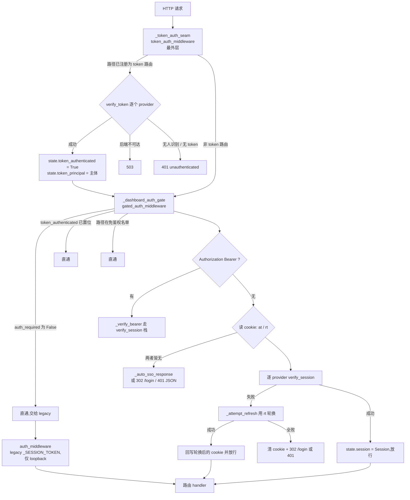
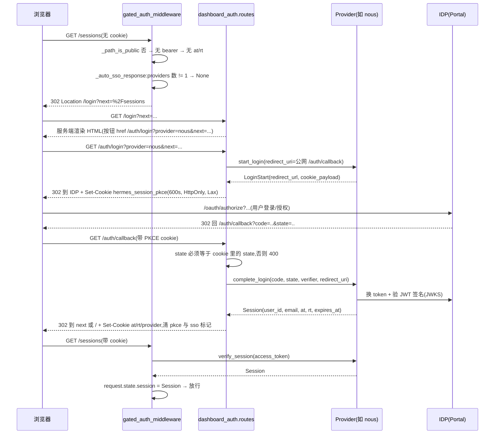

# R8C 底稿 · `hermes_cli/dashboard_auth/` —— dashboard 浏览器管理界面的登录鉴权子系统

> 溯源约定:凡对代码行为的断言,锚点 `路径:行号 @ 863e313` **单独成行、放在代码块之前**,
> 代码块为基线逐字原文。非源码块用 ```text / ```console / ```verify 声明。
> 记号:▲ 文档与代码矛盾;◇ 代码有文档无;■ 代码缺陷;◎ 文档成立但显著保守。

## 0. 本段范围、方法与环境

覆盖 `hermes_cli/dashboard_auth/` 全部 13 个文件 3,901 行,外加为回答问题必须一并读的
`hermes_cli/web_server.py`(鉴权装配处)、`hermes_cli/plugins.py`(插件挂载点)、
`plugins/dashboard_auth/{nous,basic,self_hosted,drain}`(4 个内建 provider)。

```text
__init__.py      48   门面再导出
audit.py         95   审计日志(JSONL,字段脱敏)
base.py         306   provider 契约:3 个 dataclass + 4 个异常 + ABC + 合规断言
cookies.py      338   5 种 cookie 的写/读/清 + __Host-/__Secure- 前缀选择
login_page.py   534   服务端渲染的 /login 页(无 React)
middleware.py   591   鉴权闸门 gated_auth_middleware
native_flow.py  297   RFC 8252 原生应用授权码中转存储(桌面端登录)
prefix.py       232   X-Forwarded-Prefix 归一化 + public_url 解析
public_paths.py  60   免鉴权 /api/* 名单(与 legacy 闸门共用)
registry.py      81   provider 注册表
routes.py       964   /login /auth/* /api/auth/* 全部路由
token_auth.py   194   非交互 bearer token 鉴权缝(service-to-service)
ws_tickets.py   161   WebSocket 升级票据 + 进程内部凭据
```

**实跑测试(行为规格)。** 环境:`/home/user/hermes-venv`,`pip list` 去表头 **87 个包**,
`site-packages/*.dist-info` 同为 87;基线 `git status --porcelain` 跑测试前后均为空
(`test_durations.json` 被 `.gitignore:35` 忽略,不污染基线)。

```console
$ HERMES_PYTHON=/home/user/hermes-venv/bin/python bash scripts/run_tests.sh \
    tests/hermes_cli/test_dashboard_auth_*.py tests/hermes_cli/test_dashboard_token_auth.py
=== Summary: 15 files, 131 tests passed, 0 failed (100% complete) in 6.4s (8 workers) ===

$ ... bash scripts/run_tests.sh tests/plugins/dashboard_auth/
=== Summary: 4 files, 99 tests passed, 0 failed (100% complete) in 2.1s (8 workers) ===

$ ... python -m pytest -q <上述 19 个文件>
230 passed, 2 warnings in 7.56s
```

**合计 230 通过 / 0 失败 / 0 跳过。** 本段范围内没有触发 CLAUDE.md 记录的 5 个容器环境
必然失败用例(那 5 个在 `test_browser_connect_dual_stack` / `test_migrate_xai` /
`test_gateway_service` / `test_approvals_suggest` / `test_xai_provider_labels`,不在本段)。

---

## 1. 全景:一次浏览器请求怎么被认证

### 1.1 闸门什么时候开

整个子系统只在 **`app.state.auth_required is True`** 时生效。这个开关来自绑定地址:

`hermes_cli/web_server.py:472-491 @ 863e313`

```python
def should_require_auth(host: str, allow_public: bool = False) -> bool:
    """Return True iff the dashboard auth gate must be active.

    Truth table:
      host == loopback        → False (no auth — local-only, trusted operator)
      host != loopback        → True  (gate engages — OAuth or password required)

    "Loopback" is 127.0.0.1, localhost, ::1. RFC1918 / CGNAT / link-local are
    deliberately treated as PUBLIC — a hostile device on the same LAN is exactly
    the threat model the gate is designed for.

    ``allow_public`` (the legacy ``--insecure`` escape hatch) NO LONGER disables
    the gate. It is accepted for backward-compat with old launch scripts and
    desktop shells but is ignored: a non-loopback bind ALWAYS requires an auth
    provider (OAuth or the bundled password provider). This closes the
    unauthenticated-public-dashboard hole behind the June 2026 ``hermes-0day``
    MCP-persistence campaign, where ``--insecure --host 0.0.0.0`` left the
    config/MCP/agent surface open to internet scanners.
    """
    return host not in _LOOPBACK_HOST_VALUES
```

要点三条:(a) 局域网地址(192.168/10.x)算 **public**,闸门照样开——威胁模型明确写着
"同一 LAN 上的恶意设备";(b) `--insecure` 已被降级为**空操作**,只打一条 warning;
(c) 闸门开而没有任何 provider 注册时 **fail closed**——`start_server` 直接拒绝启动。

`hermes_cli/web_server.py:17478-17483 @ 863e313`

```python
    if app.state.auth_required:
        # The gate engages on every non-loopback bind. Require at least one
        # provider to be registered, else fail closed — there is no longer an
        # escape hatch that serves the dashboard without authentication.
        from hermes_cli.dashboard_auth import list_providers
        if not list_providers():
```

### 1.2 三层中间件与它们的执行顺序

Starlette 的 `@app.middleware("http")` 是**后注册者在最外层**。三个鉴权中间件按注册顺序是
gate → legacy → token seam,因此**运行顺序正好相反**:



`hermes_cli/web_server.py:644-647 @ 863e313`

```python
@app.middleware("http")
async def _dashboard_auth_gate(request: Request, call_next):
    from hermes_cli.dashboard_auth.middleware import gated_auth_middleware
    return await gated_auth_middleware(request, call_next)
```

`hermes_cli/web_server.py:674-685 @ 863e313`

```python
@app.middleware("http")
async def _token_auth_seam(request: Request, call_next):
    """Outermost auth seam: non-interactive bearer-token auth for opted-in routes.

    Registered LAST so it runs FIRST (Starlette middleware is outermost-last).
    A registered token route is fully owned here — authenticate by token,
    attach the principal + ``token_authenticated`` flag, and let the downstream
    cookie/session gates skip enforcement. Non-token routes pass straight
    through untouched.
    """
    from hermes_cli.dashboard_auth.token_auth import token_auth_middleware
    return await token_auth_middleware(request, call_next)
```

闸门自身的三个提前返回(no-op / token 已认证 / 免鉴权路径):

`hermes_cli/dashboard_auth/middleware.py:332-344 @ 863e313`

```python
    if not getattr(request.app.state, "auth_required", False):
        return await call_next(request)

    # A request already authenticated by the token-auth seam (a service caller
    # on a registered token route) carries ``token_authenticated`` — it is NOT
    # a cookie session and must not be bounced to /login. Pass it through; the
    # seam already attached ``request.state.token_principal``.
    if getattr(request.state, "token_authenticated", False):
        return await call_next(request)

    path = request.url.path
    if _path_is_public(path):
        return await call_next(request)
```

---

## 2. Q1 —— provider 抽象:契约、注册、内建实现、插件挂载

### 2.1 契约:`base.py` 要求实现什么

**必须的类属性 2 个**(`name` 稳定小写标识、`display_name` 登录页展示名):

`hermes_cli/dashboard_auth/base.py:157-158 @ 863e313`

```python
    name: str = ""
    display_name: str = ""
```

**必须实现的抽象方法 5 个**(全部走关键字参数):

`hermes_cli/dashboard_auth/base.py:187-207 @ 863e313`

```python
    @abstractmethod
    def start_login(self, *, redirect_uri: str) -> LoginStart: ...

    @abstractmethod
    def complete_login(
        self,
        *,
        code: str,
        state: str,
        code_verifier: str,
        redirect_uri: str,
    ) -> Session: ...

    @abstractmethod
    def verify_session(self, *, access_token: str) -> Optional[Session]: ...

    @abstractmethod
    def refresh_session(self, *, refresh_token: str) -> Session: ...

    @abstractmethod
    def revoke_session(self, *, refresh_token: str) -> None: ...
```

**三个能力开关**,把"我是哪一种 provider"从类型系统里抽出来变成布尔标志:

`hermes_cli/dashboard_auth/base.py:166 @ 863e313`

```python
    supports_password: bool = False
```

`hermes_cli/dashboard_auth/base.py:178 @ 863e313`

```python
    supports_token: bool = False
```

`hermes_cli/dashboard_auth/base.py:185 @ 863e313`

```python
    supports_session: bool = True
```

**两个可选方法**(默认抛 `NotImplementedError`,"设了开关却不实现 = 大声失败"而不是静默放行):

`hermes_cli/dashboard_auth/base.py:209-211 @ 863e313`

```python
    def complete_password_login(
        self, *, username: str, password: str
    ) -> "Session":
```

`hermes_cli/dashboard_auth/base.py:267-270 @ 863e313`

```python
        raise NotImplementedError(
            f"{type(self).__name__} does not support token auth "
            "(set supports_token = True and override verify_token)"
        )
```

**数据契约 3 个 frozen dataclass。** `Session` 是"已验证的人类身份",8 个字段全部必填,
`access_token` / `refresh_token` 对 Hermes 完全不透明:

`hermes_cli/dashboard_auth/base.py:18-25 @ 863e313`

```python
    user_id: str
    email: str
    display_name: str
    org_id: str
    provider: str
    expires_at: int  # unix seconds; the access_token's exp claim
    access_token: str
    refresh_token: str
```

`TokenPrincipal` 是"已验证的机器调用方",三字段,`scopes` 空元组表示"无 scope 限定":

`hermes_cli/dashboard_auth/base.py:51-53 @ 863e313`

```python
    principal: str
    provider: str
    scopes: tuple[str, ...] = ()
```

`LoginStart` 是 OAuth 第一跳的返回值:浏览器要去的 URL + 要种的短命 cookie:

`hermes_cli/dashboard_auth/base.py:68-69 @ 863e313`

```python
    redirect_url: str
    cookie_payload: dict[str, str]
```

**四个异常构成失败语义。** 这是整个 provider 栈能"多个 provider 叠加"的关键,
每个异常都被中间件翻译成不同的 HTTP 结果:

| 异常 | 语义 | 中间件动作 |
|---|---|---|
| `ProviderError` | IDP 不可达,既不能确认也不能否认 | 记住它,继续问下一个;全败且有人不可达 → **503**,**不清 cookie** |
| `InvalidCodeError` | OAuth code/state 校验失败 | 400 |
| `InvalidCredentialsError` | 用户名密码被拒 | 401,**故意用通用文案**(不做用户名探测预言机) |
| `RefreshExpiredError` | 该 provider 认为 refresh token 已死 | 换下一个 provider;**全部拒绝后**才清 cookie 强制重登 |

`RefreshExpiredError` 的注释把"为什么不能一票否决"讲清楚了——不透明的外来 token
和过期 token 从单个 provider 看长得一样:

`hermes_cli/dashboard_auth/base.py:96-102 @ 863e313`

```python
class RefreshExpiredError(Exception):
    """This provider rejects the refresh token as dead or invalid.

    In a multi-provider deployment this does not prove token ownership, so
    middleware may try remaining providers. It clears cookies and forces
    re-login only after every reachable provider rejects the token.
    """
```

**合规断言** `assert_protocol_compliance` 是给 provider 插件的单元测试用的守门函数,
它检查属性非空 + 方法可调用 + ABC 抽象方法已全部覆盖:

`hermes_cli/dashboard_auth/base.py:283-290 @ 863e313`

```python
    required_methods = (
        "start_login",
        "complete_login",
        "verify_session",
        "refresh_session",
        "revoke_session",
    )
    required_attrs = ("name", "display_name")
```

`hermes_cli/dashboard_auth/base.py:302-306 @ 863e313`

```python
    if getattr(cls, "__abstractmethods__", None):
        raise TypeError(
            f"{cls.__name__} has unimplemented abstract methods: "
            f"{sorted(cls.__abstractmethods__)}"
        )
```

### 2.2 注册与选取:`registry.py`

一个**模块级 dict + 一把 threading.Lock**,就这么简单。没有优先级、没有权重,
"注册顺序"就是"尝试顺序"。

`hermes_cli/dashboard_auth/registry.py:20 @ 863e313`

```python
_providers: dict[str, DashboardAuthProvider] = {}
```

注册时做两件事:先跑合规断言(TypeError),再拒绝重名(ValueError):

`hermes_cli/dashboard_auth/registry.py:30-36 @ 863e313`

```python
    assert_protocol_compliance(type(provider))
    with _lock:
        if provider.name in _providers:
            raise ValueError(
                f"dashboard-auth provider already registered: {provider.name!r}"
            )
        _providers[provider.name] = provider
```

**选取有三个视图**,分别服务三条鉴权路径。注意两个过滤器的默认值不同——
`supports_token` 默认 False(**必须显式开启**),`supports_session` 默认 True
(**老 provider 无需改代码即保持交互式登录能力**):

`hermes_cli/dashboard_auth/registry.py:66 @ 863e313`

```python
        return [p for p in _providers.values() if getattr(p, "supports_token", False)]
```

`hermes_cli/dashboard_auth/registry.py:75 @ 863e313`

```python
        return [p for p in _providers.values() if getattr(p, "supports_session", True)]
```

按名字取单个用于"cookie 里带了 provider 提示"和 `/auth/login?provider=`:

`hermes_cli/dashboard_auth/registry.py:43-47 @ 863e313`

```python
def get_provider(name: str) -> Optional[DashboardAuthProvider]:
    """Return the registered provider for ``name``, or None if unknown."""
    with _lock:
        return _providers.get(name)
```

**provider 提示不是权威的**——闸门只用它做**排序**,不用它做**筛选**。这是个好设计:
cookie 可能比 provider 改名/下线活得更久。

`hermes_cli/dashboard_auth/middleware.py:96-109 @ 863e313`

```python
def _ordered_session_providers(
    provider_hint: str | None,
) -> list[DashboardAuthProvider]:
    """Prefer the hinted provider without making the hint authoritative.

    The cookie can outlive a provider rename/removal or become stale after a
    deployment change. A stable sort moves a matching provider to the front
    while preserving registration order for every remaining candidate; an
    unknown hint therefore leaves the normal scan unchanged.
    """
    providers = list_session_providers()
    if provider_hint:
        providers.sort(key=lambda provider: provider.name != provider_hint)
    return providers
```

### 2.3 `native_flow.py` 是哪一种 provider 的实现?——**它根本不是 provider**

**结论:`native_flow.py` 不实现 `DashboardAuthProvider`,它一个 provider 类都没有。**
它是 **gateway 自己作为"对桌面端的授权服务器"** 时的**服务端状态存储**——
一个进程内的 pending/issued 双 dict,给 RFC 8252(OAuth 2.0 for Native Apps)流程做中转。

搜索面:`grep -n "class .*Provider\|DashboardAuthProvider" hermes_cli/dashboard_auth/native_flow.py`
无匹配;该文件唯一从 `base` 导入的是 `Session` 这个 dataclass。

`hermes_cli/dashboard_auth/native_flow.py:72 @ 863e313`

```python
from hermes_cli.dashboard_auth.base import Session
```

它解决的问题在模块 docstring 里说得很清楚:桌面 app 不能直接当上游 IDP(Nous Portal)的
OAuth 客户端,因为 Portal 的 `client_id` 是**每 gateway 实例一个**,而且校验
`redirect_uri` 必须落在 gateway 自己的公网 origin 的 `/auth/callback` 上——
桌面端的 `127.0.0.1` 回环地址会被拒。于是 **gateway 做中间人**:对桌面端它是授权服务器,
对 Portal 它是 OAuth 客户端。

`hermes_cli/dashboard_auth/native_flow.py:5-10 @ 863e313`

```python
cookies**. It cannot be a direct OAuth client of the upstream IDP (Nous
Portal): the Portal ``client_id`` is per-gateway-instance
(``agent:{instance_id}``) and the Portal validates that the ``redirect_uri``
ends in ``/auth/callback`` on the gateway's own public origin — a desktop
loopback ``127.0.0.1`` redirect is rejected. So the **gateway brokers** the
flow: it is the authorization server *to the desktop*, and an OAuth client *to
```

四步握手对应四个函数:

| 函数 | 时机 | 关键约束 |
|---|---|---|
| `register_pending` | `GET /auth/native/authorize` | 存桌面端的 `cc_d`/`redirect_uri`/`state`,返回不透明 `broker_state`;TTL 600s;全局 256 条上限;**每 IP 8 条上限**(公开预鉴权路由,防单机灌满) |
| `get_pending` | `/auth/callback` 只读窥视 | 拿桌面端的 `redirect_uri` + `client_state` 拼最终 302 |
| `complete_pending` | `/auth/callback` 完成上游登录后 | **pop**(单次),铸一次性 `gw_code` 绑定 `cc_d` + 已验证 `Session`;TTL 120s |
| `redeem_code` | `POST /auth/native/token` | **先 pop 再校验 PKCE**,任何失败路径 code 都已消耗 |

`hermes_cli/dashboard_auth/native_flow.py:76-92 @ 863e313`

```python
_PENDING_TTL_SECONDS = 600  # 10 minutes — mirrors the PKCE cookie lifetime.

# TTL for a minted gateway code (step 3→4): only the loopback redirect + the
# desktop's immediate token POST, which is sub-second in practice.
_CODE_TTL_SECONDS = 120  # 2 minutes — generous for a slow local hop.

# Cap the number of concurrent pending/issued entries so a misbehaving or
# malicious client cannot grow the store unbounded. Well above any legitimate
# concurrent-login count for a single desktop user.
_MAX_ENTRIES = 256

# Per-IP cap on concurrent PENDING authorizations. /auth/native/authorize is a
# public (pre-auth) route, so without this a single unauthenticated spammer
# could fill the global store (600s TTL each) and lock out legitimate native
# logins for the pending window. A real desktop runs at most a couple of
# concurrent sign-ins from one address; 8 is generous.
_MAX_PENDING_PER_IP = 8
```

"先 pop 再校验"这一手很值得学——它同时消灭了重放和 verifier 预言机:

`hermes_cli/dashboard_auth/native_flow.py:276-290 @ 863e313`

```python
    now = int(time.time()) if now is None else now
    with _lock:
        _gc_locked(now)
        issued = _issued.pop(code, None)
    # Pop happened under the lock; every return path below has already
    # consumed the code, so a replay (valid or not) finds nothing.
    if issued is None:
        raise CodeInvalid("unknown, expired, or already-redeemed code")
    if issued.expires_at < now:
        raise CodeInvalid("code expired")
    expected = issued.code_challenge
    actual = _s256(code_verifier)
    if not hmac.compare_digest(expected, actual):
        raise CodeInvalid("PKCE verification failed")
    return issued.session
```

桌面端回环地址的校验是**安全边界而非人体工学**——只接受 IP 字面量,
明确拒绝 `localhost`(可被 hosts 文件/恶意解析器指向非回环):

`hermes_cli/dashboard_auth/routes.py:277-286 @ 863e313`

```python
    host = (parsed.hostname or "").lower()
    if host not in ("127.0.0.1", "::1"):
        raise HTTPException(
            status_code=400,
            detail=(
                "native redirect_uri host must be a loopback IP literal "
                "(127.0.0.1 / ::1)"
            ),
        )
    return raw
```

### 2.4 内建 provider 有几个、插件怎么加

**4 个内建**,全部以**捆绑插件**形态存在于 `plugins/dashboard_auth/`(不在 dashboard_auth 包内):

| 目录 | 类 | name | 能力标志 | 行数 |
|---|---|---|---|---|
| `nous/` | `NousDashboardAuthProvider` | `nous` | 默认(session-only,OAuth+PKCE) | 671 |
| `self_hosted/` | `SelfHostedOIDCProvider` | `self-hosted` | 默认(session-only,通用 OIDC) | 862 |
| `basic/` | `BasicAuthProvider` | `basic` | `supports_password = True` | 491 |
| `drain/` | `DrainSecretProvider` | `drain-secret` | `supports_token = True` + `supports_session = False` | 291 |

`plugins/dashboard_auth/drain/__init__.py:143-146 @ 863e313`

```python
    name = "drain-secret"
    display_name = "Drain Control (service credential)"
    supports_token = True
    supports_session = False
```

`plugins/dashboard_auth/basic/__init__.py:204-206 @ 863e313`

```python
    name = "basic"
    display_name = "Username & Password"
    supports_password = True
```

**插件挂载点是 `ctx.register_dashboard_auth_provider`**,与 `web_server.py` 的 dashboard-plugin
(前端皮肤/JS 插件)系统**完全解耦**——它挂在 **Python 插件上下文** `hermes_cli/plugins.py`
的 `PluginContext` 上,和 `register_image_gen_provider` 同一族:

`hermes_cli/plugins.py:697-703 @ 863e313`

```python
    def register_dashboard_auth_provider(self, provider) -> None:
        """Register a dashboard authentication provider.

        ``provider`` must be an instance of
        :class:`hermes_cli.dashboard_auth.DashboardAuthProvider`. Used by
        the dashboard OAuth auth gate, which engages when the dashboard
        binds to a non-loopback host without ``--insecure``.
```

**坏插件不能弄崩宿主**——类型错/重名一律降级为 WARNING 日志:

`hermes_cli/plugins.py:714-728 @ 863e313`

```python
        if not isinstance(provider, DashboardAuthProvider):
            logger.warning(
                "Plugin '%s' tried to register a dashboard-auth provider "
                "that does not inherit from DashboardAuthProvider. Ignoring.",
                self.manifest.name,
            )
            return
        try:
            register_provider(provider)
        except (TypeError, ValueError) as e:
            logger.warning(
                "Plugin '%s' failed to register dashboard-auth provider "
                "%r: %s",
                self.manifest.name, getattr(provider, "name", "?"), e,
            )
```

与 `web_server.py` 的 dashboard-plugin 系统(`/api/dashboard/plugins`、
`_get_dashboard_plugins()`、`/api/plugins/{name}/...` 路由挂载)**没有耦合**:
搜索面 = `grep -rn "register_dashboard_auth_provider" --include=*.py --include=*.ts .`,
命中只在 `hermes_cli/plugins.py`、`hermes_cli/dashboard_auth/__init__.py` 的 docstring、
以及 tests 与 4 个 provider 插件里;`web_server.py` **零命中**。两套"插件"共享的只有
`plugins/` 目录与 enable/disable 名单,鉴权 provider 不经过前端插件清单。

---

## 3. Q2 —— 一次登录的完整走法与 cookie 逐项取证

### 3.1 未认证请求怎么被拦下

闸门在 cookie 全无时,**先尝试静默 SSO**,再退回 `/login`:

`hermes_cli/dashboard_auth/middleware.py:375-388 @ 863e313`

```python
    at, _rt = read_session_cookies(request)
    provider_hint = read_session_provider(request)
    if not at and not _rt:
        # Neither token present — no session at all. Nothing to verify or
        # refresh. Before falling back to the /login interstitial, try to
        # silently bounce the user through the portal OAuth flow: the portal
        # auto-approves org members and 302s straight back when they already
        # hold a portal session, so the interstitial click is pure friction
        # for the common case. The one-shot loop-guard inside _auto_sso_response
        # prevents a ping-pong when the portal genuinely has no session.
        auto = _auto_sso_response(request)
        if auto is not None:
            return auto
        return _unauth_response(request, reason="no_cookie")
```

自动 SSO 的四个前置条件(任一不满足就退回 `/login`):非 `/api/*`、无一次性防环 cookie、
**恰好 1 个** session provider、且该 provider 不是密码型:

`hermes_cli/dashboard_auth/middleware.py:193-217 @ 863e313`

```python
    path = request.url.path
    # APIs never auto-redirect (see _unauth_response). Only document loads.
    if path.startswith("/api/"):
        return None

    # Already bounced once and still no session → portal has no session for
    # this user. Stop here, clear the marker, let /login render.
    if read_sso_attempt_cookie(request):
        from hermes_cli.dashboard_auth.prefix import prefix_from_request
        resp = _unauth_response(request, reason="no_cookie")
        clear_sso_attempt_cookie(resp, prefix=prefix_from_request(request))
        return resp

    # list_session_providers() already filters on supports_session=True, so
    # token-only credentials (drain/service providers) are never candidates.
    providers = list_session_providers()
    if len(providers) != 1:
        # Zero → nothing to redirect to. Two+ → user must choose at /login.
        return None

    from hermes_cli.dashboard_auth.prefix import prefix_from_request

    provider = providers[0]
    if getattr(provider, "supports_password", False):
        return None
```

**HTML 走 302,`/api/*` 走 401 JSON**——这条分叉的理由写得很到位:fetch() 会**不透明地**
跟随 302 进入跨域 OAuth 舞蹈,所以 API 永远不给重定向,而是给 SPA 一个结构化信封:

`hermes_cli/dashboard_auth/middleware.py:144-163 @ 863e313`

```python
    if path.startswith("/api/"):
        # API routes never get redirects: the browser fetch() API would
        # follow a 302 into the cross-origin OAuth dance opaquely. Return
        # 401 with a structured envelope so the SPA can full-page-navigate
        # to login_url.
        error_code = (
            "session_expired"
            if reason == "invalid_or_expired_session"
            else "unauthenticated"
        )
        return JSONResponse(
            {
                "error": error_code,
                "detail": "Unauthorized",
                "reason": reason,
                "login_url": login_url,
            },
            status_code=401,
        )
    return RedirectResponse(url=login_url, status_code=302)
```

`next=` 的开放重定向防护(两处,闸门一次、路由一次,防御纵深):

`hermes_cli/dashboard_auth/middleware.py:253-262 @ 863e313`

```python
    # Reject anything that doesn't start with "/" or starts with "//"
    # (protocol-relative URL — would open-redirect to an attacker host).
    if not path or not path.startswith("/") or path.startswith("//"):
        return ""
    # Don't redirect back to the auth routes themselves — that loops.
    if any(
        path == p or path.startswith(p)
        for p in ("/login", "/auth/", "/api/auth/")
    ):
        return ""
```

`hermes_cli/dashboard_auth/routes.py:571-592 @ 863e313`

```python
    if not raw:
        return ""
    from urllib.parse import unquote
    decoded = unquote(raw)
    if not decoded.startswith("/") or decoded.startswith("//"):
        return ""
    # Don't loop back to login pages or auth flow.
    if any(
        decoded == p or decoded.startswith(p)
        for p in ("/login", "/auth/", "/api/auth/")
    ):
        return ""
    # Reject any ``/api/*`` target. The gate's ``_safe_next_target``
    # already filters these out before they reach the cookie, but a
    # malicious or stale ``next=`` value that re-enters via the
    # callback URL must not be honoured: a successful redirect to an
    # API endpoint renders raw JSON in the browser address bar — never
    # a useful post-login destination, and indistinguishable from an
    # attacker trying to weaponise the redirect.
    if decoded == "/api" or decoded.startswith("/api/"):
        return ""
    return decoded
```

### 3.2 登录页 → 提交凭据 → 签发 → 种 cookie

**`/login` 是服务端渲染的纯 HTML**,不加载 React bundle,也不依赖注入的 session token:

`hermes_cli/dashboard_auth/routes.py:132-144 @ 863e313`

```python
@router.get("/login", name="login_page")
async def login_page(request: Request) -> HTMLResponse:
    # Read the ``next=`` query the gate's ``_unauth_response`` set on
    # the redirect URL. Validate against the same same-origin rules the
    # callback applies (defence in depth — the gate already filters,
    # but /login is reachable directly too).
    next_path = _validate_post_login_target(
        request.query_params.get("next", "")
    )
    return HTMLResponse(
        render_login_html(next_path=next_path),
        headers={"Cache-Control": "no-store, no-cache, must-revalidate"},
    )
```

页面只列 `supports_session` 的 provider;**零 provider 时给一张"无法登录"的说明页**
(而不是空按钮列表):

`hermes_cli/dashboard_auth/login_page.py:468-470 @ 863e313`

```python
    providers = list_session_providers()
    if not providers:
        return _EMPTY_HTML
```

OAuth provider 渲染成 `<a>` 跳 `/auth/login?provider=`,密码 provider 渲染成表单
(并触发一段内联 JS;OAuth-only 时页面保持零 JS):

`hermes_cli/dashboard_auth/login_page.py:484-494 @ 863e313`

```python
    for p in providers:
        if getattr(p, "supports_password", False):
            needs_password_script = True
            buttons.append(_render_password_form(p, next_path))
        else:
            buttons.append(
                f'      <a class="provider-btn" '
                f'href="/auth/login?provider={html.escape(p.name, quote=True)}{next_qs}">'
                f'Sign in with {html.escape(p.display_name)}</a>'
            )
    script = _PASSWORD_FORM_SCRIPT if needs_password_script else ""
```

provider 的 `name` / `display_name` 都过了 `html.escape`,恶意 provider 名不能 XSS。

**两条签发路径**:

**(A) OAuth 路径** `/auth/login` → IDP → `/auth/callback`。`/auth/login` 把
`provider=` 和(校验过的)`next=` 打包进 PKCE cookie 带过整个来回——因为真实 IDP
回调只会回带 `code` + `state`,查询串通道会丢值:

`hermes_cli/dashboard_auth/routes.py:228-244 @ 863e313`

```python
    pkce = ls.cookie_payload.get("hermes_session_pkce", "")
    if "provider=" not in pkce:
        pkce = f"provider={provider};{pkce}" if pkce else f"provider={provider}"
    # Carry ``next=`` through the round trip in the PKCE cookie. Real
    # IDPs only echo back ``code`` + ``state`` on the callback URL, so
    # query-string transport would lose the value — the cookie is the
    # only server-controlled channel that survives. Validate before we
    # store it so an attacker who reaches /auth/login directly with
    # ``next=//evil.example`` can't poison the cookie.
    safe_next = _validate_post_login_target(next)
    if safe_next:
        from urllib.parse import quote
        pkce = f"{pkce};next={quote(safe_next, safe='')}"
    set_pkce_cookie(
        resp, payload=pkce, use_https=detect_https(request),
        prefix=_prefix(request),
    )
```

回调端 CSRF 检查 = URL 里的 `state` 必须等于 PKCE cookie 里的 `state`;
且 **`next=` 只从 cookie 读,URL 上的 `next=` 一律忽略**(它是攻击者可控的):

`hermes_cli/dashboard_auth/routes.py:409-413 @ 863e313`

```python
    # Read next= from the cookie ONLY. The IDP doesn't echo next= back
    # on the callback URL (it only carries ``code`` + ``state``), so any
    # next= query parameter on the callback URL is attacker-controlled
    # and MUST be ignored.
    next_from_cookie = parts.get("next", "")
```

`hermes_cli/dashboard_auth/routes.py:440-450 @ 863e313`

```python
    if not state or state != expected_state:
        audit_log(
            AuditEvent.LOGIN_FAILURE,
            provider=provider_name,
            reason="state_mismatch",
            ip=_client_ip(request),
        )
        raise HTTPException(
            status_code=400,
            detail="OAuth state mismatch (CSRF check failed)",
        )
```

成功后:算出 AT 存活秒数(下限 60s 抗时钟偏移)→ 302 到 landing → 种 session cookie →
清 PKCE / SSO 标记:

`hermes_cli/dashboard_auth/routes.py:543-558 @ 863e313`

```python
    landing = _validate_post_login_target(next_from_cookie) or "/"
    resp = RedirectResponse(url=landing, status_code=302)
    set_session_cookies(
        resp,
        access_token=session.access_token,
        refresh_token=session.refresh_token,
        access_token_expires_in=expires_in,
        use_https=detect_https(request),
        prefix=_prefix(request),
        provider=session.provider,
    )
    clear_pkce_cookie(resp, prefix=_prefix(request))
    # Clear the one-shot auto-SSO loop-guard marker now that login succeeded,
    # so it never lingers to suppress a future silent attempt after logout.
    clear_sso_attempt_cookie(resp, prefix=_prefix(request))
    return resp
```

**(B) 密码路径** `POST /auth/password-login`。它返回 **JSON 而不是 302**,因为表单是
fetch 提交的,302 会被 fetch 不透明地跟随:

`hermes_cli/dashboard_auth/routes.py:727-738 @ 863e313`

```python
    expires_in = max(60, session.expires_at - int(time.time()))
    landing = _validate_post_login_target(body.next) or "/"
    resp = JSONResponse({"ok": True, "next": landing})
    set_session_cookies(
        resp,
        access_token=session.access_token,
        refresh_token=session.refresh_token,
        access_token_expires_in=expires_in,
        use_https=detect_https(request),
        prefix=_prefix(request),
        provider=session.provider,
    )
```

密码路径独有一层**进程内滑动窗口限速**(每 IP 60 秒 10 次),因为这是唯一"我方持有可猜密钥"的端点:

`hermes_cli/dashboard_auth/routes.py:609-612 @ 863e313`

```python
_PW_RATE_MAX_ATTEMPTS = 10
_PW_RATE_WINDOW_SEC = 60.0
_pw_attempts: Dict[str, Deque[float]] = defaultdict(deque)
_pw_attempts_lock = threading.Lock()
```

失败语义全部"故意通用"——未知 provider 与"provider 不支持密码"同为 404,
未知用户与错密码同为 401,防止端点变成枚举预言机:

`hermes_cli/dashboard_auth/routes.py:680-690 @ 863e313`

```python
    p = get_provider(body.provider)
    if p is None or not getattr(p, "supports_password", False):
        # Don't leak which providers exist or which support passwords —
        # same 404 whether the provider is unknown or OAuth-only.
        audit_log(
            AuditEvent.LOGIN_FAILURE,
            provider=body.provider,
            reason="unknown_password_provider",
            ip=ip,
        )
        raise HTTPException(status_code=404, detail="Unknown provider")
```

### 3.3 cookie 逐项取证

**共 5 种 cookie**(不是文档说的 3 种):

`hermes_cli/dashboard_auth/cookies.py:67-73 @ 863e313`

```python
SESSION_AT_COOKIE = "hermes_session_at"
SESSION_RT_COOKIE = "hermes_session_rt"
# Provider that minted the session. This non-secret routing hint prevents a
# refresh token from being handed to the wrong provider when several dashboard
# auth plugins are enabled (for example Basic + Nous OAuth).
SESSION_PROVIDER_COOKIE = "hermes_session_provider"
PKCE_COOKIE = "hermes_session_pkce"
```

`hermes_cli/dashboard_auth/cookies.py:82 @ 863e313`

```python
SSO_ATTEMPT_COOKIE = "hermes_sso_attempt"
```

**公共属性由一个函数集中决定**——所有 cookie 都是 `HttpOnly` + `SameSite=Lax`,
`Path` 跟随反代前缀,`Secure` **仅在 HTTPS 时**加:

`hermes_cli/dashboard_auth/cookies.py:137-145 @ 863e313`

```python
def _common_attrs(*, use_https: bool, prefix: str) -> dict:
    attrs: dict = {
        "httponly": True,
        "samesite": "lax",
        "path": _cookie_path(prefix),
    }
    if use_https:
        attrs["secure"] = True
    return attrs
```

**逐项判定表**(TTL 常量见下方引用,属性经实跑核对):

| cookie | 内容 | HttpOnly | Secure | SameSite | Max-Age | 签名/加密 |
|---|---|---|---|---|---|---|
| `hermes_session_at` | provider 的 access token 原文 | ✅ | 仅 HTTPS | Lax | `access_token_expires_in`(Portal ≈15min,下限 60s) | ❌ **无**,完整性由 provider 的 `verify_session` 保证(如 JWT 签名) |
| `hermes_session_rt` | provider 的 refresh token 原文 | ✅ | 仅 HTTPS | Lax | **30 天** | ❌ 无 |
| `hermes_session_provider` | provider 名(非机密路由提示) | ✅ | 仅 HTTPS | Lax | 30 天 | ❌ 无 |
| `hermes_session_pkce` | `provider=;state=;verifier=;next=;broker=` | ✅ | 仅 HTTPS | Lax | **600s** | ❌ 无(短命 + state 比对即 CSRF 防护) |
| `hermes_sso_attempt` | 常量 `"1"`,布尔面包屑 | ✅ | 仅 HTTPS | Lax | **60s** | 无内容 |

`hermes_cli/dashboard_auth/cookies.py:89-104 @ 863e313`

```python
# RT cookie Max-Age. Kept at 30 days as a generous upper bound on the cookie's
# browser lifetime; Portal's actual refresh-token TTL (24h, rotating) is the
# real authority — once the RT itself expires/rotates out, a refresh attempt
# returns 400 → RefreshExpiredError → clean re-login, regardless of how long
# the cookie lingers. (Not tightened to 24h here to avoid coupling the cookie
# lifetime to a server-side TTL that can change independently; revisit if the
# stale-cookie refresh churn ever matters.)
_RT_MAX_AGE = 30 * 24 * 60 * 60
_PKCE_MAX_AGE = 10 * 60
# Auto-SSO loop-guard marker TTL. Just long enough to cover one redirect
# round trip to the portal and back (a few seconds in practice); kept at 60s
# so a slow portal hop or a manual back-button still trips the guard, while a
# user returning minutes later gets a fresh silent attempt rather than being
# stuck on /login forever. The marker is also cleared explicitly on a
# successful callback and whenever the gate falls back to /login.
_SSO_ATTEMPT_MAX_AGE = 60
```

**Hermes 自己不对 cookie 做任何签名或加密**。这是刻意的:token 对 Hermes 完全不透明,
真正的完整性来自 provider——例如 nous provider 用 Portal 的 JWKS 验 JWT 签名。
取舍:少一层密钥管理,代价是 cookie 值就是 bearer token 本身,**泄露即等于会话被夺**。

**实跑取证**(直接读 `Set-Cookie` 原始头,四种部署形态):

```console
--- session cookies https=False prefix=''
    hermes_session_at=AT; HttpOnly; Max-Age=900; Path=/; SameSite=lax
    hermes_session_rt=RT; HttpOnly; Max-Age=2592000; Path=/; SameSite=lax
    hermes_session_provider=stub; HttpOnly; Max-Age=2592000; Path=/; SameSite=lax
--- session cookies https=True prefix=''
    __Host-hermes_session_at=AT; HttpOnly; Max-Age=900; Path=/; SameSite=lax; Secure
    __Host-hermes_session_rt=RT; HttpOnly; Max-Age=2592000; Path=/; SameSite=lax; Secure
    __Host-hermes_session_provider=stub; HttpOnly; Max-Age=2592000; Path=/; SameSite=lax; Secure
--- session cookies https=True prefix='/hermes'
    __Secure-hermes_session_at=AT; HttpOnly; Max-Age=900; Path=/hermes; SameSite=lax; Secure
--- session cookies https=False prefix='/hermes'
    hermes_session_at=AT; HttpOnly; Max-Age=900; Path=/hermes; SameSite=lax
--- pkce https
    __Host-hermes_session_pkce="provider=stub\073state=s\073verifier=v"; HttpOnly; Max-Age=600; Path=/; SameSite=lax; Secure
--- sso attempt https
    __Host-hermes_sso_attempt=1; HttpOnly; Max-Age=60; Path=/; SameSite=lax; Secure
--- empty RT + empty provider(只写 AT,不留空值 cookie)
    __Host-hermes_session_at=AT; HttpOnly; Max-Age=900; Path=/; SameSite=lax; Secure
```

### 3.4 **http 明文局域网访问时 `Secure` 怎么处理**(重点问题)

**答:`Secure` 直接不加,而且 cookie 名退回裸名(丢掉 `__Host-` / `__Secure-` 硬化)。**
判定只看一处:

`hermes_cli/dashboard_auth/cookies.py:330-338 @ 863e313`

```python
def detect_https(request: Request) -> bool:
    """Decide whether to set the ``Secure`` cookie flag.

    Reads ``request.url.scheme`` — under uvicorn's ``proxy_headers=True``
    (which start_server enables when the gate is active), this honours
    ``X-Forwarded-Proto`` from Fly's TLS terminator. Loopback traffic is
    always HTTP so this returns False there.
    """
    return request.url.scheme == "https"
```

`hermes_cli/dashboard_auth/cookies.py:107-119 @ 863e313`

```python
def _resolved_name(bare: str, *, use_https: bool, prefix: str) -> str:
    """Pick the cookie-prefix variant for the active request shape.

    See module docstring for the prefix selection rules. Mismatch
    between setter and reader would silently break sessions, so this
    function is the single source of truth for naming.
    """
    if not use_https:
        return bare
    if prefix:
        # Path != "/" forbids __Host-; fall back to __Secure-.
        return f"__Secure-{bare}"
    return f"__Host-{bare}"
```

**理由是硬约束,不是偷懒**:`Secure` cookie 在 http 上根本不会被浏览器回传,
`__Host-` / `__Secure-` 前缀又**规范上要求 Secure**。所以"http 下加 Secure"= 登录直接不可用。

**取舍与后果(明确写下来,这是设计蓝图要交代的):**

1. `http://192.168.x.x:9119` 这类典型 LAN 部署下,鉴权闸门**照常开**(见 §1.1,RFC1918 算 public),
   但 **session cookie 明文过网**——同网段嗅探即可窃取会话;`__Host-` 的"绑定精确 origin"保护也没了。
2. 上游 TLS 终结的场景靠 `X-Forwarded-Proto`,而这条路要求 uvicorn `proxy_headers=True`;
   代码里这个开关**与闸门绑定**:`proxy_headers=bool(app.state.auth_required)`
   (`hermes_cli/web_server.py:17606`)。也就是说**只在闸门开时才信任代理头**——
   loopback 模式不信任,避免本地进程伪造 `X-Forwarded-Proto`。
3. 官方文档自己承认这是操作员脚枪(见 §9 的 ◎ 项)。**可迁移原则**:
   "要不要 Secure"必须由**实际传输层**决定,不能由配置项声明,否则一个错配就静默关掉全部 cookie 保护。

**读 cookie 时三种名字都试**,顺序 `__Host-` → `__Secure-` → 裸名:

`hermes_cli/dashboard_auth/cookies.py:270-274 @ 863e313`

```python
    for variant in _NAME_VARIANTS:
        value = request.cookies.get(f"{variant}{bare_name}")
        if value is not None:
            return value
    return None
```

◇ **顺序即优先级**:HTTPS 部署下若攻击者(同站子域/中间人)注入一个**裸名**
`hermes_session_at`,只要用户已有 `__Host-` 会话就永远赢——真会话优先。
但用户**尚无**会话时,注入的裸名 cookie 会被采信,构成"登录 CSRF / 会话固定"形状
(受害者被登进攻击者账号)。缓解:攻击者必须提供一个**能通过 `verify_session` 的真 token**,
且 SameSite=Lax 挡住跨站 POST;影响限于"用户以为自己在自己账号里"。

**清 cookie 时把三种名字全清**,因为服务端不知道当初是哪种形态写的:

`hermes_cli/dashboard_auth/cookies.py:224-233 @ 863e313`

```python
    path = _cookie_path(prefix)
    for variant in _NAME_VARIANTS:
        response.set_cookie(
            f"{variant}{SESSION_AT_COOKIE}", "", max_age=0,
            path=path, httponly=True, samesite="lax",
        )
        response.set_cookie(
            f"{variant}{SESSION_RT_COOKIE}", "", max_age=0,
            path=path, httponly=True, samesite="lax",
        )
```

### 3.5 透明续期:AT 过期不等于重登

这是整个 cookie 设计里最容易读错的一段。AT cookie 的 `Max-Age` = token TTL,
**浏览器在 token 失效那一刻就把 cookie 驱逐了**,此后只发 RT cookie。
所以"没有 at 只有 rt"是**常态**而非边界情况:

`hermes_cli/dashboard_auth/middleware.py:395-405 @ 863e313`

```python
    # When the access-token cookie is absent but a refresh-token cookie is
    # present, skip verification and go straight to the refresh path below.
    # This is the COMMON expiry case, not an edge case: the access-token
    # cookie is set with ``Max-Age = access_token_expires_in`` (~15 min), so
    # the browser EVICTS it the moment the token lapses, while the
    # refresh-token cookie lives for 30 days. From that point the browser
    # sends only ``hermes_session_rt``. If we bailed on ``not at`` here we'd
    # bounce the user to /login on every expiry despite holding a perfectly
    # good refresh token — defeating the whole transparent-refresh feature.
    session = None
    if at:
```

续期成功后**必须回写轮换后的 RT**,否则下次会用旧 RT 触发 Portal 的重放检测、
把整条会话吊销:

`hermes_cli/dashboard_auth/middleware.py:470-493 @ 863e313`

```python
        if refreshed is not None:
            new_session, refreshing_provider = refreshed
            request.state.session = new_session
            response = await call_next(request)
            # Persist the ROTATED tokens. Portal rotates the refresh token on
            # every refresh and runs reuse-detection, so writing the new RT
            # back is mandatory: a stale RT cookie would replay a rotated
            # token on the next refresh and (outside Portal's grace) revoke
            # the whole session. Bind cookie Secure/Path to the request shape.
            from hermes_cli.dashboard_auth.cookies import (
                detect_https,
                set_session_cookies,
            )
            from hermes_cli.dashboard_auth.prefix import prefix_from_request

            set_session_cookies(
                response,
                access_token=new_session.access_token,
                refresh_token=new_session.refresh_token,
                access_token_expires_in=_expires_in_seconds(new_session),
                use_https=detect_https(request),
                prefix=prefix_from_request(request),
                provider=refreshing_provider,
            )
```

"不可达 ≠ 凭证错"贯穿两层:verify 与 refresh 都记住不可达的 provider,
全败且有人不可达时返回 **503 且不清 cookie**:

`hermes_cli/dashboard_auth/middleware.py:589-591 @ 863e313`

```python
    if unavailable_provider is not None:
        raise ProviderError(unavailable_provider)
    return None
```

### 3.6 登出

`POST /auth/logout`(POST + SameSite=Lax ⇒ 跨站不会被 CSRF 触发),对**所有** provider
best-effort 撤销,任何异常只记 WARNING:

`hermes_cli/dashboard_auth/routes.py:744-756 @ 863e313`

```python
    _at, rt = read_session_cookies(request)
    if rt:
        # Best-effort revoke. Try every provider so a session minted by
        # any registered provider is revoked correctly. Failures are
        # logged but never raised.
        for provider in list_providers():
            try:
                provider.revoke_session(refresh_token=rt)
            except Exception as e:  # noqa: BLE001 — best-effort
                _log.warning(
                    "dashboard-auth: revoke on %r failed: %s",
                    provider.name, e,
                )
```

◇ 这里用的是 `list_providers()`(全部),不是 `list_session_providers()`——
连 token-only 的 drain provider 也会被喂一次 RT。drain 的 `revoke_session` 是
`NotImplementedError`,被 `except Exception` 吞掉,无害但属于多余调用。

---

## 4. Q3 —— `ws_tickets.py`:WebSocket 的票据

### 4.1 为什么需要票据

浏览器**无法在 WebSocket 升级请求上设置 `Authorization` 头**。loopback 模式下靠
`?token=<_SESSION_TOKEN>`(token 被注入进 SPA bundle);闸门模式下 SPA **拿不到**任何注入 token
(见 §6.3),所以必须另造一种能放进 query string 的凭证。

`hermes_cli/dashboard_auth/ws_tickets.py:1-11 @ 863e313`

```python
"""WS-upgrade auth credentials for gated mode.

Browsers cannot set ``Authorization`` on a WebSocket upgrade. In loopback
mode the legacy ``?token=<_SESSION_TOKEN>`` query param works because the
token is injected into the SPA bundle. In gated mode there is no injected
token — so this module provides two credential shapes:

1. **Single-use browser tickets** (``mint_ticket`` / ``consume_ticket``).
   The SPA gets a fresh ticket via the authenticated REST endpoint
   ``POST /api/auth/ws-ticket`` and passes it as ``?ticket=`` on the WS
   upgrade. Single-use, TTL = 30 seconds — a leaked ticket is uninteresting.
```

### 4.2 签发:必须先有 cookie 会话

**票据与 cookie 的关系 = 票据是 cookie 会话的一次性投影。** 签发端点本身受闸门保护,
handler 里再防御性复查 `request.state.session`:

`hermes_cli/dashboard_auth/routes.py:812-828 @ 863e313`

```python
    sess = getattr(request.state, "session", None)
    if sess is None:
        # Middleware should already have rejected, but check defensively.
        raise HTTPException(status_code=401, detail="Unauthorized")

    # Import here so the routes module stays usable in test contexts that
    # don't load the ticket store.
    from hermes_cli.dashboard_auth.ws_tickets import TTL_SECONDS, mint_ticket

    ticket = mint_ticket(user_id=sess.user_id, provider=sess.provider)
    audit_log(
        AuditEvent.WS_TICKET_MINTED,
        provider=sess.provider,
        user_id=sess.user_id,
        ip=_client_ip(request),
    )
    return {"ticket": ticket, "ttl_seconds": TTL_SECONDS}
```

熵与 TTL:`secrets.token_urlsafe(32)`(256 bit)、**30 秒**:

`hermes_cli/dashboard_auth/ws_tickets.py:39-45 @ 863e313`

```python
#: Time-to-live for newly-minted tickets in seconds. 30 s is long enough
#: that the SPA can call ``getWsTicket()`` and immediately open the WS,
#: short enough that a leaked ticket is uninteresting.
TTL_SECONDS = 30

_lock = threading.Lock()
_tickets: Dict[str, Tuple[int, Dict[str, Any]]] = {}  # ticket -> (expires_at, info)
```

`hermes_cli/dashboard_auth/ws_tickets.py:69-78 @ 863e313`

```python
    ticket = secrets.token_urlsafe(32)
    info = {
        "user_id": user_id,
        "provider": provider,
        "minted_at": int(time.time()),
    }
    with _lock:
        _tickets[ticket] = (int(time.time()) + TTL_SECONDS, info)
        _gc_expired_locked()
    return ticket
```

### 4.3 能否重放:**不能**(pop 即消费)

`hermes_cli/dashboard_auth/ws_tickets.py:88-99 @ 863e313`

```python
    now = int(time.time())
    with _lock:
        entry = _tickets.pop(ticket, None)
        if entry is None:
            # Truncate ticket value in the error so misuse never logs the
            # secret in full.
            truncated = (ticket[:8] + "…") if ticket else "<empty>"
            raise TicketInvalid(f"unknown ticket: {truncated}")
        expires_at, info = entry
        if expires_at < now:
            raise TicketInvalid("expired")
        return info
```

注意"过期票据也被 pop 了"——过期分支在 pop 之后,所以过期票据同样只能被试一次。
配套测试 `test_dashboard_auth_ws_auth.py::test_consumed_ticket_rejected` 是这条的行为规格。

### 4.4 第二种凭证:进程终身内部凭据

服务器**自己 spawn 的 WS 客户端**(嵌入式 TUI 的 PTY 子进程,要连 `/api/ws` 和 `/api/pub`)
不适合 30 秒一次性票据——它启动时读一次 URL 就**每次重连都复用**,冷启动可能超过 30s。

`hermes_cli/dashboard_auth/ws_tickets.py:110-126 @ 863e313`

```python
def internal_ws_credential() -> str:
    """Return the process-lifetime internal WS credential, minting it once.

    Used by the server to authenticate WS clients it spawns itself (the
    embedded-TUI PTY child). The value is stable for the life of the process,
    multi-use, and never expires — so a server-spawned child can reconnect
    its ``/api/ws`` / ``/api/pub`` sockets indefinitely without re-minting.

    The credential is never injected into the SPA HTML or returned over any
    REST endpoint; it is only ever passed to a child process via its
    environment. See the module docstring for the threat-model rationale.
    """
    global _internal_credential
    with _lock:
        if _internal_credential is None:
            _internal_credential = secrets.token_urlsafe(32)
        return _internal_credential
```

它用 `secrets.compare_digest` 常数时间比较,且"没铸过就一律拒绝"(不会因 `None == None` 放行):

`hermes_cli/dashboard_auth/ws_tickets.py:144-153 @ 863e313`

```python
    with _lock:
        expected = _internal_credential
    if not value or expected is None:
        raise TicketInvalid("no internal credential")
    if not secrets.compare_digest(value.encode(), expected.encode()):
        raise TicketInvalid("internal credential mismatch")
    return {
        "user_id": INTERNAL_USER_ID,
        "provider": INTERNAL_PROVIDER,
    }
```

### 4.5 消费端:闸门模式下 legacy token 被无条件拒绝

`hermes_cli/web_server.py:14708-14742 @ 863e313`

```python
    auth_required = bool(getattr(app.state, "auth_required", False))
    if auth_required:
        # Lazy import — keeps this function importable in test harnesses
        # that don't bring in the dashboard_auth layer.
        from hermes_cli.dashboard_auth.audit import AuditEvent, audit_log
        from hermes_cli.dashboard_auth.ws_tickets import (
            TicketInvalid,
            consume_internal_credential,
            consume_ticket,
        )

        # Server-spawned children (PTY child → /api/ws, /api/pub) present the
        # multi-use internal credential rather than a single-use ticket, so
        # they survive reconnects and slow cold boots.
        internal = ws.query_params.get("internal", "")
        if internal:
            try:
                consume_internal_credential(internal)
                return None, "internal"
            except TicketInvalid as exc:
                audit_log(
                    AuditEvent.WS_TICKET_REJECTED,
                    reason=f"internal: {exc}",
                    ip=(ws.client.host if ws.client else ""),
                    path=ws.url.path,
                )
                return "internal_invalid", "internal"

        ticket = ws.query_params.get("ticket", "")
        if not ticket:
            return "no_credential", "none"

        try:
            consume_ticket(ticket)
            return None, "ticket"
```

WS 还叠了一层 Host/Origin + 客户端地址检查,与凭证检查是**两道独立门**:

`hermes_cli/web_server.py:4635-4640 @ 863e313`

```python
    if not _ws_auth_ok(ws):
        await ws.close(code=4401)
        return
    if not _ws_request_is_allowed(ws):
        await ws.close(code=4403)
        return
```

◇ **票据不绑身份、也不绑端点**:`consume_ticket(ticket)` 的返回值(含 `user_id`/`provider`)
被**丢弃**(上面 14741 行),所以 WS 连接只证明"此人 30 秒内持有过某个会话",
既不区分是哪个用户,也不限制能连 `/api/pty` 还是 `/api/ws`。
单用户 dashboard 场景无碍,但如果将来 dashboard 要支持多用户,这是必须先补的一环。
`ws_tickets.py:129-138` 的 docstring 自己也承认 "the current ``_ws_auth_ok`` caller
validates for the boolean outcome only and discards the dict"。

◇ **票据表无条数上限**,只有 mint 时的过期 GC(`_gc_expired_locked`)。已认证用户可在 30 秒内
狂铸票据撑内存。需要已认证身份,危害低,但与 `native_flow` 的 `_MAX_ENTRIES` 形成对照——
同一个包里两个内存表,一个设了上限一个没设。

---

## 5. Q4 —— `prefix.py`:反向代理前缀

### 5.1 鉴权为什么要关心路径前缀

因为**鉴权是唯一会生成"要求浏览器再来一次"的 URL 的子系统**。挂在
`mission-control.tilos.com/hermes/*` 下时,四类 URL 全都要带前缀,否则登录闭环断掉:

1. 401 信封里的 `login_url` 与 302 `Location`(不带前缀 → 浏览器跳到代理根,代理不路由到 dashboard);
2. OAuth 的 `redirect_uri`(不带前缀 → IDP 把用户送回一个 404);
3. cookie 的 `Path`(浏览器只在请求路径以 Path 开头时回传 cookie);
4. cookie 的**名字**(`__Host-` 规范要求 `Path=/`,有前缀就只能降级 `__Secure-`)。

`hermes_cli/dashboard_auth/prefix.py:1-8 @ 863e313`

```python
"""Helpers for X-Forwarded-Prefix support.

Mission-control style deploys reverse-proxy the dashboard at a path
prefix (e.g. ``mission-control.tilos.com/hermes/*`` -> dashboard on
:9119), injecting ``X-Forwarded-Prefix: /hermes`` so the backend can
reconstruct prefixed URLs (Location: headers, OAuth redirect_uri,
cookie Path attributes, SPA asset URLs).
"""
```

`hermes_cli/dashboard_auth/cookies.py:122-134 @ 863e313`

```python
def _cookie_path(prefix: str) -> str:
    """Cookie ``Path`` attribute for the active deploy shape.

    Under ``X-Forwarded-Prefix: /hermes`` we want ``Path=/hermes`` so:
      a) the browser sends the cookie back on requests under the prefix
         (browsers omit the cookie if request path doesn't start with
         Path);
      b) the cookie doesn't leak to other apps on the same origin
         (``mission-control.tilos.com/billing/...``).

    Direct-deploy (no proxy prefix) gets ``Path=/``.
    """
    return prefix if prefix else "/"
```

### 5.2 归一化规则

`hermes_cli/dashboard_auth/prefix.py:107-130 @ 863e313`

```python
    if not raw:
        return ""
    p = raw.strip()
    if not p:
        return ""
    if not p.startswith("/"):
        p = "/" + p
    p = p.rstrip("/")
    if (
        "//" in p
        or ".." in p
        or any(c in p for c in _REJECT_CHARS)
    ):
        _warn_if_malformed_prefix(
            raw,
            "it contains a disallowed character or path sequence",
        )
        return ""
    if len(p) > _MAX_PREFIX_LENGTH:
        _warn_if_malformed_prefix(
            raw,
            f"it is longer than {_MAX_PREFIX_LENGTH} characters",
        )
        return ""
    return p
```

`hermes_cli/dashboard_auth/prefix.py:32-37 @ 863e313`

```python
_MAX_PREFIX_LENGTH = 256

# Characters that, if present in a public_url or prefix value, indicate
# either a typo or a header-injection attempt. Reject the whole value
# rather than try to sanitise — the operator can fix their config.
_REJECT_CHARS = frozenset(('"', "'", "<", ">", " ", "\n", "\r", "\t"))
```

实跑归一化结果:

```console
  '/hermes'            -> '/hermes'
  'hermes'             -> '/hermes'          # 自动补前导斜杠
  '/hermes/'           -> '/hermes'          # 去尾斜杠
  '//evil.com'         -> ''                 # 拒绝(协议相对)
  '/../admin'          -> ''                 # 拒绝(穿越)
  '/x\ty'              -> ''                 # 拒绝(制表符)
  '/'+'a'*300          -> ''                 # 拒绝(超长)
  '/\\evil.com'        -> '/\\evil.com'      # ← 反斜杠未被拒绝
  '/a%2fb'             -> '/a%2fb'           # ← 编码斜杠未被拒绝
  '/héllo'             -> '/héllo'           # ← 非 ASCII 未被拒绝
```

### 5.3 **"前缀被伪造导致鉴权绕过"有没有?——没有,防住它的机制在这里**

**关键结论:前缀完全不参与任何鉴权判定。** 它只在两类地方被用到:
(a) **生成 URL**(`Location`、`login_url`、`redirect_uri`);(b) **cookie 的 name/Path**。
闸门的免鉴权判断读的是 `request.url.path`,而反向代理**在转发前已经剥掉前缀**,
所以后端看到的路径与前缀无关:

`hermes_cli/dashboard_auth/middleware.py:342-344 @ 863e313`

```python
    path = request.url.path
    if _path_is_public(path):
        return await call_next(request)
```

搜索面:在 `hermes_cli/dashboard_auth/` 全目录 grep `prefix_from_request|normalise_prefix|resolve_public_url`,
调用点共 12 处,分别位于 `middleware._unauth_response` / `_auto_sso_response`、
`routes._prefix` / `_redirect_uri` 与 5 个 cookie 写入点——**没有一处进入 allow/deny 分支**。
因此伪造 `X-Forwarded-Prefix` 无法让任何受保护路径变成公开路径。

三条**假想攻击面**逐一核对:

**(a) 伪造前缀 → 开放重定向?** 前缀会拼进 `Location: {prefix}/login`。`//` 已被拒。
但 `\` **不在** `_REJECT_CHARS` 里,而 WHATWG URL 规范把 special scheme 下的 `\` 等同于 `/`,
所以 `/\evil.com/login` 在浏览器里会被解析成 `//evil.com/login` → 跨站。
**实测这条被 Starlette 的 URL 转义挡下了**(而不是被 `normalise_prefix` 挡下):

```console
$ RedirectResponse(url="/\\evil.com/login", 302).headers["location"]
/%5Cevil.com/login
```

Starlette 1.3.1 的 `RedirectResponse.__init__` 用 `quote(str(url), safe=":/%#?=@[]!$&'()*+,;")`,
反斜杠不在 safe 集合 → 编码成 `%5C` → 只是一个普通路径段。**结论:防住了,但依赖的是
下游框架的转义行为,而不是本模块自己的字符白名单。** 且这条即使成立也只影响
"能自己设请求头的人"(攻击者无法让受害者浏览器跨站发自定义头),自我开放重定向价值有限。

**(b) 伪造前缀 → cookie 被写到别的路径?** 可以,但那只会让**攻击者自己的**请求收不到 cookie,
或让受害者的 cookie 落在一个更窄的 Path 上——是 DoS 而非提权。

**(c) 伪造前缀 → 让 cookie 名从 `__Host-` 降级成 `__Secure-`?** 可以:HTTPS 部署下
送 `X-Forwarded-Prefix: /x` 会让本次响应写出 `__Secure-` 前缀 + `Path=/x` 的 cookie。
但由于读取端三种名字全试(§3.4),这只影响这一次写入,且降级后的 cookie 仍是 Secure+HttpOnly。

**(d) 伪造前缀 → 500(■,见 §9)。** 归一化放行的某些字符会让 `set_cookie` 抛 `CookieError`。

`resolve_public_url` 是前缀机制的"泄压阀":运营者显式声明完整公网 URL 时,
`X-Forwarded-Prefix` **被完全忽略**,避免代理头不可靠时的双重前缀:

`hermes_cli/dashboard_auth/routes.py:90-96 @ 863e313`

```python
    public_url = resolve_public_url()
    if public_url:
        # ``public_url`` is the complete authority (possibly with a
        # path prefix already baked in). Append the auth callback path
        # verbatim. ``resolve_public_url`` already stripped any trailing
        # slash so we don't produce ``//auth/callback`` double-slashes.
        return f"{public_url}/auth/callback"
```

`_normalise_public_url` 比前缀严格:必须是 http/https + 有 netloc,否则回退:

`hermes_cli/dashboard_auth/prefix.py:165-177 @ 863e313`

```python
    if any(c in url for c in _REJECT_CHARS):
        return ""
    try:
        parsed = urllib.parse.urlparse(url)
    except ValueError:
        return ""
    if parsed.scheme not in {"http", "https"}:
        return ""
    if not parsed.netloc:
        return ""
    # Strip a single trailing slash so callers can append paths without
    # producing ``//`` double-slashes.
    return url.rstrip("/")
```

配置错误会打**去重后的**告警(否则每个已认证请求都会刷一行日志),把静默脚枪变成自诊断:

`hermes_cli/dashboard_auth/prefix.py:63-68 @ 863e313`

```python
    if not cleaned:
        return  # empty/unset is a legitimate "no override" — not malformed
    key = (source, cleaned)
    if key in _warned_malformed_public_urls:
        return
    _warned_malformed_public_urls.add(key)
```

---

## 6. Q5 —— `public_paths.py`:免鉴权名单逐条判定

### 6.1 名单为什么存在(一次真实事故)

两个闸门(legacy `_SESSION_TOKEN` 与 OAuth 闸门)各自维护过一份免鉴权清单,**清单漂移**后
`/api/status` 在旧闸门下公开、在新闸门下 401,直接打断了 portal 的存活探针,
导致每一台健康的 wildcard 子域 agent 在 portal UI 上显示为 STARTING/down:

`hermes_cli/dashboard_auth/public_paths.py:6-18 @ 863e313`

```python
* ``hermes_cli.web_server.auth_middleware`` — loopback / ``--insecure``
  mode, gates on the ephemeral ``_SESSION_TOKEN``.
* ``hermes_cli.dashboard_auth.middleware.gated_auth_middleware`` —
  non-loopback mode, gates on the OAuth session cookie.

When the lists drifted, ``/api/status`` ended up public under the legacy
gate but 401'd under the OAuth gate. That broke the portal's wildcard
liveness probe (``nous-account-service`` ``fly-provider.ts``
``getInstanceRuntimeStatus``), which fetches ``/api/status`` without a
cookie as its sole signal of "agent dashboard is alive": every healthy
wildcard-subdomain agent surfaced as STARTING/down in the portal UI even
though the dashboard was serving correctly.
```

修法是"单一事实源":一份 frozenset,两个闸门都 import 它。

`hermes_cli/web_server.py:393-395 @ 863e313`

```python
from hermes_cli.dashboard_auth.public_paths import (
    PUBLIC_API_PATHS as _PUBLIC_API_PATHS,
)
```

名单还自带一条**准入自检**(三个受众都要能安全暴露):

`hermes_cli/dashboard_auth/public_paths.py:19-28 @ 863e313`

```python
Centralising the allowlist here so both middlewares import the same
frozenset prevents the next drift. Keep this list minimal — only truly
non-sensitive, read-only endpoints belong here. As a sanity check, every
entry should be safe to expose to:

  * external uptime probes (Pingdom, Better Stack, NAS),
  * the dashboard SPA before the user has logged in,
  * anyone who happens to ``curl`` the hostname.

If a new endpoint doesn't pass all three tests, it should be gated and
the SPA should bootstrap it after login instead.
```

### 6.2 **前缀匹配 vs 精确匹配**——两张表,两种语义

`hermes_cli/dashboard_auth/middleware.py:81-86 @ 863e313`

```python
    if path in PUBLIC_API_PATHS:
        return True
    return any(
        path == prefix or path.startswith(prefix)
        for prefix in _GATE_PUBLIC_PREFIXES
    )
```

- **`PUBLIC_API_PATHS` 是精确匹配**(`path in frozenset`)。经典越权(`/api/publicXXX`、
  `/api/public/../admin`)在这张表上**不成立**。实测:
  ```console
  '/api/status'            public=True
  '/api/statusX'           public=False
  '/api/status/secret'     public=False
  '/api/status/../config'  public=False
  ```
  另外 Starlette 的路由匹配同样用**原始路径**、不做 `..` 归一化,所以
  `/api/status/../config` 既过不了闸门也匹配不到 `/api/config` 路由(404)。**这条是安全的。**

- **`_GATE_PUBLIC_PREFIXES` 是前缀匹配**,而且**只有 5 条以 `/` 结尾**,另外 10 条不是:

`hermes_cli/dashboard_auth/middleware.py:49-65 @ 863e313`

```python
_GATE_PUBLIC_PREFIXES: tuple[str, ...] = (
    "/auth/login",
    "/auth/callback",
    "/auth/native/authorize",
    "/auth/native/token",
    "/auth/native/refresh",
    "/auth/password-login",
    "/auth/logout",
    "/login",
    "/api/auth/providers",
    "/api/mcp/oauth/callback/",
    "/assets/",
    "/favicon.ico",
    "/ds-assets/",
    "/fonts/",
    "/fonts-terminal/",
)
```

这就是 §9 的 ■-1。模块注释举的例子(`/assets/` 匹配 `/assets/foo.css` 但不匹配 `/assetsleak`)
**只对带尾斜杠的那 5 条成立**。

### 6.3 逐条判定表

`hermes_cli/dashboard_auth/public_paths.py:33-60 @ 863e313`

```python
PUBLIC_API_PATHS: frozenset[str] = frozenset({
    # Minimal process liveness probe for desktop/backend boot handshakes. It
    # intentionally avoids gateway config, platform discovery, MCP setup, and
    # host-local detail so readiness checks cannot spend their budget inside
    # cold plugin imports.
    "/api/health",
```

```text
【PUBLIC_API_PATHS 8 条 · 精确匹配 · 逐条安全判定】

1. /api/health           判定:安全
   返回 {ok, version, auth_required}。仅版本号 + 闸门开关。
   证据:web_server.py:3006-3013。指纹价值仅"版本号",可接受。

2. /api/status           判定:基本安全,但比"存活探针"给得多(◎)
   返回 version / release_date / config_version / gateway_running /
   gateway_state / gateway_platforms / active_agents / gateway_busy /
   active_sessions / auth_required / auth_providers / auth_flows /
   nous_session_valid / components。
   无会话内容、无消息体、无密钥 —— 这点属实。
   但 gateway_platforms(接了哪些聊天平台)、active_sessions(活跃会话数)、
   auth_providers(装了哪些鉴权 provider)对"任何 curl 主机名的人"公开,
   已超出"存活"语义,是可用于目标画像的运营元数据。
   注释自称 "No bodies, no session content, no secrets" —— 字面成立,
   但与它自己立的"三受众自检"标准相比偏宽。列为 ◎(见 §9)。

3. /api/config/defaults  判定:安全
   直接返回 DEFAULT_CONFIG 常量(web_server.py:6132-6134),
   不读用户 config.yaml,没有任何实例特有信息。

4. /api/config/schema    判定:基本安全,轻度指纹
   返回字段定义 + 动态发现的 provider 选项(装了哪些 voice/memory 插件)。
   无用户值,但泄露"装了什么"。

5. /api/model/info       判定:轻度过宽(◎)
   注释称 "same shape as provider catalogs already exposed on the public
   internet",但它 load_config() 后返回本实例**实际配置的** model 名与
   provider 名(web_server.py:6165-6180),这是用户配置而非公开目录。
   非密钥,但"这台 agent 用的是哪家模型"对未认证者可见。

6. /api/dashboard/themes 判定:安全(纯皮肤元数据)

7. /api/dashboard/plugins判定:轻度指纹
   返回已启用的 dashboard 插件清单。登录页是服务端渲染、不加载 SPA,
   所以"登录前需要它"的必要性只对 SPA 外壳成立。

8. /api/cron/fire        判定:安全,且理由正确
   它自带 NAS 签发的短命 JWT,handler 内先验签再做事;
   验签失败返回 401(web_routers/cron.py:144-146)。
   注释自己写明 "The JWT — not this allowlist — is the security boundary" ——
   这是免鉴权名单里唯一"写入型"端点,靠自带凭证而非名单保护,判定成立。
```

```text
【_GATE_PUBLIC_PREFIXES 15 条 · 前缀匹配 · 逐条安全判定】

登录闭环自身(必须免鉴权,否则死锁):
  /auth/login  /auth/callback  /auth/password-login  /auth/logout  /login
    → 判定:必要。各自有独立防护:callback 靠 PKCE cookie 里的 state 比对;
      password-login 靠限速 + 通用错误;logout 是 POST + SameSite=Lax。
  /api/auth/providers
    → 判定:必要(登录页 bootstrap)。只列 supports_session provider 的
      name/display_name/supports_password,零 provider 时 503 fail-closed。

RFC 8252 桌面端(公开预鉴权路由):
  /auth/native/authorize
    → 判定:可接受。它是纯预鉴权入口,自身有 S256 强制、loopback IP 字面量
      校验、全局 256 + 每 IP 8 条的 pending 上限。
  /auth/native/token
    → 判定:必要。桌面端此时还没有任何凭证,只有 gw_code + verifier;
      PKCE 常数时间比对 + 先 pop 后校验。
  /auth/native/refresh
    → 判定:必要。桌面端持 RT 换新 AT,RT 本身就是凭证。

MCP OAuth 回调:
  /api/mcp/oauth/callback/   (唯一一条带尾斜杠的 /api/ 前缀)
    → 判定:安全。handler 用 secrets.compare_digest 把 state 与在飞流程比对,
      不匹配返回 404 HTML(web_routers/mcp.py:288-302);随机调用者拿不到任何东西。

静态资源:
  /assets/  /ds-assets/  /fonts/  /fonts-terminal/  /favicon.ico
    → 判定:安全。都是构建产物,登录页自己也要用 /fonts/。
      前四条带尾斜杠,越权形状不成立;/favicon.ico 不带,见 ■-1。
```

### 6.4 前缀过宽的**实际可达性**(实测)

用真实路由表(123 条)逐条跑 `_path_is_public`,**没有任何一条已注册路由**是通过
前缀过宽变公开的——只有 8 条精确匹配项命中:

```console
routes total: 123
routes _path_is_public() == True:
   /api/config/defaults      exact=True via_prefix=[]
   /api/config/schema        exact=True via_prefix=[]
   /api/dashboard/plugins    exact=True via_prefix=[]
   /api/dashboard/themes     exact=True via_prefix=[]
   /api/health               exact=True via_prefix=[]
   /api/model/info           exact=True via_prefix=[]
   /api/status               exact=True via_prefix=[]
```

但**过宽是真实生效的**,只是目前只落到 SPA 万能路由上。闸门模式实测:

```console
$ GET /api/sessions            → 401 {"error":"unauthenticated",...}   # 闸门拦下
$ GET /loginXYZ                → 404(交给了 SPA catch-all,闸门未拦)
$ GET /api/auth/providersXYZ   → 404(交给了 SPA catch-all,闸门未拦)
```

对照组 `/api/sessions` 被 401,而 `/loginXYZ` / `/api/auth/providersXYZ` 直接落到了
catch-all——**证明闸门确实放行了它们**。当前 checkout 没有构建 SPA,所以返回
"Frontend not built" 404;有构建时 `/loginXYZ` 会返回 **200 + index.html**(未认证)。
闸门模式下 index.html 不注入任何 token:

`hermes_cli/web_server.py:16097-16104 @ 863e313`

```python
        if gated:
            bootstrap_script = (
                f"<script>"
                f"window.__HERMES_DASHBOARD_EMBEDDED_CHAT__={chat_js};"
                f'window.__HERMES_BASE_PATH__="{prefix}";'
                f"window.__HERMES_AUTH_REQUIRED__={gated_js};"
                f"</script>"
            )
```

所以**今天没有数据泄露**;这是一个**潜伏缺陷**(见 §9 ■-1)。

---

## 7. Q6 —— `token_auth.py` 与 `web_server._require_token` 的关系

### 7.1 结论先说

**两套不同的东西,不是一套的两半;而且实际上并存的是三套 token 方案。**

```text
方案 A · legacy _SESSION_TOKEN(loopback 专用)
  持有者:同机操作员的浏览器(token 被注入进 SPA HTML)
  载体  :X-Hermes-Session-Token 头,或 Authorization: Bearer <_SESSION_TOKEN>
          (下载链接还允许 ?token=,仅限 /api/files/download)
  校验点:web_server._has_valid_session_token / auth_middleware / _require_token
  归属  :hermes_cli/web_server.py,与 dashboard_auth 包无关
  闸门开时:整套关闭(不注入、不校验)

方案 B · dashboard_auth.token_auth 缝(service-to-service)
  持有者:机器调用方(NAS 等)
  载体  :Authorization: Bearer <provider 自己的密钥>
  校验点:token_auth_middleware → 逐个 supports_token provider 的 verify_token
  作用域:**仅**通过 register_token_route 显式登记的精确路径
  归属  :hermes_cli/dashboard_auth/token_auth.py

方案 C · 闸门内建的 native bearer(桌面 app)
  持有者:桌面 app(把 access_token 存 OS keychain)
  载体  :Authorization: Bearer <provider 的 access_token>
  校验点:gated_auth_middleware._verify_bearer → 逐个 provider 的 verify_session
  作用域:闸门模式下的**任意**非公开路径
  归属  :hermes_cli/dashboard_auth/middleware.py
```

### 7.2 它们怎么互相让路

`_require_token` 的 docstring 明说"两套方案,每个 bind 恰好一套生效",闸门开时它**主动让位**:

`hermes_cli/web_server.py:450-459 @ 863e313`

```python
    if getattr(request.app.state, "auth_required", False):
        # Gate is authoritative. It attaches ``request.state.session`` on
        # success and 401s otherwise, so a request that reached us is already
        # authenticated. Belt-and-braces: confirm the session is present.
        if getattr(request.state, "session", None) is not None:
            return
        raise HTTPException(status_code=401, detail="Unauthorized")
    if not _has_valid_session_token(request):
        raise HTTPException(status_code=401, detail="Unauthorized")
```

让位的理由写在 docstring 里,值得记:闸门模式下 SPA **没有** `_SESSION_TOKEN` 可回传,
如果这里还硬要 token,`_require_token` 保护的每一个端点(插件安装/启停等)都会永久 401。

方案 B 反过来给方案 A 和闸门让路——它设一个标志位,两个下游闸门都认这个标志:

`hermes_cli/dashboard_auth/token_auth.py:166-170 @ 863e313`

```python
    principal, unreachable = authenticate_token(request)
    if principal is not None:
        request.state.token_principal = principal
        request.state.token_authenticated = True
        return await call_next(request)
```

`hermes_cli/web_server.py:653-657 @ 863e313`

```python
    # A request already authenticated by the token-auth seam (a service caller
    # presenting a bearer token on a registered token route) carries
    # ``token_authenticated`` — never bounce it through the cookie/session gate.
    if getattr(request.state, "token_authenticated", False):
        return await call_next(request)
```

### 7.3 它们的"作用域"完全不重叠 —— 除了一处

方案 B 只作用于登记过的**精确路径**,且登记本身不等于公开:

`hermes_cli/dashboard_auth/token_auth.py:60-74 @ 863e313`

```python
def register_token_route(path: str) -> None:
    """Mark ``path`` (exact match) as token-authable.

    Idempotent. Call at module import / app setup so the seam knows which
    routes to guard. Registering a route does NOT make it public — it makes
    it authenticate by token instead of by session cookie.
    """
    with _lock:
        _token_routes.add(path)


def is_token_route(path: str) -> bool:
    """True if ``path`` was registered as token-authable (exact match)."""
    with _lock:
        return path in _token_routes
```

搜索面:`grep -rn "register_token_route" --include=*.py .` —— 全仓**唯一**的生产调用点是
drain 插件登记 `/api/gateway/drain`:

`plugins/dashboard_auth/drain/__init__.py:277-280 @ 863e313`

```python
    try:
        from hermes_cli.dashboard_auth.token_auth import register_token_route

        register_token_route(DRAIN_ROUTE_PATH)
```

方案 B 对登记路径是**独占**的("token auth is the only accepted scheme"):

`hermes_cli/dashboard_auth/token_auth.py:162-164 @ 863e313`

```python
    path = request.url.path
    if not is_token_route(path):
        return await call_next(request)
```

它 fail closed:没登记 provider / 没带 token / token 不认识 → 一律 401,绝不放行:

`hermes_cli/dashboard_auth/token_auth.py:185-194 @ 863e313`

```python
    audit_log(
        AuditEvent.TOKEN_AUTH_FAILURE,
        reason="no_provider_recognises_token",
        path=path,
        ip=_client_ip(request),
    )
    return JSONResponse(
        {"error": "unauthenticated", "detail": "Unauthorized"},
        status_code=401,
    )
```

而且它连"provider 自己抛异常"都吞掉——一个有 bug 的 provider 不能把闸门变成 500:

`hermes_cli/dashboard_auth/token_auth.py:133-138 @ 863e313`

```python
        except Exception as e:  # noqa: BLE001 — a buggy provider must not 500 the gate
            _log.warning(
                "dashboard-auth: token provider %r raised during verify: %s",
                provider.name, e,
            )
            continue
```

### 7.4 两处需要向主线交代的接缝性质(◇)

**◇-a:`_require_token` 不认 `token_authenticated`。** 上面 `web_server.py:449-458` 的分支
只看 `request.state.session`。方案 B 认证过的调用方**只有** `token_principal`、没有 `session`。
所以**如果**将来把某个 `_require_token` 守卫的 handler 也登记成 token 路由,
服务调用方会被 handler 层 401 掉——尽管中间件已经放行。
今天不成立:唯一的 token 路由 `/api/gateway/drain` 的 handler 里没有 `_require_token`
(核对 `web_server.py:4012` 起的 `gateway_drain` 函数体,只读 `request.state.token_principal` 做归因)。
这是接缝的**已知不对齐**,写进移交项。

**◇-b:方案 B 与方案 C 抢同一个 `Authorization: Bearer` 头,B 在外层且独占。**
一旦 drain 插件激活,`/api/gateway/drain` 就只认 drain 密钥;持有效会话的浏览器/桌面端
**不能**再用自己的 bearer 或 cookie 驱动这个端点。`gateway_drain` 的 docstring
只描述了"插件未激活"时的情况,没写激活后的这一面。

---

## 8. Q7 —— `audit.py`:记什么、记在哪、失败记不记、会不会写凭据

### 8.1 记在哪、什么格式

`$HERMES_HOME/logs/dashboard-auth.log`,**每行一个 JSON 对象**(JSONL):

`hermes_cli/dashboard_auth/audit.py:59-68 @ 863e313`

```python
def _resolve_log_path() -> Path:
    """``$HERMES_HOME/logs/dashboard-auth.log``.

    Uses ``hermes_constants.get_hermes_home()`` (a leaf module — no import
    cycle) so profile overrides and the native-Windows ``%LOCALAPPDATA``
    fallback are honored.
    """
    from hermes_constants import get_hermes_home

    return get_hermes_home() / "logs" / "dashboard-auth.log"
```

模块刻意保持**极小依赖面**(不 import `hermes_constants` 以外的任何 hermes 模块,
且那一个还是函数内延迟 import),因为它要被启动早期的中间件安全地 import。

### 8.2 记什么:16 种事件

`hermes_cli/dashboard_auth/audit.py:40-56 @ 863e313`

```python
    LOGIN_START = "login_start"
    LOGIN_SUCCESS = "login_success"
    LOGIN_FAILURE = "login_failure"
    LOGOUT = "logout"
    REFRESH_SUCCESS = "refresh_success"
    REFRESH_FAILURE = "refresh_failure"
    REVOKE = "revoke"
    SESSION_VERIFY_FAILURE = "session_verify_failure"
    WS_TICKET_MINTED = "ws_ticket_minted"
    WS_TICKET_REJECTED = "ws_ticket_rejected"
    TOKEN_AUTH_SUCCESS = "token_auth_success"
    TOKEN_AUTH_FAILURE = "token_auth_failure"
    # RFC 8252 native-app (system-browser + loopback + PKCE) flow.
    NATIVE_AUTHORIZE_START = "native_authorize_start"
    NATIVE_CODE_ISSUED = "native_code_issued"
    NATIVE_TOKEN_SUCCESS = "native_token_success"
    NATIVE_TOKEN_FAILURE = "native_token_failure"
```

### 8.3 **失败登录会不会记?——会,而且区分得很细**

`LOGIN_FAILURE` 在 8 个不同位置被写,每次带不同的 `reason`,构成一张可运维的失败分类表:

| reason | 位置 | 触发 |
|---|---|---|
| `provider_unreachable` | routes.py:207-212 / 467-473 / 709-715 | IDP 挂了 |
| `missing_pkce_cookie` | routes.py:389-393 | 回调时没有 PKCE cookie |
| `idp_error` | routes.py:428-434 | IDP 回了 error= |
| `state_mismatch` | routes.py:441-446 | CSRF 检查失败 |
| `invalid_code` | routes.py:459-465 | code 无效 |
| `rate_limited` | routes.py:669-674 | 密码登录超限 |
| `unknown_password_provider` | routes.py:684-689 | provider 不存在或不支持密码 |
| `invalid_credentials` | routes.py:696-702 | 密码错 |

`hermes_cli/dashboard_auth/routes.py:696-702 @ 863e313`

```python
    except InvalidCredentialsError:
        audit_log(
            AuditEvent.LOGIN_FAILURE,
            provider=body.provider,
            reason="invalid_credentials",
            ip=ip,
        )
```

另外 `SESSION_VERIFY_FAILURE`(provider 不可达 / 无人识别)、`REFRESH_FAILURE`、
`WS_TICKET_REJECTED`、`TOKEN_AUTH_FAILURE` 各自成条。

**注意一个不对称(◇):`TOKEN_AUTH_SUCCESS` 这个枚举值定义了但从未被使用。**
搜索面 `grep -rn "TOKEN_AUTH_SUCCESS" --include=*.py .` —— 只在 `audit.py:50` 的定义处命中。
即 token 鉴权**只记失败不记成功**,而 cookie 路径记 `LOGIN_SUCCESS`。
后果:审计日志无法回答"drain 密钥被谁在什么时候成功用过"。

### 8.4 **会不会把凭据写进日志?——设计上不会,但黑名单是"字段名"而非"值"**

`hermes_cli/dashboard_auth/audit.py:26-31 @ 863e313`

```python
# Field names that must never appear in the log raw. Any kwarg matching
# these is silently dropped.
_REDACTED_FIELDS: frozenset = frozenset({
    "access_token", "refresh_token", "code", "code_verifier",
    "state", "ticket", "cookie", "Authorization", "authorization",
})
```

`hermes_cli/dashboard_auth/audit.py:78-87 @ 863e313`

```python
    safe_fields = {
        k: v for k, v in fields.items()
        if k not in _REDACTED_FIELDS
    }
    entry = {
        "ts": _dt.datetime.now(_dt.timezone.utc).isoformat(),
        "event": event.value,
        **safe_fields,
    }
```

**核对全部调用点**(搜索面:`grep -rn "audit_log(" --include=*.py hermes_cli/ plugins/`,
共 30 处):实际传入的字段只有 `provider` / `reason` / `ip` / `user_id` / `email` /
`org_id` / `path` / `error`。**没有任何一处传密码或 token**。所以今天不泄露凭据。

但两点值得记:

- **写入的是 PII**:`LOGIN_SUCCESS` 落盘 `user_id` + `email` + `org_id` + `ip`。
  `hermes_cli/dashboard_auth/routes.py:479-486 @ 863e313`

```python
    audit_log(
        AuditEvent.LOGIN_SUCCESS,
        provider=provider_name,
        user_id=session.user_id,
        email=session.email,
        org_id=session.org_id,
        ip=_client_ip(request),
    )
```

- ◇ **黑名单缺口**:`password` / `secret` / `api_key` / `token` / `credential` 都**不在**
  `_REDACTED_FIELDS` 里。今天没人传,但这个防护是"靠调用点自律 + 一份不完整的黑名单",
  典型的白名单/黑名单选择题选错了方向——一个新加的 `audit_log(..., password=...)`
  会被静默落盘。

### 8.5 失败不会打断鉴权;但没有轮转

写盘失败只记 WARNING,绝不抛——"审计坏了不能让登录失败":

`hermes_cli/dashboard_auth/audit.py:89-95 @ 863e313`

```python
    try:
        path.parent.mkdir(parents=True, exist_ok=True)
        with _write_lock:
            with open(path, "a", encoding="utf-8") as f:
                f.write(line)
    except Exception as e:
        _log.warning("dashboard-auth audit log write failed: %s", e)
```

◇ **无大小上限、无轮转、无清理**。搜索面:`grep -rn "dashboard-auth.log"` 全仓只有
`audit.py` 的 3 处 + 3 个测试 + 1 处文档,没有任何 rotate/truncate/清理逻辑;
`audit.py` 里也没有 `RotatingFileHandler` 之类。而 `LOGIN_FAILURE` /
`TOKEN_AUTH_FAILURE` / `WS_TICKET_REJECTED` 都可以由**未认证**的外部请求驱动
(密码登录有 10 次/分限速,但 WS 票据拒绝与 token 鉴权失败**没有限速**),
构成一条低速但无上限的磁盘增长路径。

另外每次写都 `open`/`write`/`close` 一次并持全局锁,高频拒绝场景下是同步 IO 阻塞
事件循环的点(`audit_log` 是同步函数,在 async 中间件里直接调用)。

---

## 9. 记号发现汇总

### ■-1 免鉴权前缀名单过宽:10 条不带尾斜杠的前缀会匹配任意后缀

**锚点**(名单见 §6.2 的 `middleware.py:49-65`;匹配逻辑在这里):

`hermes_cli/dashboard_auth/middleware.py:83-86 @ 863e313`

```python
    return any(
        path == prefix or path.startswith(prefix)
        for prefix in _GATE_PUBLIC_PREFIXES
    )
```

**现象**:`path.startswith(prefix)` 对 `/login`、`/auth/login`、`/auth/callback`、
`/auth/native/{authorize,token,refresh}`、`/auth/password-login`、`/auth/logout`、
`/api/auth/providers`、`/favicon.ico` 这 10 条**不带尾斜杠**的项生效,于是
`/loginXYZ`、`/api/auth/providersXYZ`、`/api/auth/providers/secret`、`/auth/logoutXYZ`
全部被判为免鉴权。实测已确认(§6.4)。

**失效链**:
1. 未认证请求 `GET /api/auth/providers/anything` 到达 `gated_auth_middleware`;
2. `_path_is_public` 因 `startswith("/api/auth/providers")` 返回 True;
3. 闸门 `return await call_next(request)`,**不做任何身份检查**;
4. 请求进入路由层。今天路由表里没有匹配项,落到 SPA catch-all:

`hermes_cli/web_server.py:16186-16199 @ 863e313`

```python
    @application.get("/{full_path:path}")
    async def serve_spa(full_path: str, request: Request):
        prefix = _normalise_prefix(request.headers.get("x-forwarded-prefix"))
        # An unmatched /api/* path is a missing/renamed endpoint, NOT a
        # client-side route. Falling through to index.html here returns
        # `<!doctype html>` with status 200, which makes JSON clients (the
        # desktop app's fetchJson, dashboard fetch wrappers) blow up with an
        # opaque `SyntaxError: Unexpected token '<'`. Return a real 404 JSON
        # so the caller sees a clear "no such endpoint" instead.
        if full_path == "api" or full_path.startswith("api/"):
            return JSONResponse(
                {"detail": f"No such API endpoint: /{full_path}"},
                status_code=404,
            )
```

   即 `/api/*` 分支返回 404 JSON,非 `/api/*` 返回 index.html;
5. **因此今天没有数据泄露**——闸门模式的 index.html 不含任何 token(§6.4 的 `web_server.py:16097-16104`)。

**为什么仍算缺陷**:它把"这条路由是否公开"的决定权,从名单**转移**给了"路由名字碰巧怎么起"。
任何人日后新增 `/api/auth/providers/{name}/config`、`/auth/logout-all`、`/login-audit`
之类的路由,都会**静默地**变成未认证可达,而且不会有任何测试失败。
模块自己的注释(`middleware.py:44-48`)举的 `/assets/` 例子只对带尾斜杠的 5 条成立,
反而会让读代码的人误以为整张表都安全。

**建议修法**:把不带尾斜杠的项改成"精确匹配"语义(或统一补尾斜杠 + 精确项分表),
即 `path == p or path.startswith(p + "/")`。

### ■-2 服务端渲染的 `/login` 页**完全不感知反向代理前缀**

**现象**:闸门把用户正确地 302 到 `/hermes/login`,但这张页面吐出来的所有 URL 都是根绝对路径。
四个锚点:

**(1) 渲染函数签名里根本没有 prefix 参数:**

`hermes_cli/dashboard_auth/login_page.py:458 @ 863e313`

```python
def render_login_html(*, next_path: str = "") -> str:
```

**(2) OAuth 按钮的 href 是根绝对路径:**

`hermes_cli/dashboard_auth/login_page.py:490-492 @ 863e313`

```python
                f'      <a class="provider-btn" '
                f'href="/auth/login?provider={html.escape(p.name, quote=True)}{next_qs}">'
                f'Sign in with {html.escape(p.display_name)}</a>'
```

**(3) 密码表单的 POST 目标是根绝对路径:**

`hermes_cli/dashboard_auth/login_page.py:428 @ 863e313`

```python
      fetch('/auth/password-login', {
```

**(4) 调用点也不传前缀(它明明就在同一个请求里能拿到):**

`hermes_cli/dashboard_auth/routes.py:141-144 @ 863e313`

```python
    return HTMLResponse(
        render_login_html(next_path=next_path),
        headers={"Cache-Control": "no-store, no-cache, must-revalidate"},
    )
```

**实测**(闸门模式 + `X-Forwarded-Prefix: /hermes`,注册 1 个 OAuth + 1 个密码 provider):

```console
$ GET /  -H 'x-forwarded-prefix: /hermes'
302 location: /hermes/login?next=%2F        ← 闸门这一步是对的

$ GET /login -H 'x-forwarded-prefix: /hermes'   → 200,页面里的 URL:
    href="/auth/login?provider=stub"            ← 缺 /hermes
    fetch('/auth/password-login'                ← 缺 /hermes
    url('/fonts/Collapse-Bold.woff2')           ← 缺 /hermes
    url('/fonts/Collapse-Regular.woff2')
    url('/fonts/RulesCompressed-Medium.woff2')
    url('/fonts/RulesCompressed-Regular.woff2')
```

**失效链**:浏览器把 `/auth/login` 解析成 `https://mission-control.tilos.com/auth/login`,
即**代理根**,而代理只把 `/hermes/*` 路由到 dashboard → 用户点"Sign in with X"落到
Mission Control 自己的 404;密码表单 POST 同理;品牌字体全部 404(页面退化成系统字体)。

**触发条件**(为什么没被现网发现):`_auto_sso_response` 在"恰好 1 个 OAuth provider"时
会跳过 `/login` 直接 302 到 `/hermes/auth/login`(带前缀,正确)。所以只有
(a) 注册了 ≥2 个 provider、(b) 用密码 provider(`basic`)、
(c) 静默 SSO 防环 cookie 已置位这三种情形会真正渲染这张页面。
**"basic 密码登录 + 路径前缀反代"是完全不可用的组合。**

**为什么测试没抓到**:`tests/hermes_cli/test_dashboard_auth_prefix.py` 覆盖了
`Location` 头、401 信封的 `login_url`、`redirect_uri` 三处带前缀的不变量
(`test_html_redirect_to_login_carries_prefix` 等),**唯独没有断言登录页 body 里的链接**。
而 `web_server._serve_index` 对 SPA **做了**同类前缀改写,说明团队清楚这个问题
——只是服务端渲染的登录页没跟上:

`hermes_cli/web_server.py:16113-16121 @ 863e313`

```python
        if prefix:
            # Rewrite absolute asset URLs baked into the Vite build so the
            # browser fetches them through the same proxy prefix.
            html = html.replace('href="/assets/', f'href="{prefix}/assets/')
            html = html.replace('src="/assets/', f'src="{prefix}/assets/')
            html = html.replace('href="/favicon.ico"', f'href="{prefix}/favicon.ico"')
            html = html.replace('href="/fonts/', f'href="{prefix}/fonts/')
            html = html.replace('href="/ds-assets/', f'href="{prefix}/ds-assets/')
            html = html.replace('src="/ds-assets/', f'src="{prefix}/ds-assets/')
```

### ■-3 `normalise_prefix` 放行的部分字符会让 `set_cookie` 抛 `CookieError` → 未认证 500

**锚点**:`_REJECT_CHARS` 只有 7 个字符(见 §5.2 的 `prefix.py:32-37`),而归一化后的值
被原样塞进 cookie 的 `path` 属性:

`hermes_cli/dashboard_auth/cookies.py:138-142 @ 863e313`

```python
    attrs: dict = {
        "httponly": True,
        "samesite": "lax",
        "path": _cookie_path(prefix),
    }
```

**现象**:`X-Forwarded-Prefix` 里的 `\x7f`(DEL)等控制字符不在 `_REJECT_CHARS` 里,
`normalise_prefix` 原样返回;随后 `response.set_cookie(path=...)` 触发
Python 标准库 `http.cookies` 的控制字符检查抛 `CookieError`,handler 未捕获 → 500。

```console
$ python -c 'set_session_cookies(..., prefix="/a\x0bb")'
set_cookie raised: CookieError Control characters are not allowed in cookies 'path' '/a\x0bb'
```

**可达性(实测,起真 uvicorn 发裸 socket 请求)**:

```console
============================== httptools 解析器
[DEL 0x7f]  HTTP/1.1 400 Bad Request  ← 解析器先拦下,安全
[plain]     HTTP/1.1 200 OK
============================== h11 解析器
[DEL 0x7f]  HTTP/1.1 500 Internal Server Error  ← 穿透到 set_cookie
[plain]     HTTP/1.1 200 OK
```

**失效链**(仅 h11 路径):未认证 GET `/` + 恶意头 → 闸门发现无 cookie →
`_auto_sso_response` → `set_sso_attempt_cookie(prefix=...)` → `CookieError` → 500。
每请求一次 500,无状态污染,属健壮性/可用性问题而非绕过。

**缓解**:`pyproject.toml:106` 依赖的是 `uvicorn[standard]`(带 httptools),
默认部署走的是安全的那条解析器。只有手工装了不带 extra 的 uvicorn 才暴露。

`hermes_cli/dashboard_auth/prefix.py:101-107 @ 863e313`

```python
    Returns a string like ``"/hermes"`` (no trailing slash) or ``""``
    when no prefix is set / the header is malformed. We deliberately
    reject anything containing ``..`` or non-printable bytes so a
    hostile proxy can't inject HTML or path-traversal sequences via the
    prefix.
    """
```

▲ 顺带:这段 docstring 说 "reject ... non-printable bytes",但代码只拒绝
`" ' < > 空格 \n \r \t` 七个字符——`\x00`、`\x0b`、`\x7f`、非 ASCII 都放行了。
**注释描述的是意图,不是实现。**

### ▲-1 文档说"v1 没有 refresh token",代码有完整的轮换实现

**文档侧锚点**:`website/docs/user-guide/features/web-dashboard.md:922 @ 863e313`

> Access tokens have a 15-minute TTL. **There is no refresh token in contract v1** — when the token expires, the SPA's fetch wrapper detects the 401 envelope and full-page-navigates back to `/login` to re-run the flow.

同页 cookie 表里 `hermes_session_rt` 那一行同样把它写成"保留字段":

`website/docs/user-guide/features/web-dashboard.md:930 @ 863e313`

> | `hermes_session_rt` | unused in v1 | Reserved for forward-compat; not written when `refresh_token` is empty |

**代码侧锚点** —— RT 是主力路径:

`hermes_cli/dashboard_auth/cookies.py:200-206 @ 863e313`

```python
    if refresh_token:
        response.set_cookie(
            _resolved_name(SESSION_RT_COOKIE, use_https=use_https, prefix=prefix),
            refresh_token,
            max_age=_RT_MAX_AGE,
            **_common_attrs(use_https=use_https, prefix=prefix),
        )
```

`hermes_cli/dashboard_auth/cookies.py:6-11 @ 863e313`

```python
  - hermes_session_rt:   the OAuth refresh token
                         (HttpOnly, lifetime = 24h, ROTATING + reuse-detected)
                         Nous Portal issues a rotating refresh token for the
                         dashboard auth-code grant (Portal NAS #293 / hermes
                         #37247). ``set_session_cookies`` writes this cookie
                         whenever the provider returns a non-empty
```

**以代码为准**:Portal 现在签发 24h 轮换 + 重放检测的 RT,闸门做透明轮换
(§3.5 已取证 `middleware.py:470-493`),AT 过期**不会**把用户踢回 `/login`。
文档停留在 contract v1。

### ▲-2 文档的 cookie 表漏了 2 种 cookie、写错了 Path、完全没提名字前缀

**文档侧锚点**:`website/docs/user-guide/features/web-dashboard.md:932 @ 863e313`

> All three are `Path=/` and `SameSite=Lax`. The `Secure` flag is set when the dashboard is reached over HTTPS (detected via the request URL scheme — honours `X-Forwarded-Proto` from an upstream TLS terminator under `proxy_headers=True`).

三处不符,代码侧锚点如下:

**(1) 是 5 种不是 3 种。** 文档表里只有 at / pkce / rt,漏了 provider 与 sso_attempt:

`hermes_cli/dashboard_auth/cookies.py:72 @ 863e313`

```python
SESSION_PROVIDER_COOKIE = "hermes_session_provider"
```

`hermes_cli/dashboard_auth/cookies.py:82 @ 863e313`

```python
SSO_ATTEMPT_COOKIE = "hermes_sso_attempt"
```

**(2) Path 不恒为 `/`。** 有反代前缀时是 `Path=/hermes`(§3.3 实测已验证):

`hermes_cli/dashboard_auth/cookies.py:134 @ 863e313`

```python
    return prefix if prefix else "/"
```

**(3) HTTPS 下 cookie 的真实名字带前缀。** `__Host-hermes_session_at` 或
`__Secure-hermes_session_at`(§3.3 实测已验证,代码见 §3.4 的 `cookies.py:107-119`)。
这一条对排障影响最大:按文档去浏览器里找 `hermes_session_at` 会**找不到**。

### ▲-3 文档说登录页列出"所有已注册 provider",代码只列 `supports_session` 的

**文档侧锚点**:`website/docs/user-guide/features/web-dashboard.md:964 @ 863e313`

> The login page lists all registered providers; multiple providers can be stacked and the user picks one at `/login`.

**代码侧锚点** —— 登录页与 provider 列表端点都只取 `list_session_providers()`:

`hermes_cli/dashboard_auth/routes.py:154-156 @ 863e313`

```python
    # Advertise only interactive providers; a token-only credential (e.g. drain)
    # is not a sign-in option.
    providers = list_session_providers()
```

token-only 的 provider(如 `drain-secret`,`supports_session = False`)因此**不会**
出现在登录页,也不会出现在 `/api/auth/providers`。这是正确行为,
文档表述滞后于 `supports_session` 开关的引入。

### ▲-4 文档描述的登录首步是"302 到 /login",代码可能直接 302 到 IDP

**文档侧锚点**:`website/docs/user-guide/features/web-dashboard.md:915 @ 863e313`

> 1. User hits `/` without a session cookie → gate redirects to `/login`.

**代码侧锚点** —— 无 cookie 时先试静默 SSO,成功就直接 302 到 `/auth/login`:

`hermes_cli/dashboard_auth/middleware.py:385-388 @ 863e313`

```python
        auto = _auto_sso_response(request)
        if auto is not None:
            return auto
        return _unauth_response(request, reason="no_cookie")
```

`hermes_cli/dashboard_auth/middleware.py:222 @ 863e313`

```python
    auth_login = f"{prefix}/auth/login?provider={quote(provider.name, safe='')}"
```

条件是"恰好 1 个非密码 provider + 无防环 cookie"(见 §3.1)。

### ◇-1 审计事件 `TOKEN_AUTH_SUCCESS` 定义了但从未写入

见 §8.3。搜索面 `grep -rn "TOKEN_AUTH_SUCCESS" --include=*.py .`,唯一命中是定义本身:

`hermes_cli/dashboard_auth/audit.py:50 @ 863e313`

```python
    TOKEN_AUTH_SUCCESS = "token_auth_success"
```

后果:token 鉴权只有失败留痕,审计日志回答不了"drain 密钥被谁在什么时候成功用过"。

### ◇-2 `_REDACTED_FIELDS` 是黑名单,且缺 `password` / `secret` / `api_key`

见 §8.4,锚点 `hermes_cli/dashboard_auth/audit.py:28-31`。

### ◇-3 审计日志无轮转、部分事件可被未认证请求驱动

见 §8.5。锚点 `hermes_cli/dashboard_auth/audit.py:89-95`(只有 append,无 size/rotate)。

### ◇-4 WS 票据不携带身份到连接层、票据表无上限

见 §4.5。消费端把携带身份的返回值直接丢弃:

`hermes_cli/web_server.py:14740-14742 @ 863e313`

```python
        try:
            consume_ticket(ticket)
            return None, "ticket"
```

票据表也没有容量上限(对比 `native_flow.py:85` 的 `_MAX_ENTRIES = 256`):

`hermes_cli/dashboard_auth/ws_tickets.py:45 @ 863e313`

```python
_tickets: Dict[str, Tuple[int, Dict[str, Any]]] = {}  # ticket -> (expires_at, info)
```

### ◇-5 `_require_token` 不认 `token_authenticated`;方案 B 对登记路径独占 Bearer

见 §7.4。锚点 `hermes_cli/web_server.py:450-456`、`hermes_cli/dashboard_auth/token_auth.py:162-164`。

### ◇-6 登出时对**所有** provider(含 token-only)调用 `revoke_session`

见 §3.6。锚点 `hermes_cli/dashboard_auth/routes.py:749`(用的是 `list_providers()`)。

### ◎-1 `/api/status` 的公开面比"存活探针"宽

见 §6.3 第 2 条。锚点 `hermes_cli/dashboard_auth/public_paths.py:39-44`(注释)
与 `hermes_cli/web_server.py:3225-3244`(实际 payload)。注释的字面断言
("No bodies, no session content, no secrets")成立,但同一个文件立的三受众自检标准
("safe to expose to anyone who happens to curl the hostname")对
`gateway_platforms` / `active_sessions` / `auth_providers` 是偏宽的。

### ◎-2 `/api/model/info` 的免鉴权理由与实际返回不完全对应

锚点 `hermes_cli/dashboard_auth/public_paths.py:48-50`:

`hermes_cli/dashboard_auth/public_paths.py:48-50 @ 863e313`

```python
    # Read-only model metadata (context windows, etc.) — same shape as
    # provider catalogs already exposed on the public internet.
    "/api/model/info",
```

它实际会 `load_config()` 并返回**本实例配置的** model / provider 名
(`hermes_cli/web_server.py:6165` 起),这是实例配置而非公开目录。非密钥,但注释的类比不准确。

### ◎-3 http 明文部署下 Secure/`__Host-` 双双失效,文档只在 `public_url` 一节提过

见 §3.4。文档的提醒(`web-dashboard.md:908`)只针对"设了 http 的 public_url"这一种情形,
没有覆盖"直接 http 绑 LAN 地址"这个更常见的形态——而闸门在那种形态下是**开着**的,
容易给人"已经受保护"的错觉。

---

## 10. 一次登录的端到端时序(把 §3 串起来)



---

## 11. 本段未覆盖 / 存疑(每条带锚点 + 一句话现象)

1. **`plugins/dashboard_auth/nous`(671 行)与 `self_hosted`(862 行)只做了结构级扫读。**
   锚点:`plugins/dashboard_auth/nous/__init__.py:153`(`class NousDashboardAuthProvider`)、
   `plugins/dashboard_auth/self_hosted/__init__.py:174`(`class SelfHostedOIDCProvider`)。
   现象:两者的 JWKS 缓存/轮转策略、`LAST_SKIP_REASON` 的全部分支、时钟偏移容忍度
   本轮未逐行取证,只确认了 name/display_name 与"不设任何能力开关(即 session-only)"。

2. **`basic` provider 的密码哈希算法与常数时间保证未取证。**
   锚点:`plugins/dashboard_auth/basic/__init__.py:201`(`class BasicAuthProvider`)。
   现象:`base.py:229-230` 要求实现方"对未知用户也花常数时间(dummy hash verify)",
   本轮没有核对 basic 是否真的这么做,也没核对 `hash_password` 用的是哪种 KDF。

3. **`_ws_client_is_allowed` / `_ws_host_origin_is_allowed` 的具体规则未取证。**
   锚点:`hermes_cli/web_server.py:14644`(`def _ws_host_origin_is_allowed`)。
   现象:本轮只确认了它与 `_ws_auth_ok` 是**两道独立门**(`web_server.py:4635-4640`),
   没有展开 Origin/Host 白名单的判定逻辑与 DNS rebinding 覆盖面。

4. **SPA 侧(`web/src/lib/api.ts`)如何消费 401 信封与 ws-ticket 未读。**
   锚点:`hermes_cli/dashboard_auth/middleware.py:268-270`
   (注释提到 `web/src/lib/api.ts` 的 `sessionStorage["hermes.lastLocation"]` 兜底)。
   现象:401 信封契约的**客户端一半**没有验证,`login_url` 的实际跳转行为未取证。

5. **`■-2`(登录页缺前缀)是否已有 issue / 是否为已知取舍,未查证。**
   锚点:`hermes_cli/dashboard_auth/login_page.py:458`(签名无 prefix 参数)。
   现象:代码里没有任何注释解释"为什么登录页不做前缀改写",而同仓的 `_serve_index`
   (`hermes_cli/web_server.py:16113-16121`)做了同类改写——无法判断是遗漏还是有意为之。

6. **`/api/status` 的 `components` 子树与 `nous_session_valid` 的完整取值域未枚举。**
   锚点:`hermes_cli/web_server.py:3247-3253`(`components: Dict[str, Any]`)。
   现象:◎-1 的判定只基于顶层 14 个字段,`components` 里 gateway/dashboard/storage
   三个探针各自会吐什么、有没有路径或错误串,本轮未逐个核对。

7. **配置键覆盖面未与 R8A 的 `data/r8a-config-keys.tsv` 对账。**
   锚点:`hermes_cli/dashboard_auth/prefix.py:223`
   (`os.environ.get("HERMES_DASHBOARD_PUBLIC_URL", "")`)。
   现象:本段涉及的 `HERMES_DASHBOARD_PUBLIC_URL` / `dashboard.public_url` /
   `dashboard.oauth.client_id` / `dashboard.basic_auth.*` / `dashboard.drain_auth.*` /
   `HERMES_DASHBOARD_DRAIN_SECRET` / `HERMES_DASHBOARD_SESSION_TOKEN` 这 7 组配置,
   没有回填进 R8A 的配置键表核对是否已收录。
