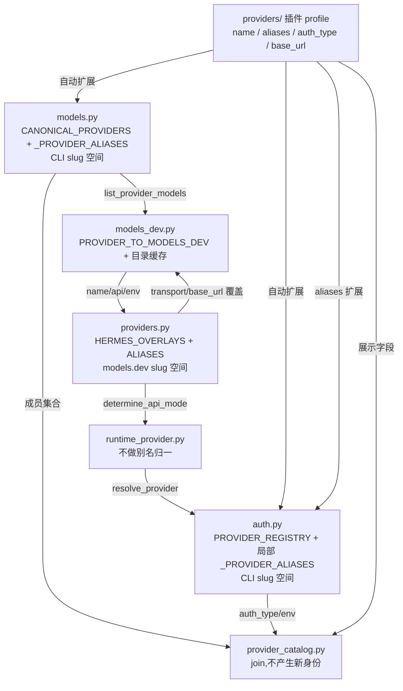

# r8d 底稿 · 簇 B —— provider / 模型的身份、目录与路由

> 本文是 R8D 的**底稿**(证据层),不追求好读。研究对象:`/home/user/hermes-agent` @ `863e313`。
> 凡对代码行为的断言,锚点 `路径:行号 @ 863e313` **单独成行、置于代码块之前**;
> 代码块内容逐字取自基线(本文由脚本按行号切片生成,不手抄)。
> 非源码块(终端输出、我自己写的验证命令)用 ```` ```verify ```` / ```` ```text ```` 声明。

**本簇 9 个文件 / 13,387 行**:`models.py`(5334)、`model_switch.py`(3203)、
`runtime_provider.py`(2298)、`providers.py`(959)、`model_normalize.py`(582)、
`model_catalog.py`(471)、`codex_models.py`(255)、`provider_catalog.py`(181)、
`route_identity.py`(104)。

---

## 0. 结论速览(每条在下文有取证)

1. **两个 “single source of truth” 不是重复,是两套 slug 命名空间的两端。**
   `models.py::CANONICAL_PROVIDERS` 是**面向用户的 slug 空间**(`copilot` / `kilocode` /
   `opencode-zen` / `ai-gateway` / `kimi-coding`),`providers.py::HERMES_OVERLAYS` 是
   **对齐 models.dev 的 slug 空间**(`github-copilot` / `kilo` / `opencode` / `vercel` /
   `kimi-for-coding`)。两个文件各自的 `normalize_provider` 在这 4 对上是**互逆映射**。
2. **全仓实际有 6 处 provider 别名表**(不是 2 处),其中 4 处是键值对表、
   1 处是 models.dev 翻译表、1 处是插件 profile 的 `aliases` 字段。
3. **复合归一 `providers.normalize(models.normalize(x))` 是收敛的、一次到不动点**——
   `agent/agent_init.py` 正是这么用的。**反向复合结果不同**(18 个 key)。
4. **同一个字符串 `qwen` 在两条入口归一成两个不同的 provider**:
   picker 侧 → `alibaba`(DashScope,API key);运行时侧 → `qwen-oauth`(Qwen CLI OAuth)。
5. **`auth.resolve_provider` 对未知 provider 名 fail-closed 抛错**,而 `models.normalize_provider`
   永远返回一个字符串。于是 `nim` / `deep-seek` 这类别名在 picker 命名空间成立、在运行时报
   `Unknown provider`。
6. **`route_identity` 的 fail-closed 是“比不出来就当作不匹配、丢掉 pin”**,而不是抛错;
   `normalize_route_base_url` 遇到不可解析输入**原样返回**——正是为了让它比不相等。
7. **离线时四条目录链各自有独立回落**,最深一层都是**仓库内静态常量**,没有一条会抛错。
8. **`/model` 从不支持 `provider:model` 切 provider**,尽管 README 与 developer-guide 都这么写。
   实现它的 `parse_model_input` 全仓只有 ACP 一个调用方。

---

## 1. 「两个 single source of truth」

### 1.1 两份自称

`providers.py` 的自称在文件第一句:

`hermes_cli/providers.py:1-18 @ 863e313`

```python
"""
Single source of truth for provider identity in Hermes Agent.

Two data sources, merged at runtime:

1. **models.dev catalog** — 109+ providers with base URLs, env vars, display
   names, and full model metadata (context, cost, capabilities).  This is
   the primary database.

2. **Hermes overlays** — transport type, auth patterns, aggregator flags,
   and additional env vars that models.dev doesn't track.  Small dict,
   maintained here.

3. **User config** (``providers:`` section in config.yaml) — user-defined
   endpoints and overrides.  Merged on top of everything else.

Other modules import from this file.  No parallel registries.
"""
```

`provider_catalog.py` 的自称在文件第一句,并且它**明确说自己解决的是 GUI 与 CLI 的清单不一致**,
跟 provider 身份/路由无关:

`hermes_cli/provider_catalog.py:1-34 @ 863e313`

```python
"""Unified provider catalog — one source of truth for the provider universe.

The provider list shown by ``hermes model`` (CLI/TUI) and the desktop Settings
→ Providers tabs (Accounts + API keys) **must be the same set**.  Historically
they were not: the CLI picker read :data:`hermes_cli.models.CANONICAL_PROVIDERS`
(which auto-extends from ``plugins/model-providers/<name>/``), while the desktop
tabs read separate hand-maintained lists (``_OAUTH_PROVIDER_CATALOG``,
``OPTIONAL_ENV_VARS`` + ``PROVIDER_GROUPS``) that nobody kept in sync.  Every
provider added after those lists were written silently went missing from the
GUI — e.g. GitHub Copilot showing up only under "tools", or ``openai-api`` being
configurable from the CLI but not the desktop app.

This module fixes that at the root: it derives ONE descriptor per provider from
the same universe ``hermes model`` renders (``CANONICAL_PROVIDERS``), joining:

* ``auth_type`` / ``api_key_env_vars`` / ``base_url_env_var`` from
  :data:`hermes_cli.auth.PROVIDER_REGISTRY` (credential truth), and
* ``display_name`` / ``description`` / ``signup_url`` from the provider's
  :class:`providers.base.ProviderProfile` when one exists, falling back to the
  ``CANONICAL_PROVIDERS`` entry's ``label`` / ``tui_desc`` and the
  ``OPTIONAL_ENV_VARS`` signup URL otherwise (many profiles leave these blank,
  and four canonical providers have no profile at all — lmstudio, openai-api,
  tencent-tokenhub, xai-oauth — so the fallbacks are load-bearing).

Each descriptor is tagged with the ``tab`` it belongs on (``keys`` vs
``accounts``) based purely on how the provider authenticates.  The desktop
``/api/env`` and ``/api/providers/oauth`` endpoints derive their MEMBERSHIP from
this catalog; the old hand lists are demoted to presentation/override overlays
(bespoke OAuth flow + status resolvers, richer copy, icons, ordering) and no
longer decide which providers exist.

Parity contract (locked by tests): the union of the two tabs equals the
``CANONICAL_PROVIDERS`` universe, i.e. exactly what ``hermes model`` shows.
"""
```

**读法**:两句自称的宾语不同。
`providers.py` 说的是 “provider **identity**”(这个 provider 是谁、走哪个 URL、什么 transport);
`provider_catalog.py` 说的是 “the provider **universe**”(**有哪些** provider 该出现在界面上)。
`provider_catalog.py` 的 docstring 自己承认它的成员集合来自 `CANONICAL_PROVIDERS`:

`hermes_cli/provider_catalog.py:83-92 @ 863e313`

```python
def provider_catalog() -> list[ProviderDescriptor]:
    """Return one descriptor per provider in the ``hermes model`` universe.

    Membership is :data:`CANONICAL_PROVIDERS` (the list the CLI/TUI picker
    renders, which auto-extends from provider plugins).  Auth + env come from
    ``PROVIDER_REGISTRY``; display metadata from ``ProviderProfile`` with
    canonical/env fallbacks so providers without a profile (or with blank
    profile metadata) still resolve sensibly.
    """
    from hermes_cli.models import CANONICAL_PROVIDERS
```

即 **`provider_catalog` 不是第二个身份真理源,它是一个 join**:
成员集合取自 `models.py::CANONICAL_PROVIDERS`,凭证字段取自 `auth.py::PROVIDER_REGISTRY`,
展示字段取自 `providers/` 插件 profile。

### 1.2 真正的两套命名空间

`CANONICAL_PROVIDERS`(models.py)用的是**面向用户的 slug**:

`hermes_cli/models.py:1108-1122 @ 863e313`

```python
class ProviderEntry(NamedTuple):
    slug: str
    label: str
    tui_desc: str   # detailed description for `hermes model` TUI

CANONICAL_PROVIDERS: list[ProviderEntry] = [
    ProviderEntry("nous",           "Nous Portal",              "Nous Portal (Everything your agent needs, 300+ models with bundled tool use)"),
    ProviderEntry("fireworks",      "Fireworks AI",             "Fireworks AI (OpenAI-compatible direct model API)"),
    ProviderEntry("openrouter",     "OpenRouter",               "OpenRouter (Pay-per-use API aggregator)"),
    ProviderEntry("moa",            "Mixture of Agents",        "Mixture of Agents (named presets; aggregator acts after reference models)"),
    ProviderEntry("novita",         "NovitaAI",                 "NovitaAI (Cloud: Model API, Agent Sandbox, GPU Cloud)"),
    ProviderEntry("lmstudio",       "LM Studio",                "LM Studio (Local desktop app with built-in model server)"),
    ProviderEntry("anthropic",      "Anthropic",                "Anthropic (Claude models via API key or Claude Code)"),
    ProviderEntry("openai-codex",   "OpenAI Codex",             "OpenAI Codex (Codex CLI via ChatGPT subscription or API key)"),
    ProviderEntry("openai-api",     "OpenAI API",               "OpenAI API (api.openai.com, API key)"),
```

`HERMES_OVERLAYS`(providers.py)用的是**对齐 models.dev 的 slug**:

`hermes_cli/providers.py:91-100 @ 863e313`

```python
    "copilot-acp": HermesOverlay(
        transport="codex_responses",
        auth_type="external_process",
        base_url_override="acp://copilot",
        base_url_env_var="COPILOT_ACP_BASE_URL",
    ),
    "github-copilot": HermesOverlay(
        transport="openai_chat",
        extra_env_vars=("COPILOT_GITHUB_TOKEN", "GH_TOKEN"),
    ),
```

同一个 GitHub Copilot,在 `CANONICAL_PROVIDERS` 里 slug 是 `copilot`,
在 `HERMES_OVERLAYS` 里 key 是 `github-copilot`。这不是笔误——models.dev 的 provider id 就叫
`github-copilot`,而 Hermes 的 CLI 里一直叫 `copilot`。**两套 slug 都是必要的**,
差别只在“谁是那一端的母语”。

量化(脚本从基线 AST 直接抽两张表比对,重跑可复现):

```verify
cd /home/user/hermes-agent && python3 - <<'EOF'
import ast, pathlib
def grab(p, n):
    t = ast.parse(pathlib.Path(p).read_text())
    for node in t.body:
        tg = node.targets if isinstance(node, ast.Assign) else ([node.target] if isinstance(node, ast.AnnAssign) else [])
        for x in tg:
            if isinstance(x, ast.Name) and x.id == n:
                return node
canon = [e.args[0].value for e in grab('hermes_cli/models.py', 'CANONICAL_PROVIDERS').value.elts]
ovk   = [k.value for k in grab('hermes_cli/providers.py', 'HERMES_OVERLAYS').value.keys]
A = ast.literal_eval(grab('hermes_cli/providers.py', 'ALIASES').value)
na = lambda s: A.get(s, s)
print('CANONICAL(静态):', len(canon), ' HERMES_OVERLAYS:', len(ovk))
print('CANONICAL 里查不到 overlay 的 slug:', [s for s in canon if s not in ovk])
print('被 providers.normalize 改写的 CANONICAL slug:',
      {s: na(s) for s in canon if na(s) != s})
EOF
```

实测输出:

```text
CANONICAL(静态): 38  HERMES_OVERLAYS: 39
CANONICAL 里查不到 overlay 的 slug: ['copilot', 'gemini', 'kimi-coding', 'kimi-coding-cn',
                                    'kilocode', 'opencode-zen', 'ai-gateway']
被 providers.normalize 改写的 CANONICAL slug: {'copilot': 'github-copilot',
  'kimi-coding': 'kimi-for-coding', 'kimi-coding-cn': 'kimi-for-coding',
  'kilocode': 'kilo', 'opencode-zen': 'opencode', 'ai-gateway': 'vercel'}
```

### 1.3 两个 `normalize_provider`,4 对互逆

`hermes_cli/providers.py:445-452 @ 863e313`

```python
def normalize_provider(name: str) -> str:
    """Resolve aliases and normalise casing to a canonical provider id.

    Returns the canonical id string.  Does *not* validate that the id
    corresponds to a known provider.
    """
    key = name.strip().lower()
    return ALIASES.get(key, key)
```

`hermes_cli/models.py:2537-2546 @ 863e313`

```python
def normalize_provider(provider: Optional[str]) -> str:
    """Normalize provider aliases to Hermes' canonical provider ids.

    Note: ``"auto"`` passes through unchanged — use
    ``hermes_cli.auth.resolve_provider()`` to resolve it to a concrete
    provider based on credentials and environment.
    """
    normalized = (provider or "openrouter").strip().lower()
    return _PROVIDER_ALIASES.get(normalized, normalized)

```

**三处硬差别**(不是覆盖面差,是行为差):

| | `providers.normalize_provider` | `models.normalize_provider` |
|---|---|---|
| 空输入 | 返回 `""` | 返回 `"openrouter"`(见上面 `(provider or "openrouter")`) |
| `"openai"` | → `"openrouter"` | 原样 `"openai"` |
| 4 对 slug | 映向 models.dev 空间 | 映向 CLI 空间(方向相反) |

`"openai" → "openrouter"` 这条在 `providers.py` 是显式写下的:

`hermes_cli/providers.py:274-277 @ 863e313`

```python
ALIASES: Dict[str, str] = {
    # openrouter
    "openai": "openrouter",     # bare "openai" → route through aggregator

```

**这条别名是有代价的**,代码里专门为它写了防线(见 §6.3)。

### 1.4 复合归一收敛;方向不能反

`agent/agent_init.py` 是全仓唯一同时 import 两个 `normalize_provider` 的地方,
它把它们**串起来**用,顺序是 **models 先、providers 后**:

`agent/agent_init.py:146-160 @ 863e313`

```python
        from hermes_cli.auth import PROVIDER_REGISTRY
        from hermes_cli.models import normalize_provider as normalize_model_provider
        from hermes_cli.providers import normalize_provider as normalize_registry_provider

        for provider_id, config in PROVIDER_REGISTRY.items():
            canonical_id = normalize_registry_provider(
                normalize_model_provider(provider_id)
            )
            if canonical_id != provider:
                continue
            route = _normalize_route_base_url(
                getattr(config, "inference_base_url", "")
            )
            if route:
                routes.add(route)
```

同一文件里第二处,顺序一致:

`agent/agent_init.py:191-208 @ 863e313`

```python
    active_provider = str(active_provider or "").strip()
    if not configured_provider:
        return False
    try:
        from hermes_cli.models import normalize_provider as normalize_model_provider

        configured_provider = normalize_model_provider(configured_provider)
        active_provider = normalize_model_provider(active_provider)
    except Exception:
        configured_provider = configured_provider.lower()
        active_provider = active_provider.lower()
    try:
        from hermes_cli.providers import normalize_provider as normalize_registry_provider

        configured_provider = normalize_registry_provider(configured_provider)
        active_provider = normalize_registry_provider(active_provider)
    except Exception:
        pass
```

**为什么这个顺序是对的**:`models.normalize` 把任意别名收到 CLI slug 空间,
`providers.normalize` 再把 CLI slug 翻成 models.dev slug。两步都是“往下游走一格”,
所以复合是**幂等**的。反过来串则不是。实测:

```verify
cd /home/user/hermes-agent && HERMES_HOME=$(mktemp -d) /home/user/hermes-venv/bin/python -c "
import sys; sys.path.insert(0,'/home/user/hermes-agent')
from hermes_cli.models import normalize_provider as nm
from hermes_cli.providers import normalize_provider as na
for x in ['copilot','github','kilo','kilocode','opencode','vercel','ai-gateway','kimi']:
    f, r = na(nm(x)), nm(na(x))
    print(f'{x:12} models→providers={f:16} providers→models={r:16} 复合幂等={na(nm(f))==f}')
"
```

```text
copilot      models→providers=github-copilot   providers→models=copilot          复合幂等=True
github       models→providers=github-copilot   providers→models=copilot          复合幂等=True
kilo         models→providers=kilo             providers→models=kilocode         复合幂等=True
kilocode     models→providers=kilo             providers→models=kilocode         复合幂等=True
opencode     models→providers=opencode         providers→models=opencode-zen     复合幂等=True
vercel       models→providers=vercel           providers→models=ai-gateway       复合幂等=True
ai-gateway   models→providers=vercel           providers→models=ai-gateway       复合幂等=True
kimi         models→providers=kimi-for-coding  providers→models=kimi-coding      复合幂等=True
```

对全表 137 个 key 做同样计算:**`na∘nm` 对每个 key 都一次到不动点**;
**两种顺序结果不同的 key 有 18 个**(上表 8 个是其中的代表)。

### 1.5 第三张表:models.dev 翻译表

`providers.normalize_provider` 并不是唯一把 Hermes slug 翻成 models.dev slug 的东西。
`agent/models_dev.py` 自己还有一张:

`agent/models_dev.py:152-162 @ 863e313`

```python
PROVIDER_TO_MODELS_DEV: Dict[str, str] = {
    "openrouter": "openrouter",
    "novita": "novita-ai",
    "anthropic": "anthropic",
    "openai": "openai",
    "openai-codex": "openai",
    "zai": "zai",
    "kimi": "kimi-for-coding",
    "kimi-coding": "kimi-for-coding",
    "moonshot": "kimi-for-coding",
    "stepfun": "stepfun",
```

它被 `get_provider_info` 用在入口,**带默认值**(查不到就原样透传):

`agent/models_dev.py:843-856 @ 863e313`

```python
def get_provider_info(
    provider_id: str, *, allow_network: bool = True
) -> Optional[ProviderInfo]:
    """Get full provider metadata from models.dev.

    Accepts either a Hermes provider ID (e.g. "kilocode") or a models.dev
    ID (e.g. "kilo").  Returns None if the provider is not in the catalog.
    """
    # Resolve Hermes ID → models.dev ID
    mdev_id = PROVIDER_TO_MODELS_DEV.get(provider_id, provider_id)

    # NOTE: keep the zero-argument call on the default path. Dozens of test
    # sites monkeypatch fetch_models_dev with zero-arg lambdas; passing the
    # kwarg unconditionally would break them all (they raise TypeError).
```

**这就是两张表能共存的原因**:`providers.get_provider(name)` 先用 `ALIASES` 把 `copilot` 翻成
`github-copilot`,再交给 `get_provider_info`;后者查 `PROVIDER_TO_MODELS_DEV.get('github-copilot',
'github-copilot')` 查不到、原样用,恰好就是 models.dev 的 id。**两条路殊途同归**。

但同一文件里另一个入口 **不带默认值**:

`agent/models_dev.py:582-590 @ 863e313`

```python
def _get_provider_models(provider: str) -> Optional[Dict[str, Any]]:
    """Resolve a Hermes provider ID to its models dict from models.dev.

    Returns the models dict or None if the provider is unknown or has no data.
    """
    mdev_provider_id = PROVIDER_TO_MODELS_DEV.get(provider)
    if not mdev_provider_id:
        return None

```

`_get_provider_models` 期望的是 **CLI slug 空间**(`copilot` / `ai-gateway` / `kilocode`),
查不到直接 `None`。它的调用方 `list_provider_models` 也确实用 `models.normalize_provider`:

`agent/models_dev.py:680-690 @ 863e313`

```python
def list_provider_models(provider: str) -> List[str]:
    """Return all model IDs for a provider from models.dev.

    Returns an empty list if the provider is unknown or has no data.
    """
    from hermes_cli.models import normalize_provider
    provider = normalize_provider(provider) or provider
    
    models = _get_provider_models(provider)
    if models is None:
        return []
```

**所以 `agent/models_dev.py` 内部两个入口吃的是两种命名空间**:
`get_provider_info` 两种都吃(有默认值兜底),`_get_provider_models` 只吃 CLI slug。
把 `providers.normalize` 的输出(models.dev slug)喂给 `list_provider_models` 会静默返回 `[]`——
`PROVIDER_TO_MODELS_DEV` 里没有 `github-copilot` / `kilo` / `opencode` / `vercel` / `kimi-for-coding` 这些 key。

### 1.6 第四张表:`auth.py` 的函数局部表

`hermes_cli/auth.py::resolve_provider` 在**函数体内**又写了一张 79 条的表:

`hermes_cli/auth.py:2000-2012 @ 863e313`

```python
    normalized = (requested or "auto").strip().lower()

    # Normalize provider aliases
    _PROVIDER_ALIASES = {
        "glm": "zai", "z-ai": "zai", "z.ai": "zai", "zhipu": "zai",
        "google": "gemini", "google-gemini": "gemini", "google-ai-studio": "gemini",
        "x-ai": "xai", "x.ai": "xai", "grok": "xai",
        "xai-oauth": "xai-oauth", "x-ai-oauth": "xai-oauth",
        "grok-oauth": "xai-oauth", "xai-grok-oauth": "xai-oauth",
        "kimi": "kimi-coding", "kimi-for-coding": "kimi-coding", "moonshot": "kimi-coding",
        "kimi-cn": "kimi-coding-cn", "moonshot-cn": "kimi-coding-cn",
        "step": "stepfun", "stepfun-coding-plan": "stepfun",
        "arcee-ai": "arcee", "arceeai": "arcee",
```

它属于 **CLI slug 空间**(`github → copilot`、`vercel → ai-gateway`、`kilo → kilocode`),
与 `models.py::_PROVIDER_ALIASES` **零冲突**(同 key 同值),差别只在覆盖面。
并且它比 `models.py` 那张多做一件事——**用插件声明的 aliases 扩展自己**:

`hermes_cli/auth.py:2038-2050 @ 863e313`

```python
    }
    # Extend with aliases declared in plugins/model-providers/<name>/ that aren't already mapped.
    # This keeps providers/ as the single source for new aliases while the
    # hardcoded dict above remains authoritative for existing ones.
    try:
        from providers import list_providers as _lp
        for _pp in _lp():
            for _alias in _pp.aliases:
                if _alias not in _PROVIDER_ALIASES:
                    _PROVIDER_ALIASES[_alias] = _pp.name
    except Exception:
        pass
    normalized = _PROVIDER_ALIASES.get(normalized, normalized)
```

### 1.7 第五、第六张:插件 profile 的 `aliases`,与 aux 客户端的私表

`providers/base.py::ProviderProfile.aliases` 是第五处别名来源(被 §1.6 吸收进 auth 表,
也被 `auth.PROVIDER_REGISTRY` 用来注册别名键)。第六处在 aux 侧:

`agent/auxiliary_client.py:495-500 @ 863e313`

```python
_PROVIDER_ALIASES = {
    "google": "gemini",
    "google-gemini": "gemini",
    "google-ai-studio": "gemini",
    "x-ai": "xai",
    "x.ai": "xai",
```

**负结论 + 搜索面**:全仓(排除 `tests/`)provider 级别名表**只有这 6 处**。搜索面是——
对仓库根递归 `--include=*.py`,模式 `PROVIDER_ALIASES|^ALIASES|PROVIDER_TO_MODELS_DEV|provider_aliases`,
再排除纯读取行(`.get(` / `.keys(` / `.items(` / `.values(` / `import`)。命令:

```verify
cd /home/user/hermes-agent && grep -rn "PROVIDER_ALIASES\|^ALIASES\|PROVIDER_TO_MODELS_DEV\|provider_aliases" \
  --include=*.py . | grep -v '^./tests/' \
  | grep -vE '\.get\(|\.keys\(|\.items\(|\.values\(|in _PROVIDER_ALIASES|import'
```

命中的定义处(其余是 `custom_provider_aliases` 函数,与 provider 别名表不是一回事):

```text
agent/auxiliary_client.py:495:_PROVIDER_ALIASES = {
agent/models_dev.py:152:PROVIDER_TO_MODELS_DEV: Dict[str, str] = {
hermes_cli/auth.py:2003:    _PROVIDER_ALIASES = {
hermes_cli/providers.py:274:ALIASES: Dict[str, str] = {
hermes_cli/models.py:1282:_PROVIDER_ALIASES = {
```

**这条负结论的弱点**:它只找“表”。插件 profile 的 `aliases` 字段(第五处)不长这个样子,
是我另外从 `providers/base.py` 与 `plugins/model-providers/*/` 读到的;
散落在各函数里的 `if provider in {...}` 型硬编码判断**不在**这条搜索面内,也不在本条负结论的范围内。

### 1.8 谁引用谁(依赖方向)



**读法**:`providers.py` 与 `models.py` 之间**没有 import 边**——两者互不引用。
它们通过第三方(`models_dev` / `auth` / `agent_init` 的复合归一)对接。
这解释了为什么两张别名表能长期各走各的:**没有任何一处代码会同时看见它们不一致**,
除了 `agent_init.py` 那两处刻意的串联。

### 1.9 `provider_catalog` 的 overlay 查表跨了命名空间(■ 潜在)

`hermes_cli/provider_catalog.py:114-137 @ 863e313`

```python
    # Hermes overlays carry auth_type for providers that have no registry/profile
    # entry of their own — notably the ``moa`` virtual provider (auth_type
    # "virtual"), which has no real credential and no network endpoint.
    try:
        from hermes_cli.providers import HERMES_OVERLAYS
    except Exception:
        HERMES_OVERLAYS = {}

    out: list[ProviderDescriptor] = []
    for order, entry in enumerate(CANONICAL_PROVIDERS):
        slug = entry.slug
        cfg = PROVIDER_REGISTRY.get(slug)
        prof = profiles.get(slug)
        overlay = HERMES_OVERLAYS.get(slug)

        # auth_type: registry is authoritative; fall back to profile, then the
        # Hermes overlay (e.g. moa → "virtual"), then api_key.
        auth_type = (
            (getattr(cfg, "auth_type", "") if cfg else "")
            or (getattr(prof, "auth_type", "") if prof else "")
            or (getattr(overlay, "auth_type", "") if overlay else "")
            or "api_key"
        )

```

`slug` 来自 `CANONICAL_PROVIDERS`(CLI slug),`HERMES_OVERLAYS` 的 key 是 models.dev slug,
于是 **9/43 个 slug 查不到 overlay**。实测:

```text
CANONICAL_PROVIDERS (运行时, 含插件自动扩展): 43
provider_catalog() 条数: 43
HERMES_OVERLAYS.get(slug) 查不到的: ['copilot','gemini','kimi-coding','kimi-coding-cn',
                                    'kilocode','opencode-zen','ai-gateway','custom','deepinfra']
其中每一个的 auth_type 都由 registry 或 profile 提供,overlay 未参与 → 当前无可观测影响
```

**当前无害,但是潜在缺陷**:overlay 在这里是 `auth_type` 的**第三顺位兜底**,
上面两位(registry、profile)对这 9 个 slug 恰好都有值,所以兜底从未被触发。
docstring 举的例子 `moa → "virtual"` 能工作,是因为 `moa` 恰好在两个空间里同名。
一旦某个 provider 只在 overlay 里声明 `auth_type` 且它的 CLI slug 与 models.dev slug 不同名,
这里会静默落到 `"api_key"`,进而把它错分到 GUI 的 “keys” 页。

---

## 2. 同名归一成不同结果:四条入口的实测

### 2.1 四条入口分别是什么

| 入口 | 归一逻辑 | 未知名字的处理 |
|---|---|---|
| `models.normalize_provider` | `_PROVIDER_ALIASES`(CLI 空间) | 原样返回 |
| `providers.normalize_provider` | `ALIASES`(models.dev 空间) | 原样返回 |
| `auth.resolve_provider` | 函数局部表 + 插件 aliases | **抛 `AuthError`** |
| `runtime_provider.resolve_requested_provider` | **只 `.strip().lower()`,不查任何表** | 原样返回 |

运行时入口完全不做别名归一:

`hermes_cli/runtime_provider.py:592-609 @ 863e313`

```python
def resolve_requested_provider(requested: Optional[str] = None) -> str:
    """Resolve provider request from explicit arg, config, then env."""
    if requested and requested.strip():
        return requested.strip().lower()

    model_cfg = _get_model_config()
    cfg_provider = model_cfg.get("provider")
    if isinstance(cfg_provider, str) and cfg_provider.strip():
        return cfg_provider.strip().lower()

    # Prefer the persisted config selection over any stale shell/.env
    # provider override so chat uses the endpoint the user last saved.
    env_provider = _getenv("HERMES_INFERENCE_PROVIDER", "").strip().lower()
    if env_provider:
        return env_provider

    return "auto"

```

**负结论 + 搜索面**:`hermes_cli/runtime_provider.py` 全文(2298 行)对模式
`get_provider_profile|ProviderProfile|fallback_models|from providers|import providers`
**零命中**;对 `normalize_provider` 也零命中。它拿到的原始字符串直接交给 `auth.resolve_provider`。

```verify
cd /home/user/hermes-agent && grep -cE "normalize_provider|get_provider_profile|ProviderProfile|fallback_models" \
  hermes_cli/runtime_provider.py ; echo "(0 = 零命中)"
```

### 2.2 `auth.resolve_provider` 的 fail-closed

`hermes_cli/auth.py:2052-2067 @ 863e313`

```python
    if normalized == "openrouter":
        return "openrouter"
    if normalized == "custom":
        return "custom"
    if normalized in PROVIDER_REGISTRY:
        return normalized
    if normalized != "auto":
        # Check for common config.yaml issues that cause this error
        _config_hint = _get_config_hint_for_unknown_provider(normalized)
        msg = f"Unknown provider '{normalized}'."
        if _config_hint:
            msg += f"\n\n{_config_hint}"
        else:
            msg += " Check 'hermes model' for available providers, or run 'hermes doctor' to diagnose config issues."
        raise AuthError(msg, code="invalid_provider")

```

**这是本簇里唯一一处“认不出就拒绝”的归一**。其余三处都是“认不出就原样放行”。

### 2.3 实测:同名不同解

```verify
cd /home/user/hermes-agent && HERMES_HOME=$(mktemp -d) /home/user/hermes-venv/bin/python -c "
import sys; sys.path.insert(0,'/home/user/hermes-agent')
from hermes_cli.models import normalize_provider as nm
from hermes_cli.providers import normalize_provider as na
from hermes_cli import auth as A
from hermes_cli.runtime_provider import resolve_requested_provider as rr
for n in ['qwen','vllm','nim','deep-seek','or','azure','codex','github','vercel','kilo']:
    try: a = A.resolve_provider(n)
    except Exception as e: a = 'EXC:' + type(e).__name__
    print(f'{n:10} models={nm(n):12} providers={na(n):12} auth={a:14} runtime={rr(n)}')
"
```

```text
qwen       models=alibaba      providers=alibaba      auth=qwen-oauth     runtime=qwen
vllm       models=vllm         providers=local        auth=custom         runtime=vllm
nim        models=nvidia       providers=nvidia       auth=EXC:AuthError  runtime=nim
deep-seek  models=deepseek     providers=deepseek     auth=EXC:AuthError  runtime=deep-seek
or         models=or           providers=or           auth=openrouter     runtime=or
azure      models=azure        providers=azure        auth=azure-foundry  runtime=azure
codex      models=codex        providers=codex        auth=openai-codex   runtime=codex
github     models=copilot      providers=github-copilot auth=copilot      runtime=github
vercel     models=ai-gateway   providers=vercel       auth=ai-gateway     runtime=vercel
kilo       models=kilocode     providers=kilo         auth=kilocode       runtime=kilo
```

**三类问题各出一例:**

**(a) `qwen` —— 同名指向两个真实不同的 provider(■)。**
`models.py` 与 `providers.py` 都把 `qwen` 映到 `alibaba`(DashScope,`DASHSCOPE_API_KEY`):

`hermes_cli/providers.py:343-348 @ 863e313`

```python
    # alibaba
    "dashscope": "alibaba",
    "aliyun": "alibaba",
    "qwen": "alibaba",
    "alibaba-cloud": "alibaba",
    "alibaba_coding": "alibaba-coding-plan",
```

而 `auth.resolve_provider` 的局部表**没有** `qwen`,于是插件扩展生效,`qwen-oauth` 插件把它认走了。
端到端验证(`resolve_runtime_provider` 走的就是 auth 那条):

```verify
cd /home/user/hermes-agent && HERMES_HOME=$(mktemp -d) /home/user/hermes-venv/bin/python -c "
import sys; sys.path.insert(0,'/home/user/hermes-agent')
from hermes_cli.runtime_provider import resolve_runtime_provider as R
for n in ['qwen','nim']:
    try: print(n, '->', R(requested=n))
    except Exception as e: print(n, '->', type(e).__name__ + ':', str(e).splitlines()[0])
"
```

```text
qwen -> AuthError: Qwen CLI credentials not found. Run 'qwen auth qwen-oauth' first.
nim  -> AuthError: Unknown provider 'nim'. Check 'hermes model' for available providers, ...
```

`qwen` 的报错来自 **Qwen CLI OAuth**,而 picker 侧同一个字符串指的是 **DashScope API key**。
一个只配了 `DASHSCOPE_API_KEY` 的用户写 `provider: qwen`,会被告知去跑 `qwen auth qwen-oauth`。

**(b) `nim` / `deep-seek` —— picker 空间成立、运行时 fail-closed(■ 轻)。**
这两个别名只写在 `models.py::_PROVIDER_ALIASES`(17 个此类 key),auth 局部表与插件 aliases 都没有。
好在正规路径不受影响:`parse_model_input` 会先过 `models.normalize_provider` 再落盘,所以
落到 config.yaml 里的是 `nvidia` 而不是 `nim`。**踩雷路径是用户手写 `--provider nim` 或手改 config.yaml。**

**(c) `vllm` —— `providers.py` 的别名靶点在自己的解析链里解析不出来(■ 轻)。**

`hermes_cli/providers.py:397-406 @ 863e313`

```python
    # Local server aliases → virtual "local" concept (resolved via user config)
    "lmstudio": "lmstudio",
    "lm-studio": "lmstudio",
    "lm_studio": "lmstudio",
    "ollama": "custom",  # bare "ollama" = local; use "ollama-cloud" for cloud
    "vllm": "local",
    "llamacpp": "local",
    "llama.cpp": "local",
    "llama-cpp": "local",
}
```

`local` 既不在 `HERMES_OVERLAYS`,也不是 models.dev 的 id,只在 `_LABEL_OVERRIDES` 里有个显示名:

`hermes_cli/providers.py:413-430 @ 863e313`

```python
_LABEL_OVERRIDES: Dict[str, str] = {
    "moa": "Mixture of Agents",
    "nous": "Nous Portal",
    "openai-codex": "OpenAI Codex",
    "copilot-acp": "GitHub Copilot ACP",
    "stepfun": "StepFun Step Plan",
    "xiaomi": "Xiaomi MiMo",
    "gmi": "GMI Cloud",
    "upstage": "Upstage Solar",
    "actual": "Actual Computer",
    "tencent-tokenhub": "Tencent TokenHub",
    "lmstudio": "LM Studio",
    "local": "Local endpoint",
    "bedrock": "AWS Bedrock",
    "vertex": "Google Vertex AI",
    "ollama-cloud": "Ollama Cloud",
    "xai-oauth": "xAI Grok OAuth (SuperGrok / Premium+)",
}
```

于是 `resolve_provider_full('vllm')` / `get_provider('local')` 都返回 `None`
(实测见 §2.3 脚本的同一次运行:`resolve_provider_full('vllm') = None`)。
而 `auth` 与插件都把 `vllm` 映到 `custom`(能用)。**`providers.py` 这三条 `→ local` 是死靶点。**

---

## 3. `route_identity.py`:fail-closed 具体关成什么样

整个文件只有 104 行、3 个函数,但它是“换了模型/换了端点后,配置里那个 `model.context_length`
还算不算数”的唯一判据。**关错方向的代价是压缩阈值被一个过期的上下文窗口撑大。**

### 3.1 场景

用户在 config.yaml 里给某个 128k 模型钉了 `model.context_length: 131072`。
会话中途 `/model` 切到另一个 32k 模型。如果这个 pin 不被丢弃,压缩器会以为还有 131072 可用,
于是迟迟不压缩,直到真实 32k 窗口爆掉。

### 3.2 `should_clear_context_pin`:异常一律 `True`

`hermes_cli/route_identity.py:50-77 @ 863e313`

```python
def should_clear_context_pin(
    configured_model: Any,
    active_model: Any,
    configured_base_url: Any,
    active_base_url: Any,
    configured_provider: Any,
    active_provider: Any,
) -> bool:
    """True when a configured ``model.context_length`` pin no longer matches its runtime route.

    Fail-closed: any error during route comparison returns ``True`` (drop the pin)
    so a stale window never silently inflates the compression threshold.
    """
    configured_model = str(configured_model or "").strip()
    if configured_model and configured_model != str(active_model or "").strip():
        return True
    try:
        from agent.agent_init import _context_route_mismatch

        return _context_route_mismatch(
            configured_base_url,
            active_base_url,
            configured_provider,
            active_provider,
        )
    except Exception:
        return True

```

**fail-closed 的含义在这里是明确的:出错就丢 pin。**
注意它把真正的比较**整段委托**给 `agent.agent_init._context_route_mismatch`,
而这个 import 写在 `try` 里面——**import 失败也算 True**。

### 3.3 异步版:同一份逻辑丢到线程池

`hermes_cli/route_identity.py:79-105 @ 863e313`

```python
async def should_clear_context_pin_async(
    configured_model: Any,
    active_model: Any,
    configured_base_url: Any,
    active_base_url: Any,
    configured_provider: Any,
    active_provider: Any,
) -> bool:
    """Async wrapper for ``should_clear_context_pin``.

    Offloads the route comparison to a worker thread so async gateway
    handlers never run it on the event loop — the resolution chain is
    cache-only (``allow_network=False``) but can still do cold-start disk
    I/O. Shares all logic with the sync version — no code duplication.
    """
    import asyncio

    return await asyncio.to_thread(
        should_clear_context_pin,
        configured_model,
        active_model,
        configured_base_url,
        active_base_url,
        configured_provider,
        active_provider,
    )
```

**这条注释值得单独记**:它说明网关的异步路径为什么不能直接调同步版——
解析链虽然是 `allow_network=False`(见 §5.1 的 models.dev cache-only 分支),
但**冷启动仍有磁盘 I/O**,放在事件循环上会卡住整个网关。

### 3.4 `normalize_route_base_url`:不可解析就**原样返回**

`hermes_cli/route_identity.py:9-47 @ 863e313`

```python
def normalize_route_base_url(base_url: Any) -> str:
    """Canonicalize only proven-equivalent endpoint URL components."""
    raw = str(base_url or "")
    if not raw:
        return ""
    if any(ord(char) <= 0x20 for char in raw):
        return raw
    had_query_delimiter = "?" in raw.split("#", 1)[0]
    try:
        parsed = urlsplit(raw)
        hostname = parsed.hostname
        if not parsed.scheme or not hostname:
            return raw
        scheme = parsed.scheme.lower()
        if "%" in hostname:
            address, zone = hostname.split("%", 1)
            host = f"{address.lower()}%{zone}"
        else:
            host = hostname.lower()
        port = parsed.port
    except (TypeError, ValueError):
        return raw

    route_host = parsed.netloc.rsplit("@", 1)[-1]
    if route_host.startswith("[") or ":" in host:
        host = f"[{host}]"
    if port is not None and (scheme, port) not in {("http", 80), ("https", 443)}:
        host = f"{host}:{port}"
    if "@" in parsed.netloc:
        host = f"{parsed.netloc.rsplit('@', 1)[0]}@{host}"

    path = parsed.path
    if path.endswith("/") and not had_query_delimiter:
        path = path[:-1]

    normalized = urlunsplit((scheme, host, path, parsed.query, ""))
    if had_query_delimiter and not parsed.query:
        normalized += "?"
    return normalized
```

**三个提前返回都是 “return raw”,不是 `return ""`,也不是抛错**:

| 触发条件 | 行 | 返回 |
|---|---|---|
| 空/None | 12-13 | `""` |
| 含任何 ≤ 0x20 的字符(空格、换行、Tab) | 14-15 | 原串 |
| 无 scheme 或无 hostname | 20-21 | 原串 |
| `urlsplit` 抛 TypeError/ValueError | 29-30 | 原串 |

**为什么“原样返回”就是 fail-closed**:这个函数的**唯一用途是做相等比较**。
返回原串意味着两个字面不同的畸形 URL 仍然不相等 → `_context_route_mismatch` 判定不匹配 →
pin 被丢弃。反过来如果失败时返回 `""`,两个不同的畸形 URL 会**归一成相等**,pin 被保留——那才是 fail-open。

### 3.5 它**只**归一化“已证明等价”的部分

函数 docstring 一句话说清了设计边界:`Canonicalize only proven-equivalent endpoint URL components.`
实测它做与不做的事:

```verify
cd /home/user/hermes-agent && /home/user/hermes-venv/bin/python -c "
import sys; sys.path.insert(0,'/home/user/hermes-agent')
from hermes_cli.route_identity import normalize_route_base_url as n
for c in ['https://API.OpenAI.com/v1/','https://api.openai.com:443/v1','http://x.test:80/v1',
          'https://api.x.ai/v1/?','https://u:p@API.Test/v1/','https://[2001:DB8::1]:8443/v1/',
          'not a url','','  https://a.test/v1  ','https://a.test/v1#frag','moa://local']:
    print(repr(c), '->', repr(n(c)))
"
```

```text
'https://API.OpenAI.com/v1/'  -> 'https://api.openai.com/v1'      # scheme+host 小写、去尾斜杠
'https://api.openai.com:443/v1' -> 'https://api.openai.com/v1'    # 去默认端口
'http://x.test:80/v1'         -> 'http://x.test/v1'               # 去默认端口(按 scheme)
'https://api.x.ai/v1/?'       -> 'https://api.x.ai/v1/?'          # 有裸 '?' 就不去尾斜杠
'https://u:p@API.Test/v1/'    -> 'https://u:p@api.test/v1'        # userinfo 大小写保留,host 小写
'https://[2001:DB8::1]:8443/v1/' -> 'https://[2001:db8::1]:8443/v1'  # IPv6 保方括号
'not a url'                   -> 'not a url'                      # 无 scheme → 原样
''                            -> ''
'  https://a.test/v1  '       -> '  https://a.test/v1  '          # 含空格 → 原样(≤0x20 短路)
'https://a.test/v1#frag'      -> 'https://a.test/v1'              # fragment 丢弃
'moa://local'                 -> 'moa://local'                    # 自造 scheme 也能归一
```

**两个反直觉点,都是刻意的:**
- **前导/尾随空格不被 strip**,而是整串原样返回。`any(ord(char) <= 0x20 ...)` 这个短路在最前面,
  意味着任何带控制字符的输入都不进解析器——不是清洗,是**拒绝归一**。
- **裸 `?` 被保留**(`had_query_delimiter` 那两处)。`https://x/v1/?` 与 `https://x/v1` 在很多服务器上
  行为不同,所以不能当成同一路由。

### 3.6 调用面

`normalize_route_base_url` 的调用方(排除 `tests/`):`agent/agent_init.py`(通过同名私有包装)、
`hermes_cli/config.py` 的三处 custom-provider 匹配、`run_agent.py` 两处 `route_changed`。
`should_clear_context_pin{,_async}` 的调用方:`cli.py:9074`、`hermes_cli/model_switch.py:1052`、
`gateway/slash_commands.py` 两处、`gateway/run.py` 三处。
**这条清单的搜索面**:仓库根递归 `grep -rln "route_identity|normalize_route_base_url|should_clear_context_pin" --include=*.py`,
命中 11 个文件,其中 3 个在 `tests/`。

---

## 4. 模型名归一化发生在哪几个点

### 4.1 主入口:`normalize_model_for_provider`

`model_normalize.py` 的定位是**每个 provider 的线上格式**——同一个模型在不同 provider 的 API 里
写法不同(点 vs 连字符、带不带 `vendor/` 前缀)。分支表:

`hermes_cli/model_normalize.py:489-497 @ 863e313`

```python
    name = (model_input or "").strip()
    if not name:
        return name

    provider = _normalize_provider_alias(target_provider)

    # --- Aggregators: need vendor/model format ---
    if provider in _AGGREGATOR_PROVIDERS:
        return _prepend_vendor(name)
```

`hermes_cli/model_normalize.py:507-520 @ 863e313`

```python
    if provider in {"opencode-zen", "opencode-go"}:
        if "/" in name:
            _, bare_after_slash = name.split("/", 1)
            name = bare_after_slash.strip() or name
        if provider == "opencode-zen" and name.lower().startswith("claude-"):
            return _dots_to_hyphens(name)
        return name

    # --- Anthropic: strip matching provider prefix, dots -> hyphens ---
    if provider in _DOT_TO_HYPHEN_PROVIDERS:
        bare = _strip_matching_provider_prefix(name, provider)
        if "/" in bare:
            return bare
        return _dots_to_hyphens(bare)
```

`hermes_cli/model_normalize.py:542-576 @ 863e313`

```python
    if provider in _STRIP_VENDOR_ONLY_PROVIDERS:
        stripped = _strip_matching_provider_prefix(name, provider)
        if stripped == name and name.startswith("openai/"):
            # openai-codex maps openai/gpt-5.4 -> gpt-5.4
            return name.split("/", 1)[1]
        return stripped

    # --- DeepSeek: map to one of two canonical names ---
    if provider == "deepseek":
        bare = _strip_matching_provider_prefix(name, provider)
        if "/" in bare:
            return bare
        return _normalize_for_deepseek(bare)

    # --- Direct providers: repair matching provider prefixes only ---
    if provider in _MATCHING_PREFIX_STRIP_PROVIDERS:
        result = _strip_matching_provider_prefix(name, provider)
        # Some providers require lowercase model IDs (e.g. Xiaomi's API
        # rejects "MiMo-V2.5-Pro" but accepts "mimo-v2.5-pro").
        if provider in _LOWERCASE_MODEL_PROVIDERS:
            result = result.lower()
        return result

    # --- Catalogue-backed prefix repair: restore a dropped ``vendor/`` on a
    #     bare id that matches exactly one curated entry.  Unknown names (a
    #     local NIM container, a proxied model) pass through untouched. ---
    if provider in _CATALOGUE_PREFIX_REPAIR_PROVIDERS:
        return _repair_prefix_from_catalogue(name, provider)

    # --- Authoritative native providers: preserve user-facing slugs as-is ---
    if provider in _AUTHORITATIVE_NATIVE_PROVIDERS:
        return name

    # --- Custom & all others: pass through as-is ---
    return name
```

**归一化分支所用的 provider 名属于 CLI slug 空间**——`_AGGREGATOR_PROVIDERS` 里写的是
`ai-gateway` / `kilocode`,`_STRIP_VENDOR_ONLY_PROVIDERS` 里写的是 `copilot`,
`_MATCHING_PREFIX_STRIP_PROVIDERS` 里写的是 `kimi-coding` / `kimi-coding-cn`:

`hermes_cli/model_normalize.py:68-110 @ 863e313`

```python
# Providers whose APIs consume vendor/model slugs.
_AGGREGATOR_PROVIDERS: frozenset[str] = frozenset({
    "openrouter",
    "nous",
    "ai-gateway",
    "kilocode",
})

# Providers that want bare names with dots replaced by hyphens.
_DOT_TO_HYPHEN_PROVIDERS: frozenset[str] = frozenset({
    "anthropic",
})

# Providers that want bare names with dots preserved.
_STRIP_VENDOR_ONLY_PROVIDERS: frozenset[str] = frozenset({
    "copilot",
    "copilot-acp",
    "openai-codex",
})

# Providers whose native naming is authoritative -- pass through unchanged.
_AUTHORITATIVE_NATIVE_PROVIDERS: frozenset[str] = frozenset({
    "huggingface",
})

# Direct providers that accept bare native names but should repair a matching
# provider/ prefix when users copy the aggregator form into config.yaml.
_MATCHING_PREFIX_STRIP_PROVIDERS: frozenset[str] = frozenset({
    "zai",
    "kimi-coding",
    "kimi-coding-cn",
    "minimax",
    "minimax-oauth",
    "minimax-cn",
    "alibaba",
    "qwen-oauth",
    "xiaomi",
    "arcee",
    "ollama-cloud",
    "custom",
    "gemini",
    "xai",
})
```

对应地,它内部的 provider 归一走的是 **`models.normalize_provider`**:

`hermes_cli/model_normalize.py:243-253 @ 863e313`

```python
def _normalize_provider_alias(provider_name: str) -> str:
    """Resolve provider aliases to Hermes' canonical ids."""
    raw = (provider_name or "").strip().lower()
    if not raw:
        return raw
    try:
        from hermes_cli.models import normalize_provider

        return normalize_provider(raw)
    except Exception:
        return raw
```

**推论(重要)**:如果调用方传进来的是 `providers.normalize_provider` 的输出
(`github-copilot` / `kilo` / `opencode` / `vercel` / `kimi-for-coding`),
`_normalize_provider_alias` 不会把它翻回 CLI slug——`models._PROVIDER_ALIASES` 里没有这些 key——
于是**所有分支全部落空,函数走到最后一行 `return name` 原样返回**。
模型名不会被翻成该 provider 的线上格式。

### 4.2 第二个点:`/model` 输入解析(两套,只有一套在用)

`models.py::parse_model_input` 实现了 `provider:model` 语法,并且**在这里就做了 provider 归一**:

`hermes_cli/models.py:2183-2217 @ 863e313`

```python
def parse_model_input(raw: str, current_provider: str) -> tuple[str, str]:
    """Parse ``/model`` input into ``(provider, model)``.

    Supports ``provider:model`` syntax to switch providers at runtime::

        openrouter:anthropic/claude-sonnet-4.5  →  ("openrouter", "anthropic/claude-sonnet-4.5")
        nous:hermes-3                           →  ("nous", "hermes-3")
        anthropic/claude-sonnet-4.5             →  (current_provider, "anthropic/claude-sonnet-4.5")
        gpt-5.4                                 →  (current_provider, "gpt-5.4")

    The colon is only treated as a provider delimiter if the left side is a
    recognized provider name or alias.  This avoids misinterpreting model names
    that happen to contain colons (e.g. ``anthropic/claude-3.5-sonnet:beta``).

    Returns ``(provider, model)`` where *provider* is either the explicit
    provider from the input or *current_provider* if none was specified.
    """
    stripped = raw.strip()
    colon = stripped.find(":")
    if colon > 0:
        provider_part = stripped[:colon].strip().lower()
        model_part = stripped[colon + 1:].strip()
        if provider_part and model_part and provider_part in _KNOWN_PROVIDER_NAMES:
            # Support custom:name:model triple syntax for named custom
            # providers.  ``custom:local:qwen`` → ("custom:local", "qwen").
            # Single colon ``custom:qwen`` → ("custom", "qwen") as before.
            if provider_part == "custom" and ":" in model_part:
                second_colon = model_part.find(":")
                custom_name = model_part[:second_colon].strip()
                actual_model = model_part[second_colon + 1:].strip()
                if custom_name and actual_model:
                    return (f"custom:{custom_name}", actual_model)
            return (normalize_provider(provider_part), model_part)
    return (current_provider, stripped)

```

**但它全仓只有一个调用方**——ACP 适配器。搜索面:仓库根递归 `grep -rn parse_model_input --include=*.py`,
排除 `tests/` 后命中 4 行,其中 2 行是 `models.py` 自己的定义与 `acp_adapter/server.py:106` 的注释,
唯一真实调用点是:

`acp_adapter/server.py:830-833 @ 863e313`

```python
            from hermes_cli.models import detect_provider_for_model, parse_model_input

            target_provider, new_model = parse_model_input(new_model, current_provider)
            if target_provider == current_provider:
```

CLI 与网关的 `/model` 走的是 `model_switch.parse_model_switch_args` → `switch_model`,
那里冒号的语义**完全不同**:

`hermes_cli/model_switch.py:1470-1483 @ 863e313`

```python
                    )
            elif not resolved_moa_preset:
                # --- Step c: On aggregator, convert vendor:model to vendor/model ---
                # Only convert when there's no slash — a slash means the name
                # is already in vendor/model format and the colon is a variant
                # tag (:free, :extended, :fast) that must be preserved.
                colon_pos = raw_input.find(":")
                if colon_pos > 0 and "/" not in raw_input and is_aggregator(current_provider):
                    left = raw_input[:colon_pos].strip().lower()
                    right = raw_input[colon_pos + 1:].strip()
                    if left and right:
                        # Colons become slashes for aggregator slugs
                        new_model = f"{left}/{right}"
                        logger.debug(
```

**这是把 `vendor:model` 改写成聚合器 slug `vendor/model`,不是切 provider。**
而且只在**当前 provider 是聚合器**且**串里没有斜杠**时才做。

`model_switch.py` 自己的模块 docstring 把这件事写得很清楚:

`hermes_cli/model_switch.py:16-20 @ 863e313`

```python
Provider switching uses the ``--provider`` flag exclusively.
No colon-based ``provider:model`` syntax — colons are reserved for
OpenRouter variant suffixes (``:free``, ``:extended``, ``:fast``).
"""

```

### 4.3 第三、四个点:provider 专用归一

- `models.normalize_copilot_model_id`(§4.1 的 copilot 分支委托过去):Copilot 别名表 + 活目录查询。
- `models.normalize_opencode_model_id` / `normalize_opencode_base_url`:OpenCode 平命名空间。
- `models._resolve_static_model_alias` + `model_switch.MODEL_ALIASES`:短别名(`sonnet` / `opus`)→ 具体 id。

### 4.4 “同一个名字在不同入口归一成不同结果”——是,且可复现

下表是同一个字符串在两条 `/model` 入口下的结果。左列是 ACP 走的 `parse_model_input`,
右列是 CLI/网关走的 `switch_model`(mock 掉网络与凭证,与
`tests/hermes_cli/test_model_switch_variant_tags.py::_run_switch` 同一套 patch)。

```text
输入                                当前provider  parse_model_input       switch_model(provider, model)
anthropic:claude-sonnet-4-6         openrouter    ('anthropic','claude-sonnet-4-6')  ('openrouter','anthropic/claude-sonnet-4-6')
anthropic:claude-sonnet-4-6         zai           ('anthropic','claude-sonnet-4-6')  ('zai','anthropic:claude-sonnet-4-6')
kimi:model-name                     openrouter    ('kimi-coding','model-name')       ('openrouter','kimi/model-name')
kimi:model-name                     zai           ('kimi-coding','model-name')       ('zai','kimi:model-name')
openrouter:anthropic/claude-opus-5  openrouter    ('openrouter','anthropic/claude-opus-5')  ('openrouter','openrouter:anthropic/claude-opus-5')
nous:hermes-3                       zai           ('nous','hermes-3')                ('zai','nous:hermes-3')
```

**`switch_model` 一次都没有切 provider。** 在非聚合器上,冒号串**原样成为模型名**
(`'zai', 'anthropic:claude-sonnet-4-6'`)——这个串随后会被发到 zai 的端点上。

这一行为有测试钉死:

`tests/hermes_cli/test_model_switch_variant_tags.py:52-55 @ 863e313`

```python
    def test_legacy_colon_format_converts_to_slash(self):
        """Legacy vendor:model (no slash) should still be converted to vendor/model."""
        result = _run_switch("nvidia:nemotron-3-super-120b-a12b")
        assert result == "nvidia/nemotron-3-super-120b-a12b"
```

---

## 5. 离线回落链(远程目录抓不到时回落到什么)

本簇一共有 **4 条独立的目录链**,每条都有自己的缓存与回落。**没有一条会抛错**;
最深一层全部是仓库内静态常量。

### 5.1 链一:models.dev 全局注册表(`agent/models_dev.py`)

`agent/models_dev.py:361-381 @ 863e313`

```python
def fetch_models_dev(
    force_refresh: bool = False, *, allow_network: bool = True
) -> Dict[str, Any]:
    """Fetch models.dev registry. Cache hierarchy: in-mem → disk → network.

    Returns the full registry dict keyed by provider ID, or empty dict on failure.

    Cache hierarchy (when ``force_refresh=False``):
      1. Fresh in-memory cache → return immediately.
      2. Stale in-memory cache → return immediately and refresh in a single
         background daemon thread. Callers never block on the network while
         any cache exists; ``models.dev`` only changes when providers add
         new models, so stale data is preferable to a foreground timeout.
      3. Disk cache file (any age) → load, populate in-mem, return
         immediately. Stale disk caches trigger the same background refresh.
      4. No cache at all → singleflight foreground network fetch. On
         success, save to disk + in-mem and return.
      5. Any failed refresh (foreground or background) suppresses further
         automatic refreshes for 5 minutes process-wide.

    When ``force_refresh=True`` (used by ``hermes config refresh``, the
```

`allow_network=False` 这条分支是给延迟敏感路径(网关路由身份检查)用的——**只读缓存,绝不发请求**:

`agent/models_dev.py:388-401 @ 863e313`

```python
    """
    global _models_dev_cache, _models_dev_cache_time, _models_dev_retry_after

    if not allow_network:
        if _models_dev_cache:
            return _models_dev_cache
        disk_data = _load_disk_cache()
        if disk_data:
            _models_dev_cache = disk_data
            disk_age = _disk_cache_age_seconds()
            _models_dev_cache_time = (
                time.time() - disk_age if disk_age is not None else 0
            )
        return _models_dev_cache
```

磁盘缓存位置:

`agent/models_dev.py:198-214 @ 863e313`

```python
def _get_cache_path() -> Path:
    """Return path to disk cache file."""
    from hermes_constants import get_hermes_home
    return get_hermes_home() / "models_dev_cache.json"


def _load_disk_cache() -> Dict[str, Any]:
    """Load models.dev data from disk cache."""
    try:
        cache_path = _get_cache_path()
        if cache_path.exists():
            with open(cache_path, encoding="utf-8") as f:
                return json.load(f)
    except Exception as e:
        logger.debug("Failed to load models.dev disk cache: %s", e)
    return {}

```

**本容器实测为空**(离线、无缓存文件),这正是 CLAUDE.md 记的 `test_xai_provider_labels.py` 失败根因:

```text
models.dev 目录条目数: 0
磁盘缓存路径: <HERMES_HOME>/models_dev_cache.json  存在? False
```

### 5.2 链二:Hermes 文档站的策展清单(`model_catalog.py`)

`hermes_cli/model_catalog.py:65-81 @ 863e313`

```python
DEFAULT_CATALOG_URL = (
    "https://hermes-agent.nousresearch.com/docs/api/model-catalog.json"
)
# Fallback fetch chain. The Docusaurus site is served through Vercel, which
# occasionally returns HTTP 403 + x-vercel-mitigated: challenge for non-
# browser clients (urllib, curl). When that happens the disk cache goes
# stale and new model releases never reach the picker. The raw GitHub URL
# is the same manifest published from the same repo and is not bot-gated,
# so we fall through to it whenever the primary URL fails.
DEFAULT_CATALOG_FALLBACK_URLS: tuple[str, ...] = (
    "https://raw.githubusercontent.com/NousResearch/hermes-agent/main/website/static/api/model-catalog.json",
)
DEFAULT_TTL_HOURS = 1
DEFAULT_FETCH_TIMEOUT = 8.0
SUPPORTED_SCHEMA_VERSION = 1

_HERMES_USER_AGENT = f"hermes-cli/{_HERMES_VERSION}"
```

**主 URL 失败会走 raw.githubusercontent 兜底**,理由写在注释里(Vercel 对非浏览器 UA 返回 403 challenge):

`hermes_cli/model_catalog.py:152-175 @ 863e313`

```python
def _fetch_manifest_with_fallback(
    primary_url: str,
    timeout: float,
    fallback_urls: tuple[str, ...] = DEFAULT_CATALOG_FALLBACK_URLS,
) -> dict[str, Any] | None:
    """Try ``primary_url`` first, then walk ``fallback_urls``.

    Returns the first manifest that fetches and validates, or None when
    every URL fails. Skips fallback URLs identical to the primary so an
    operator who configured the catalog URL to point at the raw GitHub
    copy doesn't double-fetch.
    """
    data = _fetch_manifest(primary_url, timeout)
    if data is not None:
        return data
    for url in fallback_urls:
        if not url or url == primary_url:
            continue
        data = _fetch_manifest(url, timeout)
        if data is not None:
            logger.info("model catalog primary URL failed; using fallback %s", url)
            return data
    return None

```

`get_catalog` 的完整阶梯(进程内 → 磁盘新鲜 → 磁盘过期+后台刷新 → 网络 → 过期磁盘 → `{}`):

`hermes_cli/model_catalog.py:296-330 @ 863e313`

```python
    # Disk is fresh enough — use it without a network hit.
    if not force_refresh and disk_fresh and disk_data is not None:
        _catalog_cache = disk_data
        _catalog_cache_source_mtime = disk_mtime
        return disk_data

    # Stale-while-revalidate: an expired disk copy is served immediately and
    # refreshed off-thread, so interactive surfaces (the /model picker calls
    # this via get_curated_nous_model_ids on every open) never block on the
    # manifest fetch. Only a cold cache (no disk copy at all) still blocks.
    if not force_refresh and disk_data is not None:
        _catalog_cache = disk_data
        _catalog_cache_source_mtime = disk_mtime
        _spawn_catalog_swr_refresh(cfg["url"])
        return disk_data

    # Need to (re)fetch. If it fails, fall back to any stale disk copy.
    fetched = _fetch_manifest_with_fallback(cfg["url"], DEFAULT_FETCH_TIMEOUT)
    if fetched is not None:
        _write_disk_cache(fetched)
        new_disk_data, new_mtime = _read_disk_cache()
        if new_disk_data is not None:
            _catalog_cache = new_disk_data
            _catalog_cache_source_mtime = new_mtime
            return new_disk_data
        _catalog_cache = fetched
        _catalog_cache_source_mtime = now
        return fetched

    if disk_data is not None:
        _catalog_cache = disk_data
        _catalog_cache_source_mtime = disk_mtime
        return disk_data

    return {}
```

**schema 校验是拒绝式的**:版本号高于自己认识的直接判不合法,不猜:

`hermes_cli/model_catalog.py:177-200 @ 863e313`

```python
def _validate_manifest(data: Any) -> bool:
    """Return True when ``data`` matches the minimum manifest shape."""
    if not isinstance(data, dict):
        return False
    version = data.get("version")
    if not isinstance(version, int) or version > SUPPORTED_SCHEMA_VERSION:
        # Future schema version we don't understand — refuse rather than
        # guess. Older schemas (version < 1) aren't supported either.
        return False
    providers = data.get("providers")
    if not isinstance(providers, dict):
        return False
    for pname, pblock in providers.items():
        if not isinstance(pname, str) or not isinstance(pblock, dict):
            return False
        models = pblock.get("models")
        if not isinstance(models, list):
            return False
        for m in models:
            if not isinstance(m, dict):
                return False
            if not isinstance(m.get("id"), str) or not m["id"].strip():
                return False
    return True
```

还有一条**完全不走网络的补给线**——`hermes update` 拉完代码后,直接把仓库里的清单盖到磁盘缓存上:

`hermes_cli/model_catalog.py:436-464 @ 863e313`

```python
def seed_cache_from_checkout(project_root: "Path | str") -> bool:
    """Overwrite the disk cache with the catalog shipped in a local checkout.

    ``hermes update`` pulls the latest repo, so the freshly-pulled
    ``website/static/api/model-catalog.json`` IS the newest catalog — no
    network round-trip needed. Copying it straight over the disk cache keeps
    the model picker current even when the remote manifest fetch is bot-gated
    or the Portal hiccups.

    Reads the shipped manifest, validates it against the schema, and writes it
    to ``~/.hermes/cache/model_catalog.json`` via the same atomic writer the
    network path uses. Returns ``True`` on success, ``False`` if the file is
    missing, malformed, or fails validation (caller should treat a ``False``
    as non-fatal — the network fetch path still applies on the next picker
    open).
    """
    src = Path(project_root) / "website" / "static" / "api" / "model-catalog.json"
    try:
        with open(src, encoding="utf-8") as fh:
            data = json.load(fh)
    except (OSError, json.JSONDecodeError) as exc:
        logger.debug("model catalog seed from checkout skipped (%s): %s", src, exc)
        return False
    if not _validate_manifest(data):
        logger.debug("model catalog seed from checkout skipped: invalid manifest at %s", src)
        return False
    _write_disk_cache(data)
    reset_cache()  # drop the in-process copy so the next read picks up the seed
    return True
```

### 5.3 链三:每 provider 的活目录(`models.py::provider_model_ids`)

最深一层:profile 的 `fallback_models` → 仓库内 `_PROVIDER_MODELS` →(对特定 provider)并入 models.dev:

`hermes_cli/models.py:3055-3067 @ 863e313`

```python
                        return merged
                    return live
            # Use profile's fallback_models if defined
            if _p.fallback_models:
                return list(_p.fallback_models)
    except Exception:
        pass

    curated_static = list(_PROVIDER_MODELS.get(normalized, []))
    if normalized in _MODELS_DEV_PREFERRED:
        return _merge_with_models_dev(normalized, curated_static)
    return curated_static

```

外面套了一层带**凭证指纹**的磁盘缓存,1h TTL + 7d stale-while-revalidate:

`hermes_cli/models.py:3090-3102 @ 863e313`

```python
_PROVIDER_MODELS_CACHE_TTL = 3600  # 1h
# Stale-while-revalidate window: an expired-but-same-credentials entry is
# served IMMEDIATELY (picker opens stay instant) while a background daemon
# thread re-fetches the live catalog and rewrites the disk cache for the
# next open. Beyond this bound the entry is considered too old to trust and
# the caller blocks on a live fetch as before. Rationale: the /model picker's
# provider listing runs 8-9 serial /v1/models round-trips (~2-3s) whenever
# the 1h TTL lapses mid-session — model catalogs change on release timescales,
# not hourly, so serving hour-old data while refreshing off-thread is strictly
# better than stalling every picker surface (CLI, TUI, dashboard, gateway).
_PROVIDER_MODELS_STALE_SERVE_MAX = 7 * 24 * 3600  # 7d

# Providers with a background SWR refresh currently in flight — dedupes
```

`hermes_cli/models.py:3254-3315 @ 863e313`

```python
def cached_provider_model_ids(
    provider: Optional[str],
    *,
    force_refresh: bool = False,
    ttl_seconds: int = _PROVIDER_MODELS_CACHE_TTL,
) -> list[str]:
    """Disk-cached wrapper around :func:`provider_model_ids`.

    Hits the cache when fresh; otherwise calls the live function and
    persists a non-empty result. Always returns a list (never None).
    """
    normalized = normalize_provider(provider) or (provider or "")
    if not normalized:
        return []

    cache = _load_provider_models_cache()
    fp = _credential_fingerprint(normalized)
    entry = cache.get(normalized)
    now = time.time()

    if (
        not force_refresh
        and isinstance(entry, dict)
        and entry.get("fp") == fp
        and isinstance(entry.get("models"), list)
        and entry["models"]
    ):
        age = now - float(entry.get("at", 0))
        if age < ttl_seconds:
            return list(entry["models"])
        if age < _PROVIDER_MODELS_STALE_SERVE_MAX:
            # Stale-while-revalidate: serve the expired entry immediately so
            # interactive picker opens never block on serial /v1/models
            # round-trips; refresh the cache off-thread for the next open.
            _spawn_swr_refresh(normalized)
            return list(entry["models"])

    # Cache miss / stale / forced refresh — call the live path.
    live = provider_model_ids(normalized, force_refresh=force_refresh)
    if live:
        cache[normalized] = {
            "fp": fp,
            "at": now,
            "models": list(live),
        }
        _save_provider_models_cache(cache)
        return list(live)

    # Live fetch returned nothing. If we have a stale entry with the
    # SAME fingerprint, prefer it over an empty result — stale data
    # beats no data when the network is flaky.
    if (
        isinstance(entry, dict)
        and entry.get("fp") == fp
        and isinstance(entry.get("models"), list)
        and entry["models"]
    ):
        return list(entry["models"])
    return list(live or [])


def clear_provider_models_cache(provider: Optional[str] = None) -> None:
```

**凭证指纹**是这层缓存的关键设计——换了 key 或重新 OAuth 后缓存必须失效,
而 OAuth 令牌不在环境变量里,所以它把几个凭证文件的 mtime 也折进指纹:

`hermes_cli/models.py:3148-3166 @ 863e313`

```python
def _credential_fingerprint(provider: str) -> str:
    """Return a short hash representing the credentials that
    ``provider_model_ids(provider)`` would see right now.

    Rotating any of the relevant env vars invalidates the cached entry
    for that provider. We hash AT LEAST the api-key + base-url env vars
    declared in ``PROVIDER_REGISTRY``. For OAuth-backed providers
    (codex, copilot, anthropic-via-claude-code, nous portal), the
    relevant tokens live in ``$HERMES_HOME/auth.json`` and external
    credential files. Rather than parse every shape, we additionally
    fold the mtime of those files into the fingerprint so refreshes
    after re-auth bust the cache.
    """
    import hashlib
    import os as _os

    parts: list[str] = []

    # Env vars from PROVIDER_REGISTRY for this slug
```

`hermes_cli/models.py:3204-3229 @ 863e313`

```python
    # External well-known credential file locations
    for path in (
        _os.path.expanduser("~/.codex/auth.json"),
        _os.path.expanduser("~/.claude/.credentials.json"),
        _os.path.expanduser("~/.config/github-copilot/hosts.json"),
        _os.path.expanduser("~/.minimax/credentials.json"),
    ):
        try:
            mt = _os.stat(path).st_mtime_ns
            parts.append(f"{path}@{mt}")
        except FileNotFoundError:
            parts.append(f"{path}@missing")
        except Exception:
            pass

    blob = "|".join(parts).encode("utf-8", errors="replace")
    # blake2b for cache-key fingerprinting only — not for credential storage.
    # We never reverse this hash; collisions are harmless (worst case: cache
    # miss → live re-fetch). Use blake2b instead of sha256 here because
    # CodeQL's `py/weak-sensitive-data-hashing` rule flags sha256 over env
    # vars whose names contain "API_KEY" / "TOKEN" even when the hash is
    # used as an identity fingerprint, not for password storage. blake2b
    # is a keyed-hash primitive and isn't flagged.
    return hashlib.blake2b(blob, digest_size=8).hexdigest()


```

**OpenRouter 侧的回落是三级的**:文档站清单 → 仓库内 `OPENROUTER_MODELS` 快照 → 进程内旧值:

`hermes_cli/models.py:1501-1535 @ 863e313`

```python
def fetch_openrouter_models(
    timeout: float = 8.0,
    *,
    force_refresh: bool = False,
) -> list[tuple[str, str]]:
    """Return the curated OpenRouter picker list, refreshed from the live catalog when possible."""
    global _openrouter_catalog_cache

    if _openrouter_catalog_cache is not None and not force_refresh:
        return list(_openrouter_catalog_cache)

    # Prefer the remotely-hosted catalog manifest; fall back to the in-repo
    # snapshot when the manifest is unreachable. Both are curated lists that
    # drive the picker; the OpenRouter live /v1/models filter (tool support,
    # free pricing) is applied on top either way.
    try:
        from hermes_cli.model_catalog import get_curated_openrouter_models
        remote = get_curated_openrouter_models()
    except Exception:
        remote = None
    fallback = list(remote) if remote else list(OPENROUTER_MODELS)
    preferred_ids = [mid for mid, _ in fallback]

    try:
        req = urllib.request.Request(
            "https://openrouter.ai/api/v1/models",
            headers={"Accept": "application/json"},
        )
        with _urlopen_model_catalog_request(req, timeout=timeout) as resp:
            payload = json.loads(resp.read().decode())
    except Exception:
        return list(_openrouter_catalog_cache or fallback)

    live_items = payload.get("data", [])
    if not isinstance(live_items, list):
```

### 5.4 链四:Codex(`codex_models.py`)

这条最特别:它会去读 **Codex CLI 自己的本地文件**(`$CODEX_HOME/config.toml` 与 `models_cache.json`),
即“借用隔壁工具的缓存”:

`hermes_cli/codex_models.py:226-255 @ 863e313`

```python
def get_codex_model_ids(access_token: Optional[str] = None) -> List[str]:
    """Return available Codex model IDs, trying API first, then local sources.
    
    Resolution order: API (live, if token provided) > config.toml default >
    local cache > hardcoded defaults.
    """
    codex_home_str = os.getenv("CODEX_HOME", "").strip() or str(Path.home() / ".codex")
    codex_home = Path(codex_home_str).expanduser()
    ordered: List[str] = []

    # Try live API if we have a token
    if access_token:
        api_models = _fetch_models_from_api(access_token)
        if api_models:
            return _add_forward_compat_models(api_models)

    # Fall back to local sources
    default_model = _read_default_model(codex_home)
    if default_model:
        ordered.append(default_model)

    for model_id in _read_cache_models(codex_home):
        if model_id not in ordered:
            ordered.append(model_id)

    for model_id in DEFAULT_CODEX_MODELS:
        if model_id not in ordered:
            ordered.append(model_id)

    return _add_forward_compat_models(ordered)
```

并且在离线/旧账号下还有一层**合成前向兼容**——只要目录里出现了某个旧模型模板,就把对应新模型也挂上去:

`hermes_cli/codex_models.py:73-95 @ 863e313`

```python
def _add_forward_compat_models(model_ids: List[str]) -> List[str]:
    """Add Clawdbot-style synthetic forward-compat Codex models.

    If a newer Codex slug isn't returned by live discovery, surface it when an
    older compatible template model is present. This mirrors Clawdbot's
    synthetic catalog / forward-compat behavior for GPT-5 Codex variants.
    """
    ordered: List[str] = []
    seen: set[str] = set()
    for model_id in model_ids:
        if model_id not in seen:
            ordered.append(model_id)
            seen.add(model_id)

    for synthetic_model, template_models in _FORWARD_COMPAT_TEMPLATE_MODELS:
        if synthetic_model in seen:
            continue
        if any(template in seen for template in template_models):
            ordered.append(synthetic_model)
            seen.add(synthetic_model)

    return ordered

```

### 5.5 汇总表

| 链 | 一级 | 二级 | 三级 | 最终兜底 |
|---|---|---|---|---|
| models.dev 注册表 | 进程内缓存 | `$HERMES_HOME/models_dev_cache.json` | 网络(单飞) | `{}`(空 dict,不抛错) |
| 文档站策展清单 | 进程内 | `$HERMES_HOME/cache/model_catalog.json` | 主 URL → raw.githubusercontent | `{}`;调用方再回落仓库内快照 |
| provider 活目录 | `provider_models_cache.json`(指纹+1h+7d SWR) | 活 `/v1/models` | profile `fallback_models` | `_PROVIDER_MODELS` 静态表 |
| Codex | 活 API(需 OAuth token) | `$CODEX_HOME/config.toml` 的 `model` | `$CODEX_HOME/models_cache.json` | `DEFAULT_CODEX_MODELS` 常量 |

**一条设计观察**:四条链的“最深一层”都在仓库里,所以 `hermes model` 在完全离线的机器上仍然能开、
能列出模型、能选。代价是这些静态表会腐烂——`PREFERRED_SILENT_DEFAULT_MODEL` 的注释把这个取舍写明了:

`hermes_cli/models.py:1372-1384 @ 863e313`

```python
# In-repo fallback for the model Hermes silently lands on when the user never
# picked one (GUI onboarding confirm card, empty ``model.default``,
# provider-set-but-model-missing resolution). The AUTHORITATIVE source is the
# remote model catalog: the manifest labels exactly one entry per provider
# with ``"default": true`` (see get_default_model_from_cache in
# model_catalog.py), so maintainers can rotate the default without shipping a
# release. This constant is the offline/fresh-install fallback and MUST match
# the labeled entry in website/static/api/model-catalog.json. Deliberately a
# capable low-cost model rather than the curated lists' entry [0]: aggregator
# lists are ordered most-capable-first, so [0] is the priciest Anthropic
# flagship (claude-fable-5 / opus) — silently billing the most expensive model
# for traffic the user never opted into.
PREFERRED_SILENT_DEFAULT_MODEL = "z-ai/glm-5.2"
```

---

## 6. 路由决策:该走哪个 URL、哪个线协议

### 6.1 `api_mode`(线协议)的两张主机表

`providers.py` 一张:

`hermes_cli/providers.py:614-649 @ 863e313`

```python
def host_mandated_api_mode(base_url: str = "") -> Optional[str]:
    """Return the wire protocol a specific endpoint *requires*, or None.

    Some hosts only accept one API mode and reject the others outright:
      - api.openai.com only accepts the Responses API for its (reasoning)
        models when tools + reasoning are in play (chat/completions 400s).
      - api.anthropic.com / ``…/anthropic`` suffixes speak native Messages.
      - Kimi's ``/coding`` endpoint speaks native Messages.
      - AWS Bedrock runtime hosts speak Converse.

    These are *mandatory* — a session carrying a stale api_mode (e.g. a
    /model switch that kept the previous provider's ``chat_completions``)
    must be overridden to the host's required mode, not merely filled in
    when empty. Generic / unknown endpoints return None so an explicitly
    configured api_mode on them is never clobbered.
    """
    if not base_url:
        return None
    url_lower = base_url.rstrip("/").lower()
    hostname = base_url_hostname(base_url)
    # Exact-hostname matching only — never bare substring — so lookalike hosts
    # (api.openai.com.attacker.test) and path-segment spoofs
    # (proxy.test/api.openai.com/v1) are NOT treated as the real endpoint. (#32243)
    if hostname == "api.kimi.com" and "/coding" in url_lower:
        return "anthropic_messages"
    if hostname == "api.anthropic.com" or url_lower.endswith("/anthropic"):
        return "anthropic_messages"
    # Official OpenAI host family: canonical + data-residency regional hosts
    # (us./eu.api.openai.com) all mandate the Responses API for reasoning
    # models with tools. Shared predicate keeps this lane in lockstep with
    # catalog filtering and listing authority.
    if is_official_openai_host(base_url):
        return "codex_responses"
    if hostname.startswith("bedrock-runtime.") and base_url_host_matches(base_url, "amazonaws.com"):
        return "bedrock_converse"
    return None
```

`runtime_provider.py` 另一张:

`hermes_cli/runtime_provider.py:106-150 @ 863e313`

```python
def _detect_api_mode_for_url(base_url: str) -> Optional[str]:
    """Auto-detect api_mode from the resolved base URL.

    - Direct api.openai.com endpoints need the Responses API for GPT-5.x
      tool calls with reasoning (chat/completions returns 400).
    - Direct api.anthropic.com endpoints must use the native Messages
      API (``/v1/messages``).  Anthropic also exposes an OpenAI-compat
      ``/chat/completions`` shim on the same host, but Pro/Max OAuth
      subscriptions are only billed against the native Messages route;
      hitting the shim accounts against a separate "extra usage" pool
      that is empty by default and surfaces as HTTP 400 "You're out of
      extra usage."  See issue #32243.
    - Third-party Anthropic-compatible gateways (MiniMax, Zhipu GLM,
      LiteLLM proxies, etc.) conventionally expose the native Anthropic
      protocol under a ``/anthropic`` suffix — treat those as
      ``anthropic_messages`` transport instead of the default
      ``chat_completions``.
    - Kimi Code's ``api.kimi.com/coding`` endpoint also speaks the
      Anthropic Messages protocol (the /coding route accepts Claude
      Code's native request shape).
    """
    normalized = (base_url or "").strip().lower().rstrip("/")
    hostname = base_url_hostname(base_url)
    if hostname == "api.x.ai":
        return "codex_responses"
    # Official OpenAI host family: canonical api.openai.com plus the
    # data-residency regional hosts (us./eu.api.openai.com). Same API
    # surface, same Responses-API mandate. Shared predicate — see
    # providers.is_official_openai_host for the spoof-rejection contract.
    if is_official_openai_host(base_url):
        return "codex_responses"
    if hostname == "api.actual.inc":
        return "codex_responses"
    # Direct native Anthropic host: realign with providers.determine_api_mode,
    # which already maps this host to anthropic_messages. The exact-hostname
    # match rejects lookalike subdomains (api.anthropic.com.attacker.test) and
    # path-segment spoofing (proxy.test/api.anthropic.com/v1). (#32243)
    if hostname == "api.anthropic.com":
        return "anthropic_messages"
    path = urlparse(normalized).path.rstrip("/")
    if path.endswith("/anthropic") or path.endswith("/anthropic/v1"):
        return "anthropic_messages"
    if hostname == "api.kimi.com" and "/coding" in normalized:
        return "anthropic_messages"
    return None
```

**两张表不等价**。实测 12 个 URL,4 个不一致:

```verify
cd /home/user/hermes-agent && HERMES_HOME=$(mktemp -d) /home/user/hermes-venv/bin/python -c "
import sys; sys.path.insert(0,'/home/user/hermes-agent')
from hermes_cli.providers import host_mandated_api_mode as H
from hermes_cli.runtime_provider import _detect_api_mode_for_url as D
for u in ['https://api.x.ai/v1','https://api.actual.inc/v1',
          'https://bedrock-runtime.us-east-1.amazonaws.com','https://proxy.test/anthropic/v1',
          'https://api.openai.com/v1','https://api.anthropic.com']:
    print(f'{u:52} providers={str(H(u)):20} runtime={D(u)}')
"
```

```text
https://api.x.ai/v1                     providers=None              runtime=codex_responses
https://api.actual.inc/v1               providers=None              runtime=codex_responses
https://bedrock-runtime.us-east-1...    providers=bedrock_converse  runtime=None
https://proxy.test/anthropic/v1         providers=None              runtime=anthropic_messages
https://api.openai.com/v1               providers=codex_responses   runtime=codex_responses
https://api.anthropic.com               providers=anthropic_messages runtime=anthropic_messages
```

**互为对方的补集,谁都不是超集。** 运行时路径把两张表**串起来用**,所以运行时拿到的是并集:

`hermes_cli/runtime_provider.py:153-176 @ 863e313`

```python
def _fallback_api_mode(provider: str, base_url: str, model: str = "") -> str:
    """Resolve api_mode when no explicit/persisted mode applies.

    Precedence: URL detection (host-mandated wire shapes) first, then the
    transport the provider overlay itself declares via
    ``providers.determine_api_mode`` — which already handles host mandates,
    dual-wire providers, and the registry transport map — and only then the
    ``chat_completions`` default for genuinely unknown providers/endpoints.

    Before this helper the runtime paths consulted URL detection ONLY and
    silently landed reasoning providers on ``chat_completions`` whenever the
    hostname wasn't literally recognized. That is how ``openai-api`` pointed
    at OpenAI's data-residency hosts (``us.api.openai.com``) 400'd on every
    tool-calling turn: the provider declares ``codex_responses`` but the
    declaration was never consulted. Same latent class covered the other
    non-chat overlays (MiniMax family, copilot-acp).
    """
    detected = _detect_api_mode_for_url(base_url)
    if detected:
        return detected
    from hermes_cli.providers import determine_api_mode

    return determine_api_mode(provider, base_url, model) or "chat_completions"

```

**但直接调 `determine_api_mode` 的调用方拿到的只是 providers 那张表**
(`agent/agent_runtime_helpers.py:2375`、`hermes_cli/runtime_provider.py:173` 之外的路径)。
对 `api.x.ai` 这类,provider 身份还在时 `determine_api_mode` 能靠 overlay 的 `transport` 兜回来;
**身份丢了(比如用户把 `api.x.ai` 填成 custom 端点)就兜不回来了**。

### 6.2 主机匹配一律走 hostname 解析,不用 substring

`hermes_cli/providers.py:593-611 @ 863e313`

```python
def is_official_openai_host(base_url: str) -> bool:
    """True when *base_url* points at OpenAI's official API host family.

    Matches the canonical host (``api.openai.com``) and OpenAI's documented
    data-residency / regional hosts (``us.api.openai.com``,
    ``eu.api.openai.com``, and any future ``<region>.api.openai.com``) —
    those serve the same API surface with the same transport requirements
    and the same access-scoped ``/v1/models`` listing.

    Hostname-parsed matching only — never substring — so lookalike hosts
    (``api.openai.com.attacker.test``) and path-segment spoofs
    (``proxy.test/api.openai.com/v1``) are rejected. A genuine
    ``*.api.openai.com`` subdomain requires control of openai.com DNS, so
    the dot-suffix match does not reopen the #32243 spoofing hole.
    Delegates to ``utils.base_url_host_matches``, which owns the
    exact-or-dot-suffix hostname contract (userinfo/port stripped,
    lowercased, trailing dot removed) — one implementation, not two.
    """
    return base_url_host_matches(base_url, "api.openai.com")
```

底层契约在 `utils.py`,exact-or-dot-suffix:

`utils.py:648-666 @ 863e313`

```python
def base_url_host_matches(base_url: str, domain: str) -> bool:
    """Return True when the base URL's hostname is ``domain`` or a subdomain.

    Safer counterpart to ``domain in base_url``, which is the substring
    false-positive class documented on ``base_url_hostname``. Accepts bare
    hosts, full URLs, and URLs with paths.

        base_url_host_matches("https://api.moonshot.ai/v1", "moonshot.ai") == True
        base_url_host_matches("https://moonshot.ai", "moonshot.ai")        == True
        base_url_host_matches("https://evil.com/moonshot.ai/v1", "moonshot.ai") == False
        base_url_host_matches("https://moonshot.ai.evil/v1", "moonshot.ai")     == False
    """
    hostname = base_url_hostname(base_url)
    if not hostname:
        return False
    domain = (domain or "").strip().lower().rstrip(".")
    if not domain:
        return False
    return hostname == domain or hostname.endswith("." + domain)
```

**这是一条被 issue 逼出来的规矩**(注释里点名 #32243):`"api.openai.com" in base_url` 会同时命中
`api.openai.com.attacker.test`(前缀域名)与 `proxy.test/api.openai.com/v1`(路径伪装)。
解析成 hostname 后再比,两者都被拒。

### 6.3 “别名跳到聚合器”的防线

`"openai" → "openrouter"` 这条别名意味着 `--provider openai` 会把用户送到 OpenRouter。
如果用户没有 OpenRouter 的 key,结果是 401。代码为此专门写了拦截:

`hermes_cli/model_switch.py:1336-1377 @ 863e313`

```python
        # Guard against silent aggregator hops. A vendor name like bare
        # "openai" is an alias that resolves to an aggregator ("openrouter").
        # If the user explicitly asked for that vendor but the aggregator it
        # routes to has no credentials, do NOT silently switch them onto an
        # unauthed endpoint (the classic HTTP 401 "Missing Authentication
        # header"). Point them at the real direct provider instead.
        from hermes_cli.models import _AGGREGATOR_PROVIDERS as _AGG_PROVIDERS
        from hermes_cli.providers import ALIASES as _PROVIDER_ALIAS_TABLE
        _explicit_norm = explicit_provider.strip().lower()
        _alias_target = _PROVIDER_ALIAS_TABLE.get(_explicit_norm)
        if (
            _alias_target
            and _alias_target == target_provider
            and target_provider != _explicit_norm
            and target_provider in _AGG_PROVIDERS
        ):
            _authed = get_authenticated_provider_slugs(
                current_provider=current_provider,
                user_providers=user_providers,
                custom_providers=custom_providers,
            )
            if target_provider not in _authed:
                _suggestions = [
                    s for s in _authed
                    if s.startswith(_explicit_norm) and s != _explicit_norm
                ]
                _hint = (
                    f" Did you mean: {', '.join(_suggestions)}?"
                    if _suggestions else ""
                )
                return ModelSwitchResult(
                    success=False,
                    target_provider=target_provider,
                    provider_label=pdef.name,
                    is_global=is_global,
                    error_message=(
                        f"Provider '{_explicit_norm}' is an alias that routes "
                        f"through {get_label(target_provider)}, which "
                        f"has no credentials configured.{_hint}"
                    ),
                )

```

同一份判据也用来**过滤 picker 里的幽灵行**:

`hermes_cli/model_switch.py:2147-2165 @ 863e313`

```python
    # --- 1. Check Hermes-mapped providers ---
    from hermes_cli.models import _AGGREGATOR_PROVIDERS as _AGG_PROVIDERS
    from hermes_cli.providers import ALIASES as _PROVIDER_ALIAS_TABLE
    for hermes_id, mdev_id in PROVIDER_TO_MODELS_DEV.items():
        # Skip vendor names that are merely aliases routing through an
        # aggregator (e.g. bare "openai" → "openrouter"). These are NOT
        # directly-routable providers: emitting them as their own picker
        # row produces a phantom entry that, when selected, resolves via
        # resolve_provider_full() to the aggregator (OpenRouter) — silently
        # switching a user off their real provider onto an endpoint they
        # may have no key for (HTTP 401). The user's real provider (e.g.
        # openai-api, or a providers.openai config row) covers this vendor.
        _alias_target = _PROVIDER_ALIAS_TABLE.get(hermes_id)
        if (
            _alias_target
            and _alias_target != hermes_id
            and _alias_target in _AGG_PROVIDERS
        ):
            continue
```

### 6.4 聚合器 vs 平命名空间转售商

`is_aggregator` 与 `is_routing_aggregator` 是两个不同的问题,注释把区别讲透了:

`hermes_cli/providers.py:558-591 @ 863e313`

```python
# Flat-namespace resellers (e.g. opencode-go, opencode-zen) are flagged
# ``is_aggregator=True`` because their live ``/v1/models`` returns bare model
# IDs ("deepseek-v4-flash") rather than ``vendor/model`` routing slugs — the
# model-switch resolver relies on that flag to search their flat catalog
# (see model_switch.py step d). But they are NOT routing aggregators: every
# model they list is a first-party model served under their own subscription,
# not a passthrough route to another provider's endpoint. The picker dedup
# (build_models_payload) must treat them differently from true routers like
# OpenRouter — a reseller's first-party "minimax-m3" must never be stripped
# just because a user's custom proxy also happens to serve a same-named model.
_FLAT_NAMESPACE_RESELLERS: frozenset[str] = frozenset({
    # Use normalized provider IDs: normalize_provider("opencode-zen") -> "opencode".
    "opencode-go",
    "opencode",
})


def is_routing_aggregator(provider: str) -> bool:
    """Return True only for TRUE routing aggregators (e.g. OpenRouter, named
    ``custom:*`` proxies) — those that route bare/vendor-slugged model names
    to *other* providers' endpoints.

    Distinct from :func:`is_aggregator`, which also reports True for
    flat-namespace resellers (opencode-go/zen) whose catalog is entirely
    first-party. Use this gate when the question is "would selecting this
    model silently re-route the call away from the user's intended provider?"
    — i.e. the picker dedup. Resellers answer no: their listed models are
    their own, so their rows must not be deduped against user proxies.
    """
    provider_norm = normalize_provider(provider or "")
    if provider_norm in _FLAT_NAMESPACE_RESELLERS:
        return False
    return is_aggregator(provider_norm)

```

**可迁移的设计点**:`is_aggregator` 回答“它的目录是不是扁平的、要不要按扁平方式搜”;
`is_routing_aggregator` 回答“选这个模型会不会把请求路由到别人家端点去”。
同一个 `opencode-go` 对第一个问题答是、对第二个问题答否。
**把两个语义压进一个布尔量,就会在 picker 去重时把转售商的第一方模型误删。**

### 6.5 用户配置优先于内建别名

`hermes_cli/providers.py:876-890 @ 863e313`

```python
    canonical = normalize_provider(name)
    raw = name.strip().lower()

    # 0. User-defined config providers win over the built-in alias table.
    #    A user who declares ``providers.<name>`` in config.yaml has stated
    #    explicit intent for that name — it must not be hijacked by a legacy
    #    vendor alias (e.g. bare "openai" → "openrouter"). Resolve the raw
    #    name against user config FIRST so a configured ``providers.openai``
    #    (pointing at api.openai.com) beats the alias that would otherwise
    #    silently route to OpenRouter. Only the raw (pre-alias) name is tried
    #    here; canonical/alias resolution still happens below.
    if user_providers:
        user_pdef = resolve_user_provider(raw, user_providers)
        if user_pdef is not None:
            return user_pdef
```

**这是 §6.3 那条别名的另一半解药**:用户在 config.yaml 里写了 `providers.openai`,
就必须打赢内建的 `openai → openrouter`。注意它用的是 **raw(未过别名)** 的名字去查用户配置。

紧接着的 0.5 步处理“有损折叠”:

`hermes_cli/providers.py:892-920 @ 863e313`

```python
    # 0.5 Exact Hermes provider IDs must win over LOSSY alias collapsing.
    # Example: kimi-coding-cn should stay distinct from kimi-coding instead of
    # normalizing through the shared models.dev alias "kimi-for-coding".
    # A collapse is lossy only when MULTIPLE distinct registry providers
    # normalize to the same canonical name — resolving through the alias
    # would then lose which one the caller meant. Single-entry rewrites
    # (e.g. "copilot" → "github-copilot") are correct routing and must keep
    # resolving through the built-in chain below so overlay transports apply.
    if canonical != raw:
        try:
            from hermes_cli.auth import PROVIDER_REGISTRY as _AUTH_PROVIDER_REGISTRY
            _pcfg = _AUTH_PROVIDER_REGISTRY.get(raw)
            if _pcfg is not None:
                _collapsed_siblings = [
                    _rid
                    for _rid in _AUTH_PROVIDER_REGISTRY
                    if normalize_provider(_rid) == canonical
                ]
                if len(_collapsed_siblings) > 1:
                    return ProviderDef(
                        id=_pcfg.id,
                        name=_pcfg.name,
                        transport="openai_chat",
                        api_key_env_vars=tuple(_pcfg.api_key_env_vars or ()),
                        base_url=_pcfg.inference_base_url or "",
                        source="hermes-auth-registry",
                    )
        except Exception:
            pass
```

**判据是“折叠后是否有多个 registry 兄弟”**——`kimi-coding` 与 `kimi-coding-cn` 都折叠成
`kimi-for-coding`,所以走这条捷径保持区分;而 `copilot → github-copilot` 只有一个兄弟,
是正常路由,继续走内建链好让 overlay 的 transport 生效。实测只有 kimi 那一对会命中这个分支。

---

## 7. `provider_catalog` 的 parity 契约

docstring 声称的契约:

`hermes_cli/provider_catalog.py:32-34 @ 863e313`

```python
Parity contract (locked by tests): the union of the two tabs equals the
``CANONICAL_PROVIDERS`` universe, i.e. exactly what ``hermes model`` shows.
"""
```

**测试实际钉的是 ⊇ 而不是 =**,并且有豁免集:

`tests/hermes_cli/test_provider_parity.py:60-71 @ 863e313`

```python
    """PARITY CONTRACT: GUI (keys ∪ accounts) ⊇ `hermes model` universe."""
    gui = _keys_tab_providers() | _accounts_tab_providers()
    missing = [
        e.slug
        for e in CANONICAL_PROVIDERS
        if e.slug not in _EXEMPT and e.slug not in gui
    ]
    assert not missing, (
        "providers shown in `hermes model` but not configurable in the desktop "
        f"Providers tabs: {missing}"
    )

```

豁免集的构造:

`tests/hermes_cli/test_provider_parity.py:26-43 @ 863e313`

```python
# card. Exempt it from the union check.
#
# Virtual providers (auth_type "virtual", e.g. `moa`) are likewise in the CLI
# picker universe but have no real credential and no Providers-tab card — they
# are configured through their own feature UI (MoA presets). Exempt them too,
# derived from the catalog so any future virtual provider is covered without a
# hardcoded slug.
_VIRTUAL = {d.slug for d in provider_catalog() if d.auth_type == "virtual"}
_EXEMPT = {"custom"} | _VIRTUAL

# Providers that legitimately offer BOTH auth methods and so intentionally
# appear on both desktop tabs (an API-key card AND an account sign-in card).
# Anthropic supports a direct API key (Keys tab) and a subscription OAuth /
# Claude Code login (Accounts tab); surfacing both is correct, not a bug.
_DUAL_TAB = {"anthropic"}


def _keys_tab_providers() -> set[str]:
```

**判定**:docstring 说 “equals”,测试断言 “⊇ 且带三类豁免”。
这是**同一文件内 docstring 与其自称“locked by tests”的测试不完全一致**。
我不把它计入 ▲——▲ 的口径是 README / 仓库根 AGENTS.md / website/docs 这类**作者自绘地图**,
模块 docstring 不在其内;把它计进去会让跨轮 ▲ 计数不可比(CLAUDE.md 记号一节)。
记在这里是因为它是**读代码时会被误导的一处**:按 “equals” 去改代码会打破 `custom` / 虚拟 provider。

---

## 8. ▲ / ◇ / ■ / ◎ 定案

### ▲-1 README 声称 `/model [provider:model]`,CLI 与网关都不支持

整行(它归 `## CLI vs Messaging Quick Reference` 这个标题管,两列分别是 CLI 与 Messaging):

`README.md:151 @ 863e313`

> | Change model                   | `/model [provider:model]`                     | `/model [provider:model]`                                                        |

**判定依据**:CLI 与网关的 `/model` 都走 `model_switch.switch_model`;那里冒号的唯一语义是
§4.2 的 `vendor:model → vendor/model`(且仅限聚合器、仅限无斜杠)。实测(§4.4)六个输入
**一次都没切 provider**。整行两列同时为假,不是一半。

### ▲-2 developer-guide 声称同一语法(Step 3 标题下)

整段(归 `## Step 3: Add model catalog and aliases in hermes_cli/models.py` 管):

`website/docs/developer-guide/adding-providers.md:201-208 @ 863e313`

> This file is also what makes inputs like these work:
>
> ```text
> anthropic:claude-sonnet-4-6
> kimi:model-name
> ```
>
> If aliases are missing here, the provider may authenticate correctly but still fail in `/model` parsing.

**这一段有一半是真的,必须分开判**:
- “This file is also what makes inputs like these work” + 两个例子 → **▲**,
  `models.py::parse_model_input` 确实实现了它,但 CLI/网关的 `/model` 不走它(全仓唯一调用方是 ACP)。
- 最后一句 “If aliases are missing here, the provider may authenticate correctly but still fail in
  `/model` parsing.” → **真**。`_KNOWN_PROVIDER_NAMES` 与 `_PROVIDER_ALIASES` 确实决定
  `models.py` 侧的解析成败;只是“fail in /model parsing”的具体形态和文档暗示的不同。

同文件另外两处同源说法(`:14` 与 `:117`)一并计入 ▲-2,不重复计数:

`website/docs/developer-guide/adding-providers.md:14 @ 863e313`

> - provider aliases for `provider:model` syntax

### ▲-3 provider-runtime.md 声称 `runtime_provider.py` 调用 `get_provider_profile()`

整段(归 `# Provider Runtime Resolution` 管,是 “Primary implementation” 列表之后那一段):

`website/docs/developer-guide/provider-runtime.md:26 @ 863e313`

> `get_provider_profile()` in `providers/` returns a `ProviderProfile` for a given provider id. `runtime_provider.py` calls this at resolution time to get the canonical `base_url`, `env_vars` priority list, `api_mode`, and `fallback_models` without needing to duplicate that data in multiple files. Adding a new plugin under `plugins/model-providers/<your-provider>/` (or `$HERMES_HOME/plugins/model-providers/<your-provider>/`) that calls `register_provider()` is enough for `runtime_provider.py` to pick it up — no branch needed in the resolver itself.

**一段话三件事,判定各不相同(CLAUDE.md 整句整段判定规则):**

1. “`get_provider_profile()` in `providers/` returns a `ProviderProfile` for a given provider id” → **真**。
2. “`runtime_provider.py` calls this at resolution time to get the canonical `base_url`, `env_vars`
   priority list, `api_mode`, and `fallback_models`” → **▲,假**。
   **搜索面**:`hermes_cli/runtime_provider.py` 全文 2298 行,模式
   `get_provider_profile|ProviderProfile|fallback_models|from providers|import providers`,**零命中**。
   `fallback_models` 全仓(排除 `tests/` 与 `plugins/`)只有 `providers/base.py` 的定义处与
   `hermes_cli/models.py:3037-3059` 的消费点——**是 picker 在用,不是运行时解析器**。
3. “Adding a new plugin under `plugins/model-providers/<your-provider>/` … is enough for
   `runtime_provider.py` to pick it up — no branch needed in the resolver itself.” → **真,但走的是另一条路**:
   插件被 `auth.py` 的自动扩展吸进 `PROVIDER_REGISTRY`,`runtime_provider.py` 读的是那个 registry。

第 3 条为真的机制:

`hermes_cli/auth.py:509-541 @ 863e313`

```python
# Auto-extend PROVIDER_REGISTRY with any api-key provider registered in
# providers/ that is not already declared above.  New providers only need a
# plugins/model-providers/<name>/ plugin — no edits to this file required.
try:
    from providers import list_providers as _list_providers_for_registry
    for _pp in _list_providers_for_registry():
        if _pp.name in PROVIDER_REGISTRY:
            continue
        if _pp.auth_type != "api_key" or not _pp.env_vars:
            continue
        # Skip providers that need custom token resolution or are special-cased
        # in resolve_provider() (copilot/kimi/zai have bespoke token refresh;
        # openrouter/custom are aggregator/user-supplied and handled outside
        # the registry — adding them here breaks runtime_provider resolution
        # that relies on `openrouter not in PROVIDER_REGISTRY`).
        if _pp.name in {"copilot", "kimi-coding", "kimi-coding-cn", "zai", "openrouter", "custom"}:
            continue
        _api_key_vars = tuple(v for v in _pp.env_vars if not v.endswith("_BASE_URL") and not v.endswith("_URL"))
        _base_url_var = next((v for v in _pp.env_vars if v.endswith("_BASE_URL") or v.endswith("_URL")), None)
        PROVIDER_REGISTRY[_pp.name] = ProviderConfig(
            id=_pp.name,
            name=_pp.display_name or _pp.name,
            auth_type="api_key",
            inference_base_url=_pp.base_url,
            api_key_env_vars=_api_key_vars or _pp.env_vars,
            base_url_env_var=_base_url_var or "",
        )
        # Also register aliases so resolve_provider() resolves them
        for _alias in _pp.aliases:
            if _alias not in PROVIDER_REGISTRY:
                PROVIDER_REGISTRY[_alias] = PROVIDER_REGISTRY[_pp.name]
except Exception:
    pass
```

`runtime_provider.py` 消费它的地方:

`hermes_cli/runtime_provider.py:1601-1612 @ 863e313`

```python
    pconfig = PROVIDER_REGISTRY.get(provider)
    if pconfig and pconfig.auth_type == "api_key":
        env_url = ""
        if pconfig.base_url_env_var:
            env_url = _getenv(pconfig.base_url_env_var, "").strip().rstrip("/")

        base_url = explicit_base_url
        if not base_url:
            if provider in {"kimi-coding", "kimi-coding-cn"}:
                creds = resolve_api_key_provider_credentials(provider)
                base_url = creds.get("base_url", "").rstrip("/")
            else:
```

### ◇-1 文档的“同一个 provider id 该出现在哪些文件”清单漏掉了两个身份层

`website/docs/developer-guide/adding-providers.md:146-156 @ 863e313`

> That same id should appear in:
>
> - `PROVIDER_REGISTRY` in `hermes_cli/auth.py`
> - `_PROVIDER_LABELS` in `hermes_cli/models.py`
> - `_PROVIDER_ALIASES` in both `hermes_cli/auth.py` and `hermes_cli/models.py`
> - CLI `--provider` choices in `hermes_cli/main.py`
> - setup / model selection branches
> - auxiliary-model defaults
> - tests
>
> If the id differs between those files, the provider will feel half-wired: auth may work while `/model`, setup, or runtime resolution silently misses it.

**清单里没有 `hermes_cli/providers.py`**(那个自称 “Single source of truth for provider identity”
的文件),**也没有 `agent/models_dev.py::PROVIDER_TO_MODELS_DEV`**。
而这段自己的结论句(“If the id differs between those files, the provider will feel half-wired”)
描述的正是今天 `copilot` / `kilocode` / `opencode-zen` / `ai-gateway` / `kimi-coding` 五个 id 的状态——
**它们在 `providers.py` 里就是另一个名字**。文档没说错,是**没说全**,而漏掉的恰是会咬人的那两层。

同文件末尾的检查清单同样只列两处:

`website/docs/developer-guide/adding-providers.md:389-390 @ 863e313`

> - [ ] aliases added in `hermes_cli/auth.py` and `hermes_cli/models.py`
> - [ ] model catalog added in `hermes_cli/models.py`

### ◇-2 `providers.py` 的 `local` 是死靶点

见 §2.3(c)。`ALIASES` 有 3 条指向 `local`,而 `local` 在 `HERMES_OVERLAYS` 里不存在,
`get_provider('local')` 返回 `None`。文档从未提过 `local` 这个伪 provider。

### ■-1 `qwen` 在 picker 侧与运行时侧指向两个不同的 provider

见 §2.3(a)。**锚点**:`hermes_cli/providers.py:346` 的 `"qwen": "alibaba"`、
`hermes_cli/models.py:1335` 的 `"qwen": "alibaba"`,对 `hermes_cli/auth.py:2003` 局部表**无此 key** +
`plugins/model-providers/qwen-oauth/` 声明 `aliases` 含 `qwen`。
**现象**:`resolve_runtime_provider(requested='qwen')` 报 `Qwen CLI credentials not found.`,
而同一个字符串在 `hermes model` 里指的是 DashScope。

### ■-2 6 个别名在 picker 空间成立、在运行时是未知 provider

**锚点**:`hermes_cli/models.py:1282` 的 `_PROVIDER_ALIASES` 对 `hermes_cli/auth.py:2003` 的局部表
(后者再被 `hermes_cli/auth.py:2042-2047` 的插件 aliases 扩展)。
`models.py` 独有 17 个 key,**逐个实测后真正在运行时报 `Unknown provider` 的是 6 个**:

```verify
cd /home/user/hermes-agent && HERMES_HOME=$(mktemp -d) /home/user/hermes-venv/bin/python -c "
import sys; sys.path.insert(0,'/home/user/hermes-agent')
from hermes_cli.models import normalize_provider as nm
from hermes_cli import auth as A
for k in ['alibaba-cloud','aliyun','build-nvidia','dashscope','deep-seek','fireworks-ai','fw',
          'gcp-vertex','google-vertex','nemotron','nim','novita-ai','novitaai','nvidia-nim',
          'qwen','vertex-ai','vertexai']:
    try: r = 'ok:' + A.resolve_provider(k)
    except Exception as e: r = 'FAIL' if 'Unknown provider' in str(e) else 'other'
    print(f'{k:16} models={nm(k):12} auth={r}')
"
```

```text
alibaba-cloud    models=alibaba      auth=ok:alibaba
aliyun           models=alibaba      auth=FAIL
build-nvidia     models=nvidia       auth=FAIL
dashscope        models=alibaba      auth=ok:alibaba
deep-seek        models=deepseek     auth=FAIL
fireworks-ai     models=fireworks    auth=ok:fireworks
fw               models=fireworks    auth=ok:fireworks
gcp-vertex       models=vertex       auth=ok:vertex
google-vertex    models=vertex       auth=ok:vertex
nemotron         models=nvidia       auth=FAIL
nim              models=nvidia       auth=FAIL
novita-ai        models=novita       auth=ok:novita
novitaai         models=novita       auth=ok:novita
nvidia-nim       models=nvidia       auth=ok:nvidia
qwen             models=alibaba      auth=ok:qwen-oauth   <- 不是 FAIL,是解成了另一个 provider(■-1)
vertex-ai        models=vertex       auth=ok:vertex
vertexai         models=vertex       auth=FAIL
```

**定案清单(6 个)**:`aliyun`、`build-nvidia`、`deep-seek`、`nemotron`、`nim`、`vertexai`。
其余 11 个之所以能解,是因为插件 profile 的 `aliases` 补上了
(`plugins/model-providers/alibaba/` 声明 `dashscope` / `alibaba-cloud`;
`fireworks/` 声明 `fireworks-ai` / `fw`;`novita/` 声明 `novita-ai` / `novitaai`;
`nvidia/` 声明 `nvidia-nim`;`vertex/` 声明 `google-vertex` / `vertex-ai` / `gcp-vertex`)。
**注意插件的别名列表与 `models.py` 的并不重合**——`nvidia` 插件声明了 `nvidia-nim` 却没声明
`nim` / `nemotron` / `build-nvidia`,`vertex` 插件声明了 `vertex-ai` 却没声明 `vertexai`。
这三处“少一个字符”的差异就是上面 6 个 FAIL 的全部来源。

**踩雷路径**:手写 `--provider nim` 或手改 config.yaml 的 `model.provider`。
正规路径不受影响——`parse_model_input` 会先过 `models.normalize_provider` 再落盘,
所以进 config.yaml 的是 `nvidia` 而不是 `nim`。

### ■-3 `provider_catalog.py:127` 跨命名空间查 overlay

见 §1.9。**锚点**:`hermes_cli/provider_catalog.py:127` 的 `overlay = HERMES_OVERLAYS.get(slug)`,
`slug` 来自 `CANONICAL_PROVIDERS`。**现象**:43 个 slug 里 9 个查不到;当前被 registry/profile 兜住,
**无可观测影响**,属潜在缺陷。

### ■-4 `_VENDOR_PREFIXES` 有重复键

`hermes_cli/model_normalize.py:46-66 @ 863e313`

```python
_VENDOR_PREFIXES: dict[str, str] = {
    "claude": "anthropic",
    "gpt": "openai",
    "o1": "openai",
    "o3": "openai",
    "o4": "openai",
    "gemini": "google",
    "gemma": "google",
    "deepseek": "deepseek",
    "glm": "z-ai",
    "kimi": "moonshotai",
    "minimax": "minimax",
    "grok": "x-ai",
    "qwen": "qwen",
    "mimo": "xiaomi",
    "trinity": "arcee-ai",
    "nemotron": "nvidia",
    "llama": "meta-llama",
    "step": "stepfun",
    "trinity": "arcee-ai",
}
```

`"trinity"` 在第 61 行与第 65 行各出现一次,值相同(`"arcee-ai"`)。
**行为无差**(后者覆盖前者、值一样),但第 61 行是死代码,且这类重复键正是 lint 该拦而没拦的形状。

### ◎-1 `providers.py` 说 models.dev 有 “109+ providers”

`hermes_cli/providers.py:6-8 @ 863e313`

```python
1. **models.dev catalog** — 109+ providers with base URLs, env vars, display
   names, and full model metadata (context, cost, capabilities).  This is
   the primary database.
```

**无法在本容器证实或证伪**(离线,目录条目数实测 0)。**不计入任何记号**,
记在这里是为了让下一轮知道它没被验证过,而不是被验证为真。

---

## 9. 测试作行为规格

### 9.1 跑了什么、结果如何

环境(CLAUDE.md 要求随测试数一并记):venv `/home/user/hermes-venv`,
`ls -d /home/user/hermes-venv/lib/python*/site-packages/*.dist-info | wc -l` = **87**,
Python 3.11.15,pytest 9.1.1。

```verify
cd /home/user/hermes-agent && HERMES_PYTHON=/home/user/hermes-venv/bin/python \
  bash scripts/run_tests.sh \
  tests/hermes_cli/test_provider_catalog.py tests/hermes_cli/test_provider_parity.py \
  tests/hermes_cli/test_provider_precedence.py tests/hermes_cli/test_model_normalize.py \
  tests/hermes_cli/test_provider_groups.py tests/hermes_cli/test_model_switch_variant_tags.py \
  tests/hermes_cli/test_model_switch_parsing.py tests/hermes_cli/test_model_validation.py \
  tests/hermes_cli/test_models.py tests/hermes_cli/test_model_catalog.py \
  tests/hermes_cli/test_codex_models.py tests/hermes_cli/test_runtime_provider_resolution.py \
  tests/hermes_cli/test_model_search.py tests/hermes_cli/test_model_search_alias_dedup.py \
  tests/hermes_cli/test_custom_provider_identity.py tests/hermes_cli/test_list_picker_providers.py \
  tests/hermes_cli/test_provider_config_validation.py tests/hermes_cli/test_model_cache_swr.py \
  tests/hermes_cli/test_context_switch_guard.py tests/hermes_cli/test_model_switch_context_offload.py
```

| 批次 | 文件数 | 用例 | 结果 |
|---|---|---|---|
| provider 身份/目录/分组 | 5 | 36 | 全过 |
| model 解析/校验/目录/codex | 6 | 96 | 全过 |
| 运行时解析/搜索/自定义身份/缓存/上下文 | 10 | 93 | 全过 |
| `test_xai_provider_labels.py` | 1 | 1 | **失败(环境性,见 9.2)** |

**去重后合计 21 个文件 / 218 个用例,217 过 1 失。**
(`test_model_switch_parsing.py`(8 例)在第 2、3 两批里各跑了一次,上表按批次记、
合计按去重记——**不去重就会把同一份证据数两遍**。)

### 9.2 `test_xai_provider_labels.py` 的失败:核实结论

CLAUDE.md 已记这条属离线环境性失败。**我核实了,结论一致,并补上具体代码路径**:

```text
    def test_xai_oauth_provider_label_is_not_collapsed_to_api_key_label():
>       assert get_label("xai") == "xAI"
E       AssertionError: assert 'xai' == 'xAI'
```

路径:`get_label` 先查覆盖表,`_LABEL_OVERRIDES` 里**只有 `xai-oauth`、没有 `xai`**,于是落到 `get_provider`:

`hermes_cli/providers.py:531-545 @ 863e313`

```python
def get_label(provider_id: str) -> str:
    """Get a human-readable display name for a provider."""
    canonical = normalize_provider(provider_id)

    # Check label overrides first
    if canonical in _LABEL_OVERRIDES:
        return _LABEL_OVERRIDES[canonical]

    # Try models.dev
    pdef = get_provider(canonical)
    if pdef:
        return pdef.name

    return canonical

```

`get_provider('xai')` 在离线下 `mdev_info is None`,走 overlay-only 分支,
**`name` 取的正是 `_LABEL_OVERRIDES.get(canonical, canonical)`——同一张查不到的表**,于是返回原始 id:

`hermes_cli/providers.py:514-528 @ 863e313`

```python
    if overlay is not None:
        # Hermes-only provider (not in models.dev)
        return ProviderDef(
            id=canonical,
            name=_LABEL_OVERRIDES.get(canonical, canonical),
            transport=overlay.transport,
            api_key_env_vars=overlay.extra_env_vars,
            base_url=overlay.base_url_override,
            base_url_env_var=overlay.base_url_env_var,
            is_aggregator=overlay.is_aggregator,
            auth_type=overlay.auth_type,
            source="hermes",
        )

    return None
```

实测:`get_provider('xai')` 返回 `ProviderDef(id='xai', name='xai', ..., source='hermes')`。
**有 models.dev 目录时 `mdev_info.name` 会是 `'xAI'`,测试即过。属环境限制,非代码缺陷。**

### 9.3 用作行为规格的关键测试

- `tests/hermes_cli/test_model_switch_variant_tags.py:52-55` —— 钉死冒号语义是 `vendor:model → vendor/model`(§4.4)。
- `tests/hermes_cli/test_provider_parity.py:60-71` —— 钉死 GUI ⊇ CLI 的 provider 全集(§7)。
- `tests/hermes_cli/test_provider_catalog.py` 的 profile-less 用例 —— 钉死 4 个无 profile 的 provider 必须靠回落解析出来:

`tests/hermes_cli/test_provider_catalog.py:22-34 @ 863e313`

```python
def test_profileless_providers_still_present():
    """Providers without a ProviderProfile must still resolve via fallbacks.

    lmstudio / openai-api / tencent-tokenhub / xai-oauth have no profile on
    main; they exist only as registry + canonical entries. The catalog must
    not require a profile to include a provider.
    """
    by = provider_catalog_by_slug()
    for slug in ("lmstudio", "openai-api", "tencent-tokenhub", "xai-oauth"):
        assert slug in by, f"{slug} dropped from catalog (profile-less provider)"
        assert by[slug].label, f"{slug} has empty label despite canonical fallback"
        assert by[slug].description, f"{slug} has empty description despite fallback"

```

---

## 10. 可迁移的设计原则(给“自己造 harness”用)

1. **别名表要有方向,并且写明这一格往哪走。** Hermes 的两张表各自都是对的,
   问题只在没有任何地方写下“models 表把外部输入收进 CLI 空间,providers 表把 CLI 空间翻成上游空间”。
   `agent_init.py` 那两行复合调用是全仓唯一体现这个顺序的代码,而它没有注释解释顺序为什么不能反。
2. **“认不出就抛错”和“认不出就原样放行”不能混用在同一条链上。**
   Hermes 四个入口里三个放行、一个抛错,于是别名的“有效范围”变成了一个要靠实测才知道的属性。
3. **归一化函数的失败返回值,要按它的用途选。** `normalize_route_base_url` 返回原串而不是空串,
   是因为它只服务于相等比较;换个用途(比如拼 URL)这个选择就是错的。**把用途写进 docstring**。
4. **一个布尔量只回答一个问题。** `is_aggregator` / `is_routing_aggregator` 的拆分是本簇最干净的一处设计。
5. **离线兜底要一路到仓库内常量,并接受它会腐烂。** 代价用一条“silent default 必须是低价模型”的规则对冲——
   `PREFERRED_SILENT_DEFAULT_MODEL` 的注释是本簇最值得抄的一段风险说明。
6. **凭证指纹要覆盖“凭证不在环境变量里”的情况。** 把 OAuth 凭证文件的 mtime 折进缓存 key,
   是一个便宜且完备的做法。

---

## 11. 移交项(每条带锚点文件 + 一句话现象)

| # | 锚点 | 一句话现象 | 建议 |
|---|---|---|---|
| H-1 | `hermes_cli/models.py:1282` vs `hermes_cli/auth.py:2003` | `aliyun` / `build-nvidia` / `deep-seek` / `nemotron` / `nim` / `vertexai` 六个别名在 `hermes model` 侧可解,`--provider <它>` 抛 `Unknown provider` | 已逐个实测(见 ■-2);修法是把这 6 个补进对应插件的 `aliases` |
| H-2 | `plugins/model-providers/qwen-oauth/` 的 `aliases` vs `hermes_cli/models.py:1335` | 字符串 `qwen` 在 picker 侧 = DashScope、运行时侧 = Qwen CLI OAuth | 需确认这是有意还是回归;查 `plugins/model-providers/qwen-oauth/` 的 profile 定义 |
| H-3 | `hermes_cli/provider_catalog.py:127` | `HERMES_OVERLAYS.get(slug)` 用 CLI slug 查 models.dev slug 键,9/43 落空 | 潜在,当前被 registry/profile 兜住;若后续有 provider 只在 overlay 声明 auth_type 会咬人 |
| H-4 | `hermes_cli/providers.py:402-405` | `vllm` / `llamacpp` / `llama.cpp` / `llama-cpp` 映到 `local`,而 `get_provider('local')` 返回 `None` | 死靶点;auth 侧同名别名映到 `custom`(可用) |
| H-5 | `hermes_cli/model_normalize.py:493` | 若传入 models.dev 空间的 provider 名,所有分支落空、模型名原样返回 | 未找到实际会这么传的调用方,但没有断言拦住;**这是一条未证实的风险,不是已取证结论** |
| H-6 | `hermes_cli/providers.py:614` vs `hermes_cli/runtime_provider.py:106` | 两张 host→api_mode 表互为补集,直接调 `determine_api_mode` 的路径拿不到 x.ai / actual.inc / `/anthropic/v1` 三条 | 需查 `agent/agent_runtime_helpers.py:2375` 这个调用点会不会真的遇到这三类 URL |
| H-7 | `hermes_cli/model_normalize.py:61` 与 `:65` | `_VENDOR_PREFIXES` 重复键 `"trinity"` | 无行为影响,可作为“lint 覆盖面”话题的实例 |

---

## 12. 本簇未展开的部分(诚实交代)

时间所限,以下在本轮只做到**结构级理解**,没有逐行取证:

- `models.py` 的 `_PROVIDER_MODELS`(218-628 行,约 410 行纯数据表)——只确认了它的组织方式
  (`dict[provider_slug, list[model_id]]`,provider 键属 CLI slug 空间)与它在回落链里的位置,
  没有逐条核对模型清单(任务书也明确要求不要抄清单)。
- `models.py` 的定价/免费额度相关函数(`fetch_models_with_pricing`、`compute_sale_discount`、
  `check_nous_free_tier`、`partition_nous_models_by_tier` 等,约 900-2130 行)——与本簇主题
  “身份/目录/路由”相邻但不重合,归为 L2。
- `model_switch.py` 的 `list_authenticated_providers`(1943-3120,约 1180 行)——
  只读到了 §6.3 引用的两处过滤逻辑,整个 picker 组装流程没走完。
- `runtime_provider.py` 的 `_resolve_named_custom_runtime` / `_resolve_openrouter_runtime` /
  `_resolve_azure_foundry_runtime`(1049-1492,约 440 行)——只确认了它们在 `resolve_runtime_provider`
  里的先后次序,没有逐条读凭证解析。

**建议下一轮**:自定义端点(`custom` / `custom:<name>` / `providers:` / `custom_providers:`)
的身份与凭证解析是本簇留下的最大一块,且它与 R8D 簇 B 的“身份”主题直接相连。
