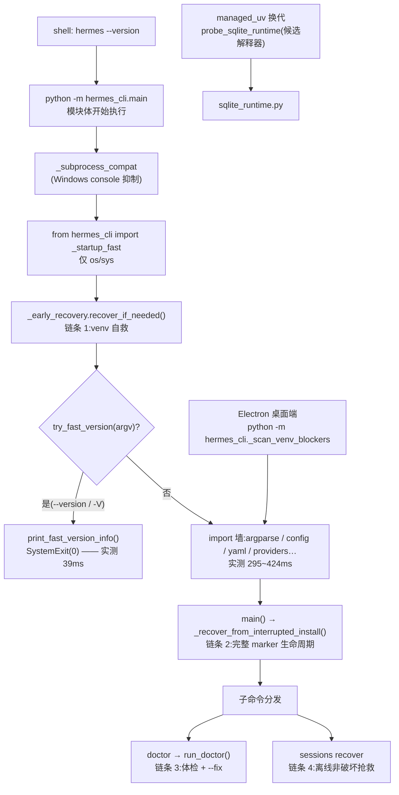

# r8d 底稿 · A2 簇 —— 自愈、启动前自救与诊断

> 研究对象基线:`/home/user/hermes-agent` @ `863e31318553cda8ad61df681d08175364d4164b`(只读)。
> 溯源约定:凡对代码行为的断言,**锚点单独成行、置于代码块之前**,格式 `路径:行号 @ 863e313`。
> 本文是底稿(证据层),求全求证、允许啰嗦。表格里的行号列不带冒号,是为了让引用校验器只对
> "锚点 + 紧跟的代码块"这一种形状计数;表格是索引,不是证据。

**本簇 6 个文件 / 5,006 行(`wc -l` 实测;台账记 5,096,差异来自 `scripts/inventory.py` 的行数规则,不影响结论):**

| 文件 | 行数 | 一句话职责 |
|---|---|---|
| `hermes_cli/doctor.py` | 2777 | `hermes doctor` —— 19 个体检小节 + 15 处 `--fix` 自动修 |
| `hermes_cli/session_recovery.py` | 1447 | 会话库损坏后的**离线、非破坏性**抢救(拷贝→重建→校验) |
| `hermes_cli/_early_recovery.py` | 271 | 跑在 `hermes_cli.main` 一切三方 import **之前**的 venv 自救 |
| `hermes_cli/_startup_fast.py` | 222 | import 墙之前的轻量 helper(`--version` 快路径的唯一实现) |
| `hermes_cli/_scan_venv_blockers.py` | 165 | 给 Electron 桌面端用的、输出 JSON 的 venv 占用扫描 |
| `hermes_cli/sqlite_runtime.py` | 124 | import-safe 地探测**另一个** Python 解释器链接的 SQLite |

---

## 0. 一张图:四条自救链各自跑在什么时刻



四条链的**时间轴位置**完全不同,这是本簇最重要的结构:

1. `_early_recovery` —— **在 main.py 自己的 import 语句执行之前**。能依赖的只有 stdlib。
2. `_recover_from_interrupted_install()`(main.py)—— import 成功之后、子命令分发之前。可以用全部三方包。
3. `doctor` —— 用户主动跑,进程完全健康。
4. `session_recovery` —— 数据损坏,进程健康;**目标文件不可信**。

---

## 1. `_startup_fast.py` —— "import 墙之前"能做什么

### 1.1 它自己 import 了什么(完整枚举)

`hermes_cli/_startup_fast.py:26-29 @ 863e313`
```python
from __future__ import annotations

import os
import sys
```

**模块级只有 `os` 和 `sys`。** 函数级唯一的一处 import 在 `print_fast_version_info` 里:

`hermes_cli/_startup_fast.py:183-186 @ 863e313`
```python
def print_fast_version_info() -> None:
    from hermes_cli import __release_date__, __version__

    print(f"Hermes Agent v{__version__} ({__release_date__})")
```

`hermes_cli/__init__.py` 本身也只 import `os` / `sys`(它只做 `_ensure_utf8()`),所以这条链仍是纯 stdlib。

**枚举的搜索面**(负结论的可信度 = 搜索的完备性):`grep -nE "^[[:space:]]*(import|from)[[:space:]]"`,
对象是 `hermes_cli/_startup_fast.py` 与 `hermes_cli/__init__.py` **两个文件的全部行**(不限缩进,
所以函数内的 import 也在内)。

```verify
cd /home/user/hermes-agent && grep -nE "^[[:space:]]*(import|from)[[:space:]]" hermes_cli/_startup_fast.py hermes_cli/__init__.py
```

**运行时复核**(比 grep 强,因为它抓的是 `sys.modules` 而不是源码字面):

```verify
cd /home/user/hermes-agent && /home/user/hermes-venv/bin/python -c "
import sys
before = set(sys.modules)
import hermes_cli._startup_fast
after = set(sys.modules) - before
third = sorted(m for m in after if m.split('.')[0] not in sys.stdlib_module_names)
print('newly imported non-stdlib top-levels:', sorted({m.split('.')[0] for m in third}))
print('total new modules:', len(after))
"
```

```console
newly imported non-stdlib top-levels: ['hermes_cli']
total new modules: 2
```

仓库自己也有一个守卫测试盯着这条不变量:

`tests/hermes_cli/test_startup_fast_guards.py:27-39 @ 863e313`
```python
# Modules that must NEVER be imported by the fast path. Each one either
# pulls yaml/argparse/logging config or is itself a god-module.
_FORBIDDEN_MODULES = (
    "hermes_cli.config",
    "hermes_cli.main",
    "yaml",
    "argparse",
    "cli",
    "run_agent",
    "model_tools",
    "httpx",
    "openai",
)
```

### 1.2 快路径的入口:两行内联 path math,然后立刻交给 `_startup_fast`

`hermes_cli/main.py:76-83 @ 863e313`
```python
# ── Startup fast-path bootstrap ─────────────────────────────────────────
# Two lines of inline path math so ``python hermes_cli/main.py`` (script
# mode — sys.path[0] is hermes_cli/, not the repo root) can import the
# canonical helpers; everything else lives in hermes_cli._startup_fast.
_bootstrap_root = os.path.realpath(os.path.join(os.path.dirname(__file__), os.pardir))
if _bootstrap_root not in sys.path:
    sys.path.insert(0, _bootstrap_root)
from hermes_cli import _startup_fast  # noqa: E402
```

`hermes_cli/main.py:420-425 @ 863e313`
```python
_ensure_project_root_on_path_fast()

if _try_ultrafast_version():
    raise SystemExit(0)

import argparse
```

注意 `if _try_ultrafast_version(): raise SystemExit(0)` 写在**模块体**里,在 `import argparse` 之上——
`hermes --version` 根本没走到 argparse。

### 1.3 快路径的守门逻辑:false positive 便宜、false negative 昂贵

`hermes_cli/_startup_fast.py:199-222 @ 863e313`
```python
def try_fast_version(argv: list[str] | None = None) -> bool:
    """Handle ``hermes --version`` before the heavy import wall.

    Termux keeps its historical contract (also accepts the ``version``
    subcommand + the HERMES_TERMUX_DISABLE_FAST_CLI escape hatch). Everywhere
    else: only ``--version``/``-V`` (the ``version`` subcommand stays on the
    slow path for full output incl. update check), and never when container
    mode may need to route the command into the container.
    """
    if argv is None:
        argv = sys.argv[1:]
    is_termux = is_termux_env()
    if is_termux and os.environ.get("HERMES_TERMUX_DISABLE_FAST_CLI") == "1":
        return False
    if is_termux:
        if not is_termux_fast_version_argv(argv):
            return False
    elif not is_global_fast_version_argv(argv):
        return False
    elif container_mode_may_be_active():
        return False

    print_fast_version_info()
    return True
```

四条不对称设计,每条都有明确理由:

**(a) Termux 与非 Termux 的 argv 契约不同。** Termux 额外接受 `version` 子命令,并且有
`HERMES_TERMUX_DISABLE_FAST_CLI=1` 逃生舱;非 Termux 只接受 `--version` / `-V`,`version`
子命令留给慢路径(那里要做更新检查)。

`hermes_cli/_startup_fast.py:75-80 @ 863e313`
```python
def is_termux_fast_version_argv(argv: list[str]) -> bool:
    return argv in (["--version"], ["-V"], ["version"])


def is_global_fast_version_argv(argv: list[str]) -> bool:
    return argv in (["--version"], ["-V"])
```

**(b) container-mode 探测故意"宁可误报"。**

`hermes_cli/_startup_fast.py:115-142 @ 863e313`
```python
def container_mode_may_be_active() -> bool:
    """Conservative probe for NixOS container-mode routing.

    False positives are fine (we fall through to the slow path, whose
    ``get_container_exec_info()`` does the authoritative check and routes
    into the container). False negatives are NOT fine — they'd print the
    host's version instead of the container's. Hence: any profile
    ambiguity → assume container mode may be active.
    """
    if os.environ.get("HERMES_DEV") == "1":
        return False
    if is_container_startup_environment():
        return False

    hermes_home = os.environ.get("HERMES_HOME", "").strip()
    if hermes_home:
        if os.path.exists(os.path.join(hermes_home, ".container-mode")):
            return True
        parent_name = os.path.basename(os.path.dirname(os.path.normpath(hermes_home)))
        return (
            parent_name != "profiles"
            and active_profile_may_override_home(hermes_home)
        )

    default_home = os.path.join(os.path.expanduser("~"), ".hermes")
    if active_profile_may_override_home(default_home):
        return True
    return os.path.exists(os.path.join(default_home, ".container-mode"))
```

这段的注释把取舍写死了:误报 → 落回慢路径,慢路径的 `get_container_exec_info()` 做权威判定;
漏报 → 打印**宿主**的版本而不是容器里的版本。所以任何 profile 歧义都当成"可能在 container mode"。
它用到的"我是不是已经在容器里"探测是一个**刻意窄**的版本:

`hermes_cli/_startup_fast.py:83-92 @ 863e313`
```python
def is_container_startup_environment() -> bool:
    """True when we're already INSIDE a container (fast path is then safe)."""
    if os.path.exists("/.dockerenv") or os.path.exists("/run/.containerenv"):
        return True
    try:
        with open("/proc/1/cgroup", encoding="utf-8") as handle:
            cgroup = handle.read()
    except OSError:
        return False
    return "docker" in cgroup or "podman" in cgroup or "/lxc/" in cgroup
```

对比全仓最全的那个容器探测(它还认 Kubernetes、containerd、crio、cgroup v2 的 mountinfo,
并且缓存结果):

`hermes_constants.py:1236-1252 @ 863e313`
```python
def is_container() -> bool:
    """Return True when running inside a container.

    Recognizes Docker (``/.dockerenv``), Podman (``/run/.containerenv``),
    and — via ``/proc/1/cgroup`` — the docker/podman/lxc cgroup-v1 markers.

    cgroup v2 collapses ``/proc/1/cgroup`` to a single ``0::/`` line with no
    runtime marker, so containerd/CRI-O runtimes (the common case on
    Kubernetes/k3s) were previously missed. To cover those, also check:
      * ``KUBERNETES_SERVICE_HOST`` env var — set in every Kubernetes pod.
      * ``kubepods`` / ``containerd`` / ``crio`` markers in ``/proc/1/cgroup``.
      * the same markers in ``/proc/self/mountinfo`` (cgroup-v2 fallback).

    Result is cached for the process lifetime.  Import-safe — no heavy deps.

    See: NousResearch/hermes-agent#47111
    """
```

窄版本的漏判方向是安全的:漏判 → `container_mode_may_be_active()` 继续往下查 `.container-mode`
→ 更容易返回 True → 落回慢路径。**而 `hermes_constants` 是重模块,快路径 import 不起。**

**(c) `read_install_method` 只读 stamp,不做 managed / git / pip 回退。**

`hermes_cli/_startup_fast.py:165-180 @ 863e313`
```python
def read_install_method() -> str | None:
    """Read the installer's ``.install_method`` stamp, if present.

    Only the stamp (step 1 of ``config.detect_install_method``'s resolution
    order) — the managed/git/pip fallbacks need heavier imports and stay on
    the slow path. On the fast path home ambiguity is already excluded:
    ``container_mode_may_be_active()`` bails to the slow path whenever a
    non-default profile might redirect HERMES_HOME.
    """
    stamp = os.path.join(_resolved_home(), ".install_method")
    try:
        with open(stamp, encoding="utf-8") as handle:
            method = handle.read().strip().lower()
        return method or None
    except OSError:
        return None
```

**(d) `read_openai_version` 手动扫 `sys.path` 读 `openai/_version.py`,不 import `importlib.metadata`。**

`hermes_cli/_startup_fast.py:145-162 @ 863e313`
```python
def read_openai_version() -> str | None:
    """Read OpenAI SDK version without importing ``importlib.metadata``."""
    for base in sys.path:
        if not base:
            base = os.getcwd()
        version_file = os.path.join(base, "openai", "_version.py")
        try:
            with open(version_file, encoding="utf-8") as handle:
                for line in handle:
                    stripped = line.strip()
                    if not stripped.startswith("__version__"):
                        continue
                    _key, _sep, value = stripped.partition("=")
                    value = value.split("#", 1)[0].strip().strip("\"'")
                    return value or None
        except OSError:
            continue
    return None
```

全仓只有这一处这么读 OpenAI 版本。搜索面:`grep -rn "_version.py" --include=*.py .`,排除 `./tests/`。

```verify
cd /home/user/hermes-agent && grep -rn "_version.py" --include=*.py . | grep -v "^./tests/"
```

### 1.4 快路径值多少钱(实测)

```verify
cd /home/user/hermes-agent && export HERMES_HOME=/tmp/hermes-r8d-probe && mkdir -p $HERMES_HOME && \
python3 - <<'PY'
import subprocess, time, statistics, os
PY_BIN = "/home/user/hermes-venv/bin/python"
def bench(args, n=5):
    ts=[]
    for _ in range(n):
        t=time.perf_counter()
        subprocess.run([PY_BIN,"-m","hermes_cli.main",*args],capture_output=True,
                       cwd="/home/user/hermes-agent",env=dict(os.environ))
        ts.append(time.perf_counter()-t)
    return min(ts), statistics.median(ts)
for args in (["--version"], ["doctor","--help"], ["version"]):
    lo, med = bench(args)
    print(f"{' '.join(args):18s} min={lo*1000:7.1f}ms  median={med*1000:7.1f}ms")
PY
```

```console
--version          min=   39.4ms  median=   41.2ms
doctor --help      min=  295.0ms  median=  305.0ms
version            min=  423.8ms  median=  443.3ms
```

(这是一次实测的具体数;重跑毫秒数会波动几个百分点——第二次跑到 40.2 / 308.5 / 412.7。
**可复现的结论是量级比:快路径 ≈ 40ms,慢路径 300~430ms,约 7~10 倍。**)

import 条数(`python -X importtime` 输出行数):`--version` **93** 条,`doctor --help` **460** 条。

```verify
cd /home/user/hermes-agent && export HERMES_HOME=/tmp/hermes-r8d-probe && \
echo -n "--version:    " && /home/user/hermes-venv/bin/python -X importtime -m hermes_cli.main --version 2>&1 | grep -c "import time:" && \
echo -n "doctor --help: " && /home/user/hermes-venv/bin/python -X importtime -m hermes_cli.main doctor --help 2>&1 | grep -c "import time:"
```

**◇ 快路径还有一个 docstring 没写、但同样值钱的性质:它不落盘。**

```verify
SB=/tmp/hermes-r8d-probe2; rm -rf $SB; mkdir -p $SB/h1 $SB/h2
cd /home/user/hermes-agent
echo "=== A: after bare --version (fast path) ==="
HERMES_HOME=$SB/h1 /home/user/hermes-venv/bin/python -m hermes_cli.main --version >/dev/null 2>&1; ls -A $SB/h1
echo "=== B: after 'doctor --help' (parser only) ==="
HERMES_HOME=$SB/h2 timeout 120 /home/user/hermes-venv/bin/python -m hermes_cli.main doctor --help >/dev/null 2>&1; ls -A $SB/h2
```

```console
=== A: after bare --version (fast path) ===
=== B: after 'doctor --help' (parser only) ===
SOUL.md
audio_cache
cron
hooks
image_cache
logs
memories
pairing
sessions
skills
```

A 是空的,B 有 10 项。原因在 §3.6 展开(`ensure_hermes_home()` 的副作用)。

### 1.5 "THE canonical" 这个自称:一条负结论 + 一条反例

模块 docstring 的原话:

`hermes_cli/_startup_fast.py:1-18 @ 863e313`
```python
"""Pre-import startup fast paths — THE canonical lightweight helpers.

This module is imported by ``hermes_cli/main.py`` BEFORE its heavy import
wall (config, argparse tree, logging, providers). Everything here must stay
**stdlib-only and cheap** (os/sys file probes; no yaml, no hermes_cli.config,
no argparse). A guard test (``test_startup_fast_import_weight``) subprocess-
imports this module and fails if any heavy module sneaks into sys.modules.

Why this module exists (the bug class it kills): version-printing kept being
reimplemented as ``*_fast()`` copies at the top of main.py (Termux first,
then globally), each duplicating canonical logic — project-root resolution,
container detection, profile detection. The copies drifted: eb4040242
changed the canonical output and referenced ``PROJECT_ROOT`` inside the fast
function, which doesn't exist yet on the fast path → the Termux fast path
NameError'd on --version and nobody noticed. One implementation, imported
by both the fast path and the module constants, makes that drift
structurally impossible; the parity guard test would have caught eb4040242
the day it landed.
```

#### 负结论(成立):`--version` 快路径在全仓只有这一个实现

**搜索面**:`git grep -nI -E "fast_version|ultrafast|fast-version"`,
范围是**全部 git 跟踪文件、不限扩展名**(`.sh` / `.nix` / `.ts` / `.md` / `.toml` 都在内),
唯一排除的是 `tests/` 前缀。

```verify
cd /home/user/hermes-agent && git grep -nI -E "fast_version|ultrafast|fast-version" -- . | grep -v "^tests/"
```

命中全部落在 `hermes_cli/_startup_fast.py` 与 `hermes_cli/main.py`;后者那些是形如
`return _startup_fast.xxx(...)` 的**转发壳**加调用点,没有第二份实现:

`hermes_cli/main.py:374-410 @ 863e313`
```python
def _is_termux_startup_environment_fast() -> bool:
    """Tiny Termux check for pre-import startup shortcuts."""
    return _startup_fast.is_termux_env()


def _is_termux_fast_version_argv(argv: list[str]) -> bool:
    return _startup_fast.is_termux_fast_version_argv(argv)


def _is_global_fast_version_argv(argv: list[str]) -> bool:
    return _startup_fast.is_global_fast_version_argv(argv)


def _is_container_startup_environment_fast() -> bool:
    return _startup_fast.is_container_startup_environment()


def _active_profile_may_override_home_fast(hermes_root: str) -> bool:
    return _startup_fast.active_profile_may_override_home(hermes_root)


def _container_mode_may_be_active_fast() -> bool:
    return _startup_fast.container_mode_may_be_active()


def _read_openai_version_fast() -> str | None:
    """Read OpenAI SDK version without importing ``importlib.metadata``."""
    return _startup_fast.read_openai_version()


def _print_fast_version_info() -> None:
    _startup_fast.print_fast_version_info()


def _try_ultrafast_version() -> bool:
    """Handle ``hermes --version`` before config/logging imports."""
    return _startup_fast.try_fast_version()
```

#### 反例(不成立):同一份 docstring 说"结构上不可能漂移",但 Termux 探测本身在全仓有 5 份 Python 实现,谓词还分两种

**搜索面**:`git grep -nI -E 'TERMUX_VERSION'`,全部 git 跟踪文件,排除 `tests/` 与 `*.md`。

```verify
cd /home/user/hermes-agent && git grep -nI -E 'TERMUX_VERSION' -- . | grep -v "^tests/" | grep -v "\.md:"
```

| 实现处 | 行 | 谓词条数 |
|---|---|---|
| `hermes_cli/_startup_fast.py` `is_termux_env` | 65 | **3**(含 `PREFIX.startswith("/data/data/com.termux/")`) |
| `hermes_cli/main.py` `_is_termux_startup_environment` | 808 | **3**(同上,另接受 `env` 参数) |
| `hermes_constants.py` `is_termux` | 1160 | 2 |
| `hermes_cli/doctor.py`(内联) | 1640 | 2 |
| `hermes_cli/uninstall.py`(内联) | 226 | 2 |
| `scripts/install.sh` / `scripts/lib/node-bootstrap.sh` / `setup-hermes.sh` | 390 / 44 / 39 | 2(shell) |
| `ui-tui/src/lib/termux.ts` | 8 | 2(TS) |

`hermes_cli/_startup_fast.py:65-72 @ 863e313`
```python
def is_termux_env() -> bool:
    """Tiny Termux check for pre-import startup shortcuts."""
    prefix = os.environ.get("PREFIX", "")
    return bool(
        os.environ.get("TERMUX_VERSION")
        or "com.termux/files/usr" in prefix
        or prefix.startswith("/data/data/com.termux/")
    )
```

`hermes_cli/main.py:808-816 @ 863e313`
```python
def _is_termux_startup_environment(env: dict[str, str] | None = None) -> bool:
    """Import-safe Termux check for cold-start-sensitive CLI paths."""
    check = env or os.environ
    prefix = str(check.get("PREFIX", ""))
    return bool(
        check.get("TERMUX_VERSION")
        or "com.termux/files/usr" in prefix
        or prefix.startswith("/data/data/com.termux/")
    )
```

`hermes_constants.py:1160-1167 @ 863e313`
```python
def is_termux() -> bool:
    """Return True when running inside a Termux (Android) environment.

    Checks ``TERMUX_VERSION`` (set by Termux) or the Termux-specific
    ``PREFIX`` path.  Import-safe — no heavy deps.
    """
    prefix = os.getenv("PREFIX", "")
    return bool(os.getenv("TERMUX_VERSION") or "com.termux/files/usr" in prefix)
```

`hermes_cli/doctor.py:1639-1640 @ 863e313`
```python
        _prefix = os.environ.get("PREFIX", "")
        _is_termux_env = bool(os.environ.get("TERMUX_VERSION")) or "com.termux/files/usr" in _prefix
```

`doctor.py` 尤其刺眼:它在文件顶部**已经 import 了** `hermes_constants.is_termux`,却又在
`Command Installation` 一节里内联了一份:

`hermes_cli/doctor.py:71-71 @ 863e313`
```python
from hermes_constants import is_termux as _is_termux
```

调用计数:`main.py` 的重量侧那份被调用 **9 次**,转发到 `_startup_fast` 的那个壳只被调用 **1 次**。

```verify
cd /home/user/hermes-agent && echo "--- 重量侧(非 _fast)---" && grep -rn "_is_termux_startup_environment\b" --include=*.py . && echo "--- 快路径壳(_fast)---" && grep -rn "_is_termux_startup_environment_fast" --include=*.py .
```

**结论:`_startup_fast` 把"版本打印"收敛成了一份,但它自己第一个 helper 的重复实现原封不动还在,
就在同一个 main.py 里,而且被用得更多。** "one implementation … makes that drift structurally
impossible" 这句只对**版本打印**成立,不对模块里其余 helper 成立。

### 1.6 ■ 一处死代码:main.py 里残留的第三个"版本打印点"

`hermes_cli/main.py:10873-10891 @ 863e313`
```python
def _try_termux_fast_cli_launch() -> bool:
    """Run obvious Termux non-TUI chat/oneshot/version paths on a light parser."""
    if not _is_termux_startup_environment():
        return False
    if os.environ.get("HERMES_TERMUX_DISABLE_FAST_CLI") == "1":
        return False

    argv = sys.argv[1:]
    if "-h" in argv or "--help" in argv:
        return False
    # Let the TUI fast path (or full dispatch) handle anything that resolves to
    # the TUI — explicit --tui/env or display.interface=tui. `--cli` forces this
    # to stay False so the classic fast path still runs.
    if _wants_tui_early(argv):
        return False

    if _is_termux_fast_version_argv(argv):
        _print_version_info(check_updates=False)
        return True
```

**这个分支在生产上到不了。** `try_fast_version` 的 Termux 分支只有一个逃生条件:

`hermes_cli/_startup_fast.py:208-219 @ 863e313`
```python
    if argv is None:
        argv = sys.argv[1:]
    is_termux = is_termux_env()
    if is_termux and os.environ.get("HERMES_TERMUX_DISABLE_FAST_CLI") == "1":
        return False
    if is_termux:
        if not is_termux_fast_version_argv(argv):
            return False
    elif not is_global_fast_version_argv(argv):
        return False
    elif container_mode_may_be_active():
        return False
```

于是:若 `HERMES_TERMUX_DISABLE_FAST_CLI != "1"` 且 argv ∈ {`--version`, `-V`, `version`},
模块体那行 `if _try_ultrafast_version(): raise SystemExit(0)` 就已经退出,`main()` 根本不执行;
若 `== "1"`,`_try_termux_fast_cli_launch` 在自己的第二道门就 `return False`。两条路都到不了那行
`_print_version_info(check_updates=False)`。唯一的缝是 **import 之后、`main()` 之前有人改写
`sys.argv` 或 `os.environ`** —— `hermes` console script 是 `hermes_cli.main:main`(先 import 再调,
argv 不变),只有测试或嵌入式调用能构造。

三种 argv 的实测。两个打印器的输出形状可区分:**快路径没有 `Install method:` 行,并以
`Run 'hermes version' for update status.` 收尾**。

```verify
SB=/tmp/hermes-r8d-probe2; mkdir -p $SB/h1; cd /home/user/hermes-agent
echo "=== A: Termux 模拟, --version ==="
HERMES_HOME=$SB/h1 TERMUX_VERSION=0.118 /home/user/hermes-venv/bin/python -m hermes_cli.main --version
echo "=== B: Termux 模拟 + HERMES_TERMUX_DISABLE_FAST_CLI=1, --version ==="
HERMES_HOME=$SB/h1 TERMUX_VERSION=0.118 HERMES_TERMUX_DISABLE_FAST_CLI=1 timeout 120 /home/user/hermes-venv/bin/python -m hermes_cli.main --version 2>&1 | head -8
echo "=== C: Termux 模拟, 'version' 子命令 ==="
HERMES_HOME=$SB/h1 TERMUX_VERSION=0.118 /home/user/hermes-venv/bin/python -m hermes_cli.main version 2>&1 | head -8
```

```console
=== A: Termux 模拟, --version ===
Hermes Agent v0.20.0 (2026.8.3)
Install directory: /home/user/hermes-agent
Python: 3.11.15
OpenAI SDK: 2.24.0
Run 'hermes version' for update status.
=== B: Termux 模拟 + HERMES_TERMUX_DISABLE_FAST_CLI=1, --version ===
Hermes Agent v0.20.0 (2026.8.3) · upstream 628372de
Install directory: /home/user/hermes-agent
Install method: git
Python: 3.11.15
OpenAI SDK: 2.24.0
Update available: 550 commits behind — run 'hermes update'
=== C: Termux 模拟, 'version' 子命令 ===
Hermes Agent v0.20.0 (2026.8.3)
Install directory: /home/user/hermes-agent
Python: 3.11.15
OpenAI SDK: 2.24.0
Run 'hermes version' for update status.
```

A、C 走快路径;B 走的是完整解析后 `args.version` 的分支(带更新检查,`check_updates=True`),
**不是** 那行 `check_updates=False`。三种都没触发它。

(重跑注意:B 段的 `· upstream <sha>` 与 `Update available: N commits behind` 取自**实时远端**,
数值会变——第二次跑拿到的是 `upstream b79e8382`。可复现的是**形状**:
B 有 `Install method:` 行和更新状态行,A / C 都没有,并以 `Run 'hermes version' for update status.` 收尾。)

---

## 2. `_early_recovery.py` —— "自己都还没 import 完"时怎么修

### 2.1 它解决的问题:marker 系统在最需要它的时候恰好不可达

`hermes_cli/_early_recovery.py:1-22 @ 863e313`
```python
"""Dependency-light venv recovery that runs BEFORE hermes_cli.main's imports.

The ``hermes`` console entry point is ``hermes_cli.main:main``.  Importing
``hermes_cli.main`` pulls in third-party packages at module level (``dotenv``
via ``hermes_cli.env_loader``, ``yaml`` via ``hermes_cli.config``, ...).  In
the exact failure state the update-recovery markers exist for — a failed lazy
backend refresh or interrupted core install that wiped a core package's
import files (#57828) — a normal launch crashes *while importing main.py*,
before ``_recover_from_interrupted_install()`` can run.  The marker system is
unreachable precisely when it is needed most.

This module is deliberately **stdlib-only** so importing it can never fail on
a corrupted venv.  ``hermes_cli.main`` imports and calls
:func:`recover_if_needed` at the very top of its module body, before any
third-party import.

Scope: this early pass only repairs enough for ``hermes_cli.main`` to become
importable again (force-reinstall of the known-fragile core packages, using
the pins from pyproject.toml).  It NEVER clears the recovery markers — the
full, confirmed marker lifecycle stays with ``_recover_from_interrupted_install()``
in main.py, which runs right after import succeeds.
"""
```

因果链:`hermes update` 的 lazy backend refresh 半途失败(#57828),留下**分发元数据完好、
`.py` 文件被抹掉**的核心包 → 正常启动在 `import hermes_cli.env_loader`(拉 `dotenv`)/
`import hermes_cli.config`(拉 `yaml`)时崩溃 → 而处理 marker 的
`_recover_from_interrupted_install()` 写在 main.py 里,要等 import 成功才跑。
**修复代码被它要修的东西挡在门外。**

### 2.2 "dependency-light" 的边界画在哪(完整枚举)

`hermes_cli/_early_recovery.py:24-31 @ 863e313`
```python
from __future__ import annotations

import importlib
import os
import subprocess
import sys
import time
from pathlib import Path
```

模块级:`importlib` / `os` / `subprocess` / `sys` / `time` / `pathlib.Path`,全是 stdlib。
函数级还有两处,都包在 `try` 里:`tomllib`(3.11+ stdlib)与 `certifi`
(**故意的探测对象**,失败即判 broken)。

**搜索面**:`grep -nE "^[[:space:]]*(import|from)[[:space:]]"`,对象是该文件**全部 271 行**,
不限缩进。

```verify
cd /home/user/hermes-agent && grep -nE "^[[:space:]]*(import|from)[[:space:]]" hermes_cli/_early_recovery.py
```

仓库自己有一个测试把这条界钉死:劫持 `builtins.__import__`,把**一切非 stdlib 顶层包**的 import
变成 ImportError,然后 import 本模块。白名单是 `sys.stdlib_module_names | {"hermes_cli"}` ——
连同包内其他模块都不许 import:

`tests/hermes_cli/test_early_recovery.py:104-125 @ 863e313`
```python
def test_early_recovery_module_is_stdlib_only(tmp_path):
    """The module must import in a process where every non-stdlib import
    fails — that is the whole point of its existence."""
    script = tmp_path / "stdlib_only.py"
    script.write_text(
        textwrap.dedent(
            """
            import builtins
            import sys

            STDLIB = set(sys.stdlib_module_names) | {"hermes_cli"}
            real_import = builtins.__import__

            def guard(name, *args, **kwargs):
                top = name.split(".")[0]
                if top not in STDLIB:
                    raise ImportError(f"non-stdlib import blocked: {name}")
                return real_import(name, *args, **kwargs)

            builtins.__import__ = guard
            import hermes_cli._early_recovery  # noqa: F401
            print("STDLIB_ONLY_OK")
```

### 2.3 探测表:import 探针 + 属性哨兵 + certifi 的额外文件检查

`hermes_cli/_early_recovery.py:33-56 @ 863e313`
```python
# Core packages a failed lazy ``uv pip install`` is known to leave with intact
# distribution metadata but wiped import files (#57828).  ``module`` is what we
# probe via a real import; ``attr`` guards against an empty/stub module.
# main.py's marker-recovery path reuses these tables — keep them here (the
# dependency-light module) so both layers probe and repair the same set.
LAZY_REFRESH_IMPORT_PROBES: tuple[tuple[str, str], ...] = (
    ("yaml", "SafeDumper"),
    ("dotenv", "load_dotenv"),
    ("click", "Command"),
    ("certifi", "contents"),
    ("rich", "print"),
    ("cryptography", "__version__"),
    ("jwt", "encode"),
)

LAZY_REFRESH_REPAIR_PACKAGES: dict[str, str] = {
    "yaml": "PyYAML",
    "dotenv": "python-dotenv",
    "click": "click",
    "certifi": "certifi",
    "rich": "rich",
    "cryptography": "cryptography",
    "jwt": "PyJWT",
}
```

为什么用**真 import** 而不是 `importlib.util.find_spec`:#57828 的失败态里 dist-info 还在、
spec 也找得到,只有 `.py` 被抹了。属性哨兵(`yaml.SafeDumper`、`dotenv.load_dotenv` …)
再挡一层"空壳模块"。

certifi 是唯一有额外检查的:

`hermes_cli/_early_recovery.py:95-114 @ 863e313`
```python
def _certifi_bundle_broken() -> bool:
    """True when certifi imports but its ``cacert.pem`` is missing/corrupt.

    A brew Python upgrade or an interrupted venv rebuild can leave certifi's
    distribution metadata (and even the module) intact while the bundled
    ``cacert.pem`` is gone or a dangling symlink — every TLS connection then
    fails with an opaque ``Could not find a suitable TLS CA certificate
    bundle`` from deep inside httpx/requests (#29866). An attribute probe
    alone passes in that state, so validate the bundle path itself.
    """
    try:
        import certifi

        bundle = Path(certifi.where())
        # <1 KiB cannot hold a single PEM certificate — treat as corrupt.
        return not bundle.is_file() or bundle.stat().st_size < 1024
    except Exception:
        # Import failure is caught by the regular probe table; a failure to
        # even stat is treated as broken.
        return True
```

`hermes_cli/_early_recovery.py:117-139 @ 863e313`
```python
def _probe_broken_packages() -> list[str]:
    """Import-probe the fragile core packages in THIS process.

    Returns repair package names (deduped, probe order) for modules that fail
    to import or lack their sentinel attribute.  Failed imports leave nothing
    in ``sys.modules``, so a post-repair retry in the same process works.

    certifi additionally gets a bundle-file check: the module can import
    cleanly while ``cacert.pem`` is missing (#29866).
    """
    broken: list[str] = []
    for mod_name, attr in LAZY_REFRESH_IMPORT_PROBES:
        try:
            mod = importlib.import_module(mod_name)
            if not hasattr(mod, attr):
                raise ImportError(f"{mod_name} missing {attr}")
            if mod_name == "certifi" and _certifi_bundle_broken():
                raise ImportError("certifi cacert.pem missing or corrupt")
        except Exception:
            pkg = LAZY_REFRESH_REPAIR_PACKAGES.get(mod_name)
            if pkg and pkg not in broken:
                broken.append(pkg)
    return broken
```

`< 1024` 字节即判损坏 —— 一个 PEM 证书装不下。这条来自 #29866:brew 升 Python 后
`cacert.pem` 变悬空符号链接,`import certifi` 正常,但每次 TLS 都在 httpx/requests 深处
报 "Could not find a suitable TLS CA certificate bundle"。

### 2.4 入口纪律:五道门 + 单飞锁 + 绝不清 marker

`hermes_cli/_early_recovery.py:190-223 @ 863e313`
```python
def recover_if_needed(
    project_root: Path | None = None,
    argv: list[str] | None = None,
) -> None:
    """Repair wiped core packages so ``hermes_cli.main`` can import at all.

    Fast path (no marker present) is two ``lstat`` calls.  Only acts when a
    recovery marker from a prior ``hermes update`` exists AND an import probe
    confirms a core package is actually broken.  Markers are intentionally
    NOT cleared here — ``_recover_from_interrupted_install()`` in main.py owns
    the confirmed marker lifecycle and runs immediately after import succeeds.

    Never raises: on any failure the import of main.py proceeds and surfaces
    the real error.
    """
    try:
        args = sys.argv[1:] if argv is None else argv
        # Same deliberately-loose match as main(): the real update flow writes
        # and clears its own markers — a recovery install must not race it.
        if "update" in args:
            return
        root = _project_root() if project_root is None else project_root
        if _pytest_owns_live_checkout(root):
            return
        core_marker = root / ".update-incomplete"
        lazy_marker = root / ".lazy-refresh-incomplete"
        if not core_marker.exists() and not lazy_marker.exists():
            return
        # Managed/Docker/PyPI installs have no source tree here — the marker
        # is not ours to act on; main.py's recovery clears it.
        if not (root / "pyproject.toml").is_file():
            return

        broken = _probe_broken_packages()
```

五道门依次是:

1. **`"update" in args` 就退出。** 与 main.py 的完整恢复用**同一条故意松的匹配**;main.py
   把理由写全了:argv 还没解析,过度匹配只是推迟一轮恢复,匹配不足会让恢复安装与真正的
   update 抢同一个 venv,"Loose wins"。

`hermes_cli/main.py:11210-11224 @ 863e313`
```python
    # Self-heal a venv left half-built by an interrupted ``hermes update``
    # (Ctrl-C, terminal close, WSL OOM mid-install). Skip when the user is
    # *running* update — that flow writes and clears its own marker, and we
    # don't want a recovery install racing the real one. Never raises.
    #
    # The substring match is deliberately loose: argv isn't parsed yet at this
    # point, and the failure modes are asymmetric. Over-matching (e.g.
    # ``hermes skills install update``) merely defers recovery one launch;
    # under-matching (missing ``hermes -p work update``) would race a recovery
    # install against the real one. Loose wins.
    try:
        if "update" not in sys.argv[1:]:
            _recover_from_interrupted_install()
    except Exception:
        pass
```

2. **pytest 自有 checkout 守卫**:在测试套件里跑真 `ensurepip` + `pip --force-reinstall`
   是灾难,但 sandbox 到 tmp_path 的测试不受影响。

`hermes_cli/_early_recovery.py:174-187 @ 863e313`
```python
def _pytest_owns_live_checkout(root: Path) -> bool:
    """True when running under pytest AND ``root`` is this module's own
    checkout — the one whose venv is executing the suite right now.

    Lifecycle tests spawn real subprocesses that import ``hermes_cli.main``
    with recovery armed; ``PYTEST_CURRENT_TEST`` rides the inherited env into
    those children. Without this guard, a genuinely-broken dev venv gets a
    REAL ``ensurepip`` + ``pip install --force-reinstall`` from inside a
    running test suite. Tests that sandbox ``project_root`` to a tmp_path are
    unaffected (same posture as ``managed_scope._under_pytest``)."""
    return (
        "PYTEST_CURRENT_TEST" in os.environ
        and root == Path(__file__).resolve().parent.parent
    )
```

3. **无 marker 即返回。** docstring 自称"两次 lstat";实际是两次 `Path.exists()`(= `os.stat`),
   外加一次 `Path(__file__).resolve()`。措辞略松,量级无误。
4. **没有 `pyproject.toml` 就不是我的活** —— managed / Docker / PyPI 安装没有源码树,
   marker 交给 main.py 的完整恢复去清。
5. **探针确认真坏才动手**,否则让 main.py 走完整流程。

然后是单飞锁:

`hermes_cli/_early_recovery.py:228-243 @ 863e313`
```python
        # Single-flight: share main.py's recovery lock so an early repair
        # never races a concurrent full recovery into the same shared venv.
        lock_path = root / ".update-incomplete.lock"
        try:
            fd = os.open(lock_path, os.O_CREAT | os.O_EXCL | os.O_WRONLY)
            os.write(fd, f"{os.getpid()}\n".encode())
            os.close(fd)
        except FileExistsError:
            try:
                if time.time() - lock_path.stat().st_mtime > 3600:
                    lock_path.unlink()
            except OSError:
                pass
            return
        except OSError:
            pass  # read-only fs / perms — proceed unlocked, install surfaces it
```

`O_CREAT|O_EXCL` 原子占位;发现已存在则看 mtime,超 3600 秒判为崩溃残留并删掉
(**本轮仍然退出**,下一轮才可能拿到);创建失败(只读 fs / 权限)则不加锁继续,让 install
自己去报真正的错。锁文件路径与 main.py 完整恢复用的是**同一个** `.update-incomplete.lock`
(见下一段的 `main.py` 摘录),所以早期修复不会和并发的完整恢复撞进同一个共享 venv。

**最关键的一条纪律:早期修复永不清 marker。** marker 的确认式生命周期归 main.py:

`hermes_cli/main.py:7715-7742 @ 863e313`
```python
def _recover_from_interrupted_install() -> None:
    """Finish update work left half-done by a prior ``hermes update``.

    Handles two independent breadcrumbs:

    - ``.update-incomplete`` — core ``.[all]`` install interrupted. Recovers
      via full quarantined reinstall. Never cleared by the narrow lazy-refresh
      import probes alone.
    - ``.lazy-refresh-incomplete`` — lazy-backend refresh may have corrupted
      packages. Recovers via package-only import probes; cleared only when
      probes confirm healthy/repaired (indeterminate keeps the marker).

    Never raises: a recovery failure must not block launch.  If it can't
    self-heal it prints the manual command and leaves the relevant marker so
    the next launch tries again.

    Concurrency: markers live next to the shared venv, so a gateway start
    plus a CLI launch (or two profiles starting at once) can both see them.
    An ``O_EXCL`` lockfile ensures only one process runs recovery; the
    others skip and let the winner clear markers.

    Output: everything — our status lines AND the streamed pip/uv install
    (which inherits fd 1) — is routed to stderr.  Launches whose stdout is a
    protocol stream (``hermes acp`` speaks JSON-RPC on stdout) must never get
    install noise on stdout.
    """
    if _pytest_owns_live_checkout(PROJECT_ROOT):
        return
```

`hermes_cli/main.py:7756-7772 @ 863e313`
```python
    # Single-flight guard: atomically claim the recovery lock. If another
    # process holds it, skip — it is running the same reinstall into the same
    # shared venv right now. A crashed holder leaves a stale lock; break it
    # after an hour (well past any realistic install) so recovery can't be
    # wedged forever.
    lock_path = PROJECT_ROOT / ".update-incomplete.lock"
    try:
        fd = os.open(lock_path, os.O_CREAT | os.O_EXCL | os.O_WRONLY)
        os.write(fd, f"{os.getpid()}\n".encode())
        os.close(fd)
    except FileExistsError:
        try:
            if _time.time() - lock_path.stat().st_mtime > 3600:
                lock_path.unlink()
        except OSError:
            pass
        return
```

其中 `.lazy-refresh-incomplete` 只在探针**确认健康 / 已修复**时才清,`indeterminate`
(探针跑不了)保留 marker —— "跑不了"不等于"没病":

`hermes_cli/main.py:7809-7830 @ 863e313`
```python
def _recover_lazy_refresh_marker_locked() -> None:
    """Heal ``.lazy-refresh-incomplete`` via confirmed import-probe repair."""
    print(
        "⚠ A previous lazy-backend refresh may have left the venv unhealthy — "
        "running import-based package repair..."
    )
    install_prefix, install_env = _default_venv_install_target()
    status = _repair_venv_via_import_probes(install_prefix, env=install_env)
    if status in ("healthy", "repaired"):
        _clear_lazy_refresh_incomplete_marker()
        print("✓ Lazy-refresh venv recovery confirmed — install is healthy again.")
        return
    if status == "indeterminate":
        print(
            "  ⚠ Import probes unavailable — cannot confirm venv health. "
            "Leaving `.lazy-refresh-incomplete` for the next launch."
        )
    else:
        print(
            "  ⚠ Lazy-refresh package repair incomplete. "
            "Leaving `.lazy-refresh-incomplete` for the next launch."
        )
```

### 2.5 两层共用一张表 —— 这是"防漂移"的正面例子

`hermes_cli/main.py:8251-8262 @ 863e313`
```python
# Import probes for venv corruption after a failed lazy ``uv pip install``.
# Metadata can look fine while ``.py`` files were removed mid-install (#57828).
# Canonical tables live in the stdlib-only ``_early_recovery`` module (which
# also probes/repairs BEFORE this module's third-party imports can run) so the
# early and full recovery layers can never drift apart.
_LAZY_REFRESH_IMPORT_PROBES: tuple[tuple[str, str], ...] = (
    _early_recovery_mod.LAZY_REFRESH_IMPORT_PROBES
)

_LAZY_REFRESH_REPAIR_PACKAGES: dict[str, str] = (
    _early_recovery_mod.LAZY_REFRESH_REPAIR_PACKAGES
)
```

早期层与完整层探同一组包、修同一组包,因为表只有一份、住在依赖最轻的那个模块里。

### 2.6 输出纪律:一律 stderr

`hermes_cli/_early_recovery.py:142-171 @ 863e313`
```python
def _run_repair_install(specs: list[str], project_root: Path) -> bool:
    """ensurepip + ``pip install --force-reinstall`` the given specs.

    Streams nothing to stdout (``hermes acp`` speaks JSON-RPC on stdout);
    output is captured and replayed to stderr only on failure.  Never raises.
    """
    try:
        subprocess.run(
            [sys.executable, "-m", "ensurepip", "--upgrade", "--default-pip"],
            cwd=project_root,
            capture_output=True,
        )
    except Exception:
        pass
    try:
        result = subprocess.run(
            [sys.executable, "-m", "pip", "install", "--force-reinstall", *specs],
            cwd=project_root,
            capture_output=True,
            text=True, encoding="utf-8", errors="replace",
        )
    except Exception as exc:
        print(f"  ✗ Early venv repair could not run pip: {exc}", file=sys.stderr)
        return False
    if result.returncode != 0:
        tail = (result.stderr or result.stdout or "")[-2000:]
        if tail:
            print(tail, file=sys.stderr)
        return False
    return True
```

`hermes acp` 在 stdout 上讲 JSON-RPC,所以修复过程的 pip 输出被 capture 后只在失败时回放到
stderr。main.py 的完整恢复更狠,直接把 fd 1 重定向到 fd 2,连子进程继承的 stdout 都收编:

`hermes_cli/main.py:7778-7796 @ 863e313`
```python
    saved_stdout_fd = None
    saved_sys_stdout = sys.stdout
    try:
        # Route Python-level prints AND subprocess-inherited fd 1 to stderr
        # for the duration of recovery (see docstring: ACP stdout safety).
        try:
            saved_stdout_fd = os.dup(1)
            os.dup2(2, 1)
        except OSError:
            saved_stdout_fd = None
        sys.stdout = sys.stderr

        if lazy_marker:
            _recover_lazy_refresh_marker_locked()

        if _update_marker_path().exists():
            _recover_core_update_marker_locked()
    finally:
        sys.stdout = saved_sys_stdout
```

### 2.7 ■ 一个小缺陷:`click` 没有 pin,"用 pyproject 的 pin"这句对它不成立

`hermes_cli/_early_recovery.py:63-92 @ 863e313`
```python
def _pinned_specs(packages: list[str], project_root: Path) -> list[str]:
    """Map bare package names to their pinned specs from pyproject.toml.

    Stdlib-only (tomllib + naive requirement-head parsing — ``packaging`` may
    itself be broken in the failure state this module exists for).  Unknown
    packages fall back to their bare name.
    """
    pyproject = project_root / "pyproject.toml"
    if not pyproject.is_file():
        return packages
    try:
        import tomllib

        with open(pyproject, "rb") as f:
            raw_deps = tomllib.load(f).get("project", {}).get("dependencies", []) or []
    except Exception:
        return packages

    name_to_spec: dict[str, str] = {}
    for spec in raw_deps:
        head = spec.split(";", 1)[0].strip()
        bare = head
        for op in ("==", ">=", "<=", "~=", ">", "<", "!="):
            if op in bare:
                bare = bare.split(op, 1)[0]
                break
        key = bare.strip().split("[", 1)[0].strip().lower()
        if key:
            name_to_spec[key] = head
    return [name_to_spec.get(pkg.lower(), pkg) for pkg in packages]
```

最后一行 `name_to_spec.get(pkg.lower(), pkg)` —— 查不到就**退回裸包名**。而修复表里的 7 个包中,
`click` 不在 `[project].dependencies` 里(它是 `uvicorn` 的传递依赖):

```verify
cd /home/user/hermes-agent && /home/user/hermes-venv/bin/python - <<'PY'
import sys
sys.path.insert(0,'/home/user/hermes-agent')
from hermes_cli._early_recovery import LAZY_REFRESH_REPAIR_PACKAGES, _pinned_specs, _project_root
pkgs = list(dict.fromkeys(LAZY_REFRESH_REPAIR_PACKAGES.values()))
print("repair packages:", pkgs)
print("pinned specs   :", _pinned_specs(pkgs, _project_root()))
PY
```

```console
repair packages: ['PyYAML', 'python-dotenv', 'click', 'certifi', 'rich', 'cryptography', 'PyJWT']
pinned specs   : ['pyyaml==6.0.3', 'python-dotenv==1.2.2', 'click', 'certifi==2026.5.20', 'rich==14.3.3', 'cryptography==48.0.1', 'PyJWT[crypto]==2.13.0']
```

7 个里 6 个拿到 `==` 精确 pin,`click` 拿到裸名。也就是说 `click` 被抹掉时,早期修复会装
**当时的最新版**,而不是这次发行版验证过的版本。严重度低(pip 仍会对着已装的 `uvicorn` 报冲突),
但与 docstring 的 "using the pins from pyproject.toml" 不完全相符。
另注意 `PyJWT[crypto]==2.13.0` 的 extras 被完整保留了 —— 那段朴素解析(先切 `;`、再切比较符、
最后切 `[`)只把 `[` 之前的部分当**键**,值仍是完整的 requirement 头,这点是对的。

### 2.8 行为规格:测试怎么钉住这套东西

```verify
cd /home/user/hermes-agent && HERMES_PYTHON=/home/user/hermes-venv/bin/python bash scripts/run_tests.sh tests/hermes_cli/test_early_recovery.py
```

3 个用例全过。最有意思的是"负控制":它证明 shadow 真的能把 main.py 的 import 打崩,
**并且恢复钩子确实在崩溃之前被调用过**——也就是"如果那时真去修,是来得及的":

`tests/hermes_cli/test_early_recovery.py:91-99 @ 863e313`
```python
def test_broken_dotenv_crashes_main_import_without_repair(tmp_path):
    """Negative control: the shadow really breaks importing hermes_cli.main,
    and recovery was invoked BEFORE the crash (i.e. before third-party
    imports) — so a real repair at that point can save the launch."""
    result = _run_lifecycle_subprocess(tmp_path, repair=False)
    assert result.returncode != 0
    assert "EARLY_RECOVERY_CALLED" in result.stdout
    assert "MAIN_IMPORTED_OK" not in result.stdout
    assert "wiped mid-install" in result.stderr
```

以及 pin 解析 + marker 不清 + 锁已释放的三合一断言:

`tests/hermes_cli/test_early_recovery.py:166-184 @ 863e313`
```python
def test_marker_plus_broken_probe_repairs_with_pinned_specs(tmp_path, monkeypatch):
    root = _project(tmp_path)
    marker = root / ".lazy-refresh-incomplete"
    marker.write_text("x", encoding="utf-8")

    probe_results = iter([["PyYAML", "python-dotenv"], []])
    monkeypatch.setattr(er, "_probe_broken_packages", lambda: next(probe_results))
    installs = []
    monkeypatch.setattr(
        er, "_run_repair_install", lambda specs, r: installs.append(specs) or True
    )

    er.recover_if_needed(project_root=root, argv=[])

    assert installs == [["PyYAML==6.0.2", "python-dotenv==1.2.2"]]
    # Marker lifecycle belongs to main.py's full recovery — never cleared here.
    assert marker.exists()
    # Lock released for the full recovery pass.
    assert not (root / ".update-incomplete.lock").exists()
```

---

## 3. `doctor.py` —— 检查什么、能修什么、只报什么

### 3.1 19 个小节(按 `_section("...")` 在文件里的出现处;运行时顺序见 §3.7 实跑)

**搜索面**:`grep -n '_section("' hermes_cli/doctor.py`,全文件。

```verify
cd /home/user/hermes-agent && grep -n '_section("' hermes_cli/doctor.py
```

| # | 小节 | 定义行 | 检查内容 |
|---|---|---|---|
| 1 | Security Advisories | 757 | 供应链投毒公告;`--ack` 可静默 |
| 2 | MCP Server Security | 803 | 扫 `mcp_servers` 的可疑 stdio 命令 |
| 3 | Python Environment | 827 | Python 版本 / **链接的 SQLite** / venv / 版本文件一致性 |
| 4 | SSL / CA Certificates | 881 | 唯一一个 `--fix` 会跑 pip 的检查 |
| 5 | Required Packages | 884 | 5 必需 + 3 可选,靠 `__import__` |
| 6 | Configuration Files | 913 | .env / config.yaml / 版本迁移 / 陈旧键 / 弃用键 |
| 7 | Config Structure | 1320 | 仅当 `validate_config_structure()` 有输出才出现 |
| 8 | xAI Model Retirement | 1346 | 硬编码退役模型清单 |
| 9 | Auth Providers | 1371 | Nous / Codex / MiniMax / xAI OAuth 登录态 |
| 10 | Directory Structure | 1429 | HERMES_HOME 骨架 / SOUL.md / **state.db 健康** / WAL 体积 |
| 11 | Gateway Service | 575 | systemd linger(Linux、非 s6) |
| 12 | s6 Supervision | 433 | 容器内 s6 才出现 |
| 13 | Command Installation | 1629 | 非 Windows;venv 入口点 + `~/.local/bin/hermes` 软链 |
| 14 | External Tools | 1703 | git / rg / docker / ssh / daytona / vercel / node / agent-browser / chromium / npm audit |
| 15 | API Connectivity | 2105 | 线程池并行探活 |
| 16 | Tool Availability | 2534 | toolset 可用性 + runtime-gated 修正 |
| 17 | Skills Hub | 2564 | `.hub/lock.json` + quarantine 计数 |
| 18 | Memory Provider | 2605 | 内置 / honcho / mem0 / 泛化插件 |
| 19 | Profiles | 2713 | 仅当存在非 default profile |

四种输出原语 + 一个组合子:

`hermes_cli/doctor.py:206-228 @ 863e313`
```python
def check_ok(text: str, detail: str = ""):
    print(f"  {color('✓', Colors.GREEN)} {text}" + (f" {color(detail, Colors.DIM)}" if detail else ""))

def check_warn(text: str, detail: str = ""):
    print(f"  {color('⚠', Colors.YELLOW)} {text}" + (f" {color(detail, Colors.DIM)}" if detail else ""))

def check_fail(text: str, detail: str = ""):
    print(f"  {color('✗', Colors.RED)} {text}" + (f" {color(detail, Colors.DIM)}" if detail else ""))

def check_info(text: str):
    print(f"    {color('→', Colors.CYAN)} {text}")


def _section(title: str) -> None:
    """Print a doctor section banner: blank line + bold cyan ◆ title."""
    print()
    print(color(f"◆ {title}", Colors.CYAN, Colors.BOLD))


def _fail_and_issue(text: str, detail: str, fix: str, issues: list[str]) -> None:
    """Emit a check_fail and append the corresponding fix instruction."""
    check_fail(text, detail)
    issues.append(fix)
```

全文件 204 处 `check_*`、30 处 `issues.append` / `manual_issues.append`。

```verify
cd /home/user/hermes-agent && echo -n "check_* 调用: " && grep -c "check_ok(\|check_warn(\|check_fail(\|check_info(" hermes_cli/doctor.py && echo -n "issue 登记 : " && grep -c "issues.append(\|manual_issues.append(" hermes_cli/doctor.py
```

**两条 issue 队列**:`issues`(一般问题)与 `manual_issues`(无法自动修的),最后合并打印;
`--fix` 修好的数量单独统计:

`hermes_cli/doctor.py:2750-2772 @ 863e313`
```python
    print()
    remaining_issues = issues + manual_issues
    if should_fix and fixed_count > 0:
        print(color("─" * 60, Colors.GREEN))
        print(color(f"  Fixed {fixed_count} issue(s).", Colors.GREEN, Colors.BOLD), end="")
        if remaining_issues:
            print(color(f" {len(remaining_issues)} issue(s) require manual intervention.", Colors.YELLOW, Colors.BOLD))
        else:
            print()
        print()
        if remaining_issues:
            for i, issue in enumerate(remaining_issues, 1):
                print(f"  {i}. {issue}")
            print()
    elif remaining_issues:
        print(color("─" * 60, Colors.YELLOW))
        print(color(f"  Found {len(remaining_issues)} issue(s) to address:", Colors.YELLOW, Colors.BOLD))
        print()
        for i, issue in enumerate(remaining_issues, 1):
            print(f"  {i}. {issue}")
        print()
        if not should_fix:
            print(color("  Tip: run 'hermes doctor --fix' to auto-fix what's possible.", Colors.DIM))
```

### 3.2 `--fix` 到底修哪 15 件事(完整枚举)

**搜索面**:`grep -n "should_fix\|fixed_count" hermes_cli/doctor.py`,全文件;逐处回读上下文确认动作。

```verify
cd /home/user/hermes-agent && grep -n "should_fix\|fixed_count" hermes_cli/doctor.py
```

| # | 行 | 触发条件 | 动作 |
|---|---|---|---|
| 1 | 494-540 | certifi CA bundle 坏 | `pip install --force-reinstall certifi` + 清 `sys.modules` + `invalidate_caches()` + 复验 |
| 2 | 940-952 | `~/.hermes/.env` 缺失 | `touch` + `chmod 0600` |
| 3 | 1162-1172 | `config.yaml` 与 `cli-config.yaml` 都缺 | 从 `cli-config.yaml.example` 拷贝,否则写 `DEFAULT_CONFIG` |
| 4 | 1187-1194 | config 版本落后 | `migrate_config(interactive=False)` |
| 5 | 1213-1236 | 根级陈旧键 `provider` / `base_url` | 迁进 `model:` 段,`atomic_config_write` |
| 6 | 1275-1287 | `.env` 里的 `HERMES_MAX_ITERATIONS` 影子 | `remove_env_value` 删掉 |
| 7 | 1433-1436 | HERMES_HOME 不存在 | `mkdir -p` |
| 8 | 1446-1449 | 5 个期望子目录缺失 | `mkdir -p` |
| 9 | 1465-1474 | `SOUL.md` 缺失 | 写一份模板 |
| 10 | 1494-1497 | `memories/` 缺失 | `mkdir -p` |
| 11 | 1523-1543 | state.db **写健康探针**失败(FTS 索引损坏) | `repair_state_db_schema()`(先备份) |
| 12 | 1561-1594 | `sqlite_master` malformed | 同上,不同触发路径 |
| 13 | 1610-1619 | WAL > 50 MB | `PRAGMA wal_checkpoint(PASSIVE)` |
| 14 | 1671-1677 | `~/.local/bin/hermes` 软链指错 | `unlink` + 重建 |
| 15 | 1686-1701 | 该软链缺失 | 创建 + 检查 PATH |

第 7~10 项在正常流程下**够不到**,见 §3.6。

`--fix` 唯一一处会真的跑 pip 的地方(注意:装进**当前解释器**的环境):

`hermes_cli/doctor.py:494-505 @ 863e313`
```python
    # --fix: force-reinstall certifi into the running interpreter's env and
    # re-verify. importlib caches are invalidated so certifi.where() resolves
    # the fresh install without a process restart.
    check_fail("SSL CA certificate bundle is broken", first_error)
    print("    → Repairing: force-reinstalling certifi...")
    try:
        result = subprocess.run(
            [sys.executable, "-m", "pip", "install", "--force-reinstall", "certifi"],
            capture_output=True,
            text=True,
            timeout=300,
        )
```

`hermes_cli/doctor.py:524-541 @ 863e313`
```python
    # Drop any cached certifi module so where() re-resolves the new bundle.
    import importlib
    for mod_name in [m for m in sys.modules if m == "certifi" or m.startswith("certifi.")]:
        sys.modules.pop(mod_name, None)
    importlib.invalidate_caches()

    try:
        verify_ca_bundle_with_fallback()
        check_ok("SSL CA certificate bundle repaired (certifi reinstalled)")
    except SSLConfigurationError as e:
        check_fail("SSL CA certificate bundle still broken after reinstall", str(e))
        if issues is not None:
            issues.append(
                "certifi reinstall did not restore the CA bundle — check for a "
                "custom CA env var (SSL_CERT_FILE/REQUESTS_CA_BUNDLE) pointing "
                "at a missing file, or recreate the venv."
            )

```

清 `sys.modules["certifi*"]` + `invalidate_caches()` 是为了让同一进程内的 `certifi.where()`
解析到新装的 bundle,不必重启。

**只报不修的典型**(为什么不修,代码里写了理由):

`hermes_cli/doctor.py:844-869 @ 863e313`
```python
    # Linked SQLite library (issue #69784): version + source id matter independently
    # of the Python minor — uv's python-build-standalone can keep a vulnerable
    # SQLite across Python upgrades.
    try:
        import sqlite3
        from hermes_state import is_sqlite_wal_reset_vulnerable, sqlite_source_id

        _sqlite_ver = sqlite3.sqlite_version
        _sqlite_src = sqlite_source_id()
        _sqlite_src_short = (
            (_sqlite_src[:48] + "…") if len(_sqlite_src) > 48 else _sqlite_src
        )
        if is_sqlite_wal_reset_vulnerable():
            # Warn-only: Hermes already refuses to enable WAL on fresh DBs.
            # Do not append to ``issues`` because runtime repair remains
            # best-effort and unsupported installs may need manual action.
            check_warn(
                f"SQLite {_sqlite_ver} (WAL-reset bug)",
                _sqlite_upgrade_hint(),
            )
        else:
            check_ok(f"SQLite {_sqlite_ver}")
        if _sqlite_src_short:
            check_info(f"SQLite source id: {_sqlite_src_short}")
    except Exception as e:
        check_warn(f"SQLite version probe failed: {e}")
```

SQLite WAL-reset 漏洞 **warn-only 且不进 `issues`**:运行时修复只是尽力而为,非受管安装可能
需要人手介入。弃用键同理,只警告、不自动迁移(迁移逻辑住在 config.py 的版本步骤里):

`hermes_cli/doctor.py:231-238 @ 863e313`
```python
# Deprecated / legacy config keys still read for back-compat. Doctor surfaces
# them as non-failing warnings with the modern replacement — it does not
# auto-migrate or delete (migrations live in config.py version steps).
_DEPRECATED_CONFIG_KEYS: tuple[tuple[str, str, str], ...] = (
    # (section, key, replacement)
    ("display", "tool_progress_overrides", "display.platforms"),
    ("delegation", "max_async_children", "delegation.max_concurrent_children"),
)
```

`hermes_cli/doctor.py:304-326 @ 863e313`
```python
def report_deprecated_config_and_env(
    raw_config: dict | None = None,
    env_map: dict | None = None,
) -> list[tuple[str, str]]:
    """Emit non-failing doctor warnings for deprecated config keys and env vars.

    Returns the list of ``(legacy, replacement)`` findings that were reported
    (empty when nothing deprecated is present). Does not mutate config/env and
    does not append to the blocking ``issues`` list.
    """
    findings = collect_deprecated_config_keys(raw_config)
    findings.extend(collect_deprecated_env_vars(env_map))
    if not findings:
        check_ok("No deprecated config keys or env vars")
        return findings

    for legacy, replacement in findings:
        check_warn(
            f"Deprecated: {legacy}",
            f"(use {replacement} instead)",
        )
        check_info(f"Replace {legacy} → {replacement} (warn-only; not auto-migrated here)")
    return findings
```

注意 `collect_deprecated_env_vars` 的输入刻意是**磁盘上的 `.env`** 而不是 `os.environ` ——
否则 `terminal.cwd → TERMINAL_CWD` 这类"配置到环境变量的桥"会把自己误报成弃用变量:

`hermes_cli/doctor.py:288-301 @ 863e313`
```python
def collect_deprecated_env_vars(env_map: dict | None) -> list[tuple[str, str]]:
    """Return ``(legacy_env, replacement)`` for deprecated vars present in *env_map*.

    *env_map* should come from the on-disk ``.env`` (e.g. ``load_env()``), not
    ``os.environ``, so bridged runtime vars do not trigger false positives.
    """
    findings: list[tuple[str, str]] = []
    if not isinstance(env_map, dict):
        return findings
    for name, replacement in _DEPRECATED_ENV_VARS:
        val = env_map.get(name)
        if val is not None and str(val).strip() != "":
            findings.append((name, replacement))
    return findings
```

### 3.3 `--ack`:唯一一条"体检前就返回"的快路径

`hermes_cli/doctor.py:717-746 @ 863e313`
```python
    # Handle `hermes doctor --ack <id>` as a fast path. Persist the ack and
    # return without running the rest of the diagnostics — the user has
    # already seen the advisory and just wants to silence it.
    if ack_target:
        from hermes_cli.security_advisories import (
            ADVISORIES,
            ack_advisory,
        )
        valid_ids = {a.id for a in ADVISORIES}
        if ack_target not in valid_ids:
            print(color(
                f"Unknown advisory ID: {ack_target!r}. Known IDs: "
                f"{', '.join(sorted(valid_ids)) or '(none)'}",
                Colors.RED,
            ))
            sys.exit(2)
        if ack_advisory(ack_target):
            print(color(
                f"  ✓ Acknowledged advisory {ack_target}. "
                f"It will no longer trigger startup banners.",
                Colors.GREEN,
            ))
        else:
            print(color(
                f"  ✗ Failed to persist ack for {ack_target}. "
                f"Check ~/.hermes/config.yaml is writable.",
                Colors.RED,
            ))
            sys.exit(1)
        return
```

未知 ID 退出码 2,持久化失败退出码 1,成功后**直接 return**,不跑其余体检。

参数只有这两个:

`hermes_cli/subcommands/doctor.py:17-35 @ 863e313`
```python
    doctor_parser = subparsers.add_parser(
        "doctor",
        help="Check configuration and dependencies",
        description="Diagnose issues with Hermes Agent setup",
    )
    doctor_parser.add_argument(
        "--fix", action="store_true", help="Attempt to fix issues automatically"
    )
    doctor_parser.add_argument(
        "--ack",
        metavar="ADVISORY_ID",
        default=None,
        help=(
            "Acknowledge a security advisory by ID and exit. After ack, the "
            "advisory will no longer trigger startup banners. Run `hermes "
            "doctor` first to see active advisories and their IDs."
        ),
    )
    doctor_parser.set_defaults(func=cmd_doctor)
```

### 3.4 API 连通性:并行 + IMDS 抑制

`hermes_cli/doctor.py:2105-2123 @ 863e313`
```python
    _section("API Connectivity")
    # Refactor: every connectivity probe below is HTTP-bound and fully
    # independent. Running them in series spent ~5s wall on a typical
    # workstation (2s of that was boto3's IMDS lookup for AWS credentials,
    # which times out unless you're actually on EC2). Threading them with
    # a small executor pool collapses the section to roughly the slowest
    # single probe — about 2s — without changing the output format.
    #
    # Each ``_probe_*`` helper is a pure function: takes its inputs,
    # makes one HTTP/SDK call, returns a ``_ConnectivityResult`` carrying
    # the line(s) to print and any issue strings to append. No globals,
    # no shared mutable state, no printing inside the workers.
    import concurrent.futures as _futures
    from collections import namedtuple as _namedtuple

    _ConnectivityResult = _namedtuple(
        "_ConnectivityResult", ["label", "lines", "issues"]
    )
    _probes: list = []  # list of (label, callable) submitted in display order
```

每个 `_probe_*` 是纯函数:输入自带、单次 HTTP、返回 `_ConnectivityResult(label, lines, issues)`,
**worker 里不打印**。提交顺序即显示顺序:

`hermes_cli/doctor.py:2490-2521 @ 863e313`
```python
    # Print a single status line so users see something happening, then
    # fan out. ``\r`` clears it once the first real result line lands.
    print(f"  {color(f'Running {len(_probes)} connectivity checks in parallel…', Colors.DIM)}",
          end="", flush=True)

    # Disable boto3's EC2 instance-metadata-service probe for the duration
    # of the parallel block. boto's default credential chain tries
    # 169.254.169.254 with a multi-second timeout when we're not on EC2,
    # which dominated the section's wall time before this fix
    # (~2s on a developer laptop, even with the rest parallelized).
    # Set on the parent thread before submitting work so the env-var
    # mutation never races with another worker. has_aws_credentials() in
    # the bedrock probe already gates on real env-var creds, so IMDS is
    # never the legitimate source for `hermes doctor`.
    _imds_prev = os.environ.get("AWS_EC2_METADATA_DISABLED")
    os.environ["AWS_EC2_METADATA_DISABLED"] = "true"
    try:
        # 8 workers is plenty — each probe is a single HTTP call plus a TLS
        # handshake. More than that wastes thread-startup cost and risks
        # noisy output if anything ever printed from inside a worker.
        with _futures.ThreadPoolExecutor(max_workers=8,
                                         thread_name_prefix="doctor-probe") as _ex:
            _futures_in_order = [_ex.submit(_fn) for _, _fn in _probes]
            _results = [_f.result() for _f in _futures_in_order]
    finally:
        if _imds_prev is None:
            os.environ.pop("AWS_EC2_METADATA_DISABLED", None)
        else:
            os.environ["AWS_EC2_METADATA_DISABLED"] = _imds_prev

    # Clear the "Running …" line and print all results in submission order.
    print("\r" + " " * 70 + "\r", end="")
```

`AWS_EC2_METADATA_DISABLED=true` 在**父线程**设置(避免 worker 之间竞争同一个环境变量);
boto 默认凭据链在非 EC2 上会打 `169.254.169.254` 并等好几秒,那曾经是整节耗时的大头。
本轮实跑显示这一节共 **31** 个探活并行(见 §3.7)。

探活清单是"静态表 + 插件 profile 自动并入":

`hermes_cli/doctor.py:590-596 @ 863e313`
```python
def _build_apikey_providers_list() -> list:
    """Build the API-key provider health-check list once and cache it.

    Tuple format: (name, env_vars, default_url, base_env, supports_models_endpoint)
    Base list augmented with any ProviderProfile with auth_type="api_key" not
    already present — adding plugins/model-providers/<name>/ is sufficient to get into doctor.
    """
```

并入时两处防错:已有专用检查的 provider(Anthropic 要 `x-api-key` 不是 Bearer)被排除;
`*_BASE_URL` / `*_URL` 变量与 API key 变量分开,免得把 URL 当 Bearer 发出去:

`hermes_cli/doctor.py:659-669 @ 863e313`
```python
            # Separate API-key vars from base-URL override vars — the health-check
            # loop sends the first found value as Authorization: Bearer, so a URL
            # string must never be picked.
            _key_vars = tuple(
                v for v in _pp.env_vars
                if not v.endswith("_BASE_URL") and not v.endswith("_URL")
            )
            _base_var = next(
                (v for v in _pp.env_vars if v.endswith("_BASE_URL") or v.endswith("_URL")),
                None,
            )
```

### 3.5 "失败但不阻塞"的两个机制

**(a) OAuth 兜底**:直连 API key 探活失败,但同族 OAuth 已登录 → 仍打红叉,但不进最终 issue 清单。

`hermes_cli/doctor.py:182-203 @ 863e313`
```python
def _has_healthy_oauth_fallback_for_apikey_provider(provider_label: str) -> bool:
    """Return True when a direct API-key probe failure is non-blocking.

    Some provider families support both a direct API-key path and a separate
    OAuth runtime path. When the OAuth path is already healthy, doctor should
    still show a failed API-key connectivity row, but it should not promote
    that direct-key problem into the final blocking summary.
    """
    normalized = (provider_label or "").strip().lower()
    if normalized == "minimax":
        try:
            from hermes_cli.auth import get_minimax_oauth_auth_status
            return bool((get_minimax_oauth_auth_status() or {}).get("logged_in"))
        except Exception:
            return False
    if normalized == "xai":
        try:
            from hermes_cli.auth import get_xai_oauth_auth_status
            return bool((get_xai_oauth_auth_status() or {}).get("logged_in"))
        except Exception:
            return False
    return False
```

`hermes_cli/doctor.py:2528-2532 @ 863e313`
```python
        _issues_to_add = list(_r.issues)
        if _issues_to_add and _has_healthy_oauth_fallback_for_apikey_provider(_r.label):
            _issues_to_add = []
        for _issue in _issues_to_add:
            issues.append(_issue)
```

**(b) runtime-gated toolset**:kanban 只在 dispatcher 派生的 worker 里加载,doctor 不该把它
算成"缺依赖"。

`hermes_cli/doctor.py:146-179 @ 863e313`
```python
def _is_kanban_worker_env_gate(item: dict) -> bool:
    """Return True when Kanban is unavailable only because this is not a worker process."""
    if item.get("name") != "kanban":
        return False
    if os.environ.get("HERMES_KANBAN_TASK"):
        return False

    tools = item.get("tools") or []
    return bool(tools) and all(str(tool).startswith("kanban_") for tool in tools)


def _doctor_tool_availability_detail(toolset: str) -> str:
    """Optional explanatory suffix for toolsets whose doctor status needs context."""
    if toolset == "kanban" and not os.environ.get("HERMES_KANBAN_TASK"):
        return "(runtime-gated; loaded only for dispatcher-spawned workers)"
    return ""


def _apply_doctor_tool_availability_overrides(available: list[str], unavailable: list[dict]) -> tuple[list[str], list[dict]]:
    """Adjust runtime-gated tool availability for doctor diagnostics."""
    updated_available = list(available)
    updated_unavailable = []
    for item in unavailable:
        name = item.get("name")
        if _is_kanban_worker_env_gate(item):
            if "kanban" not in updated_available:
                updated_available.append("kanban")
            continue
        if name == "honcho" and _honcho_is_configured_for_doctor():
            if "honcho" not in updated_available:
                updated_available.append("honcho")
            continue
        updated_unavailable.append(item)
    return updated_available, updated_unavailable
```

### 3.6 ■ "Directory Structure" 小节是自证的 —— 4 个 `--fix` 分支在正常流程里够不到

doctor 在**模块体**(不是 `run_doctor` 里)就调了 `load_hermes_dotenv`:

`hermes_cli/doctor.py:25-31 @ 863e313`
```python
PROJECT_ROOT = get_project_root()
HERMES_HOME = get_hermes_home()
_DHH = display_hermes_home()  # user-facing display path (e.g. ~/.hermes or ~/.hermes/profiles/coder)

# Load environment variables from ~/.hermes/.env so API key checks work
_env_path = get_env_path()
load_hermes_dotenv(hermes_home=_env_path.parent, project_env=PROJECT_ROOT / ".env")
```

这一行的调用链(实测栈,不是推断):

```verify
SB=/tmp/hermes-r8d-probe3; rm -rf $SB; mkdir -p $SB
cd /home/user/hermes-agent && HERMES_HOME=$SB /home/user/hermes-venv/bin/python -c "
import sys, traceback
sys.path.insert(0,'/home/user/hermes-agent')
import hermes_cli.config as C
def traced():
    traceback.print_stack(); raise SystemExit(0)
C.ensure_hermes_home = traced
import hermes_cli.doctor
" 2>&1 | grep -E "hermes-agent/" | tail -6
```

```console
  File "/home/user/hermes-agent/hermes_cli/doctor.py", line 31, in <module>
  File "/home/user/hermes-agent/hermes_cli/env_loader.py", line 527, in load_hermes_dotenv
  File "/home/user/hermes-agent/hermes_cli/env_loader.py", line 554, in _reapply_terminal_config_bridge
  File "/home/user/hermes-agent/hermes_cli/config.py", line 3257, in apply_terminal_config_to_env
  File "/home/user/hermes-agent/hermes_cli/config.py", line 3152, in load_config_readonly
  File "/home/user/hermes-agent/hermes_cli/config.py", line 3285, in _load_config_impl
```

(顺带一记:**名字叫 `load_config_readonly` 的函数会在磁盘上建目录**。)

`ensure_hermes_home` 建的正是那些目录、还顺手种下 SOUL.md:

`hermes_cli/config.py:902-914 @ 863e313`
```python
    else:
        home.mkdir(parents=True, exist_ok=True)
        _secure_dir(home)
        for subdir in (
            "cron", "sessions", "logs", "logs/curator", "memories",
            "pairing", "hooks", "image_cache", "audio_cache", "skills",
        ):
            d = home / subdir
            d.mkdir(parents=True, exist_ok=True)
            _secure_dir(d)
        _ensure_default_soul_md(home)

    _HERMES_HOME_ENSURED.add(key)
```

而 doctor 的期望清单是它的**真子集**:

`hermes_cli/doctor.py:1440-1451 @ 863e313`
```python
    # Check expected subdirectories
    expected_subdirs = ["cron", "sessions", "logs", "skills", "memories"]
    for subdir_name in expected_subdirs:
        subdir_path = hermes_home / subdir_name
        if subdir_path.exists():
            check_ok(f"{_DHH}/{subdir_name}/ exists")
        elif should_fix:
            subdir_path.mkdir(parents=True, exist_ok=True)
            check_ok(f"Created {_DHH}/{subdir_name}/")
            fixed_count += 1
        else:
            check_warn(f"{_DHH}/{subdir_name}/ not found", "(will be created on first use)")
```

`cron` / `sessions` / `logs` / `skills` / `memories` 五个全在创建列表里。空目录实测:

```verify
SB=/tmp/hermes-r8d-probe4; rm -rf $SB; mkdir -p $SB
cd /home/user/hermes-agent && HERMES_HOME=$SB /home/user/hermes-venv/bin/python -c "
import sys; sys.path.insert(0,'/home/user/hermes-agent')
import hermes_cli.doctor
"; ls -A $SB
```

```console
SOUL.md
audio_cache
cron
hooks
image_cache
logs
memories
pairing
sessions
skills
```

**只 import、没跑 `run_doctor`,10 项已就位。** 于是 §3.2 表里的第 7~10 项
(建 HERMES_HOME、建 5 个子目录、写 SOUL.md、建 memories)在正常路径下永远不会执行;
对应的 `check_warn(... "(will be created on first use)")` 也永远打不出来。

附带一处**默认值分叉**:doctor 那个够不到的分支写的 SOUL.md,与 config 种下的
`DEFAULT_SOUL_MD` 内容完全不同。

`hermes_cli/doctor.py:1463-1474 @ 863e313`
```python
    else:
        check_warn(f"{_DHH}/SOUL.md not found", "(create it to give Hermes a custom personality)")
        if should_fix:
            soul_path.parent.mkdir(parents=True, exist_ok=True)
            soul_path.write_text(
                "# Hermes Agent Persona\n\n"
                "<!-- Edit this file to customize how Hermes communicates. -->\n\n"
                "You are Hermes, a helpful AI assistant.\n",
                encoding="utf-8",
            )
            check_ok(f"Created {_DHH}/SOUL.md with basic template")
            fixed_count += 1
```

而 `ensure_hermes_home` 种下的 `DEFAULT_SOUL_MD` 实测 513 字节,正文是
"You are Hermes Agent, an intelligent AI assistant created by Nous Research…"。
同一个文件两个默认值,只是因为其中一个够不到才没出事。

### 3.7 真跑一次 doctor(本容器,隔离 HERMES_HOME)

```verify
cd /home/user/hermes-agent && export HERMES_HOME=/tmp/hermes-r8d-doctor && mkdir -p $HERMES_HOME && \
timeout 300 /home/user/hermes-venv/bin/python -m hermes_cli.main doctor 2>&1 | head -22
```

```console

┌─────────────────────────────────────────────────────────┐
│                 🩺 Hermes Doctor                        │
└─────────────────────────────────────────────────────────┘

◆ Security Advisories
  ✓ No active security advisories

◆ MCP Server Security
  ✓ No suspicious MCP stdio commands

◆ Python Environment
  ✓ Python 3.11.15
  ⚠ SQLite 3.45.1 (WAL-reset bug) (run `hermes update`; fixed versions: 3.51.3+ / 3.50.7 / 3.44.6 — see https://sqlite.org/wal.html#walresetbug)
    → SQLite source id: 2024-01-30 16:01:20 e876e51a0ed5c5b3126f52e53204…
  ✓ Virtual environment active
  ✓ Version files consistent (0.20.0)

◆ SSL / CA Certificates
  ✓ SSL CA certificate bundle is valid

◆ Required Packages
```

三个可直接引用的观察:

1. 本容器链接的 SQLite 是 **3.45.1**,落在 WAL-reset 漏洞区间里,doctor 正确报警(见 §5.2)。
2. **整份输出里没有任何 "Install method" 行** —— 这是 §7 里 ▲1 的实证。
3. `hermes doctor`(**不带 `--fix`**)会在 HERMES_HOME 里额外落下 `state.db`、`auth.lock`、
   `cache` 三项(比只 import 多 3 项)——体检本身要开库、要读凭据。所以"doctor 是只读的"
   这个直觉是错的。

---

## 4. `session_recovery.py` —— "non-destructive" 到底靠什么保证

### 4.1 五条承诺,写在模块 docstring 里

`hermes_cli/session_recovery.py:1-11 @ 863e313`
```python
"""Offline, non-destructive recovery for a damaged Hermes session database.

The recovery path deliberately avoids in-place repair:

* the supplied source database is never opened by SQLite;
* the source file and any WAL/SHM/rollback-journal sidecars are copied into a
  disposable working directory first;
* canonical rows are copied into a newly initialized current-schema database;
* derived FTS tables and migration bookkeeping are rebuilt, not copied; and
* the recovered database is never installed over the active database.
"""
```

下面逐条对代码验。

### 4.2 承诺一:源库**从不被 SQLite 打开** —— 完整枚举证明

**搜索面**:`hermes_cli/session_recovery.py` **整文件 1447 行**,匹配 `sqlite3.connect|SessionDB(|open(`
(即"任何打开数据库或文件的方式")。

```verify
cd /home/user/hermes-agent && grep -n "sqlite3.connect\|SessionDB(\|open(" hermes_cli/session_recovery.py
```

```console
340:        conn = sqlite3.connect(
1054:    conn = sqlite3.connect(str(output), isolation_level=None)
1303:        source_conn = sqlite3.connect(
1316:            destination_db = SessionDB(db_path=output)
1322:            destination_conn = sqlite3.connect(
1444:    with destination.open("x", encoding="utf-8") as handle:
```

六处,逐一核对目标。两处开的是 `snapshot_source`(临时目录里的副本):

`hermes_cli/session_recovery.py:340-344 @ 863e313`
```python
        conn = sqlite3.connect(
            str(snapshot_source),
            isolation_level=None,
            timeout=1.0,
        )
```

`hermes_cli/session_recovery.py:1303-1308 @ 863e313`
```python
        source_conn = sqlite3.connect(
            str(snapshot_source),
            isolation_level=None,
            timeout=1.0,
        )
        source_conn.execute("PRAGMA writable_schema=ON")
```

三处开的是 `output`(新建的目标库):

`hermes_cli/session_recovery.py:1316-1327 @ 863e313`
```python
            destination_db = SessionDB(db_path=output)
            if has_topic_tables:
                destination_db.apply_telegram_topic_migration()
            destination_db.close()
            destination_db = None

            destination_conn = sqlite3.connect(
                str(output),
                isolation_level=None,
                timeout=1.0,
            )
            destination_conn.execute("PRAGMA foreign_keys=OFF")
```

`hermes_cli/session_recovery.py:1054-1054 @ 863e313`
```python
    conn = sqlite3.connect(str(output), isolation_level=None)
```

最后一处是写 JSON 报告,`"x"` 模式 —— **存在即失败**,不覆盖:

`hermes_cli/session_recovery.py:1440-1447 @ 863e313`
```python
def write_recovery_report(path: Path, report: dict[str, Any]) -> Path:
    """Write a JSON report without overwriting an existing file."""

    destination = _resolved_output_path(path)
    with destination.open("x", encoding="utf-8") as handle:
        json.dump(report, handle, indent=2, sort_keys=True)
        handle.write("\n")
    return destination
```

**结论:源库路径 `source` 从未作为 `sqlite3.connect` 的实参出现。** 源文件唯一被触碰的方式是
`shutil.copy2`(读)与 `Path.stat()`。

### 4.3 承诺二:先复制整个 bundle,而且复制期间不许有连接冒出来

`hermes_cli/session_recovery.py:61-61 @ 863e313`
```python
_SIDECAR_SUFFIXES = ("", "-wal", "-shm", "-journal")
```

主库 + `-wal` + `-shm` + `-journal` 四件套一起搬:

`hermes_cli/session_recovery.py:240-270 @ 863e313`
```python
def _copy_source_bundle(source: Path, snapshot_dir: Path) -> tuple[Path, list[str]]:
    """Copy the source DB bundle aside so SQLite never opens the original.

    The whole copy runs inside ``offline_file_access``, which holds the
    connection-lifecycle lock for its duration. Checking for a live connection
    and *then* copying would be a check/use race: a connection could open in
    that window, and the copy's ``close()`` would cancel its POSIX advisory
    locks -- the failure class ``hermes_cli.sqlite_safe_read`` exists to
    prevent (see #71724). Holding the lock means no connection can appear
    mid-copy, across the main file and every sidecar.

    Recovery normally runs as its own short-lived CLI process against an
    offline/quarantined file, so the refusal should never fire; the guard
    keeps this path consistent with ``hermes_state._backup_db_file``.
    """
    from hermes_cli.sqlite_safe_read import LiveConnectionError, offline_file_access

    snapshot_source = snapshot_dir / source.name
    copied: list[str] = []
    try:
        with offline_file_access(source, what="snapshot"):
            for suffix in _SIDECAR_SUFFIXES:
                source_part = _sidecar_path(source, suffix)
                if not source_part.exists():
                    continue
                destination_part = _sidecar_path(snapshot_source, suffix)
                shutil.copy2(source_part, destination_part)
                copied.append(destination_part.name)
    except LiveConnectionError as exc:
        raise SessionRecoverySafetyError(str(exc)) from exc
    return snapshot_source, copied
```

这里的 `offline_file_access` 是本簇之外、但**决定 non-destructive 成立与否**的关键件。
它解决的是 POSIX 建议锁的一条 SQLite 官方坑:

`hermes_cli/sqlite_safe_read.py:388-407 @ 863e313`
```python
@contextlib.contextmanager
def offline_file_access(path: Path | str, *, what: str = "read"):
    """Hold the connection-lifecycle lock across a raw read of a database file.

    Checking :func:`has_live_connection` and *then* doing the raw I/O is a
    check/use race: a connection can be opened in the window between the two,
    and the raw ``close()`` will cancel its POSIX advisory locks — the exact
    failure class the registry exists to prevent. Any multi-step raw access
    (copying a database plus its ``-wal``/``-shm``/``-journal`` sidecars,
    hashing a file, moving a bundle aside) must therefore run *inside* this
    context manager rather than after a bare check.

    While held, :func:`connect_tracked` blocks, so no new connection can
    appear mid-copy. Raises :class:`LiveConnectionError` if a connection is
    already live when the guard is entered.

    The lock is only held for the duration of the raw I/O; it never spans
    caller work on an open connection, so it does not serialise database use.
    """
    with _live_lock:
```

`hermes_cli/sqlite_safe_read.py:408-415 @ 863e313`
```python
        if _key(path) in _live_connections:
            raise LiveConnectionError(
                f"Refusing to {what} {path}: a connection to it is still open "
                "in this process, and raw file access would cancel that "
                "connection's POSIX advisory locks. Close all database "
                "handles (stop the gateway/dashboard) and retry."
            )
        yield
```

要点:先 `has_live_connection()` **再**复制是 check/use 竞态 —— 两步之间可能开出一个连接,
而复制结束时的 `close()` 会取消该进程对该文件的**全部** POSIX 建议锁(SQLite 官方文档里
"database disk image is malformed" 的已知成因之一)。所以整个 bundle 复制必须**在锁里**跑。

### 4.4 承诺三:复制前后给源库做指纹,不一致就整单作废

`hermes_cli/session_recovery.py:131-142 @ 863e313`
```python
def _source_fingerprint(source: Path) -> dict[str, dict[str, int]]:
    fingerprint: dict[str, dict[str, int]] = {}
    for suffix in _SIDECAR_SUFFIXES:
        path = _sidecar_path(source, suffix)
        if not path.exists():
            continue
        stat = path.stat()
        fingerprint[suffix or "main"] = {
            "size": stat.st_size,
            "mtime_ns": stat.st_mtime_ns,
        }
    return fingerprint
```

`hermes_cli/session_recovery.py:321-338 @ 863e313`
```python
def _snapshot_and_inspect(
    source: Path,
    work_root: Path,
) -> tuple[tempfile.TemporaryDirectory[str], Path, dict[str, Any]]:
    before = _source_fingerprint(source)
    temp_dir = tempfile.TemporaryDirectory(
        prefix="hermes-session-recovery-",
        dir=str(work_root),
    )
    snapshot_dir = Path(temp_dir.name)
    try:
        snapshot_source, copied = _copy_source_bundle(source, snapshot_dir)
        after = _source_fingerprint(source)
        if before != after:
            raise SessionRecoverySafetyError(
                "The source database bundle changed while it was being copied. "
                "Stop every Hermes process using this profile and retry."
            )
```

`(size, mtime_ns)` 逐 sidecar 比对。恢复结束时再比一次,不一致就把整份产物判为不可信:

`hermes_cli/session_recovery.py:1403-1411 @ 863e313`
```python
        source_unchanged = (
            _source_fingerprint(source) == inspection["source_fingerprint"]
        )
        if not source_unchanged:
            verification["errors"].append(
                "the source database bundle changed during recovery"
            )
            verification["complete"] = False

```

### 4.5 承诺四:输出路径三重护栏 + 磁盘预检

`hermes_cli/session_recovery.py:91-128 @ 863e313`
```python
def _validate_paths(
    source_path: Path,
    output_path: Optional[Path] = None,
    work_dir: Optional[Path] = None,
) -> tuple[Path, Optional[Path], Path]:
    source = source_path.expanduser().resolve(strict=True)
    if not source.is_file():
        raise SessionRecoverySafetyError(f"Source is not a file: {source}")

    output: Optional[Path] = None
    if output_path is not None:
        output = _resolved_output_path(output_path)
        protected = {
            _sidecar_path(source, suffix).resolve(strict=False)
            for suffix in _SIDECAR_SUFFIXES
        }
        if output.resolve(strict=False) in protected:
            raise SessionRecoverySafetyError(
                "The recovery output must not be the source database or one of "
                "its journal sidecars."
            )
        for suffix in _SIDECAR_SUFFIXES:
            candidate = _sidecar_path(output, suffix)
            if os.path.lexists(candidate):
                raise SessionRecoverySafetyError(
                    f"Refusing to overwrite existing recovery output: {candidate}"
                )

    work_root = (
        work_dir.expanduser().resolve(strict=True)
        if work_dir is not None
        else (output.parent if output is not None else source.parent)
    )
    if not work_root.is_dir():
        raise SessionRecoverySafetyError(
            f"Recovery work directory is not a directory: {work_root}"
        )
    return source, output, work_root
```

(1) 输出不得等于源库或其任何 sidecar;(2) 输出的四个 sidecar 路径**只要 `os.lexists` 命中一个
就拒绝**(`lexists` 而非 `exists`,悬空软链也算);(3) work dir 必须是已存在的目录。

磁盘预检:`256 MiB` 底线 + 5% 余量,并区分同盘 / 异盘:

`hermes_cli/session_recovery.py:62-62 @ 863e313`
```python
_MINIMUM_SPACE_HEADROOM = 256 * 1024 * 1024
```

`hermes_cli/session_recovery.py:164-183 @ 863e313`
```python
def _disk_space_preflight(
    source: Path,
    work_root: Path,
    output_parent: Optional[Path],
) -> dict[str, Any]:
    """Require space for the disposable bundle, output, and safety headroom."""

    bundle_bytes = sum(
        _sidecar_path(source, suffix).stat().st_size
        for suffix in _SIDECAR_SUFFIXES
        if _sidecar_path(source, suffix).exists()
    )
    # The v23 external-content rebuild is normally substantially smaller than
    # a legacy database, but using the complete source bundle as the estimate
    # avoids betting the user's disk on that expectation.
    output_allowance = bundle_bytes if output_parent is not None else 0
    headroom = max(
        _MINIMUM_SPACE_HEADROOM,
        int((bundle_bytes + output_allowance) * 0.05),
    )
```

### 4.6 承诺五:派生数据"重建而非拷贝"

`hermes_cli/session_recovery.py:33-59 @ 863e313`
```python
_CANONICAL_TABLES = (
    "system_prompts",
    "sessions",
    "messages",
    "session_model_usage",
    "compression_locks",
    "gateway_routing",
    "async_delegations",
)

_TOPIC_TABLES = (
    "telegram_dm_topic_mode",
    "telegram_dm_topic_bindings",
)

# These values describe derived indexes or the schema that owns an optional
# table. A fresh destination must generate them from its own current schema.
_GENERATED_META_KEYS = frozenset({
    "fts_storage_version",
    "fts_optimize_available",
    "fts_rebuild_high_water",
    "fts_rebuild_progress",
    "fts_cjk_stale",
    "fts_cjk_rebuild_high_water",
    "fts_cjk_rebuild_progress",
    "telegram_dm_topic_schema_version",
})
```

7 张 canonical 表 + 2 张 topic 表按行拷;`state_meta` 里 8 个 `_GENERATED_META_KEYS`
**被过滤掉**,因为它们描述的是派生索引状态,新库必须从自己的 schema 生成:

`hermes_cli/session_recovery.py:1222-1255 @ 863e313`
```python
def _finalize_derived_metadata(destination: sqlite3.Connection) -> dict[str, Any]:
    """Stamp only metadata that the newly created destination actually owns."""

    fts_tables = {
        str(row[0])
        for row in destination.execute(
            "SELECT name FROM sqlite_master "
            "WHERE type='table' AND name IN ('messages_fts', 'messages_fts_trigram')"
        ).fetchall()
    }
    result: dict[str, Any] = {"fts_tables": sorted(fts_tables), "finalized": False}
    if fts_tables != {"messages_fts", "messages_fts_trigram"}:
        result["error"] = "fresh destination is missing required FTS tables"
        return result

    fts_keys = tuple(key for key in _GENERATED_META_KEYS if key.startswith("fts_"))
    placeholders = ", ".join("?" for _ in fts_keys)
    destination.execute("BEGIN IMMEDIATE")
    try:
        destination.execute(
            f"DELETE FROM state_meta WHERE key IN ({placeholders})",
            fts_keys,
        )
        destination.execute(
            "INSERT INTO state_meta(key, value) VALUES (?, ?) "
            "ON CONFLICT(key) DO UPDATE SET value = excluded.value",
            ("fts_storage_version", str(FTS_STORAGE_VERSION)),
        )
        destination.execute("COMMIT")
    except BaseException:
        destination.execute("ROLLBACK")
        raise
    result["finalized"] = True
    return result
```

目标库是 `SessionDB(db_path=output)` 现建的**当前 schema**(`SCHEMA_VERSION` / `FTS_STORAGE_VERSION`
定义在 `hermes_state_common.py`,基线值分别是 25 与 1),不是源库 schema 的拷贝。

### 4.7 `--allow-partial`:抢救模式,以及一次"救回来又扔掉"的真实事故

普通模式用 `_copy_table`,一遇 `DatabaseError` 就把该表标 `partial` / `failed`。
抢救模式用 `_copy_table_salvage`:**按 rowid 区间二分**,越过坏页继续。

`hermes_cli/session_recovery.py:508-521 @ 863e313`
```python
def _copy_table_salvage(
    source: sqlite3.Connection,
    destination: sqlite3.Connection,
    table: str,
    *,
    chunk_size: int,
    progress_cb: Optional[ProgressCallback],
    source_rows: Optional[int],
    insert_prefix: str = "INSERT",
    row_filter: Optional[
        Callable[[tuple[Any, ...], tuple[str, ...]], bool]
    ] = None,
) -> dict[str, Any]:
    """Best-effort rowid-range copy that continues past damaged source pages."""
```

`hermes_cli/session_recovery.py:620-640 @ 863e313`
```python
        except sqlite3.DatabaseError as exc:
            retry_low = (
                last_committed_rowid + 1
                if last_committed_rowid is not None
                else low
            )
            if retry_low > high:
                return
            if retry_low == high:
                _append_skipped_range(
                    result["skipped_rowid_ranges"],
                    retry_low,
                    high,
                    str(exc),
                )
                return
            midpoint = retry_low + (high - retry_low) // 2
            copy_range(retry_low, midpoint)
            copy_range(midpoint + 1, high)

    copy_range(int(bounds["low"]), int(bounds["high"]))
```

读区间出错时:从**最后一次成功提交的 rowid + 1** 重试;区间缩到 1 行仍失败就记进
`skipped_rowid_ranges`;否则取中点二分。查询次数有上限(`_MAX_SALVAGE_RANGE_QUERIES`),
到顶就把剩余区间整段记为跳过:

`hermes_cli/session_recovery.py:63-65 @ 863e313`
```python
_MAX_SALVAGE_RANGE_QUERIES = 10_000
_MIN_SQLITE_ROWID = -(2**63)
_MAX_SQLITE_ROWID = 2**63 - 1
```

边界探测本身也可能坏,此时用 SQLite 的 rowid 值域兜底,而不是假设"用户库的 id 都是正数":

`hermes_cli/session_recovery.py:492-505 @ 863e313`
```python
    # A damaged edge can prevent one of the ordered probes from completing.
    # Keep the other readable edge and bound the missing side by SQLite's
    # rowid domain. Range bisection can then approach the surviving data
    # without assuming that user-created databases contain only positive IDs.
    if rows["low"] is None:
        rows["low"] = _MIN_SQLITE_ROWID
        result["fallback_edges"].append("low")
    if rows["high"] is None:
        rows["high"] = _MAX_SQLITE_ROWID
        result["fallback_edges"].append("high")

    result["low"] = rows["low"]
    result["high"] = rows["high"]
    return result
```

**事故与修法(2026 年 7 月的真实报告):**

`hermes_cli/session_recovery.py:829-848 @ 863e313`
```python
def _reconstruct_missing_sessions(
    destination: sqlite3.Connection,
) -> dict[str, Any]:
    """Recreate placeholder session rows for salvaged orphaned messages.

    When the ``sessions`` b-tree is damaged worse than ``messages``, salvage
    can recover the conversation text while recovering few or none of the
    session rows that own it. Deleting those messages as "orphans" throws away
    the only readable copy of the user's data — the exact opposite of what
    ``--allow-partial`` is for. A real report (July 2026) copied 20,817 of
    20,824 messages and then removed every one of them, producing an output
    with 0 sessions and 0 messages.

    Instead, synthesize a minimal session row per orphaned ``session_id``
    (only ``id``/``source``/``started_at`` are NOT NULL) so the messages stay
    reachable and foreign keys hold. ``started_at`` is taken from the earliest
    surviving message so ordering stays sane. Rows are marked with
    ``source='recovered'`` and a ``title`` that says so, because a fabricated
    session must never be mistaken for an original.
    """
```

因果:`sessions` 的 b-tree 比 `messages` 坏得更狠 → 抢救到了 20,817 / 20,824 条消息,
却几乎没抢到 session 行 → 孤儿清理把这些消息当"没有归属"全删了 → 产物是 0 sessions / 0 messages。
**抢救成功之后把成果扔了,正好是 `--allow-partial` 的反面。**

修法:孤儿清理**先重建父行、再删孤儿**,重建行显式打上 `source='recovered'` 和自证的 title
(伪造的 session 绝不能被误认成原件):

`hermes_cli/session_recovery.py:903-932 @ 863e313`
```python
def _cleanup_partial_orphans(
    destination: sqlite3.Connection,
) -> dict[str, Any]:
    """Reconcile references to sessions that could not be salvaged.

    Messages are never discarded for lack of a session row: their owning
    session is reconstructed as a placeholder first (see
    :func:`_reconstruct_missing_sessions`). Only rows that remain orphaned
    after that — and rows in tables carrying no recoverable user content —
    are removed.
    """

    result: dict[str, Any] = {
        "session_prompt_refs_cleared": 0,
        "system_prompts_removed": 0,
        "sessions_parent_cleared": 0,
        "sessions_reconstructed": 0,
        "messages_retained": 0,
        "messages_removed": 0,
        "session_model_usage_removed": 0,
        "compression_locks_removed": 0,
        "telegram_dm_topic_bindings_removed": 0,
    }
    destination.execute("BEGIN IMMEDIATE")
    try:
        # Rebuild owners BEFORE any orphan deletion so salvaged conversation
        # text is never dropped for want of a session row.
        rebuilt = _reconstruct_missing_sessions(destination)
        result["sessions_reconstructed"] = rebuilt["sessions_reconstructed"]
        result["messages_retained"] = rebuilt["messages_retained"]
```

统计口径也跟着改了 —— 重建计数**不计入** "removed_or_relinked" 总数,否则"救下了用户的消息"
会被报成"丢了":

`hermes_cli/session_recovery.py:1021-1031 @ 863e313`
```python
    # Only destructive/relinking actions belong in this total. The
    # reconstruction counters describe data RETAINED, so summing them here
    # would report saving the user's messages as if it were losing them.
    result["total_removed_or_relinked"] = (
        int(result["session_prompt_refs_cleared"])
        + int(result["sessions_parent_cleared"])
        + int(result["messages_removed"])
        + int(result["session_model_usage_removed"])
        + int(result["compression_locks_removed"])
        + int(result["telegram_dm_topic_bindings_removed"])
    )
```

### 4.8 校验:`healthy` / `complete` / `loss_detected` 三个不同的"好"

`hermes_cli/session_recovery.py:1049-1070 @ 863e313`
```python
    open_error = _db_opens_cleanly(output)
    verification["opens_cleanly"] = open_error is None
    if open_error is not None:
        verification["errors"].append(f"database health probe: {open_error}")

    conn = sqlite3.connect(str(output), isolation_level=None)
    try:
        integrity_rows = [
            str(row[0]) for row in conn.execute("PRAGMA integrity_check").fetchall()
        ]
        verification["integrity_check"] = integrity_rows
        if integrity_rows != ["ok"]:
            verification["errors"].append(
                "PRAGMA integrity_check did not return exactly 'ok'"
            )

        foreign_key_rows = [
            list(row) for row in conn.execute("PRAGMA foreign_key_check").fetchall()
        ]
        verification["foreign_key_check"] = foreign_key_rows
        if foreign_key_rows:
            verification["errors"].append("foreign key violations remain")
```

`hermes_cli/session_recovery.py:1194-1219 @ 863e313`
```python
        fts_checks: dict[str, str] = {}
        for table in ("messages_fts", "messages_fts_trigram", "messages_fts_cjk"):
            if not _table_columns(conn, table):
                continue
            try:
                conn.execute(
                    f'INSERT INTO "{table}" ("{table}") VALUES (\'integrity-check\')'
                )
                conn.execute(
                    f'SELECT 1 FROM "{table}" WHERE "{table}" MATCH \'""\' LIMIT 1'
                ).fetchone()
                fts_checks[table] = "ok"
            except sqlite3.DatabaseError as exc:
                fts_checks[table] = str(exc)
                verification["errors"].append(f"{table} integrity check failed: {exc}")
        verification["fts_checks"] = fts_checks
    except sqlite3.DatabaseError as exc:
        verification["errors"].append(f"verification query failed: {exc}")
    finally:
        conn.close()

    verification["healthy"] = not verification["errors"]
    verification["complete"] = bool(
        verification["healthy"] and not verification["loss_detected"]
    )
    return verification
```

- `healthy` = 没有 error(`_db_opens_cleanly` 探针、`integrity_check`、外键、schema 版本、
  FTS 完整性、FTS 元数据全过)
- `loss_detected` = 有 warning 级的数据损失(行数对不上、孤儿被删、session 被重建成占位)
- `complete` = `healthy and not loss_detected`

`--allow-partial` 的作用就是把一部分 error **降级**成 warning + `loss_detected`,唯独
`sessions` / `messages` 的 `failed` 仍然是 error,除非"全部 session 都由消息重建出来且一条
消息都没丢":

`hermes_cli/session_recovery.py:1141-1168 @ 863e313`
```python
        # A wholly unreadable sessions b-tree is recoverable when every output
        # parent was rebuilt from the surviving messages and none were dropped.
        # This is still data loss, but it is not structural verification failure.
        sessions_fully_reconstructed = bool(
            rebuilt_sessions > 0
            and counts.get("sessions") == rebuilt_sessions
            and counts.get("messages") == retained_messages
            and removed_messages == 0
        )

        for table, table_report in copy_report.items():
            status = table_report.get("status")
            if status not in {"failed", "partial"}:
                continue
            message = f"{table} copy status is {status}"
            if allow_partial and (
                status == "partial"
                or table not in {"sessions", "messages"}
                or (
                    table == "sessions"
                    and status == "failed"
                    and sessions_fully_reconstructed
                )
            ):
                verification["warnings"].append(message)
                verification["loss_detected"] = True
            else:
                verification["errors"].append(message)
```

`state_meta` 那段还写了一条微妙的状态学:表**在但不可用**要报 `failed` 不能报 `missing`,
因为只有 `failed` / `partial` 才会被升级成 warning + `loss_detected`;报 `missing` 会导致
真丢了元数据却仍宣称 `complete=True`:

`hermes_cli/session_recovery.py:754-770 @ 863e313`
```python
    """Salvage readable user metadata while regenerating derived FTS state.

    Requires both ``key`` and ``value``, matching the non-partial
    :func:`_copy_state_meta`. A damaged ``state_meta`` can retain one column
    and lose the other; without this check a missing ``key`` raised
    ``ValueError`` from ``columns.index("key")`` and aborted the entire
    partial recovery, and a missing ``value`` would have copied key-only rows
    while reporting the table complete.

    Status matters here. An unusable-but-PRESENT table reports ``failed``, not
    ``missing``: verification only escalates ``failed``/``partial`` into a
    warning + ``loss_detected``, so reporting ``missing`` would silently drop
    real metadata and still claim ``complete=True``. ``missing`` is reserved
    for a table that genuinely is not there. Either way ``state_meta`` is
    optional, so ``--allow-partial`` records the loss and carries on
    recovering sessions and messages.
    """
```

### 4.9 CLI 侧:产物**永不**自动装回去

`hermes_cli/session_recovery.py:1428-1435 @ 863e313`
```python
            "orphan_cleanup": orphan_cleanup,
            "derived_metadata": derived_metadata,
            "verification": verification,
            "complete": bool(verification.get("complete") and source_unchanged),
            "partial": bool(verification.get("loss_detected")),
            "verified": bool(verification.get("healthy") and source_unchanged),
            "installed": False,
        }
```

`"installed": False` 是硬编码常量,不是变量。

**搜索面(负结论:没有任何代码把它翻成 True)**:这个键只在**恢复报告**这个字典里有意义,
所以搜索面是**产出它的模块 + 消费它的模块**两份文件的全文,模式为 `installed`(不带引号,
所以 `report["installed"]`、`.get("installed")`、`installed =` 三种写法都会命中)。
全仓其余 50 多处 `"installed"` 属于 skills hub / LSP / pets 等无关子系统,与本报告无共享路径
——它们不在搜索面里,是因为它们操作的是别的字典,不是因为我没看见。

```verify
cd /home/user/hermes-agent && grep -n "installed" hermes_cli/session_recovery.py hermes_cli/sessions_cmd.py
```

```console
hermes_cli/session_recovery.py:10:* the recovered database is never installed over the active database.
hermes_cli/session_recovery.py:1434:            "installed": False,
```

两处命中:一处是 docstring 里的散文承诺,一处是那个常量写入。**没有读出、没有赋值、没有第二个写入点**
——`sessions_cmd.py` 侧一次都没有出现。

CLI 侧的三种收尾(完整 / 部分 / 不合格),以及"不要装它"的措辞:

`hermes_cli/sessions_cmd.py:202-225 @ 863e313`
```python
        if inspect_only:
            return 0 if report.get("recoverable") else 1
        if report.get("complete"):
            print(f"✓ Recovered database verified at: {output}")
            print("  The active session database was not changed.")
            print("  Review the JSON report before installing this database.")
            return 0
        if allow_partial and report.get("verified"):
            counts = report.get("verification", {}).get("table_counts", {})
            print(f"✓ Partial recovery output verified at: {output}")
            print(
                "  Recovered "
                f"{int(counts.get('sessions') or 0):,} sessions and "
                f"{int(counts.get('messages') or 0):,} messages."
            )
            print("  The active session database was not changed.")
            print(
                "  This output is incomplete. Review every skipped range "
                "and orphan count in the JSON report before installing it."
            )
            return 0
        print("✗ Recovery output did not pass every verification check.")
        print("  Do not install it. Review the JSON report for partial data or errors.")
        return 1
```

`hermes sessions repair`(**原地**修复)失败时会把用户导流到这条非破坏路径,并且
**先让他跑 `--inspect-only`**:

`hermes_cli/sessions_cmd.py:102-119 @ 863e313`
```python
        else:
            print(f"✗ Repair failed: {report.get('error')}")
            if report.get("backup_path"):
                print(f"  A backup is preserved at: {report['backup_path']}")
            print("  Keep state.db and the backup; do not delete them.")
            # Without this pointer the user is at a dead end: in-place
            # repair has failed and nothing tells them the non-destructive
            # offline recovery path exists. Lead with --inspect-only so
            # they confirm the data is readable before writing anything.
            print("")
            print("  Next step — offline recovery (never modifies the source):")
            source_hint = report.get("backup_path") or db_path
            print(f"    hermes sessions recover --source {source_hint} \\")
            print("        --inspect-only")
            print("  If that reports the data is recoverable, rebuild it into")
            print("  a NEW database (the active one is left untouched):")
            print(f"    hermes sessions recover --source {source_hint} \\")
            print("        --output recovered-state.db")
```

参数面(7 个):

`hermes_cli/main.py:12269-12279 @ 863e313`
```python
    sessions_recover = sessions_subparsers.add_parser(
        "recover",
        help="Rebuild canonical session data into a separate clean database",
        description=(
            "Offline, non-destructive recovery for a damaged state.db. The "
            "source database and its WAL/SHM/rollback-journal sidecars are "
            "copied before SQLite opens anything. Canonical rows are rebuilt "
            "into a new output database; derived search indexes are recreated "
            "and the active database is never replaced automatically."
        ),
    )
```

`hermes_cli/main.py:12296-12319 @ 863e313`
```python
    sessions_recover.add_argument(
        "--work-dir",
        type=Path,
        help="Existing directory for the disposable source copy (defaults beside the output)",
    )
    sessions_recover.add_argument(
        "--chunk-size",
        type=int,
        default=1000,
        help="Rows committed per recovery batch (default: 1000)",
    )
    sessions_recover.add_argument(
        "--allow-partial",
        action="store_true",
        help=(
            "Best-effort salvage across damaged row ranges; the output remains "
            "separate and every skipped range is recorded"
        ),
    )
    sessions_recover.add_argument(
        "--report",
        type=Path,
        help="JSON report path (defaults to <output>.recovery.json)",
    )
```

互斥规则在 `sessions_cmd` 侧做,退出码 2:

`hermes_cli/sessions_cmd.py:137-153 @ 863e313`
```python
        if inspect_only and output is not None:
            print("Error: --output cannot be used with --inspect-only.")
            return 2
        if inspect_only and allow_partial:
            print("Error: --allow-partial cannot be used with --inspect-only.")
            return 2
        if not inspect_only and output is None:
            print("Error: --output is required unless --inspect-only is used.")
            return 2
        if not inspect_only and report_path is None:
            report_path = output.with_name(output.name + ".recovery.json")
        if (
            report_path is not None
            and os.path.lexists(report_path.expanduser())
        ):
            print(f"Error: refusing to overwrite existing report: {report_path}")
            return 2
```

### 4.10 行为规格

```verify
cd /home/user/hermes-agent && HERMES_PYTHON=/home/user/hermes-venv/bin/python bash scripts/run_tests.sh tests/hermes_cli/test_session_recovery.py
```

4 个用例全过(7.7s)。锁竞态那个是本簇最漂亮的测试:把 `shutil.copy2` 换成会在复制中途 park 住的
版本,再从另一个线程尝试 `connect_tracked`,断言"park 期间连接开不出来、放行后立刻能开":

`tests/hermes_cli/test_session_recovery.py:303-317 @ 863e313`
```python
def test_snapshot_blocks_connections_opened_during_the_copy(
    tmp_path: Path,
) -> None:
    """A connection must not be able to open while raw copy descriptors exist.

    Checking has_live_connection() and then copying leaves a window: a
    connection can open between the two, and the copy's close() cancels its
    POSIX advisory locks. The guard must hold the lifecycle lock across the
    whole bundle copy.

    Runs the copy in a worker thread and pauses it inside the patched copy, so
    the assertion is about lock ordering rather than which thread the
    scheduler happens to resume first: while the copy is parked, a
    connect_tracked() attempt must NOT complete; once released, it must.
    """
```

另一个直接对着上面那次事故写的:

`tests/hermes_cli/test_session_recovery.py:390-399 @ 863e313`
```python
def test_partial_recovery_keeps_messages_when_sessions_are_unsalvageable(
    tmp_path: Path,
) -> None:
    """Salvaged messages must survive even when NO session row is recoverable.

    Reported July 2026: a user's recovery copied 20,817 of 20,824 messages,
    then orphan cleanup deleted every one of them because the sessions b-tree
    was damaged worse than the messages b-tree. The output had 0 sessions and
    0 messages — the salvage worked and then threw the result away, which is
    the exact opposite of what --allow-partial is for.
```

---

## 5. `sqlite_runtime.py` —— 探测**别人**的 SQLite

### 5.1 为什么要一个单独的、只依赖 stdlib 的模块

`hermes_cli/sqlite_runtime.py:1-6 @ 863e313`
```python
"""Import-safe helpers for inspecting a Python interpreter's linked SQLite.

This module intentionally depends only on the standard library.  Installer and
update code must be able to use it before Hermes' third-party dependencies are
healthy.
"""
```

安装器和更新器要在"三方依赖还不健康"时判断某个**候选**解释器链接的 SQLite 行不行 ——
所以不能依赖任何三方包,也不能靠 `import sqlite3` 看**自己**的版本。

### 5.2 漏洞判定是一个纯谓词(三段豁免)

`hermes_cli/sqlite_runtime.py:24-37 @ 863e313`
```python
def is_sqlite_wal_reset_vulnerable(
    version_info: tuple[int, ...],
) -> bool:
    """Return whether *version_info* contains SQLite's WAL-reset bug."""
    info = _version_tuple(version_info)
    if info < (3, 7, 0):
        return False
    if info >= (3, 51, 3):
        return False
    if (3, 50, 7) <= info < (3, 51, 0):
        return False
    if (3, 44, 6) <= info < (3, 45, 0):
        return False
    return True
```

语义:`< 3.7.0` 无 WAL,安全;`>= 3.51.3` 已修;`[3.50.7, 3.51.0)` 与 `[3.44.6, 3.45.0)`
是回填分支。其余全部判为脆弱。本容器实测:

```verify
/home/user/hermes-venv/bin/python -c "
import sys; sys.path.insert(0,'/home/user/hermes-agent')
import sqlite3
from hermes_cli.sqlite_runtime import is_sqlite_wal_reset_vulnerable
print('sqlite:', sqlite3.sqlite_version, '-> vulnerable:', is_sqlite_wal_reset_vulnerable(sqlite3.sqlite_version_info))
"
```

```console
sqlite: 3.45.1 -> vulnerable: True
```

### 5.3 探测是**子进程**,而且刻意清洗环境

`hermes_cli/sqlite_runtime.py:78-110 @ 863e313`
```python
def probe_sqlite_runtime(
    python: str | Path,
    *,
    timeout: float = 30.0,
) -> SQLiteRuntimeInfo | None:
    """Probe SQLite in *python*, never the caller's linked SQLite.

    ``None`` means the interpreter could not be executed or returned malformed
    data.  The child runs isolated from inherited Python path overrides.
    """
    executable = Path(python)
    env = dict(os.environ)
    for key in (
        "CONDA_DEFAULT_ENV",
        "CONDA_PREFIX",
        "PYTHONHOME",
        "PYTHONPATH",
        "UV_PROJECT_ENVIRONMENT",
        "UV_PYTHON",
        "VIRTUAL_ENV",
    ):
        env.pop(key, None)
    try:
        result = subprocess.run(
            [str(executable), "-I", "-c", _PROBE_SCRIPT],
            capture_output=True,
            text=True,
            timeout=timeout,
            check=False,
            env=env,
        )
    except (OSError, subprocess.TimeoutExpired):
        return None
```

三处设计:

1. `-I`(isolated)+ 剔除 7 个环境变量(`CONDA_*` / `PYTHONHOME` / `PYTHONPATH` / `UV_*` /
   `VIRTUAL_ENV`),否则继承来的路径覆写会让子进程加载到**别的**解释器的库。
2. 探针脚本内嵌,连 `sqlite_source_id()` 都取 —— uv 的 python-build-standalone 可能跨 Python
   小版本升级仍带同一个有漏洞的 SQLite,光看版本号不够。
3. 任何失败一律 `return None`(**不可判定**,不是"健康"):

`hermes_cli/sqlite_runtime.py:111-124 @ 863e313`
```python
    if result.returncode != 0:
        return None
    try:
        payload = json.loads(result.stdout)
        return SQLiteRuntimeInfo(
            executable=Path(str(payload["executable"])),
            base_prefix=Path(str(payload["base_prefix"])),
            python_version=_version_tuple(payload["python_version"]),
            sqlite_version=_version_tuple(payload["sqlite_version"]),
            sqlite_version_string=str(payload["sqlite_version_string"]),
            sqlite_source_id=str(payload.get("sqlite_source_id", "")),
        )
    except (KeyError, TypeError, ValueError, json.JSONDecodeError):
        return None
```

`hermes_cli/sqlite_runtime.py:56-75 @ 863e313`
```python
_PROBE_SCRIPT = """
import json
import sqlite3
import sys

conn = sqlite3.connect(":memory:")
try:
    row = conn.execute("SELECT sqlite_source_id()").fetchone()
finally:
    conn.close()

print(json.dumps({
    "base_prefix": sys.base_prefix,
    "executable": sys.executable,
    "python_version": list(sys.version_info[:3]),
    "sqlite_version": list(sqlite3.sqlite_version_info),
    "sqlite_version_string": sqlite3.sqlite_version,
    "sqlite_source_id": str(row[0]) if row and row[0] is not None else "",
}))
"""
```

### 5.4 两个消费者(**搜索面**:全仓 `grep -rn "sqlite_runtime" --include=*.py .`,排除 `./tests/`)

```verify
cd /home/user/hermes-agent && grep -rn "sqlite_runtime" --include=*.py . | grep -v "^./tests/"
```

只有两个 import 点。其一,`hermes_state` 把纯谓词包一层,默认用**本进程**的版本
(`doctor.py` 的 Python Environment 一节用的就是这个包装):

`hermes_state.py:584-596 @ 863e313`
```python
def is_sqlite_wal_reset_vulnerable(
    version_info: Optional[tuple] = None,
) -> bool:
    """Return True when the linked SQLite library has the WAL-reset bug.

    Upstream documents the bug in versions 3.7.0 through 3.51.2, fixed in
    3.51.3+, with backports 3.50.7 and 3.44.6:
    https://sqlite.org/wal.html#walresetbug

    Pre-WAL libraries (< 3.7.0) cannot hit the race and are treated as safe.
    """
    info = version_info if version_info is not None else sqlite3.sqlite_version_info
    return _is_sqlite_wal_reset_vulnerable(info)
```

其二,`managed_uv` 用 `probe_sqlite_runtime` 判**候选解释器**,不合格就把整代删掉重来:

`hermes_cli/managed_uv.py:679-691 @ 863e313`
```python
def _smoke_candidate_venv(venv_dir: Path) -> tuple[bool, str, SQLiteRuntimeInfo | None]:
    """Exercise the candidate interpreter and imports through its real path."""
    python = _venv_python(venv_dir)
    info = probe_sqlite_runtime(python)
    if info is None:
        return False, f"could not execute {python}", None
    if info.wal_reset_vulnerable:
        return (
            False,
            f"candidate still links vulnerable SQLite {info.sqlite_version_string}",
            info,
        )

```

---

## 6. `_scan_venv_blockers.py` —— 给 Electron 的 JSON 探针

### 6.1 契约

`hermes_cli/_scan_venv_blockers.py:1-10 @ 863e313`
```python
"""``hermes_cli/_scan_venv_blockers.py`` — Standalone venv-process scan for JSON consumption.

Invoked by the Desktop Electron app::

    venv\\Scripts\\python.exe -m hermes_cli._scan_venv_blockers

Exits 0 for valid clear or blocked results.  Non-zero exit signals probe
failure (the detector itself crashed, psutil unavailable, etc.).  Exactly
one JSON document on stdout; diagnostics on stderr only.
"""
```

`hermes_cli/_scan_venv_blockers.py:129-162 @ 863e313`
```python
def main() -> None:
    """Entry point.  Prints one JSON doc to stdout.  Exits 0 for valid scan."""
    try:
        import psutil  # noqa: PLC0415, F401
    except Exception as exc:
        _emit_probe_fail(f"psutil is not available: {exc}")

    try:
        from hermes_cli.main import _detect_venv_python_processes  # noqa: PLC0415

        matches = _detect_venv_python_processes()
    except Exception as exc:
        _emit_probe_fail(f"scan aborted: {exc}")

    processes = [
        {
            "pid": pid,
            "name": name,
            "cmdline": _redact_sensitive_cmdline(cmdline),
        }
        for pid, name, cmdline in matches
        if not _is_pausable_gateway(cmdline)
    ]
    exempted = sum(1 for _pid, _name, cmdline in matches if _is_pausable_gateway(cmdline))
    data = {
        "ok": True,
        "blocked": bool(processes),
        "processes": processes,
        # Diagnostic only: gateway processes present but not counted as
        # blockers because the downstream updater pauses them itself.
        "pausable_gateways": exempted,
    }
    print(json.dumps(data))
    sys.exit(0)
```

**stdout 恰好一份 JSON,诊断只走 stderr,退出码区分"扫到了"和"扫不了"。** Electron 侧严格解析,
`ok !== true` 一律当 probe-failure:

`apps/desktop/electron/venv-blocker-scan.ts:59-70 @ 863e313`
```python
  }

  if (!parsed || typeof parsed !== 'object' || parsed.ok !== true) {
    return { kind: 'probe-failure', error: 'missing or invalid ok field' }
  }

  if (typeof parsed.blocked !== 'boolean') {
    return { kind: 'probe-failure', error: 'blocked must be a boolean' }
  }

  if (!Array.isArray(parsed.processes)) {
    return { kind: 'probe-failure', error: 'processes must be an array' }
```

### 6.2 两条"共享解析器"纪律

**(a) 秘密脱敏走项目的公共脱敏器 + 一层保守的长 flag 处理。**

`hermes_cli/_scan_venv_blockers.py:61-92 @ 863e313`
```python
def _redact_sensitive_cmdline(cmdline: str) -> str:
    """Apply generic secret redaction then long-flag redaction.

    If the generic redactor itself fails, return ``"<redacted>"`` — the PID
    and process name still provide actionable diagnostics.
    """
    # Generic pass: the project's shared secret redactor.
    try:
        from agent.redact import redact_sensitive_text  # noqa: PLC0415

        cmdline = redact_sensitive_text(cmdline, force=True)
    except Exception:
        return "<redacted>"

    # Conservative long-flag pass: preserve the flag name, replace the value
    # and everything after it with ``<redacted>``.  Short flags (-t, -k, -p)
    # are intentionally not redacted — they are ambiguous and may be useful
    # diagnostics (toolset, port, profile).
    earliest = len(cmdline)
    for flag in _SENSITIVE_LONG_FLAGS:
        # --flag=value  →  preserve "--flag="
        idx = _find_flag(cmdline, flag + "=")
        if idx != -1 and idx + len(flag) + 1 < earliest:
            earliest = idx + len(flag) + 1
        # --flag value  →  preserve "--flag "
        idx = _find_flag(cmdline, flag + " ")
        if idx != -1 and idx + len(flag) + 1 < earliest:
            earliest = idx + len(flag) + 1

    if earliest < len(cmdline):
        return cmdline[:earliest] + "<redacted>"
    return cmdline
```

命中一个敏感 flag 后,**该 flag 之后的一切**都被替换成 `<redacted>`(宁可丢诊断信息也不漏密钥);
公共脱敏器自己抛异常时整条 cmdline 变成 `<redacted>`,只留 pid + name。
`_find_flag` 要求 flag 在串首或紧跟空格,避免匹配到路径里的 `/some--token-thing`:

`hermes_cli/_scan_venv_blockers.py:43-59 @ 863e313`
```python
def _find_flag(text: str, flag: str) -> int:
    """Return the index of *flag* when it starts the string or follows a space.

    Returns -1 when not found.  This avoids matching ``--token`` inside an
    embedded token or path like ``/some--token-thing``.
    """
    low = text.lower()
    fl = flag.lower()
    pos = 0
    while True:
        idx = low.find(fl, pos)
        if idx == -1:
            return -1
        if idx == 0 or text[idx - 1] == " ":
            return idx
        pos = idx + 1

```

**(b) "这是不是一个可暂停的 gateway"必须与更新器用同一个匹配器。**

`hermes_cli/_scan_venv_blockers.py:95-126 @ 863e313`
```python
def _is_pausable_gateway(cmdline: str) -> bool:
    """Return True when *cmdline* is a gateway process the updater can pause.

    A running gateway shows up in the venv-holder scan as one or both halves
    of its launcher/worker chain (``venv\\Scripts\\python.exe -m
    hermes_cli.main gateway run`` and the uv-side interpreter re-running the
    same argv). Reporting those as blockers dead-ends the Desktop update:
    the preflight aborts with ``venv-blocked`` *before* spawning
    ``hermes-setup``, so the CLI updater's own
    ``_pause_windows_gateways_for_update()`` — which exists precisely to
    stop these processes (and is always active: ``hermes-setup`` invokes
    ``hermes update --yes --gateway``) — never gets the chance to run.

    Only gateway invocations are exempted. Anything else running from the
    venv (an operator's REPL, a stray script, a ``serve`` backend that
    survived the desktop's own teardown) has no pause machinery downstream
    and must keep blocking the handoff.

    Delegates to ``gateway.status.looks_like_gateway_command_line`` — the
    canonical ``gateway run`` matcher (profile-selector aware, shlex
    tokenization, ``run``-only) — so this exemption, the pause discovery,
    and the updater's guard fallback all share one parser. A hand-rolled
    token scan here regressed ``--profile gateway gateway run``: the profile
    *value* shadowed the subcommand token. An import failure counts as
    not-pausable — the scan then reports the process as a blocker, which is
    exactly the pre-exemption behavior.
    """
    try:
        from gateway.status import looks_like_gateway_command_line  # noqa: PLC0415
    except Exception:
        return False
    return looks_like_gateway_command_line(cmdline)
```

这段讲了一个死锁式的失败:gateway 进程被报成 blocker → 桌面端 preflight 以 `venv-blocked`
中止 → 于是**专门用来停这些进程的** `_pause_windows_gateways_for_update()` 永远没机会跑。
修法是把判定委托给 `gateway.status.looks_like_gateway_command_line`;手写 token 扫描曾经
在 `--profile gateway gateway run` 上翻车(profile 的**值**遮住了子命令 token)。
更新器侧也 import 同一个函数,两边不可能漂移:

`hermes_cli/update_cmd.py:3047-3047 @ 863e313`
```python
    from hermes_cli._scan_venv_blockers import _is_pausable_gateway
```

### 6.3 ◇ 它实际上是 Windows-only 的:在 Linux 上永远 `blocked=false`

`hermes_cli/update_cmd.py:2860-2866 @ 863e313`
```python
    """
    if not _m()._is_windows():
        return []
    try:
        import psutil
    except Exception:
        return []
```

实测:

```verify
cd /home/user/hermes-agent && HERMES_HOME=/tmp/hermes-r8d-probe /home/user/hermes-venv/bin/python -m hermes_cli._scan_venv_blockers; echo "exit=$?"
cd /home/user/hermes-agent && /home/user/hermes-venv/bin/python -c "
import sys; sys.path.insert(0,'/home/user/hermes-agent')
import hermes_cli.main as m
from hermes_cli.update_cmd import _detect_venv_python_processes
print('_is_windows():', m._is_windows())
print('matches      :', _detect_venv_python_processes())
"
```

```console
{"ok": true, "blocked": false, "processes": [], "pausable_gateways": 0}
exit=0
_is_windows(): False
matches      : []
```

模块 docstring 与 Electron 侧注释都没有说明这一点。对一个"只在 Windows 上有意义"的探针来说,
在 macOS / Linux 上返回**成功 + 未阻塞**是合理的默认(桌面端更新在那两个平台上不受 `.pyd`
文件锁的困扰),但它确实意味着这份 JSON 在非 Windows 上不承载任何信息。

### 6.4 ◇ "Standalone" 名不副实:它 import 整个 `hermes_cli.main`

`hermes_cli/_scan_venv_blockers.py:136-141 @ 863e313`
```python
    try:
        from hermes_cli.main import _detect_venv_python_processes  # noqa: PLC0415

        matches = _detect_venv_python_processes()
    except Exception as exc:
        _emit_probe_fail(f"scan aborted: {exc}")
```

`hermes_cli.main` 的模块体会跑 `_early_recovery.recover_if_needed()`(见 §2.4)。
也就是说桌面端的这个"只读探针",在 checkout 里存在恢复 marker 且核心包真坏的情况下,
**可能触发一次 `ensurepip` + `pip install --force-reinstall`**。触发条件很窄
(要有 marker、要探针确认包坏、要拿到锁),但这条路径确实存在,而 docstring 里的
"Standalone venv-process scan" 不会让读者想到它。

---

## 7. 记号汇总(▲ / ◇ / ■ / ◎)

### ▲1 —— `hermes doctor` 并不显示 install method

判定对象是**整段**,它归在这个标题下:

`website/docs/getting-started/installation.md:168 @ 863e313`

> ## Install method auto-detection

`website/docs/getting-started/installation.md:170 @ 863e313`

> Hermes auto-detects whether it was installed via the git installer, Docker, or NixOS, and `hermes update` prints the matching update command for that path. There's no env var to set — the detection is based on the install layout (`~/.hermes/hermes-agent/` checkout, Docker image stamp, or Nix store path). `hermes doctor` also surfaces the detected method under its environment summary.

这一段有四个断言:自动探测三种安装方式、`hermes update` 打印对应命令、依据安装布局判定、
`hermes doctor` 在 environment summary 里显示所探测到的方式。**前三个成立,最后一个不成立。**

代码侧:`doctor.py` 全文件只在一个地方用到 `detect_install_method`,而且只是用来**选一句升级提示的
措辞**,不打印方法名;那句提示本身还只在 SQLite 脆弱时才出现。

**搜索面**:`grep -n` 对 `hermes_cli/doctor.py` **全文件**,模式
`detect_install_method\|install_method\|install method\|Install method`(覆盖标识符、变量名、
英文散文、显示串四种写法)。命中 3 行,全在下面这段里。

```verify
cd /home/user/hermes-agent && grep -n "detect_install_method\|install_method\|install method\|Install method" hermes_cli/doctor.py
```

`hermes_cli/doctor.py:86-99 @ 863e313`
```python
def _sqlite_upgrade_hint(install_method: str | None = None) -> str:
    """Return an actionable SQLite upgrade hint for this install layout."""
    method = install_method or detect_install_method(PROJECT_ROOT)
    if method == "docker":
        command = recommended_update_command_for_method(method)
        action = f"run `{command}`, then recreate all Hermes containers"
    elif method in {"nix", "nixos"}:
        action = recommended_update_command_for_method(method)
    else:
        action = "run `hermes update`"
    return (
        f"({action}; fixed versions: 3.51.3+ / 3.50.7 / 3.44.6 — "
        "see https://sqlite.org/wal.html#walresetbug)"
    )
```

`hermes_cli/doctor.py:14-20 @ 863e313`
```python
from hermes_cli.config import (
    detect_install_method,
    get_env_path,
    get_hermes_home,
    get_project_root,
    recommended_update_command_for_method,
)
```

实证:把 doctor 的**完整** 125 行输出(不是 §3.7 那个 `head -22`)拿去 grep,
`install method` 大小写不敏感命中 **0**;命中 `install` 的 7 行全是别的语义
(可选包未装、`Command Installation` 小节标题、重装建议)。

```verify
cd /home/user/hermes-agent && export HERMES_HOME=/tmp/hermes-r8d-doctor && mkdir -p $HERMES_HOME && \
timeout 300 /home/user/hermes-venv/bin/python -m hermes_cli.main doctor > /tmp/hermes-r8d-doctor-full.txt 2>&1
echo "total lines: $(wc -l < /tmp/hermes-r8d-doctor-full.txt)"
echo "'install method' 命中: $(grep -ci 'install method' /tmp/hermes-r8d-doctor-full.txt)"
grep -in 'install' /tmp/hermes-r8d-doctor-full.txt
```

```console
total lines: 125
'install method' 命中: 0
29:  ⚠ python-telegram-bot (optional, not installed)
30:  ⚠ discord.py (optional, not installed)
45:    → codex CLI not installed (optional — only required to import tokens from an existing Codex CLI login)
63:◆ Command Installation
64:  ⚠ Venv entry point not found (hermes not in venv/bin/ or .venv/bin/ — reinstall with pip install -e '.[all]')
71:  ⚠ agent-browser not installed (run: npm install)
122:  4. Reinstall entry point: cd /home/user/hermes-agent && source venv/bin/activate && pip install -e '.[all]'
```

**讽刺的是**,真正打印它的是本簇的另一个文件 —— `--version` 快路径:

`hermes_cli/_startup_fast.py:186-191 @ 863e313`
```python
    print(f"Hermes Agent v{__version__} ({__release_date__})")
    print(f"Install directory: {project_root_str()}")
    install_method = read_install_method()
    if install_method:
        print(f"Install method: {install_method}")

```

以及慢路径的 `_print_version_info`(§1.6 实测 B 的 `Install method: git` 就是它打的)。
所以文档把 `hermes --version` / `hermes version` 的能力写到了 `hermes doctor` 头上。

### ◇1 —— `cli-commands.md` 的 `hermes doctor` 选项表漏了 `--ack`

归属标题:

`website/docs/reference/cli-commands.md:769 @ 863e313`

> ## `hermes doctor`

用法行:

`website/docs/reference/cli-commands.md:772 @ 863e313`

> hermes doctor [--fix]

选项表**只有一行**:

`website/docs/reference/cli-commands.md:777 @ 863e313`

> | `--fix` | Attempt automatic repairs where possible. |

而 parser 有两个参数(§3.3 的 `hermes_cli/subcommands/doctor.py:17-35` 摘录)。
判为 ◇ 而非 ▲:`hermes doctor [--fix]` **字面为真**(它是一个合法调用形式),只是不完整;
而且 `--ack` 在另一页是有文档的(`website/docs/user-guide/security.md` 第 767 行给出
`hermes doctor --ack` 的命令行),只是没进这张命令参考表:

`website/docs/user-guide/security.md:764 @ 863e313`

> Each advisory carries a stable id. Once you have read and acted on it you can dismiss it for good:

### ◇2 —— `_scan_venv_blockers` 的两条隐含前提没有文档

见 §6.3(非 Windows 恒为 `blocked=false`)与 §6.4(import 整个 `hermes_cli.main`,
可能触发早期恢复安装)。两者都不在模块 docstring、也不在 `apps/desktop/electron/venv-blocker-scan.ts`
的注释里。

### ◇3 —— `hermes sessions recover` 的 7 个选项在文档里只有一句概述

`hermes sessions` 子命令表里只有一行:

`website/docs/reference/cli-commands.md:1468 @ 863e313`

> | `recover` | Offline, non-destructive recovery of a damaged `state.db` into a separate clean database. |

`--source` / `--output` / `--inspect-only` / `--work-dir` / `--chunk-size` / `--allow-partial` /
`--report` 这七个参数没有任何文档页覆盖。

**搜索面**:`grep -rn` 覆盖 `README.md`、`AGENTS.md`、`website/docs/`(全树)、`docs/`(全树)
四个位置——即仓库里全部作者自绘地图;模式取三个**该命令独有**的串
`inspect-only` / `allow-partial` / `sessions recover`(通用词如 `--report`、`--source`
在文档里到处都是,拿来做否定证据没有意义)。命中为 **0**。

```verify
cd /home/user/hermes-agent && grep -rn "inspect-only\|allow-partial\|sessions recover" README.md AGENTS.md website/docs/ docs/ 2>/dev/null; echo "hits=$(grep -rn "inspect-only\|allow-partial\|sessions recover" README.md AGENTS.md website/docs/ docs/ 2>/dev/null | wc -l)"
```

```console
hits=0
```

### ■1 —— doctor 的 "Directory Structure" 自证,4 个 `--fix` 分支够不到(§3.6)

附带默认 SOUL.md 内容分叉。

### ■2 —— main.py 里第三个版本打印点是死代码(§1.6)

### ■3 —— `click` 走不到 pin(§2.7)

### ■4 —— `is_termux` 全仓 5 份实现、两种谓词(§1.5)

严格说这是**设计债**而非缺陷:两种谓词的差别只在 `PREFIX=/data/data/com.termux/...` 但
`PREFIX` 里不含 `com.termux/files/usr` 的场景。但它直接推翻了 `_startup_fast` docstring
"structurally impossible" 的适用范围,所以记为 ■。

### ◎ 本轮无

---

## 8. 测试记录

**环境**(报测试数必须一并记环境):`/home/user/hermes-venv`,`pip list` 条目数 **93**,
`site-packages/*.dist-info` 目录数 **93**。

```verify
echo -n "pip list  : " && /home/user/hermes-venv/bin/pip list 2>/dev/null | tail -n +3 | wc -l
echo -n "dist-info : " && ls -d /home/user/hermes-venv/lib/python*/site-packages/*.dist-info | wc -l
```

```console
pip list  : 93
dist-info : 93
```

**⚠ 与 CLAUDE.md 记录的 R8B 基线(87 个包)相差 6 个。** 按"直接断言、不要间接推断"的做法
去看 dist-info 的时间戳,而不是猜:venv 主体是 `2026-08-09 01:20` 建的(87 个),
`01:33` 又多进来 6 个 —— `boto3` / `botocore` / `jmespath` / `s3transfer` / `edge_tts` / `tabulate`。

```verify
cd /home/user/hermes-venv/lib/python3.11/site-packages && ls -d *.dist-info | while read d; do echo "$(stat -c %y "$d" | cut -c1-16)  $d"; done | sort | tail -8
```

```console
2026-08-09 01:20  websockets-15.0.1.dist-info
2026-08-09 01:20  yarl-1.24.5.dist-info
2026-08-09 01:33  boto3-1.42.89.dist-info
2026-08-09 01:33  botocore-1.42.97.dist-info
2026-08-09 01:33  edge_tts-7.2.7.dist-info
2026-08-09 01:33  jmespath-1.1.0.dist-info
2026-08-09 01:33  s3transfer-0.16.1.dist-info
2026-08-09 01:33  tabulate-0.10.0.dist-info
```

这不是我装的(本任务禁止 `pip install`),是本轮某个并行子代理往共享 venv 里装的。
**它直接影响了本文 §3.7 的 doctor 实跑输出**:因为 `boto3` 在,AWS Bedrock 探活才会真的发起
请求并报 `UnrecognizedClientException`;R8B 的 87 包环境下那一行会是别的形状。
`路径:行号 @ 863e313` 的引用不受影响(venv 不是引用基准),但**跑出来的数会变**。

| 测试文件 | 结果 |
|---|---|
| `tests/hermes_cli/test_startup_fast_guards.py` | 4 通过 |
| `tests/hermes_cli/test_early_recovery.py` | 3 通过 |
| `tests/hermes_cli/test_scan_venv_blockers.py` | 23 通过 |
| `tests/hermes_cli/test_sqlite_runtime.py` | 12 通过 |
| `tests/hermes_cli/test_session_recovery.py` | 4 通过 |
| `tests/hermes_cli/test_doctor.py` | 49 通过 |
| `tests/hermes_cli/test_doctor_command_install.py` | 3 通过 |
| `tests/hermes_cli/test_doctor_dedicated_provider_skip.py` | 1 通过 |
| `tests/hermes_cli/test_certifi_repair.py` | 8 通过 |
| `tests/hermes_cli/test_update_interrupted_recovery.py` | 2 通过 |
| `tests/test_state_db_malformed_repair.py` | 8 通过 / **1 失败** |

合计 **117 通过 / 1 失败**。

```verify
cd /home/user/hermes-agent && HERMES_PYTHON=/home/user/hermes-venv/bin/python bash scripts/run_tests.sh \
  tests/hermes_cli/test_startup_fast_guards.py tests/hermes_cli/test_early_recovery.py \
  tests/hermes_cli/test_scan_venv_blockers.py tests/hermes_cli/test_sqlite_runtime.py \
  tests/hermes_cli/test_session_recovery.py tests/hermes_cli/test_doctor.py \
  tests/hermes_cli/test_doctor_command_install.py tests/hermes_cli/test_doctor_dedicated_provider_skip.py \
  tests/hermes_cli/test_certifi_repair.py tests/hermes_cli/test_update_interrupted_recovery.py \
  tests/test_state_db_malformed_repair.py
```

### 唯一那条失败的根因:**SQLite 版本相关的措辞差异,非代码缺陷**

用例 `tests/test_state_db_malformed_repair.py::test_repair_rebuilds_stale_btree_indexes`。
它先人为把一个 b-tree 索引做成"空 b-tree + 完整索引定义",然后断言探针给出的原因串:

`tests/test_state_db_malformed_repair.py:357-360 @ 863e313`
```python
    # The real detector must see the real corruption...
    reason = hermes_state._db_opens_cleanly(db_path)
    assert reason is not None
    assert "wrong # of entries in index idx_messages_session" in reason
```

本容器链接的 SQLite 是 **3.45.1**,`PRAGMA integrity_check` 对这种损坏给出的是
`row N missing from index <name>`,而不是用例期望的 `wrong # of entries in index <name>`。
被测代码本身**不依赖这个措辞** —— `repair_state_db_schema` 的 Strategy 0.5 只是无脑 `REINDEX`
再复验:

`hermes_state.py:1452-1471 @ 863e313`
```python
    # ── Strategy 0.5: rebuild stale B-tree indexes (#63386) ──
    # PRAGMA integrity_check can report "wrong # of entries in index" when a
    # B-tree index (e.g. idx_sessions_handoff_state) falls out of sync with its
    # base table. REINDEX rewrites the index b-tree from the canonical table
    # rows using the existing index definition, fixing the mismatch without
    # touching data or FTS schema.
    try:
        conn = sqlite3.connect(str(db_path), isolation_level=None)
        try:
            conn.execute("REINDEX")
            conn.commit()
        finally:
            conn.close()
        if _db_opens_cleanly(db_path) is None:
            report["repaired"] = True
            report["strategy"] = "reindex_btree"
            logger.warning(
                "state.db B-tree indexes rebuilt via REINDEX: %s", db_path
            )
            return report
```

把该用例后半段单独跑一遍,修复照常成功:

```verify
cd /home/user/hermes-agent && /home/user/hermes-venv/bin/python - <<'PY'
import sys, sqlite3, tempfile, pathlib, importlib.util
sys.path.insert(0, "/home/user/hermes-agent")
import hermes_state
from hermes_state import repair_state_db_schema
spec = importlib.util.spec_from_file_location("t", "/home/user/hermes-agent/tests/test_state_db_malformed_repair.py")
m = importlib.util.module_from_spec(spec); spec.loader.exec_module(m)
d = pathlib.Path(tempfile.mkdtemp()); db = d / "state.db"
m._build_healthy_db(db); m._corrupt_btree_index(db, "idx_messages_session")
print("sqlite:", sqlite3.sqlite_version)
print("reason:", hermes_state._db_opens_cleanly(db))
rep = repair_state_db_schema(db)
print("repaired:", rep.get("repaired"), "strategy:", rep.get("strategy"))
print("clean after:", hermes_state._db_opens_cleanly(db))
raw = sqlite3.connect(str(db))
print("integrity:", raw.execute("PRAGMA integrity_check").fetchone()[0])
print("rows via index:", raw.execute("SELECT count(*) FROM messages INDEXED BY idx_messages_session WHERE session_id IS NOT NULL").fetchone()[0])
raw.close()
PY
```

```console
sqlite: 3.45.1
reason: row 1 missing from index idx_messages_session; row 2 missing from index idx_messages_session; row 3 missing from index idx_messages_session
repaired: True strategy: reindex_btree
clean after: None
integrity: ok
rows via index: 10
```

**归类:环境相关的测试脆性**(与 CLAUDE.md 已记录的"无 IPv6 / 以 root 运行 / 离线无 models.dev"
三条并列的**第四类**),不是代码缺陷。可给后续轮次的建议:此用例应断言"探针报告了非 None 的原因"
+ "策略是 `reindex_btree`",而不是断言 SQLite 的具体措辞。

---

## 9. 可迁移的设计原则(给"自己造一个 harness"用)

1. **把"修复代码"和"它要修的东西"解耦到 import 层。** 如果修复逻辑与被修对象在同一条 import 链上,
   它在最需要时恰好不可用(§2.1)。做法:一个 stdlib-only 模块 + 一个守卫测试
   (劫持 `__import__` 白名单),而不是靠约定。
2. **快路径要有"不对称容错"的明文取舍。** `container_mode_may_be_active` 的注释直接写了
   "false positive 便宜、false negative 昂贵",于是每一个 `return True` 都能被读懂(§1.3)。
3. **breadcrumb 的清除必须由"确认"驱动,不由"尝试过"驱动。** `indeterminate` 保留 marker
   是这套设计的核心(§2.4)。
4. **"共用一张表"是防漂移的唯一可靠手段;"共用一个函数"次之;"注释里写请保持同步"最弱。**
   本簇三种都有:表(§2.5,成功)、函数(§6.2b,成功)、注释同步(`_startup_fast` 与
   `config.get_container_exec_info` 的 `.container-mode` 格式,靠人)。而 `is_termux`
   五份实现说明"注释 + 自称 canonical"顶不住(§1.5)。
5. **非破坏性 = 从不打开原件 + 先复制 + 复制在锁内 + 前后指纹 + 产物不自动上位。**
   五条缺一不可,而且每条都要能被一次 grep 枚举证明(§4.2~4.5、§4.9)。
6. **抢救模式的成功标准要区分"结构健康"和"数据完整"。** `healthy` / `loss_detected` /
   `complete` 三态,以及"表在但不可用要报 failed 不能报 missing",都是为了让
   "我救回来了" 不能被静默地说成 "我救全了"(§4.8)。
7. **诊断工具自身的副作用要当成设计约束。** doctor 在体检**之前**就把 HERMES_HOME 建好了,
   于是那一节的检查永远为真、修复分支永远死(§3.6)。体检代码应当在**只读探测**里跑,
   或者至少把"建目录"的时机推迟到检查之后。

---

## 10. 移交给后续轮次的未决项(带锚点 + 一句话现象)

| 编号 | 锚点文件 | 一句话现象 | 建议动作 |
|---|---|---|---|
| A2-1 | `hermes_cli/doctor.py` 1429-1497 | Directory Structure 一节的 4 个 `--fix` 分支在正常流程下不可达,因为 `doctor.py` 第 31 行的 `load_hermes_dotenv` 已经触发 `ensure_hermes_home()` | 若要写进成品章,需确认"是否存在 `ensure_hermes_home` 抛错但 doctor 仍继续"的路径;我没有穷尽 `_load_config_impl` 的异常处理 |
| A2-2 | `hermes_cli/main.py` 10889-10891 | `_print_version_info(check_updates=False)` 分支未被三种 argv 触发,论证指向"生产不可达" | 若下一轮要定死"死代码",需再查 `_wants_tui_early` 与 `_coalesce_session_name_args` 是否有改写 argv 的路径 |
| A2-3 | `hermes_cli/_early_recovery.py` 63-92 | `click` 在 `[project].dependencies` 里没有 pin,`_pinned_specs` 退回裸名 | 可查 upstream 是否已把 `click` 提升为直接依赖 |
| A2-4 | `tests/test_state_db_malformed_repair.py` 360 | 断言 SQLite `integrity_check` 的具体措辞,3.45.1 下必然失败 | 归入 CLAUDE.md 的"已知环境限制"表(第四类:SQLite 版本相关措辞) |
| A2-5 | `hermes_cli/sqlite_safe_read.py` 全文件 | 本簇的 non-destructive 保证有一半落在这个**簇外**文件上(`offline_file_access` + 连接注册表) | 它属于会话存储簇,建议在那一簇精读时与本文对接 |
