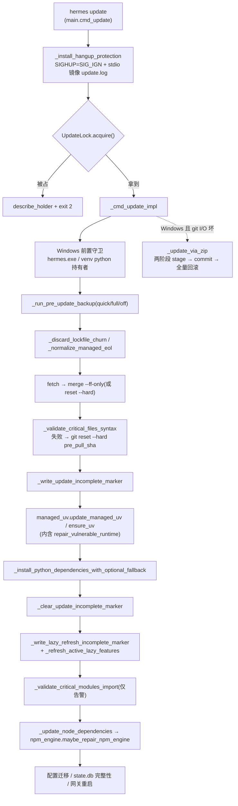

# r8d 底稿 · A1 自我更新流水线(7 文件 / 7,861 行)

> 定位:**底稿**,求全求证。凡对 hermes-agent 行为的断言,紧跟 `路径:行号 @ 863e313`
> 与代码原文块;锚点单独成行、置于块之前。允许啰嗦、允许罗列。
> 基线:`/home/user/hermes-agent` @ `863e31318553cda8ad61df681d08175364d4164b`(只读)。

本簇覆盖的 7 个文件:

| 文件 | 行数 | 一句话 |
|---|---|---|
| `hermes_cli/update_cmd.py` | 5540 | 更新主流水线(git 路径 + Windows ZIP 回退路径) |
| `hermes_cli/managed_uv.py` | 1304 | Hermes 自带的 uv 与「换掉自己脚下的 Python 运行时」 |
| `hermes_cli/npm_engine.py` | 339 | 从 npm `EBADENGINE` 失败中自愈(只动自己管的 npm) |
| `hermes_cli/update_lock.py` | 289 | 跨进程更新互斥(与 Rust/Electron 共用同一个标记文件) |
| `hermes_cli/relaunch.py` | 205 | 统一自重启(exec 语义 / Windows 无 exec 的补偿) |
| `hermes_cli/dep_ensure.py` | 165 | 非 Python 运行时依赖的懒装引导(node / 浏览器 / rg / ffmpeg) |
| `hermes_cli/psutil_android.py` | 108 | Termux/Android 上给 psutil sdist 打补丁再装 |

---

## 0. 本簇调用关系速览

一次 `hermes update` 的骨架:入口在 `hermes_cli/main.py` 的 `cmd_update`(装 SIGHUP 护甲 → 抢跨进程锁),
主体在 `update_cmd._cmd_update_impl`,依赖安装绕道 `managed_uv`,Node 侧失败绕道 `npm_engine`。



小卫星:`relaunch` 被 TUI 退出码 42 与 `sessions browse` 调用;`dep_ensure` 被 TUI/浏览器工具/ACP 调用;
`psutil_android` 只被 `update_cmd._install_psutil_android_compat` 调用。

---

## 1. `hermes_cli/update_lock.py` —— 跨进程更新互斥

### 1.1 为什么需要它:三个入口会更新同一棵树

模块 docstring 自己交代了动机(三种 surface 都会启动更新)。

`hermes_cli/update_lock.py:12`

```
Until now only the Tauri updater published an "update in progress" marker
(``UpdateMarkerGuard`` in ``apps/bootstrap-installer/src-tauri/src/update.rs``),
and only the Electron desktop consumed it (``electron/update-marker.ts``, to
gate local backend startup). Nothing stopped two *updaters* from running at
once — so a dashboard-spawned ``hermes update`` and an installer-driven
``git checkout`` could mutate the same checkout concurrently, rewriting source
under a live interpreter and leaving the tree half-updated.
```

关键设计选择:**不发明第四种机制**,而是把 Rust updater 已经在用的那个标记文件升格为唯一的锁。
格式与位置保持字节兼容(`<HERMES_HOME>/.hermes-update-in-progress`,内容 `"<pid>\n<started_at_unix>"`)。

常量三件套(TTL、env 名、退出码)全部写明了「与谁保持同步」:

`hermes_cli/update_lock.py:61`

```
# Keep in sync with UPDATE_MARKER_MAX_AGE_MS in
# apps/desktop/electron/update-marker.ts — the same marker is read by both, and
# a shorter ceiling here would let Python steal a lock Electron still considers
# live. A full update (git pull + uv sync + desktop rebuild) is minutes.
UPDATE_MARKER_MAX_AGE_SECONDS = 20 * 60

MARKER_NAME = ".hermes-update-in-progress"
```

`hermes_cli/update_lock.py:76`

```
# Exit code meaning "another updater/instance owns this install right now".
# Already the de-facto contract: the Windows shim + venv-holder guards in
# _cmd_update_impl exit 2, and the Tauri updater matches on it
# (UPDATE_EXIT_CONCURRENT in apps/bootstrap-installer/src-tauri/src/update.rs)
# to show "Hermes is still running" instead of a generic failure. Naming it
# here keeps the concurrent-update refusal on that same understood contract.
UPDATE_EXIT_CONCURRENT = 2
```

### 1.2 「活的持有者」的判定:pid 活着 **且** 未超龄,否则就地删标记

`hermes_cli/update_lock.py:179`

```
    marker = path or update_marker_path()
    try:
        raw = marker.read_text(encoding="utf-8")
    except OSError:
        return None  # absent or unreadable => no live update
```

`hermes_cli/update_lock.py:195`

```
    age = time.time() - started_at
    if not _pid_alive(pid) or age > UPDATE_MARKER_MAX_AGE_SECONDS:
        try:
            marker.unlink()
        except OSError:
            pass
        return None
```

**设计要点(自愈优先于严格)**:任何解析不出、pid 死了、超过 20 分钟的标记,都当作「没有活的更新」,
并且**由第一个发现它的人删掉**。崩溃的 updater 不会把后续所有更新永久钉死。

存活探测刻意不手写 `os.kill(pid, 0)`,理由在注释里,是一条很值得抄走的平台坑:

`hermes_cli/update_lock.py:98`

```
def _pid_alive(pid: int) -> bool:
    """True when a process with ``pid`` currently exists.

    Delegates to :func:`gateway.status._pid_exists`, the project's existing
    no-kill probe. Do NOT hand-roll this with ``os.kill(pid, 0)``: on Windows
    that is not a no-op — CPython routes ``sig=0`` to
    ``GenerateConsoleCtrlEvent``, which Ctrl+C's the target's whole console
    process group (bpo-14484). A liveness check that killed the updater it was
    asking about would be a spectacular way to fix a concurrency bug.
```

### 1.3 「我的父进程持有锁」不算冲突:两条 handoff 通道

Tauri updater 会在整个运行期持有标记,然后把 `hermes update` 当作一个子阶段拉起来。
若不特殊处理,子进程会看见父进程的活标记并拒绝执行 —— GUI 更新永远死锁在自己身上。

`hermes_cli/update_lock.py:245`

```
        existing = read_live_update(path=self.path)
        if existing is not None:
            if existing.pid == _handoff_pid() or _is_ancestor_pid(existing.pid):
                return True
            self.holder = existing
            return False
```

两条通道:(a) 环境变量 `HERMES_UPDATE_HANDOFF_PID` 报出父 pid;(b) 祖先链探测。
(a) 单独不授权 —— 那个 pid 还必须**恰好是活标记的持有者**,所以伪造 env 无法绕过锁。
(b) 存在的理由是「已经装到用户机器上的旧 `hermes-setup` 永远不会发那个 env」:

`hermes_cli/update_lock.py:140`

```
def _is_ancestor_pid(pid: int) -> bool:
    """True when ``pid`` is a live ancestor (parent chain) of this process.

    The orchestrating updater spawns ``hermes update`` as a (grand)child, so a
    live marker owned by one of our ancestors can only be the claim we are
    already running under — an unrelated concurrent updater is never in our
    parent chain. This heals the fleet of staged ``hermes-setup`` binaries
    that predate the HANDOFF_PID_ENV export and can never send it.
```

注意 handoff 分支 `return True` 时 **不设置 `self.acquired`** —— 于是 `release()` 直接返回,
父进程的标记不会被子进程删掉。

### 1.4 release 只删「还属于自己」的标记

`hermes_cli/update_lock.py:265`

```
    def release(self) -> None:
        """Drop the marker if this process still owns it. Never raises."""
        if not self.acquired:
            return
        self.acquired = False
        try:
            raw = self.path.read_text(encoding="utf-8")
            owner = int(raw.splitlines()[0].strip())
        except (OSError, IndexError, ValueError):
            return
        if owner != os.getpid():
```

### 1.5 唯一调用点与失败姿态

`hermes_cli/main.py:9158`

```
    _update_lock = UpdateLock()
    if not _update_lock.acquire():
        print(describe_holder(_update_lock.holder))
        _finalize_update_output(_update_io_state)
        sys.exit(UPDATE_EXIT_CONCURRENT)
```

**负结论(搜索面写明)**:全仓 **非测试** Python 代码里只有 `hermes_cli/main.py` 一个调用方。
搜索面 = 仓库根递归、`--include=*.py`、模式 `update_lock|UpdateLock|UPDATE_EXIT_CONCURRENT`、
排除 `./tests/` 前缀。下面这条命令输出 **12 行、落在 2 个文件**:
`hermes_cli/main.py` **8 行**(行号 9152 9153 9154 9158 9159 9160 9162 9167,**全部落在
`cmd_update` 的 9096–9168 区间内**)与 `hermes_cli/update_lock.py` 自身 **4 行**。
非 Python 侧读者(TS/Rust)不在此模式覆盖内,见下条独立搜索。

```verify
cd /home/user/hermes-agent && grep -rn "update_lock\|UpdateLock\|UPDATE_EXIT_CONCURRENT" --include=*.py . | grep -v "^./tests/"
```

跨语言读者(用文件列表模式单独搜):`apps/desktop/electron/update-gate.ts`、`update-marker.ts`、`main.ts`、
`apps/bootstrap-installer/src-tauri/src/paths.rs`、`update.rs`。

```verify
cd /home/user/hermes-agent && grep -rn "update_lock\|UpdateLock\|UPDATE_EXIT_CONCURRENT\|HANDOFF_PID_ENV\|hermes-update-in-progress" --include=*.py --include=*.ts --include=*.rs --include=*.tsx -l .
```

### 1.6 ■ 缺陷:`acquire()` 是 check-then-write,不是原子占位(实测可复现)

`acquire()` 先 `read_live_update()`(没有活的持有者 → 返回 None,顺带删掉陈旧标记),
再 `write_text` 写自己的 pid。两步之间没有任何原子性:

`hermes_cli/update_lock.py:251`

```
        try:
            self.path.parent.mkdir(parents=True, exist_ok=True)
            self.path.write_text(
                f"{os.getpid()}\n{int(time.time())}\n", encoding="utf-8"
            )
```

对比同仓另一处单飞锁——它用了 `O_CREAT | O_EXCL`,证明这个仓库知道该怎么写:

`hermes_cli/main.py:7762`

```
    try:
        fd = os.open(lock_path, os.O_CREAT | os.O_EXCL | os.O_WRONLY)
        os.write(fd, f"{os.getpid()}\n".encode())
        os.close(fd)
    except FileExistsError:
```

**实测**:64 个进程用 `multiprocessing.Barrier` 对齐后同时 `acquire()`,三次运行分别有
**7 / 1 / 2** 个进程同时把 `acquired` 置为 True(即都认为自己拿到了锁,都会继续跑 `_cmd_update_impl`)。

```verify
cd /home/user/hermes-agent && /home/user/hermes-venv/bin/python - <<'PY'
import os, sys, tempfile, multiprocessing as mp
sys.path.insert(0, "/home/user/hermes-agent")
from pathlib import Path
def worker(args):
    marker, barrier = args
    from hermes_cli.update_lock import UpdateLock
    barrier.wait()
    lk = UpdateLock(path=Path(marker))
    ok = lk.acquire()
    return (ok, lk.acquired)
if __name__ == "__main__":
    d = tempfile.mkdtemp(); marker = os.path.join(d, ".hermes-update-in-progress"); N = 64
    with mp.Manager() as mgr:
        barrier = mgr.Barrier(N)
        with mp.Pool(N) as pool:
            res = pool.map(worker, [(marker, barrier)] * N)
    print("同时自认为持锁(acquired=True)的进程数:", sum(1 for r in res if r[1]))
PY
```

**评估**:实践中窗口很窄(用户手动开两个终端几乎撞不上),但 dashboard 的 Update 按钮是**detached spawn**、
desktop 也会 handoff,「同一秒内两次触发」并非不可能。真要修也不难:`O_CREAT|O_EXCL` 建标记,
`FileExistsError` 时再走「读→判活→删陈旧→重试一次」的路径。**当前测试完全没有覆盖这个形状** ——
`tests/hermes_cli/test_update_lock.py` 的 25 个用例全部是**顺序**语义(先 acquire 再 acquire),
没有任何一个并发用例。

---

## 2. `hermes_cli/update_cmd.py` —— 更新主流水线(5540 行)

### 2.0 它为什么长这样:一次机械搬迁 + 一个 `_m()` 间接层

`hermes_cli/update_cmd.py:1`

```
"""Hermes update pipeline — extracted from ``hermes_cli/main.py``.

Mechanical move (main.py decomposition): ``_cmd_update_impl``, ``_cmd_update_check``
and every module-level helper used only by the update path, plus the update-only
constants they read. Function bodies are lifted verbatim; the only mechanical
change is that references to helpers/constants that STAY in ``hermes_cli.main``
(and to moved-but-test-patched siblings) are routed through ``_m()`` — a lazy
``hermes_cli.main`` reference — so existing call sites and test monkeypatches
that target ``hermes_cli.main.<name>`` (``PROJECT_ROOT``, ``_is_windows``,
``_run_pre_update_backup``, ...) keep working unchanged. ``main.py`` re-imports
every public-ish name from here (``# noqa: F401``) so the argparse wiring and
the test-patch surface still resolve on ``hermes_cli.main``.
```

`_m()` 是懒引用,既保住了旧的测试 monkeypatch 面,又让 import 方向保持单向(main → update_cmd):

`hermes_cli/update_cmd.py:45`

```
def _m():
    """Lazy ``hermes_cli.main`` reference.

    Lets callers keep patching ``hermes_cli.main.<helper>`` (the historical
    test surface) and have those patches reach this code path, and defers the
    import so ``hermes_cli.main`` -> ``hermes_cli.update_cmd`` stays one-way
    at import time.
    """
```

**可迁移的教训**:拆巨型文件时,「函数体逐字搬走 + 对留守符号走一个 lazy 间接层」是一个能保住
既有测试 monkeypatch 面的低风险搬法;代价是正文里满屏 `_m().xxx`,可读性变差。

### 2.1 入口包装:先装护甲,再抢锁,`finally` 一定收尾

`hermes_cli/main.py:9096`

```
def cmd_update(args):
    """Update Hermes Agent to the latest version.

    Thin wrapper around ``_cmd_update_impl``: installs hangup protection,
    runs the update, then restores stdio on the way out (even on
    ``sys.exit`` or unhandled exceptions).
    """
```

`hermes_cli/main.py:9164`

```
    try:
        _cmd_update_impl(args, gateway_mode=gateway_mode)
    finally:
        _update_lock.release()
        _finalize_update_output(_update_io_state)
```

包装器还在进入更新前挡掉三类装法(managed / docker / nix),这类安装根本没有 `git pull` 这条路。

### 2.2 「别把自己打死」之一:SIGHUP 与断掉的终端

`hermes_cli/main.py:8969`

```
def _install_hangup_protection(gateway_mode: bool = False):
    """Protect ``cmd_update`` from SIGHUP and broken terminal pipes.

    Users commonly run ``hermes update`` in an SSH session or a terminal
    that may close mid-install.  Without protection, ``SIGHUP`` from the
    terminal kills the Python process during ``pip install`` and leaves
    the venv half-installed; the documented workaround ("use screen /
    tmux") shouldn't be required for something as routine as an update.
```

两条护甲:

`hermes_cli/main.py:9010`

```
    # (1) Ignore SIGHUP for the remainder of this process.
    if hasattr(_signal, "SIGHUP"):
        try:
            _signal.signal(_signal.SIGHUP, _signal.SIG_IGN)
        except (ValueError, OSError):
            # Called from a non-main thread — not fatal.  The update still
            # runs, just without hangup protection.
            pass
```

`SIG_IGN` 跨 `exec()` 保留是 POSIX 语义,所以 pip / git 子进程一起免疫。

第二条是把 stdout/stderr 换成一个「写不动就闷声继续」的包装流,并镜像到 `~/.hermes/logs/update.log`:

`hermes_cli/main.py:8931`

```
        try:
            return self._original.write(data)
        except (BrokenPipeError, OSError, ValueError):
            # Terminal vanished (SSH disconnect, shell close).  Stop trying
            # to write to it, but keep the update running.
            self._original_broken = True
            return len(data) if isinstance(data, (str, bytes)) else 0
```

**刻意不拦 SIGINT/SIGTERM**:

`hermes_cli/main.py:8987`

```
    ``SIGINT`` (Ctrl-C) and ``SIGTERM`` (systemd shutdown) are
    **intentionally left alone** — those are legitimate cancellation
    signals the user or OS sent on purpose.
```

这条取舍很关键:它承认「更新会被中断」是一个必须支持的状态,而不是要消灭的状态 ——
于是后面才需要面包屑 + 下次启动续跑(§2.7)。

### 2.3 Windows 前置守卫:两道,`--force` 只解开第一道

第一道:另一个 `hermes.exe` 正在跑 → 退出 2。

`hermes_cli/update_cmd.py:3606`

```
    if _m()._is_windows() and not getattr(args, "force", False):
        scripts_dir = _m()._venv_scripts_dir()
        if scripts_dir is not None:
            concurrent = _m()._detect_concurrent_hermes_instances(scripts_dir)
            if concurrent:
                print(_format_concurrent_instances_message(concurrent, scripts_dir))
                sys.exit(2)
```

第二道:任何**从本 venv 解释器**跑起来的进程(desktop 后端、gateway、REPL)都会把 `.pyd` 锁住,
依赖同步会半路 access-denied。这道守卫**故意不被 `--force` 解开**:

`hermes_cli/update_cmd.py:3629`

```
    # With gateways paused, anything still running from the venv interpreter
    # (most commonly the Desktop app's `hermes serve` backend) will keep .pyd
    # files locked and corrupt the dependency sync below. Refuse rather than
    # race: killing the desktop backend is futile (the app supervises and
    # respawns it), so the user must close the app. Deliberately NOT bypassed
    # by plain --force: the desktop bootstrap updater passes --force to skip
    # the hermes.exe shim guard above, but its lock probe only checks the shim
    # and app.asar — a non-desktop venv python holding a .pyd would sail
    # through and corrupt the sync (the exact failure this guard exists for).
    # --force-venv is the explicit escape hatch.
```

检测器把**自己和自己的祖先**排除掉 —— CLI 的 `hermes update` 自己就是从 venv python 跑的:

`hermes_cli/update_cmd.py:2878`

```
    skip: set[int] = set(exclude_pids or set())
    skip.add(os.getpid())
    try:
        for anc in psutil.Process().parents():
            skip.add(int(anc.pid))
    except Exception:
        pass
```

在这两道守卫**之间**,Windows 上还会主动暂停网关(scheduled task / pythonw 起的网关不在 `hermes.exe` 守卫视野里):

`hermes_cli/update_cmd.py:3068`

```
def _pause_windows_gateways_for_update() -> dict | None:
    """Stop running Windows gateways before mutating the checkout or venv.

    Windows scheduled/startup gateways run through pythonw.exe, so the generic
    hermes.exe concurrent-instance guard does not see them. They still import
    from the checkout and can keep files locked while ``git`` or ``uv`` updates
    the install. Stop only PIDs that the gateway discovery code identifies.
    """
```

暂停之后仍然有「守护者在 pause→guard 窗口里把网关拉起来」的竞态,于是有一个「剩下的持有者是不是**都**是可暂停网关」的判定:

`hermes_cli/update_cmd.py:3043`

```
    Returns ``None`` when any holder is not a pausable gateway — an operator
    REPL, a stray script, or the Desktop backend has no pause machinery
    downstream, and the guard must keep refusing exactly as before.
    """
```

`_pause_windows_gateways_for_update()` 的返回值通过 `atexit` 注册恢复,所以即使中途 `sys.exit` 也会复原:

`hermes_cli/update_cmd.py:3620`

```
    _windows_gateway_resume = _m()._pause_windows_gateways_for_update()
    if _windows_gateway_resume:
        import atexit as _atexit

        _atexit.register(
            _m()._resume_windows_gateways_after_update,
            _windows_gateway_resume,
        )
```

### 2.4 预备份:三档 `off / quick / full`,`off` 是真的什么都不跑

`hermes_cli/update_cmd.py:2553`

```
    Single consolidated mechanism gated on ``updates.pre_update_backup``:

    - ``off``   — nothing runs. Explicit user opt-out is honored fully.
    - ``quick`` (default) — a state snapshot of critical small files
      (pairing JSONs, cron jobs, config, auth; see ``_QUICK_STATE_FILES``)
      under ``state-snapshots/``. Files over 1 GiB are skipped with a
      warning so a bloated state.db can never stall the update
      (issues #15733, #34600 are the reason this safety net exists).
```

`hermes_cli/update_cmd.py:2499`

```
# Per-file size cap for the pre-update quick snapshot. Anything larger is
# skipped with a warning: the snapshot exists to protect small, hard-to-
# regenerate state (pairing JSONs, cron jobs, config, auth) — not to copy a
# multi-GB state.db on every update (observed: a 24 GB state.db added ~60s
# of wall time and silently ate 24 GB of disk per update).
_PRE_UPDATE_SNAPSHOT_MAX_FILE_SIZE = 1 << 30  # 1 GiB
```

`--no-backup` 胜过 `--backup`,配置支持遗留布尔:

`hermes_cli/update_cmd.py:2516`

```
    if getattr(args, "no_backup", False):
        return "off"
    if getattr(args, "backup", False):
        return "full"
```

### 2.5 先把「机器造的脏」洗掉,再谈 stash

这一步的价值观很明确:**机器自己弄脏的文件不该走 autostash**。

`hermes_cli/update_cmd.py:3411`

```
def _discard_lockfile_churn(git_cmd, repo_root):
    """Restore tracked ``package-lock.json`` files that npm dirtied locally.

    npm rewrites lockfiles non-deterministically at install/build time. On a
    managed install those diffs are never intentional, so we discard them so
    ``hermes update`` sees a clean tree instead of autostashing every run.
    Best-effort; only ever touches files named ``package-lock.json``.
    """
```

有一个很细的保护:如果同目录的 `package.json` 也脏了,说明这是**人为改动**,那个目录的 lockfile 就不丢:

`hermes_cli/update_cmd.py:3428`

```
        dirty_package_dirs = {
            Path(line.strip()).parent
            for line in diff.stdout.splitlines()
            if line.strip().endswith("package.json")
        }
```

第二个「机器造的脏」是 Windows 上 `core.autocrlf=true` 造成的行尾漂移。这一段的设计尤其值得抄:

`hermes_cli/update_cmd.py:3465`

```
    The pin and the cleanup are one operation. Under ``autocrlf=true`` git
    compares normalized content, so a CRLF working tree reads clean; pinning
    alone would expose every text file as modified and hand the update an
    autostash of the whole tree. So the pin is written only after the tree is
    verified clean under it, and a checkout we cannot fully normalize is left
    exactly as it was. Best-effort: never blocks an update.
    """
```

里面还有一条 git 行为的实测记录(`--name-only --ignore-cr-at-eol` **不**过滤,`--numstat` 才过滤):

`hermes_cli/update_cmd.py:3489`

```
        # NOTE: ``diff --name-only --ignore-cr-at-eol`` still LISTS CR-only
        # files (the name list is computed from blob/stat differences before
        # the CR filter is applied), so it cannot be used to isolate real
        # edits. ``--numstat`` does honor the filter: a CR-only file produces
        # no numstat record, while a genuinely-edited file does. Parse the
        # paths out of numstat instead.
```

以及一条 Windows 命令行长度的现实约束:

`hermes_cli/update_cmd.py:3537`

```
            # Pathspec over stdin, not argv: a fully renormalized checkout is
            # thousands of paths, well past the Windows command-line limit.
```

### 2.6 拉代码:`fetch <branch>` + `merge --ff-only`,分叉就 `reset --hard`

fetch 被**限定到目标分支**,理由是本仓库有成千上万条自动生成的分支:

`hermes_cli/update_cmd.py:3740`

```
        # Resolve the target branch up front so the fetch can be scoped to it.
        # A bare `git fetch origin` pulls every ref, and this repo carries
        # thousands of auto-generated branches — an unscoped fetch can stall for
        # minutes on a non-single-branch checkout. Fetch only what we update
        # against.
```

而且**不用 `git pull`** —— 因为上一步已经 fetch 过了,`pull` 会再来一次网络往返:

`hermes_cli/update_cmd.py:3959`

```
            # Merge the ref we already fetched above (→ Fetching updates...)
            # instead of `git pull`, which performs a SECOND network fetch of
            # the same branch (~0.5-1.5 s of redundant round-trip per update).
            # `merge --ff-only origin/<branch>` is byte-identical in effect to
            # `pull --ff-only origin <branch>` given the fresh tracking ref;
            # the divergence fallback below is unchanged.
```

ff 失败(上游 force-push / rebase)就直接 `reset --hard origin/<branch>` —— 之所以敢这么狠,
是因为本地改动**已经**在上一步被 stash 走了:

`hermes_cli/update_cmd.py:3971`

```
            if pull_result.returncode != 0:
                # ff-only failed — local and remote have diverged (e.g. upstream
                # force-pushed or rebase).  Since local changes are already
                # stashed, reset to match the remote exactly.
```

autostash 的边角很多,最值得记的一条是 **「stash push 非零退出 ≠ 没存上」**:

`hermes_cli/update_cmd.py:3611` 对应的 stash 逻辑在同文件 `_stash_local_changes_if_needed`:

`hermes_cli/update_cmd.py:1141`

```
    if push.returncode != 0:
        if stash_created:
            # git stash push exits non-zero when it saved everything but could
            # not delete some swept untracked files from the working tree
            # (e.g. a root-owned directory: "warning: failed to remove ...:
            # Permission denied").  The stash entry is complete — the changes
            # are safe — so this is not a failure.  Leave the undeletable
            # files in place and continue the update.
```

判定依据不是退出码,而是 `refs/stash` 的 SHA 变没变:

`hermes_cli/update_cmd.py:1137`

```
    stash_created = (
        stash_probe.returncode == 0 and bool(stash_ref) and stash_ref != prev_stash
    )
```

真的没存上就抛异常终止,绝不在动 HEAD 之前把用户改动搞丢:

`hermes_cli/update_cmd.py:1168`

```
        else:
            # No stash entry was created: the changes were NOT saved.  This
            # is a real failure — bail out before the update touches HEAD.
            print("✗ Could not stash local changes — update aborted.")
```

恢复时若冲突,**一定 `reset --hard HEAD`**,理由是冲突标记会让 Python 直接 SyntaxError:

`hermes_cli/update_cmd.py:1314`

```
        # Always reset to clean state — leaving conflict markers in source
        # files makes hermes completely unrunnable (SyntaxError on import).
        # The user's changes are safe in the stash for manual recovery.
```

### 2.7 拉完立刻验语法,不过就回滚 —— 这是整条流水线最重要的闸门

`hermes_cli/update_cmd.py:88`

```
# Critical files that Hermes must be able to import immediately after an
# update/install. Most are imported on every CLI startup; ``web_server.py``
# is the desktop/dashboard backend path that a fresh Windows install launches
# right away. If any of these fail to parse after a pull, the user can be
# left with a bricked CLI or desktop backend. The post-pull syntax guard
# validates these and auto-rolls-back on failure.
_UPDATE_CRITICAL_FILES = (
    "hermes_cli/main.py",
    "hermes_cli/config.py",
    "hermes_cli/__init__.py",
    "hermes_cli/web_server.py",
    "cli.py",
    "run_agent.py",
    "model_tools.py",
    "toolsets.py",
    "hermes_constants.py",
)
```

事故来历写在 `pre_pull_sha` 的注释里:

`hermes_cli/update_cmd.py:3952`

```
        # Capture the pre-pull SHA so we can auto-roll-back if the new code
        # has a syntax error in a critical-path file (PR #28452 incident:
        # orphan merge-conflict markers in hermes_cli/config.py bricked
        # every user who ran ``hermes update`` for the 7 minutes between
        # the bad commit and the fix landing).
        pre_pull_sha = _capture_head_sha(git_cmd, _m().PROJECT_ROOT)
```

回滚动作:

`hermes_cli/update_cmd.py:4013`

```
                    print(f"→ Rolling back to {pre_pull_sha[:10]}...")
                    rollback_result = subprocess.run(
                        git_cmd + ["reset", "--hard", pre_pull_sha],
                        cwd=_m().PROJECT_ROOT,
                        capture_output=True,
                        text=True, encoding="utf-8", errors="replace",
                    )
```

编译产物写到临时目录而不是源码树的 `__pycache__/`,理由也写清楚了:

`hermes_cli/update_cmd.py:129`

```
    The compiled ``.pyc`` is written to a temp directory rather than the
    source tree's ``__pycache__/`` so we don't race with concurrent test
    workers that walk the same dir, and so we don't leave a stale pyc
    behind in production if the next interpreter run picks a different
    Python version. The pyc is discarded on function return either way —
    we only care about the compile-or-not signal.
```

**语法闸门只能看单文件,看不见跨模块错配**,所以还有第二道「真 import」闸门:

`hermes_cli/update_cmd.py:174`

```
def _validate_critical_modules_import(root) -> tuple[bool, str | None, str | None]:
    """Import each module in ``_UPDATE_CRITICAL_MODULES`` in a subprocess.

    ``_validate_critical_files_syntax`` only *parses* files, so it cannot see
    cross-module breakage: a partially-updated tree where ``agent/`` is new but
    ``tools/`` is old parses perfectly and still dies at startup with
    ``ImportError: cannot import name 'TODO_INJECTION_HEADER' from
    'tools.todo_tool'``. Every file is valid Python; the *combination* is not.
```

它跑在**子进程**,而且优先用 venv 的解释器,不是当前解释器:

`hermes_cli/update_cmd.py:188`

```
    Runs in a subprocess because importing these modules into the running
    updater would pollute ``sys.modules`` and execute import-time side effects
    against the half-updated tree. Costs ~0.4s.

    Uses the project venv's interpreter when there is one (matching
    ``_venv_core_imports_healthy``): ``hermes update`` can be driven by a
    different Python than the install's own, and probing the wrong
    interpreter would test a tree the user never runs.
```

「第三方缺失 ≠ 树坏了」的区分,靠一个从 `hermes_constants` 注入的一方模块根集合:

`hermes_cli/update_cmd.py:206`

```
        "    except ModuleNotFoundError as exc:\n"
        # A missing *third-party* module means dependencies aren't installed
        # yet, not a skewed checkout. Only our own packages count as breakage.
        # The root set is injected from hermes_constants so this can't drift
        # from the hint the user is shown (they disagreed once already).
        "        missing = (getattr(exc, 'name', '') or '').split('.')[0]\n"
```

**取舍**:git 路径上这道 import 闸门**只告警不回滚**,理由写得很有说服力:

`hermes_cli/update_cmd.py:4185`

```
        # Everything that can legitimately produce a transient ImportError has
        # now run (bytecode sweep, dependency reinstall, lazy refresh), so a
        # module that still won't import is real breakage. Warn only — never
        # roll back here: `cannot import name X` is also the signature of the
        # stale-bytecode class (#6207, #60242), and the launch-time sweep in
        # _sweep_stale_bytecode_if_checkout_changed() self-heals that on the
        # next run. A destructive reset would undo a good update over a state
        # that fixes itself.
```

而 ZIP 路径上它**是硬失败**(exit 1),因为那条路没有 SHA 可回滚:

`hermes_cli/update_cmd.py:944`

```
    # placed *after* the dependency reinstall so a genuinely-new third-party
    # requirement isn't misreported as a partial copy. There is no SHA to roll
    # back to here, so surface it with a concrete recovery step rather than
    # reporting a successful update over a bricked install.
```

### 2.8 面包屑:两枚标记,一枚粗一枚细,谁也不许清对方

标记文件放在 venv 旁边(不是 `$HERMES_HOME`),因为 venv 是跨 profile 共享的:

`hermes_cli/main.py:7661`

```
# Install-scoped breadcrumbs live next to the venv (not under $HERMES_HOME)
# because the venv is shared across profiles.
#
# ``.update-incomplete`` — generic core ``.[all]`` install was interrupted.
# Cleared only after a confirmed full dependency reinstall/recovery.
#
# ``.lazy-refresh-incomplete`` — lazy-backend refresh phase may have corrupted
# packages. Cleared only after import-probe repair confirms healthy (not when
# probes are unavailable/indeterminate). Narrow lazy probes must NEVER clear
# the generic core marker (#58004 review).
```

写标记的时机是**动 venv 之前**:

`hermes_cli/update_cmd.py:4082`

```
        # Drop the core-install breadcrumb BEFORE touching the venv. If the
        # install is killed mid-flight (Ctrl-C, terminal close, WSL OOM), the
        # marker survives and the next ``hermes`` launch finishes the install
        # via ``_recover_from_interrupted_install``. Cleared after the core
        # ``.[all]`` install completes — lazy refresh uses a separate marker.
        _write_update_incomplete_marker()
```

清核心标记 → 立刻换上懒刷新标记:

`hermes_cli/update_cmd.py:4144`

```
        # Core ``.[all]`` install finished. Clear the generic core breadcrumb
        # before the lazy-refresh phase — that phase uses its own marker so a
        # later lazy failure cannot be "healed" by clearing the core marker
        # based on a narrow 7-package import probe (#58004 review).
        _m()._clear_update_incomplete_marker()
```

下次启动的续跑逻辑(单飞 + stdout 保护):

`hermes_cli/main.py:7731`

```
    Concurrency: markers live next to the shared venv, so a gateway start
    plus a CLI launch (or two profiles starting at once) can both see them.
    An ``O_EXCL`` lockfile ensures only one process runs recovery; the
    others skip and let the winner clear markers.

    Output: everything — our status lines AND the streamed pip/uv install
    (which inherits fd 1) — is routed to stderr.  Launches whose stdout is a
    protocol stream (``hermes acp`` speaks JSON-RPC on stdout) must never get
    install noise on stdout.
```

陈旧锁一小时后强拆,防止「崩溃的持锁者把恢复永久钉死」:

`hermes_cli/main.py:7766`

```
    except FileExistsError:
        try:
            if _time.time() - lock_path.stat().st_mtime > 3600:
                lock_path.unlink()
        except OSError:
            pass
        return
```

**测试环境自保**:标记写入前会判定「是不是 pytest 正在跑活的 checkout」,免得在开发者仓库里留下误触发的面包屑:

`hermes_cli/main.py:7679`

```
def _pytest_owns_live_checkout(root: Path) -> bool:
    """True when running under pytest AND ``root`` is this checkout itself.

    Tests that drive update/recovery without sandboxing ``PROJECT_ROOT``
    must neither litter the live repo root with recovery breadcrumbs
    (a leftover ``.lazy-refresh-incomplete`` / ``.update-incomplete``
    false-arms recovery on the developer's next real launch) nor run a real
    reinstall against the executing venv. Sandboxed tests point at a
    tmp_path and are unaffected (same posture as
    ``managed_scope._under_pytest``)."""
```

还有一层更早的恢复(在 `hermes_cli.main` **能否 import** 之前就跑),它刻意不清标记:

`hermes_cli/_early_recovery.py:194`

```
    """Repair wiped core packages so ``hermes_cli.main`` can import at all.

    Fast path (no marker present) is two ``lstat`` calls.  Only acts when a
    recovery marker from a prior ``hermes update`` exists AND an import probe
    confirms a core package is actually broken.  Markers are intentionally
    NOT cleared here — ``_recover_from_interrupted_install()`` in main.py owns
    the confirmed marker lifecycle and runs immediately after import succeeds.
```

而且它对 `update` 命令本身**直接放行**,防止 recovery 与真更新互相踩:

`hermes_cli/_early_recovery.py:207`

```
        # Same deliberately-loose match as main(): the real update flow writes
        # and clears its own markers — a recovery install must not race it.
        if "update" in args:
            return
```

### 2.9 懒依赖刷新:「装到一半」是一个**被命名、被建模**的状态

`hermes_cli/update_cmd.py:1734`

```
    """Refresh lazy-installed backends after a code update.

    When pyproject.toml's ``[all]`` extra was slimmed down (May 2026), most
    optional backends moved to ``tools/lazy_deps.py`` and only install on
    first use. ``hermes update`` runs ``uv pip install -e .[all]`` which
    leaves those packages untouched — so if we bump a pin in
    :data:`LAZY_DEPS` (CVE response, transitive bug fix), users who already
    activated the backend keep the stale version forever.
```

返回值的语义(True = venv 可用)明确把「修不好」区分出来:

`hermes_cli/update_cmd.py:1747`

```
    Returns True when the venv is safe to use (refresh succeeded, or no
    active lazy backends, or post-failure import repair succeeded). Returns
    False when a failed lazy install left broken core imports that automatic
    repair could not fix (#57828).
```

修复走**真 import 探针**(不是 dist-info 元数据),因为「METADATA 还在但 .py 被抹了」正是中断安装的形状:

`hermes_cli/main.py:8428`

```
    """Probe imports and force-reinstall any broken lazy-refresh packages.

    Uses real ``import`` checks (not distribution metadata) so a venv where
    METADATA remains but ``.py`` files were wiped mid-install is still
    detected (#57828). Package-only reinstall — never rewrites ``hermes.exe``.

    Never raises. Returns one of:
      - ``"healthy"`` — probes ran and found nothing broken
      - ``"repaired"`` — probes found breakage and force-reinstall confirmed clean
      - ``"failed"`` — probes found breakage and repair did not confirm clean
      - ``"indeterminate"`` — probes could not run; do NOT treat as healthy
```

**四态而不是布尔**,并且 `indeterminate` 保留标记 —— 这是整簇里最好的一条设计:

`hermes_cli/update_cmd.py:1827`

```
    if status == "indeterminate":
        print(
            "  ⚠ Leaving `.lazy-refresh-incomplete` until import probes can confirm health."
        )
    return False
```

刷新前先升级 pip,因为旧 pip 会在源码构建时留下半写包:

`hermes_cli/update_cmd.py:1715`

```
    """Upgrade pip before lazy-backend refreshes.

    Older pip (e.g. 24.0 on Python 3.11) can fail setuptools-backed source
    builds during lazy installs and leave a partially-written venv (#57828).
    Never raises.
    """
```

**第三层**:记忆 provider 的 bridge 包既不在 extras 也不在 `LAZY_DEPS`,核心重装会把它们剥掉,所以放到最后再补一次:

`hermes_cli/update_cmd.py:1834`

```
    """Refresh pip dependencies for the configured external memory provider.

    Memory-provider bridge packages are declared in each provider's
    ``plugin.yaml`` (plus mode-dependent extras like Hindsight's
    ``hindsight-all``), NOT in Hermes' editable-install extras or
    ``LAZY_DEPS`` alone — so the core dependency reinstall above can strip
    or downgrade them (#53272 mem0ai, #70636 hindsight-embed). Re-run the
    provider's declared install for the ACTIVE provider only, after the
    core install and lazy refresh, so the last write to any shared package
    is the one the active provider needs.
```

**「最后写的人赢」是显式排序原则**,不是巧合。

### 2.10 「代码是新的、venv 是旧的」也算没更新完

即便 `commit_count == 0`(已经最新),也要探 venv 健康:

`hermes_cli/update_cmd.py:2775`

```
    """Probe the project venv for the core imports the backend needs to boot.

    Runs a tiny import check inside the venv interpreter (NOT this process —
    ``hermes update`` may be driven by a different Python). Catches the
    half-updated-venv state: git checkout current but a dependency sync that
    failed or was killed partway (e.g. Windows access-denied on a loaded
    .pyd), leaving imports like ``fastapi``'s new transitive deps missing.
    Without this probe, ``hermes update`` on a current checkout prints
    "Already up to date!" and returns without ever re-syncing dependencies —
    the user's install stays broken no matter how many times they update
    (ryanc's incident, July 2026).
```

「没有 venv python」在**开发 checkout** 上是正常的,在**托管安装**上却意味着修复被中断:

`hermes_cli/update_cmd.py:2801`

```
        managed_markers = (
            _m().PROJECT_ROOT / ".hermes-bootstrap-complete",
            _m()._update_marker_path(),
        )
        if any(m.exists() for m in managed_markers):
            return False, f"venv python missing ({venv_python})"
        return True, ""
```

不健康时会重建 venv 再装依赖:

`hermes_cli/update_cmd.py:3909`

```
                if venv_python_missing and repair_uv:
                    print("→ Recreating virtual environment...")
                    subprocess.run(
                        [repair_uv, "venv", "venv"],
                        cwd=_m().PROJECT_ROOT,
                        check=False,
                    )
```

### 2.11 更新自己的代码 = 在跑着的解释器脚下换源码:三处显式补偿

(1) 清 `.pyc`,清两次(装依赖会从 build cache 复制回来一批):

`hermes_cli/update_cmd.py:4150`

```
        # The update process is still the old Python interpreter process. Run
        # one final cache/module refresh immediately before lazy backend
        # refresh, which imports newly-pulled modules that may depend on fresh
        # symbols in hermes_constants or lazy_deps. The dependency install
        # above may also have regenerated bytecode from build-cache copies —
        # this second sweep catches those stragglers (#60242, #65240).
```

(2) 显式 reload 一小撮「更新敏感」模块:

`hermes_cli/update_cmd.py:58`

```
_UPDATE_RUNTIME_RELOAD_MODULES = (
    "hermes_constants",
    "tools.environments.local",
    "tools.lazy_deps",
)
```

`hermes_cli/update_cmd.py:64`

```
def _reload_updated_runtime_modules() -> None:
    """Reload update-sensitive modules after the checkout changes in-place.

    ``hermes update`` keeps running in the pre-pull Python process. After a
    large update, modules already present in ``sys.modules`` can still expose
    old symbols even though their source files on disk are new. Refresh the
    small module set used by lazy-backend refresh before that step imports
    newly-updated code paths.
    """
```

(3) 见 §3.2:`managed_uv` 里两处**跨更新边界的 API 兼容层**(`_UvResult` 与 `_reload_hermes_constants`)。

### 2.12 Windows ZIP 回退路径:两阶段替换 + 全量回滚

这条路只在 Windows 且 git 文件 I/O 坏掉时才走(杀软 / NTFS filter driver)。
它**拒绝** `--branch`,因为 GitHub 静态 zip 只能拿分支头,悄悄从 main 更新等于撒谎:

`hermes_cli/update_cmd.py:735`

```
    # The ZIP fallback exists for Windows git-file-I/O breakage. It pulls a
    # static archive from GitHub, which is fine for the default "main"
    # channel but would silently ignore --branch and update from main even
    # if the user asked for something else — exactly the silent-divergence
    # bug --branch was added to prevent. Refuse to proceed in that case
    # rather than lie.
```

解压前做 zip-slip 与 symlink 双重校验:

`hermes_cli/update_cmd.py:767`

```
            # Validate paths to prevent zip-slip (path traversal) AND reject
            # symlink members. A GitHub source ZIP for hermes-agent itself
            # should never contain symlinks — they'd point outside the
            # extracted tree and let an attacker who can compromise the
            # update mirror plant arbitrary files via the update path.
```

`hermes_cli/update_cmd.py:782`

```
                # Unix mode lives in the upper 16 bits of external_attr;
                # mask to the file-type bits.
                mode = (member.external_attr >> 16) & 0o170000
                if _stat.S_ISLNK(mode):
                    raise ValueError(
                        f"ZIP contains unsupported symlink member: {member.filename}"
                    )
```

**核心机制:两阶段提交。** 第一代方案 `_atomic_replace_dir` 只保证**单个目录**替换不留半删状态:

`hermes_cli/update_cmd.py:590`

```
def _atomic_replace_dir(src: str, dst: str) -> None:
    """Replace directory *dst* with *src* without leaving *dst* half-deleted.

    The naive ``rmtree(dst); copytree(src, dst)`` has a destructive window: if
    the copy fails partway (common on the Windows ZIP-update path, which only
    runs because file I/O is already flaky on that machine), the old directory
    is already gone and nothing replaced it — the install is left with a
    deleted tree (issue #49145, where ``ui-tui/`` vanished and broke the TUI).
```

但 90 个顶层条目逐个替换,**循环整体不是原子的** —— 这才是真正咬人的 bug 类:

`hermes_cli/update_cmd.py:656`

```
    """Phase 2: swap every staged entry into place, rolling back all on failure.

    ``_atomic_replace_dir`` makes each *individual* directory swap safe, but
    the ZIP update replaces ~90 top-level entries in a loop, and nothing made
    the loop atomic *as a whole*. A failure partway left some entries at the
    new version and the rest at the old one — every file valid Python, the
    combination unbootable (issue #76104; the ``ImportError`` in #76091 and
    the field report in #63717 are both this).
```

`hermes_cli/update_cmd.py:673`

```
    Splitting stage-all-then-swap-all shrinks the failure window from "the
    duration of a full tree copy" to "the duration of N renames", and makes
    the remaining window recoverable: if a swap fails we restore every entry
    already swapped, so the tree lands wholly new or wholly old.
    """
```

提交阶段的实现(每次 swap 都记账,失败逆序还原):

`hermes_cli/update_cmd.py:678`

```
    swapped: list[tuple[str, str]] = []  # (dst, backup) in swap order; "" = absent
    try:
        for staging, dst in staged:
            backup = f"{dst}.hermes-update-old"
            if os.path.exists(dst):
                os.rename(dst, backup)
                swapped.append((dst, backup))
            else:
                swapped.append((dst, ""))
            os.rename(staging, dst)
    except OSError:
```

回滚失败不吞:

`hermes_cli/update_cmd.py:698`

```
            except OSError as exc:
                # Keep restoring the rest — a silent failure here is the one
                # thing that turns a recoverable rollback into a mixed tree,
                # so say so rather than swallowing it.
                logger.warning("rollback failed for %s: %s", dst, exc)
```

暂存阶段有一个**顺序很讲究**的细节:先把上一轮遗留的 backup 还原回去,**再**清理 leftover。
反过来做的话,「删掉 backup 然后暂存失败(磁盘满)」会在安装里留一个洞,而且无可回滚:

`hermes_cli/update_cmd.py:616`

```
    # A previous run may have died between "move dst aside" and "move staging
    # in" — leaving dst missing and the backup as the ONLY copy of that entry.
    # Restore it before clearing leftovers: deleting the backup first and then
    # failing to stage (disk exhaustion is likely right after writing a full
    # staging copy) would leave a hole in the install with nothing to roll
    # back to. The restore is a same-filesystem rename — instant and safe.
    if not os.path.exists(dst) and os.path.exists(backup):
        os.rename(backup, dst)
```

暂存要占一份额外磁盘,于是有前置空间检查,而且只要 1.2 倍不要 2 倍:

`hermes_cli/update_cmd.py:827`

```
        # Only the staging copy is new — the live tree already occupies its
        # space and the swaps are renames, not copies. Ask for the staging
        # copy plus 20% headroom rather than a full 2x, which would block
        # updates that would have succeeded on exactly the space-constrained
        # machines most likely to hit this path.
        required = int(need * 1.2)
```

失败后必须清暂存,否则**重试比首次更容易失败**:

`hermes_cli/update_cmd.py:636`

```
def _discard_staged(staged) -> None:
    """Remove staging paths for entries that were never committed.

    Without this a phase-1 failure (typically disk exhaustion) orphans one
    staging copy per entry already processed — up to a full second copy of
    the tree. The user then follows the "re-run `hermes update`" advice with
    *less* free space than before and the retry fails harder than the
    original attempt.
    """
```

`preserve` 集合决定了哪些东西不被 ZIP 覆盖:

`hermes_cli/update_cmd.py:801`

```
        # Copy updated files over existing installation, preserving venv/node_modules/.git
        preserve = {"venv", "node_modules", ".git", ".env"}
        entries = [i for i in os.listdir(extracted) if i not in preserve]
```

### 2.13 Node 依赖:摘要键不是 lockfile 一个文件

`hermes_cli/update_cmd.py:1956`

```
    """Manifests whose changes must defeat the update-skip.

    The lockfile alone is NOT a sufficient key: on a local checkout a dev
    can edit package.json (root or a workspace) without running npm — the
    lockfile is then unchanged but `hermes update` is exactly the step
    expected to sync node_modules (via the `npm install` fallback in
    _run_npm_install_deterministic).
```

workspace 列表从 root `package.json` 的 `workspaces` 通配符读,不硬编码:

`hermes_cli/update_cmd.py:1964`

```
    The workspace list is pulled from the root package.json's `workspaces`
    globs (npm's own source of truth) rather than hardcoded, so adding a
    workspace can never silently escape the skip key. The root install
    (step 1, --workspaces=false) still hoists shared deps for EVERY
    workspace — desktop included — so all of them belong in the key, not
    just the ones step 2 installs. Falls back to hashing just root
    manifests if package.json is unreadable (never skips more than main
    would have installed).
```

缓存键按 `PROJECT_ROOT` 分桶,支持并行 worktree:

`hermes_cli/update_cmd.py:2023`

```
    try:
        # Key the cache by PROJECT_ROOT so parallel worktrees don't collide.
        cache_key = hashlib.sha256(str(_m().PROJECT_ROOT).encode()).hexdigest()[:12]
        cache_file = hermes_root / f".npm_lock_hash_{cache_key}"
```

装法是「root-only 先装,再点名装 ui-tui / web」,把 desktop 的 Electron 200MB 挡在外面:

`hermes_cli/update_cmd.py:2086`

```
    # With a single workspace lockfile the root install would cover ALL
    # workspaces — but apps/desktop pulls in Electron as a devDependency,
    # and its postinstall downloads a ~200MB binary.  Most users don't
    # need desktop during `hermes update`, so we install root-only first
    # then add just the workspaces the CLI/TUI/web build actually requires.
```

WSL 里只能摸到 Windows npm 时**大声跳过**而不是静默跳过:

`hermes_cli/update_cmd.py:2056`

```
        # If the only npm reachable inside this WSL shell is the Windows one,
        # flag it loudly: silently skipping leaves ui-tui deps stale while the
        # rest of the update proceeds, and running it would corrupt the tree.
```

Node 刷新失败会一路传播成「部分完成」,而且**不动正在跑的 dashboard**:

`hermes_cli/update_cmd.py:570`

```
def _finish_dashboard_update_cleanup(node_failures: list[str]) -> None:
    """Refresh managed dashboards or stop stale manual ones after an update."""
    if node_failures:
        print()
        print("  ℹ Leaving running dashboard process(es) untouched because the")
        print("    Node.js dependency refresh did not complete.")
        return
```

### 2.14 收尾:配置迁移 / state.db 完整性 / 网关重启

配置迁移有一条很细的用户体验判断 —— **只有版本号变了就别问用户**:

`hermes_cli/update_cmd.py:4475`

```
        if version_bump_only:
            # Nothing for the user to fill in — only the config format version
            # changed (new defaults already merge in transparently). Asking
            # "configure new options now?" here is misleading: saying yes just
            # bumps the version and looks like a no-op (issue: ScottFive /
            # Tt2021). Apply it silently and say what actually happened.
```

state.db 更新后校验完整性,坏了就从预备份快照自动还原:

`hermes_cli/update_cmd.py:4266`

```
        # ── Post-update state.db integrity guard (#68474) ─────────────────
        # Verify that state.db survived the update intact.  If the live file
        # is now corrupted (zeroed, missing header, integrity failure),
        # automatically restore from the pre-update snapshot rather than
        # letting the user discover silently that their sessions are gone.
```

cron 任务也有专门的「更新把 jobs.json 清空了」的兜底:

`hermes_cli/update_cmd.py:4575`

```
        # Safety net: config-version migrations have been observed to leave
        # cron/jobs.json valid-but-empty, silently dropping every scheduled
        # job (issue #34600). The desktop scheduler can also overwrite with
        # its own small set, causing partial loss (issue #52144). If the
        # live file now has fewer jobs than the pre-update snapshot, restore
        # it and warn loudly.
```

gateway 模式下**先写退出码再重启网关**,因为 systemd 的 `KillMode=mixed` 会连自己一起杀:

`hermes_cli/update_cmd.py:4695`

```
        # Write exit code *before* the gateway restart attempt.
        # When running as ``hermes update --gateway`` (spawned by the gateway's
        # /update command), this process lives inside the gateway's systemd
        # cgroup.  A graceful SIGUSR1 restart keeps the drain loop alive long
        # enough for the exit-code marker to be written below, but the
        # fallback ``systemctl restart`` path (see below) kills everything in
        # the cgroup (KillMode=mixed → SIGKILL to remaining processes),
        # including us and the wrapping bash shell.  The shell never reaches
        # its ``printf $status > .update_exit_code`` epilogue, so the
        # exit-code marker file would never be created.  The new gateway's
        # update watcher would then poll for 30 minutes and send a spurious
        # timeout message.
```

**这是「不把自己打死」最直白的一处**:更新进程知道自己活在被重启对象的 cgroup 里,
于是把「我成功了」这个事实**提前落盘**,以便它自己被杀掉之后新网关还能读到。

手工网关重启走「SIGUSR1 优雅 drain → 超时 SIGTERM → 3 秒后 SIGKILL 幸存者」三段:

`hermes_cli/update_cmd.py:5336`

```
            # --- Post-restart survivor sweep -----------------------------
            # Issue #17648: some gateways ignore SIGTERM (stuck drain,
            # blocked I/O, PID dead but zombie).  The detached profile
            # watchers wait 120s for the old PID to exit — if it never
            # does, no respawn happens and the user keeps hitting
            # ImportError against a stale sys.modules.  Give the
            # graceful paths a brief window to complete, then SIGKILL
            # any remaining pre-update PIDs so the watcher / service
            # manager can relaunch with fresh code.
```

强杀范围**只限本轮已经尝试杀过的 pid**,避免误伤更新后新起的进程:

`hermes_cli/update_cmd.py:5352`

```
                # Scope to PIDs we already tried to kill during this
                # update (killed_pids).  Anything new is a gateway that
                # started AFTER our restart attempt — respecting user
                # intent, we don't kill those.
```

「代码更新成功但网关没全起来」会**退出 1**,不让自动化把车队当健康:

`hermes_cli/update_cmd.py:5423`

```
        if gateway_fleet_restart_incomplete:
            # Code update itself succeeded, but at least one gateway still
            # runs pre-update modules — surface that as a failed update so
            # automation / operators do not treat the fleet as healthy.
            sys.exit(1)
```

### 2.15 `--check`:优先跟 upstream 比,且认得浅克隆

`hermes_cli/update_cmd.py:2227`

```
    # Fetch only the branch we compare against; prefer upstream as the canonical
    # reference. A bare `git fetch <remote>` pulls every ref, and this repo has
    # thousands of auto-generated branches, so scope the fetch to <branch>.
```

`hermes_cli/update_cmd.py:2233`

```
    # Installer checkouts are shallow (`git clone --depth 1`). A plain
    # `git fetch` would unshallow the repo (dragging in the whole history —
    # the exact cost the shallow clone avoided) and the rev-list count below
    # would then report a huge bogus "behind" number. Detect shallow up front:
    # fetch with --depth 1 to preserve the boundary and report presence-only.
```

`hermes_cli/update_cmd.py:2249`

```
    if branch == "main":
        # Probe locally (~6 ms) whether an 'upstream' remote exists at all
        # before spending a network fetch on it. Non-fork installs have no
        # 'upstream' remote, and the old flow burned a failed network attempt
        # (~0.3-1 s) on every --check before falling back to origin.
```

---

## 3. `hermes_cli/managed_uv.py` —— 自带 uv + 在线换掉自己的 Python

### 3.1 单一位置的 uv

`hermes_cli/managed_uv.py:1`

```
"""Hermes-managed uv and Python runtime repair.

Hermes owns its own uv binary at ``$HERMES_HOME/bin/uv`` (or ``uv.exe`` on
Windows).  Every code path that needs uv resolves it from that single location.
If the binary is missing, ``ensure_uv()`` bootstraps it via the official
standalone installer with ``UV_UNMANAGED_INSTALL`` / ``UV_INSTALL_DIR`` pointed
at ``$HERMES_HOME/bin`` so the installer writes directly there — no PATH
probing, no conda guards, no multi-location resolution chains.
```

`hermes_cli/managed_uv.py:10`

```
The Python backing the install is different: it is shared by every Hermes
profile because the checkout's ``venv`` is shared.  Runtime repair therefore
uses an install-scoped store under ``<checkout>/.hermes-runtime/python``. A
vulnerable interpreter is never reinstalled in place. We provision a new
immutable Python generation, build and smoke-test a relocatable sibling venv,
then cut over with same-filesystem renames. The old venv remains available for
synchronous rollback and is parked for cleanup after the updating process
releases it.
"""
```

uv 子进程的环境被**主动消毒**(conda / UV_* / VIRTUAL_ENV / PYTHONPATH 全清),再钉死安装目录:

`hermes_cli/managed_uv.py:109`

```
    env.update({
        "UV_MANAGED_PYTHON": "1",
        "UV_NO_CONFIG": "1",
        "UV_PYTHON_INSTALL_BIN": "0",
        "UV_PYTHON_INSTALL_DIR": str(target),
        "UV_PYTHON_INSTALL_REGISTRY": "0",
    })
```

`uv self update` 有 7 天节流 + 60 秒超时,但 **CVE 修复探针永远跑**:

`hermes_cli/managed_uv.py:327`

```
    The network self-update is skipped when it succeeded within the last
    ``UV_SELF_UPDATE_INTERVAL_SECONDS`` (7 days) unless ``force=True``; the
    vulnerable-runtime repair probe below ALWAYS runs — CVE-driven runtime
    repair must never be gated behind the freshness stamp.
    """
```

`hermes_cli/managed_uv.py:310`

```
# `uv self update` is a network call; unbounded it can hang forever on a
# blackholed connection (no default timeout in uv's downloader path).
UV_SELF_UPDATE_TIMEOUT_SECONDS = 60
```

### 3.2 跨更新边界的两处 API 兼容层(本簇最独特的东西)

**(a) `ensure_uv()` 的返回元数不稳** —— 旧的、已 import 的 `main.py` 会调用**刚拉下来的**新模块:

`hermes_cli/managed_uv.py:156`

```
class _UvResult(str):
    """``ensure_uv()`` return value that survives an update boundary.

    ``ensure_uv()``'s arity has flipped between a single path string and a
    ``(path, fresh_bootstrap)`` tuple across releases. ``hermes update`` runs
    the call site from the *old*, already-imported ``hermes_cli.main`` against
    this *freshly pulled* module, so the two can disagree on how many values
    ``ensure_uv()`` returns. An install parked on a 2-tuple release runs
    ``uv_bin, fresh_bootstrap = ensure_uv()`` against the single-value module
    and crashes the first update: the returned path is a plain ``str``, which is
    itself iterable, so the 2-target unpack walks its characters and raises
    ``ValueError: too many values to unpack (expected 2)`` (and on the failure
    path the ``None`` return raises ``TypeError: cannot unpack non-iterable
    NoneType``). This wrapper answers to both conventions:
```

解法是一个 `str` 子类,重写 `__iter__` 让它既能当路径用又能双目标解包:

`hermes_cli/managed_uv.py:189`

```
    def __iter__(self):
        # Tuple-unpacking hook for legacy ``uv_bin, fresh = ensure_uv()`` sites.
        # First element mirrors the historical contract: the path string, or
        # ``None`` when uv is unavailable.
        return iter(((str(self) or None), self.fresh_bootstrap))
```

而 Windows 上**绝不能**返回这个包装 —— `subprocess.list2cmdline` 会逐字符迭代 argv:

`hermes_cli/managed_uv.py:255`

```
    On **Windows** we deliberately return a plain ``str``/``None`` instead.
    ``subprocess`` there serializes the argv via ``subprocess.list2cmdline``,
    which iterates every entry *as a string* (``for c in arg``). The dependency
    installer passes uv straight into the command list (``[uv_bin, "pip", ...]``),
    so a ``_UvResult`` — whose ``__iter__`` yields ``(path, fresh_bootstrap)``
    rather than characters — would inject the bool into the command line and
    crash the install with ``TypeError: sequence item 1: expected str instance,
    bool found``. A plain ``str`` matches the historical Windows contract and is
    subprocess-safe. (A single value cannot satisfy both 2-target unpacking and
    Windows char-iteration: both use the iterator protocol, with contradictory
    results.)
```

**这条注释本身就是一条可迁移的结论:一个值无法同时满足「双目标解包」和「逐字符迭代」——
两者都走迭代器协议,而要的结果互相矛盾。** 于是只能按平台分叉。

**(b) `sys.modules` 里的 `hermes_constants` 是旧的**,而磁盘上的是新的:

`hermes_cli/managed_uv.py:387`

```
def _reload_hermes_constants():
    """Re-execute ``hermes_constants`` from disk and return the fresh module.

    ``hermes update`` imports ``hermes_constants`` from the OLD checkout,
    ``git pull`` then replaces that file, and this freshly-pulled module runs
    its lazy imports against the module object Python already cached in
    ``sys.modules`` — the pre-upgrade one. A symbol added by the update is
    absent there while the file named in the resulting ``ImportError`` plainly
    contains it, which is what made this read as a contradiction:
```

用法是「先正常 import,`ImportError` 再 reload」:

`hermes_cli/managed_uv.py:409`

```
def _venv_python(venv_dir: Path) -> Path:
    windows = platform.system() == "Windows"
    try:
        from hermes_constants import venv_python_path
    except ImportError:
        venv_python_path = _reload_hermes_constants().venv_python_path
    return venv_python_path(venv_dir, windows=windows)
```

### 3.3 「换掉脚下的 Python」:世代目录 → 候选 venv → 冒烟 → 改名切换 → 可回滚

顶层契约:

`hermes_cli/managed_uv.py:1089`

```
    """Replace a vulnerable install venv without mutating it in place.

    Every failure before cutover leaves the live venv untouched. Rename or
    post-cutover smoke failures restore the parked venv synchronously.
    """
```

**第 1 步:安装一个新的 Python「世代」。** 每次尝试一个独立目录,被拒就整目录删掉:

`hermes_cli/managed_uv.py:518`

```
    """One install+probe attempt for a specific version request (bare minor
    like "3.11", or an explicit patch like "3.11.15"). Each attempt gets its
    own generation directory so a rejected candidate's files are fully
    cleaned up before the next attempt, matching --reinstall semantics.
    Returns None (and cleans up) on any failure, including a vulnerable
    or off-line candidate.
    """
```

候选必须通过四道判定:uv 解析出的路径必须落在本世代目录内、能被探测、不跨小版本线也不降级、SQLite 不再脆弱:

`hermes_cli/managed_uv.py:584`

```
    try:
        python.resolve().relative_to(generation.resolve())
    except (OSError, ValueError):
        logger.warning("uv resolved Python outside the Hermes generation: %s", python)
        _remove_tree(generation, boundary=python_root)
        return None
```

`hermes_cli/managed_uv.py:596`

```
    if candidate.python_version[:2] != current.python_version[:2] or (
        candidate.python_version < current.python_version
    ):
```

请求的是**小版本线**而不是精确 patch,理由很具体:

`hermes_cli/managed_uv.py:436`

```
    """Pin the candidate to the current CPython minor line (e.g. ``3.11``).

    Requesting the exact patch can never repair some installs: for a given
    patch, python-build-standalone may have no artifact with fixed SQLite at
```

裸小版本请求可能解析到旧 patch,于是有「列出所有 patch,从新到旧显式重试」的兜底,上限 5 次:

`hermes_cli/managed_uv.py:449`

```
# Cap on how many newer patches we'll try, newest-first, before giving up.
# Bounded because each attempt is a real download+install+probe+delete cycle;
# in practice the fix is almost always in the very next patch or two.
_MAX_PATCH_RETRIES = 5
```

**只试更新的 patch** —— 这个 skip 是实测教训:

`hermes_cli/managed_uv.py:655`

```
        # Only NEWER patches can carry the SQLite fix. A patch at or below the
        # installed one is either the version we already know is vulnerable or
        # an older build that cannot contain a later fix, and the downgrade
        # guard in _attempt_install_generation rejects it anyway -- so trying
        # it spends a full download+install+probe+delete cycle to reach a
        # certain rejection. This matters on a uv whose download catalog is
        # stale: in #71250 the newest indexed 3.11 was 3.11.14, exactly the
        # installed version, so without this skip the loop burned all five
        # retries walking backwards (3.11.13 -> 3.11.9) before failing.
```

**还有一层更狠的**:managed uv 装的时候用了 `UV_UNMANAGED_INSTALL`,于是它的 python-build-standalone
目录被冻结在 bootstrap 那一刻 —— 而上游会用**同一个 patch 号**重新发布修好 SQLite 的构建。
patch 重试循环对此无能为力(没有更大的版本号可试),所以要重装 uv 本身刷新目录:

`hermes_cli/managed_uv.py:980`

```
def _refresh_managed_uv_catalog(uv_bin: str) -> bool:
    """Re-bootstrap the managed uv binary to refresh its Python catalog.

    The managed uv is installed with ``UV_UNMANAGED_INSTALL``, which disables
    ``uv self update`` by design — so its embedded python-build-standalone
    download catalog stays frozen at bootstrap age.  python-build-standalone
    re-releases existing CPython patch versions with newer SQLite (e.g. the
    3.11.15 build was re-cut with SQLite 3.53.x), so a stale catalog can make
    every provisioning attempt resolve to a vulnerable build even though a
    fixed build of the SAME patch version exists (issue #72093).  The
    patch-retry loop cannot recover from that: the fixed build carries no
    newer version number to retry with.
```

返回值语义也很讲究:**只有版本真的变了才值得重试**:

`hermes_cli/managed_uv.py:997`

```
    Returns ``True`` when the binary's version actually changed — i.e. a
    provisioning retry can now see a different catalog.  ``False`` means a
    retry would resolve identically and is not worth the download cycle.
    """
```

**第 2 步:建一个 relocatable 的候选 venv,锁定同步,再冒烟。**

`hermes_cli/managed_uv.py:775`

```
    if not (project_root / "uv.lock").is_file():
        logger.warning("candidate dependency sync refused: uv.lock is missing")
        _remove_tree(candidate, boundary=runtime_root)
        return None
    # Locked sync must see project [tool.uv] exclude-newer; --no-config /
    # UV_NO_CONFIG drops it and uv 0.12+ refuses --locked.
    sync_env = dict(env)
    sync_env.pop("UV_NO_CONFIG", None)
```

冒烟测试跑的是**真实路径下的解释器 + 真实 import**:

`hermes_cli/managed_uv.py:692`

```
    check = (
        "import dotenv, fastapi, openai, prompt_toolkit, pydantic, rich, uvicorn, yaml\n"
        "import hermes_state\n"
    )
```

**第 3 步:切换 = 两次同文件系统改名 + 三层回滚。**

`hermes_cli/managed_uv.py:836`

```
    try:
        try:
            _rename_with_retry(live, backup)
        except OSError as exc:
            return False, None, None, f"could not park the existing venv: {exc}"
```

`hermes_cli/managed_uv.py:842`

```
        try:
            _rename_with_retry(candidate, live)
        except OSError as promote_error:
            try:
                _rename_with_retry(backup, live)
            except OSError as rollback_error:
```

切换**之后**再冒烟一次,不过就把新的挪走、把旧的换回来:

`hermes_cli/managed_uv.py:869`

```
        try:
            _rename_with_retry(live, rejected)
            _rename_with_retry(backup, live)
        except OSError as exc:
```

连 `BaseException`(含 KeyboardInterrupt)都兜住,防止「live 没了、backup 还在」这种最坏形状:

`hermes_cli/managed_uv.py:882`

```
    except BaseException:
        if not live.exists() and backup.exists():
            try:
                _rename_with_retry(backup, live)
            except OSError as exc:
```

改名带重试退避(Windows 上文件句柄的释放不是瞬时的):

`hermes_cli/managed_uv.py:810`

```
def _rename_with_retry(source: Path, destination: Path) -> None:
    last_error: OSError | None = None
    for delay in (0.0, 0.1, 0.25, 0.5, 1.0):
```

### 3.4 修复期间的互斥:OS 级文件锁,进程退出即释放

`hermes_cli/managed_uv.py:896`

```
def _acquire_repair_lock(runtime_root: Path) -> _RepairLock | None:
    """Acquire an OS-held install lock that is released on process exit."""
```

`hermes_cli/managed_uv.py:906`

```
    try:
        if os.name == "nt":
            import msvcrt

            if os.fstat(fd).st_size == 0:
                os.write(fd, b"\0")
            os.lseek(fd, 0, os.SEEK_SET)
            msvcrt.locking(fd, msvcrt.LK_NBLCK, 1)
        else:
            import fcntl

            fcntl.flock(fd, fcntl.LOCK_EX | fcntl.LOCK_NB)
```

**这和 §1.6 的 `UpdateLock` 形成鲜明对比:同一个仓库,运行时修复用的是真正的 OS 咨询锁(内核保证互斥、进程死了自动释放),
更新总闸用的却是「读文件 + 写文件」。** 拿到锁后还会**重新探一次**,因为兄弟进程可能已经修完了:

`hermes_cli/managed_uv.py:1143`

```
        # Re-probe under the install-scoped lock: another updater may have
        # completed the repair while this process was entering the path.
        current = probe_sqlite_runtime(live_python)
```

Windows 上还额外要求「没有别的进程持有 venv」,而且**探不出来就当成有**:

`hermes_cli/managed_uv.py:944`

```
def _windows_runtime_holders() -> tuple[bool, str]:
    if platform.system() != "Windows":
        return False, ""
    main_module = sys.modules.get("hermes_cli.main")
    detector = getattr(main_module, "_detect_venv_python_processes", None)
    if detector is None:
        return True, "cannot verify Windows venv holders from this update context"
```

### 3.5 垃圾回收:老 venv 一份约 1GB,不扫会一直漏

`hermes_cli/managed_uv.py:1051`

```
    """Remove leftover ``venv.stale.runtime-*`` backups next to *live*.

    A successful runtime repair parks the previous venv as
    ``<live>.stale.runtime-<token>``; historically nothing ever reclaimed
    those, so each repair leaked a full venv (~1 GB) at the project root
    forever (issue #73109).  On POSIX, deleting the tree is safe even while
    an older process still maps files from it — open FDs and mmaps keep
    their inodes alive; the directory entry is what goes away.
```

`hermes_cli/managed_uv.py:1060`

```
    ``min_age_seconds`` guards against racing a concurrent repair in
    another process: a backup parked seconds ago may still be that
    repair's rollback path, so only clearly-old markers are swept.
    ``keep`` exempts the backup the current repair just created.
    Best-effort: never raises.
    """
```

清扫**只在「运行时已经是安全的」那条分支上跑**,即确认不会再回滚了:

`hermes_cli/managed_uv.py:1106`

```
    if not current.wal_reset_vulnerable:
        # The runtime is already fixed — any venv.stale.runtime-* markers
        # next to the live venv are leftovers from a past repair (or from
        # a build predating the post-repair cleanup) and will never be
        # rolled back to. Sweep them so they don't leak ~1 GB each
        # forever (issue #73109). Age-gated to avoid racing an in-flight
        # repair in a sibling process.
```

### 3.6 `venv` 还是 `.venv`:一个只影响「谁被修」的历史 bug

`hermes_cli/managed_uv.py:1019`

```
def _default_live_venv(root: Path) -> Path:
    """Return the venv that runtime repair should target for *root*.

    Managed installs create ``<checkout>/venv``, but uv-default and dev
    checkouts use ``<checkout>/.venv``.  Historically only ``venv`` was
    probed, so a ``.venv`` install linking a vulnerable SQLite returned
    ``not-applicable`` on every ``hermes update`` and stayed on
    journal_mode=DELETE forever — even though the WAL fallback warning
    promises that ``hermes update`` repairs the runtime (issue class:
    2,600x slower ``state.db`` appends under DELETE).
```

注意 `update_cmd._venv_core_imports_healthy` **没有**同款兜底(只看 `PROJECT_ROOT/venv`),
但那里的语义是「dev checkout 没 venv 属正常」,所以不构成同类缺陷 —— 见 §2.10 的 managed-marker 判定。

### 3.7 ■ 缺陷:`rebuild_venv` 是一个函数体只有 `True` 的死桩

`hermes_cli/managed_uv.py:1303`

```
def rebuild_venv(uv_bin: str, venv_dir: Path, python_version: str = "3.11") -> bool:
    True  # dont remove me. ask ethernet
```

它声明返回 `bool`,实际返回 `None`(函数体是一个求值即丢弃的表达式语句),
名字看起来像公开 API,却**全仓零调用方**。

**负结论(搜索面写明)**:搜索面 = 仓库根递归 `grep -rn "rebuild_venv"`,
`--include` 覆盖 `*.py *.ts *.md *.sh *.rs`(即 Python / TypeScript / 文档 / shell / Rust 全部),
**不排除** tests、不排除 node_modules。下面这条命令输出 **恰好 1 行** ——
即 `hermes_cli/managed_uv.py:1303` 那条 `def` 本身。**零调用方、零测试、零文档提及。**

```verify
cd /home/user/hermes-agent && grep -rn "rebuild_venv" --include=*.py --include=*.ts --include=*.md --include=*.sh --include=*.rs .
```

危害:低(没人调),但它是一个**会骗人的 API 形状** —— 若将来有人按签名调用它,会静默拿到 `None`
并把它当作 falsy 的「重建失败」。

---

## 4. `hermes_cli/relaunch.py` —— 统一自重启

### 4.1 问题:重启后不能把用户的 UI 模式弄丢

`hermes_cli/relaunch.py:1`

```
"""
Unified self-relaunch for Hermes CLI.

Preserves critical flags (--tui, --dev, --profile, --model, etc.) across
process replacement so that ``hermes sessions browse`` or post-setup relaunch
doesn't silently drop the user's UI mode or other preferences.

Also works when ``hermes`` is not on PATH (e.g. ``nix run`` or ``python -m``).
"""
```

### 4.2 哪些 flag 该继承,不是手写清单,而是**从真实 parser 里内省**

`hermes_cli/relaunch.py:22`

```
def _build_inherited_flag_table() -> list[tuple[str, bool]]:
    """Build the ``(option_string, takes_value)`` table of flags that must
    survive a self-relaunch, by introspecting the real parser used by
    ``hermes`` itself.

    A flag participates if its argparse Action carries
    ``inherit_on_relaunch = True`` — set by ``_parser._inherited_flag``.
    """
```

`hermes_cli/relaunch.py:38`

```
            if not getattr(action, "inherit_on_relaunch", False):
                continue
            takes_value = action.nargs != 0  # store_true/false set nargs=0
```

**可迁移原则:让「需要跨重启保留」成为 flag 定义处的一个属性,而不是另一处需要同步维护的清单。**

### 4.3 POSIX `execvp` vs Windows「spawn + 转发退出码」

`hermes_cli/relaunch.py:161`

```
    """Replace the current process with a fresh hermes invocation.

    On POSIX we use ``os.execvp`` which replaces the running process with
    the new one in place — same PID, no double-fork.  That's what the
    relaunch contract wants: "run hermes again as if the user had typed
    the new argv".
```

`hermes_cli/relaunch.py:168`

```
    Windows has no native exec semantics — ``os.execvp`` on Windows
    *emulates* exec by spawning the child and exiting the parent, but
    only works when the target is a real Win32 executable.  Our target
    is usually ``hermes.exe`` (a Python console-script shim that wraps
    ``python -m hermes_cli.main``) or a ``.cmd`` batch file, and both
    raise ``OSError(8, "Exec format error")`` on Windows' execvp.
```

`hermes_cli/relaunch.py:184`

```
    if sys.platform == "win32":
        # Windows: subprocess + exit, because execvp can't swap to .cmd/.exe shims.
        import subprocess
        try:
            result = subprocess.run(new_argv)
            sys.exit(result.returncode)
        except KeyboardInterrupt:
            sys.exit(130)
```

### 4.4 找入口:`argv[0]` → PATH → `python -m` 三级回落,Windows 上跳过 `.py`

`hermes_cli/relaunch.py:88`

```
    Windows note: ``os.access(path, os.X_OK)`` returns True for ``.py`` and
    ``.pyc`` files on Windows (the OS treats anything listed in PATHEXT as
    executable, and Python files are often registered there).  But
    ``subprocess.run([script.py, ...])`` can't actually execute a .py
    directly — CreateProcessW needs a real .exe, not a script associated
    with the Python launcher.  On Windows we therefore skip the argv[0]
    fast-path when it points at a .py file and fall through to either
    ``hermes.exe`` on PATH or the ``sys.executable -m hermes_cli.main``
```

`hermes_cli/relaunch.py:139`

```
    bin_path = resolve_hermes_bin()

    if bin_path:
        argv = [bin_path]
    else:
        argv = [sys.executable, "-m", "hermes_cli.main"]
```

### 4.5 与更新的关系:TUI 用退出码 42 请求更新

`hermes_cli/main.py:2429`

```
    # Exit code 42 = TUI requested an update. Relaunch as `hermes update` so
    # the user sees update output directly and gets the new version.
    # preserve_inherited=False ensures --tui and other flags are NOT carried
    # into the update subcommand.
    if code == 42:
```

**为什么必须 `preserve_inherited=False`**:`hermes --tui update` 不是合法组合,继承会把
UI flag 带进 update 子命令。

**真正调用 `relaunch()` 的非测试位置共三处**:`cli.py:17929`(`/update` 斜杠命令)、
`hermes_cli/main.py:2439`(TUI 退出码 42)、`hermes_cli/sessions_cmd.py:1004`(`sessions browse` 选中会话后重启)。

搜索面 = 仓库根递归 `--include=*.py`、模式 `from hermes_cli.relaunch import|hermes_cli.relaunch|relaunch(`、排除 `./tests/`。
**注意读输出**:下面这条命令输出 **11 行**,不是 3 行 —— 其中 3 行是上述真调用,3 行是配套的
`import` 语句,1 行是 `hermes_cli/linux_desktop_entry.py:67` 只导入 `resolve_hermes_bin`(**不是** `relaunch()`),
1 行是 `hermes_cli/relaunch.py:155` 的定义本身,其余 3 行(`cli.py:4646`、
`hermes_cli/cli_commands_mixin.py:3481`、`hermes_cli/_parser.py:27`)是注释/docstring 提及。

```verify
cd /home/user/hermes-agent && grep -rn "from hermes_cli.relaunch import\|hermes_cli.relaunch\|relaunch(" --include=*.py . | grep -v "^./tests/"
```

### 4.6 一处已知的窄边界(非缺陷,记录待观察)

`hermes_cli/relaunch.py:69`

```
        for flag, takes_value in _INHERITED_FLAGS_TABLE:
            if arg == flag:
                flags.append(arg)
                if takes_value and i + 1 < len(argv) and not argv[i + 1].startswith("-"):
                    flags.append(argv[i + 1])
                    i += 1
                break
```

取值判据是「下一个 token 不以 `-` 开头」。若某个继承 flag 的**值本身**以 `-` 开头
(例如假想的 `--model -weird`),该 flag 会被单独带过去而丢掉值。
现实里继承 flag 的取值(profile 名、model 名)都不以 `-` 开头,所以目前无影响。
用 `--flag=value` 形式则走上面的 `"=" in arg` 分支,不受影响。

---

## 5. `hermes_cli/npm_engine.py` —— 从 npm EBADENGINE 中自愈

### 5.1 「反应式」而不是「预测式」

`hermes_cli/npm_engine.py:11`

```
Rather than predicting the failure (which would mean a semver range matcher and
an ``npm --version`` probe before work that usually succeeds), we react to it:
npm states the required range in the error, so the recovery reads the
constraint straight out of the output it just produced.
```

**可迁移原则:失败信息里已经写着约束,就别在成功路径上花钱预测它。**

### 5.2 边界:只动自己管的 npm,别人的工具链一根手指都不碰

`hermes_cli/npm_engine.py:16`

```
Scope of the repair is deliberately narrow. Hermes only upgrades an npm that
lives inside its **own** managed Node tree (``$HERMES_HOME/node``), installing
in place with ``--prefix`` so ``bin/npm`` keeps resolving to the upgraded
``lib/node_modules/npm``. A system / nvm / brew / Nix npm belongs to the user
and their other projects; Hermes never modifies those. When the failing npm is
one of those foreign installs, Hermes instead provisions its own managed Node
tree (the same tree a fresh install creates), upgrades *that* npm into range,
and hands the caller the managed npm to retry with — leaving the user's
toolchain untouched.
"""
```

判定「这个 npm 是不是我的」必须先 resolve symlink,因为一次安装会链三层:

`hermes_cli/npm_engine.py:136`

```
    """Return the Hermes-managed Node root *npm* lives in, else ``None``.

    Symlinks are resolved first: an install links ``~/.local/bin/npm`` at
    ``$HERMES_HOME/node/bin/npm``, which itself links into
    ``lib/node_modules/npm/bin/npm-cli.js``. Every one of those spellings is
    the managed npm and must be recognised as such, or the repair silently
    declines to fix the very install it owns.
    """
```

### 5.3 「npm 的版本冲突」与「Node 的版本冲突」是两件事

`hermes_cli/npm_engine.py:81`

```
    """Return the ``engines.npm`` range npm demanded in *output*.

    Returns ``None`` when the output has no engine failure, or when the
    failure is about Node rather than npm — upgrading npm cannot fix a Node
    version mismatch, so the caller must not try.
```

多个包给出互相冲突的范围时,**优先用本仓库自己的**(那是我们控制的那一个):

`hermes_cli/npm_engine.py:101`

```
    distinct = list(dict.fromkeys(ranges))
    if len(distinct) > 1:
        repo_range = _repo_npm_range()
        if repo_range in distinct:
            return repo_range
    return distinct[0]
```

### 5.4 升级 npm 时要把仓库自己的 `.npmrc` 甩开

`hermes_cli/npm_engine.py:157`

```
def _upgrade_env() -> dict[str, str]:
    env = with_hermes_node_path()
    # The checkout's .npmrc sets `min-release-age`, which would gate the npm
    # release we are trying to install. The upgrade runs from a temp cwd so
    # that file is out of scope; this neutralises a user-level ~/.npmrc too.
    env["npm_config_min_release_age"] = "0"
```

`hermes_cli/npm_engine.py:188`

```
        # A temp cwd keeps the checkout's .npmrc (engine-strict, min-release-age)
        # from applying to the upgrade itself.
        with tempfile.TemporaryDirectory(prefix="hermes-npm-upgrade-") as tmp:
```

以及 `--prefix` 的必要性(managed 安装把 `prefix=~/.local` 写进了自己的 npmrc):

`hermes_cli/npm_engine.py:175`

```
    """Upgrade the managed npm at *npm* in place to satisfy *npm_range*.

    ``--prefix`` targets the managed tree explicitly: a managed install writes
    ``prefix=~/.local`` into ``$HERMES_HOME/node/etc/npmrc`` so that global
    installs land on PATH, and without the override the "upgrade" would install
    a second npm somewhere else while the managed one stayed stale.
    """
```

### 5.5 返回值的形状是为「调用方只重试一次」设计的

`hermes_cli/npm_engine.py:311`

```
    The returned value is truthy exactly when the caller should retry once,
    so ``if maybe_repair_npm_engine(...)`` call sites keep working; they just
    must run the retry with the returned path.
    """
```

新开的 managed 树里,Node LTS 自带的 npm 可能仍不在范围内,所以 provision 之后**还要再升一次**:

`hermes_cli/npm_engine.py:262`

```
    Installs the managed tree under ``$HERMES_HOME/node`` (reusing a healthy
    one when present), then upgrades its bundled npm to *npm_range* — a fresh
    Node LTS bundles an npm that may itself be outside the repo's range, so
    without the upgrade the caller's single retry would fail the same way.
```

调用方两处(均在 `hermes_cli/main.py`),重试前把 managed 树放到 PATH 最前:

`hermes_cli/main.py:5530`

```
    # The repaired npm may be a freshly provisioned managed one whose shebang
    # and lifecycle scripts resolve `node` from PATH — put the managed tree
    # first so they find the managed Node, not the mismatched system one.
```

`capture_output=False` 的调用方也必须能读到 stderr,否则修复无从判断,所以有一个 tee:

`hermes_cli/main.py:5546`

```
    """Run *cmd*, always retaining stderr so ``EBADENGINE`` stays detectable.

    ``capture_output=False`` callers stream npm's progress live and would
    otherwise hand back a ``CompletedProcess`` with ``stderr=None``, leaving the
    engine-failure recovery nothing to read. Tee stderr instead: each line is
    forwarded to this process's stderr as it arrives (so live output is
    unchanged) and accumulated for the caller.
    """
```

---

## 6. `hermes_cli/dep_ensure.py` —— 非 Python 依赖的懒装

### 6.1 分工:检测在 Python,安装在 install.sh

`hermes_cli/dep_ensure.py:1`

```
"""Lazy dependency bootstrapper for non-Python runtime deps.

Detection and prompting live here in Python — not in install.sh — because:
  1. shutil.which() works on every platform; install.sh needs bash.
  2. Detection is instant; spawning bash for a "is node installed?" check is waste.
  3. Python controls the UX (rich prompts, non-interactive fallback, TTY detection).

install.sh is still the *installation* backend because it has 1900 lines of
battle-tested OS detection and package-manager logic (apt/brew/pacman/dnf/
zypper/Termux/…).  Reimplementing that in Python would be huge duplication.
```

### 6.2 只有「硬失败点」才接这个函数

`hermes_cli/dep_ensure.py:12`

```
Deps that degrade gracefully (ripgrep → grep fallback, ffmpeg → skip conversion)
don't need ensure_dependency wired in — only hard-fail sites do (TUI needs node,
browser tool needs agent-browser).
"""
```

实测**真正调用 `ensure_dependency(...)` 的位置**只有三个硬失败点:`hermes_cli/main.py:1955`(TUI 需要 node)、
`tools/browser_tool.py:2394`(浏览器工具)、`acp_adapter/entry.py:201` 与 `:207`(ACP 启动前置)。

搜索面 = 仓库根递归 `--include=*.py`、模式 `ensure_dependency|dep_ensure`、排除 `./tests/`。
**注意读输出**:下面这条命令输出 **11 行** —— 4 行真调用、3 行配套 `import`、
2 行是 `hermes_cli/dep_ensure.py` 自身(docstring + `def`)、
1 行 `hermes_cli/doctor.py:1896` 是注释里说「要与本模块保持一致」而非调用、
1 行 `acp_adapter/entry.py:193` 是 docstring。

```verify
cd /home/user/hermes-agent && grep -rn "ensure_dependency\|dep_ensure" --include=*.py . | grep -v "^./tests/"
```

### 6.3 探测函数刻意不用裸 `which`

`hermes_cli/dep_ensure.py:29`

```
_DEP_CHECKS = {
    # find_node_executable() rather than a bare which(): $HERMES_HOME/node is
    # not on PATH, so which() would report Node missing on an install that has
    # a managed one and trigger a redundant re-install.
    "node": lambda: find_node_executable("node") is not None,
```

### 6.4 「装到一半」怎么被发现:**装完重新跑一次探测**

`hermes_cli/dep_ensure.py:156`

```
    result = subprocess.run(
        cmd,
        env=run_env,
    )
    if result.returncode != 0:
        return False

    if check:
        return check()
    return True
```

即:返回值不是「安装器退出码为 0」,而是「安装完之后这个依赖真的能被探测到」。
未知依赖名**不转发**给安装脚本:

`hermes_cli/dep_ensure.py:113`

```
    check = _DEP_CHECKS.get(dep)
    if check is None:
        # Unknown dep — don't silently forward to install script.
        return False
```

**观察(非缺陷,记为待观察)**:`ensure_dependency` **没有任何跨进程互斥**。
两个 Hermes 进程同时首次用浏览器工具,会各自拉起一次 `install.sh --ensure browser`。
安装脚本自身是否幂等/加锁不在本簇范围内,已作为移交项写在 §10。

---

## 7. `hermes_cli/psutil_android.py` —— 给 psutil 打补丁再装(Termux)

### 7.1 问题与止血姿态

`hermes_cli/update_cmd.py:1889`

```
    """Install psutil on Android by patching upstream platform detection.

    psutil's setup currently gates Linux sources behind
    ``sys.platform.startswith('linux')``. On Termux Python reports
    ``sys.platform == 'android'``, so setup aborts with
    "platform android is not supported" despite compiling fine when using the
    Linux source path.

    We patch only the extracted build tree used for this install attempt;
    nothing is persisted in the repository.
```

**明确写了退出条件**(上游 PR 合并即删),这是「临时方案」应有的样子:

`hermes_cli/update_cmd.py:1900`

```
    Stopgap: remove this once https://github.com/giampaolo/psutil/pull/2762
    merges and ships in a release. The standalone installer script uses the
    same shared helper and should be removed together.
    """
```

补丁点被钉成两个字面量常量,版本也钉死:

`hermes_cli/psutil_android.py:9`

```
# Pin a version we know patches cleanly. Update when a newer psutil
# changes the marker line shape and we need to follow upstream.
PSUTIL_URL = (
    "https://files.pythonhosted.org/packages/aa/c6/"
    "d1ddf4abb55e93cebc4f2ed8b5d6dbad109ecb8d63748dd2b20ab5e57ebe/"
    "psutil-7.2.2.tar.gz"
)

MARKER = 'LINUX = sys.platform.startswith("linux")'
REPLACEMENT = 'LINUX = sys.platform.startswith(("linux", "android"))'
```

### 7.2 解压是自己实现的安全解压(不是 `extractall`)

`hermes_cli/psutil_android.py:35`

```
def _safe_extract_tar_gz(archive: Path, destination: Path) -> None:
    """Extract a tar.gz without allowing traversal or link members."""
```

`hermes_cli/psutil_android.py:25`

```
def _normalize_member_parts(member_name: str) -> tuple[str, ...]:
    path = PurePosixPath(member_name)
    parts = tuple(part for part in path.parts if part not in ("", "."))
    if path.is_absolute() or ".." in parts or not parts:
        raise PsutilAndroidInstallError(
            f"Unsafe archive member path: {member_name!r}"
        )
    return parts
```

非目录、非普通文件的成员(symlink / hardlink / device)一律拒绝:

`hermes_cli/psutil_android.py:46`

```
            if not member.isfile():
                raise PsutilAndroidInstallError(
                    f"Unsupported archive member type: {member.name}"
                )
```

### 7.3 补丁标记找不到就**抛错**,不静默继续

`hermes_cli/psutil_android.py:95`

```
    if MARKER not in content:
        raise PsutilAndroidInstallError(
            "psutil Android compatibility patch marker not found"
        )
```

**可迁移原则:对上游源码做字符串替换时,「标记不存在」必须是硬错误。**
否则上游改了一行,你的补丁就静默变成 no-op,而失败会在几层之外以别的面貌出现。

---

## 8. 四个要害问题的正面回答

### Q1 升级时进程自己正在运行,怎么不把自己打死?

**答:靠七件事,而不是一件。**

| # | 机制 | 锚点 |
|---|---|---|
| 1 | SIGHUP → SIG_IGN(跨 exec 传给 pip/git 子进程),SIGINT/SIGTERM 故意不拦 | `hermes_cli/main.py:9010`、`8987` |
| 2 | stdout/stderr 换成「写不动就闷声继续」的镜像流 + `update.log` | `hermes_cli/main.py:8931` |
| 3 | Windows:活着的 `hermes.exe` 先改名(Windows 允许 rename 运行中的 exe,不允许 delete/replace),失败则 `MoveFileExW(MOVEFILE_DELAY_UNTIL_REBOOT)` | `hermes_cli/main.py:8051`、`8149` |
| 4 | 换 Python 运行时时**绝不原地改**:新世代 → 候选 venv → 冒烟 → 改名切换 | `hermes_cli/managed_uv.py:1089` |
| 5 | 跨更新边界的 API 兼容层(旧 main.py 调新模块):`_UvResult` 与 `_reload_hermes_constants` | `hermes_cli/managed_uv.py:156`、`387` |
| 6 | 清 `.pyc` 两次 + 显式 reload 三个更新敏感模块 | `hermes_cli/update_cmd.py:4150`、`58` |
| 7 | gateway 模式下**先落盘退出码再重启网关**(自己活在被杀的 cgroup 里) | `hermes_cli/update_cmd.py:4695` |

第 3 条的机制原文:

`hermes_cli/main.py:8051`

```
    Windows allows RENAMING a mapped/running executable (the kernel tracks the
    file by handle, not path), but blocks DELETE/REPLACE while it's loaded. uv
    needs to overwrite the entry-point shims during ``pip install -e .``;
    when ``hermes update`` runs, ``hermes.exe`` IS the live process, and uv
    fails with ``Access is denied. (os error 5)``.
```

**注意第 1 条的边界**:`_install_hangup_protection` 在 gateway 模式下是 no-op:

`hermes_cli/main.py:9005`

```
    if gateway_mode:
        return state
```

理由是那条路本来就已经 detached。

### Q2 多个进程同时 `hermes update` 会怎样?

**答:有四层互斥,强度**递减**如下。**

| 层 | 对象 | 机制 | 强度 | 锚点 |
|---|---|---|---|---|
| A | 三个更新入口(CLI / dashboard / desktop) | `.hermes-update-in-progress` 标记 + 20min TTL + pid 探活 + handoff | **弱**(check-then-write,实测可同时通过) | `hermes_cli/update_lock.py:245` |
| B | 运行时修复 | `fcntl.flock` / `msvcrt.locking`,内核级、进程退出自动释放 | 强 | `hermes_cli/managed_uv.py:906` |
| C | 中断恢复 | `O_CREAT\|O_EXCL` 单飞锁 + 1 小时陈旧强拆 | 强 | `hermes_cli/main.py:7762` |
| D | Windows 上的 venv 持有者 | 进程表扫描 + 拒绝执行(退出 2) | 中(扫描有窗口) | `hermes_cli/update_cmd.py:3639` |

A 层的缺陷见 §1.6(有实测复现命令)。落到用户身上的表现是:
绝大多数情况下第二个更新会看到 `describe_holder` 的提示并以 2 退出:

`hermes_cli/update_lock.py:210`

```
    return (
        f"✗ Another Hermes update is already running (PID {holder.pid}, "
        f"started {elapsed} ago).\n"
        "\n"
        "  Two updates mutating the same checkout corrupt it: one rewrites\n"
        "  source while the other is mid-install. Wait for it to finish, or\n"
        "  close the window/dashboard tab that started it, then retry."
    )
```

另外 D 层有一个「怕误伤」的兜底:pause 之后**再扫一遍**,若剩下的持有者全是可暂停网关就停掉它们再复查(§2.3)。

### Q3 升级失败/中断后靠什么回到可用状态?

**答:按「失败发生在哪一段」分成六种恢复路径。**

| 失败点 | 恢复机制 | 恢复时机 | 锚点 |
|---|---|---|---|
| stash 没存上 | 抛错终止,**不动 HEAD** | 同步 | `hermes_cli/update_cmd.py:1168` |
| pull 后关键文件语法坏 | `git reset --hard <pre_pull_sha>` | 同步 | `hermes_cli/update_cmd.py:4013` |
| stash 恢复冲突 | `reset --hard HEAD`,改动留在 stash | 同步 | `hermes_cli/update_cmd.py:1314` |
| 核心依赖安装被杀 | `.update-incomplete` 面包屑 → 下次启动全量重装 | **下次启动** | `hermes_cli/update_cmd.py:4082` |
| 懒后端刷新把包搞坏 | `.lazy-refresh-incomplete` → import 探针修复(四态) | **下次启动** | `hermes_cli/main.py:8428` |
| ZIP 路径替换到一半 | 两阶段:全暂存 → 全 swap,任一失败逆序还原 | 同步 | `hermes_cli/update_cmd.py:678` |
| 运行时切换失败 | `backup` 改名回来;连 `BaseException` 都兜 | 同步 | `hermes_cli/managed_uv.py:882` |
| state.db 被搞坏 | 用 pre-update 快照自动还原并复验 | 同步 | `hermes_cli/update_cmd.py:4266` |
| cron jobs.json 被清空 | 与快照比条数,少了就还原 | 同步 | `hermes_cli/update_cmd.py:4575` |

**核心区分:同步回滚 vs 异步续跑。**
凡是「我还能控制文件系统」的失败都同步回滚;凡是「我被杀了」的失败都靠面包屑 + 下次启动续跑。
后者还分了两级(粗标记只能全量重装、细标记走窄探针),并且**明令禁止细标记清粗标记**。

ZIP 路径失败时给用户的话也刻意调过:因为两阶段替换保证了全新或全旧,**不要吓用户去重装**:

`hermes_cli/update_cmd.py:871`

```
    except Exception as e:
        print(f"✗ ZIP update failed: {e}")
        # The two-phase replace either commits every entry or rolls them all
        # back, so a failure here does not leave a mixed-version tree — don't
        # scare the user toward a reinstall they don't need.
        print("  Your existing install was left in place.")
```

### Q4 依赖是懒装的,那「装到一半」这个状态存在吗?

**答:存在,而且被显式命名、显式建模、显式区分了「修好了 / 没坏 / 修不好 / 判不了」四态。**

三层依赖各有各的「半装」形态:

1. **Python 核心依赖**(`.[all]`):半装 = `.update-incomplete` 存在。恢复只认**全量重装**,
   窄探针无权清它 —— 见 `hermes_cli/main.py:7841`:

`hermes_cli/main.py:7842`

```
    """Heal ``.update-incomplete`` via full ``.[all]`` reinstall only.

    Narrow lazy-refresh import probes are not sufficient proof that a generic
    interrupted core install finished — a missing dep outside that probe set
    would otherwise look healthy and clear the breadcrumb too early.
    """
```

2. **懒装 Python 后端**(`tools/lazy_deps.py`):半装 = `.lazy-refresh-incomplete` 存在。
   判定用真 import 而不是 dist-info,四态里 `indeterminate` **保留标记**(§2.9)。

3. **非 Python 运行时依赖**(node / chromium / rg / ffmpeg):没有面包屑,
   但 `ensure_dependency` 的返回值是「装完再探一次」的结果而不是安装器退出码(§6.4),
   所以「装了一半 → 探不到 → 返回 False」是能被上层看到的。
   代价是**没有跨进程互斥**,并发首用会重复触发安装脚本(移交项 T-3)。

另外还有一类容易被忽略的「半装」:venv 里 METADATA 在、`.py` 被抹了。
这正是 #57828,也是为什么探针必须是 import 而不是 `importlib.metadata`。

---

## 9. 记号定案:▲ / ◇ / ■ / ◎

判定原则遵循 CLAUDE.md:**整句/整段一并判定,并确认它归哪个标题管**。

### ▲-1 `website/docs/getting-started/updating.md:28` —— 「updates submodules」

归属标题:`### What happens during an update` 的第 2 步。

> 2. **Git pull** — pulls the latest code from the `main` branch and updates submodules

判定:整句两个断言。前半「pull 最新代码」成立(实为 `merge --ff-only origin/<branch>`,效果等价,不苛责);
后半「updates submodules」**不成立** —— 基线里既没有 `.gitmodules`,更新路径也不执行任何 `git submodule` 命令。

**负结论搜索面**:(a) 仓库根 `ls -a .gitmodules` → **不存在**(`No such file or directory`);
(b) 仓库根递归 `grep -rn "submodule" --include=*.py --include=*.sh --include=*.ps1`,排除 `./tests/` 与 `node_modules`
→ **23 条**,其中含 `git submodule` 的 **0 条**(全部是 Python `importlib` 的 `submodule_search_locations`
与文档措辞);(c) 同样搜索面下搜 `submodule.recurse|recurse-submodules` → **零命中**;
(d) `hermes_cli/update_cmd.py` 全文搜 `submodule` → **零命中**。

```verify
cd /home/user/hermes-agent && ls -a .gitmodules; echo "(b) 总数=$(grep -rn "submodule" --include=*.py --include=*.sh --include=*.ps1 . 2>/dev/null | grep -v "^./tests/" | grep -v node_modules | wc -l)  其中 git-submodule=$(grep -rn "git submodule" --include=*.py --include=*.sh --include=*.ps1 . 2>/dev/null | grep -v "^./tests/" | grep -v node_modules | wc -l)"; grep -rn "submodule.recurse\|recurse-submodules" -r . --include=*.py --include=*.sh --include=*.ps1 --include=*.rs; echo "(c)(d) 各自零命中则下一行 grep 无输出"; grep -n "submodule" hermes_cli/update_cmd.py
```

### ▲-2 `website/docs/getting-started/updating.md:113` —— 「Expected output」整块与代码不符

归属标题:`### Windows: another hermes.exe is running` 末尾的 "Expected output looks like:" 块(第 111–125 行)。

`website/docs/getting-started/updating.md:113`

> ```
> $ hermes update
> Updating Hermes Agent...
> 📥 Pulling latest code...
> Already up to date.  (or: Updating abc1234..def5678)
> 📦 Updating dependencies...
> ✅ Dependencies updated
> 🔍 Checking for new config options...
> ✅ Config is up to date  (or: Found 2 new options — running migration...)
> 🔄 Restarting gateways...
> ✅ Gateway restarted
> ✅ Hermes Agent updated successfully!
> ```

判定:整块 11 行里,只有第 2 行 `Updating Hermes Agent...` 在代码里**近似**存在
(实际带 `⚕ ` 前缀),其余每一条带 emoji 的进度行在基线代码里**都不存在**。实际打印的是:

`hermes_cli/update_cmd.py:3599`

```
    print("⚕ Updating Hermes Agent...")
```

`hermes_cli/update_cmd.py:3950`

```
        print("→ Pulling updates...")
```

`hermes_cli/update_cmd.py:4088`

```
        print("→ Updating Python dependencies...")
```

`hermes_cli/update_cmd.py:4455`

```
        print()
        print("→ Checking configuration for new options...")
```

`hermes_cli/update_cmd.py:4605`

```
            _print_update_completion("✓ Update complete!")
```

**负结论搜索面**:仓库根递归、`--include` 覆盖 `*.py *.ts *.tsx *.rs`、排除 `./tests/`,
模式 `Pulling latest code|Updating dependencies|Checking for new config options|updated successfully|Restarting gateways`
→ **零命中**。

```verify
cd /home/user/hermes-agent && grep -rn "Pulling latest code\|Updating dependencies\|Checking for new config options\|updated successfully\|Restarting gateways" --include=*.py --include=*.ts --include=*.tsx --include=*.rs . | grep -v "^./tests/"
```

危害:低(只是文档示例陈旧),但它是「文档地图腐烂」的典型样本 —— 一整块伪造的终端输出没有任何机制会发现它过期。

### ▲-3 `website/docs/reference/cli-commands.md:1683` —— 退出码 2 的含义写错了

归属标题:`## hermes update` 的 "Additional behavior" 列表最后一条。

> - **Exit codes.** `0` on success, `1` on pull/install/post-install errors, `2` on unexpected working-tree changes that block `git pull`.

判定:`0`/`1` 成立;**`2` 的含义不成立**。代码里退出 2 的**全部**三处都与「工作区意外变更」无关:

`hermes_cli/update_cmd.py:3610`

```
            if concurrent:
                print(_format_concurrent_instances_message(concurrent, scripts_dir))
                sys.exit(2)
```

`hermes_cli/update_cmd.py:3665`

```
        if _venv_holders:
            print(_format_venv_python_holders_message(_venv_holders))
            _m()._resume_windows_gateways_after_update(_windows_gateway_resume)
            sys.exit(2)
```

`hermes_cli/main.py:9159`

```
    if not _update_lock.acquire():
        print(describe_holder(_update_lock.holder))
        _finalize_update_output(_update_io_state)
        sys.exit(UPDATE_EXIT_CONCURRENT)
```

`update_lock.py:76` 的注释把这条契约说得很清楚:2 = 「别人正占着这个安装」。
而「工作区有变更」在代码里根本不会挡住更新 —— 它会被 autostash 走(§2.6);
stash 真失败时抛 `CalledProcessError`,在 POSIX 上被顶层 handler 转成退出 **1**:

`hermes_cli/update_cmd.py:5429`

```
    except subprocess.CalledProcessError as e:
        if sys.platform == "win32":
            print(f"⚠ Git update failed: {e}")
            print("→ Falling back to ZIP download...")
            print()
            _update_via_zip(args)
        else:
            print(f"✗ Update failed: {e}")
            sys.exit(1)
```

危害:**中**。这是给自动化/运维看的契约,写错会让脚本把「另一个更新正在跑」误判成「工作区脏」。

### ▲-4 `website/docs/reference/cli-commands.md:1664` —— 「post-install hooks」里两项不存在

归属标题:`## hermes update` 的引导段。

> Pulls the latest `hermes-agent` code and reinstalls dependencies in the managed venv, then re-runs the post-install hooks (MCP servers, skills sync, completion install). Safe to run on a live install. Use `--check` to see whether your checkout is behind `origin/main` without installing.

判定:整句三个 hook。**skills sync 成立**:

`hermes_cli/update_cmd.py:4357`

```
        # Sync bundled skills (copies new, updates changed, respects user deletions)
        try:
            from tools.skills_sync import sync_skills
```

**MCP servers 与 completion install 不成立**。更新路径确实会跑另外几个 self-heal 钩子
(`_ensure_fhs_path_guard`、`_ensure_acp_launcher`、cua-driver 刷新、profile skills 播种、
`.env` 回填、Honcho 同步、模型目录缓存播种),但**不包括** MCP 服务器安装与 shell 补全安装。

**负结论搜索面**:(a) `hermes_cli/update_cmd.py` **全文**大小写不敏感匹配 `mcp|completion|post[_-]install`
→ 命中 5 条,**全部**是 `_print_update_completion` 这个打印助手(第 715 行定义 + 4 处调用);
(b) `hermes_cli/main.py` 的 `cmd_update` 包装器区间(9096–9168 行)同样模式 → **零命中**。

```verify
cd /home/user/hermes-agent && grep -nEi 'mcp|completion|post[_-]install' hermes_cli/update_cmd.py; echo "--- 包装器区间 ---"; sed -n '9096,9168p' hermes_cli/main.py | grep -nEi 'mcp|completion|post[_-]install'; echo "包装器命中数=$(sed -n '9096,9168p' hermes_cli/main.py | grep -cEi 'mcp|completion|post[_-]install')"
```

### ▲-5 `website/docs/getting-started/updating.md:65` —— `--check` 说的是 origin,代码优先 upstream

归属标题:`### Preview-only: hermes update --check`。

> Want to know if an update is available before pulling? Run `hermes update --check` — it fetches and compares commits against `origin/main`. No files are modified, no gateway is restarted. Useful in scripts and cron jobs that gate on "is there an update".

判定:整段三个断言。「不改文件、不重启网关」成立;「compares against `origin/main`」**在 fork 安装上不成立** ——
代码明确**优先** `upstream/main`,只有没有 upstream remote 或 fetch 失败才回落 origin:

`hermes_cli/update_cmd.py:2272`

```
        if fetch_result is not None and fetch_result.returncode == 0:
            upstream_exists = True
            compare_branch = f"upstream/{branch}"
        else:
```

危害:低-中。非 fork 安装上文档为真;fork 安装(文档自己在 `updating.md:43` 承认存在 fork 场景)上
用户看到的 "behind upstream/main" 与文档承诺的 origin 不是一回事。

### ◇-1 ZIP 回退路径**拒绝** `--branch`,文档从未提及

`updating.md` 的 `### Updating against a non-default branch: --branch`(第 34–43 行)完整描述了
`--branch` 的语义,**没有任何一句**提到 Windows ZIP 回退路径会直接拒绝非 main 分支并退出 1:

`hermes_cli/update_cmd.py:741`

```
    branch = _m()._resolve_update_branch(args)
    if branch != "main":
        print(
            f"✗ --branch={branch} is not supported on the Windows ZIP-fallback "
            "update path."
        )
```

### ◇-2 跨进程更新互斥(退出码 2 + "Another Hermes update is already running")在文档里**完全没有**

**负结论搜索面**:`README.md` + 仓库根 `AGENTS.md` + `website/docs/` 全树,
模式 `Another Hermes update|update-in-progress|update lock|hermes-update-in-progress` → **零命中**。

```verify
cd /home/user/hermes-agent && grep -rn "Another Hermes update\|update-in-progress\|update lock\|hermes-update-in-progress" README.md AGENTS.md website/docs/ ; echo "退出码=$? (1 表示零命中)"
```

`updating.md` 的 `### Windows: another hermes.exe is running` 一节只覆盖了 Windows 的 exe/venv 守卫,
而 UpdateLock 是**跨平台**的、且是 dashboard/desktop 用户最容易撞到的那一个。

### ◇-3 「更新会顺手清 npm lockfile 脏和行尾脏」只有半句文档

`cli-commands.md:1680` 写了 lockfile churn:

> - **npm lockfile churn.** Before stashing or switching branches, Hermes makes a best-effort cleanup of tracked `package-lock.json` diffs produced by npm install/build steps. Commit or manually stash intentional lockfile edits before running `hermes update`.

但 `_normalize_managed_eol` 会**主动往用户的 checkout 写 `git config core.autocrlf false`**,
这件事在文档里没有任何记载。

`hermes_cli/update_cmd.py:3554`

```
        subprocess.run(
            git_cmd + ["config", "core.autocrlf", "false"],
            cwd=repo_root,
            capture_output=True,
            check=False,
        )
```

**负结论搜索面(必须读清楚输出)**:`README.md` + 仓库根 `AGENTS.md` + `website/docs/` 全树搜 `autocrlf`
→ **命中 2 条,都不是这件事**:两条都在 `website/docs/user-guide/windows-wsl-quickstart.md`
(第 176 行、第 327 行),讲的是**建议用户自己**在 WSL 里设 `core.autocrlf input`,
与「`hermes update` 会替你把 checkout 的 `core.autocrlf` 改写成 `false`」是两回事。
即:该行为在全部三个文档位置**零记载**。

```verify
cd /home/user/hermes-agent && grep -rn "autocrlf" README.md AGENTS.md website/docs/
```

### ■-1 `UpdateLock.acquire()` 的 check-then-write 竞态(可复现)

见 §1.6,含 64 进程实测命令与三次运行结果(7 / 1 / 2 个进程同时自认为持锁)。

### ■-2 `managed_uv.rebuild_venv` 是全仓零调用、返回 `None` 的死桩

见 §3.7,含全语言搜索面。

### ◎-1 `cli-commands.md:1661` 的 usage 与选项表只列了 8 个选项中的 5 个

> ```bash
> hermes update [--gateway] [--check] [--no-backup] [--backup] [--yes]
> ```

字面为真(这 5 个确实存在),但 `hermes_cli/subcommands/update.py` 定义了 **8** 个:

`hermes_cli/subcommands/update.py:53`

```
    update_parser.add_argument(
        "--branch",
        default=None,
        metavar="NAME",
```

`hermes_cli/subcommands/update.py:64`

```
    update_parser.add_argument(
        "--force",
        action="store_true",
        default=False,
```

`hermes_cli/subcommands/update.py:70`

```
    update_parser.add_argument(
        "--force-venv",
        action="store_true",
        default=False,
```

按 CLAUDE.md 的记号定义,「字面为真但显著不全」记 ◎ 而非 ▲。
(这三个 flag 在 `updating.md` 的 36 / 107 / 109 行确有描述,所以不是全仓无文档,不记 ◇。)

### 一条**被否掉**的候选 ▲(记录否掉的理由,以免下一轮重做)

`cli-commands.md:1681`:

> - **Pairing data snapshot.** Even when `--backup` is off, `hermes update` takes a lightweight snapshot of `~/.hermes/pairing/` and the Feishu comment rules before `git pull`.

初看像 ▲:`updates.pre_update_backup: off` / `--no-backup` 下**什么都不跑**
(`hermes_cli/update_cmd.py:2555` 明写 "``off`` — nothing runs")。
但把它和**紧邻上方**同标题下的 `cli-commands.md:1672`(`--no-backup` 跳过全部备份)一起读,
"when `--backup` is off" 只能解作「没有传 `--backup` 这个开关时」,而不是「备份被关掉时」。
按「整段一并判定 + 认标题归属」的规矩,**不成立为 ▲**。

---

## 10. 测试作行为规格

本轮实际运行(基线只读;**本子代理未装任何包、未改 venv**)。

**环境必须记(CLAUDE.md 立的规矩:用例数是环境的函数)**:
测试时 `/home/user/hermes-venv` 实测 **93 个包 / 93 个 `*.dist-info`**,
**不是** CLAUDE.md 里记的 R8B 的 87 个。差额 6 个直接查了时间戳(不靠推断):
`edge_tts-7.2.7` / `tabulate-0.10.0` / `botocore-1.42.97` / `boto3-1.42.89` /
`jmespath-1.1.0` / `s3transfer-0.16.1`,`dist-info` 目录 mtime 全部是 **2026-08-09T01:33 UTC**,
即 **本轮(R8D)进行中**由本子代理之外的某个执行位装入共享 venv。
87 + 6 = 93,差额完全对上。本簇测试不依赖这 6 个包,通过数不受影响,但**下一轮拿到不同的数时请先查这一条**。

```verify
ls -dlt --time-style=+%Y-%m-%dT%H:%M /home/user/hermes-venv/lib/python*/site-packages/*.dist-info | head -6
ls -d /home/user/hermes-venv/lib/python*/site-packages/*.dist-info | wc -l
```

```console
cd /home/user/hermes-agent && HERMES_PYTHON=/home/user/hermes-venv/bin/python bash scripts/run_tests.sh <files>
```

| 批次 | 文件数 | 用例 | 结果 |
|---|---|---|---|
| 本簇单元测试(`test_update_lock` / `test_relaunch` / `test_npm_engine` / `test_dep_ensure` / `test_psutil_android_extract` / `test_managed_uv`) | 6 | **105** | 全通过 |
| 更新流水线(`test_cmd_update` / `test_update_zip_atomic_replace` / `test_update_zip_two_phase` / `test_update_zip_symlink_reject` / `test_update_interrupted_recovery` / `test_update_post_pull_syntax_guard` / `test_update_import_guard` / `test_update_concurrent_quarantine` / `test_update_hangup_protection` / `test_update_venv_health`) | 10 | **94** | 全通过 |
| 其余更新相关(`test_update_autostash` / `test_update_check` / `test_update_eol_churn` / `test_update_fleet_restart_timeout` / `test_update_gateway_launcher_refresh` / `test_update_modified_notice` / `test_update_stale_dashboard` / `test_update_yes_flag` / `test_update_config_clears_custom_fields` / `test_cmd_update_docker` / `test_tui_npm_install`) | 11 | **47** | 全通过 |
| **合计** | **27** | **246** | **0 失败** |

**没有触发已知的 5 个环境性必然失败用例**(无 IPv6 / root / 离线 models.dev),
因为本簇的测试都不依赖那三条环境性质。

**测试覆盖的空白(重要)**:
`tests/hermes_cli/test_update_lock.py` 的 25 个用例**全部是顺序语义**,没有任何并发用例
——所以 §1.6 的竞态不会被现有测试发现。用例名清单可复现:

```verify
cd /home/user/hermes-agent && grep -n "def test_\|class Test" tests/hermes_cli/test_update_lock.py
```

---

## 11. 移交项(每条带锚点文件 + 一句话现象)

- **T-1(■,可复现)**:`hermes_cli/update_lock.py:245` —— `acquire()` 先 `read_live_update()` 再
  `write_text()`,两步非原子;64 进程对齐并发实测有 **7 / 1 / 2** 个进程同时把 `acquired` 置 True。
  建议下一轮判断:是否值得改成 `O_CREAT|O_EXCL`(同仓 `hermes_cli/main.py:7763` 已有该写法)。
- **T-2(■)**:`hermes_cli/managed_uv.py:1303` —— `rebuild_venv` 函数体只有 `True  # dont remove me. ask ethernet`,
  声明 `-> bool` 实返 `None`,全仓零调用方。
- **T-3(待观察)**:`hermes_cli/dep_ensure.py:156` —— `ensure_dependency` 没有任何跨进程互斥,
  两个进程同时首用浏览器工具会各拉起一次 `install.sh --ensure browser`;
  **本轮未查证 `scripts/install.sh` 自身是否幂等/加锁**,该文件不在 A1 簇内。
- **T-4(文档)**:`website/docs/reference/cli-commands.md:1683` —— 退出码 2 的文档含义
  (「工作区意外变更」)与代码三处 `sys.exit(2)` 全部不符,见 ▲-3。这是给自动化看的契约,危害最大的一条。
- **T-5(跨簇)**:`hermes_cli/update_cmd.py:4171` —— `_refresh_active_lazy_features` 的行为完全由
  `tools/lazy_deps.py` 的 `active_features()` / `refresh_active_features()` 定义,
  本轮只从更新侧读了契约(返回值语义、四态),**没有读 `tools/lazy_deps.py` 本体**;
  懒依赖簇如由别的轮次覆盖,请把「active 的判定依据是什么文件」接上。
- **T-6(跨簇)**:`hermes_cli/main.py:8046`(`_quarantine_running_hermes_exe`)与
  `hermes_cli/main.py:8467`(`_install_python_dependencies_with_optional_fallback`)
  是 Windows「不把自己打死」的核心,但**物理上在 `main.py` 里,不属于 A1 的 7 个文件**;
  本轮只按机制引用,未做逐行精读。
