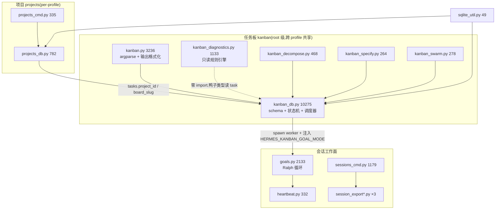
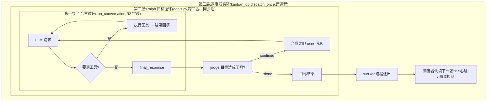

# R8D-L2-A · 任务板、项目与会话工作面(结构级测绘)

> 层级:**L2 结构级理解**——目标是"知道什么时候该来翻这个文件",不是逐行精读。
> 溯源约定:凡对代码行为的断言,锚点 `路径:行号 @ 863e313` **单独成行、置于代码块之前**;
> 围栏块内为基线逐字原文。基线:`/home/user/hermes-agent @ 863e31318553cda8ad61df681d08175364d4164b`。
> 本簇 21 个文件 / 23,478 行(实测,见文末逐文件表)。

---

## 0. 本簇在系统里的位置(速览)

这 21 个文件回答的是同一个问题的三个侧面:**"一个 agent 的工作,怎么在会话结束后还活着?"**

- **任务板(kanban 簇,7 文件 / 15,729 行)** —— 把"要做的事"从内存搬进 SQLite,
  于是它能跨进程、跨 profile、跨重启存在;并附带一个**进程调度器**,把卡片变成子进程。
  这是本簇的重心,也是全仓最大的单文件所在。
- **项目(projects 簇,2 文件 / 1,117 行)** —— 把"一堆文件夹 + 一个主 repo"命名成一个实体,
  供桌面端会话分组与 kanban worktree 命名复用。
- **会话工作面(12 文件 / 6,632 行)** —— 会话的导出(html/md/jsonl)、列表与筛选、
  回顾(recap)、部分压缩、检查点、草稿暂存,以及两个"**把会话自己接着往下推**"的机制:
  `goals.py`(Ralph 循环)与 `heartbeat.py`(心跳重入)。

三者的耦合点只有两处,都很窄:
1. `tasks.project_id` 列把 kanban 卡片挂到 project 上(决定 worktree 落在哪个 repo、分支怎么命名);
2. `goals.py` 同时被**交互会话**和**kanban worker**复用——同一个"判官 + 续跑"引擎,
   一个存进 SessionDB、一个只存在于 worker 进程的局部计数器里。



---

## 1. 为什么 `kanban_db.py` 有 10,275 行?

**结论先说:不是 "schema + 迁移 + 查询全在一起"。**
schema 只有 198 行、迁移只有约 330 行,加起来不到 6%。
真正撑起这个文件的是**两块跟"数据层"无关的东西**:

1. **一个进程调度器**(claim → spawn 子进程 → 心跳 → 超时 → 崩溃检测 → 僵尸回收 → 重生闸门),
   2,422 行,占 23.6%;
2. **一套 SQLite 灾难取证与自愈**(TLS 记录误写检测、header 校验、integrity_check、
   索引级重建、损坏文件内容寻址隔离与轮转、跨进程初始化锁、WAL checkpoint),
   1,459 行,占 14.2%。

### 1.1 按 banner 分段的实测行数

文件用 `# ---` 横线 banner 分节。逐段行数(用下面这条命令重跑可复现):

```verify
cd /home/user/hermes-agent && awk 'NR>=90 && /^# ----/{getline nxt; if (nxt ~ /^# [A-Z]/) { if (prev!="") printf "%-52s %5d\n", prev, NR-1-prevline; sub(/^# /,"",nxt); prev=nxt; prevline=NR+1 } } END{printf "%-52s %5d\n", prev, 10275-prevline}' hermes_cli/kanban_db.py
```

| 起始行 | 段名 | 行数 | 这段到底是什么 |
|---:|---|---:|---|
| 100 | Constants | 275 | 状态枚举 + 大段"为什么这么设计"的注释(见 1.4) |
| 377 | Paths | 523 | **多 board 解析链**:board 目录、metadata、create/list/remove |
| 902 | Data classes | 278 | `Task` / `Run` / `Comment` / `Attachment` / `Event` 五个 dataclass |
| 1182 | Schema | 198 | 7 张表 + 10 个索引(**整个 DDL 只占 1.9%**) |
| **1382** | **Connection helpers** | **1459** | **损坏取证 + 修复 + 迁移 + 跨进程锁 + write_txn** |
| 2843 | ID generation | 25 | |
| 2870 | Task creation / mutation | 654 | `create_task` 一个函数就 400 行 |
| 3526 | Links | 108 | 父子边 + 成环检测 |
| 3636 | Comments & events | 68 | |
| 3706 | Attachments | 387 | 磁盘 blob + 元数据行 + 文件名消毒 |
| 4095 | Dependency resolution | 127 | `recompute_ready`:todo → ready 的闸门 |
| 4224 | Claim / complete / block | 822 | CAS 抢占、幻觉卡片校验、完成物落盘 |
| 5048 | Workspace / tmux cleanup | 416 | |
| 5466 | *(banner 写"First-use tip",实际含整个状态迁移函数群)* | 900 | 见 1.3 |
| 6368 | Workspace resolution | 387 | git worktree 创建/复用 |
| **6757** | **Respawn guard constants →(实为 dispatcher 全部)** | **2422** | **调度器:spawn / 心跳 / 超时 / 崩溃 / 僵尸 / 熔断 / 日志轮转** |
| 9181 | Long-lived dispatcher daemon | 57 | |
| 9240 | Worker context builder | 250 | 拼给 worker 看的那段 prompt |
| 9492 | Stats + SLA helpers | 84 | |
| 9578 | Notification subscriptions | 421 | 给 gateway kanban-notifier 用的订阅游标 |
| 10001 | Retention + GC | 43 | |
| 10046 | Worker log accessor | 44 | |
| 10092 | Assignee enumeration | 72 | |
| 10166 | Runs (attempt history) | 109 | |

**该在什么时候翻它:** 想知道"一张卡片从建立到被子进程做掉,中间还有谁能改它的状态" ——
翻 4224 / 5466 / 6757 三段;想知道"板子的库坏了会发生什么" —— 翻 1382 段。
纯查询接口(list/get/stats)反而集中在最后 700 行,基本不用读。

### 1.2 表结构:7 张表,一张宽表 + 六张附属表

`hermes_cli/kanban_db.py:1184-1191`

```
SCHEMA_SQL = """
CREATE TABLE IF NOT EXISTS tasks (
    id                   TEXT PRIMARY KEY,
    title                TEXT NOT NULL,
    body                 TEXT,
    assignee             TEXT,
    status               TEXT NOT NULL,
    priority             INTEGER DEFAULT 0,
```

`tasks` 是唯一的宽表,~40 列,把**协调状态**(status / claim_lock / claim_expires /
worker_pid / last_heartbeat_at / current_run_id)、**路由参数**(assignee / tenant /
project_id / model_override / provider_override / reasoning_effort / skills)、
**熔断计数**(consecutive_failures / max_retries / block_recurrences)全部平铺在一行里。
列注释本身是设计文档——例如 `block_recurrences` 那段直接写明了"为什么不在 unblock 时清零":

`hermes_cli/kanban_db.py:1272-1278`

```
    -- same truly-blocked reason after having been unblocked. When it reaches
    -- BLOCK_RECURRENCE_LIMIT the task is routed to ``triage`` instead of
    -- ``blocked`` so a cron can't spin it forever. Reset to 0 only on a
    -- successful completion — NOT on unblock (resetting on unblock is exactly
    -- the amnesia that let the loop run unbounded).
    block_recurrences    INTEGER NOT NULL DEFAULT 0
);
```

其余六张表:

| 表 | 形状 | 角色 |
|---|---|---|
| `task_links` | `(parent_id, child_id)` 复合主键 | **有向图边**。父子关系即依赖:所有父完成才 `todo → ready` |
| `task_comments` | 自增 id + task_id + author + body | 人与 agent 的留言;swarm 的"黑板"就寄生在这里(见 2.4) |
| `task_events` | 自增 id + task_id + **run_id** + kind + payload(JSON) | **审计流**。诊断规则、通知游标、崩溃取证全读它 |
| `task_runs` | 自增 id + task_id + profile + status + claim_* + outcome + summary | **一次尝试**。同一卡片重试多次 = 多行;claim/PID/心跳的真身在 run 上,`tasks` 上是反规范化副本 |
| `task_attachments` | 元数据行 + `stored_path` 指向磁盘 blob | blob 不进库,只存绝对路径给 worker 的文件工具用 |
| `kanban_notify_subs` | `(task_id, platform, chat_id, thread_id)` 复合主键 + `last_event_id` 游标 | gateway 把 completed/blocked 事件推回原始请求者的订阅 |

索引 10 个,全是"状态列 + 时间列"的复合索引,没有全文索引、没有触发器、没有视图。

`hermes_cli/kanban_db.py:1367-1377`

```
CREATE INDEX IF NOT EXISTS idx_tasks_assignee_status ON tasks(assignee, status);
CREATE INDEX IF NOT EXISTS idx_tasks_status          ON tasks(status);
CREATE INDEX IF NOT EXISTS idx_links_child           ON task_links(child_id);
CREATE INDEX IF NOT EXISTS idx_links_parent          ON task_links(parent_id);
CREATE INDEX IF NOT EXISTS idx_comments_task         ON task_comments(task_id, created_at);
CREATE INDEX IF NOT EXISTS idx_events_task           ON task_events(task_id, created_at);
CREATE INDEX IF NOT EXISTS idx_runs_task             ON task_runs(task_id, started_at);
CREATE INDEX IF NOT EXISTS idx_runs_status           ON task_runs(status);
CREATE INDEX IF NOT EXISTS idx_attachments_task      ON task_attachments(task_id, created_at);
CREATE INDEX IF NOT EXISTS idx_notify_task           ON kanban_notify_subs(task_id);
"""
```

迁移策略是**只加列、不改列**:26 处 `_add_column_if_missing` 调用,每次开库都跑一遍,
没有版本号表、没有迁移脚本目录。

`hermes_cli/kanban_db.py:2326-2331`

```
def _migrate_add_optional_columns(conn: sqlite3.Connection) -> None:
    """Add columns that were introduced after v1 release to legacy DBs.

    Called by ``init_db`` so opening an old DB is always safe.
    """
    cols = {row["name"] for row in conn.execute("PRAGMA table_info(tasks)")}
```

```verify
cd /home/user/hermes-agent && grep -c "_add_column_if_missing(" hermes_cli/kanban_db.py
```

### 1.3 段 banner 与实际内容不符(◇,阅读陷阱)

第 5466 行的 banner 写的是 "First-use tip for scratch workspaces",但这个话题在 5548 行就结束了;
从 5551 到 6367(约 820 行)其实是**任务状态迁移函数群**——`edit_completed_task_result`、
`block_task`、`promote_task`、`unblock_task`、`specify_triage_task`、`decompose_triage_task`、
`archive_task`、`delete_task`,没有自己的 banner。

`hermes_cli/kanban_db.py:5464-5471`

```
# ---------------------------------------------------------------------------
# First-use tip for scratch workspaces
# ---------------------------------------------------------------------------
#
# Scratch workspaces are intentionally ephemeral — ``_cleanup_workspace``
# removes them as soon as ``complete_task`` runs.  New users often don't
# realize that and lose worker output (community report, May 2026).  The
# behavior is right; the lack of warning is the bug.
```

同理第 6757 行的 "Respawn guard constants" 之后 2,400 行全是调度器,banner 只覆盖头几十行的常量。
**用 banner 当目录会走错地方,用 `grep -n '^def '` 才靠谱。**

### 1.4 多 profile / 多 project 的隔离,是三条不同的线

这是本簇最容易读错的一处:**profile、board、project 三个词各自隔离了不同的东西,粒度完全不同。**

| 概念 | 存储位置 | 隔离粒度 | 谁跟谁共享 |
|---|---|---|---|
| **profile** | `$HERMES_HOME`(= `<root>/profiles/<name>`) | 凭据、配置、会话库 | **kanban 板故意不按 profile 隔离** |
| **board** | `<root>/kanban.db` 或 `<root>/kanban/boards/<slug>/kanban.db` | **一个 board = 一个独立 SQLite 文件** | 所有 profile 共享同一批 board |
| **project** | `$HERMES_HOME/projects.db`(**per-profile**) | 文件夹集合 + 主 repo + 可选绑定的 board slug | 不共享 |

**(a) profile 之间是"故意不隔离"的。** kanban 的根不走 `HERMES_HOME`,而走 `get_default_hermes_root()`:

`hermes_cli/kanban_db.py:429-439`

```
    The kanban board is shared across profiles **by design** (see the
    module docstring). Resolving the kanban paths through the active
    profile's ``HERMES_HOME`` would silently fork the board per profile,
    which breaks the dispatcher / worker handoff.
    """
    override = os.environ.get("HERMES_KANBAN_HOME", "").strip()
    if override:
        return Path(override).expanduser()
    from hermes_constants import get_default_hermes_root
    return get_default_hermes_root()
```

理由很实在:调度器用 profile A 跑,却给任务 spawn 了一个 `hermes -p B` 的 worker;
如果 board 按 profile 分家,worker 一开库就看不见自己那张卡。
**"共享 board"就是跨 profile 协作原语本身**,不是偷懒。

**(b) 真正的隔离单位是 board,靠"一个 board 一个 DB 文件"实现——不靠 WHERE 子句。**

`hermes_cli/kanban_db.py:582-587`

```
    slug = _normalize_board_slug(board)
    if slug is None:
        slug = get_current_board()
    if slug == DEFAULT_BOARD:
        return kanban_home() / "kanban.db"
    return board_dir(slug) / "kanban.db"
```

这条设计有三个连带后果,都写在模块 docstring 里:
- `default` board 为了向后兼容,DB **不在** `boards/default/` 而在 `<root>/kanban.db`——
  老装机零迁移;
- worker **无法枚举其他 board**:调度器 spawn 时把 `HERMES_KANBAN_DB` /
  `HERMES_KANBAN_WORKSPACES_ROOT` / `HERMES_KANBAN_BOARD` 一起注入子进程环境,
  worker 只认这一个文件;
- CAS 抢占的原子性天然是 per-board 的——每个 board 一把 SQLite WAL 写锁,
  多 board 不需要任何新的分布式锁。

board 解析优先级(高→低):`board=` 实参 → `HERMES_KANBAN_BOARD` →
`HERMES_KANBAN_DB`(直接钉死文件路径)→ `<root>/kanban/current` 文本文件 → `default`。

**(c) project 是第三条线,per-profile,只提供"锚点"不提供隔离。**

`hermes_cli/projects_db.py:14-19`

```
Scope: **per-profile**, stored at ``$HERMES_HOME/projects.db`` (resolved via
``get_hermes_home()``), mirroring sessions / config / cron. This deliberately
differs from kanban, whose board DB is root-anchored and shared across
profiles. A Project may *bind* a kanban board (``board_slug``) so the two
systems agree on the repo + branch convention without merging their stores.
```

两边通过两个软引用握手,**两个库从不 JOIN**:
`tasks.project_id`(kanban 侧)↔ `projects.board_slug`(project 侧)。
project 给 kanban 提供的第一样东西是**确定性分支名**:

`hermes_cli/projects_db.py:769-774`

```
def branch_name_for(project: Project, task_id: str, *, title: str = "") -> str:
    """Deterministic branch name for a project-linked kanban task.

    Shape: ``<project-slug>/<task-id>`` (optionally ``-<title-slug>``). Stable
    and human-meaningful, replacing the random ``wt/<task-id>`` fallback.
    """
```

第二样是绑定 board 时把工作目录钉到项目主 repo(尽力而为,失败不影响绑定本身):

`hermes_cli/projects_cmd.py:317-322`

```
def _sync_board_default_workdir(proj, board_slug: str) -> None:
    """Best-effort: point the bound board's default_workdir at the primary repo.

    Keeps kanban task worktrees anchored to the project's repo. Failures here
    are non-fatal — the binding itself already succeeded.
    """
```

**还有第四层隔离,和路径无关:`tenant` 列。** 同一个 board 内按租户过滤卡片,
`kanban_decompose.list_triage_ids(tenant=...)` 之类的查询会带上它。
这是唯一一处"用 WHERE 做隔离"的地方。

### 1.5 一个容易漏掉的横切保护:delegate_task 子进程禁止改板

所有走 `write_txn` 的写路径,进事务前先断言"我不是 delegate_task 派生的子上下文"。

`hermes_cli/kanban_db.py:165-176`

```
def _assert_not_delegated_child_mutation() -> None:
    """Reject Kanban state mutations from ``delegate_task`` child contexts.

    The structured kanban tools and CLI dispatch layer both have fast-fail
    guards for better UX, but neither is a trust boundary: a delegated child can
    still shell out to the CLI or import this module directly. The actual
    invariant belongs at the DB/filesystem mutation layer so every public
    mutator that uses ``write_txn`` (tasks, runs, comments, attachments,
    dispatcher claims, repair events, subscriptions, GC, etc.) and every board
    metadata mutator fails closed before touching durable state.
    """
```

这是"把不变量下沉到最后一道门"的教科书写法:上层的两处快速失败只为了报错好看,
真正的强制点在 `write_txn` 里(`kanban_db.py:2812`)。

---

## 2. 五个卫星模块是按什么维度切的?

`kanban_db.py` 之外有 `kanban.py` + 五个卫星。**切分维度不是"功能领域",而是三个正交的问题:
谁写库 / 谁读库 / 谁调 LLM。**

| 模块 | 写库? | 读库? | 调 LLM? | 引入新调度器? | 一句话定位 |
|---|:--:|:--:|:--:|:--:|---|
| `kanban_db.py` (10275) | ✔ 唯一写者 | ✔ | ✘ | **它自己就是** | 内核:存储 + 状态机 + 进程调度器 |
| `kanban.py` (3236) | 经 db | ✔ | ✘ | ✘ | CLI 外壳:argparse + 输出格式化 + `/kanban` 斜杠转发 |
| `kanban_diagnostics.py` (1133) | **✘ 显式只读** | ✔(经调用方传入) | ✘ | ✘ | 无状态规则引擎:(task, events, runs) → 诊断列表 |
| `kanban_specify.py` (264) | 经 db | ✔ | **✔ aux** | ✘ | 1 张 triage 卡 → 1 张写好的卡 |
| `kanban_decompose.py` (468) | 经 db | ✔ | **✔ aux** | ✘ | 1 张 triage 卡 → N 张子卡 + 父子边 |
| `kanban_swarm.py` (278) | 经 db | ✔ | ✘ | ✘ | 写一张**固定拓扑**的卡片图(纯确定性) |

三点值得记住:

**(1) 诊断模块的解耦最彻底 —— 它一个本仓库模块都不 import。**

```verify
cd /home/user/hermes-agent && grep -nE '^[[:space:]]*(from|import)[[:space:]]' hermes_cli/kanban_diagnostics.py
```

搜索面:该文件全文、任意缩进层级的 `from`/`import` 行(含函数内延迟导入)。
结果只有 `__future__` / `dataclasses` / `typing` / `json` / `time` 五行,**零项目依赖**。
它靠一个鸭子类型读取器吃下三种 task 表示:

`hermes_cli/kanban_diagnostics.py:124-131`

```
def _task_field(task, name, default=None):
    """Read a field from a task regardless of representation.

    Callers pass sqlite3.Row (dict-like with [] but no attribute
    access), kanban_db.Task dataclasses (attribute access), or plain
    dicts (both). This normalises them so rule functions don't have
    to branch on type each time.
    """
```

代价是没有类型检查;收益是 dashboard 插件(`plugins/kanban/dashboard/plugin_api.py`)
可以直接把 SQL 行喂进来,不必先构造 `Task` 对象。规则表 `_RULES` 里 8 条规则
(幻觉卡片、triage aux 不可用、散文里的幻影 id、反复失败、反复崩溃、blocked 卡死、
block↔unblock 循环、ready 搁浅),每条被 `compute_task_diagnostics` 包在 try/except 里:

`hermes_cli/kanban_diagnostics.py:1118-1124`

```
    for rule in _RULES:
        try:
            out.extend(rule(task, events, runs, now_ts, cfg))
        except Exception:
            # A broken rule must never crash the dashboard. Rule bugs
            # get caught in tests; in production we'd rather drop the
            # diagnostic than 500 a whole /board request.
            continue
```

**(2) `specify` 与 `decompose` 是同一条流水线的两档,decompose 是 specify 的严格超集。**
两者结构几乎逐行对应:函数内延迟 import `agent.auxiliary_client.call_llm`、
宽松 JSON 解析(容忍 markdown 围栏)、单次调用不重试、预期失败不抛异常。
`decompose` 多两件事:读 profile 花名册(带描述)让模型挑 assignee;
`fanout=false` 时退化成 specify 的效果。它自己的 docstring 就这么写:

`hermes_cli/kanban_decompose.py:27-30`

```
* ``fanout=false`` collapses to the same effect as ``kanban specify``:
  we tighten the body and flip ``triage -> todo`` as a single task,
  no children created. This makes ``decompose`` a strict superset of
  ``specify`` from the user's perspective.
```

调用面也不同:`specify` 只有 CLI 与 dashboard 两个入口;
`decompose` 多一个 —— gateway 的自动分解 watcher,而且是**延迟 import + import 失败就跳过这一 tick**:

`gateway/kanban_watchers.py:1348-1354`

```
            try:
                from hermes_cli import kanban_decompose as _decomp
            except Exception as exc:  # pragma: no cover
                logger.warning(
                    "kanban auto-decompose: import failed (%s); skipping", exc,
                )
                return 0
```

**(3) swarm 刻意"不做新东西":它只是往现有内核里写一张固定形状的图。**

`hermes_cli/kanban_swarm.py:3-15`

```
This module intentionally does not introduce a second scheduler. It writes a
small task graph into the existing Kanban kernel:

    planning root (completed immediately)
        ├─ parallel specialist workers (ready)
        └─ verifier (todo until all workers done)
             └─ synthesizer (todo until verifier done)

The shared blackboard is also deliberately low-tech: structured JSON comments on
the root task. That keeps all state in existing task_comments/task_events rows,
so the dashboard, notifier, slash command, and dispatcher keep working without a
new service.
```

"黑板"(多 agent 共享工作区)不是新表,是 `task_comments` 里以
`BLACKBOARD_PREFIX = "[swarm:blackboard] "` 打头的 JSON 评论。
**这条设计原则可以直接搬走:新拓扑不配新调度器,只配一个"图的写法"。**

`kanban.py` 本身则是纯外壳:216–956 行(741 行)全是 `build_parser` 的 argparse 树,
之后是 `kanban_command` 分发 + 约 55 个 `_cmd_*` 函数 + 末尾的 `run_slash`
(把 `/kanban xxx` 一行字符串 shlex 拆开喂给同一套 argparse)。
**CLI 与 gateway 斜杠命令共用同一个 parser,是这个文件存在的全部理由。**

---

## 3. 会话导出三个模块的共同中间表示是什么?

**结论:共同 IR 是一个没有类型的 `dict` —— SessionDB 的 `export_session()` 返回值。
三个导出模块彼此不 import,各自独立地"读这个 dict"。**

```verify
cd /home/user/hermes-agent && grep -rn "session_export_md\|session_export_html\|from hermes_cli.session_export import" --include='*.py' --exclude-dir=tests --exclude-dir=__pycache__ .
```

搜索面:全仓 `.py`,排除 `tests/` 与 `__pycache__`。结果全部落在 `hermes_cli/sessions_cmd.py`
的四行延迟 import 上——**只有 `sessions_cmd.py` 同时知道三者,三者互不相识**。

IR 的产地在这里:

`hermes_state_portability.py:266-272`

```
    def export_session(self, session_id: str) -> Optional[Dict[str, Any]]:
        """Export a single session with all its messages as a dict."""
        session = self.get_session(session_id)
        if not session:
            return None
        messages = self.get_messages(session_id)
        return {**session, "messages": messages}
```

即 **session 行的全部列 + 一个 `messages` 列表**,每条消息形如
`{role, content, tool_calls, timestamp}`,`content` 可能是 str、list(多模态分片)或 dict。

三个消费者各取所需:

| 模块 | 入口 | 读什么 | 输出 |
|---|---|---|---|
| `session_export.py` (317) | `render_sessions_export(sessions, fmt, only)` | `session["messages"]` | jsonl / markdown;支持 `--only user-prompts` |
| `session_export_md.py` (279) | `write_session_markdown(data, dir, fmt)` | `session["segments"]`,缺省回落 `[session]` | 落盘 .md/.qmd + YAML frontmatter + SHA256 + manifest |
| `session_export_html.py` (870) | `generate_html_export(session_data)` | `session["messages"]` | 单文件自包含 HTML(内联 CSS/SVG/CSP) |

**关键细节:压缩分段(compression segment)只有 md 路径看得见。**

`hermes_cli/session_export_md.py:76-80`

```
def _segments(session: dict[str, Any]) -> list[dict[str, Any]]:
    segments = session.get("segments")
    if isinstance(segments, list) and segments:
        return [s for s in segments if isinstance(s, dict)]
    return [session]
```

`segments` 这个键只由 `export_session_lineage()` 产生,而它全仓**只有一个非测试调用方**:

```verify
cd /home/user/hermes-agent && grep -rn "export_session_lineage" --include='*.py' --exclude-dir=tests --exclude-dir=__pycache__ .
```

搜索面:全仓 `.py`,排除 `tests/` 与 `__pycache__`。两条命中——定义处与唯一调用处
(`hermes_cli/sessions_cmd.py:632`,md/qmd 分支的 `--lineage logical`)。
所以 **html / jsonl 导出永远拿不到 `segments`**。这不是 bug——它同时写了两份:

`hermes_state_portability.py:286-292`

```
        base = dict(segments[-1])
        total_messages = sum(len(seg.get("messages") or []) for seg in segments)
        base["segments"] = segments
        base["lineage_session_ids"] = [seg["id"] for seg in segments]
        base["message_count"] = total_messages
        base["messages"] = [msg for seg in segments for msg in (seg.get("messages") or [])]
        return base
```

读 `messages` 的两个模块因此仍然看得到全部消息,只是丢掉了"这里换过一次会话 id"的分界。

**三处独立实现带来的必然后果:同一个 `content` 字段被解析了三遍,三套规则。**
`session_export.py` 有 `_message_text` / `_content_part_text` 两级递归;
`session_export_md.py` 有 `_render_content`;`session_export_html.py` 在
`_generate_messages_html` 里就地展开(且只认 `type == "text"` 与 `type == "image_url"`,
其余分片丢弃)。html 还多一条独有规则——跳过 `role == "session_meta"` 的内部消息。
**◇ 记一条:"跳过 session_meta"只在 html 路径存在,md/jsonl 会把它导出去。**

`hermes_cli/session_export_html.py:663:666`

```
        role = msg.get("role", "unknown")
        
        # Skip internal metadata messages
        if role == "session_meta":
```

**该在什么时候翻它们:** 要改导出格式,先确定用户跑的是哪条命令——
`--only user-prompts` → `session_export.py`;`--format html` → `session_export_html.py`;
`--format md|qmd` → `session_export_md.py`。**改一个不会影响另外两个。**

外围三个小模块:`session_filters.py`(234)把 `5h` / `2d` / ISO 时间戳译成 epoch 边界与
`SessionDB.prune_sessions` 的 kwargs,被 prune / archive / export 三条命令共用;
`session_listing.py`(117)只做 `/sessions` 参数解析 + 列表渲染,CLI 与 gateway 共用;
`session_recap.py`(322)做纯本地统计(不调 LLM、不动 prompt cache),
把最近 20 轮里的工具调用按类别数出来。

---

## 4. `goals.py` 的 "Ralph loop" 是什么循环?

### 4.1 一句话:它是**回合之上的第二层循环**

R2 学过的主循环解决的是"模型要调工具 → 调完把结果喂回去 → 直到模型不再要工具",
**一次 `run_conversation` = 一个回合**:

`agent/conversation_loop.py:1233-1237`

```
def run_conversation(
    agent,
    user_message: Any,
    system_message: str = None,
    conversation_history: List[Dict[str, Any]] = None,
```

Ralph 循环解决的是**下一层的问题:模型说完了,但活没干完。**
它在 `run_conversation` 返回之后启动:拿最后一条回复去问一个**辅助模型(judge,判官)**——
"这个目标算达成了吗?"。judge 说 `continue`,就合成一条**普通 user 消息**塞回**同一个会话**,
再跑一次 `run_conversation`。

`hermes_cli/goals.py:1-8`

```
"""Persistent session goals — the Ralph loop for Hermes.

A goal is a free-form user objective that stays active across turns. After
each turn completes, a small judge call asks an auxiliary model "is this
goal satisfied by the assistant's last response?". If not, Hermes feeds a
continuation prompt back into the same session and keeps working until the
goal is done, turn budget is exhausted, the user pauses/clears it, or the
user sends a new message (which takes priority and pauses the goal loop).
```

于是整个系统里一共有**三层嵌套循环**,每层的"一步"是下一层的整趟:



**为什么这层循环值得单独存在?** 因为第一层循环的终止条件是"模型不再请求工具",
这跟"任务完成"完全是两件事——模型经常在活干到一半时停下来汇报。
Ralph 循环把"完成"的判定权从**被评估的模型自己**手里拿走,交给一个独立的判官。

### 4.2 三条关键不变量(照抄它的 docstring,值得直接搬走)

- **续跑提示就是一条普通 user 消息**,不改 system prompt、不换 toolset —— **prompt cache 不失效**。
  (prompt cache = provider 对相同前缀的请求复用已算好的 KV,前缀一变就全废。)
- **判官失败一律 fail-OPEN(判 `continue`)**:判官挂了不能把工作卡死,兜底是回合预算。
- **真人消息永远优先**:用户中途插话会抢占续跑提示,并暂停这一轮目标循环;
  插话跑完仍然会再判一次(万一用户那条消息正好把目标做完了)。

### 4.3 三道刹车(这是它跟"无限自我提示"最大的区别)

Ralph 循环最危险的失败模式是"判官坏了 → 每回合都说 continue → 烧完全部预算/额度"。
`goals.py` 装了三道独立的闸:

1. **回合预算**,user 发起的与自己续跑的回合**都计数**——

   `hermes_cli/goals.py:50-51`

   ```
   DEFAULT_MAX_TURNS = 20
   DEFAULT_JUDGE_TIMEOUT = 30.0
   ```

2. **连续解析失败 3 次自动暂停**(`DEFAULT_MAX_CONSECUTIVE_PARSE_FAILURES = 3`)——
   小模型返不出合法 JSON 时,不该白烧 20 回合;
3. **连续传输失败 5 次自动暂停**(`DEFAULT_MAX_CONSECUTIVE_TRANSPORT_FAILURES = 5`)——
   API key 失效会每次都 401,这是永久性配置问题,不是瞬时抖动。

第 2、3 条是**分开计数**的,理由写在常量注释里:解析失败说明"模型能力不够",
传输失败说明"配置坏了",两者的正确反应不同。

### 4.4 除了 LLM 判官,还有一层确定性关卡(quality gate)

`goals.py` 支持给目标挂 shell 命令作为**质量门**。门在判官**之前**跑,门没过就不问判官:

`hermes_cli/goals.py:1745-1749`

```
        # Quality gates run BEFORE the LLM judge: a failing gate is
        # deterministic evidence the goal is not done, so the judge call is
        # skipped entirely and the gate's output drives the next turn. Gate
        # continuations respect the same turn budget as judge continuations.
        gate_decision = self._check_gates()
        if gate_decision is not None:
```

**失败的门,它的输出本身就是续跑提示**——agent 拿到的是真实的编译错误 / 测试失败,
而不是判官的一句"看起来还没做完"。门本身是有界的:硬超时、超时即杀、输出只留尾部。

`hermes_cli/goals.py:498-505`

```
def run_gate(gate: GoalGate, *, cwd: Optional[str] = None) -> Tuple[bool, int, str]:
    """Run one gate command. Returns ``(passed, exit_code, output_tail)``.

    The command runs through the shell in ``cwd`` (default: process cwd) with
    a hard timeout; on timeout the process is killed and treated as failed
    with exit code -1. Output is the combined stdout+stderr tail, bounded to
    ``_GATE_OUTPUT_TAIL_CHARS``.
    """
```

这是"有确定性证据时不要问 LLM"的样板(默认 `DEFAULT_GATE_TIMEOUT_SECONDS = 300`、
重试上限 3、输出尾部截断 3000 字符)。

另外两个附加机制:
- **completion contract(完成契约)**——一份结构化的"什么叫做完 / 怎么证明 / 不许破坏什么 /
  什么时候该停下来问人",同时织进续跑提示和判官提示:

  `hermes_cli/goals.py:332-341`

  ```
  class GoalContract:
      """Optional structured completion contract for a goal.

      Each field is free-form prose the user (or :func:`draft_contract`)
      supplies. Empty fields are omitted everywhere — a goal with no contract
      behaves exactly like the original free-form goal. The contract is woven
      into both the continuation prompt (so the agent targets the verification
      surface and respects constraints) and the judge prompt (so "done" is
      decided against evidence, not vibes).
      """
  ```

- **wait 判决 + 等待栅栏**:判官能看到 `process_registry.list_sessions()` 快照,
  发现 agent 在等一个后台进程(CI 轮询、构建)时可以返回 `wait` 并指名 pid,
  于是循环**停住不烧回合**,栅栏清除后自动恢复(`is_waiting()` / `wait_on()` /
  `wait_on_session()` / `wait_for_seconds()`)。

### 4.5 两套宿主:交互会话 vs kanban worker

同一个引擎有**两个形态完全不同的驱动器**,这是理解本簇耦合的关键。

**(a) 交互/网关会话 —— 状态落 SessionDB,续跑消息塞进输入队列。**
状态存在 SessionDB 的 `state_meta` 表,键 `goal:<session_id>`,所以 `/resume` 能接着跑。
CLI 拿到判决后**不自己再跑一轮**,而是把续跑提示 put 进 `_pending_input`,
让 REPL 的正常输入循环去消费:

`cli.py:10845-10851`

```
        if decision.get("should_continue"):
            prompt = decision.get("continuation_prompt")
            if prompt:
                try:
                    self._pending_input.put(prompt)
                except Exception as exc:
                    logging.debug("goal continuation enqueue failed: %s", exc)
```

**这就是"续跑提示是普通 user 消息"这条不变量在实现层面的体现**——它走的是跟真人打字
一模一样的那条路。`heartbeat.py` 用的是同一个队列(`cli.py:10643`),
所以两者的"不打断正在跑的回合、忙时合并、闲时才注入"语义天然一致。

**(b) kanban worker —— 无持久化,预算是个局部变量,超支就把卡片钉死为 blocked。**
调度器给 goal_mode 卡片 spawn worker 时注入环境变量:

`hermes_cli/kanban_db.py:9049-9055`

```
    # Goal-loop mode: the worker reads these and wraps its run in the
    # Ralph-style /goal judge loop (see cli.py quiet-mode path). Only set
    # when enabled so non-goal tasks keep a clean env.
    if task.goal_mode:
        env["HERMES_KANBAN_GOAL_MODE"] = "1"
        if task.goal_max_turns is not None:
            env["HERMES_KANBAN_GOAL_MAX_TURNS"] = str(int(task.goal_max_turns))
```

worker 端在**安静单查询路径**跑完第一回合后接上循环:

`cli.py:18484-18488`

```
                        if os.environ.get("HERMES_KANBAN_GOAL_MODE") == "1":
                            try:
                                _run_kanban_goal_loop_q(cli, response)
                            except Exception as _goal_exc:
                                logger.debug("kanban goal loop failed: %s", _goal_exc)
```

worker 端的入口把三件事全做成了**注入参数**(为了可测,也为了跟 CLI 解耦):

`hermes_cli/goals.py:1985-1995`

```
def run_kanban_goal_loop(
    *,
    task_id: str,
    goal_text: str,
    run_turn,
    task_status_fn,
    block_fn,
    max_turns: int = DEFAULT_MAX_TURNS,
    first_response: str = "",
    log=None,
) -> Dict[str, Any]:
```

它与 `GoalManager` 的差别,是理解"一个机制怎么适配两种宿主"的好例子:

| | 交互会话(`GoalManager`) | kanban worker(`run_kanban_goal_loop`) |
|---|---|---|
| 目标文本来自 | 用户 `/goal <text>` | **卡片的 title + body**(卡片本身就是验收标准) |
| 状态持久化 | SessionDB `state_meta` | **不持久化**——worker 进程是一次性的,预算是局部变量 |
| 依赖注入 | 直接调 `run_conversation` | 注入 `run_turn` / `task_status_fn` / `block_fn` 三个可调用对象(为可测) |
| `wait` 判决 | 停住等栅栏 | **降级成 `continue`**——worker 没有"停住"的概念 |
| 提前退出 | 用户 pause/clear | worker 自己调了 `kanban_complete` / `kanban_block` 就立刻停 |
| 预算耗尽 | 目标转 `paused` | **调 `block_fn` 把卡片钉成 blocked 等人看,绝不静默退出** |

预算耗尽和"判 done 但就是不 finalize"两种情况都走 block,不走静默退出:

`hermes_cli/goals.py:2087-2097`

```
        if turns_used >= max_turns:
            _log(f"kanban goal loop: task {task_id} exhausted {turns_used}/{max_turns} turns; blocking")
            try:
                block_fn(
                    f"Goal-mode worker exhausted its turn budget "
                    f"({turns_used}/{max_turns}) without completing the task. "
                    f"Last judge verdict: {_truncate(reason, 300)}"
                )
            except Exception as exc:
                _log(f"kanban goal loop: block_fn failed ({exc})")
            return {"outcome": "blocked_budget", "turns_used": turns_used, "reason": "turn budget exhausted"}
```

还有一处**注释即事故记录**,值得单独记:goal_mode worker 必须走 `-Q`(全静默单查询)路径,
否则钩子根本不会执行。

`hermes_cli/kanban_db.py:9135-9141`

```
    if task.goal_mode:
        # Goal-mode workers must take the fully-quiet single-query path:
        # the kanban goal-loop hook (_run_kanban_goal_loop_q) only runs in
        # cli.py's quiet branch. Without -Q the worker gets exactly one
        # turn, prints text, exits rc=0, and the dispatcher records a
        # protocol violation (incident 2026-06-09 t_d9cbe312).
        cmd.append("-Q")
```

**该在什么时候翻 `goals.py`:** 想给 agent 加"自动继续干到完成"的能力时;
想知道 judge 提示词长什么样时(`JUDGE_USER_PROMPT_*_TEMPLATE` 三套模板);
或者 kanban 卡片明明有产出却被标成 blocked、要查是不是撞了 4.5(b) 那张表里的哪一格。

---

## 5. `sqlite_util.py` 49 行,统一了什么?

**它统一了两件事,而且只有两件:一个幂等的加列迁移,一个 IMMEDIATE 写事务。**

`hermes_cli/sqlite_util.py:1-6`

```
"""Shared SQLite primitives for the small per-profile / board stores.

The projects and kanban stores open WAL SQLite files with the same two
primitives — an idempotent column-add migration and an IMMEDIATE write
transaction. One definition here keeps the two stores from drifting.
"""
```

**(a) `add_column_if_missing`** —— 吞掉并发迁移者已经加过列时报的 `duplicate column name`,
返回"这次是不是我加的":

`hermes_cli/sqlite_util.py:14-21`

```
def add_column_if_missing(conn: sqlite3.Connection, table: str, column: str, ddl: str) -> bool:
    """``ALTER TABLE <table> ADD COLUMN <ddl>``, idempotent across races.

    Returns ``True`` when this call added the column. Swallows the
    ``duplicate column name`` error a concurrent migrator may have run first
    (issue #21708). ``column`` is the human-readable name for the call site;
    ``ddl`` carries the actual definition.
    """
```

它把"schema 演进"降级成一句可以无脑重跑的语句:
开库时把全部可选列过一遍即可,不需要版本号表、不需要迁移目录、不需要迁移顺序。
kanban_db 里 26 处调用、projects_db 里一处集中调用,都是这个模式。

**(b) `write_txn`** —— `BEGIN IMMEDIATE` 包起来,异常时 ROLLBACK,
且 **ROLLBACK 本身的失败被吞掉**,理由写在 docstring 里:SQLite 在 EIO / 锁竞争 / 损坏时
会自动回滚,此时再显式 ROLLBACK 会抛一个"没有活动事务"的次生错误,
把真正的原始异常盖掉。`BEGIN IMMEDIATE`(而不是默认的 deferred)是 kanban 全部 CAS
抢占的原子性来源:SQLite 用一把 WAL 写锁串行化写者,抢卡片时最多一个赢家,
输家看到"影响 0 行"就走人——**不需要重试循环,不需要分布式锁**。

**实际使用者是三个,不是两个:**

```verify
cd /home/user/hermes-agent && grep -rn "sqlite_util" --include='*.py' --exclude-dir=tests --exclude-dir=__pycache__ .
```

搜索面:全仓 `.py`,排除 `tests/` 与 `__pycache__`(该目录只含编译产物)。三条命中:
`projects_db.py:36`(两个原语都用)、`observability/shared_metrics.py:15`(只用 `write_txn`)、
`kanban_db.py:92`(**只用 `add_column_if_missing`**)。

**▲ 文档-代码冲突(模块 docstring 侧):**
`sqlite_util.py:3-5` 声称 "The projects and kanban stores … the same two primitives …
One definition here keeps the two stores from drifting"。实际上 **kanban 恰恰已经漂移了**:
它没有 import 这里的 `write_txn`,而是在 `kanban_db.py:2801` 自建了一个超集版本,
额外做三件事——delegate 子上下文断言、`BEGIN`/`COMMIT` 的 busy 重试、提交后的文件长度不变量检查:

`hermes_cli/kanban_db.py:2801-2812`

```
def write_txn(conn: sqlite3.Connection):
    """Context manager for an IMMEDIATE write transaction.

    Use for any multi-statement write (creating a task + link, claiming a
    task + recording an event, etc.).  A claim CAS inside this context is
    atomic -- at most one concurrent writer can succeed.

    The explicit ROLLBACK on exception is wrapped in try/except so that
    a SQLite auto-rollback (which leaves no active transaction) does not
    shadow the original exception with a spurious rollback error.
    """
    _assert_not_delegated_child_mutation()
```

同时 docstring 说的"两个 store"也少算了一个 —— `observability/shared_metrics.py` 是第三个消费者。
这不是缺陷(kanban 的额外保护本来就该只在 kanban 生效),但**读 `sqlite_util.py` 时不能据它推断
kanban 的事务行为**——那是本簇最容易踩的一处误导。

**该在什么时候翻它:** 只有一种场景——要给系统加第 N 个小 SQLite 库时,照抄这两个原语。
读 kanban 的事务语义请直接去 `kanban_db.py:2782-2840`。

---

## 6. 逐文件角色表

### kanban 簇(7 文件 / 15,729 行)

| 文件 | 行数 | 一句话角色 |
|---|---:|---|
| `hermes_cli/kanban_db.py` | 10275 | **内核**:7 表 schema + 状态机 + **子进程调度器**(占 24%)+ SQLite 损坏取证与自愈(占 14%)。板级隔离靠"一 board 一 DB 文件" |
| `hermes_cli/kanban.py` | 3236 | **CLI 外壳**:741 行 argparse 树 + ~55 个 `_cmd_*` + `run_slash`(CLI 与 gateway `/kanban` 共用同一 parser) |
| `hermes_cli/kanban_diagnostics.py` | 1133 | **只读规则引擎**:8 条规则吃 (task, events, runs) 吐结构化诊断 + 建议动作。**零项目 import**,鸭子类型兼容 Row/dataclass/dict |
| `hermes_cli/kanban_decompose.py` | 468 | aux-LLM 扇出:1 张 triage 卡 → N 张子卡 + 父子边;读 profile 花名册挑 assignee;`fanout=false` 时退化为 specify |
| `hermes_cli/kanban_swarm.py` | 278 | **确定性拓扑写入器**:planning root → 并行 worker → verifier → synthesizer;"黑板"寄生在 `task_comments` 里;不引入第二个调度器 |
| `hermes_cli/kanban_specify.py` | 264 | aux-LLM 单卡细化:一句话 → title + goal/approach/acceptance,`triage → todo` |
| `hermes_cli/sqlite_util.py` | 49 | 两个共享 SQLite 原语(见第 5 节);**kanban 只用了其中一个** |

### projects 簇(2 文件 / 1,117 行)

| 文件 | 行数 | 一句话角色 |
|---|---:|---|
| `hermes_cli/projects_db.py` | 782 | **per-profile** `$HERMES_HOME/projects.db`:projects / project_folders / project_meta / 已发现 repo 缓存 4 表;`project_for_path` 做最长前缀匹配把会话归到项目;`branch_name_for` 给 kanban 提供确定性分支名 |
| `hermes_cli/projects_cmd.py` | 335 | `hermes project` CLI:create/list/show/add-folder/set-primary/use/archive/**bind-board**;绑定时同步 board 的默认工作目录 |

### 会话工作面(12 文件 / 6,632 行)

| 文件 | 行数 | 一句话角色 |
|---|---:|---|
| `hermes_cli/goals.py` | 2133 | **Ralph 循环**(第 4 节):判官 + 续跑提示 + 三道刹车 + 质量门 + 完成契约 + 等待栅栏;一套引擎两个宿主(交互会话持久化 / kanban worker 一次性) |
| `hermes_cli/sessions_cmd.py` | 1179 | `hermes sessions` 全部子命令的分发器;从 `main.py` 机械搬出(闭包变量经 `functools.partial` 回传);**唯一同时认识三个导出模块的地方** |
| `hermes_cli/session_export_html.py` | 870 | 单文件自包含 HTML 导出:内联 CSS + Lucide SVG + CSP meta;支持单/多会话(带侧边栏);独有"跳过 `session_meta`"规则 |
| `hermes_cli/heartbeat.py` | 332 | **心跳重入**:`/heartbeat every 10m <prompt>`;到点且会话空闲时把 prompt 塞进同一条 `_pending_input`;忙时合并成一次,不堆积。状态存 SessionDB `heartbeat:<sid>` |
| `hermes_cli/partial_compress.py` | 324 | "压缩到此为止"的**纯函数切分逻辑**:把历史切成 head(送去压缩)+ 尾部原样保留;切点向前吸附到最近的 `user` 消息以保持角色交替合法 |
| `hermes_cli/session_recap.py` | 322 | `/recap`:纯本地统计最近 20 轮的工具调用类别与最新 prompt 预览。**不调 LLM、不动 prompt cache** |
| `hermes_cli/session_export.py` | 317 | 通用渲染器:jsonl / markdown,支持 `--only user-prompts`;只读 `messages`,看不到 `segments` |
| `hermes_cli/checkpoints.py` | 291 | `hermes checkpoints` status/list/prune/clear/clear-legacy;纯文件系统操作,不需要 agent 在跑 |
| `hermes_cli/session_export_md.py` | 279 | md/qmd 落盘导出:YAML frontmatter + SHA256 自校验 + manifest 追加 + `redact_session_data`;**唯一识别压缩分段 `segments` 的导出路径** |
| `hermes_cli/prompt_stash.py` | 260 | Ctrl+S 草稿暂存的**纯状态机**(不 import prompt_toolkit,便于单测);最多 20 条,新的在前;**只在内存,绝不落盘**(草稿常含密钥) |
| `hermes_cli/session_filters.py` | 234 | 把 `5h` / `2d` / `2026-07-05T14:30` 译成 epoch 边界与 `SessionDB.prune_sessions` 的 kwargs;prune/archive/export 三条命令共用 |
| `hermes_cli/session_listing.py` | 117 | `/sessions` 参数解析(flags 只在首个位置词之前生效)+ 网关侧列表渲染;CLI 与 gateway 共用 |

---

## 7. 本轮记号汇总

- **▲ 1 条** —— `sqlite_util.py:3-5` 的模块 docstring 称 projects 与 kanban 共用这里的两个原语、
  "One definition here keeps the two stores from drifting";实际 kanban 只 import 了
  `add_column_if_missing`,`write_txn` 在 `kanban_db.py:2801` 另起了一个超集实现(已漂移),
  且第三个消费者 `observability/shared_metrics.py` 未被 docstring 提及。
- **◇ 3 条**(代码有、文档无):
  1. `kanban_diagnostics.py` **零项目 import**、靠 `_task_field` 鸭子类型同时吃
     `sqlite3.Row` / `Task` dataclass / `dict` —— 这是它能被 CLI 与 dashboard 插件复用的全部原因,
     模块 docstring 只说"stateless and read-only",没提这一层。
  2. `session_export_html.py:666` 独有的"跳过 `role == 'session_meta'`"规则,
     md / jsonl 两条路径都不做,三条导出路径因此在消息集合上不完全等价。
  3. `tenant` 列是本簇唯一"用 WHERE 做隔离"的维度,与 board(文件级隔离)、
     project(per-profile)正交;模块 docstring 详述了 board 与 profile,未提 tenant。
- **◎ 1 条** —— `kanban_db.py` 模块 docstring 的"schema 很小"段落只列了四张表。
  按"整段一并判定"的要求,这一段共三句:

  `hermes_cli/kanban_db.py:55-59`

  ```
  Schema is intentionally small: tasks, task_links, task_comments,
  task_events.  The ``workspace_kind`` field decouples coordination from git
  worktrees so that research / ops / digital-twin workloads work alongside
  coding workloads.  See ``docs/hermes-kanban-v1-spec.pdf`` for the full
  design specification.
  ```

  逐句判定:第一句**字面为真但显著保守/过时**——这四张表确实存在、确实小,
  但 `SCHEMA_SQL` 实际已有 **7 张表**(多出 `task_runs` / `task_attachments` /
  `kanban_notify_subs`),按 R8-fix 记号规约计 ◎ 不计 ▲。
  第二句(`workspace_kind` 解耦协调与 git worktree)**成立**:
  `hermes_cli/kanban_db.py:135`

  ```
  VALID_WORKSPACE_KINDS = {"scratch", "worktree", "dir"}
  ```

  且该列确在 `tasks` 表里(`workspace_kind TEXT NOT NULL DEFAULT 'scratch'`)。
  第三句是外链 PDF,本轮未打开,不判定(见第 8 节移交项)。
- **■ 0 条** —— 本轮为结构级测绘,未做逐分支精读,不下缺陷判定。

## 8. 留给后续轮的锚点

- **`kanban_db.py:1382-2840`(Connection helpers,1,459 行)值得一次 L1 精读。**
  现象:里面有 `_looks_like_tls_record_at`(检测 DB 文件里被误写进 TLS 记录)、
  `_backup_corrupt_db`(内容寻址的损坏文件隔离 + 数量轮转)、`_attempt_index_reindex_repair`
  (只坏索引时局部 REINDEX 而不是整库重建)、`_check_file_length_invariant`
  (提交后核对 header page_count 与实际文件页数,防"撕裂扩展")。
  这是一整套"单机 SQLite 当协调数据库"的加固经验,与 R2 学的 harness 主循环完全正交。
- **`kanban_db.py:6757-9180`(dispatcher,2,422 行)值得一次 L1 精读。**
  现象:`detect_crashed_workers` / `enforce_max_runtime` / `check_respawn_guard` /
  `reap_worker_zombies` / `_classify_worker_exit` 构成一个完整的进程监管器,
  且 `_error_fingerprint` + `_protocol_violation_streak` 会对"同一种错误反复出现"做指纹去重。
- **`kanban.py:216-956` 的 argparse 树与 `docs/hermes-kanban-v1-spec.pdf` 的对照未做。**
  现象:模块 docstring 声称自己覆盖了设计规范里的全部命令面,本轮未打开该 PDF,
  无法判定 "full" 是否成立;若后续轮要处理 ▲,这是一个已知的未验证断言。

  `hermes_cli/kanban.py:1-5`

  ```
  """CLI for the Hermes Kanban board — ``hermes kanban …`` subcommand.

  Exposes the full Kanban command surface documented in the design spec
  (``docs/hermes-kanban-v1-spec.pdf``).  All DB work is delegated to
  ``kanban_db``.  This module adds:
  ```
