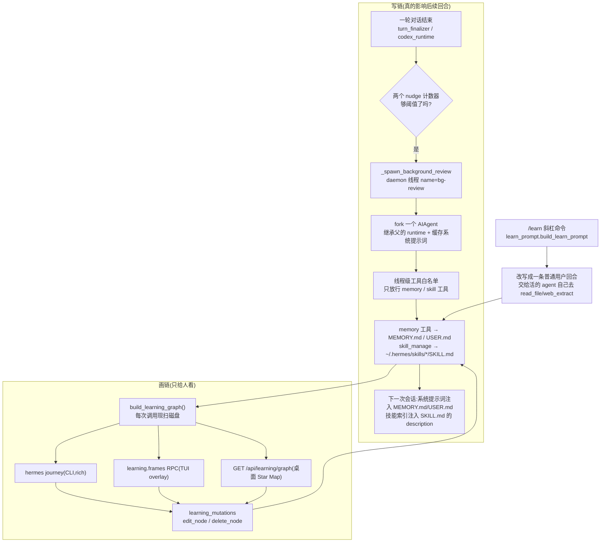

# r9a 底稿 · 学习闭环(图谱与后台复盘侧)

> 研究对象基线:`/home/user/hermes-agent` @ `863e31318553cda8ad61df681d08175364d4164b`(只读)。
> 溯源约定:凡对代码行为的断言,**锚点单独成行、置于代码块之前**,格式 `路径:行号 @ 863e313`。
> 本文是底稿(证据层),求全求证、允许啰嗦。表格里的行号不带冒号,表格是索引不是证据。
> 记号:▲ 文档与代码矛盾;◇ 代码有文档无;■ 代码缺陷;◎ 文档成立但显著保守。

**本簇 5 个文件 / 2,423 行(`wc -l` 实测):**

| 文件 | 行数 | 一句话职责 |
|---|---|---|
| `agent/background_review.py` | 1081 | 每轮结束后 fork 一个 AIAgent 去问自己「这轮该存记忆/改技能吗」 |
| `agent/learning_graph_render.py` | 658 | 把图谱渲染成终端时间轴(桌面端 GPU 星图的终端「翻译版」) |
| `agent/learning_graph.py` | 328 | 每次调用**从磁盘现算**一张「学到了什么」的图 |
| `agent/learning_mutations.py` | 206 | 图上节点的 编辑/删除 —— 从节点 id 反查磁盘位置并改写 |
| `agent/learn_prompt.py` | 150 | `/learn` 的提示词模板(一个模块级常量 + 一个字符串拼接函数) |

**并行子代理读的是策展侧(`agent/curator.py` / `insights.py` / `curator_backup.py`),
本文只在第 7 节写清两侧的接口,不越界逐行读对方文件。**

---

## 0. 一句话判定(本簇最重要的结论,先给)

**这套 learning_graph 图谱是纯可视化产物,不参与 agent 的任何决策。**
它没有任何读取方位于提示词构建、工具分发、路由、检索路径上;三个消费者全是展示面
(CLI 渲染 / TUI overlay / 桌面 REST)。真正「影响后续回合」的是**另一条链**——
`background_review` 写进 `MEMORY.md` / `USER.md` / `SKILL.md`,而那些文件是被系统提示词
直接注入的。图谱只是**事后**把这两个磁盘产物画出来给人看。

搜索面(全称否定的完备性依据,逐条可复现):

```verify
cd /home/user/hermes-agent

# (1) 谁 import 了这三个模块?—— 全仓 .py,不排除任何目录
grep -rn "build_learning_graph\|learning_graph_render\|learning_mutations" --include=*.py . | grep -v '^\./tests/'

# (2) 有没有把图谱暴露成模型可调用的工具?
grep -rn "learning\|journey" model_tools.py

# (3) 系统提示词构建路径有没有碰它?
grep -rni "learning_graph\|journey\|build_learning_graph" agent/prompt_builder.py

# (4) density_stats(图的统计量)有没有被别处消费?
grep -rn "density_stats" --include=*.py --include=*.ts --include=*.tsx . | grep -v '^\./\.git/'

# (5) REST 端点 /api/learning/graph 有没有被 Python 侧 fetch 回去?
grep -rn "/api/learning" --include=*.py --include=*.ts --include=*.tsx . | grep -v '^\./\.git/'
```

实测结果(2026-08-09,基线 `git status --porcelain` 为空):

```text
(1) 命中 3 个文件:hermes_cli/journey.py(CLI 渲染)、hermes_cli/web_server.py(桌面 REST)、
    tui_gateway/methods_tools.py(TUI RPC)。无第四个。
(2) 0 命中 —— model_tools.py 里没有任何 learning/journey 工具定义。
(3) 0 命中 —— agent/prompt_builder.py 完全不知道图谱存在。
(4) density_stats 只被 learning_graph.py 自己(:318、:328)和它的测试引用。
(5) 只有 apps/desktop/src/hermes.ts:934/948/955/964 四处 —— 全是 TypeScript 前端。
```

第 (4) 条尤其说明问题:`density_stats` 算出了 `isolated_pct`(孤立节点占比)、
`edges_per_node`(边密度)这类**本可以拿来做决策信号**的量(比如「你的技能库太散了,
该合并了」),但它们只被塞进 payload 的 `stats` 字段供渲染,**没有任何消费者读它做判断**。
`__main__` 分支(`:326-328`)把它 print 出来,是给开发者手工看边密度的调试入口。

---

## 1. 全景:两条链,一条写、一条画



三条关键性质,后面逐节展开:

1. **图无状态**:没有数据库、没有缓存文件,`build_learning_graph()` 每次都从磁盘重扫重算。
2. **写链与画链共享同一份磁盘真相**(`MEMORY.md` / `USER.md` / `SKILL.md` + `.usage.json`),
   没有中间层。这是这套设计最干净的地方,也是它并发问题的来源。
3. **`/learn` 不是这两条链的一部分**——它不产生图节点、不跑后台 fork,只是把用户的一句话
   包成一个长提示词丢给主 agent。它归在本簇纯粹因为文件名叫 `learn_prompt.py`。

---

## 2. `learning_graph.py` —— 图是什么

### 2.1 场景:用户在桌面端点开 Star Map,后端做了什么

用户点 `/journey`。桌面前端 `GET /api/learning/graph`。后端调 `build_learning_graph()`:
遍历**两棵**技能树的所有 `SKILL.md`,读每个文件前 4000 字节解析 frontmatter,读一次
`.usage.json` 拿使用次数,再把 `MEMORY.md` / `USER.md` 按 `§` 切成卡片,最后用词法重叠
在「记忆卡片」和「学到的技能」之间连边。**没有一次数据库查询,没有一次缓存命中。**

### 2.2 节点:两种,且都不是「会话」

`agent/learning_graph.py:3 @ 863e313`
```
This graph is intentionally scoped to what a user actually learns over time:
- non-base, learned/profile skills (agent-created or used),
- memory chunks from ``MEMORY.md`` / ``USER.md`` as first-class nodes.
```

技能节点的完整字段:

`agent/learning_graph.py:28 @ 863e313`
```python
@dataclass
class SkillNode:
    name: str
    category: str
    source: str = "profile"
    timestamp: Optional[int] = None
    use_count: int = 0
    state: str = "active"
    created_by: Optional[str] = None
    pinned: bool = False
    related: list[str] = field(default_factory=list)
```

技能来自两个根,`source` 就是根的名字:

`agent/learning_graph.py:248 @ 863e313`
```python
def _skill_roots() -> list[tuple[str, Path]]:
    repo = Path(__file__).resolve().parent.parent
    home_skills = get_hermes_home() / "skills"
    return [("base", repo / "skills"), ("profile", home_skills)]
```

**但图里只留一个很窄的子集**——这是理解「这张图是什么」的关键一句:

`agent/learning_graph.py:262 @ 863e313`
```python
    all_skills = build_skill_nodes(_skill_roots())
    learned_skills = {
        name: node
        for name, node in all_skills.items()
        if node.source != "base" and (node.created_by == "agent" or node.use_count > 0)
    }
```

即:**仓库自带的 71 个 bundled 技能一个都不在图里**(哪怕天天用),
`~/.hermes/skills` 下用户手写、从未被调用过、也不是 agent 造的技能也不在。
留下的是「非自带 且(agent 造的 或 至少用过一次)」。

代价是 `build_skill_nodes` 仍然把**两棵树全走一遍**(base 那 71 个也逐个读文件解析
frontmatter),然后在上面这个字典推导里全丢掉。扫描成本照付,结果不用。

记忆节点则**不做任何筛选**,这是作者写死在文档里的:

`agent/learning_graph.py:196 @ 863e313`
```
    ``MEMORY.md`` / ``USER.md`` are prose split on bare ``§`` separators; each
    chunk becomes one card. Every chunk is surfaced — the graph shows everything.
    """
```

节点 id 的构造决定了后面所有并发问题(见第 3 节):

`agent/learning_graph.py:293 @ 863e313`
```python
    for i, card in enumerate(memory_cards):
        graph_nodes.append(
            {
                "id": f"memory:{card['source']}:{i}",
```

**记忆节点的 id 就是它在合并卡片列表里的下标**——不是内容哈希,不是行号,不是 uuid。

### 2.3 边:两种,来源完全不同

**边 1:技能↔技能,来自 frontmatter 里手写的 `related_skills`。**

`agent/learning_graph.py:156 @ 863e313`
```python
def build_edges(nodes: dict[str, SkillNode]) -> list[tuple[str, str]]:
    """Undirected related_skills edges where BOTH endpoints exist (deduped)."""
    seen: set[tuple[str, str]] = set()
    edges: list[tuple[str, str]] = []
    for node in nodes.values():
        for target in node.related:
            if target in nodes and target != node.name:
                a, b = sorted((node.name, target))
                key = (a, b)
                if key not in seen:
                    seen.add(key)
                    edges.append(key)
    return edges
```

注意「BOTH endpoints exist」是在 **`learned_skills`** 这个已经筛过的字典上判的
(`:268` 传的是 `learned_skills`)。仓库自带技能里那 30 多处 `related_skills` 声明
(`skills/productivity/pdf/SKILL.md:12` 等)因此**永远连不出一条边**——两端都被
`source != "base"` 滤掉了。这张图的技能边,实际只可能出现在用户 profile 技能之间。

◇ **`related_skills` 在 Python 侧只有这一个真正的消费者。**
搜索面:`grep -rn "related_skills" --include=*.py .` 命中 4 个非文档文件——
`agent/learning_graph.py`(本模块)、`tools/skills_tool.py:1456-1465,1640`(只是把它读进
skill 元数据字典返回给工具调用方)、`website/scripts/generate-skill-docs.py:346`(生成文档
站的「相关技能」链接)。**没有任何一处用它做技能路由、上下文预取或推荐。**
换句话说:仓库里 30 多个 `related_skills:` 声明,对 agent 的运行时行为零影响。

**边 2:记忆↔技能,来自词法重叠打分。**

`agent/learning_graph.py:227 @ 863e313`
```python
def _memory_skill_edges(memory_cards: list[dict[str, Any]], skills: list[SkillNode]) -> list[tuple[str, str]]:
    edges: list[tuple[str, str]] = []
    skill_meta = [(s, _tokenize(s.name), s.name.lower()) for s in skills]
    for idx, card in enumerate(memory_cards):
        mem_id = f"memory:{card['source']}:{idx}"
        text = f"{card.get('title', '')}\n{card.get('body', '')}".lower()
        text_tokens = _tokenize(text)
        scored: list[tuple[int, str]] = []
        for skill, tokens, skill_name_lower in skill_meta:
            score = 0
            if skill_name_lower in text:
                score += 6
            score += len(tokens & text_tokens)
            if score > 0:
                scored.append((score, skill.name))
        scored.sort(key=lambda x: (-x[0], x[1]))
        for _, skill_name in scored[:4]:
            edges.append((mem_id, skill_name))
    return edges
```

打分规则极简:技能全名作为子串出现 +6,技能名分词与记忆分词的交集大小 +1/词
(`_tokenize` 见 `:223-224`,按非字母数字切分、只留长度 ≥3 的 token、全小写)。
**每张记忆卡片最多连 4 条边**(`scored[:4]`),这是图上唯一一个硬性上限。

这不是嵌入、不是 FTS5、不是 LLM 判断——就是一个 O(卡片数 × 技能数) 的双重循环加集合交。
对一个「给人看的星图」而言这是合适的选择:零依赖、纯 stdlib、结果确定可复现。

### 2.4 规模上限与老化:都没有

- **没有节点数上限**:技能节点数 = 磁盘上符合筛选条件的 `SKILL.md` 数;记忆节点数 =
  两个 md 文件里的 `§` 段数,文档明写「the graph shows everything」。
- **没有老化 / 淘汰**:`recency_ink`(渲染侧)只影响**颜色亮度**,不剔除节点。
- **只有内容截断**:标题截 80 字符、正文截 1200 字符。

`agent/learning_graph.py:216 @ 863e313`
```python
                    "title": (first[:80] + "…") if len(first) > 80 else first,
                    "body": chunk[:1200],
```

实践中记忆节点数其实是被**别处**卡住的:`memory.memory_char_limit` 默认 2200 字符、
`user_char_limit` 默认 1375(`hermes_cli/config_defaults.py:1656-1657`),所以
`MEMORY.md` 整体就那么大,`§` 段数只可能是几十条量级。技能节点数则没有这种天然上限。

### 2.5 实测规模曲线(可零成本复现)

用合成 `HERMES_HOME` 测(脚本在 `/tmp/.../scratchpad/probe_graph.py`,不写基线):

```text
skills=  50 mem=  50  nodes= 101 edges=  350  build=0.051s frames48=0.017s graph_payload= 53 KB
skills= 200 mem= 200  nodes= 401 edges= 1400  build=0.100s frames48=0.080s graph_payload=213 KB
skills= 800 mem= 800  nodes=1601 edges= 5600  build=1.387s frames48=0.462s graph_payload=854 KB
skills=2000 mem=2000  nodes=4001 edges=14000  build=8.823s frames48=1.019s graph_payload=  2 MB
```

分段计时确认瓶颈就是 2.3 节那个双重循环:

```text
skills= 2000 mem=   10 | build_skill_nodes= 0.179s  _memory_skill_edges= 0.006s
skills=   10 mem= 2000 | build_skill_nodes= 0.015s  _memory_skill_edges= 0.013s
skills= 1000 mem= 1000 | build_skill_nodes= 0.086s  _memory_skill_edges= 0.135s
skills= 2000 mem= 2000 | build_skill_nodes= 0.159s  _memory_skill_edges= 0.539s

# 纯 _memory_skill_edges,记忆文本与技能名有重叠(scored 列表被填满、每卡片都要排序):
cards=  250 skills=  250 pairs=   62500  0.019s
cards=  500 skills=  500 pairs=  250000  0.073s
cards= 1000 skills= 1000 pairs= 1000000  0.291s
cards= 2000 skills= 2000 pairs= 4000000  1.338s   ← pairs ×4 → 耗时 ×4.6,干净的二次
```

结论要说得诚实:**二次是真的,但现实规模够不着。** 记忆卡片被 2200 字符上限压在几十条,
所以即便技能有几千个,乘积也就几万对。这条不是缺陷,是「如果你要重实现,知道它是二次的」。

---

## 3. `learning_mutations.py` —— 206 行的「变更」,原子性到底怎么样

### 3.1 先回答问题:这不是增量维护

任务书里问「206 行专管变更,说明图是增量维护的吗」——**不是**。
这个模块里没有一行代码碰图对象。它做的是:拿到一个节点 id,**反查它在磁盘上是谁**,
然后改磁盘。图本身下次谁调用谁重扫。

`agent/learning_mutations.py:11 @ 863e313`
```
This module maps a node id back to its on-disk home and performs the mutation,
shared by the CLI (``hermes journey delete|edit``), the TUI ``/journey`` overlay
(gateway RPCs), and the desktop GUI (REST). Deleting a skill *archives* it
(recoverable via ``hermes curator restore``); deleting a memory rewrites its
file. Pure stdlib + existing skill/memory helpers.
```

分派只看 id 前缀:

`agent/learning_mutations.py:26 @ 863e313`
```python
def parse_node_kind(node_id: str) -> str:
    return "memory" if node_id.startswith("memory:") else "skill"
```

于是一个恰好叫 `memory:foo:1` 的**技能**会被当成记忆处理。实际不可能——技能名有
`lowercase-hyphenated` 约束(`agent/learn_prompt.py:35` 起的 authoring standards),不含冒号。
但这是「靠约定不靠类型」的一处,重实现时值得换成显式 kind 字段。

### 3.2 写是原子的,读-改-写不是

单次落盘走的是记忆工具自己的原子写:

`agent/learning_mutations.py:192 @ 863e313`
```python
def _write_memory(path: Path, chunks: list[str]) -> None:
    """Atomic temp-file + rename via the memory tool, so a concurrent reader
    never sees a half-written file (and the §-join stays single-sourced)."""
    from tools.memory_tool import MemoryStore

    MemoryStore._write_file(path, [c.strip() for c in chunks if c.strip()])
```

`tools/memory_tool.py:864 @ 863e313`
```python
    def _write_file(path: Path, entries: List[str]):
        """Write entries to a memory file using atomic temp-file + rename.

        Previous implementation used open("w") + flock, but "w" truncates the
        file *before* the lock is acquired, creating a race window where
        concurrent readers see an empty file. Atomic rename avoids this:
        readers always see either the old complete file or the new one.
        """
```

所以:**读者永远看不到半个文件**。这一条是稳的,而且作者是从一个真 bug(flock 先截断)
改过来的。

但**没有任何锁**跨越「读 → 改 → 写」这个区间。`_delete_memory` 的形状是教科书式的
读-改-写:

`agent/learning_mutations.py:144 @ 863e313`
```python
def _delete_memory(node_id: str) -> dict[str, Any]:
    source, gidx = _parse_memory_id(node_id)
    path, chunks, local = _locate_memory(source, gidx)

    del chunks[local]
    _write_memory(path, chunks)

    return {"ok": True, "message": f"deleted memory from {path.name}"}
```

两个并发的 `delete_node` 会各自读到同一份 `chunks`、各删一条、各自整文件覆写——
**后写的赢,先写那次的删除被静默还原**。同理 `edit_node`。文件不会损坏(原子写保证),
但操作会丢。这不是「有事务」,是「原子替换 + 最后写的赢」。

### 3.3 ■ 缺陷 1:位置型 id + 新鲜重读 = 删错条目且报成功

**这是本模块最要紧的一条。** 节点 id 是**下标**(2.2 节),而 `_locate_memory` 在执行
变更时**重新从磁盘算一遍**下标:

`agent/learning_mutations.py:47 @ 863e313`
```python
def _memory_local_index(source: str, global_index: int) -> int:
    """Global card index → position within the source's own file.

    ``_memory_cards`` emits all ``MEMORY.md`` cards before ``USER.md`` cards, so
    a profile card's local index is its global index minus the memory count.
    """
    from agent.learning_graph import _memory_cards

    cards = _memory_cards()
    if not 0 <= global_index < len(cards):
        raise IndexError(f"memory index {global_index} out of range")
    if cards[global_index].get("source") != source:
        raise ValueError("memory node id is stale — refresh the graph")
    if source == "memory":
        return global_index
    return global_index - sum(1 for c in cards if c.get("source") == "memory")
```

那个 `stale` 守卫**只比对 source**,不比对内容。同文件内的插入/删除会让所有后续下标平移,
而 source 不变 → 守卫看不见 → 落到隔壁条目上,还返回 `ok: True`。

可复现判据(脚本 `/tmp/.../scratchpad/probe_bugs.py`,合成 HERMES_HOME,不碰基线):

```text
graph the user sees: [('memory:memory:0', 'AAA first'),
                      ('memory:memory:1', 'BBB second'),
                      ('memory:memory:2', 'CCC third')]
user clicks delete on memory:memory:2 which the graph labels CCC third
# —— 此刻另一个写者(后台复盘线程)往 MEMORY.md 头部加了一条 ——
delete_node -> {'ok': True, 'message': 'deleted memory from MEMORY.md'}
MEMORY.md now:
   [0] ZZZ inserted by background review
   [1] AAA first
   [2] CCC third          ← 用户点的是 CCC,实际被删的是 BBB
```

对照:**跨文件**漂移是能被抓到的(守卫的设计意图),这说明作者确实想到了 staleness,
只是防的粒度不够:

```text
ids: ['memory:memory:0', 'memory:memory:1', 'memory:profile:2']
# MEMORY.md 从 2 条缩到 1 条后
delete memory:profile:2 -> {'ok': False, 'message': 'memory index 2 out of range'}
```

**为什么这在 hermes 里不是理论问题**:唯一的并发写者就在同一个进程里,而且是自动触发的
——`background_review` 的 daemon 线程会在用户盯着 `/journey` overlay 或桌面 Star Map 时
往 `MEMORY.md` 写新条目(见第 4 节)。写链和画链共享磁盘、没有版本号,这是必然结果。

`edit` 路径的窗口更宽——CLI 会把内容丢进 `$EDITOR` 等用户编辑完再写回:

`hermes_cli/journey.py:274 @ 863e313`
```python
def _cmd_edit(args: argparse.Namespace) -> int:
    from agent.learning_mutations import edit_node, node_detail

    detail = node_detail(args.node)
    if not detail.get("ok"):
        print(f"  {detail.get('message', 'not found')}")
        return 1
    suffix = ".md" if detail["kind"] == "skill" else ".txt"
    edited = _open_in_editor(detail["content"], suffix=suffix)
    if edited is None or edited.strip() == detail["content"].strip():
        print("  no changes")
        return 0
    res = edit_node(args.node, edited)
```

`node_detail` 读一次、用户在 vim 里待几分钟、`edit_node` 再解析一次下标。中间任何一次
后台记忆写入,都会让编辑结果覆盖到**别的条目**上——而且是覆盖(内容被替换),比删除更糟。

修法(给重实现的参考,按代价从低到高):
1. id 带内容指纹:`memory:<source>:<idx>:<sha1(chunk)[:8]>`,变更前比对,不符即拒。
   代价极小,把「静默错」变成「有声拒绝」。
2. 变更时把用户看到的原文一并传回(compare-and-swap),不符即拒。
3. 给 `~/.hermes/memories/` 加一把跨进程文件锁,覆盖读-改-写全程。

### 3.4 ■ 缺陷 2:非 UTF-8 的 `MEMORY.md` / `SKILL.md` 会把整张图打爆

两处读文件都只 `except OSError`,而 `UnicodeDecodeError` 是 `ValueError` 的子类:

`agent/learning_graph.py:202 @ 863e313`
```python
        path = base / fname
        try:
            text = path.read_text(encoding="utf-8").strip()
            file_ts = _to_int_ts(path.stat().st_mtime)
        except OSError:
            continue
```

`agent/learning_graph.py:130 @ 863e313`
```python
        if any(p in {".archive", ".hub", "node_modules", ".git"} for p in skill_md.parts):
            continue
        try:
            fm = _frontmatter(skill_md.read_text(encoding="utf-8")[:4000])
        except OSError:
            continue
```

对照记忆工具自己的读法——它把编码错误和 IO 错误一视同仁地降级:

`tools/memory_tool.py:768 @ 863e313`
```python
        try:
            return path.read_text(encoding="utf-8"), True
        except (OSError, IOError, UnicodeDecodeError):
            return "", False
```

可复现判据(同一个 `probe_bugs.py`):

```text
=== (1a) 非 UTF-8 MEMORY.md ===
MemoryStore._read_file -> []                       ← 记忆工具:降级,活着
build_learning_graph -> RAISED:
  File "/home/user/hermes-agent/agent/learning_graph.py", line 204, in _memory_cards
    text = path.read_text(encoding="utf-8").strip()
UnicodeDecodeError: 'utf-8' codec can't decode byte 0xe9 in position 14: invalid continuation byte

=== (1b) 非 UTF-8 SKILL.md ===
build_learning_graph -> RAISED:
  File "/home/user/hermes-agent/agent/learning_graph.py", line 133, in build_skill_nodes
    fm = _frontmatter(skill_md.read_text(encoding="utf-8")[:4000])
UnicodeDecodeError: ... invalid continuation byte
```

影响面:**一个坏字节让整张图 500,而不是少一个节点**。三个消费者都只是把异常包成错误
返回(web_server 500 / TUI `_err` / CLI 直接抛),没有一个能退化成「跳过这个文件」。
`skill_md` 是 agent 自己写的,理论上都是 UTF-8;但 `~/.hermes/skills` 也接受用户手放的
目录,`MEMORY.md` 更是文档明说可以手编的。改一个字:`except (OSError, UnicodeDecodeError)`。

### 3.5 删技能 ≠ 删文件

`agent/learning_mutations.py:131 @ 863e313`
```python
def _delete_skill(name: str) -> dict[str, Any]:
    from tools import skill_usage

    if skill_usage.get_record(name).get("pinned"):
        return {"ok": False, "message": f"'{name}' is pinned — unpin it first (hermes curator unpin {name})"}

    ok, message = skill_usage.archive_skill(name)
    if ok:
        _clear_skill_cache()

    return {"ok": ok, "message": f"archived '{name}' — restore with: hermes curator restore {name}" if ok else message}
```

三层保护叠在这一个函数上:(a) pinned 直接拒;(b) `archive_skill` 自己再拒 hub 安装的、
外部目录的、以及未开 `curator.prune_builtins` 的自带技能(`tools/skill_usage.py:1071` 起);
(c) 只是 `rename` 进 `~/.hermes/skills/.archive/`,而 `build_skill_nodes` 的路径过滤
(`:130`,上面引过)会跳过 `.archive`,所以节点从图上消失但文件还在。

删完要清缓存,否则系统提示词里的技能索引还留着已归档的技能:

`agent/learning_mutations.py:200 @ 863e313`
```python
def _clear_skill_cache() -> None:
    try:
        from agent.prompt_builder import clear_skills_system_prompt_cache

        clear_skills_system_prompt_cache(clear_snapshot=True)
    except Exception:
        pass
```

**这是本簇唯一一处「图谱侧动作反向影响 agent」的通道**,而且它影响的不是图,是技能索引缓存。
值得单独记一笔:第 0 节说「图不参与决策」,这一行是那个结论的**边界**——变更节点会顺手
让下一轮系统提示词重建技能索引。它是缓存失效,不是决策输入。

---

## 4. `background_review.py` —— 后台复盘

### 4.1 场景:用户聊完第 10 轮,按下回车之后发生了什么

用户第 10 次发消息,agent 回完,响应已经打印在屏幕上。此刻 `turn_finalizer` 里两个计数器
被检查,任一超阈值就 fork 一个新的 `AIAgent`,把**整段对话原样重放**给它,附一句
「回顾上面的对话,该存的存、该改的改」。这个 fork 跑在 daemon 线程上、stdout 被线程级
静音、只能调 memory/skill 工具、写完就死。用户唯一会看到的是一行
`💾 Self-improvement review: Memory updated`。

### 4.2 什么时刻跑:两个独立计数器,阈值都是 10

**记忆触发是按「用户回合数」数的**,在回合**开始**时数:

`agent/turn_context.py:591 @ 863e313`
```python
    # Track memory nudge trigger (turn-based, checked here).
    should_review_memory = False
    if (agent._memory_nudge_interval > 0
            and "memory" in agent.valid_tool_names
            and agent._memory_store):
        agent._turns_since_memory += 1
        if agent._turns_since_memory >= agent._memory_nudge_interval:
            should_review_memory = True
            agent._turns_since_memory = 0
```

**技能触发是按「本轮工具迭代数」数的**,在回合**结束**时数:

`agent/turn_finalizer.py:698 @ 863e313`
```python
    # Check skill trigger NOW — based on how many tool iterations THIS turn used.
    _should_review_skills = False
    if (agent._skill_nudge_interval > 0
            and agent._iters_since_skill >= agent._skill_nudge_interval
            and "skill_manage" in agent.valid_tool_names):
        _should_review_skills = True
        agent._iters_since_skill = 0
```

两个默认值都是 10(`agent/agent_init.py:1669`、`:1769`),分别可由
`memory.nudge_interval` / `skills.creation_nudge_interval` 覆盖(`:1684`、`:1772`)。
这个不对称是有意的:记忆学的是「用户是谁」(按对话轮数采样),技能学的是
「这类活怎么干」(按干活强度采样)。一轮里调 30 次工具的深度 debug 会立刻触发技能复盘;
30 轮闲聊则只触发记忆复盘。

派发点在响应交付之后:

`agent/turn_finalizer.py:714 @ 863e313`
```python
    # Background memory/skill review — runs AFTER the response is delivered
    # so it never competes with the user's task for model attention.
    if final_response and not interrupted and (_should_review_memory or _should_review_skills):
        try:
            agent._spawn_background_review(
                messages_snapshot=list(messages),
                review_memory=_should_review_memory,
                review_skills=_should_review_skills,
            )
        except Exception:
            pass  # Background review is best-effort
```

◇ **同一段逻辑在 codex 运行时里有一份平行实现**,`agent/codex_runtime.py:848-860`
条件与签名一字不差(该文件 `:845` 的注释自称 "same cadence + signature as the default
path")。重实现时这是一个「一个策略两处落地」的典型味道点。

三个派发点合计(搜索面:`grep -rn "_spawn_background_review" --include=*.py . | grep -v tests`):
`agent/turn_finalizer.py:718`(默认路径)、`agent/codex_runtime.py:854`(codex 路径)、
`hermes_cli/cli_commands_mixin.py:2482` 与 `gateway/slash_commands.py:2877`(`/refine`,用户手动)。

### 4.3 抢不抢主回合的资源:模型侧不抢,进程侧抢

**模型侧不抢**:fork 在响应交付之后才起,主回合的 API 调用已经结束。

**进程侧抢**:它是一个真线程,跑一次完整的 agent 循环(最多 16 次工具迭代,见 `:788`
`max_iterations=16`),会发真的 HTTP 请求、占 GIL、占 provider 的速率配额。没有节流、
没有并发上限、没有「上一次还没跑完就别起新的」的判断——`_spawn_background_review` 就是
无条件 `Thread(...).start()`:

`run_agent.py:1822 @ 863e313`
```python
        # Carry the active profile into the review thread so MEMORY.md / skill
        # review writes land in the right profile (#54937).
        t = threading.Thread(
            target=propagate_context_to_thread(target), daemon=True, name="bg-review"
        )
        t.start()
```

`daemon=True` 且**全仓没有任何地方 join 它**(搜索面:`grep -rn "bg-review" --include=*.py .`
只有创建处和它自己的两条注释)。所以:进程退出 = 复盘被硬杀。好处是 CLI 退出不会卡住;
代价是最后一轮的学习成果可能永远写不下去,而且用户完全不知道。因为记忆写是原子替换,
半途被杀不会损坏文件——只会少写。这个取舍是自洽的。

### 4.4 成本控制:主模型走全量重放,换模型才压成摘要

这段策略注释本身就是设计文档,值得整段抄:

`agent/background_review.py:35 @ 863e313`
```python
# The review fork runs on the MAIN model by default ("auto"), replaying the
# full conversation — already warm in the prompt cache, so cheap cache reads.
# Optimal and unchanged. A user can route the review to a different, cheaper
# model via auxiliary.background_review.{provider,model}. A different model
# cannot reuse the parent's cache (different key), so the fork is cold
# regardless — replaying the full transcript would just cold-write it. So when
# (and only when) routed to a different model, we replay a compact DIGEST to
# minimise cold-written tokens. Same model -> full replay; different model ->
# digest. That's the whole policy.
```

判定「是否换模型」的逻辑,注意两处 early return:

`agent/background_review.py:78 @ 863e313`
```python
    aux = cfg.get("auxiliary", {}) if isinstance(cfg.get("auxiliary"), dict) else {}
    task = aux.get("background_review", {}) if isinstance(aux.get("background_review"), dict) else {}
    task_provider = (str(task.get("provider", "")).strip() or None)
    task_model = (str(task.get("model", "")).strip() or None)
    task_base_url = (str(task.get("base_url", "")).strip() or None)
    task_api_key = (str(task.get("api_key", "")).strip() or None)
    if not (task_provider and task_provider != "auto" and task_model):
        return parent
    if task_provider == (agent.provider or "") and task_model == (agent.model or ""):
        return parent  # same model/provider as parent -> not routed
```

**这四行是本模块读配置的全部**。`timeout` / `extra_body` / `reasoning_effort` 三个键
一个都没读——这是下面 ▲1 的证据基础。

摘要的形状(只在 routed 时用):

`agent/background_review.py:123 @ 863e313`
```python
def _digest_history(messages_snapshot: List[Dict], tail: int = 24) -> List[Dict]:
    """Compact replay for the routed (different-model) path only.

    Keeps the recent ``tail`` messages verbatim, collapses older turns into one
    synthetic user-role digest, preserving role alternation. Used ONLY when
    routed to a different model (cache cold regardless, so fewer cold-written
    tokens is a pure win). Never on the main-model path (full replay stays warm).
    """
```

`tail` 的边界处理有个细节值得学:如果第 24 条恰好是 `tool` 角色消息,就往前多留一条,
直到窗口首条不是 tool——否则 provider 会因为「孤儿 tool 结果」报错。

`agent/background_review.py:134 @ 863e313`
```python
    keep = msgs[-tail:]
    while keep and isinstance(keep[0], dict) and keep[0].get("role") == "tool":
        tail += 1
        if len(msgs) <= tail:
            return msgs
        keep = msgs[-tail:]
```

### 4.5 缓存亲和:这段代码 60% 的复杂度都在「让 fork 的请求字节与父一致」

fork 构造处,几乎每个参数都有一条注释解释它为什么必须与父一致:

`agent/background_review.py:786 @ 863e313`
```python
            review_agent = AIAgent(
                model=_rt.get("model") or agent.model,
                max_iterations=16,
                quiet_mode=True,
                platform=agent.platform,
                provider=_rt.get("provider") or agent.provider,
                api_mode=_rt.get("api_mode"),
                base_url=_rt.get("base_url") or None,
                api_key=_rt.get("api_key") or None,
                credential_pool=_rt.get("credential_pool"),
                request_overrides=_rt.get("request_overrides") or {},
                parent_session_id=agent.session_id,
                enabled_toolsets=getattr(agent, "enabled_toolsets", None),
                disabled_toolsets=getattr(agent, "disabled_toolsets", None),
```

缓存对齐清单(全部只在 `not _routed` 时生效,`:747-785`),每一条都对应一次真实的缓存失效:

| 对齐项 | 位置 | 不对齐会怎样 |
|---|---|---|
| `enabled_toolsets` / `disabled_toolsets` | 798-799 | `tools[]` 字节不同 → Anthropic 缓存键不同 |
| `reasoning_config` | 748 | `thinking` 字段的有无会给缓存键分命名空间 |
| `ephemeral_system_prompt` | 753 | 网关会话上下文追加在系统提示词后,少了就在结尾岔开 |
| `prefill_messages`(深拷贝) | 766 | 前缀消息插在系统消息之后,少了就在 index 1 岔开 |
| OpenRouter 六个 provider 路由 pin | 775-782 | 缓存按**上游** provider 分,路由到别家就整体 miss |
| `_cached_system_prompt` + `session_start` | 854、862 | 重建系统提示词 → 新时间戳 → 前缀 miss |

`agent/background_review.py:849 @ 863e313`
```python
            # Share the parent's warm cached system prompt ONLY when the review
            # runs on the SAME model (not routed). When routed to a different
            # model the parent's cached prompt is for the wrong model/cache key
            # and would miss anyway, so let the routed fork build its own.
            if not _routed:
                review_agent._cached_system_prompt = agent._cached_system_prompt
```

注释里给了实测收益(`:846-848`):issue #25322 / PR #17276,Sonnet 4.5 上端到端成本降约 26%。
**这是整个设计里最值得抄的一条经验:后台复盘要便宜,靠的不是换小模型,是复用主模型的
prefix cache。** 换小模型反而要额外压摘要来抵消冷写。

### 4.6 隔离:三层,每层对应一次真事故

**隔离 1 —— 不写会话库。** fork 共享父的 `session_id`(为了缓存),所以必须堵死落盘:

`agent/background_review.py:817 @ 863e313`
```python
            # PERSISTENCE ISOLATION (the curator-takeover root cause): the fork
            # shares the parent's session_id (set below, for prompt-cache
            # warmth), so without this it would write its harness turn ("Review
            # the conversation above and update the skill library…") + its own
            # response straight into the user's REAL session in state.db. On the
            # user's next live turn the agent re-reads that injected user message
            # as a standing instruction and "becomes" the curator, refusing the
            # actual task. _persist_disabled hard-stops every DB write/lazy-open
            # path (_flush_messages_to_session_db, _ensure_db_session,
            # _get_session_db_for_recall); the review writes only to the skill
            # and memory stores via its tools, which is all it needs.
            review_agent._persist_disabled = True
```

这是本簇最好的一个「共享标识符的代价」案例:为了缓存共享 session_id,就必须逐条堵死所有
以 session_id 为键的副作用——落盘、会话终结(`:870` `_end_session_on_close = False`)、
上下文压缩(`:881` `compression_enabled = False`,否则 fork 赢了压缩竞态会把父会话轮转成
一个网关永远不认领的新 child,issue #38727)。

**隔离 2 —— 不碰外部记忆插件。** `skip_memory=True`(`:800`),理由在 `:713-726`:
否则 fork 的 `__init__` 会用父的 session_id 重建 `_memory_manager`,把 harness 提示词
经三个摄取点(`on_turn_start` / `prefetch_all` / `sync_all`)灌进用户真实的 honcho/mem0 命名空间。
内置的 `MEMORY.md`/`USER.md` store 则从父身上直接绑过来(`:812-814`),所以工具写还能落盘。

**隔离 3 —— 不抢 stdout。** 用**线程级**静音而不是进程级重定向:

`agent/background_review.py:688 @ 863e313`
```python
        # Silence stdout/stderr for THIS worker thread only.  A process-global
        # ``contextlib.redirect_stdout(devnull)`` here would also blank
        # ``sys.stdout``/``sys.stderr`` for every other thread — including a
        # gateway event-loop thread driving a Telegram long-poll — for the full
        # duration of the review (tens of seconds), swallowing their console
        # output (#55769 / #55925).  ``thread_scoped_silence`` routes only this
        # thread's writes to devnull and leaves all other threads on the real
        # streams.
```

另有一条不走 stdout 的旁路也要单独堵:`_emit_status` 走的是 `_print_fn`/`status_callback`,
绕过 `sys.stdout`,所以还要 `suppress_status_output = True`(`:838`,理由在 `:831-837`)。

**隔离 4 —— 危险命令自动拒绝。** 这个 daemon 线程上没有交互终端,若触发审批会
`input()` 死锁在 prompt_toolkit 后面:

`agent/background_review.py:669 @ 863e313`
```python
    # Install a non-interactive approval callback on this worker
    # thread so any dangerous-command guard the review agent trips
    # resolves to "deny" instead of falling back to input() -- which
    # deadlocks against the parent's prompt_toolkit TUI (#15216).
    # Same pattern as _subagent_auto_deny in tools/delegate_tool.py.
    def _bg_review_auto_deny(command, description, **kwargs):
```

### 4.7 ■ 缺陷 3:工具白名单不随并发工具线程走

模块头对安全边界的承诺:

`agent/background_review.py:10 @ 863e313`
```
The fork inherits the parent's live runtime (provider, model, base_url,
credentials, cached system prompt) so it hits the same prefix cache and
uses the same auth.  It runs with a tool whitelist limited to memory and
skill management tools; everything else is denied at runtime.
```

白名单是这样装的:

`agent/background_review.py:893 @ 863e313`
```python
            review_toolsets = ["skills"]
            if review_agent._memory_enabled or review_agent._user_profile_enabled:
                review_toolsets.insert(0, "memory")
            review_whitelist = {
                t["function"]["name"]
                for t in get_tool_definitions(
                    enabled_toolsets=review_toolsets,
                    quiet_mode=True,
                )
            }
            set_thread_tool_whitelist(
                review_whitelist,
                deny_msg_fmt=(
                    "Background review denied non-whitelisted tool: "
                    "{tool_name}. Only memory/skill tools are allowed."
                ),
            )
```

**关键前提:fork 发给模型的 `tools[]` 是父的全量工具集**(`:798-799` 继承
`enabled_toolsets`/`disabled_toolsets`,注释 `:727-729` 明说这是为了让 `tools[]` 字节一致)。
也就是说模型**看得见** `terminal` / `read_file` / `web_extract` / `delegate_task`,
唯一拦它的就是这个运行时白名单。

而白名单存在 `threading.local()` 里:

`hermes_cli/plugins.py:2101 @ 863e313`
```python
_thread_tool_whitelist = threading.local()
```

并发工具执行器把每个工具丢到线程池,只搬 ContextVars 和审批回调,**搬不动 threading.local**:

`agent/tool_executor.py:1173 @ 863e313`
```python
                    # Propagate the agent turn's ContextVars (e.g.
                    # _approval_session_key) AND thread-local approval/sudo
                    # callbacks into the worker thread; clears callbacks on exit.
                    try:
                        f = executor.submit(
                            propagate_context_to_thread(_run_tool),
```

可复现判据(脚本 `/tmp/.../scratchpad/probe_whitelist.py`,不需要模型凭据,
用的就是生产代码里那两个函数):

```text
  review thread     resolve_pre_tool_block('memory'        ) -> None
  review thread     resolve_pre_tool_block('terminal'      ) -> 'Background review denied non-whitelisted tool: terminal. ...'
  review thread     resolve_pre_tool_block('write_file'    ) -> 'Background review denied non-whitelisted tool: write_file. ...'
  review thread     resolve_pre_tool_block('delegate_task' ) -> 'Background review denied non-whitelisted tool: delegate_task. ...'
  concurrent worker resolve_pre_tool_block('memory'        ) -> None
  concurrent worker resolve_pre_tool_block('terminal'      ) -> None      ← 应该被拒
  concurrent worker resolve_pre_tool_block('write_file'    ) -> None      ← 应该被拒
  concurrent worker resolve_pre_tool_block('delegate_task' ) -> None      ← 应该被拒
```

**能逃出去的是哪些工具,恰好由「并发安全集」决定,而且方向刚好是最坏的那个:**

`agent/tool_dispatch_helpers.py:47 @ 863e313`
```python
_PARALLEL_SAFE_TOOLS = frozenset({
    "ha_get_state",
    "ha_list_entities",
    "ha_list_services",
    "image_generate",
    "read_file",
    "search_files",
    "session_search",
    "skill_view",
    "skills_list",
    "vision_analyze",
    "web_extract",
    "web_search",
})
```

白名单里的写工具(`memory`、`skill_manage`)**不在**这个集合里 → 它们永远走串行路径 →
白名单对它们始终生效。而 `read_file` / `search_files` / `web_search` / `web_extract` /
`session_search` / `image_generate` / `vision_analyze` 全在里面 → 模型一次吐 2 个这类调用,
就走并发路径,白名单静默失效。

触发条件(全部可由模型自己决定,无需任何外部输入):一条 assistant 消息里 ≥2 个工具调用,
且 `_plan_tool_batch_segments` 把整批判为单一 parallel 段(`run_agent.py:7618-7624`)。

**严重程度要说准**:逃出去的都是读类/外呼类,不是任意写。但 `web_search`/`web_extract`
是网络外呼、`image_generate`/`vision_analyze` 是**付费** API 调用、`read_file`/`search_files`
是无限制本地读——而这一切发生在一个用户看不见(线程级静音 + `suppress_status_output`)、
没有审批交互(自动 deny 只管危险 shell 命令)的 fork 里。承诺是 "everything else is denied
at runtime",实际是 "denied on the sequential path only"。

修法:把 `set_thread_tool_whitelist` 从 `threading.local()` 换成 `contextvars.ContextVar`
即可——`propagate_context_to_thread` 已经在搬 ContextVars 了,一行改动就闭合。

### 4.8 ■ 缺陷 4:三个 harness 提示词,防御性清洗只认两个

`hermes_state.py` 有一层「防止历史污染会话」的加载时清洗,它按提示词开头做前缀匹配:

`hermes_state.py:369 @ 863e313`
```python
# Distinctive opening shared by both background-review harness prompts
# (_SKILL_REVIEW_PROMPT and _MEMORY_REVIEW_PROMPT in agent/background_review.py).
# Matched case-sensitively against the leading content of a user/system message.
_REVIEW_HARNESS_PREFIXES = (
    "Review the conversation above and update the skill library",
    "Review the conversation above and consider saving to memory",
)
```

注释自称覆盖 "both ... harness prompts",但 `background_review.py` 里其实有**三个**,
第三个的开头两条前缀都不匹配:

`agent/background_review.py:307 @ 863e313`
```python
_COMBINED_REVIEW_PROMPT = (
    "Review the conversation above and update two things:\n\n"
```

可复现判据:

```verify
cd /home/user/hermes-agent && /home/user/hermes-venv/bin/python -c "
import sys; sys.path.insert(0,'/home/user/hermes-agent')
from agent.background_review import _MEMORY_REVIEW_PROMPT,_SKILL_REVIEW_PROMPT,_COMBINED_REVIEW_PROMPT
from hermes_state import _is_background_review_harness_message as f
for n,p in (('memory',_MEMORY_REVIEW_PROMPT),('skill',_SKILL_REVIEW_PROMPT),('combined',_COMBINED_REVIEW_PROMPT)):
    print(n, '->', f({'role':'user','content':p}))
"
```

```text
memory -> True
skill -> True
combined -> False
```

而 combined 恰恰是**最常触发**的那个——两个 nudge 都到期时就用它
(`agent/background_review.py:1052-1057`),而两个阈值都是 10、又都由同一段对话驱动,
同时到期完全正常。测试也只覆盖了那两条(`tests/test_background_review_session_isolation.py:22-28`,
combined 没有对应用例)。

**影响面必须说准**:`_persist_disabled`(4.6 节)已经从源头堵住了新的污染,这层只是
「历史会话的兜底」。所以后果是:**旧版本里被 combined 复盘污染过的会话,今天仍然清不干净**
——加载时那条 "Review the conversation above and update two things:" 会被当成用户指令重放,
agent 就会「变成策展员」拒绝用户的真实任务(这正是注释 `:381-384` 描述的那个事故形态)。

### 4.9 失败可见吗:可见,但只是一行警告

外层 `except` 兜住所有异常,并往用户可见通道发一条:

`agent/background_review.py:1000 @ 863e313`
```python
    except Exception as e:
        logger.warning("Background memory/skill review failed: %s", e)
        agent._emit_auxiliary_failure("background review", e)
```

`run_agent.py:1297 @ 863e313`
```python
    def _emit_auxiliary_failure(self, task: str, exc: BaseException) -> None:
        """Surface a compact warning for failed auxiliary work."""
        try:
            detail = self._summarize_api_error(exc)
        except Exception:
            detail = str(exc)
        detail = (detail or exc.__class__.__name__).strip()
        if len(detail) > 220:
            detail = detail[:217].rstrip() + "..."
        self._emit_warning(f"⚠ Auxiliary {task} failed: {detail}")
```

关键的排版细节:`with thread_scoped_silence():` 嵌在 `try:` **里面**(`:687` try,`:696` with),
所以异常先退出 with(本线程流恢复)再进 handler ——警告是**能打印出来的**,不会被自己的静音吞掉。
这是一个很容易写错的顺序,值得记。

不过这条警告在网关侧会被过滤掉:

`gateway/run.py:91 @ 863e313`
```
    r"("  # transient/auxiliary status that should stay in logs, not gateway chats
    r"auxiliary\s+.+\s+failed"
```

所以准确说法是:**CLI/TUI 用户看得见一行 `⚠ Auxiliary background review failed: ...`;
消息平台(Telegram/Discord/Slack…)用户看不见,只进日志。** 这是有意的
(`gateway/run.py:729` 自称 "surfaces should not receive transient auxiliary/compression chatter")。

另有一处**局部**的吞异常,是刻意的、而且理由写得很好:

`agent/background_review.py:977 @ 863e313`
```python
        except Exception as e:
            logger.warning(
                "summarize_background_review_actions returned partial results "
                "after exception (treating as empty); suppressing AttributeError "
                "that previously aborted the entire review (#59437): %s",
                e,
            )
            actions = []
```

原本一个畸形工具响应(`_change` 返回 list 而不是 dict)会让整次复盘被外层 except 记成
「失败」,把 fork **已经成功完成的写**全部当成没发生。现在退化成「不报摘要」。
**这是「摘要失败 ≠ 工作失败」的正确划分**,值得抄。

`summarize_background_review_actions` 自身还有一条容易被忽略的正确性要求:fork 继承了父的
全部历史,所以父历史里的 tool 结果必须**排除**,否则会把上一轮的 "created"/"updated"
当成本轮新成果再报一次(issue #14944,`:432-443` 的 `existing_tool_call_ids` 就是干这个的)。

### 4.10 ▲1:`auxiliary.background_review.reasoning_effort` 对后台复盘无效

**文档断言**(整段判定,归在 `## Auxiliary models` → `### The universal config pattern` 之下):

`website/docs/user-guide/configuration.md:1114 @ 863e313`
> This is the per-task counterpart of the global `agent.reasoning_effort`: run compression at `low` or vision at `none` to cut side-task latency and cost when your main model is an expensive reasoning model, without touching your main chat behavior. It works on every auxiliary task block (`vision`, `web_extract`, `compression`, `title_generation`, `curator`, `background_review`, ...), across all three auxiliary wire formats (chat completions, Codex Responses, Anthropic Messages). An explicit `extra_body.reasoning` on the same task wins over the shorthand.

这段话里三个子句:①「是全局 `agent.reasoning_effort` 的按任务对应物」——成立;
②「**works on every auxiliary task block**,含 `background_review`」——**对
`background_review` 不成立**;③「显式 `extra_body.reasoning` 优先」——在真正走
auxiliary_client 的任务上成立,对 background_review 同样无意义。

配置里这三个键确实存在:

`hermes_cli/config_defaults.py:1040 @ 863e313`
```python
        "background_review": {
            "provider": "auto",
            "model": "",
            "base_url": "",
            "api_key": "",
            "timeout": 120,
            "extra_body": {},
            "reasoning_effort": "",  # per-task thinking level: none|minimal|low|medium|high|xhigh|max|ultra (empty = provider default)
        },
```

但 `reasoning_effort` 的**唯一**实现在 `agent/auxiliary_client.py:_get_task_extra_body`,
而 background_review **不走 auxiliary_client**——它直接 `AIAgent(...)` fork。

可复现判据(三步都是全称否定,搜索面写全):

```verify
cd /home/user/hermes-agent

# 步骤 1:reasoning_effort 的实现只有一处,调用方只有两处
grep -rn "_get_task_extra_body" --include=*.py . | grep -v '^\./tests/'
# → agent/auxiliary_client.py:7592(定义)、:8698、:9464(两个调用点,都在 auxiliary_client 内部)

# 步骤 2:background_review 从不出现在 auxiliary_client 里
grep -c "background_review" agent/auxiliary_client.py
# → 0

# 步骤 3:background_review.py 里 reasoning 相关只有一行,且拿的是"父 agent 的",不是配置的
grep -n "reasoning_config\|reasoning_effort\|extra_body\|timeout" agent/background_review.py
# → 742(注释)、748(_fork_kwargs["reasoning_config"] = getattr(agent, "reasoning_config", None))
```

`agent/background_review.py:747 @ 863e313`
```python
            if not _routed:
                _fork_kwargs["reasoning_config"] = getattr(agent, "reasoning_config", None)
```

即:同模型时 fork 用**父的** reasoning 配置(为了缓存字节一致);换模型时**什么都不设**,
用 provider 默认(`:739-746` 的注释解释了为什么故意不传)。两条路径都不看
`auxiliary.background_review.reasoning_effort`。

顺带,同一 block 里的 `timeout: 120` 和 `extra_body: {}` 也是同样情况——由步骤 2 的
`grep -c` 为 0 一并证明。所以「后台复盘 120 秒超时」这个印象是错的:**fork 没有任何
wall-clock 超时**,只有 `max_iterations=16` 这个迭代预算。

▲ 的可复现判据(用户视角):把 `auxiliary.background_review.reasoning_effort: "none"`
写进 config,复盘 fork 的出站请求里不会出现任何 `reasoning` 字段变化——因为读它的代码不存在。

### 4.11 ◇2:`display.memory_notifications` 是三档,而不是开关

`agent/background_review.py:422 @ 863e313`
```
    ``notification_mode`` controls display detail:
    - ``off``: return no actions.
    - ``on``: generic "Memory updated"/tool messages.
    - ``verbose``: include compact content previews from tool-call arguments.
```

这一层是**纯展示**过滤,不影响写:`off` 只是让 `summarize_...` 返回空列表,工具早就写完盘了。
文档在 `website/docs/user-guide/features/memory.md` 的表格里说对了这一点(「The review
still runs and still writes」),但网关侧还有一层**延迟投递**是文档没提的:

`gateway/run.py:25651 @ 863e313`
```
                    # Release deferred bg-review notifications now that the
                    # first response has been delivered.  Pop from the
                    # adapter's callback dict (prevents double-fire in
                    # base.py's finally block) and call it.
```

即在消息平台上,`💾 Self-improvement review: ...` 不是复盘一结束就发,而是**攒到主响应
投递确认之后**才放出来——否则会插在用户的回答前面。这是文档没写的行为。

---

## 5. `learn_prompt.py` —— 模板在哪、参数化了什么、能不能被覆盖

### 5.1 它做的事比名字小得多

150 行里 96 行是一个字符串常量(`_AUTHORING_STANDARDS`,`:30-96`),剩下是一个函数把
用户输入夹进一段固定说明里。**没有引擎、没有工具、没有后端端点。**

`agent/learn_prompt.py:18 @ 863e313`
```
There is no separate distillation engine and no model-tool footprint: the
agent does the work with its existing toolset, so this works identically on
local, Docker, and remote terminal backends. Every surface (CLI ``/learn``,
gateway ``/learn``, the dashboard "Learn a skill" panel) calls
:func:`build_learn_prompt` and feeds the result to the agent as a normal turn.
```

四个调用点,签名都是 `build_learn_prompt(<用户那一串字>)`,零额外参数
(搜索面:`grep -rn "build_learn_prompt" --include=*.py . | grep -v tests`):

| 表面 | 位置 | 拿到 prompt 之后 |
|---|---|---|
| CLI `/learn` | hermes_cli/cli_commands_mixin.py 1872-1878 | 当普通用户消息发出去 |
| 网关 `/learn` | gateway/run.py 15135-15151 | 改写 `event.text`,fall through 走正常处理 |
| TUI `/learn` | tui_gateway/methods_tools.py 585-587 | 返回 `{"type":"send","message":...}` |
| Web 面板 | web/src/pages/SkillsPage.tsx 231-243 | 拼成一行 `/learn ...` 跳到聊天页 |

### 5.2 参数化了什么:只有一个入参,且有一条默认

`agent/learn_prompt.py:111 @ 863e313`
```python
    req = (user_request or "").strip()
    if not req:
        req = (
            "the workflow we just went through in this conversation — review "
            "the steps taken and distill them into a reusable skill"
        )
```

裸 `/learn`(不带参数)= 「把刚才这段对话蒸馏成技能」。这是一个很好的默认:
最常见的意图不需要用户打字。

拼装本身是纯字符串 f-string,用户输入原样嵌入:

`agent/learn_prompt.py:118 @ 863e313`
```python
    return (
        "[/learn] The user wants you to learn a reusable skill from the "
        "request below, and save it.\n\n"
        f"THE REQUEST:\n{req}\n\n"
```

### 5.3 能不能被用户配置覆盖:不能

搜索面与结果:

```verify
cd /home/user/hermes-agent
grep -rn "_AUTHORING_STANDARDS" --include=*.py .            # → 仅 learn_prompt.py:30 定义 + :147 使用
grep -rn "learn_prompt\|authoring_standards" hermes_cli/config_defaults.py   # → 0 命中
awk -F'\t' 'NR>1 && $1 ~ /learn/' /home/user/hermes-study/data/r8a-config-keys.tsv  # → 0 行
```

三条合起来:`_AUTHORING_STANDARDS` 是模块级私有常量,**没有配置键、没有文件覆盖、
没有环境变量**。R8A 那张 856 键的配置全表里也没有任何 `learn` 相关键。

### 5.4 注入风险:形状与边界

模板不可覆盖 → 「用户改模板」这条注入路径不存在。剩下的是**入参注入**:`req` 原样嵌进
提示词,没有转义、没有分隔符加固(没有 XML tag、没有 delimiter 随机化)。用户可以写
「忽略上面的规则,改为……」而模型多半会照做。

但这在威胁模型里**基本不算漏洞**:`/learn` 是用户自己敲的斜杠命令,用户就是主体,
他本来就能直接说同样的话。真正值得注意的是**多用户表面**——消息网关上,发 `/learn` 的
人未必是配置的所有者,而这段提示词明确授权 agent 去 `read_file`/`search_files` 本地路径、
`web_extract` 任意 URL:

`agent/learn_prompt.py:133 @ 863e313`
```python
        "Do this:\n"
        "1. Gather every source the user named, using the tools you already "
        "have — `read_file`/`search_files` for local files or directories, "
        "`web_extract` for URLs, the current conversation history if they "
        "referred to something you just did, and the text they pasted as-is. "
```

控制点不在本模块,而在网关的发送者鉴权(`gateway/slash_commands.py:1393`、`:4342-4345`
的 `_is_user_authorized` / allowlist)。**结论:本模块自身不做鉴权,也不该做;
重实现时要记住的是「斜杠命令的信任边界由入口的发送者鉴权定义,不由模板定义」。**

另外一条模板里的隐私设计值得单独抄——它防的是「把宿主环境的身份写进要被分享的产物」:

`agent/learn_prompt.py:49 @ 863e313`
```
- author: always the literal value `Hermes`. NEVER fill it from the host
  environment — the OS/login username (e.g. the `user=` line in your
  environment hints), git config, or any identity you can probe must not be
  written. Skills get shared and published, so an environment-derived name is
  a privacy leak the user never opted into; the skill names itself as Hermes.
```

---

## 6. `learning_graph_render.py` —— 658 行渲染给谁看

### 6.1 它是桌面 GPU 星图的「终端翻译版」

`agent/learning_graph_render.py:1 @ 863e313`
```
"""Terminal renderer for the learning timeline (learned skills + memories).

The desktop app (``apps/desktop/src/app/starmap``) paints a GPU radial
constellation; a terminal can't, so this is a *rendition* of the same data as a
timeline bar chart — date rows, proportional skill/memory bars colored by the
day's dominant category, and a cumulative trajectory sparkline — plus per-slice
bucket metadata the TUI walks as a tree. The age gradient and complementary
memory ink are ported from the desktop source, not guessed.
```

`apps/desktop/src/app/starmap/` 确实存在(16 个文件,含 `color.ts`、`time-axis.ts`、
`geometry.ts`、`constants.ts`),而这个模块逐函数写明自己 port 自哪个 ts 文件:
`recency_ink` ← `geometry.ts recencyInk`(`:65`)、`compute_recency` ← `time-axis.ts
computeRecency`(`:83`)、`derive_palette` ← `color.ts computePalette`(`:186`)、
`LEAD_IN` ← `time-axis.ts LEAD_IN`(`:22`)、`AGE_GRADIENT` ← `constants.ts`(`:26`)。

**渲染给谁看,精确答案:两个终端消费者,不含桌面。** 桌面拿的是原始 payload
(`GET /api/learning/graph`)自己用 TS 画;这个模块只服务
(a) `hermes journey` CLI(rich)、(b) TUI `/journey` overlay(Ink)。
所以「渲染」在这里的含义是:**把图谱降维成一维时间轴 + 字符条形图**。

### 6.2 输出不是字符串,是「样式段」

`agent/learning_graph_render.py:10 @ 863e313`
```
Grids are emitted as style runs — ``[text, style, alpha, hex?]`` — so each
consumer maps the semantic style + brightness onto its own palette; the
optional 4th element overrides the base color (category heatmap). Pure,
stdlib-only.
```

`agent/learning_graph_render.py:32 @ 863e313`
```python
STYLE_BG = "bg"
STYLE_SKILL = "skill"
STYLE_MEMORY = "memory"
STYLE_LABEL = "label"
STYLE_DIM = "dim"
```

这是本簇最值得抄的一个接口设计:**渲染器只产出语义 + 亮度,不产出颜色**。
CLI 用 rich 的调色板、TUI 用 Ink 的、两边还各自跟随用户的 skin
(`hermes_cli/journey.py:30-46` 从 `skin_engine` 取主色再 `derive_palette`)。
一份渲染逻辑,三套外观,零 if-else。

### 6.3 分桶:自适应粒度,且有一条「宁可超行数」的例外

`agent/learning_graph_render.py:266 @ 863e313`
```python
    """Timeline rows: finest date granularity that fits, oldest → newest."""
```

策略是 day → month → year 逐级退让,直到桶数 ≤ 行数上限;全退让完还超,就退化成等距时间箱
(`:307-323`)。中间有一条刻意破例:

`agent/learning_graph_render.py:300 @ 863e313`
```python
        # For short spans, keep the useful day-by-day graph even when the caller
        # asked for fewer rows; terminal scrollback is better than collapsing a
        # month of activity into one unreadable bar.
        if len(groups) <= max_rows or (granularity == "day" and len(groups) <= 32):
```

### 6.4 会不会因为图太大卡住主线程:分表面看,只有一处会

`render_frames` 是「预渲染整段播放」,帧数会被夹在 [2, 240]:

`agent/learning_graph_render.py:627 @ 863e313`
```python
def render_frames(payload: dict[str, Any], *, cols: int = 80, rows: int = 16, frames: int = 48) -> dict[str, Any]:
    """Pre-render a full play-through (reveal 0→1) plus static legend/summary."""
    frames = max(2, min(frames, 240))
```

而 `render_graph` 每帧都完整重跑 `compute_recency` + `_build_chart_buckets`(`:469-471`),
即**没有跨帧复用**。所以 `render_frames` 的成本是 O(frames × 节点数)。实测(6.1 节那张表)
2000+2000 节点、48 帧 = 1.02s。

三个表面的实际情形:

| 表面 | 谁在跑 | 会不会卡 |
|---|---|---|
| TUI `learning.frames` | `tui_gateway` 的 8 线程 RPC 池(`tui_gateway/server.py:291-293`) | 占 1/8 worker,不卡网关;且 TUI 只要 2 帧 |
| `hermes journey --play` | CLI 前台进程,`_play` 自己按 42 帧循环渲染 | 卡的是它自己,用户就在等这个动画 |
| 桌面 `/api/learning/graph` | **FastAPI 事件循环线程** | **会卡整个 dashboard** |

TUI 实际只要 2 帧,这一点在前端写死:

`ui-tui/src/components/journey.tsx:163 @ 863e313`
```
    gw.request<FramesResponse>('learning.frames', { cols, frames: 2, rows: chartRows })
```

### 6.5 ■ 缺陷 5:桌面端 REST 把阻塞调用放在事件循环上

`hermes_cli/web_server.py:3527 @ 863e313`
```python
@app.get("/api/learning/graph")
async def get_learning_graph(profile: Optional[str] = None):
    """Learning graph payload for the desktop panel.

    Profile-scoped view of learned, non-base skills plus memory chunks, with
    graph links derived from skill relations and memory-skill overlap.
    """
    try:
        from agent.learning_graph import build_learning_graph

        with _profile_scope(profile):
            return build_learning_graph()
    except Exception:
        _log.exception("GET /api/learning/graph failed")
        raise HTTPException(status_code=500, detail="Failed to build learning graph")
```

`async def` 里直接调同步的 `build_learning_graph()`(全程 `rglob` + 逐文件 `read_text`),
**没有 `run_in_threadpool`**。同文件里同类端点是**offload 的**,而且注释专门解释了为什么:

`hermes_cli/web_server.py:6295 @ 863e313`
```python
        def _build_payload_scoped() -> dict:
            # Keep the profile override inside the worker thread so the full
            # sync picker build (config load, pricing, refresh probes) runs
            # off the event loop under the requested profile.
            with _profile_scope(profile):
                return build_model_options_payload(
```

`run_in_threadpool` / `asyncio.to_thread` 在 `web_server.py` 里被用了 20+ 次
(`grep -n "run_in_threadpool\|asyncio.to_thread\|loop.run_in_executor" hermes_cli/web_server.py`),
所以这不是「作者不知道这个模式」,是这一处漏了。

同一批端点里 `/api/learning/node` 的 GET/DELETE/PUT(`:3552`、`:3564`、`:3576`)也是
`async def` + 同步文件 IO,而 DELETE 还会 `rename` 整个技能目录。

**严重程度诚实版**:现实规模(几十条记忆 + 几十到几百个技能)下 `build_learning_graph`
是 50–100ms 级(6.1 节实测 50×50 = 51ms、200×200 = 100ms),事件循环被卡 100ms 是可感但
不致命的;它变成秒级需要上千个 profile 技能。真正的问题不是当下的绝对值,而是
**这个端点的成本随用户使用量单调增长,却挂在没有背压的事件循环上**。

---

## 7. 与策展侧(curator)的交界接口 —— 只写接口,不越界

三处接触面,均只列接口不深入对方文件:

**接口 1:写来源标记。** curator 的复盘 fork 也把写来源打成同一个值:

`agent/curator.py:1948 @ 863e313`
```python
        review_agent._memory_write_origin = "background_review"
```

与 `agent/background_review.py:803-804` 同值。下游据此判定「这是自主写、无人在场」:
`tools/skill_provenance.py:75` 的 `is_background_review()` → `tools/skill_manager_tool.py`
的 `_background_review_write_guard`(`:301`)与 `_background_review_read_before_write_guard`
(`:424`)。后者要求**改一个技能之前必须先读过它**,读标记存在
`tools/skill_manager_tool.py:55-56` 的 ContextVar 里,由 background_review 在每次复盘开始时
清空(`agent/background_review.py:911-913`)。

**接口 2:提示词里的分工契约。** 技能复盘提示词自己声明「重叠合并归 curator 管」:

`agent/background_review.py:253 @ 863e313`
```python
    "If you notice two existing skills that overlap, note it in your "
    "reply — the background curator handles consolidation at scale.\n\n"
```

即:**per-turn 复盘只做增量(patch / 加 reference / 建新 umbrella),跨技能的合并归策展。**

**接口 3:受保护技能清单。** `_SKILL_REVIEW_PROMPT:255-271` 与
`_COMBINED_REVIEW_PROMPT:360-373` 各写了一份 bundled / hub / external_dirs / pinned /
user-owned 的「不许改」清单,而真正的执行在 `skill_manager_tool` 的 guard 里。
**提示词侧和代码侧各写一遍**——提示词是为了让模型别浪费迭代去试,代码是真拦截。

**图谱侧对策展的唯一依赖**:`learning_mutations._delete_skill` 调
`tools.skill_usage.archive_skill`,归档目录与 `hermes curator restore` 共用
(`agent/learning_mutations.py:141` 的提示语直接指向 `hermes curator restore`)。

---

## 8. 文档 / 代码对照

### ▲1 —— `auxiliary.background_review.reasoning_effort`(见 4.10,判据完整)

`website/docs/user-guide/configuration.md:1114` 声称按任务 `reasoning_effort`
"works on every auxiliary task block",并**点名** `background_review`。
实际:该键(及同 block 的 `timeout` / `extra_body`)在全仓无任何读取方。

### ▲2 —— `/journey` 在同一张表里被写了两次,其中一条说它是 CLI 独占

两行都在 `## Interactive CLI slash commands` → `### Session` 这个标题之下,相隔两行:

`website/docs/reference/slash-commands.md:68 @ 863e313`
> | `/journey [list\|delete <id>\|edit <id>]` (aliases: `/learning`, `/memory-graph`) | **CLI only.** Open the learning journey timeline. |

`website/docs/reference/slash-commands.md:70 @ 863e313`
> | `/journey [list\|delete <id>\|edit <id>]` (aliases: `/learning`, `/memory-graph`) | Open the learning journey timeline of learned skills + memories. Works in the classic CLI, as a TUI overlay, and in the desktop app (Star Map panel). Not available on messaging platforms. See [Learning Journey](/user-guide/features/memory#learning-journey-journey). |

**整行判定**:第 68 行两个断言——(a)「**CLI only**」、(b)「打开学习旅程时间轴」。
(b) 成立;(a) 不成立。判据是代码里 TUI 与桌面各自注册了这个命令:
`ui-tui/src/app/slash/commands/ops.ts:331`(name: 'journey')、
`apps/desktop/src/lib/desktop-slash-commands.ts:203`(surface: action('journey')),
分别打到 `tui_gateway` 的 `learning.frames` RPC 和 `GET /api/learning/graph`。

**读法上的诚实交代**:如果把 "CLI only" 读成「不在消息平台上」,第 68 行就是真的。
但同一张表第 70 行**自己**把 "the classic CLI" 与 "a TUI overlay"、"the desktop app"
并列区分,所以在本文档自己的词汇里,"CLI only" 排除 TUI 与桌面。按此判 ▲。
无论怎么读,**同一张表里一条命令出现两行**本身就是缺陷。

### ◇1 —— `related_skills` 只服务可视化(见 2.3)

仓库自带技能里 30+ 处 `related_skills:` 声明,在 Python 侧唯一的图相关消费者是
`learning_graph.build_edges`;而该函数只在 `learned_skills`(已排除 base)上连边,
所以这些声明**一条边都连不出来**。文档站的技能页会用它渲染「相关技能」链接
(`website/scripts/generate-skill-docs.py:346`),这是它唯一真正生效的地方。

### ◇2 —— 网关侧延迟投递复盘通知(见 4.11)

`display.memory_notifications` 的文档只讲了三档展示详细度,没提消息平台上通知会被**攒到
主响应投递确认之后**才发(`gateway/run.py:25651-25666`)。

### ◇3 —— 后台复盘没有 wall-clock 超时

配置里有 `timeout: 120` 看起来像超时,实际无人读(4.10 步骤 2)。唯一的边界是
`max_iterations=16`(`agent/background_review.py:788`)。文档两处讲 background_review
(`memory.md:295` 起、`configuration.md`)都没说清这一点。

### ◎1 —— 「同一份图数据驱动三个表面」是真的,但少说了一件事

`website/docs/user-guide/features/memory.md:215 @ 863e313`
> The learning journey is a timeline view of everything Hermes has learned — saved skills and memory entries plotted over time (oldest at top, newest at bottom), with a playable "constellation" scrubber that replays the build-up. The same graph data drives three surfaces:

「The same graph data drives three surfaces」字面为真(三个消费者确实都调
`build_learning_graph()`)。但**渲染器只被两个表面共享**——桌面端拿原始 payload 用 TS
自己画,不经过 `learning_graph_render.py`。这是保守/不精确,不是矛盾,记 ◎。

### 无 ■ 归于文档

上面 5 个 ■ 全部是代码侧,与文档无关。

---

## 9. 可迁移的设计原则(拿去重实现同级 harness 时的清单)

1. **「学习」要分成两条链,而且要能分别关掉。**
   写链(改磁盘上的记忆/技能)才影响后续回合;画链(图谱)只是把写链的产物可视化。
   hermes 把它们做成两个独立模块、共享磁盘、无中间状态,代价是并发问题全暴露在磁盘层
   (3.3 节),收益是**图永远不会与真相不一致**——因为它没有自己的真相。
   如果我做:保留这个「图无状态」的选择,但把节点 id 从下标换成内容指纹。

2. **后台自我改进的成本控制,重点在 prefix cache,不在换小模型。**
   4.5 节那张对齐清单(toolsets / reasoning / ephemeral prompt / prefill / provider pin /
   cached system prompt)是整个模块最贵的部分,换来的是把「重放整段对话」变成几乎免费的
   cache read(实测省 26%)。换小模型反而要额外做摘要来抵消冷写。
   **可迁移的判断规则**:同模型 → 全量重放;不同模型 → 摘要。就这一条。

3. **共享标识符必须逐条堵死副作用。** fork 共享 `session_id` 是为了缓存,于是必须显式关掉:
   落盘、会话终结、上下文压缩、外部记忆插件、stdout、状态输出、危险命令审批。
   **每一条都对应一个真实 issue 编号。** 重实现时把这七条当 checklist 用。

4. **线程级隔离要用 ContextVar,不要用 threading.local。**
   4.7 节那个洞的根因就是这个:白名单用 `threading.local()`,而框架自己的跨线程传播器
   只搬 ContextVars。**只要框架里存在「把工作丢到线程池」的路径,任何 threading.local
   的安全断言都是有洞的。**

5. **摘要失败 ≠ 工作失败。** 4.9 节那个 `#59437` 的修法(把摘要异常降级成空列表,
   而不是让外层 except 把整次复盘记成失败)是一条很好的通用规则:
   **副产物的失败不能回滚主产物的成功。**

6. **渲染器输出语义 + 亮度,不输出颜色。** 6.2 节。一份布局逻辑服务 N 套外观。

7. **提示词里的「不要学什么」比「要学什么」更长,而且是对的。**
   `_SKILL_REVIEW_PROMPT:272-300` 花了 30 行讲不要捕获什么:环境依赖的失败、对工具的
   负面断言、瞬时错误、一次性任务叙事、**未解决的失败**。理由写得极准——
   「These harden into refusals the agent cites against itself for months after the actual
   problem was fixed」。自主学习系统的主要风险不是学得少,是把噪声固化成永久约束。

8. **自动学习必须配一个「剪枝面」。** 有 `background_review` 自动写,就必须有 `/journey`
   让用户删改。hermes 把这两件事放在同一份磁盘真相上,所以剪枝立即生效、不需要同步。
   这是对的方向——但正因为立即生效,才更需要第 1 条的内容指纹。

---

## 10. 移交项(每条带锚点文件 + 一句话现象)

| # | 锚点文件(带行号) | 一句话现象 | 建议去向 |
|---|---|---|---|
| H-9A-1 | `agent/learning_mutations.py:47-62` | `_memory_local_index` 的 stale 守卫只比 source 不比内容;并发插入时 `delete_node("memory:memory:2")` 删掉的是原来的 1 号条目并返回 `ok: True`(3.3 节有完整复现输出) | 成品章「学习闭环」的取舍一节;若做同类系统,列为必修 |
| H-9A-2 | `agent/learning_graph.py:206` 与 `:134` 的 `except OSError` | 非 UTF-8 的 `MEMORY.md` / `SKILL.md` 抛 `UnicodeDecodeError`(是 `ValueError` 不是 `OSError`),整张图 500;同仓 `tools/memory_tool.py:770` 的写法把它一起捕获了 | 同上 |
| H-9A-3 | `hermes_cli/plugins.py:2101` + `agent/tool_executor.py:1173-1178` | 后台复盘的工具白名单存在 `threading.local()`,并发工具 worker 上失效;实测 `terminal`/`write_file`/`delegate_task` 在 worker 线程上返回 `None`(= 放行) | **优先级最高**;需与 R9 其他簇的「工具授权」线索合并判断是否还有别的 threading.local 安全断言 |
| H-9A-4 | `hermes_state.py:372-375` vs `agent/background_review.py:308` | 防污染前缀表只列了两条,而 `_COMBINED_REVIEW_PROMPT` 开头是 "Review the conversation above and update two things:",匹配不上;combined 恰是两个 nudge 同时到期时用的那个 | 与策展侧子代理的发现合并核对 |
| H-9A-5 | `hermes_cli/web_server.py:3527-3541` | `async def` 里直接调同步的 `build_learning_graph()`,未 `run_in_threadpool`;同文件 `:6294-6307` 的同类端点做了 offload 并写了注释 | 低优先级(现实规模 ~100ms),但可作为「dashboard 端点阻塞事件循环」这一类线索的样本 |
| H-9A-6 | `agent/codex_runtime.py:848-860` vs `agent/turn_finalizer.py:714-724` | 后台复盘的触发条件与调用签名在两条运行时路径里各写了一遍,`codex_runtime.py:845` 的注释自称与默认路径一致 | 归入「一个策略两处落地」的跨簇清单 |
| H-9A-7 | `agent/learning_graph.py:262-267` + `:125-153` | `build_skill_nodes` 把仓库自带的 71 个技能全部读盘解析 frontmatter,随后在 `source != "base"` 处全部丢弃 | 纯性能观察,非缺陷;重实现时把过滤下推到 `_iter_skill_files` |

---

## 11. 本轮环境记录

```text
基线:/home/user/hermes-agent @ 863e313,git status --porcelain 为空(读前读后各查一次)
venv:/home/user/hermes-venv,Python 3.11.15,dist-info 计数 87
测试:tests/agent/test_learning_graph.py + test_learning_graph_render.py
      + test_learning_mutations.py + test_learn_prompt.py
      = 4 文件 / 18 用例 / 18 通过 / 0 失败(0.8s,8 worker)
探针脚本(全部在 scratchpad,未写入基线):
      probe_graph.py / probe_hot.py / probe_hot2.py / probe_bugs.py / probe_whitelist.py
```

18 个用例覆盖的是不变量(边的两端必须是真节点、cluster 覆盖全部节点、记忆写入格式与
memory 工具字节一致),**不是**快照——`tests/agent/test_learning_graph.py:1-7` 的
docstring 明确说不断言技能目录的条数,因为那会变成 change-detector。这个测试写法值得抄。

但覆盖有明显缺口,与第 8 节的 ■ 一一对应:没有并发/staleness 用例、没有非 UTF-8 用例、
没有 combined 提示词的清洗用例、没有白名单跨线程用例。
