# r9a 底稿 · MoA 簇 —— Mixture-of-Agents 混合推理编排

> 研究对象基线:`/home/user/hermes-agent` @ `863e31318553cda8ad61df681d08175364d4164b`(只读)。
> 溯源约定:凡对代码行为的断言,**锚点单独成行、置于代码块之前**,格式 `路径:行号 @ 863e313`。
> 本文是底稿(证据层),求全求证、允许啰嗦。表格中的行号列不带冒号,是索引不是证据。

**本簇 2 个文件 / 2,551 行(`wc -l` 实测):**

| 文件 | 行数 | 一句话职责 |
|---|---|---|
| `agent/moa_loop.py` | 2384 | MoA 运行时:advisor 扇出 + aggregator 门面 + 提示词拼装 + 缓存/计费/隐私 |
| `agent/moa_trace.py` | 167 | 可选的整轮追踪落盘(`moa.save_traces`),JSONL 侧信道 |

**一句话锚定 MoA(Mixture-of-Agents,多模型混合)**:
**让若干个「参谋模型」(reference / advisor,顾问)各自把同一段对话看一遍、各写一份建议,
再由一个「汇总模型」(aggregator,聚合器)把这些建议当成私有上下文来决定实际怎么做。**
Hermes 的关键取舍是:**参谋只出主意、不动手**;**动手的只有 aggregator 一个模型**。
这一句是本簇后面所有安全性判定的地基。

---

## 0. 全景:两条完全不同的 MoA 执行路径

Hermes 里叫 "MoA" 的东西其实有**两套实现**,共处一个文件,形态完全不同:

```mermaid
flowchart TD
    subgraph A["路径 A:虚拟 provider 门面(生产在用)"]
        A1["provider == 'moa'<br/>model == 预设名"] --> A2["agent.client = MoAClient<br/>(build_moa_facade)"]
        A2 --> A3["conversation_loop 每次模型调用前<br/>completions.prepare(api_messages)"]
        A3 --> A4["advisor 并发扇出"]
        A4 --> A5["把 guidance 追加到请求尾部"]
        A5 --> A6["aggregator = 行动模型<br/>带全套 tools,输出即助手消息"]
    end
    subgraph B["路径 B:隐藏标记一次性合成(生产不可达)"]
        B1["user_message 以 __HERMES_MOA_TURN_V1__ 开头"] --> B2["decode_moa_turn 解出 moa_config"]
        B2 --> B3["aggregate_moa_context()"]
        B3 --> B4["advisor 扇出 + 一次独立的 aggregator 合成调用"]
        B4 --> B5["把合成文本拼进最后一条 user 消息"]
        B5 --> B6["主模型(不是 aggregator)才是行动模型"]
    end
```



**路径 A 是所有第一方入口的真实走法**(模型选择器、`/model <preset> --provider moa`、
CLI/网关的 `/moa` 一次性糖、`hermes chat -m moa:<preset>`)。
**路径 B(`aggregate_moa_context`,`agent/moa_loop.py:1209-1361`,153 行)在基线里没有任何生产
生产者**——详见第 11 节 ■-3。两条路径的 aggregator 语义**相反**(A 里它是行动模型,B 里它只是
上下文合成器),读代码时最容易在这里串味,所以先摆在最前面。

下文若不特别注明,讲的都是**路径 A**。

---

## 1. 一次 MoA 请求的完整走法(路径 A,逐步演出)

### 场景

用户在 CLI 里选了预设 `default`(两个 advisor + 一个 aggregator),然后问:
「把这个 flaky 测试集群修好」。这一个用户回合里 agent 会调 3 次工具、跑 4 次模型迭代。

### 1.0 进入 MoA 的分岔点:`agent.provider == "moa"`

MoA 不是"回合循环的一个分支",而是**换掉了 `agent.client`**。分岔发生在 agent 初始化时:

`agent/agent_init.py:1103-1120 @ 863e313`
```python
    elif agent.provider == "moa":
        from agent.moa_loop import build_moa_facade
        agent.api_mode = "chat_completions"

        # build_moa_facade wires the reference relay that routes
        # reference-model outputs to the agent's tool_progress_callback so
        # every surface that already consumes it (CLI spinner/scrollback, TUI,
        # desktop, gateway) can show each reference's answer as a labelled
        # block before the aggregator acts. The facade emits "moa.reference",
        # "moa.progress", "moa.phase", and "moa.aggregating" events, forwarded
        # through the same callback the tool lifecycle uses. Best-effort and
        # cache-safe — display-only events, they never touch the message
        # history. The factory is shared with the fallback-restore/recovery
        # paths so a restored facade keeps emitting these events (#53802).
        agent.client = build_moa_facade(agent, agent.model)
        agent._client_kwargs = {}
        agent.api_key = api_key or "moa-virtual-provider"
        agent.base_url = "moa://local"
```

**设计要点**:MoA 伪装成一个 OpenAI-chat 兼容 client(`client.chat.completions.create(...)`),
于是**主回合循环 `agent/conversation_loop.py` 一行都不用为 MoA 改写**——它以为自己在跟一个普通
模型说话。`base_url = "moa://local"` 是一个假 URL,只用来做路由身份识别。

`agent/moa_loop.py:2252:2257 @ 863e313`
```python
class MoAClient:
    def __init__(self, preset_name: str, reference_callback: Any = None, agent: Any = None):
        self.chat = type("_MoAChat", (), {})()
        self.chat.completions = MoAChatCompletions(
            preset_name, reference_callback=reference_callback, agent=agent,
        )
```

### 1.1 主循环先 `prepare()`,再 `create()`(两段式,为了压缩闸门)

conversation_loop 在**测量压缩压力之前**先让 MoA 把 advisor 跑完、把最终请求拼好:

`agent/conversation_loop.py:1872-1893 @ 863e313`
```python
        # Build a persistent-MoA request before measuring compression pressure.
        # MoA reference output is injected into the aggregator prompt, but it
        # is deliberately ephemeral and therefore absent from ``messages``.
        # Preparing here makes the pre-API guard measure the exact prompt the
        # aggregator will receive; ``create()`` consumes this private prepared
        # request later without running the advisors a second time.
        _moa_prepared_request = None
        if agent.provider == "moa":
            _moa_completions = getattr(getattr(agent.client, "chat", None), "completions", None)
            if pending_moa_prepared_request is not None:
                _rebase_moa_request = getattr(_moa_completions, "rebase_prepared_request", None)
                if callable(_rebase_moa_request):
                    _moa_prepared_request = _rebase_moa_request(
                        pending_moa_prepared_request, api_messages
                    )
                pending_moa_prepared_request = None
            if _moa_prepared_request is None:
                _prepare_moa_request = getattr(_moa_completions, "prepare", None)
                if callable(_prepare_moa_request):
                    _moa_prepared_request = _prepare_moa_request(api_messages)
            if _moa_prepared_request is not None:
                api_messages = _moa_prepared_request["messages"]
```

**为什么必须两段式**:advisor 的建议要注入进 aggregator 的提示词,所以「这次请求到底多大」
必须在注入**之后**才能算准;但 advisor 很贵,不能因为压缩重算就再跑一遍。于是
`prepare()` 产出一个私有 dict,压缩发生时用 `rebase_prepared_request()` 把**同一份 guidance**
贴到压缩后的新 transcript 上。

`agent/moa_loop.py:1691-1705 @ 863e313`
```python
    def rebase_prepared_request(
        self, prepared: dict[str, Any], messages: list[dict[str, Any]]
    ) -> dict[str, Any]:
        """Apply already-generated advisor guidance to a rebuilt API transcript.

        Context compression changes the persisted transcript but not the
        ephemeral advisor result.  Reusing the guidance avoids a second costly
        fan-out while keeping the aggregator request aligned with the compacted
        history.
        """
        guidance = prepared.get("guidance")
        agg_messages = [dict(message) for message in messages]
        if guidance:
            _attach_reference_guidance(agg_messages, str(guidance))
        return {**prepared, "messages": agg_messages}
```

私有对象在**中间件/hook/调试 dump 之后**才塞进 `api_kwargs`,免得被序列化上线:

`agent/conversation_loop.py:2323-2327 @ 863e313`
```python
                # This object is private to the in-process MoA facade.  Add it
                # only after middleware, hooks, and debug dumps so none of them
                # attempts to serialize it as part of the provider payload.
                if _moa_prepared_request is not None and agent.provider == "moa":
                    api_kwargs["_moa_prepared_request"] = _moa_prepared_request
```

`create()` 一进来就认这个私有键并短路,**不重跑扇出**:

`agent/moa_loop.py:1851-1856 @ 863e313`
```python
    def create(self, **api_kwargs: Any) -> Any:
        prepared_request = api_kwargs.pop("_moa_prepared_request", None)
        if prepared_request is not None:
            if not isinstance(prepared_request, dict):
                raise TypeError("_moa_prepared_request must be a dict")
            return self._call_prepared_aggregator(prepared_request, api_kwargs)
```

### 1.2 解析预设(带 mtime 缓存)

`agent/moa_loop.py:1868-1886 @ 863e313`
```python
        try:
            _cfg_stamp = get_config_path().stat().st_mtime_ns
        except OSError:
            _cfg_stamp = None
        # load_config() is itself (mtime_ns, size)-cached upstream, so this
        # read is cheap; the expensive part this cache skips is
        # resolve_moa_preset's re-normalization + re-validation.
        _moa_raw = load_config().get("moa") or {}
        preset_cache_key = (_cfg_stamp, self.preset_name)
        preset = None
        if _cfg_stamp is not None:
            with _preset_cache_lock:
                preset = _preset_cache.get(preset_cache_key)
        if preset is None:
            preset = resolve_moa_preset(_moa_raw, self.preset_name)
            if _cfg_stamp is not None:
                with _preset_cache_lock:
                    _preset_cache.clear()  # one live config stamp at a time
                    _preset_cache[preset_cache_key] = preset
```

`_preset_cache.clear()` 这一行值得注意:**全局只保留一条**。同进程里两个不同预设交替使用
(例如主 agent 跑 `deep`、子代理跑 `fast`)会互相驱逐,退化成每次重新 normalize。
不是错误(只是丢了缓存收益),但如果重实现,键应该是 `(stamp, preset_name)` 的**多条 LRU**。

### 1.3 构造 advisor 视图 `_reference_messages`(**第一处提示词拼装**)

这是本簇最重要的一段"提示词工程"。它把主对话**压扁成纯 user/assistant 文本**:

`agent/moa_loop.py:1086-1095 @ 863e313`
```python
        elif role == "assistant":
            parts: list[str] = []
            if text.strip():
                parts.append(text.strip())
            calls_text = _render_tool_calls(msg.get("tool_calls"))
            if calls_text:
                parts.append(calls_text)
            # Empty assistant turns (no text, no calls) carry nothing advisory.
            if parts:
                rendered.append({"role": "assistant", "content": "\n".join(parts)})
```

`agent/moa_loop.py:1096-1108 @ 863e313`
```python
        elif role == "tool":
            # Fold the tool result into the preceding assistant turn as text so
            # the reference sees what came back, without emitting a tool-role
            # message a reference never produced.
            result_text = _truncate_tool_result(text)
            block = f"[tool result: {result_text}]"
            if rendered and rendered[-1].get("role") == "assistant":
                rendered[-1]["content"] = rendered[-1]["content"] + "\n" + block
            else:
                # No assistant turn to attach to (e.g. a leading tool result);
                # keep it as advisory context on its own assistant-role line.
                rendered.append({"role": "assistant", "content": block})
        # Any other role is ignored.
```

四条不变量,每一条都对应一类踩过的坑:

1. **system 消息丢掉**(8K Hermes 样板对参谋是噪音)。
2. **零个 `tool` 角色消息、零个 `tool_calls` 数组**——严格 provider(Mistral、Fireworks)
   会拒绝"你没产生过的 tool_calls"和"孤儿 tool 消息"。
3. **工具结果做 head+tail 预览**,每条上限 4000 字符:

   `agent/moa_loop.py:236-244 @ 863e313`
   ```python
   # Per-tool-result character budget for the advisory reference view. Tool
   # results can be huge (a full diff, a 5000-line file dump); replaying them
   # verbatim per reference per tool-loop step would blow the reference model's
   # context window and cost. We keep the agent's *actions* (tool calls) in full —
   # they are cheap, high-signal, and tell the reference what the agent did — but
   # preview each tool *result* head+tail so the reference still sees what came
   # back without replaying megabytes. The acting aggregator always gets the full,
   # untrimmed transcript; this budget only shapes the advisory copy.
   _REFERENCE_TOOL_RESULT_BUDGET = 4000
   ```

4. **视图必须以 user 结尾**——Anthropic 把结尾的 assistant 当成 prefill(预填,让模型接着写),
   不支持 prefill 的模型(Claude Opus 4.8)直接 400。解法不是删掉最后一条 assistant,
   而是**追加一条合成 user**:

   `agent/moa_loop.py:1110-1118 @ 863e313`
   ```python
       # End on a user turn: append a synthetic advisory request rather than
       # deleting the agent's latest assistant context. This satisfies Anthropic's
       # no-trailing-assistant-prefill rule while preserving full state.
       if rendered and rendered[-1].get("role") == "assistant":
           rendered.append({"role": "user", "content": _ADVISORY_INSTRUCTION})
       elif rendered and rendered[-1].get("role") == "user":
           # Already ends on a user turn (fresh user prompt, no agent action yet).
           # Leave it — the reference answers that prompt directly.
           pass
   ```

**可复现实测**(证明工具调用与结果确实被保留成文本、以及末尾合成 user 的形状):

```verify
cd /home/user/hermes-study && cat > /tmp/moa_view.py <<'PY'
import sys; sys.path.insert(0, "/home/user/hermes-agent")
from agent.moa_loop import _reference_messages
convo = [
    {"role": "system", "content": "HERMES BOILERPLATE 8K..."},
    {"role": "user", "content": "fix the flaky tests"},
    {"role": "assistant", "content": "look at logs first.", "tool_calls": [
        {"id": "c1", "type": "function",
         "function": {"name": "execute_command", "arguments": '{"command":"pytest -q"}'}}]},
    {"role": "tool", "tool_call_id": "c1", "content": "F" * 9000},
]
for m in _reference_messages(convo):
    c = m["content"]
    print(f"role={m['role']} len={len(c)} head={c[:70]!r}")
PY
/home/user/hermes-venv/bin/python /tmp/moa_view.py
```

```console
role=user len=18 head='fix the flaky tests'
role=assistant len=4113 head='look at logs first.\n[called tool: execute_command({"command":"pyte'
role=user len=212 head='[The conversation above is the current state of the task. Give your mo'
```

9000 字符的工具结果被压到 4000+标记(assistant 段总长 4113),system 消失,末尾多出一条
212 字符的合成 user。**这三点就是下面 ▲-1 的判据。**

### 1.4 advisor 系统提示词(**第二处提示词拼装**)

`agent/moa_loop.py:504-507 @ 863e313`
```python
        # it is analyzing state for an aggregator, not acting on the task. The
        # trimmed view (_reference_messages) already strips the agent's own
        # system prompt, so this is the only system message the reference sees.
        messages = [{"role": "system", "content": _REFERENCE_SYSTEM_PROMPT}, *ref_messages]
```

`agent/moa_loop.py:253-262 @ 863e313`
```python
_REFERENCE_SYSTEM_PROMPT = (
    "You are a reference advisor in a Mixture of Agents (MoA) process. You are "
    "NOT the acting agent and you do NOT execute anything: you cannot call "
    "tools, run commands, browse, or access files, repositories, or URLs, and "
    "you should not try to or apologize for being unable to. A separate "
    "aggregator/orchestrator model holds those capabilities and will take the "
    "actual actions.\n\n"
    "CRITICAL: You must NEVER claim or imply that you have executed a command, "
    "downloaded a file, accessed a URL, or performed any action. You can only "
    "analyze and advise based on the conversation context. Examples of what to "
```

**这段提示词解决的具体故障**(注释里写明了):不给这个框架,参谋拿到一段裸对话会**以为自己
是行动 agent**,于是要么拒答("我没法访问仓库/URL"),要么去调它根本没有的工具。
提示词还专门给了 3 条 Bad / 3 条 Good 例句,禁止参谋声称"我跑了 curl,返回 404"——
因为参谋的幻觉执行结果会被 aggregator 当成真的事实吸收。

仓库自己有守卫测试盯着它:

`tests/agent/test_moa_reference_system_prompt.py:27-28 @ 863e313`
```python
    assert "you cannot call tools" in prompt_lower or "you do not execute" in prompt_lower, \
```

### 1.5 按参谋自己的窗口裁剪

`_trim_messages_for_reference`(`agent/moa_loop.py:642-765`)。要点:

- **在 advisory system prompt 拼好之后**估算,所以它自己的 token 也计入预算;
- 预算 = `窗口 × (1 - 10% 安全系数) - 输出预留`,输出预留取 `reference_max_tokens`,未设则 8192;
- 只丢**最老**的帧,并维持 user-first 不变量;末尾那条合成 user + 至少一条前驱**永远保留**;
- `(provider, model) → 窗口` 有每次扇出共享的 dict 缓存,**连失败也缓存成 None**,避免抖动的
  元数据源被每个参谋每次迭代重探一遍。

`agent/moa_loop.py:739:750 @ 863e313`
```python
    # Keep the trailing user turn plus at least one preceding turn.
    while len(body) > 2 and estimate_messages_tokens_rough(head + body) > budget:
        body.pop(0)
        # Preserve the user-first invariant: never leave the advisory
        # conversation starting on an assistant turn after a pop.
        while len(body) > 2 and body[0].get("role") == "assistant":
            body.pop(0)
    # The loop can stop with two frames left where the first is an
    # assistant turn — enforce user-first even then (a lone trailing user
    # turn is a valid request; an assistant-first one is not).
    while len(body) > 1 and body[0].get("role") == "assistant":
        body.pop(0)
```

**为什么需要它**:参谋窗口可能比 aggregator 小(注释举例 kimi-k2.7-code @ 262K 给
glm-5.2 @ 1M 的对话当参谋)。不裁剪就是 HTTP 400,而 400 会被 `_run_reference` 的
`except` 静默变成 `[failed: …]`——**MoA 悄悄退化成更少的参谋,用户看不见**。

### 1.6 每个 slot 解析成真实运行时

`agent/moa_loop.py:366:391 @ 863e313`
```python
    out: dict[str, Any] = {"provider": provider, "model": model}
    try:
        from hermes_cli.runtime_provider import resolve_runtime_provider

        rt = resolve_runtime_provider(requested=provider, target_model=model)
        if rt.get("base_url"):
            out["base_url"] = rt["base_url"]
        if rt.get("api_key"):
            out["api_key"] = rt["api_key"]
        if rt.get("api_mode"):
            out["api_mode"] = rt["api_mode"]
        request_overrides = rt.get("request_overrides")
        if isinstance(request_overrides, dict):
            extra_body = request_overrides.get("extra_body")
            if isinstance(extra_body, dict) and extra_body:
                out["extra_body"] = dict(extra_body)
    except Exception as exc:  # pragma: no cover - defensive
        logger.debug("MoA slot runtime resolution failed for %s: %s",
                     _slot_label(slot), exc)
        # Never cache a fallback-shaped result: a transient resolution error
        # (config mid-write, catalog hiccup) would otherwise pin the bare
        # provider/model kwargs for a full TTL.
        return out
    with _runtime_cache_lock:
        _runtime_cache[cache_key] = (now, out)
    return out
```

**关键设计**:MoA slot **不是**"随便给 call_llm 一个 provider/model 就行"。它走的是全仓统一的
provider→(api_mode / base_url / api_key)解析器 `resolve_runtime_provider`(CLI、gateway、
`delegate_task` 用的同一个),所以 MiniMax 会走 `anthropic_messages`、GPT-5/o 系会用
`max_completion_tokens`、自定义端点会带上自己的 base_url。
**缓存 TTL 300 秒**是一个明确的取舍:

`agent/moa_loop.py:167:172 @ 863e313`
```python
# Runtime entries go stale when providers/credentials change (key rotation,
# base_url edits). Deliberately short-lived: 300s collapses the per-iteration
# re-resolution inside a turn while bounding credential staleness between
# turns — the non-MoA path picks up rotated keys immediately, this path
# within 5 minutes.
_RUNTIME_CACHE_TTL_SECONDS = 300.0
```

即:**非 MoA 路径立刻拿到轮换后的密钥,MoA 路径最迟 5 分钟**。这是"冷启动 5-30 秒卡顿
(#66793)"换来的。

### 1.7 并发扇出

见第 2 节。

### 1.8 拼 guidance(**第三处提示词拼装**)

`agent/moa_loop.py:2227-2239 @ 863e313`
```python
        elif joined or degraded:
            if degraded:
                joined = f"{joined}\n\n{degraded}" if joined else degraded
            guidance = (
                "[Mixture of Agents reference context]\n"
                f"Preset: {self.preset_name}\n"
                f"Aggregator/acting model: {_slot_label(aggregator)}\n"
                f"References: {', '.join(label for label, _, _ in _agg_refs)}\n\n"
                "Use the reference responses below as private context. You are the aggregator and acting model: "
                "answer the user directly or call tools as needed.\n\n"
                f"{joined}"
            )
            _attach_reference_guidance(agg_messages, guidance)
```

参谋文本以 `Reference {idx} — {label}:` 编号列出:

`agent/moa_loop.py:2200-2203 @ 863e313`
```python
            joined = "\n\n".join(
                f"Reference {idx} — {label}:\n{text}"
                for idx, (label, text, _usage) in enumerate(_agg_refs, start=1)
            )
```

### 1.9 guidance 挂在**请求最尾部**(prompt cache 的核心设计)

`agent/moa_loop.py:1411-1424 @ 863e313`
```python
def _attach_reference_guidance(agg_messages: list[dict[str, Any]], guidance: str) -> None:
    """Attach the per-turn reference block at the END of the aggregator prompt.

    The reference text differs on every tool-loop iteration. In an agentic loop
    the most recent ``user`` message is the *original task* sitting near the TOP
    of the context (everything after it is assistant/tool turns), so merging the
    turn-varying reference block into it diverges the prompt prefix early — the
    server's KV cache cannot be reused and the entire conversation re-prefills on
    every step (full prefill each tool call, dominating latency on long contexts).

    Appending at the very end keeps the ``[system][task][tool-history]`` prefix
    stable and cache-reusable (only the new block re-prefills), and gives the
    aggregator the references with recency. Merge into the last message only when
    it is already a trailing ``user`` turn (plain chat — still at the end).
```

`agent/moa_loop.py:1436-1445 @ 863e313`
```python
    last = agg_messages[-1] if agg_messages else None
    if last is not None and last.get("role") == "user":
        last_content = last.get("content")
        if isinstance(last_content, str):
            last["content"] = last_content + "\n\n" + guidance
            return
        if isinstance(last_content, list):
            last["content"] = [*last_content, {"type": "text", "text": "\n\n" + guidance}]
            return
    agg_messages.append({"role": "user", "content": guidance})
```

三种"贴法"(a 字符串合并 / b 追加 text part / c 追加新 user 消息)各有精确的逆操作
`peel_reference_guidance`(`agent/moa_loop.py:1448-1502`),给 failover 重装饰用——
**重装饰必须在不含 guidance 的底稿上跑**,否则最后一个 cache 断点会落在每轮都变的 guidance 上。

`agent/moa_loop.py:1452-1465 @ 863e313`
```python
    """Remove reference guidance previously attached by ``_attach_reference_guidance``.

    Exact inverse of the three attach shapes above (string merge, trailing
    text part, appended user message) — kept adjacent so the two evolve
    together; a drifting separator or shape would make the peel silently
    no-op and let a cache breakpoint land on the turn-varying guidance
    block (the bug class #72626 fixes).

    Used by the failover redecoration chokepoint: redecoration must run on
    the base transcript so the last cache breakpoint does not land on the
    guidance; callers then rebase via ``rebase_prepared_request``.

    Returns a new list (input list and its messages are not mutated).
    """
```

### 1.10 aggregator 发出去:**带全套 tools**

`agent/moa_loop.py:1711-1720 @ 863e313`
```python
        agg_messages = prepared["messages"]
        aggregator = prepared["aggregator"]
        aggregator_temperature = prepared["aggregator_temperature"]
        if aggregator.get("provider") == "moa":
            raise RuntimeError("MoA aggregator cannot be another MoA preset")
        agg_kwargs = dict(api_kwargs)
        max_tokens: Any = agg_kwargs.get("max_tokens")
        tools: Any = agg_kwargs.get("tools")
        extra_body: Any = agg_kwargs.get("extra_body")
        agg_runtime = _slot_runtime(aggregator)
```

`agent/moa_loop.py:1813-1825 @ 863e313`
```python
        _agg_response = call_llm(
            task="moa_aggregator",
            messages=agg_messages,
            temperature=aggregator_temperature,
            max_tokens=max_tokens,
            tools=tools,
            extra_body=agg_extra_body,
            # Prepared requests must retain the acting aggregator's reasoning
            # policy exactly as the direct create() path does (#64187).
            reasoning_config=_aggregator_reasoning_config(aggregator),
            **stream_kwargs,
            **agg_runtime,
        )
```

`tools` 来自 `api_kwargs`——也就是**主循环给的那份完整工具 schema**。这是"aggregator 就是行动
模型"的具体落点。流式时把原始 token 流直接返回给消费者,让用户看到实时输出;
非流式(quiet / eval / 子代理)时内联捕获输出。

### 1.11 最终答案怎么合成

**没有额外的合成步骤。** aggregator 的这一次回复**就是**助手消息;它可以直接回答,也可以发工具
调用,然后主循环执行工具、把结果 append 回去、再进下一次迭代。**MoA 只改了"这一次模型调用
的输入里多了一段私有参谋意见",没有改回合终止逻辑。** 这与模块首行的自述一致:

`agent/moa_loop.py:1-7 @ 863e313`
```python
"""Mixture-of-Agents runtime helpers for /moa turns.

The slash command is deliberately not a model tool. It marks one user turn as
MoA-enabled; the normal Hermes agent loop still owns tool calling and turn
termination, while this module gathers reference-model context before each model
iteration.
"""
```

---

## 2. 层数与并发

### 2.1 「层数」=1(固定),不是论文里的多层 MoA

原始 MoA 论文的形态是 L 层 × 每层 N 个 proposer 级联。**Hermes 只实现了单层**:
`reference_models`(一层参谋)+ `aggregator`(一个聚合器)。**没有任何配置键表示层数。**

*搜索面*:`hermes_cli/moa_config.py` 全文 + `hermes_cli/config_defaults.py` 的 `"moa"` 块
(`:1754-1786`)+ `agent/moa_loop.py` 全文,检索 `layer|layers|depth|rounds|tiers|proposer`
(大小写不敏感);另外全仓 `grep -rn "reference_models"` 的每一处读取点。结论:
预设 schema 只有 `reference_models` / `aggregator` 两个模型位,**没有层的概念**。

```verify
cd /home/user/hermes-agent && grep -rniE "\b(layer|layers|proposer|rounds|tiers)\b" \
    agent/moa_loop.py agent/moa_trace.py hermes_cli/moa_config.py | wc -l
```

```console
0
```

**递归也被明令禁止**,这是 Hermes 拒绝多层的直接证据(想要多层的自然写法就是"让某个参谋
本身是另一个 MoA 预设"):

`agent/moa_loop.py:847-854 @ 863e313`
```python
        for idx, slot in enumerate(reference_models):
            if slot.get("provider") == "moa":
                results[idx] = (
                    _slot_label(slot),
                    "[skipped: MoA presets cannot recursively reference MoA]",
                    _RefAccounting(CanonicalUsage()),
                )
                continue
```

而且**在写入边界就拦掉**,不等到运行时:

`hermes_cli/moa_config.py:201-207 @ 863e313`
```python
    # MoA is a virtual provider whose presets are themselves MoA runs. Allowing
    # one as a reference or aggregator slot would create a recursive MoA tree
    # (the runtime guards in moa_loop.py skip references / raise on aggregators,
    # but that surfaces only mid-turn). Reject it here so it can never be saved:
    # an invalid slot is dropped, falling back to the preset's defaults.
    if provider.lower() == "moa":
        return None
```

**三道防线**:配置清洗时丢掉(上面)、扇出时跳过并留 note(`:848`)、aggregator 位直接抛
`RuntimeError`(`:1714-1715`)。三处都写了,因为三处的失败代价不同——第一处是"存不进去",
第二处是"少一个参谋",第三处是"这一轮没有行动模型,必须响亮地失败"。

### 2.2 每层模型数:预设里列几个就是几个,上限只有并发上限

`hermes_cli/moa_config.py:14-24 @ 863e313`
```python
DEFAULT_MOA_REFERENCE_MODELS: list[dict[str, str]] = [
    {"provider": "openai-codex", "model": "gpt-5.5"},
    {"provider": "openrouter", "model": "deepseek/deepseek-v4-pro"},
]

DEFAULT_MOA_AGGREGATOR: dict[str, str] = {
    "provider": "openrouter",
    "model": "anthropic/claude-opus-4.8",
}

DEFAULT_MOA_REFERENCE_TIMEOUT: float | None = None
```

`enabled: false` 的 slot 在 `create()` 里先被过滤掉:

`agent/moa_loop.py:1895-1899 @ 863e313`
```python
        reference_models = [
            slot for slot in (preset.get("reference_models") or [])
            if slot.get("enabled", True)
        ]
        aggregator = preset.get("aggregator") or {}
```

写入边界要求**至少一个完整的参谋**:

`hermes_cli/moa_config.py:286-291 @ 863e313`
```python
        if not complete_refs:
            problems.append(f"preset '{label}': needs at least one complete reference model")

        agg_issue = _slot_problem(preset.get("aggregator"))
        if agg_issue:
            problems.append(f"preset '{label}' aggregator: {agg_issue}")
```

`validate_moa_payload` 的存在理由本身是一条值得抄的设计:**读时宽容、写时严格**——

`hermes_cli/moa_config.py:248-257 @ 863e313`
```python
    """Return the problems ``normalize_moa_config`` would silently paper over.

    ``normalize_moa_config`` is deliberately tolerant: at *read* time a
    hand-edited config must degrade to defaults rather than crash the agent.
    That same tolerance at *write* time is a corruption engine — a client that
    sends a half-filled slot gets its whole preset silently replaced with the
    hardcoded defaults (#64156). API write paths call this first and reject
    invalid payloads loudly instead of saving something the user never chose.

    Returns a list of human-readable problems; empty means safe to save.
    """
```

### 2.3 并发:线程池,一次全发,最多 8 路

`agent/moa_loop.py:176-180 @ 863e313`
```python
# way delegate_task runs a batch: all in flight at once, results collected when
# every reference finishes. Presets rarely list more than a handful of
# references; this cap just protects against a pathologically large preset
# opening dozens of sockets at once.
_MAX_REFERENCE_WORKERS = 8
```

`agent/moa_loop.py:826-836 @ 863e313`
```python
    futures: dict[Any, int] = {}
    workers = min(_MAX_REFERENCE_WORKERS, len(reference_models))
    # Reference slots run on bare executor threads, which start with an empty
    # contextvars.Context — propagate the parent turn's context (approval
    # callbacks + the Nous Portal conversation tag) into each worker so
    # advisor calls attribute to the same conversation as the acting turn.
    from tools.thread_context import propagate_context_to_thread

    total = len(reference_models)
    completed = 0
    executor = ThreadPoolExecutor(max_workers=workers)
```

**为什么是线程不是 asyncio**:`call_llm` 是同步阻塞的,所以线程才是对的原语——
和 `delegate_task` 的批量扇出同构。

**contextvars 传播**是一个容易漏的细节:裸线程起来时 `contextvars.Context` 是空的,
审批回调和 Nous Portal 的会话标签都挂在 contextvar 上,不传播的话参谋调用会归错会话。

**顺序保证**:结果按 `reference_models` 的下标写回 `results[idx]`,所以
`Reference 1/2/3` 的编号是稳定的(不是完成顺序)。这对 prompt cache 很重要——
编号一抖动,aggregator 提示词的这一段就跟着抖。

### 2.4 收集:等全部完成,没有"先到先得"

`agent/moa_loop.py:868-889 @ 863e313`
```python
        # Collect every reference before returning — the aggregator needs the
        # complete set, so there is no early-exit / first-completed path
        # here, other than a user interrupt. Progress callbacks fire as each
        # reference completes so frontends can render "MOA: k/n refs done".
        pending = set(futures)
        while pending:
            done, pending = _futures_wait(pending, timeout=_REFERENCE_POLL_INTERVAL_S)
            for future in done:
                idx = futures[future]
                results[idx] = future.result()
                completed += 1
                if progress_callback is not None:
                    try:
                        label = _slot_label(reference_models[idx])
                        progress_callback(completed, total, label)
                    except Exception as exc:  # pragma: no cover - display must never break
                        logger.debug("MoA progress_callback failed: %s", exc)
            if not pending:
                break
            if agent is not None and getattr(agent, "_interrupt_requested", False):
                interrupted = True
                break
```

**取舍**:整轮延迟 = 最慢那个参谋的延迟。这就是 `reference_max_tokens` 存在的原因
(封住参谋输出长度 ⇒ 封住最慢者的生成时间)。不做"先到先得"是因为 aggregator 要的是
**完整的一组视角**,少一个就不是同一个决策输入了。

`_REFERENCE_POLL_INTERVAL_S = 5.0` 的轮询是为了**可中断**,不是超时:真正的超时是
`reference_timeout` / `auxiliary.moa_reference.timeout`(默认 900 秒)。

---

## 3. 部分失败容忍度(一个参谋挂了会不会拖垮整轮)

**不会。** 有四层处理:

### 3.1 `_run_reference` 永不抛异常

`agent/moa_loop.py:617-627 @ 863e313`
```python
        return label, _output_text, acct
    except Exception as exc:
        logger.warning("MoA reference model %s failed: %s", label, exc)
        return label, f"[failed: {exc}]", _RefAccounting(
            CanonicalUsage(),
            messages=[{"role": "system", "content": _REFERENCE_SYSTEM_PROMPT}, *ref_messages],
            output=f"[failed: {exc}]",
            model=slot.get("model"),
            provider=runtime.get("provider") or slot.get("provider"),
            temperature=temperature,
        )
```

### 3.2 失败/跳过的 note 被识别并**从 aggregator 提示词里滤掉**

`agent/moa_loop.py:1178-1194 @ 863e313`
```python
def _is_failed_reference(text: str) -> bool:
    """Return whether a reference output is an internal failure/skip sentinel.

    Covers both the ``[failed: …]`` notes produced when a reference call
    raises (which may embed raw provider error text) and the
    ``[skipped: …]`` recursion-guard notes — neither is real advice, so
    neither belongs in the aggregator prompt.
    """
    sentinel = text.lstrip().lower()
    return sentinel.startswith("[failed:") or sentinel.startswith("[skipped:")


def _successful_references(
    reference_outputs: list[tuple[str, str, Any]],
) -> list[tuple[str, str, Any]]:
    """Filter failed advice while preserving each accounting payload."""
    return [output for output in reference_outputs if not _is_failed_reference(output[1])]
```

**注意**:进 aggregator 的**不是原始报错文本**,而是一条净化过的可用性通告:

`agent/moa_loop.py:1203-1206 @ 863e313`
```python
def _degraded_notice(failed_labels: list[str], policy: str) -> str:
    if not failed_labels or policy.strip().lower() == "silent":
        return ""
    return f"[Reference models unavailable: {', '.join(failed_labels)}]"
```

`degraded_reference_policy` 只有 `loud`(默认,告诉 aggregator 哪些参谋挂了,它可以对用户
披露降级)与 `silent`(什么都不说)两档,未知值 fail loud:

`hermes_cli/moa_config.py:68-71 @ 863e313`
```python
def _coerce_degraded_reference_policy(value: Any) -> str:
    """Normalize failed-advisor disclosure policy; unknown values fail loud."""
    policy = str(value or "loud").strip().lower()
    return policy if policy in {"loud", "silent"} else "loud"
```

### 3.3 全部参谋都挂:**跳过参谋段,aggregator 独自行动**

`agent/moa_loop.py:2205-2226 @ 863e313`
```python
        if reference_outputs and not successful_outputs:
            # Every reference failed or was skipped: don't wrap a wall of
            # failure sentinels in "use the reference responses below"
            # guidance — the aggregator IS the acting model, so it simply
            # acts alone this turn. Under the loud policy it still gets the
            # sanitized unavailability notice so it can disclose degraded
            # mode; under silent it gets nothing.
            logger.warning(
                "MoA: all %d reference(s) failed — acting aggregator-alone "
                "without reference guidance",
                len(reference_outputs),
            )
            if degraded:
                guidance = (
                    "[Mixture of Agents reference context]\n"
                    f"Preset: {self.preset_name}\n"
                    f"Aggregator/acting model: {_slot_label(aggregator)}\n\n"
                    "All reference models failed this turn — no advisory "
                    "guidance is available. Act on your own judgment.\n\n"
                    f"{degraded}"
                )
                _attach_reference_guidance(agg_messages, guidance)
```

### 3.4 用户中断:已在飞的调用杀不掉,但会**把它的账单接回来**

`agent/moa_loop.py:891-933 @ 863e313`
```python
        if interrupted:
            for future, idx in futures.items():
                if results[idx] is not None:
                    continue
                if future.cancel():
                    # Never dispatched — genuinely nothing was billed.
                    results[idx] = (
                        _slot_label(reference_models[idx]),
                        _INTERRUPTED_REFERENCE_NOTE,
                        _RefAccounting(CanonicalUsage()),
                    )
                elif future.done():
                    # Finished between the interrupt check and now — the call
                    # completed and billed, so keep its REAL output and
                    # accounting rather than zeroing it with a placeholder.
                    results[idx] = future.result()
                else:
                    # Already running — cannot be force-killed (see
                    # docstring); leave it be so the caller isn't blocked,
                    # and note that its output was abandoned. The provider
                    # call is still in flight and WILL bill when it
                    # completes, so hand its eventual accounting to the
                    # caller's sink instead of silently dropping it.
                    label = _slot_label(reference_models[idx])
                    results[idx] = (
                        label,
                        _INTERRUPTED_REFERENCE_NOTE,
                        _RefAccounting(CanonicalUsage()),
                    )
                    if late_accounting_sink is not None:
                        def _record_late(f: Any, _label: str = label) -> None:
                            try:
                                _lbl, _txt, _acct = f.result()
                            except Exception:  # pragma: no cover - defensive
                                return
                            try:
                                late_accounting_sink(_label, _acct)
                            except Exception:  # pragma: no cover - defensive
                                logger.debug(
                                    "MoA: late accounting sink failed for %s",
                                    _label,
                                )
                        future.add_done_callback(_record_late)
```

**三分支的分辨力值得抄**:`cancel()` 成功 = 从没发出去 = 真的零账单;
`done()` = 在中断判定和现在之间刚好完成 = 保留真实输出与账单;
其余 = 正在飞 = 占位 note + **挂一个 done-callback 把将来的真实账单补记回去**。
补记入口是线程安全的:

`agent/moa_loop.py:1608-1620 @ 863e313`
```python
        from agent.usage_pricing import CanonicalUsage

        if not isinstance(accounting, _RefAccounting):
            return
        with self._accounting_lock:
            if isinstance(accounting.usage, CanonicalUsage):
                self._pending_reference_usage = (
                    self._pending_reference_usage or CanonicalUsage()
                ) + accounting.usage
            if accounting.cost_usd is not None:
                self._pending_reference_cost = (
                    self._pending_reference_cost or 0
                ) + accounting.cost_usd
```

而且**被中断的那一轮结果绝不进缓存**,否则占位 note 会在这一轮剩下的每次迭代里被重放:

`agent/moa_loop.py:2081-2095 @ 863e313`
```python
            interrupted_any = any(
                text == _INTERRUPTED_REFERENCE_NOTE
                for _lbl, text, _acct in reference_outputs
            )
            if interrupted_any:
                # An interrupted fan-out is a partial snapshot, not real
                # advice for this state. Caching it would replay the
                # placeholder notes on every subsequent iteration of the
                # turn (a cache HIT never re-runs the references), so leave
                # the cache empty and let the next create() re-run them.
                self._ref_cache_key = None
                self._ref_cache_outputs = []
            else:
                self._ref_cache_key = _cache_key
                self._ref_cache_outputs = list(reference_outputs)
```

---

## 4. 成本:谁付、怎么记、有没有闸门

### 4.1 计价:每个参谋按**它自己的模型费率**计价

这是本簇最重要的计费设计。参谋可能跑在跟 aggregator 完全不同的模型/供应商上,
所以**不能把参谋的 token 折进 aggregator 的 usage 再按 aggregator 费率算**:

`agent/moa_loop.py:183-192 @ 863e313`
```python
class _RefAccounting:
    """Per-reference token usage + estimated cost + full trace, carried as the
    third slot of a reference-output tuple.

    Kept as a tiny object (not a bare CanonicalUsage) because an advisor may
    run on a different model/provider than the aggregator, so its cost MUST be
    priced at its OWN model's rate — folding advisor tokens into the
    aggregator's usage and pricing the sum at the aggregator's rate would
    misprice every advisor. ``usage`` feeds accurate token counts;
    ``cost_usd`` feeds accurate cost.
```

于是**token 直接相加、美元也直接相加**,但两者是分开走的:

`agent/moa_loop.py:2104-2122 @ 863e313`
```python
            _ref_usage = CanonicalUsage()
            _ref_cost: Any = None
            for _lbl, _txt, _acct in reference_outputs:
                if isinstance(_acct, _RefAccounting):
                    if isinstance(_acct.usage, CanonicalUsage):
                        _ref_usage = _ref_usage + _acct.usage
                    if _acct.cost_usd is not None:
                        _ref_cost = (_ref_cost or 0) + _acct.cost_usd
            with self._accounting_lock:
                # Fold (don't overwrite): a late-completing interrupted
                # reference from a PREVIOUS turn may have deposited its real
                # spend here between consume() calls — keep it.
                self._pending_reference_usage = (
                    self._pending_reference_usage or CanonicalUsage()
                ) + _ref_usage
                if _ref_cost is not None:
                    self._pending_reference_cost = (
                        self._pending_reference_cost or 0
                    ) + _ref_cost
```

主循环**取走一次就清零**(避免流式重试二次记账):

`agent/conversation_loop.py:3240-3248 @ 863e313`
```python
                    _moa_ref_cost = None
                    _moa_client = getattr(agent, "client", None)
                    if _moa_client is not None and hasattr(_moa_client, "consume_reference_usage"):
                        try:
                            _ref_usage, _moa_ref_cost = _moa_client.consume_reference_usage()
                            if _ref_usage is not None:
                                canonical_usage = canonical_usage + _ref_usage
                        except Exception as _moa_acct_exc:  # pragma: no cover - defensive
                            logger.debug("MoA reference usage accounting failed: %s", _moa_acct_exc)
```

### 4.2 aggregator 按**真实模型**计价,而不是虚拟预设名

`agent/conversation_loop.py:3347-3361 @ 863e313`
```python
                    _agg_cost_model = agent.model
                    _agg_cost_provider = agent.provider
                    _agg_cost_base_url = agent.base_url
                    _agg_slot = getattr(_moa_client, "last_aggregator_slot", None) if _moa_client is not None else None
                    if _agg_slot and _agg_slot.get("model"):
                        _agg_cost_model = _agg_slot["model"]
                        _agg_cost_provider = _agg_slot.get("provider") or agent.provider
                        _agg_cost_base_url = _agg_slot.get("base_url") or agent.base_url
                    cost_result = estimate_usage_cost(
                        _agg_cost_model,
                        aggregator_usage,
                        provider=_agg_cost_provider,
                        base_url=_agg_cost_base_url,
                        api_key=getattr(agent, "api_key", ""),
                    )
```

**为什么必须有这段**:MoA 路径上 `agent.model` 是虚拟预设名(如 `closed`)、
`agent.provider` 是 `"moa"`——**定价表里没有这两个**,估价返回 None,于是 aggregator 的花销
(往往是整轮的大头)被静默丢弃,会话成本只剩参谋扇出那部分,大约**低估 50%**。

### 4.3 与辅助任务计费的接口:MoA 被**显式排除**

`agent/aux_accounting.py:40-43 @ 863e313`
```python
# Aux tasks whose usage is already accounted by the main loop — recording
# them here would double-count. MoA advisor/aggregator usage is folded into
# conversation_loop's update_token_counts delta (tokens AND cost).
_EXCLUDED_TASKS = frozenset({"moa_reference", "moa_aggregator"})
```

即:MoA 的两类调用走 `call_llm(task="moa_reference"/"moa_aggregator")`,拿到了辅助客户端的
provider 解析、超时、信号量、重试与凭据池(R2 已精读的那一套),**但计费归主循环管**。
凭据池对 MoA 是透明的——`agent/credential_pool.py:141` 只把 MoA 列为"热路径调用方"之一。

### 4.4 **没有任何预算闸门**(全称否定,附搜索面)

**结论:MoA 路径上没有任何成本上限、预算闸门或按花销降级的机制。** 只有三类**间接**成本控制:
① 并发上限 8;② 输出长度上限 `reference_max_tokens` / 每 slot `max_tokens`;
③ 扇出频率 `fanout`。三者都是"少花点",没有一个是"花到 X 就停"。

*搜索面(三层)*:
1. 本簇三个文件 + `hermes_cli/config_defaults.py` 的 `moa` 块,检索
   `budget|spend|quota|ceiling|cost|limit|cap` —— 命中全部是**事后记账字段**
   (`cost_usd` / `cost_status` / `cost_source`)或**上下文窗口预算**,无一是闸门。
2. 全仓检索会话累计花销变量 `session_estimated_cost_usd` 的**全部读取点** ——
   `agent/codex_runtime.py:151`、`agent/conversation_loop.py:3363`/`:3368`、
   `agent/turn_finalizer.py:656`、`agent/agent_init.py:2654`、
   `tools/delegate_tool.py:2430`/`:2432`/`:2479`/`:2737`/`:2739`、`run_agent.py:773`。
   全是**累加、初始化、上报**,没有一处与阈值比较。
3. `moa` 预设 schema(`hermes_cli/moa_config.py:_normalize_preset`)的全部键,逐个核对语义。

```verify
cd /home/user/hermes-agent && grep -rn "session_estimated_cost_usd" --include="*.py" . \
    | grep -v __pycache__ | grep -v "^./tests" | grep -cE "if|while|>=|>|<"
```

```console
0
```

**降级路径**只有两条,都跟钱无关:全部参谋失败 → aggregator 独自行动(3.3);
预设 `enabled: false` → 跳过扇出:

`agent/moa_loop.py:1938-1942 @ 863e313`
```python
        # When the preset is disabled, skip the reference fan-out and let the
        # configured aggregator act alone — it is the preset's acting model, so
        # a disabled MoA preset is simply "use the aggregator directly."
        if not preset.get("enabled", True):
            reference_models = []
```

### 4.5 真正省钱的杠杆:扇出节奏 `fanout`

`agent/moa_loop.py:1968-1978 @ 863e313`
```python
        fanout_mode = str(preset.get("fanout") or "user_turn").strip().lower()
        every_n = 0
        if fanout_mode.startswith("every_n:"):
            try:
                every_n = int(fanout_mode.split(":", 1)[1])
            except (TypeError, ValueError):
                every_n = 0
            if every_n < 2:
                # every_n:1 semantically IS per-iteration; degrade there,
                # mirroring _coerce_fanout's collapse of degenerate N.
                fanout_mode = "per_iteration"
```

三档语义:

| 值 | 参谋何时跑 | 成本 |
|---|---|---|
| `user_turn`(默认) | 每个**用户回合**一次 | 与工具迭代数**无关** |
| `per_iteration` | 每次工具迭代 | ×工具循环深度 |
| `every_n:<N>`(N≥2) | 回合首次 + 之后每 N 次迭代 | ×(深度/N) |

`user_turn` 的实现很巧:**只对"到最后一条真实 user 消息为止"的前缀做哈希**,
于是回合中途长出来的工具结果不改变签名,第 2 次迭代起就是 cache HIT:

`agent/moa_loop.py:1979-1998 @ 863e313`
```python
        sig_messages = ref_messages
        turn_prefix = ref_messages
        if fanout_mode in ("user_turn",) or every_n >= 2:
            # Find the last REAL user message. The advisory view appends a
            # synthetic user marker (_ADVISORY_INSTRUCTION) when it ends on an
            # assistant turn — i.e. on every tool iteration after the first —
            # so that marker must not count as a user turn or the prefix
            # would include the grown mid-turn context and the signature
            # would change every iteration (defeating the once-per-turn
            # cadence entirely).
            last_user_idx = None
            for _i in range(len(ref_messages) - 1, -1, -1):
                _m = ref_messages[_i]
                if _m.get("role") == "user" and _m.get("content") != _ADVISORY_INSTRUCTION:
                    last_user_idx = _i
                    break
            if last_user_idx is not None:
                turn_prefix = ref_messages[: last_user_idx + 1]
            if fanout_mode == "user_turn":
                sig_messages = turn_prefix
```

**这段注释里藏着一个真实的自噬陷阱**:`_reference_messages` 自己会追加一条合成 user
(`_ADVISORY_INSTRUCTION`),如果把它算作"最后一条 user",前缀就等于全文,签名每次都变,
`user_turn` 节奏**完全失效**。所以判定条件是 `role == "user" and content != _ADVISORY_INSTRUCTION`。

`every_n` 的计数器**按用户回合作用域**,状态没推进就不吃一格:

`agent/moa_loop.py:2011-2024 @ 863e313`
```python
        _every_n_reuse = False
        if every_n >= 2:
            _turn_sig = _hash_messages(turn_prefix)
            if _turn_sig != self._fanout_turn_sig:
                self._fanout_turn_sig = _turn_sig
                self._fanout_iteration_count = 0
                self._fanout_last_state_sig = None
            _state_sig = _hash_messages(ref_messages)
            if _state_sig != self._fanout_last_state_sig:
                self._fanout_last_state_sig = _state_sig
                self._fanout_iteration_count += 1
            # Iteration 1 is on-cadence; then every Nth iteration after it.
            _on_cadence = (self._fanout_iteration_count - 1) % every_n == 0
            _every_n_reuse = not _on_cadence and bool(self._ref_cache_outputs)
```

缓存键 = `(预设名, 视图签名, 参谋标签元组)`;off-cadence 时**直接把键钉成上次的键**,
让查找必然命中:

`agent/moa_loop.py:2031-2041 @ 863e313`
```python
        _sig = _hash_messages(sig_messages)
        _cache_key = (self.preset_name, _sig, tuple(_slot_label(s) for s in reference_models))
        if _every_n_reuse:
            # Off-cadence every_n iteration: pin the key to the last
            # on-cadence run so the lookup below is a HIT and its guidance is
            # reused (no advisor calls, no double accounting, no re-emit) —
            # exactly the user_turn cache-HIT path. When the cache is empty
            # (defensive; a new turn resets the counter to on-cadence) the
            # flag above stays False and the references run normally.
            _cache_key = self._ref_cache_key
        _refs_from_cache = _cache_key == self._ref_cache_key and bool(self._ref_cache_outputs)
```

**默认值改过一次**,注释与文档都留了痕:2026 年 7 月前默认是 `per_iteration`,现在是
`user_turn`(#67199 "advisor 扇出把延迟/成本乘以工具迭代数")。

---

## 5. 与普通回合循环的关系 + **工具副作用会不会被执行 N 次**(核心安全判定)

### 5.1 MoA 不是主循环的分支,而是主循环的**一个假 client**

分岔只有一处:`agent.provider == "moa"` 时 `agent.client` 被换成 `MoAClient`
(`agent/agent_init.py:83` 起,见 1.0)。此外主循环里只有 5 处 `provider == "moa"` 的特判,
全部是**装饰/计费/测量**层面的,没有一处改变工具执行语义:

| conversation_loop 行 | 做什么 | 为什么 |
|---|---|---|
| 1855 | 跳过调用块的 prompt-cache 装饰 | aggregator 在自己那边按解析出的目标路由重新规划 |
| 1879 | `prepare()` / `rebase_prepared_request()` | 让压缩闸门量到真实请求 |
| 2326 | 塞私有 `_moa_prepared_request` | 中间件之后才塞,不上线 |
| 3242 | 取走参谋 usage/cost | 折进本轮 token 与美元 |
| 3350 | 用 `last_aggregator_slot` 定价 | 虚拟名无价目表 |

`agent/conversation_loop.py:1855 @ 863e313`
```python
        if agent._use_prompt_caching and agent.provider != "moa":
```

### 5.2 **判定:参谋绝不会执行工具,副作用不会被执行 N 次。**

四道独立证据,任意一道单独成立都足以否定"N 倍副作用":

**(a) 参谋调用不带 `tools` 参数。** `_run_reference` 传给 `call_llm` 的全部关键字里
没有 `tools`,而 `call_llm` 的 `tools` 默认 `None`:

`agent/moa_loop.py:564-573 @ 863e313`
```python
        response = call_llm(
            task="moa_reference",
            messages=messages,
            temperature=temperature,
            max_tokens=_effective_max_tokens,
            timeout=reference_timeout,
            reasoning_config=_slot_reasoning_config(slot),
            extra_headers=extra_headers,
            **runtime,
        )
```

`agent/auxiliary_client.py:8570-8575 @ 863e313`
```python
    messages: list,
    temperature: Optional[float] = None,
    max_tokens: int = None,
    tools: list = None,
    timeout: float = None,
    extra_body: dict = None,
```

`**runtime` 只可能带 `provider / model / base_url / api_key / api_mode / extra_body`
(见 1.6 的 `_slot_runtime`),**不含 `tools`**。所以参谋收到的请求里**没有任何工具 schema**,
模型在协议层就无法发出 tool_calls。

**(b) 参谋的返回值只取文本。** 即使某个 provider 违反协议自行返回 tool_calls,
`_extract_text` 只读 `content`:

`agent/moa_loop.py:1144-1154 @ 863e313`
```python
    try:
        message = response.choices[0].message
        if isinstance(message, dict):
            content = message.get("content")
        else:
            content = getattr(message, "content", message)
        if not isinstance(content, str):
            content = str(content) if content else ""
        return content.strip()
    except Exception:
        return ""
```

参谋的返回**从不进入 `messages` 历史**,只作为一段文本拼进 aggregator 提示词
(1.8)——它**没有任何通往 tool_executor 的路径**。

**(c) 提示词层面再加一道**(见 1.4):系统提示词明令参谋不得声称执行过任何动作。
这一道防的不是"真的执行",而是"参谋编造执行结果,被 aggregator 当事实吸收"。

**(d) 只有 aggregator 拿到 `tools`**,并且**一次 `create()` 只发一次 aggregator 调用**
(`_call_prepared_aggregator` 的 docstring 就是 "Send an already prepared MoA aggregator
request exactly once"):

`agent/moa_loop.py:1707-1710 @ 863e313`
```python
    def _call_prepared_aggregator(
        self, prepared: dict[str, Any], api_kwargs: dict[str, Any]
    ) -> Any:
        """Send an already prepared MoA aggregator request exactly once."""
```

**全称否定的搜索面**:检索 `agent/moa_loop.py` 全文中出现的 `tools`(不限缩进、不限上下文):
命中共 4 处,分别是 `_call_prepared_aggregator` 里从 `api_kwargs` 取 `tools`(`:1718`)、
传给 `plan_cache_sections_for_destination`(`:1746`/`:1748`)、传给 aggregator 的
`call_llm(tools=tools)`(`:1818`);此外全文检索 `tool_executor|execute_tool|run_tool`
零命中——moa_loop **完全不接触工具执行器**。

```verify
cd /home/user/hermes-agent && grep -nE "\btools\b" agent/moa_loop.py | grep -v "^\s*#" | grep -vE "tool_calls|tool result|tool-|tool use|toolset"
```

```console
1718:        tools: Any = agg_kwargs.get("tools")
1746:            agg_messages, tools = plan_cache_sections_for_destination(
1748:                tools,
1818:            tools=tools,
```

```verify
cd /home/user/hermes-agent && grep -cnE "tool_executor|execute_tool\b|run_tool\b" agent/moa_loop.py agent/moa_trace.py
```

```console
agent/moa_loop.py:0
agent/moa_trace.py:0
```

**唯一残余风险(非缺陷,写清楚以免误判)**:参谋看到的是**渲染成文本的工具调用与结果**
(`[called tool: …]` / `[tool result: …]`),它们只是给参谋"这个 agent 做过什么"的信息;
但如果某个工具结果本身含有可被后续模型当指令执行的内容(prompt injection),
参谋会把它读进去并可能在建议里放大——这条风险 MoA 没有额外放大 N 倍(参谋不能执行),
但**建议文本会以"私有可信上下文"的身份进入 aggregator**,injection 面比单模型**大一档**。
基线里没有针对参谋输出的指令过滤(隐私过滤器只管 PII/密钥,见第 7 节)。

### 5.3 幂等性的另一半:重试与压缩不会重跑扇出

- 流式重试:`create()` 被重复调用但状态没变 → 视图签名相同 → cache HIT → 不重跑参谋、
  不重复计费、不重复 emit 显示事件。
- 压缩:`pending_moa_prepared_request` + `rebase_prepared_request()` 复用同一份 guidance。
- failover 重装饰:`peel_reference_guidance()` 先剥、装饰、再贴回。

`agent/moa_loop.py:2043-2056 @ 863e313`
```python
        if _refs_from_cache:
            reference_outputs = list(self._ref_cache_outputs)
            # References already ran (and were accounted) earlier this turn;
            # this create() is a repeat tool-iteration reusing the cached
            # advice. Charging their tokens/cost again here would multiply
            # advisor spend by the tool-iteration count, so nothing new is
            # deposited — but do NOT zero the pending totals: a
            # late-completing interrupted reference may have deposited its
            # real spend since the last consume(), and that must survive
            # until the next consume_reference_usage() pick-up.
            # Likewise no trace on a cache HIT — the full turn was already
            # traced on the MISS that ran the references. A repeat iteration is
            # not a new MoA turn.
            self._pending_trace = None
```

---

## 6. prompt cache(提示词缓存)在 MoA 里的三条独立路径

Anthropic 系的缓存是**逐请求显式开启**的(打 `cache_control` 标记),不打就是零命中。
MoA 有三类调用,每一类都要单独装饰:

1. **参谋调用**:`_maybe_apply_moa_cache_control`,复用主循环同一个策略函数
   `anthropic_prompt_cache_policy`,按 slot 自己的 provider/base_url/api_mode/model 判定;
2. **aggregator 行动调用**:`plan_cache_sections_for_destination`(在 `_call_prepared_aggregator` 里);
3. **路径 B 的合成调用**:也走 `_maybe_apply_moa_cache_control`。

`agent/moa_loop.py:525-533 @ 863e313`
```python
        # The advisory view is append-only across iterations (new turns append
        # before the trailing synthetic marker), so on cache-honoring routes (Claude via
        # OpenRouter/native, MiniMax, Qwen/DashScope) iteration N+1's prefix
        # replays iteration N's cached prefix. Without this, Claude advisors
        # served ZERO cache reads across an entire benchmark run (measured:
        # 0/1227 calls, 11.5M re-billed input tokens) because Anthropic
        # caching is opt-in per request. OpenAI-family advisors are untouched
        # (their caching is automatic; markers are ignored harmlessly, but we
        # only decorate when the policy says the route honors them).
```

**「0/1227 次调用、1150 万 token 被重复计费」这个实测数字**,是"advisor 视图必须逐字节稳定"
这条约束的全部理由——也解释了为什么 `_reference_messages` 要用
`flatten_message_text` 把"装饰过的"和"没装饰过的"transcript 压成**同一份字节**:

`agent/moa_loop.py:1039-1053 @ 863e313`
```python
        # Flatten structured content (lists of parts) to visible text. Content
        # arrives as a list — not a string — in two common cases:
        #   1. Anthropic prompt-cache decoration: conversation_loop runs
        #      apply_anthropic_cache_control BEFORE the MoA facade, converting
        #      string content to [{"type": "text", "text": ..., "cache_control":
        #      ...}]. A str-only read here flattened the user's ENTIRE prompt to
        #      "" — Claude references then 400'd ("messages: at least one
        #      message is required") while tolerant models answered "no user
        #      request is present".
        #   2. Multimodal turns (pasted image → text + image_url parts) and
        #      multimodal tool results (screenshots).
        # flatten_message_text extracts the text parts and skips image parts,
        # and returns strings unchanged — so a decorated and an undecorated
        # transcript produce a byte-identical advisory view (which keeps the
        # advisory prefix stable across iterations for advisor prompt caching).
```

aggregator 侧的装饰失败是 **warning 而不是 debug**,理由写得很清楚:

`agent/moa_loop.py:1757-1765 @ 863e313`
```python
        except Exception as exc:  # pragma: no cover - cache planning must not block MoA
            # Warning, not debug: since the call-block site skips MoA, this
            # block is the aggregator's ONLY decoration path — a silent
            # failure here ships an undecorated request and regresses the
            # exact 0%-cache MoA failure the planning exists to prevent.
            logger.warning(
                "MoA aggregator cache plan failed — sending undecorated "
                "request (cache misses expected): %s", exc,
            )
```

---

## 7. 隐私过滤 `moa.privacy_filter`

三档:`''`(关,默认)/ `display` / `full`。

`hermes_cli/moa_config.py:139-162 @ 863e313`
```python
def coerce_privacy_filter(value: Any) -> str:
    """Normalize ``moa.privacy_filter`` to '' (off), 'display', or 'full'.

    - ``''`` (empty string): filter off — the default. ``false``/``None``/
      unknown values land here so a hand-edited config degrades to prior
      behavior (tolerant-read contract).
    - ``'display'``: redact user-visible surfaces only — the reference blocks
      shown in the UI and the saved MoA trace records. The aggregator still
      sees raw advisor text, so answer quality is unaffected.
    - ``'full'``: additionally redact the advisor text injected into the
      aggregator prompt (issue #59959's literal ask). A hand-edited boolean
      ``true`` maps here because the issue framed the toggle as "redact
      before passing to the aggregator".
    """
    if value is True:
        return "full"
    if value is None or value is False:
        return ""
    mode = str(value).strip().lower()
    if mode in {"display", "full"}:
        return mode
    if mode in {"true", "on", "yes", "1"}:
        return "full"
    return ""
```

**分工**:密钥/凭据形状交给全仓中央脱敏器 `agent.redact.redact_sensitive_text`,
MoA 只补它故意不管的两类 PII——邮箱与**有明确分隔符的**电话号:

`agent/moa_loop.py:39-54 @ 863e313`
```python
# Pattern safety: advisory text is frequently code-review-shaped — line
# numbers, timestamps, git SHAs, IDs, IP addresses. A bare 10-digit match
# would mangle all of those, so the phone pattern requires clearly delimited
# formatting: a parenthesized area code and/or explicit `-`/`.` separators
# between groups ((555) 123-4567, 555-123-4567, 555.123.4567, +1 555-123-4567).
# Undelimited digit runs (5551234567), dates (2026-07-12), times (12:34:56),
# hex IDs, and dotted quads never match. International numbers in E.164 form
# (+14155551234) are already masked by the central redactor.
_MOA_EMAIL_RE = re.compile(r"\b[A-Za-z0-9._%+-]+@[A-Za-z0-9.-]+\.[A-Za-z]{2,}\b")
_MOA_PHONE_RE = re.compile(
    r"(?<![\w.+-])"                    # no leading word char / dot / + / - (kills IPs, IDs, versions)
    r"(?:\+?1[ .-])?"                  # optional NA country code
    r"(?:\(\d{3}\)[ .-]?|\d{3}[.-])"   # delimited area code: (555) or 555- / 555.
    r"\d{3}[.-]\d{4}"                  # exchange-subscriber with explicit separator
    r"(?![\w-])"                       # no trailing word char / hyphen
)
```

调用中央脱敏器时的两个参数选择本身是设计:

`agent/moa_loop.py:57-73 @ 863e313`
```python
def _redact_reference_text(text: Any) -> Any:
    """Redact secrets + PII from one advisor/reference text surface.

    Centralized secret shapes first (force=True: the MoA privacy filter is
    its own explicit opt-in, independent of the global log-redaction toggle;
    code_file=True: advisory text is prose/code, so the ENV/JSON assignment
    heuristics that mangle source snippets stay off), then the MoA-specific
    email/formatted-phone patterns. Non-string inputs pass through unchanged.
    """
    if not isinstance(text, str) or not text:
        return text
    from agent.redact import redact_sensitive_text

    text = redact_sensitive_text(text, force=True, code_file=True)
    text = _MOA_EMAIL_RE.sub("[redacted email]", text)
    text = _MOA_PHONE_RE.sub("[redacted phone]", text)
    return text
```

**一条值得抄的不变量**:**缓存里永远存原文,脱敏只在消费面做**——这样会话中途改模式
既不会漏、也不会二次脱敏:

`agent/moa_loop.py:2145-2153 @ 863e313`
```python
            # Surface each reference model's answer to the display BEFORE the
            # aggregator acts — once per turn (only on the iteration that
            # actually ran them). The user sees one labelled block per
            # reference (rendered like a thinking block) so the MoA process is
            # visible rather than a silent pause. Best-effort: never blocks the
            # turn. Reference blocks are a user-visible surface: both privacy
            # modes redact them (the cache keeps the RAW text — redaction
            # always happens at the consuming surface, so a mid-session mode
            # change never leaks or double-redacts).
```

---

## 8. `moa_trace.py`:167 行的整轮追踪

### 8.1 记什么

**整轮的真值**,不是显示用的截断预览:每个参谋收到的**精确 messages 数组**(含 advisory
system prompt)、它的**完整输出**、usage 与按自己费率算的 cost;aggregator 收到的**精确
messages 数组**(含注入的 guidance 块)与它的输出。

`agent/moa_trace.py:1-21 @ 863e313`
```python
"""Full MoA turn trace persistence (opt-in via config ``moa.save_traces``).

When enabled, every Mixture-of-Agents turn that actually runs the reference
fan-out (a cache MISS in ``MoAChatCompletions.create``) appends one JSON line
to ``<hermes_home>/moa-traces/<session_id>.jsonl``. The record is the TRUE
FULL turn — the exact messages array each reference model received (system
prompt + advisory view, not the truncated display preview), each reference's
full output, and the exact messages array the aggregator received (including
the injected reference-context guidance block) plus its output when available
— so a run can be audited end-to-end offline: what every model saw, what every
model said, and what it cost.

This is a side-channel trace. It is NOT the conversation ``messages`` table and
never enters message history or replay — MoA references are advisory side-calls
with their own system prompt, not conversation turns, so persisting them as
message rows would corrupt role alternation / replay. Traces live in their own
files, keyed by session id, and are safe to delete.

Cost model note: gated OFF by default. When off, the only overhead is the
``_traces_enabled()`` config read (cheap) — no file I/O, no serialization.
"""
```

### 8.2 存哪

`<hermes_home>/moa-traces/<session_id>.jsonl`,每轮一行 JSON;`moa.trace_dir` 可覆盖目录:

`agent/moa_trace.py:44-57 @ 863e313`
```python
    try:
        from hermes_cli.config import load_config

        moa_cfg = (load_config() or {}).get("moa") or {}
    except Exception:  # pragma: no cover - defensive: never break a turn over tracing
        return None
    if not moa_cfg.get("save_traces"):
        return None
    override = moa_cfg.get("trace_dir")
    if override:
        base = Path(os.path.expandvars(os.path.expanduser(str(override))))
    else:
        base = get_hermes_home() / "moa-traces"
    return base
```

session_id 会被清洗成安全文件名:

`agent/moa_trace.py:60-64 @ 863e313`
```python
def _sanitize_session_id(session_id: Optional[str]) -> str:
    """Make a session id safe as a filename component."""
    if not session_id:
        return "unknown-session"
    return "".join(c if (c.isalnum() or c in "-_.") else "_" for c in str(session_id))
```

### 8.3 给谁看:**离线审计设施,不是生产可观测面**

判据三条:

1. **默认关**(`moa.save_traces: False`,`hermes_cli/config_defaults.py:1763`);
2. **写失败永远吞掉**,只留 debug 日志——不给运维任何告警信号:

   `agent/moa_trace.py:164-167 @ 863e313`
   ```python
           with path.open("a", encoding="utf-8") as f:
               f.write(json.dumps(record, ensure_ascii=False, default=str) + "\n")
       except Exception as exc:  # pragma: no cover - tracing must never break a turn
           logger.debug("MoA trace write failed (session=%s): %s", session_id, exc)
   ```

3. **没有读端**:全仓没有任何代码读 `moa-traces` 目录或解析这个 JSONL。
   *搜索面*:全仓(排除 `.git`、`__pycache__`)检索 `moa-traces` 与 `moa_traces`,
   命中仅 `agent/moa_trace.py:5`(docstring)、`:56`(写路径)、
   `hermes_cli/config_defaults.py:1760`(注释)、`website/docs` 的说明,**无读取方**。

```verify
cd /home/user/hermes-agent && grep -rn "moa-traces\|moa_traces" . 2>/dev/null \
    | grep -v "^./.git/" | grep -v __pycache__
```

```console
./agent/moa_trace.py:5:to ``<hermes_home>/moa-traces/<session_id>.jsonl``. The record is the TRUE
./agent/moa_trace.py:56:        base = get_hermes_home() / "moa-traces"
./hermes_cli/config_defaults.py:1760:# <hermes_home>/moa-traces/<session_id>.jsonl. Off by default — turn it
```

（上面这条命令的输出在基线上还会带出 `website/docs/user-guide/features/mixture-of-agents.md`
若干处散文提及;此处只列代码侧命中,结论不变:**没有读取方**。）

### 8.4 流式与非流式的输出去向:`output_location` 三态

这是本文件最精细的一处设计。流式时 aggregator 的原始 token 流直接交给了实时消费者,
`create()` 当场拿不到完整文本;于是由调用方在回合末把**已解析的助手文本**回填:

`agent/moa_trace.py:129-138 @ 863e313`
```python
        # output_location tells an offline reader where the acting text lives:
        # embedded here when we have it (both non-streaming inline capture and
        # streaming after-the-fact capture), else the session-db assistant row.
        _have_output = bool(aggregator_output)
        if not aggregator_streamed:
            _output_location = "inline"
        elif _have_output:
            _output_location = "inline_from_stream"
        else:
            _output_location = "assistant_message_in_session_db"
```

回填由主循环完成:

`agent/conversation_loop.py:3257-3267 @ 863e313`
```python
                    if _moa_client is not None and hasattr(_moa_client, "consume_and_save_trace"):
                        try:
                            _agg_streamed_text = (
                                getattr(agent, "_current_streamed_assistant_text", "") or ""
                            )
                            _moa_client.consume_and_save_trace(
                                agent.session_id,
                                aggregator_output_fallback=_agg_streamed_text or None,
                            )
                        except Exception as _moa_trace_exc:  # pragma: no cover - defensive
                            logger.debug("MoA trace flush failed: %s", _moa_trace_exc)
```

**双保险**:trace 只在 `aggregator_input_messages` 存在时才落盘(即 aggregator 真的发过请求),
且落盘后立刻清空 pending,重复调用不会写两行:

`agent/moa_loop.py:1644-1647 @ 863e313`
```python
        pending = self._pending_trace
        self._pending_trace = None
        if not pending or "aggregator_input_messages" not in pending:
            return
```

### 8.5 与隐私过滤的交叉

trace 是**落盘**的持久面,所以**任何**隐私模式(`display` 或 `full`)都要脱敏,
而且脱敏的是**副本**——活缓存永远持有原始 accounting 对象:

`agent/moa_loop.py:2123-2143 @ 863e313`
```python
            # Stash the full reference fan-out for trace persistence. The
            # aggregator input/label are filled in below once agg_messages is
            # built; the aggregator OUTPUT is stitched in by the caller
            # (consume_and_save_trace) once the response resolves — the caller
            # holds the live session_id and the resolved aggregator response.
            # Traces are a persisted, user-readable surface, so ANY active
            # privacy mode ('display' or 'full') redacts the advisor text and
            # the full per-advisor input/output carried by _RefAccounting.
            if privacy_mode:
                _trace_refs = [
                    (label, _redact_reference_text(text), _redact_trace_accounting(acct))
                    for label, text, acct in reference_outputs
                ]
            else:
                _trace_refs = list(reference_outputs)
            self._pending_trace = {
                "preset": self.preset_name,
                "reference_outputs": _trace_refs,
                "aggregator_slot": aggregator,
                "aggregator_temperature": aggregator_temperature,
            }
```

---

## 9. 显示事件:四个事件 + 一个中继

`MoAChatCompletions` 通过 `reference_callback(event, **kwargs)` 向前端喊话,四个事件:

`agent/moa_loop.py:1510-1525 @ 863e313`
```python
        # Optional display hook. Called as reference outputs become available so
        # frontends can show each reference model's answer as a labelled block
        # before the aggregator acts. Signature:
        #   reference_callback(event, **kwargs)
        # where event is one of:
        #   "moa.reference"   kwargs: index, count, label, text
        #   "moa.progress"    kwargs: refs_done, refs_total, label
        #                       (fired once per reference completion — drives
        #                        status-bar progress like ``MOA: 2/3 refs done``)
        #   "moa.phase"       kwargs: phase, refs_done, refs_total, aggregator
        #                       (fired on phase transitions, currently
        #                        phase="aggregator" right before the aggregator
        #                        acts; phase="reference" mirrors ``moa.progress``
        #                        so listeners can rely on a single event family)
        #   "moa.aggregating" kwargs: aggregator (label), ref_count
        # Never raises into the model call — display is best-effort.
```

`build_moa_facade` 是**唯一的构造点**,理由写得很直白——四处重建 client 的地方
(初始化、fallback 恢复、传输恢复、切模型)如果各自 `MoAClient(preset)`,
就会静默丢掉中继,此后整个会话没有 MoA 显示事件(#53802):

`agent/moa_loop.py:2289-2307 @ 863e313`
```python
def build_moa_facade(agent, preset_name: Any = None) -> MoAClient:
    """Build the MoA facade client for ``agent``, wiring the reference relay.

    Single construction point for ``MoAClient`` wherever the agent's shared
    client is (re)built: initial setup (``agent_init``), turn-start fallback
    restore (``restore_primary_runtime``), transient transport recovery
    (``try_recover_primary_transport``), and mid-session model switches
    (``switch_model``).

    Constructing a bare ``MoAClient(preset)`` at any of those sites silently
    drops the ``reference_callback`` relay that ``agent_init`` wires to
    ``agent.tool_progress_callback`` — after a fallback+restore cycle the
    facade would still work, but every frontend (CLI spinner, TUI, desktop,
    gateway) would stop receiving ``moa.reference`` / ``moa.aggregating``
    display events for the rest of the session (#53802).

    The relay reads ``agent.tool_progress_callback`` at *emit* time, so a
    callback attached after client construction is picked up automatically.
    Best-effort and display-only — it never raises into the model call.
    """
```

预设名解析有兜底:预设不存在就退到 `default_preset`,再不行退 `"default"`:

`agent/moa_loop.py:2362-2377 @ 863e313`
```python
    resolved_preset = preset_name
    if resolved_preset is None and getattr(agent, "provider", None) == "moa":
        resolved_preset = getattr(agent, "model", None)

    resolved_preset = str(resolved_preset or "default")
    try:
        from hermes_cli.config import load_config
        from hermes_cli.moa_config import normalize_moa_config

        moa_cfg = normalize_moa_config(load_config().get("moa") or {})
        presets = moa_cfg.get("presets") or {}
        if resolved_preset not in presets:
            resolved_preset = moa_cfg.get("default_preset") or "default"
    except Exception:
        resolved_preset = "default"
```

**注意**:这是"构造门面时"的兜底。**运行时**若预设名找不到,`resolve_moa_preset` 会抛
`MoAPresetNotFoundError`,并被错误分类器判为**不可重试、不 fallback**:

`agent/error_classifier.py:878-885 @ 863e313`
```python
    # Local MoA config drift is deterministic: a persisted session can retain
    # a preset name that was later renamed/deleted. Retrying the same lookup
    # cannot recover and makes a clear config error look like an API outage.
    from agent.errors import MoAPresetNotFoundError

    if isinstance(error, MoAPresetNotFoundError):
        return _result(FailoverReason.model_not_found, retryable=False)
```

同一处还专门拦了 MoA 流式适配层的形状错误,**不许 fallback**——否则用户选的 MoA 路由会被
静默换成单模型答案:

`agent/error_classifier.py:865-876 @ 863e313`
```python
    # Local MoA streaming compatibility errors are adapter-shape bugs, not a
    # provider outage. Falling back to another model would silently switch the
    # user's selected MoA route to a single-model answer (#55933 follow-up).
    if provider_lower == "moa" and (
        "'types.SimpleNamespace' object is not iterable" in str(error)
        or "'types.SimpleNamespace' object has no attribute 'index'" in str(error)
    ):
        return _result(
            FailoverReason.format_error,
            retryable=False,
            should_fallback=False,
        )
```

---

## 10. 配置面全表

### 10.1 `moa.*` 顶层(非按预设)

| 键 | 默认 | 定义处 | 读取处 | 作用 |
|---|---|---|---|---|
| `moa.default_preset` | `"default"` | config_defaults.py:1755 | moa_loop.py:2374 | 未指名时用哪个预设 |
| `moa.active_preset` | `""` | config_defaults.py:1756 | moa_cmd.py:82/145/146 | CLI 侧"当前选中" |
| `moa.save_traces` | `False` | config_defaults.py:1763 | moa_trace.py:50 | 整轮追踪总开关 |
| `moa.trace_dir` | `""` | config_defaults.py:1764 | moa_trace.py:52 | 覆盖追踪目录 |
| `moa.privacy_filter` | `""` | config_defaults.py:1774 | moa_loop.py:1892 | `''`/`display`/`full` |
| `moa.presets` | 见下 | config_defaults.py:1775 | moa_config.py:381 | 命名预设字典 |

`hermes_cli/config_defaults.py:1751-1764 @ 863e313`
```python
    # Mixture of Agents — named presets used by /moa. A preset is an execution
    # mode around the main model, not a provider/model itself: references +
    # aggregator synthesize private guidance before each main-model iteration.
    "moa": {
        "default_preset": "default",
        "active_preset": "",
        # When true, every MoA turn that runs the reference fan-out writes the
        # FULL turn (each reference's exact input messages + output + usage/cost,
        # and the aggregator's exact input + output) to a JSONL file at
        # <hermes_home>/moa-traces/<session_id>.jsonl. Off by default — turn it
        # on to audit / improve MoA behavior from real runs. Set trace_dir to
        # override the output directory.
        "save_traces": False,
        "trace_dir": "",
```

### 10.2 `moa.presets.<name>.*`(每预设)

**权威定义是 `_normalize_preset` 的返回字典**(不是 `config_defaults` —— 后者只给了
`default` 预设的 4 个键,其余键由 normalize 补齐):

`hermes_cli/moa_config.py:336-369 @ 863e313`
```python
    return {
        "enabled": _coerce_bool(raw.get("enabled"), True),
        "reference_models": refs,
        "aggregator": aggregator,
        "reference_temperature": _coerce_float_or_none(raw.get("reference_temperature")),
        "aggregator_temperature": _coerce_float_or_none(raw.get("aggregator_temperature")),
        "reference_timeout": _coerce_reference_timeout(raw.get("reference_timeout")),
        "degraded_reference_policy": _coerce_degraded_reference_policy(
            raw.get("degraded_reference_policy")
        ),
        "max_tokens": _coerce_int(raw.get("max_tokens"), 4096),
```

| 键 | 默认 | 语义 | 运行时读取处 |
|---|---|---|---|
| `enabled` | `True` | false ⇒ 跳过扇出,aggregator 独行 | moa_loop.py:1941 |
| `reference_models[]` | 2 个内置 slot | 参谋 slot 列表 | moa_loop.py:1895 |
| `reference_models[].provider/model` | — | 必填,缺一即整条丢弃 | moa_config.py:197-200 |
| `reference_models[].enabled` | `True` | 单个参谋开关 | moa_loop.py:1897 |
| `reference_models[].reasoning_effort` | 无 | 每 slot 思考深度 | moa_loop.py:570 |
| `reference_models[].max_tokens` | 无 | **压过**预设级 `reference_max_tokens` | moa_loop.py:543-544 |
| `aggregator{provider,model,reasoning_effort}` | openrouter / claude-opus-4.8 | 行动模型 | moa_loop.py:1899 |
| `reference_temperature` | `None` | None ⇒ 不发温度参数 | moa_loop.py:1921 |
| `aggregator_temperature` | `None` | None ⇒ 回落到 agent 自己的温度 | moa_loop.py:1922/1933 |
| `reference_timeout` | `None` | None ⇒ 继承 `auxiliary.moa_reference.timeout`(900s) | moa_loop.py:1926 |
| `degraded_reference_policy` | `"loud"` | `loud` / `silent` | moa_loop.py:1930 |
| `reference_max_tokens` | `None` | 只封参谋输出,**不封 aggregator** | moa_loop.py:1917 |
| `fanout` | `"user_turn"` | `user_turn` / `per_iteration` / `every_n:<N>` | moa_loop.py:1968 |
| **`max_tokens`** | **4096** | **在 MoA 运行时里从未被读取** —— 见 ■-2 | **(无)** |

温度的 `None` 语义有一段专门的反悔说明,值得抄:

`agent/moa_loop.py:1157-1167 @ 863e313`
```python
def _preset_temperature(preset: dict[str, Any], key: str) -> float | None:
    """Read an optional temperature from a preset.

    Returns None when the key is absent, empty, or explicitly null — meaning
    "don't send temperature; let the provider default apply", exactly like a
    single-model Hermes agent (which never sends temperature unless
    configured). The old coercion ``float(preset.get(key, 0.6) or 0.6)``
    made unset impossible: absent, null, and even 0 all collapsed to the
    hardcoded default, so MoA advisors/aggregator always ran at 0.6/0.4
    while the same model running solo used the provider default.
    """
```

### 10.3 `auxiliary.moa_reference.*` / `auxiliary.moa_aggregator.*`

`hermes_cli/config_defaults.py:1049-1069 @ 863e313`
```python
        "moa_reference": {
            "provider": "auto",
            "model": "",
            "base_url": "",
            "api_key": "",
            "timeout": 900,
            "extra_body": {},
            # NOTE: no reasoning_effort here by design — MoA reasoning depth is
            # configured PER SLOT in the MoA preset (moa.presets.<name>.
            # reference_models[].reasoning_effort / aggregator.reasoning_effort),
            # not at the auxiliary-task level.
        },
        "moa_aggregator": {
            "provider": "auto",
            "model": "",
            "base_url": "",
            "api_key": "",
            "timeout": 900,
            "extra_body": {},
            # NOTE: no reasoning_effort here by design — see moa_reference above.
        },
```

**这两块里真正生效的只有 `timeout` 与 `extra_body`。** `provider` / `model` / `base_url` /
`api_key` 会被 slot 解析出来的显式实参**无条件压过**——辅助客户端的优先级写死了:

`agent/auxiliary_client.py:7333-7338 @ 863e313`
```python
    """Determine provider + model for a call.

    Priority:
      1. Explicit provider/model/base_url/api_key args (always win)
      2. Config file (auxiliary.{task}.provider/model/base_url)
      3. "auto" (full auto-detection chain)
```

而 `reasoning_effort` 若被人写进这两块,会被**明确拒绝并 warning**:

`agent/auxiliary_client.py:7616-7623 @ 863e313`
```python
            if task in ("moa_reference", "moa_aggregator"):
                logger.warning(
                    "auxiliary.%s.reasoning_effort is not supported — MoA "
                    "reasoning depth is per-slot: set reasoning_effort on the "
                    "preset's reference_models entries / aggregator instead "
                    "(moa.presets.<name>...). Ignoring.",
                    task,
                )
                return result
```

### 10.4 aggregator 的 reasoning 解析链(slot > 每模型覆盖 > 全局)

`agent/moa_loop.py:303-318 @ 863e313`
```python
def _aggregator_reasoning_config(aggregator: dict[str, Any]) -> dict[str, Any] | None:
    """Resolve the aggregator's reasoning config: slot > per-model > global.

    The aggregator is MoA's ACTING model, so when its slot doesn't pin a
    reasoning_effort it must resolve exactly like any other acting model:
    through the shared chokepoint (``resolve_reasoning_config``), which
    applies ``agent.reasoning_overrides`` for the slot's model first, then
    the global ``agent.reasoning_effort``. Without this the main loop's
    reasoning gates (keyed to the virtual ``moa://local`` identity) never
    fire, so the aggregator silently ran at the backend default (#64187).

    Reference advisors intentionally do NOT get this fallback: they are side
    calls (like auxiliary tasks), and inheriting a global ``xhigh`` into every
    advisor fan-out would silently multiply cost. Their depth is slot-or-
    provider-default only.
    """
```

**这是全簇最漂亮的一条不对称设计**:aggregator 是行动模型 ⇒ 走全局 reasoning 解析链;
参谋是侧调用 ⇒ **故意不继承全局**,否则一个全局 `xhigh` 会把每次扇出的成本悄悄翻几倍。

---

## 11. 文档—代码出入(▲ / ◇ / ■ / ◎)

### ▲-1 「参谋收不到工具调用记录」——**代码里收得到,而且是核心设计**

归属标题:`website/docs/user-guide/features/mixture-of-agents.md` → `## How it works in the
agent loop` 的编号第 2 条;同一断言在 `## Prompt caching` 一节又复述了一遍。

`website/docs/user-guide/features/mixture-of-agents.md:55 @ 863e313`
> 2. runs the configured reference models without tool schemas (they receive only the conversation's user/assistant text — not the Hermes system prompt or tool-call transcript — so reference calls stay cheap and avoid strict-provider rejections);

`website/docs/user-guide/features/mixture-of-agents.md:260 @ 863e313`
> - **Reference models** receive a trimmed, deterministic view of the conversation (system prompt and tool transcript stripped — see the loop above). Because that view is a stable function of the stable history, a reference model's prompt prefix repeats across iterations and caches normally. References are short advisory calls with no tools.

**整句判定**:
- 「without tool schemas」✅ 成立(5.2(a) 已证);
- 「not the Hermes system prompt」✅ 成立(`role == "system"` 被 `continue` 掉,`:1056-1057`);
  但要注意参谋**另有**一份 advisory system prompt(`:507`),文档没提;
- 「**not the tool-call transcript**」/「tool transcript **stripped**」❌ **与代码矛盾**。
  工具调用被渲染成 `[called tool: name(args)]`(`:1090`),工具结果被折进前一条 assistant
  成 `[tool result: …]`(`:1100-1101`),仅做 4000 字符 head+tail 预览。

**判据**:第 1.3 节的 `verify` 块可零成本复现(assistant 段长 4113、含
`[called tool: execute_command(...)]`)。仓库自己的行为规格测试也直接反对这句文档:

`tests/run_agent/test_moa_loop_mode.py:332-339 @ 863e313`
```python
def test_reference_messages_drops_system_but_renders_tools_as_text():
    """System prompt is dropped, but tool calls + results are RENDERED as text.

    A reference must see what the agent did (tool calls) and what came back
    (tool results) to give an informed judgement — so neither is stripped. They
    are flattened to text so the view carries zero tool-role messages / no
    tool_calls arrays (strict providers reject those), while the reference
    still has the full picture. The view ends on a user turn.
    """
```

**推测的腐烂原因**:早期实现确实丢弃 tool 相关帧(为了绕开严格 provider),后来改成
"压扁成文本"以保留信息量,文档只更新了"没有 tool schema"那一半。

### ▲-2 「下一次迭代同样的 MoA 过程会再跑一遍」——与默认扇出节奏矛盾

归属标题:同上,`## How it works in the agent loop` 的编号第 7 条(与 `### Advisor cadence
with fanout` 是**不同标题**,这条编号列表本身没有任何限定语)。

`website/docs/user-guide/features/mixture-of-agents.md:60 @ 863e313`
> 7. on the next model iteration, the same MoA process runs again over the updated conversation, including tool results.

**代码**:默认 `fanout: user_turn` 下,第 2 次及以后的迭代是**缓存命中**,参谋**不再跑**、
显示事件**不再发**、账**不再记**;aggregator 收到的是**上一轮**的 guidance
(见 4.5 与 `agent/moa_loop.py:2043-2056`)。同一份文档在 `### Advisor cadence with fanout`
里正确写了默认是 `user_turn`,并明说 `per_iteration` 才是"每次工具迭代重跑"。
所以这不是"两处口径不一",而是 **`## How it works` 这一节整体停留在旧默认(2026-07 之前)**——
同一节第 263 行「Its only real cost is the extra reference calls **per iteration**」
与第 271 行「A single model iteration can involve multiple reference calls plus the aggregator
call」是同一处腐烂的余波。

### ▲-3 `AGENTS.md` 把 `moa` 列为现行 toolset

归属标题:`AGENTS.md` → 工具集小节的「Current toolset keys」枚举句。

`AGENTS.md:971-974 @ 863e313`
> Current toolset keys: `browser`, `clarify`, `code_execution`, `cronjob`,
> `debugging`, `delegation`, `discord`, `discord_admin`, `feishu_doc`,
> `feishu_drive`, `file`, `homeassistant`, `image_gen`, `kanban`, `memory`,
> `messaging`, `moa`, `rl`, `safe`, `search`, `session_search`, `skills`,

**代码**:`toolsets.py` 的 `TOOLSETS` 里**没有** `moa` 键(顺带:`messaging`、`rl` 也没有,
说明整句已停更)。website 文档反而是对的:

`website/docs/user-guide/features/mixture-of-agents.md:267 @ 863e313`
> - MoA is no longer listed under `hermes tools`; there is no `moa` toolset to enable.

```verify
cd /home/user/hermes-agent && /home/user/hermes-venv/bin/python -c "
import sys; sys.path.insert(0,'/home/user/hermes-agent')
from toolsets import TOOLSETS
print('total keys:', len(TOOLSETS))
for k in ('moa','messaging','rl','file','browser'):
    print(f'  {k!r:12} present={k in TOOLSETS}')
"
```

```console
total keys: 58
  'moa'        present=False
  'messaging'  present=False
  'rl'         present=False
  'file'       present=False
  'browser'    present=True
```

（`file` 也不在,进一步证明这句枚举整体已腐烂;本簇只对 `moa` 一项定案。）

### ▲-4 「MoA 默认路由到你的主聊天模型」

归属标题:`website/docs/integrations/providers.md` → `## Inference Providers` 下的
`:::warning` 提示框(紧跟 `### Nous Portal` 之后的那一个)。

`website/docs/integrations/providers.md:91 @ 863e313`
> Even when using Nous Portal, Codex, or a custom endpoint, some tools (vision, web summarization, MoA) use a separate "auxiliary" model. By default (`auxiliary.*.provider: "auto"`), Hermes routes these tasks to your **main chat model** — the same model you picked in `hermes model`. You can override each task individually to route it to a cheaper/faster model (e.g. Gemini Flash on OpenRouter) — see [Auxiliary Models](/user-guide/configuration#auxiliary-models).

**整段判定**:对 vision / web summarization 成立;**对 MoA 不成立**。MoA 的 slot
**总是**带着预设里写死的 `provider` + `model` 走显式实参,而显式实参在
`_resolve_task_provider_model` 里**永远压过** `auxiliary.moa_*` 的配置
(`agent/auxiliary_client.py:7333-7338`,见 10.3),并且 `_clean_slot` 保证 slot 的
provider/model 都非空(缺一整条丢弃 → 回落到预设默认,仍是显式模型)。
所以 `auxiliary.moa_reference.provider: "auto"` **对模型选择毫无影响**;这两个块里只有
`timeout` 与 `extra_body` 真正生效。文档给出的"改 `auxiliary.*` 就能给 MoA 换便宜模型"
的行动指引,在 MoA 上是**无效操作**。

### ◎-1 「凭据失败会被写进 reference context」——成立但显著保守/含糊

`website/docs/user-guide/features/mixture-of-agents.md:270 @ 863e313`
> - Credential failures on one reference model do not abort the turn. Hermes includes the failure in the reference context and continues with whatever models returned.

**整句判定**:第一句 ✅ 完全成立(3.1)。第二句字面「includes the failure」也**字面为真**——
`loud` 策略下确实有一行 `[Reference models unavailable: <labels>]` 进入 guidance。
但读者会以为原始报错进了上下文,实际上**原始 provider 报错被刻意剥掉**
(`_is_failed_reference` 把 `[failed: …]` 整条滤出去,只留净化后的标签),
且 `degraded_reference_policy: silent` 下**一个字都不进**。字面为真 ⇒ 记 ◎ 不记 ▲。

### ◇-1 代码有、文档无:advisor 侧的第二份 system prompt

文档说参谋"只收到对话的 user/assistant 文本",没有任何地方提到 Hermes 会**替参谋加一份
110 词的 advisory system prompt**(`agent/moa_loop.py:253-282`)。这份提示词是"参谋不会
声称自己执行过东西"这一安全属性的唯一载体,却在用户可见文档里完全缺席。

### ◇-2 代码有、文档无:`moa.presets.<name>.reference_models[].max_tokens`(每 slot 输出上限)

文档只讲了预设级 `reference_max_tokens`(`### Tuning advisor speed with reference_max_tokens`
整节),没有提每个 slot 还能各自设 `max_tokens` 且**优先级更高**:

`agent/moa_loop.py:540-544 @ 863e313`
```python
        # Per-slot max_tokens takes precedence over the preset-level
        # reference_max_tokens passed in by the caller. This lets each
        # reference model have its own output cap independently.
        _slot_max_tokens: int | None = slot.get("max_tokens")
        _effective_max_tokens = _slot_max_tokens if _slot_max_tokens is not None else max_tokens
```

*搜索面*:`website/docs/` 全目录检索 `reference_models` 与 `max_tokens` 的共现段落;
`mixture-of-agents.md` 的 `reference_models` YAML 示例(第 80-87、121-130、216-228 行)
三处均只写 `provider` / `model` / `reasoning_effort`。

### ◇-3 代码有、文档无:`reference_timeout` / `degraded_reference_policy` 两个预设键

两者都在 `_normalize_preset` 里(`hermes_cli/moa_config.py:342-345`),
`website/docs/user-guide/features/mixture-of-agents.md` 全文没有出现过这两个键名。
*搜索面*:该文件全文 grep `reference_timeout` 与 `degraded`,零命中。

### ■-1 `-Q`(机器可读输出)的 MoA 静默保护**接错了线**,实际未生效

**现象**:`agent/agent_init.py` 里有一对函数专门保证"CLI 的 `-Q` 机器可读模式下不打印
MoA 参谋块",还配了一个专门的回归测试。但**生产链路根本不经过它们**。

`agent/agent_init.py:73-88 @ 863e313`
```python
def _moa_reference_output_allowed(agent: Any) -> bool:
    """Keep MoA display events off only the machine-readable ``-Q`` surface."""
    return not (
        getattr(agent, "platform", None) == "cli"
        and getattr(agent, "tool_progress_mode", "all") == "off"
    )


def _relay_moa_reference_event(agent: Any, event: str, **kwargs: Any) -> None:
    """Relay MoA display events while preserving the ``-Q`` stdout contract."""
    if not _moa_reference_output_allowed(agent):
        return
    cb = getattr(agent, "tool_progress_callback", None)
    if cb is None:
        return
    try:
        if event == "moa.reference":
```

**判据链**(每一环都可独立复现):

1. `_relay_moa_reference_event` 在全仓**只被它自己的测试导入**:

```verify
cd /home/user/hermes-agent && grep -rn "_relay_moa_reference_event\|_moa_reference_output_allowed" . 2>/dev/null | grep -v "^./.git/" | grep -v __pycache__
```

```console
./agent/agent_init.py:73:def _moa_reference_output_allowed(agent: Any) -> bool:
./agent/agent_init.py:81:def _relay_moa_reference_event(agent: Any, event: str, **kwargs: Any) -> None:
./agent/agent_init.py:83:    if not _moa_reference_output_allowed(agent):
./tests/agent/test_moa_quiet_reference_output.py:7:from agent.agent_init import _relay_moa_reference_event
./tests/agent/test_moa_quiet_reference_output.py:27:        _relay_moa_reference_event(
./tests/agent/test_moa_quiet_reference_output.py:43:        _relay_moa_reference_event(
./tests/agent/test_moa_quiet_reference_output.py:63:        _relay_moa_reference_event(
```

2. 生产用的是 `build_moa_facade` 内联的 `_moa_reference_relay`,它**没有任何模式判定**:

   `agent/moa_loop.py:2309-2318 @ 863e313`
   ```python
       def _moa_reference_relay(event: str, **kwargs: Any) -> None:
           cb = getattr(agent, "tool_progress_callback", None)
           if cb is None:
               return
           try:
               if event == "moa.reference":
                   label = str(kwargs.get("label") or "")
                   text = str(kwargs.get("text") or "")
                   idx = kwargs.get("index")
                   count = kwargs.get("count")
   ```

3. CLI 的回调 `_on_tool_progress` 从 `cli.py:12022` 开始,**第一件事**就是处理
   `moa.reference` 并 `_cprint` 打印,然后 `return`——**在任何 `tool_progress_mode`
   判定之前**(该方法内第一次读 `tool_progress_mode` 在 `cli.py:12101`):

   `cli.py:12042-12052 @ 863e313`
   ```python
           if event_type == "moa.reference":
               label = function_name or "reference"
               text = preview or ""
               idx = kwargs.get("moa_index")
               count = kwargs.get("moa_count")
               header = f"Reference {idx}/{count} — {label}" if idx and count else f"Reference — {label}"
               try:
                   self._flush_reasoning_preview(force=True)
               except Exception:
                   pass
               _cprint(f"  {_DIM}┊ ◇ {header}{_RST}")
   ```

4. 回调是**无条件挂载**的(不看 quiet):

   `hermes_cli/cli_agent_setup_mixin.py:511 @ 863e313`
   ```python
                   tool_progress_callback=self._on_tool_progress,
   ```

5. `-Q` 只是把 `tool_progress_mode` 置为 `"off"`,而上面第 3 步根本不看它:

   `cli.py:18366-18369 @ 863e313`
   ```python
               if quiet:
                   # Quiet mode: suppress banner, spinner, tool previews.
                   # Only print the final response and parseable session info.
                   cli.tool_progress_mode = "off"
   ```

**后果**:`hermes chat -Q -m moa:<preset> "..."` 会把每个参谋的完整建议以带 ANSI 的
`┊ ◇ Reference k/n — provider:model` 块打进 stdout,污染调用方期望的机器可读输出。
测试仍然全绿,因为它测的是那个没人调用的函数。
**顺带**:`cli.py:12040` 的注释还写着 "(agent_init relay)",指向的正是这条已断的线。

**修法(如果我来重实现)**:模式判定应该放在**发射侧或渲染侧的唯一入口**,而不是某个
中继实现里;并让测试打到真实链路(构造 facade → emit → 断言 stdout),
而不是直接调一个私有 helper。

### ■-2 `moa.presets.<name>.max_tokens` 是死配置键(默认 4096,文档示例里还教用户写)

`hermes_cli/config_defaults.py:1776-1784 @ 863e313`
```python
            "default": {
                "reference_models": [
                    {"provider": "openai-codex", "model": "gpt-5.5"},
                    {"provider": "openrouter", "model": "deepseek/deepseek-v4-pro"},
                ],
                "aggregator": {"provider": "openrouter", "model": "anthropic/claude-opus-4.8"},
                "max_tokens": 4096,
                "enabled": True,
            }
```

`website/docs/user-guide/features/mixture-of-agents.md:93 @ 863e313`
>       max_tokens: 4096

**代码**:MoA 运行时从不读它。aggregator 的 `max_tokens` 来自主循环的 `api_kwargs`
(= `agent.max_tokens`,`agent/conversation_loop.py:2312` → `_build_api_kwargs`),
参谋的来自 `reference_max_tokens` / 每 slot `max_tokens`。

`agent/moa_loop.py:1907-1917 @ 863e313`
```python
        # By default MoA does not cap reference or aggregator output: each model
        # uses its own maximum (max_tokens=None → call_llm omits the parameter,
        # so a long aggregator synthesis is never truncated and providers that
        # reject max_tokens don't 400). A preset MAY set reference_max_tokens to
        # cap ADVISOR output only — advisor generation is the dominant MoA
        # latency (turn latency correlates ~0.88 with output tokens), and the
        # aggregator only needs the gist of each advisor's judgement, so a cap
        # (e.g. 600) measurably cuts per-turn wall time (~44% on a sample task).
        # The acting aggregator is never capped here (its output is the
        # user-visible answer).
        reference_max_tokens = preset.get("reference_max_tokens")
```

注释里「The preset's old hardcoded 4096 default is gone — it truncated long syntheses」
(`agent/moa_loop.py:1786-1787`)说明这个键**是被有意废弃的**,但**配置默认值、
normalize 逻辑、Web API 载荷、文档示例四处都留着**,读配置的人无从知道它已失效。

*搜索面*:全仓(排除 `.git`/`__pycache__`/`tests`)检索同时含 `preset` 与 `max_tokens`
的行,以及 `resolve_moa_preset` / `_normalize_preset` 的全部下游读取点。
唯一非配置侧的读取是 `hermes_cli/web_server.py:6477` 的 API 回显(把它写回配置,不改行为)。

```verify
cd /home/user/hermes-agent && grep -rn "preset" --include="*.py" --include="*.ts" --include="*.tsx" . 2>/dev/null | grep -v node_modules | grep -v "^./tests" | grep -v __pycache__ | grep "max_tokens"
```

```console
./agent/moa_loop.py:540:        # Per-slot max_tokens takes precedence over the preset-level
./agent/moa_loop.py:631:# the preset does not cap advisor output (reference_max_tokens=None). Roughly
./agent/moa_loop.py:1910:        # reject max_tokens don't 400). A preset MAY set reference_max_tokens to
./agent/moa_loop.py:1917:        reference_max_tokens = preset.get("reference_max_tokens")
./hermes_cli/moa_config.py:212:    # Optional per-slot max_tokens: overrides the preset-level
./hermes_cli/web_server.py:6477:                "max_tokens": preset.max_tokens,
```

### ■-3 路径 B(`aggregate_moa_context`,153 行)在生产上**不可达**

**现象**:`conversation_loop` 有一条完整的 MoA 分支(`:1715-1764`),依赖参数 `moa_config`;
`moa_config` 只有两个来源,**两个都没有生产生产者**。

`agent/conversation_loop.py:1274-1285 @ 863e313`
```python
    if moa_config is None:
        try:
            from hermes_cli.moa_config import decode_moa_turn

            _decoded_message, _decoded_moa_config = decode_moa_turn(user_message)
            if _decoded_moa_config is not None:
                user_message = _decoded_message
                moa_config = _decoded_moa_config
                if persist_user_message is None:
                    persist_user_message = _decoded_message
        except Exception:
            pass
```

**来源一:显式 `moa_config=` 实参。** 三个调用点全部传入一个恒为 None 的值:

- `cli.py:14051` 传 `_moa_cfg`,它来自 `getattr(self, "_pending_moa_config", None)`;
  而 `_pending_moa_config` 在全仓**只被读取和清空,从未被赋非 None 值**。
  紧随其后的 `if _moa_cfg is None: _moa_cfg = None` 是一处**恒真 no-op**,
  正是原赋值被删除后留下的化石:

  `cli.py:14029-14032 @ 863e313`
  ```python
                  _moa_cfg = getattr(self, "_pending_moa_config", None)
                  self._pending_moa_config = None
                  if _moa_cfg is None:
                      _moa_cfg = None
  ```

- `gateway/run.py:17558` 传 `getattr(event, "_moa_config", None)`;全仓**没有任何
  `event._moa_config = ...` 赋值**。网关的 `/moa` 走的是另一条路——设 `model_override`
  切到虚拟 provider(路径 A):

  `gateway/run.py:15381-15392 @ 863e313`
  ```python
                  event.text = moa_payload
                  _moa_state = self._session_state(_quick_key)
                  event._moa_restore_override = _moa_state.conversation.model_override
                  _moa_state.conversation.model_override = {
                      "provider": "moa",
                      "model": preset,
                      "base_url": "moa://local",
                      "api_key": "moa-virtual-provider",
                      "api_mode": "chat_completions",
                  }
                  self._evict_cached_agent(_quick_key)
                  event._moa_disable_after_turn = True
  ```

  CLI 的 `/moa` 同理:

  `cli.py:10333-10341 @ 863e313`
  ```python
              self.requested_provider = "moa"
              self.provider = "moa"
              self.model = preset
              self.api_key = "moa-virtual-provider"
              self.base_url = "moa://local"
              self.api_mode = "chat_completions"
              self.agent = None
              self._pending_moa_disable_after_turn = True
              self._pending_agent_seed = payload
  ```

**来源二:隐藏文本标记 `__HERMES_MOA_TURN_V1__`。** 编码器 `encode_moa_turn` /
`build_moa_turn_prompt` 在全仓**只被测试导入**:

```verify
cd /home/user/hermes-agent && grep -rn "HERMES_MOA_TURN_V1\|build_moa_turn_prompt\|encode_moa_turn\|_pending_moa_config\|_moa_config" . 2>/dev/null | grep -v "^./.git/" | grep -v __pycache__ | grep -v "normalize_moa_config\|decode_moa_turn(" | grep -vE "moa_config\.py:|from hermes_cli\.moa_config"
```

```console
./cli.py:14029:                _moa_cfg = getattr(self, "_pending_moa_config", None)
./cli.py:14030:                self._pending_moa_config = None
./gateway/run.py:17558:                moa_config=getattr(event, "_moa_config", None),
./tests/cli/test_moa_command.py:27:        cli._pending_moa_config = None
./tests/hermes_cli/test_moa_config.py:8:    build_moa_turn_prompt,
```

**结论**:`aggregate_moa_context` 只能被"用户消息本身以 `__HERMES_MOA_TURN_V1__` +
合法 base64 开头"触发——没有任何第一方前端会这么发。这 153 行**有 3 个测试文件覆盖**
(`test_moa_context_max_tokens.py` / `test_moa_slot_api_mode.py` /
`test_cache_disabled_on_stubs.py`),所以它看起来很"活",实则是**被测试供养的死代码**。

**为什么这条值得记 ■ 而不只是"冗余"**:
1. 它与路径 A 的 **aggregator 语义相反**(这里 aggregator 只是上下文合成器,主模型才行动),
   任何读代码的人都可能拿它去理解 MoA,得到相反的模型;
2. 它的花销**两头都不记账**——`aux_accounting._EXCLUDED_TASKS` 以"主循环会记"为由排除了
   `moa_reference`/`moa_aggregator`,但这条路径上 `agent.client` 是普通 client,
   `conversation_loop:3242` 的 `hasattr(_moa_client, "consume_reference_usage")` 为假,
   **主循环什么也不记**。真被触发就是一笔完全隐形的开销;
3. `decode_moa_turn` 对**任何**以该前缀开头的用户消息生效,而 payload 里携带的是
   **完整的 provider/model/base_url 选择**——虽然 `_normalize_preset` 会清洗,
   但这是一个"用户可控文本 → 模型路由"的通道,留着不用不如删掉。

### ■-4(轻)`_preset_cache` 全局只留一条,多预设并存时缓存自噬

`agent/moa_loop.py:1883-1886 @ 863e313`
```python
            if _cfg_stamp is not None:
                with _preset_cache_lock:
                    _preset_cache.clear()  # one live config stamp at a time
                    _preset_cache[preset_cache_key] = preset
```

键已经是 `(mtime_ns, preset_name)`,`clear()` 的注释理由("一次只有一个活的 config
stamp")只解释了**按 stamp 淘汰**的必要性,不解释**为什么不同 preset_name 之间要互删**。
同进程内两个预设交替使用(主 agent 一个、子代理另一个)会让这个缓存命中率归零,
退回到 #66793 修复前的"每次 create() 重新 normalize + validate"。
影响是延迟不是正确性,故记为轻量 ■。

---

## 12. 可迁移的设计原则(要凭它重实现同等机制时的清单)

1. **把 MoA 做成一个假 client,而不是主循环的分支。** 换掉 `agent.client`,让主循环
   一行不改。代价是要自己实现 `create()` 的全部契约(流式/非流式、tools、usage 透出)。
2. **只有一个模型有工具。** 参谋不给 tools、返回值只取文本、结果不进消息历史。
   这三条中任意一条就能挡住"副作用被执行 N 次",但三条都做,因为它们防的是不同层的失误。
3. **给参谋写一份"你不是行动者"的 system prompt。** 否则参谋会拒答或伪造执行结果。
   把 Bad/Good 例句写进提示词——这是唯一能压住"我已经跑了 curl"这类幻觉的手段。
4. **参谋视图要压扁成纯 user/assistant 文本,但不能丢信息。** 工具调用渲染成
   `[called tool: …]`,工具结果做 head+tail 预览。既避开严格 provider 的协议校验,
   又让参谋知道 agent 做过什么。
5. **视图必须以 user 结尾**,靠**追加合成 user** 而不是删除最后一条 assistant 来实现。
6. **guidance 贴在请求最尾部。** 贴进"最后一条 user 消息"在 agentic loop 里是灾难——
   那条消息在上下文顶部,一改整个 KV cache 作废。
7. **给 attach 写一个精确的 inverse。** failover 重装饰、压缩 rebase 都要先剥再贴。
   attach 和 peel 必须挨着写、一起改。
8. **扇出节奏是唯一真正省钱的旋钮。** 默认 `user_turn`(与工具迭代数解耦),
   提供 `every_n` 中间档。节奏计数器**按用户回合作用域**,并且**状态没推进就不吃一格**。
9. **每个参谋按自己的费率计价,token 与美元分开累加。** 折进 aggregator 的 usage 再统一
   定价会给每个参谋定错价。
10. **虚拟 provider 必须把真实 slot 透出来给计费**(`last_aggregator_slot`),
    否则定价表查不到虚拟名,行动模型的花销被静默丢弃。
11. **中断要三分:没发出去 / 刚好完成 / 正在飞。** 第三种杀不掉但**会计费**,
    必须挂 done-callback 把账补回来,并且**不许进缓存**。
12. **脱敏在消费面做,缓存永远存原文。** 否则会话中途改模式会漏或会二次脱敏。
13. **读时宽容、写时严格。** 同一套规则写两遍(`_clean_slot` / `_slot_problem`),
    并在注释里点明"两者必须永不分歧"。
14. **追踪是侧信道,不进消息表。** 参谋是带自己 system prompt 的侧调用,当成消息行存
    会破坏角色交替与重放。
15. **不要给"已废弃"的配置键留默认值。** 见 ■-2:废弃了运行时读取,却留下默认值 +
    normalize + API 回显 + 文档示例,等于给用户一个静默失效的旋钮。

**如果我来做而基线没做的**:
- **成本闸门**:MoA 天生 ×N,却没有任何"本轮/本会话花到 X 就降级为单模型"的机制(4.4)。
  最小可用形态:`create()` 里读会话累计成本,超阈值就把 `reference_models` 清空
  (复用 `enabled: false` 那条既有降级路径),并 emit 一个显式事件告诉用户降级了。
- **参谋建议的注入面加固**:参谋文本以"私有可信上下文"身份进 aggregator(5.2 末),
  至少应该像工具结果一样带一个"以下内容来自不可信的模型输出"的包裹标记。

---

## 13. 测试作为行为规格

14 个 MoA 相关测试文件,66 个用例,**全部通过**:

```verify
cd /home/user/hermes-agent && HERMES_PYTHON=/home/user/hermes-venv/bin/python \
  bash scripts/run_tests.sh tests/agent/test_moa_reference_system_prompt.py \
  tests/agent/test_moa_context_max_tokens.py tests/agent/test_moa_slot_max_tokens.py \
  tests/agent/test_moa_progress.py tests/agent/test_moa_trace_streamed_capture.py \
  tests/agent/test_moa_cold_start_cache_66793.py tests/agent/test_moa_reasoning_effort.py \
  tests/agent/test_moa_aggregator_cost_slot.py tests/agent/test_moa_aggregator_cache_control.py \
  tests/agent/test_moa_slot_api_mode.py tests/agent/test_moa_switch_api_mode.py \
  tests/agent/test_moa_quiet_reference_output.py tests/run_agent/test_moa_loop_mode.py \
  tests/gateway/test_moa_one_shot_restore.py 2>&1 | tail -3
```

```console
=== Summary: 14 files, 66 tests passed, 0 failed (100% complete) in 5.5s (8 workers) ===
```

**环境记录(CLAUDE.md 要求)**:`/home/user/hermes-venv`,Python 3.11.15,
`ls -d site-packages/*.dist-info | wc -l` = **87**(即 `[dev]` extra + `aiohttp 3.14.1`
+ `brotlicffi 1.2.0.1`,与 R8B 记录一致)。基线 `git status --porcelain` 跑测试前后均为空。

`tests/run_agent/test_moa_loop_mode.py` 是最完整的行为规格(26 个用例),按主题:

| 用例(行号) | 钉住的不变量 |
|---|---|
| `test_moa_virtual_provider_aggregator_is_actor` 15 | aggregator 是行动模型 |
| `test_moa_runtime_provider_uses_virtual_endpoint` 74 | `moa://local` 虚拟端点 |
| `test_moa_primary_restore_rebuilds_virtual_facade` 84 | fallback 恢复后门面还在 |
| `test_moa_restored_facade_still_emits_reference_events` 144 | #53802 显示中继不丢 |
| `test_reference_messages_drops_system_but_renders_tools_as_text` 332 | ▲-1 的反证 |
| `test_reference_messages_ends_with_user_not_assistant_prefill` 371 | 末尾必须 user |
| `test_run_reference_prepends_advisory_system_prompt` 414 | 参谋 system prompt |
| `test_references_run_in_parallel` 449 | 并发扇出 |
| `test_references_parallel_interrupt_aborts_wait` 525 | 中断可退出等待 |
| `test_run_reference_captures_usage_and_cost` 669 | 参谋按自己费率计价 |
| `test_reference_guidance_appended_at_end_in_tool_loop` 727 | guidance 贴尾部 |
| `test_reference_messages_flattens_cache_decorated_content` 756 | 装饰/未装饰字节同一 |
| `test_aggregate_skips_aggregator_when_all_references_failed` 893 | 全挂时不做合成 |
| `test_interrupted_but_completed_reference_keeps_real_accounting` 990 | 中断三分之二 |
| `test_late_completing_interrupted_reference_feeds_accounting_sink` 1034 | 中断三分之三 |
| `test_facade_does_not_cache_interrupted_reference_results` 1091 | 中断结果不进缓存 |
| `test_reference_trim_caches_resolution_failures` 1218 | 失败也缓存成 None |

---

## 14. 移交给后续轮次的未决项(带锚点 + 一句话现象)

| 编号 | 锚点文件 | 一句话现象 |
|---|---|---|
| H-9A-1 | `agent/agent_init.py:73-96` + `cli.py:12042` | `-Q` 的 MoA 静默保护函数只被自己的测试导入,生产链路(`build_moa_facade` 内联中继 → `cli._on_tool_progress`)无任何模式判定,`hermes chat -Q -m moa:<preset>` 会把参谋块打进 stdout。需要在真实链路上取证(构造 facade → emit → 抓 stdout)以升格为定案。 |
| H-9A-2 | `agent/moa_loop.py:1209-1361` + `cli.py:14029-14032` | `aggregate_moa_context` 与 `_pending_moa_config` 构成一条完整但无生产生产者的 MoA 路径;`if _moa_cfg is None: _moa_cfg = None` 是恒真 no-op 化石。需确认是"待接线的新功能"还是"删了一半的旧功能"(查 git 历史即可)。 |
| H-9A-3 | `hermes_cli/config_defaults.py:1782` | `moa.presets.default.max_tokens: 4096` 在 MoA 运行时无任何读取点,但配置默认值/normalize/Web API/文档示例四处都留着。 |
| H-9A-4 | `website/docs/user-guide/features/mixture-of-agents.md:52-61` | 整节 `## How it works in the agent loop` 停留在 `per_iteration` 旧默认(第 7 条 + 第 263/271 行),与同文件 `### Advisor cadence with fanout` 自相矛盾。 |
| H-9A-5 | `agent/moa_loop.py:2195-2203` | 参谋建议以"私有可信上下文"身份拼进 aggregator 提示词,没有任何"以下来自不可信模型输出"的包裹;工具结果里的 prompt injection 会经参谋放大一层。需要与 R3 的审批/安全簇合并判定。 |
| H-9A-6 | `agent/moa_loop.py:1883-1885` | `_preset_cache.clear()` 让同进程多预设互相驱逐,缓存命中率在"主 agent + 子代理用不同预设"时归零。 |
