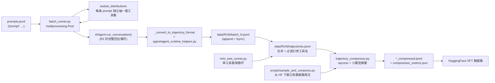

# r9a 底稿 · 研究管线 / 批处理 / 轨迹簇

> 研究对象基线:`/home/user/hermes-agent` @ `863e31318553cda8ad61df681d08175364d4164b`(只读)。
> 溯源约定:凡对代码行为的断言,**锚点单独成行、置于代码块之前**,格式 `路径:行号 @ 863e313`。
> 本文是底稿(证据层),求全求证、允许啰嗦。表格里的行号列不带冒号,是索引不是证据。

**本簇 5 个文件 / 4,074 行(`wc -l` 实测):**

| 文件 | 行数 | 一句话职责 |
|---|---|---|
| `trajectory_compressor.py` | 1598 | 把已完成的轨迹 JSONL **后处理**压到目标 token 预算内(调小模型做摘要) |
| `batch_runner.py` | 1330 | 拿一份 prompt 数据集,**多进程**跑成千上万次 agent 会话,产出轨迹 JSONL |
| `mini_swe_runner.py` | 732 | **只有一个 terminal 工具**的极简 agent 循环,产出同格式轨迹(参照实现) |
| `toolset_distributions.py` | 358 | 17 个「工具集抽样分布」的字面量表 + 一个伯努利抽样器 |
| `agent/trajectory.py` | 56 | 轨迹落盘的**接缝**:2 个纯函数 + 1 个 JSONL 追加写 |

配套 L3 输入样例 4 个:`datagen-config-examples/{trajectory_compression.yaml, web_research.yaml, run_browser_tasks.sh, example_browser_tasks.jsonl}`。

---

## 0. 一张图:这条管线的数据流



---

## 1. 定位判定:这是 NousResearch 自己的训练数据工厂,不是产品功能

这是本簇最重要的一条结论,先给判据再给证据。**判据有五条,四条正向、一条排除。**

### 1.1 判据 A:它不在任何用户可达的入口点里

`pyproject.toml:358-361 @ 863e313`
```toml
[project.scripts]
hermes = "hermes_cli.main:main"
hermes-agent = "run_agent:main"
hermes-acp = "acp_adapter.entry:main"
```

装完 `pip install hermes-agent` 后,用户手上只有 `hermes` / `hermes-agent` / `hermes-acp` 三个命令。
本簇 5 个文件**一个都没有 console script**,也**没有任何 `hermes` 子命令**触达。

**搜索面(负结论必须写出来)**:在 `hermes_cli/*.py`(即全部 CLI 子命令实现)里 grep
`batch_runner|trajectory_compressor|datagen`,命中 4 处,**全部是注释或 tips 文案**,
无一处是 import 或 subprocess 调用:

```verify
cd /home/user/hermes-agent && grep -rn "batch_runner\|batch-runner\|datagen\|trajectory_compressor" hermes_cli/*.py
```

实测输出为 `env_loader.py:47`、`env_loader.py:609`(两条注释里举例说"这些根脚本也会 import 我")、
`tips.py:245`、`tips.py:411`(两条给用户看的小贴士文案)。

`hermes_cli/tips.py:244-245 @ 863e313`
```python
    # --- Batch & Data ---
    "batch_runner.py processes hundreds of prompts in parallel for training data generation.",
```

注意这条 tips **自己就说了** "for training data generation",而且它给出的用法是
`python batch_runner.py` ——**从源码检出目录里跑**,不是 `hermes` 子命令。

### 1.2 判据 B:压缩器的姊妹脚本直接写死了 NousResearch 自家的 HF 训练集

`trajectory_compressor.py` 在仓库里只有一个非测试调用方:`scripts/sample_and_compress.py`。
那个脚本的默认输入是什么,一看便知:

`scripts/sample_and_compress.py:30-36 @ 863e313`
```python
DEFAULT_DATASETS = [
    "NousResearch/swe-terminus-agent-glm-kimi-minimax",
    "NousResearch/hermes-agent-megascience-sft1",
    "NousResearch/Hermes-Agent-Thinking-GLM-4.7-SFT2",
    "NousResearch/Hermes-Agent-Thinking-GLM-4.7-SFT1",
    "NousResearch/terminal-tasks-glm-hermes-agent"
]
```

`sft1` / `SFT2` = supervised fine-tuning 数据集第 1/2 版。这是**训练数据的生产与再加工流水线**,
不是给终端用户省 token 的功能。

### 1.3 判据 C:压缩目标是"训练上下文窗口",不是"省钱"

`trajectory_compressor.py:85-91 @ 863e313`
```python
    # Tokenizer
    tokenizer_name: str = "moonshotai/Kimi-K2-Thinking"
    trust_remote_code: bool = True
    
    # Compression targets
    target_max_tokens: int = 15250
    summary_target_tokens: int = 750
```

用 **HuggingFace 的 `AutoTokenizer` 精确数 token**,而且数的是**某个具体开源模型**的分词器
(`moonshotai/Kimi-K2-Thinking`)。运行时省钱不需要这么精确——运行时看的是 provider 回报的 usage。
只有"这条样本要塞进 15,250 token 的训练序列长度"这个需求,才需要**用训练时那个分词器**离线数。
样例 YAML 把它调到 29,000(`datagen-config-examples/trajectory_compression.yaml`),也是典型的
训练序列长度档位(16k / 32k)。

### 1.4 判据 D:per-task 容器覆盖的注释直接点名 Atropos(Nous 自家 RL 框架)

`batch_runner.py` 给每条 prompt 换 sandbox 镜像时,调的是 `tools/terminal_tool.py` 的注册函数,
而那个函数的 docstring 写明了它的**真实调用方**:

`tools/terminal_tool.py:1224-1229 @ 863e313`
```python
def register_task_env_overrides(task_id: str, overrides: Dict[str, Any]):
    """
    Register environment overrides for a specific task/rollout.

    Called by Atropos environments before the agent loop to configure
    per-task sandbox settings (e.g., a custom Dockerfile for the Modal image).
```

"rollout"、"Atropos environments" 都是 RL 训练术语。Atropos 是 NousResearch 的 RL 环境框架
(仓库里 `website/docs/getting-started/learning-path.md:103` 有外链)。

### 1.5 判据 E(排除向):打包时它被归到"内容/示例",部分文件甚至不进 wheel

`nix/lib.nix:126-129 @ 863e313`
```nix
            ".github"
            # Content/examples
            "infographic"
            "datagen-config-examples"
```

Nix 构建把 `datagen-config-examples` 与 `infographic`(宣传图)并列排除,归类 "Content/examples"。

更硬的一条:**`mini_swe_runner.py` 根本不在 wheel 里。**

`pyproject.toml:377-383 @ 863e313`
```toml
py-modules = [
  "run_agent",
  "model_tools",
  "toolsets",
  "batch_runner",
  "trajectory_compressor",
  "toolset_distributions",
```

`[tool.setuptools] py-modules` 是"顶层单文件模块"的白名单(全列表 377-396 行,18 项)。
`batch_runner` / `trajectory_compressor` / `toolset_distributions` 在,**`mini_swe_runner` 不在**。
也就是说 `pip install` 后 `import mini_swe_runner` 会失败,它只在源码检出里能跑。

```verify
cd /home/user/hermes-agent && grep -n "mini_swe_runner" pyproject.toml hermes_agent.egg-info/top_level.txt
```
实测:两个文件都**零命中**(`top_level.txt` 有 `batch_runner` / `trajectory_compressor` /
`toolset_distributions`,唯独没有 `mini_swe_runner`)。

### 1.6 结论

**这一簇是 NousResearch 造训练数据 / 跑批量评测的内部工具,顺手开源在同一个仓库里。**
文档把它写在 `user-guide/features/` 下面(见 §7 ▲-1),但代码层面它没有任何用户入口,
默认配置路径不存在(§7 ■-3),必需依赖没声明(§4.2 ■-1),
其中一个文件甚至不进安装包。**对"重实现一个 harness"这件事,它的价值是:
一个 agent harness 想要自举训练数据,需要哪些配套件。**

---

## 2. `batch_runner.py` —— 批量跑什么、怎么并发、怎么续跑

### 2.1 场景:一次具体的运行

`bash datagen-config-examples/run_browser_tasks.sh` 会展开成:

`datagen-config-examples/run_browser_tasks.sh:32-40 @ 863e313`
```bash
python batch_runner.py \
  --dataset_file="$SCRIPT_DIR/example_browser_tasks.jsonl" \
  --batch_size=5 \
  --run_name="browser_tasks_example" \
  --distribution="browser_tasks" \
  --model="anthropic/claude-sonnet-4" \
  --base_url="https://openrouter.ai/api/v1" \
  --num_workers=3 \
  --max_turns=30 \
```

输入 `example_browser_tasks.jsonl` 是 5 行 `{"prompt": "..."}`,内容是"去 HN 抓前 5 条帖子"
这类浏览器任务。输出落到 `data/browser_tasks_example/`。

### 2.2 批量跑的是什么:一次完整的 `AIAgent` 会话

每条 prompt = 一次全新的 `AIAgent` 实例 + 一次 `run_conversation()`。**不是**复用 agent。

`batch_runner.py:323-346 @ 863e313`
```python
        # Initialize agent with sampled toolsets and log prefix for identification
        log_prefix = f"[B{batch_num}:P{prompt_index}]"
        agent = AIAgent(
            base_url=config.get("base_url"),
            api_key=config.get("api_key"),
            model=config["model"],
            max_iterations=config["max_iterations"],
            enabled_toolsets=selected_toolsets,
            save_trajectories=False,  # We handle saving ourselves
            verbose_logging=config.get("verbose", False),
            ephemeral_system_prompt=config.get("ephemeral_system_prompt"),
            log_prefix_chars=config.get("log_prefix_chars", 100),
            log_prefix=log_prefix,
            providers_allowed=config.get("providers_allowed"),
            providers_ignored=config.get("providers_ignored"),
            providers_order=config.get("providers_order"),
            provider_sort=config.get("provider_sort"),
            openrouter_min_coding_score=config.get("openrouter_min_coding_score"),
            max_tokens=config.get("max_tokens"),
            reasoning_config=config.get("reasoning_config"),
            prefill_messages=config.get("prefill_messages"),
            skip_context_files=True,  # Don't pollute trajectories with SOUL.md/AGENTS.md
            skip_memory=True,  # Don't use persistent memory in batch runs
        )
```

**三个开关值得单独记,它们是"跑数据"和"跑用户会话"的分界线:**

- `save_trajectories=False` —— 关掉 agent 自带的落盘(那条走 `agent/trajectory.py`,见 §5),
  改由 batch_runner 自己写,因为它要往条目里塞 `tool_stats` 等训练侧字段。
- `skip_context_files=True` —— 不注入 `SOUL.md` / `AGENTS.md`。理由写在注释里:
  **不要污染轨迹**。用户会话里这些是"人格 + 项目约定",训练样本里它们是噪声(而且会让每条样本的
  system prompt 因机器而异)。
- `skip_memory=True` —— 不用持久记忆。同理:批跑的每条样本必须**互相独立**,记忆会让第 N 条
  样本依赖第 N-1 条的结果,破坏 i.i.d.。

`task_id` 也是关键:

`batch_runner.py:348-349 @ 863e313`
```python
        # Run the agent with task_id to ensure each task gets its own isolated VM
        result = agent.run_conversation(prompt, task_id=task_id)
```

`task_id = f"task_{prompt_index}"`(`batch_runner.py:263`),它是 R4 那套环境抽象里的
**沙箱身份**——同一个 task_id 复用同一个容器,不同 task_id 各自一个。

### 2.3 并发模型:**进程池 × 批内串行**(两级,不是一级)

这是本文件设计上最该记住的一点。**并发单位是"批",不是"prompt"。**

`batch_runner.py:919-931 @ 863e313`
```python
        # Process batches in parallel
        with Pool(processes=self.num_workers) as pool:
            # Create tasks for each batch
            tasks = [
                (
                    batch_num,
                    batch_data,
                    str(self.output_dir),  # Convert Path to string for pickling
                    completed_prompts_set,
                    config
                )
                for batch_num, batch_data in enumerate(self.batches)
            ]
```

`batch_runner.py:442-450 @ 863e313`
```python
    # Process each prompt sequentially in this batch
    for prompt_index, prompt_data in prompts_to_process:
        # Process the prompt
        result = _process_single_prompt(
            prompt_index,
            prompt_data,
            batch_num,
            config
        )
```

**实际并发度 = `num_workers`,与 `batch_size` 无关。** `batch_size` 只决定
(a) 每个 worker 一次领多少活、(b) 生成多少个 `batch_*.jsonl` 文件、(c) checkpoint 的粒度。

**为什么用进程而不是协程?** `AIAgent.run_conversation()` 是**同步**的(R2 已精读),
里面有大量阻塞调用(HTTP、docker exec、子进程)。要并行只能靠进程或线程;选进程还额外买到了
**故障隔离**——一条 prompt 把解释器搞崩不会带走其他 batch。代价是:

1. **`config` 必须可 pickle**。这直接催生了下面这段特判(§2.4)。
2. **每个 worker 要重新 import 整个 `run_agent`**,启动开销大(所以按"批"分,不按"条"分)。
3. Linux 上 `Pool` 默认 `fork`,worker 继承父进程已 import 的模块;macOS/Windows 默认 `spawn`,
   每个 worker 从头 import。本文件没有显式 `set_start_method`,所以行为**随平台变**。

### 2.4 可 pickle 性:callable api_key 的特判

`batch_runner.py:867-885 @ 863e313`
```python
        # Prepare configuration for workers.
        #
        # ``self.api_key`` may be a zero-arg callable (Azure Foundry Entra ID
        # bearer provider returned by ``agent.azure_identity_adapter``). Such
        # closures are not safely picklable across the multiprocessing.Pool
        # boundary. Drop the callable here and let each worker rebuild its
        # own provider via ``resolve_runtime_provider()``, which reads
        # ``model.auth_mode`` from ``config.yaml`` and constructs a fresh
        # token provider in the worker process (azure-identity caches
        # in-process so each worker gets its own short-lived cache).
        if callable(self.api_key) and not isinstance(self.api_key, str):
            worker_api_key = None
            print(
                "ℹ️  Detected Entra ID bearer provider — workers will rebuild "
                "credentials from config.yaml in each process.",
                flush=True,
            )
        else:
            worker_api_key = self.api_key
```

**可迁移的设计教训**:任何"跨进程分发配置"的 harness,配置里一旦允许放 callable(
懒求值的 token provider 是最常见的一种),就必须在序列化边界上**显式剥掉它并让对端重建**。
这里的做法是"剥掉 → 传 None → worker 侧走 `resolve_runtime_provider()` 重新构造"。
仓库里还有一个测试专门钉住这段代码的**文本**(`tests/run_agent/test_callable_api_key.py:218-224`
读 `batch_runner.py` 源码断言谓词字符串),说明这条曾经炸过。

### 2.5 结果落在哪:三层文件 + 一次合并

目录固定为 `data/<run_name>/`:

`batch_runner.py:612-620 @ 863e313`
```python
        # Setup output directory
        self.output_dir = Path("data") / run_name
        self.output_dir.mkdir(parents=True, exist_ok=True)
        
        # Checkpoint file
        self.checkpoint_file = self.output_dir / "checkpoint.json"
        
        # Statistics file
        self.stats_file = self.output_dir / "statistics.json"
```

注意 `Path("data")` 是**相对 cwd** 的,不是相对仓库根,也不是 `HERMES_HOME`。
在别的目录里跑同一条命令会写到别的地方。

**逐条写盘用的是"追加 + flush + fsync",而不是最后一次性写:**

`batch_runner.py:485-489 @ 863e313`
```python
            # Append to batch output file
            with open(batch_output_file, 'a', encoding='utf-8') as f:
                f.write(json.dumps(trajectory_entry, ensure_ascii=False) + "\n")
                f.flush()
                os.fsync(f.fileno())
```

`fsync` 不是装饰。它的存在理由被测试写死了(`tests/test_batch_runner_durability.py:33-38`):
**checkpoint 一旦声称某条 prompt 完成,盘上就必须真有那条轨迹**。少了 fsync,
"写入 page cache 但未落盘"期间断电 → checkpoint 说完成了、数据没了 → 续跑会永久跳过这条。
一次 agent 会话可能花掉几分钟和几万 token,这个损失不可接受,所以宁可每条都 fsync。

**worker 之间不需要写锁**,因为每个 batch 只有一个 worker、写自己那个 `batch_{N}.jsonl`。

### 2.6 checkpoint:父进程增量写 + 原子替换

`batch_runner.py:961-979 @ 863e313`
```python
                    for result in pool.imap_unordered(_process_batch_worker, tasks):
                        results.append(result)
                        progress.update(task, advance=1)

                        # Incremental checkpoint update (so resume works after crash)
                        try:
                            batch_num = result.get('batch_num')
                            completed = result.get('completed_prompts', []) or []
                            completed_prompts_set.update(completed)

                            if isinstance(batch_num, int):
                                checkpoint_data.setdefault('batch_stats', {})[str(batch_num)] = {
                                    'processed': result.get('processed', 0),
                                    'skipped': result.get('skipped', 0),
                                    'discarded_no_reasoning': result.get('discarded_no_reasoning', 0),
                                }

                            checkpoint_data['completed_prompts'] = sorted(completed_prompts_set)
                            self._save_checkpoint(checkpoint_data, lock=checkpoint_lock)
                        except Exception as ckpt_err:
                            # Don't fail the run if checkpoint write fails
                            print(f"⚠️  Warning: Failed to save incremental checkpoint: {ckpt_err}")
```

三个设计点:

1. **`imap_unordered`** —— 谁先完成谁先回,不等顺序。因为每个 batch 耗时差异极大
   (一条 30 轮的浏览器任务 vs 一条一问一答),按序等会浪费大量 worker 时间。
   代价是 `results` 列表顺序不确定;但下游只做聚合求和,不依赖顺序。
2. **checkpoint 只在父进程写** —— 所以那个 `checkpoint_lock = Lock()`(`batch_runner.py:917`)
   在当前代码路径下**是纯装饰**:`imap_unordered` 的消费循环跑在父进程单线程里。
   注释自己也承认了 "Checkpoint writes happen in the parent process; keep a lock for safety."
3. **写盘走 `utils.atomic_json_write`** —— 临时文件 + fsync + `os.replace`:

`batch_runner.py:725-732 @ 863e313`
```python
        checkpoint_data["last_updated"] = datetime.now().isoformat()

        from utils import atomic_json_write
        if lock:
            with lock:
                atomic_json_write(self.checkpoint_file, checkpoint_data)
        else:
            atomic_json_write(self.checkpoint_file, checkpoint_data)
```

### 2.7 续跑:**按内容**匹配,不按下标

这是本文件最值得抄的一个设计。

`batch_runner.py:734-745 @ 863e313`
```python
    def _scan_completed_prompts_by_content(self) -> set:
        """
        Scan all batch files and extract completed prompts by their actual content.
        
        This provides a more robust resume mechanism that matches on prompt text
        rather than indices, allowing recovery even if indices don't match.
        
        Returns:
            set: Set of prompt texts that have been successfully processed
        """
        completed_prompts = set()
        batch_files = sorted(self.output_dir.glob("batch_*.jsonl"))
```

`--resume` 时**不读 checkpoint 的下标**,而是把 `data/<run>/batch_*.jsonl` 全部扫一遍,
从每条已存轨迹里抠出第一条 `from == "human"` 的 `value`,组成一个**文本集合**;
再拿数据集里每条 prompt 的文本去比对。

`batch_runner.py:763-770 @ 863e313`
```python
                            # Extract the human/user prompt from conversations
                            conversations = entry.get("conversations", [])
                            for msg in conversations:
                                if msg.get("from") == "human":
                                    prompt_text = msg.get("value", "").strip()
                                    if prompt_text:
                                        completed_prompts.add(prompt_text)
                                    break  # Only need the first human message
```

**为什么值得抄**:数据集是活的——今天加 100 条、明天去重删 50 条、后天换个顺序。
下标续跑在数据集一动就全错(会跳过没跑的、重跑跑过的)。文本续跑对重排、插入、删除都免疫。
`hermes_cli/tips.py:411` 把这条当卖点写进了用户提示。

**代价与边界(重实现时必须知道)**:

- 完整读一遍所有 batch 文件才能起跑。数据量大时是 O(已产出体积) 的启动成本。
- **完全相同的两条 prompt 会被当成同一条**(集合去重)。数据集里有重复 prompt 时,
  第二条永远跑不了。
- 匹配的是 `.strip()` 后的文本,**空白差异免疫、任何其他改动都不免疫**。
- 下标口径仍然并行保留(`completed_prompts_set` 传给 worker 做二次过滤),
  两套口径同时生效,注释称之为 "For backward compatibility"(`batch_runner.py:906`)。

**一个易踩的坑**:`--resume` 时批号从 0 重新编:

`batch_runner.py:838-844 @ 863e313`
```python
            # Recreate batches from filtered entries (keeping original indices for tracking)
            batches_to_process = []
            for i in range(0, len(filtered_entries), self.batch_size):
                batch = filtered_entries[i:i + self.batch_size]
                batches_to_process.append(batch)
            
            self.batches = batches_to_process
```

新的 batch 0 会**追加写进老的 `batch_0.jsonl`**(打开模式是 `'a'`),
并且 `checkpoint_data['batch_stats']['0']` 会被覆盖。数据不丢(合并阶段 glob 全部文件),
但"每批统计"这份历史被抹掉了。

### 2.8 失败与重试:没有自动重试,只有"下次续跑再来"

`batch_runner.py:508-514 @ 863e313`
```python
        # Only mark as completed if successfully saved (failed prompts can be retried on resume)
        if result["success"] and result["trajectory"]:
            completed_in_batch.append(prompt_index)
            status = "⚠️  partial" if result.get("partial") else "✅"
            print(f"   {status} Prompt {prompt_index} completed")
        else:
            print(f"   ❌ Prompt {prompt_index} failed (will retry on resume)")
```

**没有任何重试循环**。一条 prompt 抛异常 → 记 `success: False` → 不写盘 → 不进 completed →
下次 `--resume` 自然会重跑它。**重试策略被完全外包给了"再跑一次 --resume"**。

这是个刻意的取舍:LLM 调用层自己已经有重试与 provider 兜底(R2 的 classify-retry-fallback),
再在批处理层套一层重试,只会让"真正跑不动的 prompt"消耗 N 倍成本。

**中断时的收尾契约**(被测试钉死,`tests/test_batch_runner_durability.py:116-136`):

`batch_runner.py:983-994 @ 863e313`
```python
                except KeyboardInterrupt:
                    print("\n⚠️  Interrupted — terminating batch workers...")
                    pool.terminate()
                    pool.join()
                    raise
                except Exception as e:
                    logger.error("Batch worker failed: %s", e, exc_info=True)
                    pool.terminate()
                    pool.join()
                    raise
                finally:
                    root_logger.setLevel(original_level)
```

测试特别注明 `join()` **不能带 timeout**(CPython 的 `Pool.join(self)` 无参,
`join(timeout=10)` 会 `TypeError`)。这是那种"改一行看起来更稳、实际直接崩"的坑。

### 2.9 质量闸门:两道过滤

**闸门一(逐条,worker 内):零推理样本直接丢弃**

`batch_runner.py:452-460 @ 863e313`
```python
        # Save trajectory if successful
        if result["success"] and result["trajectory"]:
            # Discard samples with zero reasoning across all turns
            reasoning = result.get("reasoning_stats", {})
            if not reasoning.get("has_any_reasoning", True):
                print(f"   🚫 Prompt {prompt_index} discarded (no reasoning in any turn)")
                discarded_no_reasoning += 1
                completed_in_batch.append(prompt_index)
                continue
```

注意 `completed_in_batch.append(prompt_index)` ——**被丢弃的样本仍然记为"已完成"**,
所以 `--resume` 不会反复重跑它。这是对的:重跑大概率还是没推理。
测试把这条行为钉住了(`tests/test_batch_runner_checkpoint.py`,
`test_discarded_no_reasoning_prompts_are_marked_completed`)。

"有没有推理"的判据是两选一:

`batch_runner.py:229-234 @ 863e313`
```python
        content = msg.get("content", "") or ""
        has_scratchpad = "<REASONING_SCRATCHPAD>" in content
        has_native_reasoning = bool(msg.get("reasoning", "").strip()) if msg.get("reasoning") else False
        
        if has_scratchpad or has_native_reasoning:
            with_reasoning += 1
```

即:**原生 thinking token**(provider 回的 `reasoning` 字段)**或** XML 伪推理
(`<REASONING_SCRATCHPAD>`,在原生 thinking 被关掉时由 system prompt 诱导模型产出)。

**闸门二(合并期,父进程):幻觉工具名整条剔除**

`batch_runner.py:1059-1070 @ 863e313`
```python
                        try:
                            data = json.loads(line)
                            tool_stats = data.get('tool_stats', {})
                            
                            # Check for invalid tool names (model hallucinations)
                            invalid_tools = [k for k in tool_stats if k not in VALID_TOOLS]
                            
                            if invalid_tools:
                                filtered_entries += 1
                                invalid_preview = invalid_tools[0][:50] + "..." if len(invalid_tools[0]) > 50 else invalid_tools[0]
                                print(f"   ⚠️  Filtering corrupted entry (batch {batch_num}): invalid tool '{invalid_preview}'")
                                continue
```

合法工具名不是手维护的白名单,而是从 `model_tools.TOOL_TO_TOOLSET_MAP` 自动导出:

`batch_runner.py:61-68 @ 863e313`
```python
# All possible tools - auto-derived from the master mapping in model_tools.py.
# This stays in sync automatically when new tools are added to TOOL_TO_TOOLSET_MAP.
# Used for consistent schema in Arrow/Parquet (HuggingFace datasets) and for
# filtering corrupted entries during trajectory combination.
ALL_POSSIBLE_TOOLS = set(TOOL_TO_TOOLSET_MAP.keys())

# Default stats for tools that weren't used
DEFAULT_TOOL_STATS = {'count': 0, 'success': 0, 'failure': 0}
```

### 2.10 schema 归一化:为什么要给没用过的工具补零

`batch_runner.py:71-91 @ 863e313`
```python
def _normalize_tool_stats(tool_stats: Dict[str, Dict[str, int]]) -> Dict[str, Dict[str, int]]:
    """
    Normalize tool_stats to include all possible tools with consistent schema.
    
    This ensures HuggingFace datasets can load the JSONL without schema mismatch errors.
    Tools that weren't used get zero counts.
    
    Args:
        tool_stats (Dict): Raw tool statistics from extraction
        
    Returns:
        Dict: Normalized tool statistics with all tools present
    """
    normalized = {}
    
    # Add all possible tools with defaults
    for tool in ALL_POSSIBLE_TOOLS:
        if tool in tool_stats:
            normalized[tool] = tool_stats[tool].copy()
        else:
            normalized[tool] = DEFAULT_TOOL_STATS.copy()
```

**这是纯下游驱动的设计**:HuggingFace `datasets` 用 Arrow 列存,JSONL 里的 dict 会被推断成
struct 类型。第 1 条只有 `terminal` 键、第 2 条只有 `web_search` 键 → 两条推出来的 struct 不同 →
加载时 schema mismatch 直接报错。补零把每条的 struct 字段集**变成同一个**,问题消失。

**可迁移的原则**:轨迹的落盘格式不是"记录发生了什么"就够了,它同时是**下游数据框架的输入 schema**。
稀疏 map 在 JSONL 里很自然,在列存里是灾难。

### 2.11 工具调用成败的判定(训练标签的来源)

`batch_runner.py:164-195 @ 863e313`
```python
            # Determine if tool call was successful
            is_success = True
            try:
                # Try to parse as JSON and check for actual error values
                content_json = json.loads(content) if isinstance(content, str) else content
                
                if isinstance(content_json, dict):
                    # Check if error field exists AND has a non-null value
                    if "error" in content_json and content_json["error"] is not None:
                        is_success = False
                    
                    # Special handling for terminal tool responses
                    # Terminal wraps its response in a "content" field
                    if "content" in content_json and isinstance(content_json["content"], dict):
                        inner_content = content_json["content"]
                        # Check for actual error (non-null error field)
                        # Note: non-zero exit codes are not failures - the model can self-correct
                        if inner_content.get("error") is not None:
                            is_success = False
                    
                    # Check for "success": false pattern used by some tools
                    if content_json.get("success") is False:
                        is_success = False
                        
            except (json.JSONDecodeError, ValueError, TypeError):
                # If not JSON, check if content is empty or explicitly states an error
                # Note: We avoid simple substring matching to prevent false positives
                if not content:
                    is_success = False
                # Only mark as failure if it explicitly starts with "Error:" or "ERROR:"
                elif content.strip().lower().startswith("error:"):
                    is_success = False
```

两条注释是这段的全部精华,值得单列:

- **"non-zero exit codes are not failures - the model can self-correct"** ——
  `grep` 没找到东西返回 1,`test` 返回 1,这些都是**正常的 agent 行为**,不是工具失败。
  把 exit code != 0 记成失败会让"工具成功率"这个指标毫无意义。
- **"We avoid simple substring matching to prevent false positives"** ——
  只认 `startswith("error:")`,不认 "包含 error"。因为工具输出里出现 "error" 这个词太常见了
  (编译日志、日志文件内容、文档正文)。

---

## 3. `toolset_distributions.py` —— 分布表 + 伯努利抽样器

### 3.1 它定义的是什么:**每条 prompt 独立掷骰子**决定拿到哪几套工具

不是"不同角色给不同工具包",而是**同一次批跑内,给每条 prompt 随机化工具面**。

`toolset_distributions.py:29-41 @ 863e313`
```python
DISTRIBUTIONS = {
    # Default: All tools available 100% of the time
    "default": {
        "description": "All available tools, all the time",
        "toolsets": {
            "web": 100,
            "vision": 100,
            "image_gen": 100,
            "terminal": 100,
            "file": 100,
            "browser": 100
        }
    },
```

关键在抽样器不是"选一个",而是**对每个工具集独立掷一次骰子**:

`toolset_distributions.py:261-282 @ 863e313`
```python
    # Sample each toolset independently based on its probability
    selected_toolsets = []
    
    for toolset_name, probability in dist["toolsets"].items():
        # Validate toolset exists
        if not validate_toolset(toolset_name):
            print(f"⚠️  Warning: Toolset '{toolset_name}' in distribution '{distribution_name}' is not valid")
            continue
        
        # Roll the dice - if random value is less than probability, include this toolset
        if random.random() * 100 < probability:
            selected_toolsets.append(toolset_name)
    
    # If no toolsets were selected (can happen with low probabilities), 
    # ensure at least one toolset is selected by picking the highest probability one
    if not selected_toolsets and dist["toolsets"]:
        # Find toolset with highest probability
        highest_prob_toolset = max(dist["toolsets"].items(), key=lambda x: x[1])[0]
        if validate_toolset(highest_prob_toolset):
            selected_toolsets.append(highest_prob_toolset)
    
    return selected_toolsets
```

所以 `"research"` 分布(web 90 / browser 70 / vision 50 / terminal 10)不是"90% 的样本用 web",
而是"每条样本以 90% 概率**同时**含 web、70% 概率同时含 browser……",2⁴ = 16 种可能组合。
"概率之和应为 100" 这句 docstring(`toolset_distributions.py:10`)其实**在数学上是多余的**——
伯努利独立抽样不需要归一化,代码也从不归一化。见 §7 ◇-2。

**为什么要随机化工具面?** 训练数据的目标是让模型学会"**在给定工具集下**正确工作",
而不是"永远假设有 6 套工具"。系统提示里的 `<tools>` 块随抽样变化(§5.3),
模型必须学会读它。全用 `default`(全 100%)训出来的模型,一旦上线时只给它 2 个工具就会幻觉调用。

**兜底那一段**是必要的:低概率分布(如 terminal 10%)有可能一个都没抽中,
零工具的 agent 会话没有训练价值,所以强制补上概率最高的那一个。

### 3.2 调用方找全(搜索面写在这里)

**搜索面**:全仓 `grep -rn "toolset_distributions"`,**不加 `--include`**,只排除
`node_modules` / `website/node_modules` / `.git`;再对四个导出符号
(`get_distribution` / `list_distributions` / `sample_toolsets_from_distribution` /
`validate_distribution` / `print_distribution_info`)各做一次同样的全仓 grep。

```verify
cd /home/user/hermes-agent && grep -rn "toolset_distributions\|sample_toolsets_from_distribution\|validate_distribution\|print_distribution_info" . 2>/dev/null | grep -v "^./node_modules" | grep -v "^./website/node_modules" | grep -v "^./.git/"
```

结果(去掉自引用与生成物):

| 调用方 | 位置 | 用途 |
|---|---|---|
| `batch_runner.py` | 50-54(import)、318、609-610、1231-1239 | **唯一的生产调用方** |
| `tests/test_toolset_distributions.py` | 5-10 | 单元测试(7 用例) |
| `tests/integration/test_batch_runner.py` | 115 | 只在打印帮助文案里出现字符串 |
| `pyproject.toml` | 383 | 打包白名单 |
| `website/docs/.../batch-processing.md` | 34, 99 | 文档 |
| `website/docs/developer-guide/adding-tools.md` | 210 | 加新工具的 checklist |
| `hermes_agent.egg-info/*`、`test_durations.json` | — | 构建/测试生成物,非引用 |

**结论:`toolset_distributions` 只被 `batch_runner` 读。** 它不进运行时、不进 gateway、不进 CLI。

三个调用点:

`batch_runner.py:316-321 @ 863e313`
```python
    try:
        # Sample toolsets from distribution for this prompt
        selected_toolsets = sample_toolsets_from_distribution(config["distribution"])
        
        if config.get("verbose"):
            print(f"   Prompt {prompt_index}: Using toolsets {selected_toolsets}")
```

`batch_runner.py:608-610 @ 863e313`
```python
        # Validate distribution
        if not validate_distribution(distribution):
            raise ValueError(f"Unknown distribution: {distribution}. Available: {list(list_distributions().keys())}")
```

`batch_runner.py:1231-1239 @ 863e313`
```python
    if list_distributions:
        from toolset_distributions import print_distribution_info

        print("📊 Available Toolset Distributions")
        print("=" * 70)

        all_dists = list_distributions()
        for dist_name in sorted(all_dists.keys()):
            print_distribution_info(dist_name)
```

(注意 1231 行的 `list_distributions` 是**函数形参**(bool),1237 行的 `list_distributions()`
是**被形参遮蔽的模块函数**——`if list_distributions:` 为真时才走到 1237,
此时 `list_distributions` 是 `True`,`True()` 会 `TypeError`。见 §7 ■-6。)

### 3.3 与委派(`tools/delegate_tool.py`)的关系:**没有关系,而且是有意义的"没有"**

`delegate_task` 属于 `delegation` 工具集:

`toolsets.py:272-276 @ 863e313`
```python
    "delegation": {
        "description": "Spawn subagents with isolated context for complex subtasks",
        "tools": ["delegate_task"],
        "includes": []
    },
```

**17 个分布里,没有任何一个包含 `delegation`。** 判据(可零成本复现,AST 直读字面量):

```verify
cd /home/user/hermes-agent && python3 -c "
import ast
tree = ast.parse(open('toolset_distributions.py', encoding='utf-8').read())
d = [ast.literal_eval(n.value) for n in tree.body
     if isinstance(n, ast.Assign) and getattr(n.targets[0], 'id', '') == 'DISTRIBUTIONS'][0]
u = set()
for v in d.values(): u |= set(v['toolsets'])
print(len(d), 'distributions; union =', sorted(u)); print('delegation in union?', 'delegation' in u)
"
```

实测输出:`17 distributions; union = ['browser', 'file', 'image_gen', 'terminal', 'vision', 'web']`,
`delegation in union? False`。

而 `enabled_toolsets` 是**白名单**语义(`model_tools.get_tool_definitions` 的 docstring:
"Only include tools from these toolsets"),所以批跑出来的 agent **拿不到 `delegate_task`**。

**这个"没有"的含义**:全仓 58 个工具集(AST 实测,见下),分布表只覆盖了 6 个。
批量数据生成刻意**只训练单层 agent 的工具使用**,不训练委派、不训练 memory、
不训练 skills、不训练 code_execution、不训练 kanban。委派轨迹会包含子 agent 的完整会话,
把它塞进单条训练样本既超长又语义嵌套,不是这套 from/value 平铺格式能表达的。

```verify
cd /home/user/hermes-agent && python3 -c "
import ast
tree = ast.parse(open('toolsets.py', encoding='utf-8').read())
for n in tree.body:
    if isinstance(n, ast.Assign) and getattr(n.targets[0], 'id', '') == 'TOOLSETS':
        print('TOOLSETS count =', len(n.value.keys))
"
```
实测 `TOOLSETS count = 58`。

---

## 4. `trajectory_compressor.py` —— 轨迹后压缩

### 4.1 场景:一条 40k token 的浏览器轨迹要塞进 15,250 token 的训练窗口

一次 30 轮的浏览器任务会产出几十个 `<tool_response>`,每个里面是一整页 accessibility snapshot,
轻松几万 token。训练序列长度是固定的(默认 15,250,样例配置 29,000),超了就得丢掉整条样本——
而那条样本恰恰是最有价值的"长程多步"数据。

压缩器的答案:**保头保尾,把中间挖掉换成一段模型写的摘要**。

`trajectory_compressor.py:8-14 @ 863e313`
```
Compression Strategy:
1. Protect first turns (system, human, first gpt, first tool)
2. Protect last N turns (final actions and conclusions)
3. Compress MIDDLE turns only, starting from 2nd tool response
4. Compress only as much as needed to fit under target
5. Replace compressed region with a single human summary message
6. Keep remaining tool calls intact (model continues working after summary)
```

### 4.2 「轨迹」指什么

指 `_convert_to_trajectory_format` 产出的那个 **ShareGPT 风格 `conversations` 列表**:
一串 `{"from": "system"|"human"|"gpt"|"tool", "value": "<文本>"}`。
一次完整 agent 会话的全部消息(含工具调用与工具结果)被**平铺成纯文本**,
工具调用与结果都以 XML 标记内嵌在 `value` 里(细节见 §5.3)。

压缩器只认 `entry["conversations"]`,其余字段原样透传:

`trajectory_compressor.py:1048-1061 @ 863e313`
```python
        if "conversations" not in entry:
            metrics = TrajectoryMetrics()
            return entry, metrics
        
        trajectory = entry["conversations"]
        compressed_trajectory, metrics = self.compress_trajectory(trajectory)
        
        # Create new entry with compressed trajectory
        result = entry.copy()
        result["conversations"] = compressed_trajectory
        
        # Add compression metadata if enabled
        if self.config.metrics_per_trajectory and metrics.was_compressed:
            result["compression_metrics"] = metrics.to_dict()
```

### 4.3 目的:造数据集,**不是**运行时省 token

三条判据:

1. 它是**离线批处理**,入口是 `--input=<jsonl 或目录>`,不是 agent 循环里的钩子。
   (运行时的上下文压缩是**另一套东西**,R5 精读过的 `agent/` 下的 context compression。)
2. 计数用的是**训练侧分词器**(§1.3)。
3. 它把摘要写成 `{"from": "human"}` 而不是 system 或 tool ——
   这是为了让训练时的**损失掩码**表现正确:human 轮通常不计 loss,
   模型学的是"看到这段摘要之后该怎么继续",而不是"学会写这段摘要"。

`trajectory_compressor.py:870-878 @ 863e313`
```python
        # Add summary as human message
        compressed.append({
            "from": "human",
            "value": summary
        })
        
        # Add tail (turns after compression region)
        for i in range(compress_until, len(trajectory)):
            compressed.append(trajectory[i].copy())
```

### 4.4 算法:规则定区域 + 调模型写摘要(两者都用)

**第一步:算保护区。** 保护"每种角色的第一次出现" + "最后 N 轮"。

`trajectory_compressor.py:487-513 @ 863e313`
```python
        # Track first occurrences
        first_system = first_human = first_gpt = first_tool = None
        
        for i, turn in enumerate(trajectory):
            role = turn.get("from", "")
            if role == "system" and first_system is None:
                first_system = i
            elif role == "human" and first_human is None:
                first_human = i
            elif role == "gpt" and first_gpt is None:
                first_gpt = i
            elif role == "tool" and first_tool is None:
                first_tool = i
        
        # Protect first turns
        if self.config.protect_first_system and first_system is not None:
            protected.add(first_system)
        if self.config.protect_first_human and first_human is not None:
            protected.add(first_human)
        if self.config.protect_first_gpt and first_gpt is not None:
            protected.add(first_gpt)
        if self.config.protect_first_tool and first_tool is not None:
            protected.add(first_tool)
        
        # Protect last N turns
        for i in range(max(0, n - self.config.protect_last_n_turns), n):
            protected.add(i)
```

**保护理由**:system(工具定义,删了模型不知道能调什么)、第一个 human(原始任务,
删了不知道在干嘛)、第一个 gpt + 第一个 tool(**一次完整的调用示范**,让模型看到格式)、
最后 N 轮(结论与收尾动作,训练信号最强的部分)。

**头尾的划分用了一个粗糙但保守的启发式:**

`trajectory_compressor.py:515-521 @ 863e313`
```python
        # Determine compressible region
        # Start after the last protected head turn
        head_protected = [i for i in protected if i < n // 2]
        tail_protected = [i for i in protected if i >= n // 2]
        
        compressible_start = max(head_protected) + 1 if head_protected else 0
        compressible_end = min(tail_protected) if tail_protected else n
```

用 `n // 2` 判定"某个受保护下标属于头还是尾"。这在数学上不严谨(一条很短的轨迹里,
"最后 4 轮"可能整个落在前半段,于是被算成 head),但**两个方向的误判都是保守的**:
误判成 head 会把 `compressible_start` 推大、误判成 tail 会把 `compressible_end` 拉小,
两者都只会**少压**,不会压到不该压的地方。所以它是安全的,只是有时白白放弃压缩机会。

**第二步:贪心累加,只压到刚好够。**

`trajectory_compressor.py:796-820 @ 863e313`
```python
        # Calculate how much we need to save
        tokens_to_save = total_tokens - self.config.target_max_tokens
        
        # We'll replace N turns with 1 summary turn
        # Net savings = (sum of N turns' tokens) - summary_target_tokens
        # We need: net_savings >= tokens_to_save
        # So: sum of turns >= tokens_to_save + summary_target_tokens
        target_tokens_to_compress = tokens_to_save + self.config.summary_target_tokens
        
        # Accumulate turns from compress_start until we have enough savings
        accumulated_tokens = 0
        compress_until = compress_start
        
        for i in range(compress_start, compress_end):
            accumulated_tokens += turn_tokens[i]
            compress_until = i + 1  # Exclusive end
            
            # Check if we have enough savings
            if accumulated_tokens >= target_tokens_to_compress:
                break
        
        # If we still don't have enough savings, compress the entire compressible region
        if accumulated_tokens < target_tokens_to_compress and compress_until < compress_end:
            compress_until = compress_end
            accumulated_tokens = sum(turn_tokens[compress_start:compress_end])
```

**"只压到刚好够"是刻意的**:每多压一轮就多丢一份训练信号。目标不是最小化 token,
而是**在满足预算的前提下最大化保留信息**。

**第三步:边界对齐——不能把 `<tool_call>` 和它的 `<tool_response>` 切开。**

这是全文件最精细的一块,也是最能说明"轨迹格式的隐含约束"的地方。

`trajectory_compressor.py:525-536 @ 863e313`
```python
    @staticmethod
    def _is_boundary_clean(trajectory: List[Dict[str, str]], idx: int) -> bool:
        """Return True if a region boundary at ``idx`` does not split a turn pair.

        In the from/value trajectory format a ``tool`` turn (carrying
        ``<tool_response>`` markers) is always emitted immediately after the
        ``gpt`` turn whose ``<tool_call>`` it answers. A compression boundary
        that lands *on* a ``tool`` turn therefore cuts between a tool call and
        its response. A boundary is only clean when it sits at the very end of
        the trajectory or on a non-``tool`` turn.
        """
        return idx >= len(trajectory) or trajectory[idx].get("from") != "tool"
```

`trajectory_compressor.py:538-562 @ 863e313`
```python
    @classmethod
    def _snap_boundary(
        cls,
        trajectory: List[Dict[str, str]],
        idx: int,
        min_idx: int,
        max_idx: int,
    ) -> int:
        """Move a compression boundary onto the nearest clean turn boundary.

        Moving forward is preferred so that an orphaned ``tool`` turn is folded
        into the region that already holds its ``gpt`` turn; if no clean
        boundary exists ahead (for example the protected tail itself begins on a
        ``tool`` turn) the boundary is moved backward instead. The result is
        clamped to ``[min_idx, max_idx]``.
        """
        forward = idx
        while forward < max_idx and not cls._is_boundary_clean(trajectory, forward):
            forward += 1
        if cls._is_boundary_clean(trajectory, forward):
            return forward
        backward = idx
        while backward > min_idx and not cls._is_boundary_clean(trajectory, backward):
            backward -= 1
        return backward
```

**为什么必须有它**:若边界落在一个 `tool` 轮上,压缩后的样本里会出现一个
**没有对应 `<tool_call>` 的孤儿 `<tool_response>`**(或反之)。拿这种样本去训,
就是在教模型"可以凭空产出工具结果"。**前后两个边界都要 snap:**

`trajectory_compressor.py:784-786 @ 863e313`
```python
        # Snap the head boundary so the compressible region never *starts* on an
        # orphaned <tool_response> whose <tool_call> lives in the protected head.
        compress_start = self._snap_boundary(trajectory, compress_start, compress_start, compress_end)
```

`trajectory_compressor.py:822-832 @ 863e313`
```python
        # Snap the tail boundary so we never cut between a <tool_call> and its
        # <tool_response>: the summary replaces [compress_start, compress_until)
        # and the remainder is kept verbatim, so a boundary on a tool turn would
        # leave an orphaned marker and corrupt the training trajectory.
        compress_until = self._snap_boundary(trajectory, compress_until, compress_start, compress_end)
        if compress_until <= compress_start:
            # Snapping collapsed the region; nothing can be safely compressed.
            metrics.compressed_tokens = total_tokens
            metrics.compressed_turns = len(trajectory)
            metrics.still_over_limit = total_tokens > self.config.target_max_tokens
            return trajectory, metrics
```

**第四步:净收益守卫——压了反而更大就别压。**

`trajectory_compressor.py:834-844 @ 863e313`
```python
        # If the region we can safely compress is no larger than the summary
        # that would replace it, compression cannot reduce the token count --
        # it would grow the trajectory and still spend a summarization call.
        if (
            sum(turn_tokens[compress_start:compress_until])
            <= self.config.summary_target_tokens
        ):
            metrics.compressed_tokens = total_tokens
            metrics.compressed_turns = len(trajectory)
            metrics.still_over_limit = total_tokens > self.config.target_max_tokens
            return trajectory, metrics
```

**第五步:调模型写摘要。** 这是唯一的"非规则"环节。

`trajectory_compressor.py:616-631 @ 863e313`
```python
        prompt = f"""Summarize the following agent conversation turns concisely. This summary will replace these turns in the conversation history.

Write the summary from a neutral perspective describing what the assistant did and learned. Include:
1. What actions the assistant took (tool calls, searches, file operations)
2. Key information or results obtained
3. Any important decisions or findings
4. Relevant data, file names, values, or outputs

Keep the summary factual and informative. Target approximately {self.config.summary_target_tokens} tokens.

---
TURNS TO SUMMARIZE:
{content}
---

Write only the summary, starting with "[CONTEXT SUMMARY]:" prefix."""
```

默认摘要模型是 `google/gemini-3-flash-preview`(`trajectory_compressor.py:101`),
配置注释直白写着 "should be fast and cheap"。

**所以答案是:规则 + 调模型,两者都用。** 规则决定**压哪一段**(可预测、可复现、
保证格式合法);模型决定**那一段的内容浓缩成什么**(规则做不到)。

### 4.5 有损的地方(重实现时必须知道)

**损失点 1:摘要输入本身先被截断了。**

`trajectory_compressor.py:576-588 @ 863e313`
```python
        parts = []
        for i in range(start, end):
            turn = trajectory[i]
            role = turn.get("from", "unknown")
            value = turn.get("value", "")
            
            # Truncate very long values for the summary prompt
            if len(value) > 3000:
                value = value[:1500] + "\n...[truncated]...\n" + value[-500:]
            
            parts.append(f"[Turn {i} - {role.upper()}]:\n{value}")
        
        return "\n\n".join(parts)
```

一个 3000 字符以上的 turn,**中间 1000+ 字符压根不会进摘要模型的视野**(留头 1500 + 尾 500)。
一份 50KB 的网页抓取,摘要模型只看到 2KB。这是"摘要不准"的第一大来源,而且**静默发生**。

**损失点 2:摘要失败会被一句占位文本顶替,且计入"已压缩"。**

`trajectory_compressor.py:664-672 @ 863e313`
```python
            except Exception as e:
                metrics.summarization_errors += 1
                self.logger.warning("Summarization attempt %d failed: %s", attempt + 1, e)
                
                if attempt < self.config.max_retries - 1:
                    time.sleep(jittered_backoff(attempt + 1, base_delay=self.config.retry_delay, max_delay=30.0))
                else:
                    # Fallback: create a basic summary
                    return "[CONTEXT SUMMARY]: [Summary generation failed - previous turns contained tool calls and responses that have been compressed to save context space.]"
```

3 次重试后仍失败 → 返回一句**没有任何信息的固定文本**,轨迹照压不误、照样写进输出。
训练集里于是混进"中间发生了什么完全不知道、但后面的动作依赖它"的坏样本。
`summarization_errors` 会计数,但**没有任何地方据此丢弃该条**。

**损失点 3:超时的条目被整条丢弃(不是保留原文)。**

`trajectory_compressor.py:1174-1188 @ 863e313`
```python
                except asyncio.TimeoutError:
                    self.logger.warning("Timeout processing entry from %s:%s (>%ss)", file_path, entry_idx, self.config.per_trajectory_timeout)
                    
                    async with progress_lock:
                        self.aggregate_metrics.trajectories_failed += 1
                        timeout_count += 1
                        in_flight -= 1
                        progress.advance(main_task)
                        progress.update(
                            status_task,
                            description=f"[dim]✅ {compressed_count} compressed | ⏭️ {skipped_count} skipped | ⏱️ {timeout_count} timeout | 🔄 {api_calls} API calls | ⚡ {in_flight} in-flight[/dim]"
                        )
                    
                    # Skip this entry entirely (don't include in output)
                    results[file_path][entry_idx] = None
```

对比同一函数里**其他异常**的处置:

`trajectory_compressor.py:1190-1199 @ 863e313`
```python
                except Exception as e:
                    self.logger.error("Error processing entry from %s:%s: %s", file_path, entry_idx, e)
                    
                    async with progress_lock:
                        self.aggregate_metrics.trajectories_failed += 1
                        in_flight -= 1
                        progress.advance(main_task)
                    
                    # Keep original entry on error
                    results[file_path][entry_idx] = (entry, TrajectoryMetrics())
```

**超时 → 丢;其他异常 → 保留原文。** 两种口径不一致。超时丢弃的理由大概是
"超时多半是这条特别巨大,保留原文也超预算";但结果是**输出文件的行数会少于输入**,
且丢的是哪几条只在日志里。重实现时应把这条显式记进 metrics 的"被丢弃 id 列表"。

**损失点 4:摘要放在 human 轮,可能与相邻 human 轮相接。**
`_is_boundary_clean` 只排除 `tool`,所以 `compress_until` 可以落在一个 `human` 轮上,
于是压缩后出现 `human`(摘要)紧跟 `human`(用户追问)。格式上不违法,但破坏了角色交替。

**损失点 5:同一份逻辑写了两遍(同步版 + async 版)。**
`compress_trajectory`(743-889)与 `compress_trajectory_async`(891-1015)是**逐行重复**的,
只有摘要调用一处不同。`_generate_summary` / `_generate_summary_async` 的 prompt 字符串也是
两份完全一样的字面量(616-631 与 685-700)。任何算法修改都必须改两处,漏一处就产生
"同步跑和异步跑结果不同"的幽灵。而实际执行路径**永远走 async**
(`process_directory` → `asyncio.run(self._process_directory_async(...))`),
同步版只被单元测试调用。

### 4.6 并发模型:asyncio + Semaphore(与 batch_runner 完全不同)

`trajectory_compressor.py:1120-1121 @ 863e313`
```python
        # Create semaphore for rate limiting
        semaphore = asyncio.Semaphore(self.config.max_concurrent_requests)
```

`trajectory_compressor.py:1226-1233 @ 863e313`
```python
            # Create all tasks
            tasks = [
                process_single(file_path, entry_idx, entry, progress, main_task, status_task)
                for file_path, entry_idx, entry in all_entries
            ]
            
            # Run all tasks concurrently (semaphore limits actual concurrency)
            await asyncio.gather(*tasks)
```

**为什么这里用协程而 batch_runner 用进程**:压缩的工作量是 **1 次 HTTP 调用 + 一点 CPU 分词**,
是 I/O 密集;batch_runner 的工作量是**一整个同步 agent 会话**,是阻塞密集。
默认 `max_concurrent_requests: 50`,即同时 50 个摘要请求在飞。

**代价**:`all_entries` 是**一次性全量载入内存**的:

`trajectory_compressor.py:1093-1104 @ 863e313`
```python
        # Load ALL entries from all files
        console.print("\n[dim]Loading all entries...[/dim]")
        all_entries = []  # List of (file_path, entry_idx, entry)
        
        for file_path in jsonl_files:
            with open(file_path, 'r', encoding='utf-8') as f:
                for line_num, line in enumerate(f):
                    line = line.strip()
                    if line:
                        try:
                            entry = json.loads(line)
                            all_entries.append((file_path, line_num, entry))
                        except json.JSONDecodeError as e:
                            self.logger.warning("Skipping invalid JSON at %s:%s: %s", file_path, line_num, e)
```

而且 `asyncio.gather(*tasks)` 一次性建出**与条目数等量的协程**。10 万条轨迹 = 10 万个协程 +
全部原文在内存 + 全部结果在 `results` dict 里。**没有流式处理、没有分块**。
对一个"要处理 HF 数据集"的工具,这是真实的规模上限。

**另一处 async 陷阱已被修过**(值得记):

`trajectory_compressor.py:414-428 @ 863e313`
```python
    def _get_async_client(self):
        """Return an AsyncOpenAI client bound to the current event loop.

        Created lazily so that each ``asyncio.run()`` call in
        ``process_directory()`` gets a client tied to its own loop,
        avoiding "Event loop is closed" errors on repeated calls.
        """
        from openai import AsyncOpenAI
        from agent.auxiliary_client import _to_openai_base_url
        # Always create a fresh client so it binds to the running loop.
        self.async_client = AsyncOpenAI(
            api_key=self._async_client_api_key,
            base_url=_to_openai_base_url(self.config.base_url),
        )
        return self.async_client
```

`AsyncOpenAI` 在构造时就绑定当前事件循环。`process_directory` 每次调用都
`asyncio.run()` 开一个**新循环**,复用旧 client 就会 "Event loop is closed"。
`tests/test_trajectory_compressor_async.py` 专门为此存在(8 用例),
其中一个甚至去**读源码文本**断言没有在 `__init__` 里建 client。

### 4.7 provider 路由:两条路

`trajectory_compressor.py:430-451 @ 863e313`
```python
    def _detect_provider(self) -> str:
        """Detect the provider name from the configured base_url."""
        url = self.config.base_url or ""
        if base_url_host_matches(url, "openrouter.ai"):
            return "openrouter"
        if base_url_host_matches(url, "nousresearch.com"):
            return "nous"
        if (
            base_url_hostname(url) == "chatgpt.com"
            and "/backend-api/codex" in url.lower()
        ):
            return "codex"
        if base_url_host_matches(url, "z.ai"):
            return "zai"
        if (
            base_url_host_matches(url, "moonshot.ai")
            or base_url_host_matches(url, "moonshot.cn")
            or base_url_host_matches(url, "api.kimi.com")
        ):
            return "kimi-coding"
        if base_url_host_matches(url, "arcee.ai"):
            return "arcee"
```

认识的域名 → 走 `agent.auxiliary_client` 的 `call_llm` / `async_call_llm`(带完整鉴权、
header、provider 检测);不认识 → 退回裸 `OpenAI(api_key=os.getenv(api_key_env), ...)`。
**这是本簇与 R2 那套 provider 体系的唯一接缝。**

温度也走了同一套"模型温度契约"(Kimi 由服务端管温度,必须**整个省略** `temperature` 参数,
而不是传 None):

`trajectory_compressor.py:59-79 @ 863e313`
```python
def _effective_temperature_for_model(
    model: str,
    requested_temperature: float,
    base_url: Optional[str] = None,
) -> Optional[float]:
    """Apply fixed model temperature contracts to direct client calls.

    Returns ``None`` when the model manages temperature server-side (Kimi);
    callers must omit the ``temperature`` kwarg entirely in that case.
    """
    try:
        from agent.auxiliary_client import _fixed_temperature_for_model, OMIT_TEMPERATURE
    except Exception:
        return requested_temperature

    fixed_temperature = _fixed_temperature_for_model(model, base_url)
    if fixed_temperature is OMIT_TEMPERATURE:
        return None  # caller must omit temperature
    if fixed_temperature is not None:
        return fixed_temperature
    return requested_temperature
```

---

## 5. `agent/trajectory.py` —— 56 行的接缝,两端在哪

### 5.1 它自己承认是接缝

`agent/trajectory.py:1-6 @ 863e313`
```python
"""Trajectory saving utilities and static helpers.

_convert_to_trajectory_format stays as an AIAgent method (batch_runner.py
calls agent._convert_to_trajectory_format). Only the static helpers and
the file-write logic live here.
"""
```

**这段 docstring 本身就是一条设计记录**:`_convert_to_trajectory_format` 之所以**没有**
被搬进这个模块,唯一理由是 **`batch_runner.py` 直接调用了 `agent._convert_to_trajectory_format`**
这个私有方法。换句话说,一次内部重构被一个**外部脚本对私有方法的依赖**卡住了。

### 5.2 它是什么:三个函数,零状态

| 函数 | 行 | 作用 |
|---|---|---|
| `convert_scratchpad_to_think` | 16-20 | `<REASONING_SCRATCHPAD>` → `<think>` 字符串替换 |
| `has_incomplete_scratchpad` | 23-27 | 有开标签无闭标签 → True |
| `save_trajectory` | 30-56 | 往 JSONL 追加一条 `{conversations, timestamp, model, completed}` |

`agent/trajectory.py:41-53 @ 863e313`
```python
    if filename is None:
        filename = "trajectory_samples.jsonl" if completed else "failed_trajectories.jsonl"

    entry = {
        "conversations": trajectory,
        "timestamp": datetime.now().isoformat(),
        "model": model,
        "completed": completed,
    }

    try:
        with open(filename, "a", encoding="utf-8") as f:
            f.write(json.dumps(entry, ensure_ascii=False) + "\n")
        logger.info("Trajectory saved to %s", filename)
    except Exception as e:
        logger.warning("Failed to save trajectory: %s", e)
```

注意三点:
1. 文件名是**裸相对路径**,落在 cwd,不受 `HERMES_HOME` 管;
2. 成功/失败**分两个文件**(`trajectory_samples.jsonl` / `failed_trajectories.jsonl`);
3. **没有 fsync**(对比 `batch_runner.py:485-489`)。这条路径是"调试用采样",不是数据生产,
   所以耐久性要求低——耐久性要求高的那条路走 batch_runner 自己的写盘。

### 5.3 两端:谁写、谁读

**搜索面**:全仓 `grep -rn "from agent.trajectory import\|agent\.trajectory"`
(`--include="*.py"`,排除 node_modules)+ 对三个符号名各一次全仓 grep。

```verify
cd /home/user/hermes-agent && grep -rn "from agent.trajectory import\|import agent.trajectory\|convert_scratchpad_to_think\|has_incomplete_scratchpad\|_save_trajectory_to_file" --include="*.py" . | grep -v node_modules | grep -v "^./tests/"
```

**导入端(只有 3 个):**

`run_agent.py:206-209 @ 863e313`
```python
from agent.trajectory import (
    convert_scratchpad_to_think,
    save_trajectory as _save_trajectory_to_file,
)
```

`agent/agent_runtime_helpers.py:38 @ 863e313`
```python
from agent.trajectory import convert_scratchpad_to_think
```

`agent/conversation_loop.py:88 @ 863e313`
```python
from agent.trajectory import has_incomplete_scratchpad
```

**三条链各自的两端:**

**链 1 —— `save_trajectory`:写盘端。**
唯一调用点在 `run_agent.py`:

`run_agent.py:2337-2341 @ 863e313`
```python
        if not self.save_trajectories:
            return
        
        trajectory = self._convert_to_trajectory_format(messages, user_query, completed)
        _save_trajectory_to_file(trajectory, self.model, completed)
```

而 `_save_trajectory` 又由回合收尾器调用:

`agent/turn_finalizer.py:249-253 @ 863e313`
```python
    try:
        agent._save_trajectory(messages, _summarize_user_message_for_log(user_message), completed)
    except Exception as _save_err:
        _cleanup_errors.append(f"save_trajectory: {_save_err}")
        logger.error("finalize_turn: _save_trajectory failed: %s", _save_err, exc_info=True)
```

注意它被包在 `try` 里并把错误收进 `_cleanup_errors` ——**落盘失败不能带走一次成功的回合**。
`filename` 参数在这条链上**永远走默认值**(调用点只传 3 个位置参数),
所以那个"可覆盖文件名"的能力在 harness 内部无人使用(只对库调用者开放)。

**链 2 —— `convert_scratchpad_to_think`:格式归一端。**
两处调用都在轨迹格式转换里,分别对应"有 tool_calls 的 gpt 轮"和"无 tool_calls 的 gpt 轮":

`agent/agent_runtime_helpers.py:178-181 @ 863e313`
```python
                if msg.get("content") and msg["content"].strip():
                    # Convert any <REASONING_SCRATCHPAD> tags to <think> tags
                    # (used when native thinking is disabled and model reasons via XML)
                    content += convert_scratchpad_to_think(msg["content"]) + "\n"
```

**为什么要做这个替换**:`<REASONING_SCRATCHPAD>` 是 harness 在关掉原生 thinking 时
用 system prompt 诱导模型产出的**私有标记**;`<think>` 是训练数据里的**通用标记**。
两条不同来源的推理必须在轨迹里长成同一个样子,否则模型学到的是"两种推理格式",而不是"推理"。

同一函数里还有一条更强的归一化:

`agent/agent_runtime_helpers.py:202-205 @ 863e313`
```python
                # Ensure every gpt turn has a <think> block (empty if no reasoning)
                # so the format is consistent for training data
                if "<think>" not in content:
                    content = "<think>\n</think>\n" + content
```

**每个 gpt 轮都强制有 `<think>` 块,没有推理就塞一个空的。** 这是训练格式一致性的极端体现:
宁可加一对空标签,也不要让模型见到"有时有 think 有时没有"。

**链 3 —— `has_incomplete_scratchpad`:运行时的截断检测端。**

`agent/conversation_loop.py:5794-5799 @ 863e313`
```python
            # Check for incomplete <REASONING_SCRATCHPAD> (opened but never closed)
            # This means the model ran out of output tokens mid-reasoning — retry up to 2 times
            if has_incomplete_scratchpad(assistant_message.content or ""):
                agent._incomplete_scratchpad_retries += 1
                
                agent._buffer_vprint("⚠️  Incomplete <REASONING_SCRATCHPAD> detected (opened but never closed)")
```

这一条**不是**轨迹落盘链,而是**回合循环里的截断检测**:只有开标签没有闭标签 = 模型被
max_tokens 截断在思考中途。这个函数放在 `agent/trajectory.py` 里,纯粹因为它和
`convert_scratchpad_to_think` 共享同一个字符串常量。

### 5.4 小结:`agent/trajectory.py` 是"数据结构定义"还是"接缝"?

**是接缝,而且是一个被重构半途卡住的接缝。** 它没有定义任何数据类
(`TrajectoryMetrics` 这类 dataclass 在 `trajectory_compressor.py` 里,
轨迹本身就是裸 `List[Dict[str, str]]`)。它是三个无状态函数的落脚点:
一个真正的落盘端、一个格式归一端、一个跟轨迹无关但共享常量的运行时检测端。
**真正的轨迹格式定义在 `agent/agent_runtime_helpers.py:115-280` 的
`convert_to_trajectory_format`**,而那 165 行才是这条管线的格式权威。

---

## 6. `mini_swe_runner.py` —— SWE 在这里不是 benchmark

### 6.1 结论先行:它**不跑任何基准、不判任何分**

**搜索面**:对 `mini_swe_runner.py` 全文做大小写不敏感的 grep,
模式为 `score|reward|grade|eval|benchmark|swebench|swe-bench|assert|pass@|resolved|gold|patch`。

```verify
cd /home/user/hermes-agent && grep -niE "score|reward|grade|eval|benchmark|swebench|swe-bench|assert|pass@|resolved|gold|patch" mini_swe_runner.py
```

实测**唯一命中是第 37 行** `from agent.tool_dispatch_helpers import make_tool_result_message`
——命中的是 `patch` 这个子串出现在 `dispatch` 里。**全文件零评分逻辑。**

再把搜索面放到全仓:`grep -rniE "swe-bench|swebench" --include="*.py" --include="*.md" --include="*.toml"`
(排除 node_modules)只命中 2 处,都在 `optional-skills/mlops/training/unsloth/references/`
下的第三方模型说明文档里,与本仓库代码无关。

**所以:`mini_swe_runner.py` 不是 SWE-bench runner。** 名字里的 "mini SWE" 来自外部
`mini-swe-agent` 项目的形态(**只给一个 bash 工具、靠一个哨兵字符串宣告完成**),
仓库里还留着那次集成的墓碑:

`tests/test_minisweagent_path.py:1-2 @ 863e313`
```python
# This file intentionally left empty.
# minisweagent_path.py was removed — see PR #2804.
```

### 6.2 它到底是什么:轨迹格式的**参照实现**

`mini_swe_runner.py:3-13 @ 863e313`
```
SWE Runner with Hermes Trajectory Format

A runner that uses Hermes-Agent's built-in execution environments
(local, docker, modal) and outputs trajectories in the Hermes-Agent format
compatible with batch_runner.py and trajectory_compressor.py.

Features:
- Uses Hermes-Agent's Docker, Modal, or Local environments for command execution
- Outputs trajectories in Hermes format (from/value pairs with <tool_call>/<tool_response> XML)
- Compatible with the trajectory compression pipeline
- Supports batch processing from JSONL prompt files
```

它把整个 `AIAgent`(1.2 万行、几十个工具、审批、记忆、压缩、provider 池)**换成 732 行**,
只保留:一个 terminal 工具定义 + 一个 while 循环 + 一份轨迹转换。
产物与 `batch_runner` 的 `conversations` **同格式**,所以能直接喂给压缩器。

**它的价值(对"重实现 harness"这件事)**:这是同一份轨迹格式的**第二个独立实现**,
可以用来交叉验证格式定义。它也演示了"最小可用 agent 循环"的骨架。

### 6.3 与 `tools/` 执行环境(R4)的衔接:一个 20 行的工厂

`mini_swe_runner.py:137-150 @ 863e313`
```python
    if env_type == "local":
        from tools.environments.local import LocalEnvironment
        return LocalEnvironment(cwd=cwd, timeout=timeout)
    
    elif env_type == "docker":
        from tools.environments.docker import DockerEnvironment
        return DockerEnvironment(image=image, cwd=cwd, timeout=timeout, **kwargs)
    
    elif env_type == "modal":
        from tools.environments.modal import ModalEnvironment
        return ModalEnvironment(image=image, cwd=cwd, timeout=timeout, **kwargs)
    
    else:
        raise ValueError(f"Unknown environment type: {env_type}. Use 'local', 'docker', or 'modal'")
```

它**绕过了整个 `tools/terminal_tool.py` 分派层**,直接 new 出 `BaseEnvironment` 子类。
契约就是基类那一行 docstring:

`tools/environments/base.py:1290-1300 @ 863e313`
```python
    def execute(
        self,
        command: str,
        cwd: str = "",
        *,
        timeout: int | None = None,
        stdin_data: str | None = None,
        rewrite_compound_background: bool = True,
        bounded_capture: bool = False,
    ) -> dict:
        """Execute a command, return {"output": str, "returncode": int}.
```

消费端严格照这个契约取值:

`mini_swe_runner.py:271-283 @ 863e313`
```python
        try:
            result = self.env.execute(command, timeout=timeout or self.command_timeout)
            return {
                "output": result.get("output", ""),
                "exit_code": result.get("returncode", 0),
                "error": None
            }
        except Exception as e:
            return {
                "output": "",
                "exit_code": -1,
                "error": str(e)
            }
```

**这说明 R4 那套环境抽象的边界画得很准**:一个完全独立的脚本,不碰工具注册表、
不碰审批、不碰 task_id 映射,只要 `execute()` + `cleanup()` 两个方法就能复用
local / docker / modal 三种后端。

R4 精读过的 6 种后端里,这里只接了 3 种(缺 ssh / daytona / singularity / vercel_sandbox)。

### 6.4 "判分":唯一的完成判据是一个哨兵字符串

`mini_swe_runner.py:524-527 @ 863e313`
```python
                        # Check for task completion signal
                        if "MINI_SWE_AGENT_FINAL_OUTPUT" in result["output"]:
                            print("   ✅ Task completion signal detected!")
                            completed = True
```

哨兵在两个地方教给模型 —— 工具描述里:

`mini_swe_runner.py:92-93 @ 863e313`
```
**Completion:**
- When task is complete, output: echo "MINI_SWE_AGENT_FINAL_OUTPUT" followed by your result
```

和 system prompt 里:

`mini_swe_runner.py:433-434 @ 863e313`
```
**Important:**
- When you have completed the task successfully, run: echo "MINI_SWE_AGENT_FINAL_OUTPUT" followed by a summary
```

**这不是判分,是"模型自称完成"。** 没有任何客观校验(没有跑测试、没有比对 golden patch、
没有 exit code 断言)。第二条完成路径更宽松:

`mini_swe_runner.py:541-550 @ 863e313`
```python
                else:
                    # No tool calls - final response
                    final_response = assistant_message.content or ""
                    messages.append({
                        "role": "assistant",
                        "content": final_response
                    })
                    completed = True
                    print("🎉 Agent finished (no more tool calls)")
                    break
```

**模型只要停止调工具就算 "completed"。** 所以 `completed: true` 在这个 runner 的输出里
**几乎没有质量含义**——它只区分"跑到自然结束"和"撞上 max_iterations"。

### 6.5 批处理:没有并发、没有续跑

`mini_swe_runner.py:593-606 @ 863e313`
```python
        with open(output_file, 'w', encoding='utf-8') as f:
            for i, prompt in enumerate(prompts, 1):
                print(f"\n{'='*60}")
                print(f"📋 Task {i}/{len(prompts)}")
                print(f"{'='*60}")
                
                try:
                    result = self.run_task(prompt)
                    results.append(result)
                    
                    # Write to file immediately
                    f.write(json.dumps(result, ensure_ascii=False) + "\n")
                    f.flush()
                    
                    print(f"✅ Task {i} completed (api_calls={result['api_calls']})")
                ```

**`'w'` 模式** —— 每次跑覆盖上次结果;**串行** —— 一次一个任务;
**`flush()` 无 `fsync()`** —— 比 batch_runner 弱一档。它明确不是生产工具。

失败的任务会写一条**空 conversations** 的占位记录:

`mini_swe_runner.py:609:620 @ 863e313`
```python
                except Exception as e:
                    self.logger.error("Error on task %s: %s", i, e)
                    error_result = {
                        "conversations": [],
                        "completed": False,
                        "api_calls": 0,
                        "error": str(e),
                        "metadata": {"timestamp": datetime.now().isoformat()}
                    }
                    results.append(error_result)
                    f.write(json.dumps(error_result, ensure_ascii=False) + "\n")
                    f.flush()
```

这条空记录会**原样流进压缩器**(`"conversations" in entry` 为真,列表为空,
token 数 0,判为 skipped_under_target),然后进入训练集。**没有任何地方过滤它。**

---

## 7. 定案:▲ / ◇ / ■ / ◎

### ▲ 文档与代码矛盾

**▲-1 `datagen-config-examples/web_research.yaml` 整份文件是对不存在代码路径的配置。**

归属标题:该文件本身(YAML 顶层注释块 + 全部键)。

`datagen-config-examples/web_research.yaml:1-3 @ 863e313`
> # datagen-config-examples/web_research.yaml
> #
> # Batch data generation config for WebResearchEnv.

判据三条,每条独立成立:

1. **`WebResearchEnv` 不存在。** 搜索面:全仓 `grep -rn "WebResearchEnv"`
   (`--include` 覆盖 py/md/yaml/ts,排除 node_modules)。唯一命中就是这份 YAML 的第 3 行自己。
2. **`batch_runner.py` 没有 `--config` 参数。** 该文件第 8 行写
   `--config datagen-config-examples/web_research.yaml`,而 `main()` 的 23 个形参里没有 `config`。
   可复现判据:

   ```verify
   cd /home/user/hermes-agent && PYTHONPATH=. python3 -c "
   import inspect, batch_runner
   ps = list(inspect.signature(batch_runner.main).parameters)
   print('config in params?', 'config' in ps)
   print([k for k in ('toolsets','environment','max_items','output_dir','eval_every','eval_size','compression') if k in ps])
   print('n params =', len(ps))"
   ```
   实测:`config in params? False` / `[]` / `n params = 23`。
   `fire` 遇到未知 flag 会直接报错退出,所以该文件给出的命令**根本跑不起来**。
3. **它的每一个键都无人读**:`environment` / `toolsets` / `num_workers` / `batch_size` /
   `max_items` / `model` / `ephemeral_system_prompt` / `output_dir` / `compression` /
   `eval_every` / `eval_size` —— 上面那条 `inspect` 输出已证明后 7 个不是 CLI 参数;
   而 `batch_runner` 里也没有任何 YAML 读取代码(全文件无 `yaml` import)。

   ```verify
   cd /home/user/hermes-agent && grep -n "yaml" batch_runner.py; echo "rc=$?"
   ```
   实测零命中。

**▲-2 `run_browser_tasks.sh` 的分布说明多了一个不存在的 `web 20%`。**

归属标题:该脚本头部注释块的 "Distribution:" 一行。

`datagen-config-examples/run_browser_tasks.sh:10 @ 863e313`
> # Distribution: browser 97%, web 20%, vision 12%, terminal 15%

而 `browser_tasks` 分布**只有三个键**,没有 `web`:

`toolset_distributions.py:180-187 @ 863e313`
```python
    "browser_tasks": {
        "description": "Browser-focused distribution (browser toolset includes web_search for finding URLs since Google blocks direct browser searches)",
        "toolsets": {
            "browser": 97,   # 97% - browser tools (includes web_search) almost always available
            "vision": 12,    # 12% - vision analysis occasionally
            "terminal": 15   # 15% - terminal occasionally for local operations
        }
    },
```

其余三项数字正确。同一注释块下方那段长 prompt 说"用 web_search 找 URL",
与 `description` 里"browser toolset includes web_search"一致,所以**只有 `web 20%` 这一项**
是错的——它描述的是一个不存在的抽样维度。

**▲-3 `website/docs/user-guide/features/batch-processing.md` 的轨迹样例给 gpt 轮编了一个
`tool_calls` 字段,并漏掉了必有的 system 轮。**

归属标题:`## Output Format` → `### Trajectory Format`。

`website/docs/user-guide/features/batch-processing.md:124-130 @ 863e313`
>   "conversations": [
>     {"from": "human", "value": "Write a function..."},
>     {"from": "gpt", "value": "I'll create that function...",
>      "tool_calls": [...]},
>     {"from": "tool", "value": "..."},
>     {"from": "gpt", "value": "Here's the completed function..."}
>   ],

代码侧:轨迹里的每个 turn **只有 `from` 和 `value` 两个键**,工具调用是内嵌在 `value` 里的
XML,不是并列字段;而且**第一个 turn 一定是 system**:

`agent/agent_runtime_helpers.py:148-157 @ 863e313`
```python
    trajectory.append({
        "from": "system",
        "value": system_msg
    })
    
    # Add the actual user prompt (from the dataset) as the first human message
    trajectory.append({
        "from": "human",
        "value": user_query
    })
```

`agent/agent_runtime_helpers.py:200-210 @ 863e313`
```python
                    content += f"<tool_call>\n{json.dumps(tool_call_json, ensure_ascii=False)}\n</tool_call>\n"
                
                # Ensure every gpt turn has a <think> block (empty if no reasoning)
                # so the format is consistent for training data
                if "<think>" not in content:
                    content = "<think>\n</think>\n" + content
                
                trajectory.append({
                    "from": "gpt",
                    "value": content.rstrip()
                })
```

**这条 ▲ 的危害是实的**:照文档写解析器的人会去读 `turn["tool_calls"]`,永远拿不到东西,
而真正的调用信息在 `value` 的 XML 里。同一仓库的另一份文档
(`website/docs/developer-guide/trajectory-format.md:81-104`)给出的完整样例**是对的**——
两份文档互相矛盾,以对的那份和代码为准。

**▲-4 `website/docs/developer-guide/trajectory-format.md` 的 batch 文件名与 metadata 样例都不对。**

归属标题:`## File Naming Convention`(第一句)与 `### Batch Runner Format (from batch_runner.py)`。

`website/docs/developer-guide/trajectory-format.md:18-19 @ 863e313`
> The batch runner (`batch_runner.py`) writes to a custom output file per batch
> (e.g., `batch_001_output.jsonl`) with additional metadata fields.

整句判定:后半句"with additional metadata fields"**成立**;前半句的文件名**不成立**。
实际命名无零填充、无 `_output` 后缀:

`batch_runner.py:415-416 @ 863e313`
```python
    # Output file for this batch
    batch_output_file = output_dir / f"batch_{batch_num}.jsonl"
```

且续跑扫描依赖的 glob 是 `batch_*.jsonl`(`batch_runner.py:745`),
照文档那个名字手工造文件也能被扫到,但代码自己永远不会产出 `batch_001_output.jsonl`。

同一文档的 metadata 样例也是编的:

`website/docs/developer-guide/trajectory-format.md:45 @ 863e313`
> ```
>   "metadata": { "prompt_source": "gsm8k", "difficulty": "hard" },
> ```

代码里 `metadata` 是**硬编码的三个键**,与数据集行的内容无关:

`batch_runner.py:373-378 @ 863e313`
```python
            "toolsets_used": selected_toolsets,
            "metadata": {
                "batch_num": batch_num,
                "timestamp": datetime.now().isoformat(),
                "model": config["model"]
            }
```

同一 JSON 块里的 `"toolsets_used": ["code_tools", "file_tools"]` 也不成立:
`toolsets_used` 只可能取 `toolset_distributions` 的 6 个名字之一
(`web`/`vision`/`image_gen`/`terminal`/`file`/`browser`),`code_tools` / `file_tools`
在 `TOOLSETS` 的 58 个键里不存在(§3.3 的 AST 实测已枚举)。

### ◇ 代码有、文档无

**◇-1 `--openrouter_min_coding_score` 在 `BatchRunner.__init__` 里存在,但 CLI 无法传入。**

`batch_runner.py:550-552 @ 863e313`
```python
        providers_order: List[str] = None,
        provider_sort: str = None,
        openrouter_min_coding_score: Optional[float] = None,
```

它会被塞进 worker config 并传给 `AIAgent`(`batch_runner.py:340`、`900`),
但 `main()` 的 23 个形参里**没有它**(§7 ▲-1 的 `inspect` 实测),
所以只有把 `BatchRunner` 当库用才够得着。文档的参数表也没有它。

**◇-2 分布抽样是伯努利独立采样,"概率和为 100"的说法在代码里不成立、也不需要成立。**

`toolset_distributions.py:9-10 @ 863e313`
```
A distribution is a dictionary mapping toolset names to their selection probability (%).
Probabilities should sum to 100, but the system will normalize if they don't.
```

**"the system will normalize if they don't" 是假的**:`sample_toolsets_from_distribution`
(261-282 行,§3.1 已引)里没有任何归一化,每个概率各自与 `random.random()*100` 比较。
`"default"` 分布六项全 100(和 = 600)也照常工作。
文档侧(`batch-processing.md:101`)反而写对了:

`website/docs/user-guide/features/batch-processing.md:101 @ 863e313`
> ```
> In the current implementation, distributions assign a probability to **each individual toolset**. The sampler flips each toolset independently, then guarantees that at least one toolset is enabled. This is different from a hand-authored table of prebuilt combinations.
> ```

所以这不是 ▲(网站文档是对的),而是**模块自己的 docstring 与自己的实现矛盾**。

**◇-3 `data/<run_name>/` 是相对 cwd 的,不是 `HERMES_HOME`。** 全仓文档未提。
见 `batch_runner.py:612-613`(§2.5 已引)。同一条命令在不同目录跑会产出两份互不知情的
run,`--resume` 也会因此扫不到历史。

**◇-4 `_WORKER_CONFIG` 是死代码。**

`batch_runner.py:58-59 @ 863e313`
```python
# Global configuration for worker processes
_WORKER_CONFIG = {}
```

搜索面:全仓 `grep -rn "_WORKER_CONFIG"`,**不加 `--include`**,排除
`node_modules` / `website/node_modules` / `.git`。**唯一命中就是这个定义行本身。**
它是"用全局变量给 worker 传配置"那个方案的残留;现在配置是随 task 元组传的。

### ■ 代码缺陷

**■-1 `trajectory_compressor` 依赖 `transformers`,但整个仓库没有任何地方声明它。**

`trajectory_compressor.py:357-367 @ 863e313`
```python
    def _init_tokenizer(self):
        """Initialize HuggingFace tokenizer for token counting."""
        try:
            from transformers import AutoTokenizer
            self.tokenizer = AutoTokenizer.from_pretrained(
                self.config.tokenizer_name,
                trust_remote_code=self.config.trust_remote_code
            )
            print(f"✅ Loaded tokenizer: {self.config.tokenizer_name}")
        except Exception as e:
            raise RuntimeError(f"Failed to load tokenizer '{self.config.tokenizer_name}': {e}")
```

`__init__` 无条件调用 `_init_tokenizer()`(`trajectory_compressor.py:350`),
所以**构造对象即失败**。

**搜索面**:对全仓 `*.toml` / `*.txt` / `*.cfg` / `*.nix` / `*.lock` grep `transformers`
(排除 node_modules 与 .venv),**零命中**;仓库根也没有任何 `requirements*.txt`。

```verify
cd /home/user/hermes-agent && grep -rn "transformers" --include="*.toml" --include="*.txt" --include="*.cfg" --include="*.nix" --include="*.lock" . 2>/dev/null | grep -v node_modules; ls | grep -i req
```

**复现**(在按 CLAUDE.md 建的 `[dev]` venv 里,87 包):

```console
$ PYTHONPATH=/home/user/hermes-agent /home/user/hermes-venv/bin/python -c "
from trajectory_compressor import TrajectoryCompressor, CompressionConfig
try: TrajectoryCompressor(CompressionConfig())
except Exception as e: print(type(e).__name__, ':', str(e)[:200])"
RuntimeError : Failed to load tokenizer 'moonshotai/Kimi-K2-Thinking': No module named 'transformers'
```

而 `count_tokens` 里那个字符数兜底(`trajectory_compressor.py:465-467`)**永远到不了**——
它兜的是"分词失败",不是"分词器建不出来"。

**■-2 `per_trajectory_timeout` 写在样例 YAML 的 `processing:` 段里,但 `from_yaml` 不读它。**

`trajectory_compressor.py:166-171 @ 863e313`
```python
        # Processing
        if 'processing' in data:
            config.num_workers = data['processing'].get('num_workers', config.num_workers)
            config.max_concurrent_requests = data['processing'].get('max_concurrent_requests', config.max_concurrent_requests)
            config.skip_under_target = data['processing'].get('skip_under_target', config.skip_under_target)
            config.save_over_limit = data['processing'].get('save_over_limit', config.save_over_limit)
```

四个键,没有 `per_trajectory_timeout`。而样例 YAML 明确提供了它:

`datagen-config-examples/trajectory_compression.yaml:85-87 @ 863e313`
> ```
>   # Timeout per trajectory in seconds (skip if takes longer)
>   # Helps avoid hanging on problematic entries
>   per_trajectory_timeout: 300  # 5 minutes
> ```

**复现**(把样例 YAML 的该键改成 7 再加载):

```console
$ PYTHONPATH=/home/user/hermes-agent python3 -c "
import yaml; from trajectory_compressor import CompressionConfig
d = yaml.safe_load(open('/home/user/hermes-agent/datagen-config-examples/trajectory_compression.yaml'))
d['processing']['per_trajectory_timeout'] = 7
yaml.safe_dump(d, open('/tmp/probe.yaml','w'))
print('after YAML sets 7 ->', CompressionConfig.from_yaml('/tmp/probe.yaml').per_trajectory_timeout)"
after YAML sets 7 -> 300
```

**静默失效**,没有任何未知键告警。危害具体:超时的条目会被**整条丢弃**(§4.5 损失点 3),
用户以为自己把超时调长了、实际没有,于是数据在不知不觉中变少。

**■-3 `num_workers` / `skip_under_target` / `save_over_limit` 三个配置项被读进来后从不使用。**

搜索面:`grep -n` 三个名字于 `trajectory_compressor.py` 全文。

```verify
cd /home/user/hermes-agent && grep -n "num_workers\|skip_under_target\|save_over_limit" trajectory_compressor.py
```

实测每个名字**只有 2 处命中**:dataclass 字段声明(114 / 116 / 117 行)与 `from_yaml` 赋值
(168 / 170 / 171 行)。**没有第三处**——没有任何消费点。
(对比:`per_trajectory_timeout` 有 3 处,`metrics_per_trajectory` 有 4 处,都真被用了。)

三者的"看起来像在生效"程度不同,危害也不同:
- `skip_under_target` 恰好与硬编码行为一致(`compress_trajectory` 总是跳过未超限的),设成
  `false` 无效,但结果不会错;
- `save_over_limit` 同理(压不下去的总是照写);
- **`num_workers` 最危险**:样例 YAML 写 `num_workers: 4`,读者会以为并发是 4,
  实际并发由 `max_concurrent_requests`(默认 50)决定,**差一个数量级**。

**■-4 `batch_runner.py:1022` 的告警字符串是双重编码的乱码。**

`batch_runner.py:1017-1022 @ 863e313`
```python
        # Save final checkpoint (best-effort; incremental writes already happened)
        try:
            checkpoint_data["completed_prompts"] = sorted(completed_prompts_set)
            self._save_checkpoint(checkpoint_data, lock=checkpoint_lock)
        except Exception as ckpt_err:
            print(f"âš ï¸  Warning: Failed to save final checkpoint: {ckpt_err}")
```

对比同文件里正确的那一处(`batch_runner.py:982`,§2.6 已引):
`print(f"⚠️  Warning: Failed to save incremental checkpoint: {ckpt_err}")`。

**判据**(看字节,不看渲染):

```verify
cd /home/user/hermes-agent && sed -n '1022p' batch_runner.py | cat -A
```
实测 `M-CM-"M-EM-!M-BM- M-CM-/M-BM-8M-BM-^O` = `C3 A2 C5 A1 C2 A0 C3 AF C2 B8 C2 8F`,
即 `⚠️`(`E2 9A A0 EF B8 8F`)被按 cp1252 解码后再按 UTF-8 编码的产物。
危害低(只是输出难看),但它是一个**编辑器/工具链把 UTF-8 当 Latin-1 处理过一次**的物证,
同一次事故可能改坏别的地方。

**■-5 `main()` 返回 1 但进程退出码是 0,批跑失败无法被 shell 检测。**

`batch_runner.py:1321-1329 @ 863e313`
```python
    except Exception as e:
        print(f"\n❌ Fatal error: {e}")
        if verbose:
            traceback.print_exc()
        return 1


if __name__ == "__main__":
    fire.Fire(main)
```

`fire.Fire` 把返回值当"结果"打印,不映射到退出码。**复现**(用同版本 `fire==0.7.1`):

```console
$ cat > /tmp/firetest.py <<'EOF'
import fire
def main(x: int = 0):
    return 1
if __name__ == "__main__":
    fire.Fire(main)
EOF
$ /home/user/hermes-venv/bin/python /tmp/firetest.py; echo "exit=$?"
1
exit=0
```

危害具体:`datagen-config-examples/run_browser_tasks.sh` 用
`python batch_runner.py ... 2>&1 | tee "$LOG_FILE"` 收尾后直接 `echo "✅ Done."`,
**无论批跑是否 fatal 都会打印成功**。同样的问题也在 `mini_swe_runner.py:726-728`
(参数缺失只打印提示、`return`,退出码 0)。

**■-6 `batch_runner.main` 的 `list_distributions` 形参遮蔽了同名模块函数,
`--list_distributions` 这条被文档主推的路径会 `TypeError`。**

形参声明:

`batch_runner.py:1166-1168 @ 863e313`
```python
    resume: bool = False,
    verbose: bool = False,
    list_distributions: bool = False,
```

函数体:

`batch_runner.py:1231-1239 @ 863e313`
```python
    if list_distributions:
        from toolset_distributions import print_distribution_info

        print("📊 Available Toolset Distributions")
        print("=" * 70)

        all_dists = list_distributions()
        for dist_name in sorted(all_dists.keys()):
            print_distribution_info(dist_name)
```

第 50-53 行确实 `from toolset_distributions import list_distributions`,但**在 `main` 的作用域里
`list_distributions` 是那个 bool 形参**。进入 `if` 意味着它为真(命令行传 `--list_distributions`
时是 `True`),第 1237 行 `list_distributions()` 就是 `True()`。

**判据**(纯静态,可零成本复现——只看局部变量表,不需要跑批):

```verify
cd /home/user/hermes-agent && python3 -c "
import ast
fn = [n for n in ast.parse(open('batch_runner.py',encoding='utf-8').read()).body
      if isinstance(n, ast.FunctionDef) and n.name=='main'][0]
names = {a.arg for a in fn.args.args} | {a.arg for a in fn.args.kwonlyargs}
print('list_distributions is a parameter of main:', 'list_distributions' in names)
print('=> the call at line 1237 resolves to that parameter, not the module function')
"
```
实测输出 `list_distributions is a parameter of main: True`。

`website/docs/user-guide/features/batch-processing.md:34` 和 `:99`、
`batch_runner.py` 自己的 docstring(1228 行)、`tests/integration/test_batch_runner.py:115`
都在推荐这条命令。**这是本簇危害最直接的一条缺陷**:文档主推的入口点崩在第 8 行。

> 移交下一轮的取证要求:本条只做了**静态判定**(形参遮蔽是 Python 的确定语义,
> 不依赖运行环境)。若要补动态复现,需要能 import `batch_runner`(会拉起 `run_agent`,
> 约 1.5 万行 + provider 栈),本轮已验证该 import 在 `[dev]` venv 里可完成
> (§7 ▲-1 的 `inspect` 实测就是这么跑的),因此动态复现是可行的、只是没跑。

**■-7 `toolset_distributions.py` 里多条注释与紧挨着的数值矛盾。**

`toolset_distributions.py:44-52 @ 863e313`
```python
    "image_gen": {
        "description": "Heavy focus on image generation with vision and web support",
        "toolsets": {
            "image_gen": 90,  # 80% chance of image generation tools
            "vision": 90,      # 60% chance of vision tools
            "web": 55,         # 40% chance of web tools
            "terminal": 45
        }
    },
```

`toolset_distributions.py:190-200 @ 863e313`
```python
    "terminal_tasks": {
        "description": "Terminal-focused distribution with high terminal/file availability, occasional other tools",
        "toolsets": {
            "terminal": 97,   # 97% - terminal almost always available
            "file": 97,       # 97% - file tools almost always available
            "web": 97,        # 15% - web search/scrape for documentation
            "browser": 75,    # 10% - browser occasionally for web interaction
            "vision": 50,      # 8% - vision analysis rarely
            "image_gen": 10    # 3% - image generation very rarely
        }
    },
```

`web: 97` 注释写 15%(**差 6.5 倍**)、`browser: 75` 注释写 10%、`vision: 50` 注释写 8%、
`image_gen: 10` 注释写 3%。这是"调参时改了数字没改注释"的典型痕迹。
**这个文件的全部内容就是这些数字**,注释是它唯一的说明;一份**每行注释都在撒谎**的分布表,
下一个调参的人只能靠逐个核对数值来用。

### ◎ 文档成立但显著保守

**◎-1 per-prompt 镜像覆盖实际支持 4 种后端,文档只写 3 种。**

`website/docs/user-guide/features/batch-processing.md:52 @ 863e313`
> ```
> - `image` or `docker_image`: A container image to use for this prompt's sandbox (works with Docker, Modal, and Singularity backends)
> ```

代码注册了 4 个键,含 Daytona:

`batch_runner.py:303-312 @ 863e313`
```python
        from tools.terminal_tool import register_task_env_overrides
        overrides = {
            "docker_image": container_image,
            "modal_image": container_image,
            "singularity_image": f"docker://{container_image}",
            "daytona_image": container_image,
        }
        if prompt_data.get("cwd"):
            overrides["cwd"] = prompt_data["cwd"]
        register_task_env_overrides(task_id, overrides)
```

代码自己的注释(`batch_runner.py:266`)也写了 "Works with Docker, Modal, Singularity, and Daytona."
文档字面为真(那三种确实支持),只是漏了一种 → ◎ 不是 ▲。

---

## 8. 可迁移的设计原则(造自己的 harness 时)

1. **数据生成用的 agent 配置必须与交互用的显式分叉。** 本簇的做法是三个开关:
   `skip_context_files` / `skip_memory` / `save_trajectories=False`(§2.2)。
   背后的原则是**样本必须 i.i.d. 且自包含**:任何跨样本的状态(记忆)或跨机器的差异
   (本地 SOUL.md)都是污染。
2. **续跑按内容匹配,不按下标。** 数据集是活的(§2.7)。代价是启动要全扫一遍已产出。
3. **"声称完成"之前必须 fsync。** checkpoint 与数据文件之间存在一个耐久性契约:
   checkpoint 只能记录**已经落盘**的东西(§2.5)。
4. **落盘 schema 要为下游列存补齐。** 稀疏 map 在 JSONL 里自然、在 Arrow 里致命(§2.10)。
5. **工具成败的判定不能用子串匹配,也不能用 exit code。** 只认结构化 `error` 字段和
   `startswith("error:")`(§2.11)。
6. **随机化工具面,让模型学"读工具清单"而不是"背工具清单"**(§3.1)。
7. **压缩要保护"格式完整性"胜过"压缩率"**:边界必须 snap 到不切开 call/response 对
   (§4.4 第三步);净收益为负时宁可不压(第四步)。
8. **序列化边界上必须显式剥掉 callable**,让对端重建(§2.4)。
9. **并发模型跟着阻塞形态走**:同步阻塞的 agent 会话 → 进程池;纯 HTTP 的摘要 → 协程 +
   信号量(§2.3 / §4.6)。
10. **配置项要么被消费,要么别读进来。** 本簇 4 个键(3 个读了不用 + 1 个压根不读)
    合起来能让一个用户对并发度和超时产生完全错误的心智模型(§7 ■-2 / ■-3)。
    重实现时应在配置加载处做**未知键告警 + 未消费键静态检查**。

---

## 9. 测试作为行为规格

本轮实跑,环境:`/home/user/hermes-venv`,**87 个 dist-info**([dev] extra + `aiohttp 3.14.1`
+ `brotlicffi 1.2.0.1`,与 CLAUDE.md 记的 R8B 环境一致);`transformers` **未安装**(§7 ■-1)。

```console
$ cd /home/user/hermes-agent && HERMES_PYTHON=/home/user/hermes-venv/bin/python \
    bash scripts/run_tests.sh tests/test_batch_runner_checkpoint.py \
    tests/test_batch_runner_durability.py tests/test_mini_swe_runner.py \
    tests/test_trajectory_compressor.py tests/test_trajectory_compressor_async.py \
    tests/test_toolset_distributions.py tests/integration/test_batch_runner.py \
    tests/test_minisweagent_path.py
=== Summary: 8 files, 55 tests passed, 0 failed (100% complete) in 2.4s (8 workers) ===
```

| 测试文件 | 用例 | 它钉住的规格 |
|---|---|---|
| `tests/test_batch_runner_checkpoint.py` | 14 | 增量 checkpoint 无重复下标;零推理样本**仍记为完成**;PR #15161 的双计数回归 |
| `tests/test_batch_runner_durability.py` | 3 | 轨迹写盘必须 `fsync`;中断时 `terminate()` + **无参** `join()` |
| `tests/test_trajectory_compressor.py` | 21 | 保护区计算;摘要输入截断;**边界 snap 不产生孤儿 tool 标记**;净收益守卫 |
| `tests/test_trajectory_compressor_async.py` | 8 | `AsyncOpenAI` 必须**惰性**建、绑当前 loop(含一个读源码文本的断言) |
| `tests/test_toolset_distributions.py` | 7 | `list_distributions()` 返回副本;抽样至少一个 |
| `tests/test_mini_swe_runner.py` | 2 | Kimi 系模型**必须整个省略** `temperature` kwarg |
| `tests/integration/test_batch_runner.py` | 0 | 无用例(只有帮助文案打印) |
| `tests/test_minisweagent_path.py` | 0 | 墓碑文件(`minisweagent_path.py` 已在 PR #2804 删除) |

**测试覆盖的空洞(重实现时要自己补的)**:没有任何测试覆盖
`--resume` 的**端到端**路径(批号重编 + 追加写老文件)、
`--list_distributions`(■-6 因此从未被跑到)、
压缩器的**目录级**处理(`_process_directory_async` 只被间接触及)、
以及 `main()` 的退出码。

---

## 10. 移交下一轮(每条带锚点 + 一句话现象)

| # | 锚点文件(带行号) | 一句话现象 | 建议动作 |
|---|---|---|---|
| H-1 | `batch_runner.py:1231-1239` | `main` 的 bool 形参 `list_distributions` 遮蔽了同名模块函数,`--list_distributions` 会 `TypeError`;文档 `batch-processing.md:34` 主推此命令 | 本轮只做静态判定(§7 ■-6),建议下一轮跑一次动态复现坐实 |
| H-2 | `trajectory_compressor.py:114-117` + `:166-171` | `num_workers` / `skip_under_target` / `save_over_limit` 读进配置后全仓零消费点;`per_trajectory_timeout` 连读都没读 | 已在本轮定案(■-2 / ■-3),无需重做;若做「配置键全表」资产可并入 |
| H-3 | `trajectory_compressor.py:743-889` 与 `:891-1015` | 同步版与 async 版压缩逻辑逐行重复,两份摘要 prompt 是两份相同字面量(616-631 / 685-700);实际只走 async | 若 R10+ 做「重复代码/漂移风险」盘点,这是一处高价值样本 |
| H-4 | `mini_swe_runner.py:609-620` | 失败任务写出 `"conversations": []` 的空记录,压缩器判为 skipped_under_target 原样透传,无任何过滤 | 需确认下游(`scripts/sample_and_compress.py` / HF 上传)是否有过滤;本轮未查那一侧 |
| H-5 | `datagen-config-examples/web_research.yaml:1-46` | 整份文件配置的是不存在的 `WebResearchEnv` 与不存在的 `--config` 参数,11 个键无人读 | 已定案 ▲-1;台账里这 4 个样例文件建议标 L4「有理由排除:失效示例」而非 L3 |
| H-6 | `batch_runner.py:838-844` | `--resume` 时批号从 0 重编,新批追加写进老的 `batch_N.jsonl`,`checkpoint['batch_stats'][N]` 被覆盖 | 本轮只做了静态推演(§2.7),没有端到端跑通;若要写进成品章需补一次实跑 |
| H-7 | `batch_runner.py:452-460` 与 `:491-506` | 被丢弃的零推理样本在 `continue` 处跳过了统计聚合,于是终局报表的 "Without reasoning" 分母不含这些样本 | 口径问题而非崩溃;需判定是有意(丢弃的不算样本)还是无意。本轮未定案 |
