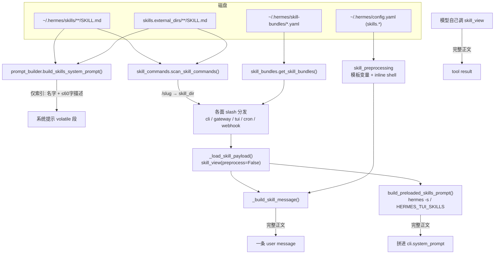

# R9A 底稿 · skills 在 agent 进程内的接入面

**范围**:`agent/skill_utils.py`(934) / `agent/skill_commands.py`(812) /
`agent/skill_bundles.py`(438) / `agent/skill_preprocessing.py`(144),合计 2,328 行。
**基线**:`/home/user/hermes-agent` @ `863e31318553cda8ad61df681d08175364d4164b`(只读,本轮全程未写入)。
**溯源约定**:每条断言前单独一行 `路径:行号 @ 863e313`,紧跟基线源码逐字块;
我自己跑出来的东西一律用 ```console` / ```verify` 围栏标注,不冒充源码。

**边界说明**:`tools/skills_tool.py`(`skill_view` / `skills_list` / `SKILLS_DIR` 扫描)、
`tools/skill_manager_tool.py`、`tools/skill_usage.py`、`hermes_cli/skills_hub.py`
由本轮另一位子代理负责;本底稿只把它们当**接口**读——凡引用都限于
「这个函数返回什么字段、这个字段被我这一侧怎么消费」,不逐行分析其内部。

---

## 0. 一页结论

1. **skill 内容不进系统提示。** 系统提示里只有一份**索引**(名字 + ≤60 字描述,按 category 分组);
   完整正文只在两种时刻进入模型输入:模型主动调 `skill_view`(工具结果),或用户敲
   `/<skill>` / `/<bundle>`(**展开成一条 user message**)。唯一的例外是 CLI 的
   `-s/--skills` 会话级预载,它把正文拼进 **system_prompt**。
2. **token 预算靠"索引 vs 正文"的量级差撑住,而不是靠截断。** 实测 71 个内置 skill 的
   SKILL.md 合计 837,338 字符,而它们在系统提示索引里合计只有 5,376 字符——**155.8 倍**。
   `_build_skill_message` 这一层**对正文长度没有任何上限**:最大的一个内置 skill 展开成
   **108,387 字符(约 27k token)的单条 user message**。
3. **截断只发生在三个别的地方**:描述 60 字(索引)、`compact_categories` 把整个 category
   降级成"只列名"(coding posture)、inline-shell 输出 4000 字符。正文本身进了对话之后,
   归压缩器管(`[SKILL_PRUNED: ...]` 幽灵 skill 防御),不归本簇管。
4. **失败一律"跳过 + 记 WARNING",没有任何一处会让本轮崩掉。** 坏 YAML 走
   key:value 回退解析(skill 照样注册)、文件在扫描后被删则整条调用返回 `None`、
   bundle 引用了不存在的 skill 则少装一个并在 header 里点名。
5. 本轮定案 **4 个 ■、2 个 ▲、5 个 ◇**,全部有可复现判据,见第 10 节。其中最值得记住的两个:
   - 插件 skill(`ns:name`)走 bundle / `-s` 路径时 **`${HERMES_SKILL_DIR}` 不会被替换**,
     模型收到的是字面量 `${HERMES_SKILL_DIR}`,而这个环境变量**全仓从不导出到任何子进程**;
   - TUI/桌面的 rewind 重放**只会还原第一个 skill**:bundle 整个丢失、stacked 调用只留第一个。

---

## 1. 从一次 `/demo do the thing` 说起

先把问题演出来。我在临时 `HERMES_HOME` 里放一个 skill,它声明了一个 config 变量、
带一个 `scripts/go.js`、正文里用了两个模板变量,然后走真实代码路径构造消息:

```console
$ HERMES_HOME=$SC/h2 python -c "from agent.skill_commands import ...; build_skill_invocation_message('/demo','do the thing',task_id='sess-123')"

[IMPORTANT: The user has invoked the "demo" skill, indicating they want you to follow its instructions. The full skill content is loaded below.]

---
name: demo
description: A demo skill used to observe the injected message shape end to end.
metadata:
  hermes:
    config:
      - key: demo.path
        description: Where demo data lives
        default: "~/demo-data"
---

# Demo

Run: node /…/h2/skills/demo/scripts/go.js
Session: sess-123

[Skill directory: /…/h2/skills/demo]
Resolve any relative paths in this skill (e.g. `scripts/foo.js`, `templates/config.yaml`) against that directory, then run them with the terminal tool using the absolute path.

[Skill config (from /…/h2/config.yaml):
  demo.path = /root/from-config
]

[This skill has supporting files:]
- scripts/go.js  ->  /…/h2/skills/demo/scripts/go.js

Load any of these with skill_view(name="demo", file_path="<path>"), or run scripts directly by absolute path (e.g. `node /…/h2/skills/demo/scripts/foo.js`).

The user has provided the following instruction alongside the skill invocation: do the thing
```

一条消息里有 **7 段**,顺序固定:

| # | 段 | 谁生成 | 作用 |
|---|---|---|---|
| 1 | `[IMPORTANT: The user has invoked …]` 激活语 | 调用方(单 skill / bundle / stacked / 预载 各一句) | 告诉模型"这是用户主动装的,照做" |
| 2 | SKILL.md 正文(**含 YAML frontmatter 原文**) | `skill_view` 读文件 → 预处理 | 真内容 |
| 3 | `[Skill directory: …]` + 一句"用绝对路径跑" | `_build_skill_message` | 省掉一次 `skill_view` 往返 |
| 4 | `[Skill config (from …/config.yaml): …]` | `_inject_skill_config` | 模型不用自己去读 config.yaml |
| 5 | `[Skill setup note: …]`(可选) | `skill_view` 的 setup 三态 | 缺凭据时先告诉模型 |
| 6 | `[This skill has supporting files:]` 清单 | `_build_skill_message` | progressive disclosure 的目录 |
| 7 | 用户指令 / `[Runtime note: …]` | 调用方 | 用户实际想干什么 |

三个细节现在就要记住,后面反复用到:

- **frontmatter 是原样进模型的**,没有剥。上面 `---name: demo…---` 那一段是真的发给模型了。
- **模板变量在正文里已经被替换成绝对路径**(`${HERMES_SKILL_DIR}` → `/…/h2/skills/demo`),
  而 `${HERMES_SESSION_ID}` → `sess-123`;没有 session 时保留字面量(下面实测)。
- **第 4 段的值来自 config.yaml 的嵌套路径**,不是扁平点号键。

---

## 2. 全景:三条注入路径



三条路径的定位完全不同,值得单独说清:

**路径 A(索引进系统提示)**——`agent/system_prompt.py` 判断这个 agent 有没有 skills 工具:

`agent/system_prompt.py:299 @ 863e313`

```python
    has_skills_tools = any(name in agent.valid_tool_names for name in ['skills_list', 'skill_view', 'skill_manage'])
    if has_skills_tools:
```

`agent/system_prompt.py:321 @ 863e313`

```python
        skills_prompt = _r.build_skills_system_prompt(
            available_tools=agent.valid_tool_names,
            available_toolsets=avail_toolsets,
            compact_categories=_compact_cats or None,
        )
```

索引被放进 **volatile 段的最前面**,这里有一段解释得极清楚的 prompt-cache 权衡:

`agent/system_prompt.py:500 @ 863e313`

```python
    # Skills are runtime-mutable: the agent adds and patches them across a
    # session (SKILLS_GUIDANCE tells it to patch a skill the moment it goes
    # stale). The built prompt is cached per session and only rebuilt on
    # compaction/restore (see build_system_prompt), so a skill change is not
    # byte-stable across rebuilds. With the index in the stable band, a rebuild
    # that picked up a skill change would bust the cached prefix from the index
    # down, taking the whole scaffold with it. Render it at the FRONT of the
    # volatile band instead, ahead of the turn-varying memory/timestamp tail:
    # on an implicit longest-prefix backend an unchanged index still falls
    # inside the reused prefix, and a changed one only re-prefills from here on.
    # (No effect for single-block cache_control backends, where the whole
    # system message is one cache unit regardless of internal order.)
    if skills_prompt:
        volatile_parts.append(skills_prompt)
```

> **可迁移设计**:"哪些内容放系统提示的哪一段"不是审美问题,是**缓存前缀边界问题**。
> 一个会在会话中被 agent 自己改写的块(skills 索引)如果放进 stable 段,任何一次改写都会
> 让 stable 段之后的一切失效;放到 volatile 段最前面,改写只让它自己往后的部分重算。

**路径 B(正文进 user message)**——slash 命令。这是本簇的主线,第 5、6 节展开。

**路径 C(正文进 system prompt)**——只有 CLI 的 `-s/--skills` 走这里:

`cli.py:18190 @ 863e313`

```python
    if parsed_skills:
        skills_prompt, loaded_skills, missing_skills = build_preloaded_skills_prompt(
            parsed_skills,
            task_id=cli.session_id,
        )
```

紧接着把 `skills_prompt` 用 `"\n\n".join` 接到 `cli.system_prompt` 后面:

`cli.py:18212 @ 863e313`

```python
        if skills_prompt:
            cli.system_prompt = "\n\n".join(
                part for part in (cli.system_prompt, skills_prompt) if part
            ).strip()
```

**这是全仓唯一把 skill 正文写进系统提示的地方**(搜索面:`grep -rn "build_preloaded_skills_prompt" --include=*.py`
非测试命中 4 处,全在 `cli.py`,其中 3 处是转发壳和定义)。

---

## 3. `agent/skill_utils.py` —— 元数据地基

模块的自我定位很明确,后面第 10 节的 ■-4 就是拿这句话对照的:

`agent/skill_utils.py:1 @ 863e313`

```python
"""Lightweight skill metadata utilities shared by prompt_builder and skills_tool.

This module intentionally avoids importing the tool registry, CLI config, or any
heavy dependency chain.  It is safe to import at module level without triggering
tool registration or provider resolution.
"""
```

### 3.1 发现:什么算一个 skill

**问题场景**:用户把一个 skill 归档到 `some-skill/references/old-package/SKILL.md`;
或者一个 skill 目录里恰好有 `node_modules`。天真的 `rglob("SKILL.md")` 会把这些当成新 skill,
索引里凭空多出一堆幽灵条目。

解法是把"排除集"集中定义,并区分**两类**排除:硬排除目录 vs **support 目录**。

`agent/skill_utils.py:46 @ 863e313`

```python
# Supporting files live inside a skill package and are loaded explicitly via
# skill_view(skill, file_path=...). They are not standalone skills and must not
# be scanned for active SKILL.md/DESCRIPTION.md entries, even if a Curator or
# archive workflow preserves a complete old skill package under references/.
SKILL_SUPPORT_DIRS = frozenset(("references", "templates", "assets", "scripts"))
```

关键在于 support 目录的判定是**上下文相关**的——`scripts` 只有在"它的父目录里有 SKILL.md"时
才算 support 目录,否则 `skills/scripts/foo` 这个正当的分类名就会被误杀:

`agent/skill_utils.py:122 @ 863e313`

```python
def is_skill_support_path(path, *, root: Optional[Path] = None) -> bool:
    """True if *path* is under a support dir of an actual skill root.

    ``references/``, ``templates/``, ``assets/``, and ``scripts/`` are
    progressive-disclosure support areas when they sit directly inside a skill
    directory containing ``SKILL.md``. They are not active discovery roots for
    standalone skills. A preserved package such as
    ``some-skill/references/old-skill-package/SKILL.md`` is documentation data
    unless the caller explicitly loads it via ``file_path``.

    Legitimate categories or skill names such as ``skills/scripts/foo`` remain
    discoverable because their ``scripts`` component is not directly under a
    directory that contains ``SKILL.md``.
    """
    path_obj = path if isinstance(path, Path) else Path(str(path))
    parts = path_obj.parts
    # Last component may be a file or candidate skill directory name. Only
    # components before the leaf can be containing support directories.
    for idx, part in enumerate(parts[:-1]):
        if part not in SKILL_SUPPORT_DIRS or idx == 0:
            continue
        skill_root = Path(*parts[:idx])
        if root is not None and not path_obj.is_absolute():
            skill_root = root / skill_root
        if (skill_root / "SKILL.md").exists():
            return True
    return False
```

真正的遍历器把这套规则做进了 `os.walk` 的 `dirs[:]` 剪枝里(比走完再过滤便宜得多),
顺带承担了 org 镜像的**令牌门控**:

`agent/skill_utils.py:877 @ 863e313`

```python
def iter_skill_index_files(skills_dir: Path, filename: str):
    """Walk skills_dir yielding sorted paths matching *filename*.

    Excludes Hermes metadata, VCS, virtualenv/dependency, cache, and skill
    support directories. Support directories (references/templates/assets/
    scripts) can contain arbitrary markdown and even archived package
    ``SKILL.md`` files, but they are progressive-disclosure data loaded through
    ``skill_view(..., file_path=...)`` rather than active skill roots.

    M2 org mirrors (``_org/``): TOKEN-GATED resolution. Only the active org's
    subdir (per the sync-client-written ``.active_org`` marker) is walked;
    every other ``_org/<id>/`` (stale mirror from a previous org, or no
    marker at all) is pruned — leave an org and its skills stop resolving,
    without any manual cleanup.
    """
    skills_dir_str = str(skills_dir)
    active_org = read_active_org_id(skills_dir)
    org_root = os.path.join(skills_dir_str, ORG_MIRROR_DIR_NAME)
    matches: list[str] = []
    for root, dirs, files in os.walk(skills_dir_str, followlinks=True):
        has_skill_md = "SKILL.md" in files
        if root == skills_dir_str and ORG_MIRROR_DIR_NAME in dirs and active_org is None:
            dirs.remove(ORG_MIRROR_DIR_NAME)
        elif root == org_root:
            # Inside _org/: descend ONLY into the active org's mirror.
            dirs[:] = [d for d in dirs if d == active_org]
        dirs[:] = [
            d
            for d in dirs
            if d not in EXCLUDED_SKILL_DIRS
            and not (has_skill_md and d in SKILL_SUPPORT_DIRS)
        ]
        if filename in files:
            matches.append(os.path.join(root, filename))
    for path in sorted(matches):
        yield Path(path)
```

> **可迁移设计**:"退出组织后组织的 skill 自动失效"被实现成**遍历时剪枝**而不是删文件。
> marker 文件在,离线也能继续用;marker 一改,整棵子树立刻不可见。数据留着、可见性受控,
> 这比"同步时删本地文件"安全得多(后者一次误判就永久毁数据)。

### 3.2 frontmatter 解析:两条容错

**问题场景一**:Windows 用记事本存 SKILL.md,文件头多一个 BOM(U+FEFF)。
`content.startswith("---")` 直接为假,整块 frontmatter 被静默丢弃——名字没了、描述没了、
`platforms` 门控没了。这个 bug 极难被发现,因为文件肉眼看完全正常。

`agent/skill_utils.py:174 @ 863e313`

```python
def parse_frontmatter(content: str) -> Tuple[Dict[str, Any], str]:
    """Parse YAML frontmatter from a markdown string.

    Uses yaml with CSafeLoader for full YAML support (nested metadata, lists)
    with a fallback to simple key:value splitting for robustness.

    A single leading UTF-8 BOM (U+FEFF) is stripped before parsing. Windows
    GUI editors (Notepad, PowerShell ``>``) prepend one when saving a SKILL.md
    as UTF-8, and ``read_text(encoding="utf-8")`` preserves it (only
    ``utf-8-sig`` strips it). Left in place, the BOM defeats the ``---`` fence
    check below and the whole frontmatter is silently discarded — name,
    description, ``platforms`` gating, env-var setup, and conditional
    activation all vanish. See CONTRIBUTING.md "File encoding".

    Returns:
        (frontmatter_dict, remaining_body)
    """
```

**问题场景二**:frontmatter 是坏 YAML(比如引号没闭合)。整个 skill 应该消失吗?不。
这里走**逐行 `key: value` 回退**——尽量把 `name:` 抢救出来,让 skill 至少还能被调用:

`agent/skill_utils.py:191 @ 863e313`

```python
    frontmatter: Dict[str, Any] = {}

    # Strip only a leading BOM; a BOM mid-content is data, not a marker.
    if content.startswith("\ufeff"):
        content = content[1:]
    body = content

    if not content.startswith("---"):
        return frontmatter, body

    end_match = re.search(r"\n---\s*\n", content[3:])
    if not end_match:
        return frontmatter, body

    yaml_content = content[3 : end_match.start() + 3]
    body = content[end_match.end() + 3 :]

    try:
        parsed = yaml_load(yaml_content)
        if isinstance(parsed, dict):
            frontmatter = parsed
    except Exception:
        # Fallback: simple key:value parsing for malformed YAML
        for line in yaml_content.strip().split("\n"):
            if ":" not in line:
                continue
            key, value = line.split(":", 1)
            frontmatter[key.strip()] = value.strip()

    return frontmatter, body
```

我实测了这条回退(见第 8 节表格第 1 行):一个 `description: "unterminated` 的坏 SKILL.md
仍然注册成 `/broken`,`name` 被正确抢救,而 `description` 变成了垃圾字符串 `"unterminated`。
**这是有意的取舍:宁可让描述难看,也不让 skill 消失。**

注意 `tools/skills_tool._parse_frontmatter` 只是这个函数的再导出壳,不是第二份实现:

`tools/skills_tool.py:553 @ 863e313`

```python
def _parse_frontmatter(content: str) -> Tuple[Dict[str, Any], str]:
    """Parse YAML frontmatter from markdown content.

    Delegates to ``agent.skill_utils.parse_frontmatter`` — kept here
    as a public re-export so existing callers don't need updating.
    """
    from agent.skill_utils import parse_frontmatter
    return parse_frontmatter(content)
```

### 3.3 三道过滤:platforms / environments / disabled

三道门的语义**故意不一样**,这是本簇最值得学的设计之一:

| 门 | 字段 | 语义 | 显式加载能不能绕过 |
|---|---|---|---|
| `platforms` | frontmatter `platforms: [macos]` | **硬兼容**:这个 skill 在当前 OS 上根本没法用 | 不能。`skill_view` 直接返回 `success: false` |
| `environments` | frontmatter `environments: [kanban]` | **相关性**:能用,但当前场景下是噪音 | **能**。offer-time only |
| `disabled` | config.yaml `skills.disabled` | **用户/运维意愿** | 不能(但 R9A 发现两条历史绕过口子,已被专门补上) |

environments 这道门的注释把"为什么它是软的"讲得很清楚:

`agent/skill_utils.py:351 @ 863e313`

```python
def skill_matches_environment(frontmatter: Dict[str, Any]) -> bool:
    """Return True when the skill is relevant to the current runtime environment.

    Skills may declare an ``environments`` list in their YAML frontmatter::

        environments: [kanban]        # only relevant when kanban is active
        environments: [s6]            # only relevant inside the s6 Docker image
        environments: [docker]        # only relevant inside any container

    If the field is absent or empty the skill is relevant in **all**
    environments (backward-compatible default).

    This is an OFFER-time filter: it controls whether a skill shows up in the
    skills index / autocomplete / slash-command list. It is intentionally NOT
    enforced by ``skill_view`` or ``--skills`` preloading — an explicit load is
    explicit consent, and load-bearing force-loads (e.g. a dispatcher pinning
    a task to a specialist skill via ``--skills``) must always succeed
    regardless of how the offer surfaces filter the skill.

    A skill matches when ANY of its declared environments is currently active
    (OR semantics, mirroring ``platforms``). Unknown env tags fail open.
    """
```

"不认识的标签 fail open"是显式写进实现的——这样一个新版本引入的新 env 标签不会让旧版本
把整批 skill 藏起来:

`agent/skill_utils.py:373 @ 863e313`

```python
    environments = frontmatter.get("environments")
    if not environments:
        return True
    if not isinstance(environments, list):
        environments = [environments]
    for env in environments:
        normalized = str(env).lower().strip()
        if not normalized:
            continue
        if normalized not in _KNOWN_ENVIRONMENTS:
            # Tag we don't understand — don't hide the skill over it.
            return True
        if _detect_environment(normalized):
            return True
    return False
```

`_KNOWN_ENVIRONMENTS` 只有三个值,且检测结果按进程缓存——**但 `kanban` 故意不缓存**,
因为它的判定依赖"这次执行是不是真的拥有 dispatcher 的任务",而 `delegate_task` 子进程
和 in-process cron 会看到 worker 的环境变量却并不是那个 worker:

`agent/skill_utils.py:279 @ 863e313`

```python
# the skills index / offer surfaces so it does not add noise for users who will
# never need it — but it can ALWAYS still be loaded explicitly (``skill_view``,
# ``--skills``), because an explicit request is explicit consent.
#
# Detection is cached for the process lifetime via ``_ENV_DETECT_CACHE``.
_KNOWN_ENVIRONMENTS = frozenset({"kanban", "docker", "s6"})

_ENV_DETECT_CACHE: Dict[str, bool] = {}

```

disabled 这道门读 config 的方式很有意思——**不走 `hermes_cli.config`**,自己开一个
mtime+size 键控的小缓存,理由写在 docstring 里:

`agent/skill_utils.py:401 @ 863e313`

```python
def _load_raw_config() -> Dict[str, Any]:
    """Read config.yaml with a shared mtime+size keyed cache.

    This module intentionally avoids importing ``hermes_cli.config`` on the
    skill prompt/build path. A tiny local cache gives the same repeated-read
    win without pulling the heavier CLI config stack into startup.
    """
    config_path = get_config_path()
    if not config_path.exists():
        return {}
    try:
        stat = config_path.stat()
        cache_key = (str(config_path), stat.st_mtime_ns, stat.st_size)
    except OSError:
        cache_key = None

    if cache_key is not None:
        cached = _RAW_CONFIG_CACHE.get(cache_key)
        if cached is not None:
            return cached

    try:
        parsed = yaml_load(config_path.read_text(encoding="utf-8"))
    except Exception as e:
        logger.debug("Could not read skill config %s: %s", config_path, e)
        return {}
    if not isinstance(parsed, dict):
        return {}

    if cache_key is not None:
        _RAW_CONFIG_CACHE.clear()
        _RAW_CONFIG_CACHE[cache_key] = parsed
    return parsed

```

而 disabled 名单的**平台并集**语义是"全局禁用在每个平台都生效",不是"平台覆盖全局":

`agent/skill_utils.py:450 @ 863e313`

```python
    parsed = _load_raw_config()
    if not parsed:
        return set()

    skills_cfg = parsed.get("skills")
    if not isinstance(skills_cfg, dict):
        return set()

    from gateway.session_context import get_session_env
    resolved_platform = (
        platform
        or os.getenv("HERMES_PLATFORM")
        or get_session_env("HERMES_SESSION_PLATFORM")
    )
    global_disabled = _normalize_string_set(skills_cfg.get("disabled"))
    if resolved_platform:
        platform_disabled = (skills_cfg.get("platform_disabled") or {}).get(
            resolved_platform
        )
        if platform_disabled is not None:
            return global_disabled | _normalize_string_set(platform_disabled)
    return global_disabled
```

注意第 458 行那个**没有 try 包裹**的 `from gateway.session_context import get_session_env`
——这是 ■-4,见第 10 节。

### 3.4 `normalize_skill_lookup_name`:安全边界的转接口

**问题场景**:slash 命令扫描出来的是**绝对路径**(`skill_md.parent`),但 `skill_view()`
出于安全**拒绝绝对路径名**。而且 `~/.hermes/skills/<name>` 常常是一个指向别处 checkout 的
**符号链接**——如果先 `resolve()` 再判断,那个受信任的可见路径就变成了任意绝对路径,
`skill_view` 会拒收。

`agent/skill_utils.py:593 @ 863e313`

```python
def normalize_skill_lookup_name(identifier: str) -> str:
    """Normalize a skill identifier to a ``skill_view()``-safe relative path.

    Slash commands and cron jobs may store absolute paths to skills that live
    under ``~/.hermes/skills/`` (including via symlinks) or configured
    ``skills.external_dirs``. ``skill_view()`` rejects absolute names for
    security, so callers must translate trusted absolute paths to their
    relative form first.
    """
```

两个细节都很讲究。其一,主根是**调用时**从 `tools.skills_tool.SKILLS_DIR` 现取,
不是 `get_skills_dir()`——因为 `skill_view()` 自己就是按那个模块属性校验的,
两边必须看同一个根:

`agent/skill_utils.py:602 @ 863e313`

```python
    raw_identifier = (identifier or "").strip()
    if not raw_identifier:
        return raw_identifier

    identifier_path = Path(raw_identifier).expanduser()
    if not identifier_path.is_absolute():
        return raw_identifier.lstrip("/")

    # Look the primary skills root up on tools.skills_tool at CALL time
    # (not via get_skills_dir()): callers and tests patch
    # ``tools.skills_tool.SKILLS_DIR`` and skill_view() itself resolves
    # against that module attribute, so normalization must agree with the
    # exact root skill_view() will enforce.  Import deferred to avoid a
    # module cycle (tools.skills_tool imports agent.skill_utils).
    try:
        from tools import skills_tool as _skills_tool
        primary_root = Path(_skills_tool.SKILLS_DIR)
    except Exception:
        primary_root = get_skills_dir()
```

其二,**先按词法相对化,失败了才 resolve**:

`agent/skill_utils.py:628 @ 863e313`

```python
    # Prefer the lexical path under a trusted skill root before resolving
    # symlinks. Slash-command discovery can legitimately find a skill via
    # ~/.hermes/skills/<name> where <name> is a symlink to a checked-out
    # skill elsewhere. Resolving first turns that trusted visible path into
    # an arbitrary absolute path that skill_view() refuses to load.
    for root in trusted_roots:
        try:
            return str(identifier_path.relative_to(root))
        except ValueError:
            continue

    try:
        return str(identifier_path.resolve().relative_to(primary_root.resolve()))
    except Exception:
        logger.debug(
            "Skill identifier %r is an absolute path outside trusted skills "
            "roots — passing through unchanged (skill_view will reject it)",
            raw_identifier,
        )
        return raw_identifier
```

**顺带一个重要副作用**:非绝对路径的 identifier 原样返回(只剥前导 `/`)。
`myplug:plugdemo` 这种带命名空间的名字因此能穿过去,直接命中 `skill_view` 的插件分支——
这是 ■-1 的入口。

### 3.5 skill 声明的 config 变量

**问题场景**:一个 wiki skill 需要知道用户的 wiki 目录在哪。让模型每次去读 config.yaml
既费 token 又容易读错。于是 skill 在 frontmatter 里**声明**自己要什么键:

`agent/skill_utils.py:701 @ 863e313`

```python
def extract_skill_config_vars(frontmatter: Dict[str, Any]) -> List[Dict[str, Any]]:
    """Extract config variable declarations from parsed frontmatter.

    Skills declare config.yaml settings they need via::

        metadata:
          hermes:
            config:
              - key: wiki.path
                description: Path to the LLM Wiki knowledge base directory
                default: "~/wiki"
                prompt: Wiki directory path

    Returns a list of dicts with keys: ``key``, ``description``, ``default``,
    ``prompt``.  Invalid or incomplete entries are silently skipped.
    """
```

抽取时"不完整就跳过"是一条一条静默做的(缺 `key` 或缺 `description` 都直接 `continue`),
`prompt` 缺省回落到 `description`:

`agent/skill_utils.py:731 @ 863e313`

```python
    result: List[Dict[str, Any]] = []
    seen: set = set()
    for item in raw:
        if not isinstance(item, dict):
            continue
        key = str(item.get("key", "")).strip()
        if not key or key in seen:
            continue
        # Must have at least key and description
        desc = str(item.get("description", "")).strip()
        if not desc:
            continue
        entry: Dict[str, Any] = {
            "key": key,
            "description": desc,
        }
        default = item.get("default")
        if default is not None:
            entry["default"] = default
        prompt_text = item.get("prompt")
        if isinstance(prompt_text, str) and prompt_text.strip():
            entry["prompt"] = prompt_text.strip()
        else:
            entry["prompt"] = desc
        seen.add(key)
        result.append(entry)
    return result
```

存储侧有一个**很容易踩的坑**:逻辑键 `wiki.path` 会被加上前缀存成 `skills.config.wiki.path`,
而 `_resolve_dotpath` 是**按每个点都下钻一层**的:

`agent/skill_utils.py:799 @ 863e313`

```python
# Storage prefix: all skill config vars are stored under skills.config.*
# in config.yaml.  Skill authors declare logical keys (e.g. "wiki.path");
# the system adds this prefix for storage and strips it for display.
SKILL_CONFIG_PREFIX = "skills.config"


def _resolve_dotpath(config: Dict[str, Any], dotted_key: str):
    """Walk a nested dict following a dotted key.  Returns None if any part is missing."""
    parts = dotted_key.split(".")
    current = config
    for part in parts:
        if isinstance(current, dict) and part in current:
            current = current[part]
        else:
            return None
    return current

```

也就是说 config.yaml 里**必须**是
`skills: {config: {wiki: {path: ...}}}`,写成 `skills: {config: {"wiki.path": ...}}` 读不到。
我第一次实测就写错了这个形状,得到了"配置了却拿到默认值"的现象;改成嵌套后正确:

```console
# 扁平键 skills.config."demo.path": "~/from-config"
  demo.path = /root/demo-data      ← 落回 default,不是配置值
# 嵌套键 skills.config.demo.path: "~/from-config"
  demo.path = /root/from-config    ← 正确
```

写入侧是一致的——同一个点号串被逐段下钻着写回去:

`hermes_cli/config.py:2399 @ 863e313`

```python
                if value:
                    storage_key = f"{SKILL_CONFIG_PREFIX}.{var['key']}"
                    _set_nested(config, storage_key, value)
                    results["config_added"].append(var["key"])
```

所以**只要走 `hermes update` / `hermes config set` 就不会踩**;手改 config.yaml 会踩。
这不是 ■(读写两侧自洽),但是一条必须写进设计蓝图的**格式契约**。

取值时 `~` 和 `${VAR}` 会被展开:

`agent/skill_utils.py:817 @ 863e313`

```python
def resolve_skill_config_values(
    config_vars: List[Dict[str, Any]],
) -> Dict[str, Any]:
    """Resolve current values for skill config vars from config.yaml.

    Skill config is stored under ``skills.config.<key>`` in config.yaml.
    Returns a dict mapping **logical** keys (as declared by skills) to their
    current values (or the declared default if the key isn't set).
    Path values are expanded via ``os.path.expanduser``.
    """
    config = _load_raw_config()

    resolved: Dict[str, Any] = {}
    for var in config_vars:
        logical_key = var["key"]
        storage_key = f"{SKILL_CONFIG_PREFIX}.{logical_key}"
        value = _resolve_dotpath(config, storage_key)

        if value is None or (isinstance(value, str) and not value.strip()):
            value = var.get("default", "")

        # Expand ~ in path-like values
        if isinstance(value, str) and ("~" in value or "${" in value):
            value = os.path.expanduser(os.path.expandvars(value))

        resolved[logical_key] = value

    return resolved
```

### 3.6 60 字描述预算 —— 全仓唯一一处"为 token 预算而截断"的常量

`agent/skill_utils.py:847 @ 863e313`

```python
# ── Description extraction ────────────────────────────────────────────────

SKILL_PROMPT_DESC_LIMIT = 60


def _normalize_skill_description(frontmatter: Dict[str, Any]) -> str:
    """Normalize a skill's description field for comparison/truncation."""
    raw_desc = frontmatter.get("description", "")
    return str(raw_desc).strip().strip("'\"") if raw_desc else ""


def extract_skill_description(frontmatter: Dict[str, Any]) -> str:
    """Extract a system-prompt-length description from parsed frontmatter."""
    desc = _normalize_skill_description(frontmatter)
    if not desc:
        return ""
    if len(desc) > SKILL_PROMPT_DESC_LIMIT:
        return desc[:SKILL_PROMPT_DESC_LIMIT - 3] + "..."
    return desc


def is_skill_description_truncated_for_prompt(frontmatter: Dict[str, Any]) -> bool:
    """True when the description will be truncated in the system prompt skill index."""
    desc = _normalize_skill_description(frontmatter)
    return len(desc) > SKILL_PROMPT_DESC_LIMIT
```

这个常量是**双向**用的:索引渲染时截断,`skill_manage` 创建 skill 时反过来**预警作者**
("你这句会被截成 …"),所以 60 不是一个隐藏的实现细节,而是对 skill 作者公开的写作约束。
实测 71 个内置 skill 里只有 **1 个**超过 60 字——这条约束是真的被执行了。

---

## 4. `agent/skill_preprocessing.py` —— 注入前的两次变换

144 行,是四个文件里最小的一个,但它是**唯一会在注入前执行任意宿主命令**的地方,
安全上最敏感。

### 4.1 两条正则 + 一个上限,就是全部的"变换语言"

`agent/skill_preprocessing.py:12 @ 863e313`

```python
# Matches ${HERMES_SKILL_DIR} / ${HERMES_SESSION_ID} tokens in SKILL.md.
# Tokens that don't resolve (e.g. ${HERMES_SESSION_ID} with no session) are
# left as-is so the user can debug them.
_SKILL_TEMPLATE_RE = re.compile(r"\$\{(HERMES_SKILL_DIR|HERMES_SESSION_ID)\}")

# Matches inline shell snippets like:  !`date +%Y-%m-%d`
# Non-greedy, single-line only -- no newlines inside the backticks.
_INLINE_SHELL_RE = re.compile(r"!`([^`\n]+)`")

# Cap inline-shell output so a runaway command can't blow out the context.
_INLINE_SHELL_MAX_OUTPUT = 4000
```

**只认两个 token,白名单硬编码在正则里**。这是有意的:如果做成"替换任意 `${VAR}`",
一个 SKILL.md 就能把宿主环境变量(含密钥)拉进模型输入。**未解析的 token 保留原样**
而不是替换成空串——空串会让 `node ${HERMES_SKILL_DIR}/x.js` 静默变成 `node /x.js`,
留着字面量至少能被人看见。

`agent/skill_preprocessing.py:54 @ 863e313`

```python
    def _replace(match: re.Match) -> str:
        token = match.group(1)
        if token == "HERMES_SKILL_DIR" and skill_dir_str:
            return skill_dir_str
        if token == "HERMES_SESSION_ID" and session_id:
            return str(session_id)
        return match.group(0)

    return _SKILL_TEMPLATE_RE.sub(_replace, content)
```

实测(第 1 节那次没有 session 的运行)确认:`Session: ${HERMES_SESSION_ID}` 原样保留。

### 4.2 inline shell:一个默认关闭的、无审批的执行面

`agent/skill_preprocessing.py:72 @ 863e313`

```python
    try:
        completed = subprocess.run(
            ["bash", "-c", command],
            cwd=str(cwd) if cwd else None,
            capture_output=True,
            text=True, encoding='utf-8', errors='replace',
            timeout=max(1, int(timeout)),
            check=False,
            stdin=subprocess.DEVNULL,
            **_popen_kwargs,
        )
    except subprocess.TimeoutExpired:
```

几个细节值得抄:`stdin=subprocess.DEVNULL`(片段不能挂在等输入上)、
`errors='replace'`(输出编码坏了不抛异常)、`timeout=max(1, ...)`(配 0 也至少给 1 秒)、
`check=False`(非零退出不抛)。

异常侧把**测试守卫**也当成超时处理——这是个很实际的工程细节,
`tests/conftest.py` 的 live-system guard 会拦 `os.kill`,而 `subprocess.run(timeout=)`
清理超时进程时正好会撞上它:

`agent/skill_preprocessing.py:83 @ 863e313`

```python
    except subprocess.TimeoutExpired:
        return f"[inline-shell timeout after {timeout}s: {command}]"
    except FileNotFoundError:
        return "[inline-shell error: bash not found]"
    except RuntimeError as exc:
        # tests/conftest.py installs a live-system guard that blocks real
        # os.kill on out-of-tree PIDs. subprocess.run(timeout=...) may trip
        # that guard while trying to clean up the timed-out shell; treat that
        # as the same timeout outcome instead of surfacing the guard error.
        if "live-system guard: blocked os.kill" in str(exc):
            return f"[inline-shell timeout after {timeout}s: {command}]"
        return f"[inline-shell error: {exc}]"
    except Exception as exc:
        return f"[inline-shell error: {exc}]"
```

输出处理是 **stdout 优先、空则回退 stderr、最后截断**:

`agent/skill_preprocessing.py:98 @ 863e313`

```python
    output = (completed.stdout or "").rstrip("\n")
    if not output and completed.stderr:
        output = completed.stderr.rstrip("\n")
    if len(output) > _INLINE_SHELL_MAX_OUTPUT:
        output = output[:_INLINE_SHELL_MAX_OUTPUT] + "...[truncated]"
    return output
```

**这一段就是 ▲-1 的判据**(见第 10 节):非零退出**不产生任何标记**,只把 stderr 原样贴进去。

### 4.3 两个开关,一个入口

`agent/skill_preprocessing.py:128 @ 863e313`

```python
def preprocess_skill_content(
    content: str,
    skill_dir: Path | None,
    session_id: str | None = None,
    skills_cfg: dict | None = None,
) -> str:
    """Apply configured SKILL.md template and inline-shell preprocessing."""
    if not content:
        return content

    cfg = skills_cfg if isinstance(skills_cfg, dict) else load_skills_config()
    if cfg.get("template_vars", True):
        content = substitute_template_vars(content, skill_dir, session_id)
    if cfg.get("inline_shell", False):
        timeout = int(cfg.get("inline_shell_timeout", 10) or 10)
        content = expand_inline_shell(content, skill_dir, timeout)
    return content
```

默认值的不对称是刻意的:**`template_vars` 默认 True(纯字符串替换,无副作用),
`inline_shell` 默认 False(执行宿主命令)**。配置默认在这里定义:

`hermes_cli/config_defaults.py:1788 @ 863e313`

```python
    # Skills — external skill directories for sharing skills across tools/agents.
    # Each path is expanded (~, ${VAR}) and resolved.  Read-only — skill creation
    # always goes to ~/.hermes/skills/.
    "skills": {
        "external_dirs": [],   # e.g. ["~/.agents/skills", "/shared/team-skills"]
        # Substitute ${HERMES_SKILL_DIR} and ${HERMES_SESSION_ID} in SKILL.md
        # content with the absolute skill directory and the active session id
        # before the agent sees it.  Lets skill authors reference bundled
        # scripts without the agent having to join paths.
        "template_vars": True,
        # Pre-execute inline shell snippets written as !`cmd` in SKILL.md
        # body.  Their stdout is inlined into the skill message before the
        # agent reads it, so skills can inject dynamic context (dates, git
        # state, detected tool versions, …).  Off by default because any
        # content from the skill author runs on the host without approval;
        # only enable for skill sources you trust.
        "inline_shell": False,
        # Timeout (seconds) for each !`cmd` snippet when inline_shell is on.
        "inline_shell_timeout": 10,
```

读配置的路径本身也是 best-effort 的——读不到就当空 dict,于是 `template_vars` 走默认 True:

`agent/skill_preprocessing.py:25 @ 863e313`

```python
def load_skills_config() -> dict:
    """Load the ``skills`` section of config.yaml (best-effort)."""
    try:
        from hermes_cli.config import load_config_readonly

        cfg = load_config_readonly() or {}
        skills_cfg = cfg.get("skills")
        if isinstance(skills_cfg, dict):
            return skills_cfg
    except Exception:
        logger.debug("Could not read skills config", exc_info=True)
    return {}
```

> **可迁移设计**:两个开关的**故障方向**相反。`template_vars` 读配置失败 → 打开(安全);
> `inline_shell` 读配置失败 → 关闭(安全)。判断一个默认值对不对,看它在"配置读不到"时
> 倒向哪边,而不是看它在正常路径上好不好用。

---

## 5. `agent/skill_commands.py` —— slash 面 + 消息构造

812 行,本簇的中枢。它同时是:slash 命令注册表、消息构造器、以及一组**给下游七八个模块用的
scaffolding 标记常量**。

### 5.1 扫描:从 SKILL.md 到 `/slug`

`agent/skill_commands.py:383 @ 863e313`

```python
    try:
        from tools.skills_tool import SKILLS_DIR, _parse_frontmatter, skill_matches_platform, skill_matches_environment, _get_disabled_skill_names
        from agent.skill_utils import get_external_skills_dirs, iter_skill_index_files
        from hermes_cli.commands import resolve_command
        disabled = _get_disabled_skill_names()
        seen_names: set = set()

        # Scan local dir first, then external dirs
        dirs_to_scan = []
        if SKILLS_DIR.exists():
            dirs_to_scan.append(SKILLS_DIR)
        dirs_to_scan.extend(get_external_skills_dirs())

        for scan_dir in dirs_to_scan:
            for skill_md in iter_skill_index_files(scan_dir, "SKILL.md"):
                if any(part in {'.git', '.github', '.hub', '.archive'} for part in skill_md.parts):
                    continue
                try:
```

**本地目录先扫、外部目录后扫**——加上后面的 first-wins 去重,这就是"本地优先"的实现。

三道过滤 + 描述兜底(frontmatter 没写 description 就抓正文第一行非注释行的前 80 字):

`agent/skill_commands.py:401 @ 863e313`

```python
                    content = skill_md.read_text(encoding='utf-8')
                    frontmatter, body = _parse_frontmatter(content)
                    # Skip skills incompatible with the current OS platform
                    if not skill_matches_platform(frontmatter):
                        continue
                    # Skip skills not relevant to the current runtime env
                    # (kanban/docker/s6). Offer-time only; explicit load bypasses.
                    if not skill_matches_environment(frontmatter):
                        continue
                    name = frontmatter.get('name', skill_md.parent.name)
                    if name in seen_names:
                        continue
                    # Respect user's disabled skills config
                    if name in disabled:
                        continue
                    description = frontmatter.get('description', '')
                    if not description:
                        for line in body.strip().split('\n'):
                            line = line.strip()
                            if line and not line.startswith('#'):
                                description = line[:80]
                                break
                    seen_names.add(name)
```

**注意这里的 description 没有走 60 字截断**——那是系统提示索引专用的。
slash 面用的是**完整** frontmatter 描述(`/help` 列表、Telegram BotCommand 菜单)。
这个不一致是被显式记录下来的:

`agent/skill_commands.py:509 @ 863e313`

```python
        ``description`` is the skill's full SKILL.md frontmatter
        ``description:`` field. Note: the system prompt skill index
        truncates this to the first 57 chars; see ``extract_skill_description``.
    """
```

slug 规范化 + **与核心命令的碰撞检测**:

`agent/skill_commands.py:424 @ 863e313`

```python
                    # Normalize to hyphen-separated slug, stripping
                    # non-alnum chars (e.g. +, /) to avoid invalid
                    # Telegram command names downstream.
                    cmd_name = name.lower().replace(' ', '-').replace('_', '-')
                    cmd_name = _SKILL_INVALID_CHARS.sub('', cmd_name)
                    cmd_name = _SKILL_MULTI_HYPHEN.sub('-', cmd_name).strip('-')
                    if not cmd_name:
                        continue
                    # Skip if this skill's auto-generated /command collides
                    # with a core Hermes slash command (name or alias). The
                    # skill remains fully loadable via /skill <name>.
                    # Uses resolve_command() so aliases and case variants are
                    # covered without maintaining a separate cache.
                    if resolve_command(cmd_name) is not None:
                        logger.warning(
                            "Skill %r generates slash command '/%s' which "
                            "collides with a core Hermes command; skipping "
                            "auto-registration. Use '/skill %s' instead.",
                            name, cmd_name, name,
                        )
                        continue
                    # Dedup on the resolved slug, not just the raw name: two
```

这条 `Use '/skill %s' instead` 是 **■-3**(全仓没有 `/skill` 这个命令),见第 10 节。

slug 级去重(而不是 name 级)是为了 `git_helper` 与 `git-helper` 这类归一化撞车:

`agent/skill_commands.py:446 @ 863e313`

```python
                    # distinct frontmatter names can normalize to the same
                    # slug (e.g. "git_helper" vs "git-helper"). First-wins
                    # preserves local-before-external precedence.
                    cmd_key = f"/{cmd_name}"
                    if cmd_key in _skill_commands:
                        logger.warning(
                            "Skill %r maps to slash command %s already claimed "
                            "by %r; keeping the first and skipping this one.",
                            name, cmd_key, _skill_commands[cmd_key]["name"],
                        )
                        continue
                    _skill_commands[cmd_key] = {
                        "name": name,
                        "description": description or f"Invoke the {name} skill",
                        "skill_md_path": str(skill_md),
                        "skill_dir": str(skill_md.parent),
                    }
                except Exception:
                    continue
    except Exception:
        pass
    return _skill_commands
```

最后那两层 `except` 是本簇失败哲学的浓缩:**单个 skill 出错 → `continue`(跳过它);
整个扫描出错 → `pass`(返回空表)**。任何情况下都不会把异常抛给调用方。
代价是**排障困难**:一个坏 skill 只在 DEBUG 之外完全无声(`except Exception: continue`
连日志都不打)。

### 5.2 `_load_skill_payload`:唯一的加载入口 + `preprocess=False` 的取舍

`agent/skill_commands.py:192 @ 863e313`

```python
def _load_skill_payload(skill_identifier: str, task_id: str | None = None) -> tuple[dict[str, Any], Path | None, str] | None:
    """Load a skill by name/path and return (loaded_payload, skill_dir, display_name)."""
    raw_identifier = (skill_identifier or "").strip()
    if not raw_identifier:
        return None

    try:
        from tools.skills_tool import SKILLS_DIR, skill_view
        from agent.skill_utils import normalize_skill_lookup_name

        normalized = normalize_skill_lookup_name(raw_identifier)

        loaded_skill = json.loads(
            skill_view(normalized, task_id=task_id, preprocess=False)
        )
    except Exception:
        return None
```

`preprocess=False` 是本簇最需要解释的一个参数。`skill_view` 默认是 `True`:

`tools/skills_tool.py:962 @ 863e313`

```python
def skill_view(
    name: str,
    file_path: str = None,
    task_id: str = None,
    preprocess: bool = True,
) -> str:
```

**为什么这一路要关掉?** 因为预处理会在 `_build_skill_message` 里**再做一次**(见 5.3),
而 `skill_view` 侧的预处理**结果会被 org provenance header 前置**、并且发生在
`_inject_skill_config` 解析 frontmatter 之前。关掉它,让"变换"这件事只发生在一个地方
——消息构造器——是干净的。**搜索面**:`grep -rn "preprocess" --include=*.py .`
去掉 `tests/` 与 `skills/`(那些是 skill 自带的无关脚本)后,`preprocess=False`
在非测试代码中**只有这一处**。

代价是:`skill_view` 侧那次预处理用的 `skill_dir` 与消息构造器用的 `skill_dir`
**是两个不同来源**——前者是 `skill_view` 内部算出来的真实目录,后者是从返回 JSON 里读的
`skill_dir` 字段。**当返回 JSON 没有这个字段时(插件 skill),两者就分叉了**,这正是 ■-1。

返回值三元组的组装:

`agent/skill_commands.py:210 @ 863e313`

```python
    if not loaded_skill.get("success"):
        return None

    skill_name = str(loaded_skill.get("name") or normalized)
    skill_path = str(loaded_skill.get("path") or "")
    skill_dir = None
    # Prefer the absolute skill_dir returned by skill_view() — this is
    # correct for both local and external skills.  Fall back to the old
    # SKILLS_DIR-relative reconstruction only when skill_dir is absent
    # (e.g. legacy skill_view responses).
    abs_skill_dir = loaded_skill.get("skill_dir")
    if abs_skill_dir:
        skill_dir = Path(abs_skill_dir)
    elif skill_path:
        try:
            skill_dir = SKILLS_DIR / Path(skill_path).parent
        except Exception:
            skill_dir = None

    return loaded_skill, skill_dir, skill_name
```

对照 `skill_view` 本地分支的返回字段,`skill_dir` / `path` 都在:

`tools/skills_tool.py:1635 @ 863e313`

```python
        result = {
            "success": True,
            "name": skill_name,
            "description": frontmatter.get("description", ""),
            "tags": tags,
            "related_skills": related_skills,
            "content": rendered_content,
            "path": rel_path,
            "skill_dir": str(skill_dir) if skill_dir else None,
            "org_provenance": org_provenance,
            "linked_files": linked_files if linked_files else None,
            "usage_hint": "To view linked files, call skill_view(name, file_path) where file_path is e.g. 'references/api.md' or 'assets/config.yaml'"
            if linked_files
            else None,
            "required_environment_variables": required_env_vars,
            "required_commands": [],
            "missing_required_environment_variables": remaining_missing_required_envs,
            "missing_credential_files": missing_cred_files,
```

而插件分支的返回**只有 6 个字段,`skill_dir` 和 `path` 都没有**:

`tools/skills_tool.py:934 @ 863e313`

```python
    rendered_content = content
    if preprocess:
        try:
            from agent.skill_preprocessing import preprocess_skill_content

            rendered_content = preprocess_skill_content(
                content,
                skill_md.parent,
                session_id=session_id,
            )
        except Exception:
            logger.debug(
                "Could not preprocess plugin skill %s:%s", namespace, bare, exc_info=True
            )

    return json.dumps(
        {
            "success": True,
            "name": f"{namespace}:{bare}",
            "content": f"{banner}{rendered_content}" if banner else rendered_content,
            "description": description,
            "linked_files": None,
            "readiness_status": SkillReadinessStatus.AVAILABLE.value,
        },
        ensure_ascii=False,
    )
```

注意它自己**是有 `skill_md.parent` 的**(第 941 行传进了 `preprocess_skill_content`),
只是没把它放进返回 JSON。所以 `preprocess=True` 时插件 skill 一切正常,
`preprocess=False` 时 `skill_dir` 丢失。**这就是 ■-1 的完整机制。**

### 5.3 `_build_skill_message`:七段结构的实现

`agent/skill_commands.py:279 @ 863e313`

```python
    """Format a loaded skill into a user/system message payload."""
    from tools.skills_tool import SKILLS_DIR

    content = str(loaded_skill.get("content") or "")

    # ── Template substitution and inline-shell expansion ──
    # Done before anything else so downstream blocks (setup notes,
    # supporting-file hints) see the expanded content.
    skills_cfg = _load_skills_config()
    if skills_cfg.get("template_vars", True):
        content = _substitute_template_vars(content, skill_dir, session_id)
    if skills_cfg.get("inline_shell", False):
        timeout = int(skills_cfg.get("inline_shell_timeout", 10) or 10)
        content = _expand_inline_shell(content, skill_dir, timeout)

    parts = [activation_note, "", content.strip()]
```

**这里没有调用 `preprocess_skill_content`,而是把它的两步逐条重抄了一遍。**
两处逻辑必须同步(同样的 `template_vars` 默认 True、同样的 `inline_shell` 默认 False、
同样的 timeout 兜底),但没有任何机制保证它们同步——见 ◇-5。

skill 目录段:

`agent/skill_commands.py:296 @ 863e313`

```python
    # ── Inject the absolute skill directory so the agent can reference
    #    bundled scripts without an extra skill_view() round-trip. ──
    if skill_dir:
        parts.append("")
        parts.append(f"[Skill directory: {skill_dir}]")
        parts.append(
            "Resolve any relative paths in this skill (e.g. `scripts/foo.js`, "
            "`templates/config.yaml`) against that directory, then run them "
            "with the terminal tool using the absolute path."
        )

    # ── Inject resolved skill config values ──
    _inject_skill_config(loaded_skill, parts)
```

config 注入是**整块 try/except 吞掉**的(注释直说 non-critical):

`agent/skill_commands.py:247 @ 863e313`

```python
        # The loaded_skill dict contains the raw content which includes frontmatter
        raw_content = str(loaded_skill.get("raw_content") or loaded_skill.get("content") or "")
        if not raw_content:
            return

        frontmatter, _ = parse_frontmatter(raw_content)
        config_vars = extract_skill_config_vars(frontmatter)
        if not config_vars:
            return

        resolved = resolve_skill_config_values(config_vars)
        if not resolved:
            return

        lines = ["", f"[Skill config (from {display_hermes_home()}/config.yaml):"]
        for key, value in resolved.items():
            display_val = str(value) if value else "(not set)"
            lines.append(f"  {key} = {display_val}")
        lines.append("]")
        parts.extend(lines)
```

**`raw_content` 这个键 `skill_view` 从不返回**(搜索面:`grep -rn "raw_content" --include=*.py`,
全仓 producer 只有 web_search / api_server / context_references 三处无关用法),
所以永远走 `or loaded_skill.get("content")` 分支。这**恰好是对的**,因为
`skill_view` 返回的 `content` **包含 frontmatter 原文**(见 5.4 的实测),
`parse_frontmatter` 因此能正常工作。但这是一个**靠巧合成立**的写法:
如果哪天 `skill_view` 改成剥掉 frontmatter,这里会静默失效——`config_vars` 为空、
直接 `return`、模型再也看不到 `[Skill config: …]`,而没有任何日志。记为 ◇-4。

supporting files 有两条来源:优先用 `skill_view` 给的 `linked_files`,没有才自己扫目录:

`agent/skill_commands.py:332 @ 863e313`

```python
    supporting = []
    linked_files = loaded_skill.get("linked_files") or {}
    for entries in linked_files.values():
        if isinstance(entries, list):
            supporting.extend(entries)

    if not supporting and skill_dir:
        for subdir in ("references", "templates", "scripts", "assets"):
            subdir_path = skill_dir / subdir
            if subdir_path.exists():
                for f in sorted(subdir_path.rglob("*")):
                    if f.is_file() and not f.is_symlink():
                        rel = str(f.relative_to(skill_dir))
                        supporting.append(rel)

```

`not f.is_symlink()` 是防止 support 目录里的符号链接把清单指到 skill 外面去。

清单渲染 + 用户指令 + runtime note:

`agent/skill_commands.py:347 @ 863e313`

```python
    if supporting and skill_dir:
        try:
            skill_view_target = str(skill_dir.relative_to(SKILLS_DIR))
        except ValueError:
            # Skill is from an external dir — use the skill name instead
            skill_view_target = skill_dir.name
        parts.append("")
        parts.append("[This skill has supporting files:]")
        for sf in supporting:
            parts.append(f"- {sf}  ->  {skill_dir / sf}")
        parts.append(
            f'\nLoad any of these with skill_view(name="{skill_view_target}", '
            f'file_path="<path>"), or run scripts directly by absolute path '
            f"(e.g. `node {skill_dir}/scripts/foo.js`)."
        )

    if user_instruction:
        parts.append("")
        parts.append(f"The user has provided the following instruction alongside the skill invocation: {user_instruction}")

    if runtime_note:
        parts.append("")
        parts.append(f"[Runtime note: {runtime_note}]")

    return "\n".join(parts)
```

**清单没有条数上限**。一个带 200 个 reference 文件的 skill 会往消息里塞 200 行绝对路径。
这是 progressive disclosure 的**反面成本**:目录本身也要花 token。

### 5.4 scaffolding 标记:一组跨 8 个模块的字符串契约

这是本簇最容易被低估的部分。`/skill` 展开后的消息**是一条普通 user message**,
于是所有"从 user message 里取内容"的地方都会拿到整个 skill 正文:记忆提供方会把它
嵌入向量库、会话标题生成器会拿 skill 的开头当标题、侧栏预览会显示 skill 的散文。

`agent/skill_commands.py:36 @ 863e313`

```python
# openviking, hindsight, retaindb, byterover, honcho, supermemory) would
# otherwise capture the entire skill body instead of what the user actually
# asked. ``extract_user_instruction_from_skill_message`` recovers just the
# user's instruction so memory stays clean.
#
# These markers MUST stay byte-identical to the builders below
# (``_build_skill_message`` here, ``build_bundle_invocation_message`` in
# agent/skill_bundles.py). They are co-located with the single-skill builder
# on purpose, and the bundle markers are asserted against the bundle builder in
# tests/openviking_plugin/test_openviking.py::test_skill_markers_match_hermes_scaffolding.
# ---------------------------------------------------------------------------
```

`agent/skill_commands.py:47 @ 863e313`

```python
_SKILL_INVOCATION_PREFIX = "[IMPORTANT: The user has invoked the "
_SINGLE_SKILL_MARKER = "The full skill content is loaded below.]"
_SINGLE_SKILL_INSTRUCTION = (
    "The user has provided the following instruction alongside the skill invocation: "
)
_RUNTIME_NOTE = "\n\n[Runtime note:"
_BUNDLE_MARKER = " skill bundle,"
_BUNDLE_USER_INSTRUCTION = "\nUser instruction: "
_BUNDLE_FIRST_SKILL_BLOCK = "\n\n[Loaded as part of the "

```

两个常量甚至**下沉到了 SQL 层**——因为侧栏预览是在 SQLite 里做的,必须在行到达 Python
之前就认出 scaffolding:

`agent/skill_commands.py:62 @ 863e313`

```python
# have to recognize scaffolding before the row reaches Python. The prefix
# contains no LIKE wildcards (`%`, `_`), so it needs no ESCAPE clause.
SKILL_SCAFFOLD_SQL_LIKE = _SKILL_INVOCATION_PREFIX + "%"

# Marks where a preview query joined the head and tail of a long scaffolded
# message. ``describe_skill_invocation`` may hand back a span that runs across
# the joint (a bundle instruction cut off by the head window); callers cut the
# description there rather than show the skill body on the far side.
SKILL_EXCERPT_JOINT = "\x1e"
```

下游把它拼成了一段**条件 SELECT**:普通行取头 63 字符,scaffolding 行取更宽的窗口
(整条,或头 400 + 尾 400 用 `\x1e` 拼接——因为用户指令落在**尾部**):

`hermes_state_common.py:55 @ 863e313`

```python
# The shared ``_preview_raw`` SELECT expression, interpolated by every listing
# query. A scaffolded row gets a wider excerpt: the whole message while it fits
# the budget, else head + tail (where the typed instruction lands) spliced
# around SKILL_EXCERPT_JOINT.
_PREVIEW_RAW_SELECT = (
    f"CASE WHEN {_PREVIEW_SCAFFOLDED_SQL}"
    f" AND LENGTH(m.content) > {_PREVIEW_SCAFFOLD_WINDOW * 2}"
    f" THEN SUBSTR({_PREVIEW_CONTENT_SQL}, 1, {_PREVIEW_SCAFFOLD_WINDOW})"
    f" || '{SKILL_EXCERPT_JOINT}'"
    f" || SUBSTR({_PREVIEW_CONTENT_SQL}, -{_PREVIEW_SCAFFOLD_WINDOW})"
    f" WHEN {_PREVIEW_SCAFFOLDED_SQL}"
    f" THEN SUBSTR({_PREVIEW_CONTENT_SQL}, 1, {_PREVIEW_SCAFFOLD_WINDOW * 2})"
    f" ELSE SUBSTR({_PREVIEW_CONTENT_SQL}, 1, {_PREVIEW_HEAD_CHARS}) END"
)
```

记忆侧的接入点只有一行,但注释把"为什么统一在这里做"讲透了:

`agent/memory_manager.py:512 @ 863e313`

```python
        a model-facing message that embeds the entire skill body. Feeding that
        verbatim to memory providers pollutes their stores/embeddings with
        prompt scaffolding instead of what the user actually asked. We recover
        just the user's instruction here, once, for every provider — so this
        is fixed for the whole provider fan-out, not per backend.

        - Non-skill messages pass through unchanged.
        - Skill turns with a user instruction return that instruction.
        - Bare skill invocations (no instruction) return None → callers skip
          the turn, since there is no user content worth remembering.
        """
        return extract_user_instruction_from_skill_message(text)
```

**单 skill 与 bundle 的抽取方向相反**,这是一个很容易写错的细节。
单 skill 的用户指令在**正文之后**,所以要从后往前找——因为正文本身可能引用同一句话:

`agent/skill_commands.py:139 @ 863e313`

```python
def _extract_single_skill_user_instruction(message: str) -> Optional[str]:
    # Single-skill format appends the user instruction after the skill body, so
    # the last occurrence is the user-provided one; the body may quote this text.
    marker_idx = message.rfind(_SINGLE_SKILL_INSTRUCTION)
    if marker_idx < 0:
        return None
```

bundle 的用户指令在**正文之前**(header 里),所以从前往后找,并在第一个 skill 块处截断:

`agent/skill_commands.py:154 @ 863e313`

```python
def _extract_bundle_user_instruction(message: str) -> Optional[str]:
    # Bundle format puts the user instruction before the loaded skills, so the
    # first occurrence is the user-provided one.
    marker_idx = message.find(_BUNDLE_USER_INSTRUCTION)
    if marker_idx < 0:
        return None

    instruction = message[marker_idx + len(_BUNDLE_USER_INSTRUCTION):]
    first_skill_idx = instruction.find(_BUNDLE_FIRST_SKILL_BLOCK)
```

UI 侧的投影/反投影一对:

`tui_gateway/server.py:6872 @ 863e313`

```python
def _skill_scaffold_projection(content_text: str) -> str:
    """Return the invocation a slash-skill-expanded turn came from, else "".

    A ``/skill`` invocation expands into a model-facing message that embeds the
    whole skill body. That payload belongs to the agent — every UI renders the
    invocation (``/work fix the leak``) instead, so no surface can leak the
    body into a chat bubble.
    """
    return describe_skill_invocation(content_text, separator=" ") or ""

```

`tui_gateway/server.py:6883 @ 863e313`

```python
def _expand_skill_invocation_for_replay(text: str, task_id: str) -> str:
    """Re-expand a projected `/skill` invocation before re-running that turn.

    The inverse of :func:`_skill_scaffold_projection`. Because a skill turn is
    displayed as its invocation, a rewind/regenerate hands us back
    ``/work fix the leak`` rather than the body the agent originally saw —
    re-running that verbatim would drop the skill. Re-expanding here keeps the
    body server-side (no client ever holds it) and makes the replayed turn
    identical to the original.

    Returns *text* unchanged when it isn't a resolvable skill invocation.
    """
    head, _, arg = (text or "").strip().partition(" ")
    if not head.startswith("/"):
        return text

    try:
        from agent.skill_commands import (
            build_skill_invocation_message,
            resolve_skill_command_key,
        )

        cmd_key = resolve_skill_command_key(head.lstrip("/"))
        if cmd_key is None:
            return text

        return build_skill_invocation_message(cmd_key, arg.strip(), task_id=task_id) or text
    except Exception:
```

**这个反投影只认单 skill**——`resolve_skill_command_key` 查的是 `get_skill_commands()`,
bundle 不在里面;stacked 调用的 `head` 只是第一个 skill。**这就是 ■-2**,实测见第 8 节。

调用点在 rewind/regenerate:

`tui_gateway/methods_prompt.py:116 @ 863e313`

```python
    if truncate_user_ordinal is not None and isinstance(text, str):
        # A rewind/regenerate replays a turn from what the transcript shows. A
        # skill turn shows its invocation, so re-expand it here — otherwise
        # re-running `/work fix it` sends the agent nine literal characters
        # instead of the skill it originally loaded.
        text = _expand_skill_invocation_for_replay(
            text, str(session.get("session_key") or "")
        )
```

前端还有一份 **TypeScript 孪生实现**,靠注释约定同步:

`apps/shared/src/skill-scaffold.ts:12 @ 863e313`

```typescript
 *
 * The markers below mirror `agent/skill_commands.py` byte for byte.
 */

const INVOCATION_PREFIX = '[IMPORTANT: The user has invoked the '
const SINGLE_MARKER = 'The full skill content is loaded below.]'
const SINGLE_INSTRUCTION = 'The user has provided the following instruction alongside the skill invocation: '
const RUNTIME_NOTE = '\n\n[Runtime note:'
const BUNDLE_MARKER = ' skill bundle,'
const BUNDLE_INSTRUCTION = '\nUser instruction: '
const BUNDLE_SKILL_BLOCK = '\n\n[Loaded as part of the '

```

> **可迁移设计**:如果你的 harness 会把"用户敲的东西"和"发给模型的东西"分离,
> **必须给这个分离一个可被程序识别的标记,并且把标记与生成器放在同一个文件里**。
> Hermes 这套的问题不在于用了字符串标记,而在于**生成器有四份**(单 skill / bundle /
> stacked / cron)、**消费者有八处**、**跨了两种语言**,而只有其中两份生成器被测试锁住。

### 5.5 缓存与 platform 作用域

`agent/skill_commands.py:470 @ 863e313`

```python
def get_skill_commands() -> Dict[str, Dict[str, Any]]:
    """Return the current skill commands mapping (scan first if empty).

    Rescans when the active platform scope changes (e.g. a gateway
    process serving Telegram and Discord concurrently) so each platform
    sees its own ``skills.platform_disabled`` view (#14536).
    """
    if (
        not _skill_commands
        or _skill_commands_platform != _resolve_skill_commands_platform()
    ):
        scan_skill_commands()
    return _skill_commands

```

platform 的解析来源:

`agent/skill_commands.py:169 @ 863e313`

```python
def _resolve_skill_commands_platform() -> Optional[str]:
    """Return the current platform scope used for disabled-skill filtering.

    Used to detect when the active platform has shifted so
    :func:`get_skill_commands` can drop a stale cache that was populated
    for a different platform's ``skills.platform_disabled`` view (#14536).

    Resolves from (in order) ``HERMES_PLATFORM`` env var and
    ``HERMES_SESSION_PLATFORM`` from the gateway session context. Returns
    ``None`` when no platform scope is active (e.g. classic CLI, RL
    rollouts, standalone scripts).
    """
    try:
        from gateway.session_context import get_session_env

        resolved_platform = (
            os.getenv("HERMES_PLATFORM")
            or get_session_env("HERMES_SESSION_PLATFORM")
        )
    except Exception:
        resolved_platform = os.getenv("HERMES_PLATFORM")
    return resolved_platform or None
```

**这里的设计张力值得记下来**:`_skill_commands` 是**模块级全局**,而 platform 来自
**task-local 的 contextvar**。"platform 变了就重扫"在单事件循环线程上是安全的
(整条 `get_skill_commands()` → `build_skill_invocation_message()` 之间没有 await),
但它是**按调用顺序**而不是按隔离来保证的。gateway 侧显然也不信这个保证,
在分发时又做了一次显式的按平台复查:

`gateway/run.py:15532 @ 863e313`

```python
                if cmd_key is not None:
                    # Check per-platform disabled status before executing.
                    # get_skill_commands() only applies the *global* disabled
                    # list at scan time; per-platform overrides need checking
                    # here because the cache is process-global across platforms.
                    _skill_name = skill_cmds[cmd_key].get("name", "")
                    _plat = source.platform.value if source.platform else None
                    if _plat and _skill_name:
                        from agent.skill_utils import get_disabled_skill_names as _get_plat_disabled
                        if _skill_name in _get_plat_disabled(platform=_plat):
                            return (
                                f"The **{_skill_name}** skill is disabled for {_plat}.\n"
                                f"Enable it with: `hermes skills config`"
                            )
                    user_instruction = event.get_command_args().strip()
```

顺带指出这段注释本身**不准确**:`get_skill_commands()` 用的 `_get_disabled_skill_names()`
最终就是 `get_disabled_skill_names()`(platform=None),而它会自己从 `HERMES_PLATFORM` /
`HERMES_SESSION_PLATFORM` 解析平台并做并集——**并不是"只应用全局名单"**。
防御性复查该做还是该做(缓存确实是进程级共享的),但理由写错了。
这是代码注释而非作者自绘地图,按 CLAUDE.md 的记号定义不计 ▲,记为观察项 O-1。

### 5.6 stacked 调用:`/a /b do X`

`agent/skill_commands.py:616 @ 863e313`

```python
# ---------------------------------------------------------------------------
# Stacked slash-skill invocations — `/skill-a /skill-b do XYZ` loads every
# leading skill (up to _MAX_STACKED_SKILLS), not just the first.
#
# Inspired by Claude Code v2.1.199 (July 2, 2026): "Stacked slash-skill
# invocations like /skill-a /skill-b do XYZ now load all leading skills
# (up to 5), not just the first."
#
# The generated message deliberately reuses the BUNDLE scaffolding markers
# ("skill bundle," header + "[Loaded as part of the " block prefix) so
# extract_user_instruction_from_skill_message() recovers the user's
# instruction without any new marker plumbing — memory providers keep
# storing what the user actually asked, not N skill bodies.
# ---------------------------------------------------------------------------
_MAX_STACKED_SKILLS = 5

```

解析是**贪心 + 首个不匹配即停**,天然地让 `/ocr /tmp/scan.pdf` 里的 `/tmp/scan.pdf`
被当成参数而不是第二个 skill:

`agent/skill_commands.py:648 @ 863e313`

```python
    keys: list[str] = []
    remaining = rest or ""
    while len(keys) < _MAX_STACKED_SKILLS - 1:
        stripped = remaining.lstrip()
        if not stripped.startswith("/"):
            break
        parts = stripped.split(None, 1)
        token = parts[0]
        tail = parts[1] if len(parts) > 1 else ""
        cmd_key = resolve_skill_command_key(token.lstrip("/"))
        if cmd_key is None or cmd_key in keys:
            break
        keys.append(cmd_key)
        remaining = tail
    return keys, remaining.strip()
```

生成的 header **故意复用 bundle 的标记**(注意 `"{typed}" stacked skill bundle,`
里那个 ` skill bundle,` 子串):

`agent/skill_commands.py:726 @ 863e313`

```python
        return None

    # Header — must contain " skill bundle," so the bundle-format extractor
    # in extract_user_instruction_from_skill_message() applies unchanged.
    typed = " ".join(k for k in cmd_keys if k)
    header_lines = [
        f'[IMPORTANT: The user has invoked the "{typed}" stacked skill bundle, '
        f"loading {len(loaded_names)} skills together. Treat every skill below "
        "as active guidance for this turn.]",
        "",
        f"Skills loaded: {', '.join(loaded_names)}",
    ]
    if missing:
        header_lines.append(f"Skills missing (skipped): {', '.join(missing)}")
    if user_instruction:
        header_lines.extend(["", f"User instruction: {user_instruction}"])

    header = "\n".join(header_lines)
    return ("\n\n".join([header, *skill_blocks]), loaded_names, missing)
```

> **可迁移设计的反面**:"复用已有标记以免加新管道"确实省了活,但它让 `describe_skill_invocation`
> 把 stacked 的名字投影成 `/alpha /beta`,而反投影只 `partition(" ")` 取第一个 token。
> **省下的管道费,在反向路径上加倍还了回去。**

### 5.7 `-s` 预载:唯一进系统提示的正文,以及它的两道补丁

`agent/skill_commands.py:753 @ 863e313`

```python
    Returns (prompt_text, loaded_skill_names, missing_identifiers).

    Disabled skills are treated the same as missing ones: this loads via a
    raw identifier straight into ``_load_skill_payload``, bypassing
    ``get_skill_commands()``'s scan-time disabled filter — mirrors the
    bundle-invocation gate (#59156). Without this, ``hermes -s <skill>`` or
    a deployment's ``HERMES_TUI_SKILLS`` env var could force-load a skill an
    operator disabled via ``skills.disabled``/``skills.platform_disabled``.
    """
```

`agent/skill_commands.py:766 @ 863e313`

```python
    try:
        from agent.skill_utils import get_disabled_skill_names
        disabled_names = get_disabled_skill_names()
    except Exception:
        disabled_names = set()

```

`agent/skill_commands.py:784 @ 863e313`

```python
        loaded_skill, skill_dir, skill_name = loaded

        if skill_name in disabled_names or identifier in disabled_names:
            missing.append(identifier)
            continue

        # Track active usage for Curator lifecycle management (#17782)
        try:
            from tools.skill_usage import bump_use
            bump_use(skill_name, task_id=task_id)
        except Exception:
            pass  # Non-critical

```

**这两处(#59156 / #58888)是同一类 bug 的两次修补**:凡是"绕过 `get_skill_commands()`
直接进 `_load_skill_payload`"的路径,都会顺带绕过扫描期的 disabled 过滤。
把 disabled 过滤放在**扫描期**(而不是加载期)是这个 bug 的根因。

> **可迁移设计**:权限/开关这类"必须永远生效"的过滤,应该放在**最靠近资源的那一层**
> (这里是 `_load_skill_payload`),而不是放在**某一条发现路径**上。
> Hermes 现在的做法是在每一条绕过路径上补一次门,已经补了两次,而且 `disabled` 判定
> 在三处各写了一遍(`skill_name in disabled_names or identifier in disabled_names`)。

### 5.8 `/reload-skills`:一次刻意不动系统提示的刷新

`agent/skill_commands.py:489 @ 863e313`

```python
    slash-command map (``agent.skill_commands._skill_commands``) reflects
    skills added or removed on disk.

    This does NOT invalidate the skills system-prompt cache. Skills are
    called by name via ``/skill-name``, ``skills_list``, or ``skill_view``
    — they don't need to be in the system prompt for the model to use them.
    Keeping the prompt cache intact preserves prefix caching across the
    reload, so a user invoking ``/reload-skills`` pays no cache-reset cost.

```

CLI 侧把差异做成**下一轮 user message 的前缀 note**,而不是插一条幽灵 user turn:

`cli.py:11920 @ 863e313`

```python
    def _reload_skills(self) -> None:
        """Reload skills: rescan ~/.hermes/skills/ and queue a note for the
        next user turn.

        Skills don't need to live in the system prompt for the model to use
        them (they're invoked via ``/skill-name``, ``skills_list``, or
        ``skill_view`` at runtime), so this does NOT clear the prompt cache.
        It rescans the slash-command map, prints the diff for the user, and
        — if any skills were added or removed — queues a one-shot note that
        gets prepended to the next user message. This preserves message
        alternation (no phantom user turn injected out of band) and keeps
        prompt caching intact.
        """
```

`cli.py:11970 @ 863e313`

```python
            # Queue a one-shot note for the NEXT user turn. The CLI's agent
            # loop prepends ``_pending_skills_reload_note`` (if set) to the
            # API-call-local message at ~L8770, then clears it — same
            # pattern as ``_pending_model_switch_note``. Nothing is written
            # to conversation_history here, so message alternation stays
            # intact and no out-of-band user turn is persisted.
            #
            # Format matches how the system prompt renders pre-existing
            # skills (``    - name: description``) so the model reads the
            # diff in the same shape as its original skill catalog.
            sections = ["[USER INITIATED SKILLS RELOAD:"]
```

注意最后那句"格式和系统提示一致"其实**只有形状一致、内容不一致**:
reload note 用的是完整描述,系统提示用的是 57+`...`。同一个 skill 在两处显示不同长度的描述。
这一点在 `reload_skills` 自己的 docstring 里已被点名(见 5.1 引用),不构成新问题,
但作为"注意别被误导"的一条记下来。

---

## 6. `agent/skill_bundles.py` —— 一个 YAML 别名层

438 行,是四个文件里概念最简单的一个:**一个 bundle 就是一组 skill 名字 + 一句可选指令**。
它解决的**不是**依赖问题,也**不是**安装问题——纯粹是"这三个 skill 我总是一起用"的**快捷方式**。

`agent/skill_bundles.py:25 @ 863e313`

```python
Conflict resolution
-------------------
If a bundle and a skill share the same slash name, the bundle wins. The
slash command dispatch checks bundles first, then falls back to skills.
This is the intended behavior — a user who names a bundle ``research``
explicitly wants ``/research`` to mean their bundle, not whatever skill
happens to share the slug.
```

存储位置带一个测试后门(**未在 `website/docs/reference/environment-variables.md` 里出现**,
记 ◇-1):

`agent/skill_bundles.py:66 @ 863e313`

```python
def _bundles_dir() -> Path:
    """Return the canonical bundles directory under HERMES_HOME.

    Honors ``HERMES_BUNDLES_DIR`` for tests; falls back to
    ``<HERMES_HOME>/skill-bundles``.
    """
    override = os.environ.get("HERMES_BUNDLES_DIR")
    if override:
        return Path(override).expanduser()
    return get_hermes_home() / "skill-bundles"

```

### 6.1 加载:五道校验,每道都 WARNING + 跳过

`agent/skill_bundles.py:116 @ 863e313`

```python
def _load_bundle_file(path: Path) -> Optional[Dict[str, Any]]:
    """Parse a single bundle YAML file. Returns ``None`` on any error.

    Errors are logged at WARNING level. We don't raise — a broken bundle
    shouldn't take down slash command discovery.
    """
    try:
        raw = path.read_text(encoding="utf-8")
    except OSError as exc:
        logger.warning("Could not read bundle %s: %s", path, exc)
        return None
    try:
        data = yaml.safe_load(raw)
    except yaml.YAMLError as exc:
        logger.warning("Invalid YAML in bundle %s: %s", path, exc)
        return None
    if not isinstance(data, dict):
        logger.warning("Bundle %s is not a mapping; skipping", path)
        return None

```

`agent/skill_bundles.py:136 @ 863e313`

```python
    name = str(data.get("name") or path.stem).strip()
    if not name:
        logger.warning("Bundle %s has no name; skipping", path)
        return None

    skills = data.get("skills") or []
    if not isinstance(skills, list) or not skills:
        logger.warning("Bundle %s has no skills list; skipping", path)
        return None
    skills = [str(s).strip() for s in skills if str(s).strip()]
    if not skills:
        logger.warning("Bundle %s has empty skills list; skipping", path)
        return None

```

**与 skill 扫描的失败哲学对比**:bundle 是 **WARNING**(每一步都有日志),
skill 扫描是 **`except Exception: continue`**(完全静默)。同一个仓库、同一类问题、
两种可观测性。bundle 这一侧明显更好,建议在设计蓝图里以 bundle 为范本。

### 6.2 缓存:mtime 而不是显式失效

`agent/skill_bundles.py:195 @ 863e313`

```python
def get_skill_bundles() -> Dict[str, Dict[str, Any]]:
    """Return the current bundle mapping, rescanning when disk changed.

    Cheap to call repeatedly: only rescans when the bundles directory or
    any bundle file's mtime is newer than the cached snapshot.
    """
    files = _iter_bundle_files()
    current_mtime = _max_mtime(files)
    if not _bundles_cache or _bundles_cache_mtime != current_mtime:
        scan_bundles()
    return _bundles_cache


def resolve_bundle_command_key(command: str) -> Optional[str]:
    """Resolve a user-typed command to its canonical bundle slash key.

    Hyphens and underscores are treated interchangeably to mirror the
    skill-command behavior (Telegram converts hyphens to underscores in
    bot command names).
    """
    if not command:
        return None
    cmd_key = f"/{command.replace('_', '-')}"
    return cmd_key if cmd_key in get_skill_bundles() else None
```

**目录 mtime + 各文件 mtime 取 max** 是一个很省事的组合:目录 mtime 抓删除,
文件 mtime 抓编辑。代价是每次调用都要 stat 一遍所有文件(bundle 数量少,可接受),
以及**同秒内的两次编辑可能漏掉**(mtime 精度)。对比 skill 侧用的是
`(path, mtime_ns, size)` 三元组——纳秒精度 + 大小,更严。两套缓存策略在同一簇里并存。

重复 slug **first-wins(按文件名字母序)**:

`agent/skill_bundles.py:168 @ 863e313`

```python
def scan_bundles() -> Dict[str, Dict[str, Any]]:
    """Scan the bundles directory and rebuild the cache.

    Returns the same mapping as :func:`get_skill_bundles` — ``"/slug"`` →
    bundle info dict. Later bundles with a duplicate slug are skipped with
    a warning (first wins, alphabetical order).
    """
    global _bundles_cache, _bundles_cache_mtime
    files = _iter_bundle_files()
    out: Dict[str, Dict[str, Any]] = {}
    for f in files:
        info = _load_bundle_file(f)
        if not info:
            continue
        key = f"/{info['slug']}"
        if key in out:
            logger.warning(
                "Duplicate bundle slug %s from %s; keeping %s",
                key, f, out[key]["path"],
            )
            continue
        out[key] = info
    _bundles_cache = out
    _bundles_cache_mtime = _max_mtime(files)
    return out
```

### 6.3 装配:三种"少装了"的原因,分别报告

`agent/skill_bundles.py:269 @ 863e313`

```python
    Disabled skills are also skipped: bundles load members via
    ``_load_skill_payload`` directly, bypassing the scan-time disabled
    filter in ``get_skill_commands()``, so the disabled list must be
    re-applied here.  ``platform`` scopes the check to a specific
    platform's ``skills.platform_disabled`` config (gateway dispatch
    passes it explicitly because the gateway handles multiple platforms
    in one process); when *None*, the platform resolves from session env
    vars and the global disabled list still applies.  Mirrors the
    stacked-skill gate in gateway dispatch (#58888).
    """
```

`agent/skill_bundles.py:304 @ 863e313`

```python
    for skill_id in skills:
        identifier = (skill_id or "").strip()
        if not identifier or identifier in seen:
            continue
        seen.add(identifier)

        loaded = _load_skill_payload(identifier, task_id=task_id)
        if not loaded:
            missing.append(identifier)
            continue
        loaded_skill, skill_dir, skill_name = loaded

        # Per-platform / global disabled gate. Checked against the loaded
        # skill's canonical name (identifiers may be paths or aliases).
        if skill_name in disabled_names or identifier in disabled_names:
            disabled.append(skill_name or identifier)
            continue

        try:
            from tools.skill_usage import bump_use
            bump_use(skill_name, task_id=task_id)
        except Exception:
            pass

```

每个成员的激活语与单 skill **不同**——它必须以 `[Loaded as part of the ` 开头,
因为那是 bundle 抽取器切分用户指令的边界标记:

`agent/skill_bundles.py:328 @ 863e313`

```python
        activation_note = (
            f'[Loaded as part of the "{bundle_name}" skill bundle.]'
        )
        skill_blocks.append(
            _build_skill_message(
                loaded_skill,
                skill_dir,
                activation_note,
                session_id=task_id,
            )
        )
        loaded_names.append(skill_name)

    if not skill_blocks:
        return None

    # Header — tells the agent this is a bundle, lists the skills, and
    # provides any author-supplied instruction.
```

header 的信息密度很高——**装了哪些、少了哪些、因平台禁用少了哪些、bundle 自带指令、用户指令**,
五类分行呈现:

`agent/skill_bundles.py:346 @ 863e313`

```python
    header_lines = [
        f'[IMPORTANT: The user has invoked the "{bundle_name}" skill bundle, '
        f"loading {len(loaded_names)} skills together. Treat every skill below "
        "as active guidance for this turn.]",
        "",
        f"Bundle: {bundle_name}",
        f"Skills loaded: {', '.join(loaded_names)}",
    ]
    if missing:
        header_lines.append(f"Skills missing (skipped): {', '.join(missing)}")
    if disabled:
        header_lines.append(
            f"Skills disabled for this platform (skipped): {', '.join(disabled)}"
        )
    if extra_instruction:
        header_lines.extend(["", f"Bundle instruction: {extra_instruction}"])
    if user_instruction:
        header_lines.extend(
            ["", f"User instruction: {user_instruction}"]
        )

    header = "\n".join(header_lines)
    return ("\n\n".join([header, *skill_blocks]), loaded_names, missing)
```

**返回三元组只有 `missing`,没有 `disabled`。** 被平台禁用的 skill 只出现在给模型看的
header 里,调用方(CLI 打印"Skipped missing skills")拿不到。对用户不可见。记 ◇-3。

### 6.4 CRUD:`hermes bundles`

`agent/skill_bundles.py:396 @ 863e313`

```python
    name = (name or "").strip()
    if not name:
        raise ValueError("Bundle name is required")
    cleaned_skills = [str(s).strip() for s in skills if str(s).strip()]
    if not cleaned_skills:
        raise ValueError("Bundle must reference at least one skill")

    path = bundle_path_for(name)
    if path.exists() and not overwrite:
        raise FileExistsError(f"Bundle already exists at {path}")

    path.parent.mkdir(parents=True, exist_ok=True)
    payload: Dict[str, Any] = {"name": name, "skills": cleaned_skills}
    if description:
        payload["description"] = description
    if instruction:
        payload["instruction"] = instruction

    path.write_text(
        yaml.safe_dump(payload, sort_keys=False, allow_unicode=True),
        encoding="utf-8",
    )
    scan_bundles()  # refresh cache
    return path
```

**注意:CRUD 层会 `raise`,而扫描/装配层从不 raise。** 这个分工是对的——
CRUD 是用户直接发起的、同步的、需要报错的;扫描/装配是背景的、必须容错的。

argparse 树注册在 `hermes_cli/bundles.py`:

`hermes_cli/bundles.py:166 @ 863e313`

```python
def register_cli(subparser) -> None:
    """Build the ``hermes bundles`` argparse tree.

    Called from ``hermes_cli/main.py`` where it owns the top-level
    ``bundles`` subparser. Keeping registration here means the bundles
    subcommand's argparse tree lives next to its handlers.
    """
    subs = subparser.add_subparsers(dest="bundles_action")

    p_list = subs.add_parser("list", help="List installed skill bundles")
```

---

## 7. token 预算总账

### 7.1 索引 vs 正文的量级差(实测)

```verify
cd /home/user/hermes-agent && /home/user/hermes-venv/bin/python - <<'EOF'
import os, sys; sys.path.insert(0,'.')
from agent.skill_utils import parse_frontmatter, extract_skill_description, SKILL_PROMPT_DESC_LIMIT
tot=n=idx=trunc=0
for root,dirs,files in os.walk('skills'):
    if 'SKILL.md' in files:
        p=os.path.join(root,'SKILL.md'); raw=open(p,encoding='utf-8').read()
        fm,_=parse_frontmatter(raw)
        name=str(fm.get('name') or os.path.basename(root))
        full=str(fm.get('description') or '').strip().strip("'\"")
        if len(full)>SKILL_PROMPT_DESC_LIMIT: trunc+=1
        idx+=len(f"    - {name}: {extract_skill_description(fm)}\n"); tot+=len(raw); n+=1
print(n, tot, idx, round(tot/idx,1), trunc)
EOF
```

```console
bundled skills (skills/): 71
sum of SKILL.md chars   : 837338  (~209334 tokens at 4 chars/token)
index lines chars       : 5376  (~1344 tokens)
ratio full/index        : 155.8x
descriptions truncated  : 1/71
largest 5 SKILL.md: [(102716, 'research-paper-writing'), (34415, 'humanizer'), (34152, 'claude-code'), (27329, 'p5js'), (25010, 'claude-design')]
```

**结论:策略是"只注入索引,让模型自己取",不是全量也不是摘要。** 索引约 1.3k token,
全量约 209k token。

### 7.2 索引本身长什么样

`agent/prompt_builder.py:1845 @ 863e313`

```python
            for name, desc in sorted(skills_by_category[category], key=lambda x: x[0]):
                if name in seen:
                    continue
                seen.add(name)
                if desc:
                    index_lines.append(f"    - {name}: {desc}")
                else:
                    index_lines.append(f"    - {name}")

```

外面包一段相当强硬的指令("MUST load it","Err on the side of loading"):

`agent/prompt_builder.py:1854 @ 863e313`

```python
        result = (
            "## Skills (mandatory)\n"
            "Before replying, scan the skills below. If a skill matches or is even partially relevant "
            "to your task, you MUST load it with skill_view(name) and follow its instructions. "
            "Err on the side of loading — it is always better to have context you don't need "
            "than to miss critical steps, pitfalls, or established workflows. "
            "Skills contain specialized knowledge — API endpoints, tool-specific commands, "
```

> **取舍**:"宁可多装"这条指令与"索引只有 60 字描述"是配套的——描述短到不足以判断,
> 就用指令把模型往"多调一次 `skill_view`"推。**代价直接落在延迟上**:多一次工具往返。

### 7.3 唯一的"降级"机制:category 整组降为只列名

`agent/prompt_builder.py:1807 @ 863e313`

```python
    # Posture-driven category demotion (e.g. non-coding skills while pairing
    # on code). Demoted categories stay in the index as a single names-only
    # line — descriptions are dropped to cut noise, but every skill name
    # remains visible so memory-anchored recall ("load <name>") keeps working.
    # NEVER remove entries entirely: agent-created skills are the model's
    # project memory, and models don't reach for skills_list to rediscover
    # what the index stops showing them. Match on the top-level category
    # segment so nested categories ("social-media/twitter") are demoted with
    # their parent.
    demoted = frozenset(
        cat for cat in skills_by_category
        if cat.split("/", 1)[0] in (compact_categories or frozenset())
    )

```

**"先丢谁"的答案就在这里:先丢描述,永不丢名字。** 理由写得非常好——
agent 自己创建的 skill 是模型的项目记忆,模型不会主动去 `skills_list` 重新发现
索引里不再显示的东西。

### 7.4 没有上限的那一段

`_build_skill_message` **对正文长度不做任何检查**。实测最坏情况:

```console
$ HERMES_HOME=$SC/h6 python -c "build_skill_invocation_message('/research-paper-writing','write my paper')"
cmds: ['/research-paper-writing']
injected message chars: 108387  ~tokens: 27096
index-line chars would be: 83
```

**一条 user message 27k token**,而它在索引里只占 83 字符。
`tools/skills_tool.py` 里的上限只管名字(64)、描述(1024)和列表预览(4000),
管不到正文。**如果要重实现这套机制,这里应该有一个上限 + 一条"正文过长,请用
`skill_view(file_path=...)` 分段读"的降级路径。**

### 7.5 进了对话之后:压缩器接手

`agent/context_compressor.py:409 @ 863e313`

```python
SKILL_PRUNED_MARKER_PREFIX = "[SKILL_PRUNED:"
# skill_view results at or below this size stay verbatim in pruned
# summaries — small skills are cheap to keep and their loss is unlikely to
# ghost the model. Shared by the emit site and the summarizer-input scan.
_SKILL_VIEW_PRUNE_MIN_CHARS = 5000
```

**边界提示(交给 R5 压缩簇 / 后续轮次)**:这套"幽灵 skill 防御"的两条采集路径分别是
(a) 内容里已有 `[SKILL_PRUNED:` 标记的行,(b) `msg.get("role") == "tool"` 且长度 >5000 的
原始 `skill_view` 结果。**slash 注入的 skill 正文是 `role == "user"`,不在 (b) 的覆盖内**
(搜索面:`grep -n "skill" agent/context_compressor.py`,该文件对
`_SKILL_INVOCATION_PREFIX` / `SKILL_SCAFFOLD_SQL_LIKE` **零引用**;
`grep -rn "IMPORTANT: The user has invoked" --include=*.py .` 的非测试命中里也没有它)。
即:**`/skill` 装进来的正文被压缩掉时不会留下重载标记**,而 `skill_view` 装进来的会。
这条我只做到"读代码 + 搜索面"这一步,**没有跑压缩器复现**,按移交项格式记入第 11 节。

### 7.6 另一个预算:Telegram 命令菜单槽位

`hermes_cli/commands.py:634 @ 863e313`

```python
# Telegram allows up to 100 BotCommands. Hermes ships ~50 built-in commands;
# a 60-slot default keeps every built-in plus common skill commands visible in
# the `/` menu while staying comfortably under Telegram's ~4KB payload limit.
# Users can tune this via platforms.telegram.extra.command_menu.max_commands.
_DEFAULT_TELEGRAM_MENU_MAX_COMMANDS = 60
```

`hermes_cli/commands.py:968 @ 863e313`

```python
    skill_triples = _clamp_command_names(skill_triples, reserved_names)

    # Skills fill remaining slots — only tier that gets trimmed
    remaining = max(0, max_slots - len(all_entries))
    hidden_count = max(0, len(skill_triples) - remaining)
    for n, d, k in skill_triples[:remaining]:
        all_entries.append((n, d, k))

```

**三层优先级:核心命令 > 插件命令 > skill 命令,只有 skill 这一层被裁。**
被裁掉的仍然可以打全名调用,只是不出现在 `/` 菜单里,并且 `hidden_count` 被返回给调用方。

---

## 8. 失败模式实测表

全部在临时 `HERMES_HOME` 下用真实函数跑出来,基线未被写入。

| # | 触发 | 结果 | 崩不崩 | 证据 |
|---|---|---|---|---|
| 1 | SKILL.md frontmatter 是坏 YAML | 走 key:value 回退,`name` 抢救成功、`description` 变成垃圾字符串;**skill 照常注册** | 否 | 下方 console |
| 2 | skill 的 slug 与核心命令撞车(`name: help`) | WARNING + **不注册** slash 命令 | 否 | 下方 console |
| 3 | 扫描后 SKILL.md 被删,再调用 | `_load_skill_payload` → `None`;`build_skill_invocation_message` → `None`;CLI 打印 "Failed to load skill" | 否 | 下方 console |
| 4 | bundle YAML 语法错 | WARNING "Invalid YAML in bundle …" + 跳过该文件 | 否 | 下方 console |
| 5 | bundle YAML 不是 mapping(顶层是字符串) | WARNING "is not a mapping; skipping" | 否 | 下方 console |
| 6 | bundle 没有 `skills:` 键 | WARNING "has no skills list; skipping" | 否 | 下方 console |
| 7 | bundle 引用了不存在的 skill | 其余照装,header 里写 `Skills missing (skipped): …`,返回值第三元给出名单 | 否 | 下方 console |
| 8 | bundle 里**所有** skill 都装不上 | 返回 `None`,调用方打印 "Failed to load bundle" | 否 | 6.3 引块的 `if not skill_blocks: return None` |
| 9 | inline shell 片段超时 | 返回 `[inline-shell timeout after Ns: cmd]` | 否 | 下方 console |
| 10 | inline shell 片段非零退出 | **返回 stderr/stdout 原文,无任何标记** | 否 | 下方 console(▲-1) |
| 11 | inline shell 命令不存在 | 返回 bash 的 `command not found` 原文 | 否 | 下方 console |
| 12 | config.yaml 读不出来 | `load_skills_config()` 返回 `{}` → `template_vars` 走默认 True、`inline_shell` 走默认 False | 否 | 4.3 的 `load_skills_config` 引块 |
| 13 | 整个 skill 扫描抛异常 | `except Exception: pass`,返回空表(**无日志**) | 否 | 5.1 末尾的引块 |

```console
$ HERMES_HOME=$SC/h3 python -c "...get_skill_commands(); get_skill_bundles(); build_bundle_invocation_message('/combo')"
LOG WARNING agent.skill_commands: Skill 'help' generates slash command '/help' which collides with a core Hermes command; skipping auto-registration. Use '/skill help' instead.
SKILL COMMANDS: ['/broken', '/ok']
LOG WARNING agent.skill_bundles: Invalid YAML in bundle …/bad.yaml: while parsing a flow sequence
LOG WARNING agent.skill_bundles: Bundle …/noskills.yaml has no skills list; skipping
LOG WARNING agent.skill_bundles: Bundle …/notmap.yaml is not a mapping; skipping
BUNDLES: ['/combo']
BUNDLE RESULT loaded/missing: ['ok'] ['does-not-exist']
HEADER:
[IMPORTANT: The user has invoked the "combo" skill bundle, loading 1 skills together. Treat every skill below as active guidance for this turn.]

$ # 同一个 HERMES_HOME,删掉 /broken 背后的文件再调用
broken info: {'name': 'broken', 'description': '"unterminated', 'skill_md_path': '…/broken/SKILL.md', 'skill_dir': '…/broken'}
after delete, payload = None
after delete, message = None

$ python -c "from agent.skill_preprocessing import run_inline_shell; ..."
non-zero exit, stderr only -> 'boom'
non-zero exit, stdout too  -> 'out'
timeout                    -> '[inline-shell timeout after 1s: sleep 5]'
missing command            -> 'bash: line 1: nosuchcmd-xyz: command not found'
empty snippet in content   -> 'a !`` b'
```

**总结:整簇没有一条路径会让一轮崩掉。** 代价是**大量静默**:
第 13 行那个 `except Exception: pass` 会让"整个 skills 目录不可读"表现为
"你一个 skill 都没有",没有任何提示。

配套测试全绿(见第 12 节环境):

```console
=== Summary: 9 files, 105 tests passed, 0 failed (100% complete) in 4.0s (8 workers) ===
```

---

## 9. 与 `system_prompt.py` / `prompt_builder.py` 的衔接点(逐行)

| 方向 | 衔接点 | 说明 |
|---|---|---|
| skill_utils → prompt_builder | `agent/prompt_builder.py:20-36`(import 块) | prompt_builder 从 skill_utils 导入 11 个符号:`extract_skill_conditions` / `extract_skill_description` / `get_all_skills_dirs` / `get_disabled_skill_names` / `iter_skill_index_files` / `parse_frontmatter` / `skill_matches_environment` / `skill_matches_platform` / `skill_matches_platform_list` / `read_active_org_id` / `ORG_*` |
| prompt_builder → system_prompt | `agent/system_prompt.py:321` | 唯一调用 `build_skills_system_prompt` 的地方 |
| system_prompt 触发条件 | `agent/system_prompt.py:299` | 只有 `skills_list` / `skill_view` / `skill_manage` 三个工具之一在册时才建索引 |
| system_prompt 落位 | `agent/system_prompt.py:512-513` | 索引进 **volatile 段的第一位** |
| skill_utils → skills_tool | `tools/skills_tool.py:553-560` / `:620-628` | `_parse_frontmatter` / `_get_disabled_skill_names` 是再导出壳 |
| skill_commands → skills_tool | `agent/skill_commands.py:199` / `:280` | `skill_view` + `SKILLS_DIR` |
| skill_preprocessing → skills_tool | `tools/skills_tool.py:1556` / `:937` | 本地分支与插件分支各调一次 `preprocess_skill_content` |
| skill_commands → hermes_cli.commands | `agent/skill_commands.py:386` | `resolve_command` 做核心命令碰撞检测 |
| skill_commands → memory | `agent/memory_manager.py:37` / `:523` | `extract_user_instruction_from_skill_message` |
| skill_commands → 会话存储 | `hermes_state_common.py:11-15` | `SKILL_EXCERPT_JOINT` / `SKILL_SCAFFOLD_SQL_LIKE` / `describe_skill_invocation` |
| skill_commands → 标题 | `agent/title_generator.py:86-88` | `describe_skill_invocation` |
| skill_commands → 导出 | `hermes_state_portability.py:16` / `:244` | 用 SQL LIKE 找 scaffolding 行 |
| skill_commands → TUI | `tui_gateway/server.py:38` / `:6880` / `:6901` | 投影 + 反投影 |

`build_skills_system_prompt` 的缓存键把**平台**和**禁用名单**都算进去了,
这是"gateway 一个进程服务多个平台"的正确做法(与 5.5 里 `_skill_commands`
那个只存一份的全局形成对照):

`agent/prompt_builder.py:1636 @ 863e313`

```python
    _platform_hint = _current_session_platform_hint()
    disabled = get_disabled_skill_names(_platform_hint or None)
    cache_key = (
        str(skills_dir),
        tuple(str(d) for d in external_dirs),
        tuple(sorted(str(t) for t in (available_tools or set()))),
        tuple(sorted(str(ts) for ts in (available_toolsets or set()))),
        _platform_hint,
        tuple(sorted(disabled)),
        tuple(sorted(compact_categories or ())),
    )
```

---

## 10. 文档-代码对照

### ▲-1 · inline-shell 的失败标记

归属标题:`#### Inline shell snippets (opt-in)`(同文件 `:303`)。整句判定:

`website/docs/developer-guide/creating-skills.md:321 @ 863e313`

> Snippets run with the skill directory as their working directory, and output is capped at 4000 characters. Failures (timeouts, non-zero exits) show up as a short `[inline-shell error: ...]` marker instead of breaking the whole skill.

一句三事,**逐件判**:

| 分句 | 判定 | 依据 |
|---|---|---|
| "run with the skill directory as their working directory" | ✅ 成立 | 4.2 引块里的 `cwd=str(cwd) if cwd else None`,`cwd` 由 `expand_inline_shell` 传入 `skill_dir` |
| "output is capped at 4000 characters" | ✅ 成立(实际会多出 13 字符的 `...[truncated]` 后缀,不计为冲突) | 4.2 末尾的输出处理引块 |
| **"Failures (timeouts, non-zero exits) show up as a short `[inline-shell error: ...]` marker"** | **▲ 证伪** | 见下 |
| "instead of breaking the whole skill" | ✅ 成立 | 所有分支都 `return` 字符串,不抛 |

证伪判据(全部在 4.2 已引的三个块里):**超时**返回的是
`[inline-shell timeout after {timeout}s: {command}]`,不是 `[inline-shell error: ...]`;
**非零退出**根本不产生标记——`check=False` 让它不抛异常,
输出处理直接把 stdout(空则 stderr)当成内容贴进模型消息。可零成本复现:

```verify
cd /home/user/hermes-agent && /home/user/hermes-venv/bin/python -c "
import sys; sys.path.insert(0,'.')
from agent.skill_preprocessing import run_inline_shell
print(repr(run_inline_shell('echo boom >&2; exit 3', None, 5)))
print(repr(run_inline_shell('sleep 5', None, 1)))
"
```

```console
'boom'
'[inline-shell timeout after 1s: sleep 5]'
```

**危害**:一个非零退出的片段会把 stderr(可能是路径、可能是密钥报错)**当成 skill 内容**
喂给模型,而文档让作者以为会看到一个显眼的 error 标记。`[inline-shell error: ...]`
实际只在三种情况出现:bash 不存在、测试守卫误报、以及 `subprocess.run` 本身抛的其它异常。

### ▲-2 · "Bundles work in every surface … dispatch is centralized"

归属标题:`### Behavior`(同文件 `:426`)。整条 bullet:

`website/docs/user-guide/features/skills.md:430 @ 863e313`

> - **Bundles work in every surface** — interactive CLI, TUI, dashboard chat, and every gateway platform (Telegram, Discord, Slack, …) — because dispatch is centralized in the same place as individual skill commands.

**后半句直接证伪**:dispatch **不是**集中的,是**每个面各写一遍**。
搜索面:`grep -rn "resolve_bundle_command_key\|build_bundle_invocation_message" --include=*.py .`
与 `grep -rn "resolve_skill_command_key\|build_skill_invocation_message" --include=*.py .`,
均去掉 `tests/` 与定义文件本身。结果:

| 面 | 单 skill 分发 | bundle 分发 |
|---|---|---|
| 交互式 CLI | `cli.py:10482` | `cli.py:10427` |
| gateway(Telegram/Discord/Slack…) | `gateway/run.py:15595` | `gateway/run.py:15506` |
| TUI / 桌面 slash.exec | `tui_gateway/methods_tools.py:553` | `tui_gateway/methods_tools.py:514` |
| TUI / 桌面 **rewind 重放** | `tui_gateway/server.py:6909` | **无**(■-2) |
| cron 作业 `skills:` 字段 | `cron/scheduler.py:2643`(**自己重抄了一遍激活语**) | `cron/scheduler.py:2601` |
| gateway **webhook 平台** `route.skills` | `gateway/platforms/webhook.py:780` | **无** |

webhook 那一路只处理单 skill,且只装**第一个**匹配上的:

`gateway/platforms/webhook.py:764 @ 863e313`

```python
        # Inject skill content if configured.
        # We call build_skill_invocation_message() directly rather than
        # using /skill-name slash commands — the gateway's command parser
        # would intercept those and break the flow.
        skills = route_config.get("skills", [])
        if skills:
            try:
                from agent.skill_commands import (
                    build_skill_invocation_message,
                    get_skill_commands,
                )

                skill_cmds = get_skill_commands()
                for skill_name in skills:
                    cmd_key = f"/{skill_name}"
                    if cmd_key in skill_cmds:
                        skill_content = build_skill_invocation_message(
                            cmd_key, user_instruction=prompt
                        )
                        if skill_content:
                            prompt = skill_content
                            break  # Load the first matching skill
                    else:
```

前半句("bundles work in every surface")在**用户主动敲 `/<bundle>`** 这个语义下大致成立
(CLI / gateway / TUI 三条主路都在),但 **rewind 重放这条子路径不成立**(■-2),
而 webhook 路由的 `skills:` 配置项也不吃 bundle。
**按 CLAUDE.md 的整句判定要求:这条 bullet 一半为真、一半证伪,不能因为前半句对就整条采信。**

### ■-1 · 插件 skill 经 bundle / `-s` 加载时 `${HERMES_SKILL_DIR}` 不被替换

**机制**:`_serve_plugin_skill` 的返回 JSON 没有 `skill_dir` 也没有 `path`(5.2 已引),
而 `_load_skill_payload` 只从这两个字段取目录(5.2 已引),于是 `skill_dir = None`;
`_build_skill_message` 拿 `None` 去做模板替换,`substitute_template_vars` 的
`if token == "HERMES_SKILL_DIR" and skill_dir_str:` 为假,**保留字面量**。

**复现**(注册一个插件 skill,再分别走 `skill_view` 与 bundle 两条路):

```verify
cd /home/user/hermes-agent && HERMES_HOME=$SC/h4 /home/user/hermes-venv/bin/python - <<'PY'
import sys, json, os; sys.path.insert(0,'.')
from pathlib import Path
from hermes_cli.plugins import get_plugin_manager, discover_plugins
discover_plugins(); pm = get_plugin_manager()
pm._plugin_skills["myplug:plugdemo"] = {
    "path": Path(os.environ["HERMES_HOME"]) / "plugskill" / "SKILL.md",
    "plugin": "myplug", "bare_name": "plugdemo", "description": "plugin-provided demo"}
from tools.skills_tool import skill_view
r = json.loads(skill_view("myplug:plugdemo"))
print(r["content"].strip().splitlines()[-1])
from agent.skill_bundles import build_bundle_invocation_message
print(build_bundle_invocation_message("/pbundle")[0].splitlines()[-1])
PY
```

```console
Run node /…/h4/plugskill/scripts/x.js        ← skill_view(preprocess=True):已替换
Run node ${HERMES_SKILL_DIR}/scripts/x.js    ← bundle 路径:字面量原样进模型
```

**为什么这是 ■ 而不是小瑕疵**:`HERMES_SKILL_DIR` **全仓从不导出到任何子进程**。
搜索面:`grep -rn "HERMES_SKILL_DIR" --include=*.py --include=*.ts --include=*.sh .`
去掉 `tests/`,只有两处命中——`agent/skill_preprocessing.py` 自己的正则与替换、
以及 4.3 引块里 `config_defaults.py` 的一句注释。也就是说模型如果照着
`node ${HERMES_SKILL_DIR}/scripts/x.js` 交给 terminal 工具,bash 会把它展开成空串,
变成 `node /scripts/x.js`——**一个静默的错误路径**。
同一条缺陷还让 `[Skill directory: …]` 段和 supporting-files 清单整个消失(上面 console 里可见)。
受影响路径:bundle 成员、`hermes -s ns:skill`、`HERMES_TUI_SKILLS=ns:skill`。

**最小修法**:`_serve_plugin_skill` 的返回 JSON 加上 `"skill_dir": str(skill_md.parent)`。

### ■-2 · TUI/桌面 rewind 重放丢 bundle、丢 stacked 的第 2..N 个 skill

**机制**:5.4 引用的 `_expand_skill_invocation_for_replay`
先 `partition(" ")` 取第一个 token,再 `resolve_skill_command_key` 查
`get_skill_commands()`。bundle 的 slug 不在这张表里 → 原样返回;
stacked 的投影是 `/alpha /beta do Y`,第一个 token 只能还原 `alpha`。

**复现**:

```verify
cd /home/user/hermes-agent && HERMES_HOME=$SC/h5 /home/user/hermes-venv/bin/python - <<'PY'
import sys; sys.path.insert(0,'.')
from agent.skill_commands import build_stacked_skill_invocation_message
from agent.skill_bundles import build_bundle_invocation_message
from tui_gateway.server import _expand_skill_invocation_for_replay, _skill_scaffold_projection
msg,_,_ = build_bundle_invocation_message("/combo", "do X")
p = _skill_scaffold_projection(msg); b = _expand_skill_invocation_for_replay(p, "t1")
print("BUNDLE", repr(p), "ALPHA BODY" in b, "BETA BODY" in b)
st = build_stacked_skill_invocation_message(["/alpha","/beta"], "do Y")
p2 = _skill_scaffold_projection(st[0]); b2 = _expand_skill_invocation_for_replay(p2, "t1")
print("STACK", repr(p2), "ALPHA BODY" in b2, "BETA BODY" in b2)
PY
```

```console
BUNDLE projection : '/combo do X'
BUNDLE replay ==   : '/combo do X'
BUNDLE bodies kept?: False False
STACK projection  : '/alpha /beta do Y'
STACK bodies kept?: alpha= True beta= False
```

**危害**:这个函数的 docstring 自己写的目标是 "makes the replayed turn identical to
the original",调用点的注释更是把失败模式点名了
("sends the agent nine literal characters instead of the skill it originally loaded")
——两段都在 5.4 引过。bundle 重放时**恰好就是这个失败模式**:
模型收到字面文本 `/combo do X`,一个 skill 也没装,但 UI 上看起来和原来那一轮一模一样。
用户会以为"重跑了同一件事",实际是在裸模型上重跑。

**最小修法**:反投影里先试 `resolve_bundle_command_key` + `build_bundle_invocation_message`,
再对多 token 的情况调 `split_stacked_skill_commands` + `build_stacked_skill_invocation_message`
——三个函数都是现成的。

### ■-3 · 碰撞提示指向一个不存在的命令

`agent/skill_commands.py:437 @ 863e313`

```python
                    if resolve_command(cmd_name) is not None:
                        logger.warning(
                            "Skill %r generates slash command '/%s' which "
                            "collides with a core Hermes command; skipping "
                            "auto-registration. Use '/skill %s' instead.",
                            name, cmd_name, name,
                        )
```

**全仓没有 `/skill` 这个命令。** 搜索面:`grep -n 'CommandDef("skill' hermes_cli/commands.py`
只有 `CommandDef("skills", ...)`(复数,是 skill 管理器);
运行时 `resolve_command("skill")` 返回 `None`:

```verify
cd /home/user/hermes-agent && /home/user/hermes-venv/bin/python -c "
import sys; sys.path.insert(0,'.')
from hermes_cli.commands import resolve_command
print('skill ->', resolve_command('skill'))
print('skills ->', resolve_command('skills') is not None)
"
```

```console
skill -> None
skills -> True
```

更糟的是 CLI 的前缀匹配会把 `/skill xxx` **静默扩展成 `/skills xxx`**——
`all_known` 里以 `skill` 开头的内置命令只有 `/skills` 一个时,唯一匹配即被执行:

`cli.py:10493 @ 863e313`

```python
                # Prefix matching: if input uniquely identifies one command, execute it.
                # Matches against both built-in COMMANDS and installed skill commands so
                # that execution-time resolution agrees with tab-completion.
                from hermes_cli.commands import COMMANDS
                typed_base = cmd_lower.split()[0]
                all_known = set(COMMANDS) | set(skill_commands) | set(skill_bundles)
                matches = [c for c in all_known if c.startswith(typed_base)]
```

于是用户按提示操作,进的是 skill **管理器**(search/install/inspect),不是加载器。
同一处的上方注释也重复了同一个说法("The skill remains fully loadable via /skill <name>")。

**这条会不会有别的兜底?** 检查过 gateway 的 `_check_unavailable_skill`:

`gateway/run.py:3059 @ 863e313`

```python
def _check_unavailable_skill(command_name: str) -> str | None:
    """Check if a command matches a known-but-inactive skill.

    Returns a helpful message if the skill exists but is disabled or only
    available as an optional install. Returns None if no match found.
```

它只覆盖"已安装但被禁用"和"仅在 optional-skills 里"两类,
碰撞被跳过的 skill 两类都不属于,落到"Unknown command"分支——而且如果碰撞的名字
本身是核心命令(如 `help`),会直接执行核心命令。

**最小修法**:提示改成 `skill_view(name='<name>')` 或 `/skills inspect <name>`。

### ■-4 · `agent/skill_utils.get_disabled_skill_names` 在调用时把整个 `gateway` 包拉进来,且无 try 兜底

模块开头声明 "intentionally avoids importing … any heavy dependency chain"(第 3 节已引)。
而 `get_disabled_skill_names` 里这一句**不在任何 try 里**:

`agent/skill_utils.py:458 @ 863e313`

```python
    from gateway.session_context import get_session_env
```

对比同仓的兄弟实现 `_resolve_skill_commands_platform`(5.5 已引),
一模一样的 import 是包了 try 的。

`gateway/session_context` 本身很轻,但导入它会先执行 `gateway/__init__.py`,
后者会 `from .config import ...` / `from .session import ...` / `from .delivery import ...`。
实测(config.yaml 里存在 `skills:` 映射时才会走到这一行):

```verify
SC=<scratchpad>; printf 'skills:\n  disabled:\n    - foo\n' > $SC/fakehome/config.yaml
cd /home/user/hermes-agent && HERMES_HOME=$SC/fakehome /home/user/hermes-venv/bin/python -c "
import sys; sys.path.insert(0,'.')
import agent.skill_utils as su
print('gateway before:', 'gateway' in sys.modules)
print('disabled ->', su.get_disabled_skill_names())
print('gateway after:', 'gateway' in sys.modules)
print('submods:', sorted(m for m in sys.modules if m.startswith('gateway'))[:10])
"
```

```console
gateway before: False
disabled -> {'foo'}
gateway after: True
submods: ['gateway', 'gateway.config', 'gateway.dead_targets', 'gateway.delivery', 'gateway.session', 'gateway.session_context', 'gateway.whatsapp_identity']
```

**危害有两层**:(a) 启动路径上多拉 7 个模块,与模块自我声明的轻量目标矛盾;
(b) 更要紧的是**无兜底**——`prompt_builder.build_skills_system_prompt:1637` 调用它时
也没有 try,所以只要 `gateway` 包导入失败(缺可选依赖、平台 extra 没装),
**整个系统提示构建会抛异常**,而不是退化成"拿不到 platform、用全局禁用名单"。
`skill_commands` / `skill_bundles` 两处调用则都有 try,不受影响——
这种"三个调用方两个包了、一个没包"的分布本身就说明这里应该由被调方兜底。

**注意**:只有 config.yaml 存在且 `skills:` 是 dict 时才会走到那一行(`:450-456` 先返回),
所以纯净环境下测不出来——这也是它一直没被发现的原因。

**最小修法**:把该 import 包进 try/except,失败时 `resolved_platform = platform or os.getenv("HERMES_PLATFORM")`。

### ◇-1 · `HERMES_BUNDLES_DIR` 未在环境变量参考里出现

搜索面:`grep -rn "HERMES_BUNDLES_DIR" --include=*.md --include=*.py .` 去掉 `tests/`,
只有 `agent/skill_bundles.py` 的 `_bundles_dir()` 两行命中(第 6 节已引),
`website/docs/reference/environment-variables.md` 零命中。
虽然 docstring 写的是 "for tests",但它是一个真实生效的运行时覆盖,
运维完全可以用它把 bundle 目录指到别处。

### ◇-2 · frontmatter 原文进模型输入,文档未提

第 1 节的实测输出里,`---\nname: demo\ndescription: …\n---` 整块 YAML 是发给模型的。
机制:`skill_view` 的 `content` 就是 `skill_md.read_text()` 的全文——

`tools/skills_tool.py:1222 @ 863e313`

```python
        # Read the file once — reused for platform check and main content below
        try:
            content = skill_md.read_text(encoding="utf-8")
        except Exception as e:
```

——它在 5.2 引过的 `rendered_content = content` 处被直接采用,中间没有剥 frontmatter 的步骤;
`_build_skill_message` 拿的就是这个 `content`。
`website/docs/developer-guide/creating-skills.md` 讲了 frontmatter 有哪些字段,
但没说这些字段会**原样出现在模型上下文里**。对 skill 作者来说这是有意义的信息:
一个写了 30 行 `metadata` 的 skill,那 30 行每次装载都要花 token。

### ◇-3 · bundle 因平台禁用而跳过的成员,调用方拿不到

`build_bundle_invocation_message` 的返回是 `(message, loaded_names, missing)`,
`disabled` 这个列表只进了给模型看的 header,没有进返回值(两处都在 6.3 引过)。
CLI 的分发只打印 missing:

`cli.py:10437 @ 863e313`

```python
                    if missing:
                        ChatConsole().print(
                            f"[yellow]Skipped missing skills: {', '.join(missing)}[/]"
                        )
```

所以"某个 skill 因为你在这个平台上禁用了它而没装"这件事,**用户在界面上看不到**。

### ◇-4 · `_inject_skill_config` 读的 `raw_content` 键根本不存在

5.3 引块里的 `loaded_skill.get("raw_content") or loaded_skill.get("content")`
——`skill_view` 从不返回 `raw_content`(搜索面见 5.3)。当前靠 `content` 含 frontmatter
恰好工作。这是一个**没有断言保护的隐式契约**:哪天 `skill_view` 改成返回剥掉 frontmatter
的正文,这里会静默退化(`config_vars` 为空 → 直接 `return`,无日志),
`[Skill config: …]` 段从此消失而没人知道。

### ◇-5 · 预处理逻辑在两处各写一遍

`preprocess_skill_content`(4.3 引块)与 `_build_skill_message` 里的内联版本(5.3 引块)
是同一套逻辑的两份实现:
同样的 `template_vars` 默认 True、`inline_shell` 默认 False、
`int(cfg.get("inline_shell_timeout", 10) or 10)` 兜底。
`_build_skill_message` 完全可以调 `preprocess_skill_content(content, skill_dir, session_id)`,
但它没有。加上 cron 那条**连激活语都重抄了一遍**的路径:

`cron/scheduler.py:2638 @ 863e313`

```python
        content = str(loaded.get("content") or "").strip()
        if parts:
            parts.append("")
        parts.extend(
            [
                f'[IMPORTANT: The user has invoked the "{skill_name}" skill, indicating they want you to follow its instructions. The full skill content is loaded below.]',
                "",
                content,
            ]
        )
```

——**这是第四个消息生成器**,而 5.4 引的那段 "MUST stay byte-identical" 注释
只点名了两个(单 skill + bundle)。被测试锁住的也只有那两个:

`tests/openviking_plugin/test_openviking.py:172 @ 863e313`

```python
        assert single is not None
        assert skill_commands._SKILL_INVOCATION_PREFIX in single
        assert skill_commands._SINGLE_SKILL_MARKER in single
        assert skill_commands._SINGLE_SKILL_INSTRUCTION in single
        assert skill_commands._RUNTIME_NOTE in single
```
cron 这一份和 TS 那一份都没有任何跨实现断言。cron 版本还缺 `[Skill directory:]`、
缺 config 注入、缺 supporting-files 清单——同一个 skill 在 cron 里和在 CLI 里,
模型看到的内容是不一样的。

### ◎ · AGENTS.md 对 slash 注入的描述准确,但不完整

`AGENTS.md:381 @ 863e313`

> - Skill slash commands: `agent/skill_commands.py` scans `~/.hermes/skills/`, injects as **user message** (not system prompt) to preserve prompt caching

归属标题:`## CLI Architecture (cli.py)`(`AGENTS.md:374`)。
**这句在它自己的范围内完全成立**——slash 命令这条路确实是 user message
(`cli.py:10488-10489` 的 `self._pending_input.put(msg)`,
`gateway/run.py` 的 `event.text = msg`)。
只是同一个模块的 `build_preloaded_skills_prompt` 走的**是** system prompt
(第 2 节路径 C 的引块),而 AGENTS.md 没有提。字面为真、覆盖不全,按记号规则记 ◎ 不记 ▲。

---

## 11. 移交项(带锚点 + 一句话现象)

| 编号 | 锚点文件 | 一句话现象 | 建议接手方 |
|---|---|---|---|
| H9A-1 | `agent/context_compressor.py` 的 `_collect_ghosted_skill_names` | `_collect_ghosted_skill_names` 的原始正文分支要求 `msg.get("role") == "tool"`,而 `/skill` 注入的正文是 `role == "user"`;**未跑压缩器复现**,只做了代码阅读 + 搜索面(该文件对 `_SKILL_INVOCATION_PREFIX` / `SKILL_SCAFFOLD_SQL_LIKE` 零引用) | 压缩簇(R5 后续)或 R9 汇总轮 |
| H9A-2 | `agent/skill_commands.py:465-467` | 整个 `scan_skill_commands` 外层是 `except Exception: pass`,skills 目录整体不可读时表现为"零个 skill",无任何日志;bundle 侧同类失败每一步都有 WARNING,两者可观测性不对称 | R9 汇总轮(可与 ■-3 的提示改法一起提) |
| H9A-3 | `agent/skill_commands.py:23` + `:477-481` | `_skill_commands` 是模块级全局,而它的作用域键 `_resolve_skill_commands_platform()` 来自 task-local contextvar;当前靠"整条同步调用无 await"成立,gateway 已经在 `gateway/run.py:15532-15546` 加了防御性复查——**是否存在真实竞态未验证**(未构造并发用例) | R9 汇总轮或 gateway 簇 |
| H9A-4 | `tools/skills_tool.py:949-957` | 插件 skill 返回 JSON 缺 `skill_dir` / `path`,是 ■-1 的直接根因;修法在 skills_tool 一侧,不在本底稿范围 | 本轮 skills_hub / skills_tool 子代理 |
| H9A-5 | `hermes_cli/commands.py` 的 `_collect_gateway_skill_entries` | Telegram 菜单只收 `skill_md_path` 落在本地 skills 目录或 `external_dirs` 前缀下的 skill,`.hub` 目录被显式排除——即 **hub 安装的 skill 不出现在 gateway slash 菜单**,但 `/<slug>` 打全名仍可用;此差异未在 skills 文档里说明 | skills_hub 子代理 / R9 汇总轮 |

H9A-1 的锚点代码(注意 `msg.get("role") == "tool"` 这一条):

`agent/context_compressor.py:483 @ 863e313`

```python
        text = content if isinstance(content, str) else _content_text_for_contains(content)
        for name in _extract_pruned_skill_names(text):
            _add(name)
        if (
            msg.get("role") == "tool"
            and isinstance(content, str)
            and len(content) > _SKILL_VIEW_PRUNE_MIN_CHARS
        ):
```

H9A-5 的锚点代码(`_hub_dir` 前缀被显式排除):

`hermes_cli/commands.py:943 @ 863e313`

```python
        for cmd_key in sorted(skill_cmds):
            info = skill_cmds[cmd_key]
            skill_path = info.get("skill_md_path", "")
            if not skill_path:
                continue
            if not any(skill_path.startswith(prefix) for prefix in _allowed_prefixes):
                continue
            if skill_path.startswith(_hub_dir):
                continue
```

---

## 12. 复现环境

```console
$ git -C /home/user/hermes-agent rev-parse HEAD
863e31318553cda8ad61df681d08175364d4164b
$ git -C /home/user/hermes-agent status --porcelain      # 空(test_durations.json 被 .gitignore:35 忽略)
$ ls -d /home/user/hermes-venv/lib/python*/site-packages/*.dist-info | wc -l
87
$ /home/user/hermes-venv/bin/python -V
Python 3.11.15
```

测试命令与结果:

```console
$ cd /home/user/hermes-agent && HERMES_PYTHON=/home/user/hermes-venv/bin/python \
    bash scripts/run_tests.sh tests/agent/test_skill_commands.py tests/agent/test_skill_bundles.py \
    tests/agent/test_skill_utils.py tests/agent/test_skill_commands_reload.py \
    tests/agent/test_memory_skill_scaffolding.py tests/agent/test_skill_invocation_description.py \
    tests/agent/test_external_skills.py tests/agent/test_external_skills_dirs_cache.py \
    tests/agent/test_org_skill_namespace.py -q
=== Summary: 9 files, 105 tests passed, 0 failed (100% complete) in 4.0s (8 workers) ===
```

所有 `HERMES_HOME=$SC/hN` 的实测环境都建在会话 scratchpad 下
(`/tmp/claude-0/.../scratchpad/h2` … `h6`),**基线仓库全程只读**。
`h6` 是把基线的 `skills/research/research-paper-writing/` **复制**到 scratchpad 后使用的,
不是在基线里跑的。
