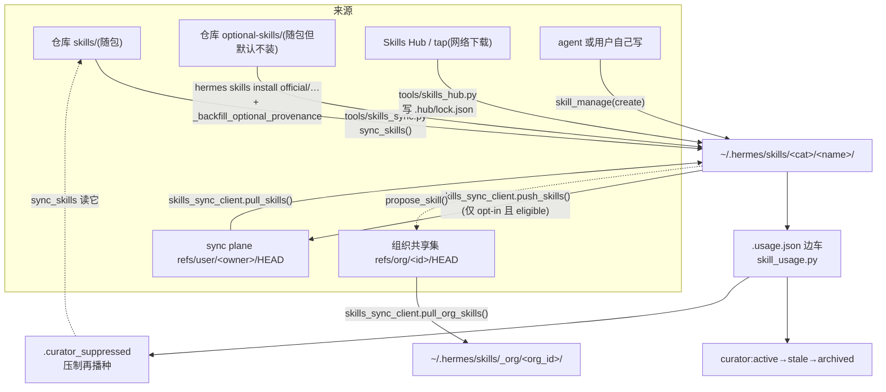

# r9a 底稿 · skills 的分发、来源与用量 —— sync / usage / provenance / blueprints

> 研究对象基线:`/home/user/hermes-agent` @ `863e31318553cda8ad61df681d08175364d4164b`(只读)。
> 溯源约定:凡对代码行为的断言,**锚点单独成行、置于代码块之前**,格式 `路径:行号 @ 863e313`。
> 本文是底稿(证据层),求全求证、允许啰嗦。表格里的行号列不带冒号,是为了让引用校验器只对
> 「锚点 + 紧跟的代码块」这一种形状计数;表格是索引,不是证据。
> skills 体系从 R1 到 R8D 从未被任何一轮精读过,本轮是第一次;本文只覆盖「分发 / 来源 / 用量」这一条链,
> 不覆盖 skills 的加载与提示词注入(`agent/prompt_builder.py`、`agent/skill_utils.py`、`tools/skills_tool.py`)
> 与 hub 安装 / 安全扫描(`tools/skills_hub.py`、`tools/skills_guard.py`)。
> **两种引用形状**:`路径:行号 @ 863e313` 单独成行 + 紧跟代码块 = 逐字证据(校验器逐条比对);
> `路径 L行号` = 不配代码块的区域指路(表格与行内散文用),故意不带冒号以免被计入校验分母。

**本簇 5 个文件 / 5,339 行(`wc -l` 实测):**

| 文件 | 行数 | 一句话职责 |
|---|---|---|
| `tools/skills_sync_client.py` | 2187 | 与**远端 sync plane** 说话的低层客户端:内容寻址对象模型 + CAS + 三方合并 + 组织共享 |
| `tools/skills_sync.py` | 1410 | 把**仓库自带**的 `skills/` 拷进 `~/.hermes/skills/`,靠 manifest 判断该不该覆盖(纯本地文件操作) |
| `tools/skill_usage.py` | 1340 | `.usage.json` 边车:用量计数 + 生命周期状态 + 「谁归 curator 管」的策略位 |
| `tools/blueprints.py` | 324 | 把 SKILL.md frontmatter 里的 `blueprint:` 块翻译成一条 cron 任务建议 |
| `tools/skill_provenance.py` | 78 | 一个 ContextVar:当前这次 skill 写入是**前台用户指使**还是**后台自省分身** |

**一句话读法**:名字里都有 "sync",但 `skills_sync.py` 和 `skills_sync_client.py` **是两套毫无关系的机制**
——前者是「解压随包资产」,后者是「跨设备 git」。`skill_provenance.py` 名叫 provenance,
但它记的**不是** skill 的来源,而是**写入动作的来源**;真正的 skill 来源判定在
`skill_usage.py` + `.hub/lock.json` + `.bundled_manifest` 里。这两处命名是本簇最大的阅读陷阱。

---

## 0. 一张图:四种「skill 从哪来」与各自的写盘通道



**四个「谁是这个 skill 的主人」记号,分别落在四个不同的文件里**,没有统一注册表:

| 记号文件 | 谁写 | 谁读 | 含义 |
|---|---|---|---|
| `~/.hermes/skills/.bundled_manifest` | `skills_sync.py` | `skill_usage.is_bundled` / hub / curator | 随包内置,且记着播种时的 origin hash |
| `~/.hermes/skills/.hub/lock.json` | `tools/skills_hub.py` + `skills_sync._backfill_optional_provenance` | `skill_usage.is_hub_installed` / 改名恢复 | hub 装的,hub 拥有它的路径 |
| `~/.hermes/skills/.usage.json` 的 `created_by` | `skill_usage.record_created` / `adopt_skill` | curator / 写守卫 | **策略位**:准不准 curator 自动改它 |
| `~/.hermes/skills/_org/<id>/.org-provenance.json` | `skills_sync_client._write_org_provenance` | `agent/prompt_builder.py` / `tools/skills_tool.py` | 组织 HEAD 的作者与时间,加载时显示 |

---

## 1. `tools/skills_sync.py` —— 随包 skill 的播种与更新(纯本地,零网络)

### 1.1 先看一次具体的走法

用户装了 Hermes,`skills/github/gh-cli/SKILL.md` 被拷到 `~/.hermes/skills/github/gh-cli/`。
他手改了这个文件加了两条自己的命令。三个月后跑 `hermes update`,上游也改了同一个 skill。
**他的两条命令还在不在?** 答案由 manifest 里那一行 `gh-cli:<origin_hash>` 决定。

模块头的 docstring 就是这套判定的完整规格:

`tools/skills_sync.py:5 @ 863e313`
```
Copies bundled skills from the repo's skills/ directory into ~/.hermes/skills/
and uses a manifest to track which skills have been synced and their origin hash.

Manifest format (v2): each line is "skill_name:origin_hash" where origin_hash
is the MD5 of the bundled skill at the time it was last synced to the user dir.
Old v1 manifests (plain names without hashes) are auto-migrated.

Update logic:
  - NEW skills (not in manifest): copied to user dir, origin hash recorded.
  - EXISTING skills (in manifest, present in user dir):
      * If bundled still matches origin hash: no update → skip without reading
        the user copy.
      * If bundled changed and user copy matches origin hash: safe to update.
      * If bundled changed and user copy differs: user customized it → SKIP.
  - DELETED by user (in manifest, absent from user dir): respected, not re-added.
  - REMOVED from bundled (in manifest, gone from repo): cleaned from manifest.
```

**关键设计:manifest 存的不是「上游当前是什么」,而是「我上次给你放的是什么」(origin hash)。**
这一个选择同时解决了两个问题:用户改没改(本地 ≠ origin)、上游动没动(bundled ≠ origin),
而且**不需要三方之外的任何状态**。这是本文件里最值得抄的一条。

哈希口径是「相对路径 + 文件字节」的 MD5,遍历顺序排序过:

`tools/skills_sync.py:254 @ 863e313`
```python
def _dir_hash(directory: Path) -> str:
    """Compute a hash of all file contents in a directory for change detection."""
    hasher = hashlib.md5()
    try:
        for fpath in sorted(directory.rglob("*")):
            if fpath.is_file():
                rel = fpath.relative_to(directory)
                hasher.update(str(rel).encode("utf-8"))
                hasher.update(fpath.read_bytes())
    except (OSError, IOError):
        pass
    return hasher.hexdigest()
```

**取舍 T1:异常吞掉后仍返回 hexdigest。** 读不到一半的目录会算出一个「合法但不完整」的哈希。
后果是把「读失败」误判成「内容变了」→ 该 skill 从此被当作 user-modified 永远跳过。
选择这个的理由显然是「同步永远不能因为一个坏文件而整体崩掉」,代价是失败静默。

### 1.2 主循环的五个分支(判定顺序本身就是设计)

`sync_skills()` 的顺序是:**opt-out 标记 → 逐 skill:压制表 → 孤儿 .bak 恢复 → 改名恢复 →
external 影子 → 新/已有/已删**。顺序不能换,后面每一条都解释了为什么。

**(a) 整档退出**——profile 级 opt-out 标记,连目录都不扫:

`tools/skills_sync.py:688 @ 863e313`
```python
    if (HERMES_HOME / NO_BUNDLED_SKILLS_MARKER).exists():
        if not quiet:
            print("  (skipped — profile opted out of bundled skills via .no-bundled-skills)")
        return {
            "copied": [], "updated": [], "skipped": 0,
            "user_modified": [], "cleaned": [], "total_bundled": 0,
            "optional_provenance_backfilled": [], "skipped_opt_out": True,
        }
```

注意它返回的字典**没有** `suppressed` / `relocated` / `shadowed_by_external` 三个键,
而正常路径(`:937`)有。调用方用 `result["user_modified"]` 是安全的,用 `result["suppressed"]` 会 KeyError。
`__main__` 块只读了 `copied/updated/skipped/user_modified/cleaned` 加一个 `.get(...)`,所以没炸。
这是一个**返回形状不一致**的隐患,不是当前缺陷。

**(b) curator 压制表**——被 curator 剪掉的内置技能不能被 `hermes update` 复活。
这条是 `skill_usage.py` 与本文件之间唯一的双向耦合:

`tools/skills_sync.py:731 @ 863e313`
```python
        if skill_name in suppressed:
            suppressed_skipped.append(skill_name)
            continue
```

来源是 `~/.hermes/skills/.curator_suppressed`,由 `skill_usage.add_suppressed_name()` 写。
`_read_suppressed_names()` 先尝试 import `tools.skill_usage`,失败就**自己读同一个文件**
(`tools/skills_sync.py L146-163`)——因为这个模块要能在 installer 的裸 Python 里跑,不能假设 CLI 层可导入。

**(c) 孤儿 `.bak` 恢复**——上一次更新在「挪走旧的」和「拷进新的」之间被杀掉时的救援:

`tools/skills_sync.py:744 @ 863e313`
```python
        _orphan = dest.with_suffix(".bak")
        if _orphan.exists() and not dest.exists():
            try:
                dest.parent.mkdir(parents=True, exist_ok=True)
                shutil.move(str(_orphan), str(dest))
                logger.info("Recovered orphaned skill backup: %s", _orphan)
```

**为什么必须在分类之前做**:如果不恢复,`dest` 不存在 + 名字在 manifest 里 → 落到「用户删掉了」分支 →
永远不再播种,用户唯一的副本烂在 `.bak` 里。这是把「崩溃恢复」放进正常路径开头的典型写法。

**(d) 上游改名 / 改分类的恢复**:manifest 的键是 frontmatter 的 `name`,而目标路径是目录路径。
上游把 `mlops/chroma` 改成 `mlops/vector-databases/chroma` 时,键还在、路径变了。核心判据是
**只搬和 origin hash 逐字节相同的那份**:

`tools/skills_sync.py:633 @ 863e313`
```python
    if not origin_hash:
        return None

    for candidate in active_index.get(skill_name, []):
        if candidate == dest or not candidate.is_dir():
            continue
        try:
            rel = candidate.relative_to(SKILLS_DIR).as_posix()
        except ValueError:
            continue
        # Never relocate a hub-installed skill — the hub owns its path.
        if rel in hub_paths:
            continue
        if _dir_hash(candidate) != origin_hash:
```

改过的那份**不搬、只打印一条警告并留在旧路径**(`:650-657`),理由写在注释里:搬动等于替用户改文件,
留着则避免同名碰撞。代价是那份从此收不到更新——所以警告里直接给了 `hermes skills reset <name> --restore`。

**取舍 T2:两个索引是懒建的。**

`tools/skills_sync.py:713 @ 863e313`
```python
    # Rename recovery indexes are expensive on host bind mounts. Build them
    # only if a tracked skill is actually missing from its canonical path.
    active_index: Optional[Dict[str, List[Path]]] = None
    hub_paths: Optional[Set[str]] = None
```

即:为了不在正常情况下全树扫两遍,把两个 O(全树) 的索引推迟到「真的有 skill 不在它该在的地方」时才建。
性能换代码复杂度(多两个 `Optional` + 一处 `or set()` 兜底)。

**(e) external_dirs 影子**——配置了外部 skill 目录时,同名的随包 skill **一律不写本地树**:

`tools/skills_sync.py:776 @ 863e313`
```python
        if skill_name in external_index:
            # An external_dirs source already provides this skill. Writing it
            # into the profile-local tree would create a name collision the
            # loader refuses to resolve (#28126). Defer to the external copy
            # for ALL manifest states (new, previously-synced, user-deleted).
```

并且**自愈**:如果本地已有一份且与随包源逐字节相同,就删掉它并把 manifest 条目也丢掉(`:794-798`)。
「只删和我一模一样的那份」——这是本文件反复出现的同一条安全准则(改名恢复、`remove_pristine`、这里,三处同源)。

### 1.3 更新写盘:一个**手写的两阶段提交**

`tools/skills_sync.py:870 @ 863e313`
```python
            if bundled_hash != origin_hash:
                try:
                    # Move old copy to a backup so we can restore on failure
                    backup = dest.with_suffix(".bak")
                    # A stale backup left by an earlier failure would make
                    # shutil.move() nest dest *inside* it (or fail outright)
                    # and would poison the restore path below. The current
                    # dest is the authoritative copy — clear the leftover.
                    if backup.exists():
                        _rmtree_writable(backup)
                    shutil.move(str(dest), str(backup))
                    try:
                        shutil.copytree(skill_src, dest)
```

失败回滚(`:892-907`)先清掉半成品 `dest`,再把 `.bak` 搬回来。**中途失败留下什么**,逐一列举:

```text
崩溃点                          磁盘状态                     下次 sync 的处理
--------------------------------------------------------------------------------
move(dest→bak) 之后、copytree 之前   dest 不在,bak 是用户的副本      (c) 孤儿恢复:bak → dest,再重来
copytree 写到一半被杀             dest 半成品,bak 完好            **无人处理**:dest 存在 ⇒ 走
                                                                 「已有」分支,user_hash 是半成品的哈希,
                                                                 ≠ origin ⇒ 判为 user-modified 永远跳过
copytree 成功、删 bak 之前         dest 新版,bak 旧版,manifest 已更新  bak 被下次更新时的
                                                                 `if backup.exists()` 清掉
```

`■ 缺陷 1(半成品 dest 无人恢复)`。判据:`_orphan` 分支的条件是
`_orphan.exists() and not dest.exists()`(`tools/skills_sync.py L745`),`copytree` 被中断时 `dest` **存在**
(它是 `copytree` 边建边写的),所以孤儿恢复不触发;随后 `elif dest.exists()` 分支把半成品当成用户的副本。
现象:被中断的那个 skill 内容残缺,且从此被标成 user-modified、再也收不到更新,`hermes update`
的输出里只会显示 `~ <name> (user-modified, skipping)`。
修法是显然的:写进 `dest.new` 再整目录 rename,而不是直接 `copytree` 到 `dest`。

对照:manifest 文件本身**是**原子写的:

`tools/skills_sync.py:177 @ 863e313`
```python
    try:
        fd, tmp_path = tempfile.mkstemp(
            dir=str(MANIFEST_FILE.parent),
            prefix=".bundled_manifest_",
            suffix=".tmp",
        )
        try:
            with os.fdopen(fd, "w", encoding="utf-8") as f:
                f.write(data)
                f.flush()
                os.fsync(f.fileno())
            atomic_replace(tmp_path, MANIFEST_FILE)
```

**取舍 T3:元数据原子、内容不原子。** 小 JSON/文本用 `tempfile + fsync + os.replace`
(manifest、`lock.json`、`.usage.json`、`.sync_state` 全都是这个模式),
而**真正的 skill 目录内容**一律是 `shutil.copytree` / `write_bytes` 直写。
理由能理解(目录级原子替换在跨设备、只读源、Windows 上都难写),但它意味着
「同步元数据永远自洽,同步内容可能撕裂」——而撕裂的内容会被元数据认成用户的作品。

### 1.4 `_rmtree_writable`:一个范围护栏 + 一个只读源的补丁

`tools/skills_sync.py:971 @ 863e313`
```python
    target = Path(path).resolve()
    skills_root = SKILLS_DIR.resolve()
    # Every legitimate caller passes a skill directory or its ``.bak``
    # sibling — always a strict child of the skills root. The skills root
    # itself must never be removed: a ``dest`` that collapses to
    # ``SKILLS_DIR`` (e.g. a relative path resolving to ``.``) would wipe
    # every installed skill, and its ``.bak`` sibling lands one level up in
    # ``HERMES_HOME``. Require a strict-child relationship so both escape
    # into the skills root and out of it are refused.
    if skills_root not in target.parents:
        raise ValueError(
            f"refusing to rmtree {target!r}: not strictly under {skills_root!r} "
            f"(scope guard — see #48200)"
        )
```

这是「深度防御」写法的教科书样本:五个调用点每一个看起来都安全,护栏仍然放在**被调用方**,
并且用 `in target.parents`(严格子孙)而不是 `is_relative_to`(会放行 `SKILLS_DIR` 自身)。
注释直接把它要防的灾难列了出来(`.env`、`MEMORY.md`、`kanban.db`)。

第二个补丁是 `onerror` 处理器同时 chmod **失败路径和它的父目录**——因为在 Nix / deb 装法里
skill 文件和目录都是 `r-xr-xr-x`,删子项需要父目录可写(`tools/skills_sync.py L987-995`)。

### 1.5 两个潜伏缺陷(今天不触发,但输入是文件名)

`■ 缺陷 2:`.bak` 用 `with_suffix` 生成,目录名带点就会撞车。`

`tools/skills_sync.py:873 @ 863e313`
```python
                    backup = dest.with_suffix(".bak")
```

判据(纯函数,可零成本复现):

```verify
/home/user/hermes-venv/bin/python -c "
from pathlib import Path
for d in ('skills/devops/my.skill','skills/devops/my.other','skills/devops/plain'):
    print(d, '->', Path(d).with_suffix('.bak'))"
```

```console
skills/devops/my.skill -> skills/devops/my.bak
skills/devops/my.other -> skills/devops/my.bak
skills/devops/plain -> skills/devops/plain.bak
```

现象链:两个同前缀带点的 skill 目录共享同一个 `.bak` 路径。若 `my.skill` 的更新在两阶段中间被杀掉,
`my.bak` 是它的唯一副本;下一次 sync 轮到 `my.other` 时,`if backup.exists(): _rmtree_writable(backup)`
(`tools/skills_sync.py L878-879`)会把它删掉,随后 `my.skill` 的孤儿恢复找不到 `.bak` →
它落进「用户删掉了」分支 → **静默消失**。
今天不触发:实测基线 `skills/` 下 71 个 skill 目录名**无一含点**(见 §1.6 的复核命令)。

`■ 缺陷 3:manifest 是 `name:hash` 的裸文本,skill 名里有冒号就丢 origin hash。`

`tools/skills_sync.py:128 @ 863e313`
```python
            if ":" in line:
                # v2 format: name:hash
                name, _, hash_val = line.partition(":")
                result[name.strip()] = hash_val.strip()
```

而 `_read_skill_name` 对 `name:` 行只做一次 `split(":", 1)`,所以 frontmatter 里写
`name: foo: bar` 会得到名字 `foo: bar`:

`tools/skills_sync.py:213 @ 863e313`
```python
        if in_frontmatter and stripped.startswith("name:"):
            value = stripped.split(":", 1)[1].strip().strip("\"'")
```

判据:

```verify
/home/user/hermes-venv/bin/python -c "
name, h = 'foo: bar', 'd41d8cd98f00b204e9800998ecf8427e'
line = f'{name}:{h}'
n2, _, h2 = line.partition(':')
print('written:', repr(line)); print('read back: name=%r hash=%r' % (n2.strip(), h2.strip()))"
```

```console
written: 'foo: bar:d41d8cd98f00b204e9800998ecf8427e'
read back: name='foo' hash='bar:d41d8cd98f00b204e9800998ecf8427e'
```

现象:origin hash 读回来是 `bar:<hash>`,与任何 `_dir_hash` 都不相等 → 该 skill 永远被判 user-modified。
同样今天不触发(实测 71 个随包 skill 名无一含冒号)。

### 1.6 复核命令(上面两条「今天不触发」的搜索面)

```verify
cd /home/user/hermes-agent && /home/user/hermes-venv/bin/python -c "
import sys, collections, pathlib; sys.path.insert(0,'.')
from tools.skills_sync import _discover_bundled_skills
b = pathlib.Path('skills'); s = _discover_bundled_skills(b)
print('bundled skills:', len(s))
print('dup frontmatter names:', {n:c for n,c in collections.Counter(n for n,_ in s).items() if c>1})
print('dirs with a dot:', [d.name for _,d in s if '.' in d.name])
print('names with a colon:', [n for n,_ in s if ':' in n])"
```

```console
bundled skills: 71
dup frontmatter names: {}
dirs with a dot: []
names with a colon: []
```

搜索面说明:`_discover_bundled_skills` 走的是 `bundled_dir.rglob("SKILL.md")` 并套用
`is_excluded_skill_path`,与 `sync_skills()` 用的是**同一个函数**,所以这个枚举与真实同步面一致,
不是另起炉灶的近似。

### 1.7 ▲ 文档说「每次 sync 都重算你本地副本的哈希」,代码有快路径

`website/docs/user-guide/features/skills.md:863 @ 863e313`

> On each sync, Hermes recomputes the hash of your local copy and compares it to the origin hash:

整段判定(按 CLAUDE.md 要求把整句/整段一并判):这句话归属标题
`## Bundled skill updates (hermes skills reset)`,后面紧跟两条 bullet(`:865-866`),
分别描述 Unchanged / Changed 两种结局。**两条 bullet 的结局描述是对的**
(改过的确实被跳过、确实不会被覆盖);**错的是这句领起句所描述的机制**——
随包源没变时,本地副本**根本不会被哈希**:

`tools/skills_sync.py:845 @ 863e313`
```python
            if origin_hash and bundled_hash == origin_hash:
                skipped += 1
                continue

            user_hash = _dir_hash(dest)
```

可观测差别:用户改了一个随包 skill、而上游**没**动它时,`sync_skills()` 返回的 `user_modified`
是空的(它进的是 `skipped`),于是 `hermes update` 的 `~ N user-modified (kept)` 提示**不会**提到它。
复现(全程在临时目录,不碰基线):

> **R11B 更正**:本块的脚本只存在于当轮会话的 scratchpad(原路径含会话标识,已抹去)、**从未落库**,重跑无法复现,因此它不是「shell 命令即证据」意义上的可重跑证据 —— 由 ```verify 改标 ```console。**结论本身不变**,依据仍是块内输出与同节的行号锚点。

```console
cd /home/user/hermes-agent && /home/user/hermes-venv/bin/python \
  <scratchpad>/repro_bundled.py
```

```console
sync #1 : {'copied': ['demo'], 'updated': [], 'skipped': 0, 'user_modified': []}
manifest: demo:bca7136a28b1476e01dcb3adda126eb4
edited local copy; bundled source left UNCHANGED
sync #2 : {'copied': [], 'updated': [], 'skipped': 1, 'user_modified': []}
local copy still mine? MY LOCAL EDIT
list_user_modified_bundled_skills(): ['demo']
sync #3 (bundled moved to V2): {'copied': [], 'updated': [], 'skipped': 0, 'user_modified': ['demo']}
```

(脚本内容见 §10 的复现件清单。第二行证明用户的改动**确实**没被覆盖——文档承诺的**结果**成立;
第 4 行证明这一轮 sync 压根没把它认成 user-modified——文档描述的**机制**不成立。
`list_user_modified_bundled_skills()` 是另一条代码路径,它**真的**逐个哈希本地副本
(`tools/skills_sync.py L1140`),所以 `hermes skills list-modified` 看得见它。)

**为什么这不是吹毛求疵**:两条路径对「什么叫 user-modified」给出不同答案,而文档只描述了其中一条。
用户按 `hermes update` 的输出判断「我的改动有没有被记住」,会得到「没有任何改动」的错误印象。

---

## 2. `tools/skills_sync_client.py` —— 跨设备 sync plane(一个小型 git)

### 2.1 先看一次具体的走法

用户在笔记本上让 agent 写了一个 skill `deploy-notes`,跑 `hermes sync enable deploy-notes`。
5 秒后台一次 push:整个 skill 目录被切成 blob → tree → commit,POST 到
`https://gateway-gateway.nousresearch.com/v1/sync/objects`,再对
`refs/user/<owner>/HEAD` 做一次 CAS。台式机下次开 CLI 时 `maybe_pull_skills()` 把它拉下来。
中间只要有一步 gate 不通过,**整条链静默 no-op**。

### 2.2 协议:对象模型与规范化

三种对象、三种 tree entry 模式、全 64 位 sha256 地址:

`tools/skills_sync_client.py:78 @ 863e313`
```python
# Object kinds (sync contract)
KIND_BLOB = "blob"
KIND_TREE = "tree"
KIND_COMMIT = "commit"

# Tree entry modes (sync contract)
MODE_FILE = "file"
MODE_EXEC = "exec"
MODE_DIR = "dir"
```

`tools/skills_sync_client.py:181 @ 863e313`
```python
def wire_address(data: bytes) -> str:
    """Return ``sha256:<64-hex>`` -- the wire address of ``data``."""
    return "sha256:" + hashlib.sha256(data).hexdigest()
```

**◇ 两个哈希命名空间必须不混。** 本地 hub 用的是 16 位截断哈希,线上用全 64 位,注释专门点名:

`tools/skills_sync_client.py:172 @ 863e313`
```python
# ---------------------------------------------------------------------------
# Content addressing
#
# The wire uses the FULL 64-hex sha256 digest. This is a DIFFERENT
# namespace from hermes-agent's local ``content_hash`` (skills_guard.py:846),
# which is a truncated 16-hex digest used for local dedup. They must never be
# conflated -- we compute full digests here.
# ---------------------------------------------------------------------------
```

再加上 `skills_sync.py` 的 MD5 目录哈希,和 `skills_sync_client._skill_dir_fingerprint`
的 sha256「路径+`\0`+字节+`\0`」指纹,**这个仓库里同时存在四套内容哈希口径**,互不通用。
这是「同一个概念在四个层各自实现」的一次实测,也是本簇最容易出错的地方。

规范化 JSON 是双方必须逐字节一致的部分:

`tools/skills_sync_client.py:186 @ 863e313`
```python
def canonical_json_bytes(obj: Dict[str, Any]) -> bytes:
    """Canonical JSON serialization for tree/commit hashing (sync contract).

    UTF-8, keys sorted lexicographically, no insignificant whitespace
    (``separators=(",", ":")``), no trailing newline. Arrays must already be
    in the contract-specified order by the caller (tree entries by ``name``,
    commit ``parents`` in significance order). Both client and server MUST
    produce byte-identical output or a push fails ``422 hash_mismatch``.
    """
```

`build_tree` 建树时**跳过 symlink**、超限 blob 抛 `ValueError`、entry 按 name 排序:

`tools/skills_sync_client.py:595 @ 863e313`
```python
    entries: List[Dict[str, str]] = []
    for child in sorted(dir_path.iterdir(), key=lambda p: p.name):
        if child.is_symlink():
            logger.debug("skills_sync_client: skipping symlink %s", child)
            continue
```

### 2.3 传输与鉴权

传输是 **HTTP + requests**,不是 git、不是文件:

`tools/skills_sync_client.py:771 @ 863e313`
```python
    def __init__(self, base_url: str, api_key: str, *, timeout: float = 30.0):
        self.base = base_url.rstrip("/")
        self.api_key = api_key
        self.timeout = timeout
        import requests  # core dependency

        self._session = requests.Session()
        self._session.headers["Authorization"] = f"Bearer {api_key}"

    def _url(self, path: str) -> str:
        return f"{self.base}/v1/sync/{path.lstrip('/')}"
```

对象上传选了 **multipart/form-data**,字段名 = 声称的哈希、filename = 对象类型、body = 裸字节:

`tools/skills_sync_client.py:880 @ 863e313`
```python
        # (field_name, (filename, raw_bytes, content_type))
        files = [
            (h, (kind, data, "application/octet-stream"))
            for h, (kind, data) in objects.items()
        ]
```

**取舍 T4:不用 base64-in-JSON。** 注释(`:865-878`)说契约允许「长度前缀或 multipart」,
这里选 multipart,并明确标注「服务端必须解析同一种取帧方式——已标记为跨端对齐项」。
省下的是 33% 传输体积和一次编解码,换来的是一个**契约里没定死、靠两端约定**的取帧方式。

鉴权是复用推理侧的 Nous bearer,并**在本地无签名解 JWT** 只为读一个 gate claim:

`tools/skills_sync_client.py:226 @ 863e313`
```python
def _decode_jwt_payload_unverified(token: str) -> Dict[str, Any]:
    """Decode a JWT payload WITHOUT signature verification.

    Safe here: we never trust these claims for authz -- the server re-verifies
    every call. We only read the dev-gate claim to decide whether to attempt
    sync at all. Mirrors the diagnostic decode in
    plugins/dashboard_auth/nous/__init__.py:463.
    """
```

**这条推理是对的**,值得抄:客户端解未验签 JWT **只用来决定要不要发起请求**,
不用来决定「允许什么」——真正的授权在服务端。写自己的 harness 时这条界线要划清楚。

### 2.4 三重闸门,以及它在 CLI 与后台之间口径不一致

后台自动路径要求**三个条件同时成立**:

`tools/skills_sync_client.py:1613 @ 863e313`
```python
def maybe_push_skills(*, message: str = "hermes skill sync") -> Optional[Dict[str, Any]]:
    """Best-effort push if all gates pass. Returns a result dict or None.
    Never raises. Called from the debounced skill_manage push hook."""
    try:
        identity = resolve_identity()
        if not identity.get("nous_admin"):
            return None  # access gate: inert unless the user is a Nous admin
        if not sync_feature_enabled():
            return None  # feature off for this instance (HERMES_SYNC_ENABLED)
        if not resolve_sync_base_url():
            return None
        if not list_synced_skill_names():
            return None
        return push_skills(identity=identity, message=message)
```

`nous_admin` 这个闸门本身作者已经写明是**临时容器**,不是最终授权模型:

`tools/skills_sync_client.py:36 @ 863e313`
```
This gate is pre-launch containment, not the shipping entitlement. Admin
status conflates "may administer Nous" with "has Skill Sync enabled", and has
no middle setting for a beta cohort -- opening it up would mean handing out
portal admin. Replace it with a real entitlement (a ``sync:*`` scope, a tier
check, or a per-cohort feature flag) before shipping to users.
```

CLI 的 `pull/push/now` 只查了**两个**(身份 + admin + base_url),**没查 `sync_feature_enabled()`**:

`hermes_cli/main.py:4722 @ 863e313`
```python
    # pull / push / now — enforce the gate up front with a clear message.
    try:
        identity = ssc.resolve_identity()
    except ssc.SyncInertError as e:
        print(f"sync inert: {e}", file=sys.stderr)
        return 1
    if not identity.get("nous_admin"):
        print(
            "sync unavailable: not enabled for your account yet.",
            file=sys.stderr,
        )
        return 1
    if not ssc.resolve_sync_base_url():
```

而 `hermes sync propose`(把本地 skill 推给整个组织,**破坏面最大的那个动作**)在这段闸门**之前**就返回了,
所以它**完全不受 `nous_admin` 与 `sync.enabled` 约束**:

`hermes_cli/main.py:4635 @ 863e313`
```python
    if sub == "propose":
        from tools import skills_sync_client as ssc

        name = args.name
        try:
            result = ssc.propose_skill(name, message=args.message)
        except ssc.SyncInertError as e:
```

`◇ 记号`:显式的用户命令不受 feature flag 约束,可以解释成设计(flag 只管后台自动行为);
但 `propose` 连 `nous_admin` 都不查,与同文件里 `push` 的口径不一致,而它的作用域更大。
真实约束落在服务端的 `org_role` claim 上,所以不是提权;这是一条**闸门口径不一致**的观察,不是缺陷。

### 2.5 端点 URL 是配置可控的,凭据跟着走(R8D 移交形状的复查)

`tools/skills_sync_client.py:304 @ 863e313`
```python
#: Production Skill Sync plane. Overridable per the resolution order below.
DEFAULT_SYNC_BASE_URL = "https://gateway-gateway.nousresearch.com"

def resolve_sync_base_url() -> Optional[str]:
    """Resolve the sync-plane base URL.

    Order: HERMES_SYNC_BASE_URL env bridge -> config.yaml ``sync.base_url`` ->
    the production plane. Returns a base without a trailing slash (e.g.
    ``https://host``); the ``/v1/sync/`` prefix is appended by the client.
```

**结论:是的,凭据会被带到配置指定的任意 URL 上,包括明文 http,没有任何主机白名单或 scheme 校验。**
判据(全程只读基线,`HERMES_HOME` 指向临时目录):

> **R11B 更正**:本块的脚本只存在于当轮会话的 scratchpad(原路径含会话标识,已抹去)、**从未落库**,重跑无法复现,因此它不是「shell 命令即证据」意义上的可重跑证据 —— 由 ```verify 改标 ```console。**结论本身不变**,依据仍是块内输出与同节的行号锚点。

```console
cd /home/user/hermes-agent && HERMES_HOME=<scratchpad>/fakehome \
/home/user/hermes-venv/bin/python -c "
import sys; sys.path.insert(0,'/home/user/hermes-agent')
from tools import skills_sync_client as ssc
print('resolve_sync_base_url ->', ssc.resolve_sync_base_url())
print('sync_feature_enabled ->', ssc.sync_feature_enabled())
c = ssc.SyncClient(ssc.resolve_sync_base_url(), 'eyJ-FAKE-NOUS-BEARER')
print('capabilities URL ->', c._url('capabilities'))
print('Authorization header ->', c._session.headers['Authorization'])"
```

(该临时 `config.yaml` 只有三行:`sync:` / `  enabled: true` / `  base_url: "http://attacker.example.test"`)

```console
resolve_sync_base_url -> http://attacker.example.test
sync_feature_enabled -> True
capabilities URL -> http://attacker.example.test/v1/sync/capabilities
Authorization header -> Bearer eyJ-FAKE-NOUS-BEARER
```

三点值得单独记:

1. **bearer 挂在 `requests.Session` 上,而不是逐请求**。于是连契约里标注「无需鉴权」的
   `GET /v1/sync/capabilities` 也带着它——也就是说**第一次触网就泄露**,不需要走到 push。
   `tools/skills_sync_client.py L785` 的 docstring 自己写着 `No auth required.`
   `tools/skills_sync_client.py:785 @ 863e313`
   ```python
    def capabilities(self) -> Dict[str, Any]:
        """GET /v1/sync/capabilities (sync contract). No auth required."""
        r = self._session.get(self._url("capabilities"), timeout=self.timeout)
   ```
2. **对照组存在,所以这不是「作者没想到白名单」**。同一份凭据的**签发**侧有主机白名单:
   `hermes_cli/auth.py:6255 @ 863e313`
   ```python
                if (
                    not portal_host
                    or portal_host not in _NOUS_PORTAL_ALLOWED_HOSTS
                    or not trusted_scheme
                ):
   ```
   注释(`hermes_cli/auth.py L6238-6241`)写的正是「一个被污染的值不能把 bearer 泄露出去」。
   **消费侧没有等价物。** 搜索面:对 `tools/skills_sync_client.py` 全文抓
   `ALLOWED_HOST|allowlist|urlparse|hostname|scheme` —— 7 处命中,**没有一处是 URL 校验**:
   ```verify
   cd /home/user/hermes-agent && grep -nE "ALLOWED_HOST|allowlist|urlparse|hostname|scheme" tools/skills_sync_client.py
   ```
   ```console
   207:# cross-process file lock + portal host allowlist and refreshes as needed --
   657:    """A human-friendly default device label: the short hostname plus a short
   658:    random suffix for uniqueness (two machines can share a hostname). Falls back
   659:    to a bare uuid if the hostname is unavailable/unusable."""
   665:        host = socket.gethostname() or ""
   668:    # Short hostname (drop domain), strip to a tidy slug; keep it readable.
   680:    New devices are seeded with a HUMAN-FRIENDLY default (short hostname + a
   ```
   逐条读:`L207` 是一句**转述 auth 层**已有白名单的注释(不是本文件在做检查),
   其余 6 条全部属于 `_default_device_label()` 里取本机 hostname 当设备标签。
   也就是说 `SyncClient.__init__` 除 `rstrip("/")` 外不做任何 URL 检查——
   这条命令重跑给出的正是这个结论,而不是「零命中」。
3. **可达性**:`sync.base_url` 是 `config.yaml` 的根键,而 `sync` **不在** `DEFAULT_CONFIG`、
   也不在 `_EXTRA_KNOWN_ROOT_KEYS` 里(搜索面:直接问运行时那个已算好的集合,
   而不是 grep 源码字面——后者会被注释和字符串干扰):
   **R11C 片 C 改:块在列表里整体缩进 3 空格,那 3 个空格跟着进了 `python -c "…"` 的
   Python 源码,原样重跑必得 `IndentationError: unexpected indent`。命令行内容改为顶格,
   并按纪律补 `HERMES_DISABLE_LAZY_INSTALLS=1`;原 ```console 块改标 ```text 使其被
   关卡逐字比对(三个 False 是本条可达性判据钉的数,理应被机械校验)。**结论未变。**

   ```verify
cd /home/user/hermes-agent && HERMES_DISABLE_LAZY_INSTALLS=1 /home/user/hermes-venv/bin/python -c "
import sys; sys.path.insert(0,'.')
from hermes_cli.config import _KNOWN_ROOT_KEYS, DEFAULT_CONFIG, _EXTRA_KNOWN_ROOT_KEYS
print('sync in DEFAULT_CONFIG      :', 'sync' in DEFAULT_CONFIG)
print('sync in _EXTRA_KNOWN_ROOT   :', 'sync' in _EXTRA_KNOWN_ROOT_KEYS)
print('sync in _KNOWN_ROOT_KEYS    :', 'sync' in _KNOWN_ROOT_KEYS)"
   ```

   ```text
sync in DEFAULT_CONFIG      : False
sync in _EXTRA_KNOWN_ROOT   : False
sync in _KNOWN_ROOT_KEYS    : False
```
   而配置校验对未知根键**故意不告警**:
   `hermes_cli/config.py:2036 @ 863e313`
   ```python
    # ── Root-level keys that look misplaced ──────────────────────────────
    # Only provider-like fields (base_url, api_key, …) are flagged. Arbitrary
    # unknown top-level keys are deliberately NOT warned about: top-level
    # scalars are bridged into os.environ (gateway/run.py, hermes send) so
    # users can feed skills and external apps env-style keys from config.yaml
    # — a closed-world allowlist can never enumerate those.
   ```
   所以一个写进 `config.yaml` 的 `sync.base_url` 既生效、又不会被 `hermes doctor` / 配置校验提示。

**判定**:标 `■`(缺陷)而不是设计取舍。理由是同一仓库对**同一枚 bearer** 在签发侧做了白名单、
消费侧没做,且泄露发生在「无需鉴权」的第一个请求上——这是不一致,不是权衡。
最小修法:`SyncClient.__init__` 里对非默认 base_url 要求 https(或 loopback),
并且 `capabilities()` 用一个不带 Authorization 的裸请求。

**◇ 顺带**:`HERMES_SYNC_BASE_URL` / `HERMES_SYNC_ENABLED` / `HERMES_SYNC_DEFAULT_OPT_IN` /
`HERMES_SYNC_ORG_AUTO_PROPOSE` / `HERMES_SYNC_DEVICE_NAME` 五个环境变量,**全部不在**
`OPTIONAL_ENV_VARS`、不在 `.env.example`、不在 R8A 抽出的 151 条环境变量表里。
搜索面:`grep -rn "HERMES_SYNC" .`(全仓、全扩展名)命中只有本文件、`hermes_cli/main.py` 的三条提示串、
和 tests。

### 2.6 opt-in 不是本地开关,而是**对象模型里的内容**

这是这个文件里最漂亮的一个设计决定:

`tools/skills_sync_client.py:90 @ 863e313`
```python
# ---------------------------------------------------------------------------
# `sync-manifest` object convention (design notes).
#
# Per-skill sync opt-in ("this skill syncs / this one does not"
# opt-in state) is CONTENT inside the sync object model, NOT a device-local flag
# or a mutable preference table. An owner's synced set is a small committed blob
# named ``sync-manifest`` at the ROOT of the tree referenced by
# ``refs/user/<owner>/HEAD``, recording per-skill ``{name, enabled}``. Toggling
# opt-in is a plain CAS ref update (upload the new manifest blob + root tree +
# commit, then CAS HEAD) — the same primitives push already uses.
```

**为什么这么设计**:如果 opt-in 是设备本地的一个 bool,那么「我在笔记本上打开了同步」这件事
无法传到台式机;要传就得再造一张可变的偏好表和它自己的一致性协议。
把它做成 tree 里的一个 blob,**复用了已经存在的 CAS + 不可变对象**,零新原语。
`parse_sync_manifest` 是严格的——未知 `type`、`version != 1`、条目形状不对**一律拒绝**而不是宽容降级
(`tools/skills_sync_client.py L136-169`),理由写在 docstring:
「a malformed manifest must not be mistaken for "no skills opted in."」——
即**坏数据不能被读成「空集」**,否则一次解析失败就等于一次静默的全量退订。

本地那个 `.usage.json` 的 `sync` 位只是「意图」,pull 时从 plane 反向调和:

`tools/skills_sync_client.py:1556 @ 863e313`
```python
    reconciled_from_manifest: List[str] = []
    remote_manifest = read_manifest_of_root(client, root_tree)
    if remote_manifest:
        try:
            from tools.skill_usage import set_sync, is_curation_eligible, is_sync_enabled

            for sname, enabled in remote_manifest.items():
                if not enabled:
                    continue
                if not is_curation_eligible(sname):
                    continue
                if not is_sync_enabled(sname):
                    set_sync(sname, True)
                    reconciled_from_manifest.append(sname)
```

**取舍 T5:调和是单向的——只采纳「开」,从不采纳「关」。** 注释(`:1550-1555`)说得很清楚:
远端把某个 skill 标为关,本地**不会**跟着关掉;那是用户在本地的决定,等下次 push 再统一。
好处是不会出现「另一台设备把我这台的同步悄悄关了」;代价是关闭动作**不是跨设备的**,
两台设备可以长期处在「一开一关」的不一致状态,直到某一次 push 覆盖掉。

### 2.7 push:CAS + 三方合并 + 冲突头

`tools/skills_sync_client.py:1291 @ 863e313`
```python
    manifest = read_sync_state()
    base_head = manifest.get("head")

    # Idempotency: if the profile-root tree is unchanged since our last push,
    # there is nothing to propagate -- skip building an empty commit (contract
    # objects are immutable, so an identical tree hash means identical content).
    if base_head and manifest.get("root") == root_hash:
        return {"ok": True, "head": base_head, "reason": "unchanged", "noop": True}
```

冲突后的三方判定是一个 15 行的纯函数,和 `skills_sync.py` 的 origin/user/incoming 语义同源:

`tools/skills_sync_client.py:1459 @ 863e313`
```python
    if ours == theirs:
        return "either" if ours is not None else "none"
    ours_changed = ours != base
    theirs_changed = theirs != base
    if ours_changed and not theirs_changed:
        return "ours"
    if theirs_changed and not ours_changed:
        return "theirs"
    # both changed and differ
    return "overlap"
```

**粒度是「一个 skill 的 tree hash」,不是文件、更不是行。** 两边改了同一个 skill 的**不同文件**
也算 overlap。这是一个明确的取舍:

- 得到的:合并逻辑 15 行、无需 diff3、无需处理二进制、无冲突标记污染 SKILL.md。
- 放弃的:文件级自动合并。两台设备各给同一个 skill 加了一个互不相干的文件,就会进冲突分支。

真冲突不阻塞、不覆盖,而是**另开一个 ref**:

`tools/skills_sync_client.py:1399 @ 863e313`
```python
    if overlaps:
        # TRUE OVERLAP -> write a conflict head and surface it (personal sync).
        n = _next_conflict_index(client, owner)
        conflict_ref = user_conflict_ref(owner, n)
        try:
            client.cas_ref(conflict_ref, None, our_commit)
        except SyncConflict:
            pass  # someone else grabbed this index; the head still exists
```

还有一个很实用的兜底:CAS 返回 409 但 `actual` 是空串,意味着**服务端根本没有这个 ref**
(常见于本地 state 文件是从另一个 plane 带过来的),此时改成「以 None 为 from 重做一次创建」:

`tools/skills_sync_client.py:1315 @ 863e313`
```python
    except SyncConflict as conflict:
        if not conflict.actual:
            # The ref does not exist server-side: our `from` was a stale head
            # (commonly a local state file carried over from another sync
            # plane). There is nothing to merge — redo the CAS as a create.
            client.cas_ref(ref, None, commit_hash)
```

### 2.8 pull:**没有本地改动保护**,而且 opt-in 闸门在空集时形同虚设

`tools/skills_sync_client.py:1573 @ 863e313`
```python
    opted_in = set(_opted_in_rel_paths())
    updated = []
    for path, tree_hash in remote_trees.items():
        # Opt-in gate on pull: only materialize skills the user chose to sync
        # (now including any adopted from the plane manifest above).
        if opted_in and path not in opted_in:
            continue
        dest = _skills_dir() / path
        materialize_tree(client, tree_hash, dest)
        updated.append(path)
```

对照它自己的 docstring:

`tools/skills_sync_client.py:1514 @ 863e313`
```python
    """Pull the owner's HEAD and materialize opted-in skills to disk.

    Fetches ``refs/user/<owner>/HEAD``; if it advanced past our recorded head,
    walks the profile-root tree and writes each skill tree into
    ~/.hermes/skills/. Only paths the user has opted into (``sync: true``) are
    materialized, so a pull never resurrects a skill the user hasn't chosen.
```

`■ 缺陷 4(空 opt-in 集合 ⇒ 全量落盘)`:`if opted_in and ...` 里的 `opted_in` 为空集时整个条件为假,
**所有**远端 skill 都被写下来。这直接推翻 docstring 那句「a pull never resurrects a skill the user hasn't chosen」。

`■ 缺陷 5(个人 pull 静默覆盖本地改动)`:`materialize_tree` 直接 `write_bytes`,
**没有任何**「本地是否被改过」的比较,返回值里也没有 `conflicted` 之类的字段。

两条一起复现(用的是仓库**自带**的 in-process mock sync server,即
`tests/tools/test_skills_sync_client.py` 里的 `_MockState` / `_make_handler`,
所以线上行为口径与项目自己的测试一致):

> **R11B 更正**:本块的脚本只存在于当轮会话的 scratchpad(原路径含会话标识,已抹去)、**从未落库**,重跑无法复现,因此它不是「shell 命令即证据」意义上的可重跑证据 —— 由 ```verify 改标 ```console。**结论本身不变**,依据仍是块内输出与同节的行号锚点。

```console
cd /home/user/hermes-agent && /home/user/hermes-venv/bin/python \
  <scratchpad>/repro_pull.py
```

```console
A push  -> {'ok': True, 'head': 'sha256:36b0a6246684fa2da53dd232b1c4cfe3c9a9d17069e2d9758a3eb853e7c0927d'}
B .usage.json exists? False
B opted-in set before pull: []
B pull  -> {'ok': True, 'updated': ['alpha']}
B alpha on disk? True
B local body before 2nd pull: 'LOCAL EDIT B'
A push2 -> {'ok': True, 'head': 'sha256:a7ac3de81683242255a271337b3ca99327a52d47d84202377c2dcb1af7275c71'}
B pull2 -> {"ok": true, "updated": ["alpha"]}
B result has a 'conflicted'/'skipped' key? []
B local body after 2nd pull: 'V2'
B-only file survived (no deletion on pull)? True
```

逐行读:第 3 行是缺陷 4 的输入(本地 opt-in 集合为空),第 4-5 行是现象(仍然全量落盘)。
第 6 行是缺陷 5 的输入(设备 B 本地改了 `alpha` 且**没有** push),第 10 行是现象
(改动被远端 V2 直接盖掉),第 9 行证明返回值里连一条「有东西被覆盖了」的线索都没有。

**这不是「作者没考虑过本地改动保护」**——同一个文件的**组织路径**做了这件事:

`tools/skills_sync_client.py:1855 @ 863e313`
```python
        try:
            if dest.exists():
                # Local edits are protected: never clobber work the user or
                # agent did in place. Skip the update and report it so they
                # can resolve deliberately (propose the local version, or
                # discard it and re-pull).
                if org_skill_is_locally_modified(rel_path, org_id):
                    prev = baseline.get(rel_path) or {}
                    # Upstream also moved on => a real conflict the user must
                    # resolve. Upstream unchanged => their edit simply stands.
                    if prev.get("tree") != tree_hash:
                        conflicted.append(rel_path)
                    continue
```

组织侧有 `.org-baseline.json` 指纹边车 + `conflicted` 返回字段,个人侧两样都没有。
**同一个文件、同一种风险、两种处理**,这是判 `■` 而不是「设计如此」的依据。

第 11 行还揭示第三个语义:**pull 从不删文件**。`materialize_tree` 的 docstring 明说:

`tools/skills_sync_client.py:1024 @ 863e313`
```python
    """Write the tree at *tree_hash* into *dest* (created if needed).

    Blobs become files (with +x restored for ``exec`` mode), nested trees
    become subdirectories. Does NOT delete files absent from the tree -- the
    caller decides removal semantics. Refuses path traversal via entry names.
    """
```

而 `pull_skills` 这个 caller **没有**做任何删除决策。后果:本地目录变成「远端 ∪ 本地」的并集,
下一次 push 会把并集推回去——**在一台设备上删掉的文件,会被另一台设备复活**。
这是一个明确的取舍(不删 = 永不误删),但它和 `snapshot_profile` 的「按本地磁盘全量建树」组合起来,
等于**删除动作无法跨设备传播**。

安全面上,`materialize_tree` 对 entry 名做了穿越拒绝(`tools/skills_sync_client.py L1032-1035`:
`if not name or "/" in name or name in (".", "..")` → 跳过并 warning),
配合 `build_tree` 不发 symlink,构成了「写盘侧不信任服务端」的最小防线。

### 2.9 组织共享:镜像 + 指纹基线 + `■` 一条真 bug

组织集是同一套对象模型的另一个 ref,落在 `~/.hermes/skills/_org/<org_id>/`,
并且**故意被排除在个人 push 之外**:

`tools/skills_sync_client.py:471 @ 863e313`
```python
    if is_external_skill_path(skill_dir):
        return False
    try:
        rel = skill_dir.resolve().relative_to(_skills_dir().resolve())
        if rel.parts and rel.parts[0] == ORG_DIR_NAME:
            return False
    except (OSError, ValueError):
        pass
    return True
```

组织 ref 走**另一组端点**而不是个人端点加前缀过滤,理由写得很硬:

`tools/skills_sync_client.py:792 @ 863e313`
```python
    def get_refs(self, prefix: str, *, org_scope: bool = False) -> List[Dict[str, str]]:
        """GET /v1/sync/refs?prefix=... (or the org route when ``org_scope``).

        Org refs live behind a SEPARATE endpoint, not behind a prefix filter on
        the personal one: the personal route is hard-scoped to the token's own
        owner, so asking it for ``refs/org/<id>/`` silently returns the
        caller's personal refs instead of an error. Callers reading an org ref
        MUST pass ``org_scope=True``.
        """
```

**这是一条值得抄的教训**:一个「按 owner 硬作用域」的列表端点,对越权前缀的正确回答是**空/错误**,
而不是「悄悄返回你自己的东西」——后者会让一个写错的客户端看起来完全健康。
仓库自己也用一个测试盯着它(`tests/tools/test_skills_sync_client.py L1027`
`test_org_head_is_not_visible_on_the_personal_route`)。

`propose_skill` 用了**有界重试 + 重新拼接**,而不是重放旧根:

`tools/skills_sync_client.py:2072 @ 863e313`
```python
    attempts = 0
    while True:
        attempts += 1
        base_head = _read_org_head(client, org_id)
        if base_head:
            base_root = _root_tree_of_commit(client, base_head, org_scope=True)
            skill_map = _skill_trees_of_root(client, base_root, org_scope=True)
        else:
            skill_map = {}
        skill_map[str(rel)] = skill_tree
```

「重新拼接而不是重放」是对的(重放会把别人这期间提交的 skill 抹掉);上限 5 次
(`_ORG_CAS_MAX_ATTEMPTS`,`tools/skills_sync_client.py L1779`)也是对的(争用意味着别人在提交,
无界循环会自旋)。

**但 `rel` 算错了。**

`tools/skills_sync_client.py:2052 @ 863e313`
```python
    rel = _skill_rel_path(skill_name)
    if rel is None:
        raise SyncError(f"skill '{skill_name}' not found under the skills dir")
    skill_dir = _skills_dir() / rel
```

`_skill_rel_path` 给的是相对 `~/.hermes/skills/` 的路径。对一个**已经拉下来的组织 skill**,
它是 `_org/<org_id>/<category>/<name>`;而组织 root tree 里的键是 `<category>/<name>`
(pull 时 `dest_root = _org_dir() / org_id`,`tools/skills_sync_client.py L1847`,前缀在落盘时才加上)。
于是 `skill_map[str(rel)] = skill_tree` 插入的是一个**新条目**,而不是更新原条目。

`■ 缺陷 6(propose 组织镜像里的 skill,会插到错误路径并每轮加深一层嵌套)`。
输入→现象(同样用仓库自带 mock server;admin token,所以 CAS 直接合并,排除 202 提案路径的干扰):

> **R11B 更正**:本块的脚本只存在于当轮会话的 scratchpad(原路径含会话标识,已抹去)、**从未落库**,重跑无法复现,因此它不是「shell 命令即证据」意义上的可重跑证据 —— 由 ```verify 改标 ```console。**结论本身不变**,依据仍是块内输出与同节的行号锚点。

```console
cd /home/user/hermes-agent && /home/user/hermes-venv/bin/python \
  <scratchpad>/repro_propose.py
```

```console
propose #1 (from personal tree): True
org tree paths after #1: ['devops/shared']
pull_org_skills -> {'org_id': 'org-42', 'updated': ['devops/shared']}
_find_skill_dir('shared') -> <skills>/_org/org-42/devops/shared
_skill_rel_path('shared') -> _org/org-42/devops/shared
propose #2 (from the org mirror): True
org tree paths after #2: ['_org/org-42/devops/shared', 'devops/shared']
did devops/shared move to V2? False
pull_org_skills #2 -> {'updated': ['_org/org-42/devops/shared'], 'conflicted': []}
   on disk: <skills>/_org/org-42/_org/org-42/devops/shared/SKILL.md
   on disk: <skills>/_org/org-42/devops/shared/SKILL.md
```

再跑一轮,嵌套再深一层、组织树再多一个陈旧副本:

```console
--- cycle 3 ---
_skill_rel_path -> _org/org-42/_org/org-42/devops/shared
org tree paths after #3: ['_org/org-42/_org/org-42/devops/shared', '_org/org-42/devops/shared', 'devops/shared']
deepest on disk: <skills>/_org/org-42/_org/org-42/_org/org-42/devops/shared/SKILL.md
```

三条后果:
1. **组织永远看不到这次编辑**——第 8 行 `did devops/shared move to V2? False`,规范路径没动。
2. 组织 root tree 每 propose 一次多一个陈旧重复条目。
3. 本地镜像每 `propose → pull` 一轮多嵌套一层 `_org/<org_id>/`。

**为什么这条路径一定会被走到,而不是边角**:
(a) 代码自己的用户可见文案就是这么教的——
`tools/skill_manager_tool.py:678 @ 863e313`
```python
        if not ssc.sync_org_auto_propose():
            return (
                f"This skill is shared by your organisation. Your edit is "
                f"saved locally and will not be overwritten by org updates. "
                f"Run `hermes sync propose {name}` to share it back."
            )
```
(b) 打开 `sync.org_auto_propose` 后,agent 对组织 skill 的**每一次编辑**都自动走 `propose_skill`
(`tools/skill_manager_tool.py L683`);
(c) `_find_skill_dir` 按**排序后的完整路径**取第一个匹配,`_org`(`0x5F`)排在任何小写字母类别名之前,
所以只要镜像拉下来过,同名解析**总是**命中镜像而不是个人副本——个人副本同时存在也一样:

```verify
cd /home/user/hermes-agent && /home/user/hermes-venv/bin/python -c "
import os, sys, tempfile, pathlib
home = pathlib.Path(tempfile.mkdtemp()); os.environ['HERMES_HOME'] = str(home)
sys.path.insert(0, '/home/user/hermes-agent')
def mk(d, n):
    d.mkdir(parents=True, exist_ok=True)
    (d/'SKILL.md').write_text('---\nname: %s\ndescription: x\n---\nbody\n' % n, encoding='utf-8')
mk(home/'skills'/'devops'/'shared', 'shared')
mk(home/'skills'/'_org'/'org-42'/'devops'/'shared', 'shared')
(home/'skills'/'_org'/'.active_org').write_text('org-42', encoding='utf-8')
from tools.skill_usage import _find_skill_dir
print(str(_find_skill_dir('shared')).replace(str(home/'skills'), '<skills>'))"
```

```console
<skills>/_org/org-42/devops/shared
```

顺带一条**内部注释与代码矛盾**(不计入 ▲,因为 ▲ 按 CLAUDE.md 限定为 README / 根 AGENTS.md / website/docs):
`pull_org_skills` 的 docstring 说本地编辑会被覆盖、fork 应放在个人技能里
(`tools/skills_sync_client.py L1812-1815`),而同一个函数体(`:1855` 起,上面已引)**恰恰**保护了本地编辑;
`tools/skills_tool.py L1573-1574` 的注释也还写着 "Org mirrors are read-only … never local edits",
而 `_org_mirror_write_guard`(`tools/skill_manager_tool.py L699` 起)明说组织 skill **可以就地编辑**、只禁删除。
三处对同一件事的描述已经分叉。

---

## 3. `tools/skill_usage.py` —— 用量**不是**纯遥测

### 3.1 落盘位置与口径

单一 JSON 边车 `~/.hermes/skills/.usage.json`,键是 skill 的 frontmatter `name`:

`tools/skill_usage.py:8 @ 863e313`
```
Design notes:
  - Sidecar, not frontmatter. Keeps operational telemetry out of user-authored
    SKILL.md content and avoids conflict pressure for bundled/hub skills.
  - Atomic writes via tempfile + os.replace (same pattern as .bundled_manifest).
  - All counter bumps are best-effort: failures log at DEBUG and return silently.
    A broken sidecar never breaks the underlying tool call.
```

「不写进 frontmatter」这条理由值得记:**遥测写进内容文件 = 每次计数都制造一次同步冲突**。
在一个同时有随包更新、hub 更新、跨设备同步的系统里,这是必须避开的。

记录形状(注意 `sync` 位不在默认模板里,是后加的稀疏字段):

`tools/skill_usage.py:644 @ 863e313`
```python
def _empty_record() -> Dict[str, Any]:
    return {
        "created_by": None,
        "use_count": 0,
        "view_count": 0,
        "last_used_at": None,
        "last_viewed_at": None,
        "patch_count": 0,
        "patch_generation": 0,
        "last_reused_patch_generation": 0,
        "last_patched_at": None,
        "created_at": _now_iso(),
        "state": STATE_ACTIVE,
        "pinned": False,
        "archived_at": None,
    }
```

**读-改-写有跨进程文件锁**(fcntl / Windows 走 msvcrt),这是本仓库少见的显式跨进程串行化:

`tools/skill_usage.py:89 @ 863e313`
```python
@contextmanager
def _usage_file_lock():
    """Serialize .usage.json read-modify-write cycles across processes."""
    lock_path = _usage_file().with_suffix(".json.lock")
    lock_path.parent.mkdir(parents=True, exist_ok=True)

    if fcntl is None and msvcrt is None:
        yield
        return
```

**取舍 T6:锁保护 RMW,但 `save_usage` 是整表覆写。** 意味着任意两个进程之间的粒度是「整张表」,
不是「一条记录」。对一个几十到几百条的表这完全够用,换来的是零 schema 迁移成本。

### 3.2 它到底影不影响 skill 的选择/排序/裁剪

**不影响提示词里的 skill 索引与排序**——搜索面:`agent/prompt_builder.py` 与 `agent/skill_utils.py`
两个文件全文对 `usage` / `use_count` / `last_used` 的检索**零命中**
(排除 `usage_pricing` / token 相关词):

```verify
cd /home/user/hermes-agent && grep -c -E "\busage\b|use_count|last_used" agent/prompt_builder.py agent/skill_utils.py
```

```console
agent/prompt_builder.py:0
agent/skill_utils.py:0
```

**但它决定 skill 的生死。** `curated_report()` 是 curator 生命周期机器的唯一输入,
而 curator 会把长期不用的 skill 移进 `.archive/`:

`tools/skill_usage.py:1261 @ 863e313`
```python
    data = load_usage()
    rows: List[Dict[str, Any]] = []
    for name in list_agent_created_skill_names():
        raw = data.get(name)
        persisted = isinstance(raw, dict)
        rec: Dict[str, Any] = raw if isinstance(raw, dict) else _empty_record()
```

`_persisted` 这个字段专门解决「第一次看见一个内置技能」的问题——没有记录 ≠ 上古不用:

`tools/skill_usage.py:721 @ 863e313`
```python
def seed_record_if_missing(skill_name: str) -> None:
    """Persist a baseline usage record for a curation-eligible skill.

    Built-ins carry no usage record until something touches them, which leaves
    their inactivity clock with no anchor. Seeding a record here fixes
    ``created_at`` to the moment the curator first sees the skill, so the
    archive/stale clock measures non-use FROM THEN — not from epoch. No-op when
    a record already exists or the skill isn't curation-eligible.
    """
```

**这条是设计蓝图级别的教训**:任何「按不活跃时间自动清理」的机制,都必须区分
「观测到它长期不活跃」和「我刚开始观测」。否则上线第一次运行就会把一切判成过期。

计数与生命周期的**权限口径不同**,这是本文件的核心分层:

`tools/skill_usage.py:743 @ 863e313`
```python
def _mutate(skill_name: str, mutator, *, require_curation_eligible: bool = False) -> Any:
    """Load, apply *mutator(record)* in place, save. Best-effort.

    By default this records telemetry for ANY skill — bundled, hub-installed,
    or agent-created — because usage tracking is pure observability and is
    orthogonal to whether a skill is ever curated. Lifecycle mutators
    (``set_state``, ``set_pinned``, ``mark_agent_created``) pass
    ``require_curation_eligible=True`` so they never write meaningless state
    onto a skill the curator can't manage (e.g. an ``archived`` flag on a
    hub-installed skill).
    """
```

即:**观测面全开,写策略面收窄**。同一个边车里两种字段两种权限,用一个布尔参数区分。

### 3.3 `created_by` —— 名字说的是来源,读出来的是策略

`tools/skill_usage.py:485 @ 863e313`
```python
def _is_curator_managed_record(record: Any) -> bool:
    """Return True when a usage record opts a skill into curator management.

    NAMING (issue #67140): the on-disk field is ``created_by``, which reads
    like provenance but is consumed as a **curator-management opt-in policy
    flag**. The two are not the same question:

    * provenance = "who authored this file" — historical fact, and for records
      written before the marker existed it is simply unrecoverable.
    * management = "may autonomous curation mutate/archive this" — a policy
      decision the user can change at any time via ``hermes curator adopt``.
```

**这是整簇最重要的一条设计陈述**。作者选择**保留错误的字段名**(改名会作废所有用户已有的记录),
改为在读侧提供一个意图正确的别名 `is_curator_managed()`。并且明确写下
「Provenance is a DECLARATION, never an inference」(`tools/skill_usage.py L539`)——
`list_unmanaged_skill_names()` 只报告、绝不自动接管,因为「补丁次数多」是维护证据、不是作者身份证据。

配套的是一个显式的「盲区可见化」:没有标记的 eligible skill 会被
`hermes curator status` 计数出来,而不是静默地永远不被 curator 看见。

### 3.4 一条硬编码的保护名单

`tools/skill_usage.py:58 @ 863e313`
```python
# Load-bearing bundled built-ins the curator must NEVER archive or consolidate,
# regardless of ``curator.prune_builtins``, pin state, or LLM judgment. These
# back advertised UX paths (e.g. ``plan`` powers the ``/plan`` slash-command
# flow and is referenced in tips/docs/fresh-profile seeding); silently archiving
# one turns its slash command into "Unknown command" with no signal to the user.
# Protection is by skill ``name`` (frontmatter ``name:``), matching the keys used
# throughout this module. Keep this list tiny and intentional — it is not a
# substitute for ``curator.prune_builtins: false``, which exempts ALL built-ins.
PROTECTED_BUILTIN_SKILLS: Set[str] = {
    "plan",
}
```

**取舍 T7:一个一元素的硬编码集合,而不是 frontmatter 里的 `protected: true`。**
好处:保护规则不能被 skill 文件自己声明(否则任何 skill 都能给自己免疫);
坏处:加一个保护项要改 Python 源码。注释自己也知道这条会诱人扩张,所以先写下「Keep this list tiny」。

### 3.5 用量 → sync 的接口

`tools/skill_usage.py:1033 @ 863e313`
```python
def set_sync(skill_name: str, sync: bool) -> None:
    """Set the sync opt-in flag on a skill's usage record.

    Sync is OPT-IN: nothing propagates to the sync plane unless the user marks
    a skill with ``sync: true`` here. Sits alongside ``pinned``/``created_by``
    on the ``.usage.json`` sidecar and is read by
    ``tools.skills_sync_client.list_synced_skill_names``. Gated on curation
    eligibility so bundled/hub/external skills (which never sync) can't be
    marked. Provisional per the M1-D default.
    """
```

`.usage.json` 因此同时承载了**三种性质完全不同**的东西:遥测计数、生命周期状态、以及两个策略位
(`created_by` = 归不归 curator 管、`sync` = 同不同步)。
一个文件三种语义,是「边车一旦存在就会长胖」的实例——但它换来的是**只有一把锁、只有一次原子写**。

---

## 4. `tools/skill_provenance.py` —— 78 行的 ContextVar,而且**真的有人问**

### 4.1 它记的不是 skill 来源,是写入动作的来源

`tools/skill_provenance.py:1 @ 863e313`
```
"""Skill write-origin provenance — ContextVar for distinguishing agent-sediment skill writes from foreground user-directed writes.

The curator only consolidates/prunes skills it autonomously created via the
background self-improvement review fork. Skills a user asks a foreground
agent to write belong to the user and must never be auto-curated.

This module exposes a ContextVar that run_agent.py sets before each tool
loop so tool handlers (e.g. skill_manage create) can check whether they
are executing inside the background-review fork.
```

实现只有一个带默认值的 ContextVar + 一个常量 + 四个函数:

`tools/skill_provenance.py:37 @ 863e313`
```python
_write_origin: contextvars.ContextVar[str] = contextvars.ContextVar(
    "skill_write_origin",
    default="foreground",
)

# The sentinel value the background review fork uses; mirrors
# run_agent.py's AIAgent._memory_write_origin override in
# _spawn_background_review().
BACKGROUND_REVIEW = "background_review"
```

**为什么必须是 ContextVar 而不是参数**:这个信号要穿过「turn 序幕 → 工具分发 → 具体工具处理器」
好几层,中间每一层都不该关心它;而 async 场景下线程局部变量不够(一个线程跑多个协程)。
ContextVar 天然按 task 隔离,`set`/`reset(token)` 成对使用。

### 4.2 谁设、谁读(完整枚举)

**唯一的设置点**在每个 turn 的序幕:

`agent/turn_context.py:385 @ 863e313`
```python
    # Bind the skill write-origin ContextVar for this thread.
    set_current_write_origin(getattr(agent, "_memory_write_origin", "assistant_tool"))
```

值来自 agent 实例上的 `_memory_write_origin`:普通 agent 是 `"assistant_tool"`
(`agent/agent_init.py L1549`),后台自省分身被显式改成 `"background_review"`
(`agent/curator.py L1948`、`agent/background_review.py L803`)。

**读者(生产代码,非测试)一共 7 处**,搜索面 = 全仓 `grep -rn "skill_provenance"`(全扩展名):

| 读点 | 行 | 它据此做什么 |
|---|---|---|
| `tools/skill_manager_tool.py` | 70 | 只在后台分身里记录「这次 review 读过哪些 skill 文件」 |
| `tools/skill_manager_tool.py` | 314 | 后台分身写守卫:pinned 的 skill 拒写 |
| `tools/skill_manager_tool.py` | 432 | 后台分身:**没读过就不许改**(read-before-write) |
| `tools/skill_manager_tool.py` | 488 | 后台分身 delete 必须声明 `absorbed_into`,否则拒绝 |
| `tools/skill_manager_tool.py` | 1232 | 后台分身的 delete 改走**可恢复归档**而不是 rmtree |
| `tools/skill_manager_tool.py` | 1598 | `create` 时决定 `agent_created=` —— 只有后台分身创建的才归 curator 管 |
| `tools/write_approval.py` | 216 | 写审批门:后台来源没有可交互的人,一律走「暂存待批」 |

**所以这是 R8D 反复撞见的「守卫存在但没人问」的反例**:78 行的模块,7 个真实读点,
每一个都真的改变行为。举一个最能说明问题的:

`tools/skill_manager_tool.py:1227 @ 863e313`
```python
    # `hermes curator restore` promises the skill can be brought back. Route
    # through the recoverable archive primitive instead of permanent rmtree so
    # a misjudged consolidation can be undone (#29912). Foreground,
    # user-directed deletes keep their existing hard-delete semantics.
    try:
        from tools.skill_provenance import is_background_review
        curator_pass = is_background_review()
    except Exception:
        curator_pass = False
```

**同一个 `skill_manage(delete)` 调用,前台真删、后台改成可恢复归档**——
区分它们的信息量,全部来自这 78 行。

### 4.3 `◇` 名字撞车:仓库里有两个 `skill_provenance`

`hermes_cli/observability/shared_metrics_contract.py L675` 也有一个叫 `skill_provenance` 的函数,
但它是把 `"installed" / "agent_created" / "external" / "local" / "unknown"` 这几个值收敛进枚举的
遥测字段规范化器,和本模块**毫无关系**。它对应的数据源是
`tools/skill_usage.telemetry_provenance()`(`tools/skill_usage.py L783`)。
读代码时按名字搜会同时命中两套东西——记一笔,免得下一轮踩。

### 4.4 一个真实的失败模式(取舍 T8)

`set_current_write_origin` 只在 turn 序幕设置,**没有配对的 `reset`**——
`agent/turn_context.py L386` 是裸调用,不带 try/finally。
在 ContextVar 语义下这没问题(每个 asyncio task 有自己的 context 副本),
但它意味着**任何不经过 turn 序幕的调用路径**都拿到默认值 `"foreground"`。
默认值选 `"foreground"` 而不是 `"background_review"` 是对的:
**失败方向是「按前台处理」= 更多人在环、更少自动破坏**。这是 fail-safe 的方向选择。

---

## 5. `tools/blueprints.py` —— 为什么单列 324 行

### 5.1 它和 skills 的关系:blueprint **就是**一个 skill

`tools/blueprints.py:1 @ 863e313`
```
"""Blueprints: shareable plain-language automations layered on skills + cron.

A "blueprint" is NOT a new object type. It is an ordinary skill (a SKILL.md the
agent loads) that additionally declares an automation schedule in its
frontmatter:
```

`tools/blueprints.py:15 @ 863e313`
```
Because a blueprint is just a skill, it flows through the ENTIRE existing
skills-hub pipeline for free — search, inspect, quarantine, security scan,
install, lock-file provenance, audit log, taps, the centralized index, and
`hermes skills publish` for sharing. No new source type, no new store, no new
transport. This module is the thin bridge between that skill metadata and the
existing cron `create_job()` API:
```

**为什么单列成文件**:因为它是**两个子系统之间的胶水**,而两边都不该知道对方。
skills 侧只知道 frontmatter 里有个它不认识的 `metadata.hermes` 块;
cron 侧只知道 `create_job(**kwargs)`。把翻译放在任何一边都会制造依赖。
324 行里真正的逻辑只有 `parse_blueprint`(解析 + 校验)与
`blueprint_to_job_spec`(唯一的翻译真值源),其余是定位、导出与兜底。

### 5.2 三个关键设计决定

**(a) 存在但畸形要炸,不能静默 no-op:**

`tools/blueprints.py:95 @ 863e313`
```python
def parse_blueprint(skill_md_text: str) -> Optional[BlueprintSpec]:
    """Extract a BlueprintSpec from a SKILL.md string, or None if not a blueprint.

    A skill is a blueprint iff ``metadata.hermes.blueprint`` is a mapping containing
    a non-empty ``schedule``. Raises BlueprintError if the block exists but is
    structurally invalid (so a typo surfaces instead of silently no-op'ing).
    """
```

**「没有这个块」返回 None,「有但写错了」抛异常」**——这两种情况的区分,是所有可选配置块都该学的。
安装侧接住这个异常并打印(`hermes_cli/skills_hub.py L753-755`),而不是让安装失败。

**(b) 安装 blueprint **不会**自动排程,只登记一条建议:**

`tools/blueprints.py:217 @ 863e313`
```python
def register_blueprint_suggestion(spec: BlueprintSpec) -> Optional[Dict[str, Any]]:
    """Turn an installed blueprint into a pending Suggested Cron Job.

    Blueprints are source ``blueprint`` of the unified suggestion surface: installing
    a skill that carries a ``blueprint:`` block does NOT auto-schedule it — it
    registers a suggestion the user accepts (or dismisses) like any other.
    Returns the suggestion record, or None if it was skipped (already
    seen/dismissed, backlog full, etc.).
    """
```

**这是本簇最重要的一条安全默认值**:一次 `hermes skills install` 不能变成一条定时运行的 agent 任务。
唯一的生产调用点也在安装路径上:

`hermes_cli/skills_hub.py:749 @ 863e313`
```python
        from tools.blueprints import BlueprintError, blueprint_spec_for_installed, register_blueprint_suggestion
```

**(c) 一个翻译真值源:**

`tools/blueprints.py:177 @ 863e313`
```python
    """Build the ``cron.jobs.create_job`` kwargs dict for a BlueprintSpec.

    This is the single source of truth for translating a blueprint into a job.
    Both the direct ``create_blueprint_job`` path and the suggestion path
    (``register_blueprint_suggestion``) build on it, so a blueprint scheduled now and
    a blueprint accepted from a suggestion produce an identical job.
    """
```

### 5.3 `◇` 仓库里有**两个**不相干的 "blueprint"

| | `tools/blueprints.py` | `cron/blueprint_catalog.py` |
|---|---|---|
| 是什么 | SKILL.md frontmatter 里的 `metadata.hermes.blueprint` 块 | 带**类型化槽位**的参数化自动化目录 |
| 入口 | `hermes skills install` 时自动检测 | `/blueprint` / `/bp` 斜杠命令 |
| 产出 | 一条 Suggested Cron Job | 直接 `create_job` 或引导式填槽 |
| 用户可见名 | 文档里叫 "Blueprints: skills that are also automations" | 文档里叫 "Automation Blueprints (Catalog)" |

`/blueprint` 斜杠命令走的是 `hermes_cli/blueprint_cmd.py` → `cron/blueprint_catalog.py`,
**完全不经过** `tools/blueprints.py`。两者共用一个词,给读者留了一个陷阱。

### 5.4 `▲` 文档说导出的自动化可以再发布出去,代码里那条路没有入口

`website/docs/developer-guide/creating-skills.md:374 @ 863e313`

> **Sharing an automation you built.** A blueprint loaded by a cron job (`hermes cron create --skill <name> ...`) can be exported back to a SKILL.md and published like any other skill, so an automation you tuned for yourself becomes a one-command install for someone else.

整句判定(它归标题 `## Blueprints: skills that are also automations` 管):
前半句为真——`hermes cron create --skill <name>` 确实存在(`hermes_cli/cron.py L348`
从 `args.skill` 取值)。**后半句不成立**:`export_blueprint()` 存在,但**没有任何生产调用方**。

搜索面(全仓、全扩展名、只排除 `.git/`):

```verify
cd /home/user/hermes-agent && grep -rnE "export_blueprint|create_blueprint_job" . 2>/dev/null | grep -v "\.git/"
```

```console
./tests/tools/test_blueprints.py:17:    create_blueprint_job,
./tests/tools/test_blueprints.py:18:    export_blueprint,
./tests/tools/test_blueprints.py:119:            job = create_blueprint_job(spec, origin={"platform": "telegram"})
./tests/tools/test_blueprints.py:137:        md = export_blueprint(job, "# Morning Brief\n\nDoes the morning digest.")
./tests/tools/test_blueprints.py:156:        md = export_blueprint(job, "body")
./tests/tools/test_blueprints.py:162:        spec = parse_blueprint(export_blueprint(job, "body"))
./tools/blueprints.py:24:  * ``create_blueprint_job(spec, ...)`` -> the created cron job dict
./tools/blueprints.py:25:  * ``export_blueprint(job, body)``      -> a shareable SKILL.md string
./tools/blueprints.py:46:    "create_blueprint_job",
./tools/blueprints.py:48:    "export_blueprint",
./tools/blueprints.py:180:    Both the direct ``create_blueprint_job`` path and the suggestion path
./tools/blueprints.py:197:def create_blueprint_job(
./tools/blueprints.py:246:def export_blueprint(job: Dict[str, Any], body: str, *, blueprint_name: Optional[str] = None) -> str:
./tools/blueprints.py:249:    The inverse of ``create_blueprint_job``: take a cron job a user already built
```

(命中只有:定义处 `tools/blueprints.py`、`__all__` 与 docstring、以及 `tests/tools/test_blueprints.py`。
无 CLI 子命令、无斜杠命令、无工具 schema 暴露它。`create_blueprint_job()` 同样零生产调用方。)

现象:用户按这句文档去找导出入口,`hermes cron` 没有 export 子命令,`hermes skills publish`
要求的是一个**已经存在的 skill 目录**——没有任何路径能把一条 cron job 变回 SKILL.md。
函数写好了、测试也写了、就是没接上去。

**◎ 顺带**:`tools/blueprints.py L15-19` 声称 blueprint「免费流经整条 skills-hub 流水线」,
这一条字面为真且**保守**——它同时还流经 `blueprint_spec_for_installed` 的目录搜索
(`tools/blueprints.py L157` 的 `base.glob(f"**/{skill_name}/SKILL.md")`),
即分类嵌套与扁平布局都能被找到,docstring 没提。

---

## 6. 记号汇总

| 记号 | 位置 | 一句话 |
|---|---|---|
| ■ 1 | `tools/skills_sync.py L873-907` | `copytree` 中途被杀留下的半成品 `dest` 无人恢复,反被判成 user-modified 永久跳过 |
| ■ 2 | `tools/skills_sync.py L873` | `.bak` 用 `with_suffix` 生成,目录名带点会与兄弟 skill 撞路径(今天 71 个随包 skill 均不触发) |
| ■ 3 | `tools/skills_sync.py L128 / L213` | manifest 是 `name:hash` 裸文本,skill 名含冒号则 origin hash 读回来就是错的(今天不触发) |
| ■ 4 | `tools/skills_sync_client.py L1578` | `if opted_in and …`:本地 opt-in 集合为空时闸门失效,远端全部 skill 落盘,与自身 docstring 矛盾 |
| ■ 5 | `tools/skills_sync_client.py L1575-1582` | 个人 pull **无**本地改动保护、返回值无冲突字段;同文件的组织 pull 两样都有 |
| ■ 6 | `tools/skills_sync_client.py L2052-2081` | propose 组织镜像里的 skill 会插到 `_org/<org_id>/…` 而非规范路径:组织看不到编辑,且每轮多嵌套一层 |
| ■ 7 | `tools/skills_sync_client.py L771-781 / :787` | Nous bearer 挂在 session 上,随配置可控(且允许明文 http、无白名单)的 base_url 走,连「无需鉴权」的 capabilities 都带 |
| ▲ 1 | `website/docs/user-guide/features/skills.md L863` | 「每次 sync 都重算本地副本哈希」——随包源未变时根本不哈希,导致 `user_modified` 少报 |
| ▲ 2 | `website/docs/developer-guide/creating-skills.md L374` | 「可以导出回 SKILL.md 再发布」——`export_blueprint()` 零生产调用方,无任何用户入口 |
| ◇ 1 | 全仓 | `hermes sync` 命令族(status/pull/push/now/enable/disable/device/propose)**零用户文档** |
| ◇ 2 | 全仓 | 五个 `HERMES_SYNC_*` 环境变量不在 `OPTIONAL_ENV_VARS` / `.env.example` / R8A 环境变量表里 |
| ◇ 3 | `hermes_cli/config.py` | `sync` 不是已知根键,配置校验对未知根键**故意不告警**,所以 `sync.base_url` 既生效又不可见 |
| ◇ 4 | `hermes_cli/main.py L4635` vs `:4722` | `hermes sync propose` 不受 `nous_admin` / `sync.enabled` 闸门约束,与 push 口径不一致 |
| ◇ 5 | 全仓 | 两个不相干的 "blueprint"(`tools/blueprints.py` vs `cron/blueprint_catalog.py`)与两个不相干的 `skill_provenance` |
| ◎ 1 | `tools/blueprints.py L15` | 「免费流经整条 skills-hub 流水线」为真且保守 |

`◇ 1` 的搜索面:`grep -rn "hermes sync" --include=*.md .`(去 node_modules)**零命中**;
`grep -rni "skill sync|sync plane|sync-manifest" --include=*.md .` 只命中
`website/docs/user-guide/features/skills.md L44` 的一句,而那句讲的是**随包 skill 播种**、
不是本节的 sync plane。也就是说:一个会把用户技能上传到远端服务的功能,用户文档里一个字都没有。

---

## 7. 取舍清单(可迁移到自己的 harness)

| # | 取舍 | 选了什么 | 放弃了什么 | 我的判断 |
|---|---|---|---|---|
| T1 | `_dir_hash` 吞异常仍返回摘要 | 同步永不整体崩 | 读失败静默变成「内容变了」 | 应记一条 warning;结论不变 |
| T2 | 改名恢复索引懒建 | 正常路径不多扫两遍全树 | 两个 `Optional` 的复杂度 | 值得,注释也写了动机(bind mount) |
| T3 | 元数据原子写、内容直写 | 简单、跨平台、跨设备可用 | 内容可能撕裂,且撕裂物会被认成用户作品 | **应该改**:整目录 rename 是可行的 |
| T4 | 上传用 multipart 裸字节而非 base64 JSON | 省 33% 体积与一次编解码 | 取帧方式靠两端约定,契约没定死 | 合理,但注释里那句「flagged for cross-strand alignment」说明作者也不踏实 |
| T5 | manifest 调和单向(只采纳「开」) | 别的设备关不掉我的同步 | 关闭动作不跨设备,可长期不一致 | 合理,方向选对了(fail toward 用户意图) |
| T6 | `.usage.json` 整表锁 + 整表覆写 | 一把锁、一次原子写、零 schema | 粒度粗 | 对几百条的规模完全够 |
| T7 | 保护名单硬编码在 Python 里 | skill 不能给自己免疫 | 加保护要改代码 | 对。安全清单不该由被保护对象声明 |
| T8 | 写来源默认 `"foreground"` | 失败时按「人在环」处理 | 无 | 对。fail-safe 方向的教科书选择 |
| T9 | 合并粒度 = 整个 skill 的 tree hash | 15 行合并逻辑、无 diff3、无冲突标记 | 同 skill 不同文件的改动也算冲突 | 对小对象合理;若 skill 变大要重估 |
| T10 | pull 从不删文件 | 永不误删 | 删除动作不跨设备传播,本地变并集 | **缺一个显式取舍说明**:目前 `pull_skills` 连注释都没提 |
| T11 | opt-in 状态做成对象模型里的 blob | 复用 CAS,零新原语,天然跨设备 | 改一次意图要走一次完整 push | **最值得抄的一条** |
| T12 | 客户端解未验签 JWT | 只用来决定「要不要发请求」 | 无(授权仍在服务端) | 对,但必须像这里一样把界线写在注释里 |

---

## 8. 与其他文件的协作(本簇的边界)

| 方向 | 对端 | 接口 |
|---|---|---|
| 谁触发随包 sync | `scripts/install.sh L1981`、`scripts/install.ps1 L2849`、`docker/stage2-hook.sh L539`、`setup-hermes.sh L407` | 直接 `python tools/skills_sync.py`(所以本模块不能 import CLI 层) |
| | `hermes_cli/main.py L2478`、`gateway/run.py L26545`、`hermes_cli/main.py L933`(Termux 首次) | `sync_skills(quiet=True)` |
| 谁触发 sync plane pull | `cli.py L15140`、`gateway/run.py L26233` | `maybe_pull_skills()` / `maybe_pull_org_skills()`,搭 curator 的 tick |
| 谁触发 push | `tools/skill_manager_tool.py L1630` | 写门通过之后,5 秒 debounce 的 daemon Timer |
| 用量写入者 | `agent/skill_commands.py L598/706/793`、`agent/skill_bundles.py L324`、`cron/scheduler.py L2634` | `bump_use` |
| | `tools/skills_tool.py`(skill_view)、`tools/skill_manager_tool.py L1600-1613` | `bump_view` / `bump_patch` / `record_created` |
| 用量读取者 | `agent/curator.py L328/1475/…`、`hermes_cli/curator.py`、`hermes_cli/web_routers/skills.py L417`、`tui_gateway/server.py L11802`、`agent/learning_graph.py L126` | `curated_report` / `usage_report` / `load_usage` |
| 组织 provenance 读取者 | `agent/prompt_builder.py L1515`、`tools/skills_tool.py L1579` | `.org-provenance.json` → 加载时的来源标注(**显示**,不是信任门) |
| blueprint 唯一生产入口 | `hermes_cli/skills_hub.py L749` | 安装成功后检测 + 登记建议 |

**一个结构性观察**:随包 sync(`skills_sync.py`)故意**不 import CLI 层**,
因为它要在 installer 的裸 Python 下跑;sync plane 客户端(`skills_sync_client.py`)
出于同样的理由放在 `tools/` 而不是 `hermes_cli/`,并且**所有**对 `hermes_cli.config`
的访问都是函数内延迟 import。这条约束在两个文件的头部都写了(`tools/skills_sync_client.py L14-16`)。

---

## 9. 测试与环境

```verify
cd /home/user/hermes-agent && HERMES_PYTHON=/home/user/hermes-venv/bin/python \
  bash scripts/run_tests.sh tests/tools/test_skills_sync_client.py tests/tools/test_skills_sync.py \
  tests/tools/test_skill_usage.py tests/tools/test_blueprints.py tests/tools/test_skill_provenance.py \
  tests/agent/test_org_skill_namespace.py
```

```console
=== Summary: 6 files, 155 tests passed, 0 failed (100% complete) in 11.5s (8 workers) ===
```

**环境(按 CLAUDE.md「报测试数必须一并记环境」)**:`/home/user/hermes-venv`,
`ls -d /home/user/hermes-venv/lib/python*/site-packages/*.dist-info | wc -l` = **87**,
与 R8B 记录的 87 个包一致(`[dev]` extra + `aiohttp 3.14.1` + `brotlicffi 1.2.0.1`)。
基线在跑完测试后 `git status --porcelain` 仍为空(`test_durations.json` 被 `.gitignore:35` 忽略)。

**测试作为行为规格的两点用法**:
1. `tests/tools/test_skills_sync_client.py L29-244` 是一个**忠实的 in-process mock sync plane**,
   连「个人 refs 路由对 `refs/org/` 前缀返回自己的 refs 而不是报错」这种坑都复刻了
   (`:83-91` 的注释明说这是「让坏客户端看起来健康」的那个陷阱)。本文 §2.8/§2.9 的复现件直接 import 它,
   所以我的观察与项目自己的测试口径一致,不是另起炉灶。
2. 上面 155 个用例**全绿**,但 §2.8、§2.9 的三个缺陷都真实存在——说明这三处**没有被测到**:
   没有「本地改过再 pull」的用例,没有「opt-in 集合为空时 pull」的用例,
   没有「propose 一个已经在 `_org/` 镜像里的 skill」的用例(现有 org 用例全部从个人树 propose)。

---

## 10. 移交项(附锚点文件 + 一句话现象)

| # | 锚点 | 一句话现象 | 建议 |
|---|---|---|---|
| H-A | `tools/skills_sync_client.py L771`(`SyncClient.__init__`) | bearer 挂 session 上,base_url 来自 `config.yaml sync.base_url`,实测明文 `http://attacker.example.test` 直接生效并携带 `Authorization` | 与 R8D 移交的「凭据随用户可控 URL」形状归并;确认是否有其他客户端(hub / tap / 遥测)同形 |
| H-B | `tools/skills_sync_client.py L1578`(`if opted_in and path not in opted_in`) | 本地 opt-in 集合为空时全量落盘,与同函数 docstring 第 4 行相反 | 一行修法(`if path not in opted_in: continue` + 首次引导单独处理);验证是否影响首次上机流程 |
| H-C | `tools/skills_sync_client.py L2052`(`rel = _skill_rel_path(skill_name)`) | 对已拉下来的组织 skill,`rel` 带 `_org/<org_id>/` 前缀,propose 后组织树里出现 `_org/org-42/devops/shared` 而 `devops/shared` 未动 | 判断正确 rel 应由 `org_id_of_path` 剥前缀求得;检查 202 提案路径(非 admin)是否同样受影响 |
| H-D | `tools/skills_sync.py L873`(`backup = dest.with_suffix(".bak")`) | `copytree` 中断留下的半成品 `dest` 不被 `:745` 的孤儿恢复覆盖(它要求 `not dest.exists()`) | 与 R8D 的 self-repair 簇合看:本仓库有几处「两阶段提交只恢复了一半的失败点」 |
| H-E | `website/docs/user-guide/features/skills.md L863` 与 `website/docs/developer-guide/creating-skills.md L374` | 两条已定案的 ▲,均已给出复现命令 | 并入本轮 `notes/r9-90-doc-conflict-rulings.md`(若本轮设该文件) |
| H-F | 全仓 `grep -rn "hermes sync" --include=*.md` 零命中 | 一个会把用户技能上传远端的命令族没有任何用户文档 | 记为 ◇,不要在后续轮里当成「我漏搜了」重查 |
| H-G | `tools/skill_usage.py L66`(`PROTECTED_BUILTIN_SKILLS = {"plan"}`) | 保护名单只有一项,且注释自陈「Keep this list tiny」;`hermes update` / curator 两条路径都读它 | 下一轮读 curator 簇时核对:被保护 skill 在**归档以外**的路径(consolidate、prune)是否也真的被排除 |

**本轮复现件(全部在 scratchpad,不进仓库;重跑即可复现上面每一个 console 块)**:

```text
scratchpad/fakehome/config.yaml      3 行:sync.enabled + sync.base_url,用于 §2.5
scratchpad/repro_bundled.py          §1.7 的 ▲ 1(随包 sync 快路径)
scratchpad/repro_pull.py             §2.8 的 ■ 4 与 ■ 5(个人 pull)
scratchpad/repro_propose.py          §2.9 的 ■ 6(组织 propose 路径)
scratchpad/repro_propose2.py         §2.9 的第三轮嵌套加深验证
```
