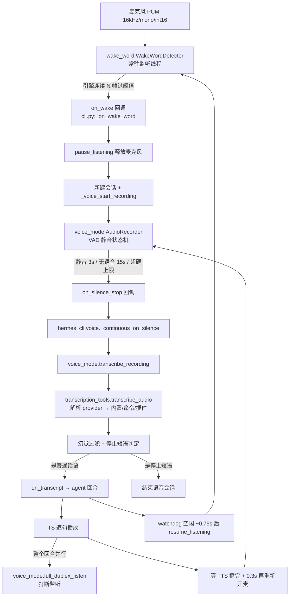

# R9B 底稿 · 语音输入与唤醒

> 证据层底稿。凡对 hermes-agent 行为的断言,锚点 `路径:行号 @ 863e313` **单独成行、置于块前**,
> 紧跟逐字源码块。基线只读,本轮未修改基线任何文件。
>
> 术语一次性锚定(成品章要重讲):
> **STT** = speech-to-text,语音转文字;**TTS** = text-to-speech,文字转语音;
> **VAD** = voice activity detection,判断"这一小段音频里有没有人在说话";
> **RMS** = root-mean-square,一段 PCM 采样的能量均方根,这里当"响度"用;
> **PCM / int16** = 未压缩的原始音频采样,每个采样 16 位有符号整数,取值 -32768..32767;
> **PortAudio / sounddevice** = 跨平台音频设备库 / 它的 Python 绑定;
> **barge-in** = 用户在 agent 说话时抢话打断;
> **KWS** = keyword spotting,关键词检出;
> **hotword / wake word** = 唤醒词,常驻监听等的那个短语。

---

## 0. 本簇范围与文件清单(行数)

| 文件 | 行数 | 一句话职责 |
|---|---|---|
| `agent/transcription_provider.py` | 193 | STT 插件后端的抽象基类(ABC),只定义契约不含实现 |
| `agent/transcription_registry.py` | 124 | 进程内 STT 插件注册表 + "内置名永远赢"的守卫 |
| `tools/transcription_tools.py` | 2687 | STT 总入口:provider 解析四级、8 个内置后端、音频校验与转码 |
| `tools/voice_mode.py` | 2308 | CLI/TUI 侧的音频原语:录音+VAD、播放、打断监听、幻觉过滤、分块 |
| `tools/wake_word.py` | 1464 | 唤醒词常驻监听:3 个本地引擎、单例+跨进程麦克风租约 |
| 合计 | 6776 | |

本簇**不含**驱动整个对话循环的那一层。真正的"连续语音会话状态机"在
`hermes_cli/voice.py`(1060 行),唤醒后的会话编排在 `cli.py`。本底稿在第 2 节把它们
一并走通,因为不看它们就答不出"谁负责哪一段"。

---

## 1. 两个大文件的结构测绘(区间 → 职责)

### 1.1 `tools/transcription_tools.py`(2687 行)

区段边界取自文件里的 `# ---` 分隔注释,标题为注释原文的中文转述。

| 行号区间 | 段名 | 职责 |
|---|---|---|
| 1–85 | 模块头 + 键解析 | 模块 docstring;`get_env_value` 延迟绑定;`_resolve_provider_key` 走共享凭据解析器 |
| 86–104 | 可选依赖探测 | `_safe_find_spec` 只查 spec 不 import,得到 `_HAS_FASTER_WHISPER/_HAS_OPENAI/_HAS_MISTRAL/_HAS_PILK` |
| 105–141 | 常量 | 默认 provider/模型、各家 base_url、`SUPPORTED_FORMATS`、`MAX_FILE_SIZE`、本地模型单例锁 |
| 142–333 | 配置助手 | `_load_stt_config`、`is_stt_enabled`、`_resolve_stt_language`、ffmpeg 查找与转码、本地命令模板、`_try_lazy_install_stt` |
| 335–350 | `BUILTIN_STT_PROVIDERS` | 8 个内置名的唯一定义处 |
| 353–966 | **命令型 provider 注册表** | `stt.providers.<name>: type: command` 的全套:配置解析、shell 引号感知渲染、进程树超时终止、输出读取 |
| 968–1121 | **provider 解析** | `_get_provider`:显式配置 vs 自动探测;`_unregistered_stt_provider_error` |
| 1123–1269 | 插件 provider 派发 | `_dispatch_to_plugin_provider`,含 4 条不变式 |
| 1271–1375 | 共享校验 | 符号链接/存在性/大小/格式;`.silk`(微信语音)→ WAV 预处理 |
| 1376–1821 | **Provider: local** | faster-whisper:CUDA 回退、VAD 参数、置信度闸门、幻觉段丢弃;以及 `local_command`(本地 whisper CLI) |
| 1822–1886 | Provider: groq | Whisper API(免费额度) |
| 1887–2000 | Provider: openai | 同时是**所有 OpenAI 兼容端点的共享后端**(DeepInfra 复用它) |
| 2001–2049 | Provider: mistral | Voxtral Transcribe |
| 2050–2206 | Provider: xai | Grok STT,`POST /v1/stt` multipart |
| 2207–2295 | Provider: elevenlabs | Scribe |
| 2296–2348 | Provider: deepinfra | 只做凭据/模型解析,调用委托给 `_transcribe_openai` |
| 2349–2687 | 公共 API | `transcribe_audio` / `_transcribe_prepared_audio` / `transcribe_audio_local_fallback` / OpenAI 音频客户端解析 / 转录响应归一 |

**读法建议**:要理解这一簇,只需精读 968–1121(解析)、2354–2521(派发)、
1376–1500(本地 whisper 强化)三段;353–966 的命令型注册表是 TTS 那边同款机制的镜像,
结构级理解即可。

### 1.2 `tools/voice_mode.py`(2308 行)

| 行号区间 | 段名 | 职责 |
|---|---|---|
| 1–29 | 模块头 | 定位:CLI 的按键说话(push-to-talk)录音与播放 |
| 30–422 | 惰性音频导入 + 环境探测 | `_import_audio` 永不在模块层 import sounddevice;macOS 输出走 `afplay` 绕开 TCC 权限弹窗;Termux 麦克风探测;`detect_audio_environment`(SSH/容器/WSL 三类硬阻断与提示) |
| 423–437 | 录音参数 | `SAMPLE_RATE=16000`、单声道、int16、`SILENCE_RMS_THRESHOLD=200`、`SILENCE_DURATION_SECONDS=3.0`、临时目录 |
| 439–530 | 提示音 | `play_beep`,音量取自 `voice.beep_volume` |
| 531–679 | **思考音** | agent 长时间跑工具时的低音"水泡"环境音;引用计数 `mark_audio_output_active` 是 barge-in 判相位的依据 |
| 680–807 | `TermuxAudioRecorder` | Android/Termux 的替代采集后端,`supports_silence_autostop = False` |
| 808–1205 | **`AudioRecorder`** | 主采集后端 + **VAD 静音状态机**(核心);`create_audio_recorder` 选后端 |
| 1207–1260 | 幻觉过滤 | 26 条已知 Whisper 静音幻觉短语 + 重复模式正则 |
| 1262–1326 | 停止短语 | `voice.stop_phrases`,严格整句匹配 |
| 1328–1482 | STT 派发 + 分块 | `transcribe_recording`;超限时按 WAV 帧切块 |
| 1484–1732 | 可打断播放 | 全局 `_active_playback` 进程句柄;WSL/PowerShell 兜底 |
| 1733–1892 | **第一代 barge-in** | `listen_for_speech`:滚动噪底 + 8× 倍率(只在播放期间有监听) |
| 1894–2131 | **第二代 barge-in(全双工)** | `full_duplex_listen`:整个回合都在听,回合开始时对**安静房间**标定 |
| 2133–2276 | 需求自检 | `check_voice_requirements`(**本轮 ■ 所在**) |
| 2278–2308 | 临时文件清理 | 删 1 小时前的 `recording_*.wav` |

---

## 2. 一次完整语音交互的走法(唤醒 → 录音 → 转录 → 回合 → 回话)

### 2.1 链路上谁负责哪一段



**分工一句话总结**:`wake_word.py` 只负责"听到那个词",听到就交出麦克风;
`voice_mode.py` 只提供**原语**(开麦、算 RMS、判静音、写 WAV、播放、打断监听);
`hermes_cli/voice.py` 的模块级全局才是**连续会话的状态机**;
`transcription_tools.py` 是一次性的转录函数,不持有任何会话状态。

### 2.2 逐步取证

**(1) 唤醒回调把麦克风让出来,并且只录一句(不是连续)。**

`cli.py:13000` @ 863e313

```python
        # Release the mic so STT can capture the command utterance.
        try:
            from tools.wake_word import pause_listening
            if not pause_listening(owner=self):
                self._wake_word_active = False
                return
```

`cli.py:13040` @ 863e313

```python
        # Single-utterance capture (not continuous) via the voice pipeline;
        # VAD auto-stop transcribes and queues the transcript for process_loop.
        with self._voice_lock:
            self._voice_mode = True
        self._voice_continuous = False
        try:
            self._voice_start_recording()
```

**(2) 唤醒后不靠"录完主动 resume",而是一个看门狗轮询到空闲再 resume。**
理由是"覆盖每一条退出路径(提交了转写、没听到语音、转录出错)而不用把 resume 逻辑
穿到语音机器里去"(`cli.py:12907-12910` 注释)。

`cli.py:13074` @ 863e313

```python
                    # Require a few consecutive idle polls (~0.75s) so we don't
                    # resume in the gap between VAD stop and the agent starting.
                    idle_polls += 1
                    if idle_polls >= 3:
```

**(3) 重新开麦之前必须等 TTS 播完再多等 0.3 秒,否则形成回声自激。**
这是整条链上最"物理"的一处设计:agent 说的话会从扬声器回到麦克风,被当成用户新的一句。

`hermes_cli/voice.py:834` @ 863e313

```python
    if not _tts_playing.is_set():
        _debug("_continuous_on_silence: waiting for TTS to finish")
        _tts_playing.wait(timeout=60)
        import time as _time
        _time.sleep(0.3)
```

**(4) "用户没说话"这件事,在 agent 忙的时候不算数。**
连续模式有"三次静音就退出"的保护;但 agent 跑几分钟工具时用户本来就该沉默。
`_voice_activity_held()` 把这段时间豁免掉,并且**故意 fail-open**(探针抛异常时返回
"不豁免"),这样一个坏探针不会让语音会话永生。

`hermes_cli/voice.py:769` @ 863e313

```python
    _silence_held = (transcript is None and not stop_phrase
                     and _voice_activity_held())
```

`hermes_cli/voice.py:339` @ 863e313

```python
    try:
        return bool(probe())
    except Exception:
        return False
```

---

## 3. 逐机制

### 3.1 采集与 VAD:一个手写的四计时器状态机

**解决什么问题**:用户按一下键(或被唤醒)之后,机器要自己判断"他说完了"。
判早了截断句子,判晚了每句话后面拖 5 秒。

**怎么实现**:`AudioRecorder` 开一条 `sounddevice.InputStream`,回调里对每个音频块算 RMS,
用**四个时间戳**跑状态机。参数与常量:

`tools/voice_mode.py:426` @ 863e313

```python
SAMPLE_RATE = 16000  # Whisper native rate
CHANNELS = 1  # Mono
DTYPE = "int16"  # 16-bit PCM
SAMPLE_WIDTH = 2  # bytes per sample (int16)

# Silence detection defaults
SILENCE_RMS_THRESHOLD = 200  # RMS below this = silence (int16 range 0-32767)
SILENCE_DURATION_SECONDS = 3.0  # Seconds of continuous silence before auto-stop

# Temp directory for voice recordings
_TEMP_DIR = os.path.join(tempfile.gettempdir(), "hermes_voice")
```

四个状态变量 + 两个容忍阈值,一次看全:

`tools/voice_mode.py:837` @ 863e313

```python
        self._has_spoken = False
        self._speech_start: float = 0.0  # When speech attempt began
        self._dip_start: float = 0.0  # When current below-threshold dip began
        self._min_speech_duration: float = 0.3  # Seconds of speech needed to confirm
        self._max_dip_tolerance: float = 0.3  # Max dip duration before resetting speech
        self._silence_start: float = 0.0
        self._resume_start: float = 0.0  # Tracks sustained speech after silence starts
        self._resume_dip_start: float = 0.0  # Dip tolerance tracker for resume detection
```

**第一段:开口确认需要持续 0.3 秒。** 单帧尖峰(咳嗽、键盘)不算开口。

`tools/voice_mode.py:919` @ 863e313

```python
                if rms > self._silence_threshold:
                    # Audio is above threshold -- this is speech (or noise).
                    self._dip_start = 0.0  # Reset dip tracker
                    if self._speech_start == 0.0:
                        self._speech_start = now
                    elif not self._has_spoken and now - self._speech_start >= self._min_speech_duration:
                        self._has_spoken = True
                        logger.debug("Speech confirmed (%.2fs above threshold)",
                                     now - self._speech_start)
```

**第二段:确认开口之后,"续说"也要持续 0.3 秒才重置静音计时。**
这是这段代码里最不直觉、也最关键的一处非对称设计:上升沿要 0.3 秒确认,
下降沿(掉到阈值下)只容忍 0.3 秒的"凹陷"(`_max_dip_tolerance`)。
不这样做,环境噪声的单帧尖峰会不断把静音计时清零,录音永不结束。

`tools/voice_mode.py:928` @ 863e313

```python
                    # After speech is confirmed, only reset silence timer if
                    # speech is sustained (>0.3s above threshold).  Brief
                    # spikes from ambient noise should NOT reset the timer.
                    if not self._has_spoken:
                        self._silence_start = 0.0
                    else:
                        # Track resumed speech with dip tolerance.
                        # Brief dips below threshold are normal during speech,
                        # so we mirror the initial speech detection pattern:
                        # start tracking, tolerate short dips, confirm after 0.3s.
                        self._resume_dip_start = 0.0  # Above threshold — no dip
                        if self._resume_start == 0.0:
                            self._resume_start = now
                        elif now - self._resume_start >= self._min_speech_duration:
                            self._silence_start = 0.0
                            self._resume_start = 0.0
```

**第三段:三个触发条件。**

`tools/voice_mode.py:967` @ 863e313

```python
                # Fire silence callback when:
                # 1. User spoke then went silent for silence_duration, OR
                # 2. No speech detected at all for max_wait seconds
                should_fire = False
                if self._has_spoken and rms <= self._silence_threshold:
                    # User was speaking and now is silent
                    if self._silence_start == 0.0:
                        self._silence_start = now
                    elif now - self._silence_start >= self._silence_duration:
                        logger.info("Silence detected (%.1fs), auto-stopping",
                                    self._silence_duration)
                        should_fire = True
                elif not self._has_spoken and elapsed >= self._max_wait:
                    logger.info("No speech within %.0fs, auto-stopping",
                                self._max_wait)
                    should_fire = True
```

`tools/voice_mode.py:984` @ 863e313

```python
                # 3. Hard cap on total recording length (voice.max_recording_seconds).
                #    Independent of speech/silence so a continuous speaker past the
                #    configured limit still auto-stops instead of recording forever.
                if not should_fire and self._max_duration_reached(elapsed):
                    logger.info("Max recording length reached (%.0fs), auto-stopping",
                                self._max_recording_seconds)
                    should_fire = True
```

**第四段:回调只放一次,并且必须离开音频回调线程。**
音频回调运行在 PortAudio 的实时线程上,在里面做转录会 underrun,所以另起 daemon 线程。

`tools/voice_mode.py:992` @ 863e313

```python
                if should_fire:
                    with self._lock:
                        cb = self._on_silence_stop
                        self._on_silence_stop = None  # fire only once
                    if cb:
                        def _safe_cb():
                            try:
                                cb()
                            except Exception as e:
                                logger.error("Silence callback failed: %s", e, exc_info=True)
                        threading.Thread(target=_safe_cb, daemon=True).start()
```

**为什么这么设计 / 取舍**:

- **不用 Silero/webrtcvad 这类模型 VAD,只用 RMS 阈值。** 代价是对稳态噪声(风扇、空调)
  不鲁棒,好处是零依赖、零延迟、可解释、可用一个整数调。真正的模型 VAD 被推到了
  faster-whisper 内部(见 3.5)。
- **`InputStream` 只开一次、终生不关。** 注释点名了原因:macOS CoreAudio 上反复
  close/open `InputStream` 会无限挂起。代价是空闲时仍占着麦克风(`_recording=False`
  时回调直接丢帧)。

`tools/voice_mode.py:888` @ 863e313

```python
    def _ensure_stream(self) -> None:
        """Create the audio InputStream once and keep it alive.

        The stream stays open for the lifetime of the recorder.  Between
        recordings the callback simply discards audio chunks (``_recording``
        is ``False``).  This avoids the CoreAudio bug where closing and
        re-opening an ``InputStream`` hangs indefinitely on macOS.
        """
```

- **停止时还有两道"这段录音不值得转录"的闸门**:短于 0.3 秒丢弃;
  **峰值** RMS 低于阈值丢弃(注释特意说明用峰值而非均值,因为均值被结尾的静音稀释了)。

`tools/voice_mode.py:1146` @ 863e313

```python
            # Skip silent recordings using peak RMS (not overall average, which
            # gets diluted by silence at the end of the recording).
            if self._peak_rms < SILENCE_RMS_THRESHOLD:
                logger.info("Recording too quiet (peak RMS=%d < %d), discarding",
                            self._peak_rms, SILENCE_RMS_THRESHOLD)
                return None
```

### 3.2 打断(barge-in):两代实现同时在库里

**支持打断,而且是全双工的。** 文件里有两个函数,是同一问题的两代解法,都还在。

**第一代 `listen_for_speech`(1736–1891)**:只在 TTS 播放时起一条边线程,
噪底用**滚动 90 分位**跟踪扬声器串音,触发线 = 噪底 × 8.0,再夹到 4000 RMS 上限。
它的致命形态被第二代的段头注释直接写了出来:

`tools/voice_mode.py:1897` @ 863e313

```python
#
# One listener for the WHOLE agent turn in continuous voice mode: armed the
# moment an utterance is submitted, disarmed when the turn is fully done
# (response + TTS finished). It replaces the scattered per-playback barge
# monitors, which had two class-level failures:
#
#   1. HALF-DUPLEX GAP: the monitor only spawned when TTS playback started,
#      so during LLM generation (seconds to minutes) there was NO microphone
#      listener at all — the user could not interject by voice.
#   2. PLAYBACK DEAFNESS: the monitor calibrated its noise floor WHILE the
#      speaker was already blasting TTS, baking speaker bleed into the floor;
#      with an 8x multiplier the trigger became unreachable for normal speech,
#      and requiring a full second of strictly CONSECUTIVE 30ms blocks above
#      trigger meant any intra-word dip reset the counter.
```

**第二代 `full_duplex_listen`(1950–2130)** 改了三件事:

1. **标定时机**:监听在**提交话语的那一刻**就武装,此时还没有任何 TTS,
   所以前 450 ms 标定的是**安静的房间**,不是自己的扬声器串音。标定完就锁住
   (`floor_locked`),播放期间绝不重标。
2. **相位化的触发线**:按 `is_playing()`(通常接 `is_audio_output_active`)分两相。

`tools/voice_mode.py:2063` @ 863e313

```python
                # Trigger: quiet baseline x multiplier, phase-clamped.
                trigger = quiet_floor * mult
                if playing:
                    trigger = max(trigger, PLAYBACK_MIN_TRIGGER)
                else:
                    trigger = max(trigger, float(SILENCE_RMS_THRESHOLD) * 2)
                trigger = min(trigger, TRIGGER_CEILING)
```

三个常量都带了实测区间的注释:扬声器串音典型几百 RMS(近距大音量约 1000–1400),
正常说话 3000–8000 RMS,所以播放相位下限 1500、天花板 4000、默认倍率 3.0。

3. **窗口多数决替代严格连续**:词内的能量凹陷不再把计数清零。

`tools/voice_mode.py:1997` @ 863e313

```python
    trip_needed = max(1, int(round(trip_blocks * 0.8)))
```

`tools/voice_mode.py:2101` @ 863e313

```python
                if not (above and sum(recent_above) >= trip_needed):
                    continue
```

**两个还在的细节**:

- **grace 窗口只在"播放在真正的间隔之后重新开始"时才给**,防止句间抖动把 grace
  串成一片、把真正的插话吞掉(阈值 33 块 ≈ 1 秒):

`tools/voice_mode.py:2048` @ 863e313

```python
                # Playback phase transitions: grace only when playback starts
                # after a real gap (>=1s), so inter-sentence flapping of the
                # audio-active flag can't chain grace windows together and
                # swallow a genuine interjection.
                if playing and not playing_prev:
                    if not playback_seen or blocks_since_playback > 33:
                        grace_remaining = grace_blocks
```

- **pre-roll 环形缓冲 1200 ms**:触发时把触发前的 1.2 秒一起写进 WAV,
  所以打断的第一个音节不会丢。这一点两代都有(`pre_roll_ms=1200`)。

**取舍**:全双工监听意味着**整个 agent 回合期间麦克风都开着**,并且是**第二条**
`InputStream`(录音那条是 `AudioRecorder` 的)。仓库自己在唤醒词那边写明"一个设备上
开两条输入流跨平台不可靠":

`tools/wake_word.py:24` @ 863e313

```python
mode. The detector runs on its own daemon thread; callers ``pause()`` it while a
voice turn holds the microphone and ``resume()`` it once the system is idle
again (two input streams on one device is unreliable cross-platform).
```

这里之所以不冲突,是因为唤醒词监听器在
语音回合期间已经被 pause 掉了 —— 但 `AudioRecorder` 的常驻流与 `full_duplex_listen`
的流确实同时存在。**未验证**:真机上这两条流是否稳定共存,本容器无音频设备无法实测。

### 3.3 唤醒词:三引擎、全本地、单例 + 跨进程租约

**解决什么问题**:免手操作。用户说"hey hermes",系统开一个新会话并开始录一句命令。

**用什么引擎**:三个,**全部在设备上跑**,没有云端唤醒 API。

| 引擎 | 类型 | 密钥 | 检测键 |
|---|---|---|---|
| openwakeword(默认) | 本地 ONNX/tflite 小模型 | 无 | 模型文件(仓库自带 `hey_hermes`) |
| sherpa-onnx KWS | 本地流式 zipformer,**开放词表** | 无 | `wake_word.phrase` 运行时 BPE 分词 |
| Porcupine | Picovoice 本地引擎 | `PORCUPINE_ACCESS_KEY` | 内置关键词或 `.ppn` |

默认配置:

`tools/wake_word.py:75` @ 863e313

```python
_DEFAULTS: Dict[str, Any] = {
    "enabled": False,
    "surface": "auto",
    "input_device": None,
    # Where PCM is captured:
    #   "local"  — PortAudio on the backend host (historic default)
    #   "client" — desktop/TUI streams int16 frames via wake.feed
    #   "auto"   — local when a device exists, else client capture
    "capture": "auto",
    "provider": "openwakeword",
    "phrase": "hey hermes",
    "sensitivity": 0.6,
    "confirmation_frames": _DEFAULT_CONFIRMATION_FRAMES,
    "start_new_session": True,
}
```

**误唤醒怎么抑制** —— 三道,层次分明:

**(a) 帧级:连续 N 帧过阈值才算数。** openWakeWord 一次只给 80 ms 一帧打分,
背景对话里的一个杂散音素可能把单帧顶过阈值;真短语会把分数在若干帧上撑住。

`tools/wake_word.py:560` @ 863e313

```python
    def process(self, frame) -> bool:
        scores = self._model.predict(frame)
        over = any(score >= self._threshold for score in scores.values())
        # Require N consecutive over-threshold frames: a real phrase holds the
        # score high across frames, a stray ambient phoneme spikes just one.
        if over:
            self._confirm_streak += 1
            if self._confirm_streak >= self._confirm_needed:
                self._confirm_streak = 0
                return True
            return False
        self._confirm_streak = 0
        return False
```

**(b) 事件级:2 秒冷却 + 回调在飞标志。** 一次"hey hermes"横跨多帧,不能在调用方还
没反应过来时重复触发。

`tools/wake_word.py:1199` @ 863e313

```python
                if fired:
                    now = time.monotonic()
                    if now - self._last_fire >= self.cooldown:
                        self._last_fire = now
                        logger.info("wake word: phrase detected — firing callback")
                        if not self._callback_inflight.is_set():
                            self._callback_inflight.set()
                            threading.Thread(
                                target=self._dispatch_wake,
                                daemon=True,
                                name="wake-word-callback",
                            ).start()
                    else:
                        logger.debug("wake word: detection within cooldown — ignored")
```

**(c) 生命周期级:每次 (重)启动清空引擎内部缓冲。** 否则 pause 之前捕获的音频会在
resume 的瞬间再次点火,形成"唤醒 → 语音 → resume → 再唤醒"的失控环。

`tools/wake_word.py:1141` @ 863e313

```python
        # Drop any buffered audio/feature state so a resume right after a voice
        # turn can't immediately re-fire on audio captured before the pause (the
        # wake → voice → resume → wake runaway loop).
        try:
            self.engine.reset()
        except Exception:
            pass
```

**灵敏度语义被强行统一成"越高越严"。** 这是一个值得抄的接口设计:三个引擎的原生
参数方向不同,配置层只暴露一个 0..1 的 `sensitivity`,在各引擎构造器里做映射。

`tools/wake_word.py:764` @ 863e313

```python
        # Porcupine's `sensitivities` runs the OPPOSITE way to our shared knob:
        # per Picovoice, higher = more true positives AND more false alarms
        # (looser). Our config contract is "higher = stricter" everywhere, so
        # invert it here to keep one consistent meaning across all engines.
        porcupine_sensitivity = 1.0 - _sensitivity(cfg)
```

`tools/wake_word.py:687` @ 863e313

```python
        # Map the shared 0..1 sensitivity onto sherpa's keywords_threshold.
        # 0.5 lands exactly on sherpa's recommended default (0.25); live TTS
        # matrix testing showed our previous stricter mapping (0.35) missed
        # ~12% of true positives while 0.25 held zero false fires.
        threshold = 0.05 + 0.4 * _sensitivity(cfg)
```

注意映射是 `0.05 + 0.4 * s`:s=0.5 → 0.25(sherpa 推荐默认),s=0.6(Hermes 默认)→ 0.29,
s=1.0 → 0.45。**方向是"越高越严"**,与 openWakeWord 的裸阈值同向,与 Porcupine 反向(故取反)。

**资源开销**:一条 16 kHz 单声道 int16 输入流 + 每 80 ms 一次小模型前向。
`SAMPLE_RATE=16000`,`frame_length=1280`(openWakeWord/sherpa)或引擎自报(Porcupine)。
即 12.5 次推理/秒。模型体量:自带 `hey_hermes` 在 `tools/wakewords/`;
sherpa 模型约 13 MB,首次使用一次性下载到 `~/.hermes/cache/wakewords/`。

**隐私边界**:检测阶段音频不出机器。三个引擎构造器里唯一的网络动作是**下载模型**:

`tools/wake_word.py:614` @ 863e313

```python
    archive = root / f"{_SHERPA_KWS_MODEL_DIR}.tar.bz2"
    logger.info("wake word: downloading sherpa KWS model (one-time, ~13 MB)")
    urllib.request.urlretrieve(_SHERPA_KWS_MODEL_URL, archive)  # noqa: S310
```

**负结论(带搜索面)**:在 `tools/wake_word.py` 全文用
`grep -nE "urllib|requests|http|urlretrieve|socket"` 搜索,命中 6 处:
118 行(注释里的 upstream issue 链接)、592 行(sherpa 模型 URL 常量)、
611/616 行(模型下载)、759/905 行(Picovoice 控制台链接文案)。
**没有任何一处把 PCM 送出进程**。此结论覆盖面仅限本文件;
`capture: client` 模式下 PCM 由桌面端经 `wake.feed` RPC 送到后端,那段代码在
`tui_gateway/server.py`,不在本簇。

```verify
cd /home/user/hermes-agent && grep -nE "urllib|requests|http|urlretrieve|socket" tools/wake_word.py
```

**跨进程单麦克风租约**。CLI / TUI / 桌面 GUI 三个界面共享一个麦克风,所以除了
进程内单例 `_detector`,还有一把**文件锁**。

`tools/wake_word.py:1318` @ 863e313

```python
    with _detector_lock:
        if _detector is not None:
            if _detector_owner is not owner:
                raise WakeWordInUse("Wake-word microphone is already owned.")
            _detector.on_wake = on_wake
            _detector.resume()
            return _detector
        lock_handle = _acquire_machine_lock()
```

`tools/wake_word.py:1256` @ 863e313

```python
        else:
            import fcntl

            fcntl.flock(handle.fileno(), fcntl.LOCK_EX | fcntl.LOCK_NB)
    except (OSError, BlockingIOError) as e:
        handle.close()
        raise WakeWordInUse("Wake-word microphone is already owned.") from e
```

锁文件路径:

`tools/wake_word.py:1235` @ 863e313

```python
def _lock_path() -> Path:
    from hermes_constants import get_default_hermes_root

    return get_default_hermes_root() / "runtime" / "wake-word.lock"
```

Windows 走 `msvcrt.locking`。所有权是**粘性**的:第一个 claim 的界面一直持有,
不会静默故障转移。

**"哑麦"检测**:流开着但每帧都是零,这在 macOS 权限没给、或选错设备时非常常见。
检测器统计连续近零帧,超过 10 秒把 `audio_silent` 置位,状态界面就能区分
"在听"和"聋了"。

`tools/wake_word.py:1180` @ 863e313

```python
                if peak <= _SILENCE_PEAK:
                    self._silent_frames += 1
                    if self._silent_frames == silent_alert_frames:
                        self.audio_silent = True
                        logger.warning(
                            "wake word: mic delivers only silence (peak<=%d for %ds); %s",
                            _SILENCE_PEAK, _SILENCE_ALERT_SECONDS,
                            silent_audio_hint(self.input_device_details),
                        )
```

**平台特判(值得抄的一条)**:openWakeWord 的 ONNX 后端在 macOS ARM64 上打分近零 ——
监听器会"武装但永不触发"。代码把这一个组合**强制**改成 tflite,并解释了为什么不尊重
用户的显式配置。

`tools/wake_word.py:109` @ 863e313

```python
def default_inference_framework() -> str:
    """The openWakeWord backend to use on this platform.

    openWakeWord's ONNX backend produces near-zero scores on macOS ARM64 — its
    shared *embedding* model is the broken stage (the melspectrogram front-end
    and the wake classifier both match tflite exactly). The detector arms, the
    microphone works, and no phrase can ever cross the threshold. Prefer the
    tflite backend there; ONNX stays the default everywhere else.

    Upstream: https://github.com/dscripka/openWakeWord/issues/336
    """
    return "tflite" if _is_macos_arm64() else "onnx"
```

### 3.4 转录:整段、非流式;provider 解析是四级瀑布

**是流式还是整段?整段。** 入口 `transcribe_audio(file_path)` 收一个**文件路径**,
返回一个完整字符串。没有任何后端走增量/流式返回。

**负结论(带搜索面)**:在 `tools/transcription_tools.py` 全文
`grep -nEi "stream|websocket|yield |chunk"` 后剔除命令型 provider 的
子进程读管道相关词(`output_queue|read_stream|open_streams|readers|stdout|stderr`),
剩余命中只有 3 类:`_iter_command_stt_providers` 的 `yield`(配置迭代)、
注释里的 "downstream/upstream" 措辞。**没有 STT 流式接口**。

```verify
cd /home/user/hermes-agent && grep -nEi "stream|websocket|yield |chunk" tools/transcription_tools.py \
  | grep -viE "output_queue|read_stream|open_streams|readers|stdout|stderr"
```

**分块策略在上一层,而且是"失败后才分"。** `voice_mode.transcribe_recording` 先原样送,
只有当 provider 自己回报 "File too large" 才切块 —— 本地 provider 没有上传上限,
所以永远走不到这条路。

`tools/voice_mode.py:1348` @ 863e313

```python
    # Only chunk when the provider itself reports "File too large" —
    # local providers (faster-whisper, whisper.cpp, etc.) have no upload
    # cap so ``transcribe_audio`` will never return this error for them.
    if not result.get("success") and "File too large" in result.get("error", ""):
        result = _transcribe_wav_in_chunks(wav_path, model=model, max_file_size=MAX_FILE_SIZE)
```

切块本身是**按字节切 WAV 帧**,不看语音边界(`_split_wav_for_transcription`,
1436–1481),留 64 KB 头部余量,按 `block_align` 对齐。
取舍很直白:实现两行,代价是可能把一个词劈成两半;但触发条件是 >25 MB 的
16 kHz 单声道 WAV(≈13 分钟),这种长度里劈一个词无关紧要。

**provider 解析:四级瀑布 + "内置永远赢"。** 优先级写在段头注释里:

`tools/transcription_tools.py:362` @ 863e313

```python
# Resolution order:
#   1. Built-in (``local``, ``local_command``, ``groq``, ``openai``,
#      ``mistral``, ``xai``)              → native handler. **Always wins.**
#   2. ``stt.providers.<name>: type: command``  → command-provider runner.
#   3. Plugin-registered TranscriptionProvider  → plugin dispatch.
#   4. No match                                 → "No STT provider available".
```

派发实现在 `_transcribe_prepared_audio`(2354–2521):先是 8 个内置名的 if 链,
然后命令型,再插件,最后"未注册"错误。为什么命令型排在插件前:

`tools/transcription_tools.py:2458` @ 863e313

```python
    # User-declared command-type provider
    # (``stt.providers.<name>: type: command``). Fires after the built-in
    # elif chain — built-in names short-circuit upstream so a user's
    # ``stt.providers.openai.command`` can't override the real OpenAI
    # handler — and BEFORE the plugin dispatcher, because config is more
    # local than a plugin install (same precedence rule as TTS PR #17843).
```

**显式配置 vs 自动探测,是两套完全不同的语义。** `_get_provider`(968–1104):
配置了 `stt.provider` 就**尊重到底,不静默回落到云**(失败即 `"none"`);
没配才走 `local > groq > openai > mistral > xai > elevenlabs > deepinfra`。
自动探测顺序里两处刻意的安排都有注释:

`tools/transcription_tools.py:1063` @ 863e313

```python
    # --- Auto-detect (no explicit provider):
    #     local > groq > openai > mistral > xai > elevenlabs > deepinfra ---
    # DeepInfra is tried LAST so adding DEEPINFRA_API_KEY (commonly set for the
    # chat surface) never silently displaces an existing xAI/ElevenLabs STT
    # auto-selection; a DeepInfra-only box still resolves to it. mistral is
    # intentionally skipped while `mistralai` is quarantined on PyPI (malicious
    # 2.4.6 release on 2026-05-12).
```

唯一的例外是 `local` 与 `local_command` 之间**互相**兜底:配了 `local` 但没装
faster-whisper 会试 `local_command`,反之亦然(1183 起的两个分支)。

### 3.5 音频预处理:三个不同的转换点

| 触发条件 | 目标格式 | 在哪 | 用什么 |
|---|---|---|---|
| 输入是 `.silk`(微信语音) | WAV | `tools/transcription_tools.py:1336`:`def _prepare_audio_for_transcription(` | `pilk`(惰性安装) |
| 输入是 `.caf`(iMessage)且 provider 非本地 | WAV | `tools/transcription_tools.py:1718`:`def _convert_caf_to_wav(` | ffmpeg 或 macOS `afconvert` |
| OpenAI 兼容端点回 BadRequest 且报文含 unsupported/corrupted/invalid file | 16 kHz 单声道 AAC/m4a | `tools/transcription_tools.py:219`:`def _transcode_audio_for_stt(` | ffmpeg,`-ac 1 -ar 16000 -c:a aac -b:a 32k` |

第三条最能说明设计取向:**不预防性转码,只在被拒之后重试一次**。

`tools/transcription_tools.py:1961` @ 863e313

```python
                except BadRequestError as exc:
                    message = str(exc).lower()
                    if not any(k in message for k in ("unsupported", "corrupted", "invalid file")):
                        raise
                    # Newer models (e.g. gpt-4o-transcribe) reject some containers
                    # whisper-1 accepted (notably Ogg/Opus voice notes). Transcode
                    # to a compact .m4a and retry once.
```

另外 `local_command`(本地 whisper CLI)这条路会把非 WAV/AIFF 输入无条件用 ffmpeg
转 WAV(`_prepare_local_audio`,1693–1715),因为 CLI 通常只吃这两种。

**重采样在哪?严格说不在这一簇做。** 采集端直接以设备默认采样率开流
(`_default_input_samplerate`),写 WAV 时把真实采样率写进头里
(`AudioRecorder._write_wav(..., sample_rate=self._sample_rate)`),
重采样交给 whisper/ffmpeg。降噪:**没有**,只有 RMS 门限和 whisper 内部的 VAD。

### 3.6 本地 whisper 的抗幻觉硬化(三层)

**解决什么问题**:Whisper 系模型对静音/噪声会凭空产出文本("Thank you for watching"),
在语音助手里表现为"我没说话,它自己回了一句"。

三层闸门,层次是刻意分开的:

**第一层:让静音根本不进模型。** `vad_filter=True`(faster-whisper 内置 Silero VAD),
默认开;`condition_on_previous_text=False`,断掉幻觉自我强化。

`tools/transcription_tools.py:1522` @ 863e313

```python
    kwargs: Dict[str, Any] = {
        "beam_size": 5,
        # Don't feed the previous window's text back as a prompt: a single
        # hallucinated token otherwise seeds a self-reinforcing run of them.
        "condition_on_previous_text": False,
    }
```

**第二层:把置信度阈值推进 faster-whisper 内部。** 这一段注释记录了一个很典型的
"配置项形同虚设"的 bug:库自己的内部默认会**先于**外层后过滤丢段,所以外层的旋钮对
第一道闸门是死的;非英语解码的 `avg_logprob` 天然更低,英语调出来的默认值会整句吞掉。

`tools/transcription_tools.py:1544` @ 863e313

```python
    # Push the confidence gate down into faster-whisper itself. Without this the
    # library's own internal defaults (no_speech_threshold=0.6, log_prob_
    # threshold=-1.0) drop low-confidence segments BEFORE they reach our
    # _is_hallucinated_segment post-filter, so the ``stt.local`` threshold knobs
    # were dead for that first gate. Non-English speech decodes at a lower
    # avg_logprob, so the English-tuned defaults silently discard whole
    # utterances. Mapping the same config values through keeps both gates in
    # sync and makes the knobs actually usable. Defaults are unchanged, so
    # behavior is identical unless a user tunes them.
```

**第三层:段级 AND 闸门。** 必须**同时**满足"模型认为这段不是语音"和"解码置信度低"
才丢。安静但真实的说话只会命中其中一个,得以幸存。

`tools/transcription_tools.py:1583` @ 863e313

```python
def _is_hallucinated_segment(segment: Any, no_speech_threshold: float, logprob_threshold: float) -> bool:
    """True when a segment is very likely a silence hallucination.

    Conservative AND gate (matches openai-whisper's own heuristic): the model
    must BOTH think the window is non-speech (high no_speech_prob) AND have
    decoded it with low confidence (low avg_logprob). Quiet-but-real speech
    fails one of the two conditions and survives.
    """
```

**第四层(在 voice_mode 里,跨 provider 生效):短语黑名单 + 重复正则。**
26 条已知幻觉短语,含俄/法/意/德/日多语种。这一层对**所有** provider 生效,
包括云端的,因为它作用在最终文本上。

`tools/voice_mode.py:1242` @ 863e313

```python
_HALLUCINATION_REPEAT_RE = re.compile(
    r'^(?:thank you|thanks|bye|you|ok|okay|the end|\.|\s|,|!)+$',
    flags=re.IGNORECASE,
)
```

**一个很妙的交互修复**:黑名单里有 "bye" / "okay",而它们可能正是用户配置的
**停止短语**。所以过滤前先问一句"这是不是停止短语",是就放行。

`tools/voice_mode.py:1354` @ 863e313

```python
    # Filter out Whisper hallucinations (common on silent/near-silent audio).
    # A configured voice-chat stop phrase is checked FIRST and always survives:
    # phrases like "bye" or "okay" overlap the hallucination blocklist/repeat
    # regex, and swallowing them here would make saying "bye" (when configured
    # as a stop phrase) silently fail to end the voice chat.
```

### 3.7 命令型 provider:与内置 `local_command` 是两套东西

这是本簇最容易看混的一处。**两条 shell 逃生舱并存**,语义不同:

| 维度 | 内置 `local_command` | `stt.providers.<name>: type: command` |
|---|---|---|
| 触发 | 环境变量 `HERMES_LOCAL_STT_COMMAND`,或 PATH 上找到 `whisper` | 配置里声明 |
| 数量 | 只能有一个 | 任意多个,可按名字在 `stt.provider` 里选 |
| 占位符 | `{input_path} {output_dir} {language} {model}`,`str.format` | 再加 `{output_path} {format}`,自写的引号感知渲染器 |
| 执行方式 | `shlex.split` + `subprocess.run`(**不过 shell**) | `shell=True`(**过 shell**,支持管道/curl 一行流) |
| 超时 | 300 秒**总**超时 | 默认 300 秒**空闲**超时,有输出就续命 |
| 子进程环境 | 清洗掉 Hermes 密钥 | 清洗 + `env_passthrough` 白名单放行 |

`tools/transcription_tools.py:1766` @ 863e313

```python
            command = command_template.format(
                input_path=shlex.quote(prepared_input),
                output_dir=shlex.quote(output_dir),
                language=shlex.quote(language),
                model=shlex.quote(normalized_model),
            )
```

`tools/transcription_tools.py:1778` @ 863e313

```python
            subprocess.run(
                shlex.split(command),
                check=True,
                capture_output=True,
                text=True,
                encoding="utf-8",
                errors="replace",
                timeout=300,
                stdin=subprocess.DEVNULL,
                env=child_env,
                creationflags=windows_hide_flags(),
            )
```

命令型注册表这边则是引号上下文感知的替换 —— 占位符落在单引号里就按单引号转义,
落在双引号里就转义 `$` / 反引号 / `"`,裸的用 `shlex.quote`(Windows 用
`subprocess.list2cmdline`)。

`tools/transcription_tools.py:537` @ 863e313

```python
    if quote_context == "'":
        return value.replace("'", r"'\''")
    if quote_context == '"':
        return (
            value
            .replace("\\", "\\\\")
            .replace('"', r'\"')
            .replace("$", r"\$")
            .replace("`", r"\`")
        )
```

**空闲超时而不是总超时**,是从 TTS 那边搬过来的经验:慢但活着的 provider 不该被杀。

`tools/transcription_tools.py:1783` 附近同款 `hermes_subprocess_env(inherit_credentials=False)`
出现在两条路径上,注释都指向同一个 issue #56332(子进程曾继承完整环境)。

### 3.8 provider 抽象 / registry:与 TTS 同构,与 image/video/browser 不同构

**同构证据(可复现的量化)**:把 `agent/transcription_registry.py` 与四个兄弟 registry
做行级相似度(difflib.SequenceMatcher.ratio),tts 明显是同一模板:

```console
transcription_registry vs tts_registry line-similarity ratio = 0.636
agent/image_gen_registry.py        0.327
agent/video_gen_registry.py        0.342
agent/web_search_registry.py       0.201
agent/browser_registry.py          0.304
```

```verify
cd /home/user/hermes-agent && /home/user/hermes-venv/bin/python -c "
import difflib, pathlib
a = pathlib.Path('agent/transcription_registry.py').read_text(encoding='utf-8').splitlines()
for f in ['agent/tts_registry.py','agent/image_gen_registry.py','agent/video_gen_registry.py','agent/web_search_registry.py','agent/browser_registry.py']:
    c = pathlib.Path(f).read_text(encoding='utf-8').splitlines()
    print('%-32s %.3f' % (f, difflib.SequenceMatcher(None, a, c).ratio()))
"
```

**决定性的结构差异**:"内置名永远赢"这条不变式**只有 STT 和 TTS 两家有**。

```console
agent/image_gen_registry.py  _BUILTIN_NAMES_hits=0
agent/video_gen_registry.py  _BUILTIN_NAMES_hits=0
agent/web_search_registry.py  _BUILTIN_NAMES_hits=0
agent/browser_registry.py  _BUILTIN_NAMES_hits=0
agent/tts_registry.py  _BUILTIN_NAMES_hits=3
agent/transcription_registry.py  _BUILTIN_NAMES_hits=3
```

```verify
cd /home/user/hermes-agent && for f in agent/image_gen_registry.py agent/video_gen_registry.py agent/web_search_registry.py agent/browser_registry.py agent/tts_registry.py agent/transcription_registry.py; do echo "$f  _BUILTIN_NAMES_hits=$(grep -c _BUILTIN_NAMES $f)"; done
```

ABC 契约本身也是同一模具:`name`(抽象)、`display_name`、`is_available`、
`list_models`、`default_model`、`get_setup_schema`、外加一个抽象的执行方法
(`transcribe` / `synthesize`)。TTS 多两个(`list_voices`、`stream`),
STT 少 —— 因为 STT 就没有流式(见 3.4)。

**"内置永远赢"是三处防御**:注册时拒绝、派发时再查、外加一个回归测试盯着两份名单不漂。

`agent/transcription_registry.py:40` @ 863e313

```python
_BUILTIN_NAMES = frozenset({
    "local",
    "local_command",
    "groq",
    "openai",
    "mistral",
    "xai",
    "elevenlabs",
    "deepinfra",
})
```

`tools/transcription_tools.py:341` @ 863e313

```python
BUILTIN_STT_PROVIDERS = frozenset({
    "local",
    "local_command",
    "groq",
    "openai",
    "mistral",
    "xai",
    "elevenlabs",
    "deepinfra",
})
```

之所以要抄两份而不是 import 一份,是循环依赖:`tools.transcription_tools` 要 import
`agent.transcription_registry` 做派发。抄两份的代价用一个测试兜住
(`tests/agent/test_transcription_registry.py:176`:`def test_registry_builtins_match_dispatcher_builtins(`)。
**这个兜底只覆盖了这两份 —— 第三份没有人盯,而它正是漂掉的那一份**(见 6 节 ■-1)。

### 3.9 隐私与凭据

**音频去哪了**,按 provider 分:

- `local`(默认)/ `local_command`:**不出机器**。
- `groq` / `openai` / `mistral` / `xai` / `elevenlabs` / `deepinfra`:整段音频文件
  上传到对应厂商 API。
- `openai` 且没有任何本地密钥时:回落到 **Nous 托管网关**,音频送到
  `managed_gateway.gateway_origin`,用 `nous_user_token` 认证。

`tools/transcription_tools.py:2642` @ 863e313

```python
    managed_gateway = resolve_managed_tool_gateway("openai-audio")
    if managed_gateway is None:
        message = "Neither stt.openai.api_key in config nor VOICE_TOOLS_OPENAI_KEY/OPENAI_API_KEY is set"
```

**有本地优先**:默认 provider 就是本地。

`tools/transcription_tools.py:109` @ 863e313

```python
DEFAULT_PROVIDER = "local"
DEFAULT_LOCAL_MODEL = "base"
DEFAULT_LOCAL_STT_LANGUAGE = "en"
```

自动探测第一顺位也是 local,并且会为它触发一次惰性安装才肯往云上落
(`_try_lazy_install_stt`,1076 行)。

**一道很值得抄的安全闸**:拒绝把凭据文件当音频送去转录。

`tools/transcription_tools.py:2526` @ 863e313

```python
    # Refuse to feed a credential / secret store (auth.json, .env, OAuth
    # tokens, mcp-tokens/, ...) to an STT provider — before ANY validation or
    # preprocessing, so the refusal names the real reason rather than a
    # format error. Mirrors the image-gen / video-gen read guards.
    from agent.file_safety import get_read_block_error
    blocked = get_read_block_error(file_path)
    if blocked:
        return {"success": False, "transcript": "", "error": blocked}
```

同一道闸在 `_transcribe_prepared_audio`(2377)里又挡了一次。另外 `_validate_audio_source_file`
在做任何别的检查之前先拒绝符号链接:

`tools/transcription_tools.py:1299` @ 863e313

```python
    if os.path.islink(audio_path):
        return {"success": False, "transcript": "", "error": f"Path is a symbolic link: {file_path}"}
```

**落盘与留存**:录音会落到磁盘,但落在系统临时目录,不落 `~/.hermes`。

**负结论(带搜索面)**:对本簇 5 个文件用
`grep -nE "tempfile\.|_TEMP_DIR|get_hermes_home|get_default_hermes_root|Path\.home"`
枚举全部落盘点,共 20 处。其中写音频的只有 `_TEMP_DIR`(= 系统临时目录下的
`hermes_voice/`)与 4 处 `tempfile.TemporaryDirectory/mkdtemp`(用完即删);
`get_hermes_home()` 只用于 sherpa 模型缓存,`get_default_hermes_root()` 只用于唤醒锁文件。
**没有任何一处把录音或转写文本写进 `~/.hermes`。**

```verify
cd /home/user/hermes-agent && grep -nE "tempfile\.|_TEMP_DIR|get_hermes_home|get_default_hermes_root|Path\.home" \
  agent/transcription_provider.py agent/transcription_registry.py tools/transcription_tools.py tools/voice_mode.py tools/wake_word.py
```

留存策略:调用方主动清理,默认 1 小时;**只删 `recording_*.wav`**,
`_split_wav_for_transcription` 产生的分块文件名前缀不同,不在这个清理范围内
(它们由 `_transcribe_wav_in_chunks` 的 `finally` 逐个删)。

`tools/voice_mode.py:2296` @ 863e313

```python
    for entry in os.scandir(_TEMP_DIR):
        if entry.is_file() and entry.name.startswith("recording_") and entry.name.endswith(".wav"):
```

**凭据解析**:STT 密钥统一走 `tools.tool_backend_helpers.resolve_provider_secret`,
顺序是 config > env/.env > `hermes auth add <provider>` 建的凭据池
(`tools/transcription_tools.py:71-84` docstring)。唯一的例外是 xAI:
STT 是按量计费端点,显式 `XAI_API_KEY` 优先于订阅型 OAuth 凭据,
因为订阅 OAuth 对 `/v1/stt` 会回"个人团队额度"错误(`tools/transcription_tools.py:2064-2067`)。

### 3.10 `voice_mode.py` 是"模式"还是"会话"?——都不是

**它是一个无状态的原语库,外加三个互不相关的模块级全局。**

`grep -nE '^(_[a-z_]+|[a-z_]+) *(:[^=]*)?= '` 列出 `tools/voice_mode.py` 的模块级可变状态,
只有三组:`_audio_output_active_count`(播放引用计数)、`_thinking_stop`(思考音停止事件)、
`_active_playback`(当前播放子进程句柄)。**没有任何"当前是否在语音模式"的标志。**

```verify
cd /home/user/hermes-agent && grep -nE '^(_[a-z_]+|[a-z_]+) *(:[^=]*)?= ' tools/voice_mode.py
```

"模式"这个概念在三个不同的地方各有一份,名字都叫 voice mode 但**不是一回事**:

| 在哪 | 是什么 | 生命周期 |
|---|---|---|
| `cli.py` 的 `self._voice_mode` / `self._voice_continuous` | CLI 实例上的开关 | 一个 CLI 进程 |
| `hermes_cli/voice.py` 的 `_continuous_active` 等模块全局 | 连续语音**会话**状态机 | 一次语音对话 |
| `gateway/run.py:6229`:`self._voice_mode: Dict[str, str] = self._load_voice_modes()` | 每个聊天会话"要不要用语音回复"的 off/all/voice_only 三态 | 持久化到 `~/.hermes/gateway_voice_mode.json` |

**与网关的关系**:网关那一份**完全不碰** `tools/voice_mode.py` 的采集/播放代码 ——
它没有麦克风,只做"收到语音消息 → 转录 → 回合 → 用 TTS 生成语音回复发回去"。
两边**唯一**的交汇点是 `tools/transcription_tools.transcribe_audio`。

**进入/退出条件**(CLI 连续模式,`hermes_cli/voice.py`):
- 进入:`/voice on`(或按 `voice.record_key`,默认 `ctrl+b`),或被唤醒词触发(单句模式)。
- 退出:① 用户说了一条**恰好等于**停止短语的话;② 连续 3 个"静音周期"且不在豁免期;
  ③ 手动 `/voice off` / 再按一次录音键;④ `rec.start()` 抛异常。

`hermes_cli/voice.py:786` @ 863e313

```python
        should_halt = stop_phrase or (
            _continuous_no_speech_count >= _CONTINUOUS_NO_SPEECH_LIMIT
        )
```

停止短语的匹配**故意严格**:整句(去大小写、去首尾标点)必须等于配置里的某一条,
所以"stop doing that and try again"仍然会送给 agent。

`tools/voice_mode.py:1305` @ 863e313

```python
    cleaned = transcript.strip().lower().strip(".,!?;: \t\n\"'")
```

---

## 4. 配置项与环境变量

### 4.1 `stt.*`(定义处 `hermes_cli/config_defaults.py:1504`)

`hermes_cli/config_defaults.py:1504` @ 863e313

```python
    "stt": {
        "enabled": True,
        # When true, gateway voice messages are transcribed for the agent and
        # the raw transcript is also echoed back to the user as a 🎙️ message.
        # Set false to keep STT for the agent while suppressing that user-facing echo.
        "echo_transcripts": True,
        "provider": "local",  # "local" (free, faster-whisper) | "groq" | "openai" (Whisper API) | "mistral" (Voxtral Transcribe) | "elevenlabs" (Scribe) | "deepinfra"
```

`hermes_cli/config_defaults.py:1517` @ 863e313

```python
        "local": {
            "model": "base",  # tiny, base, small, medium, large-v3
            "language": "",  # auto-detect by default; set to "en", "es", "fr", etc. to force
            "initial_prompt": "",
            # Anti-hallucination hardening (faster-whisper decodes junk tokens
            # from silence/noise without these):
            "vad": True,  # Silero VAD filter — silence never reaches whisper. false = old raw behavior (music/ambient).
            "vad_min_silence_ms": 500,  # min silence (ms) that splits speech chunks when vad is on
            "no_speech_prob_threshold": 0.6,  # drop a segment only if no_speech_prob is ABOVE this...
            "logprob_threshold": -1.0,  # ...AND its avg_logprob is BELOW this (both must hit)
        },
```

注意 `stt.language` 默认是 `"en"`(全局)而 `stt.local.language` 默认是 `""`。
解析顺序 `stt.<provider>.language > stt.language > HERMES_LOCAL_STT_LANGUAGE > None`
(`tools/transcription_tools.py:173-180`),所以**默认全局强制英语**,注释解释了原因:
短/带口音的片段自动检测经常判错语种,用户看到的是"STT 转成了别的语言"。

### 4.2 `voice.*`(定义处 `hermes_cli/config_defaults.py:1555`)

`hermes_cli/config_defaults.py:1555` @ 863e313

```python
    "voice": {
        "record_key": "ctrl+b",
        "max_recording_seconds": 120,
        "auto_tts": False,
        "beep_enabled": True,         # Play record start/stop beeps in CLI voice mode
        "beep_volume": 0.3,           # Beep amplitude multiplier (0.0-1.0, default keeps prior hardcoded value)
        "thinking_sound": True,       # Calm ambient bubble sound while the agent works in voice chat (volume follows beep_volume)
        "silence_threshold": 200,     # RMS below this = silence (0-32767)
        "silence_duration": 3.0,      # Seconds of silence before auto-stop
        "barge_in": True,             # Interrupt the agent / stop TTS when the user starts talking
        "barge_in_grace_seconds": 0.5,  # Trip suppression right after TTS playback starts (onset transient); the mic itself is live for the whole turn
        "barge_in_threshold_multiplier": 3.0,  # Speech trigger = quiet-room floor x this (floor is calibrated BEFORE playback, never against speaker bleed)
```

### 4.3 `wake_word.*`(定义处 `hermes_cli/config_defaults.py:1576`)

`hermes_cli/config_defaults.py:1576` @ 863e313

```python
    "wake_word": {
        "enabled": False,
        "surface": "auto",            # eligible surface: "auto" (first claimant) | "cli" | "tui" | "gui"
        "input_device": None,          # PortAudio input device index/name; null uses the process default
        "capture": "auto",            # auto | local | client — where PCM is captured (client = desktop streams mic via wake.feed)
        "provider": "openwakeword",   # "openwakeword" (free, local) | "sherpa" (free, ANY phrase, no training) | "porcupine" (premium; needs PORCUPINE_ACCESS_KEY)
        "phrase": "hey hermes",       # for "sherpa" this IS the detected phrase (any text works); for other engines it's a cosmetic label — detection is keyed by the model/keyword below
        "sensitivity": 0.6,           # 0.0-1.0 detection threshold, consistent across engines (higher = stricter, fewer false triggers)
        "confirmation_frames": 3,     # openWakeWord only: consecutive over-threshold frames required to fire (higher = fewer false triggers on ambient speech, slightly more latency; 1 = old single-frame behavior)
        "start_new_session": True,    # start a fresh session on wake vs. continue the current one
        "profile_routing": True,      # sherpa only: also listen for every wake-enabled profile's phrase and route the wake to the matching profile
```

注意 `_DEFAULTS`(`tools/wake_word.py:75`)与 `DEFAULT_CONFIG`(config_defaults)是
**两份**默认值,前者少了 `profile_routing` 和三个子块。`_get()` 只在 key 缺失或值为
`None` 时回落到 `_DEFAULTS`,而 `load_wake_word_config()` 走的是合并后的 `load_config()`,
所以正常路径下读到的是 config_defaults 那份;`_DEFAULTS` 是"配置读不出来"时的兜底。
`profile_routing` 在 sherpa 引擎里用 `cfg.get("profile_routing", True)` 单独兜了默认值
(`tools/wake_word.py:658`),所以两份不同步没有造成实际差异 —— 但这是一处待爆的重复。

### 4.4 环境变量(本簇直接读取的)

| 变量 | 读取处 | 作用 | 文档 |
|---|---|---|---|
| `HERMES_LOCAL_STT_COMMAND` | `tools/transcription_tools.py:116`:`LOCAL_STT_COMMAND_ENV = "HERMES_LOCAL_STT_COMMAND"` | 单条本地 STT 命令模板 | 有 |
| `HERMES_LOCAL_STT_LANGUAGE` | `tools/transcription_tools.py:117`:`LOCAL_STT_LANGUAGE_ENV = "HERMES_LOCAL_STT_LANGUAGE"` | 语言提示,**所有** provider 的第 3 顺位 | 有(范围写窄了,见 ◎-1) |
| `PORCUPINE_ACCESS_KEY` | `tools/wake_word.py:755` | Porcupine 密钥 | 有 |
| `HERMES_VOICE_DEBUG` | `tools/voice_mode.py:1936` | `=1` 时把每块 VAD 判决打到 stderr | 有(在 voice-mode.md) |
| `STT_OPENAI_MODEL` / `STT_OPENAI_BASE_URL` / `STT_GROQ_MODEL` / `GROQ_BASE_URL` | `tools/transcription_tools.py:112,121,113,120` | 默认模型/端点覆盖 | 有 |
| `STT_MISTRAL_MODEL` | `tools/transcription_tools.py:114` | Mistral 默认模型 | **无** |
| `STT_ELEVENLABS_MODEL` | `tools/transcription_tools.py:115` | ElevenLabs 默认模型 | **无** |
| `XAI_STT_BASE_URL` | `tools/transcription_tools.py:122` | xAI STT 端点覆盖 | **无** |
| `ELEVENLABS_STT_BASE_URL` | `tools/transcription_tools.py:123` | ElevenLabs STT 端点覆盖 | **无** |

**重要陷阱**:`STT_*_MODEL` 与 `*_BASE_URL` 这一批是**模块导入时**用 `os.getenv` 求值的
模块级常量(112–123 行),不是每次调用求值,也不走 `get_env_value` 的 `.env` 通道。
即:写在 `~/.hermes/.env` 里的这几个变量**不会**生效,必须是进程启动前的真实环境变量。
对比同文件里 `get_env_value()` 明确说明"通过 live config 模块读,以便测试可以 monkeypatch"
(`tools/transcription_tools.py:57-62`)。

```verify
cd /home/user/hermes-agent && sed -n '112,123p' tools/transcription_tools.py
```

密钥类变量(`GROQ_API_KEY` / `MISTRAL_API_KEY` / `ELEVENLABS_API_KEY` /
`DEEPINFRA_API_KEY` / `XAI_API_KEY` / `VOICE_TOOLS_OPENAI_KEY` / `OPENAI_API_KEY`)
不在本簇定义,由 `resolve_provider_secret` 统一解析,本簇只传名字。

---

## 5. 测试作为行为规格

### 5.1 环境

- venv:`/home/user/hermes-venv`,**87 个包**(`[dev]` extra + `aiohttp 3.14.1` + `brotlicffi 1.2.0.1`),本轮**未安装任何新包**。
- 容器:root 运行、无 IPv6、无音频设备、离线。

### 5.2 结果:23 个文件 320 个用例,全绿

```console
tests/tools/test_wake_word.py 等 4 文件        85 tests passed, 0 failed
tests/tools/test_transcription*.py 等 10 文件 140 tests passed, 0 failed
tests/tools/test_voice_*.py 等 9 文件          95 tests passed, 0 failed
```

```verify
cd /home/user/hermes-agent && HERMES_PYTHON=/home/user/hermes-venv/bin/python bash scripts/run_tests.sh \
  tests/tools/test_wake_word.py tests/tools/test_voice_mode.py tests/tools/test_voice_stop_phrase.py \
  tests/tools/test_voice_thinking_sound.py
```

**"无音频设备"没有造成任何失败**,原因值得记:整簇的音频入口都是惰性 import
(`_import_audio` 从不在模块层执行),测试只需 monkeypatch `_import_audio` /
`_audio_available` 就能在无设备环境跑完。这本身就是这套设计的一个可迁移优点 ——
**把不可用的系统依赖压到一个函数后面,而不是压到模块顶层**。

### 5.3 最有信息量的几条行为规格

`tests/agent/test_transcription_registry.py:176`:`def test_registry_builtins_match_dispatcher_builtins(`
—— 两份内置名单不许漂。测试自己的 docstring 把理由写全了:

`tests/agent/test_transcription_registry.py:165` @ 863e313

```python
class TestBuiltinSync:
    """``_BUILTIN_NAMES`` in agent/transcription_registry.py is duplicated
    from ``BUILTIN_STT_PROVIDERS`` in tools/transcription_tools.py
    (importing directly would create a circular dependency). This test
    fails loudly if the two lists drift — a new built-in added to
    transcription_tools.py MUST also be added to
    transcription_registry.py's ``_BUILTIN_NAMES`` or the registry will
    accept a name the dispatcher will silently route to the wrong
    handler.
    """
```

其余按主题:
- `tests/tools/test_stt_silence_hallucinations.py`(11 例)—— 幻觉三层闸门的规格。
- `tests/tools/test_transcription_command_providers.py`(19 例)—— 引号感知渲染与空闲超时。
- `tests/tools/test_transcription_plugin_dispatch.py`(17 例)—— 4 条派发不变式。
- `tests/tools/test_voice_stop_phrase.py`(20 例)—— 停止短语的严格匹配边界。
- `tests/test_voice_max_recording_seconds.py`(3 例)—— 硬上限的 bool/非数值守卫。

### 5.4 覆盖缺口(与 6 节 ■-1 直接相关)

**负结论(带搜索面)**:对 `tests/tools/test_voice_mode.py` 与
`tests/tools/test_voice_cli_integration.py` 搜 `native_stt_available|deepinfra`,
**零命中**。即 `check_voice_requirements` 里那份硬编码的 provider 名单
**没有任何测试覆盖**,这正是它能悄悄漂掉的原因。

```verify
cd /home/user/hermes-agent && grep -rn "native_stt_available\|deepinfra" tests/tools/test_voice_mode.py tests/tools/test_voice_cli_integration.py; echo "exit=$? (1 = 零命中)"
```

---

## 6. 定案

### ■-1 `check_voice_requirements()` 的内置 STT 名单漏了 `deepinfra`,配好 DeepInfra 的用户开不了语音模式

`tools/voice_mode.py:2193` @ 863e313

```python
    native_stt_available = stt_provider in {
        "local",
        "local_command",
        "groq",
        "openai",
        "mistral",
        "xai",
        "elevenlabs",
    }
```

对照权威名单(8 个,含 `deepinfra`):

`tools/transcription_tools.py:341` @ 863e313

```python
BUILTIN_STT_PROVIDERS = frozenset({
    "local",
    "local_command",
    "groq",
    "openai",
    "mistral",
    "xai",
    "elevenlabs",
    "deepinfra",
})
```

**为什么后面几道兜底也救不回来**:`deepinfra` 是内置名,所以
`_resolve_command_stt_provider_config` 一进门就返回 `None`:

`tools/transcription_tools.py:441` @ 863e313

```python
    if key in BUILTIN_STT_PROVIDERS or key == "none":
        return None
```

插件注册表也永远拿不到这个名字(注册时就被 `_BUILTIN_NAMES` 拒了)。
于是 `stt_available` = False。

**实测复现**(伪造配置与密钥,不需要真凭据):

```console
resolved provider = deepinfra
stt_available = False | available = False
details: Audio capture: OK | STT provider: MISSING (uv pip install faster-whisper — `pip install faster-whisper` also works if pip is on PATH, or set GROQ_API_KEY / VOICE_TOOLS_OPENAI_KEY)
"deepinfra" in BUILTIN_STT_PROVIDERS = True
```

```verify
cd /home/user/hermes-agent && PYTHONDONTWRITEBYTECODE=1 /home/user/hermes-venv/bin/python -c "
import sys; sys.path.insert(0,'.')
import tools.transcription_tools as tt, tools.voice_mode as vm
fake = {'enabled': True, 'provider': 'deepinfra', 'deepinfra': {'model': ''}}
tt._load_stt_config = lambda: fake
tt._HAS_OPENAI = True
tt._resolve_provider_key = lambda env, pid: 'sk-fake' if pid == 'deepinfra' else ''
print('resolved provider =', tt._get_provider(fake))
vm._audio_available = lambda: True
vm.detect_audio_environment = lambda: {'available': True, 'warnings': [], 'notices': []}
r = vm.check_voice_requirements()
print('stt_available =', r['stt_available'], '| available =', r['available'])
print('details:', r['details'].replace(chr(10), ' | '))
print('\"deepinfra\" in BUILTIN_STT_PROVIDERS =', 'deepinfra' in tt.BUILTIN_STT_PROVIDERS)
"
```

**用户可见后果**:`/voice on` 直接抛错拒绝开启。

`cli.py:12235` @ 863e313

```python
        if not reqs.get("stt_available", reqs.get("stt_key_set")):
            raise RuntimeError(
                "Voice mode requires an STT provider for transcription.\n"
                "Option 1: uv pip install faster-whisper  "
                "(free, local; `pip install faster-whisper` also works if pip is on PATH)\n"
                "Option 2: Set GROQ_API_KEY (free tier)\n"
```

**而唤醒词那边用的是另一套判据**,所以两个探针会给出**相反**的答案:

`tools/wake_word.py:812` @ 863e313

```python
    try:
        from tools.transcription_tools import _get_provider, _load_stt_config, is_stt_enabled

        stt_config = _load_stt_config()
        return is_stt_enabled(stt_config) and _get_provider(stt_config) != "none"
    except Exception:
        return False
```

于是在 DeepInfra 配置下:`check_wake_word_requirements()` 说 STT 就绪、唤醒词照常武装;
用户说"hey hermes",唤醒回调走到 `_voice_start_recording()` 时才抛错,被这里吞掉:

`cli.py:13047` @ 863e313

```python
        except Exception as e:
            _cprint(f"{_DIM}Wake capture failed: {e}{_RST}")
            # Leave _wake_suspended set; the watchdog resumes once idle.
```

**能唤醒,不能说话。**

**教训(要写进成品章)**:同一份"哪些是内置 provider"的知识在仓库里有 **3 份拷贝**,
回归测试只盯住了其中 2 份 —— 而漂掉的正是没被盯住的第 3 份。
`_stt_ready()` 那种"问权威函数要答案"的写法(`_get_provider(...) != "none"`)
天然不会漂;`native_stt_available` 那种"再抄一份名单"的写法必然会漂。

### ▲-1 四处文档/注释仍称 STT 内置 provider 为"六个",实为八个

同一处过时说法散在四个地方,句子结构都是"列举出全部"而非"举例",所以是矛盾不是保守:

`tools/transcription_tools.py:5` @ 863e313

```python
Provides speech-to-text transcription with six providers:
```

`agent/transcription_provider.py:9` @ 863e313

```python
:func:`tools.transcription_tools.transcribe_audio` call **when the
configured name is neither a built-in (``local``, ``local_command``,
``groq``, ``openai``, ``mistral``, ``xai``) nor disabled**.
```

`agent/transcription_registry.py:11` @ 863e313

```python
Built-ins-always-win
--------------------
Plugin names that collide with a built-in STT provider (``local``,
``local_command``, ``groq``, ``openai``, ``mistral``, ``xai``) are
rejected at registration with a warning. This invariant is also
re-checked at dispatch time in
:func:`tools.transcription_tools._dispatch_to_plugin_provider`.
```

`tools/transcription_tools.py:362` @ 863e313

```python
# Resolution order:
#   1. Built-in (``local``, ``local_command``, ``groq``, ``openai``,
#      ``mistral``, ``xai``)              → native handler. **Always wins.**
```

实际 8 个(`tools/transcription_tools.py:341`,已在上文引全)。
`agent/transcription_provider.py:5-11` 那一整句的主张是"配置名既不是内置也不是禁用时才走插件",
列举的内置集合少了 `elevenlabs` 和 `deepinfra` —— 按这份文档写插件的人会以为可以注册
`elevenlabs`,而 `register_provider` 会拒绝它。**这不是数字保守,是可操作后果上的矛盾**,记 ▲。

**关键对照(见下方"撤回"一节):面向用户的 `website/docs/user-guide/features/tts.md:613`
已经正确写着 8 个内置 provider 并逐个列名。** 所以这四处过时不是"作者忘了更新文档",
而是"作者更新了网站文档、漏了代码里的四份副本" —— 而代码里的副本恰恰是写插件的人
最先读到的那份(它就在 ABC 文件的开头)。

同一处过时说法还传染到了 `_transcribe_prepared_audio` 的 docstring:

`tools/transcription_tools.py:2358` @ 863e313

```python
    Provider priority:
      1. User config (``stt.provider`` in config.yaml)
      2. Auto-detect: local > Groq > OpenAI > Mistral > xAI > ElevenLabs
```

实际自动探测链末尾还有 deepinfra(`tools/transcription_tools.py:1101-1103`)。

### ▲-2 `wake-word.md` 说桌面端可用五个短语结束语音会话,代码只有一个

判定范围:`## How it works` 标题下、第 32–36 行的整段。

`website/docs/user-guide/features/wake-word.md:32` @ 863e313

> On the desktop app, a hands-free voice conversation can be ended by simply
> **saying "stop"** (or "never mind", "goodbye", "cancel", "that's all") — the
> spoken command ends the conversation instead of being sent to the agent. Only a
> whole-utterance stop command matches, so a real request like "stop the docker
> container" still goes through normally.

这段有两个断言:①"可以说 stop / never mind / goodbye / cancel / that's all";
②"只有整句匹配才算"。**②成立**(`is_voice_stop_phrase` 的严格匹配,3.10 已取证)。
**①不成立**:

`tools/voice_mode.py:1266` @ 863e313

```python
DEFAULT_VOICE_STOP_PHRASES = ("stop",)
```

`hermes_cli/config_defaults.py:1570` @ 863e313

```python
        "stop_phrases": ["stop"],
```

**负结论(带搜索面 + 实际输出)**:全仓 `grep -rn "never mind\|that's all\|goodbye"`
(限 `.py/.ts/.tsx/.md`,排除 node_modules)后再筛 `stop_phrase|voice_stop`,**命中 2 条**:

```console
./apps/desktop/src/store/voice-prefs.test.ts:20:    applyVoiceStopPhraseFromConfig({ voice: { stop_phrases: ['goodbye hermes', 'stop'] } })
./website/docs/user-guide/features/voice-mode.md:164:Say **"stop"** — and nothing else — ... (e.g. `["stop", "goodbye hermes"]`), or set it to `[]` to disable. ...
```

```verify
cd /home/user/hermes-agent && grep -rn "never mind\|that's all\|goodbye" --include=*.py --include=*.ts --include=*.tsx --include=*.md . | grep -v node_modules | grep -iE "stop_phrase|voice_stop"
```

两条都不是反例:前者是桌面端测试里的**自定义**短语 `"goodbye hermes"`(不是 `"goodbye"`),
后者是 voice-mode.md 把 `["stop", "goodbye hermes"]` 当**自定义示例**举出来。
`never mind` / `cancel` / `that's all` 三个词在全仓与停止短语毫无关联。

再补一条:桌面端自己**不做**停止短语匹配,只把 `voice.stop_phrases` 的第一条拿来显示提示,
匹配仍在后端 `is_voice_stop_phrase`:

`apps/desktop/src/store/voice-prefs.ts:15` @ 863e313

```typescript
// First configured `voice.stop_phrases` entry — drives the "Say "stop" to end
```

### ▲-3 `wake-word.md` 的 Configuration 块说 `phrase` "只是装饰性标签",与 sherpa 引擎矛盾

`website/docs/user-guide/features/wake-word.md:124` @ 863e313

>   phrase: "hey hermes"        # cosmetic label only — detection is keyed by the model/keyword below

这一行是 `## Configuration` 标题下那个 YAML 示例块里的注释,是对 `phrase` 这个键的一般性说明。
但 sherpa 引擎把 `phrase` 当**检测键**运行时分词:

`tools/wake_word.py:655` @ 863e313

```python
        phrase = str(_get(cfg, "phrase") or "hey hermes").strip()
```

`tools/wake_word.py:663` @ 863e313

```python
        # Runtime tokenization of the arbitrary phrases — the open-vocab core.
        tokens = text2token(
            [p.upper() for p in phrases],
            tokens=str(d / "tokens.txt"),
            tokens_type="bpe",
            bpe_model=str(d / "bpe.model"),
        )
```

同一份文档在 `### Option A — sherpa` 一节自己写了 `phrase: "hey coder"  # detection key`,
而 `config_defaults.py:1582` 的注释也是对的("for `sherpa` this IS the detected phrase")。
所以是 Configuration 块这一行没跟上三引擎化。

### ▲-4 `wake-word.md` 两处"both"仍按两引擎写,该节自己的表格是三行

`website/docs/user-guide/features/wake-word.md:87` @ 863e313

> Both are lazy-installed the first time you enable the wake word (desktop

`website/docs/user-guide/features/wake-word.md:135` @ 863e313

> `sensitivity`, `phrase`, and `start_new_session` apply to both engines. The

第一句归 `## Engines`,该节的表格明确有三行(openWakeWord / sherpa / Porcupine),
所以 "Both" 的指代对象是三个而不是两个 —— 唯一另一种读法是"两个 openWakeWord 后端
(onnx / tflite)",但那两个不是被 lazy-install 的对象(装的是引擎包),读不通。
第二句归 `## Configuration`,而 `_build_engine` 有三个分支:

`tools/wake_word.py:790` @ 863e313

```python
def _build_engine(cfg: Dict[str, Any]) -> _Engine:
    provider = _provider(cfg)
    if provider == "porcupine":
        return _PorcupineEngine(cfg)
    if provider in ("sherpa", "sherpa-onnx", "kws", "open"):
        return _SherpaKwsEngine(cfg)
    if provider in ("openwakeword", "oww", "local"):
        return _OpenWakeWordEngine(cfg)
    raise ValueError(f"Unknown wake_word provider: {provider!r}")
```

且第二句的实质断言("这三个键对所有引擎生效")按三引擎读也是**对的** ——
错的只是"both"这个数量词,以及紧跟的"`openwakeword` 和 `porcupine` 两个块选择实际检测模型"
漏了 `sherpa` 块。记 ▲(数量词与代码矛盾),严重度低。

### ◇-1 `## Configuration` 的参考 YAML 缺 `profile_routing` 与整个 `sherpa:` 子块

`website/docs/user-guide/features/wake-word.md:118` @ 863e313

> wake_word:
>   enabled: false
>   surface: auto               # eligible surface: "auto" | "cli" | "tui" | "gui"

这个块列到 `porcupine.keyword` 为止,**缺两样代码里存在的东西**:
`profile_routing`(`hermes_cli/config_defaults.py:1586`,sherpa 多 profile 路由开关)
与 `sherpa:` 子块(`hermes_cli/config_defaults.py:1599`,含 `model_dir`)。
`openwakeword:` 和 `porcupine:` 两个子块都在,唯独 sherpa 的不在 ——
与 ▲-4 的"both engines"是同一处未跟上三引擎化的遗留。
记 ◇(严重度低:`profile_routing` 在 `### Waking a specific profile` 一节有讲,
`sherpa.model_dir` 则**全站无提及**)。

**负结论(带搜索面 + 退出码)**:`grep -rn "model_dir" website/docs/` 在整个文档站
零命中,grep 退出码 1(注意这条不能接 `| head`,否则 `$?` 变成 head 的退出码 0,
结论会被静默翻转):

```verify
cd /home/user/hermes-agent && grep -rn "model_dir" website/docs/ ; echo "grep-exit=$?"
```

### (撤回)原拟 ◇-2「命令型 STT 注册表无文档」——**证伪,不成立**

起草时我准备写"`stt.providers.<name>: type: command` 只有源码注释、没有用户文档"。
**跑校验命令时被自己的证据推翻**:它文档齐全,而且写得比源码注释还全。

```verify
cd /home/user/hermes-agent && grep -rn "stt\.providers" website/
```

命中 9 条,主体在 `website/docs/user-guide/features/tts.md:536-628`:
YAML 示例、占位符表、"内置永远赢"的优先级说明一应俱全。
记在这里是因为这正是 CLAUDE.md「负结论的成本」那条规矩要防的形状 ——
如果我没跑这条命令就把它写成定案,下一轮就会带着一条错误的"文档缺口"去补一份已经存在的文档。

**顺带得到一条更有价值的结论,它反过来加强 ▲-1**:用户文档已经更新到 **8 个内置 provider**,
而源码里的四处 docstring/注释还停在 6 个。**腐烂的是代码内的地图,不是网站上的地图。**

`website/docs/user-guide/features/tts.md:613` @ 863e313

> For STT engines that aren't built-in AND can't be expressed as a shell command (need a Python SDK, OAuth-refreshing auth, streaming chunks, etc.), register a Python plugin via `ctx.register_transcription_provider()`. The plugin **coexists with** the 8 built-in providers (`local`, `local_command`, `groq`, `openai`, `mistral`, `xai`, `elevenlabs`, `deepinfra`) and the `stt.providers.<name>: type: command` registry — built-ins keep their native implementations and always win on name collision; command providers win over plugins of the same name (config is more local than plugin install).

唯一可议之处是**位置**:STT 命令型 provider 与 STT 插件的文档都放在
`features/tts.md`(文字转语音)页里,`features/voice-mode.md` 与 `features/wake-word.md`
都没有指路。属可发现性问题,不是文档缺口,不记号。

### ◎-1 `environment-variables.md` 把 `HERMES_LOCAL_STT_LANGUAGE` 的作用范围写窄了

`website/docs/reference/environment-variables.md:112` @ 863e313

> | `HERMES_LOCAL_STT_LANGUAGE` | Default language hint for STT. Used by the `local` (faster-whisper) provider, `HERMES_LOCAL_STT_COMMAND`, the local `whisper` CLI fallback (default: `en`), Groq, and xAI when no per-provider `language` is set in `config.yaml` |

字面为真(它确实被这些用到),但实际是**类级**回落,`_resolve_stt_language` 的调用方
覆盖 local / groq / openai(含 deepinfra) / mistral / xai / elevenlabs / 命令型 / 插件
共 8 处:

`tools/transcription_tools.py:171` @ 863e313

```python
    """Resolve the language hint for an STT provider (class-level, all providers).

    Resolution order (first non-empty wins):
      1. ``stt.<provider>.language`` (plus any *extra_keys* aliases, e.g.
         ElevenLabs' historical ``language_code``)
      2. ``stt.language``           — global default for every provider
      3. ``HERMES_LOCAL_STT_LANGUAGE`` env var (legacy escape hatch)
      4. ``None``                   — let the provider auto-detect

    Returns a stripped ISO-639-1-ish code or None. Never returns "".
    """
```

```verify
cd /home/user/hermes-agent && grep -n "_resolve_stt_language(" tools/transcription_tools.py
```

字面为真所以不是 ▲,但列举明显不全,记 ◎。

### ◎-2(反向核对,**文档正确**)voice-mode.md 的"26 条幻觉短语"精确正确

`website/docs/user-guide/features/voice-mode.md:193` @ 863e313

> Whisper sometimes generates phantom text from silence or background noise ("Thank you for watching", "Subscribe", etc.). The agent filters these out using a set of 26 known hallucination phrases across multiple languages, plus a regex pattern that catches repetitive variations.

```console
WHISPER_HALLUCINATIONS count = 26
```

```verify
cd /home/user/hermes-agent && /home/user/hermes-venv/bin/python -c "
import ast
t = ast.parse(open('tools/voice_mode.py',encoding='utf-8').read())
for n in ast.walk(t):
    if isinstance(n, ast.Assign) and getattr(n.targets[0],'id','')=='WHISPER_HALLUCINATIONS':
        print('WHISPER_HALLUCINATIONS count =', len(ast.literal_eval(n.value)))
"
```

**不是缺陷,是本轮唯一一条精确到个位数还对得上的文档断言**,记下来是为了给"地图腐烂程度"
这个跨轮指标一个反例基准。

### ■-2(低严重度)`listen_for_speech` 里一条注释是残句,读者无法据此理解夹取值

`tools/voice_mode.py:1813` @ 863e313

```python
                # If the grace period ended during an inter-sentence gap the
                # calibration samples near-silence.  Locking a near-zero
                # floor sets the trigger so low that TTS blocks exceed it,
                # are excluded from the rolling window (rms >= trigger), and
                # the floor freezes — guaranteeing a false trigger the moment
                # TTS resumes.  Clamp min_floor to SILENCE_RMS_THRESHOLD * 2
                # (400 RMS) so the 8x multiplier yields a trigger of at least
                # (500-2000 RMS) stays below it and feeds the rolling window,
                # while genuine speech (3000-8000 RMS) can still trip it.
```

"yields a trigger of at least (500-2000 RMS) stays below it" —— 缺了主语和数值
(按 400×8 应为 3200,括号里的 500–2000 显然是"TTS 串音"的量级)。这段注释是这个函数里
唯一解释 `min_floor` 夹取值来源的地方,残缺后无法据以校准。属注释缺陷,不影响运行。

---

## 7. 移交项

**H-R9B-1(必做,■-1 的收口)** ——
`tools/voice_mode.py:2193`:`native_stt_available = stt_provider in {`
硬编码 7 个内置 STT 名,权威名单
`tools/transcription_tools.py:341`:`BUILTIN_STT_PROVIDERS = frozenset({` 是 8 个。
现象:配 `stt.provider: deepinfra` 且密钥有效时,`check_voice_requirements()` 返回
`stt_available=False`,`/voice on` 抛 "Voice mode requires an STT provider"。
下一轮若写"可迁移设计原则",这是"同一知识多份拷贝 + 测试只盯部分拷贝"的最佳标本。

**H-R9B-2** —— `tools/wake_word.py:75`:`_DEFAULTS: Dict[str, Any] = {`
与 `hermes_cli/config_defaults.py:1576`:`"wake_word": {` 是同一组默认值的两份拷贝,
前者少 `profile_routing` 及三个引擎子块。现象:目前没有可观测差异(因为 sherpa 用
`cfg.get("profile_routing", True)` 自己兜了默认),但与 ■-1 是同一形态,值得在
"配置默认值该有几个真源"这个题目下一并处理。

**H-R9B-3** —— `tools/voice_mode.py:1736`:`def listen_for_speech(`(第一代 barge-in)
与 `tools/voice_mode.py:1950`:`def full_duplex_listen(`(第二代)并存。
现象:第二代的段头注释明说它"取代"了第一代,但第一代仍是导出函数。
待查:还有没有调用方在用第一代?本轮未查调用面,**未验证**。

**H-R9B-4** —— `tools/transcription_tools.py:112`:`DEFAULT_STT_MODEL = os.getenv("STT_OPENAI_MODEL", "whisper-1")`
一带 8 个模块级 `os.getenv` 常量。现象:它们在 import 时求值且绕过 `get_env_value`,
所以写在 `~/.hermes/.env` 的 `STT_MISTRAL_MODEL` 等**不会生效**。
本轮只做了静态判读,**未做 .env 端到端实测**,标"推定"。

**H-R9B-5** —— `tools/voice_mode.py:1813`(■-2 的残句注释)。
现象:`min_floor` 夹取到 `SILENCE_RMS_THRESHOLD * 2` 的理由句缺主语与数值,
是这个函数里唯一解释该常量的地方。属"小到不值得单独一轮、但写成品章时会被卡住"的类型。

**H-R9B-6** —— `tools/wake_word.py:1439`:`def feed_audio(*, owner: object, pcm_int16) -> bool:`
(client capture 的入口)。现象:本轮只读到后端这一侧;桌面端如何采集/重采样/经
`wake.feed` RPC 送 PCM 在 `tui_gateway/server.py:13053` 一带,**本轮未读**。
隐私叙述("PCM 走已认证的 WebSocket")目前只有文档一面之词,未取代码证据。
